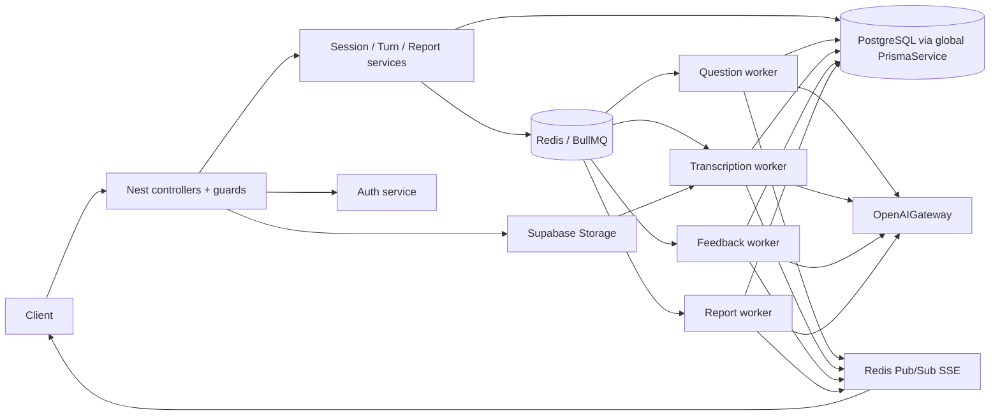

# Backend Architecture Assessment Report

**Scope & method.** Assessment completed on 2026-08-10 from the running backend source, not from README claims: 118 production TypeScript files, Nest module declarations, static import graph, Prisma schema/migration tooling, configuration, Docker runtime definition, queue processors, and the main session-to-report flows. The repository contains 47 unit specs, one integration spec and one HTTP E2E spec (368 `it(...)` cases found). No source code was changed and tests were not executed as part of this read-only assessment.

## 1. Executive Summary

- **Architecture style:** feature-oriented modular monolith, primarily layered as Controller -> Service/Use-case -> Prisma, with BullMQ workers and a concrete OpenAI/Supabase integration layer. It is not Clean/Hexagonal architecture: application code imports Prisma, BullMQ, Nest and concrete providers directly.
- **Overall score:** **67/100**.
- **Architecture maturity:** established modular monolith with meaningful workflow/reliability work, but without strong persistence/integration boundaries or production-operability foundations.
- **Biggest strengths:** well-defined interview workflow states; versioned rubric data; database foreign keys/uniques; practical async processing; idempotent upserts for feedback/reporting; AI fallback behavior.
- **Biggest risks:** (1) a runtime auth-contract mismatch blocks completed-session history and reports; (2) interview audio is exposed through a public URL; (3) DB state and queue publication are not atomic, so workflows can remain permanently stuck after a crash.
- **Most important recommendation:** first fix the P0 auth contract and restrict audio access; then add a minimal persistent outbox/reconciliation mechanism for session workflow jobs. This is a **MODERATE REFACTOR**, not a rewrite or microservice split.

The current shape is appropriate for the product: keep the modular monolith and its queues. The highest-ROI changes are targeted boundary and reliability repairs, not a generic Clean Architecture conversion.

## 2. Current Architecture Overview

| Area | Observed implementation |
|---|---|
| Framework/transport | NestJS 11, Express, REST under `/api/v1`, Swagger outside production, SSE |
| Persistence | PostgreSQL through Prisma 7 + `@prisma/adapter-pg`; global `PrismaService` with pool/connection/transaction settings |
| AuthN/AuthZ | local password authentication, JWT in HTTP-only cookie, `JwtAuthGuard`, controller-level RBAC `RolesGuard` for admin |
| Async/realtime | Redis 7, BullMQ queues: question generation, transcription, feedback, report; Redis Pub/Sub-backed SSE |
| AI | OpenAI SDK through `OpenAIGateway`, task-specific prompts/models, Zod output validation and static fallbacks |
| Storage | Supabase Storage client for audio; Nodemailer for password-reset mail |
| Validation/errors | global whitelist/transform `ValidationPipe`, DTO class validation, a global exception filter and typed application error codes |
| Runtime/deploy | Docker Compose only starts Redis; API/worker are the same Nest application, switched by `WORKERS_ENABLED`; no application/container orchestration, metrics or tracing configuration found |
| Testing | Jest/ts-jest unit tests plus one integration and one HTTP E2E flow; no architecture-test rule found |

### Architectural style actually exercised

Controllers are generally thin. Business rules live in feature services/use-case classes (`CreateInterviewSession`, `SubmitTurnAnswer`, `ChangeInterviewSessionStatus`, `EvaluateAnswer`, `GenerateComprehensiveReport`). Those classes directly inject `PrismaService`, `Queue`, `OpenAIGateway` and/or `SseService`. Therefore the practical style is **transaction-script/application-service modular monolith with asynchronous workflow adapters**, not DDD rich domain or ports-and-adapters.

The `SessionLifecyclePolicy`, rubric services, DTOs and provider gateway are useful focused abstractions. Prisma models remain the domain data model, and no repository/port boundary protects business code from ORM/provider details.

## 3. Current Architecture Diagram



### End-to-end flows used to validate the diagram

1. `POST /sessions` -> `SessionService` -> `CreateInterviewSession` validates ownership/rubric, persists `InterviewSession(generating)`, then queues `question-generation`. `QuestionGenerationProcessor` calls AI + question bank, writes questions/criteria in a transaction, marks the session active and emits SSE.
2. `POST /sessions/:id/turns` -> `SubmitTurnAnswer` checks session/question ownership and writes/upserts one `UserAnswer`. Text answers queue feedback; voice answers queue transcription. `TranscribeAnswer` retrieves audio, calls OpenAI transcription, saves metrics/transcript and queues feedback. `FeedbackProcessor` evaluates with AI, writes feedback/segments transactionally, emits SSE and asks `ReportService` to check readiness.
3. Completing a session sets `completing`; when all non-skipped answers have feedback, `ReportService` queues one report job. `GenerateComprehensiveReport` computes summaries, optionally calls AI for skipped answer/action-plan content, upserts reports and marks the session `completed` in one transaction.

## 4. Module Dependency Map

```text
AppModule
 ├─ Auth, User, Admin, SavedJobDescription
 ├─ Session ──> Assessment, Report, Redis question queue, Prisma
 ├─ Question ──> AI, Assessment, QuestionBank, QuestionCriteria, Prisma
 ├─ Turn ──> Interview, Question, QuestionCriteria, feedback/transcription queues
 ├─ Interview ──> AI, QuestionCriteria, Report, Supabase, Prisma
 ├─ Assessment ──> AI, Report, feedback queue, Prisma
 ├─ Report ──> AI, report queue, Prisma
 └─ Common (global) ──> Redis SSE; Prisma (global); Config (global)
```

| Capability | Responsibility / public API | Main dependencies | Data / external boundary | Independence |
|---|---|---|---|---|
| Auth | account, cookie JWT, password reset | Prisma, JWT, SMTP | `users`, verification codes, Nodemailer | medium |
| User/Admin | profile and account administration | Prisma, Auth guards | users/profile | high |
| Saved job description | candidate-owned job data | Prisma | job descriptions | high |
| Session | create/read/state lifecycle | Prisma, rubric, report queue | sessions/rubric | medium |
| Question | AI + fallback question generation | AI, rubric, bank, criteria, Prisma | questions + queue | medium-low |
| Turn/Interview | answer intake, audio, transcription | Prisma, queues, Supabase, OpenAI | answers/audio | medium-low |
| Assessment | rubric lookup and feedback evaluation | AI, report, Prisma, queue | rubric/feedback | medium-low |
| Report | readiness and read model/report generation | Prisma, queue, AI | reports | medium |
| Infrastructure/Common | Prisma, Redis SSE, config, errors | external libraries | DB/Redis | shared infrastructure |

Static analysis of all relative production imports found **no TypeScript import cycle**. Module declarations also show no Nest `forwardRef`/module cycle. The main hidden dependencies are global `PrismaModule`, global `AuthModule`, global `CommonModule`/`SseService`, and environment reads in provider constructors.

## 5. Architecture Scorecard

| Category | Score /10 | Weight | Weighted | Evidence-based assessment |
|---|---:|---:|---:|---|
| A. Boundaries & Modularity | 7 | 15% | 10.5 | feature modules are real, but cross-feature direct services and global ORM weaken boundaries |
| B. Application & Domain Design | 7 | 15% | 10.5 | focused use cases and lifecycle policy; ORM-centric domain and some orchestration hotspots |
| C. Code Organization | 7 | 8% | 5.6 | feature locality is good; AI/worker classes are increasingly dense |
| D. Data & Persistence | 7 | 10% | 7.0 | strong FK/unique/index baseline, but no repository boundary/outbox and some string states |
| E. Integration Architecture | 6 | 7% | 4.2 | one AI gateway and defensive validation; provider/storage remain concrete and public URL is unsafe |
| F. Async & Event Architecture | 6 | 7% | 4.2 | correct work is mostly queued with retries/idempotency; no DLQ/outbox/reconciliation/worker isolation |
| G. Reliability | 6 | 8% | 4.8 | useful fallbacks, transactions and retries; crash gaps and long sync audio path remain |
| H. Scalability & Performance | 6 | 8% | 4.8 | stateless DB/Redis design, but workers co-hosted, long provider timeouts and no capacity controls |
| I. Testability | 7 | 7% | 4.9 | broad unit coverage and critical flow tests; integration/architecture coverage is narrow |
| J. Observability | 4 | 5% | 2.0 | health + request ID + logs exist, but no correlation propagation, metrics/tracing/error tracker |
| K. Security Architecture | 5 | 5% | 2.5 | validation/JWT/roles/SSRF controls are good; sensitive data exposure and missing request throttling are material |
| L. Maintainability & Extensibility | 6 | 10% | 6.0 | recognizable feature layout; global Prisma/concrete providers amplify changes |

**Overall Architecture Score: 67/100.** Scores use code evidence above; category M below is a fitness conclusion rather than a weighted category.

## 6. Detailed Assessment

### A. Architectural Boundaries & Modularity — 7/10

**Strengths.** Modules align with business capabilities (session, turn, report, assessment, question bank). Controllers do not reach Prisma directly. Exports are mostly selective (`ReportService`, rubric/context services, audio use cases), and no circular module/import dependency was detected.

**Problems/evidence.** Most application services import global `PrismaService` directly: it has 21 static internal consumers. `TurnModule` imports `InterviewModule` and `QuestionModule`; `InterviewModule` imports `ReportModule`; `AssessmentModule` imports `ReportModule`; `QuestionModule` imports `AssessmentModule`, `QuestionBankModule` and `QuestionCriteriaModule`. `QuestionModule` exports whole child modules, unnecessarily widening its public surface. Shared infrastructure is hidden by `@Global()` modules rather than explicit feature contracts.

**Risk/recommendation.** Boundaries are understandable now but persistence and workflow concerns cut across features. Keep feature modules; narrow re-exports and introduce only targeted feature-owned data access or command interfaces where cross-module traffic is persistent.

### B. Application & Domain Design — 7/10

**Strengths.** `SessionLifecyclePolicy` centralizes allowed state transitions. `CreateInterviewSession`, `ChangeInterviewSessionStatus`, `SubmitTurnAnswer`, `EvaluateAnswer`, and `GenerateComprehensiveReport` express named use cases. Rubric version IDs, question-to-criterion links, output schemas, segment sanitizing, and score clamping protect important invariants.

**Problems/evidence.** `InterviewSession.status`, `sessionType`, answer mode and report type are strings in Prisma rather than database enums/checks. Business logic is service-centric and coupled to Prisma/queues. `GenerateSessionQuestions` (six injected collaborators) handles AI request, fallback policy, metadata normalization, criterion resolution and persistence. `FeedbackProcessor` (five collaborators) combines worker adaptation, fallback policy, persistence, reporting coordination and SSE emission.

**Risk/recommendation.** Do not introduce entities/factories wholesale. Extract only stable workflow decisions (for example report-readiness/outbox dispatch) and make state values database-protected when migration risk is acceptable.

### C. Code Organization & Responsibility Design — 7/10

**Strengths.** Feature-first folders provide good locality. `common/` holds genuine cross-cutting concerns (error filter, Swagger, request ID, maintenance), rather than domain behavior. AI prompt/schema files are co-located with AI integration.

**Problems/evidence.** `ai/pipelines/base-pipeline.service.ts` is 13.8 KB and imports 12 internal files; `report/generate-comprehensive-report.service.ts` is 21.0 KB; `ai/openai.gateway.ts` is 14.9 KB. Length alone is not a defect, but these three mix parsing/recovery/prompt orchestration and provider plumbing. The dedicated `EvaluateAnswer` duplicates part of `BasePipelineService.evaluateAnswer` responsibilities; this is an abstraction ambiguity, not yet a proven runtime defect.

**Recommendation.** Preserve small use cases. For the report, split only pure aggregation/normalization helpers from provider invocation if future report types grow; leave simple forwarding services alone.

### D. Data & Persistence — 7/10

**Strengths.** `schema.prisma` models ownership through foreign keys, cascades child data appropriately, and includes useful constraints: unique user email; one answer per question; one question order per session; report type/version uniqueness; rubric version keys; join-table primary keys. Relevant indexes exist for session lookup, job-description ownership, question selection and feedback relations. Multi-write operations use `$transaction` in user profile update, auto-skip, feedback persistence and report finalization.

**Problems/evidence.** Prisma is directly available everywhere, so any feature can cross an ownership boundary. `SavedJobDescriptionService.save()` uses find-then-create but schema has a non-unique index on `(userId, companyName, jobTitle)`: concurrent requests can create duplicates. `GenerateSessionQuestions.persistSessionQuestions()` makes one criterion lookup per question before the transaction (small current N, but an N+1 query pattern). Cross-resource DB write + queue publish is non-atomic.

**Recommendation.** Add the saved-job-description uniqueness constraint only after confirming intended duplicate semantics. Batch criterion resolution when question counts increase. Prioritize transactional outbox/reconciliation over a generic repository layer.

### E. Integration Architecture — 6/10

**Strengths.** OpenAI calls go through one `OpenAIGateway`; it chooses task model/timeouts, normalizes JSON, validates structured outputs and maps provider errors. `SpeechToText` uses HTTPS-only allow-listed hosts, rejects IP hosts, caps response size and uses an abort timeout. Supabase and SMTP configuration is centrally validated by Zod.

**Problems/evidence.** Application services depend on concrete `OpenAIGateway`, `AudioObjectStorage`, `SpeechToText` and BullMQ types. Replacing OpenAI needs changes in gateway/client plus call-site contracts; replacing Supabase needs `AudioObjectStorage` and URL-consuming speech path changes. `AudioObjectStorage.uploadInterviewAudio()` calls `getPublicUrl()` and stores/returns it, making confidential interview audio dependent on public object access.

**Recommendation.** Introduce a small `InterviewAi` and `AudioStorage` contract only if a second provider is actually planned. Immediately move audio to private objects and issue short-lived signed read URLs internally.

### F. Async & Event Architecture — 6/10

**Strengths.** Question generation, feedback, transcription and report generation are asynchronous. Fixed retries exist; feedback concurrency is configurable; deterministic job IDs are used for transcription, feedback and report. Feedback/report writes use upsert, and question persistence uses `skipDuplicates`, making redelivery mostly safe. Redis Pub/Sub keeps SSE workable across instances.

**Problems/evidence.** Queue enqueue happens after DB writes in `CreateInterviewSession.execute()` and status completion; there is no outbox, periodic reconciler or scheduler. A process crash in that gap leaves `generating`/`completing` sessions without a job. No dead-letter strategy, job timeout, queue retention policy, job telemetry or explicit worker-only process was found. `WORKERS_ENABLED=false` disables processors, but the enabled process is still the full HTTP application.

**Recommendation.** Add a minimal `workflow_outbox` table plus dispatcher/reconciler before considering Kafka/Saga. Set retention, timeout/backoff policy and alerting. Separate API and worker bootstrap/deployment without splitting the repository or services.

### G. Reliability & Failure Handling — 6/10

**Strengths.** Database startup retries and health status exist. Provider errors are mapped; AI quota/transient failures fall back to persisted feedback/report content. Feedback, transcription and report workflows either retry or insert fallback rows, allowing session completion. Key multi-table persistence operations are transactional.

**Problems/evidence.** The outbox gap is a crash-recovery hole. `UploadAndTranscribeAnswerAudio.execute()` uploads then synchronously downloads/transcribes audio inside the HTTP request; timeout/user-facing availability follows the provider. OpenAI task timeouts may reach 4–10 minutes in worker calls, with no queue-level timeout/circuit breaker. Email reset writes OTP before synchronous mail delivery; a mail failure returns an error while a valid OTP remains stored.

**Recommendation.** Enqueue audio transcription after upload and return pending state; report current status through existing SSE/progress API. Add reconciliation for stuck workflow states and explicit external-call timeout/bulkhead limits.

### H. Scalability & Performance — 6/10

**Strengths.** HTTP state is persisted in PostgreSQL/Redis, not process memory. SSE events use Redis Pub/Sub. PostgreSQL pool limits and Redis are configurable. Heavy feedback/report generation is queued; feedback worker concurrency defaults to 2.

**Bottlenecks/evidence.** At 10x traffic the first pressure point is likely OpenAI capacity/latency, followed by BullMQ worker throughput and Prisma pool capacity; not the REST controllers. Synchronous audio upload/transcription holds request resources. Worker concurrency for question/transcription/report is implicit default 1 per process; scaling API instances also scales workers unintentionally. No pagination exists for admin user listing or saved job descriptions, though current product volumes may be small.

**Recommendation.** Scale API and workers as separate process roles, with queue-specific concurrency and provider caps. Add pagination where admin/history data can become unbounded; do not introduce microservices merely for scale.

### I. Testability & Quality Assurance — 7/10

**Strengths.** There are 47 focused unit specs across auth, AI parsing, queues, session rules, storage validation and reporting, plus one session completion integration flow and one HTTP E2E flow. Most logic is injectable and mocks are concentrated in `src/test-utils/mock-factories.ts`.

**Gaps.** Core services require mocking Prisma, queues and gateways, so tests verify orchestration more than real DB constraints/transaction semantics. No architecture import rules were found. There is insufficient evidence of a real Redis/PostgreSQL/OpenAI-compatible test environment, migration test, queue redelivery test, cross-user SSE authorization test or public-audio access test.

**Recommendation.** Add characterization tests for the P0 auth contract and workflow recovery; add a small CI integration profile using PostgreSQL + Redis. Add one architecture test forbidding controller-to-Prisma imports and optionally feature-to-feature direct Prisma access.

### J. Observability & Operability — 4/10

**Strengths.** Request IDs are assigned/returned. `Logger` is used in workers/gateway. `/health` measures DB and Redis reachability/latency. AI gateway logs selected structured event JSON for malformed outputs.

**Gaps/evidence.** Request ID is never propagated into logger context, queue payloads or SSE events. Most logs are interpolated strings without common fields (`requestId`, user/session/job ID, operation, duration, error code). No metrics, traces, error tracking, queue-depth alerting, provider latency dashboard or audit trail for admin/account changes was found.

**Recommendation.** Start with JSON logs and a shared correlation context; record queue job/session IDs and durations. Then add metrics for HTTP, queue, DB and provider operations before introducing full tracing.

### K. Security Architecture — 5/10

**Strengths.** HTTP-only secure-in-production cookie, token-version invalidation, account status checks, password length/hashing, admin roles, validation whitelist, ownership checks in session/turn/report services, upload MIME/size controls, and SSRF-resistant audio fetching are all good controls. Secrets are read through validated environment configuration; no hard-coded secret was observed.

**Problems/evidence.**

- `JwtAuthGuard` assigns only `{ id, email, role }` (`auth/guards/jwt-auth.guard.ts`), while session/report controllers read `req.user.emailVerified`. `AuthenticatedUser` and Prisma `User` also lack it. This is a P0 authorization-contract defect, described in ARCH-01.
- `UserService.getProfile()` reads a full Prisma `User` and `UserController.getProfile()` returns it directly, exposing `passwordHash` in the authenticated response.
- `AudioObjectStorage` creates and returns a `getPublicUrl()` for interview recordings. This violates least privilege for highly sensitive user content unless storage policy demonstrably prevents retrieval (which would also break the current URL-based transcription path).
- `SseTokenGuard` delegates only to JWT auth; `SessionController.streamEvents()` subscribes to any supplied session channel without checking ownership.
- `@nestjs/throttler` is installed but no `ThrottlerModule`/`@Throttle` use was found. Login, registration and password-reset endpoints lack an in-code rate limit.

**Recommendation.** Correct the auth context first; project public user DTOs at every API boundary; make audio private; validate SSE session owner; add targeted rate limiting to auth and expensive creation endpoints.

### L. Maintainability & Extensibility — 6/10

**Strengths.** A developer can generally locate a feature by route/domain folder. Use-case names make major flow entry points discoverable. Interfaces/types around AI pipelines and centralized queue constants improve consistency.

**Limitations.** A new cross-cutting feature often touches Session, Turn, Assessment, Report, shared queue constants, Prisma schema and tests. Replacing Prisma affects nearly every business service. Adding a provider affects a smaller but still concrete AI/audio integration surface. REST-to-GraphQL would require controller/DTO replacement but services are mostly reusable. Moving synchronous audio fully to workers requires splitting `UploadAndTranscribeAnswerAudio` and adapting the answer state machine.

### M. Complexity & Architectural Fitness

The architecture is **not over-engineered** for an AI interview product: queues, rubric versioning, fallbacks and SSE solve actual workflow needs. It is selectively under-engineered at reliability and privacy boundaries (atomic dispatch, private media, runtime contract enforcement, telemetry). A microservice/CQRS/Event-Sourcing rewrite would add cost without resolving those root causes.

## 7. Critical Architecture Findings

### Finding ARCH-01 — Authenticated-user contract blocks history and reports

| Field | Assessment |
|---|---|
| Severity / impact / effort / priority | **Critical / High / Low / P0** |
| Location | `auth/guards/jwt-auth.guard.ts`, `auth/dto/authenticated-user.dto.ts`, `session/session.controller.ts`, `report/report.controller.ts`, `session/session.service.ts`, `prisma/schema.prisma` |
| Affected modules | Auth, Session, Report |

**Current situation and evidence.** The guard writes `request.user = { id, email, role }`. Session/Report controllers declare and pass `req.user.emailVerified`; neither `AuthenticatedUser` nor Prisma `User` declares that field. `SessionService.findById()` and `findAll()` treat falsy `canAccessHistory` as unverified, so `undefined` hides completed/completing sessions and blocks reports.

**Consequence.** Completed-session history and reports are blocked for every guarded runtime request, and TypeScript's local controller type masks the mismatch.

**Recommended direction.** Decide whether verification is a real requirement. Either remove that gate, or add a persisted verified flag plus a single canonical authenticated-user projection that all guards/controllers share. Add an HTTP characterization test before release.

### Finding ARCH-02 — Interview audio access is designed around public object URLs

| Field | Assessment |
|---|---|
| Severity / impact / effort / priority | **High / High / Medium / P0** |
| Location | `interview/audio-object-storage.service.ts` |
| Affected modules | Interview/Turn, Supabase Storage |

**Evidence.** Upload uses a user/session path but immediately calls `storage.getPublicUrl(objectPath)` and persists/returns `audioFileUrl`. Audio URLs then pass through answer DTO/job payload and are fetched later by transcription.

**Why it matters.** Interview recordings are sensitive personal data. Object-path obscurity is not authorization, and public URLs can be copied, logged or retained.

**Recommended direction.** Use a private bucket; persist object key only; generate short-lived signed URL internally for the worker (or stream through a storage adapter). Verify bucket policy and revoke existing public objects as a coordinated data/security operation.

### Finding ARCH-03 — Workflow state and job publication have no durable atomic handoff

| Field | Assessment |
|---|---|
| Severity / impact / effort / priority | **High / High / Medium / P1** |
| Location | `session/create-interview-session.service.ts`, `session/change-interview-session-status.service.ts`, `report/report.service.ts` |
| Affected modules | Session, Question, Assessment, Report, Redis |

**Evidence.** Session is committed as `generating` before `queue.add(question-generation)`. Completion commits `completing` before report enqueue. Catch blocks handle observed enqueue errors, but cannot cover a process/database/Redis crash between the two operations; no outbox/reconciler/scheduler was found.

**Consequence.** A session can remain indefinitely in `generating` or `completing`, with no job to resume it.

**Recommended direction.** Persist a pending workflow command in the same DB transaction; dispatch it to BullMQ and mark it sent. Reconcile unsent/expired states periodically. This is smaller and safer than distributed transactions or a Saga framework.

### Finding ARCH-04 — Sensitive password hash is returned from profile endpoint

| Field | Assessment |
|---|---|
| Severity / impact / effort / priority | **High / High / Low / P0** |
| Location | `user/user.service.ts`, `user/user.controller.ts` |
| Affected modules | User, Auth |

**Evidence.** `getProfile()` does `user.findUnique(... include: { profile: true })` with no `select`; the Prisma user includes `passwordHash`. Controller returns it unprojected.

**Recommended direction.** Select/project a public profile DTO only. Add a contract test that rejects `passwordHash`, `tokenVersion`, verification-code data and other internal fields.

### Finding ARCH-05 — Async operation management lacks terminal failure handling and isolation

| Field | Assessment |
|---|---|
| Severity / impact / effort / priority | **High / Medium-High / Medium / P1** |
| Location | queue modules/processors, `app.module.ts`, `docker-compose.yml` |
| Affected modules | Question, Interview, Assessment, Report, Runtime |

**Evidence.** Jobs have fixed retry counts but no dead-letter queue, explicit job timeout, retention policy or queue operational metric. Workers run inside the main Nest app by default; Docker Compose declares only Redis.

**Recommended direction.** Add explicit failed-job retention/DLQ/replay runbook, queue timeouts and separate API/worker process roles. Keep BullMQ and Redis.

## 8. Dependency Hotspots

Static import graph counts exclude external framework imports; "dependents" is the count of direct internal importing files.

| Component | Dependencies / dependents | Problem | Risk |
|---|---:|---|---|
| `PrismaService` | 2 / 21 | global ORM is the de facto shared repository | high change amplification / boundary bypass |
| `ReportService` | 9 / 6 | access control, read model, readiness and queue dispatch in one service | high workflow coupling |
| `OpenAIGateway` | 4 / 9 | concrete provider integration is a common dependency | provider outage/change blast radius |
| `GenerateSessionQuestions` | 10 imports; 6 injected collaborators | AI/fallback/metadata/criteria/persistence orchestration | medium-high cohesion risk |
| `FeedbackProcessor` | 12 imports; 5 injected collaborators | worker, fallback, persistence, event and report coordination | medium-high change hotspot |
| `TranscribeAnswer` | 11 imports; 7 injected collaborators | transcription, feedback dispatch, fallback, SSE, report readiness | high coupling |
| `GenerateComprehensiveReport` | 8 imports; 21 KB | report aggregation + AI + persistence + event | medium-high future feature hotspot |
| `AppModule` | 18 imports | valid composition root, not a business hotspot | low; keep as composition root |

## 9. God Components

No controller is a God Controller: controllers largely delegate. No module is a clear God Module. These are **watch-list components**, not automatic split candidates.

| Component | Current responsibilities | Why boundary conflicts | Suggested boundary |
|---|---|---|---|
| `GenerateSessionQuestions` | retrieve rubric, invoke AI, fallback bank selection, normalize metadata, map criteria, persist | generation policy and persistence evolve for different reasons | keep one use case; extract pure question-plan builder if more policies appear |
| `FeedbackProcessor` | queue adaptation, evaluation, fallback, transactional write, SSE, report triggering | retry/event/report-readiness behavior is outside evaluation | retain processor; move dispatch/readiness to a workflow dispatcher/outbox |
| `TranscribeAnswer` | download/transcribe, metrics, answer persistence, feedback dispatch, fallback, SSE | combines two queues and terminal-state policy | keep as workflow orchestrator; isolate persistence/dispatch only when adding more media flows |
| `GenerateComprehensiveReport` | aggregate scores, skipped-answer prompt, action-plan prompt, normalize, upsert reports, complete session | AI content generation and report projection are separable | extract pure report aggregation/normalization; do not split merely for file length |

## 10. Circular Dependencies

**No significant circular dependencies detected.** The static graph of relative TypeScript imports found none, and Nest module declarations do not use `forwardRef`.

Logical coupling remains: Session completion triggers Report; Feedback and Transcription also trigger Report readiness. This is a deliberate shared workflow dependency, not a cycle. A durable workflow dispatcher would make that relationship more explicit.

## 11. Business Logic Distribution

| Location | Observed logic | Assessment |
|---|---|---|
| Controllers/guards | routing, DTO entry, auth/roles, thin delegation | generally appropriate; SSE lacks ownership check |
| Use-case/services | session transitions, ownership, limits, question strategy, feedback/report orchestration | main correct home, but directly infrastructure-coupled |
| Policy/pure helpers | lifecycle transitions, rubric score mapping, metadata/segments | good, testable extraction |
| Prisma/schema | ownership relation, uniqueness, FK cascade, indexes | strong structural protection; business states are weakly typed strings |
| Workers | retries/fallback/dispatch and SSE updates | appropriate workflow adapter role, though some business orchestration has accumulated here |

## 12. Changeability Analysis

| Scenario | Current difficulty | Affected components | Target direction |
|---|---|---|---|
| Replace DB/ORM | High | nearly every feature service/use case + Prisma types/schema | introduce narrow feature data gateways only at frequently changed seams; do not wrap every CRUD now |
| Replace AI provider | Medium | `OpenAIGateway`, clients, `SpeechToText`, pipeline/evaluation/report callers | keep gateway, expose task-level interface if replacement is funded |
| REST -> GraphQL | Medium | controllers/DTO/Swagger primarily; services reusable | retain use cases, add transport adapters |
| Add substantial interview feature | Medium | Session/Turn/Assessment/Report/schema/queue/tests | add inside existing capability; use workflow command for cross-boundary async effects |
| Move audio work to worker | Medium | Turn upload, Interview workflow, answer status/API | split upload from transcription and publish durable job |
| Horizontal scale | Medium | runtime deployment, worker concurrency, SSE/queue limits | separate API/worker roles; existing DB/Redis supports it |

## 13. Scalability Assessment

| Traffic level | Likely first bottleneck | Evidence / response |
|---|---|---|
| Current/10x | AI latency/quota and worker backlog | feedback concurrency default is 2; task timeouts are minutes; jobs are correct scale unit |
| 10x | synchronous audio HTTP path, Prisma pool, Redis worker throughput | upload endpoint calls external transcription synchronously; pool default max is 5 |
| 100x | provider quota, queue storage/retention, DB reporting reads, SSE connection capacity | no queue retention/metrics/worker role split; report reads load nested answers/segments |

API, feedback workers, transcription workers, report workers and question workers can scale independently **as process roles**, while remaining one deployable codebase. Do not split them into separate services until there is independent ownership/deployment need.

## 14. Reliability Assessment

| Failure | Current handling | Risk | Recommendation |
|---|---|---|---|
| DB unavailable at startup | bounded retry; API starts degraded; health reports down | medium | alert on degraded and define request behavior while DB remains down |
| Redis enqueue failure | catches observed failure and often marks session error/reverts status | medium | durable outbox for crash-safe publication |
| Process crash after DB commit, before enqueue | no recovery found | high | outbox + scheduled/reconciler dispatch |
| OpenAI transient/rate/quota failure | gateway retry, worker retries, feedback/report fallbacks | medium | circuit/bulkhead metrics and per-job timeout |
| Supabase/audio download failure | validation, timeout, retry through transcription job then fallback | medium | private signed objects and failure alerting |
| Worker crash/redelivery | mostly safe through deterministic IDs/upsert/skipDuplicates | low-medium | test crash points and retain failed jobs for investigation |
| Duplicate job | feedback/report/transcription idempotent; question writes deduplicate but still may repeat AI call | low-medium | set question job ID + durable dispatch record |

## 15. Testability Assessment

Unit-level testability is good for pure rules and injectable services. Infrastructure coupling makes orchestration tests mock-heavy. Integration/E2E coverage exists but is too narrow to verify schema constraints, Redis behavior, migrations, worker redelivery, auth context, media privacy and outbox recovery. Add those behavior tests before large refactors; they are the Phase 0 safety net.

## 16. Observability Assessment

Production debugging is currently partial: a request ID is returned, health exposes DB/Redis latency, and workers log errors, but the same ID is not carried to a job or provider call. There is insufficient evidence of metric export, tracing, an error-tracking sink, queue dashboards/alerts or audit records. The next baseline should be structured log fields (`requestId`, `sessionId`, `answerId`, `jobId`, operation, duration, errorCode) and counters/histograms for request/queue/provider/DB outcomes.

## 17. Security Architecture Assessment

| Boundary | Assessment |
|---|---|
| Authentication | JWT cookie + token version/account status are sound; the authenticated-user projection contract is broken (ARCH-01). |
| Authorization | ownership checks are good in Session/Turn/Report; admin roles are controller protected; SSE does not verify channel/session ownership. |
| Validation | global whitelist DTO validation plus service rules; good trust-boundary baseline. |
| Secrets | Zod checks required environment values; no secret value appears in this report. |
| Sensitive data | password hash returned by profile API; audio URL is public-by-design; needs P0 correction. |
| Abuse prevention | no in-code throttling despite dependency; add it to auth/session creation/expensive endpoints. |

## 18. Maintainability Assessment

A new developer can find most code quickly because it is feature-oriented and routes use business names. They will have more difficulty determining a safe change path for lifecycle/async work: completion/report logic is shared across Session, Feedback, Transcription and Report; Prisma is globally reachable; authenticated-user fields are locally re-declared instead of canonical. Clarifying those three seams will improve onboarding more than moving every file into generic `domain/application/infrastructure` folders.

## 19. Architecture Stress Test Results

| Stress test | Result | Risk |
|---|---|---|
| ST1 Add large business feature | typically 3–6 feature modules plus schema/queue/tests | medium |
| ST2 Replace DB/ORM | broad impact due direct Prisma in 21 consumers | high |
| ST3 Replace AI provider | gateway/client plus speech/pipeline/report callers | medium |
| ST4 Independent unit test | pure policies/helpers yes; use cases need mocks | medium |
| ST5 Circular dependency | none detected statically | low |
| ST6 Main business logic | feature services/use cases and workers | acceptable |
| ST7 God services/modules | no clear God Module; four workflow/service watch-list components | medium |
| ST8 Mid-workflow failure | retries/fallback help; crash between DB and queue cannot recover | high |
| ST9 Request/job rerun | feedback/transcription/report mostly idempotent; question avoids duplicate rows but may repeat AI call | low-medium |
| ST10 10x traffic | AI/provider + worker backlog, then synchronous audio/pool | high |
| ST11 Independent scaling | API and each queue worker are candidates, not yet separately bootstrapped | medium |
| ST12 Production diagnosis | health/logs help, correlation/metrics/tracing insufficient | high |
| ST13 New developer finds change location | feature folders help; workflow/shared-global dependencies slow them | medium |
| ST14 Change one module locally | CRUD modules mostly yes; interview workflow changes cross modules | medium |

## 20. What Should NOT Be Refactored

- Keep the modular-monolith deployment model and feature folders. It matches current product complexity.
- Keep BullMQ/Redis asynchronous boundaries for AI generation, feedback, transcription and reports.
- Keep `SessionLifecyclePolicy`, rubric versioned data and session-question criterion snapshot links; they protect real evaluation invariants.
- Keep the single `OpenAIGateway` as the provider choke point; improve its contract only when provider replacement is a real requirement.
- Keep fallback feedback/report behavior and transactional feedback/report persistence; they materially reduce user-visible failure.
- Keep `SpeechToText` host allow-list, HTTPS-only validation and response-size enforcement.

## 21. Recommended Target Architecture

**Remain:** Nest feature modules, Prisma/PostgreSQL, BullMQ/Redis, the existing use-case classes, rubric/version model, AI gateway and SSE.

**Change:** make authenticated user a single DTO/projection; make media private; add a durable workflow command/outbox and reconciliation; separate API/worker process roles; add structured observability. Narrow `QuestionModule` re-exports and forbid controllers from data access.

**Split only where justified:** separate pure report aggregation from external AI invocation if report complexity grows; separate upload from asynchronous transcription now because the current HTTP boundary is long-running. Do not merge independent modules or create repositories/interfaces for simple single-feature CRUD.

**Reverse only critical dependencies:** business workflow code should request a durable `WorkflowDispatcher` command rather than calling BullMQ directly at DB-commit sites. Infrastructure owns dispatch to BullMQ. This solves the actual crash gap; it is not a broad Clean Architecture rewrite.

## 22. Proposed Target Folder Structure

```text
server/src/
├─ auth/
│  └─ authenticated-user.ts          # single runtime/type projection
├─ session/
│  ├─ create-interview-session.service.ts
│  ├─ session-lifecycle.policy.ts
│  └─ workflow/                      # session-specific commands only
├─ turn/
│  └─ upload-audio.service.ts        # upload + return pending; no transcription
├─ interview/
│  ├─ transcription.worker.ts
│  └─ audio-storage.service.ts       # private object key / signed read
├─ workflow/
│  ├─ outbox.service.ts
│  ├─ outbox.dispatcher.ts
│  └─ workflow-outbox.model.ts
├─ assessment/  question/  report/   # preserve existing feature ownership
├─ infrastructure/
│  ├─ database/prisma/
│  ├─ queue/bullmq-dispatcher.ts
│  ├─ storage/supabase-audio-storage.ts
│  └─ observability/
└─ common/                            # only genuine cross-cutting utilities
```

This is deliberately additive and feature-specific; it is not a generic layered template.

## 23. Before vs After Dependency Architecture

```text
CURRENT
Session/Turn/Feedback/Report --> Prisma
Session/Turn/Feedback/Report --> BullMQ Queue
Workers --> Prisma + SSE + ReportService

TARGET
Session/Turn/Feedback/Report --> Prisma transaction + WorkflowOutbox
Workflow dispatcher (infrastructure) --> BullMQ
Workers --> use case --> Prisma + WorkflowOutbox
API/Worker bootstrap --> same feature modules, separate process roles
```

## 24. Refactoring Roadmap

| Phase | Goal / changes | Affected modules | Risk / prerequisite / expected benefit |
|---|---|---|---|
| 0 — Safety net | characterize auth context, profile response, SSE ownership, queue crash/retry and audio access | Auth, User, Session, Report, Interview | low; CI test setup; prevents regressions |
| 1 — P0 security/correctness | canonical authenticated user; remove sensitive projection; private audio/signed worker read; SSE ownership; throttle abuse endpoints | Auth, User, Turn, Interview, Session | medium; storage migration plan; closes active defects |
| 2 — Durable dispatch | workflow outbox + idempotency keys + reconciliation of generating/completing states | Session, Report, Question, Assessment, Interview | medium; schema migration; recovers crashes |
| 3 — Runtime isolation | API/worker bootstrap roles, queue timeout/retention/DLQ/replay runbook | App/runtime/queues | medium; deployment capacity; independent scaling |
| 4 — Boundary cleanup | narrow module exports, explicit workflow dispatcher, optional private data gateways for hot seams | Question, Session, Report | medium; after characterization; lowers coupling |
| 5 — Observability | structured logging/context, metrics, alerts, error tracking, audit events | all runtime modules | low-medium; infrastructure choice; faster diagnosis |
| 6 — Optional future | provider port only for funded second provider; DB gateway only when ORM replacement is planned | AI, storage, persistence | medium-high; actual business driver; avoids speculative abstraction |

## 25. Prioritized Action Plan

| Priority | Change | Impact | Effort | Risk | Timing |
|---|---|---|---|---|---|
| P0 | Repair `emailVerified` contract and add HTTP test | High | Low | Low | immediately, before release |
| P0 | Stop exposing `passwordHash` from profile | High | Low | Low | immediately |
| P0 | Move interview audio away from public URLs | High | Medium | Medium | immediately with storage migration |
| P1 | Add session ownership check to SSE | Medium | Low | Low | immediately |
| P1 | Add targeted auth/expensive-route throttling | High | Low | Low | immediately |
| P1 | Transactional outbox + stuck-workflow reconciler | High | Medium | Medium | next reliability iteration |
| P1 | Worker role split, DLQ/retention/timeouts | High | Medium | Medium | before material traffic growth |
| P2 | Structured logs, metrics and alerting | High | Medium | Low | next operations iteration |
| P2 | DB constraints/enums for lifecycle states; decide saved-JD uniqueness | Medium | Medium | Medium | planned migration |
| P3 | Provider/persistence ports | Medium | Medium-High | Medium | only with replacement requirement |

## 26. Top 10 Architectural Improvements

| # | Problem | Change | Benefit | Effort | Risk |
|---:|---|---|---|---|---|
| 1 | broken auth contract | one canonical authenticated-user shape | restores history/report behavior | low | low |
| 2 | password hash API exposure | explicit public profile select/DTO | removes sensitive disclosure | low | low |
| 3 | public interview media | private bucket + signed internal reads | protects candidate recordings | medium | medium |
| 4 | DB/queue crash gap | transactional outbox + reconciler | no permanently stuck workflows | medium | medium |
| 5 | SSE cross-tenant subscription | session owner authorization in SSE guard | closes data/event leakage | low | low |
| 6 | brute-force/cost abuse | route throttling | protects auth and AI budget | low | low |
| 7 | co-hosted worker scaling | API/worker process roles | predictable capacity/scaling | medium | medium |
| 8 | opaque failure behavior | queue timeout/DLQ/retention/replay | recoverable operations | medium | medium |
| 9 | weak production diagnosis | correlated structured logs + metrics | faster incident response | medium | low |
| 10 | workflow coupling | dispatcher/outbox contract + narrower exports | safer local change | medium | medium |

## 27. Final Verdict

**Current architectural maturity:** solid feature-oriented modular monolith with meaningful asynchronous workflow design.

**Overall architecture quality:** good foundation, currently held back by a few high-impact boundary and operational defects rather than widespread design failure.

**Can it grow?** Yes, after P0/P1 reliability, privacy and runtime-role work. Keep it monolithic while ownership and deployment remain one team/product.

**Biggest technical debt:** non-atomic database-to-queue workflow dispatch.

**Biggest architectural strength:** explicit interview lifecycle plus versioned rubric/feedback pipeline with graceful AI fallbacks.

**Most important next action:** correct the canonical authenticated-user contract, then ship the profile/audio privacy fixes before any broader refactor.

**Decision: MODERATE REFACTOR.** A rewrite would discard valuable workflow/rubric/fallback behavior. A narrowly phased refactor resolves the actual architectural blockers at substantially lower migration and delivery risk.
