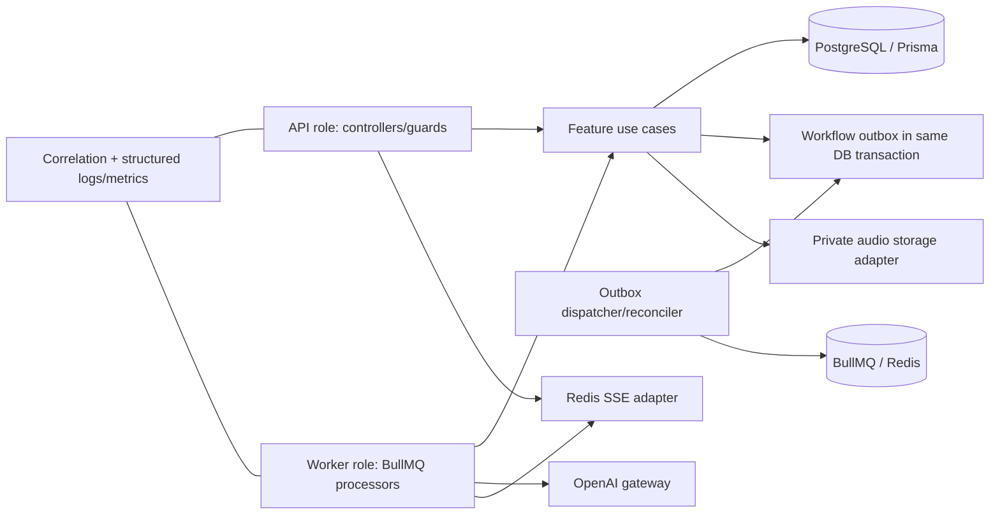
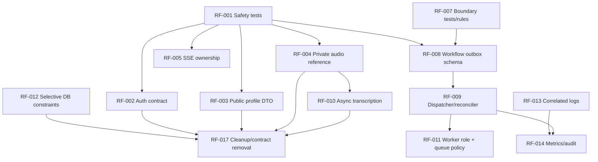

# Backend Refactoring Master Plan

**Status:** planning only. This document does not authorize implementation, database migration, commit, or API change. It is based on `BACKEND_ARCHITECTURE_ASSESSMENT.md` and a source revalidation on 2026-08-10 of the P0/P1 code paths.

## 1. Executive Summary

| Item | Plan |
|---|---|
| Current Architecture Score | 67/100 |
| Target Architecture | feature-oriented modular monolith; explicit workflow dispatch, private media, canonical auth context, separate API/worker roles |
| Findings | 15 total: 1 Critical, 4 High, 8 Medium, 1 Low, 1 accepted/positive finding |
| Estimated Refactor Complexity | L overall; no component replacement or microservice migration required |
| Critical Path | RF-001 -> RF-002/RF-003/RF-004 -> RF-008 -> RF-009 -> RF-011 |
| Highest Risk Area | durable workflow delivery from PostgreSQL state to BullMQ, plus private-audio compatibility migration |
| Highest ROI Improvement | fix the canonical auth contract and then introduce a transactional workflow outbox |

This is an incremental refactor. Keep the existing NestJS feature modules, Prisma, PostgreSQL, Redis/BullMQ, rubric model, AI gateway and graceful fallback behavior. The plan changes the unsafe or unreliable seams around them; it does not impose DDD, Clean Architecture, CQRS, Kafka or microservices.

## 2. Refactoring Goals

1. Restore correct completed-session/report access and prevent sensitive-data exposure.
2. Make every workflow command durable before it becomes a BullMQ job.
3. Preserve REST behavior during structural work; explicitly version only unavoidable audio changes.
4. Make API and worker workloads deployable/scalable as separate roles in one codebase.
5. Improve locality of change by constraining cross-feature dependencies, not by wrapping all Prisma CRUD.
6. Establish tests, correlation and operational signals before moving high-risk behavior.

## 3. Architectural Principles

- Feature ownership remains primary: Session owns lifecycle; Turn owns answer intake; Interview owns media/transcription; Assessment owns evaluation; Report owns report projection; Workflow owns durable dispatch.
- Controllers authenticate, validate and delegate. They never access Prisma or queue clients.
- Use cases may access their own data through Prisma during this plan. Cross-feature database tables are accessed only through the owning module's public use case/contract.
- Infrastructure implements concrete queue/storage/AI delivery. It does not contain business decisions.
- A database state transition that requires asynchronous work writes an outbox command in the same transaction.
- Keep AI provider abstraction at the existing `OpenAIGateway` boundary; do not add a generic provider hierarchy without a funded second provider.
- Use expand -> migrate -> contract for database changes. No destructive migration in the first deployment of a change.
- Every behavior-moving task starts with characterization tests and ends with measurable acceptance checks.

## 4. Finding Inventory

| ID | Finding | Severity | Components | Root cause | Dependency / disposition |
|---|---|---|---|---|---|
| ARCH-01 | Authenticated user has no `emailVerified`, but Session/Report treat it as an access capability | Critical | Auth, Session, Report | locally re-declared request type instead of canonical runtime projection; no email-verification domain feature | RF-001, RF-002; **fix** |
| ARCH-02 | Interview recording uses public storage URL | High | Turn, Interview, Supabase | storage contract uses URL as identity and worker input | RF-001, RF-004, RF-010; **fix** |
| ARCH-03 | DB state then queue publish is non-atomic | High | Session, Report, queues | no durable command/outbox/reconciler | RF-001 -> RF-008 -> RF-009; **fix** |
| ARCH-04 | Profile API returns Prisma `User`, including password hash | High | User, Auth | no output projection at API boundary | RF-001 -> RF-003; **fix** |
| ARCH-05 | Queues lack DLQ/retention/timeout and workers co-host with API | High | App, Question, Interview, Assessment, Report | runtime role and queue operations unspecified | RF-009 -> RF-011; **fix** |
| ARCH-06 | SSE authorizes token but not session ownership | Medium | Session, Auth, SSE | guard lacks route-resource authorization | RF-001 -> RF-005; **fix** |
| ARCH-07 | Auth and expensive routes have no throttling | Medium | Auth, Session, Turn | throttler dependency unused; no abuse policy | RF-006; **fix** |
| ARCH-08 | Prisma is a global persistence boundary with 21 direct consumers | Medium | most feature services | incremental modular monolith evolved without explicit ownership rules | RF-007; targeted reduction only |
| ARCH-09 | Upload endpoint performs storage upload and transcription synchronously | Medium | Turn, Interview | upload and long-running transform are one use case | RF-004 -> RF-010; **fix** |
| ARCH-10 | no durable recovery / queue operations visibility | Medium | queues, runtime | retry exists but terminal handling/replay is absent | RF-009 -> RF-011/RF-014; **fix** |
| ARCH-11 | correlation, metrics, tracing and audit visibility are insufficient | Medium | common, workers, runtime | request ID is not propagated and no telemetry contract | RF-013 -> RF-014; **fix** |
| ARCH-12 | string lifecycle fields and saved-JD find-then-create leave constraint/race gaps | Medium | Prisma, Session, SavedJobDescription | schema does not enforce all application invariants | RF-012; **conditional fix** |
| ARCH-13 | critical integration/architecture tests are narrow | Medium | tests/CI | mocks dominate orchestration verification | RF-001, RF-007, RF-008; **fix** |
| ARCH-14 | selected orchestration services are dense; pipeline evaluation responsibility overlaps | Low | Question, Assessment, Report, AI | workflow complexity, not indiscriminate bad splitting | RF-016; **defer until metrics/change pressure** |
| ARCH-15 | no import/module cycle; existing feature modules and AI fallback are sound | N/A | all | positive finding | **KEEP / no refactor** |

**Finding relationships.** ARCH-01 must be repaired before security/behavior regression tests can be trusted. ARCH-02 and ARCH-09 share the same URL-as-media-identity root cause and are solved together by RF-004/RF-010. ARCH-03 is a prerequisite for reliable job recovery and makes part of ARCH-05/10 obsolete as a manual recovery concern. ARCH-08 does not justify a repository-pattern rewrite; RF-007 limits new leakage. ARCH-14 is deliberately deferred because RF-008/RF-010 lower the real orchestration coupling first.

## 5. Root Cause Analysis

| Finding | Symptom | Root / architectural cause | Recommended resolution |
|---|---|---|---|
| ARCH-01 | all guarded report/history calls receive a falsy `emailVerified` | `JwtAuthGuard` creates `{id,email,role}`; controllers assert a richer local type; Prisma has no verification field/flow | use `AuthenticatedUser` everywhere and remove the unsupported verification gate. A real verified-email feature is separate feature scope. |
| ARCH-02/09 | public audio URL leaks; request waits for provider transcription | URL is both user-facing transport and persistent media identity | private object key is canonical; sign only when a client/worker needs a read; queue transcription after upload. |
| ARCH-03 | sessions can remain `generating`/`completing` after crash | DB and Redis have no shared transaction; no recovery source of truth | transactional outbox + idempotent dispatcher + reconciliation query. |
| ARCH-04/06/07 | output/stream authorization gaps and abuse exposure | security policy is unevenly enforced at boundary | explicit output DTO, resource guard, and targeted throttling policy. |
| ARCH-05/10 | failed/slow jobs are difficult to control and API scaling scales workers accidentally | processor registration is tied to application bootstrap; queue policy is partial | explicit API/worker roles plus shared queue defaults, retention, failure/replay and telemetry. |
| ARCH-08/12/13 | changes spread across features and DB behavior is under-verified | global ORM is convenient but ungoverned; tests do not enforce seams | architecture fitness rules, owning-module contracts, focused DB integration tests and selective constraints. |
| ARCH-11 | incidents cannot be reconstructed end-to-end | request ID stops at HTTP middleware; signals are unstructured | correlation context carried to job payload/logs, then metrics/error/audit signals. |

## 6. Target Architecture

### Responsibilities and contracts

| Module | Responsibility / owns | Depends on | Exposes |
|---|---|---|---|
| Auth | canonical `AuthenticatedUser`, token/cookie/session policy | Prisma, JWT, SMTP | guards and `AuthenticatedUser`; no persistence model exposure |
| User/Admin | public user/profile projections and account changes | Auth, Prisma | public DTOs only |
| Session | session lifecycle and durable commands for question/report work | Rubric, Workflow, Prisma | session query/use cases and authorization helper |
| Turn | answer submission and answer state | Session authorization, Workflow, Prisma | answer use cases; no direct speech call |
| Interview | private media object management and transcription worker | storage adapter, AI gateway, Workflow, Prisma | media reference / transcription use cases |
| Question | generate/persist session questions from a workflow command | AI, rubric, bank, criteria, Prisma | worker use case |
| Assessment | evaluate answer and persist feedback | AI, rubric, Workflow, Prisma | worker use case |
| Report | report readiness/projection | Workflow, AI, Prisma | report query/use case |
| Workflow | `WorkflowOutbox` command schema, dispatch, reconciliation | Prisma, BullMQ adapter | `enqueueInTransaction` / dispatcher only |
| Infrastructure | Prisma, BullMQ, Redis SSE, Supabase, OpenAI, telemetry | external libraries | implementation details |

### Dependency direction

```text
HTTP/SSE controllers and guards
       -> feature use cases
       -> feature policy + owned data access + Workflow command

Worker adapters -> feature use cases -> Workflow command
Infrastructure adapters -> external DB/Redis/AI/storage
```

No feature domain policy may import Nest controller APIs, BullMQ, Supabase or OpenAI. Existing application use cases may still use Prisma where they own the data; a full persistence-port layer is explicitly out of scope.

## 7. Target Architecture Diagram



## 8. Target Module Boundaries

| Boundary | Current -> target change | Public contract |
|---|---|---|
| Auth -> other modules | controller-local user types -> one auth DTO | `AuthenticatedUser { id, email, role }`; no phantom verification property |
| Session/Report -> queue | direct `Queue.add()` after state change -> workflow outbox command | `WorkflowOutbox.enqueue(tx, command)` |
| Turn -> Interview | upload/transcribe synchronous service -> upload returns durable media reference; worker transcribes | `AudioReference { objectKey, ... }` internal; compatibility URL only temporary |
| Feature -> Prisma | unrestricted global reach -> no new cross-feature table access | owning feature use case/service; direct own-table Prisma retained initially |
| API -> user data | Prisma entity -> response DTO/select | `PublicProfileDto`, `PublicUserDto` |
| Session SSE -> realtime | token-only stream -> resource-authorized stream | `SessionAccess.assertOwner(sessionId, userId)` |

## 9. Target Dependency Rules

**Allowed**

- Controller/guard -> its feature use case and Auth guard.
- Feature use case -> its policy/helpers, own Prisma models, Workflow command contract.
- Worker -> one feature use case plus observability/SSE adapter.
- Feature -> public export of another feature module, never its internal file.
- Infrastructure -> external SDKs and implements workflow/storage/AI adapter behavior.

**Forbidden (enforced after RF-007)**

- `*.controller.ts` -> `PrismaService`, `Queue`, OpenAI or Supabase.
- Feature A -> non-exported file inside feature B.
- Session/Turn/Assessment/Report -> `Queue.add()` outside Workflow dispatcher during state-mutating flows.
- Domain/policy/helper -> Nest HTTP types, Prisma client, BullMQ or external SDKs.
- API response -> Prisma `User`/credential-bearing persistence model.
- SSE endpoint -> subscribe without route-resource authorization.

## 10. Proposed Folder Structure

```text
src/
├─ auth/
│  ├─ authenticated-user.ts       # canonical request user contract
│  └─ guards/
├─ workflow/
│  ├─ workflow-outbox.service.ts  # DB command creation
│  ├─ workflow-dispatcher.ts      # BullMQ adapter + idempotency
│  └─ workflow-reconciler.ts      # stalled-command recovery
├─ interview/
│  ├─ audio-storage.service.ts    # private object key and signed read
│  ├─ upload-audio.service.ts
│  └─ transcription.processor.ts
├─ infrastructure/
│  ├─ database/prisma/
│  ├─ queue/
│  ├─ realtime/redis/
│  └─ observability/
├─ session/  turn/  question/  assessment/  report/
└─ common/                         # errors, middleware, Swagger only
```

`workflow/` contains durable cross-feature command delivery, not generic business services. `infrastructure/` contains SDK adapters, not application policies. Existing feature folders retain their controllers, DTOs, policies and use cases; do not mass-move them into artificial `domain/application` directories.

## 11. Architecture Gap Analysis

| Area | Current | Target | Gap |
|---|---|---|---|
| Auth contract | local types disagree with guard runtime data | one canonical projection | RF-002 |
| Sensitive output/media | full user model and public audio URL | DTO projection and private object identity | RF-003/RF-004 |
| Workflow delivery | DB commit then best-effort queue call | transactional command + dispatcher/reconciler | RF-008/RF-009 |
| Async boundary | transcription inside HTTP upload | upload synchronous, transform queued | RF-010 |
| Runtime | full app hosts APIs and processors | separately booted API/worker roles | RF-011 |
| Dependency governance | global Prisma and wide exports | owner contracts + import rules | RF-007 |
| Operability | isolated logs/health only | correlated logs, queue/provider metrics, audit | RF-013/RF-014 |
| DB invariants | application strings/find-then-create | selectively enforced constraints | RF-012 |

## 12. Refactoring Dependency Graph



## 13. Refactoring Phases

| Phase / deployment wave | Tasks | Deployable outcome |
|---|---|---|
| Phase 0 / Wave A — safeguard | RF-001, RF-007 | tests and dependency baseline; no production behavior change |
| Phase 1 / Wave B — P0 security/correctness | RF-002 through RF-006 | restored access, no credential exposure, protected streams/routes; deploy independently |
| Phase 2 / Wave C — durable workflow foundation | RF-008, RF-009 | outbox can coexist with direct dispatch during controlled cutover |
| Phase 3 / Wave D — media/workers | RF-004 contract completion, RF-010, RF-011 | private media and independently scalable workers |
| Phase 4 / Wave E — data/operations | RF-012, RF-013, RF-014, RF-015 | stronger constraints and production diagnosis |
| Phase 5 / Wave F — cleanup | RF-016, RF-017 | remove only proven obsolete paths |

## 14. Detailed Refactoring Tasks

### RF-001 — Characterize critical current behavior

**Class:** SAFEGUARD/TESTING. **Priority/size/risk:** P0 / M / Low.

**Goal and findings:** protect ARCH-01/02/03/04/06/13 before code moves.

**Current -> target:** add behavior tests without changing production behavior. Cover JWT request projection; session list/get/report authorization; profile serialization; cross-user SSE denial; audio upload/reference behavior; session creation/completion crash points; retry/idempotent feedback/report handling.

**Files/components:** auth/session/report/user/interview specs; `test/` HTTP and integration configurations; test-only PostgreSQL/Redis profile if not present.

**Dependencies:** Requires none. Blocks RF-002/003/004/005/008/010. Can run parallel with RF-006/013 planning.

**Risk:** implementation Low; regression Low; data None; deployment None; architecture impact High safeguard.

**Testing/validation:** tests must fail against the known defects where applicable and pass after their repair. Record API status/body snapshots for login, profile, session history/report, upload, submit and SSE authorization.

**Rollback:** test-only revert. **DoD:** critical flows have deterministic tests without external OpenAI; one PostgreSQL+Redis integration test verifies duplicate dispatch/retry behavior; CI runs them.

### RF-002 — Establish canonical authenticated-user contract

**Class:** SECURITY/STRUCTURAL. **Priority/size/risk:** P0 / S / Medium.

**Goal and findings:** resolve ARCH-01.

**Current -> target:** use exported `AuthenticatedUser` in guards/controllers; guard assigns exactly that shape. Remove the unsupported `emailVerified` gate from Session/Report because schema and product flow do not implement verification. A future verified-email capability is a separate FEATURE with schema, verification flow and explicit policy.

**Files/components:** `auth/dto/authenticated-user.dto.ts`, JWT/SSE guards, session/report controllers/services and their tests.

**Dependencies:** Requires RF-001. Blocks RF-017. Can run parallel with RF-003/005/006.

**Risk:** implementation Low; regression Medium (restores formerly blocked behavior); data None; deployment Low.

**Testing/validation:** authenticated candidate can list completed session, fetch its report, and cannot access another user's data. Type checking has no local `emailVerified` user shape.

**Rollback:** git revert; no data migration. **DoD:** no runtime code accesses `req.user.emailVerified`; one shared auth-user type is used at all guarded session/report boundaries.

### RF-003 — Project public user/profile responses

**Class:** SECURITY/STRUCTURAL. **Priority/size/risk:** P0 / XS / Low.

**Goal and findings:** resolve ARCH-04.

**Current -> target:** replace full Prisma `User` return with explicit select/map DTO for profile. Include fields used by UI and profile data; exclude `passwordHash`, `tokenVersion`, verification codes and internal relations.

**Files/components:** user service/controller/DTO/spec; API documentation.

**Dependencies:** Requires RF-001. Can run parallel with RF-002/005/006.

**Risk:** implementation Low; regression Low; data None; deployment Low. This is a deliberate security response-contract contraction; audit client dependence before release.

**Testing/validation:** HTTP test asserts credential/internal fields are absent and expected public fields remain. **Rollback:** git revert; no DB change. **DoD:** no controller returns Prisma `User`; response contract test passes.

### RF-004 — Introduce private audio object references

**Class:** SECURITY/INTEGRATION/DATA. **Priority/size/risk:** P0 / L / High.

**Goal and findings:** resolve ARCH-02 and enable ARCH-09.

**Current -> target:** object key becomes canonical, private bucket access replaces `getPublicUrl()`. Add nullable `audioObjectKey` to answer/upload persistence while retaining `audioFileUrl` temporarily. Storage adapter signs an internal worker read just-in-time. Add `audioObjectKey` to the upload/submit contract; accept legacy allowed URL only during transition and mark deprecated.

**Files/components:** Prisma schema/migration, audio storage, DTOs, turn submit, transcription job/worker, tests, environment/storage policy and client API documentation.

**Dependencies:** Requires RF-001. Blocks RF-010 and RF-017. Can run alongside RF-008 but avoid concurrent edits to Turn/Interview hotspots.

**Risk:** implementation High; regression High; data Medium; deployment Medium.

**Testing/validation:** private bucket policy test; user/session ownership test for reference; worker can transcribe via signed read; legacy URL works only during migration; no response exposes permanent public URL.

**Rollback:** expand-only schema means restore legacy URL read path and feature flag the key path; do not drop column/bucket objects in rollback. **DoD:** new objects are private; DB stores object key; worker does not require a public URL; migration verification counts new keys and legacy URLs.

### RF-005 — Authorize SSE by session ownership

**Class:** SECURITY. **Priority/size/risk:** P1 / S / Low.

**Goal and findings:** resolve ARCH-06.

**Current -> target:** `streamEvents` authenticates and calls the existing session ownership helper before `SseService.subscribe`; unauthorized IDs produce 403/404 consistent with Session API.

**Files/components:** Session controller, SseTokenGuard or session access helper, tests.

**Dependencies:** Requires RF-001. Can run parallel with RF-002/003/006. **Risk:** Low/Low/None/Low.

**Testing/validation:** owner maintains SSE connection; second user cannot subscribe; missing/invalid token fails. **Rollback:** git revert. **DoD:** every session-channel subscriber passes ownership authorization.

### RF-006 — Apply targeted abuse controls

**Class:** SECURITY/RELIABILITY. **Priority/size/risk:** P1 / S / Low.

**Goal and findings:** resolve ARCH-07 without global accidental throttling.

**Current -> target:** configure Nest throttling/Redis-compatible policy if deployment requires shared limits; apply explicit limits to login, register, reset request/confirm, session creation, upload and answer submission. Return existing error envelope; document limits.

**Files/components:** app/auth/session/turn config and tests.

**Dependencies:** no code prerequisite; can run after RF-001 test baseline. **Risk:** Medium regression for legitimate burst traffic; no data; Medium deployment.

**Testing/validation:** threshold allows normal flows and rejects excess consistently; trusted health/internal path unaffected. **Rollback:** configuration feature flag/limit increase, then revert. **DoD:** protected endpoints have explicit policy and tests; no global blanket limit is silently applied.

### RF-007 — Enforce existing feature boundaries

**Class:** SAFEGUARD/DEPENDENCY. **Priority/size/risk:** P1 / M / Low.

**Goal and findings:** constrain ARCH-08/13 before broader changes.

**Current -> target:** add a lightweight Node/Jest architecture test over relative imports; remove `QuestionModule` re-export of whole child modules where no caller needs it; export only public services/types. Start with controller-to-Prisma/Queue prohibition and cross-feature internal-import prohibition.

**Files/components:** test utility/architecture spec, Question module and dependent module declarations.

**Dependencies:** none. Blocks RF-008 as queue dispatch ownership must be enforceable. **Risk:** Medium implementation; Low regression; no data/deployment.

**Testing/validation:** static test finds no controller data/queue import; no feature imports another feature's non-public file; all modules bootstrap. **Rollback:** revert rule/new narrow export together. **DoD:** CI boundary test is mandatory and documents approved exceptions.

### RF-008 — Add transactional workflow outbox schema and command contract

**Class:** RELIABILITY/DATA/ASYNC. **Priority/size/risk:** P1 / L / High.

**Goal and findings:** resolve ARCH-03 root cause.

**Current -> target:** add `workflow_outbox` with command ID/type, aggregate/session ID, JSON payload, idempotency key, state, attempts, available/processed timestamps and error summary. In the same Prisma transaction as Session/Report state changes, insert command using a unique idempotency key. Do not dispatch every workflow in this task.

**Files/components:** Prisma schema/migration, `workflow/`, Session creation/completion and Report readiness contracts/tests.

**Dependencies:** Requires RF-001 and RF-007. Blocks RF-009/011. **Risk:** High implementation/regression; Medium data; Medium deployment.

**Testing/validation:** transaction rollback leaves neither state nor command; committed transitions create one command; duplicate command key is safe. **Rollback:** table is additive; disable command writer with flag and retain direct dispatch only while RF-009 is not cut over. **DoD:** no new session/report state transition relies exclusively on post-commit `Queue.add()`.

### RF-009 — Dispatch and reconcile outbox commands

**Class:** ASYNC/RELIABILITY. **Priority/size/risk:** P1 / L / High.

**Goal and findings:** complete ARCH-03 and reduce ARCH-05/10.

**Current -> target:** dispatcher claims due commands safely, submits deterministic BullMQ jobs, records success/failure, retries with bounded backoff and exposes terminal failure. Reconciler finds stale `generating`/`completing` sessions and unprocessed commands. Migrate question and report commands first; feedback/transcription follow once RF-010 settles their payload.

**Files/components:** workflow dispatcher/reconciler, BullMQ adapter, Session/Question/Report workers, operational tests.

**Dependencies:** Requires RF-008. Blocks RF-011. **Risk:** High/High/Low/High.

**Testing/validation:** simulate crash after DB commit; replay sends exactly one effective job; Redis outage leaves command retryable; re-run reconciler is idempotent; legacy and outbox mode can be compared in staging.

**Rollback:** feature flag per command type returns to direct dispatch; retain outbox table/commands for forensic recovery, never delete on rollback. **DoD:** question/report workflow has no unrecoverable DB-to-queue window and has an operator replay procedure.

### RF-010 — Make transcription a queued workflow

**Class:** ASYNC/RELIABILITY/INTEGRATION. **Priority/size/risk:** P1 / M / High.

**Goal and findings:** resolve ARCH-09 using ARCH-02 contract.

**Current -> target:** synchronous request does ownership validation, private upload and durable answer/reference state only; it returns pending. Transcription worker signs the object read, transcribes, persists metrics/text and creates/dispatches feedback work idempotently. Keep SSE status/progress compatible.

**Files/components:** Turn service/controller/DTO, Interview upload/transcribe services, answer schema, transcription processor, queue/outbox tests.

**Dependencies:** Requires RF-004 and RF-008 (or an explicitly documented temporary job path). Can run parallel with RF-013. **Risk:** High/High/Medium/Medium.

**Testing/validation:** upload request does not call provider; worker success/failure/retry produces same answer/feedback terminal states; duplicate submit/job is safe; client receives documented pending state.

**Rollback:** feature flag retains legacy synchronous path only while legacy public/URL compatibility remains; do not roll back after removing public objects. **DoD:** HTTP audio path never waits for OpenAI transcription; all worker media reads use private key/signed URL.

### RF-011 — Separate runtime roles and formalize queue operations

**Class:** ASYNC/RELIABILITY/PERFORMANCE. **Priority/size/risk:** P1 / M / Medium.

**Goal and findings:** resolve ARCH-05/10 after durable dispatch exists.

**Current -> target:** create API-only and worker-only Nest bootstrap/module selection; configure queue-specific concurrency, timeout, attempts/backoff, completed/failed retention and failed-job replay/DLQ policy. Workers may share source modules but API role registers no processors.

**Files/components:** main/app module composition, queue constants/processors, Docker/runtime manifests, runbook, health/readiness checks.

**Dependencies:** Requires RF-009. **Risk:** Medium/Medium/None/High deployment.

**Testing/validation:** API role has routes but no processors; worker role processes jobs but need not expose HTTP; job timeout/retry/terminal state are asserted; staging scales one role without the other.

**Rollback:** deploy old combined role or enable compatibility flag; keep queue names/payloads stable. **DoD:** deployment documentation names API and worker commands, concurrency and replay procedure for all four queues.

### RF-012 — Enforce selected data invariants safely

**Class:** DATA/RELIABILITY. **Priority/size/risk:** P2 / M / Medium.

**Goal and findings:** address ARCH-12 only where semantics are confirmed.

**Current -> target:** first decide whether one active saved job description per `(userId, companyName, jobTitle)` is product truth. If yes, deduplicate existing active rows, add partial unique index, then replace find-then-create with upsert. Separately evaluate PostgreSQL enum/check migration for lifecycle values after all workflow changes; do not combine with outbox migration.

**Files/components:** Prisma schema/migrations, SavedJobDescription service/tests; Session state tests if state constraint approved.

**Dependencies:** after RF-001; session state constraint after RF-009. **Risk:** Medium/Medium/High data/Medium deployment.

**Testing/validation:** duplicate concurrent save yields one active row; pre-migration duplicate inventory is zero; migration verification query documented. **Rollback:** unique index can be removed; preserve data backup and do not automatically re-create duplicates. **DoD:** only approved business invariants receive DB enforcement; no destructive migration/downtime required.

### RF-013 — Propagate correlation and structured log context

**Class:** OBSERVABILITY. **Priority/size/risk:** P2 / M / Low.

**Goal and findings:** begin ARCH-11 remediation.

**Current -> target:** accept/generate request ID once; include request/session/answer/job/workflow IDs, operation, duration and error code as structured fields. Copy correlation ID into outbox/job payload and worker log context. Do not log answer text, password/reset codes, tokens or signed URLs.

**Files/components:** request middleware, logger helper/interceptor, workflow payloads, processors, gateway, exception filter.

**Dependencies:** RF-008 improves workflow IDs but initial HTTP logging can proceed alone. Blocks RF-014. **Risk:** Medium/Low/None/Low.

**Testing/validation:** sample request and worker logs share correlation ID; sensitive-data redaction tests pass. **Rollback:** retain old log parser compatibility during field rollout. **DoD:** every queue processor logs job/session/workflow ID on start, success and terminal failure.

### RF-014 — Add operational metrics, error reporting and audit events

**Class:** OBSERVABILITY/RELIABILITY. **Priority/size/risk:** P2 / M / Medium.

**Goal and findings:** complete actionable ARCH-10/11 visibility.

**Current -> target:** expose HTTP latency/error, DB/Redis health, queue depth/age/failure, worker duration/retry, provider latency/error/fallback and outbox backlog metrics. Emit audit records/log events for admin account mutation and workflow replay. Select an existing platform or a minimal metrics endpoint before adding new vendor dependency.

**Files/components:** health/observability infrastructure, queue dispatcher/processors, admin service, deployment dashboards/alerts.

**Dependencies:** Requires RF-013; queue/outbox metrics require RF-009. **Risk:** Medium/Low/Low/Medium.

**Testing/validation:** staging dashboard shows a synthetic failed job and outbox backlog; alert route is exercised. **Rollback:** disable exporter/alert config without affecting workflow. **DoD:** on-call can answer queue depth, oldest command, provider error rate and a workflow's correlation ID.

### RF-015 — Measure and apply bounded performance fixes

**Class:** PERFORMANCE. **Priority/size/risk:** P3 / M / Low.

**Goal and findings:** address evidence-backed ARCH-12/scale observations without speculative caching.

**Current -> target:** benchmark report query, question criterion resolution and admin/saved-job list sizes. Batch criterion lookup if benchmark confirms N+1 cost; paginate only list endpoints with realistic unbounded volume; size Prisma pool/worker concurrency from measurements.

**Files/components:** Question criteria/generation, Admin/SavedJobDescription endpoints, load-test scripts/runbook.

**Dependencies:** after RF-011 for worker measurements. **Risk:** Medium/Medium/Low/Low.

**Testing/validation:** baseline/after query count and latency; API contract has backward-compatible pagination defaults. **Rollback:** feature flags/defaults, revert query optimization. **DoD:** every optimization has a recorded baseline and no cache/new infrastructure is added without evidence.

### RF-016 — Reassess service decomposition at a change boundary

**Class:** CLEANUP/DOMAIN. **Priority/size/risk:** P3 / S-M / Low.

**Goal and findings:** disposition ARCH-14 without mechanical splitting.

**Current -> target:** after RF-008/010, review `GenerateSessionQuestions`, `FeedbackProcessor`, `TranscribeAnswer` and report aggregation. Extract only pure report aggregation or workflow-dispatch logic proven to change independently. Do not split `BasePipelineService` merely because it is long.

**Dependencies:** RF-009/RF-010. **Risk:** Medium/Medium/None/Low.

**Testing/validation:** characterization tests remain unchanged; each extracted component has one responsibility and fewer direct infrastructure dependencies. **Rollback:** revert isolated move. **DoD:** either a small justified extraction is merged or ARCH-14 is recorded **ACCEPTED_RISK** with evidence; no cosmetic split.

### RF-017 — Remove temporary compatibility paths

**Class:** CLEANUP/DATA. **Priority/size/risk:** P2 / M / Medium.

**Goal and findings:** complete migrations safely.

**Current -> target:** after telemetry shows zero legacy audio URL submissions and outbox/direct-dispatch compatibility is retired, remove legacy URL acceptance, direct post-commit queue calls, unused exports and transition flags. Do not remove legacy schema column until retention/backfill verification is complete.

**Dependencies:** RF-002/003/004/009/010/012. **Risk:** Medium/Medium/Medium/Medium.

**Testing/validation:** production inventory zero for legacy data/path over agreed period; all current integration/E2E tests pass. **Rollback:** keep tagged release and backup; restore compatibility adapter before reintroducing column. **DoD:** architecture rules find no legacy direct queue flow or public media URL path.

## 15. Critical Path

```text
RF-001 Safety net
  ↓
RF-002 Auth contract + RF-003 output projection + RF-004 private media
  ↓
RF-007 Boundary rules
  ↓
RF-008 Transactional outbox
  ↓
RF-009 Dispatcher and recovery
  ↓
RF-011 Worker role and queue operations
  ↓
RF-017 Remove compatibility paths
```

RF-004 is on the critical path because it fixes a P0 privacy flaw and supplies the stable media identity required by RF-010. RF-008/009 are sequential because dispatch/recovery cannot be safely built without a durable command record.

## 16. Parallel Workstreams

| Stream | Tasks | Guardrail |
|---|---|---|
| A — Safety/security | RF-001, RF-002, RF-003, RF-005, RF-006 | avoid simultaneous edits to auth types/controllers; merge canonical contract first |
| B — Workflow reliability | RF-007, RF-008, RF-009, RF-011 | owns queue/module bootstrap hotspots; serialized after RF-008 |
| C — Media async | RF-004, RF-010 | owns Turn/Interview/DTO/schema paths; starts after test baseline |
| D — Operations | RF-013, RF-014, RF-015 | no business behavior edits; RF-014 follows correlation design |
| E — Data cleanup | RF-012, RF-017 | runs only after inventory and compatibility exit criteria |

## 17. Quick Wins

| Task | Why it is a quick win | Constraint |
|---|---|---|
| RF-002 | localized correction restores core report/history behavior | confirm that verified email is not a hidden product requirement |
| RF-003 | explicit select/DTO removes hash exposure | check client contract before deploy |
| RF-005 | one ownership gate protects SSE channel | use same semantics as session read |
| RF-006 | installed dependency and focused routes | set limits from normal-traffic evidence |
| RF-007 | static test prevents new leakage | begin with few enforceable rules |

## 18. High-Risk Changes

| Task | Risk | Mandatory controls |
|---|---|---|
| RF-004 private audio | API/schema/storage compatibility and data access | expand-only migration, feature flag, signed-read contract tests, staged inventory |
| RF-008 outbox schema | state/command atomicity | transaction tests, additive table, idempotency unique key, no immediate mass cutover |
| RF-009 dispatcher | duplicate/lost work and deployment behavior | per-command flag, crash/replay tests, staging queue drill, operator runbook |
| RF-010 async transcription | user-visible timing/state contract | compatibility response plan, worker retry/idempotency tests, staged rollout |
| RF-011 runtime roles | deployment/queue consumption | staging role split, readiness probes, stable queue names/payloads |
| RF-012 invariant migration | duplicate existing data | inventory, backup, dedupe approval, expand-migrate-contract |

## 19. Database Migration Strategy

| Change | Classification | Expand -> migrate -> contract | Rollback / verification |
|---|---|---|---|
| Workflow outbox | BACKWARD_COMPATIBLE | add table/indexes; write commands behind flag; enable dispatcher per type | leave table on rollback; query pending/duplicate keys |
| Audio object key | BACKWARD_COMPATIBLE | add nullable `audioObjectKey`; new writes use key; backfill only if old objects can be mapped; retain URL | switch read flag back; count key/legacy URL/null rows |
| Saved JD unique active key | BACKWARD_COMPATIBLE after cleanup | inventory/dedupe; add partial unique index; switch to upsert | remove index if needed; preserve cleaned data; query duplicates first |
| Lifecycle enum/check | potentially BREAKING | only after workflow stabilization; add/check valid values then deploy code; contract old invalid data after audit | pre-migration backup and validation query; defer if data cannot be normalized |

Every migration has a generated Prisma/SQL review, a pre/post verification query, backup confirmation, compatibility window and tested rollback. No destructive `db push --accept-data-loss` belongs to production migration execution.

## 20. API Compatibility Strategy

- Keep endpoint paths, normal DTO fields and response envelopes during structural work.
- RF-002 restores intended report/history visibility without adding an unimplemented verification API.
- RF-003 removes secret fields; classify as intentional security contract contraction and verify clients do not consume them.
- RF-004 adds `audioObjectKey` while accepting a legacy allowed URL only for a documented temporary window. Do not remove `audioFileUrl` from client response until clients migrate; it may become a short-lived signed URL, never a permanent public URL.
- RF-010 changes upload completion semantics from immediate transcript to pending. Version/feature-flag this if current clients require the transcript in the upload response; document a polling/SSE migration path and release client before contract removal.
- No REST-to-GraphQL, endpoint rename or response envelope rewrite is in scope.

## 21. Testing Strategy

| Area | Required validation |
|---|---|
| Module boundaries | RF-007 relative-import architecture test in CI |
| Business behavior | unit characterization of lifecycle, questions, feedback, report fallbacks and ownership |
| API contract | HTTP E2E for auth/profile/session/report/upload/submit/SSE denial |
| DB/outbox | PostgreSQL integration: transactional state+command, unique idempotency, reconciliation |
| Queues | Redis integration: redelivery, backoff, timeout, failed/replay and duplicate job |
| Storage/provider | adapter contract tests with fake storage/OpenAI; no real provider in normal CI |
| Migration | pre/post data inventory + migration verification query on production-shaped snapshot/staging |

## 22. Reliability Validation

| Workflow | Failure point | Target mechanism | Validation drill |
|---|---|---|---|
| Session creation | process dies after DB commit | outbox command + dispatcher/reconciler | insert command, stop dispatcher, restart, assert one question job |
| Session completion | Redis unavailable | retained pending report command | restore Redis, dispatch, assert report completes |
| Audio transcription | provider timeout/retry | queued job with bounded retry, fallback terminal state | fake timeout until final attempt, verify feedback/report readiness |
| Feedback/report | duplicate delivery | deterministic job key + upsert | invoke twice concurrently, assert one effective output |
| Worker crash | claimed command/job | retry/reclaim policy and audit log | kill worker mid-job in staging; run replay procedure |

## 23. Performance Validation

No optimization is merged without a baseline. Measure p50/p95/p99 API latency, provider duration, queue wait/age, DB query count/latency, outbox backlog and worker throughput. Near-term acceptance: HTTP audio no longer includes provider transcription duration; API role can scale without increasing worker concurrency; list pagination is added only when volume requires it.

## 24. Security Validation

- Contract tests prove profile/login/session/report response bodies contain no `passwordHash`, token version, reset code or permanent signed/public media URL.
- Cross-user tests cover session get, report get, turn submit, audio reference and SSE subscription.
- Storage test asserts object is private and worker receives valid short-lived read access only.
- Throttling test verifies normal use allowed and abuse rejected; reset response remains account-enumeration safe.
- Log tests prove passwords, reset codes, JWTs, answer text and signed URLs are redacted/not emitted.

## 25. Rollback Strategy

| Area | Rollback approach |
|---|---|
| code-only security fixes | revert independent deployment; retain tests |
| audio migration | feature flag selects legacy reference reader; additive column/bucket objects remain; no destructive rollback |
| outbox | per-command dispatcher flag returns to direct dispatch during compatibility period; preserve commands for recovery |
| worker split | deploy prior combined role while queues/payloads stay unchanged |
| data invariant migration | restore application compatibility first; remove index only if necessary; never recreate deleted data automatically |
| telemetry | disable exporter/alert configuration independently of business flow |

High-risk deployment requires a release tag, migration backup confirmation, dashboard/watch window, named operator and explicit go/no-go verification before contract removal.

## 26. Architecture Fitness Functions

Start with a repository-local Jest/Node static import test; do not add a large monorepo tool.

- No `*.controller.ts` imports Prisma/BullMQ/OpenAI/Supabase.
- No relative import reaches a non-exported internal file of another feature.
- No static TypeScript import cycle.
- Only `workflow` infrastructure adapter may call `Queue.add()` for durable Session/Report command flows after RF-009.
- No API return type/select is Prisma `User`.
- No `getPublicUrl()` call exists in interview media storage after RF-017.

CI fails on violations and documents intentional exceptions in one reviewed allow-list. Add dependency-count thresholds only after establishing a stable baseline; do not gate on file length.

## 27. Refactoring Metrics

| Metric | Baseline | Target / verification |
|---|---:|---|
| Architecture score | 67/100 | reassess after Phase 4; target >= 78 with evidence |
| Circular imports | 0 | remains 0 |
| Controllers importing Prisma/Queue | 0 | remains 0 |
| Global direct Prisma consumers | 21 | no new cross-feature consumers; reduce only when natural seams change |
| Durable workflow commands | 0 | all session creation/completion commands 100% outbox-backed |
| Unrecoverable DB->queue windows | 2 known | 0 for migrated workflows, tested crash drill |
| Public interview media paths | 1 | 0 for newly created objects |
| Profile credential field exposure | present | 0 contract-test occurrences |
| Critical flow E2E/integration coverage | auth/session flow partial | auth/profile/SSE/media/outbox/retry drills in CI |
| Correlated job logs | absent | 100% processor start/success/failure include job+session/workflow IDs |

## 28. Refactoring Backlog

| ID | Task | Finding | Phase | Priority | Size | Risk | Depends on |
|---|---|---|---|---|---|---|---|
| RF-001 | characterization safety net | 01,02,03,04,06,13 | 0 | P0 | M | Low | — |
| RF-002 | canonical auth contract | 01 | 1 | P0 | S | Medium | 001 |
| RF-003 | public profile projection | 04 | 1 | P0 | XS | Low | 001 |
| RF-004 | private audio references | 02,09 | 1/3 | P0 | L | High | 001 |
| RF-005 | SSE ownership authorization | 06 | 1 | P1 | S | Low | 001 |
| RF-006 | targeted throttling | 07 | 1 | P1 | S | Low | 001 |
| RF-007 | boundary rules/narrow exports | 08,13 | 0 | P1 | M | Low | — |
| RF-008 | transactional outbox contract | 03 | 2 | P1 | L | High | 001,007 |
| RF-009 | dispatch/reconciliation | 03,05,10 | 2 | P1 | L | High | 008 |
| RF-010 | queued transcription | 02,09 | 3 | P1 | M | High | 004,008 |
| RF-011 | worker role/queue operation | 05,10 | 3 | P1 | M | Medium | 009 |
| RF-012 | selective constraints | 12 | 4 | P2 | M | Medium | 001; 009 for state checks |
| RF-013 | correlation/structured logs | 11 | 4 | P2 | M | Low | 008 preferred |
| RF-014 | metrics/audit/error ops | 10,11 | 4 | P2 | M | Medium | 009,013 |
| RF-015 | measured performance work | 12 | 4 | P3 | M | Low | 011 |
| RF-016 | decomposition decision gate | 14 | 5 | P3 | S-M | Low | 009,010 |
| RF-017 | remove compatibility paths | 01–12 | 5 | P2 | M | Medium | 002,003,004,009,010,012 |

## 29. Prioritized Action Plan

1. Land RF-001 and RF-007; they make all later changes reviewable.
2. Deploy RF-002, RF-003, RF-005 and RF-006 as isolated security/correctness fixes.
3. Begin RF-004 private media expansion, but do not remove compatibility until RF-010 validates it.
4. Implement RF-008 then RF-009; this is the reliability critical path.
5. Shift transcription with RF-010, then split runtime/queue operations with RF-011.
6. Add observability and confirmed data constraints (RF-012–014), then measure performance.
7. Only after migration exit criteria, execute RF-016/017 cleanup.

## 30. Final Recommended Execution Order

```text
RF-001
├── RF-002
├── RF-003
├── RF-005
└── RF-006

RF-007
↓
RF-004 ──────┐
             ├── RF-010 ──┐
RF-008        │            │
↓             │            ↓
RF-009 ───────┘          RF-011
├── RF-013
│   ↓
│  RF-014
└── RF-012
     ↓
    RF-015

RF-009 + RF-010 + migration exit criteria
↓
RF-016
↓
RF-017
```

Stop after planning. Implementation starts only after the plan and its product decisions—especially email-verification policy, storage migration window and saved-job-description uniqueness—are approved.
