# High-Level Design — InterviewAI

| Thuộc tính | Giá trị |
| --- | --- |
| **ID** | HLD-001 |
| **Phiên bản** | 1.0 |
| **Ngày** | 10/05/2026 |
| **Trạng thái** | Draft |
| **Tác giả** | Lê Thành An |

| Phiên bản | Ngày | Thay đổi |
| --- | --- | --- |
| 1.0 | 10/05/2026 | Tạo mới |

---

## Mục lục

- [1. Mục đích và Phạm vi](#1-mục-đích-và-phạm-vi)
- [2. Component Inventory](#2-component-inventory)
- [3. Data Flows](#3-data-flows)
- [4. Use Case × Component Mapping](#4-use-case--component-mapping)
- [5. Cross-Cutting Concerns](#5-cross-cutting-concerns)
- [6. AI Pipeline Architecture](#6-ai-pipeline-architecture)
- [7. Interface Contracts — Endpoint Inventory](#7-interface-contracts--endpoint-inventory)
- [8. Security Architecture](#8-security-architecture)
- [9. SLOs và Performance Design](#9-slos-và-performance-design)
- [10. Appendix](#10-appendix)

---

## 1. Mục đích và Phạm vi

### 1.1 Vị trí trong doc hierarchy

HLD nằm giữa SAD v1.1 (kiến trúc tổng thể, C4 diagrams, tech stack decisions) và LLD (chi tiết class/function/algorithm từng module). HLD xác định:

- Component inventory đầy đủ: tất cả NestJS modules + services, Next.js pages + components, infra components
- Data flows: sequence diagrams cho 5 luồng chính
- Interface contracts: danh sách endpoints ở mức path + method (không phải full schema)
- Cross-cutting concerns: rate limiting, async queue, SSE, error handling


### 1.2 Phạm vi

Tài liệu này mô tả 5 flows:

1. Authentication (UC-01)
2. Session Setup & Question Generation (UC-03)
3. Interview Turn — Main Loop (UC-04)
4. Comprehensive Report Generation (UC-05)
5. Rewrite & Compare (UC-07)

Ngoài phạm vi HLD (có tài liệu riêng):

- DB schema chi tiết, DDL, RLS policy SQL → `docs/Design/DetailedDesign/database_design.md`
- Full request/response schema, DTO definitions, error body → `docs/Design/DetailedDesign/API_spec.md`
- UI wireframe, user flow diagram, design system → `docs/Design/UIUXDesign/UIUX_InterviewAI_v1.0.md`
- Class-level design, algorithms, prompt templates → `docs/Design/DetailedDesign/LLD_InterviewAI_v1.0.md`

### 1.3 Quan hệ với tài liệu khác

| Tài liệu | Quan hệ với HLD |
| --- | --- |
| SAD v1.1 | HLD kế thừa tech stack, C4 diagrams, security constraints, SLO numbers. Không duplicate — cross-reference. |
| SRS v1.6 | UC-01 đến UC-13 là nguồn gốc của mọi component và data flow. HLD không thêm requirement mới. |
| Session Type Spec | 3 pipeline riêng biệt (HR/Technical/Mixed), trigger sets, rubric mapping → Section 6.3. |
| ADR-001 đến ADR-005 | Tech decisions đã Accepted — HLD implement theo, không tái mở. |
| database_design.md | HLD chỉ reference tên bảng, không duplicate schema. |
| API_spec.md | HLD chỉ list endpoints + method + description. Schema đầy đủ trong API_spec.md. |

---

## 2. Component Inventory

### 2.1 Backend — NestJS Modules

#### 2.1.1 AuthModule

| Item | Detail |
| --- | --- |
| Controller | `AuthController` |
| Services | `GoogleStrategy` (Passport), `JwtStrategy`, `JwtGuard`, `AuthService`, `RefreshGuard` |
| Trách nhiệm | Google OAuth 2.0 callback xử lý; JWT access token phát hành (1h TTL); refresh token rotation (7d, HttpOnly cookie); S-13 Redis counter cho OAuth DDoS; logout + Supabase session revoke |
| External | Google OAuth, Supabase Auth, Redis (S-13 counter) |
| Dependencies | `@nestjs/passport`, `passport-google-oauth20`, `@nestjs/jwt` |

#### 2.1.2 SessionModule

| Item | Detail |
| --- | --- |
| Controller | `SessionController` |
| Services | `SessionService`, `QuestionComposerService`, `AntiRepeatService`, `SessionPlanValidator` |
| Trách nhiệm | CRUD `interview_sessions`; enforce S-12 (count check trước INSERT); enqueue `QuestionGenerationJob`; validate session plan (coverage, difficulty distribution, time budget); resume interrupted session |
| External | Bull Queue (enqueue), Supabase DB |

#### 2.1.3 TurnModule

| Item | Detail |
| --- | --- |
| Controller | `TurnController` |
| Services | `TurnService`, `WhisperService`, `VoiceMetricsService`, `FollowUpCoordinatorService` |
| Trách nhiệm | Nhận audio blob multipart; gọi Whisper STT (P-04 SLO ≤5s, sync path); tính voice metrics (WPM, filler_count, pause_count); upload audio → Cloudflare R2; enqueue `FollowUpJob` và `FeedbackJob`; enforce P-16 (≤25MB), P-17 (≤5 phút), P-21 (≤5 rewrites) |
| External | OpenAI Whisper-1, Cloudflare R2, Bull Queue, Supabase DB |

#### 2.1.4 AIModule

Module phức tạp nhất — chứa toàn bộ AI orchestration, không expose HTTP endpoint ra ngoài.

| Item | Detail |
| --- | --- |
| Queue Consumers | `QuestionGenerationProcessor`, `FollowUpProcessor`, `FeedbackProcessor`, `RewriteEvalProcessor` |
| Gateway | `OpenAIGateway` — wrapper openai npm SDK, model pinning, retry, timeout |
| Prompt | `PromptBuilderService`, `ContextPackService` |
| AI Services | `QuestionGeneratorService`, `FollowUpEngineService`, `FeedbackAnalyzerService`, `RewriteEvaluatorService` |
| Pipeline | `HrPipelineService`, `TechnicalPipelineService`, `MixedPipelineService`, `PipelineStrategyFactory` |
| Validation | `ZodValidatorService` — validate tất cả AI output trước khi persist |
| External | OpenAI GPT-4o, Redis (CV text cache 24h, context pack cache 24h) |

**Strategy Pattern — 3 Session Type Pipelines:**

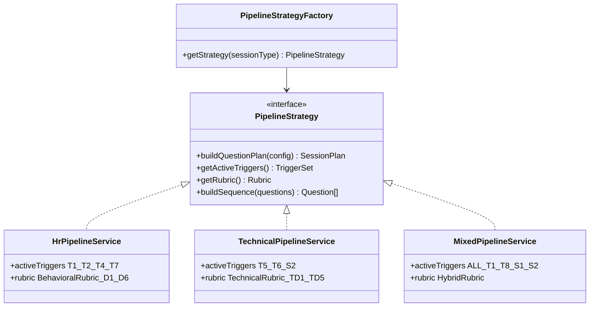

#### 2.1.5 ReportModule

| Item | Detail |
| --- | --- |
| Controller | `ReportController` |
| Services | `ReportService`, `ComprehensiveReportBuilder`, `ReverseQEvaluatorService`, `ProgressSnapshotService` |
| Queue Consumer | `ComprehensiveReportProcessor` |
| Trách nhiệm | Aggregate tất cả `ai_feedbacks` của session; tính session-level overall_score; build 5-section report (Executive Summary, Comm Analysis, Competency Heatmap, Reverse Q Eval, Action Plan); lưu `progress_snapshots` cho UC-13 |
| External | OpenAI GPT-4o (via AIModule — Action Plan generation), Supabase DB |

#### 2.1.6 AdminModule

| Item | Detail |
| --- | --- |
| Controller | `AdminController` |
| Services | `UserAdminService`, `QuestionBankService` |
| Trách nhiệm | CRUD users (view/lock/unlock UC-09); CRUD question bank seed data (UC-10) với filter session_type/difficulty/context_pack |
| Guard | `JwtGuard` + `RoleGuard` (admin role check) |

**Tổng hợp Module Inventory:**

| Module | Controllers | Services | Queue Consumers | External Calls |
| --- | --- | --- | --- | --- |
| AuthModule | AuthController | GoogleStrategy, JwtStrategy, AuthService | — | Google OAuth, Supabase Auth, Redis |
| SessionModule | SessionController | SessionService, QuestionComposerService, AntiRepeatService, SessionPlanValidator | — | Bull Queue, Supabase DB |
| TurnModule | TurnController | TurnService, WhisperService, VoiceMetricsService, FollowUpCoordinatorService | — | OpenAI Whisper-1, Cloudflare R2, Bull Queue, Supabase DB |
| AIModule | — | OpenAIGateway, PromptBuilderService, ContextPackService, 4 AI Services, 3 Pipeline Services, PipelineStrategyFactory, ZodValidatorService | FollowUpProcessor, FeedbackProcessor, RewriteEvalProcessor, QuestionGenerationProcessor | OpenAI GPT-4o, Redis |
| ReportModule | ReportController | ReportService, ComprehensiveReportBuilder, ReverseQEvaluatorService, ProgressSnapshotService | ComprehensiveReportProcessor | OpenAI GPT-4o (via AIModule), Supabase DB |
| AdminModule | AdminController | UserAdminService, QuestionBankService | — | Supabase DB |

### 2.2 Frontend — Next.js Pages (App Router)

#### 2.2.1 Page Inventory

| Route | Page Component | UC liên quan | Auth |
| --- | --- | --- | --- |
| `/` | `LandingPage` | — | No |
| `/auth/callback` | `AuthCallbackPage` | UC-01 | No |
| `/onboarding` | `OnboardingPage` | UC-02, UC-11 | Yes |
| `/dashboard` | `DashboardPage` | UC-08, UC-13 | Yes |
| `/sessions/new` | `SessionSetupWizard` | UC-03, UC-03b | Yes |
| `/sessions/[id]/interview` | `InterviewPage` | UC-04, UC-12 | Yes |
| `/sessions/[id]/report` | `ReportPage` | UC-05, UC-06 | Yes |
| `/sessions/[id]/rewrite/[questionId]` | `RewritePage` | UC-07 | Yes |
| `/progress` | `ProgressDashboardPage` | UC-13 | Yes |
| `/admin/users` | `AdminUsersPage` | UC-09 | Admin |
| `/admin/questions` | `AdminQuestionsPage` | UC-10 | Admin |

#### 2.2.2 Key Components (có business logic)

**Interview Domain:**

| Component | Trách nhiệm |
| --- | --- |
| `AudioRecorder` | MediaRecorder API, 15s silence detection callback, 5-min hard limit, progress indicator, upload audio blob |
| `InterviewPhaseController` | State machine 5 giai đoạn UC-04: Opening → Main Loop → Reverse Q → Closing |
| `FollowUpPanel` | Hiển thị follow-up question, trigger animation khi nhận SSE event `turn.follow_up` |
| `TranscriptAnnotator` | Render annotated transcript với 3-level highlight (good/warning/critical), popup on click annotation |
| `FeedbackScoreCard` | overall_score gauge, voice metrics summary, key_takeaway |
| `SSEListener` | Hook subscribe `EventSource` → nhận `turn.follow_up`, `turn.feedback_ready`, `report.ready`, `rewrite.done` |

**Session Setup Domain:**

| Component | Trách nhiệm |
| --- | --- |
| `SessionWizard` | Multi-step form 6 bước (JD → session type → config → context pack → prep card → confirm) |
| `JDInputPanel` | Text area, PDF upload, URL crawl với timeout indicator |
| `ContextPackSelector` | VN/Western selection với preview rubric differences |

**Report Domain:**

| Component | Trách nhiệm |
| --- | --- |
| `CompetencyHeatmap` | Render D1-D6 (behavioral) hoặc TD1-TD5 (technical) scores dạng colored grid [1–5] |
| `ActionPlanList` | Priority-ranked action items từ report, link recommended next session type |
| `RewriteComparePanel` | Side-by-side annotation diff: original vs rewrite, delta score badge (4 states: Cải thiện rõ rệt / Có cải thiện / Chưa thay đổi / Điểm giảm) |

### 2.3 Infrastructure Components

| Component | Technology | Provider | Vai trò |
| --- | --- | --- | --- |
| Frontend Host | Next.js 14 SSR | Vercel | Serve pages, edge caching, zero-config deploy |
| Backend Runtime | NestJS 10, Node.js 20 | Railway | API + AI orchestration, Docker container |
| Job Queue | Bull 4.x | Railway (co-located với backend) | Async AI jobs, retry, timeout |
| Cache + Rate Limit | Redis 7.x | Railway (co-located) | Bull backend, rate limit counters, CV text cache |
| Primary Database | PostgreSQL 15 + pgvector 0.7 | Supabase | Tất cả relational data |
| Auth Provider | Supabase Auth | Supabase | JWT issuance, Google OAuth, session store |
| CV Storage | Supabase Storage | Supabase | CV PDF files với RLS |
| Audio Storage | Cloudflare R2 | Cloudflare | Audio blobs, 30-day retention |
| AI Inference | GPT-4o, Whisper-1 | OpenAI | Question Gen, Follow-up, Feedback, STT |
| Error Tracking | Sentry | Sentry Cloud | Frontend + backend exception tracking (PII excluded) |

---

## 3. Data Flows

### 3.1 Flow 1 — Authentication (UC-01)

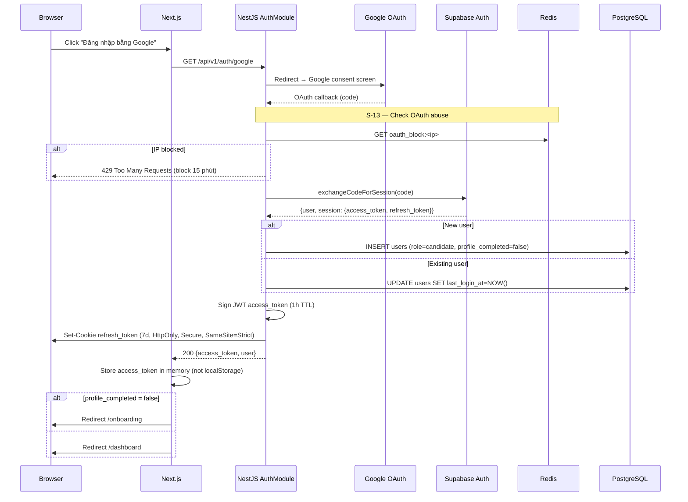

Token lifecycle: access_token lưu in-memory (mất khi refresh tab → dùng refresh_token để lấy lại), refresh_token HttpOnly cookie không accessible từ JavaScript. Mỗi lần refresh tạo token pair mới và invalidate token cũ (Supabase rotation).

### 3.2 Flow 2 — Session Setup & Question Generation (UC-03)

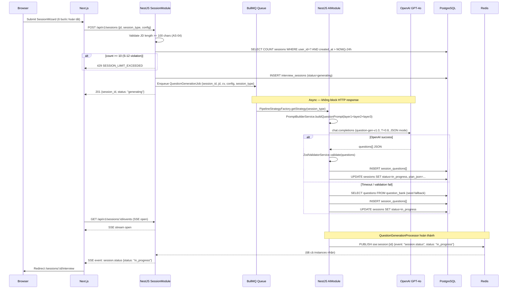

`AntiRepeatService` loại câu user đã gặp trong 30 ngày trước khi sample từ Question Bank. `SessionPlanValidator` kiểm tra coverage subcategory, difficulty distribution, và time budget trước khi xác nhận plan.

### 3.3 Flow 3 — Interview Turn (UC-04 Main Loop, per turn)

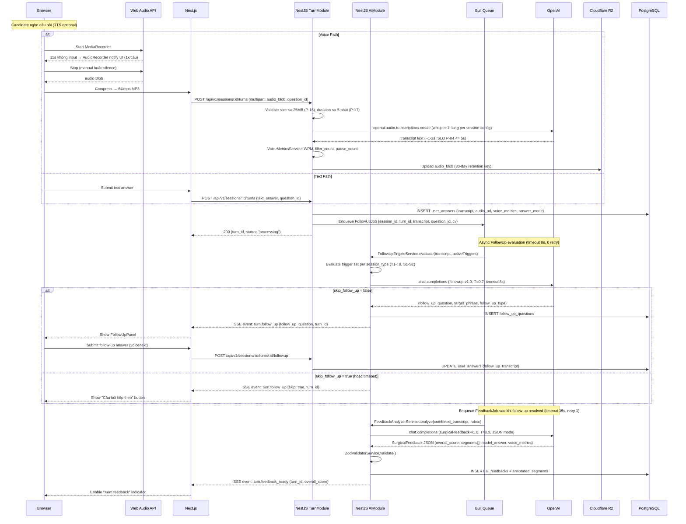

Turn status machine: `submitted` → `processing` → `follow_up_pending` → `feedback_generating` → `completed`.

### 3.4 Flow 4 — Comprehensive Report Generation (UC-05)

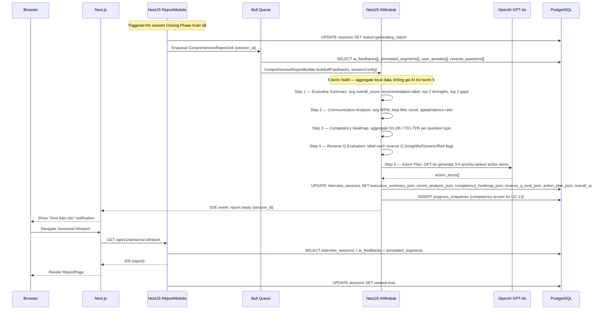

SLO AC-05-1 (≤8s): Steps 1-4 là local aggregation (DB read, không AI call) — nhanh. Step 5 là bottleneck. Nếu ComprehensiveReportJob timeout 30s → fallback: lưu report không có Action Plan, hiển thị partial report với note "Action Plan đang được tạo".

### 3.5 Flow 5 — Rewrite & Compare (UC-07)

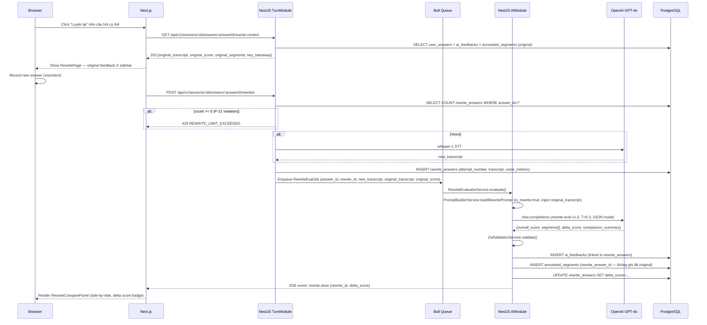

Từ lần attempt 3 trở đi, cột bên trái hiển thị lần có overall_score cao nhất (không nhất thiết lần gốc) để so sánh có ý nghĩa hơn (AF-07-B).

---

## 4. Use Case × Component Mapping

### 4.1 UC × NestJS Module

| UC | AuthModule | SessionModule | TurnModule | AIModule | ReportModule | AdminModule |
| --- | --- | --- | --- | --- | --- | --- |
| UC-01 Auth | PRIMARY | — | — | — | — | — |
| UC-02 Profile | JwtGuard | — | — | CV parse (pdf-parse) | — | — |
| UC-03 Session Setup | JwtGuard | PRIMARY | — | PRIMARY (QuestionGenerator, PipelineFactory) | — | — |
| UC-03b Context Pack | — | ContextPackService ref | — | PRIMARY (ContextPackService) | — | — |
| UC-04 Interview | JwtGuard | SessionService (status) | PRIMARY | PRIMARY (FollowUp, Feedback, Pipeline) | — | — |
| UC-05 AI Feedback | — | — | — | PRIMARY (FeedbackAnalyzer, Zod) | PRIMARY (ReportBuilder) | — |
| UC-06 View Feedback | JwtGuard | — | — | — | PRIMARY (ReportController) | — |
| UC-07 Rewrite | JwtGuard | — | PRIMARY (rewrite count check, Whisper) | PRIMARY (RewriteEvaluator) | — | — |
| UC-08 History | JwtGuard | PRIMARY (list) | — | — | — | — |
| UC-09 Admin Users | JwtGuard + RoleGuard | — | — | — | — | PRIMARY |
| UC-10 Question Bank | JwtGuard + RoleGuard | — | — | — | — | PRIMARY |
| UC-11 Placement Test | JwtGuard | — | — | PRIMARY (QuestionGenerator variant) | — | — |
| UC-12 Reverse Q | JwtGuard | — | TurnService (voice) | PRIMARY (FollowUpEngine in-character) | ReverseQEvaluator | — |
| UC-13 Dashboard | JwtGuard | — | — | — | PRIMARY (ProgressSnapshot) | — |

### 4.2 UC × Next.js Page/Component

| UC | Page | Primary Components |
| --- | --- | --- |
| UC-01 | `/auth/callback` | `AuthCallbackPage` |
| UC-02 | `/onboarding` | `OnboardingPage`, `CVUploadPanel` |
| UC-03, UC-03b | `/sessions/new` | `SessionWizard`, `JDInputPanel`, `ContextPackSelector` |
| UC-04 | `/sessions/[id]/interview` | `InterviewPhaseController`, `AudioRecorder`, `FollowUpPanel`, `SSEListener` |
| UC-05 | (background) | `SSEListener` nhận `report.ready` |
| UC-06 | `/sessions/[id]/report` | `ReportPage`, `TranscriptAnnotator`, `CompetencyHeatmap`, `ActionPlanList` |
| UC-07 | `/sessions/[id]/rewrite/[questionId]` | `RewritePage`, `RewriteComparePanel`, `AudioRecorder` |
| UC-08 | `/dashboard` | `SessionHistoryList`, `SessionCard` |
| UC-09 | `/admin/users` | `AdminUsersPage`, `UserTable` |
| UC-10 | `/admin/questions` | `AdminQuestionsPage`, `QuestionForm` |
| UC-11 | `/onboarding` (embedded) | `PlacementTestPanel` |
| UC-12 | `/sessions/[id]/interview` | `ReverseQuestionPanel` (sub-state trong `InterviewPhaseController`) |
| UC-13 | `/progress` | `ProgressDashboardPage`, `CompetencyHeatmap`, `StreakCounter`, `RecommendationCard` |

---

## 5. Cross-Cutting Concerns

### 5.1 Rate Limiting

| Rule | Scope | Limit | Window | Implementation | Response |
| --- | --- | --- | --- | --- | --- |
| S-11 | Per user — AI endpoints | 60 req | 60s | NestJS `@Throttle(60, 60)` global trên AI-touching controllers | HTTP 429 + `Retry-After` header |
| S-12 | Per user — Session creation | 10 sessions | 24h | `SessionService.create()`: `SELECT COUNT` trước INSERT | HTTP 429 `SESSION_LIMIT_EXCEEDED` |
| S-13 | Per IP — OAuth redirect | 5 failures | 10 min | Redis key `oauth_fail:<ip>` TTL 10min; counter++ per fail; ≥5 → set `oauth_block:<ip>` TTL 15min; `AuthMiddleware` check trước mọi OAuth request | HTTP 429, block 15 min |
| P-21 | Per answer — Rewrite | 5 attempts | — | `TurnService`: `SELECT COUNT rewrite_answers WHERE answer_id=?` | HTTP 429 `REWRITE_LIMIT_EXCEEDED` |

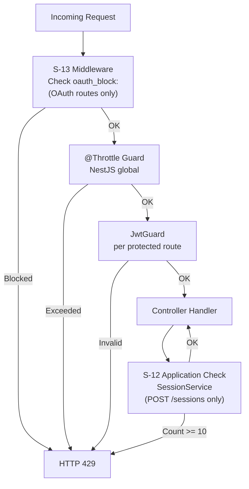

### 5.2 BullMQ Queue — Job Types và Processors

| Job | Queue Name | Timeout | Retry | Fallback khi fail |
| --- | --- | --- | --- | --- |
| `QuestionGenerationJob` | `question-gen` | 15s | 1 | Sample từ question_bank seed |
| `FollowUpJob` | `follow-up` | 8s | 0 | `skip_follow_up: true` |
| `FeedbackJob` | `feedback` | 15s | 1 | Fallback text feedback (simple GPT-4o prompt) |
| `RewriteEvalJob` | `rewrite-eval` | 15s | 0 | Lưu transcript, không hiển thị comparison |
| `ComprehensiveReportJob` | `report` | 30s | 1 | Partial report không có Action Plan |

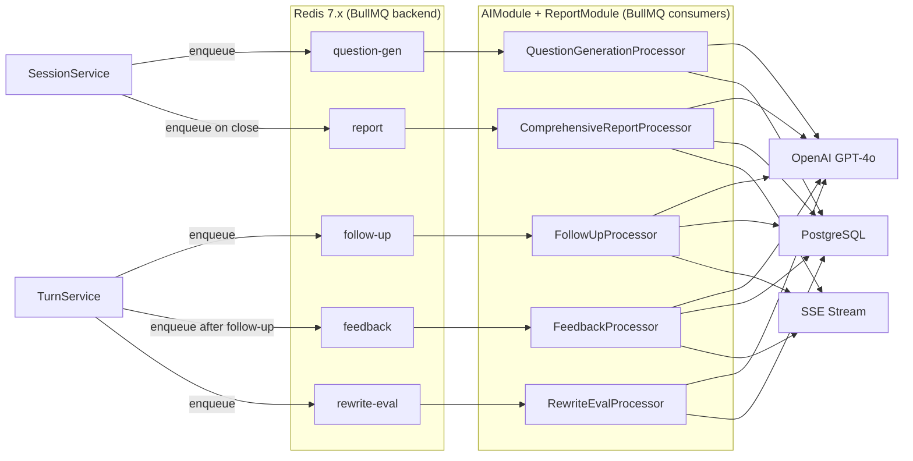

### 5.3 SSE Streaming

Endpoint: `GET /api/v1/sessions/:id/events` — Bearer JWT required, `Content-Type: text/event-stream`.

| Event Name | Emitted By | Payload | Frontend Subscriber |
| --- | --- | --- | --- |
| `session.status` | QuestionGenerationProcessor | `{session_id, status: "in_progress"}` | `SessionWizard` → redirect sang interview |
| `turn.follow_up` | FollowUpProcessor | `{turn_id, follow_up_question}` hoặc `{turn_id, skip: true}` | `FollowUpPanel` |
| `turn.feedback_ready` | FeedbackProcessor | `{turn_id, overall_score}` | `InterviewPhaseController` → enable indicator |
| `report.ready` | ComprehensiveReportProcessor | `{session_id}` | `SSEListener` → notification + optional redirect |
| `rewrite.done` | RewriteEvalProcessor | `{rewrite_id, delta_score}` | `RewriteComparePanel` |

NestJS pattern:

```typescript
// SessionController — SSE endpoint
@Sse('events')
@UseGuards(JwtAuthGuard)
sessionEvents(@Param('id') sessionId: string): Observable<MessageEvent> {
  return this.sseService.getSessionStream(sessionId);
}
// SseService subscribe Redis channel sse:session:{session_id} qua ioredis
// BullMQ processor complete → ioredis PUBLISH → SseService forward event
// Frontend: new EventSource('/api/v1/sessions/:id/events')
```

Lý do chọn SSE thay vì WebSocket: unidirectional (server → client) đủ cho use case; stateless per connection; NestJS `@Sse()` decorator native; không cần socket.io overhead.

Multi-instance delivery (ADR-006): `SseService` không dùng in-memory `Subject`. Mỗi NestJS instance subscribe Redis channel `sse:session:{session_id}` qua ioredis. BullMQ processor publish vào channel sau khi DB write hoàn thành → tất cả instances nhận message → instance đang giữ SSE connection của client forward event. Redis đã là dependency của BullMQ — không cần thêm infrastructure mới.

### 5.4 Error Handling Hierarchy

3 layers:

1. AIModule fallback chain (per SAD §2.4.1): OpenAI timeout → retry → seed fallback
2. NestJS Global Exception Filter → standard error response, log vào Sentry (không log transcript/PII)
3. Frontend React Error Boundary → user-friendly error UI

**Error Code Registry:**

| HTTP | Error Code | Trigger | Message (tiếng Việt) |
| --- | --- | --- | --- |
| 400 | `JD_TOO_SHORT` | JD < 100 chars | "Job Description quá ngắn (tối thiểu 100 ký tự)." |
| 400 | `AUDIO_TOO_LARGE` | Audio > 25MB | "File âm thanh vượt quá giới hạn 25MB." |
| 401 | `UNAUTHORIZED` | Invalid/expired JWT | "Phiên đăng nhập hết hạn. Vui lòng đăng nhập lại." |
| 403 | `FORBIDDEN` | Non-admin truy cập admin route | "Bạn không có quyền truy cập." |
| 404 | `SESSION_NOT_FOUND` | session_id không tồn tại hoặc không thuộc user | "Phiên không tồn tại." |
| 422 | `SCHEMA_VALIDATION_ERROR` | DTO validation fail | Field-level error messages. |
| 429 | `SESSION_LIMIT_EXCEEDED` | S-12 | "Bạn đã tạo 10 phiên hôm nay. Thử lại sau 24 giờ." |
| 429 | `RATE_LIMIT_EXCEEDED` | S-11 | "Quá nhiều yêu cầu. Vui lòng chờ 1 phút." |
| 429 | `REWRITE_LIMIT_EXCEEDED` | P-21 | "Bạn đã thử lại tối đa 5 lần cho câu hỏi này." |
| 500 | `AI_SERVICE_ERROR` | OpenAI fail sau retry | "Dịch vụ AI tạm thời không khả dụng. Câu trả lời của bạn đã được lưu." |
| 503 | `SERVICE_UNAVAILABLE` | Bull Queue không khả dụng | "Hệ thống đang tải. Vui lòng thử lại sau." |

Response format thống nhất: `{statusCode, errorCode, message, timestamp}`. Stack trace không bao giờ expose ra client.

### 5.5 Input Validation

3 layers:

1. **Frontend**: React Hook Form + Zod schema — immediate UX feedback, không gọi API nếu invalid
2. **NestJS DTO**: `class-validator` + `class-transformer` — enforce API contract, trả 422 nếu fail
3. **AI Output**: `ZodValidatorService` — validate tất cả AI response trước khi persist; nếu fail → trigger fallback

Prompt injection prevention: mọi user input (JD, transcript, CV text) wrap trong XML tags trước khi inject vào prompt. Model instruction rõ ràng: content trong tag là data, không phải instruction.

### 5.6 Logging và Observability

| Event | Level | Destination | Không log |
| --- | --- | --- | --- |
| AI job enqueue/dequeue | INFO | Railway logs | — |
| AI call success (model, tokens, latency) | INFO | `ai_quality_log` table | Prompt content, transcript |
| AI schema validation fail | ERROR | Sentry + `ai_quality_log` (is_fallback=true) | — |
| AI fallback triggered | WARNING | `ai_quality_log` | — |
| Rate limit hit (S-11/S-12/S-13) | WARNING | Railway logs | User content |
| Unhandled exception | ERROR | Sentry | PII, transcript, CV |
| Session start/complete/interrupted | INFO | Railway logs | — |

---

## 6. AI Pipeline Architecture

### 6.1 3-Layer Prompt Architecture

Tham chiếu SAD v1.1 §2.2. Tóm tắt để mapping sang components:

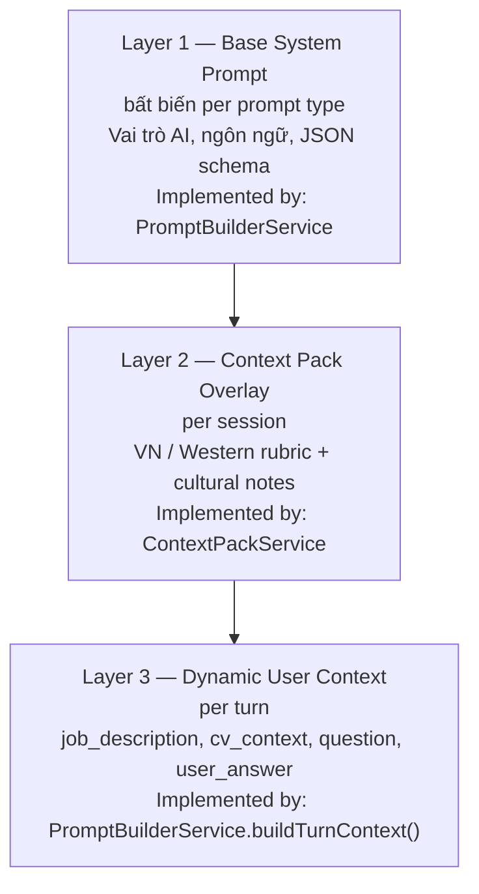

User input trong Layer 3 luôn được wrap: `<job_description>…</job_description>`, `<user_answer>…</user_answer>` — prompt injection prevention.

### 6.2 Prompt Version Registry

| Prompt | Version | Temperature | Input Token Budget | Output Token Budget | Fallback |
| --- | --- | --- | --- | --- | --- |
| Question Generator | `question-gen-v1.0` | 0.8 | ≤ 1,500 | ≤ 600 | Question Bank seed |
| Follow-up Engine | `followup-v1.0` | 0.7 | ≤ 900 | ≤ 150 | `skip_follow_up: true` |
| Feedback Analyzer | `surgical-feedback-v1.0` | 0.3 | ≤ 2,000 | ≤ 1,500 | Fallback text feedback |
| Rewrite Evaluator | `rewrite-eval-v1.0` | 0.3 | ≤ 2,500 | ≤ 1,500 | Lưu transcript, không show comparison |

Prompt versioning: version string ghi vào `ai_quality_log.prompt_version` mỗi AI call. Khi update prompt: bump version string, ghi changelog vào `docs/Design/prompt-changelog.md`.

### 6.3 3 Session Type Pipelines

Tại sao 3 pipeline riêng biệt: xem ADR-005 và Session Type Spec §5.6 — sequencing logic, trigger set, rubric, persona suitability khác nhau đáng kể. 1 pipeline với flag gây branching phức tạp, khó test, dễ regression.

| Thuộc tính | HR_BEHAVIORAL | TECHNICAL_KNOWLEDGE | MIXED_INTERVIEW |
| --- | --- | --- | --- |
| Active Triggers | T1, T2, T4, T7 (+ T3, T8 soft) | T5, T6, S2 (+ T3, T4, T8 soft) | Tất cả T1-T8 + S1-S2 |
| Rubric | D1-D6 Behavioral | TD1-TD5 Technical | Hybrid per question type |
| Sequencing | Opening → Warm-up → Core → Stretch → Closing | Tech intro → Easy → Core → Advanced → Wind-down → Closing | Multi-block: Opening → Tech Block 1 → Behavioral Block 1 → Tech Block 2 → Behavioral Block 2 → Situational → Wind-down → Closing |
| Score Aggregation | `mean(behavioral_scores)` | `mean(technical_scores)` | `0.30×BEH + 0.45×TECH + 0.15×SIT + 0.10×COMM` (balanced mode) |
| Min Duration | 15 phút | 15 phút | 30 phút |
| Persona Best Fit | Friendly HR | Tech Lead, Strict Senior | Tech Lead, Senior Manager |

### 6.4 Follow-up Trigger Evaluation Logic

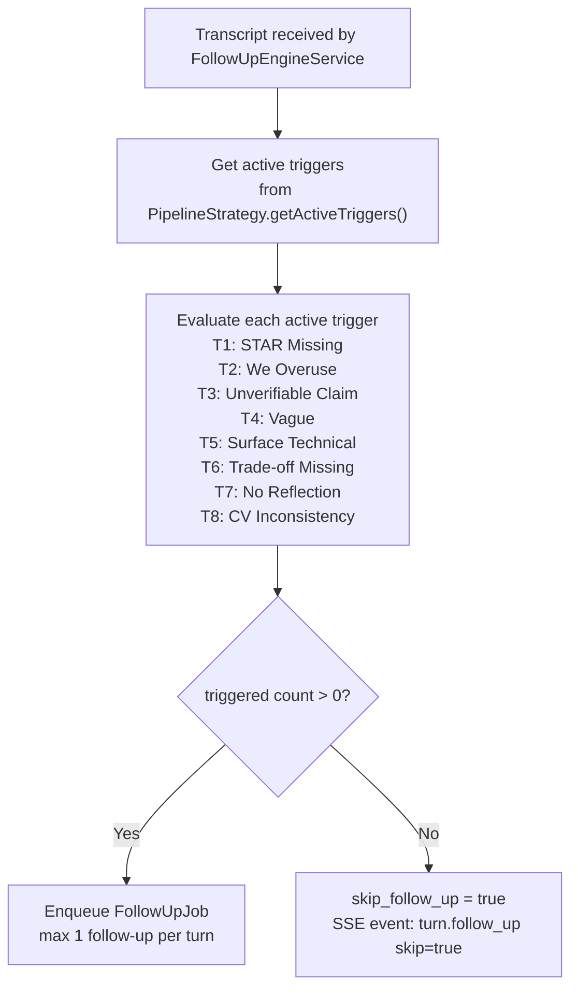

---

## 7. Interface Contracts — Endpoint Inventory

Chỉ liệt kê method + path + auth + description. Full request/response schema, DTO definitions, error codes → `docs/Design/DetailedDesign/API_spec.md`.

### 7.1 Auth

| Method | Path | Auth | Description |
| --- | --- | --- | --- |
| GET | `/api/v1/auth/google` | No | Initiate Google OAuth redirect |
| GET | `/api/v1/auth/google/callback` | No | OAuth callback — set cookie, return access_token |
| POST | `/api/v1/auth/refresh` | HttpOnly Cookie | Rotate refresh token, issue new access_token |
| POST | `/api/v1/auth/logout` | Bearer | Revoke session (Supabase signOut) |

### 7.2 Sessions

| Method | Path | Auth | Description |
| --- | --- | --- | --- |
| POST | `/api/v1/sessions` | Bearer | Create session + enqueue QuestionGenerationJob |
| GET | `/api/v1/sessions` | Bearer | List sessions, paginated (UC-08 history) |
| GET | `/api/v1/sessions/:id` | Bearer | Get session detail (questions + config) |
| GET | `/api/v1/sessions/:id/status` | Bearer | Poll generation status |
| PATCH | `/api/v1/sessions/:id/status` | Bearer | Update status (interrupt, close) |
| GET | `/api/v1/sessions/:id/events` | Bearer | SSE stream — `text/event-stream` |

### 7.3 Turns

| Method | Path | Auth | Description |
| --- | --- | --- | --- |
| POST | `/api/v1/sessions/:id/turns` | Bearer | Submit answer — voice (multipart) hoặc text (body) |
| GET | `/api/v1/sessions/:id/turns/:turnId` | Bearer | Get turn detail (transcript + feedback) |
| POST | `/api/v1/sessions/:id/turns/:turnId/followup` | Bearer | Submit follow-up answer |
| GET | `/api/v1/sessions/:id/turns/:turnId/feedback` | Bearer | Get surgical feedback for a turn |

### 7.4 Rewrites

| Method | Path | Auth | Description |
| --- | --- | --- | --- |
| GET | `/api/v1/sessions/:id/answers/:answerId/rewrite-context` | Bearer | Get original transcript + score (UC-07 init) |
| POST | `/api/v1/sessions/:id/answers/:answerId/rewrites` | Bearer | Submit rewrite + enqueue RewriteEvalJob |
| GET | `/api/v1/sessions/:id/answers/:answerId/rewrites` | Bearer | List all rewrite attempts |

### 7.5 Reports và Profile

| Method | Path | Auth | Description |
| --- | --- | --- | --- |
| GET | `/api/v1/sessions/:id/report` | Bearer | Get comprehensive report (UC-06) |
| GET | `/api/v1/progress` | Bearer | Get progress data: snapshots, streak (UC-13) |
| GET | `/api/v1/profile` | Bearer | Get user profile |
| PUT | `/api/v1/profile` | Bearer | Update profile — target role, level, stack (UC-02) |
| POST | `/api/v1/profile/cv` | Bearer | Upload CV PDF, multipart (UC-02) |

### 7.6 Placement Test

| Method | Path | Auth | Description |
| --- | --- | --- | --- |
| GET | `/api/v1/placement-test/questions` | Bearer | Get 5-10 placement questions by role (UC-11) |
| POST | `/api/v1/placement-test/submit` | Bearer | Submit answers, trigger AI scoring → set placement_level |

### 7.7 Reverse Questions

| Method | Path | Auth | Description |
| --- | --- | --- | --- |
| POST | `/api/v1/sessions/:id/reverse-questions` | Bearer | Submit candidate question + get AI in-character response (UC-12) |
| GET | `/api/v1/sessions/:id/reverse-questions` | Bearer | Get all reverse Q records for session |

### 7.8 Admin

| Method | Path | Auth | Description |
| --- | --- | --- | --- |
| GET | `/api/v1/admin/users` | Bearer + Admin | List all users, paginated (UC-09) |
| PATCH | `/api/v1/admin/users/:id/status` | Bearer + Admin | Lock/unlock user account |
| GET | `/api/v1/admin/questions` | Bearer + Admin | List questions với filters (UC-10) |
| POST | `/api/v1/admin/questions` | Bearer + Admin | Create question |
| PUT | `/api/v1/admin/questions/:id` | Bearer + Admin | Update question |
| DELETE | `/api/v1/admin/questions/:id` | Bearer + Admin | Soft delete question |
| GET | `/api/v1/admin/ai-quality-log` | Bearer + Admin | View AI call quality metrics |

---

## 8. Security Architecture

Section này ánh xạ security rules từ SAD v1.1 §6 vào components cụ thể. Không duplicate SAD content — chỉ mapping.

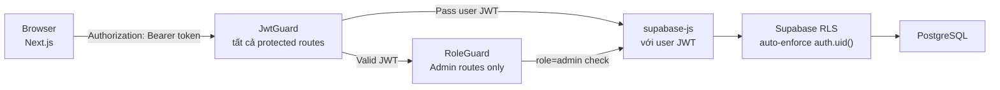

Nguyên tắc: NestJS JwtGuard verify token signature + expiry. RLS enforce data ownership tại DB layer — NestJS không cần viết `WHERE user_id = ?` thủ công cho mọi query. Defense in depth: lỗi application layer không dẫn đến data leak giữa users.

| Component | Security Control | Implementation |
| --- | --- | --- |
| `AuthController` | S-13 OAuth rate limit | Redis counter middleware trước OAuth routes |
| Tất cả protected controllers | S-11 user-level rate limit | `@Throttle(60, 60)` NestJS global |
| `SessionController` | S-12 session creation limit | Application-layer count check |
| `TurnController` | Audio upload validation | File size ≤ 25MB, mime-type whitelist, duration check |
| `AIModule` | Prompt injection prevention | XML tag wrapping tất cả user input |
| `AIModule` | Output validation | `ZodValidatorService` per AI response |
| Tất cả DB operations | RLS | `supabase-js` dùng user JWT tự động |
| Frontend | XSS prevention | Next.js escapes output by default; `dangerouslySetInnerHTML` không dùng |
| API | CORS | NestJS `CorsModule` whitelist Vercel domain only |
| Refresh token | Cookie security | `HttpOnly`, `Secure`, `SameSite=Strict` |

---

## 9. SLOs và Performance Design

Section này giải thích cách từng component đáp ứng SLO đã định nghĩa trong SAD v1.1 §7 và SRS.

| SLO | Target | Component Decision |
| --- | --- | --- |
| P-01: Page load | < 2s (p95) | Next.js SSR + Vercel edge caching; React Query `stale-while-revalidate` cho report data |
| P-02: CRUD API | < 300ms (p95) | Không tính AI calls; Supabase connection pooling; index trên `user_id`, `session_id`, `created_at` |
| P-04: Whisper STT | ≤ 5s (p95) | Audio nén xuống 64kbps MP3 trước upload; Whisper call trong synchronous path (không queue) |
| Feedback/turn | ≤ 15s | `FeedbackJob` timeout 15s; `FollowUpJob` timeout 8s — sequential nhưng feedback job bắt đầu ngay sau follow-up resolved |
| Report | ≤ 8s (p95) | Steps 1-4 là DB aggregation (không AI call); Step 5 (Action Plan) là bottleneck duy nhất |

**Caching Strategy:**

| Data | Cache | TTL | Invalidation |
| --- | --- | --- | --- |
| CV parsed text | Redis | 24h | Khi user upload CV mới |
| Context pack config | Redis | 24h | Khi admin update context pack |
| Follow-up response (similar turn) | Redis | 1h | — |
| Session report | React Query (client) | 5 min stale | On-demand refetch khi navigate lại |

---

## 10. Appendix

### 10.1 Glossary

Xem [docs/glossary.md](../../glossary.md).

### 10.2 ADR References

| ADR | Title | Components ảnh hưởng |
| --- | --- | --- |
| ADR-001 | Next.js 14 App Router | Tất cả Next.js pages, `SSEListener` (EventSource), `ProtectedRoute` |
| ADR-002 | NestJS Backend Framework | AuthModule, SessionModule, TurnModule, AIModule, ReportModule, AdminModule |
| ADR-003 | Supabase Database + Auth | RLS policy enforcement, `JwtGuard` integration, `supabase-js` usage |
| ADR-004 | OpenAI GPT-4o | `OpenAIGateway`, 4 AI Services, `ZodValidatorService`, Prompt Version Registry |
| ADR-005 | NestJS-only AI Pipeline | `AIModule` = 3 Pipeline Services + `PipelineStrategyFactory`; không có FastAPI service |
| ADR-006 | SSE via Redis Pub/Sub | `SseService` — ioredis subscriber thay in-memory Subject; tất cả BullMQ processors publish vào Redis channel |
| ADR-007 | BullMQ over Bull 4.x | Tất cả 5 queue processors trong `AIModule` và `ReportModule`; NestJS module config |

### 10.3 Open Questions — Resolved

Tất cả 4 open questions đã được resolve (2026-05-10) trước khi bắt đầu LLD.

| # | Câu hỏi | Quyết định | Tham chiếu |
| --- | --- | --- | --- |
| OQ-1 | SSE sticky session trên Railway | Redis pub/sub qua ioredis — SseService subscribe channel per session_id; BullMQ processors publish sau DB write. Railway multi-instance autoscale không cần sticky session config. | ADR-006 |
| OQ-2 | Bull vs BullMQ | BullMQ (`bullmq` + `@nestjs/bullmq`). Bull 4.x maintenance-only; BullMQ có TypeScript-first API, active development, Flows API. Migration: tất cả 5 queues đổi cùng lúc (không coexist). | ADR-007 |
| OQ-3 | Polling vs SSE nhất quán | Polling bị loại. Session Setup (Flow 2) chuyển sang SSE — Frontend mở SSE connection sau POST /sessions, nhận `session.status` event. Tất cả 5 flows dùng SSE. Rule: polling chỉ dùng nếu SSE connection chưa thiết lập (không có session_id). | CLAUDE.md Key Decisions |
| OQ-4 | pgvector usage | Defer sang v2. Không có UC nào trong SRS explicit cần semantic search. `AntiRepeatService` dùng SQL JOIN trên `session_questions` + `interview_sessions` để filter câu đã gặp trong 30 ngày. DB schema v1 không có vector column. | CLAUDE.md Key Decisions |
