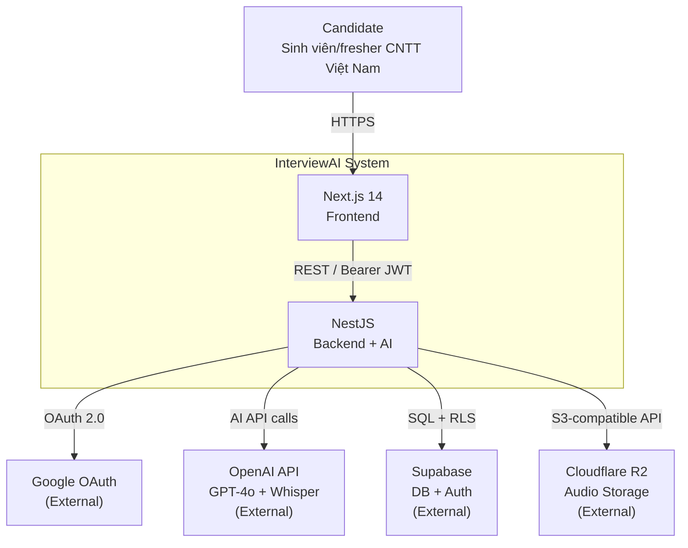
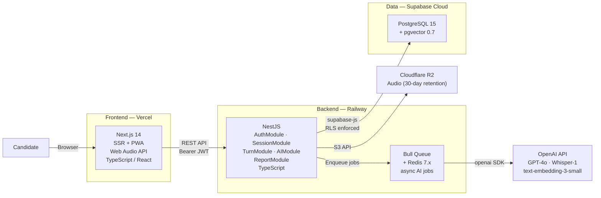
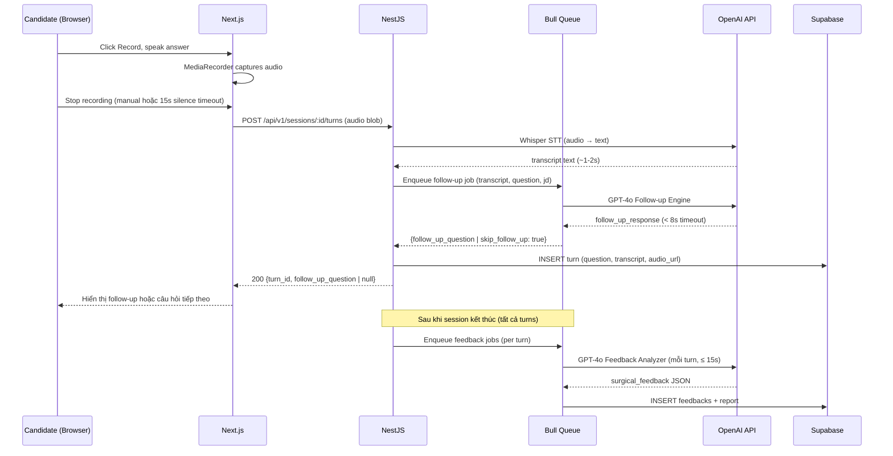

# Software Architecture Document (SAD)
## AI Interview Coach System — InterviewAI

---

| Thuộc tính | Giá trị |
|---|---|
| **Ngày soạn** | 09/05/2026 |
| **Trạng thái** | Draft |
| **Tác giả** | Lê Thành An — MSSV: 20235631 |
| **Đơn vị** | Trường Công nghệ Thông tin và Truyền thông (SOICT), ĐHBKHN |
---

## MỤC LỤC

- [1. Kiến trúc Hệ thống](#1-kiến-trúc-hệ-thống)
  - [1.1 Tổng quan kiến trúc triển khai](#11-tổng-quan-kiến-trúc-triển-khai)
    - [C4 Level 1 — Context Diagram](#c4-level-1--context-diagram)
    - [C4 Level 2 — Container Diagram](#c4-level-2--container-diagram)
    - [Sequence Diagram — UC-04 Interview Turn](#sequence-diagram--uc-04-interview-turn)
  - [1.2 Tech Stack chi tiết](#12-tech-stack-chi-tiết)
  - [1.3 Lý do lựa chọn công nghệ chính](#13-lý-do-lựa-chọn-công-nghệ-chính)
- [2. Thiết kế Tích hợp AI](#2-thiết-kế-tích-hợp-ai)
  - [2.1 AI Provider & Model](#21-ai-provider--model)
  - [2.2 Kiến trúc Prompt](#22-kiến-trúc-prompt)
  - [2.3 Cấu trúc Output AI (Response Schema)](#23-cấu-trúc-output-ai-response-schema)
  - [2.4 Xử lý lỗi & Fallback](#24-xử-lý-lỗi--fallback)
- [3. Phân tích Chi phí AI](#3-phân-tích-chi-phí-ai)
- [4. Chính sách Lưu trữ Dữ liệu AI](#4-chính-sách-lưu-trữ-dữ-liệu-ai)
- [5. Hướng dẫn Triển khai & Bảo trì](#5-hướng-dẫn-triển-khai--bảo-trì)
- [6. Kiến trúc Bảo mật](#6-kiến-trúc-bảo-mật)
  - [6.1 Xác thực & Vòng đời Token (JWT)](#61-xác-thực--vòng-đời-token-jwt)
  - [6.2 Supabase Row-Level Security (RLS)](#62-supabase-row-level-security-rls)
  - [6.3 Rate Limiting](#63-rate-limiting)
  - [6.4 Input Validation & Prompt Injection](#64-input-validation--prompt-injection)
- [7. Ràng buộc Nghiệp vụ & SLO](#7-ràng-buộc-nghiệp-vụ--slo)
  - [7.1 Session & Content Limits](#71-session--content-limits)
  - [7.2 Latency SLOs](#72-latency-slos)
  - [7.3 Availability & Reliability](#73-availability--reliability)

---

# 1. Kiến trúc Hệ thống

## 1.1 Tổng quan kiến trúc triển khai

Hệ thống dùng single backend service (NestJS) đảm nhận toàn bộ business logic, Auth, Session management, và AI Pipeline orchestration. Frontend (Next.js 14) giao tiếp với NestJS qua REST API (Bearer JWT). AI calls được thực hiện trực tiếp từ NestJS tới OpenAI API qua `openai` npm SDK — không có Python service riêng.

Quyết định kiến trúc này được ghi nhận tại ADR-005. Tóm tắt lý do: project chỉ dùng OpenAI API (không cần local inference), không có Python-only ML lib nào trong SRS scope, và 1 service đơn giản hơn đáng kể cho deployment của graduation project.

### C4 Level 1 — Context Diagram



### C4 Level 2 — Container Diagram



### Sequence Diagram — UC-04 Interview Turn



---

## 1.2 Tech Stack chi tiết

| Layer | Công nghệ | Phiên bản | Mục đích | Tính linh hoạt |
|---|---|---|---|---|
| **Frontend** | Next.js | 14.x | Web app chính, SSR, PWA | Cố định |
| | Tailwind CSS | 3.x | UI styling | Có thể thay bằng CSS Modules |
| | Recharts | 2.x | Biểu đồ nhỏ (nếu cần) | Thay được bằng Chart.js |
| | React Query | 5.x | Data fetching và caching | Cố định |
| | Web Audio API | Native | Ghi âm từ microphone | Browser API — không thay |
| | Web Speech API | Native | TTS đọc câu hỏi (optional) | Browser API — không thay |
| **Backend** | NestJS | 10.x | REST API: Auth, Session CRUD, AI Pipeline orchestration | Có thể thay bằng Express |
| | TypeScript | 5.x | Type safety; type sharing với Next.js frontend | Cố định |
| | openai SDK | 4.x (npm) | OpenAI API client: GPT-4o, Whisper, Embeddings | Cố định khi dùng OpenAI |
| | pdf-parse | 1.x (npm) | Parse CV PDF text extraction | Thay được bằng pdfjs-dist |
| **Queue** | Bull | 4.x | Job queue cho async AI tasks (feedback generation) | Có thể thay bằng BullMQ |
| | Redis | 7.x | Queue backend | Cố định khi dùng Bull |
| **Database** | PostgreSQL | 15.x | Relational database chính | Qua Supabase |
| | Supabase | Latest | Auth + DB + Storage + pgvector | Có thể self-host |
| | pgvector | 0.7.x | Vector search cho JD embedding | Extension của PostgreSQL |
| **Storage** | Cloudflare R2 | — | Lưu audio recording người dùng | Thay được bằng S3 |
| **AI Provider** | OpenAI GPT-4o | gpt-4o | Question Gen, Follow-up, Feedback | Thay được bằng Gemini Pro |
| | OpenAI Whisper | whisper-1 | Speech-to-Text | Thay được bằng Deepgram |
| | text-embedding-3-small | — | JD embedding (nếu dùng RAG) | Optional |
| **Deploy** | Vercel | — | Frontend hosting | Thay được bằng Netlify |
| | Railway | — | Backend hosting | Thay được bằng Render, VPS |
| | Docker | 24.x | Containerization | Cố định cho production |

> **Lưu ý về tính linh hoạt:** Các công nghệ đánh dấu "Cố định" là những lựa chọn kiến trúc nền tảng. Các công nghệ đánh dấu "Thay được" có thể được thay thế nếu gặp vấn đề về chi phí, tính sẵn có hoặc yêu cầu kỹ thuật thay đổi trong quá trình phát triển, **mà không ảnh hưởng đến kiến trúc tổng thể**.

---

## 1.3 Lý do lựa chọn công nghệ chính

| Công nghệ | Lý do lựa chọn |
|---|---|
| **GPT-4o** | JSON mode đảm bảo output schema chuẩn; chất lượng feedback tiếng Việt vượt trội; stable API với uptime cao. |
| **Whisper API** | Độ chính xác cao nhất cho tiếng Việt trong các STT model hiện có; API đơn giản; latency ~1–2 giây. |
| **NestJS (AI Pipeline)** | openai npm SDK type-safe và đủ cho API-only usage (không cần Python ecosystem khi không có local inference). Single service giảm deployment complexity. Type sharing với Next.js qua monorepo. |
| **Supabase** | Cung cấp đồng thời Auth, PostgreSQL, pgvector và Storage — giảm số service cần quản lý. Free tier đủ cho prototype. |
| **Next.js 14** | App Router hỗ trợ SSR tốt cho SEO; Web Audio API tích hợp tự nhiên trong browser; ecosystem React phong phú. |

---

# 2. Thiết kế Tích hợp AI

## 2.1 AI Provider & Model

### 2.1.1 Lựa chọn Provider và Model

| Module | Provider | Model | Lý do lựa chọn |
|---|---|---|---|
| Question Generator | OpenAI | `gpt-4o` | JSON mode đảm bảo output có cấu trúc; chất lượng câu hỏi phong phú, bám sát JD. |
| Follow-up Engine | OpenAI | `gpt-4o` | Yêu cầu hiểu ngữ cảnh sâu để phân tích transcript và sinh câu hỏi contextual. GPT-4o vượt trội so với mini model trong tác vụ này. |
| Feedback Analyzer | OpenAI | `gpt-4o` | Tác vụ phức tạp nhất — phân tích từng đoạn, so sánh rubric, sinh `improved_version`. Không thể dùng model nhỏ hơn. |
| Rewrite Evaluator | OpenAI | `gpt-4o` | Cần so sánh 2 transcript và tính Delta Score chính xác. |
| Speech-to-Text | OpenAI | `whisper-1` | Độ chính xác cao nhất cho tiếng Việt trong số các STT API hiện có. Latency thấp (~1–2 giây cho audio 1 phút). |
| JD Embedding (optional) | OpenAI | `text-embedding-3-small` | Chi phí thấp ($0.02/1M tokens); đủ chất lượng cho semantic search trong Question Bank. |
| Question Generator (fallback) | OpenAI | `gpt-4o-mini` | Dùng khi Question Generator chính bị rate limit; chi phí thấp hơn 94%; chất lượng đủ cho câu hỏi seed. |

### 2.1.2 Phiên bản và tính ổn định

| Yêu cầu | Chi tiết |
|---|---|
| Model pinning | Sử dụng model string cố định (`gpt-4o-2024-11-20` hoặc alias `gpt-4o`) thay vì `latest` để tránh breaking changes khi OpenAI update. |
| Kiểm tra model availability | Health check endpoint gọi `GET /models` mỗi 5 phút để phát hiện sớm nếu model bị deprecated. |
| Fallback chain | `gpt-4o` → `gpt-4o-mini` (nếu rate limit) → Question Bank (nếu cả hai fail). |

---

## 2.2 Kiến trúc Prompt

### 2.2.1 Kiến trúc Prompt Chung

Tất cả prompt trong InterviewAI tuân theo cấu trúc 3 lớp:

```
┌──────────────────────────────────────────────────────────┐
│ LAYER 1 — Base System Prompt (bất biến)                  │
│ Định nghĩa vai trò AI, ngôn ngữ, format output bắt buộc │
│ Nhúng: JSON schema yêu cầu                              │
└──────────────────────────────────────────────────────────┘
                           │
┌──────────────────────────▼───────────────────────────────┐
│ LAYER 2 — Context Pack Overlay (theo phiên)             │
│ System prompt của VN / Western Pack                     │
│ Rubric chấm điểm với trọng số                           │
│ Lưu ý văn hóa đặc thù                                   │
└──────────────────────────────────────────────────────────┘
                           │
┌──────────────────────────▼───────────────────────────────┐
│ LAYER 3 — Dynamic User Context (theo câu hỏi)           │
│ <job_description>...</job_description>                  │
│ <cv_context>...</cv_context>                            │
│ <question>...</question>                                │
│ <user_answer>...</user_answer>                          │
└──────────────────────────────────────────────────────────┘
```

> **Quy tắc bảo mật:** User input **luôn** được wrap trong XML tag tương ứng. Kỹ thuật này ngăn prompt injection vì model đã được instruction rõ ràng rằng nội dung trong tag là "dữ liệu đầu vào" — không phải instruction.

### 2.2.2 Prompt 1 — Question Generator

**Version:** `question-gen-v1.0` | **Kích hoạt bởi:** UC-03

**Input Payload:**
```json
{
  "jd": "string (full JD text)",
  "context_pack_id": "vn | western",
  "num_questions": 3,
  "interview_type": "behavioral | mixed",
  "cv_summary": {
    "experience": ["..."],
    "skills": ["..."]
  }
}
```

**System Prompt:**
```
Bạn là chuyên gia HR và phỏng vấn với nhiều năm kinh nghiệm tuyển dụng.

NHIỆM VỤ: Dựa trên Job Description và thông tin ứng viên, sinh ra {n} câu hỏi phỏng vấn phù hợp.

[CONTEXT PACK OVERLAY — được inject động từ DB]

QUY TẮC:
1. Câu hỏi phải liên quan trực tiếp đến yêu cầu trong JD — không hỏi chủ đề không liên quan.
2. Phân bổ: 60% Behavioral ("Hãy kể về..."), 30% Situational ("Nếu bạn gặp tình huống..."), 10% Motivational ("Tại sao bạn...").
3. Mỗi câu hỏi phải có độ khó phù hợp với level ứng viên.
4. KHÔNG hỏi về: tuổi, giới tính, tình trạng hôn nhân, tôn giáo, quốc tịch.
5. Trả lời CHÍNH XÁC theo JSON schema. Không thêm text ngoài JSON.
6. Nếu JD không đủ thông tin, sinh câu hỏi behavioral chung về kỹ năng mềm.
```

**User Prompt:**
```
<job_description>
{jd_text}
</job_description>

<cv_context>
{cv_parsed_text_or_empty}
</cv_context>

Hãy sinh {n} câu hỏi phỏng vấn. Trả về JSON theo schema sau.
```

**System Prompt — Context Pack VN:**
```
Bạn là chuyên gia tuyển dụng với 10 năm kinh nghiệm tại các doanh nghiệp
Việt Nam. Sinh ra câu hỏi phỏng vấn hành vi (behavioral) và tình huống phù hợp
với JD và văn hóa doanh nghiệp Việt Nam. Ưu tiên câu hỏi về tinh thần teamwork,
sự kiên nhẫn, tôn trọng và trách nhiệm với tập thể.
```

**System Prompt — Context Pack Western:**
```
You are a senior recruiter at an international technology company. Generate
behavioral and situational interview questions aligned with the JD using the
Western interview standard. Prioritize questions that reveal impact, ownership,
data-driven thinking, and direct accountability.
```

**Cấu hình model:** `temperature: 0.8` | `max_tokens: 600`

**Fallback:** Nếu AI call thất bại → lấy random 5 câu từ Question Bank seed data phù hợp với `context_pack_id`.

---

### 2.2.3 Prompt 2 — Follow-up Engine

**Version:** `followup-v1.0` | **Kích hoạt bởi:** UC-04 (sau mỗi câu trả lời)

**Input Payload:**
```json
{
  "original_question": "Hãy kể về một lần bạn phải xử lý conflict với đồng nghiệp?",
  "transcript": "Ừm, thì hồi đó tôi làm việc với một bạn trong team...",
  "jd_summary": "Backend Engineer tại công ty fintech, yêu cầu kỹ năng teamwork và problem-solving.",
  "context_pack": "vn",
  "cv_experience_summary": "2 năm kinh nghiệm backend, đã tham gia 3 dự án nhóm"
}
```

**System Prompt:**
```
Bạn là HR chuyên gia đang thực hiện phỏng vấn trực tiếp.

[CONTEXT PACK OVERLAY]

NHIỆM VỤ: Đọc câu trả lời của ứng viên và quyết định có nên hỏi thêm không.

NGUYÊN TẮC BẮT BUỘC — VI PHẠM BẤT KỲ ĐIỀU NÀO LÀ LỖI CHẤT LƯỢNG:
1. Câu follow-up PHẢI chứa ít nhất 1 cụm từ được trích dẫn nguyên văn từ transcript người dùng.
   Field target_phrase phải là substring của user_transcript.
2. KHÔNG hỏi về chủ đề hoàn toàn mới không có trong transcript.
3. Chỉ chọn đúng 1 loại follow-up: clarify / challenge / expand.
4. Nếu câu trả lời đã cụ thể, có số liệu, và đủ cả 4 thành phần STAR → đặt skip_follow_up = true.
5. Field "reasoning" là ghi chú nội bộ, KHÔNG hiển thị cho ứng viên.
6. Trả lời CHÍNH XÁC theo JSON schema. Không thêm text ngoài JSON.

ĐỊNH NGHĨA CÁC LOẠI FOLLOW-UP:
- clarify: Ứng viên dùng từ mơ hồ ("khá tốt", "một thời gian", "thành công") cần được làm rõ bằng số liệu hoặc mô tả cụ thể.
- challenge: Ứng viên đưa ra claim chưa được chứng minh ("Tôi giỏi nhất", "Ai cũng đồng ý") cần được thách thức.
- expand: Câu trả lời đầy đủ nhưng thiếu chiều sâu — có thể đào sâu vào khó khăn, bài học, hoặc tình huống phức tạp hơn.
- skip: Không cần follow-up.
```

**User Prompt:**
```
<question>
{question_text}
</question>

<user_answer>
{user_transcript}
</user_answer>

<job_description_summary>
{jd_summary_200_tokens}
</job_description_summary>

Phân tích và trả về JSON theo schema.
```

**Cấu hình model:** `temperature: 0.7` | `max_tokens: 400`

**Fallback:** Nếu timeout hoặc JSON không hợp lệ → `{"skip_follow_up": true}`

---

### 2.2.4 Prompt 3 — Feedback Analyzer (Surgical Feedback)

**Version:** `surgical-feedback-v1.0` | **Kích hoạt bởi:** UC-04, UC-05

**Input Payload:**
```json
{
  "question": "Hãy kể về một lần bạn phải xử lý conflict với đồng nghiệp?",
  "combined_transcript": "Ừm, thì hồi đó tôi làm việc với một bạn trong team...\n[FOLLOW-UP]: Bạn đã họp 1-1...",
  "jd": "Backend Engineer tại công ty fintech...",
  "rubric": {
    "culture": "vn",
    "criteria": [
      {"name": "Tính cụ thể của hành động", "weight": 0.3},
      {"name": "Kỹ năng giao tiếp & xử lý mâu thuẫn", "weight": 0.3},
      {"name": "Kết quả và bài học rút ra", "weight": 0.2},
      {"name": "Phong cách diễn đạt & từ ngữ", "weight": 0.2}
    ],
    "vn_specific_notes": "Đánh giá cao sự khiêm nhường, tinh thần tập thể."
  },
  "cv_structured": {
    "experience": ["2 năm backend", "3 dự án nhóm"],
    "skills": ["Python", "PostgreSQL", "Teamwork"]
  }
}
```

**System Prompt (Context Pack VN):**
```
Bạn là chuyên gia đánh giá phỏng vấn tại doanh nghiệp Việt Nam với 15 năm
kinh nghiệm. Nhiệm vụ của bạn là phân tích câu trả lời phỏng vấn và tạo
Surgical Feedback theo định dạng JSON chính xác.

QUY TẮC QUAN TRỌNG:
1. Phân tích TỪNG ĐOẠN của transcript, không nhận xét chung chung.
2. Mỗi segment 'warning' hoặc 'critical' BẮT BUỘC phải có improved_version
   khác hoàn toàn với text gốc — không chỉ chỉnh từ.
3. Đánh giá theo tiêu chuẩn VN: tôn trọng tập thể, khiêm tốn, không cần
   tự quảng cáo bản thân quá mức.
4. Filler words (ừm, thì, ý là, kiểu như) = critical nếu > 3 lần/phút.
5. overall_score phải phản ánh đúng tổng hợp các criteria có weighted score.
6. model_answer phải viết bằng cùng ngôn ngữ với transcript.
```

**User Prompt:**
```
<question>
{question_text}
</question>

<composite_transcript>
{transcript_main_answer}

[Follow-up question]: {follow_up_question_text}
[Follow-up answer]: {transcript_follow_up_answer}
</composite_transcript>

<job_description>
{jd_text}
</job_description>

<cv_context>
{cv_parsed_text_or_empty}
</cv_context>

Phân tích và trả về JSON Surgical Feedback theo schema.
```

**Cấu hình model:** `temperature: 0.3` | `max_tokens input: 2,000` | `max_tokens output: 1,500`

---

### 2.2.5 Prompt 4 — Rewrite Evaluator

**Version:** `rewrite-eval-v1.0` | **Kích hoạt bởi:** UC-07

**Input Payload:**
```json
{
  "question": "Hãy kể về một lần bạn phải xử lý conflict với đồng nghiệp?",
  "combined_transcript": "[LẦN THỬ MỚI] Trong dự án thiết kế hệ thống thanh toán...",
  "original_transcript": "[LẦN GỐC] Ừm, thì hồi đó tôi làm việc với...",
  "original_score": 68,
  "original_segments_summary": "Lần gốc có vấn đề chính: filler words nhiều, hành động không cụ thể, đổ trách nhiệm cho team lead.",
  "jd": "...",
  "rubric": {},
  "cv_structured": {},
  "is_rewrite": true
}
```

**System Prompt (bổ sung so với Feedback Analyzer):**
```
[System Prompt giống Feedback Analyzer]

BỔ SUNG — ĐÂY LÀ LẦN THỬ LẠI SỐ {attempt_number}:
- Transcript cũ và điểm cũ được cung cấp để so sánh.
- Ngoài phân tích thông thường, hãy tính delta_score = overall_score_new - overall_score_old.
- Trong comparison_summary:
  • issues_fixed: Những vấn đề trong lần cũ đã được sửa trong lần này.
  • issues_remaining: Vấn đề từ lần cũ vẫn còn tồn tại.
  • new_issues: Vấn đề mới xuất hiện trong lần này (không có trong lần cũ).
- Key Takeaway nên ghi nhận tiến bộ nếu delta_score > 0.
- Trả lời CHÍNH XÁC theo JSON schema.
```

**User Prompt:**
```
<question>
{question_text}
</question>

<new_answer>
{new_transcript}
</new_answer>

<old_answer>
{old_transcript}
</old_answer>

<old_feedback_summary>
Overall score: {old_score}
Critical issues: {old_critical_issues_list}
</old_feedback_summary>

<job_description>
{jd_text}
</job_description>

Đánh giá lại và trả về JSON Rewrite Evaluation theo schema.
```

**Cấu hình model:** `temperature: 0.3` | `max_tokens input: 2,500` | `max_tokens output: 1,500`

---

### 2.2.6 Cơ chế kiểm soát Output

| Kỹ thuật | Áp dụng cho | Chi tiết |
|---|---|---|
| **JSON Mode** | Tất cả 4 prompt | `response_format: { type: "json_object" }` — đảm bảo output luôn là JSON hợp lệ về cú pháp. |
| **Temperature** | Follow-up Engine | `temperature: 0.7` — cần đa dạng nhưng vẫn logic. |
| **Temperature** | Feedback Analyzer, Rewrite Evaluator | `temperature: 0.3` — cần nhất quán và chính xác. |
| **Temperature** | Question Generator | `temperature: 0.8` — cần câu hỏi đa dạng. |
| **Max tokens** | Tất cả | Đặt `max_tokens` tương ứng với output budget trong Mục 3.1. |
| **XML delimiter** | Tất cả user input | Input người dùng được wrap trong XML tag riêng để tránh prompt injection. |
| **Schema validation** | Backend NestJS | Validate Zod schema sau khi nhận JSON từ AI trước khi lưu DB. |

---

## 2.3 Cấu trúc Output AI (Response Schema)

### 2.3.1 Schema 1 — Question Generator Output

```json
{
  "questions": [
    {
      "id": "q_001",
      "text": "Hãy kể về một dự án mà bạn phải đưa ra quyết định kỹ thuật quan trọng khi áp lực deadline rất lớn. Bạn đã tiếp cận vấn đề như thế nào?",
      "category": "behavioral",
      "difficulty": "mid",
      "jd_relevance": "Yêu cầu 'problem-solving under pressure' trong phần Technical Requirements"
    },
    {
      "id": "q_002",
      "text": "Nếu một stakeholder yêu cầu thay đổi lớn về yêu cầu hệ thống 2 tuần trước khi launch, bạn sẽ xử lý như thế nào?",
      "category": "situational",
      "difficulty": "mid",
      "jd_relevance": "Stakeholder communication requirement"
    }
  ],
  "generation_metadata": {
    "prompt_version": "question-gen-v1.0",
    "context_pack": "western",
    "question_count": 5,
    "jd_token_length": 642
  }
}
```

**Validation rules:**
- `questions` array: độ dài = số câu yêu cầu (3–7).
- `category` ∈ `{"behavioral", "situational", "motivational"}`.
- `difficulty` ∈ `{"junior", "mid", "senior"}`.
- `text` không rỗng, ≥ 20 ký tự.

---

### 2.3.2 Schema 2 — Follow-up Engine Output

```json
{
  "follow_up_type": "clarify",
  "target_phrase": "cuối cùng chúng tôi đã đồng ý",
  "follow_up_question": "Bạn đề cập rằng 'cuối cùng chúng tôi đã đồng ý' — quá trình đạt được sự đồng thuận đó diễn ra như thế nào cụ thể? Ai là người đưa ra quyết định cuối cùng?",
  "skip_follow_up": false,
  "reasoning": "Candidate mô tả outcome (đồng ý) nhưng không giải thích process ra quyết định. Đây là gap trong STAR — phần Action bị bỏ qua."
}
```

**Trường hợp skip:**
```json
{
  "follow_up_type": "skip",
  "target_phrase": null,
  "follow_up_question": null,
  "skip_follow_up": true,
  "reasoning": "Candidate đã cung cấp đủ STAR: bối cảnh rõ ràng, action cụ thể (benchmark 2 ngày, số liệu 40%), result rõ ràng."
}
```

**Validation rules:**

| Field | Rule |
|---|---|
| `follow_up_type` | ∈ `{"clarify", "challenge", "expand", "skip"}` |
| `target_phrase` | Nếu `skip_follow_up = false`: phải là substring của `user_transcript`. Nếu `skip_follow_up = true`: `null`. |
| `follow_up_question` | Nếu `skip_follow_up = false`: không rỗng, ≥ 20 ký tự. Nếu `skip_follow_up = true`: `null`. |
| `skip_follow_up` | Boolean bắt buộc. |
| `reasoning` | Không rỗng (dùng cho internal logging). |

**Backend validation (NestJS/Zod):**

```typescript
import { z } from 'zod';

const FollowUpResponseSchema = z.object({
  follow_up_type: z.enum(['clarify', 'challenge', 'expand', 'skip']),
  target_phrase: z.string().nullable(),
  follow_up_question: z.string().nullable(),
  skip_follow_up: z.boolean(),
  reasoning: z.string().min(1),
}).refine(
  (d) => d.skip_follow_up || (d.target_phrase !== null && d.target_phrase.length >= 3),
  { message: 'target_phrase bắt buộc và >= 3 ký tự khi skip_follow_up = false' },
).refine(
  (d) => d.skip_follow_up || (d.follow_up_question !== null && d.follow_up_question.length >= 20),
  { message: 'follow_up_question bắt buộc khi skip_follow_up = false' },
);

type FollowUpResponse = z.infer<typeof FollowUpResponseSchema>;
```

---

### 2.3.3 Schema 3 — Surgical Feedback Output (Feedback Analyzer)

```json
{
  "overall_score": 62,
  "context_pack": "vn",
  "voice_metrics": {
    "filler_word_count": 3,
    "filler_words_detected": ["ừm", "thật ra thì", "ý là"],
    "estimated_wpm": 145,
    "note": "WPM được ước tính từ độ dài transcript và thời lượng audio"
  },
  "segments": [
    {
      "text": "Trong dự án semester 4 của tôi, tôi và một bạn trong nhóm có quan điểm khác nhau về cách thiết kế database.",
      "start_index": 0,
      "end_index": 109,
      "level": "good",
      "reason": "Situation được thiết lập rõ ràng với bối cảnh cụ thể và mô tả mâu thuẫn rõ ràng.",
      "suggestion": null,
      "improved_version": null
    },
    {
      "text": "Tôi nghĩ nên dùng NoSQL vì tốc độ",
      "start_index": 110,
      "end_index": 145,
      "level": "warning",
      "reason": "Lý do kỹ thuật ('vì tốc độ') quá đơn giản. Không thể hiện được tư duy trade-off.",
      "suggestion": "Nên giải thích rõ tại sao NoSQL phù hợp với bài toán cụ thể này và thừa nhận trade-off.",
      "improved_version": "Tôi đề xuất dùng MongoDB vì schema của chúng tôi thay đổi thường xuyên và không có quan hệ phức tạp, dù tôi biết sẽ đánh đổi ACID transaction."
    },
    {
      "text": "Cuối cùng chúng tôi đã thảo luận và đi đến được thống nhất.",
      "start_index": 146,
      "end_index": 207,
      "level": "critical",
      "reason": "Phần Action hoàn toàn thiếu chi tiết. 'Thảo luận và đi đến thống nhất' không nói lên được bạn đã LÀM GÌ.",
      "suggestion": "Mô tả cụ thể: bạn đề xuất gì? Ai ra quyết định? Có dữ liệu hay bằng chứng gì không?",
      "improved_version": "Tôi đề xuất chúng tôi cùng viết một POC nhỏ: benchmark hiệu năng cả hai giải pháp với dataset thực tế trong 2 ngày. Sau khi có kết quả, cả nhóm đồng thuận dựa trên data."
    }
  ],
  "model_answer": "Trong dự án thiết kế module thanh toán tại công ty cũ, tôi và một đồng nghiệp không đồng ý về cách cấu trúc database. Nhận thấy cách tôi trình bày chưa đủ thuyết phục, tôi đã chủ động chuẩn bị một document phân tích ưu nhược điểm của cả 2 phương án theo tiêu chí: performance, scalability và maintenance cost. Tôi gửi document trước 2 ngày để bạn có thời gian đọc, rồi sắp xếp buổi họp 1-1 30 phút. Trong buổi họp, chúng tôi đã thống nhất sử dụng hybrid approach. Bài học tôi rút ra là khi có bất đồng kỹ thuật, số liệu và dẫn chứng cụ thể thường thuyết phục hơn nhiều so với chỉ nêu quan điểm.",
  "key_takeaway": "Phần Action trong STAR hoàn toàn thiếu chi tiết — đây là điểm yếu quyết định. Luôn mô tả cụ thể BẠN ĐÃ LÀM GÌ, không chỉ kết quả.",
  "generation_metadata": {
    "prompt_version": "surgical-feedback-v1.0",
    "context_pack": "vn",
    "segment_count": 5,
    "critical_count": 2,
    "warning_count": 2,
    "good_count": 1,
    "is_fallback": false
  }
}
```

**Validation rules — Surgical Feedback:**

| Field | Rule | Hành vi khi vi phạm |
|---|---|---|
| `overall_score` | Integer, 0 ≤ score ≤ 100 | Clamp về [0, 100]; ghi log |
| `context_pack` | ∈ `{"vn", "western"}` | Reject; fallback |
| `segments` | Array, không rỗng | Nếu rỗng → fallback text feedback |
| `segments[].level` | ∈ `{"good", "warning", "critical"}` | Reject segment; ghi log |
| `segments[].improved_version` | Nếu level = "warning" hoặc "critical": không được `null` hoặc `""` | Placeholder: "[AI không thể gợi ý]"; ghi log |
| `segments[].start_index` | Integer ≥ 0; `start_index` < `end_index` | Discard segment; ghi log |
| `model_answer` | Không rỗng, ≥ 50 ký tự | Fallback: "Model answer không khả dụng." |
| `key_takeaway` | Không rỗng, ≤ 200 ký tự | Fallback: `segments[level=critical][0].reason` |

**Backend validation (NestJS/Zod):**

```typescript
import { z } from 'zod';

const SegmentSchema = z.object({
  text: z.string().min(1),
  start_index: z.number().int().min(0),
  end_index: z.number().int(),
  level: z.enum(['good', 'warning', 'critical']),
  reason: z.string().min(1),
  suggestion: z.string().nullable(),
  improved_version: z.string().nullable(),
}).refine((s) => s.start_index < s.end_index, {
  message: 'start_index phải nhỏ hơn end_index',
}).refine(
  (s) => !['warning', 'critical'].includes(s.level) || s.improved_version !== null,
  { message: 'improved_version bắt buộc cho segment warning/critical' },
);

const FeedbackResponseSchema = z.object({
  overall_score: z.number().int().min(0).max(100),
  context_pack: z.enum(['vn', 'western']),
  segments: z.array(SegmentSchema).min(1),
  model_answer: z.string().min(50),
  key_takeaway: z.string().min(1).max(200),
  voice_metrics: z.object({
    filler_word_count: z.number().int().min(0),
    filler_words_detected: z.array(z.string()),
    estimated_wpm: z.number().min(0),
    note: z.string(),
  }),
  generation_metadata: z.object({
    prompt_version: z.string(),
    context_pack: z.enum(['vn', 'western']),
    is_fallback: z.boolean(),
  }),
});

function validateFeedbackSchema(data: unknown): { valid: boolean; error?: string } {
  const result = FeedbackResponseSchema.safeParse(data);
  return result.success
    ? { valid: true }
    : { valid: false, error: result.error.issues[0]?.message };
}
```

---

### 2.3.4 Schema 4 — Rewrite Evaluator Output

```json
{
  "overall_score": 79,
  "delta_score": 17,
  "context_pack": "vn",
  "voice_metrics": {
    "filler_word_count": 0,
    "filler_words_detected": [],
    "estimated_wpm": 0,
    "note": "Text input — không tính WPM"
  },
  "segments": [
    {
      "text": "Trong dự án cuối kỳ năm 4, team tôi có bất đồng về lựa chọn database.",
      "start_index": 0,
      "end_index": 69,
      "level": "good",
      "reason": "Situation rõ ràng. Không filler words.",
      "suggestion": null,
      "improved_version": null
    }
  ],
  "comparison_summary": {
    "issues_fixed": [
      "Loại bỏ hoàn toàn 3 filler words (ừm, thật ra thì, ý là)",
      "Action trong STAR đã cụ thể hơn với POC và số liệu benchmark",
      "Điều chỉnh cách diễn đạt phù hợp văn hóa VN"
    ],
    "issues_remaining": [
      "Phần Result chưa hoàn chỉnh — chưa đề cập kết quả cuối cùng của dự án"
    ],
    "new_issues": []
  },
  "model_answer": "...",
  "key_takeaway": "Tiến bộ rõ rệt! (+17 điểm). Chỉ cần thêm Result cụ thể để hoàn thiện STAR.",
  "generation_metadata": {
    "prompt_version": "rewrite-eval-v1.0",
    "attempt_number": 2,
    "context_pack": "vn",
    "is_fallback": false
  }
}
```

**Validation rules bổ sung cho Rewrite:**

| Field | Rule |
|---|---|
| `delta_score` | Integer; có thể âm (nếu điểm giảm). Tính = `overall_score` - `old_overall_score`. |
| `comparison_summary.issues_fixed` | Array, có thể rỗng (nếu không có gì cải thiện). |
| `comparison_summary.new_issues` | Array, có thể rỗng. Nếu không rỗng → hiển thị cảnh báo cho Candidate. |

---

## 2.4 Xử lý lỗi & Fallback

### 2.4.1 Ma trận Fallback toàn hệ thống

| Module | Lỗi | Retry | Fallback hành vi | Log level |
|---|---|---|---|---|
| **Question Generator** | Timeout > 15s | 1 lần | Dùng Question Bank seed (30 câu VN / 30 câu Western) | WARNING |
| | Schema sai | 0 lần | Dùng Question Bank seed | ERROR |
| | Rate limit | Queue 30s | Queue và retry; hiển thị spinner | WARNING |
| **Whisper API** | Timeout > 10s | 1 lần | Yêu cầu user nhập text thay thế | WARNING |
| | Empty transcript | 0 lần | Hiển thị: "Không nhận được giọng nói. Thử ghi âm lại." | INFO |
| | Audio quá dài | 0 lần | Cắt tại 5 phút; gửi phần đã cắt | INFO |
| **Follow-up Engine** | Timeout > 8s | 0 lần | `skip_follow_up = true`; tiếp tục phiên | WARNING |
| | Schema sai | 0 lần | `skip_follow_up = true`; tiếp tục phiên | ERROR |
| | `target_phrase` không khớp | 0 lần | `skip_follow_up = true`; ghi log để debug | ERROR |
| **Feedback Analyzer** | Timeout > 15s | 1 lần (sau 3s) | Fallback text feedback (non-annotated) | ERROR |
| | Schema sai | 1 lần | Fallback text feedback | ERROR |
| | `segments[]` rỗng | 0 lần | Hiển thị overall_score + model_answer; không có annotation | WARNING |
| | `improved_version` rỗng | 0 lần | Placeholder text; ghi log | WARNING |
| **Rewrite Evaluator** | Timeout > 15s | 1 lần | Lưu transcript; không hiển thị comparison | ERROR |
| | Schema sai | 0 lần | Lưu transcript; không hiển thị comparison | ERROR |

### 2.4.2 Fallback Text Feedback — Prompt đơn giản

Khi Feedback Analyzer fail hoàn toàn (sau retry), hệ thống gọi GPT-4o với prompt đơn giản không yêu cầu segment annotation:

```typescript
async function generateTextFallback(
  transcript: string,
  question: string,
): Promise<{ comment: string; strength: string; improvement: string }> {
  const response = await openai.chat.completions.create({
    model: 'gpt-4o',
    max_tokens: 300,
    response_format: { type: 'json_object' },
    messages: [{
      role: 'user',
      content: [
        `Câu hỏi: ${question}`,
        `Câu trả lời: ${transcript}`,
        'Đưa ra nhận xét ngắn gọn (2-3 câu) về điểm mạnh và điểm cần cải thiện.',
        'Trả về JSON: {"comment": "...", "strength": "...", "improvement": "..."}',
      ].join('\n'),
    }],
  });
  // Parse JSON; lưu vào feedbacks với segments = [] và is_fallback = true
  return JSON.parse(response.choices[0].message.content ?? '{}');
}
```

**Thông điệp hiển thị cho Candidate khi fallback:**
```
⚠ Phân tích chi tiết không khả dụng lúc này

Câu trả lời của bạn đã được lưu thành công.

Gợi ý tự đánh giá trong lúc chờ:
• Câu trả lời có đủ STAR (Situation, Task, Action, Result) chưa?
• Bạn có dùng số liệu cụ thể để chứng minh không?
• Có filler words nào không (ừm, à, ý là)?

Hệ thống sẽ tự động thử phân tích lại trong 10 phút.
```

### 2.4.3 Retry Strategy

```typescript
const RETRY_CONFIG = {
  feedback_analyzer: {
    max_retries: 1,
    initial_delay_ms: 3000,
    backoff_multiplier: 2,
    max_delay_ms: 10000,
    timeout_ms: 15000,
  },
  follow_up_engine: {
    max_retries: 0, // Fail fast và skip — không block phiên
    timeout_ms: 8000,
  },
  question_generator: {
    max_retries: 1,
    initial_delay_ms: 2000,
    timeout_ms: 15000,
  },
} as const;
```

---

# 3. Phân tích Chi phí AI

## 3.1 Token Budget per API Call

Bảng dưới đây xác định giới hạn token cho từng lần gọi API, cùng với ước tính chi phí theo giá GPT-4o ($2.50/1M input tokens, $10.00/1M output tokens — tháng 4/2026).

| Operation | Model | Input Tokens | Output Tokens | Tổng Tokens | Chi phí ước tính/call |
|---|---|---|---|---|---|
| **Question Generator** | GPT-4o | ≤ 1,500 | ≤ 600 | ≤ 2,100 | ~$0.0096 |
| — System prompt | | ~400 | | | |
| — JD context | | ~800 | | | |
| — CV context (optional) | | ~300 | | | |
| **Follow-up Engine** | GPT-4o | ≤ 900 | ≤ 150 | ≤ 1,050 | ~$0.0037 |
| — System prompt | | ~350 | | | |
| — Câu hỏi gốc | | ~50 | | | |
| — User transcript | | ~400 | | | |
| — JD context (tóm tắt) | | ~100 | | | |
| **Feedback Analyzer** | GPT-4o | ≤ 2,000 | ≤ 1,500 | ≤ 3,500 | ~$0.0200 |
| — System prompt + rubric | | ~600 | | | |
| — Composite transcript | | ~600 | | | |
| — JD context | | ~500 | | | |
| — CV context (optional) | | ~300 | | | |
| **Rewrite Evaluator** | GPT-4o | ≤ 2,500 | ≤ 1,500 | ≤ 4,000 | ~$0.0213 |
| — Như Feedback Analyzer | | ~2,000 | | | |
| — Old transcript + summary | | ~500 | | | |
| **Whisper (STT)** | whisper-1 | N/A | N/A | ~1 phút audio | $0.006/phút |

## 3.2 Chi phí ước tính per Session (5 câu)

| Thành phần | Số lần gọi | Chi phí/lần | Tổng |
|---|---|---|---|
| Question Generator | 1 | $0.0096 | $0.0096 |
| Whisper (trung bình 2 phút audio/câu) | 5 câu × 2 phút | $0.006/phút | $0.0600 |
| Follow-up Engine | 5 câu (giả sử 80% có follow-up) | $0.0037 | $0.0148 |
| Whisper (follow-up, ~1 phút/câu) | 4 câu × 1 phút | $0.006/phút | $0.0240 |
| Feedback Analyzer | 5 câu | $0.0200 | $0.1000 |
| **Tổng — Phiên cơ bản** | | | **~$0.21** |
| Rewrite Evaluator (nếu Rewrite 2 câu) | 2 lần | $0.0213 | $0.0426 |
| **Tổng — Phiên đầy đủ (với Rewrite)** | | | **~$0.25** |

## 3.3 Chi phí ước tính theo quy mô người dùng

| Số phiên/ngày | Chi phí AI/ngày | Chi phí AI/tháng | Ghi chú |
|---|---|---|---|
| 50 phiên | ~$10.50 | ~$315 | Prototype — nhóm thử nghiệm |
| 200 phiên | ~$42 | ~$1,260 | Post-prototype |
| 1,000 phiên | ~$210 | ~$6,300 | Scale-up; cần batch discount |

## 3.4 Giới hạn từ OpenAI (tier mặc định)

| Metric | Giới hạn OpenAI | Giới hạn hệ thống (buffer 20%) |
|---|---|---|
| Requests per minute (RPM) | 500 RPM | 400 RPM effective |
| Tokens per minute (TPM) | 200,000 TPM | 160,000 TPM effective |
| Tokens per day (TPD) | 2,000,000 TPD | 1,600,000 TPD effective |

## 3.5 Chiến lược tối ưu chi phí

| Chiến lược | Mô tả | Tiết kiệm ước tính |
|---|---|---|
| **JD Summarization** | Nếu JD > 800 tokens, dùng GPT-4o-mini để tóm tắt trước khi đưa vào prompt chính | ~15% input tokens |
| **CV Caching** | Parse CV một lần, cache `cv_parsed_text` trong Redis (TTL: 24 giờ). Không re-parse mỗi phiên | ~$0.001/phiên |
| **Follow-up Caching** | Nếu cùng câu hỏi + transcript giống > 85% → dùng cached follow-up (Redis, TTL: 1 giờ) | ~5–10% follow-up calls |
| **Batch AI calls** | Follow-up Engine và Feedback Analyzer có thể gọi song song (Promise.all) nếu không có follow-up | ~2,000 ms latency reduction |
| **Whisper optimization** | Compress audio WebM → MP3 (bitrate 64kbps) trước khi upload. Giảm file size ~60% | Không giảm token cost; giảm storage |
| **GPT-4o-mini cho non-critical** | Question Generator (fallback) có thể dùng GPT-4o-mini ($0.15/1M input vs $2.50) | ~85% cho operation này |

---

# 4. Chính sách Lưu trữ Dữ liệu AI

## 4.1 Dữ liệu nào được lưu

| Dữ liệu | Bảng DB | Thời gian lưu | Mục đích |
|---|---|---|---|
| Transcript (text) | `UserAnswer.transcript` | Vĩnh viễn | Hiển thị lại cho Candidate; input cho Rewrite |
| Annotation segments | `AnnotatedSegment` | Vĩnh viễn | Hiển thị lại Surgical Feedback |
| Overall score | `AIFeedback.overall_score` | Vĩnh viễn | Lịch sử phiên |
| Model answer | `AIFeedback.model_answer` | Vĩnh viễn | Tham khảo cho Candidate |
| Audio file | Cloudflare R2 | **30 ngày** | Tái sử dụng nếu cần re-transcribe; sau đó xóa |
| Prompt gốc gửi lên AI | `AIQualityLog.prompt_snapshot` | **90 ngày** | Debug và cải thiện prompt |
| AI raw response | `AIQualityLog.raw_response` | **90 ngày** | Debug schema violation |
| Token usage | `AIQualityLog.token_usage` | **90 ngày** | Cost monitoring |
| `reasoning` field (Follow-up) | `FollowUpQuestion.internal_reasoning` | **30 ngày** | Đánh giá chất lượng AI; không hiển thị User |

## 4.2 Dữ liệu KHÔNG được lưu

| Dữ liệu | Lý do |
|---|---|
| Nội dung CV gốc (file PDF) | Lưu trên R2 trong 30 ngày rồi xóa; chỉ giữ `cv_parsed_text` |
| API key trong log | Tuyệt đối không log API key hoặc credentials |
| Transcript trong error log | Transcript chứa thông tin cá nhân — không log ra console |
| Email người dùng trong AI prompt | Chỉ truyền `user_id` cho AI; không truyền PII |

## 4.3 Tuân thủ chính sách OpenAI

| Chính sách OpenAI | Hành động của hệ thống |
|---|---|
| API data usage policy | Không dùng API data để train model theo mặc định. Xác nhận opt-out nếu cần. |
| Data retention | OpenAI giữ API data tối đa 30 ngày theo policy mặc định. Không gửi PII không cần thiết. |
| Prohibited use | Không dùng AI để tạo content phân biệt đối xử, misleading, hoặc harass người dùng. |

## 4.4 Xóa dữ liệu theo yêu cầu

Khi Candidate yêu cầu xóa tài khoản:

```
1. Xóa mềm User record (is_deleted = true)
2. Xóa vĩnh viễn audio files trên Cloudflare R2 ngay lập tức
3. Xóa vĩnh viễn cv_parsed_text
4. Anonymize transcript: thay user_id bằng NULL trong UserAnswer
5. Giữ anonymized AIFeedback và AnnotatedSegment 90 ngày cho mục đích nghiên cứu
6. Xóa vật lý dữ liệu đã anonymize sau 90 ngày (ngoại lệ R-08 trong SRS)
```

---

# 5. Hướng dẫn Triển khai & Bảo trì

## 5.1 Cấu trúc Repository

```text
/
├── frontend/           # Next.js 14 App (SSR + PWA)
├── backend/            # NestJS — Auth, Session CRUD, AI Pipeline orchestration
│   ├── src/
│   │   ├── auth/       # AuthModule: GoogleStrategy, JwtGuard
│   │   ├── session/    # SessionModule: CRUD + business rules
│   │   ├── turn/       # TurnModule: answer submission, Whisper STT
│   │   ├── ai/         # AIModule: OpenAI gateway, prompt builder, Zod validators
│   │   └── report/     # ReportModule: comprehensive report generation
│   └── package.json    # includes openai, zod, bull, supabase-js
└── docs/               # SRS, SAD, ADR, HLD, design docs
```

## 5.2 Prompt Versioning

- Mỗi prompt type có version string (ví dụ: `followup-v1.2`).
- Khi cập nhật prompt, bump version và ghi chú thay đổi trong file `docs/prompt-changelog.md`.
- Version được ghi vào `AIQualityLog.prompt_version` cho mỗi AI call.

## 5.3 Schema Migration

- Dùng Supabase Migration files (`supabase/migrations/*.sql`).
- Không chỉnh DB trực tiếp trên production.
- Mọi migration phải có rollback script tương ứng.

## 5.4 Error Tracking & AI Quality Log

- Tích hợp Sentry (hoặc tương đương) cho cả frontend và backend.
- Bảng `AIQualityLog` ghi lại: `session_id`, `question_id`, `prompt_version`, `output_quality` (nếu user report), để phục vụ cải thiện prompt.
- Lưu ý: không log raw transcript hoặc CV text vào Sentry.

## 5.5 Vòng lặp cải thiện chất lượng AI

```
[User session] → [AI output] → [User behavior]
                                       │
                    ┌──────────────────┤
                    │                  │
             [Survey rating]    [Rewrite rate]
             [Thumbs up/down]   [Session completion]
                    │
                    ▼
             [AIQualityLog]
                    │
                    ▼
          [Weekly prompt review]
                    │
                    ▼
          [Prompt update + version bump]
```

| Chu kỳ | Hoạt động |
|---|---|
| Hàng ngày | Review log các session có `is_fallback = true` |
| Hàng tuần | Phân tích survey ratings và Rewrite rate; identify outlier sessions |
| Khi cần | Cập nhật prompt nếu Q-03 (feedback satisfaction) < 70% trong 3 ngày liên tiếp |

---

---

## 6. Kiến trúc Bảo mật

### 6.1 Xác thực & Vòng đời Token (JWT)

```text
[Browser] → Google OAuth 2.0 → Supabase Auth → JWT (access + refresh)
         ↑                                              ↓
         └──────────── Bearer JWT ─────────── NestJS JwtGuard
```

- **Access token:** TTL 1 giờ. Gửi trong `Authorization: Bearer <token>` header.
- **Refresh token:** TTL 7 ngày. Lưu trong HttpOnly cookie — không accessible từ JavaScript.
- **Token rotation:** Mỗi refresh call tạo refresh token mới và invalidate token cũ.
- **Revocation:** Supabase quản lý session store. Logout gọi `supabase.auth.signOut()` — invalidate server-side.

### 6.2 Supabase Row-Level Security (RLS)

Tất cả bảng dữ liệu người dùng có RLS enabled. NestJS dùng `supabase-js` với user JWT — RLS tự động enforce theo `auth.uid()`.

| Bảng | Policy | Điều kiện |
| --- | --- | --- |
| users | SELECT, UPDATE | `auth.uid() = id` |
| sessions | SELECT, INSERT, UPDATE | `auth.uid() = user_id` |
| turns | SELECT, INSERT | via session ownership (join) |
| feedbacks | SELECT | via turn → session ownership |
| reports | SELECT | via session ownership |
| rewrites | SELECT, INSERT | via turn → session ownership |
| progress_snapshots | SELECT | `auth.uid() = user_id` |

NestJS không cần implement authorization check riêng — RLS là enforcement layer duy nhất cho user data.

### 6.3 Rate Limiting

### S-11: User-level AI Rate Limit

- **Rule:** ≤ 60 requests/phút per user (áp dụng cho tất cả AI inference endpoints).
- **Implementation:** NestJS `@Throttle()` decorator trên AI-related controllers; window = 60s, limit = 60.
- **Response khi vượt:** HTTP 429 + header `Retry-After: <seconds>`.

### S-12: Session Creation Limit

- **Rule:** ≤ 10 sessions mới trong 24 giờ per user.
- **Implementation:** Application-layer check trong `SessionService.create()`: `SELECT COUNT(*) FROM sessions WHERE user_id = ? AND created_at > NOW() - INTERVAL '24 hours'`. Reject nếu ≥ 10.
- **Response khi vượt:** HTTP 429 với error code `SESSION_LIMIT_EXCEEDED`.

### S-13: OAuth DDoS Protection

- **Rule:** Sau 5 OAuth redirect thất bại từ cùng IP trong 10 phút → block thêm 15 phút.
- **Implementation:** Redis key `oauth_fail:<ip>` với TTL 10 phút; counter increment mỗi lần fail. Khi counter ≥ 5 → set Redis key `oauth_block:<ip>` TTL 15 phút; middleware trả 429.
- **Phân biệt:** Rule này nhắm vào bot redirect loop, không phải password retry (Google OAuth handle password).

### 6.4 Input Validation & Prompt Injection

- **JD validation (AS-04):** JD text < 100 ký tự → reject với HTTP 422 `JD_TOO_SHORT` trước khi gửi lên AI.
- **Prompt injection prevention:** Mọi user input (JD, transcript, CV text) đều được wrap trong XML tag trong prompt (xem §2.2.1). Model được instruction rõ rằng content trong tag là dữ liệu — không phải instruction.
- **Output validation:** Mọi AI response đều qua Zod schema validation trước khi lưu DB (xem §2.3).

---

## 7. Ràng buộc Nghiệp vụ & SLO

### 7.1 Session & Content Limits

| Constraint | Value | SRS ref | Enforcement |
| --- | --- | --- | --- |
| Max sessions per user per 24h | 10 | S-12 | Application layer (SessionService) |
| Max questions per session | 7 | P-20 | Application layer (TurnService) |
| Max rewrite attempts per question | 5 | P-21 | Application layer (RewriteService) |
| Max audio duration per answer | 5 phút | P-17 | Frontend: MediaRecorder stop; Backend: Whisper cắt tại 5 phút |
| Max audio file size per answer | 25 MB | P-16 | Multipart upload validation trong NestJS |
| Max JD length | 5,000 ký tự | P-18 | Input validation trước khi lưu session |
| Min JD length | 100 ký tự | AS-04 | Input validation — reject nếu ngắn hơn |
| Max CV file size | 5 MB | P-19 | Multipart upload validation |

### 7.2 Latency SLOs

| Metric | Target | SRS ref | Measurement point |
| --- | --- | --- | --- |
| Page load (normal pages) | < 2s (p95) | P-01 | Browser — Time to Interactive |
| CRUD API response | < 300ms (p95) | P-02 | NestJS response time (không tính AI calls) |
| Whisper STT + response | ≤ 5s (p95) | P-04 | Từ khi user dừng ghi âm đến khi nhận transcript |
| Feedback generation (per turn) | ≤ 15s | SAD §2.4 timeout | Từ khi enqueue đến khi feedback available |
| Session report generation | ≤ 8s (p95) | AC-05-1 | Từ khi session end đến khi report available |
| Admin dashboard load | ≤ 500ms | AC-09-1 | API response time |

### 7.3 Availability & Reliability

- **Uptime target:** Không có SRS requirement về uptime % cho prototype scope. Monitor qua Railway health checks.
- **Data durability:** Transcript và feedback lưu vĩnh viễn trong Supabase (PostgreSQL với daily backups theo Supabase default).
- **Session recovery:** Nếu user mất kết nối trong phiên, Beacon API POST marks turn interrupted; data không mất (US-010).
- **AI degradation:** Nếu AI service fail, system fallback theo ma trận §2.4.1 — Candidate không bị kẹt.

---

*Kết thúc tài liệu SAD v1.1 — AI Interview Coach System (InterviewAI)*
