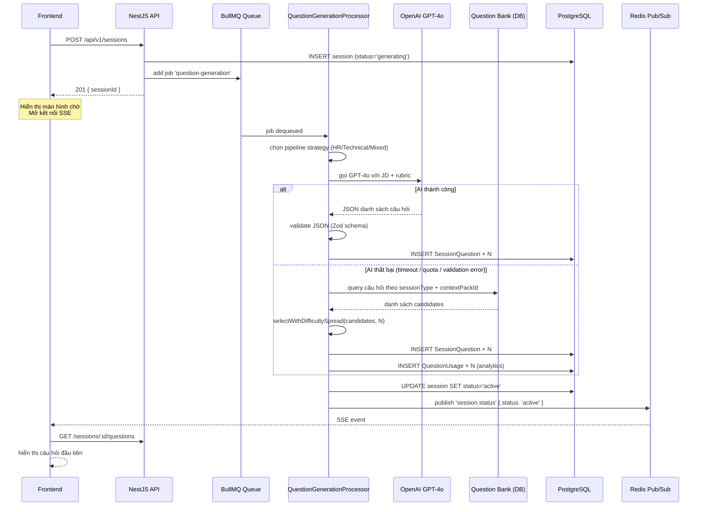

# Luồng sinh câu hỏi — Chi tiết kỹ thuật

Tài liệu này mô tả chi tiết Bước 2 trong [interview-flow.md](interview-flow.md): cách BullMQ worker xử lý job sinh câu hỏi, thuật toán chọn câu hỏi dự phòng từ Question Bank, cách lưu vào database, và cơ chế thông báo về frontend qua SSE.

> **Audit hiện tại:** tài liệu này có một số chi tiết đang lệch implementation hiện tại. Xem phân tích và bộ testcase kiểm chứng tại [test-plan/question-generation-flow-testcases.md](test-plan/question-generation-flow-testcases.md).

---

## Tổng quan luồng



---

## 1. Enqueue job — SessionService

Khi nhận `POST /api/v1/sessions`, `SessionService.create()` tạo session rồi đẩy job ngay lập tức mà không chờ AI:

```typescript
// Payload đẩy vào queue
{
  sessionId: string;         // UUID session vừa tạo
  userId: string;            // UUID user
  sessionType: 'hr' | 'technical' | 'mixed';
  jobDescriptionText: string;
  targetRoles: string[];
  contextPack: 'VN' | 'Western';
  language: string;          // ngôn ngữ hiển thị câu hỏi
  totalQuestions: number;    // 3–10, user chọn lúc setup
}

// Job options
{ attempts: 2, backoff: { type: 'fixed', delay: 2000 } }
```

Queue name: `question-generation`. BullMQ sẽ retry tối đa 2 lần nếu worker throw exception, mỗi lần cách nhau 2 giây.

---

## 2. Worker nhận job — QuestionGenerationProcessor

Worker `QuestionGenerationProcessor` đăng ký trên queue `question-generation`. Mỗi khi có job, `process()` chạy theo thứ tự sau:

### Bước 2.1 — Chọn pipeline strategy

```
sessionType = 'hr'        → HrPipelineService
sessionType = 'technical' → TechnicalPipelineService
sessionType = 'mixed'     → MixedPipelineService
```

Ba pipeline cùng implement interface `InterviewPipeline`, chỉ khác nhau ở prompt hướng dẫn GPT-4o:

- **HR pipeline**: tập trung hành vi (behavioral), khuyến khích ví dụ STAR.
- **Technical pipeline**: depth kỹ thuật, bài toán giải quyết vấn đề.
- **Mixed pipeline**: cân bằng giữa behavioral và technical.

### Bước 2.2 — Gọi GPT-4o sinh câu hỏi

Pipeline gọi GPT-4o qua 3 lớp prompt xây dựng tuần tự:

```
Layer 1 — Base system prompt
  Hướng dẫn chung: format JSON, số câu, thang difficulty 1–3.

Layer 2 — Context pack rubric
  Tiêm vào rubric đánh giá và cultural notes:
  - VN:      4 tiêu chí (clarity / structure / communication / culture_fit), 25% mỗi tiêu chí
  - Western: 5 tiêu chí (clarity / structure / communication / impact / leadership), 20% mỗi tiêu chí

Layer 3 — Dynamic context (XML-tagged để tránh prompt injection)
  <job_description>...</job_description>
  <target_roles>...</target_roles>
  <session_type>...</session_type>
```

**Tham số OpenAI:**

| Tham số | Giá trị | Lý do |
|---------|---------|-------|
| model | gpt-4o | độ chính xác cao nhất |
| temperature | 0.8 | đủ sáng tạo, không lặp lại |
| max_tokens | 600 | đủ cho 10 câu hỏi, tránh phí |
| response_format | json_object | buộc output là JSON hợp lệ |

**Timeout:** 120 giây ở tầng `OpenAIGateway`. Tuy nhiên BullMQ job timeout là 15 giây — effective timeout thực sự là 15 giây (xem phần ghi chú ở cuối).

### Bước 2.3 — Validate JSON trả về

Output của GPT-4o được parse và validate bằng Zod schema:

```typescript
// Schema kỳ vọng
{
  questions: [
    {
      text: string,               // nội dung câu hỏi
      category: string,           // ví dụ: "Teamwork", "Problem Solving"
      competency_domain: string,  // ví dụ: "collaboration", "technical_depth"
      difficulty: 1 | 2 | 3       // 1=dễ, 2=trung bình, 3=khó
    },
    // ...
  ]
}
```

Nếu JSON không hợp lệ (thiếu field, sai type, difficulty ngoài range) → throw `SCHEMA_VALIDATION_ERROR` → kích hoạt fallback.

---

## 3. Fallback — Question Bank

Fallback kích hoạt khi AI lỗi thuộc một trong các loại sau:

| Error code | Tình huống |
|------------|-----------|
| `AI_QUOTA_EXCEEDED` | hết OpenAI quota |
| `AI_RATE_LIMIT` | bị throttle |
| `AI_TIMEOUT` | không phản hồi trong 15 giây |
| `AI_EMPTY_RESPONSE` | trả về chuỗi rỗng |
| `SCHEMA_VALIDATION_ERROR` | JSON không đúng schema |

Các lỗi khác (network error, 5xx từ OpenAI) không kích hoạt fallback — BullMQ sẽ retry toàn bộ job.

### Thuật toán selectWithDifficultySpread

**Input:** danh sách candidates từ DB (đã lọc theo sessionType + contextPackId), số câu cần chọn `N`.

**Bước 1 — Phân 3 bucket theo difficulty:**

```
easy   = candidates.filter(q => q.difficulty <= 2)
medium = candidates.filter(q => q.difficulty === 3)
hard   = candidates.filter(q => q.difficulty >= 4)
```

> Lưu ý: Question Bank dùng thang 1–5, còn AI-generated dùng thang 1–3.
> Mapping: 1–2 = easy, 3 = medium, 4–5 = hard.

**Bước 2 — Tính số câu cần từ mỗi bucket:**

```
easyCount   = floor(N × 0.30)
mediumCount = floor(N × 0.50)
hardCount   = N - easyCount - mediumCount   // phần còn lại vào hard
```

Ví dụ với N = 5:

| Bucket | Tỉ lệ | Số câu |
|--------|-------|-------|
| Easy (difficulty 1–2) | 30% | 1 |
| Medium (difficulty 3) | 50% | 2 |
| Hard (difficulty 4–5) | 20% | 2 |

**Bước 3 — Lấy từ mỗi bucket:**

Nếu bucket có đủ câu: lấy `N` câu đầu tiên. Nếu thiếu: lấy hết bucket đó rồi bù từ `remaining` (toàn bộ candidates chưa được chọn).

**Bước 4 — Resolve translation:**

Mỗi câu trong Question Bank có field `translations: { "vi": "...", "en": "..." }`. Worker chọn ngôn ngữ theo `language` của session.

**Bước 5 — Ghi analytics:**

```typescript
// Ghi một row cho mỗi câu được dùng
questionUsages.createMany([
  { questionBankId, sessionId, userId, usedAt: now() },
  ...
])
```

Dữ liệu này phục vụ phân tích: câu nào được dùng nhiều nhất, có thể dùng để tránh trùng lặp cho cùng user trong tương lai.

---

## 4. Lưu câu hỏi vào database

Dù từ AI hay Question Bank, câu hỏi đều được persist vào bảng `session_questions`:

```
session_questions
├── id                UUID (PK)
├── session_id        UUID → interview_sessions
├── question_bank_id  UUID? → question_bank  [NULL nếu AI-generated]
├── question_text     TEXT   — nội dung câu hỏi
├── order_index       INT    — thứ tự 0, 1, 2... (dùng để phân trang)
├── question_category TEXT   — ví dụ: "Teamwork"
├── competency_domain TEXT   — ví dụ: "collaboration"
├── rubric_json       JSONB  — rubric đánh giá riêng cho câu hỏi này
└── estimated_time_min INT?  — thời gian dự kiến trả lời
```

**Điểm quan trọng:**

- `question_bank_id = NULL` khi AI sinh câu hỏi. Record trong `session_questions` chứa toàn bộ nội dung — không cần join ra bảng khác khi hiển thị.
- `rubric_json` lưu per-question (không dùng chung rubric của context pack). Điều này cho phép câu hỏi Technical và HR trong cùng session Mixed có criteria đánh giá khác nhau.
- `order_index` là integer tuần tự (0-based). Frontend dùng để fetch câu hỏi theo thứ tự và navigate prev/next.

**Sau khi INSERT xong**, worker gọi `markActiveUnlessStopped()`:

```typescript
// Kiểm tra trạng thái hiện tại trước khi set 'active'
// Tránh race condition khi user cancel ngay lúc worker đang chạy
const current = await prisma.interviewSession.findUnique({ where: { id: sessionId } })
if (current.status === 'generating') {
  await prisma.interviewSession.update({
    where: { id: sessionId },
    data: { status: 'active' }
  })
  return true   // → tiếp tục emit SSE
}
return false    // session đã bị cancel/error → bỏ qua
```

---

## 5. Thông báo frontend qua SSE

Worker emit qua `SseService`, service này publish lên Redis channel:

```
channel: sse:session:{sessionId}
event:   session.status
data:    { status: 'active', sessionId }
```

**Luồng từ Redis đến browser:**

```
SseService.emit()
  → redis.publish('sse:session:{id}', JSON.stringify({ event, data }))
    → SseController.subscribe() nhận qua RxJS Observable
      → HTTP response stream (text/event-stream)
        → browser EventSource nhận message
```

Frontend không nhận câu hỏi trực tiếp qua SSE. SSE chỉ là tín hiệu "đã sẵn sàng". Data thực sự được fetch riêng qua REST:

```
GET /api/v1/sessions/:id/questions
```

Pattern này có chủ đích: SSE không đảm bảo delivery order, payload lớn qua event stream dễ bị cắt, và REST response có thể cache/retry độc lập.

**Fallback polling:** Song song với SSE, frontend polling `GET /sessions/:id` mỗi 5 giây, tối đa 6 lần — phòng trường hợp SSE connection bị miss hoặc browser chặn.

---

## 6. Xử lý lỗi hoàn toàn (AI + fallback đều thất bại)

Nếu cả AI lẫn Question Bank đều thất bại, worker:

1. Gọi `markSessionError(sessionId)` → UPDATE status = `'error'`.
2. Emit SSE `session.status` với `{ status: 'error' }`.
3. Frontend nhận → hiển thị thông báo lỗi, không cho phép tiếp tục phỏng vấn.

Trường hợp này không retry lại vì:
- Nếu AI lỗi và Question Bank cũng lỗi → có vấn đề hệ thống (DB down hoặc data bị thiếu).
- BullMQ đã retry job-level 2 lần trước đó.

---

## 7. Config tóm tắt

| Thông số | Giá trị |
|----------|---------|
| Queue name | `question-generation` |
| Job attempts | 2 |
| Job backoff | fixed, 2000ms |
| BullMQ job timeout | 15 giây |
| OpenAI gateway timeout | 120 giây (bị override bởi job timeout) |
| OpenAI retries (gateway-level) | retry với delay 1s → 2s trước khi throw |
| Question Bank — difficulty spread | 30% easy / 50% medium / 20% hard |
| Fallback-eligible errors | QUOTA / RATE_LIMIT / TIMEOUT / EMPTY_RESPONSE / SCHEMA_VALIDATION |

---

## 8. Điểm cần lưu ý khi implement

**Timeout mismatch:** BullMQ job timeout (15s) nhỏ hơn OpenAI gateway timeout (120s). Effective timeout thực sự là 15s — OpenAI call bị kill bởi BullMQ trước khi gateway kịp timeout. Nên đồng bộ lại: hoặc tăng job timeout lên ~130s, hoặc giảm OpenAI timeout xuống ~12s cho task question-generation.

**Không shuffle trong difficulty bucket:** Nếu `selectWithDifficultySpread` không shuffle danh sách trước khi lấy, user tạo nhiều session với cùng sessionType sẽ nhận cùng bộ câu hỏi (luôn lấy N câu "đầu danh sách"). Cần random shuffle mỗi bucket trước khi slice.

**Fallback không lọc theo JD:** Question Bank trả về câu hỏi generic — không tailored theo vị trí trong JD. Đây là giới hạn chấp nhận được cho fallback, nhưng cần thông báo rõ ràng cho user ("câu hỏi tổng hợp, không tối ưu cho JD của bạn").

**Avoid-repeat chưa có:** `QuestionUsage` ghi lại lịch sử nhưng chưa có logic tránh dùng câu trùng cho cùng user. Nếu user luyện 3 session với sessionType = `technical`, họ có thể nhận cùng câu hỏi nhiều lần.

---

## Xem thêm

- [interview-flow.md](interview-flow.md) — tổng quan 7 bước từ đầu đến cuối
- [lld/05_ai_module.md](Design/DetailedDesign/lld/05_ai_module.md) — class interfaces, DTOs, processor specs
- [lld/03_session_module.md](Design/DetailedDesign/lld/03_session_module.md) — session lifecycle, trạng thái, rate limiting
- [database-design/](Design/DetailedDesign/database-design/) — schema đầy đủ, DDL, indexes
