# DB Design — Entity Relationship Diagram

Diagram bao gồm tất cả 15 tables với key columns và relationships.

Ký hiệu quan hệ:
- `||--||` = one-to-one (bắt buộc cả hai phía)
- `||--o{` = one-to-many (FK phía many là NOT NULL)
- `|o--o{` = optional-to-many (FK phía many là nullable)
- `|o--||` = optional FK lookup (FK nullable, nhưng target luôn tồn tại)

`ai_quality_log.session_id` là soft reference — không có FK constraint, không vẽ relationship line.

```mermaid
erDiagram
    context_packs {
        text id PK
        text name
        jsonb rubric_json
        jsonb scoring_weights
        timestamptz created_at
    }

    question_bank {
        uuid id PK
        text content
        text session_type
        int difficulty
        text context_pack_id FK
        text subcategory
        text competency_domain
        text[] applicable_roles
        text[] applicable_levels
        timestamptz deleted_at
    }

    users {
        uuid id PK
        text email
        text role
        text status
        boolean profile_completed
        timestamptz last_login_at
        timestamptz deleted_at
    }

    user_profiles {
        uuid id PK
        uuid user_id FK
        text full_name
        text target_role_category
        text target_level
        text preferred_tech_stack
        int years_experience
        text default_language
        boolean tts_enabled
        text placement_level
        text cv_file_url
        text cv_parsed_text
        jsonb cv_structured_json
        timestamptz deleted_at
    }

    interview_sessions {
        uuid id PK
        uuid user_id FK
        text context_pack_id FK
        text job_description
        text jd_source
        text jd_url
        text session_type
        int num_questions
        text difficulty
        text persona
        text mode
        int duration_min
        text language
        text status
        jsonb plan_json
        text opening_transcript
        jsonb self_eval_json
        int overall_score
        jsonb executive_summary_json
        jsonb comm_analysis_json
        jsonb competency_heatmap_json
        jsonb reverse_q_eval_json
        jsonb action_plan_json
        timestamptz completed_at
    }

    session_questions {
        uuid id PK
        uuid session_id FK
        uuid question_bank_id FK
        text question_text
        int order_index
        text question_category
        text competency_domain
        jsonb rubric_json
        int estimated_time_min
    }

    user_answers {
        uuid id PK
        uuid session_id FK
        uuid question_id FK
        text answer_mode
        text answer_text
        text audio_file_url
        int audio_duration_seconds
        int audio_size_bytes
        boolean skipped
        jsonb voice_metrics_json
        boolean feedback_generated
    }

    follow_up_questions {
        uuid id PK
        uuid user_answer_id FK
        text follow_up_text
        text trigger_rule
        text trigger_reason
        text follow_up_answer_text
    }

    rewrite_answers {
        uuid id PK
        uuid user_answer_id FK
        int attempt_number
        text rewrite_mode
        text rewrite_text
        text rewrite_audio_url
        int rewrite_audio_duration_seconds
        int delta_score
    }

    ai_feedbacks {
        uuid id PK
        uuid user_answer_id FK
        uuid rewrite_answer_id FK
        int overall_score
        text model_answer
        text key_takeaway
        text prompt_version
        boolean is_fallback
    }

    annotated_segments {
        uuid id PK
        uuid ai_feedback_id FK
        text segment_text
        int start_index
        int end_index
        text highlight_level
        text annotation
        text suggestion
        text improved_version
    }

    reverse_questions {
        uuid id PK
        uuid session_id FK
        text question_text
        text answer_mode
        text ai_response
        text evaluation_label
        text evaluation_comment
        int order_index
    }

    progress_snapshots {
        uuid id PK
        uuid user_id FK
        uuid session_id FK
        jsonb competency_scores_json
        int overall_score
    }

    placement_test_answers {
        uuid id PK
        uuid user_id FK
        int question_number
        text question_text
        text candidate_answer
        boolean is_correct
    }

    ai_quality_log {
        uuid id PK
        uuid session_id
        text job_type
        text prompt_version
        text model
        int input_tokens
        int output_tokens
        int latency_ms
        boolean is_fallback
        text error_code
    }

    context_packs    ||--o{ question_bank        : "context_pack_id"
    context_packs    ||--o{ interview_sessions   : "context_pack_id"
    users            ||--|| user_profiles        : "user_id"
    users            ||--o{ interview_sessions   : "user_id"
    users            ||--o{ progress_snapshots   : "user_id"
    users            ||--o{ placement_test_answers : "user_id"
    interview_sessions ||--o{ session_questions  : "session_id"
    interview_sessions ||--o{ user_answers       : "session_id"
    interview_sessions ||--o{ reverse_questions  : "session_id"
    interview_sessions ||--o{ progress_snapshots : "session_id"
    question_bank    |o--o{ session_questions    : "question_bank_id (nullable)"
    session_questions ||--o{ user_answers        : "question_id"
    user_answers     ||--o{ follow_up_questions  : "user_answer_id"
    user_answers     ||--o{ rewrite_answers      : "user_answer_id"
    user_answers     |o--o{ ai_feedbacks         : "user_answer_id (nullable)"
    rewrite_answers  |o--o{ ai_feedbacks         : "rewrite_answer_id (nullable)"
    ai_feedbacks     ||--o{ annotated_segments   : "ai_feedback_id"
```

## Ghi chú quan hệ

### ai_feedbacks — dual nullable FK

`ai_feedbacks` có hai FK nullable: `user_answer_id` và `rewrite_answer_id`. Constraint
`chk_feedback_source` đảm bảo đúng một trong hai là NOT NULL. Vì thế:

- Một `user_answer` có tối đa một `ai_feedbacks` row (original feedback)
- Một `rewrite_answer` có tối đa một `ai_feedbacks` row (rewrite evaluation)
- `annotated_segments` FK vào `ai_feedbacks.id` — tự động áp dụng cho cả hai trường hợp

### session_questions — nullable question_bank_id

`question_bank_id` là NULL khi câu hỏi do LLM generate động (không lấy từ seed bank).
Annotation `|o--o{` phản ánh: một `question_bank` row có thể không được reference bởi bất kỳ
`session_questions` nào (nếu chưa dùng), và một `session_questions` row có thể không reference
`question_bank` (nếu LLM-generated).

### ai_quality_log — no FK

`session_id` trong `ai_quality_log` là TEXT reference thuần túy, không có `REFERENCES` constraint.
Nếu session bị xóa, audit log giữ nguyên — đây là hành vi mong muốn cho audit trail.
