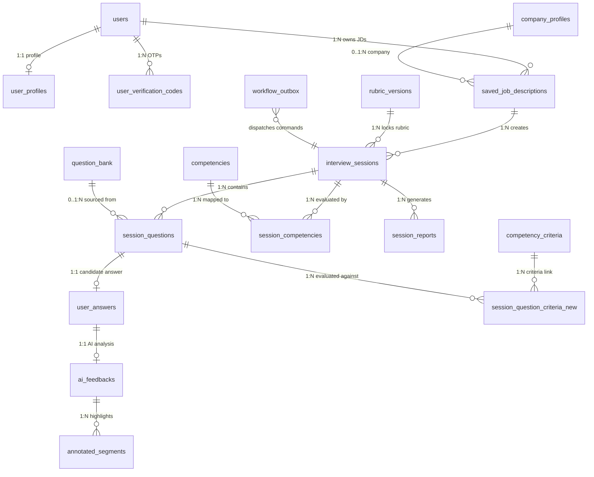
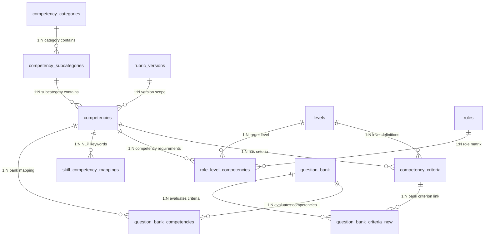
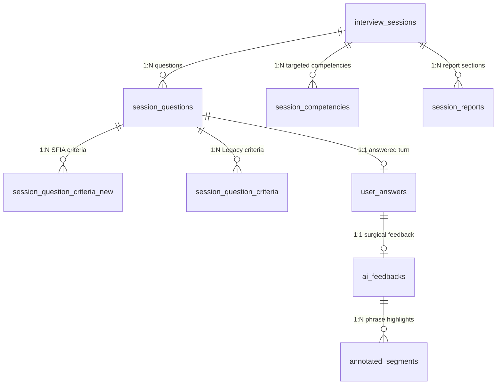

# Tài liệu Thiết kế Cơ sở Dữ liệu Hệ thống (Database Architecture & Data Dictionary)

> **Source of Truth:** `server/prisma/schema.prisma`  
> **Hệ quản trị CSDL:** PostgreSQL 15 (Supabase Cloud Hosted)  
> **ORM & Truy cập Dữ liệu:** Prisma Client v7 (preview features: `partialIndexes`)  
> **Kiến trúc Hệ thống:** Domain-Driven Design (DDD), Modular Monolith, Transactional Outbox Pattern, SFIA 9 Competency Framework  
> **Số lượng Bảng (Tables/Models):** 30 Models  
> **Số lượng Kiểu liệt kê (Enums):** 3 Enums  

---

## MỤC LỤC

1. [Phần I: Tổng quan Hạ tầng & Nguyên tắc Thiết kế](#phần-i-tổng-quan-hạ-tầng--nguyên-tắc-thiết-kế)
2. [Phần II: Sơ đồ Thực thể Quan hệ (ERD - Mermaid Diagrams)](#phần-ii-sơ-đồ-thực-thể-quan-hệ-erd---mermaid-diagrams)
   - [2.1 Sơ đồ Tổng quan Toàn hệ thống (System Overview ERD)](#21-sơ-đồ-tổng-quan-toàn-hệ-thống-system-overview-erd)
   - [2.2 Sơ đồ Khung Năng lực SFIA 9 & Ma trận Vai trò](#22-sơ-đồ-khung-năng-lực-sfia-9--ma-trận-vai-trò)
   - [2.3 Sơ đồ Vòng đời Phiên Phỏng vấn & Đánh giá AI](#23-sơ-đồ-vòng-đời-phiên-phỏng-vấn--đánh-giá-ai)
3. [Phần III: Danh mục Kiểu Liệt Kê (Enums)](#phần-iii-danh-mục-kiểu-liệt-kê-enums)
4. [Phần IV: Từ điển Dữ liệu Chi tiết 30 Thực thể (8 Bounded Contexts)](#phần-iv-từ-điển-dữ-liệu-chi-tiết-30-thực-thể-8-bounded-contexts)
   - [Domain 1: Quản trị Người dùng & Hồ sơ Ứng viên (User & Profile Context)](#domain-1-quản-trị-người-dùng--hồ-sơ-ứng-viên-user--profile-context)
   - [Domain 2: Hồ sơ Doanh nghiệp & Tin Tuyển dụng (Company & Job Context)](#domain-2-hồ-sơ-doanh-nghiệp--tin-tuyển-dụng-company--job-context)
   - [Domain 3: Khung Năng lực Chuẩn Quốc tế SFIA 9 (SFIA 9 Competency Taxonomy)](#domain-3-khung-năng-lực-chuẩn-quốc-tế-sfia-9-sfia-9-competency-taxonomy)
   - [Domain 4: Ngân hàng Câu hỏi Chuẩn hóa (Question Bank Context)](#domain-4-ngân-hàng-câu-hỏi-chuẩn-hóa-question-bank-context)
   - [Domain 5: Vòng đời & Thực thi Phiên Phỏng vấn (Interview Session Lifecycle)](#domain-5-vòng-đời--thực-thi-phiên-phỏng-vấn-interview-session-lifecycle)
   - [Domain 6: Đánh giá Câu trả lời & Phân tích AI (Turn Evaluation & AI Feedback)](#domain-6-đánh-giá-câu-trả-lời--phân-tích-ai-turn-evaluation--ai-feedback)
   - [Domain 7: Xử lý Bất đồng bộ & Outbox Pattern (Async Messaging & Outbox)](#domain-7-xử-lý-bất-đồng-bộ--outbox-pattern-async-messaging--outbox)
   - [Domain 8: Hệ thống Tiêu chí Cũ (Legacy Rubrics - Backward Compatibility)](#domain-8-hệ-thống-tiêu-chí-cũ-legacy-rubrics---backward-compatibility)
5. [Phần V: Cơ chế Kỹ thuật Nâng cao & Đảm bảo Toàn vẹn Dữ liệu](#phần-v-cơ-chế-kỹ-thuật-nâng-cao--đảm-bảo-toàn-vẹn-dữ-liệu)
   - [5.1 Transactional Outbox Pattern & Eventual Consistency](#51-transactional-outbox-pattern--eventual-consistency)
   - [5.2 Tính Bất biến Lịch sử (Historical Immutability & Snapshotting)](#52-tính-bất-biến-lịch-sử-historical-immutability--snapshotting)
   - [5.3 Cơ chế Chuyển tiếp & Song hành (Legacy Rubrics $\leftrightarrow$ SFIA 9)](#53-cơ-chế-chuyển-tiếp--song-hành-legacy-rubrics-leftrightarrow-sfia-9)
   - [5.4 Quản trị Schema Dữ liệu Bán Cấu trúc (JSONB Governance)](#54-quản-trị-schema-dữ-liệu-bán-cấu-trúc-jsonb-governance)
6. [Phần VI: Chiến lược Đánh Chỉ mục & Tối ưu Hiệu năng (Indexing & Optimization)](#phần-vi-chiến-lược-đánh-chỉ-mục--tối-ưu-hiệu-năng-indexing--optimization)
7. [Phần VII: Bảng Đối chiếu & Thay đổi So với Bản thiết kế Cũ](#phần-vii-bảng-đối-chiếu--thay-đổi-so-với-bản-thiết-kế-cũ)

---

## PHẦN I: TỔNG QUAN HẠ TẦNG & NGUYÊN TẮC THIẾT KẾ

### 1.1 Thông số Kỹ thuật
* **Hệ quản trị CSDL:** PostgreSQL 15 chạy trên hạ tầng điện toán đám mây Supabase.
* **ORM:** Prisma 7 với cấu hình `previewFeatures = ["partialIndexes"]` hỗ trợ đánh chỉ mục có điều kiện trực tiếp trong schema.
* **Quy ước Định danh:**
  * **Database level:** `snake_case` cho tên bảng và tên cột (vd: `interview_sessions`, `saved_job_description_id`).
  * **Prisma schema level:** `PascalCase` cho tên Model (vd: `InterviewSession`) và `camelCase` cho tên trường (vd: `savedJobDescriptionId`).
* **Chuẩn Khóa chính (Primary Key):** Toàn bộ các bảng sử dụng kiểu định danh duy nhất toàn cầu **UUID v4** sinh tự động thông qua hàm `gen_random_uuid()` của PostgreSQL (ngoại trừ bảng `users` nhận trực tiếp UUID từ tầng xác thực).
* **Mốc thời gian (Timestamps):** Tất cả các trường ngày giờ đều sử dụng kiểu dữ liệu `TIMESTAMPTZ(6)` (Timestamp with Timezone độ chính xác microsecond) với giá trị mặc định `now()`. Các bảng có trạng thái cập nhật sử dụng thuộc tính `@updatedAt` của Prisma.

### 1.2 Nguyên tắc Kiến trúc Thiết kế CSDL (Architectural Principles)

```
┌──────────────────────────────────────────────────────────────────────────┐
│                        CORE DATABASE PRINCIPLES                          │
├───────────────────┬──────────────────────┬───────────────────────────────┤
│    3NF STRICT     │ HISTORICAL ISOLATION │     TRANSACTIONAL OUTBOX      │
│  Loại bỏ trùng lặp│  Snapshot JD & tiêu  │  Ngăn ngừa Dual-Write khi gọi │
│  dữ liệu người    │  chí, phiên cũ không │  LLM/Queue, đảm bảo Eventual  │
│  dùng & session   │  bị lệch khi sửa JD  │  Consistency cho AI pipeline  │
├───────────────────┼──────────────────────┼───────────────────────────────┤
│    SFIA 9 TAXONOMY│    JSONB GOVERNANCE  │      SAFE INTEGRITY RULES     │
│  Chuẩn hóa quốc tế│  Linh hoạt cho CV,   │  CASCADE cho dữ liệu phụ thuộc│
│  kỹ năng 7 cấp độ │  Voice metrics & Báo │  RESTRICT cho dữ liệu gốc quan│
│  đa chiều IT      │  cáo đa phân đoạn    │  trọng (Rubric, JD, Session)  │
└───────────────────┴──────────────────────┴───────────────────────────────┘
```

1. **Chuẩn hóa 3NF & Cô lập Quyền sở hữu:**
   * Bảng `interview_sessions` không lưu thừa `user_id` hay `job_title`. Quyền sở hữu phiên phỏng vấn được xác định thông qua khóa ngoại `saved_job_description_id` liên kết tới `saved_job_descriptions` của người dùng.
2. **Tính Bất biến của Phiên Đánh giá (Historical Immutability):**
   * Khi tạo phiên phỏng vấn, toàn bộ nội dung JD được sao chép snapshot vào trường `interview_sessions.job_description`. Khi người dùng chỉnh sửa hoặc xóa JD gốc trong kho, kết quả và bối cảnh phỏng vấn trong quá khứ hoàn toàn không bị ảnh hưởng.
   * Danh sách năng lực đánh giá được "đóng băng" thành các bản ghi trong `session_competencies`.
3. **Mô hình Xuất bản Sự kiện Tin cậy (Transactional Outbox Pattern):**
   * Mọi tác vụ kích hoạt luồng AI (sinh câu hỏi, chấm điểm, sinh báo cáo) được ghi đồng thời vào bảng `workflow_outbox` bên trong cùng một Database Transaction với bản ghi nghiệp vụ, loại trừ hoàn toàn rủi ro mất mát dữ liệu do sự cố mạng giữa App Server và Message Broker/AI Engine.
4. **Chuẩn hóa Khung Năng lực Quốc tế SFIA 9:**
   * Thay thế hoàn toàn cách tiếp cận rubric cố định bằng ma trận kỹ năng SFIA 9 (Categories $\to$ Subcategories $\to$ Competencies $\times$ Levels $\to$ Criteria).
5. **Xóa Mềm (Soft Deletion) & Partial Indexing:**
   * Các thực thể quan trọng (`saved_job_descriptions`, `question_bank`) sử dụng trường `deleted_at`. Hệ thống xây dựng Partial Indexes lọc `WHERE deleted_at IS NULL` để đảm bảo tốc độ truy vấn trên tập dữ liệu active đạt hiệu năng tối đa.

---

## PHẦN II: SƠ ĐỒ THỰC THỂ QUAN HỆ (MERMAID ERD DIAGRAMS)

### 2.1 Sơ đồ Tổng quan Toàn hệ thống (System Overview ERD)

Sơ đồ dưới đây mô tả mối liên kết xuyên suốt giữa 8 Bounded Contexts trong kiến trúc cơ sở dữ liệu:



---

### 2.2 Sơ đồ Khung Năng lực SFIA 9 & Ma trận Vai trò

Mô hình dữ liệu chuẩn hóa SFIA 9 thể hiện mối quan hệ giữa Cây phân cấp năng lực, Ma trận 7 Cấp độ Trách nhiệm và Ánh xạ Vị trí công việc:



---

### 2.3 Sơ đồ Vòng đời Phiên Phỏng vấn & Đánh giá AI

Mô hình chi tiết về chuỗi thu thập âm thanh, chuyển văn bản (STT), chấm điểm AI đa tầng và báo cáo tổng hợp:



---

## PHẦN III: DANH MỤC KIỂU LIỆT KÊ (ENUMS)

### 1. `UserRole`
Phân quyền truy cập hệ thống theo chuẩn Role-Based Access Control (RBAC):
* `candidate`: Người dùng thông thường (ứng viên luyện phỏng vấn, quản lý JD, làm bài test và xem báo cáo cá nhân).
* `admin`: Quản trị viên hệ thống (quản lý ngân hàng câu hỏi, cấu hình khung năng lực SFIA 9, giám sát tiến trình hệ thống).

### 2. `AccountStatus`
Quản lý vòng đời và trạng thái bảo mật của tài khoản người dùng:
* `active`: Tài khoản đang hoạt động bình thường.
* `locked`: Tài khoản bị tạm khóa do vi phạm chính sách hoặc phát hiện bất thường bảo mật.
* `deleted`: Tài khoản đã bị xóa (soft delete ở tầng nghiệp vụ).
* `password_reset_required`: Yêu cầu người dùng bắt buộc phải đổi mật khẩu ở lần đăng nhập tiếp theo.

### 3. `QuestionSessionType`
Phân loại hình thức và mục tiêu của câu hỏi phỏng vấn:
* `hr`: Câu hỏi nhân sự, văn hóa doanh nghiệp, tình huống ứng xử, kỹ năng mềm (Behavioral Questions).
* `technical`: Câu hỏi chuyên môn kỹ thuật, kiến trúc hệ thống, thuật toán, tư duy giải quyết vấn đề (Technical Questions).

---

## PHẦN IV: TỪ ĐIỂN DỮ LIỆU CHI TIẾT 30 THỰC THỂ (8 BOUNDED CONTEXTS)

---

### DOMAIN 1: QUẢN TRỊ NGƯỜI DÙNG & HỒ SƠ ỨNG VIÊN (USER & PROFILE CONTEXT)

#### 1. `users`
* **Prisma Model:** `User`
* **Mục đích & Vai trò:** Quản lý thực thể người dùng cốt lõi, phục vụ xác thực (Authentication), phân quyền (Authorization) và kiểm soát phiên làm việc an toàn.
* **Cơ chế đặc biệt:** Cột `token_version` hỗ trợ thu hồi toàn bộ Refresh Tokens (Global Logout / Password Reset) tức thời mà không cần Redis blacklist.

| Tên Cột | Kiểu Dữ Liệu | Nullable | Mặc Định | Khóa Ngoại / Tham Chiếu | Mô Tả Kỹ Thuật & Nghiệp Vụ |
|:---|:---|:---:|:---|:---|:---|
| `id` | `UUID` | **NO** | — | **PK** | Mã định danh duy nhất của người dùng. |
| `email` | `TEXT` | **NO** | — | **UNIQUE** | Email đăng nhập, chuẩn hóa chữ thường. |
| `role` | `UserRole` | **NO** | `'candidate'` | Enum `UserRole` | Vai trò người dùng (`candidate`, `admin`). |
| `status` | `AccountStatus` | **NO** | `'active'` | Enum `AccountStatus` | Trạng thái tài khoản. |
| `first_name` | `TEXT` | YES | — | — | Tên của người dùng. |
| `last_name` | `TEXT` | YES | — | — | Họ và tên đệm của người dùng. |
| `password_hash` | `TEXT` | **NO** | — | — | Chuỗi băm mật khẩu bảo mật (Argon2id hoặc Bcrypt). |
| `token_version` | `INT` | **NO** | `0` | — | Phiên bản token, tăng lên để vô hiệu hóa JWT cũ. |
| `created_at` | `TIMESTAMPTZ(6)` | **NO** | `now()` | — | Thời điểm tạo tài khoản. |
| `updated_at` | `TIMESTAMPTZ(6)` | **NO** | `now()` | `@updatedAt` | Thời điểm cập nhật thông tin gần nhất. |

* **Chỉ mục & Ràng buộc:**
  * `users_email_key` (`UNIQUE` trên `email`).
* **Hành vi Toàn vẹn (Integrity):**
  * `ON DELETE CASCADE` tới `user_profiles`, `saved_job_descriptions`, `user_verification_codes`.

---

#### 2. `user_verification_codes`
* **Prisma Model:** `UserVerificationCode`
* **Mục đích & Vai trò:** Lưu trữ mã xác thực OTP dùng một lần cho các luồng: Kích hoạt tài khoản, Xác thực email, Đặt lại mật khẩu bị quên.

| Tên Cột | Kiểu Dữ Liệu | Nullable | Mặc Định | Khóa Ngoại / Tham Chiếu | Mô Tả Kỹ Thuật & Nghiệp Vụ |
|:---|:---|:---:|:---|:---|:---|
| `id` | `UUID` | **NO** | `gen_random_uuid()` | **PK** | Mã định danh bản ghi xác thực. |
| `user_id` | `UUID` | **NO** | — | **FK** $\to$ `users.id` | Người dùng sở hữu mã xác thực. |
| `purpose` | `TEXT` | **NO** | — | — | Mục đích tạo mã (vd: `email_verification`, `password_reset`). |
| `code_hash` | `TEXT` | **NO** | — | — | Chuỗi băm mã OTP (tránh lưu plaintext trong DB). |
| `expires_at` | `TIMESTAMPTZ(6)` | **NO** | — | — | Thời điểm mã hết hiệu lực (thường 5-15 phút). |
| `created_at` | `TIMESTAMPTZ(6)` | **NO** | `now()` | — | Thời điểm phát hành mã OTP. |

* **Chỉ mục & Ràng buộc:**
  * `user_verification_codes_user_purpose_key` (`UNIQUE` trên `(user_id, purpose)`): Đảm bảo tại một thời điểm mỗi người dùng chỉ có 1 OTP hợp lệ cho 1 mục đích.
  * `idx_user_verification_codes_expires_at` (Index trên `expires_at`): Tối ưu truy vấn dọn dẹp các mã hết hạn.
* **Hành vi Toàn vẹn:** `ON DELETE CASCADE` theo `users`.

---

#### 3. `user_profiles`
* **Prisma Model:** `UserProfile`
* **Mục đích & Vai trò:** Lưu trữ hồ sơ ứng viên chi tiết, mục tiêu phát triển nghề nghiệp và các cấu phần CV (Kinh nghiệm, Học vấn, Dự án, Kỹ năng) dưới dạng bán cấu trúc JSONB.

| Tên Cột | Kiểu Dữ Liệu | Nullable | Mặc Định | Khóa Ngoại / Tham Chiếu | Mô Tả Kỹ Thuật & Nghiệp Vụ |
|:---|:---|:---:|:---|:---|:---|
| `id` | `UUID` | **NO** | `gen_random_uuid()` | **PK** | Mã định danh hồ sơ. |
| `user_id` | `UUID` | **NO** | — | **UNIQUE FK** $\to$ `users.id` | Tham chiếu 1:1 với người dùng. |
| `target_position` | `TEXT` | YES | — | — | Vị trí công việc mục tiêu (vd: "Senior Backend Engineer"). |
| `target_level` | `TEXT` | YES | — | — | Cấp độ kỳ vọng (vd: "Senior", "Lead", "SFIA Level 4"). |
| `personality` | `TEXT` | YES | — | — | Phong cách làm việc, nét tính cách nổi bật. |
| `education` | `JSONB` | YES | — | — | Mảng JSON chứa danh sách trường lớp, bằng cấp, thời gian. |
| `work_experience`| `JSONB` | YES | — | — | Mảng JSON chứa lịch sử công tác, công ty, thành tích. |
| `projects` | `JSONB` | YES | — | — | Mảng JSON chứa các dự án nổi bật, vai trò, công nghệ. |
| `technical_skills`| `JSONB` | YES | — | — | Danh sách kỹ năng kỹ thuật và mức độ thành thạo. |
| `certifications` | `JSONB` | YES | — | — | Mảng JSON chứa chứng chỉ chuyên môn (AWS, PMP...). |
| `awards` | `JSONB` | YES | — | — | Mảng JSON chứa giải thưởng, thành tựu. |
| `created_at` | `TIMESTAMPTZ(6)` | **NO** | `now()` | — | Thời điểm tạo hồ sơ. |
| `updated_at` | `TIMESTAMPTZ(6)` | **NO** | `now()` | `@updatedAt` | Thời điểm cập nhật hồ sơ gần nhất. |

* **Chỉ mục & Ràng buộc:** `user_profiles_user_id_key` (`UNIQUE` trên `user_id`).
* **Hành vi Toàn vẹn:** `ON DELETE CASCADE` theo `users`.

---

### DOMAIN 2: HỒ SƠ DOANH NGHIỆP & TIN TUYỂN DỤNG (COMPANY & JOB CONTEXT)

#### 4. `company_profiles`
* **Prisma Model:** `CompanyProfile`
* **Mục đích & Vai trò:** Lưu trữ danh mục thông tin các công ty, doanh nghiệp tuyển dụng, cung cấp dữ liệu bối cảnh văn hóa để AI cá nhân hóa câu hỏi và phản hồi.

| Tên Cột | Kiểu Dữ Liệu | Nullable | Mặc Định | Khóa Ngoại / Tham Chiếu | Mô Tả Kỹ Thuật & Nghiệp Vụ |
|:---|:---|:---:|:---|:---|:---|
| `id` | `UUID` | **NO** | `gen_random_uuid()` | **PK** | Mã định danh công ty. |
| `name` | `TEXT` | **NO** | — | — | Tên chính thức của doanh nghiệp/công ty. |
| `website` | `TEXT` | YES | — | — | Địa chỉ trang web chính thức. |
| `description` | `TEXT` | YES | — | — | Giới thiệu tổng quan về công ty và văn hóa doanh nghiệp. |
| `industry` | `TEXT` | YES | — | — | Ngành nghề kinh doanh (vd: FinTech, E-Commerce, SaaS). |
| `location` | `TEXT` | YES | — | — | Trụ sở chính / Địa điểm làm việc. |
| `company_size` | `TEXT` | YES | — | — | Quy mô nhân sự (vd: "50-200 nhân viên", "1000+ nhân viên"). |
| `logo_url` | `TEXT` | YES | — | — | Đường dẫn CDN lưu trữ hình ảnh logo công ty. |
| `created_at` | `TIMESTAMPTZ(6)` | **NO** | `now()` | — | Thời điểm tạo thông tin công ty. |
| `updated_at` | `TIMESTAMPTZ(6)` | **NO** | `now()` | `@updatedAt` | Thời điểm cập nhật thông tin gần nhất. |

* **Chỉ mục & Ràng buộc:** `idx_company_profiles_name` (Index trên `name` phục vụ tìm kiếm auto-complete).

---

#### 5. `saved_job_descriptions`
* **Prisma Model:** `SavedJobDescription`
* **Mục đích & Vai trò:** Kho lưu trữ Mô tả Công việc (Job Description - JD) của ứng viên. Đây là trung tâm để AI bóc tách yêu cầu năng lực và cấu hình phiên phỏng vấn.

| Tên Cột | Kiểu Dữ Liệu | Nullable | Mặc Định | Khóa Ngoại / Tham Chiếu | Mô Tả Kỹ Thuật & Nghiệp Vụ |
|:---|:---|:---:|:---|:---|:---|
| `id` | `UUID` | **NO** | `gen_random_uuid()` | **PK** | Mã định danh bản ghi JD đã lưu. |
| `user_id` | `UUID` | **NO** | — | **FK** $\to$ `users.id` | Người dùng sở hữu JD này. |
| `company_profile_id`| `UUID`| YES | — | **FK** $\to$ `company_profiles.id` | Liên kết hồ sơ công ty (nếu có). |
| `company_name` | `TEXT` | **NO** | — | — | Tên công ty ứng tuyển (lưu trực tiếp). |
| `company_website` | `TEXT` | YES | — | — | Website công ty ứng tuyển. |
| `job_title` | `TEXT` | **NO** | — | — | Tiêu đề vị trí tuyển dụng (vd: "Senior DevOps"). |
| `level` | `TEXT` | YES | — | — | Cấp bậc tuyển dụng (Junior, Middle, Senior, Lead). |
| `headcount` | `TEXT` | YES | — | — | Số lượng tuyển dụng. |
| `location` | `TEXT` | YES | — | — | Địa điểm làm việc (Hà Nội, TP.HCM, Remote...). |
| `requirements` | `TEXT` | **NO** | — | — | Yêu cầu bắt buộc trích xuất từ tin tuyển dụng. |
| `job_content` | `TEXT` | **NO** | — | — | Toàn bộ nội dung gốc của tin tuyển dụng. |
| `tech_stack` | `TEXT[]` | **NO** | `{}` | — | Mảng danh sách công nghệ chính (vd: `['Go', 'Postgres', 'Docker']`). |
| `benefits` | `TEXT` | YES | — | — | Chế độ đãi ngộ, phúc lợi của vị trí. |
| `salary` | `TEXT` | YES | — | — | Mức lương tuyển dụng. |
| `bonus` | `TEXT` | YES | — | — | Thưởng và phụ cấp. |
| `last_used_at` | `TIMESTAMPTZ(6)` | YES | — | — | Thời điểm JD này được dùng để tạo session gần nhất. |
| `deleted_at` | `TIMESTAMPTZ(6)` | YES | — | — | Cột đánh dấu xóa mềm (Soft Delete). |
| `created_at` | `TIMESTAMPTZ(6)` | **NO** | `now()` | — | Thời điểm lưu JD. |
| `updated_at` | `TIMESTAMPTZ(6)` | **NO** | `now()` | `@updatedAt` | Thời điểm cập nhật JD gần nhất. |

* **Chỉ mục & Ràng buộc:**
  * `idx_saved_job_descriptions_user_updated` on `(user_id, updated_at DESC)`: Tối ưu trang thư viện JD người dùng.
  * `idx_saved_job_descriptions_user_company_title` on `(user_id, company_name, job_title)`: Tối ưu lọc và tìm kiếm JD.
* **Hành vi Toàn vẹn:**
  * `user_id`: `ON DELETE CASCADE` (xóa user thì xóa kho JD của user).
  * `company_profile_id`: `ON DELETE SET NULL` (xóa company không xóa JD).
  * Tham chiếu từ `interview_sessions`: `ON DELETE RESTRICT` (không thể xóa vật lý JD nếu đã có session phỏng vấn liên kết).

---

### DOMAIN 3: KHUNG NĂNG LỰC CHUẨN QUỐC TẾ SFIA 9 (SFIA 9 COMPETENCY TAXONOMY)

Khung năng lực SFIA 9 (Skills Framework for the Information Age phiên bản 9) cung cấp bộ phân loại chuẩn quốc tế gồm 6 danh mục lớn, hàng chục nhóm kỹ năng con, 102+ kỹ năng chuyên sâu và ma trận 7 cấp độ trách nhiệm hành vi.

```
┌─────────────────────────────────────────────────────────────┐
│                    SFIA 9 HIERARCHY TREE                    │
├─────────────────────────────────────────────────────────────┤
│  CompetencyCategory (6 Đại Danh mục SFIA)                   │
│    └── CompetencySubcategory (Nhóm Năng lực Chuyên biệt)    │
│          └── Competency (102+ Kỹ năng SFIA, vd: PROG, DBDS) │
│                ├── CompetencyCriterion (Ma trận x Levels)   │
│                └── RoleLevelCompetency (Ánh xạ Roles x Lvl) │
└─────────────────────────────────────────────────────────────┘
```

#### 6. `competency_categories`
* **Prisma Model:** `CompetencyCategory`
* **Mục đích & Vai trò:** Lưu trữ 6 danh mục năng lực cấp cao nhất của SFIA 9 (Strategy & Architecture, Change & Transformation, Development & Implementation, Delivery & Operation, Skills & Quality, Relationships & Engagement).

| Tên Cột | Kiểu Dữ Liệu | Nullable | Mặc Định | Khóa Ngoại / Tham Chiếu | Mô Tả Kỹ Thuật & Nghiệp Vụ |
|:---|:---|:---:|:---|:---|:---|
| `id` | `UUID` | **NO** | `gen_random_uuid()` | **PK** | Mã định danh danh mục. |
| `code` | `TEXT` | **NO** | — | **UNIQUE** | Mã chuẩn SFIA Category (vd: `DEV_IMP`, `STR_ARC`). |
| `name` | `TEXT` | **NO** | — | — | Tên danh mục (vd: "Development and implementation"). |
| `description` | `TEXT` | YES | — | — | Mô tả phạm vi năng lực thuộc danh mục này. |
| `display_order` | `INT` | **NO** | `0` | — | Thứ tự sắp xếp giao diện người dùng. |
| `created_at` | `TIMESTAMPTZ(6)` | **NO** | `now()` | — | Thời điểm khởi tạo danh mục. |

* **Chỉ mục & Ràng buộc:** `competency_categories_code_key` (`UNIQUE` trên `code`).

---

#### 7. `competency_subcategories`
* **Prisma Model:** `CompetencySubcategory`
* **Mục đích & Vai trò:** Phân loại chi tiết các nhóm kỹ năng trực thuộc danh mục cấp cao (vd: "Systems development", "User experience", "Data and analytics").

| Tên Cột | Kiểu Dữ Liệu | Nullable | Mặc Định | Khóa Ngoại / Tham Chiếu | Mô Tả Kỹ Thuật & Nghiệp Vụ |
|:---|:---|:---:|:---|:---|:---|
| `id` | `UUID` | **NO** | `gen_random_uuid()` | **PK** | Mã định danh danh mục con. |
| `category_id` | `UUID` | **NO** | — | **FK** $\to$ `competency_categories.id` | Danh mục cha cấp 1. |
| `code` | `TEXT` | **NO** | — | **UNIQUE** | Mã định danh chuẩn (vd: `SYS_DEV`). |
| `name` | `TEXT` | **NO** | — | — | Tên danh mục con (vd: "Systems development"). |
| `description` | `TEXT` | YES | — | — | Mô tả chi tiết nhóm kỹ năng con. |
| `display_order` | `INT` | **NO** | `0` | — | Thứ tự hiển thị. |
| `created_at` | `TIMESTAMPTZ(6)` | **NO** | `now()` | — | Thời điểm tạo bản ghi. |

* **Chỉ mục & Ràng buộc:**
  * `competency_subcategories_code_key` (`UNIQUE` trên `code`).
  * `idx_competency_subcategories_category_id` (Index trên `category_id`).
* **Hành vi Toàn vẹn:** `ON DELETE CASCADE` theo `competency_categories`.

---

#### 8. `levels`
* **Prisma Model:** `Level`
* **Mục đích & Vai trò:** Định nghĩa 7 Cấp độ Trách nhiệm (Levels of Responsibility) theo chuẩn SFIA 9 (Level 1: Follow $\to$ Level 7: Set Strategy/Inspire), chứa định nghĩa chi tiết về 5 thuộc tính năng lực phổ quát.

| Tên Cột | Kiểu Dữ Liệu | Nullable | Mặc Định | Khóa Ngoại / Tham Chiếu | Mô Tả Kỹ Thuật & Nghiệp Vụ |
|:---|:---|:---:|:---|:---|:---|
| `id` | `UUID` | **NO** | `gen_random_uuid()` | **PK** | Mã định danh cấp độ. |
| `code` | `TEXT` | **NO** | — | **UNIQUE** | Mã cấp độ (vd: `LV1`, `LV2`, ..., `LV7`). |
| `name` | `TEXT` | **NO** | — | — | Tên cấp độ (vd: "Apply", "Enable", "Ensure and advise"). |
| `rank` | `INT` | **NO** | — | **UNIQUE** | Thứ tự cấp bậc từ 1 đến 7. |
| `autonomy` | `TEXT` | YES | — | — | Thuộc tính Tính tự chủ (Autonomy descriptor). |
| `influence` | `TEXT` | YES | — | — | Thuộc tính Mức độ ảnh hưởng (Influence descriptor). |
| `complexity` | `TEXT` | YES | — | — | Thuộc tính Độ phức tạp công việc (Complexity descriptor). |
| `business_skills`| `TEXT` | YES | — | — | Kỹ năng kinh doanh/giao tiếp (Business skills). |
| `knowledge` | `TEXT` | YES | — | — | Chiều sâu và bề rộng kiến thức (Knowledge depth). |
| `description` | `TEXT` | YES | — | — | Tổng hợp mô tả tổng quan của cấp độ. |
| `created_at` | `TIMESTAMPTZ(6)` | **NO** | `now()` | — | Thời điểm tạo bản ghi. |

* **Chỉ mục & Ràng buộc:**
  * `levels_code_key` (`UNIQUE` trên `code`).
  * `levels_rank_key` (`UNIQUE` trên `rank`).

---

#### 9. `roles`
* **Prisma Model:** `Role`
* **Mục đích & Vai trò:** Danh mục các vị trí/chức danh công việc tiêu chuẩn trong ngành CNTT (vd: "Frontend Developer", "Data Engineer", "Solutions Architect").

| Tên Cột | Kiểu Dữ Liệu | Nullable | Mặc Định | Khóa Ngoại / Tham Chiếu | Mô Tả Kỹ Thuật & Nghiệp Vụ |
|:---|:---|:---:|:---|:---|:---|
| `id` | `UUID` | **NO** | `gen_random_uuid()` | **PK** | Mã định danh chức danh. |
| `code` | `TEXT` | **NO** | — | **UNIQUE** | Mã định danh vai trò (vd: `ROLE_SWE`, `ROLE_DEVOPS`). |
| `name` | `TEXT` | **NO** | — | — | Tên vị trí công việc (vd: "Software Engineer"). |
| `description` | `TEXT` | YES | — | — | Mô tả trách nhiệm của vị trí công việc. |
| `created_at` | `TIMESTAMPTZ(6)` | **NO** | `now()` | — | Thời điểm tạo bản ghi. |

* **Chỉ mục & Ràng buộc:** `roles_code_key` (`UNIQUE` trên `code`).

---

#### 10. `competencies`
* **Prisma Model:** `Competency`
* **Mục đích & Vai trò:** Thực thể kỹ năng chuyên biệt cốt lõi theo SFIA 9 (vd: `PROG` - Software development, `DBDS` - Database design, `TEST` - Testing). Mỗi năng lực được quản lý theo phiên bản rubric và thuộc về một danh mục con.

| Tên Cột | Kiểu Dữ Liệu | Nullable | Mặc Định | Khóa Ngoại / Tham Chiếu | Mô Tả Kỹ Thuật & Nghiệp Vụ |
|:---|:---|:---:|:---|:---|:---|
| `id` | `UUID` | **NO** | `gen_random_uuid()` | **PK** | Mã định danh kỹ năng. |
| `rubric_version_id`| `UUID` | **NO** | — | **FK** $\to$ `rubric_versions.id` | Phiên bản rubric/framework quản lý. |
| `subcategory_id` | `UUID` | YES | — | **FK** $\to$ `competency_subcategories.id` | Nhóm năng lực con trực thuộc. |
| `code` | `TEXT` | **NO** | — | — | Mã chuẩn SFIA 4 ký tự (vd: `PROG`, `TEST`, `ITOP`). |
| `name` | `TEXT` | **NO** | — | — | Tên chuẩn của kỹ năng (vd: "Software development"). |
| `overall_description`| `TEXT`| YES | — | — | Mô tả tổng thể bản chất của kỹ năng. |
| `guidance_notes` | `TEXT` | YES | — | — | Hướng dẫn áp dụng và phạm vi đánh giá năng lực. |
| `display_order` | `INT` | **NO** | `0` | — | Thứ tự sắp xếp. |
| `created_at` | `TIMESTAMPTZ(6)` | **NO** | `now()` | — | Thời điểm tạo bản ghi. |
| `updated_at` | `TIMESTAMPTZ(6)` | **NO** | `now()` | `@updatedAt` | Thời điểm cập nhật gần nhất. |

* **Chỉ mục & Ràng buộc:**
  * `competencies_rubric_version_code_key` (`UNIQUE` trên `(rubric_version_id, code)`).
  * `idx_competencies_rubric_version` (Index trên `rubric_version_id`).
  * `idx_competencies_subcategory` (Index trên `subcategory_id`).
* **Hành vi Toàn vẹn:**
  * `rubric_version_id`: `ON DELETE CASCADE`.
  * `subcategory_id`: `ON DELETE RESTRICT/NO ACTION`.

---

#### 11. `competency_criteria`
* **Prisma Model:** `CompetencyCriterion`
* **Mục đích & Vai trò:** Tiêu chí đánh giá hành vi chi tiết tại giao điểm giữa **Kỹ năng (Competency)** và **Cấp độ (Level)** trong SFIA 9. Một kỹ năng SFIA có thể xuất hiện từ Level 2 đến Level 6, mỗi Level có mô tả hành vi và chỉ báo năng lực (Behavioral Indicators) riêng biệt.

| Tên Cột | Kiểu Dữ Liệu | Nullable | Mặc Định | Khóa Ngoại / Tham Chiếu | Mô Tả Kỹ Thuật & Nghiệp Vụ |
|:---|:---|:---:|:---|:---|:---|
| `id` | `UUID` | **NO** | `gen_random_uuid()` | **PK** | Mã định danh tiêu chí cấp độ. |
| `competency_id` | `UUID` | **NO** | — | **FK** $\to$ `competencies.id` | Kỹ năng SFIA tương ứng. |
| `level_id` | `UUID` | **NO** | — | **FK** $\to$ `levels.id` | Cấp độ trách nhiệm (1 đến 7). |
| `code` | `TEXT` | **NO** | — | — | Mã tiêu chí (vd: `PROG-L3`, `PROG-L4`). |
| `name` | `TEXT` | **NO** | — | — | Tên tiêu chí đánh giá cấp độ. |
| `level_description`| `TEXT` | **NO** | — | — | Mô tả hành vi chi tiết chuẩn SFIA 9 ở cấp độ này. |
| `behavioral_indicators`| `JSONB`| YES | — | — | Mảng JSON chứa các tiêu chí hành vi cụ thể (Rubric checklist). |
| `weight` | `DECIMAL(5,2)` | YES | — | — | Trọng số tiêu chí mặc định. |
| `display_order` | `INT` | **NO** | `0` | — | Thứ tự hiển thị. |
| `created_at` | `TIMESTAMPTZ(6)` | **NO** | `now()` | — | Thời điểm tạo tiêu chí. |
| `updated_at` | `TIMESTAMPTZ(6)` | **NO** | `now()` | `@updatedAt` | Thời điểm cập nhật tiêu chí. |

* **Chỉ mục & Ràng buộc:**
  * `competency_criteria_competency_level_key` (`UNIQUE` trên `(competency_id, level_id)`).
  * `idx_competency_criteria_competency` (Index trên `competency_id`).
  * `idx_competency_criteria_level` (Index trên `level_id`).
* **Hành vi Toàn vẹn:**
  * `competency_id`: `ON DELETE CASCADE`.
  * `level_id`: `ON DELETE RESTRICT` (không thể xóa cấp độ SFIA nếu đang có tiêu chí tham chiếu).

---

#### 12. `role_level_competencies`
* **Prisma Model:** `RoleLevelCompetency`
* **Mục đích & Vai trò:** Ma trận chuẩn định nghĩa các năng lực bắt buộc và cấp độ kỳ vọng cho từng Chức danh công việc (vd: Vị trí "Senior Software Engineer" yêu cầu `PROG` ở `Level 4`, `DBDS` ở `Level 3`, `TEST` ở `Level 4`).

| Tên Cột | Kiểu Dữ Liệu | Nullable | Mặc Định | Khóa Ngoại / Tham Chiếu | Mô Tả Kỹ Thuật & Nghiệp Vụ |
|:---|:---|:---:|:---|:---|:---|
| `id` | `UUID` | **NO** | `gen_random_uuid()` | **PK** | Mã định danh bản ghi ma trận. |
| `role_id` | `UUID` | **NO** | — | **FK** $\to$ `roles.id` | Vị trí công việc. |
| `competency_id` | `UUID` | **NO** | — | **FK** $\to$ `competencies.id` | Kỹ năng SFIA yêu cầu. |
| `target_level_id`| `UUID` | **NO** | — | **FK** $\to$ `levels.id` | Cấp độ mục tiêu kỳ vọng. |
| `default_weight` | `DECIMAL(5,2)`| **NO**| — | — | Trọng số ảnh hưởng của kỹ năng này với vai trò. |
| `priority` | `INT` | YES | `1` | — | Độ ưu tiên đánh giá (1: Bắt buộc, 2: Quan trọng, 3: Phụ). |
| `created_at` | `TIMESTAMPTZ(6)` | **NO** | `now()` | — | Thời điểm thiết lập ma trận. |

* **Chỉ mục & Ràng buộc:**
  * `role_level_competencies_unique` (`UNIQUE` trên `(role_id, competency_id, target_level_id)`).
  * `idx_role_level_competencies_role` (Index trên `role_id`).
* **Hành vi Toàn vẹn:** `role_id` và `competency_id`: `ON DELETE CASCADE`; `target_level_id`: `ON DELETE RESTRICT`.

---

#### 13. `skill_competency_mappings`
* **Prisma Model:** `SkillCompetencyMapping`
* **Mục đích & Vai trò:** Từ điển ánh xạ NLP giữa các từ khóa kỹ năng công nghệ thực tế (e.g., "Node.js", "Kubernetes", "PostgreSQL", "System Design") về mã năng lực chuẩn SFIA 9 tương ứng, phục vụ module tự động trích xuất năng lực từ JD.

| Tên Cột | Kiểu Dữ Liệu | Nullable | Mặc Định | Khóa Ngoại / Tham Chiếu | Mô Tả Kỹ Thuật & Nghiệp Vụ |
|:---|:---|:---:|:---|:---|:---|
| `id` | `UUID` | **NO** | `gen_random_uuid()` | **PK** | Mã định danh bản ghi ánh xạ. |
| `skill_name` | `TEXT` | **NO** | — | — | Tên từ khóa kỹ năng công nghệ (vd: "React", "Docker"). |
| `competency_id` | `UUID` | **NO** | — | **FK** $\to$ `competencies.id` | Năng lực SFIA chuẩn hóa tương ứng. |
| `relevance_weight`| `DECIMAL(5,2)`| **NO**| — | — | Trọng số tương quan (0.00 đến 1.00). |
| `created_at` | `TIMESTAMPTZ(6)` | **NO** | `now()` | — | Thời điểm tạo bản ghi. |

* **Chỉ mục & Ràng buộc:**
  * `skill_competency_mappings_skill_competency_key` (`UNIQUE` trên `(skill_name, competency_id)`).
  * `idx_skill_competency_mappings_skill_name` (Index trên `skill_name`).
* **Hành vi Toàn vẹn:** `ON DELETE CASCADE` theo `competencies`.

---

### DOMAIN 4: NGÂN HÀNG CÂU HỎI CHUẨN HÓA (QUESTION BANK CONTEXT)

#### 14. `question_bank`
* **Prisma Model:** `QuestionBank`
* **Mục đích & Vai trò:** Kho câu hỏi phỏng vấn chuẩn hóa đa ngôn ngữ (HR & Technical, Độ khó 1-5). Được sử dụng làm nguồn câu hỏi chất lượng cao và cơ chế Fallback tin cậy khi AI Question Generator gặp sự cố.

| Tên Cột | Kiểu Dữ Liệu | Nullable | Mặc Định | Khóa Ngoại / Tham Chiếu | Mô Tả Kỹ Thuật & Nghiệp Vụ |
|:---|:---|:---:|:---|:---|:---|
| `id` | `UUID` | **NO** | `gen_random_uuid()` | **PK** | Mã định danh câu hỏi ngân hàng. |
| `content` | `TEXT` | **NO** | — | — | Nội dung câu hỏi (ngôn ngữ gốc). |
| `session_type` | `QuestionSessionType`| **NO**| — | Enum `QuestionSessionType` | Phân loại câu hỏi (`hr` hoặc `technical`). |
| `difficulty` | `INT` | **NO** | — | — | Độ khó từ 1 (Entry) đến 5 (Principal/Expert). |
| `context_pack_id`| `TEXT` | **NO** | — | — | Gói ngữ cảnh văn hóa doanh nghiệp (`VN`, `Western`). |
| `estimated_time_min`| `INT` | YES | — | — | Thời gian ước tính trả lời (phút). |
| `translations` | `JSONB` | YES | — | — | Bản dịch câu hỏi đa ngôn ngữ (`{"vi": "...", "en": "..."}`). |
| `content_json` | `JSONB` | YES | — | — | Metadata nguồn gốc, bộ test cases hoặc sample answer gợi ý. |
| `deleted_at` | `TIMESTAMPTZ(6)` | YES | — | — | Đánh dấu xóa mềm câu hỏi. |
| `created_at` | `TIMESTAMPTZ(6)` | **NO** | `now()` | — | Thời điểm tạo câu hỏi. |
| `updated_at` | `TIMESTAMPTZ(6)` | **NO** | `now()` | `@updatedAt` | Thời điểm cập nhật câu hỏi gần nhất. |

* **Chỉ mục & Ràng buộc (Partial Indexes):**
  * `idx_question_bank_context_pack` on `(context_pack_id)` WHERE `deleted_at IS NULL`.
  * `idx_question_bank_session_type_difficulty` on `(session_type, difficulty)` WHERE `deleted_at IS NULL`.

---

#### 15. `question_bank_competencies`
* **Prisma Model:** `QuestionBankCompetency`
* **Mục đích & Vai trò:** Bảng quan hệ Nhiều-Nhiều (N:M) xác định các Năng lực SFIA (`competencies`) mà câu hỏi trong ngân hàng có khả năng đo lường, kèm trọng số.

| Tên Cột | Kiểu Dữ Liệu | Nullable | Mặc Định | Khóa Ngoại / Tham Chiếu | Mô Tả Kỹ Thuật & Nghiệp Vụ |
|:---|:---|:---:|:---|:---|:---|
| `id` | `UUID` | **NO** | `gen_random_uuid()` | **PK** | Mã định danh bản ghi liên kết. |
| `question_bank_id`| `UUID` | **NO** | — | **FK** $\to$ `question_bank.id` | Câu hỏi trong ngân hàng. |
| `competency_id` | `UUID` | **NO** | — | **FK** $\to$ `competencies.id` | Năng lực SFIA được đo lường. |
| `weight` | `DECIMAL(5,2)` | **NO** | — | — | Trọng số đo lường của năng lực trong câu hỏi này. |
| `created_at` | `TIMESTAMPTZ(6)` | **NO** | `now()` | — | Thời điểm gán năng lực. |

* **Chỉ mục & Ràng buộc:** `question_bank_competencies_unique` (`UNIQUE` trên `(question_bank_id, competency_id)`).
* **Hành vi Toàn vẹn:** `ON DELETE CASCADE` ở cả 2 đầu quan hệ.

---

#### 16. `question_bank_criteria_new`
* **Prisma Model:** `QuestionBankCriterionNew`
* **Mục đích & Vai trò:** Ánh xạ câu hỏi ngân hàng trực tiếp tới các Tiêu chí hành vi cấp độ cụ thể của SFIA (`competency_criteria`).

| Tên Cột | Kiểu Dữ Liệu | Nullable | Mặc Định | Khóa Ngoại / Tham Chiếu | Mô Tả Kỹ Thuật & Nghiệp Vụ |
|:---|:---|:---:|:---|:---|:---|
| `id` | `UUID` | **NO** | `gen_random_uuid()` | **PK** | Mã định danh bản ghi liên kết tiêu chí. |
| `question_bank_id`| `UUID` | **NO** | — | **FK** $\to$ `question_bank.id` | Câu hỏi trong ngân hàng. |
| `competency_criterion_id`| `UUID`| **NO**| — | **FK** $\to$ `competency_criteria.id`| Tiêu chí cấp độ SFIA được đánh giá. |
| `weight` | `DECIMAL(5,2)` | **NO** | — | — | Trọng số tiêu chí. |
| `created_at` | `TIMESTAMPTZ(6)` | **NO** | `now()` | — | Thời điểm tạo liên kết. |

* **Chỉ mục & Ràng buộc:** `question_bank_criteria_new_unique` (`UNIQUE` trên `(question_bank_id, competency_criterion_id)`).
* **Hành vi Toàn vẹn:** `ON DELETE CASCADE` ở cả 2 đầu quan hệ.

---

#### 17. `question_bank_criteria` *(Legacy)*
* **Prisma Model:** `QuestionBankCriterion`
* **Mục đích & Vai trò:** Duy trì liên kết giữa câu hỏi ngân hàng và bộ tiêu chí Rubric cũ nhằm đảm bảo tính tương thích ngược cho các bài phỏng vấn sử dụng hệ thống rubric truyền thống.

| Tên Cột | Kiểu Dữ Liệu | Nullable | Mặc Định | Khóa Ngoại / Tham Chiếu | Mô Tả Kỹ Thuật & Nghiệp Vụ |
|:---|:---|:---:|:---|:---|:---|
| `question_bank_id`| `UUID` | **NO** | — | **Composite PK / FK** $\to$ `question_bank.id` | Câu hỏi ngân hàng (`ON DELETE CASCADE`). |
| `rubric_criterion_id`| `UUID`| **NO** | — | **Composite PK / FK** $\to$ `rubric_criteria.id`| Tiêu chí rubric cũ (`ON DELETE RESTRICT`). |
| `created_at` | `TIMESTAMPTZ(6)` | **NO** | `now()` | — | Thời điểm gán tiêu chí. |

* **Chỉ mục & Ràng buộc:**
  * `question_bank_criteria_pkey` (Primary Key trên `(question_bank_id, rubric_criterion_id)`).
  * `idx_question_bank_criteria_rubric_criterion` (Index trên `rubric_criterion_id`).

---

### DOMAIN 5: VÒNG ĐỜI & THỰC THI PHIÊN PHỎNG VẤN (INTERVIEW SESSION LIFECYCLE)

#### 18. `interview_sessions`
* **Prisma Model:** `InterviewSession`
* **Mục đích & Vai trò:** Quản trị vòng đời của một phiên phỏng vấn thử nghiệm (Máy trạng thái FSM: `generating` $\to$ `active` $\to$ `completing` $\to$ `completed` / `canceled` / `error`).
* **Cơ chế Snapshot:** Lưu snapshot `job_description` tại thời điểm tạo phiên để bảo toàn tính toàn vẹn lịch sử.

| Tên Cột | Kiểu Dữ Liệu | Nullable | Mặc Định | Khóa Ngoại / Tham Chiếu | Mô Tả Kỹ Thuật & Nghiệp Vụ |
|:---|:---|:---:|:---|:---|:---|
| `id` | `UUID` | **NO** | `gen_random_uuid()` | **PK** | Mã định danh duy nhất của phiên phỏng vấn. |
| `saved_job_description_id`| `UUID`| **NO**| — | **FK** $\to$ `saved_job_descriptions.id` | JD gốc được chọn để tạo phiên (`ON DELETE RESTRICT`). |
| `job_description` | `TEXT` | **NO** | — | — | **Snapshot bất biến** của JD tại thời điểm tạo session. |
| `session_type` | `TEXT` | **NO** | — | — | Loại phiên phỏng vấn (`hr`, `technical`, `mixed`). |
| `num_questions` | `INT` | **NO** | `5` | — | Số lượng câu hỏi cấu hình trong phiên. |
| `duration_min` | `INT` | **NO** | `30` | — | Tổng thời lượng phiên phỏng vấn (phút). |
| `remaining_seconds`| `INT` | YES | — | — | Số giây còn lại khi tạm dừng hoặc kết thúc sớm. |
| `language` | `TEXT` | **NO** | `'vi'` | — | Ngôn ngữ phỏng vấn (`vi`, `en`). |
| `context_pack_id` | `TEXT` | **NO** | — | — | Gói ngữ cảnh văn hóa (`VN`, `Western`). |
| `rubric_version_id`| `UUID` | **NO** | — | **FK** $\to$ `rubric_versions.id` | Khóa phiên bản rubric sử dụng (`ON DELETE RESTRICT`). |
| `status` | `TEXT` | **NO** | `'generating'` | — | Trạng thái FSM (`generating`, `active`, `completed`...). |
| `overall_score` | `INT` | YES | — | — | Điểm tổng kết toàn diện của phiên phỏng vấn (0-100). |
| `completed_at` | `TIMESTAMPTZ(6)` | YES | — | — | Thời điểm hoàn thành phiên phỏng vấn. |
| `created_at` | `TIMESTAMPTZ(6)` | **NO** | `now()` | — | Thời điểm tạo phiên phỏng vấn. |
| `updated_at` | `TIMESTAMPTZ(6)` | **NO** | `now()` | `@updatedAt` | Thời điểm cập nhật trạng thái gần nhất. |

* **Chỉ mục & Ràng buộc:**
  * `idx_interview_sessions_created_at` on `(created_at DESC)`: Tối ưu trang danh sách lịch sử phỏng vấn.
  * `idx_interview_sessions_rubric_version` on `(rubric_version_id)`.
  * `idx_interview_sessions_saved_jd` on `(saved_job_description_id)`.

---

#### 19. `session_competencies`
* **Prisma Model:** `SessionCompetency`
* **Mục đích & Vai trò:** Bảng snapshot danh mục các Năng lực SFIA được AI trích xuất và gán riêng cho phiên phỏng vấn này, kèm trọng số và lập luận (Reasoning JSON) của AI.

| Tên Cột | Kiểu Dữ Liệu | Nullable | Mặc Định | Khóa Ngoại / Tham Chiếu | Mô Tả Kỹ Thuật & Nghiệp Vụ |
|:---|:---|:---:|:---|:---|:---|
| `id` | `UUID` | **NO** | `gen_random_uuid()` | **PK** | Mã định danh bản ghi năng lực phiên. |
| `session_id` | `UUID` | **NO** | — | **FK** $\to$ `interview_sessions.id` | Phiên phỏng vấn (`ON DELETE CASCADE`). |
| `competency_id` | `UUID` | **NO** | — | **FK** $\to$ `competencies.id` | Năng lực SFIA được đánh giá (`ON DELETE CASCADE`). |
| `weight` | `DECIMAL(5,2)` | **NO** | — | — | Trọng số của năng lực trong phiên này. |
| `priority` | `INT` | YES | `1` | — | Độ ưu tiên đánh giá trong phiên (1: Core, 2: Secondary). |
| `source` | `TEXT` | **NO** | — | — | Nguồn trích xuất (vd: `jd_extraction`, `user_selected`). |
| `reasoning` | `JSONB` | YES | — | — | Giải thích lý do AI lựa chọn năng lực này cho JD. |
| `created_at` | `TIMESTAMPTZ(6)` | **NO** | `now()` | — | Thời điểm thiết lập. |

* **Chỉ mục & Ràng buộc:**
  * `session_competencies_session_competency_key` (`UNIQUE` trên `(session_id, competency_id)`).
  * `idx_session_competencies_session` (Index trên `session_id`).

---

#### 20. `session_questions`
* **Prisma Model:** `SessionQuestion`
* **Mục đích & Vai trò:** Danh sách các câu hỏi cụ thể được tạo ra trong một phiên phỏng vấn (từ AI Generator hoặc lấy từ Question Bank), duy trì thứ tự hỏi (`order_index`).

| Tên Cột | Kiểu Dữ Liệu | Nullable | Mặc Định | Khóa Ngoại / Tham Chiếu | Mô Tả Kỹ Thuật & Nghiệp Vụ |
|:---|:---|:---:|:---|:---|:---|
| `id` | `UUID` | **NO** | `gen_random_uuid()` | **PK** | Mã định danh câu hỏi phiên. |
| `session_id` | `UUID` | **NO** | — | **FK** $\to$ `interview_sessions.id` | Phiên phỏng vấn chứa câu hỏi (`ON DELETE CASCADE`). |
| `question_bank_id`| `UUID` | YES | — | **FK** $\to$ `question_bank.id` | Tham chiếu câu hỏi gốc nếu lấy từ bank (`SET NULL`). |
| `question_text` | `TEXT` | **NO** | — | — | Nội dung câu hỏi hiển thị cho ứng viên. |
| `order_index` | `INT` | **NO** | — | — | Thứ tự câu hỏi trong phiên (1, 2, 3...). |
| `question_category`| `TEXT` | **NO** | — | — | Danh mục câu hỏi (vd: `behavioral`, `technical`, `situational`). |
| `source` | `TEXT` | **NO** | `'bank'` | — | Nguồn câu hỏi (`ai_generated`, `bank`, `fallback`). |
| `question_type` | `TEXT` | YES | — | — | Dạng câu hỏi (vd: `open_ended`, `scenario_based`). |
| `estimated_time_min`| `INT` | YES | — | — | Thời gian gợi ý trả lời (phút). |
| `generation_model`| `TEXT` | YES | — | — | Tên model AI đã sinh câu hỏi (vd: `gemini-1.5-pro`). |
| `generation_metadata`| `JSONB`| YES | — | — | Metadata quá trình sinh (Prompt token, seed params). |
| `created_at` | `TIMESTAMPTZ(6)` | **NO** | `now()` | — | Thời điểm tạo câu hỏi. |

* **Chỉ mục & Ràng buộc:**
  * `session_questions_session_id_order_index_key` (`UNIQUE` trên `(session_id, order_index)`).
  * `idx_session_questions_session_id` (Index trên `session_id`).
  * `idx_session_questions_session_id_text` on `(session_id, question_text)`.

---

#### 21. `session_question_criteria_new`
* **Prisma Model:** `SessionQuestionCriterionNew`
* **Mục đích & Vai trò:** Ánh xạ các Tiêu chí SFIA (`competency_criteria`) được phân bổ để chấm điểm cho câu hỏi tương ứng trong phiên.

| Tên Cột | Kiểu Dữ Liệu | Nullable | Mặc Định | Khóa Ngoại / Tham Chiếu | Mô Tả Kỹ Thuật & Nghiệp Vụ |
|:---|:---|:---:|:---|:---|:---|
| `id` | `UUID` | **NO** | `gen_random_uuid()` | **PK** | Mã định danh bản ghi liên kết. |
| `session_question_id`| `UUID` | **NO** | — | **FK** $\to$ `session_questions.id` | Câu hỏi trong phiên (`ON DELETE CASCADE`). |
| `competency_criterion_id`| `UUID`| **NO**| — | **FK** $\to$ `competency_criteria.id`| Tiêu chí SFIA tương ứng (`ON DELETE CASCADE`). |
| `weight` | `DECIMAL(5,2)` | **NO** | — | — | Trọng số tiêu chí trong câu hỏi này. |
| `created_at` | `TIMESTAMPTZ(6)` | **NO** | `now()` | — | Thời điểm liên kết. |

* **Chỉ mục & Ràng buộc:** `session_question_criteria_new_unique` (`UNIQUE` trên `(session_question_id, competency_criterion_id)`).

---

#### 22. `session_question_criteria` *(Legacy)*
* **Prisma Model:** `SessionQuestionCriterion`
* **Mục đích & Vai trò:** Ánh xạ câu hỏi phiên với các tiêu chí Rubric cũ để hỗ trợ phiên chạy chế độ tương thích ngược.

| Tên Cột | Kiểu Dữ Liệu | Nullable | Mặc Định | Khóa Ngoại / Tham Chiếu | Mô Tả Kỹ Thuật & Nghiệp Vụ |
|:---|:---|:---:|:---|:---|:---|
| `session_question_id`| `UUID` | **NO** | — | **Composite PK / FK** $\to$ `session_questions.id` | Câu hỏi trong phiên (`ON DELETE CASCADE`). |
| `rubric_criterion_id`| `UUID` | **NO** | — | **Composite PK / FK** $\to$ `rubric_criteria.id` | Tiêu chí rubric cũ (`ON DELETE RESTRICT`). |
| `created_at` | `TIMESTAMPTZ(6)` | **NO** | `now()` | — | Thời điểm tạo liên kết. |

* **Chỉ mục & Ràng buộc:**
  * `session_question_criteria_pkey` (Primary Key trên `(session_question_id, rubric_criterion_id)`).
  * `idx_session_question_criteria_rubric_criterion` (Index trên `rubric_criterion_id`).

---

#### 23. `session_reports`
* **Prisma Model:** `SessionReport`
* **Mục đích & Vai trò:** Lưu trữ các phần báo cáo tổng kết chuyên sâu đa chiều sau khi hoàn thành phiên phỏng vấn theo mô hình chuẩn hóa (Executive Summary, Communication Analysis, Competency Heatmap, Action Plan, Skipped Answers Analysis).

| Tên Cột | Kiểu Dữ Liệu | Nullable | Mặc Định | Khóa Ngoại / Tham Chiếu | Mô Tả Kỹ Thuật & Nghiệp Vụ |
|:---|:---|:---:|:---|:---|:---|
| `id` | `UUID` | **NO** | `gen_random_uuid()` | **PK** | Mã định danh phần báo cáo. |
| `session_id` | `UUID` | **NO** | — | **FK** $\to$ `interview_sessions.id` | Phiên phỏng vấn (`ON DELETE CASCADE`). |
| `report_type` | `TEXT` | **NO** | — | — | Phân loại báo cáo (`executive_summary`, `competency_heatmap`, `comm_analysis`, `action_plan`...). |
| `version` | `INT` | **NO** | `1` | — | Phiên bản báo cáo (hỗ trợ tái sinh báo cáo). |
| `content_json` | `JSONB` | **NO** | — | — | Payload chi tiết của phần báo cáo tương ứng. |
| `generated_by_model`| `TEXT` | YES | — | — | Tên model AI thực hiện tổng hợp báo cáo. |
| `prompt_version`| `TEXT` | YES | — | — | Phiên bản prompt sinh báo cáo (cho A/B test). |
| `created_at` | `TIMESTAMPTZ(6)` | **NO** | `now()` | — | Thời điểm sinh báo cáo. |

* **Chỉ mục & Ràng buộc:**
  * `session_reports_sessionId_reportType_version_key` (`UNIQUE` trên `(session_id, report_type, version)`).

---

### DOMAIN 6: ĐÁNH GIÁ CÂU TRẢ LỜI & PHÂN TÍCH AI (TURN EVALUATION & AI FEEDBACK)

#### 24. `user_answers`
* **Prisma Model:** `UserAnswer`
* **Mục đích & Vai trò:** Lưu trữ dữ liệu câu trả lời của ứng viên cho từng lượt hỏi (hỗ trợ cả dạng Voice Audio và Direct Text), lưu trữ các chỉ số âm thanh (Voice Metrics) và trạng thái chuyển ngữ (Speech-to-Text).

| Tên Cột | Kiểu Dữ Liệu | Nullable | Mặc Định | Khóa Ngoại / Tham Chiếu | Mô Tả Kỹ Thuật & Nghiệp Vụ |
|:---|:---|:---:|:---|:---|:---|
| `id` | `UUID` | **NO** | `gen_random_uuid()` | **PK** | Mã định danh câu trả lời. |
| `question_id` | `UUID` | **NO** | — | **UNIQUE FK** $\to$ `session_questions.id` | Câu hỏi được trả lời (`ON DELETE CASCADE`). |
| `answer_mode` | `TEXT` | **NO** | — | — | Chế độ trả lời (`voice` hoặc `text`). |
| `answer_text` | `TEXT` | **NO** | — | — | Nội dung văn bản (Direct text hoặc transcript từ audio). |
| `audio_file_url`| `TEXT` | YES | — | — | Đường dẫn tệp ghi âm giọng nói trên Cloud Storage. |
| `audio_duration_seconds`| `INT`| YES | — | — | Thời lượng file âm thanh (giây). |
| `audio_size_bytes`| `INT` | YES | — | — | Kích thước file âm thanh (bytes). |
| `skipped` | `BOOLEAN` | **NO** | `false` | — | Đánh dấu câu hỏi bị ứng viên bấm bỏ qua (Skip). |
| `voice_metrics_json`| `JSONB` | YES | — | — | Các chỉ số âm thanh (WPM - Words Per Minute, Filler words, Pitch, Pauses). |
| `transcription_status`| `TEXT` | YES | — | — | Trạng thái xử lý STT (`pending`, `done`, `failed`). |
| `feedback_generated`| `BOOLEAN`| **NO** | `false` | — | Cờ báo hiệu AI đã hoàn thành sinh Feedback. |
| `created_at` | `TIMESTAMPTZ(6)` | **NO** | `now()` | — | Thời điểm nộp câu trả lời. |
| `updated_at` | `TIMESTAMPTZ(6)` | **NO** | `now()` | `@updatedAt` | Thời điểm cập nhật bản ghi gần nhất. |

* **Chỉ mục & Ràng buộc:**
  * `user_answers_question_id_key` (`UNIQUE` trên `question_id`).
  * `idx_user_answers_question_id` (Index trên `question_id`).

---

#### 25. `ai_feedbacks`
* **Prisma Model:** `AiFeedback`
* **Mục đích & Vai trò:** Kết quả đánh giá chi tiết (Surgical Feedback) từ AI Engine cho từng câu trả lời: Chấm điểm thang 0-100, cung cấp bài mẫu lý tưởng (Model Answer), đúc kết bài học cốt lõi (Key Takeaways) và điểm theo từng chiều năng lực.

| Tên Cột | Kiểu Dữ Liệu | Nullable | Mặc Định | Khóa Ngoại / Tham Chiếu | Mô Tả Kỹ Thuật & Nghiệp Vụ |
|:---|:---|:---:|:---|:---|:---|
| `id` | `UUID` | **NO** | `gen_random_uuid()` | **PK** | Mã định danh đánh giá AI. |
| `user_answer_id`| `UUID` | **NO** | — | **UNIQUE FK** $\to$ `user_answers.id` | Câu trả lời được đánh giá (`ON DELETE CASCADE`). |
| `overall_score` | `INT` | **NO** | — | — | Điểm số tổng quát của câu trả lời (0 đến 100). |
| `model_answer` | `TEXT` | **NO** | — | — | Câu trả lời mẫu chuẩn mực theo phương pháp STAR. |
| `key_takeaway` | `TEXT` | **NO** | — | — | Điểm cần ghi nhớ hoặc cải thiện quan trọng nhất. |
| `prompt_version`| `TEXT` | **NO** | — | — | Phiên bản prompt AI đánh giá. |
| `is_fallback` | `BOOLEAN` | **NO** | `false` | — | Báo hiệu kết quả được sinh từ Rule-based/Fallback khi AI fail. |
| `dimensionScores`| `JSONB` | YES | — | — | Điểm chi tiết theo từng chiều (Relevance, Depth, Structure, Clarity). |
| `created_at` | `TIMESTAMPTZ(6)` | **NO** | `now()` | — | Thời điểm hoàn thành đánh giá. |

* **Chỉ mục & Ràng buộc (Partial Index):**
  * `ai_feedbacks_user_answer_id_key` (`UNIQUE` trên `user_answer_id`).
  * `idx_ai_feedbacks_user_answer_id` on `(user_answer_id)` WHERE `user_answer_id IS NOT NULL`.

---

#### 26. `annotated_segments`
* **Prisma Model:** `AnnotatedSegment`
* **Mục đích & Vai trò:** Phân tích vi mô trực tiếp trên từng đoạn văn bản của câu trả lời ứng viên. Chỉ rõ vị trí ký tự (Start/End offset), phân loại điểm mạnh/điểm yếu, đưa ra lời khuyên cụ thể và phiên bản câu viết lại tối ưu.

| Tên Cột | Kiểu Dữ Liệu | Nullable | Mặc Định | Khóa Ngoại / Tham Chiếu | Mô Tả Kỹ Thuật & Nghiệp Vụ |
|:---|:---|:---:|:---|:---|:---|
| `id` | `UUID` | **NO** | `gen_random_uuid()` | **PK** | Mã định danh đoạn chú thích. |
| `ai_feedback_id`| `UUID` | **NO** | — | **FK** $\to` `ai_feedbacks.id` | Bản đánh giá AI trực thuộc (`ON DELETE CASCADE`). |
| `segment_text` | `TEXT` | **NO** | — | — | Trích đoạn văn bản gốc trong câu trả lời. |
| `start_index` | `INT` | **NO** | — | — | Vị trí ký tự bắt đầu trong `answer_text` (offset $\ge 0$). |
| `end_index` | `INT` | **NO** | — | — | Vị trí ký tự kết thúc trong `answer_text` (`end_index >= start_index`). |
| `highlight_level`| `TEXT` | **NO** | — | — | Phân loại đánh dấu (`strength`, `weakness`, `warning`, `improvement`). |
| `annotation` | `TEXT` | **NO** | — | — | Lời nhận xét, giải thích nguyên nhân tại sao đoạn này tốt hoặc chưa tốt. |
| `suggestion` | `TEXT` | YES | — | — | Gợi ý cách ứng xử hoặc điều chỉnh ý tưởng. |
| `improved_version`| `TEXT`| YES | — | — | Câu văn bản viết lại hoàn chỉnh mẫu mực cho đoạn này. |
| `created_at` | `TIMESTAMPTZ(6)` | **NO** | `now()` | — | Thời điểm tạo bản ghi. |

* **Chỉ mục & Ràng buộc:** `idx_annotated_segments_feedback_id` (Index trên `ai_feedback_id`).

---

### DOMAIN 7: XỬ LÝ BẤT ĐỒNG BỘ & OUTBOX PATTERN (ASYNC MESSAGING & OUTBOX)

#### 27. `workflow_outbox`
* **Prisma Model:** `WorkflowOutbox`
* **Mục đích & Vai trò:** Triển khai mẫu thiết kế **Transactional Outbox Pattern**. Đóng vai trò là hàng đợi sự kiện tin cậy trong CSDL, ghi nhận các lệnh điều phối AI/Workflow trong cùng transaction nghiệp vụ, ngăn chặn hoàn toàn Dual-Write Problem.

| Tên Cột | Kiểu Dữ Liệu | Nullable | Mặc Định | Khóa Ngoại / Tham Chiếu | Mô Tả Kỹ Thuật & Nghiệp Vụ |
|:---|:---|:---:|:---|:---|:---|
| `id` | `UUID` | **NO** | `gen_random_uuid()` | **PK** | Mã định danh tác vụ outbox. |
| `command_type` | `TEXT` | **NO** | — | — | Tên lệnh nghiệp vụ (vd: `GENERATE_QUESTIONS`, `EVALUATE_TURN`, `COMPILE_REPORT`). |
| `aggregate_id` | `UUID` | **NO** | — | — | Mã định danh của thực thể gốc (vd: `sessionId`, `userAnswerId`). |
| `payload` | `JSONB` | **NO** | — | — | Dữ liệu đầu vào chi tiết cần thiết để worker thực thi tác vụ. |
| `idempotency_key`| `TEXT` | **NO** | — | **UNIQUE** | Khóa chống trùng lặp, đảm bảo tính Idempotent tuyệt đối. |
| `state` | `TEXT` | **NO** | `'pending'` | — | Trạng thái xử lý (`pending`, `processing`, `completed`, `failed`). |
| `attempts` | `INT` | **NO** | `0` | — | Số lần worker đã thử thực thi lại (Retry count). |
| `available_at` | `TIMESTAMPTZ(6)` | **NO** | `now()` | — | Thời điểm bản ghi sẵn sàng để worker kéo về xử lý (Exponential Backoff). |
| `processed_at` | `TIMESTAMPTZ(6)` | YES | — | — | Thời điểm tác vụ hoàn tất thành công. |
| `error_summary` | `TEXT` | YES | — | — | Tóm tắt thông tin lỗi ngoại lệ nếu việc thực thi thất bại. |
| `created_at` | `TIMESTAMPTZ(6)` | **NO** | `now()` | — | Thời điểm phát hành sự kiện. |
| `updated_at` | `TIMESTAMPTZ(6)` | **NO** | `now()` | `@updatedAt` | Thời điểm cập nhật trạng thái gần nhất. |

* **Chỉ mục & Ràng buộc:**
  * `workflow_outbox_idempotency_key_key` (`UNIQUE` trên `idempotency_key`).
  * `idx_workflow_outbox_due` on `(state, available_at)`: Chỉ mục vàng tối ưu cho Worker Polling.
  * `idx_workflow_outbox_aggregate` on `(aggregate_id)`.

---

### DOMAIN 8: HỆ THỐNG TIÊU CHÍ CŨ (LEGACY RUBRICS - BACKWARD COMPATIBILITY)

#### 28. `rubric_versions`
* **Prisma Model:** `RubricVersion`
* **Mục đích & Vai trò:** Quản lý các phiên bản bộ tiêu chí Rubric cũ theo ngữ cảnh (`VN`, `Western`). Giữ nguyên để phục vụ tương thích ngược cho dữ liệu lịch sử.

| Tên Cột | Kiểu Dữ Liệu | Nullable | Mặc Định | Khóa Ngoại / Tham Chiếu | Mô Tả Kỹ Thuật & Nghiệp Vụ |
|:---|:---|:---:|:---|:---|:---|
| `id` | `UUID` | **NO** | `gen_random_uuid()` | **PK** | Mã định danh phiên bản rubric. |
| `context_pack_id`| `TEXT` | **NO** | — | — | Gói ngữ cảnh (`VN`, `Western`). |
| `version_key` | `TEXT` | **NO** | — | — | Mã phiên bản (vd: `v1.0`, `v2.0`). |
| `status` | `TEXT` | **NO** | `'active'` | — | Trạng thái (`active`, `archived`). |
| `checksum` | `TEXT` | YES | — | — | Chuỗi băm kiểm tra tính toàn vẹn của rubric. |
| `published_at` | `TIMESTAMPTZ(6)` | **NO** | `now()` | — | Ngày công bố phiên bản. |
| `created_at` | `TIMESTAMPTZ(6)` | **NO** | `now()` | — | Ngày tạo bản ghi. |

* **Chỉ mục & Ràng buộc:**
  * `rubric_versions_context_version_key` (`UNIQUE` trên `(context_pack_id, version_key)`).
  * `idx_rubric_versions_context_pack` (Index trên `context_pack_id`).

---

#### 29. `rubric_categories`
* **Prisma Model:** `RubricCategory`
* **Mục đích & Vai trò:** Nhóm tiêu chí trong Rubric cũ (vd: `behavioral`, `technical`).

| Tên Cột | Kiểu Dữ Liệu | Nullable | Mặc Định | Khóa Ngoại / Tham Chiếu | Mô Tả Kỹ Thuật & Nghiệp Vụ |
|:---|:---|:---:|:---|:---|:---|
| `id` | `UUID` | **NO** | `gen_random_uuid()` | **PK** | Mã định danh nhóm tiêu chí rubric. |
| `rubric_version_id`| `UUID` | **NO** | — | **FK** $\to$ `rubric_versions.id` | Phiên bản rubric (`ON DELETE CASCADE`). |
| `category_key` | `TEXT` | **NO** | — | — | Khóa nhóm tiêu chí (`behavioral`, `technical`). |
| `label` | `TEXT` | **NO** | — | — | Tên hiển thị của nhóm tiêu chí. |
| `weight` | `DOUBLE PRECISION`| **NO**| — | — | Trọng số nhóm tiêu chí. |
| `display_order` | `INT` | **NO** | `0` | — | Thứ tự hiển thị. |

* **Chỉ mục & Ràng buộc:**
  * `rubric_categories_version_category_key` (`UNIQUE` trên `(rubric_version_id, category_key)`).
  * `idx_rubric_categories_version` (Index trên `rubric_version_id`).

---

#### 30. `rubric_criteria`
* **Prisma Model:** `RubricCriterion`
* **Mục đích & Vai trò:** Tiêu chí đánh giá đơn lẻ trong rubric cũ (vd: `D1..D6` cho Behavioral, `TD1..TD5` cho Technical).

| Tên Cột | Kiểu Dữ Liệu | Nullable | Mặc Định | Khóa Ngoại / Tham Chiếu | Mô Tả Kỹ Thuật & Nghiệp Vụ |
|:---|:---|:---:|:---|:---|:---|
| `id` | `UUID` | **NO** | `gen_random_uuid()` | **PK** | Mã định danh tiêu chí rubric. |
| `rubric_category_id`| `UUID`| **NO** | — | **FK** $\to$ `rubric_categories.id`| Nhóm tiêu chí trực thuộc (`ON DELETE CASCADE`). |
| `code` | `TEXT` | **NO** | — | — | Mã tiêu chí (vd: `D1`, `D2`, `TD1`). |
| `name` | `TEXT` | **NO** | — | — | Tên tiêu chí đánh giá. |
| `weight` | `DOUBLE PRECISION`| **NO**| — | — | Trọng số tiêu chí trong category. |
| `display_order` | `INT` | **NO** | `0` | — | Thứ tự hiển thị. |

* **Chỉ mục & Ràng buộc:**
  * `rubric_criteria_category_code_key` (`UNIQUE` trên `(rubric_category_id, code)`).
  * `idx_rubric_criteria_category` (Index trên `rubric_category_id`).

---

## PHẦN V: CƠ CHẾ KỸ THUẬT NÂNG CAO & ĐẢM BẢO TOÀN VẸN DỮ LIỆU

### 5.1 Transactional Outbox Pattern & Eventual Consistency

```
App Service Layer
       │
       ▼ (Single Database Transaction)
┌─────────────────────────────────────────────────────────────┐
│ 1. INSERT/UPDATE Business Entity (interview_sessions, etc.) │
│ 2. INSERT INTO workflow_outbox (idempotency_key, payload)   │
└─────────────────────────────────────────────────────────────┘
       │
       ▼ (Committed safely to PostgreSQL)
Background Worker (Polling `WHERE state='pending' AND available_at <= now()`)
       │
       ├──► Call LLM Engine / Queue Dispatcher
       ├──► On Success: UPDATE workflow_outbox SET state='completed', processed_at=now()
       └──► On Failure: UPDATE workflow_outbox SET attempts=attempts+1, available_at=now()+backoff
```

* **Bài toán giải quyết:** Trong kiến trúc AI Interview, việc gọi LLM hoặc Message Queue có độ trễ lớn và rủi ro lỗi mạng cao. Nếu cập nhật DB rồi mới gọi API ngoài, lỗi mạng sẽ gây mất đồng bộ (Dual-Write Problem).
* **Giải pháp:** Sử dụng bảng `workflow_outbox`. Bản ghi lệnh được cam kết đồng thời với dữ liệu nghiệp vụ. Worker chạy nền sẽ thăm dò theo chỉ mục `idx_workflow_outbox_due`, đảm bảo tính tin cậy tuyệt đối (*At-Least-Once Delivery*).
* **Idempotency:** Cột `idempotency_key` đảm bảo một tác vụ không bao giờ bị xử lý trùng lặp.

---

### 5.2 Tính Bất biến Lịch sử (Historical Immutability & Snapshotting)

* **Vấn đề thực tế:** Ứng viên lưu JD công ty A và luyện phỏng vấn 5 lần trong tháng. Sau đó ứng viên chỉnh sửa nội dung JD hoặc xóa JD khỏi danh sách. Nếu các phiên phỏng vấn cũ chỉ tham chiếu khóa ngoại tới JD, các câu hỏi và đánh giá lịch sử sẽ bị sai lệch ngữ cảnh.
* **Giải pháp Snapshot:**
  1. Trường `interview_sessions.job_description` sao chép snapshot toàn bộ văn bản JD tại thời điểm tạo phiên.
  2. Bảng `session_competencies` chụp lại toàn bộ ma trận năng lực và trọng số SFIA được gán cho phiên đó.
  3. Khóa ngoại `saved_job_description_id` trên `interview_sessions` được thiết lập `ON DELETE RESTRICT`, ngăn ngừa việc vô tình xóa mất nguồn gốc của phiên phỏng vấn.

---

### 5.3 Cơ chế Chuyển tiếp & Song hành (Legacy Rubrics $\leftrightarrow$ SFIA 9)

Hệ thống hỗ trợ cơ chế **Dual-Link Architecture** cho phép cả hai mô hình tiêu chí cùng vận hành:

```
                  ┌──────────────────────┐
                  │    QuestionBank /    │
                  │   SessionQuestion    │
                  └──────────┬───────────┘
                             │
            ┌────────────────┴────────────────┐
            ▼                                 ▼
   [Legacy Link Table]              [SFIA 9 Link Table]
question_bank_criteria           question_bank_criteria_new
session_question_criteria        session_question_criteria_new
            │                                 │
            ▼                                 ▼
    rubric_criteria                  competency_criteria
  (Flat D1-D6, TD1-TD5)           (Multi-level Matrix SFIA 9)
```

* Các phiên phỏng vấn cũ hoặc chế độ chạy legacy sẽ sử dụng `session_question_criteria`.
* Toàn bộ các phiên phỏng vấn chuẩn mới của hệ thống sử dụng `session_question_criteria_new` ánh xạ trực tiếp tới `competency_criteria` và cây phân cấp SFIA 9.

---

### 5.4 Quản trị Schema Dữ liệu Bán Cấu trúc (JSONB Governance)

Để đảm bảo hiệu năng và tính an toàn kiểu dữ liệu, các trường `JSONB` trong hệ thống tuân thủ chặt chẽ các hợp đồng giao diện (TypeScript Schemas):

#### 1. Cấu trúc CV trên `user_profiles` (`work_experience`, `projects`, `education`)
```typescript
interface WorkExperienceItem {
  company: string;
  role: string;
  startDate: string; // YYYY-MM
  endDate?: string;
  isCurrent: boolean;
  achievements: string[];
  technologies: string[];
}

interface ProjectItem {
  name: string;
  description: string;
  role: string;
  technologies: string[];
  url?: string;
}
```

#### 2. Cấu trúc Báo cáo Đa Phân đoạn trên `session_reports.content_json`
* **`executive_summary`:** Điểm tổng quát, điểm mạnh cốt lõi, điểm yếu chí mạng, đánh giá mức độ sẵn sàng tuyển dụng (Readiness Index).
* **`competency_heatmap`:** Bản đồ nhiệt radar thể hiện điểm số đạt được so với kỳ vọng cho từng mã năng lực SFIA (`PROG`, `TEST`, `DBDS`...).
* **`comm_analysis`:** Phân tích tốc độ nói (WPM), tỷ lệ từ đệm (Filler words), cấu trúc trả lời (STAR adherence).
* **`action_plan`:** Lộ trình rèn luyện 7 ngày / 30 ngày đề xuất theo lỗ hổng năng lực.

---

## PHẦN VI: CHIẾN LƯỢC ĐÁNH CHỈ MỤC & TỐI ƯU HIỆU NĂNG (INDEXING & OPTIMIZATION)

| Tên Index | Bảng Vật Lý | Cột Đánh Chỉ Mục | Loại Index | Mục Đích Tối Ưu Truy Vấn (Query Path) |
|:---|:---|:---|:---:|:---|
| `idx_workflow_outbox_due` | `workflow_outbox` | `(state, available_at)` | B-Tree | Tối ưu hóa chu kỳ Polling của Outbox Worker (`WHERE state = 'pending' AND available_at <= now()`). |
| `idx_question_bank_context_pack` | `question_bank` | `(context_pack_id)` | Partial B-Tree | Tăng tốc tìm kiếm câu hỏi ngân hàng theo ngữ cảnh, lọc bỏ các bản ghi đã xóa mềm (`WHERE deleted_at IS NULL`). |
| `idx_question_bank_session_type_difficulty` | `question_bank` | `(session_type, difficulty)` | Partial B-Tree | Tối ưu truy vấn chọn lọc câu hỏi theo loại và độ khó (`WHERE deleted_at IS NULL`). |
| `idx_saved_job_descriptions_user_updated` | `saved_job_descriptions` | `(user_id, updated_at DESC)` | Composite B-Tree | Tối ưu tải danh sách JD gần đây của người dùng trên Dashboard. |
| `idx_saved_job_descriptions_user_company_title` | `saved_job_descriptions` | `(user_id, company_name, job_title)` | Composite B-Tree | Tối ưu tìm kiếm, lọc trùng và gợi ý JD. |
| `idx_interview_sessions_created_at` | `interview_sessions` | `(created_at DESC)` | B-Tree | Tối ưu phân trang lịch sử các phiên phỏng vấn. |
| `idx_session_questions_session_id_text` | `session_questions` | `(session_id, question_text)` | Composite B-Tree | Tối ưu kiểm tra trùng lặp câu hỏi trong cùng một phiên. |
| `idx_ai_feedbacks_user_answer_id` | `ai_feedbacks` | `(user_answer_id)` | Partial B-Tree | Truy xuất feedback nhanh chóng theo câu trả lời (`WHERE user_answer_id IS NOT NULL`). |

---

## PHẦN VII: BẢNG ĐỐI CHIẾU & THAY ĐỔI SO VỚI BẢN THIẾT KẾ CŨ

| # | Khía Cạnh | Thiết Kế Ban Đầu (Legacy Snapshot) | Thiết Kế Hiện Tại (Current Production DB) | Lý Do & Giá Trị Kỹ Thuật |
|:---:|:---|:---|:---|:---|
| **1** | **Tổng số bảng** | 13 Bảng | **30 Bảng** | Hoàn thiện toàn diện các module SFIA 9, Company Profiles, Outbox Pattern và Báo cáo chuẩn hóa. |
| **2** | **Khung Năng lực** | Rubric cố định phẳng (D1-D6, TD1-TD5) | **Chuẩn Quốc tế SFIA 9** (6 Categories, Subcategories, 7 Levels, 102+ Competencies, Roles Matrix) | Đáp ứng đánh giá năng lực đa chiều, chuyên sâu theo tiêu chuẩn quốc tế cho toàn bộ ngành CNTT. |
| **3** | **Quản lý Doanh nghiệp** | Không có thực thể công ty riêng | Bảng **`company_profiles`** | Cho phép cá nhân hóa bối cảnh phỏng vấn theo đặc thù văn hóa và quy mô của từng công ty. |
| **4** | **Điều phối Bất đồng bộ** | Chưa có cơ chế Outbox trong DB | Bảng **`workflow_outbox`** (Transactional Outbox) | Giải quyết triệt để Dual-Write Problem, đảm bảo không thất thoát sự kiện khi giao tiếp với AI/LLM. |
| **5** | **Báo cáo Phỏng vấn** | Lưu 6 cột JSONB trực tiếp trên session | Bảng riêng **`session_reports`** (Chuẩn 3NF) | Cho phép lưu báo cáo đa phân đoạn, hỗ trợ đa phiên bản (Re-generate report) linh hoạt. |
| **6** | **Chỉ mục Có điều kiện** | Viết migration SQL thủ công | **Prisma 7 Partial Indexes** native (`previewFeatures`) | Định nghĩa chỉ mục trực tiếp trong `schema.prisma`, đồng bộ an toàn qua CI/CD pipeline. |

---

*Tài liệu này là chuẩn mực thiết kế kỹ thuật CSDL chính thức của dự án Interview Coach. Mọi thay đổi về cấu trúc bảng hoặc quan hệ bắt buộc phải cập nhật đồng bộ vào `server/prisma/schema.prisma` và phản ánh vào tài liệu này.*
