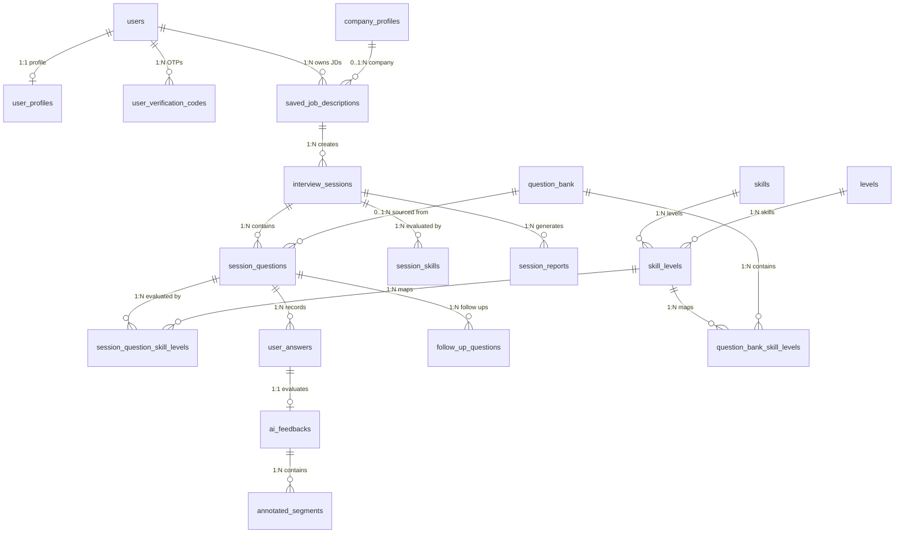
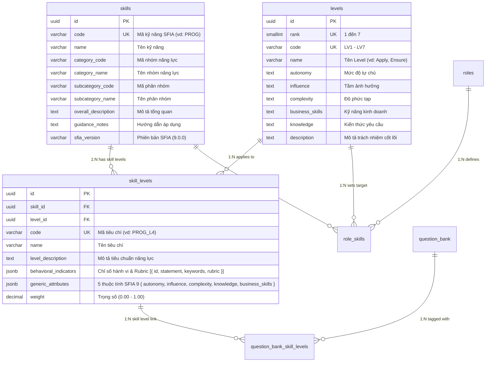

# Tài liệu Thiết kế Cơ sở Dữ liệu Hệ thống (Database Architecture & Data Dictionary)

> **Source of Truth:** `server/prisma/schema.prisma`  
> **Hệ quản trị CSDL:** PostgreSQL 15 (Supabase Cloud Hosted)  
> **ORM & Truy cập Dữ liệu:** Prisma Client v7 (preview features: `partialIndexes`)  
> **Kiến trúc Hệ thống:** Domain-Driven Design (DDD), Modular Monolith, Transactional Outbox Pattern, SFIA 9 Framework (Skills Framework for the Information Age)  
> **Số lượng Bảng (Tables/Models):** 16 Active Core Models  
> **Số lượng Kiểu liệt kê (Enums):** 3 Enums  

---

## MỤC LỤC

1. [Phần I: Tổng quan Hạ tầng & Nguyên tắc Thiết kế](#phần-i-tổng-quan-hạ-tầng--nguyên-tắc-thiết-kế)
2. [Phần II: Sơ đồ Thực thể Quan hệ (ERD - Mermaid Diagrams)](#phần-ii-sơ-đồ-thực-thể-quan-hệ-erd---mermaid-diagrams)
   - [2.1 Sơ đồ Tổng quan Toàn hệ thống (System Overview ERD)](#21-sơ-đồ-tổng-quan-toàn-hệ-thống-system-overview-erd)
   - [2.2 Sơ đồ Khung Năng lực SFIA 9 & Ma trận Vai trò](#22-sơ-đồ-khung-năng-lực-sfia-9--ma-trận-vai-trò)
   - [2.3 Sơ đồ Vòng đời Phiên Phỏng vấn & Đánh giá AI](#23-sơ-đồ-vòng-đời-phiên-phỏng-vấn--đánh-giá-ai)
3. [Phần III: Danh mục Kiểu Liệt Kê (Enums)](#phần-iii-danh-mục-kiểu-liệt-kê-enums)
4. [Phần IV: Từ điển Dữ liệu Chi tiết Các Thực thể (7 Bounded Contexts)](#phần-iv-từ-điển-dữ-liệu-chi-tiết-các-thực-thể-7-bounded-contexts)
   - [Domain 1: Quản trị Người dùng & Hồ sơ Ứng viên (User & Profile Context)](#domain-1-quản-trị-người-dùng--hồ-sơ-ứng-viên-user--profile-context)
   - [Domain 2: Hồ sơ Doanh nghiệp & Tin Tuyển dụng (Company & Job Context)](#domain-2-hồ-sơ-doanh-nghiệp--tin-tuyển-dụng-company--job-context)
   - [Domain 3: Khung Kỹ năng Chuẩn Quốc tế SFIA 9 (SFIA 9 Skills Taxonomy)](#domain-3-khung-kỹ-năng-chuẩn-quốc-tế-sfia-9-sfia-9-skills-taxonomy)
   - [Domain 4: Ngân hàng Câu hỏi Chuẩn hóa (Question Bank Context)](#domain-4-ngân-hàng-câu-hỏi-chuẩn-hóa-question-bank-context)
   - [Domain 5: Vòng đời & Thực thi Phiên Phỏng vấn (Interview Session Lifecycle)](#domain-5-vòng-đời--thực-thi-phiên-phỏng-vấn-interview-session-lifecycle)
   - [Domain 6: Đánh giá Câu trả lời & Phân tích AI (Turn Evaluation & AI Feedback)](#domain-6-đánh-giá-câu-trả-lời--phân-tích-ai-turn-evaluation--ai-feedback)
   - [Domain 7: Xử lý Bất đồng bộ & Outbox Pattern (Async Messaging & Outbox)](#domain-7-xử-lý-bất-đồng-bộ--outbox-pattern-async-messaging--outbox)
5. [Phần V: Cơ chế Kỹ thuật Nâng cao & Đảm bảo Toàn vẹn Dữ liệu](#phần-v-cơ-chế-kỹ-thuật-nâng-cao--đảm-bảo-toàn-vẹn-dữ-liệu)
   - [5.1 Transactional Outbox Pattern & Eventual Consistency](#51-transactional-outbox-pattern--eventual-consistency)
   - [5.2 Tính Bất biến Lịch sử (Historical Immutability & Snapshotting)](#52-tính-bất-biến-lịch-sử-historical-immutability--snapshotting)
   - [5.3 Chuẩn hóa SFIA 9 & Trực tiếp Giao điểm Cấp độ](#53-chuẩn-hóa-sfia-9--trực-tiếp-giao-điểm-cấp-độ)
   - [5.4 Quản trị Schema Dữ liệu Bán Cấu trúc (JSONB Governance)](#54-quản-trị-schema-dữ-liệu-bán-cấu-trúc-jsonb-governance)
6. [Phần VI: Chiến lược Đánh Chỉ mục & Tối ưu Hiệu năng (Indexing & Optimization)](#phần-vi-chiến-lược-đánh-chỉ-mục--tối-ưu-hiệu-năng-indexing--optimization)
7. [Phần VII: Bảng Đối chiếu & Thay đổi Sau Refactor](#phần-vii-bảng-đối-chiếu--thay-đổi-sau-refactor)

---

## PHẦN I: TỔNG QUAN HẠ TẦNG & NGUYÊN TẮC THIẾT KẾ

### 1.1 Thông số Kỹ thuật
* **Hệ quản trị CSDL:** PostgreSQL 15 chạy trên hạ tầng điện toán đám mây Supabase.
* **ORM:** Prisma 7 với cấu hình `previewFeatures = ["partialIndexes"]` hỗ trợ đánh chỉ mục có điều kiện trực tiếp trong schema.
* **Quy ước Định danh:**
  * **Database level:** `snake_case` cho tên bảng và tên cột (vd: `interview_sessions`, `saved_job_description_id`, `skill_levels`, `role_skills`).
  * **Prisma schema level:** `PascalCase` cho tên Model (vd: `InterviewSession`, `SkillLevel`, `RoleSkill`) và `camelCase` cho tên trường (vd: `savedJobDescriptionId`, `skillLevelId`).
* **Chuẩn Khóa chính (Primary Key):** Toàn bộ các bảng sử dụng kiểu định danh duy nhất toàn cầu **UUID v4** sinh tự động thông qua hàm `gen_random_uuid()` của PostgreSQL (ngoại trừ bảng `users` nhận trực tiếp UUID từ tầng xác thực).
* **Mốc thời gian (Timestamps):** Tất cả các trường ngày giờ đều sử dụng kiểu dữ liệu `TIMESTAMPTZ(6)` (Timestamp with Timezone độ chính xác microsecond) với giá trị mặc định `now()`. Các bảng có trạng thái cập nhật sử dụng thuộc tính `@updatedAt` của Prisma.

### 1.2 Nguyên tắc Kiến trúc Thiết kế CSDL (Architectural Principles)

```
┌──────────────────────────────────────────────────────────────────────────┐
│                        CORE DATABASE PRINCIPLES                          │
├───────────────────┬──────────────────────┬───────────────────────────────┤
│    3NF STRICT     │ HISTORICAL ISOLATION │     TRANSACTIONAL OUTBOX      │
│  Loại bỏ trùng lặp│  Snapshot JD & tiêu  │  Ngăn ngừa Dual-Write khi gọi │
│  dữ liệu người    │  chí, phiên cũ không │  LLM/Queue, đảm bảo Eventual  │
│  dùng & session   │  bị lệch khi sửa JD  │  Consistency cho AI pipeline  │
├───────────────────┼──────────────────────┼───────────────────────────────┤
│    SFIA 9 TAXONOMY│    JSONB GOVERNANCE  │      SAFE INTEGRITY RULES     │
│  Chuẩn hóa quốc tế│  Linh hoạt cho CV,   │  CASCADE cho dữ liệu phụ thuộc│
│  kỹ năng 7 cấp độ │  Voice metrics & Báo │  RESTRICT cho dữ liệu gốc quan│
│  phẳng hóa nhóm   │  cáo đa phân đoạn    │  trọng (Skill, Level, JD)     │
└───────────────────┴──────────────────────┴───────────────────────────────┘
```

1. **Chuẩn hóa 3NF & Cô lập Quyền sở hữu:**
   * Bảng `interview_sessions` không lưu thừa `user_id` hay `job_title`. Quyền sở hữu phiên phỏng vấn được xác định thông qua khóa ngoại `saved_job_description_id` liên kết tới `saved_job_descriptions` của người dùng.
2. **Tính Bất biến của Phiên Đánh giá (Historical Immutability):**
   * Khi tạo phiên phỏng vấn, toàn bộ nội dung JD được sao chép snapshot vào trường `interview_sessions.job_description`. Khi người dùng chỉnh sửa hoặc xóa JD gốc trong kho, kết quả và bối cảnh phỏng vấn trong quá khứ hoàn toàn không bị ảnh hưởng.
   * Danh sách kỹ năng đánh giá được "đóng băng" thành các bản ghi trong `session_skills`.
3. **Mô hình Xuất bản Sự kiện Tin cậy (Transactional Outbox Pattern):**
   * Mọi tác vụ kích hoạt luồng AI (sinh câu hỏi, chấm điểm, sinh báo cáo) được ghi đồng thời vào bảng `workflow_outbox` bên trong cùng một Database Transaction với bản ghi nghiệp vụ, loại trừ hoàn toàn rủi ro mất mát dữ liệu do sự cố mạng giữa App Server và Message Broker/AI Engine.
4. **Chuẩn hóa Danh mục Khung Năng lực Quốc tế SFIA 9:**
   * Hệ thống sử dụng trực tiếp mô hình SFIA 9 phẳng hóa: Bảng `skills` chứa thông tin danh mục (`category_code`, `category_name`, `subcategory_code`, `subcategory_name`), liên kết với bảng `levels` (7 cấp độ chuẩn) thông qua bảng `skill_levels` đại diện cho tiêu chí năng lực tại từng cấp độ trách nhiệm.
5. **Xóa Mềm (Soft Deletion) & Partial Indexing:**
   * Các thực thể quan trọng (`saved_job_descriptions`, `question_bank`) sử dụng trường `deleted_at`. Hệ thống xây dựng Partial Indexes lọc `WHERE deleted_at IS NULL` để đảm bảo tốc độ truy vấn trên tập dữ liệu active đạt hiệu năng tối đa.

---

## PHẦN II: SƠ ĐỒ THỰC THỂ QUAN HỆ (MERMAID ERD DIAGRAMS)

### 2.1 Sơ đồ Tổng quan Toàn hệ thống (System Overview ERD)



### 2.2 Sơ đồ Khung Kỹ năng SFIA 9 & Ma trận Vai trò



### 2.3 Sơ đồ Vòng đời Phiên Phỏng vấn & Đánh giá AI

```mermaid
erDiagram
    interview_sessions ||--o{ session_questions : "1:N questions"
    interview_sessions ||--o{ session_skills : "1:N locked skills"
    interview_sessions ||--o{ session_reports : "1:N reports"
    
    session_questions ||--o{ session_question_skill_levels : "1:N skill levels"
    session_questions ||--o{ user_answers : "1:N answers"
    
    user_answers ||--o| ai_feedbacks : "1:1 AI analysis"
    ai_feedbacks ||--o{ annotated_segments : "1:N segments"
    
    interview_sessions {
        uuid id PK
        uuid saved_job_description_id FK
        text job_description "Snapshot JD"
        varchar session_type "hr | technical"
        varchar sfia_version "9.0.0"
        smallint num_questions "Số câu hỏi"
        integer duration_min "Thời lượng phút"
        varchar status "generating | ready | active | completed"
        smallint overall_score "Điểm tổng kết (0-100)"
    }
    
    session_questions {
        uuid id PK
        uuid session_id FK
        uuid question_bank_id FK "nullable"
        text question_text "Nội dung câu hỏi"
        smallint order_index "Thứ tự (1..N)"
        varchar question_category "behavioral | technical"
        smallint estimated_time_min "Thời gian dự kiến"
    }
    
    user_answers {
        uuid id PK
        uuid question_id FK
        text answer_text "Nội dung trả lời"
        text audio_file_url "File âm thanh Supabase"
        integer audio_duration_seconds "Độ dài audio"
        jsonb voice_metrics_json "WPM, Filler words, Clarity"
        varchar transcription_status "pending | processing | done | failed"
        boolean skipped "Bỏ qua câu hỏi"
    }
    
    ai_feedbacks {
        uuid id PK
        uuid user_answer_id FK UK
        smallint overall_score "0 - 100"
        jsonb dimension_scores "Chi tiết điểm từng tiêu chí"
        text model_answer "Câu trả lời mẫu gợi ý"
        text key_takeaway "Bài học then chốt"
    }
```

---

## PHẦN III: DANH MỤC KIỂU LIỆT KÊ (ENUMS)

| Tên Enum | Giá trị hợp lệ | Mô tả nghiệp vụ |
| :--- | :--- | :--- |
| `UserRole` | `candidate`<br>`admin` | Phân quyền tài khoản: Ứng viên (`candidate`) hoặc Quản trị viên hệ thống (`admin`). |
| `AccountStatus` | `active`<br>`locked`<br>`deleted`<br>`password_reset_required` | Trạng thái tài khoản: Hoạt động bình thường (`active`), Bị khóa (`locked`), Đã xóa (`deleted`), Yêu cầu đổi mật khẩu (`password_reset_required`). |
| `QuestionSessionType`| `hr`<br>`technical` | Phân loại câu hỏi / phiên phỏng vấn: Nhân sự & Kỹ năng mềm (`hr`) hoặc Chuyên môn Kỹ thuật (`technical`). |

---

## PHẦN IV: TỪ ĐIỂN DỮ LIỆU CHI TIẾT CÁC THỰC THỂ (7 BOUNDED CONTEXTS)

### Domain 1: Quản trị Người dùng & Hồ sơ Ứng viên (User & Profile Context)

#### 1. Bảng `users` (Tài khoản Người dùng)
* **Mục đích:** Lưu trữ thông tin tài khoản và xác thực người dùng.
* **Prisma Model:** `User`

| Tên Cột | Kiểu CSDL | Nullable | Mặc định | Khóa | Mô tả & Ràng buộc Nghiệp vụ |
| :--- | :--- | :---: | :--- | :---: | :--- |
| `id` | `UUID` | No | | PK | Mã định danh duy nhất (đồng bộ từ hệ thống xác thực). |
| `email` | `VARCHAR(255)` | No | | UK | Địa chỉ email người dùng (duy nhất, viết thường). |
| `first_name` | `VARCHAR(100)` | Yes | | | Tên của người dùng. |
| `last_name` | `VARCHAR(100)` | Yes | | | Họ và tên đệm của người dùng. |
| `password_hash` | `VARCHAR(255)` | No | | | Hash mật khẩu (Argon2id/Bcrypt). |
| `role` | `user_role` | No | `'candidate'` | | Vai trò tài khoản (`candidate`, `admin`). |
| `status` | `account_status`| No | `'active'` | | Trạng thái tài khoản. |
| `token_version` | `INTEGER` | No | `0` | | Phiên bản token dùng để thu hồi JWT đồng loạt khi cần. |
| `created_at` | `TIMESTAMPTZ(6)` | No | `now()` | | Thời điểm tạo bản ghi. |
| `updated_at` | `TIMESTAMPTZ(6)` | No | `now()` | | Thời điểm cập nhật gần nhất. |

#### 2. Bảng `user_profiles` (Hồ sơ Ứng viên)
* **Mục đích:** Lưu thông tin chuyên môn, học vấn, kinh nghiệm làm việc và kỹ năng của ứng viên.
* **Prisma Model:** `UserProfile`

| Tên Cột | Kiểu CSDL | Nullable | Mặc định | Khóa | Mô tả & Ràng buộc Nghiệp vụ |
| :--- | :--- | :---: | :--- | :---: | :--- |
| `id` | `UUID` | No | `gen_random_uuid()` | PK | Khóa chính duy nhất. |
| `user_id` | `UUID` | No | | FK, UK | Khóa ngoại 1:1 trỏ tới `users(id)` (`ON DELETE CASCADE`). |
| `target_position` | `VARCHAR(255)` | Yes | | | Vị trí công việc mục tiêu. |
| `target_level` | `VARCHAR(100)` | Yes | | | Cấp bậc mong muốn (Fresher, Junior, Mid, Senior, Lead). |
| `personality` | `VARCHAR(255)` | Yes | | | Phong cách / tính cách làm việc nổi bật. |
| `education` | `JSONB` | Yes | | | Lịch sử học vấn `[{ school, degree, fieldOfStudy, startDate, endDate }]`. |
| `work_experience` | `JSONB` | Yes | | | Kinh nghiệm làm việc `[{ company, position, startDate, endDate, description }]`. |
| `projects` | `JSONB` | Yes | | | Dự án tiêu biểu `[{ name, role, techStack, description, url }]`. |
| `technical_skills`| `JSONB` | Yes | | | Danh mục kỹ năng chuyên môn dạng structured JSON. |
| `certifications` | `JSONB` | Yes | | | Chứng chỉ nghề nghiệp `[{ name, issuer, issueDate, expiryDate }]`. |
| `awards` | `JSONB` | Yes | | | Giải thưởng & thành tích cá nhân. |
| `created_at` | `TIMESTAMPTZ(6)` | No | `now()` | | Thời điểm tạo hồ sơ. |
| `updated_at` | `TIMESTAMPTZ(6)` | No | `now()` | | Thời điểm cập nhật gần nhất. |

#### 3. Bảng `user_verification_codes` (Mã OTP Xác minh)
* **Mục đích:** Quản lý mã OTP phục vụ kích hoạt tài khoản hoặc đặt lại mật khẩu.
* **Prisma Model:** `UserVerificationCode`

| Tên Cột | Kiểu CSDL | Nullable | Mặc định | Khóa | Mô tả & Ràng buộc Nghiệp vụ |
| :--- | :--- | :---: | :--- | :---: | :--- |
| `id` | `UUID` | No | `gen_random_uuid()` | PK | Khóa chính duy nhất. |
| `user_id` | `UUID` | No | | FK, UK1 | Khóa ngoại trỏ tới `users(id)` (`ON DELETE CASCADE`). |
| `purpose` | `VARCHAR(50)` | No | | UK1 | Mục đích: `email_verification`, `password_reset`. |
| `code_hash` | `VARCHAR(255)` | No | | | Hash bảo mật của mã OTP 6 số. |
| `expires_at` | `TIMESTAMPTZ(6)` | No | | | Thời điểm hết hạn mã OTP (thường là 5-15 phút). |
| `created_at` | `TIMESTAMPTZ(6)` | No | `now()` | | Thời điểm sinh mã OTP. |

---

### Domain 2: Hồ sơ Doanh nghiệp & Tin Tuyển dụng (Company & Job Context)

#### 4. Bảng `company_profiles` (Hồ sơ Doanh nghiệp)
* **Mục đích:** Lưu thông tin tổng quan về công ty tuyển dụng để AI cá nhân hóa câu hỏi phỏng vấn.
* **Prisma Model:** `CompanyProfile`

| Tên Cột | Kiểu CSDL | Nullable | Mặc định | Khóa | Mô tả & Ràng buộc Nghiệp vụ |
| :--- | :--- | :---: | :--- | :---: | :--- |
| `id` | `UUID` | No | `gen_random_uuid()` | PK | Khóa chính duy nhất. |
| `name` | `VARCHAR(255)` | No | | | Tên công ty tuyển dụng. |
| `website` | `VARCHAR(255)` | Yes | | | Website chính thức. |
| `description` | `TEXT` | Yes | | | Giới thiệu công ty và văn hóa doanh nghiệp. |
| `industry` | `VARCHAR(100)` | Yes | | | Lĩnh vực hoạt động (Fintech, E-commerce, Edtech,...). |
| `location` | `VARCHAR(255)` | Yes | | | Địa điểm trụ sở / chi nhánh. |
| `company_size` | `VARCHAR(50)` | Yes | | | Quy mô nhân sự (vd: 50-100, 500+). |
| `logo_url` | `VARCHAR(500)` | Yes | | | Đường dẫn ảnh logo công ty. |
| `created_at` | `TIMESTAMPTZ(6)` | No | `now()` | | Thời điểm tạo bản ghi. |
| `updated_at` | `TIMESTAMPTZ(6)` | No | `now()` | | Thời điểm cập nhật gần nhất. |

#### 5. Bảng `saved_job_descriptions` (Kho Bản tin Tuyển dụng đã Lưu)
* **Mục đích:** Lưu bản tin tuyển dụng (JD) của ứng viên để chuẩn bị phiên phỏng vấn.
* **Prisma Model:** `SavedJobDescription`

| Tên Cột | Kiểu CSDL | Nullable | Mặc định | Khóa | Mô tả & Ràng buộc Nghiệp vụ |
| :--- | :--- | :---: | :--- | :---: | :--- |
| `id` | `UUID` | No | `gen_random_uuid()` | PK | Khóa chính duy nhất. |
| `user_id` | `UUID` | No | | FK | Khóa ngoại trỏ tới `users(id)` (`ON DELETE CASCADE`). |
| `company_profile_id`| `UUID` | Yes | | FK | Khóa ngoại trỏ tới `company_profiles(id)`. |
| `company_name` | `VARCHAR(255)` | No | | | Tên công ty được lưu trong JD. |
| `company_website`| `VARCHAR(255)` | Yes | | | Website công ty. |
| `job_title` | `VARCHAR(255)` | No | | | Chức danh công việc ứng tuyển. |
| `level` | `VARCHAR(100)` | Yes | | | Cấp bậc kỳ vọng của vị trí (Middle, Senior, Lead). |
| `headcount` | `VARCHAR(50)` | Yes | | | Số lượng cần tuyển dụng. |
| `location` | `VARCHAR(255)` | Yes | | | Địa điểm làm việc (Hà Nội, TP.HCM, Remote). |
| `requirements` | `TEXT` | No | | | Yêu cầu ứng viên bóc tách từ JD. |
| `job_content` | `TEXT` | No | | | Toàn văn mô tả công việc và trách nhiệm. |
| `tech_stack` | `TEXT[]` | No | `{}` | | Danh sách công nghệ yêu cầu trong JD. |
| `benefits` | `TEXT` | Yes | | | Quyền lợi và chế độ đãi ngộ. |
| `salary` | `VARCHAR(100)` | Yes | | | Mức lương ghi trong tin tuyển dụng. |
| `bonus` | `VARCHAR(255)` | Yes | | | Chế độ thưởng. |
| `last_used_at` | `TIMESTAMPTZ(6)` | Yes | | | Thời điểm JD được dùng gần nhất để tạo phiên phỏng vấn. |
| `deleted_at` | `TIMESTAMPTZ(6)` | Yes | | | Thời điểm xóa mềm bản ghi. |
| `created_at` | `TIMESTAMPTZ(6)` | No | `now()` | | Thời điểm tạo bản ghi. |
| `updated_at` | `TIMESTAMPTZ(6)` | No | `now()` | | Thời điểm cập nhật gần nhất. |

---

### Domain 3: Khung Kỹ năng Chuẩn Quốc tế SFIA 9 (SFIA 9 Skills Taxonomy)

#### 6. Bảng `skills` (Danh mục Kỹ năng SFIA 9 - Phẳng hóa)
* **Mục đích:** Định nghĩa 102+ kỹ năng chuẩn hóa quốc tế SFIA phiên bản 9, lưu trực tiếp mã và tên category/subcategory.
* **Prisma Model:** `Skill`

| Tên Cột | Kiểu CSDL | Nullable | Mặc định | Khóa | Mô tả & Ràng buộc Nghiệp vụ |
| :--- | :--- | :---: | :--- | :---: | :--- |
| `id` | `UUID` | No | `gen_random_uuid()` | PK | Khóa chính duy nhất. |
| `code` | `VARCHAR(20)` | No | | UK | Mã định danh kỹ năng SFIA (vd: `PROG`, `DBDS`, `TEST`, `CYBS`). |
| `name` | `VARCHAR(255)` | No | | | Tên kỹ năng chuẩn (vd: Programming/software development). |
| `category_code` | `VARCHAR(50)` | No | | | Mã nhóm năng lực (vd: `DEV_IMPL`, `DATA_AI`, `STRAT_ARCH`). |
| `category_name` | `VARCHAR(255)` | No | | | Tên nhóm năng lực chuẩn SFIA 9. |
| `subcategory_code`| `VARCHAR(50)` | No | | | Mã phân nhóm chuyên biệt (vd: `SYS_DEV`). |
| `subcategory_name`| `VARCHAR(255)` | No | | | Tên phân nhóm chuyên biệt. |
| `overall_description`| `TEXT` | Yes | | | Mô tả tổng quan về bản chất và mục đích của kỹ năng. |
| `guidance_notes` | `TEXT` | Yes | | | Ghi chú hướng dẫn áp dụng thực tế và phân biệt kỹ năng. |
| `sfia_version` | `VARCHAR(20)` | No | `'9.0.0'` | | Phiên bản SFIA Framework tương ứng. |
| `display_order` | `INTEGER` | No | `0` | | Thứ tự sắp xếp hiển thị trên giao diện. |
| `created_at` | `TIMESTAMPTZ(6)` | No | `now()` | | Thời điểm tạo bản ghi. |
| `updated_at` | `TIMESTAMPTZ(6)` | No | `now()` | | Thời điểm cập nhật gần nhất. |

#### 7. Bảng `levels` (7 Cấp độ Trách nhiệm Chuẩn SFIA)
* **Mục đích:** Định nghĩa 7 cấp độ trách nhiệm chuẩn hóa toàn cầu từ Level 1 (Follow) đến Level 7 (Set Strategy).
* **Prisma Model:** `Level`

| Tên Cột | Kiểu CSDL | Nullable | Mặc định | Khóa | Mô tả & Ràng buộc Nghiệp vụ |
| :--- | :--- | :---: | :--- | :---: | :--- |
| `id` | `UUID` | No | `gen_random_uuid()` | PK | Khóa chính duy nhất. |
| `code` | `VARCHAR(20)` | No | | UK | Mã cấp độ (vd: `LEVEL_1`, `LEVEL_2`, ..., `LEVEL_7`). |
| `name` | `VARCHAR(100)` | No | | | Tên cấp độ chuẩn (Level 1 - Follow, Level 2 - Assist, Level 3 - Apply,...). |
| `rank` | `INTEGER` | No | | UK | Thứ tự cấp bậc từ 1 đến 7. |
| `autonomy` | `TEXT` | Yes | | | Tiêu chí về mức độ tự chủ (Autonomy). |
| `influence` | `TEXT` | Yes | | | Tiêu chí về tầm ảnh hưởng (Influence). |
| `complexity` | `TEXT` | Yes | | | Tiêu chí về độ phức tạp công việc (Complexity). |
| `business_skills`| `TEXT` | Yes | | | Tiêu chí về kỹ năng kinh doanh & tổ chức (Business Skills). |
| `knowledge` | `TEXT` | Yes | | | Tiêu chí về kiến thức chuyên môn (Knowledge). |
| `description` | `TEXT` | Yes | | | Mô tả tổng quan trách nhiệm cốt lõi. |
| `created_at` | `TIMESTAMPTZ(6)` | No | `now()` | | Thời điểm tạo bản ghi. |

#### 8. Bảng `skill_levels` (Cấp độ Kỹ năng & Tiêu chí Đánh giá Chi tiết)
* **Mục đích:** Giao điểm giữa Skill và Level, chứa mô tả hành vi, chỉ số đánh giá và rubrics theo chuẩn SFIA 9.
* **Prisma Model:** `SkillLevel`

| Tên Cột | Kiểu CSDL | Nullable | Mặc định | Khóa | Mô tả & Ràng buộc Nghiệp vụ |
| :--- | :--- | :---: | :--- | :---: | :--- |
| `id` | `UUID` | No | `gen_random_uuid()` | PK | Khóa chính duy nhất. |
| `skill_id` | `UUID` | No | | FK, UK1 | Khóa ngoại trỏ tới `skills(id)` (`ON DELETE CASCADE`). |
| `level_id` | `UUID` | No | | FK, UK1 | Khóa ngoại trỏ tới `levels(id)` (`ON DELETE RESTRICT`). |
| `code` | `VARCHAR(50)` | No | | UK | Mã tiêu chí cấp độ chuẩn (vd: `PROG_L3`, `PROG_L4`, `DBDS_L3`). |
| `name` | `VARCHAR(255)` | No | | | Tên kỹ năng tại cấp độ cụ thể (vd: Programming - Level 4). |
| `level_description`| `TEXT` | No | | | Mô tả chi tiết nhiệm vụ và kỹ năng cần đạt ở cấp độ này. |
| `behavioral_indicators`| `JSONB`| Yes | | | Danh sách mảng các biểu hiện hành vi `[{ id, statement, keywords, rubric }]`. |
| `generic_attributes`| `JSONB`| Yes | | | 5 thuộc tính SFIA 9: `{ autonomy, influence, complexity, knowledge, businessSkills }`. |
| `weight` | `DECIMAL(5,2)`| Yes | `1.00` | | Trọng số đánh giá mặc định. |
| `display_order` | `INTEGER` | No | `0` | | Thứ tự sắp xếp hiển thị. |
| `created_at` | `TIMESTAMPTZ(6)` | No | `now()` | | Thời điểm tạo bản ghi. |
| `updated_at` | `TIMESTAMPTZ(6)` | No | `now()` | | Thời điểm cập nhật gần nhất. |

#### 9. Bảng `roles` (Vai trò Nghề nghiệp Chuẩn)
* **Mục đích:** Danh mục các vị trí công việc IT chuẩn hóa trong ngành (vd: Backend Developer, DevOps Engineer).
* **Prisma Model:** `Role`

| Tên Cột | Kiểu CSDL | Nullable | Mặc định | Khóa | Mô tả & Ràng buộc Nghiệp vụ |
| :--- | :--- | :---: | :--- | :---: | :--- |
| `id` | `UUID` | No | `gen_random_uuid()` | PK | Khóa chính duy nhất. |
| `code` | `VARCHAR(50)` | No | | UK | Mã vai trò chuẩn (vd: `BACKEND_DEV`, `FRONTEND_DEV`, `FULLSTACK_DEV`). |
| `name` | `VARCHAR(255)` | No | | | Tên chức danh công việc chuẩn hóa. |
| `description` | `TEXT` | Yes | | | Mô tả phạm vi trách nhiệm của vị trí công việc. |
| `created_at` | `TIMESTAMPTZ(6)` | No | `now()` | | Thời điểm tạo bản ghi. |

#### 10. Bảng `role_skills` (Ma trận Vai trò - Kỹ năng - Cấp độ Mục tiêu)
* **Mục đích:** Định nghĩa các kỹ năng cốt lõi và cấp độ kỳ vọng cho từng vị trí nghề nghiệp.
* **Prisma Model:** `RoleSkill`

| Tên Cột | Kiểu CSDL | Nullable | Mặc định | Khóa | Mô tả & Ràng buộc Nghiệp vụ |
| :--- | :--- | :---: | :--- | :---: | :--- |
| `id` | `UUID` | No | `gen_random_uuid()` | PK | Khóa chính duy nhất. |
| `role_id` | `UUID` | No | | FK, UK1 | Khóa ngoại trỏ tới `roles(id)` (`ON DELETE CASCADE`). |
| `skill_id` | `UUID` | No | | FK, UK1 | Khóa ngoại trỏ tới `skills(id)` (`ON DELETE CASCADE`). |
| `target_level_id`| `UUID` | No | | FK, UK1 | Khóa ngoại trỏ tới `levels(id)` (`ON DELETE RESTRICT`). |
| `default_weight` | `DECIMAL(5,2)`| No | | | Trọng số ưu tiên của kỹ năng đối với vai trò (0.00 - 1.00). |
| `priority` | `INTEGER` | Yes | `1` | | Độ ưu tiên (1: Bắt buộc, 2: Quan trọng, 3: Bổ trợ). |
| `created_at` | `TIMESTAMPTZ(6)` | No | `now()` | | Thời điểm tạo bản ghi. |

---

### Domain 4: Ngân hàng Câu hỏi Chuẩn hóa (Question Bank Context)

#### 11. Bảng `question_bank` (Ngân hàng Câu hỏi Phỏng vấn)
* **Mục đích:** Lưu trữ kho câu hỏi tuyển dụng chuẩn hóa đa ngôn ngữ và độ khó.
* **Prisma Model:** `QuestionBank`

| Tên Cột | Kiểu CSDL | Nullable | Mặc định | Khóa | Mô tả & Ràng buộc Nghiệp vụ |
| :--- | :--- | :---: | :--- | :---: | :--- |
| `id` | `UUID` | No | `gen_random_uuid()` | PK | Khóa chính duy nhất. |
| `content` | `TEXT` | No | | | Nội dung câu hỏi phỏng vấn chuẩn. |
| `session_type` | `QuestionSessionType`| No | | | Loại phỏng vấn phù hợp (`hr`, `technical`). |
| `difficulty` | `INTEGER` | No | | | Độ khó câu hỏi từ 1 (Entry) đến 5 (Expert). |
| `context_pack_id`| `VARCHAR(20)` | No | | | Bối cảnh văn hóa tương thích (`VN`, `Western`). |
| `estimated_time_min`| `INTEGER` | Yes | | | Thời lượng dự kiến để trả lời hoàn chỉnh (phút). |
| `translations` | `JSONB` | Yes | | | Bản dịch câu hỏi đa ngôn ngữ (`{"vi": "...", "en": "..."}`). |
| `content_json` | `JSONB` | Yes | | | Metadata mở rộng (gợi ý trả lời, câu hỏi phụ dự phòng). |
| `deleted_at` | `TIMESTAMPTZ(6)` | Yes | | | Thời điểm xóa mềm câu hỏi. |
| `created_at` | `TIMESTAMPTZ(6)` | No | `now()` | | Thời điểm tạo câu hỏi. |
| `updated_at` | `TIMESTAMPTZ(6)` | No | `now()` | | Thời điểm cập nhật gần nhất. |

#### 12. Bảng `question_bank_skill_levels` (Liên kết Câu hỏi Ngân hàng - Cấp độ Kỹ năng SFIA)
* **Mục đích:** Bảng liên kết N-N xác định một câu hỏi trong Question Bank đánh giá những cấp độ kỹ năng SFIA 9 nào.
* **Prisma Model:** `QuestionBankSkillLevel`

| Tên Cột | Kiểu CSDL | Nullable | Mặc định | Khóa | Mô tả & Ràng buộc Nghiệp vụ |
| :--- | :--- | :---: | :--- | :---: | :--- |
| `id` | `UUID` | No | `gen_random_uuid()` | PK | Khóa chính duy nhất. |
| `question_bank_id` | `UUID` | No | | FK, UK1 | Khóa ngoại trỏ tới `question_bank(id)` (`ON DELETE CASCADE`). |
| `skill_level_id` | `UUID` | No | | FK, UK1 | Khóa ngoại trỏ tới `skill_levels(id)` (`ON DELETE CASCADE`). |
| `is_primary` | `BOOLEAN` | No | `true` | | Đánh dấu tiêu chí kỹ năng trọng tâm của câu hỏi. |
| `weight` | `DECIMAL(5,2)`| No | `1.00` | | Trọng số đánh giá của tiêu chí đối với câu hỏi này. |
| `created_at` | `TIMESTAMPTZ(6)` | No | `now()` | | Thời điểm tạo liên kết. |

---

### Domain 5: Vòng đời & Thực thi Phiên Phỏng vấn (Interview Session Lifecycle)

#### 13. Bảng `interview_sessions` (Phiên Phỏng vấn Trực tuyến)
* **Mục đích:** Thực thể Aggregate Root quản lý toàn bộ trạng thái, bối cảnh và kết quả của một buổi phỏng vấn.
* **Prisma Model:** `InterviewSession`

| Tên Cột | Kiểu CSDL | Nullable | Mặc định | Khóa | Mô tả & Ràng buộc Nghiệp vụ |
| :--- | :--- | :---: | :--- | :---: | :--- |
| `id` | `UUID` | No | `gen_random_uuid()` | PK | Khóa chính duy nhất. |
| `saved_job_description_id`| `UUID`| No | | FK | Khóa ngoại trỏ tới `saved_job_descriptions(id)` (`ON DELETE RESTRICT`). |
| `job_description`| `TEXT` | No | | | Snapshot toàn bộ nội dung JD tại thời điểm bắt đầu phiên. |
| `session_type` | `VARCHAR(50)` | No | | | Chế độ phỏng vấn (`hr`, `technical`). |
| `num_questions` | `INTEGER` | No | `5` | | Tổng số lượng câu hỏi trong phiên phỏng vấn. |
| `duration_min` | `INTEGER` | No | `30` | | Tổng thời lượng buổi phỏng vấn (phút). |
| `remaining_seconds`| `INTEGER` | Yes | | | Số giây còn lại của phiên. |
| `language` | `VARCHAR(10)` | No | `'vi'` | | Ngôn ngữ thực hiện phỏng vấn (`vi`, `en`). |
| `context_pack_id`| `VARCHAR(20)` | No | | | Gói văn hóa áp dụng cho phiên (`VN`, `Western`). |
| `sfia_version` | `VARCHAR(20)` | No | `'9.0.0'` | | Phiên bản SFIA chuẩn hóa áp dụng cho phiên. |
| `status` | `VARCHAR(50)` | No | `'generating'`| | Trạng thái: `generating`, `ready`, `active`, `completed`. |
| `overall_score` | `INTEGER` | Yes | | | Điểm số tổng kết toàn bộ phiên (0 - 100). |
| `completed_at` | `TIMESTAMPTZ(6)` | Yes | | | Thời điểm hoàn tất buổi phỏng vấn. |
| `created_at` | `TIMESTAMPTZ(6)` | No | `now()` | | Thời điểm khởi tạo phiên. |
| `updated_at` | `TIMESTAMPTZ(6)` | No | `now()` | | Thời điểm cập nhật trạng thái gần nhất. |

#### 14. Bảng `session_skills` (Kỹ năng Đánh giá Khóa cứng cho Phiên)
* **Mục đích:** Snapshot danh sách kỹ năng mục tiêu và trọng số được phân bổ riêng cho phiên phỏng vấn.
* **Prisma Model:** `SessionSkill`

| Tên Cột | Kiểu CSDL | Nullable | Mặc định | Khóa | Mô tả & Ràng buộc Nghiệp vụ |
| :--- | :--- | :---: | :--- | :---: | :--- |
| `id` | `UUID` | No | `gen_random_uuid()` | PK | Khóa chính duy nhất. |
| `session_id` | `UUID` | No | | FK, UK1 | Khóa ngoại trỏ tới `interview_sessions(id)` (`ON DELETE CASCADE`). |
| `skill_id` | `UUID` | No | | FK, UK1 | Khóa ngoại trỏ tới `skills(id)` (`ON DELETE CASCADE`). |
| `weight` | `DECIMAL(5,2)`| No | | | Trọng số kỹ năng được phân bổ trong phiên. |
| `priority` | `INTEGER` | Yes | `1` | | Độ ưu tiên. |
| `source` | `VARCHAR(50)` | No | | | Nguồn gốc xác định kỹ năng (`role_matrix`, `jd_tech_stack`, `fallback_general`). |
| `reasoning` | `JSONB` | Yes | | | Giải thích chi tiết từ AI về lý do chọn kỹ năng này. |
| `created_at` | `TIMESTAMPTZ(6)` | No | `now()` | | Thời điểm tạo liên kết. |

#### 15. Bảng `session_questions` (Câu hỏi trong Phiên Phỏng vấn)
* **Mục đích:** Danh sách câu hỏi cụ thể được AI sinh ra hoặc lấy từ Question Bank dành riêng cho phiên.
* **Prisma Model:** `SessionQuestion`

| Tên Cột | Kiểu CSDL | Nullable | Mặc định | Khóa | Mô tả & Ràng buộc Nghiệp vụ |
| :--- | :--- | :---: | :--- | :---: | :--- |
| `id` | `UUID` | No | `gen_random_uuid()` | PK | Khóa chính duy nhất. |
| `session_id` | `UUID` | No | | FK, UK1 | Khóa ngoại trỏ tới `interview_sessions(id)` (`ON DELETE CASCADE`). |
| `question_bank_id`| `UUID` | Yes | | FK | Khóa ngoại trỏ tới `question_bank(id)` (nếu là câu từ kho). |
| `question_text` | `TEXT` | No | | | Nội dung câu hỏi phỏng vấn hiển thị/phát âm cho ứng viên. |
| `order_index` | `INTEGER` | No | | UK1 | Thứ tự câu hỏi trong phiên (1, 2, 3, ...). |
| `question_category`| `VARCHAR(50)`| No | | | Phân loại câu hỏi (`behavioral`, `technical`). |
| `source` | `VARCHAR(50)` | No | `'bank'` | | Nguồn gốc câu hỏi (`bank`, `ai_generated`). |
| `question_type` | `VARCHAR(50)` | Yes | | | Kiểu câu hỏi. |
| `estimated_time_min`| `INTEGER` | Yes | | | Thời lượng dự kiến cho câu hỏi này. |
| `generation_model`| `VARCHAR(100)`| Yes | | | Tên model AI đã sinh câu hỏi (nếu do AI sinh). |
| `generation_metadata`| `JSONB` | Yes | | | Metadata quá trình sinh câu hỏi. |
| `created_at` | `TIMESTAMPTZ(6)` | No | `now()` | | Thời điểm câu hỏi được đưa vào phiên. |

#### 16. Bảng `session_question_skill_levels` (Cấp độ Kỹ năng Đánh giá của Câu hỏi trong Phiên)
* **Mục đích:** Lưu danh sách các cấp độ kỹ năng SFIA 9 được áp dụng để chấm điểm cho câu hỏi cụ thể trong phiên.
* **Prisma Model:** `SessionQuestionSkillLevel`

| Tên Cột | Kiểu CSDL | Nullable | Mặc định | Khóa | Mô tả & Ràng buộc Nghiệp vụ |
| :--- | :--- | :---: | :--- | :---: | :--- |
| `id` | `UUID` | No | `gen_random_uuid()` | PK | Khóa chính duy nhất. |
| `session_question_id`| `UUID`| No | | FK, UK1 | Khóa ngoại trỏ tới `session_questions(id)` (`ON DELETE CASCADE`). |
| `skill_level_id` | `UUID` | No | | FK, UK1 | Khóa ngoại trỏ tới `skill_levels(id)` (`ON DELETE CASCADE`). |
| `weight` | `DECIMAL(5,2)`| No | `1.00` | | Trọng số tiêu chí áp dụng cho câu hỏi. |
| `created_at` | `TIMESTAMPTZ(6)` | No | `now()` | | Thời điểm tạo liên kết. |

---

### Domain 6: Đánh giá Câu trả lời & Phân tích AI (Turn Evaluation & AI Feedback)

#### 17. Bảng `user_answers` (Câu trả lời của Ứng viên)
* **Mục đích:** Lưu trữ file ghi âm, text bóc băng và chỉ số giọng nói của mỗi lượt trả lời.
* **Prisma Model:** `UserAnswer`

| Tên Cột | Kiểu CSDL | Nullable | Mặc định | Khóa | Mô tả & Ràng buộc Nghiệp vụ |
| :--- | :--- | :---: | :--- | :---: | :--- |
| `id` | `UUID` | No | `gen_random_uuid()` | PK | Khóa chính duy nhất. |
| `question_id` | `UUID` | No | | FK, UK | Khóa ngoại 1:1 trỏ tới `session_questions(id)` (`ON DELETE CASCADE`). |
| `answer_mode` | `VARCHAR(20)` | No | | | Chế độ trả lời (`voice`, `text`). |
| `answer_text` | `TEXT` | No | | | Văn bản câu trả lời (gõ phím hoặc bóc băng từ STT Engine). |
| `audio_file_url` | `VARCHAR(500)` | Yes | | | URL file ghi âm lưu trữ an toàn trên Supabase Storage. |
| `audio_duration_seconds`| `INTEGER`| Yes | | | Thời lượng file ghi âm (giây). |
| `audio_size_bytes` | `INTEGER` | Yes | | | Kích thước file audio (bytes). |
| `skipped` | `BOOLEAN` | No | `false` | | `true` nếu ứng viên ấn nút bỏ qua câu hỏi này. |
| `voice_metrics_json`| `JSONB` | Yes | | | Chỉ số âm thanh: WPM, khoảng lặng, từ đệm (`filler_words`), clarity. |
| `transcription_status`| `VARCHAR(20)`| Yes | | | Trạng thái bóc băng: `pending`, `processing`, `done`, `failed`. |
| `feedback_generated`| `BOOLEAN` | No | `false` | | Cờ đánh dấu đã hoàn tất đánh giá AI hay chưa. |
| `created_at` | `TIMESTAMPTZ(6)` | No | `now()` | | Thời điểm nộp câu trả lời. |
| `updated_at` | `TIMESTAMPTZ(6)` | No | `now()` | | Thời điểm cập nhật gần nhất. |

#### 18. Bảng `ai_feedbacks` (Đánh giá Chi tiết từ AI cho Lượt trả lời)
* **Mục đích:** Lưu kết quả phân tích đa chiều, điểm số và gợi ý cải thiện cho từng câu trả lời.
* **Prisma Model:** `AiFeedback`

| Tên Cột | Kiểu CSDL | Nullable | Mặc định | Khóa | Mô tả & Ràng buộc Nghiệp vụ |
| :--- | :--- | :---: | :--- | :---: | :--- |
| `id` | `UUID` | No | `gen_random_uuid()` | PK | Khóa chính duy nhất. |
| `user_answer_id` | `UUID` | No | | FK, UK | Khóa ngoại trỏ tới `user_answers(id)` (Quan hệ 1:1, `ON DELETE CASCADE`). |
| `overall_score` | `INTEGER` | No | | | Điểm số tổng quan của câu trả lời (thang điểm 0 - 100). |
| `model_answer` | `TEXT` | No | | | Câu trả lời mẫu chuẩn phương pháp STAR do AI đề xuất. |
| `key_takeaway` | `TEXT` | No | | | Bài học/lưu ý quan trọng nhất rút ra từ câu hỏi này. |
| `prompt_version` | `VARCHAR(50)` | No | | | Phiên bản prompt AI đã thực hiện chấm điểm. |
| `is_fallback` | `BOOLEAN` | No | `false` | | Đánh dấu đánh giá có phải do fallback dự phòng sinh ra hay không. |
| `dimension_scores`| `JSONB` | Yes | | | Điểm số chi tiết từng tiêu chí: `[{"id": "PROG_L4", "score": 85}]`. |
| `created_at` | `TIMESTAMPTZ(6)` | No | `now()` | | Thời điểm hoàn tất đánh giá. |

#### 19. Bảng `annotated_segments` (Đoạn Text Gợi ý Chỉnh sửa Chi tiết)
* **Mục đích:** Đánh dấu từng câu/đoạn trong câu trả lời cần cải thiện cùng gợi ý viết lại từ AI.
* **Prisma Model:** `AnnotatedSegment`

| Tên Cột | Kiểu CSDL | Nullable | Mặc định | Khóa | Mô tả & Ràng buộc Nghiệp vụ |
| :--- | :--- | :---: | :--- | :---: | :--- |
| `id` | `UUID` | No | `gen_random_uuid()` | PK | Khóa chính duy nhất. |
| `ai_feedback_id` | `UUID` | No | | FK | Khóa ngoại trỏ tới `ai_feedbacks(id)` (`ON DELETE CASCADE`). |
| `segment_text` | `TEXT` | No | | | Đoạn văn bản trong câu trả lời của ứng viên. |
| `start_index` | `INTEGER` | No | | | Vị trí ký tự bắt đầu trong văn bản. |
| `end_index` | `INTEGER` | No | | | Vị trí ký tự kết thúc trong văn bản. |
| `highlight_level`| `VARCHAR(20)` | No | | | Mức độ cảnh báo (`good`, `warning`, `critical`). |
| `annotation` | `TEXT` | No | | | Lời nhận xét, phân tích của AI. |
| `suggestion` | `TEXT` | Yes | | | Gợi ý cải thiện cách diễn đạt. |
| `improved_version`| `TEXT` | Yes | | | Đoạn văn bản viết lại hoàn chỉnh đề xuất bởi AI. |
| `created_at` | `TIMESTAMPTZ(6)` | No | `now()` | | Thời điểm tạo bản ghi. |

#### 20. Bảng `session_reports` (Báo cáo Tổng hợp Toàn diện Buổi Phỏng vấn)
* **Mục đích:** Báo cáo phân tích chuyên sâu sau khi kết thúc toàn bộ các câu hỏi của phiên.
* **Prisma Model:** `SessionReport`

| Tên Cột | Kiểu CSDL | Nullable | Mặc định | Khóa | Mô tả & Ràng buộc Nghiệp vụ |
| :--- | :--- | :---: | :--- | :---: | :--- |
| `id` | `UUID` | No | `gen_random_uuid()` | PK | Khóa chính duy nhất. |
| `session_id` | `UUID` | No | | FK, UK1 | Khóa ngoại trỏ tới `interview_sessions(id)` (`ON DELETE CASCADE`). |
| `report_type` | `VARCHAR(50)` | No | | UK1 | Loại báo cáo (`comprehensive`, `spider_chart`, `action_plan`). |
| `version` | `INTEGER` | No | `1` | UK1 | Phiên bản báo cáo (hỗ trợ tái sinh báo cáo). |
| `content_json` | `JSONB` | No | | | Dữ liệu nội dung chi tiết theo schema của từng loại báo cáo. |
| `generated_by_model`| `VARCHAR(100)`| Yes | | | Model AI tạo báo cáo. |
| `prompt_version` | `VARCHAR(50)` | Yes | | | Phiên bản prompt tạo báo cáo. |
| `created_at` | `TIMESTAMPTZ(6)` | No | `now()` | | Thời điểm tạo báo cáo. |

---

### Domain 7: Xử lý Bất đồng bộ & Outbox Pattern (Async Messaging & Outbox)

#### 21. Bảng `workflow_outbox` (Bảng Hàng đợi Sự kiện Outbox)
* **Mục đích:** Thực thi Transactional Outbox Pattern, đảm bảo phát sinh tác vụ nền không bị mất mát dữ liệu (Dual-Write safety).
* **Prisma Model:** `WorkflowOutbox`

| Tên Cột | Kiểu CSDL | Nullable | Mặc định | Khóa | Mô tả & Ràng buộc Nghiệp vụ |
| :--- | :--- | :---: | :--- | :---: | :--- |
| `id` | `UUID` | No | `gen_random_uuid()` | PK | Khóa chính duy nhất. |
| `command_type` | `VARCHAR(50)` | No | | | Loại lệnh nền (`question-generation`, `evaluate-turn`, `report-generation`). |
| `aggregate_id` | `UUID` | No | | | ID của thực thể nghiệp vụ liên quan (`sessionId`, `userAnswerId`). |
| `payload` | `JSONB` | No | | | Toàn bộ dữ liệu payload cần thiết để Worker thực thi tác vụ. |
| `idempotency_key`| `VARCHAR(255)`| No | | UK | Khóa idempotent chống trùng lặp xử lý tác vụ. |
| `state` | `VARCHAR(20)` | No | `'pending'`| | Trạng thái: `pending`, `processing`, `completed`, `failed`. |
| `attempts` | `INTEGER` | No | `0` | | Số lần đã thử thực thi tác vụ. |
| `available_at` | `TIMESTAMPTZ(6)` | No | `now()` | | Thời điểm tác vụ sẵn sàng để Worker bốc xử lý. |
| `processed_at` | `TIMESTAMPTZ(6)` | Yes | | | Thời điểm hoàn tất xử lý tác vụ. |
| `error_summary`| `TEXT` | Yes | | | Chi tiết lỗi gặp phải nếu xử lý thất bại. |
| `created_at` | `TIMESTAMPTZ(6)` | No | `now()` | | Thời điểm tạo lệnh trong transaction. |
| `updated_at` | `TIMESTAMPTZ(6)` | No | `now()` | | Thời điểm cập nhật trạng thái gần nhất. |

---

## PHẦN V: CƠ CHẾ KỸ THUẬT NÂNG CAO & ĐẢM BẢO TOÀN VẸN DỮ LIỆU

### 5.1 Transactional Outbox Pattern & Eventual Consistency
1. Khi người dùng tạo một phiên phỏng vấn (`interview_sessions`), NestJS thực hiện transaction:
   ```ts
   await prisma.$transaction(async (tx) => {
     const session = await tx.interviewSession.create({ data: { ... } });
     await tx.workflowOutbox.create({
       data: {
         aggregateId: session.id,
         commandType: 'question-generation',
         idempotencyKey: `generate-questions-${session.id}`,
         payload: { ... }
       }
     });
     return session;
   });
   ```
2. Worker process đọc bản ghi từ `workflow_outbox` và đẩy vào BullMQ queue với chính sách exponential backoff retry.
3. Khi hoàn tất, `state` chuyển thành `completed` và phát sự kiện qua Server-Sent Events (SSE) tới ứng viên.

### 5.2 Tính Bất biến Lịch sử (Historical Immutability & Snapshotting)
* **Job Description Snapshot:** Lưu trữ trực tiếp nội dung đầy đủ vào `interview_sessions.job_description` thay vì chỉ lưu khóa ngoại trỏ tới `saved_job_descriptions`. Điều này đảm bảo khi người dùng xóa hoặc sửa JD trong kho, các phiên phỏng vấn đã diễn ra trong quá khứ không bị sai lệch kết quả.
* **Skill Snapshot:** Khi phiên phỏng vấn khởi tạo, toàn bộ danh sách kỹ năng mục tiêu được ghi cố định vào `session_skills` và `session_question_skill_levels`.

### 5.3 Chuẩn hóa SFIA 9 & Trực tiếp Giao điểm Cấp độ
* **Phẳng hóa Phân tầng:** Thay vì lưu các bảng phân cấp danh mục dư thừa, bảng `skills` lưu trực tiếp `category_code`, `category_name`, `subcategory_code`, `subcategory_name`. Giảm thiểu 2 tầng `JOIN` trong mọi truy vấn taxonomy.
* **Giao điểm Kỹ năng $\times$ Cấp độ:** Bảng `skill_levels` định danh trực tiếp từng cấp độ trách nhiệm của một kỹ năng (`skill_id` + `level_id` $\to$ `code` ví dụ `PROG_L4`), giúp câu hỏi trong ngân hàng (`question_bank_skill_levels`) và câu hỏi phỏng vấn (`session_question_skill_levels`) liên kết trực tiếp tới cấp độ cụ thể để AI đánh giá chính xác theo SFIA Rubric.

### 5.4 Quản trị Schema Dữ liệu Bán Cấu trúc (JSONB Governance)
Hệ thống sử dụng Zod schema ở tầng ứng dụng để validate tính hợp lệ của các trường JSONB trước khi ghi xuống PostgreSQL:
* `user_profiles.work_experience`: Cấu trúc mảng lịch sử làm việc.
* `user_answers.voice_metrics_json`: Cấu trúc `{ wpm: number, fillerWords: number, pauses: number, clarity: number }`.
* `ai_feedbacks.dimension_scores`: Cấu trúc `Array<{ id: string, name: string, score: number, weight: number }>`.

---

## PHẦN VI: CHIẾN LƯỢC ĐÁNH CHỈ MỤC & TỐI ƯU HIỆU NĂNG (INDEXING & OPTIMIZATION)

| Bảng (Table) | Tên Index | Các Cột (Columns) | Loại Index & Mục đích Tối ưu |
| :--- | :--- | :--- | :--- |
| `saved_job_descriptions` | `idx_saved_job_descriptions_user_updated` | `user_id, updated_at DESC` | Tăng tốc độ hiển thị danh sách JD của người dùng. |
| `saved_job_descriptions` | `idx_saved_job_descriptions_user_company_title` | `user_id, company_name, job_title` | Tìm kiếm nhanh JD theo công ty và chức danh. |
| `question_bank` | `idx_question_bank_session_type_difficulty` | `session_type, difficulty` | Partial Index: `WHERE deleted_at IS NULL` phục vụ chọn câu hỏi fallback nhanh. |
| `question_bank` | `idx_question_bank_context_pack` | `context_pack_id` | Partial Index: `WHERE deleted_at IS NULL` lọc theo văn hóa làm việc. |
| `skills` | `idx_skills_category_code` | `category_code` | Tối ưu truy vấn danh mục kỹ năng theo nhóm ngành. |
| `skills` | `idx_skills_subcategory_code` | `subcategory_code` | Tối ưu truy vấn danh mục kỹ năng theo phân nhóm chuyên sâu. |
| `skill_levels` | `idx_skill_levels_skill` | `skill_id` | Lấy nhanh toàn bộ các cấp độ của một kỹ năng. |
| `skill_levels` | `idx_skill_levels_level` | `level_id` | Lấy nhanh toàn bộ kỹ năng có ở một cấp độ trách nhiệm. |
| `role_skills` | `idx_role_skills_role` | `role_id` | Nạp nhanh ma trận kỹ năng của một vai trò công việc. |
| `interview_sessions` | `idx_interview_sessions_saved_jd` | `saved_job_description_id` | Tìm tất cả phiên phỏng vấn thuộc về một JD. |
| `interview_sessions` | `idx_interview_sessions_created_at` | `created_at DESC` | Phân trang danh sách lịch sử phỏng vấn của người dùng. |
| `session_skills` | `idx_session_skills_session` | `session_id` | Nạp danh sách kỹ năng trọng tâm của phiên phỏng vấn. |
| `session_questions` | `idx_session_questions_session_id` | `session_id` | Nạp danh sách câu hỏi trong phiên phỏng vấn. |
| `session_question_skill_levels` | `idx_session_question_skill_levels_skill_level_id` | `skill_level_id` | Thống kê câu hỏi phỏng vấn theo từng tiêu chí kỹ năng SFIA. |
| `user_answers` | `idx_user_answers_question_id` | `question_id` | Truy xuất câu trả lời theo câu hỏi. |
| `ai_feedbacks` | `idx_ai_feedbacks_user_answer_id` | `user_answer_id` | Partial Index: Lấy feedback phân tích cho lượt trả lời. |
| `annotated_segments` | `idx_annotated_segments_feedback_id` | `ai_feedback_id` | Lấy danh sách đoạn văn bản chú thích của feedback. |
| `workflow_outbox` | `idx_workflow_outbox_due` | `state, available_at` | Worker quét nhanh các tác vụ outbox đang chờ xử lý (`pending`). |
| `onet_sfia_mappings` | `idx_onet_sfia_mappings_soc` | `onet_soc_code` | Tra cứu nhanh kỹ năng SFIA theo mã nghề nghiệp O*NET. |
| `onet_sfia_mappings` | `idx_onet_sfia_mappings_sfia` | `sfia_skill_code` | Tra cứu nghề nghiệp O*NET theo mã kỹ năng SFIA. |
| `question_criteria` | `idx_question_criteria_bank_id` | `question_bank_id` | Nạp nhanh bộ tiêu chí nhị phân của câu hỏi trong ngân hàng. |
| `question_bank` | `idx_question_bank_soc_level` | `onet_soc_code, target_sfia_level` | Lọc câu hỏi ngân hàng theo nghề nghiệp và cấp độ SFIA mục tiêu. |
| `question_bank` | `idx_question_bank_sfia_skill_level` | `sfia_skill_code, target_sfia_level` | Lọc câu hỏi ngân hàng theo mã kỹ năng và cấp độ SFIA mục tiêu. |
| `saved_job_descriptions` | `idx_saved_jds_onet_soc` | `onet_soc_code` | Phân nhóm và tra cứu JD theo mã nghề nghiệp O*NET. |
| `interview_sessions` | `idx_interview_sessions_onet_soc` | `onet_soc_code` | Thống kê và tra cứu phiên phỏng vấn theo mã nghề O*NET. |
| `session_skills` | `idx_session_skills_skill_code` | `skill_code` | Tra cứu các phiên phỏng vấn đánh giá một kỹ năng SFIA cụ thể. |
| `session_questions` | `idx_session_questions_session_skill` | `session_skill_id` | Lấy danh sách câu hỏi thuộc về một kỹ năng đánh giá trong phiên. |

---

## PHẦN VII: BẢNG ĐỐI CHIẾU & THAY ĐỔI SAU REFACTOR

| Thành phần Cũ (Legacy / Tên Cũ) | Thiết kế Mới (SFIA 9 Standardized) | Lý do & Lợi ích Kỹ thuật |
| :--- | :--- | :--- |
| `competencies` | `skills` (`Skill`) | Sử dụng chính xác thuật ngữ SFIA 9 (**Skills**), dễ dàng mapping 1-1 với bộ dữ liệu SFIA quốc tế. |
| `criteria` / `competency_levels` | `skill_levels` (`SkillLevel`) | Phản ánh chính xác bản chất SFIA 9 là mô tả kỹ năng tại từng cấp độ trách nhiệm (**Skill Level Description & Rubrics**). |
| `role_level_competencies` | `role_skills` (`RoleSkill`) | Chuẩn hóa bảng định nghĩa yêu cầu kỹ năng cho vị trí nghề nghiệp (**Role Profile Requirements**). |
| `session_competencies` | `session_skills` (`SessionSkill`) | Danh sách kỹ năng đánh giá được khóa cho phiên phỏng vấn. |
| `question_bank_criteria` | `question_bank_skill_levels` (`QuestionBankSkillLevel`) | Khóa ngoại rõ ràng `skill_level_id` trỏ thẳng tới bảng `skill_levels(id)`. |
| `session_question_criteria` | `session_question_skill_levels` (`SessionQuestionSkillLevel`) | Khóa ngoại rõ ràng `skill_level_id` trỏ thẳng tới bảng `skill_levels(id)`. |
| `skill_competency_mappings` | In-Memory Map (`tech-stack-sfia.map.ts`) | Loại bỏ 1 bảng thừa, tra cứu Tech Stack sang mã SFIA với độ trễ 0ms trong RAM. |
| (Mới) Khung đánh giá lai O*NET + SFIA | `onet_sfia_mappings`, `question_criteria` | Tinh chỉnh Cỗ máy Đánh giá Tinh gọn Unified Interview Engine, loose coupling qua mã chuẩn hóa không dùng FK cứng. |

### 7.2 Hoàn Tất Dọn Dẹp Schema & Bảng Legacy (Giai Đoạn 5 - Bước 5.5)

Vào ngày **2026-09-06**, hệ thống đã chính thức hoàn thành quá trình chuyển đổi toàn diện sang kiến trúc **Hybrid Assessment Framework (O*NET + SFIA)**:
* **7 bảng cũ đã được DROP hoàn toàn khỏi PostgreSQL và `schema.prisma`:**
  1. `skills`
  2. `levels`
  3. `skill_levels`
  4. `roles`
  5. `role_skills`
  6. `question_bank_skill_levels`
  7. `session_question_skill_levels`
* **Cơ chế đánh giá năng lực mới (Zero Legacy Dependency):**
  * Danh mục 147 kỹ năng SFIA 9 và 7 cấp độ được quản lý trực tiếp qua `SfiaModule` (In-memory cached lookup ~0ms) thay vì truy vấn các bảng DB tĩnh cũ.
  * Danh mục nghề nghiệp và công cụ công nghệ được quản lý qua `OnetModule` (`onet` schema).
  * Phiên phỏng vấn được điều hướng bởi hợp đồng đánh giá duy nhất: `session_skills`.
  * Tiêu chí đánh giá câu hỏi chuẩn hóa 2 chiều `core` và `seniority` lưu tại `public.question_criteria` và `session_questions.rubric_criteria`.
  * Đánh giá Pass/Fail nhị phân và chấm điểm tất định 100% qua `BinaryCriteriaEvaluatorService` và `ScoringEngineService`.
  * Báo cáo hợp nhất chuẩn hóa: `session_reports` với `report_type = 'session_competency_evaluation'`.


