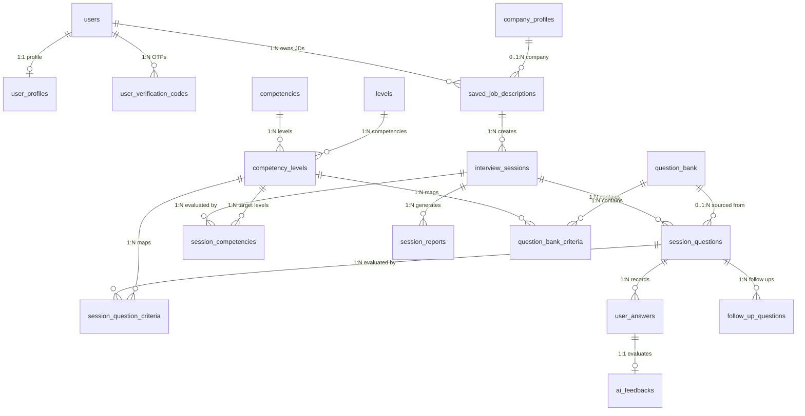
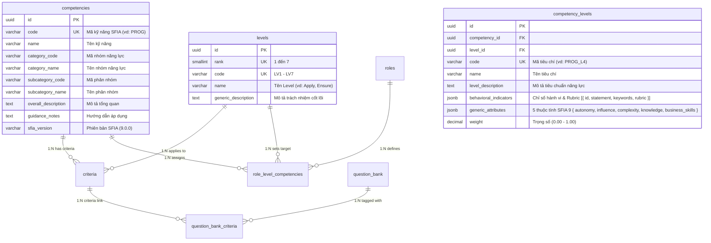

# Tài liệu Thiết kế Cơ sở Dữ liệu Hệ thống (Database Architecture & Data Dictionary)

> **Source of Truth:** `server/prisma/schema.prisma`  
> **Hệ quản trị CSDL:** PostgreSQL 15 (Supabase Cloud Hosted)  
> **ORM & Truy cập Dữ liệu:** Prisma Client v7 (preview features: `partialIndexes`)  
> **Kiến trúc Hệ thống:** Domain-Driven Design (DDD), Modular Monolith, Transactional Outbox Pattern, SFIA 9 Competency Framework  
> **Số lượng Bảng (Tables/Models):** 21 Models  
> **Số lượng Kiểu liệt kê (Enums):** 3 Enums  

---

## MỤC LỤC

1. [Phần I: Tổng quan Hạ tầng & Nguyên tắc Thiết kế](#phần-i-tổng-quan-hạ-tầng--nguyên-tắc-thiết-kế)
2. [Phần II: Sơ đồ Thực thể Quan hệ (ERD - Mermaid Diagrams)](#phần-ii-sơ-đồ-thực-thể-quan-hệ-erd---mermaid-diagrams)
   - [2.1 Sơ đồ Tổng quan Toàn hệ thống (System Overview ERD)](#21-sơ-đồ-tổng-quan-toàn-hệ-thống-system-overview-erd)
   - [2.2 Sơ đồ Khung Năng lực SFIA 9 & Ma trận Vai trò](#22-sơ-đồ-khung-năng-lực-sfia-9--ma-trận-vai-trò)
   - [2.3 Sơ đồ Vòng đời Phiên Phỏng vấn & Đánh giá AI](#23-sơ-đồ-vòng-đời-phiên-phỏng-vấn--đánh-giá-ai)
3. [Phần III: Danh mục Kiểu Liệt Kê (Enums)](#phần-iii-danh-mục-kiểu-liệt-kê-enums)
4. [Phần IV: Từ điển Dữ liệu Chi tiết 21 Thực thể (7 Bounded Contexts)](#phần-iv-từ-điển-dữ-liệu-chi-tiết-21-thực-thể-7-bounded-contexts)
   - [Domain 1: Quản trị Người dùng & Hồ sơ Ứng viên (User & Profile Context)](#domain-1-quản-trị-người-dùng--hồ-sơ-ứng-viên-user--profile-context)
   - [Domain 2: Hồ sơ Doanh nghiệp & Tin Tuyển dụng (Company & Job Context)](#domain-2-hồ-sơ-doanh-nghiệp--tin-tuyển-dụng-company--job-context)
   - [Domain 3: Khung Năng lực Chuẩn Quốc tế SFIA 9 (SFIA 9 Competency Taxonomy)](#domain-3-khung-năng-lực-chuẩn-quốc-tế-sfia-9-sfia-9-competency-taxonomy)
   - [Domain 4: Ngân hàng Câu hỏi Chuẩn hóa (Question Bank Context)](#domain-4-ngân-hàng-câu-hỏi-chuẩn-hóa-question-bank-context)
   - [Domain 5: Vòng đời & Thực thi Phiên Phỏng vấn (Interview Session Lifecycle)](#domain-5-vòng-đời--thực-thi-phiên-phỏng-vấn-interview-session-lifecycle)
   - [Domain 6: Đánh giá Câu trả lời & Phân tích AI (Turn Evaluation & AI Feedback)](#domain-6-đánh-giá-câu-trả-lời--phân-tích-ai-turn-evaluation--ai-feedback)
   - [Domain 7: Xử lý Bất đồng bộ & Outbox Pattern (Async Messaging & Outbox)](#domain-7-xử-lý-bất-đồng-bộ--outbox-pattern-async-messaging--outbox)
5. [Phần V: Cơ chế Kỹ thuật Nâng cao & Đảm bảo Toàn vẹn Dữ liệu](#phần-v-cơ-chế-kỹ-thuật-nâng-cao--đảm-bảo-toàn-vẹn-dữ-liệu)
   - [5.1 Transactional Outbox Pattern & Eventual Consistency](#51-transactional-outbox-pattern--eventual-consistency)
   - [5.2 Tính Bất biến Lịch sử (Historical Immutability & Snapshotting)](#52-tính-bất-biến-lịch-sử-historical-immutability--snapshotting)
   - [5.3 Chuẩn hóa SFIA 9 & Loại bỏ Bảng Trung gian](#53-chuẩn-hóa-sfia-9--loại-bỏ-bảng-trung-gian)
   - [5.4 Quản trị Schema Dữ liệu Bán Cấu trúc (JSONB Governance)](#54-quản-trị-schema-dữ-liệu-bán-cấu-trúc-jsonb-governance)
6. [Phần VI: Chiến lược Đánh Chỉ mục & Tối ưu Hiệu năng (Indexing & Optimization)](#phần-vi-chiến-lược-đánh-chỉ-mục--tối-ưu-hiệu-năng-indexing--optimization)
7. [Phần VII: Bảng Đối chiếu & Thay đổi Sau Refactor](#phần-vii-bảng-đối-chiếu--thay-đổi-sau-refactor)

---

## PHẦN I: TỔNG QUAN HẠ TẦNG & NGUYÊN TẮC THIẾT KẾ

### 1.1 Thông số Kỹ thuật
* **Hệ quản trị CSDL:** PostgreSQL 15 chạy trên hạ tầng điện toán đám mây Supabase.
* **ORM:** Prisma 7 với cấu hình `previewFeatures = ["partialIndexes"]` hỗ trợ đánh chỉ mục có điều kiện trực tiếp trong schema.
* **Quy ước Định danh:**
  * **Database level:** `snake_case` cho tên bảng và tên cột (vd: `interview_sessions`, `saved_job_description_id`, `competency_levels`).
  * **Prisma schema level:** `PascalCase` cho tên Model (vd: `InterviewSession`, `CompetencyLevel`) và `camelCase` cho tên trường (vd: `savedJobDescriptionId`, `competencyLevelId`).
* **Chuẩn Khóa chính (Primary Key):** Toàn bộ các bảng sử dụng kiểu định danh duy nhất toàn cầu **UUID v4** sinh tự động thông qua hàm `gen_random_uuid()` của PostgreSQL (ngoại trừ bảng `users` nhận trực tiếp UUID từ tầng xác thực).
* **Mốc thời gian (Timestamps):** Tất cả các trường ngày giờ đều sử dụng kiểu dữ liệu `TIMESTAMPTZ(6)` (Timestamp with Timezone độ chính xác microsecond) với giá trị mặc định `now()`. Các bảng có trạng thái cập nhật sử dụng thuộc tính `@updatedAt` của Prisma.

### 1.2 Nguyên tắc Kiến trúc Thiết kế CSDL (Architectural Principles)

```
┌──────────────────────────────────────────────────────────────────────────┐
│                        CORE DATABASE PRINCIPLES                          │
├───────────────────┬──────────────────────┬───────────────────────────────┤
│    3NF STRICT     │ HISTORICAL ISOLATION │     TRANSACTIONAL OUTBOX      │
│  Loại bỏ trùng lặp│  Snapshot JD & tiêu  │  Ngăn ngừa Dual-Write khi gọi │
│  dữ liệu người    │  chí, phiên cũ không │  LLM/Queue, đảm bảo Eventual  │
│  dùng & session   │  bị lệch khi sửa JD  │  Consistency cho AI pipeline  │
├───────────────────┼──────────────────────┼───────────────────────────────┤
│    SFIA 9 TAXONOMY│    JSONB GOVERNANCE  │      SAFE INTEGRITY RULES     │
│  Chuẩn hóa quốc tế│  Linh hoạt cho CV,   │  CASCADE cho dữ liệu phụ thuộc│
│  kỹ năng 7 cấp độ │  Voice metrics & Báo │  RESTRICT cho dữ liệu gốc quan│
│  phẳng hóa nhóm   │  cáo đa phân đoạn    │  trọng (Competency, Level, JD)│
└───────────────────┴──────────────────────┴───────────────────────────────┘
```

1. **Chuẩn hóa 3NF & Cô lập Quyền sở hữu:**
   * Bảng `interview_sessions` không lưu thừa `user_id` hay `job_title`. Quyền sở hữu phiên phỏng vấn được xác định thông qua khóa ngoại `saved_job_description_id` liên kết tới `saved_job_descriptions` của người dùng.
2. **Tính Bất biến của Phiên Đánh giá (Historical Immutability):**
   * Khi tạo phiên phỏng vấn, toàn bộ nội dung JD được sao chép snapshot vào trường `interview_sessions.job_description`. Khi người dùng chỉnh sửa hoặc xóa JD gốc trong kho, kết quả và bối cảnh phỏng vấn trong quá khứ hoàn toàn không bị ảnh hưởng.
   * Danh sách năng lực đánh giá được "đóng băng" thành các bản ghi trong `session_competencies`.
3. **Mô hình Xuất bản Sự kiện Tin cậy (Transactional Outbox Pattern):**
   * Mọi tác vụ kích hoạt luồng AI (sinh câu hỏi, chấm điểm, sinh báo cáo) được ghi đồng thời vào bảng `workflow_outbox` bên trong cùng một Database Transaction với bản ghi nghiệp vụ, loại trừ hoàn toàn rủi ro mất mát dữ liệu do sự cố mạng giữa App Server và Message Broker/AI Engine.
4. **Chuẩn hóa Khung Năng lực Quốc tế SFIA 9:**
   * Hệ thống sử dụng trực tiếp mô hình SFIA 9 phẳng hóa: Bảng `competencies` chứa thông tin danh mục (`category_code`, `category_name`, `subcategory_code`, `subcategory_name`), liên kết với bảng `levels` (7 cấp độ chuẩn) thông qua bảng `competency_levels` đại diện cho tiêu chí năng lực tại từng cấp độ.
5. **Xóa Mềm (Soft Deletion) & Partial Indexing:**
   * Các thực thể quan trọng (`saved_job_descriptions`, `question_bank`) sử dụng trường `deleted_at`. Hệ thống xây dựng Partial Indexes lọc `WHERE deleted_at IS NULL` để đảm bảo tốc độ truy vấn trên tập dữ liệu active đạt hiệu năng tối đa.

---

## PHẦN II: SƠ ĐỒ THỰC THỂ QUAN HỆ (MERMAID ERD DIAGRAMS)

### 2.1 Sơ đồ Tổng quan Toàn hệ thống (System Overview ERD)



### 2.2 Sơ đồ Khung Năng lực SFIA 9 & Ma trận Vai trò



### 2.3 Sơ đồ Vòng đời Phiên Phỏng vấn & Đánh giá AI

```mermaid
erDiagram
    interview_sessions ||--o{ session_questions : "1:N questions"
    interview_sessions ||--o{ session_competencies : "1:N locked competencies"
    interview_sessions ||--o{ session_reports : "1:N reports"
    
    session_questions ||--o{ session_question_criteria : "1:N criteria"
    session_questions ||--o{ user_answers : "1:N answers"
    session_questions ||--o{ follow_up_questions : "1:N follow ups"
    
    user_answers ||--o| ai_feedbacks : "1:1 AI analysis"
    
    interview_sessions {
        uuid id PK
        uuid saved_job_description_id FK
        text job_description "Snapshot JD"
        varchar session_type "hr | technical"
        varchar sfia_version "9.0.0"
        smallint num_questions "Số câu hỏi"
        integer duration_min "Thời lượng phút"
        varchar status "generating | ready | active | completed"
        smallint overall_score "Điểm tổng kết (0-100)"
    }
    
    session_questions {
        uuid id PK
        uuid session_id FK
        uuid question_bank_id FK "nullable"
        text question_text "Nội dung câu hỏi"
        smallint order_index "Thứ tự (1..N)"
        varchar question_category "behavioral | technical"
        smallint estimated_time_min "Thời gian dự kiến"
    }
    
    user_answers {
        uuid id PK
        uuid question_id FK
        text answer_text "Nội dung trả lời"
        text audio_file_url "File âm thanh Supabase"
        integer audio_duration_seconds "Độ dài audio"
        jsonb voice_metrics_json "WPM, Filler words, Clarity"
        varchar transcription_status "pending | processing | done | failed"
        boolean skipped "Bỏ qua câu hỏi"
    }
    
    ai_feedbacks {
        uuid id PK
        uuid user_answer_id FK UK
        smallint overall_score "0 - 100"
        jsonb dimension_scores "Chi tiết điểm từng tiêu chí"
        jsonb strong_points "Điểm mạnh nhận diện"
        jsonb weak_points "Điểm cần cải thiện"
        text model_answer "Câu trả lời mẫu gợi ý"
        text key_takeaway "Bài học then chốt"
    }
```

---

## PHẦN III: DANH MỤC KIỂU LIỆT KÊ (ENUMS)

| Tên Enum | Giá trị hợp lệ | Mô tả nghiệp vụ |
| :--- | :--- | :--- |
| `UserRole` | `candidate`<br>`admin` | Phân quyền tài khoản: Ứng viên (`candidate`) hoặc Quản trị viên hệ thống (`admin`). |
| `AccountStatus` | `active`<br>`inactive`<br>`locked` | Trạng thái tài khoản: Hoạt động bình thường (`active`), Chưa kích hoạt (`inactive`), Khóa do vi phạm (`locked`). |
| `VerificationType` | `email_verification`<br>`password_reset` | Mục đích mã OTP xác minh: Xác thực email tài khoản mới hoặc Đặt lại mật khẩu đăng nhập. |

---

## PHẦN IV: TỪ ĐIỂN DỮ LIỆU CHI TIẾT 22 THỰC THỂ (7 BOUNDED CONTEXTS)

### Domain 1: Quản trị Người dùng & Hồ sơ Ứng viên (User & Profile Context)

#### 1. Bảng `users` (Tài khoản Người dùng)
* **Mục đích:** Lưu trữ thông tin tài khoản và xác thực người dùng.
* **Prisma Model:** `User`

| Tên Cột | Kiểu CSDL | Nullable | Mặc định | Khóa | Mô tả & Ràng buộc Nghiệp vụ |
| :--- | :--- | :---: | :--- | :---: | :--- |
| `id` | `UUID` | No | | PK | Mã định danh duy nhất (đồng bộ từ hệ thống xác thực). |
| `email` | `VARCHAR(255)` | No | | UK | Địa chỉ email người dùng (duy nhất, viết thường). |
| `password_hash` | `VARCHAR(255)` | Yes | | | Hash mật khẩu (Argon2id). Null nếu đăng nhập qua OAuth. |
| `role` | `user_role` | No | `'candidate'` | | Vai trò tài khoản (`candidate`, `admin`). |
| `status` | `account_status`| No | `'active'` | | Trạng thái tài khoản (`active`, `inactive`, `locked`). |
| `email_verified_at` | `TIMESTAMPTZ(6)` | Yes | | | Thời điểm người dùng hoàn tất xác thực email. |
| `last_login_at` | `TIMESTAMPTZ(6)` | Yes | | | Thời điểm đăng nhập gần nhất. |
| `deleted_at` | `TIMESTAMPTZ(6)` | Yes | | | Thời điểm xóa mềm tài khoản. |
| `created_at` | `TIMESTAMPTZ(6)` | No | `now()` | | Thời điểm tạo tài khoản. |
| `updated_at` | `TIMESTAMPTZ(6)` | No | | | Thời điểm cập nhật thông tin gần nhất. |

#### 2. Bảng `user_profiles` (Hồ sơ Năng lực Ứng viên)
* **Mục đích:** Lưu trữ thông tin chi tiết về kinh nghiệm, CV và mục tiêu nghề nghiệp.
* **Prisma Model:** `UserProfile`

| Tên Cột | Kiểu CSDL | Nullable | Mặc định | Khóa | Mô tả & Ràng buộc Nghiệp vụ |
| :--- | :--- | :---: | :--- | :---: | :--- |
| `id` | `UUID` | No | `gen_random_uuid()` | PK | Khóa chính duy nhất. |
| `user_id` | `UUID` | No | | FK, UK | Khóa ngoại trỏ tới `users(id)` (Quan hệ 1:1, `ON DELETE CASCADE`). |
| `full_name` | `VARCHAR(255)` | Yes | | | Họ và tên đầy đủ của ứng viên. |
| `avatar_url` | `VARCHAR(500)` | Yes | | | URL ảnh đại diện trên Storage. |
| `phone_number` | `VARCHAR(20)` | Yes | | | Số điện thoại liên hệ. |
| `current_job_title`| `VARCHAR(255)` | Yes | | | Vị trí công việc hiện tại (vd: Senior Backend Engineer). |
| `years_of_experience`| `DECIMAL(3,1)`| Yes | | | Số năm kinh nghiệm làm việc thực tế (0.0 đến 50.0). |
| `cv_file_url` | `VARCHAR(500)` | Yes | | | Đường dẫn file CV đính kèm trên Supabase Storage. |
| `cv_parsed_json` | `JSONB` | Yes | | | Dữ liệu CV bóc tách bằng AI (kỹ năng, học vấn, dự án). |
| `target_roles` | `TEXT[]` | No | `{}` | | Danh sách chức danh mục tiêu phỏng vấn. |
| `target_levels` | `TEXT[]` | No | `{}` | | Danh sách cấp bậc mục tiêu (vd: `Junior`, `Senior`). |
| `primary_languages`| `TEXT[]` | No | `{}` | | Ngôn ngữ phỏng vấn ưu tiên (vd: `['vi', 'en']`). |
| `created_at` | `TIMESTAMPTZ(6)` | No | `now()` | | Thời điểm tạo hồ sơ. |
| `updated_at` | `TIMESTAMPTZ(6)` | No | | | Thời điểm cập nhật gần nhất. |

#### 3. Bảng `user_verification_codes` (Mã Xác minh OTP)
* **Mục đích:** Lưu trữ mã OTP dùng một lần cho xác thực email và đặt lại mật khẩu.
* **Prisma Model:** `UserVerificationCode`

| Tên Cột | Kiểu CSDL | Nullable | Mặc định | Khóa | Mô tả & Ràng buộc Nghiệp vụ |
| :--- | :--- | :---: | :--- | :---: | :--- |
| `id` | `UUID` | No | `gen_random_uuid()` | PK | Khóa chính duy nhất. |
| `user_id` | `UUID` | No | | FK | Khóa ngoại trỏ tới `users(id)` (`ON DELETE CASCADE`). |
| `code` | `VARCHAR(100)` | No | | | Mã OTP hoặc token xác minh đã được hash an toàn. |
| `type` | `verification_type`| No | | | Loại xác minh (`email_verification`, `password_reset`). |
| `expires_at` | `TIMESTAMPTZ(6)` | No | | | Thời điểm hết hạn hiệu lực của mã (thường 15 phút). |
| `used_at` | `TIMESTAMPTZ(6)` | Yes | | | Thời điểm mã được sử dụng thành công. |
| `created_at` | `TIMESTAMPTZ(6)` | No | `now()` | | Thời điểm sinh mã. |

---

### Domain 2: Hồ sơ Doanh nghiệp & Tin Tuyển dụng (Company & Job Context)

#### 4. Bảng `company_profiles` (Hồ sơ Doanh nghiệp Mục tiêu)
* **Mục đích:** Lưu trữ thông tin bối cảnh doanh nghiệp và văn hóa tuyển dụng.
* **Prisma Model:** `CompanyProfile`

| Tên Cột | Kiểu CSDL | Nullable | Mặc định | Khóa | Mô tả & Ràng buộc Nghiệp vụ |
| :--- | :--- | :---: | :--- | :---: | :--- |
| `id` | `UUID` | No | `gen_random_uuid()` | PK | Khóa chính duy nhất. |
| `company_name` | `VARCHAR(255)` | No | | UK | Tên doanh nghiệp tuyển dụng. |
| `industry` | `VARCHAR(100)` | Yes | | | Ngành nghề hoạt động (vd: FinTech, E-commerce, EdTech). |
| `company_size` | `VARCHAR(50)` | Yes | | | Quy mô nhân sự (vd: `10-50`, `500+`). |
| `culture_summary` | `TEXT` | Yes | | | Tóm tắt nét đặc trưng văn hóa phỏng vấn. |
| `evaluation_priorities`| `JSONB` | Yes | | | Ưu tiên đánh giá doanh nghiệp kỳ vọng (trọng số kỹ năng). |
| `created_at` | `TIMESTAMPTZ(6)` | No | `now()` | | Thời điểm tạo hồ sơ doanh nghiệp. |
| `updated_at` | `TIMESTAMPTZ(6)` | No | | | Thời điểm cập nhật gần nhất. |

#### 5. Bảng `saved_job_descriptions` (Mô tả Công việc Đã lưu)
* **Mục đích:** Kho lưu trữ tin tuyển dụng do người dùng upload/nhập vào làm đề bài phỏng vấn.
* **Prisma Model:** `SavedJobDescription`

| Tên Cột | Kiểu CSDL | Nullable | Mặc định | Khóa | Mô tả & Ràng buộc Nghiệp vụ |
| :--- | :--- | :---: | :--- | :---: | :--- |
| `id` | `UUID` | No | `gen_random_uuid()` | PK | Khóa chính duy nhất. |
| `user_id` | `UUID` | No | | FK | Khóa ngoại trỏ tới `users(id)` (`ON DELETE CASCADE`). |
| `company_profile_id`| `UUID` | Yes | | FK | Khóa ngoại trỏ tới `company_profiles(id)` (`ON DELETE SET NULL`). |
| `job_title` | `VARCHAR(255)` | No | | | Tiêu đề vị trí tuyển dụng (vd: Senior Java Developer). |
| `company_name` | `VARCHAR(255)` | Yes | | | Tên công ty nhập thủ công (nếu chưa có hồ sơ chuẩn). |
| `original_jd_text`| `TEXT` | No | | | Toàn văn nội dung bản tin tuyển dụng gốc. |
| `parsed_jd_json` | `JSONB` | Yes | | | Kết quả trích xuất AI: vai trò, tech stack, năm kinh nghiệm, yêu cầu. |
| `target_level` | `VARCHAR(50)` | Yes | | | Cấp bậc kỳ vọng của vị trí (vd: Middle, Senior, Lead). |
| `target_roles` | `TEXT[]` | No | `{}` | | Danh mục role tương ứng (chuẩn hóa theo hệ thống). |
| `tech_stack` | `TEXT[]` | No | `{}` | | Mảng công nghệ phát hiện trong JD (Java, Docker, AWS). |
| `last_used_at` | `TIMESTAMPTZ(6)` | Yes | | | Lần gần nhất JD này được dùng để tạo phiên phỏng vấn. |
| `deleted_at` | `TIMESTAMPTZ(6)` | Yes | | | Thời điểm xóa mềm bản ghi. |
| `created_at` | `TIMESTAMPTZ(6)` | No | `now()` | | Thời điểm tạo bản ghi. |
| `updated_at` | `TIMESTAMPTZ(6)` | No | | | Thời điểm cập nhật gần nhất. |

---

### Domain 3: Khung Năng lực Chuẩn Quốc tế SFIA 9 (SFIA 9 Competency Taxonomy)

#### 6. Bảng `competencies` (Năng lực SFIA 9 - Phẳng hóa Danh mục)
* **Mục đích:** Định nghĩa 121 kỹ năng chuẩn hóa quốc tế SFIA phiên bản 9, lưu trực tiếp mã và tên category/subcategory.
* **Prisma Model:** `Competency`

| Tên Cột | Kiểu CSDL | Nullable | Mặc định | Khóa | Mô tả & Ràng buộc Nghiệp vụ |
| :--- | :--- | :---: | :--- | :---: | :--- |
| `id` | `UUID` | No | `gen_random_uuid()` | PK | Khóa chính duy nhất. |
| `code` | `VARCHAR(20)` | No | | UK | Mã định danh kỹ năng SFIA (vd: `PROG`, `DBDS`, `ITOP`). |
| `name` | `VARCHAR(255)` | No | | | Tên kỹ năng chuẩn (vd: Programming/software development). |
| `category_code` | `VARCHAR(50)` | No | | | Mã nhóm năng lực (vd: `DEV_IMPL`, `DATA_AI`). |
| `category_name` | `VARCHAR(255)` | No | | | Tên nhóm năng lực chuẩn SFIA 9. |
| `subcategory_code`| `VARCHAR(50)` | No | | | Mã phân nhóm chuyên biệt (vd: `SYS_DEV`). |
| `subcategory_name`| `VARCHAR(255)` | No | | | Tên phân nhóm chuyên biệt. |
| `overall_description`| `TEXT` | No | | | Mô tả tổng quan về bản chất và mục đích của năng lực. |
| `guidance_notes` | `TEXT` | Yes | | | Ghi chú hướng dẫn áp dụng thực tế và phân biệt kỹ năng. |
| `sfia_version` | `VARCHAR(20)` | No | `'9.0.0'` | | Phiên bản SFIA Framework tương ứng. |
| `display_order` | `INTEGER` | No | `0` | | Thứ tự sắp xếp hiển thị trên giao diện. |
| `created_at` | `TIMESTAMPTZ(6)` | No | `now()` | | Thời điểm tạo bản ghi. |
| `updated_at` | `TIMESTAMPTZ(6)` | No | | | Thời điểm cập nhật gần nhất. |

#### 7. Bảng `levels` (Cấp độ Năng lực Chuẩn SFIA 1-7)
* **Mục đích:** Định nghĩa 7 cấp độ trách nhiệm chuẩn hóa toàn cầu từ Level 1 (Follow) đến Level 7 (Set Strategy).
* **Prisma Model:** `Level`

| Tên Cột | Kiểu CSDL | Nullable | Mặc định | Khóa | Mô tả & Ràng buộc Nghiệp vụ |
| :--- | :--- | :---: | :--- | :---: | :--- |
| `id` | `UUID` | No | `gen_random_uuid()` | PK | Khóa chính duy nhất. |
| `rank` | `SMALLINT` | No | | UK | Thứ tự cấp độ từ 1 đến 7 (Level 1 $\to$ Level 7). |
| `code` | `VARCHAR(10)` | No | | UK | Mã cấp độ (vd: `LV1`, `LV2`, `LV3`, ..., `LV7`). |
| `name` | `VARCHAR(50)` | No | | | Tên cấp độ chuẩn (Follow, Assist, Apply, Enable, Ensure, Initiate, Set Strategy). |
| `generic_description`| `TEXT` | No | | | Mô tả hành vi & trách nhiệm cốt lõi chung ở cấp độ này. |
| `created_at` | `TIMESTAMPTZ(6)` | No | `now()` | | Thời điểm tạo bản ghi. |
| `updated_at` | `TIMESTAMPTZ(6)` | No | | | Thời điểm cập nhật gần nhất. |

#### 8. Bảng `criteria` (Tiêu chí Đánh giá Năng lực theo Level Chuẩn SFIA 9)
* **Mục đích:** Là giao điểm giữa Competency và Level, chứa mô tả hành vi, chỉ số đánh giá chi tiết theo chuẩn SFIA 9.
* **Prisma Model:** `Criteria`

| Tên Cột | Kiểu CSDL | Nullable | Mặc định | Khóa | Mô tả & Ràng buộc Nghiệp vụ |
| :--- | :--- | :---: | :--- | :---: | :--- |
| `id` | `UUID` | No | `gen_random_uuid()` | PK | Khóa chính duy nhất. |
| `competency_id` | `UUID` | No | | FK, UK1 | Khóa ngoại trỏ tới `competencies(id)` (`ON DELETE CASCADE`). |
| `level_id` | `UUID` | No | | FK, UK1 | Khóa ngoại trỏ tới `levels(id)` (`ON DELETE RESTRICT`). |
| `code` | `VARCHAR(30)` | No | | UK | Mã tiêu chí chuẩn (vd: `PROG_L4`, `DBDS_L3`). |
| `name` | `VARCHAR(255)` | No | | | Tên tiêu chí năng lực tại cấp độ này. |
| `level_description`| `TEXT` | No | | | Mô tả chi tiết kỹ năng và nhiệm vụ cần đạt ở cấp độ này. |
| `behavioral_indicators`| `JSONB`| Yes | | | Danh sách mảng các biểu hiện hành vi & rubric `[{ id, statement, keywords, rubric }]`. |
| `generic_attributes`| `JSONB`| Yes | | | 5 thuộc tính nền tảng SFIA 9: `autonomy`, `influence`, `complexity`, `knowledge`, `business_skills`. |
| `weight` | `DECIMAL(3,2)`| No | `1.00` | | Trọng số đánh giá mặc định của tiêu chí (0.00 - 1.00). |
| `display_order` | `INTEGER` | No | `0` | | Thứ tự sắp xếp hiển thị. |
| `created_at` | `TIMESTAMPTZ(6)` | No | `now()` | | Thời điểm tạo bản ghi. |
| `updated_at` | `TIMESTAMPTZ(6)` | No | | | Thời điểm cập nhật gần nhất. |

#### 9. Bảng `roles` (Vai trò Nghề nghiệp Chuẩn)
* **Mục đích:** Danh mục các vị trí công việc IT chuẩn hóa trong ngành (vd: Backend Developer, Data Engineer).
* **Prisma Model:** `Role`

| Tên Cột | Kiểu CSDL | Nullable | Mặc định | Khóa | Mô tả & Ràng buộc Nghiệp vụ |
| :--- | :--- | :---: | :--- | :---: | :--- |
| `id` | `UUID` | No | `gen_random_uuid()` | PK | Khóa chính duy nhất. |
| `code` | `VARCHAR(50)` | No | | UK | Mã vai trò chuẩn (vd: `BACKEND_DEV`, `DATA_ENGINEER`, `DEVOPS`). |
| `name` | `VARCHAR(100)` | No | | | Tên chức danh công việc chuẩn hóa. |
| `description` | `TEXT` | Yes | | | Mô tả phạm vi trách nhiệm và mục tiêu của vai trò. |
| `created_at` | `TIMESTAMPTZ(6)` | No | `now()` | | Thời điểm tạo bản ghi. |
| `updated_at` | `TIMESTAMPTZ(6)` | No | | | Thời điểm cập nhật gần nhất. |

#### 10. Bảng `role_level_competencies` (Ma trận Vai trò - Cấp độ - Năng lực)
* **Mục đích:** Định nghĩa các năng lực cốt lõi và trọng số tương ứng cho từng vai trò tại từng cấp bậc.
* **Prisma Model:** `RoleLevelCompetency`

| Tên Cột | Kiểu CSDL | Nullable | Mặc định | Khóa | Mô tả & Ràng buộc Nghiệp vụ |
| :--- | :--- | :---: | :--- | :---: | :--- |
| `id` | `UUID` | No | `gen_random_uuid()` | PK | Khóa chính duy nhất. |
| `role_id` | `UUID` | No | | FK, UK1 | Khóa ngoại trỏ tới `roles(id)` (`ON DELETE CASCADE`). |
| `level_id` | `UUID` | No | | FK, UK1 | Khóa ngoại trỏ tới `levels(id)` (`ON DELETE CASCADE`). |
| `competency_id` | `UUID` | No | | FK, UK1 | Khóa ngoại trỏ tới `competencies(id)` (`ON DELETE CASCADE`). |
| `default_weight` | `DECIMAL(3,2)`| No | `1.00` | | Trọng số ưu tiên của năng lực đối với vai trò (0.00 - 1.00). |
| `priority` | `SMALLINT` | No | `1` | | Độ ưu tiên (1: Bắt buộc, 2: Quan trọng, 3: Bổ trợ). |
| `created_at` | `TIMESTAMPTZ(6)` | No | `now()` | | Thời điểm tạo bản ghi. |
| `updated_at` | `TIMESTAMPTZ(6)` | No | | | Thời điểm cập nhật gần nhất. |

> **Ghi chú Tinh giản Kiến trúc (In-Memory Map Optimization):**  
> Bảng `skill_competency_mappings` đã được chuyển đổi thành **In-Memory Thesaurus** tại file `src/modules/interview-prep/sfia/constants/tech-stack-sfia.map.ts`. Giải pháp này giúp loại bỏ 1 bảng CSDL không cần thiết, đạt tốc độ tra cứu tức thì (0ms latency trong RAM) khi phân tích Tech Stack từ Job Description.

---

### Domain 4: Ngân hàng Câu hỏi Chuẩn hóa (Question Bank Context)

#### 12. Bảng `question_bank` (Ngân hàng Câu hỏi Phỏng vấn)
* **Mục đích:** Lưu trữ kho câu hỏi tuyển dụng chuẩn hóa đa ngôn ngữ và độ khó.
* **Prisma Model:** `QuestionBank`

| Tên Cột | Kiểu CSDL | Nullable | Mặc định | Khóa | Mô tả & Ràng buộc Nghiệp vụ |
| :--- | :--- | :---: | :--- | :---: | :--- |
| `id` | `UUID` | No | `gen_random_uuid()` | PK | Khóa chính duy nhất. |
| `content` | `TEXT` | No | | | Nội dung câu hỏi phỏng vấn chuẩn. |
| `session_type` | `VARCHAR(50)` | No | | | Loại phỏng vấn phù hợp (`hr`, `technical`). |
| `difficulty` | `SMALLINT` | No | `1` | | Độ khó câu hỏi từ 1 (Entry) đến 5 (Expert). |
| `context_pack_id`| `VARCHAR(20)` | No | `'VN'` | | Bối cảnh văn hóa tương thích (`VN`, `Western`). |
| `estimated_time_min`| `SMALLINT` | Yes | `5` | | Thời lượng dự kiến để trả lời hoàn chỉnh (phút). |
| `translations` | `JSONB` | Yes | | | Bản dịch câu hỏi đa ngôn ngữ (`{"vi": "...", "en": "..."}`). |
| `content_json` | `JSONB` | Yes | | | Metadata mở rộng (gợi ý trả lời, câu hỏi phụ dự phòng). |
| `deleted_at` | `TIMESTAMPTZ(6)` | Yes | | | Thời điểm xóa mềm câu hỏi. |
| `created_at` | `TIMESTAMPTZ(6)` | No | `now()` | | Thời điểm tạo câu hỏi. |
| `updated_at` | `TIMESTAMPTZ(6)` | No | | | Thời điểm cập nhật gần nhất. |

#### 13. Bảng `question_bank_criteria` (Liên kết Câu hỏi Ngân hàng - Tiêu chí SFIA)
* **Mục đích:** Bảng liên kết N-N xác định một câu hỏi trong Question Bank đánh giá những tiêu chí SFIA 9 nào.
* **Prisma Model:** `QuestionBankCriterion`

| Tên Cột | Kiểu CSDL | Nullable | Mặc định | Khóa | Mô tả & Ràng buộc Nghiệp vụ |
| :--- | :--- | :---: | :--- | :---: | :--- |
| `id` | `UUID` | No | `gen_random_uuid()` | PK | Khóa chính duy nhất. |
| `question_bank_id` | `UUID` | No | | FK, UK1 | Khóa ngoại trỏ tới `question_bank(id)` (`ON DELETE CASCADE`). |
| `competency_level_id`| `UUID`| No | | FK, UK1 | Khóa ngoại trỏ tới `competency_levels(id)` (`ON DELETE CASCADE`). |
| `is_primary` | `BOOLEAN` | No | `true` | | Đánh dấu tiêu chí đánh giá trọng tâm của câu hỏi. |
| `weight` | `DECIMAL(3,2)`| No | `1.00` | | Trọng số đánh giá của tiêu chí đối với câu hỏi này. |
| `created_at` | `TIMESTAMPTZ(6)` | No | `now()` | | Thời điểm tạo liên kết. |

---

### Domain 5: Vòng đời & Thực thi Phiên Phỏng vấn (Interview Session Lifecycle)

#### 14. Bảng `interview_sessions` (Phiên Phỏng vấn Trực tuyến)
* **Mục đích:** Thực thể Aggregate Root quản lý toàn bộ trạng thái, bối cảnh và kết quả của một buổi phỏng vấn.
* **Prisma Model:** `InterviewSession`

| Tên Cột | Kiểu CSDL | Nullable | Mặc định | Khóa | Mô tả & Ràng buộc Nghiệp vụ |
| :--- | :--- | :---: | :--- | :---: | :--- |
| `id` | `UUID` | No | `gen_random_uuid()` | PK | Khóa chính duy nhất. |
| `saved_job_description_id`| `UUID`| No | | FK | Khóa ngoại trỏ tới `saved_job_descriptions(id)` (`ON DELETE RESTRICT`). |
| `job_description`| `TEXT` | No | | | Snapshot toàn bộ nội dung JD tại thời điểm bắt đầu phiên. |
| `session_type` | `VARCHAR(50)` | No | | | Chế độ phỏng vấn (`hr`, `technical`). |
| `language` | `VARCHAR(10)` | No | `'vi'` | | Ngôn ngữ thực hiện phỏng vấn (`vi`, `en`). |
| `context_pack_id`| `VARCHAR(20)` | No | `'VN'` | | Gói văn hóa áp dụng cho phiên (`VN`, `Western`). |
| `sfia_version` | `VARCHAR(20)` | No | `'9.0.0'` | | Phiên bản SFIA chuẩn hóa áp dụng cho phiên. |
| `status` | `VARCHAR(50)` | No | `'generating'`| | Trạng thái: `generating`, `ready`, `active`, `completed`, `canceled`, `error`. |
| `num_questions` | `SMALLINT` | No | `5` | | Tổng số lượng câu hỏi trong phiên phỏng vấn. |
| `duration_min` | `INTEGER` | No | `30` | | Tổng thời lượng buổi phỏng vấn (phút). |
| `overall_score` | `SMALLINT` | Yes | | | Điểm số tổng kết toàn bộ phiên (0 - 100). |
| `created_at` | `TIMESTAMPTZ(6)` | No | `now()` | | Thời điểm khởi tạo phiên. |
| `started_at` | `TIMESTAMPTZ(6)` | Yes | | | Thời điểm ứng viên bắt đầu trả lời câu đầu tiên. |
| `completed_at` | `TIMESTAMPTZ(6)` | Yes | | | Thời điểm hoàn tất buổi phỏng vấn. |
| `updated_at` | `TIMESTAMPTZ(6)` | No | | | Thời điểm cập nhật trạng thái gần nhất. |

#### 15. Bảng `session_competencies` (Năng lực Đánh giá Khóa cứng cho Phiên)
* **Mục đích:** Snapshot các năng lực và cấp độ kỳ vọng được khóa cho phiên phỏng vấn đó.
* **Prisma Model:** `SessionCompetency`

| Tên Cột | Kiểu CSDL | Nullable | Mặc định | Khóa | Mô tả & Ràng buộc Nghiệp vụ |
| :--- | :--- | :---: | :--- | :---: | :--- |
| `id` | `UUID` | No | `gen_random_uuid()` | PK | Khóa chính duy nhất. |
| `session_id` | `UUID` | No | | FK, UK1 | Khóa ngoại trỏ tới `interview_sessions(id)` (`ON DELETE CASCADE`). |
| `competency_id` | `UUID` | No | | FK, UK1 | Khóa ngoại trỏ tới `competencies(id)` (`ON DELETE RESTRICT`). |
| `target_level_id`| `UUID` | Yes | | FK | Khóa ngoại trỏ tới `levels(id)` xác định level kỳ vọng. |
| `weight` | `DECIMAL(3,2)`| No | `1.00` | | Trọng số năng lực được phân bổ trong phiên. |
| `created_at` | `TIMESTAMPTZ(6)` | No | `now()` | | Thời điểm liên kết được tạo. |

#### 16. Bảng `session_questions` (Câu hỏi trong Phiên Phỏng vấn)
* **Mục đích:** Danh sách câu hỏi cụ thể được AI sinh ra hoặc lấy từ Question Bank dành riêng cho phiên.
* **Prisma Model:** `SessionQuestion`

| Tên Cột | Kiểu CSDL | Nullable | Mặc định | Khóa | Mô tả & Ràng buộc Nghiệp vụ |
| :--- | :--- | :---: | :--- | :---: | :--- |
| `id` | `UUID` | No | `gen_random_uuid()` | PK | Khóa chính duy nhất. |
| `session_id` | `UUID` | No | | FK, UK1 | Khóa ngoại trỏ tới `interview_sessions(id)` (`ON DELETE CASCADE`). |
| `question_bank_id`| `UUID` | Yes | | FK | Khóa ngoại trỏ tới `question_bank(id)` (nếu là câu từ kho). |
| `question_text` | `TEXT` | No | | | Nội dung câu hỏi phỏng vấn hiển thị/phát âm cho ứng viên. |
| `order_index` | `SMALLINT` | No | | UK1 | Thứ tự câu hỏi trong phiên (1, 2, 3, ...). |
| `question_category`| `VARCHAR(50)`| Yes | | | Phân loại câu hỏi (`behavioral`, `technical`, `situational`). |
| `estimated_time_min`| `SMALLINT`| Yes | `5` | | Thời lượng dự kiến cho câu hỏi này. |
| `created_at` | `TIMESTAMPTZ(6)` | No | `now()` | | Thời điểm câu hỏi được đưa vào phiên. |

#### 17. Bảng `session_question_criteria` (Tiêu chí Đánh giá của Câu hỏi trong Phiên)
* **Mục đích:** Lưu danh sách các tiêu chí SFIA 9 được áp dụng để chấm điểm cho câu hỏi cụ thể trong phiên.
* **Prisma Model:** `SessionQuestionCriterion`

| Tên Cột | Kiểu CSDL | Nullable | Mặc định | Khóa | Mô tả & Ràng buộc Nghiệp vụ |
| :--- | :--- | :---: | :--- | :---: | :--- |
| `id` | `UUID` | No | `gen_random_uuid()` | PK | Khóa chính duy nhất. |
| `session_question_id`| `UUID`| No | | FK, UK1 | Khóa ngoại trỏ tới `session_questions(id)` (`ON DELETE CASCADE`). |
| `competency_level_id`| `UUID`| No | | FK, UK1 | Khóa ngoại trỏ tới `competency_levels(id)` (`ON DELETE RESTRICT`). |
| `weight` | `DECIMAL(3,2)`| No | `1.00` | | Trọng số tiêu chí áp dụng cho câu hỏi. |
| `created_at` | `TIMESTAMPTZ(6)` | No | `now()` | | Thời điểm tạo liên kết. |

#### 18. Bảng `follow_up_questions` (Câu hỏi Phụ / Đào sâu)
* **Mục đích:** Lưu câu hỏi đào sâu do AI sinh ra ngay sau khi ứng viên trả lời chưa đủ ý.
* **Prisma Model:** `FollowUpQuestion`

| Tên Cột | Kiểu CSDL | Nullable | Mặc định | Khóa | Mô tả & Ràng buộc Nghiệp vụ |
| :--- | :--- | :---: | :--- | :---: | :--- |
| `id` | `UUID` | No | `gen_random_uuid()` | PK | Khóa chính duy nhất. |
| `session_question_id`| `UUID`| No | | FK | Khóa ngoại trỏ tới `session_questions(id)` (`ON DELETE CASCADE`). |
| `question_text` | `TEXT` | No | | | Nội dung câu hỏi đào sâu do AI sinh ra. |
| `context_reason` | `TEXT` | Yes | | | Lý do AI quyết định hỏi thêm (lỗ hổng trong câu trả lời trước). |
| `order_index` | `SMALLINT` | No | `1` | | Thứ tự câu hỏi phụ (1, 2). |
| `created_at` | `TIMESTAMPTZ(6)` | No | `now()` | | Thời điểm sinh câu hỏi phụ. |

---

### Domain 6: Đánh giá Câu trả lời & Phân tích AI (Turn Evaluation & AI Feedback)

#### 19. Bảng `user_answers` (Câu trả lời của Ứng viên)
* **Mục đích:** Lưu trữ file ghi âm, text bóc băng và chỉ số giọng nói của mỗi lượt trả lời.
* **Prisma Model:** `UserAnswer`

| Tên Cột | Kiểu CSDL | Nullable | Mặc định | Khóa | Mô tả & Ràng buộc Nghiệp vụ |
| :--- | :--- | :---: | :--- | :---: | :--- |
| `id` | `UUID` | No | `gen_random_uuid()` | PK | Khóa chính duy nhất. |
| `question_id` | `UUID` | No | | FK | Khóa ngoại trỏ tới `session_questions(id)` (`ON DELETE CASCADE`). |
| `answer_text` | `TEXT` | Yes | | | Văn bản câu trả lời (gõ phím hoặc bóc băng từ STT Engine). |
| `audio_file_url` | `VARCHAR(500)` | Yes | | | URL file ghi âm lưu trữ an toàn trên Supabase Storage. |
| `audio_duration_seconds`| `INTEGER`| Yes | | | Thời lượng file ghi âm (giây). |
| `audio_size_bytes` | `INTEGER` | Yes | | | Kích thước file audio (bytes). |
| `voice_metrics_json`| `JSONB` | Yes | | | Chỉ số âm thanh: WPM, khoảng lặng, từ đệm (`filler_words`), ngữ điệu. |
| `transcription_status`| `VARCHAR(20)`| No | `'pending'`| | Trạng thái bóc băng: `pending`, `processing`, `done`, `failed`. |
| `feedback_generated`| `BOOLEAN` | No | `false` | | Cờ đánh dấu đã hoàn tất đánh giá AI hay chưa. |
| `skipped` | `BOOLEAN` | No | `false` | | `true` nếu ứng viên ấn nút bỏ qua câu hỏi này. |
| `created_at` | `TIMESTAMPTZ(6)` | No | `now()` | | Thời điểm nộp câu trả lời. |
| `updated_at` | `TIMESTAMPTZ(6)` | No | | | Thời điểm cập nhật gần nhất. |

#### 20. Bảng `ai_feedbacks` (Đánh giá Chi tiết từ AI cho Lượt trả lời)
* **Mục đích:** Lưu kết quả phân tích đa chiều, điểm số và gợi ý cải thiện cho từng câu trả lời.
* **Prisma Model:** `AiFeedback`

| Tên Cột | Kiểu CSDL | Nullable | Mặc định | Khóa | Mô tả & Ràng buộc Nghiệp vụ |
| :--- | :--- | :---: | :--- | :---: | :--- |
| `id` | `UUID` | No | `gen_random_uuid()` | PK | Khóa chính duy nhất. |
| `user_answer_id` | `UUID` | No | | FK, UK | Khóa ngoại trỏ tới `user_answers(id)` (Quan hệ 1:1, `ON DELETE CASCADE`). |
| `overall_score` | `SMALLINT` | No | | | Điểm số tổng quan của câu trả lời (thang điểm 0 - 100). |
| `dimension_scores`| `JSONB` | No | | | Điểm số chi tiết từng tiêu chí: `[{"id": "PROG-L4", "name": "...", "score": 85}]`. |
| `strong_points` | `JSONB` | Yes | | | Danh sách mảng điểm mạnh ứng viên đã thể hiện tốt. |
| `weak_points` | `JSONB` | Yes | | | Danh sách mảng điểm yếu/lỗ hổng cần khắc phục. |
| `model_answer` | `TEXT` | No | | | Câu trả lời mẫu chuẩn phương pháp STAR do AI đề xuất. |
| `key_takeaway` | `TEXT` | No | | | Bài học/lưu ý quan trọng nhất rút ra từ câu hỏi này. |
| `prompt_version` | `VARCHAR(50)` | No | | | Phiên bản prompt AI đã thực hiện chấm điểm. |
| `is_fallback` | `BOOLEAN` | No | `false` | | Đánh dấu đánh giá có phải do fallback dự phòng sinh ra hay không. |
| `created_at` | `TIMESTAMPTZ(6)` | No | `now()` | | Thời điểm hoàn tất đánh giá. |

#### 21. Bảng `session_reports` (Báo cáo Tổng hợp Toàn diện Buổi Phỏng vấn)
* **Mục đích:** Báo cáo phân tích chuyên sâu sau khi kết thúc toàn bộ các câu hỏi của phiên.
* **Prisma Model:** `SessionReport`

| Tên Cột | Kiểu CSDL | Nullable | Mặc định | Khóa | Mô tả & Ràng buộc Nghiệp vụ |
| :--- | :--- | :---: | :--- | :---: | :--- |
| `id` | `UUID` | No | `gen_random_uuid()` | PK | Khóa chính duy nhất. |
| `session_id` | `UUID` | No | | FK, UK1 | Khóa ngoại trỏ tới `interview_sessions(id)` (`ON DELETE CASCADE`). |
| `report_type` | `VARCHAR(50)` | No | | UK1 | Loại báo cáo (`executive_summary`, `action_plan`, `competency_heatmap`, `comm_analysis`). |
| `content_json` | `JSONB` | No | | | Dữ liệu nội dung chi tiết theo schema của từng loại báo cáo. |
| `created_at` | `TIMESTAMPTZ(6)` | No | `now()` | | Thời điểm tạo báo cáo. |

---

### Domain 7: Xử lý Bất đồng bộ & Outbox Pattern (Async Messaging & Outbox)

#### 22. Bảng `workflow_outbox` (Bảng Hàng đợi Sự kiện Outbox)
* **Mục đích:** Thực thi Transactional Outbox Pattern, đảm bảo phát sinh tác vụ nền không bị mất mát dữ liệu (Dual-Write safety).
* **Prisma Model:** `WorkflowOutbox`

| Tên Cột | Kiểu CSDL | Nullable | Mặc định | Khóa | Mô tả & Ràng buộc Nghiệp vụ |
| :--- | :--- | :---: | :--- | :---: | :--- |
| `id` | `UUID` | No | `gen_random_uuid()` | PK | Khóa chính duy nhất. |
| `session_id` | `UUID` | No | | FK | Khóa ngoại trỏ tới `interview_sessions(id)` (`ON DELETE CASCADE`). |
| `command_type` | `VARCHAR(50)` | No | | | Loại lệnh nền (`question-generation`, `evaluate-turn`, `report-generation`). |
| `payload` | `JSONB` | No | | | Toàn bộ dữ liệu payload cần thiết để Worker thực thi tác vụ. |
| `status` | `VARCHAR(20)` | No | `'pending'`| | Trạng thái: `pending`, `dispatched`, `completed`, `failed`. |
| `attempts` | `INTEGER` | No | `0` | | Số lần đã thử dispatch sang Message Queue (BullMQ). |
| `last_error` | `TEXT` | Yes | | | Chi tiết lỗi gặp phải nếu dispatch thất bại. |
| `created_at` | `TIMESTAMPTZ(6)` | No | `now()` | | Thời điểm tạo lệnh trong transaction. |
| `dispatched_at` | `TIMESTAMPTZ(6)` | Yes | | | Thời điểm đẩy sang Message Queue thành công. |

---

## PHẦN V: CƠ CHẾ KỸ THUẬT NÂNG CAO & ĐẢM BẢO TOÀN VẸN DỮ LIỆU

### 5.1 Transactional Outbox Pattern & Eventual Consistency
1. Khi người dùng tạo một phiên phỏng vấn (`interview_sessions`), NestJS thực hiện transaction:
   ```ts
   await prisma.$transaction(async (tx) => {
     const session = await tx.interviewSession.create({ data: { ... } });
     await tx.workflowOutbox.create({
       data: {
         sessionId: session.id,
         commandType: 'question-generation',
         payload: { ... }
       }
     });
     return session;
   });
   ```
2. Worker process đọc bản ghi từ `workflow_outbox` và đẩy vào BullMQ queue với chính sách exponential backoff retry.
3. Khi hoàn tất, `status` chuyển thành `completed` và phát sự kiện qua Server-Sent Events (SSE) tới ứng viên.

### 5.2 Tính Bất biến Lịch sử (Historical Immutability & Snapshotting)
* **Job Description Snapshot:** Lưu trữ trực tiếp nội dung đầy đủ vào `interview_sessions.job_description` thay vì chỉ lưu khóa ngoại trỏ tới `saved_job_descriptions`. Điều này đảm bảo khi người dùng xóa hoặc sửa JD trong kho, các phiên phỏng vấn đã diễn ra trong quá khứ không bị sai lệch kết quả.
* **Competency Snapshot:** Khi phiên phỏng vấn khởi tạo, toàn bộ danh sách kỹ năng mục tiêu được ghi cố định vào `session_competencies` và `session_question_criteria`.

### 5.3 Chuẩn hóa SFIA 9 & Loại bỏ Bảng Trung gian
* **Phẳng hóa Phân tầng:** Thay vì lưu 3 bảng riêng biệt (`competency_categories`, `competency_subcategories`, `competencies`), bảng `competencies` lưu trực tiếp `category_code`, `category_name`, `subcategory_code`, `subcategory_name`. Giảm thiểu 2 tầng `JOIN` trong mọi truy vấn taxonomy.
* **Xóa bỏ Bảng Legacy:** Toàn bộ 5 bảng `rubric_versions`, `rubric_categories`, `rubric_criteria`, `question_bank_competencies`, `session_question_criteria_new` đã được dọn sạch hoàn toàn, đưa hệ thống về chuẩn duy nhất `competency_levels`.

### 5.4 Quản trị Schema Dữ liệu Bán Cấu trúc (JSONB Governance)
Hệ thống sử dụng Zod schema ở tầng ứng dụng để validate tính hợp lệ của các trường JSONB trước khi ghi xuống PostgreSQL:
* `user_profiles.cv_parsed_json`: Cấu trúc `{ skills: string[], education: [...], experience: [...] }`.
* `user_answers.voice_metrics_json`: Cấu trúc `{ wpm: number, fillerWords: number, pauses: number, clarity: number }`.
* `ai_feedbacks.dimension_scores`: Cấu trúc `Array<{ id: string, name: string, score: number, weight: number }>`.

---

## PHẦN VI: CHIẾN LƯỢC ĐÁNH CHỈ MỤC & TỐI ƯU HIỆU NĂNG (INDEXING & OPTIMIZATION)

| Bảng (Table) | Tên Index | Các Cột (Columns) | Loại Index & Mục đích Tối ưu |
| :--- | :--- | :--- | :--- |
| `saved_job_descriptions` | `saved_job_descriptions_user_id_idx` | `user_id, last_used_at DESC` | Tăng tốc độ hiển thị danh sách JD của người dùng. |
| `saved_job_descriptions` | `saved_job_descriptions_active_idx` | `user_id, deleted_at` | Partial Index: Lọc nhanh các JD chưa bị xóa mềm (`WHERE deleted_at IS NULL`). |
| `question_bank` | `question_bank_lookup_idx` | `session_type, context_pack_id, difficulty` | Phục vụ thuật toán chọn câu hỏi fallback nhanh chóng. |
| `question_bank` | `question_bank_active_idx` | `deleted_at` | Partial Index lọc tập câu hỏi active (`WHERE deleted_at IS NULL`). |
| `competencies` | `competencies_category_idx` | `category_code, subcategory_code` | Tối ưu truy vấn danh mục kỹ năng theo nhóm ngành. |
| `competency_levels` | `competency_levels_lookup_idx` | `competency_id, level_id` | Tối ưu việc nạp bộ tiêu chí theo kỹ năng và cấp độ. |
| `interview_sessions` | `interview_sessions_status_idx` | `saved_job_description_id, status` | Tối ưu kiểm tra giới hạn phiên hoạt động trong 24h. |
| `session_questions` | `session_questions_order_idx` | `session_id, order_index ASC` | Nạp câu hỏi theo đúng trình tự phỏng vấn. |
| `user_answers` | `user_answers_status_idx` | `question_id, transcription_status` | Worker tìm câu trả lời cần bóc băng và chấm điểm. |
| `workflow_outbox` | `workflow_outbox_pending_idx` | `status, created_at ASC` | Polling/Worker quét nhanh các tác vụ outbox đang chờ xử lý (`WHERE status = 'pending'`). |

---

## PHẦN VII: BẢNG ĐỐI CHIẾU & THAY ĐỔI SAU REFACTOR

| Thành phần Cũ (Legacy) | Thiết kế Mới (SFIA 9 Refactored) | Lý do & Lợi ích Kỹ thuật |
| :--- | :--- | :--- |
| `competency_categories`<br>`competency_subcategories` | Tích hợp trực tiếp vào `competencies` (`category_code`, `subcategory_code`) | Loại bỏ 2 bảng trung gian tĩnh, giảm 2 phép `JOIN` trên mọi query danh mục năng lực. |
| `competency_criteria` | Đổi tên thành `competency_levels` (`CompetencyLevel`) | Phản ánh chính xác bản chất SFIA 9 là tiêu chí tại giao điểm (Competency $\times$ Level). |
| `rubric_versions`<br>`rubric_categories`<br>`rubric_criteria` | **Đã xóa bỏ hoàn toàn** | Chuẩn hóa 100% hệ thống sang chuẩn quốc tế SFIA 9, loại bỏ trùng lặp và phân mảnh taxonomy. |
| `question_bank_competencies` | **Đã xóa bỏ** | Vi phạm 3NF và gây bất đồng bộ với `question_bank_criteria`. Khóa trực tiếp câu hỏi vào `competency_levels`. |
| `question_bank_criteria_new`<br>`session_question_criteria_new` | Đổi tên thành chuẩn hóa: `question_bank_criteria`<br>`session_question_criteria` | Loại bỏ hậu tố `_new`, sử dụng khóa ngoại rõ ràng trỏ tới `competency_levels(id)`. |
| `interview_sessions.rubric_version_id` | Thay bằng `interview_sessions.sfia_version = '9.0.0'` | Định danh phiên bản framework chuẩn hóa thay vì phụ thuộc ID bản ghi trong DB. |
| **Tổng số Tables: 30** | **Tổng số Tables: 22** | Giảm 8 bảng thừa, mô hình tinh gọn, tối ưu hiệu năng và đạt chuẩn 3NF tuyệt đối. |
