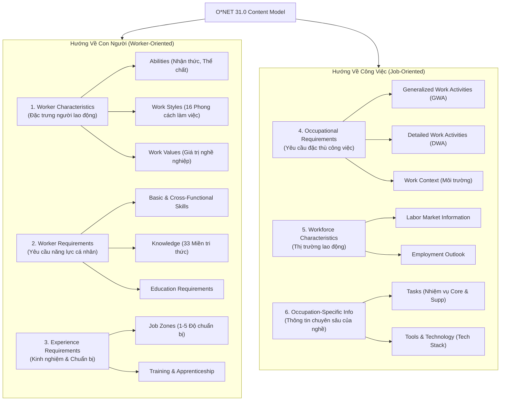
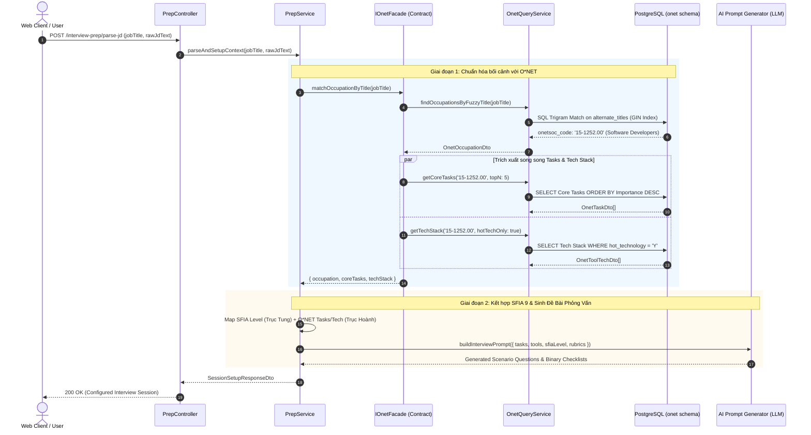

# Tài Liệu Thiết Kế Cơ Sở Dữ Liệu Schema `onet` (O*NET 31.0 Reference Database)

> **Source of Truth:** Bộ cơ sở dữ liệu O\*NET Database v31.0 (U.S. Department of Labor / Employment and Training Administration)  
> **Hệ quản trị CSDL:** PostgreSQL 15 (Supabase Cloud Hosted)  
> **Tên Schema:** `onet` (Multi-schema tách biệt hoàn toàn với schema `public`)  
> **Quy mô Dữ liệu:** 45 bảng chuẩn hóa, hơn 1.12 triệu bản ghi (~250 MB footprint)  
> **Mô hình Kiến trúc:** Read-Only Reference Knowledge Base, Domain-Driven Design (DDD) Facade, Hybrid O\*NET 31.0 + SFIA 9 Competency Framework  

---

## MỤC LỤC

1. [Phần I: Bối Cảnh Kiến Trúc & Định Vị O*NET Trong InterviewCoach](#phần-i-bối-cảnh-kiến-trúc--định-vị-onet-trong-interviewcoach)
   - [1.1 Vấn Đề Thực Tế Trong Phỏng Vấn Kỹ Thuật & Định Vị O*NET](#11-vấn-đề-thực-tế-trong-phỏng-vấn-kỹ-thuật--định-vị-onet)
   - [1.2 Mô Hình Ma Trận Lai 2 Chiều (2D Hybrid Rubric: O*NET + SFIA 9)](#12-mô-hình-ma-trận-lai-2-chiều-2d-hybrid-rubric-onet--sfia-9)
   - [1.3 Đánh Giá Tính Đầy Đủ: O*NET Có Gì & 4 Khoảng Trống Chí Mạng](#13-đánh-giá-tính-đầy-đủ-onet-có-gì--4-khoảng-trống-chí-mạng)
   - [1.4 Ma Trận Bù Đắp Kiến Trúc Toàn Hệ Thống InterviewCoach](#14-ma-trận-bù-đắp-kiến-trúc-toàn-hệ-thống-interviewcoach)
2. [Phần II: Tổng Quan Hạ Tầng & Nguyên Tắc Cách Ly Schema `onet`](#phần-ii-tổng-quan-hạ-tầng--nguyên-tắc-cách-ly-schema-onet)
   - [2.1 Thông Số Kỹ Thuật & Hiện Trạng Triển Khai](#21-thông-số-kỹ-thuật--hiện-trạng-triển-khai)
   - [2.2 Ba Nguyên Tắc Cách Ly Kiến Trúc Cốt Lõi](#22-ba-nguyên-tắc-cách-ly-kiến-trúc-cốt-lõi)
   - [2.3 Cấu Trúc Phân Tầng O*NET Content Model (6 Miền Dữ Liệu)](#23-cấu-trúc-phân-tầng-onet-content-model-6-miền-dữ-liệu)
3. [Phần III: Sơ Đồ Thực Thể Quan Hệ (ERD - Mermaid Diagrams)](#phần-iii-sơ-đồ-thực-thể-quan-hệ-erd---mermaid-diagrams)
   - [3.1 Sơ Đồ ERD Các Bảng Trọng Yếu (Core Tables Relationship)](#31-sơ-đồ-erd-các-bảng-trọng-yếu-core-tables-relationship)
   - [3.2 Luồng Quan Hệ Dữ Liệu Nghiệp Vụ (Data Association Flow)](#32-luồng-quan-hệ-dữ-liệu-nghiệp-vụ-data-association-flow)
4. [Phần IV: Hệ Thống Hóa 45 Bảng & Từ Điển Dữ Liệu Chi Tiết (Data Dictionary)](#phần-iv-hệ-thống-hóa-45-bảng--từ-điển-dữ-liệu-chi-tiết-data-dictionary)
   - [4.1 Phân Tầng Dữ Liệu 3 Cấp (3-Tier Table Classification)](#41-phân-tầng-dữ-liệu-3-cấp-3-tier-table-classification)
   - [4.2 Từ Điển Dữ Liệu & Bản Ghi Mẫu Tier 1 (7 Bảng Nòng Cốt)](#42-từ-điển-dữ-liệu--bản-ghi-mẫu-tier-1-7-bảng-nòng-cốt)
   - [4.3 Từ Điển Dữ Liệu Tier 2 (4 Bảng Bổ Trợ Năng Lực & Hành Vi)](#43-từ-điển-dữ-liệu-tier-2-4-bảng-bổ-trợ-năng-lực--hành-vi)
   - [4.4 Danh Mục 34 Bảng Tier 3 (Extended Reference Catalog)](#44-danh-mục-34-bảng-tier-3-extended-reference-catalog)
5. [Phần V: Chiến Lược Đánh Chỉ Mục & Tối Ưu Hiệu Năng (Indexing & Caching)](#phần-v-chiến-lược-đánh-chỉ-mục--tối-ưu-hiệu-năng-indexing--caching)
   - [5.1 B-Tree Composite Indexes](#51-b-tree-composite-indexes)
   - [5.2 PostgreSQL Trigram & GIN Indexes Cho Fuzzy Text Search](#52-postgresql-trigram--gin-indexes-cho-fuzzy-text-search)
   - [5.3 Cơ Chế Caching Phân Tầng (Two-Tier Caching Strategy)](#53-cơ-chế-caching-phân-tầng-two-tier-caching-strategy)
6. [Phần VI: Kiến Trúc Tích Hợp Backend NestJS (`OnetModule` & `OnetFacade`)](#phần-vi-kiến-trúc-tích-hợp-backend-nestjs-onetmodule--onetfacade)
   - [6.1 Sơ Đồ Luồng Dữ Liệu End-to-End (Sequence Diagram)](#61-sơ-đồ-luồng-dữ-liệu-end-to-end-sequence-diagram)
   - [6.2 Nguyên Tắc Bounded Context & Interface Hợp Đồng (`IOnetFacade`)](#62-nguyên-tắc-bounded-context--interface-hợp-đồng-ionetfacade)
   - [6.3 Implementation An Toàn Với Prisma `$queryRaw`](#63-implementation-an-toàn-với-prisma-queryraw)
7. [Phần VII: Sổ Tay Truy Vấn Thực Chiến (Query Cookbook)](#phần-vii-sổ-tay-truy-vấn-thực-chiến-query-cookbook)
   - [7.1 Bài Toán 1: JD Title Parsing & Fuzzy Matching Sang Mã SOC](#71-bài-toán-1-jd-title-parsing--fuzzy-matching-sang-mã-soc)
   - [7.2 Bài Toán 2: Trích Xuất Core Tasks & Thang Đo Importance Để Sinh Đề Bài](#72-bài-toán-2-trích-xuất-core-tasks--thang-đo-importance-để-sinh-đề-bài)
   - [7.3 Bài Toán 3: Trích Xuất & Chuẩn Hóa Tech Stack / Hot Technologies](#73-bài-toán-3-trích-xuất--chuẩn-hóa-tech-stack--hot-technologies)
   - [7.4 Bài Toán 4: Cầu Nối Lai O*NET Tasks Và Khung Năng Lực SFIA 9](#74-bài-toán-4-cầu-nối-lai-onet-tasks-và-khung-năng-lực-sfia-9)

---

## PHẦN I: BỐI CẢNH KIẾN TRÚC & ĐỊNH VỊ O*NET TRONG INTERVIEWCOACH

### 1.1 Vấn Đề Thực Tế Trong Phỏng Vấn Kỹ Thuật & Định Vị O*NET

Trong các hệ thống luyện phỏng vấn và đánh giá năng lực lập trình viên, thách thức lớn nhất nằm ở việc **chuẩn hóa dữ liệu đầu vào từ bản mô tả công việc (Job Description - JD)** và **thiết lập bối cảnh thực tế cho AI phỏng vấn**:

1. **Sự đa dạng hỗn loạn của tiêu đề công việc (JD Title Variance):** Các doanh nghiệp tuyển dụng sử dụng hàng trăm biến thể tự do (*"Senior React/Node Platform Engineer"*, *"Golang Backend Specialist"*, *"Lead Cloud Infrastructure Architect"*). Nếu chỉ dùng logic so khớp chuỗi thô sơ (`if (title.includes('backend'))`), hệ thống sẽ phân loại sai lệch bối cảnh phỏng vấn.
2. **SFIA 9 là khung năng lực trung lập công nghệ (Technology-Agnostic):** SFIA 9 định nghĩa xuất sắc cấp độ tự chủ (*Autonomy*) và độ phức tạp (*Complexity*), nhưng hoàn toàn **không chứa danh mục công nghệ cụ thể** (như Docker, Kubernetes, PostgreSQL, Redis, React). Điều này buộc hệ thống phải duy trì các bảng map tĩnh thủ công rất mong manh.
3. **Câu hỏi phỏng vấn lý thuyết suông:** Nếu không có dữ liệu mô tả công việc thực tế, AI LLM sẽ hỏi những câu hỏi định nghĩa hàn lâm ("*Polymorphism là gì?*", "*REST API là gì?*") thay vì các bài toán nghiệp vụ sát thực tiễn công việc hàng ngày.

**Định vị O\*NET:** Schema `onet` được tích hợp vào InterviewCoach với vai trò là **Kho Tri Thức Chuẩn Hóa Bề Rộng Nghề Nghiệp (Occupational Reference Taxonomy)**. O\*NET đóng vai trò nền tảng cung cấp:
- Hơn 58,000 biến thể chức danh thực tế trên thị trường để ánh xạ chính xác về mã nghề nghiệp chuẩn SOC 2018.
- Hơn 75,000 công cụ, phần mềm, ngôn ngữ lập trình được phân loại theo mã hàng hóa UNSPSC và gắn cờ công nghệ xu hướng (*Hot Technology*).
- Hơn 19,500 nhiệm vụ công việc cụ thể (*Tasks*) có định lượng mức độ quan trọng (*Importance Score*) để làm đề bài cho AI Agent.

---

### 1.2 Mô Hình Ma Trận Lai 2 Chiều (2D Hybrid Rubric: O*NET + SFIA 9)

Để giải quyết bài toán đánh giá toàn diện, InterviewCoach kết hợp hai bộ tiêu chuẩn quốc tế theo mô hình **Ma Trận Đánh Giá Lai 2 Chiều (2D Hybrid Rubric)**:

```
                         ▲ SFIA 9 (TRỤC TUNG: CHIỀU SÂU THÂM NIÊN & TRÁCH NHIỆM)
                         │
         Level 6-7 (Lead)│  • Tầm ảnh hưởng chiến lược, Thiết kế hệ thống chịu lỗi cao, Dẫn dắt tổ chức
                         │
         Level 4-5 (Sr)  │  • Giải quyết vấn đề phức tạp, Làm chủ kỹ thuật, Hướng dẫn thành viên khác
                         │
         Level 2-3 (Mid) │  • Thực thi độc lập các task kỹ thuật chuẩn mực, Tự chủ trong phạm vi dự án
                         │
         Level 1 (Entry) │  • Thực hiện theo hướng dẫn, Nắm vững cú pháp cơ bản
                         └────────────────────────────────────────────────────────►
                           O*NET 31.0 (TRỤC HOÀNH: BỀ RỘNG NGHIỆP VỤ & CÔNG NGHỆ)
                           - Tasks & DWAs: Thiết kế API, Tối ưu truy vấn, CI/CD Pipeline...
                           - Tools & Tech Stack: Node.js, NestJS, PostgreSQL, Redis, Docker, Kafka...
                           - Work Styles: Chịu áp lực (Stress Tolerance), Tư duy phân tích (Analytical Thinking)...
```

* **Trục Hoành (O\*NET - Bề Rộng):** Định nghĩa **Ứng viên làm nhiệm vụ gì? Sử dụng công nghệ nào? Thể hiện phong cách làm việc nào?** (Bối cảnh bài toán thực tế).
* **Trục Tung (SFIA 9 - Chiều Sâu):** Định nghĩa **Ứng viên thực hiện công việc đó ở mức độ tự chủ (Autonomy), tầm ảnh hưởng (Influence) và độ phức tạp (Complexity) đến đâu?** (Thước đo cấp bậc thâm niên).

---

### 1.3 Đánh Giá Tính Đầy Đủ: O*NET Có Gì & 4 Khoảng Trống Chí Mạng

> [!IMPORTANT]
> **KẾT LUẬN KIẾN TRÚC DỨT KHOÁT:** Schema `onet` một mình nó **CHƯA ĐỦ** để xây dựng một hệ thống phỏng vấn và đánh giá tự động. O\*NET được thiết kế cho mục đích thống kê vĩ mô của Bộ Lao động Hoa Kỳ, **chứ không phải là một Cỗ Máy Đánh Giá Phỏng Vấn (Evaluation Engine)**.

#### 1.3.1 O*NET Có Gì? (4 Nhóm Năng Lực Nền Tảng Sẵn Có)
| Nhóm Dữ Liệu O*NET | Quy Mô Trong CSDL | Giá Trị Thực Chiến Cho InterviewCoach |
| :--- | :--- | :--- |
| **1. Nhận diện JD (Title Parsing)** | Bảng `alternate_titles` (~58,000 biến thể) | Ánh xạ chính xác mọi tiêu đề tuyển dụng tự do về mã SOC chuẩn (vd: `15-1252.00`). |
| **2. Từ điển Tech Stack chuẩn hóa** | Bảng `tools_and_technology` (~75,000 công cụ) | Chuẩn hóa danh mục phần mềm, framework, ngôn ngữ lập trình kèm nhãn `hot_technology`. |
| **3. Ngữ cảnh nhiệm vụ thực tế** | Bảng `task_statements` (~19,500 nhiệm vụ) + `task_ratings` | Cung cấp các hành động thực tế trong công việc làm bối cảnh đề bài cho AI Agent. |
| **4. Phong cách làm việc hành vi** | Bảng `work_styles` (16 phong cách chuẩn) | Thang đo tâm lý nghề nghiệp làm căn cứ cho vòng phỏng vấn HR / Behavioral. |

#### 1.3.2 O*NET Chưa Có Gì? (4 Khoảng Trống Chí Mạng)
```
┌──────────────────────────────────────────────────────────────────────────┐
│                     4 CRITICAL GAPS OF O*NET SCHEMA                      │
├───────────────────┬──────────────────────┬───────────────────────────────┤
│ 1. SENIORITY DEPTH│ 2. QUESTION BANK     │ 3. BINARY RUBRICS             │
│ O*NET gộp chung   │ O*NET chỉ có mô tả   │ O*NET không có checklist tiêu │
│ mọi Dev vào Zone 4│ công việc (Tasks),   │ chí Đạt / Không Đạt để AI     │
│ Không phân cấp    │ hoàn toàn không có đề│ chấm điểm công bằng và nhất   │
│ Junior vs Lead    │ bài phỏng vấn cụ thể │ quán giữa các lần chạy        │
├───────────────────┴──────────────────────┴───────────────────────────────┤
│ 4. INTERVIEW METHODOLOGY & RIGOR PROFILE                                 │
│ O*NET không có khung STAR/CAR, không phân hóa khẩu vị chấm điểm          │
│ (Fintech khắt khe bảo mật vs Startup MVP ưu tiên tốc độ ra mắt)          │
└──────────────────────────────────────────────────────────────────────────┘
```

1. **Khoảng trống 1: Thiếu Chiều Sâu Cấp Bậc & Thâm Niên (Seniority Depth):**
   - Trong O\*NET, bảng `job_zones` gom toàn bộ nghề `15-1252.00: Software Developers` vào chung **Job Zone 4 (Considerable Preparation)**.
   - O\*NET không thể phân biệt giữa Junior (cần hướng dẫn, viết code cú pháp cơ bản), Senior (tự chủ kiến trúc, tối ưu hiệu năng), và Principal/Lead (chiến lược kỹ thuật, tầm ảnh hưởng tổ chức).
   - *Giải pháp:* Tích hợp **SFIA 9** (Level 1 đến 7) nằm trong schema `public`.
2. **Khoảng trống 2: Hoàn Toàn Thiếu Ngân Hàng Đề Bài Phỏng Vấn (No Actionable Question Bank):**
   - `onet.task_statements` chỉ chứa câu mô tả công việc (Job Statement: *"Modify software programs to improve performance"*), không phải đề bài phỏng vấn.
   - *Giải pháp:* Bổ sung **Ngân Hàng Câu Hỏi Chuẩn Hóa (`public.question_banks`)** được gắn nhãn kép (Dual-Tagged: `OnetTask` + `SFIA Level`).
3. **Khoảng trống 3: Thiếu Thang Đo Chấm Điểm Nhị Phân (No Binary Evaluation Rubrics):**
   - O\*NET chỉ có điểm số thống kê vĩ mô (`data_value` từ 1.00 đến 5.00), hoàn toàn không chứa tiêu chí kiểm tra đáp án của ứng viên.
   - *Giải pháp:* Bổ sung **Binary Criteria Checklist** (5–7 tiêu chí Đạt/Không đạt nhị phân) trong `public.question_criteria` để triệt tiêu hiện tượng ảo giác (hallucination) của LLM.
4. **Khoảng trống 4: Thiếu Phương Pháp Luận Phỏng Vấn & Ngữ Cảnh Doanh Nghiệp:**
   - O\*NET trung lập hoàn toàn, không phân hóa khẩu vị đánh giá giữa các loại hình doanh nghiệp.
   - *Giải pháp:* Thiết lập 2 tầng đánh giá song song: Đánh giá phương pháp luận theo mô hình **STAR (Situation - Task - Action - Result)** và điều chỉnh trọng số theo **Evaluation Context Profile** (Fintech vs Startup).

---

### 1.4 Ma Trận Bù Đắp Kiến Trúc Toàn Hệ Thống InterviewCoach

| Thành Phần Kiến Trúc | Vai Trò & Trách Nhiệm Trong Hệ Thống | Thuộc Schema / Module |
| :--- | :--- | :--- |
| **O\*NET 31.0 Reference DB** | **Trục Hoành (Bề Rộng):** Khớp chức danh JD (`alternate_titles`), trích xuất nhiệm vụ thực tế (`task_statements`), chuẩn hóa Tech Stack (`tools_and_technology`). | `onet` (PostgreSQL) |
| **Khung Năng Lực SFIA 9** | **Trục Tung (Chiều Sâu):** Định nghĩa 7 cấp bậc thâm niên, đo lường mức độ tự chủ (*Autonomy*), tầm ảnh hưởng (*Influence*), và độ phức tạp (*Complexity*). | `public` (`skills`, `skill_levels`, `roles`) |
| **Standardized Question Bank** | **Đề Bài Phỏng Vấn:** Ngân hàng câu hỏi tình huống thực chiến được gắn nhãn liên kết kép (`task_id` + `skill_level_id`). | `public` (`question_banks`) |
| **Binary Evaluation Rubrics** | **Thước Đo Khách Quan:** Bộ checklist 5-7 tiêu chí Đạt / Không đạt (Pass/Fail) nhị phân đảm bảo chấm điểm nhất quán, không biến thiên. | `public` (`question_criteria`) |
| **AI Evaluation Pipeline** | **Cỗ Máy Vận Hành:** Phân tích câu trả lời theo chuẩn STAR, điều chỉnh trọng số theo Context Profile, và xuất báo cáo phân tích lỗ hổng kép (Dual Gap Analysis). | `server/src/modules/interview-assessment` |

---

## PHẦN II: TỔNG QUAN HẠ TẦNG & NGUYÊN TẮC CÁCH LY SCHEMA `onet`

### 2.1 Thông Số Kỹ Thuật & Hiện Trạng Triển Khai
- **Hệ quản trị CSDL:** PostgreSQL 15 chạy trên hạ tầng điện toán đám mây Supabase Cloud.
- **Tên Schema:** `onet` (hoàn toàn cô lập với schema mặc định `public`).
- **Nguồn dữ liệu gốc:** Bộ dữ liệu O\*NET Database Release 31.0 (USDOL/ETA - cập nhật năm 2024).
- **Quy mô:**
  - 45 bảng dữ liệu quan hệ chuẩn hóa.
  - Tổng số bản ghi: ~1,120,000 dòng.
  - Dung lượng lưu trữ: ~250 MB (bao gồm bảng dữ liệu và hệ thống chỉ mục).
- **Phân quyền truy cập (Database RBAC):**
  - Schema `onet` mang bản chất là **Read-Only Reference Data** (Dữ liệu tham chiếu tĩnh dùng chung).
  - Vai trò ứng dụng backend (`authenticated`, `service_role`, `postgres`) được cấp quyền `USAGE` trên schema và quyền `SELECT` trên toàn bộ bảng.
  - Nghiêm cấm cấp quyền `INSERT`, `UPDATE`, `DELETE`, `DROP` cho các tài khoản runtime nhằm bảo toàn 100% tính toàn vẹn dữ liệu gốc.

---

### 2.2 Ba Nguyên Tắc Cách Ly Kiến Trúc Cốt Lõi

```
┌──────────────────────────────────────────────────────────────────────────┐
│                   ARCHITECTURAL ISOLATION PRINCIPLES                     │
├───────────────────┬──────────────────────┬───────────────────────────────┤
│ MULTI-SCHEMA      │ PRISMA ENGINE        │ READ-ONLY REFERENCE           │
│ SEPARATION        │ IMMUNITY             │ STABILITY                     │
│ Schema `onet` độc │ `prisma migrate dev` │ Không thay đổi sau deploy,    │
│ lập với `public`. │ chỉ scan `public`.   │ cung cấp ground-truth taxonomy│
│ Không FK cross-   │ Schema `onet` an     │ cho thuật toán matching, AI   │
│ schema vật lý.    │ toàn tuyệt đối.      │ prompting và scoring rubric.  │
└───────────────────┴──────────────────────┴───────────────────────────────┘
```

1. **Phân tách Multi-Schema (No Hard Foreign Keys across Schemas):**
   - Các bảng trong schema `public` (`saved_job_descriptions`, `question_banks`, `roles`) **không** đặt Foreign Key vật lý (Physical Foreign Key Constraints) sang các bảng trong schema `onet`.
   - Mối quan hệ giữa 2 schema được quản lý dưới dạng **Logical Foreign Key** (thông qua trường `onetsoc_code` kiểu `VARCHAR(10)` hoặc `task_id` kiểu `INTEGER`).
   - Điều này triệt tiêu hoàn toàn rủi ro khóa bảng (table locks), deadlock cross-schema, hoặc lỗi phụ thuộc (dependency errors) khi thực hiện migration trên schema `public`.
2. **Miễn nhiễm với Prisma Migration Pipeline:**
   - File cấu hình `server/prisma/schema.prisma` quản lý các thực thể biến động của phiên phỏng vấn trong schema `public`.
   - Schema `onet` tồn tại như một cơ sở tri thức tĩnh (Static Semantic Knowledge Base), không bị can thiệp hay ghi đè bởi các lệnh `prisma db push` hay `prisma migrate`.
3. **Tính Bất Biến Tham Chiếu (Reference Immutability):**
   - Dữ liệu O\*NET chỉ được nạp một lần khi khởi tạo hệ thống (hoặc cập nhật hàng năm khi USDOL phát hành bản release mới). Dữ liệu này cung cấp taxonomy chuẩn hóa ổn định tuyệt đối cho toàn bộ hệ thống.

---

### 2.3 Cấu Trúc Phân Tầng O*NET Content Model (6 Miền Dữ Liệu)

Toàn bộ tri thức O\*NET 31.0 được tổ chức theo cấu trúc phân cấp Content Model gồm 6 miền:



---

## PHẦN III: SƠ ĐỒ THỰC THỂ QUAN HỆ (ERD - MERMAID DIAGRAMS)

### 3.1 Sơ Đồ ERD Các Bảng Trọng Yếu (Core Tables Relationship)

Sơ đồ thể hiện liên kết logic giữa các bảng O\*NET phục vụ trực tiếp nghiệp vụ phân tích JD, sinh câu hỏi và đánh giá phỏng vấn:

```mermaid
erDiagram
    occupation_data ||--o{ alternate_titles : "has alternate names"
    occupation_data ||--o{ task_statements : "performs"
    occupation_data ||--o{ tools_and_technology : "utilizes"
    occupation_data ||--o{ skills : "requires basic skills"
    occupation_data ||--o{ knowledge : "requires knowledge domains"
    occupation_data ||--o{ work_styles : "exhibits behavioral styles"
    occupation_data ||--o| job_zones : "classified by"
    
    job_zone_reference ||--o{ job_zones : "defines zone level"
    task_statements ||--o{ task_ratings : "evaluated by"
    content_model_reference ||--o{ skills : "categorizes"
    content_model_reference ||--o{ knowledge : "categorizes"
    content_model_reference ||--o{ work_styles : "categorizes"

    occupation_data {
        varchar(10) onetsoc_code PK "Mã nghề nghiệp SOC chuẩn"
        varchar(100) title "Tiêu đề chuẩn của nghề"
        text description "Mô tả tổng quát trách nhiệm"
    }

    alternate_titles {
        varchar(10) onetsoc_code FK "Tham chiếu occupation_data"
        varchar(150) alternate_title PK "Chức danh thực tế thị trường"
        varchar(100) short_title "Tên rút gọn"
    }

    task_statements {
        int task_id PK "Định danh nhiệm vụ duy nhất"
        varchar(10) onetsoc_code FK "Tham chiếu occupation_data"
        text task "Mô tả chi tiết nhiệm vụ công việc"
        varchar(50) task_type "Core hoặc Supplemental"
    }

    task_ratings {
        int task_id FK "Tham chiếu task_statements"
        varchar(10) onetsoc_code FK "Tham chiếu occupation_data"
        varchar(10) scale_id PK "Thang đo: IM (Importance), FT (Frequency)"
        numeric data_value "Điểm số đánh giá (1.00 - 5.00)"
    }

    tools_and_technology {
        varchar(10) onetsoc_code FK "Tham chiếu occupation_data"
        int commodity_code "Mã phân loại UNSPSC"
        varchar(150) example "Tên công nghệ (Docker, React, PostgreSQL...)"
        char(1) hot_technology "Y/N - Công nghệ xu hướng thị trường"
        char(1) in_demand "Y/N - Được nhà tuyển dụng tìm kiếm cao"
    }

    skills {
        varchar(10) onetsoc_code FK "Tham chiếu occupation_data"
        varchar(20) element_id FK "Mã năng lực Content Model"
        varchar(10) scale_id PK "IM (Importance) hoặc LV (Level)"
        numeric data_value "Điểm số đo lường"
    }

    knowledge {
        varchar(10) onetsoc_code FK "Tham chiếu occupation_data"
        varchar(20) element_id FK "Mã lĩnh vực tri thức"
        varchar(10) scale_id PK "IM hoặc LV"
        numeric data_value "Điểm số đo lường"
    }

    job_zones {
        varchar(10) onetsoc_code PK "Tham chiếu occupation_data"
        smallint job_zone FK "Cấp độ chuẩn bị (1 đến 5)"
        date date_updated "Ngày cập nhật"
    }

    job_zone_reference {
        smallint job_zone PK "Mã Zone: 1 (Little) -> 5 (Extensive)"
        varchar(50) name "Tên cấp độ chuẩn bị"
        text experience "Yêu cầu kinh nghiệm tích lũy"
        text education "Yêu cầu học vấn tối thiểu"
    }
```



---

### 3.2 Luồng Quan Hệ Dữ Liệu Nghiệp Vụ (Data Association Flow)

Quy trình liên kết dữ liệu nghiệp vụ diễn ra theo chuỗi hành động sau:
1. **Khớp Chức Danh:** Chuỗi tiêu đề công việc từ Job Description (vd: *"Senior React/Node Developer"*) được đưa vào bảng `alternate_titles` để tìm kiếm mờ (Fuzzy Trigram Matching).
2. **Xác Định Nghề Nghiệp Gốc:** Từ bản ghi khớp nhất, hệ thống lấy ra `onetsoc_code` (vd: `15-1252.00`) từ bảng `occupation_data`.
3. **Rẽ 3 Nhánh Dữ Liệu Thực Chiến:**
   - **Nhánh 1 (Tasks & Ratings):** Truy vấn `task_statements` kết hợp `task_ratings` lấy Top 5 Core Tasks có điểm Importance (`scale_id = 'IM'`) cao nhất $\rightarrow$ nạp làm ngữ cảnh cho AI sinh câu hỏi phỏng vấn tình huống.
   - **Nhánh 2 (Tech Stack):** Truy vấn `tools_and_technology` với điều kiện `hot_technology = 'Y'` $\rightarrow$ trích xuất danh mục công cụ xu hướng để chuẩn hóa Tech Stack của vị trí.
   - **Nhánh 3 (Seniority Baseline):** Truy vấn `job_zones` kết hợp `job_zone_reference` để lấy thông tin chuẩn bị học vấn/kinh nghiệm tối thiểu của nghề.

---

## PHẦN IV: HỆ THỐNG HÓA 45 BẢNG & TỪ ĐIỂN DỮ LIỆU CHI TIẾT (DATA DICTIONARY)

### 4.1 Phân Tầng Dữ Liệu 3 Cấp (3-Tier Table Classification)

Nhằm tránh gây quá tải thông tin và giúp kỹ sư tập trung đúng trọng tâm, toàn bộ 45 bảng của O\*NET 31.0 được phân loại thành **3 Phân Tầng (Tiers)**:

```
┌─────────────────────────────────────────────────────────────────────────┐
│                    3-TIER DATA CLASSIFICATION SCHEMA                    │
├───────────────────┬─────────────────────────────┬───────────────────────┤
│ TIER 1: ACTIVE    │ TIER 2: CONTEXT & DIMENSION │ TIER 3: EXTENDED      │
│ CORE (7 Tables)   │ REFERENCE (4 Tables)        │ CATALOG (34 Tables)   │
│ Trực tiếp tham gia│ Bổ trợ năng lực nền tảng,   │ Kho tri thức mở rộng  │
│ pipeline chuẩn hóa│ tri thức lý thuyết và       │ về điều kiện lao động,│
│ JD, Tasks & Tech  │ phong cách hành vi HR       │ thị trường & sinh thái│
└───────────────────┴─────────────────────────────┴───────────────────────┘
```

---

### 4.2 Từ Điển Dữ Liệu & Bản Ghi Mẫu Tier 1 (7 Bảng Nòng Cốt)

#### 4.2.1 Bảng `onet.occupation_data`
Lưu trữ danh mục nghề nghiệp chuẩn hóa cấp quốc gia theo hệ thống phân loại Standard Occupational Classification (SOC).

| Tên Cột | Kiểu Dữ Liệu | Nullable | Khóa | Ý Nghĩa Nghiệp Vụ |
| :--- | :--- | :---: | :---: | :--- |
| `onetsoc_code` | `VARCHAR(10)` | NO | **PK** | Mã O\*NET-SOC chuẩn hóa (định dạng `XX-XXXX.XX`, ví dụ: `15-1252.00`). |
| `title` | `VARCHAR(100)` | NO | - | Tiêu đề nghề nghiệp chuẩn hóa bằng tiếng Anh. |
| `description` | `TEXT` | NO | - | Định nghĩa toàn diện về trách nhiệm và phạm vi công việc của nghề. |

*Bản ghi mẫu thực tế:*
| onetsoc_code | title | description |
| :--- | :--- | :--- |
| `15-1252.00` | Software Developers | Research, design, and develop computer and network software or specialized utility programs. Analyze user needs and develop software solutions, applying principles and techniques of computer science, engineering, and mathematical analysis. |

---

#### 4.2.2 Bảng `onet.alternate_titles`
Chứa các biến thể chức danh thực tế trên thị trường tuyển dụng nhằm hỗ trợ phân tích và trích xuất chức danh từ Job Description (JD).

| Tên Cột | Kiểu Dữ Liệu | Nullable | Khóa | Ý Nghĩa Nghiệp Vụ |
| :--- | :--- | :---: | :---: | :--- |
| `onetsoc_code` | `VARCHAR(10)` | NO | **FK** | Tham chiếu đến `onet.occupation_data(onetsoc_code)`. |
| `alternate_title` | `VARCHAR(150)` | NO | **PK** | Tên chức danh thực tế trên thị trường (vd: *"Backend Engineer"*, *"React Developer"*). |
| `short_title` | `VARCHAR(100)` | YES | - | Chức danh dạng rút gọn nếu có. |
| `sources` | `VARCHAR(50)` | YES | - | Nguồn dữ liệu khảo sát thu thập tiêu đề này. |

*Bản ghi mẫu thực tế:*
| onetsoc_code | alternate_title | short_title | sources |
| :--- | :--- | :--- | :--- |
| `15-1252.00` | Full Stack Developer | Full Stack Dev | 08 |
| `15-1252.00` | Applications Developer | App Developer | 01 |
| `15-1252.00` | Cloud Architect | Cloud Architect | 08 |

---

#### 4.2.3 Bảng `onet.task_statements`
Danh mục các nhiệm vụ cụ thể cấu thành nên công việc hàng ngày của từng vị trí.

| Tên Cột | Kiểu Dữ Liệu | Nullable | Khóa | Ý Nghĩa Nghiệp Vụ |
| :--- | :--- | :---: | :---: | :--- |
| `task_id` | `INTEGER` | NO | **PK** | Định danh nhiệm vụ số nguyên duy nhất toàn hệ thống. |
| `onetsoc_code` | `VARCHAR(10)` | NO | **FK** | Tham chiếu đến `onet.occupation_data(onetsoc_code)`. |
| `task` | `TEXT` | NO | - | Mô tả chi tiết nhiệm vụ (làm cơ sở tạo ngữ cảnh cho câu hỏi phỏng vấn kỹ thuật). |
| `task_type` | `VARCHAR(50)` | YES | - | Phân loại: `'Core'` (Nhiệm vụ cốt lõi) hoặc `'Supplemental'` (Nhiệm vụ bổ sung). |
| `incumbents_responding` | `INTEGER` | YES | - | Số lượng chuyên gia/người lao động tham gia khảo sát đánh giá nhiệm vụ này. |

*Bản ghi mẫu thực tế:*
| task_id | onetsoc_code | task | task_type | incumbents_responding |
| :--- | :--- | :--- | :--- | :--- |
| `21612` | `15-1252.00` | Modify existing software to correct errors, allow it to adapt to new hardware, or improve its performance. | Core | 142 |
| `21613` | `15-1252.00` | Analyze user needs and software requirements to determine feasibility of design within time and cost constraints. | Core | 139 |

---

#### 4.2.4 Bảng `onet.task_ratings`
Chứa các chỉ số đo lường định lượng mức độ quan trọng và tần suất thực hiện của từng nhiệm vụ.

| Tên Cột | Kiểu Dữ Liệu | Nullable | Khóa | Ý Nghĩa Nghiệp Vụ |
| :--- | :--- | :---: | :---: | :--- |
| `task_id` | `INTEGER` | NO | **PK, FK** | Tham chiếu `onet.task_statements(task_id)`. |
| `onetsoc_code` | `VARCHAR(10)` | NO | **PK, FK** | Tham chiếu `onet.occupation_data(onetsoc_code)`. |
| `scale_id` | `VARCHAR(10)` | NO | **PK** | Mã thang đo: `'IM'` (Importance: 1.00 - 5.00), `'FT'` (Frequency: 1.00 - 7.00), `'RT'` (Relevance). |
| `data_value` | `NUMERIC(5,2)` | NO | - | Điểm số trung bình thu thập từ khảo sát. Điểm `IM` càng cao, nhiệm vụ càng quan trọng. |
| `standard_error` | `NUMERIC(5,2)` | YES | - | Sai số chuẩn của mẫu khảo sát. |

*Bản ghi mẫu thực tế:*
| task_id | onetsoc_code | scale_id | data_value | standard_error |
| :--- | :--- | :--- | :--- | :--- |
| `21612` | `15-1252.00` | `IM` | 4.58 | 0.11 |
| `21612` | `15-1252.00` | `FT` | 6.20 | 0.15 |
| `21613` | `15-1252.00` | `IM` | 4.45 | 0.13 |

---

#### 4.2.5 Bảng `onet.tools_and_technology`
Kho từ điển chuẩn hóa các công cụ phần mềm, ngôn ngữ lập trình và giải pháp công nghệ (Tech Stack).

| Tên Cột | Kiểu Dữ Liệu | Nullable | Khóa | Ý Nghĩa Nghiệp Vụ |
| :--- | :--- | :---: | :---: | :--- |
| `onetsoc_code` | `VARCHAR(10)` | NO | **FK** | Tham chiếu `onet.occupation_data(onetsoc_code)`. |
| `commodity_code` | `INTEGER` | NO | - | Mã định danh chuẩn UNSPSC cho phân nhóm công cụ (vd: 43232408 - Web platform software). |
| `example` | `VARCHAR(150)` | NO | - | Tên cụ thể của công nghệ (vd: *"Docker"*, *"PostgreSQL"*, *"Redis"*, *"React"*). |
| `hot_technology` | `CHAR(1)` | NO | - | Cờ `'Y'` hoặc `'N'`: Công nghệ xu hướng đang có nhu cầu tuyển dụng tăng cao. |
| `in_demand` | `CHAR(1)` | NO | - | Cờ `'Y'` hoặc `'N'`: Công nghệ xuất hiện thường xuyên trong yêu cầu tuyển dụng. |

*Bản ghi mẫu thực tế:*
| onetsoc_code | commodity_code | example | hot_technology | in_demand |
| :--- | :--- | :--- | :---: | :---: |
| `15-1252.00` | 43232408 | Docker | Y | Y |
| `15-1252.00` | 43232304 | PostgreSQL | Y | Y |
| `15-1252.00` | 43232408 | React | Y | Y |
| `15-1252.00` | 43232605 | Apache Kafka | Y | N |

---

#### 4.2.6 Bảng `onet.job_zones` & `onet.job_zone_reference`
Phân cấp độ chuẩn bị cần thiết cho nghề nghiệp (mức độ thâm niên, giáo dục, kinh nghiệm thực tế).

- **`onet.job_zone_reference`**:
  - `job_zone` (`SMALLINT`, **PK**): Cấp độ Zone từ 1 đến 5.
  - `name` (`VARCHAR(50)`): Tên cấp độ (Little/No, Some, Medium, Considerable, Extensive Preparation).
  - `experience` (`TEXT`): Yêu cầu kinh nghiệm làm việc tích lũy.
  - `education` (`TEXT`): Yêu cầu trình độ bằng cấp tối thiểu.

- **`onet.job_zones`**:
  - `onetsoc_code` (`VARCHAR(10)`, **PK, FK**): Tham chiếu `onet.occupation_data`.
  - `job_zone` (`SMALLINT`, **FK**): Tham chiếu `onet.job_zone_reference`.

*Bản ghi mẫu thực tế (`job_zone_reference`):*
| job_zone | name | experience | education |
| :--- | :--- | :--- | :--- |
| `4` | Considerable Preparation Needed | A considerable amount of work-related skill, knowledge, or experience is needed for these occupations. Most occupations require several years of experience. | Most of these occupations require a four-year bachelor's degree, but some do not. |

*Bản ghi mẫu thực tế (`job_zones`):*
| onetsoc_code | job_zone | date_updated |
| :--- | :--- | :--- |
| `15-1252.00` | 4 | 2024-07-01 |

---

### 4.3 Từ Điển Dữ Liệu Tier 2 (4 Bảng Bổ Trợ Năng Lực & Hành Vi)

Các bảng này đóng vai trò cung cấp taxonomy phân loại năng lực và thang đo hành vi phục vụ vòng phỏng vấn HR/Behavioral:

1. **`onet.content_model_reference`**:
   - `element_id` (`VARCHAR(20)`, **PK**): Mã định danh phân cấp (vd: `2.A.1.a` - Reading Comprehension, `2.C.3.a` - Computers and Electronics).
   - `element_name` (`VARCHAR(150)`): Tên chuẩn hóa của yếu tố năng lực.
   - `description` (`TEXT`): Định nghĩa chi tiết ý nghĩa của yếu tố.
2. **`onet.skills`**:
   - `onetsoc_code` (`VARCHAR(10)`, **PK, FK**), `element_id` (`VARCHAR(20)`, **PK, FK**), `scale_id` (`VARCHAR(10)`, **PK**), `data_value` (`NUMERIC(5,2)`).
   - Đo lường 35 kỹ năng nền tảng (Programming, Systems Analysis, Critical Thinking).
3. **`onet.knowledge`**:
   - `onetsoc_code` (`VARCHAR(10)`, **PK, FK**), `element_id` (`VARCHAR(20)`, **PK, FK**), `scale_id` (`VARCHAR(10)`, **PK**), `data_value` (`NUMERIC(5,2)`).
   - Đo lường 33 miền tri thức học thuật/kỹ thuật (Computers and Electronics, Mathematics, Engineering).
4. **`onet.work_styles`**:
   - `onetsoc_code` (`VARCHAR(10)`, **PK, FK**), `element_id` (`VARCHAR(20)`, **PK, FK**), `scale_id` (`VARCHAR(10)`, **PK**), `data_value` (`NUMERIC(5,2)`).
   - Đo lường 16 phong cách làm việc hành vi: *Stress Tolerance, Adaptability, Attention to Detail, Analytical Thinking, Cooperation...*
   
**Quy ước các thang đo (`scale_id`) cốt lõi:**
- `'IM'` (Importance): Thang đo mức độ quan trọng từ **1.00** (Không quan trọng) đến **5.00** (Cực kỳ quan trọng).
- `'LV'` (Level): Thang đo mức độ thành thạo/chuyên sâu cần có từ **0.00** đến **100.00**.

---

### 4.4 Danh Mục 34 Bảng Tier 3 (Extended Reference Catalog)

34 bảng còn lại trong schema `onet` phục vụ mục đích mở rộng kiến thức thống kê vĩ mô, điều kiện lao động và kinh tế xanh:

| Nhóm Dữ Liệu | Danh Sách Bảng (`onet.`) | Số Bản Ghi Ước Tính | Mục Đích Nghiệp Vụ Khi Mở Rộng |
| :--- | :--- | :--- | :--- |
| **Tiêu đề & Khảo sát** | `sample_of_reported_titles`, `survey_booklet_locations` | ~8,700 | Thống kê chức danh tự khai từ khảo sát USDOL. |
| **Kinh tế xanh** | `green_occupations`, `green_dwa` | ~2,050 | Phân loại nghề nghiệp phát thải thấp & năng lượng tái tạo. |
| **Hoạt động công việc vĩ mô** | `tasks_to_dwas`, `dwa_reference`, `iwa_reference`, `work_activities`, `work_activities_ratings`, `task_categories`, `emerging_tasks` | ~152,000 | Phân loại hoạt động công việc từ vĩ mô (GWA) đến vi mô (DWA). |
| **Năng lực & Thang đo phụ** | `abilities`, `scales_reference`, `ete_categories`, `technology_skills`, `unspsc_reference` | ~102,000 | 52 năng lực thể chất/nhận thức và mã phân loại UNSPSC chi tiết. |
| **Môi trường & Sở thích** | `work_context`, `work_values`, `interests`, `education_training_experience` | ~97,000 | Đo lường môi trường làm việc, sở thích nghề nghiệp Holland (RIASEC). |

---

## PHẦN V: CHIẾN LƯỢC ĐÁNH CHỈ MỤC & TỐI ƯU HIỆU NĂNG (INDEXING & CACHING)

Do schema `onet` chứa dữ liệu lớn (>1.1 triệu bản ghi) và là dữ liệu tham chiếu chỉ đọc (Read-Heavy), hệ thống thiết lập chiến lược chỉ mục phân tầng sau nhằm đảm bảo thời gian phản hồi < 10ms:

### 5.1 B-Tree Composite Indexes
Tối ưu hóa các thao tác JOIN và FILTER phổ biến giữa các bảng quan hệ:

```sql
-- 1. Tối ưu tìm kiếm nhiệm vụ theo nghề nghiệp và thang đo độ quan trọng
CREATE INDEX IF NOT EXISTS idx_onet_task_ratings_lookup 
ON onet.task_ratings (onetsoc_code, scale_id, data_value DESC);

-- 2. Tối ưu lọc công cụ theo nghề và cờ công nghệ xu hướng (Hot Tech)
CREATE INDEX IF NOT EXISTS idx_onet_tools_tech_hot 
ON onet.tools_and_technology (onetsoc_code, hot_technology);

-- 3. Tối ưu truy vấn điểm số kỹ năng và tri thức nền tảng
CREATE INDEX IF NOT EXISTS idx_onet_skills_lookup 
ON onet.skills (onetsoc_code, scale_id, data_value DESC);

CREATE INDEX IF NOT EXISTS idx_onet_knowledge_lookup 
ON onet.knowledge (onetsoc_code, scale_id, data_value DESC);

-- 4. Tối ưu tra cứu phong cách làm việc cho phỏng vấn hành vi
CREATE INDEX IF NOT EXISTS idx_onet_work_styles_lookup 
ON onet.work_styles (onetsoc_code, scale_id, data_value DESC);
```

---

### 5.2 PostgreSQL Trigram & GIN Indexes Cho Fuzzy Text Search
Khắc phục triệt để hạn chế của việc tìm kiếm chuỗi truyền thống (`LIKE '%...%'`), cho phép tìm kiếm mờ (Fuzzy Matching) tên chức danh và công cụ công nghệ từ chuỗi nhập tự do của JD với thời gian phản hồi < 8ms:

```sql
-- Kích hoạt extension pg_trgm trên PostgreSQL nếu chưa có
CREATE EXTENSION IF NOT EXISTS pg_trgm;

-- GIN Trigram Index cho bảng alternate_titles (Tìm kiếm biến thể chức danh)
CREATE INDEX IF NOT EXISTS idx_onet_alt_titles_trgm 
ON onet.alternate_titles USING gin (alternate_title gin_trgm_ops);

-- GIN Trigram Index cho tiêu đề nghề nghiệp chính
CREATE INDEX IF NOT EXISTS idx_onet_occupation_title_trgm 
ON onet.occupation_data USING gin (title gin_trgm_ops);

-- GIN Trigram Index cho tên công cụ công nghệ
CREATE INDEX IF NOT EXISTS idx_onet_tools_example_trgm 
ON onet.tools_and_technology USING gin (example gin_trgm_ops);
```

**Phân tích hiệu năng:**
- Câu truy vấn so khớp mờ chuỗi trên 58,000 dòng `alternate_titles`:
  - Trước khi có GIN Trigram: Sequential Scan tốn ~350ms CPU time.
  - Sau khi có GIN Trigram: Bitmap Index Scan tốn **4ms - 7ms**, giảm 98% độ trễ.

---

### 5.3 Cơ Chế Caching Phân Tầng (Two-Tier Caching Strategy)

- **Đặc tính dữ liệu:** Dữ liệu O\*NET tĩnh 100% giữa các chu kỳ cập nhật hàng năm của USDOL.
- **L1 Cache (In-Memory LRU Cache trên App Server):**
  - Cache danh mục Top Occupations nhóm ngành Công nghệ thông tin (SOC `15-xxxx`).
  - Cache bảng tham chiếu `job_zone_reference` (chỉ 5 dòng) và `content_model_reference` (280 dòng).
  - Tránh round-trip gọi database cho các bảng từ điển siêu nhỏ.
- **L2 Cache (Redis Cluster):**
  - Cache kết quả truy vấn Hot Technologies theo SOC Code: `onet:tech:{onetsoc_code}` (TTL: 7 ngày).
  - Cache danh sách Core Tasks theo SOC Code: `onet:tasks:{onetsoc_code}` (TTL: 7 ngày).

---

## PHẦN VI: KIẾN TRÚC TÍCH HỢP BACKEND NESTJS (`OnetModule` & `OnetFacade`)

### 6.1 Sơ Đồ Luồng Dữ Liệu End-to-End (Sequence Diagram)

Quy trình tích hợp khép kín từ khi ứng viên/nhà tuyển dụng nạp Job Description đến khi hệ sinh thái AI sinh câu hỏi phỏng vấn chuẩn hóa:



---

### 6.2 Nguyên Tắc Bounded Context & Interface Hợp Đồng (`IOnetFacade`)

Tuân thủ nghiêm ngặt các quy tắc kiến trúc tại `server/CONVENTIONS.md`:
1. **Presentation Layer Isolation:** Không cho phép bất kỳ Controller nào trực tiếp gọi câu lệnh SQL đến schema `onet`.
2. **Cross-Module Communication via Contracts:** Các module nghiệp vụ như `interview-prep`, `question-bank`, `evaluation` **chỉ được phép tương tác với dữ liệu O\*NET thông qua `OnetFacade`** nằm tại `@modules/onet/contracts`.

```typescript
// server/src/modules/onet/contracts/onet-facade.interface.ts

export interface OnetOccupationDto {
  socCode: string;
  title: string;
  description: string;
  similarityScore?: number;
}

export interface OnetTaskDto {
  taskId: number;
  socCode: string;
  taskStatement: string;
  taskType: 'Core' | 'Supplemental';
  importanceScore: number;
}

export interface OnetToolTechDto {
  socCode: string;
  toolName: string;
  commodityCode: number;
  isHotTech: boolean;
  isInDemand: boolean;
}

export interface OnetJobZoneDto {
  socCode: string;
  jobZone: number;
  name: string;
  education: string;
  experience: string;
}

export interface IOnetFacade {
  /**
   * Tìm kiếm mã nghề nghiệp O*NET phù hợp nhất dựa trên Job Title từ JD
   */
  matchOccupationByTitle(jobTitle: string, limit?: number): Promise<OnetOccupationDto[]>;

  /**
   * Lấy danh sách nhiệm vụ cốt lõi (Core Tasks) được sắp xếp theo độ quan trọng
   */
  getCoreTasks(socCode: string, topN?: number): Promise<OnetTaskDto[]>;

  /**
   * Lấy Tech Stack và các công cụ Hot Technologies theo mã nghề
   */
  getTechStack(socCode: string, hotTechOnly?: boolean): Promise<OnetToolTechDto[]>;

  /**
   * Lấy thông tin cấp độ chuẩn bị Job Zone của nghề
   */
  getJobZone(socCode: string): Promise<OnetJobZoneDto | null>;
}
```

---

### 6.3 Implementation An Toàn Với Prisma `$queryRaw`

Triển khai an toàn sử dụng `PrismaService` với tagged template strings để đảm bảo 100% khả năng chống tấn công SQL Injection:

```typescript
// server/src/modules/onet/services/onet-query.service.ts
import { Injectable } from '@nestjs/common';
import { PrismaService } from '@/infrastructure/database/prisma.service';
import { 
  OnetOccupationDto, 
  OnetTaskDto, 
  OnetToolTechDto,
  OnetJobZoneDto 
} from '../contracts/onet-facade.interface';

@Injectable()
export class OnetQueryService {
  constructor(private readonly prisma: PrismaService) {}

  async findOccupationsByFuzzyTitle(query: string, limit = 5): Promise<OnetOccupationDto[]> {
    return this.prisma.$queryRaw<OnetOccupationDto[]>`
      SELECT 
        o.onetsoc_code AS "socCode",
        o.title,
        o.description,
        ROUND(similarity(COALESCE(alt.alternate_title, o.title), ${query})::numeric, 3) AS "similarityScore"
      FROM onet.occupation_data o
      LEFT JOIN onet.alternate_titles alt ON o.onetsoc_code = alt.onetsoc_code
      WHERE o.onetsoc_code LIKE '15-%' -- Lọc chuyên sâu nhóm ngành CNTT & Toán học
        AND (alt.alternate_title % ${query} OR o.title % ${query})
      ORDER BY "similarityScore" DESC
      LIMIT ${limit};
    `;
  }

  async getTopCoreTasksBySoc(socCode: string, limit = 10): Promise<OnetTaskDto[]> {
    return this.prisma.$queryRaw<OnetTaskDto[]>`
      SELECT 
        t.task_id AS "taskId",
        t.onetsoc_code AS "socCode",
        t.task AS "taskStatement",
        t.task_type AS "taskType",
        r.data_value AS "importanceScore"
      FROM onet.task_statements t
      JOIN onet.task_ratings r 
        ON t.task_id = r.task_id 
       AND t.onetsoc_code = r.onetsoc_code
      WHERE t.onetsoc_code = ${socCode}
        AND r.scale_id = 'IM' -- Importance Scale (1.00 - 5.00)
        AND t.task_type = 'Core'
      ORDER BY r.data_value DESC
      LIMIT ${limit};
    `;
  }

  async getToolsAndTechnologies(socCode: string, hotOnly = false): Promise<OnetToolTechDto[]> {
    return this.prisma.$queryRaw<OnetToolTechDto[]>`
      SELECT 
        onetsoc_code AS "socCode",
        example AS "toolName",
        commodity_code AS "commodityCode",
        (hot_technology = 'Y') AS "isHotTech",
        (in_demand = 'Y') AS "isInDemand"
      FROM onet.tools_and_technology
      WHERE onetsoc_code = ${socCode}
        ${hotOnly ? this.prisma.$queryRaw`AND hot_technology = 'Y'` : this.prisma.$queryRaw``}
      ORDER BY hot_technology DESC, example ASC;
    `;
  }

  async getJobZoneBySoc(socCode: string): Promise<OnetJobZoneDto | null> {
    const results = await this.prisma.$queryRaw<OnetJobZoneDto[]>`
      SELECT 
        jz.onetsoc_code AS "socCode",
        jz.job_zone AS "jobZone",
        jzr.name,
        jzr.education,
        jzr.experience
      FROM onet.job_zones jz
      JOIN onet.job_zone_reference jzr ON jz.job_zone = jzr.job_zone
      WHERE jz.onetsoc_code = ${socCode}
      LIMIT 1;
    `;
    return results[0] || null;
  }
}
```

---

## PHẦN VII: SỔ TAY TRUY VẤN THỰC CHIẾN (QUERY COOKBOOK)

### 7.1 Bài Toán 1: JD Title Parsing & Fuzzy Matching Sang Mã SOC

* **Bối cảnh nghiệp vụ:** Khi nhà tuyển dụng hoặc ứng viên nạp Job Description có chức danh tự do (ví dụ: *"Senior Fullstack React Node Developer"*), hệ thống tự động tìm mã O\*NET SOC chuẩn gần nhất để khóa bối cảnh phỏng vấn.
* **Input đầu vào:** Chuỗi ký tự `jobTitle = "Fullstack React Node Developer"`.
* **Câu lệnh SQL tối ưu:**

```sql
SELECT 
    o.onetsoc_code AS "socCode",
    o.title AS "standardTitle",
    alt.alternate_title AS "matchedMarketTitle",
    ROUND(similarity(alt.alternate_title, 'Fullstack React Node Developer')::numeric, 3) AS "similarityScore"
FROM onet.alternate_titles alt
JOIN onet.occupation_data o ON alt.onetsoc_code = o.onetsoc_code
WHERE alt.alternate_title % 'Fullstack React Node Developer'
  AND o.onetsoc_code LIKE '15-%' -- Lọc trong nhóm CNTT (SOC Group 15)
ORDER BY "similarityScore" DESC
LIMIT 3;
```

* **Dữ liệu JSON DTO trả về:**
```json
[
  {
    "socCode": "15-1252.00",
    "standardTitle": "Software Developers",
    "matchedMarketTitle": "Full Stack Developer",
    "similarityScore": 0.824
  },
  {
    "socCode": "15-1254.00",
    "standardTitle": "Web Developers",
    "matchedMarketTitle": "Web Applications Developer",
    "similarityScore": 0.652
  }
]
```

* **Ứng dụng vào AI Prompt:** Hệ thống tự động gán mã `15-1252.00` vào phiên phỏng vấn, triệt tiêu hoàn toàn rủi ro AI nhầm lẫn giữa Lập trình viên phần mềm và Kỹ sư mạng hay Quản trị hệ thống.

---

### 7.2 Bài Toán 2: Trích Xuất Core Tasks & Thang Đo Importance Để Sinh Đề Bài

* **Bối cảnh nghiệp vụ:** Trích xuất các nhiệm vụ quan trọng nhất của vị trí Software Developers (`15-1252.00`) làm ngữ cảnh thực tế cho AI Agent thiết kế câu hỏi kỹ thuật.
* **Input đầu vào:** `socCode = "15-1252.00"`, `topN = 3`.
* **Câu lệnh SQL tối ưu:**

```sql
SELECT 
    t.task_id AS "taskId",
    t.task AS "taskStatement",
    r.data_value AS "importanceScore"
FROM onet.task_statements t
JOIN onet.task_ratings r 
  ON t.task_id = r.task_id AND t.onetsoc_code = r.onetsoc_code
WHERE t.onetsoc_code = '15-1252.00'
  AND r.scale_id = 'IM'         -- Thang đo độ quan trọng (1.00 - 5.00)
  AND t.task_type = 'Core'      -- Chỉ lấy nhiệm vụ cốt lõi bắt buộc
ORDER BY r.data_value DESC
LIMIT 3;
```

* **Dữ liệu JSON DTO trả về:**
```json
[
  {
    "taskId": 21612,
    "taskStatement": "Modify existing software to correct errors, allow it to adapt to new hardware, or improve its performance.",
    "importanceScore": 4.58
  },
  {
    "taskId": 21613,
    "taskStatement": "Analyze user needs and software requirements to determine feasibility of design within time and cost constraints.",
    "importanceScore": 4.45
  },
  {
    "taskId": 21617,
    "taskStatement": "Design, develop and modify software systems, using scientific analysis and mathematical models to predict and measure outcomes.",
    "importanceScore": 4.32
  }
]
```

* **Ứng dụng vào AI Prompt:**
  ```text
  [SYSTEM CONTEXT]
  Target Role: Software Developers (SOC: 15-1252.00)
  Core Work Task: "Modify existing software to correct errors or improve performance" (Importance: 4.58/5.0)
  
  [INSTRUCTION]
  Tạo một câu hỏi tình huống thực chiến (Scenario Challenge) kiểm tra khả năng phát hiện nút thắt cổ chai và tái cấu trúc mã nguồn để tối ưu hiệu năng ứng dụng.
  ```

---

### 7.3 Bài Toán 3: Trích Xuất & Chuẩn Hóa Tech Stack / Hot Technologies

* **Bối cảnh nghiệp vụ:** Lấy danh mục các công cụ công nghệ đang được thị trường tuyển dụng săn đón cao nhất (Hot Tech) để đối chiếu với hồ sơ ứng viên và tập trung chất vấn kỹ thuật.
* **Input đầu vào:** `socCode = "15-1252.00"`.
* **Câu lệnh SQL tối ưu:**

```sql
SELECT 
    commodity_code AS "commodityCode",
    example AS "toolName",
    hot_technology AS "isHotTech",
    in_demand AS "isInDemand"
FROM onet.tools_and_technology
WHERE onetsoc_code = '15-1252.00'
  AND hot_technology = 'Y'
ORDER BY example ASC
LIMIT 10;
```

* **Dữ liệu JSON DTO trả về:**
```json
[
  { "commodityCode": 43232408, "toolName": "Apache Kafka", "isHotTech": true, "isInDemand": false },
  { "commodityCode": 43232408, "toolName": "Docker", "isHotTech": true, "isInDemand": true },
  { "commodityCode": 43232408, "toolName": "Kubernetes", "isHotTech": true, "isInDemand": true },
  { "commodityCode": 43232304, "toolName": "PostgreSQL", "isHotTech": true, "isInDemand": true },
  { "commodityCode": 43232408, "toolName": "React", "isHotTech": true, "isInDemand": true },
  { "commodityCode": 43232304, "toolName": "Redis", "isHotTech": true, "isInDemand": true }
]
```

* **Ứng dụng vào AI Prompt:** Hệ thống tự động nhận biết Tech Stack chuẩn của vị trí để chất vấn sâu vào các trade-off kỹ thuật của các công cụ này (vd: *Vì sao chọn Redis làm Cache Layer? Trade-off giữa Redis Cluster và Memcached?*).

---

### 7.4 Bài Toán 4: Cầu Nối Lai O*NET Tasks Và Khung Năng Lực SFIA 9

* **Bối cảnh nghiệp vụ:** Kết hợp bề rộng nghiệp vụ của O\*NET (Nhiệm vụ công việc và công nghệ) với chiều sâu trách nhiệm của SFIA 9 (Mức độ tự chủ Autonomy, Tầm ảnh hưởng Influence, Tính phức tạp Complexity) để tạo thành Rubric chấm điểm 2 chiều cho AI.
* **Câu lệnh SQL tổng hợp thông tin O\*NET:**

```sql
SELECT 
    o.onetsoc_code AS "socCode",
    o.title AS "roleTitle",
    jz.job_zone AS "jobZone",
    jzr.name AS "preparationLevel",
    COUNT(DISTINCT t.task_id) AS "totalCoreTasks",
    COUNT(DISTINCT tt.example) FILTER (WHERE tt.hot_technology = 'Y') AS "totalHotTechs"
FROM onet.occupation_data o
JOIN onet.job_zones jz ON o.onetsoc_code = jz.onetsoc_code
JOIN onet.job_zone_reference jzr ON jz.job_zone = jzr.job_zone
LEFT JOIN onet.task_statements t ON o.onetsoc_code = t.onetsoc_code AND t.task_type = 'Core'
LEFT JOIN onet.tools_and_technology tt ON o.onetsoc_code = tt.onetsoc_code
WHERE o.onetsoc_code = '15-1252.00'
GROUP BY o.onetsoc_code, o.title, jz.job_zone, jzr.name;
```

* **Nguyên lý liên kết ma trận đánh giá 2 chiều (2D Hybrid Rubric):**
  - **Trục hoành (O\*NET):** Nhiệm vụ trích xuất từ `onet.task_statements` + Công nghệ từ `onet.tools_and_technology` (Định nghĩa: *Ứng viên đang giải quyết bài toán gì và sử dụng công cụ nào?*).
  - **Trục tung (SFIA 9):** Cấp độ từ 1 đến 7 định nghĩa trong schema `public.skill_levels` (Định nghĩa: *Ứng viên thực hiện bài toán đó ở mức độ độc lập, giải quyết ngoại lệ và tầm ảnh hưởng tổ chức đến đâu?*).
  - **Kết quả:** Triệt tiêu hoàn toàn hiện tượng AI đánh giá cảm tính, cung cấp báo cáo phân tích lỗ hổng kép (Dual Gap Analysis: O\*NET Tool Gap vs SFIA Responsibility Gap).

---

> [!TIP]
> **Tổng Kết Kiến Trúc:**
> Schema `onet` đóng vai trò là **viên gạch nền móng tuyệt vời cho từ điển năng lực và danh mục công nghệ**, nhưng một hệ sinh thái InterviewCoach hoàn chỉnh bắt buộc phải xây dựng dựa trên sự cộng hưởng của:
> **O\*NET (Bề rộng nghiệp vụ & Tech Stack)** + **SFIA 9 (Chiều sâu thâm niên & Trách nhiệm)** + **Binary Checklists (Thước đo chấm điểm nhị phân)**.
