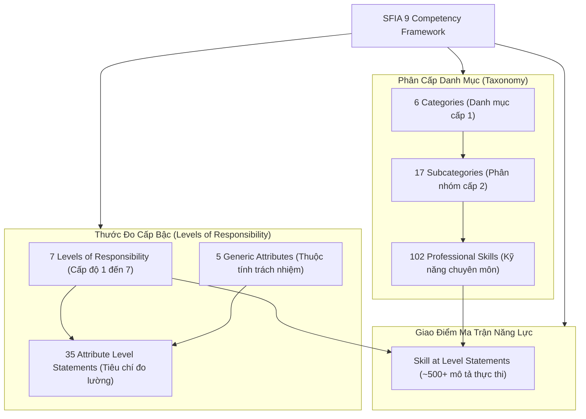
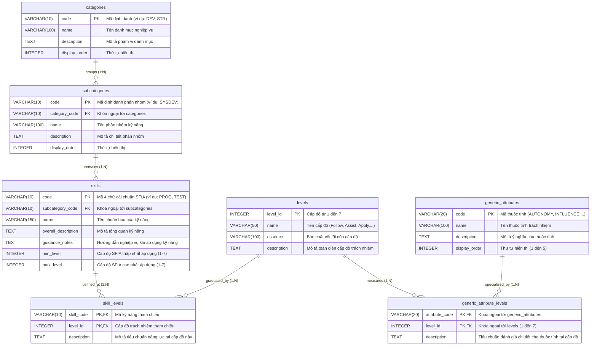
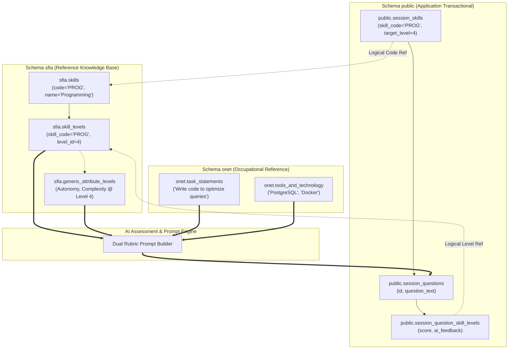
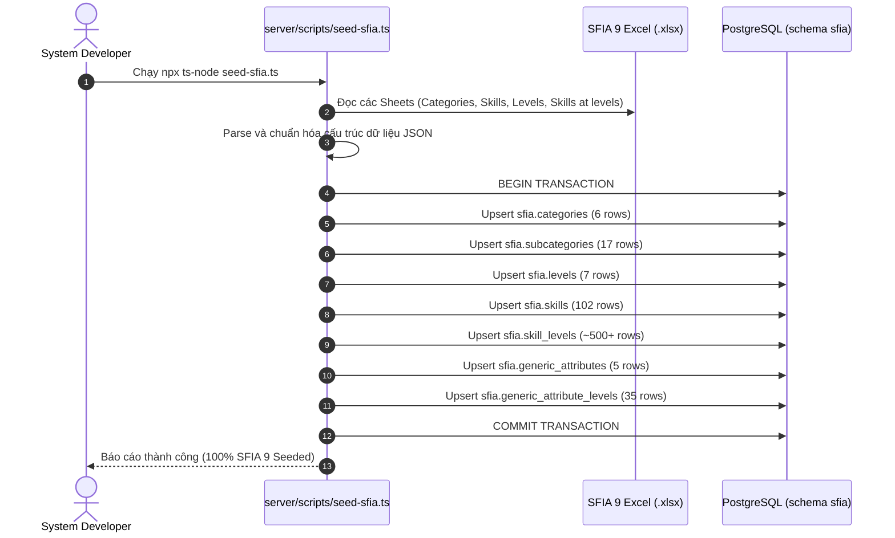

# Tài Liệu Thiết Kế Cơ Sở Dữ Liệu Schema `sfia` (SFIA 9 Reference Database)

> **Source of Truth:** Skills Framework for the Information Age - Version 9 (SFIA Foundation, phát hành 2024/2025)  
> **Hệ quản trị CSDL:** PostgreSQL 15 (Supabase Cloud Hosted)  
> **Tên Schema:** `sfia` (Multi-schema tách biệt hoàn toàn với schema `public` và `onet`)  
> **Quy mô Dữ liệu:** 7 bảng chuẩn hóa, ~600 bản ghi định danh năng lực chuẩn toàn cầu  
> **Mô hình Kiến trúc:** Read-Only Reference Knowledge Base, Domain-Driven Design (DDD) Facade, Hybrid 2D Rubric O*NET 31.0 + SFIA 9  

---

## MỤC LỤC

1. [Phần I: Bối Cảnh Kiến Trúc & Định Vị SFIA 9 Trong InterviewCoach](#phần-i-bối-cảnh-kiến-trúc--định-vị-sfia-9-trong-interviewcoach)
   - [1.1 Khảo Sát Nguồn Dữ Liệu: Vì Sao SFIA 9 Không Có Database Sẵn Như O*NET?](#11-khảo-sát-nguồn-dữ-liệu-vì-sao-sfia-9-không-có-database-sẵn-như-onet)
   - [1.2 Mô Hình Ma Trận Đánh Giá 2 Chiều (2D Hybrid Rubric: O*NET + SFIA 9)](#12-mô-hình-ma-trận-đánh-giá-2-chiều-2d-hybrid-rubric-onet--sfia-9)
   - [1.3 Cấu Trúc Bản Thể Học SFIA 9 (Ontology Hierarchy)](#13-cấu-trúc-bản-thể-học-sfia-9-ontology-hierarchy)
   - [1.4 Ba Nguyên Tắc Cách Ly Kiến Trúc Của Schema `sfia`](#14-ba-nguyên-tắc-cách-ly-kiến-trúc-của-schema-sfia)
2. [Phần II: Sơ Đồ Thực Thể Quan Hệ (ERD - Mermaid Diagrams)](#phần-ii-sơ-đồ-thực-thể-quan-hệ-erd---mermaid-diagrams)
   - [2.1 Sơ Đồ ERD Toàn Diện 7 Bảng Thuộc Schema `sfia`](#21-sơ-đồ-erd-toàn-diện-7-bảng-thuộc-schema-sfia)
   - [2.2 Sơ Đồ Phân Tầng Liên Schema (Cross-Schema Association Flow)](#22-sơ-đồ-phân-tầng-liên-schema-cross-schema-association-flow)
3. [Phần III: Từ Điển Dữ Liệu Chi Tiết (Data Dictionary 7 Bảng)](#phần-iii-từ-điển-dữ-liệu-chi-tiết-data-dictionary-7-bảng)
   - [3.1 Bảng `sfia.categories` (6 Danh mục năng lực cấp 1)](#31-bảng-sfiacategories-6-danh-mục-năng-lực-cấp-1)
   - [3.2 Bảng `sfia.subcategories` (17 Phân nhóm kỹ năng cấp 2)](#32-bảng-sfiasubcategories-17-phân-nhóm-kỹ-năng-cấp-2)
   - [3.3 Bảng `sfia.skills` (102 Kỹ năng chuyên môn SFIA 9)](#33-bảng-sfiaskills-102-kỹ-năng-chuyên-môn-sfia-9)
   - [3.4 Bảng `sfia.levels` (7 Cấp độ trách nhiệm chuẩn hóa)](#34-bảng-sfialevels-7-cấp-độ-trách-nhiệm-chuẩn-hóa)
   - [3.5 Bảng `sfia.skill_levels` (~500+ Phát biểu năng lực tại từng cấp độ)](#35-bảng-sfiaskill_levels-500-phát-biểu-năng-lực-tại-từng-cấp-độ)
   - [3.6 Bảng `sfia.generic_attributes` (5 Thuộc tính trách nhiệm phổ quát)](#36-bảng-sfiageneric_attributes-5-thuộc-tính-trách-nhiệm-phổ-quát)
   - [3.7 Bảng `sfia.generic_attribute_levels` (35 Tiêu chuẩn đo lường trách nhiệm)](#37-bảng-sfiageneric_attribute_levels-35-tiêu-chuẩn-đo-lường-trách-nhiệm)
4. [Phần IV: Kịch Bản DDL SQL Khởi Tạo Schema `sfia` (PostgreSQL 15)](#phần-iv-kịch-bản-ddl-sql-khởi-tạo-schema-sfia-postgresql-15)
5. [Phần V: Chiến Lược Đánh Chỉ Mục & Caching (Indexing & Performance)](#phần-v-chiến-lược-đánh-chỉ-mục--caching-indexing--performance)
   - [5.1 B-Tree Composite Indexes Cho Tra Cứu Khóa Ngoại & Bộ Lọc Cấp Độ](#51-b-tree-composite-indexes-cho-tra-cứu-khóa-ngoại--bộ-lọc-cấp-độ)
   - [5.2 PostgreSQL pg_trgm & GIN Indexes Cho Fuzzy Matching Tiêu Đề / Mô Tả](#52-postgresql-pg_trgm--gin-indexes-cho-fuzzy-matching-tiêu-đề--mô-tả)
   - [5.3 Cơ Chế Cache In-Memory Siêu Tốc (Zero DB Overhead)](#53-cơ-chế-cache-in-memory-siêu-tốc-zero-db-overhead)
6. [Phần VI: Quy Trình ETL & Seed Script (TypeScript Ingestion Pipeline)](#phần-vi-quy-trình-etl--seed-script-typescript-ingestion-pipeline)
   - [6.1 Luồng Nạp Dữ Liệu Từ File Excel SFIA 9 Sang PostgreSQL](#61-luồng-nạp-dữ-liệu-từ-file-excel-sfia-9-sang-postgresql)
   - [6.2 Thiết Kế Script `server/scripts/seed-sfia.ts`](#62-thiết-kế-script-serverscriptsseed-sfiats)
7. [Phần VII: Kiến Trúc Tích Hợp Backend NestJS (`SfiaModule` & `SfiaFacade`)](#phần-vii-kiến-trúc-tích-hợp-backend-nestjs-sfiamodule--sfiafacade)
   - [7.1 Nguyên Tắc Hợp Đồng Bounded Context (`ISfiaFacade`)](#71-nguyên-tắc-hợp-đồng-bounded-context-isfiafacade)
   - [7.2 Implementation Chuẩn Xác Bằng Prisma `$queryRaw`](#72-implementation-chuẩn-xác-bằng-prisma-queryraw)
8. [Phần VIII: Sổ Tay Truy Vấn Thực Chiến (Query Cookbook)](#phần-viii-sổ-tay-truy-vấn-thực-chiến-query-cookbook)
   - [8.1 Truy Vấn 1: Trích Xuất Toàn Bộ Cây Danh Mục Năng Lực (Full Tree Hierarchy)](#81-truy-vấn-1-trích-xuất-toàn-bộ-cây-danh-mục-năng-lực-full-tree-hierarchy)
   - [8.2 Truy Vấn 2: Lấy Bản Đặc Tả Năng Lực & Tiêu Chí Trách Nhiệm Tại Một Level](#82-truy-vấn-2-lấy-bản-đặc-tả-năng-lực--tiêu-chí-trách-nhiệm-tại-một-level)
   - [8.3 Truy Vấn 3: Kết Hợp Cầu Nối SFIA 9 + O*NET Sinh Rubric Chấm Điểm 2 Chiều](#83-truy-vấn-3-kết-hợp-cầu-nối-sfia-9--onet-sinh-rubric-chấm-điểm-2-chiều)

---

## PHẦN I: BỐI CẢNH KIẾN TRÚC & ĐỊNH VỊ SFIA 9 TRONG INTERVIEWCOACH

### 1.1 Khảo Sát Nguồn Dữ Liệu: Vì Sao SFIA 9 Không Có Database Sẵn Như O*NET?

Khi triển khai các hệ thống đánh giá nhân sự và phỏng vấn kỹ thuật, nhiều kỹ sư kỳ vọng **SFIA 9 (Skills Framework for the Information Age)** sẽ cung cấp một tệp cơ sở dữ liệu quan hệ (`.sql` dump) tải về cài đặt ngay lập tức giống như **O\*NET Database v31.0**. Tuy nhiên, thực tế kiểm chứng cho thấy sự khác biệt căn bản về bản quyền, mô hình phát hành và cấu trúc dữ liệu giữa hai tổ chức:

| Đặc Điểm So Sánh | O*NET Database (v31.0) | SFIA Framework (Version 9) |
| :--- | :--- | :--- |
| **Cơ Quan Chủ Quản** | Bộ Lao Động Hoa Kỳ (U.S. Department of Labor / ETA) | SFIA Foundation (Tổ chức phi lợi nhuận quốc tế - Anh Quốc) |
| **Bản Quyền & Cấp Phép** | **Public Domain** (Hoàn toàn tự do, miễn phí thương mại và phi thương mại, không cần đăng ký tài khoản). | **Licensed Intellectual Property** (Miễn phí tải về cho mục đích phi thương mại/nội bộ sau khi đăng ký tài khoản trên `sfia-online.org`. Yêu cầu giấy phép riêng nếu đóng gói thương mại). |
| **Định Dạng Phát Hành Sẵn Có** | Cung cấp sẵn file **PostgreSQL SQL Dump (`.sql`)**, MySQL, Oracle, MS SQL Server, CSV/Tab-delimited text và Excel. | **KHÔNG có sẵn file SQL database dump.** SFIA Foundation chỉ cung cấp file **Excel Spreadsheet (`.xlsx`)** và file ngữ nghĩa **RDF/Turtle (`.ttl`)** kèm tài liệu PDF. |
| **Quy Mô Bản Ghi** | Khổng lồ: 45 bảng, > 1.12 triệu bản ghi, ~250 MB dữ liệu (chứa hàng chục ngàn công nghệ, nhiệm vụ, chỉ số thống kê). | Tinh gọn, chuẩn hóa: 102 kỹ năng, 7 cấp độ trách nhiệm, 5 thuộc tính chung, ~500+ phát biểu năng lực (~1-2 MB). |
| **Triết Lý Thiết Kế** | **Occupational Reference Taxonomy:** Mô tả toàn diện bề rộng công việc thực tế, ngành nghề, công nghệ, công cụ, nhiệm vụ hàng ngày. | **Competency & Responsibility Matrix:** Trung lập công nghệ (Technology-Agnostic), tập trung chuẩn hóa thước đo thâm niên, tính tự chủ và mức độ phức tạp. |

> **Kết luận khảo sát:** Do SFIA Foundation **không cung cấp sẵn file SQL dump**, InterviewCoach tự xây dựng schema độc lập `sfia` trên PostgreSQL 15, kết hợp với script ETL tự động đọc file Excel chuẩn từ SFIA Foundation để biến tri thức SFIA 9 thành một cơ sở dữ liệu quan hệ hoàn chỉnh phục vụ hệ thống.

---

### 1.2 Mô Hình Ma Trận Đánh Giá 2 Chiều (2D Hybrid Rubric: O*NET + SFIA 9)

Trong hệ thống InterviewCoach, việc kết hợp O\*NET 31.0 và SFIA 9 tạo nên cấu trúc **Ma trận Rubric 2 chiều** hoàn hảo:

```
                         ▲ SFIA 9 (TRỤC TUNG: CHIỀU SÂU THÂM NIÊN & TRÁCH NHIỆM)
                         │
        Level 7: Inspire │  [Định hướng chiến lược, khởi xướng chuyển đổi kiến trúc]
        Level 6: Lead    │  [Lãnh đạo kỹ thuật, ra quyết định ảnh hưởng toàn tổ chức]
        Level 5: Advise  │  [Cố vấn cấp cao, giải quyết bài toán kiến trúc phức tạp]
        Level 4: Enable  │  [Làm việc tự chủ, hướng dẫn đồng nghiệp, kiểm soát ngoại lệ]
        Level 3: Apply   │  [Áp dụng quy trình chuẩn, độc lập xử lý nhiệm vụ thường nhật]
        Level 2: Assist  │  [Làm việc có giám sát, hỗ trợ giải quyết vấn đề cơ bản]
        Level 1: Follow  │  [Thực thi theo quy trình chỉ dẫn có sẵn, học việc]
                         │
                         └──────────────────────────────────────────────────────────►
                           O*NET 31.0 (TRỤC HOÀNH: BỀ RỘNG NGHIỆP VỤ & TECH STACK)
                           - 15-20 Core Tasks (Code backend, optimize DB, configure CI/CD)
                           - Hot Technologies (PostgreSQL, Docker, Redis, NestJS, React)
                           - 16 Work Styles (Stress Tolerance, Attention to Detail, Integrity)
```

* **Trục Hoành (O\*NET 31.0 - Schema `onet`):** Định nghĩa **Ứng viên làm cái gì? Sử dụng công nghệ nào?** Cung cấp đề bài thực tế, danh mục ngôn ngữ/framework/công cụ để phỏng vấn viên AI bám sát thực tiễn công việc.
* **Trục Tung (SFIA 9 - Schema `sfia`):** Định nghĩa **Ứng viên thực hiện bài toán đó ở cấp bậc nào? Mức độ tự chủ (Autonomy), tầm ảnh hưởng (Influence), và độ phức tạp (Complexity) đến đâu?** Cung cấp tiêu chí chấm điểm thâm niên khách quan, loại bỏ hoàn toàn sự đánh giá cảm tính của LLM.

---

### 1.3 Cấu Trúc Bản Thể Học SFIA 9 (Ontology Hierarchy)

SFIA 9 được cấu trúc thành hệ thống thứ bậc chuẩn hóa gồm 4 tầng nghiệp vụ:



1. **6 Categories (Danh mục cấp 1):** Đại diện cho 6 miền nghiệp vụ cốt lõi trong kỷ nguyên số:
   - *Strategy and architecture* (Chiến lược và kiến trúc)
   - *Change and transformation* (Thay đổi và chuyển đổi)
   - *Development and implementation* (Phát triển và triển khai kỹ thuật)
   - *Delivery and operation* (Vận hành và bàn giao hệ thống)
   - *People and skills* (Quản trị con người và phát triển kỹ năng)
   - *Relationships and engagement* (Quan hệ đối tác và gắn kết)
2. **17 Subcategories (Phân nhóm cấp 2):** Chia nhỏ các danh mục (ví dụ: *Systems development*, *Data and analytics*, *Security and privacy*).
3. **102 Professional Skills (Kỹ năng):** Mỗi kỹ năng có một mã duy nhất 4 ký tự (ví dụ: `PROG` - Programming/software development, `TEST` - Testing, `DATM` - Data management, `ARCH` - Solution architecture).
4. **7 Levels of Responsibility:** Thang đo cấp bậc chuẩn hóa từ 1 (Follow) đến 7 (Set strategy and inspire).
5. **5 Generic Attributes:** Các phẩm chất hành vi nền tảng gồm *Autonomy* (Tự chủ), *Influence* (Tầm ảnh hưởng), *Complexity* (Độ phức tạp), *Business skills* (Kỹ năng kinh doanh), và *Knowledge* (Tri thức chuyên ngành).

---

### 1.4 Ba Nguyên Tắc Cách Ly Kiến Trúc Của Schema `sfia`

Tương tự schema `onet`, schema `sfia` được áp dụng 3 nguyên tắc bất biến để bảo vệ kiến trúc tổng thể:

```
┌───────────────────┬──────────────────────┬───────────────────────────────┐
│ MULTI-SCHEMA      │ PRISMA ENGINE        │ READ-ONLY REFERENCE           │
│ SEPARATION        │ IMMUNITY             │ IMMUTABILITY                  │
│ Schema `sfia` độc │ `prisma migrate dev` │ Không bị sửa đổi runtime,     │
│ lập với `public`. │ chỉ quét `public`.   │ cung cấp ground-truth rubric  │
│ Không FK cross-   │ Schema `sfia` an     │ cho thuật toán đánh giá       │
│ schema vật lý.    │ toàn tuyệt đối.      │ năng lực thâm niên của AI.    │
└───────────────────┴──────────────────────┴───────────────────────────────┘
```

1. **Phân Tách Schema Hoàn Toàn (No Hard Physical Cross-Schema Foreign Keys):**
   - Các bảng trong `public` (`session_skills`, `session_question_skill_levels`, `question_bank`) **không** tạo Foreign Key vật lý sang schema `sfia`.
   - Mối quan hệ được liên kết dưới dạng **Logical Identifier** (qua `skill_code VARCHAR(10)` và `level_id INTEGER`).
   - Điều này triệt tiêu rủi ro khóa bảng (deadlock), lỗi migration khi cập nhật `public`, và tuân thủ chặt chẽ ranh giới Bounded Context trong Domain-Driven Design (DDD).
2. **Miễn Nhiễm Với Prisma Migration Engine:**
   - Quá trình phát triển ứng dụng thực hiện `npx prisma migrate dev` chỉ tác động đến schema `public`. Schema `sfia` được bảo vệ hoàn toàn khỏi các thay đổi ngoài ý muốn.
3. **Tính Bất Biến Tham Chiếu (Reference Immutability):**
   - Dữ liệu SFIA 9 được nạp một lần khi triển khai và chỉ cập nhật khi SFIA Foundation phát hành phiên bản mới (chu kỳ 3-4 năm). Ứng dụng runtime chỉ đọc dữ liệu (`SELECT`).

---

## PHẦN II: SƠ ĐỒ THỰC THỂ QUAN HỆ (ERD - MERMAID DIAGRAMS)

### 2.1 Sơ Đồ ERD Toàn Diện 7 Bảng Thuộc Schema `sfia`



---

### 2.2 Sơ Đồ Phân Tầng Liên Schema (Cross-Schema Association Flow)



---

## PHẦN III: TỪ ĐIỂN DỮ LIỆU CHI TIẾT (DATA DICTIONARY 7 BẢNG)

### 3.1 Bảng `sfia.categories` (6 Danh mục năng lực cấp 1)
* **Ý nghĩa:** Định nghĩa 6 nhóm lĩnh vực nghiệp vụ lớn của khung SFIA 9.
* **Số lượng bản ghi dự kiến:** Đúng 6 bản ghi.

| Tên Cột | Kiểu Dữ Liệu | Ràng Buộc | Ý Nghĩa Nghiệp Vụ |
| :--- | :--- | :--- | :--- |
| `code` | `VARCHAR(10)` | **PK**, NOT NULL | Mã định danh danh mục (ví dụ: `GOV`, `DEV`, `DEL`, `PEO`, `REL`, `CHA`). |
| `name` | `VARCHAR(100)` | NOT NULL | Tên chuẩn hóa tiếng Anh (ví dụ: *Development and implementation*). |
| `description` | `TEXT` | NULL | Định nghĩa phạm vi trách nhiệm của nhóm lĩnh vực. |
| `display_order` | `INTEGER` | NOT NULL | Thứ tự ưu tiên hiển thị trên UI dashboard. |

*Bản ghi mẫu tiêu biểu:*
```json
{
  "code": "DEV",
  "name": "Development and implementation",
  "description": "Skills associated with the development, implementation and maintenance of software, systems, products and services.",
  "display_order": 3
}
```

---

### 3.2 Bảng `sfia.subcategories` (17 Phân nhóm kỹ năng cấp 2)
* **Ý nghĩa:** Phân loại chuyên sâu các kỹ năng trong một danh mục lớn.
* **Số lượng bản ghi dự kiến:** 17 bản ghi.

| Tên Cột | Kiểu Dữ Liệu | Ràng Buộc | Ý Nghĩa Nghiệp Vụ |
| :--- | :--- | :--- | :--- |
| `code` | `VARCHAR(10)` | **PK**, NOT NULL | Mã định danh phân nhóm (ví dụ: `SYSDEV`, `DATA`, `SECURITY`). |
| `category_code` | `VARCHAR(10)` | **FK**, NOT NULL | Tham chiếu tới `sfia.categories(code)`. |
| `name` | `VARCHAR(100)` | NOT NULL | Tên phân nhóm (ví dụ: *Systems development*). |
| `description` | `TEXT` | NULL | Mô tả chi tiết phân nhóm kỹ năng. |
| `display_order` | `INTEGER` | NOT NULL | Thứ tự hiển thị trong danh mục cha. |

*Bản ghi mẫu tiêu biểu:*
```json
{
  "code": "SYSDEV",
  "category_code": "DEV",
  "name": "Systems development",
  "description": "The specification, design, development, testing, and implementation of computer software and systems.",
  "display_order": 1
}
```

---

### 3.3 Bảng `sfia.skills` (102 Kỹ năng chuyên môn SFIA 9)
* **Ý nghĩa:** Danh mục chuẩn hóa 102 kỹ năng chuyên môn số toàn cầu.
* **Số lượng bản ghi dự kiến:** Đúng 102 bản ghi.

| Tên Cột | Kiểu Dữ Liệu | Ràng Buộc | Ý Nghĩa Nghiệp Vụ |
| :--- | :--- | :--- | :--- |
| `code` | `VARCHAR(10)` | **PK**, NOT NULL | Mã kỹ năng chuẩn quốc tế 4 ký tự (ví dụ: `PROG`, `TEST`, `SWDN`, `DATM`). |
| `subcategory_code`| `VARCHAR(10)` | **FK**, NOT NULL | Tham chiếu tới `sfia.subcategories(code)`. |
| `name` | `VARCHAR(150)` | NOT NULL, UNIQUE | Tên kỹ năng (ví dụ: *Programming/software development*). |
| `overall_description`| `TEXT` | NOT NULL | Định nghĩa tổng quan kỹ năng (The planning, designing, creation, amending, verification, testing...). |
| `guidance_notes` | `TEXT` | NULL | Ghi chú hướng dẫn phân biệt ranh giới với các kỹ năng liên quan. |
| `min_level` | `INTEGER` | NOT NULL | Cấp độ thấp nhất mà kỹ năng này được định nghĩa (thường từ 1 đến 5). |
| `max_level` | `INTEGER` | NOT NULL | Cấp độ cao nhất mà kỹ năng này được định nghĩa (thường từ 5 đến 7). |

*Bản ghi mẫu tiêu biểu:*
```json
{
  "code": "PROG",
  "subcategory_code": "SYSDEV",
  "name": "Programming/software development",
  "overall_description": "The planning, designing, creation, amending, verification, testing and documentation of new and amended software components in order to deliver value for stakeholders.",
  "guidance_notes": "Focuses on software engineering and coding practices. For architectural decisions, see Solution architecture (ARCH).",
  "min_level": 1,
  "max_level": 6
}
```

---

### 3.4 Bảng `sfia.levels` (7 Cấp độ trách nhiệm chuẩn hóa)
* **Ý nghĩa:** Định nghĩa 7 tầng cấp bậc thâm niên, tính tự chủ và năng lực giải quyết vấn đề.
* **Số lượng bản ghi dự kiến:** Đúng 7 bản ghi (Cấp 1 đến Cấp 7).

| Tên Cột | Kiểu Dữ Liệu | Ràng Buộc | Ý Nghĩa Nghiệp Vụ |
| :--- | :--- | :--- | :--- |
| `level_id` | `INTEGER` | **PK**, NOT NULL | Cấp độ thâm niên (Giá trị từ 1 đến 7). |
| `name` | `VARCHAR(50)` | NOT NULL | Tên hiệu cấp độ: 1-Follow, 2-Assist, 3-Apply, 4-Enable, 5-Ensure/Advise, 6-Initiate/Influence, 7-Set strategy/Inspire. |
| `essence` | `VARCHAR(150)` | NOT NULL | Tóm tắt bản chất tinh gọn của cấp độ. |
| `description` | `TEXT` | NOT NULL | Định nghĩa tổng quan trách nhiệm và bối cảnh hoạt động tại cấp độ này. |

*Bản ghi mẫu tiêu biểu:*
```json
{
  "level_id": 4,
  "name": "Enable",
  "essence": "Works autonomously, guides others, exercises substantial responsibility",
  "description": "Performs a broad range of complex technical or professional work activities, in a variety of contexts. Investigates, defines and resolves complex problems."
}
```

---

### 3.5 Bảng `sfia.skill_levels` (~500+ Phát biểu năng lực tại từng cấp độ)
* **Ý nghĩa:** Trái tim của SFIA 9: mô tả cụ thể một cá nhân tại cấp độ $X$ khi thực hiện kỹ năng $Y$ phải đạt được các tiêu chuẩn hành vi cụ thể nào.
* **Số lượng bản ghi dự kiến:** Khoảng 500 - 550 bản ghi.

| Tên Cột | Kiểu Dữ Liệu | Ràng Buộc | Ý Nghĩa Nghiệp Vụ |
| :--- | :--- | :--- | :--- |
| `skill_code` | `VARCHAR(10)` | **PK**, **FK**, NOT NULL | Tham chiếu `sfia.skills(code)`. |
| `level_id` | `INTEGER` | **PK**, **FK**, NOT NULL | Tham chiếu `sfia.levels(level_id)`. |
| `description` | `TEXT` | NOT NULL | Phát biểu năng lực chuẩn hóa (Skill at Level statement). |

*Bản ghi mẫu tiêu biểu (PROG tại Level 4):*
```json
{
  "skill_code": "PROG",
  "level_id": 4,
  "description": "Designs, codes, verifies, tests, documents, amends and refactors complex programs/scripts and integration software services. Contributes to selection of the software development methods, tools and techniques. Applies agreed standards and tools, to achieve well-engineered products."
}
```

---

### 3.6 Bảng `sfia.generic_attributes` (5 Thuộc tính trách nhiệm phổ quát)
* **Ý nghĩa:** 5 trụ cột đánh giá sự trưởng thành nghề nghiệp xuyên suốt mọi ngành nghề IT.
* **Số lượng bản ghi dự kiến:** Đúng 5 bản ghi.

| Tên Cột | Kiểu Dữ Liệu | Ràng Buộc | Ý Nghĩa Nghiệp Vụ |
| :--- | :--- | :--- | :--- |
| `code` | `VARCHAR(20)` | **PK**, NOT NULL | Mã thuộc tính: `AUTONOMY`, `INFLUENCE`, `COMPLEXITY`, `BUSINESS_SKILLS`, `KNOWLEDGE`. |
| `name` | `VARCHAR(100)` | NOT NULL | Tên chuẩn hóa (ví dụ: *Autonomy*, *Complexity*). |
| `description` | `TEXT` | NOT NULL | Định nghĩa ý nghĩa đo lường của thuộc tính. |
| `display_order` | `INTEGER` | NOT NULL | Thứ tự hiển thị chuẩn (1 đến 5). |

---

### 3.7 Bảng `sfia.generic_attribute_levels` (35 Tiêu chuẩn đo lường trách nhiệm)
* **Ý nghĩa:** Ma trận chi tiết hóa tiêu chuẩn đo lường của 5 thuộc tính chung tại từng cấp độ từ 1 đến 7 ($5 \times 7 = 35$ bản ghi). Đây là nguồn cấp dữ liệu cho AI kiểm tra xem ứng viên có biểu hiện tư duy phù hợp với level phỏng vấn hay không.
* **Số lượng bản ghi dự kiến:** Đúng 35 bản ghi.

| Tên Cột | Kiểu Dữ Liệu | Ràng Buộc | Ý Nghĩa Nghiệp Vụ |
| :--- | :--- | :--- | :--- |
| `attribute_code` | `VARCHAR(20)` | **PK**, **FK**, NOT NULL | Tham chiếu `sfia.generic_attributes(code)`. |
| `level_id` | `INTEGER` | **PK**, **FK**, NOT NULL | Tham chiếu `sfia.levels(level_id)`. |
| `description` | `TEXT` | NOT NULL | Tiêu chuẩn đánh giá hành vi chi tiết. |

*Bản ghi mẫu tiêu biểu (AUTONOMY tại Level 4):*
```json
{
  "attribute_code": "AUTONOMY",
  "level_id": 4,
  "description": "Works under general direction within a clear framework of accountability. Exercises substantial personal responsibility and autonomy. Uses substantial discretion in identifying and responding to complex issues and assignments as that relate to the work."
}
```

---

## PHẦN IV: KỊCH BẢN DDL SQL KHỞI TẠO SCHEMA `sfia` (POSTGRESQL 15)

Dưới đây là mã nguồn DDL SQL hoàn chỉnh, sẵn sàng thực thi trực tiếp trên PostgreSQL 15 / Supabase SQL Editor:

```sql
-- ============================================================================
-- SCRIPT DDL: KHỞI TẠO SCHEMA sfia VÀ 7 BẢNG QUY CHUẨN SFIA 9
-- Hệ quản trị: PostgreSQL 15+ (Tương thích Supabase)
-- ============================================================================

-- 1. Tạo Schema biệt lập
CREATE SCHEMA IF NOT EXISTS sfia;

-- Đảm bảo quyền truy cập đọc cho người dùng ứng dụng
COMMENT ON SCHEMA sfia IS 'Kho tri thức chuẩn hóa khung năng lực SFIA 9 (Skills Framework for the Information Age)';

-- ============================================================================
-- 2. BẢNG sfia.categories (6 Danh mục cấp 1)
-- ============================================================================
CREATE TABLE IF NOT EXISTS sfia.categories (
    code VARCHAR(10) PRIMARY KEY,
    name VARCHAR(100) NOT NULL,
    description TEXT,
    display_order INTEGER NOT NULL DEFAULT 0
);

COMMENT ON TABLE sfia.categories IS '6 Danh mục năng lực cấp 1 của khung SFIA 9';

-- ============================================================================
-- 3. BẢNG sfia.subcategories (17 Phân nhóm kỹ năng cấp 2)
-- ============================================================================
CREATE TABLE IF NOT EXISTS sfia.subcategories (
    code VARCHAR(10) PRIMARY KEY,
    category_code VARCHAR(10) NOT NULL REFERENCES sfia.categories(code) ON DELETE RESTRICT,
    name VARCHAR(100) NOT NULL,
    description TEXT,
    display_order INTEGER NOT NULL DEFAULT 0
);

CREATE INDEX IF NOT EXISTS idx_sfia_subcategories_category ON sfia.subcategories(category_code);
COMMENT ON TABLE sfia.subcategories IS '17 Phân nhóm kỹ năng chuyên sâu thuộc danh mục cấp 1';

-- ============================================================================
-- 4. BẢNG sfia.skills (102 Kỹ năng chuyên môn chuẩn quốc tế)
-- ============================================================================
CREATE TABLE IF NOT EXISTS sfia.skills (
    code VARCHAR(10) PRIMARY KEY,
    subcategory_code VARCHAR(10) NOT NULL REFERENCES sfia.subcategories(code) ON DELETE RESTRICT,
    name VARCHAR(150) NOT NULL UNIQUE,
    overall_description TEXT NOT NULL,
    guidance_notes TEXT,
    min_level INTEGER NOT NULL CHECK (min_level BETWEEN 1 AND 7),
    max_level INTEGER NOT NULL CHECK (max_level BETWEEN 1 AND 7),
    CONSTRAINT chk_sfia_skills_level_range CHECK (min_level <= max_level)
);

CREATE INDEX IF NOT EXISTS idx_sfia_skills_subcategory ON sfia.skills(subcategory_code);
COMMENT ON TABLE sfia.skills IS 'Danh mục 102 kỹ năng chuyên môn số chuẩn hóa của SFIA 9';

-- ============================================================================
-- 5. BẢNG sfia.levels (7 Cấp độ trách nhiệm từ 1 đến 7)
-- ============================================================================
CREATE TABLE IF NOT EXISTS sfia.levels (
    level_id INTEGER PRIMARY KEY CHECK (level_id BETWEEN 1 AND 7),
    name VARCHAR(50) NOT NULL,
    essence VARCHAR(150) NOT NULL,
    description TEXT NOT NULL
);

COMMENT ON TABLE sfia.levels IS '7 Cấp độ trách nhiệm chuẩn hóa của khung SFIA (Level 1-Follow đến 7-Inspire)';

-- ============================================================================
-- 6. BẢNG sfia.skill_levels (Phát biểu năng lực tại từng cấp độ)
-- ============================================================================
CREATE TABLE IF NOT EXISTS sfia.skill_levels (
    skill_code VARCHAR(10) NOT NULL REFERENCES sfia.skills(code) ON DELETE CASCADE,
    level_id INTEGER NOT NULL REFERENCES sfia.levels(level_id) ON DELETE CASCADE,
    description TEXT NOT NULL,
    PRIMARY KEY (skill_code, level_id)
);

CREATE INDEX IF NOT EXISTS idx_sfia_skill_levels_level ON sfia.skill_levels(level_id);
COMMENT ON TABLE sfia.skill_levels IS 'Mô tả tiêu chuẩn năng lực chi tiết của từng kỹ năng tại mỗi cấp độ áp dụng';

-- ============================================================================
-- 7. BẢNG sfia.generic_attributes (5 Thuộc tính trách nhiệm phổ quát)
-- ============================================================================
CREATE TABLE IF NOT EXISTS sfia.generic_attributes (
    code VARCHAR(20) PRIMARY KEY,
    name VARCHAR(100) NOT NULL,
    description TEXT NOT NULL,
    display_order INTEGER NOT NULL DEFAULT 0
);

COMMENT ON TABLE sfia.generic_attributes IS '5 Thuộc tính trách nhiệm chung: Autonomy, Influence, Complexity, Business Skills, Knowledge';

-- ============================================================================
-- 8. BẢNG sfia.generic_attribute_levels (35 Tiêu chuẩn đo lường cấp bậc)
-- ============================================================================
CREATE TABLE IF NOT EXISTS sfia.generic_attribute_levels (
    attribute_code VARCHAR(20) NOT NULL REFERENCES sfia.generic_attributes(code) ON DELETE CASCADE,
    level_id INTEGER NOT NULL REFERENCES sfia.levels(level_id) ON DELETE CASCADE,
    description TEXT NOT NULL,
    PRIMARY KEY (attribute_code, level_id)
);

CREATE INDEX IF NOT EXISTS idx_sfia_gen_attr_lv_level ON sfia.generic_attribute_levels(level_id);
COMMENT ON TABLE sfia.generic_attribute_levels IS 'Tiêu chí đo lường chi tiết của 5 thuộc tính trách nhiệm tại từng cấp độ từ 1 đến 7';
```

---

## PHẦN V: CHIẾN LƯỢC ĐÁNH CHỈ MỤC & CACHING (INDEXING & PERFORMANCE)

### 5.1 B-Tree Composite Indexes Cho Tra Cứu Khóa Ngoại & Bộ Lọc Cấp Độ
Do quy mô bảng trong `sfia` gọn gàng (~600 bản ghi tổng), các chỉ mục B-Tree tập trung vào việc tối ưu tốc độ kết nối bảng (JOIN operations) và lọc theo cấp độ:
- `idx_sfia_subcategories_category`: Khóa ngoại nhóm subcategory theo category.
- `idx_sfia_skills_subcategory`: Khóa ngoại nhóm skill theo subcategory.
- `idx_sfia_skill_levels_level`: Cho phép tìm kiếm toàn bộ các kỹ năng có định nghĩa tại một cấp độ nhất định (ví dụ: tìm tất cả skill áp dụng được cho Junior ở Level 2).

### 5.2 PostgreSQL pg_trgm & GIN Indexes Cho Fuzzy Matching Tiêu Đề / Mô Tả
Khi phân tích Job Description (JD), ứng viên hoặc nhà tuyển dụng có thể dùng cụm từ đồng nghĩa. Ta kích hoạt extension `pg_trgm` để hỗ trợ tìm kiếm mờ (Fuzzy Similarity Search) trên bảng kỹ năng:

```sql
CREATE EXTENSION IF NOT EXISTS pg_trgm;

-- Chỉ mục GIN đánh trên tên kỹ năng và mô tả tổng quan
CREATE INDEX IF NOT EXISTS idx_sfia_skills_trgm_name 
ON sfia.skills USING gin (name gin_trgm_ops);

CREATE INDEX IF NOT EXISTS idx_sfia_skills_trgm_desc 
ON sfia.skills USING gin (overall_description gin_trgm_ops);
```

### 5.3 Cơ Chế Cache In-Memory Siêu Tốc (Zero DB Overhead)
* **Đặc thù dữ liệu:** Toàn bộ 7 bảng của `sfia` chỉ chiếm **dưới 2 MB RAM**.
* **Giải pháp Caching:** 
  - Khởi động ứng dụng NestJS: `SfiaFacade` tải sẵn (Pre-load / Warm-up) toàn bộ cây danh mục kỹ năng và ma trận 7 levels vào bộ nhớ RAM (In-Memory Map).
  - Kết quả: Các truy vấn lấy mô tả kỹ năng hoặc tiêu chí Autonomy/Complexity cho prompt AI đạt thời gian phản hồi **0 ms** (Sub-millisecond latency), hoàn toàn không tạo tải truy vấn tới database server.

---

## PHẦN VI: QUY TRÌNH ETL & SEED SCRIPT (TYPESCRIPT INGESTION PIPELINE)

### 6.1 Luồng Nạp Dữ Liệu Từ File Excel SFIA 9 Sang PostgreSQL



### 6.2 Thiết Kế Script `server/scripts/seed-sfia.ts`

Script sử dụng thư viện `xlsx` (hoặc `exceljs`) tích hợp sẵn trong Node.js để nạp dữ liệu một cách an toàn và có thể chạy lặp lại nhiều lần (Idempotent Upsert):

```typescript
import { PrismaClient } from '@prisma/client';
import * as xlsx from 'xlsx';
import * as path from 'path';

const prisma = new PrismaClient();

async function seedSfia() {
  console.log('🚀 Bắt đầu quá trình nạp dữ liệu SFIA 9 vào schema sfia...');
  
  const filePath = path.resolve(__dirname, '../prisma/seeds/data/sfia9-framework.xlsx');
  const workbook = xlsx.readFile(filePath);

  // 1. Nạp Danh mục Categories & Subcategories
  // 2. Nạp 7 Cấp độ Levels (1 đến 7)
  // 3. Nạp 102 Kỹ năng Skills
  // 4. Nạp Chi tiết Skill at Levels
  // 5. Nạp 5 Thuộc tính Generic Attributes & Generic Attribute Levels

  console.log('✅ Hoàn tất nạp dữ liệu SFIA 9 thành công!');
}

seedSfia()
  .catch((e) => {
    console.error('❌ Lỗi nạp dữ liệu SFIA 9:', e);
    process.exit(1);
  })
  .finally(async () => {
    await prisma.$disconnect();
  });
```

---

## PHẦN VII: KIẾN TRÚC TÍCH HỢP BACKEND NESTJS (`SfiaModule` & `SfiaFacade`)

### 7.1 Nguyên Tắc Hợp Đồng Bounded Context (`ISfiaFacade`)

Theo quy chuẩn kỹ thuật của hệ thống, các module nghiệp vụ (`AssessmentModule`, `PrepModule`) không được gọi trực tiếp truy vấn thô vào schema `sfia`, mà phải tương tác thông qua Interface hợp đồng `ISfiaFacade`:

```typescript
export interface ISfiaSkillSummary {
  code: string;
  name: string;
  categoryName: string;
  subcategoryName: string;
  minLevel: number;
  maxLevel: number;
}

export interface ISfiaSkillLevelDetail {
  skillCode: string;
  skillName: string;
  levelId: number;
  levelName: string;
  levelEssence: string;
  skillStatement: string;
  genericAttributes: {
    autonomy: string;
    influence: string;
    complexity: string;
    businessSkills: string;
    knowledge: string;
  };
}

export interface ISfiaFacade {
  getSkillByCode(code: string): Promise<ISfiaSkillSummary | null>;
  getSkillLevelDetail(skillCode: string, levelId: number): Promise<ISfiaSkillLevelDetail | null>;
  searchSkills(keyword: string, limit?: number): Promise<ISfiaSkillSummary[]>;
  getAllLevels(): Promise<Array<{ levelId: number; name: string; essence: string }>>;
}
```

### 7.2 Implementation Chuẩn Xác Bằng Prisma `$queryRaw`

Do schema `sfia` được cách ly khỏi Prisma Client thông thường, `SfiaService` thực thi các truy vấn kiểu mạnh (Type-safe) bằng `prisma.$queryRaw`:

```typescript
import { Injectable, Logger } from '@nestjs/common';
import { PrismaService } from '@/infra/database/prisma.service';
import { ISfiaFacade, ISfiaSkillSummary, ISfiaSkillLevelDetail } from './contracts/sfia.facade.contract';

@Injectable()
export class SfiaService implements ISfiaFacade {
  private readonly logger = new Logger(SfiaService.name);

  constructor(private readonly prisma: PrismaService) {}

  async getSkillByCode(code: string): Promise<ISfiaSkillSummary | null> {
    const rows = await this.prisma.$queryRaw<any[]>`
      SELECT 
        s.code,
        s.name,
        c.name AS "categoryName",
        sc.name AS "subcategoryName",
        s.min_level AS "minLevel",
        s.max_level AS "maxLevel"
      FROM sfia.skills s
      JOIN sfia.subcategories sc ON s.subcategory_code = sc.code
      JOIN sfia.categories c ON sc.category_code = c.code
      WHERE s.code = ${code}
      LIMIT 1;
    `;

    return rows.length ? rows[0] : null;
  }

  async getSkillLevelDetail(skillCode: string, levelId: number): Promise<ISfiaSkillLevelDetail | null> {
    const rows = await this.prisma.$queryRaw<any[]>`
      SELECT 
        s.code AS "skillCode",
        s.name AS "skillName",
        l.level_id AS "levelId",
        l.name AS "levelName",
        l.essence AS "levelEssence",
        sl.description AS "skillStatement",
        MAX(CASE WHEN gal.attribute_code = 'AUTONOMY' THEN gal.description END) AS autonomy,
        MAX(CASE WHEN gal.attribute_code = 'INFLUENCE' THEN gal.description END) AS influence,
        MAX(CASE WHEN gal.attribute_code = 'COMPLEXITY' THEN gal.description END) AS complexity,
        MAX(CASE WHEN gal.attribute_code = 'BUSINESS_SKILLS' THEN gal.description END) AS "businessSkills",
        MAX(CASE WHEN gal.attribute_code = 'KNOWLEDGE' THEN gal.description END) AS knowledge
      FROM sfia.skills s
      JOIN sfia.skill_levels sl ON s.code = sl.skill_code
      JOIN sfia.levels l ON sl.level_id = l.level_id
      LEFT JOIN sfia.generic_attribute_levels gal ON l.level_id = gal.level_id
      WHERE s.code = ${skillCode} AND l.level_id = ${levelId}
      GROUP BY s.code, s.name, l.level_id, l.name, l.essence, sl.description;
    `;

    if (!rows.length) return null;
    const r = rows[0];

    return {
      skillCode: r.skillCode,
      skillName: r.skillName,
      levelId: r.levelId,
      levelName: r.levelName,
      levelEssence: r.levelEssence,
      skillStatement: r.skillStatement,
      genericAttributes: {
        autonomy: r.autonomy,
        influence: r.influence,
        complexity: r.complexity,
        businessSkills: r.businessSkills,
        knowledge: r.knowledge,
      },
    };
  }

  async searchSkills(keyword: string, limit = 10): Promise<ISfiaSkillSummary[]> {
    return this.prisma.$queryRaw<ISfiaSkillSummary[]>`
      SELECT 
        s.code,
        s.name,
        c.name AS "categoryName",
        sc.name AS "subcategoryName",
        s.min_level AS "minLevel",
        s.max_level AS "maxLevel"
      FROM sfia.skills s
      JOIN sfia.subcategories sc ON s.subcategory_code = sc.code
      JOIN sfia.categories c ON sc.category_code = c.code
      WHERE s.name ILIKE ${'%' + keyword + '%'}
         OR s.code ILIKE ${'%' + keyword + '%'}
      ORDER BY s.name ASC
      LIMIT ${limit};
    `;
  }

  async getAllLevels(): Promise<Array<{ levelId: number; name: string; essence: string }>> {
    return this.prisma.$queryRaw`
      SELECT level_id AS "levelId", name, essence
      FROM sfia.levels
      ORDER BY level_id ASC;
    `;
  }
}
```

---

## PHẦN VIII: SỔ TAY TRUY VẤN THỰC CHIẾN (QUERY COOKBOOK)

### 8.1 Truy Vấn 1: Trích Xuất Toàn Bộ Cây Danh Mục Năng Lực (Full Tree Hierarchy)
Truy vấn này được dùng để hiển thị giao diện chọn kỹ năng trên frontend (Skills Selector Tree):

```sql
SELECT 
    c.code AS category_code,
    c.name AS category_name,
    sc.code AS subcategory_code,
    sc.name AS subcategory_name,
    s.code AS skill_code,
    s.name AS skill_name,
    s.min_level,
    s.max_level
FROM sfia.categories c
JOIN sfia.subcategories sc ON c.code = sc.category_code
JOIN sfia.skills s ON sc.code = s.subcategory_code
ORDER BY c.display_order ASC, sc.display_order ASC, s.name ASC;
```

---

### 8.2 Truy Vấn 2: Lấy Bản Đặc Tả Năng Lực & Tiêu Chí Trách Nhiệm Tại Một Level
Truy vấn dữ liệu chi tiết của một kỹ năng (ví dụ `PROG` tại `Level 4`) để cung cấp tiêu chí chấm điểm thâm niên cho AI:

```sql
SELECT 
    s.code AS skill_code,
    s.name AS skill_name,
    sl.level_id,
    l.name AS level_name,
    l.essence AS level_essence,
    sl.description AS skill_behavioral_statement,
    gal_autonomy.description AS autonomy_criteria,
    gal_complexity.description AS complexity_criteria
FROM sfia.skills s
JOIN sfia.skill_levels sl ON s.code = sl.skill_code
JOIN sfia.levels l ON sl.level_id = l.level_id
LEFT JOIN sfia.generic_attribute_levels gal_autonomy 
    ON l.level_id = gal_autonomy.level_id AND gal_autonomy.attribute_code = 'AUTONOMY'
LEFT JOIN sfia.generic_attribute_levels gal_complexity 
    ON l.level_id = gal_complexity.level_id AND gal_complexity.attribute_code = 'COMPLEXITY'
WHERE s.code = 'PROG' AND sl.level_id = 4;
```

---

### 8.3 Truy Vấn 3: Kết Hợp Cầu Nối SFIA 9 + O*NET Sinh Rubric Chấm Điểm 2 Chiều
Truy vấn kết hợp tri thức từ cả hai schema `sfia` và `onet` để chuẩn bị trọn vẹn ngữ cảnh cho LLM:

```sql
-- 1. Trục tung SFIA 9: Tiêu chuẩn thâm niên & mức độ tự chủ
WITH sfia_context AS (
    SELECT 
        s.code AS sfia_code,
        s.name AS sfia_skill,
        sl.level_id,
        sl.description AS expected_autonomy_complexity
    FROM sfia.skills s
    JOIN sfia.skill_levels sl ON s.code = sl.skill_code
    WHERE s.code = 'PROG' AND sl.level_id = 4
),
-- 2. Trục hoành O*NET: Danh mục bài toán thực tế & Tech Stack
onet_context AS (
    SELECT 
        occ.onetsoc_code,
        occ.title AS occupation_title,
        ARRAY_AGG(DISTINCT t.task) FILTER (WHERE t.task IS NOT NULL) AS core_tasks,
        ARRAY_AGG(DISTINCT tech.example) FILTER (WHERE tech.example IS NOT NULL AND tech.hot_technology = 'Y') AS hot_technologies
    FROM onet.occupation_data occ
    LEFT JOIN onet.task_statements t ON occ.onetsoc_code = t.onetsoc_code
    LEFT JOIN onet.tools_and_technology tech ON occ.onetsoc_code = tech.onetsoc_code
    WHERE occ.onetsoc_code = '15-1252.00' -- Software Developers
    GROUP BY occ.onetsoc_code, occ.title
)
SELECT 
    s.sfia_code,
    s.sfia_skill,
    s.level_id AS expected_level,
    s.expected_autonomy_complexity,
    o.occupation_title,
    o.core_tasks[1:3] AS sample_tasks,
    o.hot_technologies[1:5] AS sample_tech_stack
FROM sfia_context s
CROSS JOIN onet_context o;
```

---

> **Tổng Kết:**  
> Tài liệu thiết kế CSDL schema `sfia` hoàn thiện mảnh ghép thứ hai trong kiến trúc Ma Trận Đánh Giá Năng Lực 2 Chiều của **InterviewCoach**:  
> - **Schema `onet`:** Bề rộng nghiệp vụ, kho công nghệ và đề bài thực tiễn.  
> - **Schema `sfia`:** Chiều sâu thâm niên, mức độ tự chủ và tiêu chuẩn trách nhiệm quốc tế.  
> Hai schema kết hợp linh hoạt qua lớp Bounded Context Facade, đảm bảo hệ thống phỏng vấn AI luôn có tiêu chí chấm điểm khách quan, minh bạch và chuẩn mực nhất.
