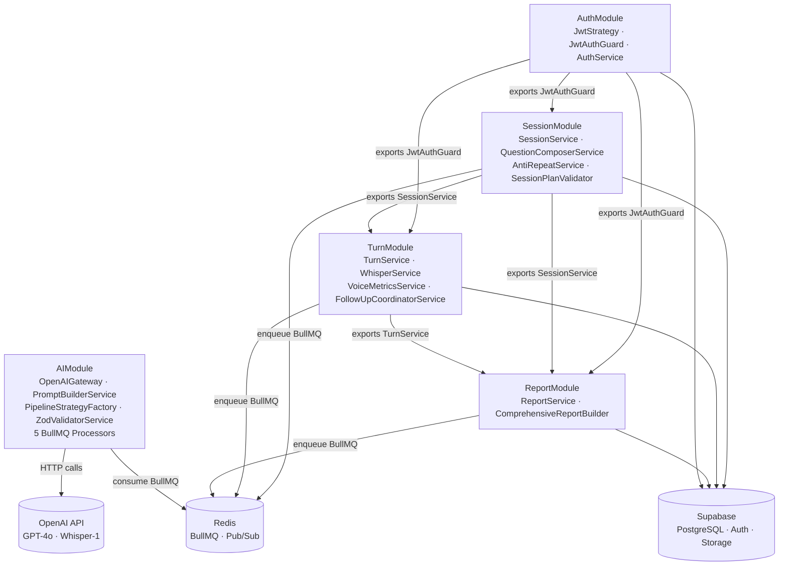

# LLD — Overview: Conventions & Module Map

Reference: [LLD_design.md](LLD_design.md) · [HLD §2](../../ArchitecturalDesign/HLD_InterviewAI_v1.0.md) · [MVP Scope](../../MVP_Scope.md)

---

## 1. Module Dependency Graph



AIModule không có HTTP controller — chỉ expose BullMQ processors. Không có module nào import AIModule trực tiếp; giao tiếp hoàn toàn qua BullMQ queue + Redis Pub/Sub.

---

## 2. Naming Conventions

### 2.1 NestJS Class Suffixes

| Suffix | Role | Example |
|--------|------|---------|
| `Controller` | HTTP handler — validates input, delegates to Service | `SessionController` |
| `Service` | Business logic, DB access, coordination | `SessionService` |
| `Processor` | BullMQ job consumer (`@Processor(QUEUE_NAME)`) | `QuestionGenerationProcessor` |
| `Strategy` | Passport strategy or pipeline strategy | `JwtStrategy`, `HrPipelineService` |
| `Guard` | NestJS guard (`@UseGuards`) | `JwtAuthGuard`, `RefreshGuard` |
| `Gateway` | External API wrapper (no framework magic) | `OpenAIGateway` |
| `Validator` | Schema-level validation (Zod, class-validator) | `SessionPlanValidator`, `ZodValidatorService` |
| `Builder` | Complex object construction | `ComprehensiveReportBuilder`, `PromptBuilderService` |
| `Filter` | NestJS exception filter | `InterviewAIExceptionFilter` |

### 2.2 File Naming

Pattern: `<feature>.<suffix>.ts` — e.g., `session.service.ts`, `jwt.strategy.ts`, `question-generation.processor.ts`.

---

## 3. DTO Conventions

| Category | Pattern | Example |
|----------|---------|---------|
| Create input | `Create<Entity>Dto` | `CreateSessionDto`, `CreateTurnDto` |
| Update input | `Update<Entity>Dto` | `UpdateSessionStatusDto` |
| Response | `<Entity>ResponseDto` | `SessionResponseDto`, `ReportResponseDto` |
| BullMQ payload | `<Job>JobDto` | `QuestionGenerationJobDto`, `FeedbackJobDto` |
| Nested sub-shape | `<Concept>Dto` | `AnnotatedSegmentDto`, `CompetencyScoresDto` |

All DTOs use class-validator decorators for request validation.
BullMQ job DTOs are plain interfaces — validated by `ZodValidatorService` on AI output.

Response envelope (matches API Design):
```typescript
// Success
{ success: true, data: T, meta?: PaginationMeta }

// Error
{ success: false, error: { code: ErrorCode, message: string, details?: unknown } }
```

---

## 4. Error Hierarchy

```
Error
└── HttpException (NestJS)
    └── InterviewAIException
        ├── properties: errorCode: ErrorCode, statusCode: HttpStatus
        └── caught by: InterviewAIExceptionFilter → formats envelope
```

`ErrorCode` enum (locked per HLD §5):

| Code | HTTP | When |
|------|------|------|
| `JD_TOO_SHORT` | 422 | Job description below minimum characters |
| `AUDIO_TOO_LARGE` | 422 | Audio blob exceeds 10MB |
| `UNAUTHORIZED` | 401 | JWT missing or expired |
| `FORBIDDEN` | 403 | User does not own resource |
| `SESSION_NOT_FOUND` | 404 | Session ID does not exist |
| `SCHEMA_VALIDATION_ERROR` | 422 | Request body fails class-validator |
| `SESSION_LIMIT_EXCEEDED` | 429 | More than 10 sessions in 24h (S-12) |
| `RATE_LIMIT_EXCEEDED` | 429 | More than 60 req/60s on AI endpoints (S-11) |
| `AI_SERVICE_ERROR` | 502 | OpenAI call failed after retries |
| `SERVICE_UNAVAILABLE` | 503 | BullMQ or Redis unreachable |

`InterviewAIExceptionFilter` transforms all `HttpException` subclasses into the standard error envelope.

---

## 5. MVP Scope Boundary

Do not add class, method, or field for deferred features without a `// v1.1:` stub comment.

| In MVP | Deferred to v1.1 |
|--------|-----------------|
| UC-02: Setup session | UC-01: Google OAuth |
| UC-03: Text answer | UC-07: Rewrite |
| UC-04: Voice answer | UC-08: Reverse Q |
| UC-05: AI feedback | UC-09: Placement test |
| UC-06: Report view | UC-10/11: Admin |

Tables in scope (11): `auth.users` (Supabase-managed), `job_descriptions`, `interview_sessions`,
`questions`, `question_usages`, `turns`, `follow_up_questions`, `ai_feedbacks`,
`annotated_segments`, `session_reports`, `performance_snapshots`.

Not in scope: `rewrite_answers`, `progress_snapshots`, `placement_test_answers`, `placement_tests`.

---

## 6. BullMQ Queue Name Constants

| Constant | Value | Producer | Consumer |
|----------|-------|---------|---------|
| `QUESTION_GEN_QUEUE` | `'question-gen'` | SessionModule | AIModule |
| `FOLLOW_UP_QUEUE` | `'follow-up'` | TurnModule | AIModule |
| `FEEDBACK_QUEUE` | `'feedback'` | TurnModule | AIModule |
| `REWRITE_EVAL_QUEUE` | `'rewrite-eval'` | v1.1 | v1.1 |
| `REPORT_QUEUE` | `'report'` | ReportModule | AIModule |

Defined in `server/src/common/constants/queues.ts` — imported by both producer and consumer to avoid string drift.

---

## 7. Key References

- HLD §2 — full module and component inventory
- HLD §5 — BullMQ specs: queue names, timeouts, retry counts (D-07)
- ADR-003 — Supabase Auth (JWT format, refresh flow)
- ADR-006 — SSE + Redis Pub/Sub (channel `sse:session:{sessionId}`, 5 event types)
- ADR-007 — BullMQ queue architecture, worker isolation
- [02_auth_module.md](02_auth_module.md) — AuthModule details
- [05_ai_module.md](05_ai_module.md) — Pipeline strategy pattern, 3-layer prompt
