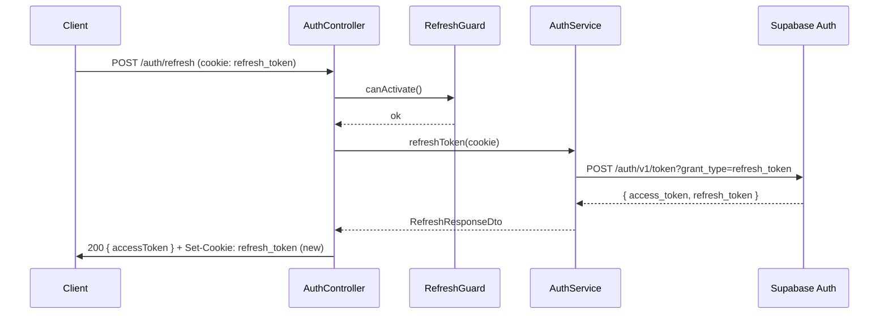

# LLD — AuthModule

Reference: [LLD_design.md](LLD_design.md) · [01_overview.md](01_overview.md) · ADR-003 · [api-design/02_auth.md](../api-design/02_auth.md)

---

## 1. Module Responsibilities

AuthModule validates Supabase JWT tokens and manages refresh/logout flows. No Google OAuth in MVP — UC-01 deferred to v1.1. All protected routes import `JwtAuthGuard` from this module.

---

## 2. Classes

### 2.1 AuthController

Routes: `POST /auth/refresh`, `POST /auth/logout`.

```typescript
interface AuthController {
  refresh(req: RequestWithRefreshCookie): Promise<RefreshResponseDto>;
  logout(req: RequestWithRefreshCookie): Promise<void>;
}
```

`/auth/refresh` reads `refresh_token` from HttpOnly cookie (not request body).
`/auth/logout` calls `AuthService.logout()` then clears the cookie.

### 2.2 JwtStrategy (Passport)

Validates Supabase JWT Bearer tokens on all protected routes.

```typescript
interface JwtStrategy {
  validate(payload: SupabaseJwtPayload): Promise<AuthenticatedUser>;
}

interface SupabaseJwtPayload {
  sub: string;       // user UUID
  email: string;
  role: 'authenticated' | 'anon';
  exp: number;
  iat: number;
}

interface AuthenticatedUser {
  id: string;        // user UUID — attached to req.user
  email: string;
}
```

JWT secret: `SUPABASE_JWT_SECRET` env var. Algorithm: HS256 (Supabase default).

### 2.3 JwtAuthGuard

Applied via `@UseGuards(JwtAuthGuard)` on SessionController, TurnController, ReportController.

```typescript
// extends PassportAuthGuard('jwt')
// no additional logic — delegates to JwtStrategy
```

### 2.4 RefreshGuard

Validates `refresh_token` cookie before refresh/logout endpoints.

```typescript
interface RefreshGuard {
  canActivate(context: ExecutionContext): boolean;
  // throws UNAUTHORIZED if cookie absent or malformed
}
```

### 2.5 AuthService

```typescript
interface AuthService {
  refreshToken(refreshToken: string): Promise<RefreshResponseDto>;
  // POST /auth/v1/token?grant_type=refresh_token → new access_token + refresh_token

  logout(refreshToken: string): Promise<void>;
  // POST /auth/v1/logout → invalidates refresh token server-side
}
```

---

## 3. DTOs

```typescript
interface RefreshResponseDto {
  accessToken: string;
  expiresIn: number;  // 3600 (1h)
}

interface AuthenticatedUser {
  id: string;
  email: string;
}
```

---

## 4. Cookie Spec

| Property | Value |
|----------|-------|
| Name | `refresh_token` |
| HttpOnly | true |
| Secure | true (production) |
| SameSite | Strict |
| Max-Age | 604800 (7 days) |
| Path | `/auth` |

---

## 5. Sequence — Token Refresh



---

## 6. v1.1 Placeholder

```typescript
// v1.1: GoogleStrategy for UC-01 Google OAuth
// GET /auth/google, GET /auth/callback
// Requires: GOOGLE_CLIENT_ID, GOOGLE_CLIENT_SECRET
```

---

## 7. Key References

- ADR-003 — Supabase Auth choice, JWT format
- api-design/02_auth.md — full endpoint specs, error codes
- [01_overview.md §4](01_overview.md) — ErrorCode enum
- [07_cross_cutting.md](07_cross_cutting.md) — JwtAuthGuard application map
