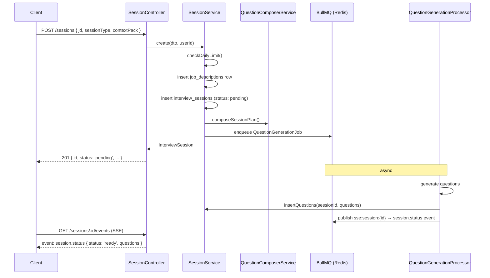

# LLD — SessionModule

Reference: [LLD_design.md](LLD_design.md) · [01_overview.md](01_overview.md) · [HLD §2](../../ArchitecturalDesign/HLD_InterviewAI_v1.0.md) · [api-design/03_session.md](../api-design/03_session.md)

---

## 1. Module Responsibilities

SessionModule manages interview session lifecycle: creation, status transitions, question plan composition, anti-repeat filtering, and SSE connection for real-time events. Enqueues `QuestionGenerationJob` to AIModule via BullMQ.

---

## 2. Classes

### 2.1 SessionController

```typescript
interface SessionController {
  create(dto: CreateSessionDto, user: AuthenticatedUser): Promise<SessionResponseDto>;
  // POST /sessions

  findAll(user: AuthenticatedUser): Promise<SessionListResponseDto>;
  // GET /sessions

  findById(id: string, user: AuthenticatedUser): Promise<SessionResponseDto>;
  // GET /sessions/:id

  updateStatus(id: string, dto: UpdateSessionStatusDto, user: AuthenticatedUser): Promise<SessionResponseDto>;
  // PATCH /sessions/:id

  streamEvents(id: string, user: AuthenticatedUser, res: Response): Observable<MessageEvent>;
  // GET /sessions/:id/events — SSE endpoint (@Sse decorator)
}
```

All routes require `@UseGuards(JwtAuthGuard)`. `findById` and `updateStatus` check ownership (throws `FORBIDDEN` if `session.userId !== req.user.id`).

### 2.2 SessionService

```typescript
interface SessionService {
  create(dto: CreateSessionDto, userId: string): Promise<InterviewSession>;
  // 1. checkDailyLimit(userId) — throws SESSION_LIMIT_EXCEEDED if >= 10 sessions today
  // 2. Insert job_descriptions row
  // 3. Insert interview_sessions row (status: 'pending')
  // 4. Enqueue QuestionGenerationJob

  findAll(userId: string): Promise<InterviewSession[]>;

  findById(sessionId: string, userId: string): Promise<InterviewSession>;
  // throws SESSION_NOT_FOUND or FORBIDDEN

  updateStatus(sessionId: string, status: SessionStatus, userId: string): Promise<InterviewSession>;

  checkDailyLimit(userId: string): Promise<void>;
  // Count sessions created today — throws SESSION_LIMIT_EXCEEDED if count >= 10 (S-12)

  insertQuestions(sessionId: string, questions: GeneratedQuestion[]): Promise<void>;
  // Called by QuestionGenerationProcessor after AI generates questions
}

type SessionStatus = 'pending' | 'ready' | 'active' | 'ended';
```

### 2.3 QuestionComposerService

```typescript
interface QuestionComposerService {
  composeSessionPlan(input: {
    sessionType: SessionType;
    jobDescriptionText: string;
    targetRoles: string[];
    totalQuestions: number;
  }): QuestionPlan;
  // Returns question distribution: types, difficulty weights, topic areas

  selectSeedQuestions(sessionType: SessionType): SeedQuestion[];
  // Fallback seeds if QuestionGenerationJob fails
}

interface QuestionPlan {
  distribution: QuestionTypeDistribution[];
  totalQuestions: number;
  sessionType: SessionType;
}
```

### 2.4 AntiRepeatService

```typescript
interface AntiRepeatService {
  filterDuplicates(
    candidates: GeneratedQuestion[],
    userId: string,
  ): Promise<GeneratedQuestion[]>;
  // Queries question_usages table — excludes questions seen in last 30 days
}
```

### 2.5 SessionPlanValidator

```typescript
interface SessionPlanValidator {
  validate(dto: CreateSessionDto): void;
  // Zod schema validation
  // throws SCHEMA_VALIDATION_ERROR if:
  //   - jobDescriptionText < 100 chars (JD_TOO_SHORT)
  //   - sessionType not in ['HR', 'Technical', 'Mixed']
  //   - contextPack not in ['VN', 'Western']
}
```

---

## 3. DTOs

```typescript
interface CreateSessionDto {
  jobDescriptionText: string;  // min 100 chars
  sessionType: SessionType;    // 'HR' | 'Technical' | 'Mixed'
  contextPack: ContextPack;    // 'VN' | 'Western'
  targetRoles?: string[];
  totalQuestions?: number;     // default: 10, max: 15
}

interface SessionResponseDto {
  id: string;
  status: SessionStatus;
  sessionType: SessionType;
  contextPack: ContextPack;
  totalQuestions: number;
  createdAt: string;           // ISO 8601
  jobDescription: {
    id: string;
    textPreview: string;       // first 200 chars
  };
}

interface UpdateSessionStatusDto {
  status: Extract<SessionStatus, 'ended'>;
}

interface QuestionGenerationJobDto {
  sessionId: string;
  sessionType: SessionType;
  jobDescriptionText: string;
  targetRoles: string[];
  contextPack: ContextPack;
  totalQuestions: number;
}
```

---

## 4. SSE Endpoint

`GET /sessions/:id/events` — uses NestJS `@Sse()` decorator with `Observable<MessageEvent>`.

```typescript
// SseService.subscribe() returns Observable that emits when Redis Pub/Sub
// receives on channel: sse:session:{sessionId}
// Client connects via EventSource API
// Guard: JwtAuthGuard + ownership check
// Cleanup: observable completes on client disconnect
```

ADR-006 defines 5 event types. SessionModule SSE publishes `session.status` only — other events published by AIModule processors.

---

## 5. Sequence — Create Session



---

## 6. Key References

- HLD §2.1.3 — SessionModule component list
- HLD §5 — QuestionGenerationJob specs (timeout 15s, retry 1)
- ADR-006 — SSE channel + `session.status` event payload
- api-design/03_session.md — full endpoint specs
- database-design/ — `interview_sessions`, `job_descriptions`, `questions`, `question_usages` DDL
- [05_ai_module.md §3.1](05_ai_module.md) — QuestionGenerationProcessor detail
