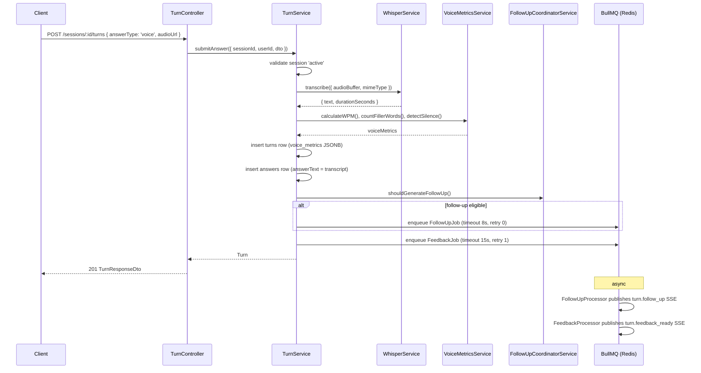

# LLD — TurnModule

Reference: [LLD_design.md](LLD_design.md) · [01_overview.md](01_overview.md) · [HLD §5](../../ArchitecturalDesign/HLD_InterviewAI_v1.0.md) · [api-design/04_answer.md](../api-design/04_answer.md)

---

## 1. Module Responsibilities

TurnModule handles answer submission (text and voice), audio transcription, voice metrics calculation, follow-up coordination, and feedback job enqueueing. Imports `SessionService` from SessionModule to validate session ownership and status.

---

## 2. Classes

### 2.1 TurnController

```typescript
interface TurnController {
  submitAnswer(
    sessionId: string,
    dto: SubmitAnswerDto,
    user: AuthenticatedUser,
  ): Promise<TurnResponseDto>;
  // POST /sessions/:sessionId/turns

  findById(
    sessionId: string,
    turnId: string,
    user: AuthenticatedUser,
  ): Promise<TurnResponseDto>;
  // GET /sessions/:sessionId/turns/:turnId
}
```

All routes require `@UseGuards(JwtAuthGuard)`. Validates session ownership via `SessionService.findById()`.

### 2.2 TurnService

```typescript
interface TurnService {
  submitAnswer(input: {
    sessionId: string;
    userId: string;
    dto: SubmitAnswerDto;
  }): Promise<Turn>;
  // 1. Validate session is 'active'
  // 2. Resolve answer text (transcribe if voice)
  // 3. Insert turns row
  // 4. Insert answers row
  // 5. shouldGenerateFollowUp() → enqueue FollowUpJob if true
  // 6. Enqueue FeedbackJob (always)

  findById(turnId: string, sessionId: string): Promise<Turn>;
}
```

### 2.3 WhisperService

```typescript
interface WhisperService {
  transcribe(input: {
    audioBuffer: Buffer;
    mimeType: 'audio/webm' | 'audio/mp4' | 'audio/wav';
    language?: 'vi' | 'en';
  }): Promise<TranscriptionResult>;
  // Calls OpenAIGateway.transcribe()
  // throws AUDIO_TOO_LARGE if buffer > 10MB
}

interface TranscriptionResult {
  text: string;
  durationSeconds: number;
  language: string;
}
```

### 2.4 VoiceMetricsService

```typescript
interface VoiceMetricsService {
  calculateWPM(text: string, durationSeconds: number): number;
  // words / (durationSeconds / 60)

  countFillerWords(text: string): FillerWordCount;
  // counts: um, uh, like, you know (vi: u, a, thi, kieu)

  detectSilence(durationSeconds: number, wordCount: number): boolean;
  // heuristic: avg words/second < 0.5 implies long silences
}

interface FillerWordCount {
  total: number;
  breakdown: Record<string, number>;
}
```

Metrics stored in `turns.voice_metrics` (JSONB column).

### 2.5 FollowUpCoordinatorService

```typescript
interface FollowUpCoordinatorService {
  shouldGenerateFollowUp(input: {
    turnIndex: number;
    totalQuestions: number;
    answerLength: number;
  }): boolean;
  // Returns false if: last turn, or answerLength < 50 chars
  // Returns true otherwise (enqueues FollowUpJob)
}
```

---

## 3. DTOs

```typescript
interface SubmitAnswerDto {
  questionId: string;
  turnIndex: number;           // 0-based position in session
  answerType: 'text' | 'voice';
  answerText?: string;         // required if answerType === 'text'
  audioUrl?: string;           // required if answerType === 'voice'
                               // URL to Supabase Storage blob
}

interface TurnResponseDto {
  id: string;
  sessionId: string;
  turnIndex: number;
  question: {
    id: string;
    content: string;
  };
  answer: {
    id: string;
    answerType: 'text' | 'voice';
    answerText: string;        // transcribed if voice
    durationSeconds?: number;  // voice only
  };
  voiceMetrics?: {
    wpm: number;
    fillerWords: FillerWordCount;
    hasSilence: boolean;
  };
  createdAt: string;           // ISO 8601
}

interface FollowUpJobDto {
  sessionId: string;
  turnId: string;
  answerId: string;
  questionText: string;
  answerText: string;
  contextPack: ContextPack;
  sessionType: SessionType;
}

interface FeedbackJobDto {
  sessionId: string;
  turnId: string;
  answerId: string;
  questionText: string;
  answerText: string;
  contextPack: ContextPack;
  sessionType: SessionType;
}
```

---

## 4. Sequence — Voice Answer Submission (UC-04)



---

## 5. Key References

- HLD §5 — FollowUpJob (timeout 8s, retry 0), FeedbackJob (timeout 15s, retry 1)
- ADR-006 — `turn.follow_up` + `turn.feedback_ready` SSE event payloads
- api-design/04_answer.md — full endpoint specs
- database-design/ — `turns`, `answers`, `follow_up_questions`, `ai_feedbacks`, `annotated_segments` DDL
- [05_ai_module.md §3.2](05_ai_module.md) — FollowUpProcessor detail
- [05_ai_module.md §3.3](05_ai_module.md) — FeedbackProcessor detail
- [07_cross_cutting.md](07_cross_cutting.md) — SseService emit
