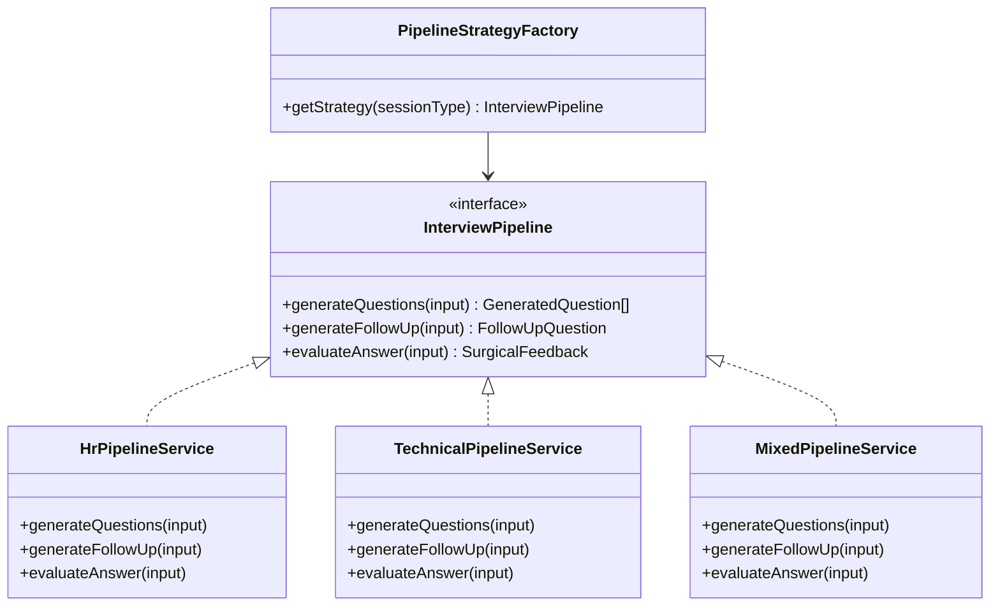

# LLD — AIModule

Reference: [LLD_design.md](LLD_design.md) · [01_overview.md](01_overview.md) · [HLD §5](../../ArchitecturalDesign/HLD_InterviewAI_v1.0.md) · [SAD §2](../../ArchitecturalDesign/SAD_InterviewAI_v1.0.md) · ADR-004

---

## 1. Module Responsibilities

AIModule contains all AI inference logic. No HTTP controller — only BullMQ processors and supporting services. Decoupled from other modules; SessionModule, TurnModule, and ReportModule communicate via BullMQ queues only.

```
SessionModule ──[QUESTION_GEN_QUEUE]──► QuestionGenerationProcessor
TurnModule    ──[FOLLOW_UP_QUEUE]────► FollowUpProcessor
TurnModule    ──[FEEDBACK_QUEUE]─────► FeedbackProcessor
ReportModule  ──[REPORT_QUEUE]───────► ComprehensiveReportProcessor
(v1.1)        ──[REWRITE_EVAL_QUEUE]─► RewriteEvalProcessor (stub)
```

---

## 2. Class Interfaces

### 2.1 OpenAIGateway

Single entry point for all OpenAI API calls.

```typescript
interface OpenAIGateway {
  chatCompletion(params: {
    messages: ChatCompletionMessageParam[];
    model: 'gpt-4o';
    temperature: number;
    maxTokens: number;
    responseFormat?: 'json_object';
  }): Promise<string>;

  transcribe(params: {
    audioBuffer: Buffer;
    mimeType: 'audio/webm' | 'audio/mp4' | 'audio/wav';
    language?: 'vi' | 'en';
  }): Promise<{ text: string; durationSeconds: number }>;
}
```

Wraps `openai` npm SDK, enforces timeout per job type, throws `AI_SERVICE_ERROR` after 2 retries. Does not build prompts — receives fully-assembled message arrays.

### 2.2 PromptBuilderService

Implements 3-layer prompt architecture (SAD §2.2).

```typescript
interface PromptBuilderService {
  buildBaseSystem(taskType: PromptTask): SystemMessage;

  applyContextPack(
    base: SystemMessage,
    contextPack: ContextPack,
  ): SystemMessage;

  injectDynamicContext(params: {
    systemMessage: SystemMessage;
    jobDescription: string;
    question: string;
    answer?: string;
    sessionHistory?: SessionHistoryEntry[];
  }): ChatCompletionMessageParam[];
}

type PromptTask =
  | 'question-generation'
  | 'follow-up'
  | 'surgical-feedback'
  | 'comprehensive-report';

type ContextPack = 'VN' | 'Western';
```

Layer 3 uses XML tags to delimit dynamic data and prevent prompt injection:

```xml
<job_description>{jd_text}</job_description>
<question>{question_text}</question>
<answer>{answer_text}</answer>
```

### 2.3 ContextPackService

```typescript
interface ContextPackService {
  getContextPack(type: ContextPack): ContextPackConfig;
}

interface ContextPackConfig {
  type: ContextPack;
  rubricDimensions: RubricDimension[];
  culturalNotes: string;
  scoringWeights: Record<RubricDimension, number>;
}
```

VN pack dimensions: `clarity`, `structure`, `communication`, `culture_fit`.
Western pack dimensions: `clarity`, `structure`, `communication`, `impact`, `leadership`.
Config stored in static JSON constants — no DB read required.

### 2.4 Pipeline Strategy Pattern

```typescript
interface InterviewPipeline {
  generateQuestions(input: QuestionGenInput): Promise<GeneratedQuestion[]>;
  generateFollowUp(input: FollowUpInput): Promise<FollowUpQuestion | null>;
  evaluateAnswer(input: FeedbackInput): Promise<SurgicalFeedback>;
}

interface PipelineStrategyFactory {
  getStrategy(sessionType: SessionType): InterviewPipeline;
}

type SessionType = 'HR' | 'Technical' | 'Mixed';
```

Concrete implementations:

| Service | Session Types | Rubric |
|---------|--------------|--------|
| `HrPipelineService` | T1, T2, T4, T7 | D1-D6 behavioral dimensions |
| `TechnicalPipelineService` | T5, T6, S2 | TD1-TD5 technical dimensions |
| `MixedPipelineService` | All trigger types | 0.30×BEH + 0.45×TECH + 0.15×SIT + 0.10×COMM |



### 2.5 ZodValidatorService

```typescript
interface ZodValidatorService {
  validate<T>(schema: ZodSchema<T>, data: unknown): T;
  // throws InterviewAIException(SCHEMA_VALIDATION_ERROR) if data does not match schema
}
```

Used by all processors to validate AI JSON output before inserting to DB.

---

## 3. BullMQ Processors

### 3.1 QuestionGenerationProcessor

Queue: `QUESTION_GEN_QUEUE`. Timeout: 15s, retry: 1 (D-07).

```typescript
interface QuestionGenerationJobDto {
  sessionId: string;       // UUID
  sessionType: SessionType;
  jobDescriptionText: string;
  targetRoles: string[];
  contextPack: ContextPack;
  totalQuestions: number;  // default: 10
}
```

Steps: getStrategy → buildPrompt → chatCompletion(T=0.8, maxTokens=600) → validate → insert `questions` rows → update `interview_sessions.status = 'ready'` → publish `session.status` SSE.

Fallback: seed questions from `questions` WHERE `source = 'seed'`.

### 3.2 FollowUpProcessor

Queue: `FOLLOW_UP_QUEUE`. Timeout: 8s, retry: 0 (D-07).

```typescript
interface FollowUpJobDto {
  sessionId: string;
  turnId: string;
  answerId: string;
  questionText: string;
  answerText: string;
  contextPack: ContextPack;
  sessionType: SessionType;
}
```

Steps: getStrategy → buildPrompt → chatCompletion(T=0.7, maxTokens=150) → validate → insert `follow_up_questions` row → publish `turn.follow_up` SSE.

Fallback (no retry on timeout): skip — no row inserted, no SSE. Client shows "Tạm bỏ qua follow-up".

### 3.3 FeedbackProcessor

Queue: `FEEDBACK_QUEUE`. Timeout: 15s, retry: 1 (D-07).

```typescript
interface FeedbackJobDto {
  sessionId: string;
  turnId: string;
  answerId: string;
  questionText: string;
  answerText: string;
  contextPack: ContextPack;
  sessionType: SessionType;
}
```

Steps: getStrategy → evaluateAnswer → validate(`SurgicalFeedbackSchema`) → insert `ai_feedbacks` row → insert `annotated_segments` rows → publish `turn.feedback_ready` SSE.

Fallback (after 1 retry): insert `ai_feedbacks.feedback_text` only, skip `annotated_segments`. Publish `turn.feedback_ready` without `annotations` field.

### 3.4 ComprehensiveReportProcessor

Queue: `REPORT_QUEUE`. Timeout: 30s, retry: 1 (D-07).

```typescript
interface ComprehensiveReportJobDto {
  sessionId: string;
  sessionType: SessionType;
  contextPack: ContextPack;
  turnIds: string[];
}
```

Steps: fetch all `ai_feedbacks` for session → `aggregate()` scores → `score()` overall → chatCompletion (action plan, T=0.5, maxTokens=800) → validate → insert `session_reports` row → insert `performance_snapshots` row → publish `report.ready` SSE.

### 3.5 RewriteEvalProcessor (v1.1 stub)

```typescript
// v1.1: UC-07 Rewrite — not implemented in MVP
// Queue: REWRITE_EVAL_QUEUE, Timeout: 15s, retry: 0
// stub — throws SERVICE_UNAVAILABLE if invoked in MVP
```

---

## 4. Prompt Version Registry

| Prompt version | Temperature | Max Tokens | Processor |
|---------------|-------------|-----------|-----------|
| `question-gen-v1.0` | 0.8 | 600 | QuestionGenerationProcessor |
| `followup-v1.0` | 0.7 | 150 | FollowUpProcessor |
| `surgical-feedback-v1.0` | 0.3 | 1500 | FeedbackProcessor |
| `comprehensive-report-v1.0` | 0.5 | 800 | ComprehensiveReportProcessor |

Prompt version stored in `ai_feedbacks.prompt_version` for auditability.

---

## 5. Key References

- SAD §2.2 — 3-layer prompt architecture (base / context pack / dynamic XML)
- SAD §2.4 — Fallback and error handling strategy
- Session Type Spec — trigger taxonomy, rubric dimensions per session type
- HLD §5 — job specs: queue names, timeouts, retry counts
- ADR-004 — OpenAI provider choice (`openai` npm SDK, not LangChain)
- [07_cross_cutting.md](07_cross_cutting.md) — SseService (Redis Pub/Sub emit)
- [01_overview.md §6](01_overview.md) — BullMQ queue name constants
