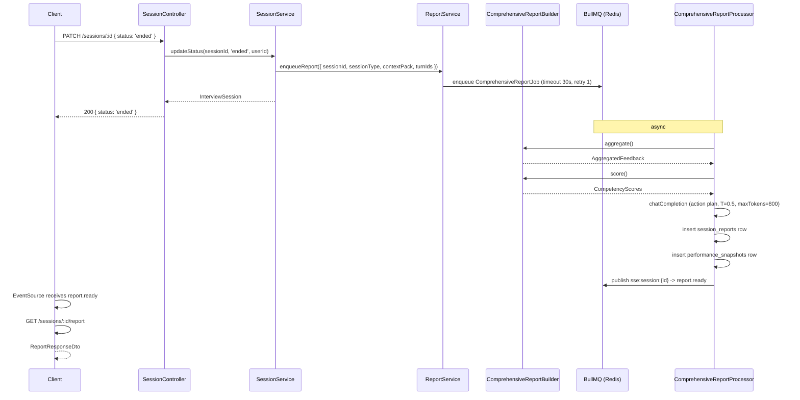

# LLD — ReportModule

Reference: [LLD_design.md](LLD_design.md) · [01_overview.md](01_overview.md) · [HLD §5](../../ArchitecturalDesign/HLD_InterviewAI_v1.0.md) · [api-design/05_report.md](../api-design/05_report.md)

---

## 1. Module Responsibilities

ReportModule exposes the report read endpoint, builds the comprehensive report DTO from DB rows, and enqueues `ComprehensiveReportJob` when a session ends. Imports `SessionService` (SessionModule) and `TurnService` (TurnModule).

---

## 2. Classes

### 2.1 ReportController

```typescript
interface ReportController {
  getReport(
    sessionId: string,
    user: AuthenticatedUser,
  ): Promise<ReportResponseDto>;
  // GET /sessions/:sessionId/report
  // throws SESSION_NOT_FOUND if session does not exist
  // throws FORBIDDEN if session.userId !== req.user.id
  // throws 404 with code REPORT_NOT_READY if session_reports row absent
}
```

Requires `@UseGuards(JwtAuthGuard)`.

### 2.2 ReportService

```typescript
interface ReportService {
  getReport(sessionId: string, userId: string): Promise<ReportResponseDto>;
  // Fetches session_reports row, calls buildAnnotatedTranscript()

  isReportReady(sessionId: string): Promise<boolean>;
  // SELECT EXISTS FROM session_reports WHERE session_id = $1

  buildAnnotatedTranscript(sessionId: string): Promise<AnnotatedTranscriptDto>;
  // Joins turns + answers + ai_feedbacks + annotated_segments
  // Returns ordered list of turns with inline feedback annotations

  enqueueReport(input: {
    sessionId: string;
    sessionType: SessionType;
    contextPack: ContextPack;
    turnIds: string[];
  }): Promise<void>;
  // Called by SessionService.updateStatus() when status -> 'ended'
  // Enqueues ComprehensiveReportJob
}
```

### 2.3 ComprehensiveReportBuilder

```typescript
interface ComprehensiveReportBuilder {
  aggregate(sessionId: string): Promise<AggregatedFeedback>;
  // Fetches all ai_feedbacks for session
  // Collects competency scores per turn

  score(aggregated: AggregatedFeedback, contextPack: ContextPack): CompetencyScores;
  // Averages per-dimension scores across all turns
  // VN: clarity, structure, communication, culture_fit
  // Western: clarity, structure, communication, impact, leadership

  buildActionPlan(scores: CompetencyScores): ActionPlan;
  // Identifies bottom 3 dimensions, returns improvement suggestions
}

interface AggregatedFeedback {
  turnCount: number;
  feedbackItems: TurnFeedback[];
}

interface CompetencyScores {
  dimensions: Record<string, number>;  // 0-100 per dimension
  overall: number;
}

interface ActionPlan {
  topImprovements: Improvement[];      // max 3
}

interface Improvement {
  dimension: string;
  score: number;
  suggestion: string;
}
```

---

## 3. DTOs

```typescript
interface ComprehensiveReportJobDto {
  sessionId: string;
  sessionType: SessionType;
  contextPack: ContextPack;
  turnIds: string[];
}

interface ReportResponseDto {
  sessionId: string;
  sessionType: SessionType;
  contextPack: ContextPack;
  competencyScores: CompetencyScores;
  actionPlan: ActionPlan;
  annotatedTranscript: AnnotatedTranscriptDto;
  createdAt: string;                   // ISO 8601
}

interface AnnotatedTranscriptDto {
  turns: TurnAnnotationDto[];
}

interface TurnAnnotationDto {
  turnIndex: number;
  question: string;
  answer: string;
  answerType: 'text' | 'voice';
  voiceMetrics?: {
    wpm: number;
    fillerWords: FillerWordCount;
    hasSilence: boolean;
  };
  segments: AnnotatedSegmentDto[];
  followUpQuestion?: string;
}

interface AnnotatedSegmentDto {
  spanStart: number;                   // char offset in answerText
  spanEnd: number;
  highlightType: 'strength' | 'improvement';
  comment: string;
}
```

---

## 4. Sequence — Report Generation



---

## 5. Key References

- HLD §5 — ComprehensiveReportJob specs (timeout 30s, retry 1)
- ADR-006 — `report.ready` SSE event payload
- api-design/05_report.md — full endpoint specs
- database-design/ — `session_reports`, `performance_snapshots`, `annotated_segments` DDL
- [05_ai_module.md §3.4](05_ai_module.md) — ComprehensiveReportProcessor detail
- [01_overview.md §4](01_overview.md) — ErrorCode enum (FORBIDDEN, SESSION_NOT_FOUND)
