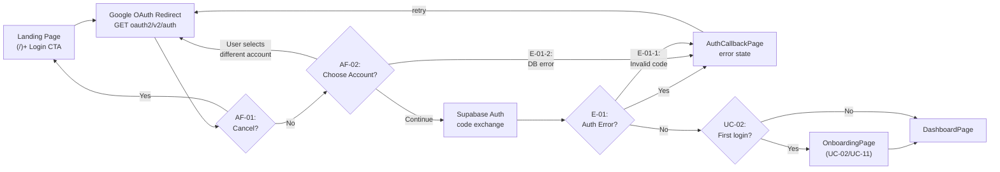
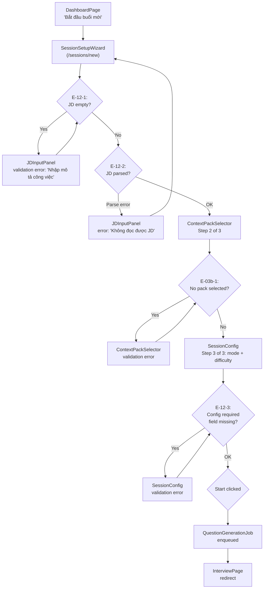

# UI/UX Design — Auth + Setup Flows

Chi tiết: [01_overview.md](01_overview.md), 03_flows_interview.md, 04_flows_features.md.

---

## 1. UC-01: Google OAuth Login

### 1.1 Flow



### 1.2 Screen States

| Screen | State | UI Elements | Triggers |
|--------|-------|-----------|----------|
| `LandingPage` | default | Logo, tagline, "Bắt đầu luyện tập" CTA, footer | — |
| `LandingPage` | loading | CTA disabled, spinner | After click, before OAuth redirect |
| `AuthCallbackPage` | loading | Spinner, "Đang xác thực..." message | From OAuth redirect |
| `AuthCallbackPage` | error | Error icon, message, "Thử lại" button | Invalid code (E-01-1), DB error (E-01-2) |
| `OnboardingPage` | default | Step indicator, form fields, skip option | First login (UC-02/UC-11) |
| `DashboardPage` | default | Welcome header, session list, new session CTA | Post-auth |

### 1.3 Wireframe Notes

**LandingPage**
```
┌─────────────────────────────────────────────┐
│  InterviewAI logo          [Đăng nhập] btn │
├─────────────────────────────────────────────┤
│                                             │
│         "Luyện phỏng vấn cùng AI"          │
│  "Chuẩn bị cho cơ hội đầu tiên một cách     │
│   tự tin..."                               │
│                                             │
│       [Bắt đầu luyện tập ngay]  ← primary   │
│                                             │
└─────────────────────────────────────────────┘
```
- Hero section: centered text, no sidebar
- CTA: Google sign-in button (not email/password)
- Footer: terms, privacy, Vietnamese

**AuthCallbackPage**
```
┌─────────────────────────────────────────────┐
│  Logo                                        │
│                                             │
│       ↻  "Đang xác thực với Google..."      │
│                                             │
└─────────────────────────────────────────────┘
```
- No sidebar, no navigation
- Spinner centered
- Auto-redirect on success: 0→100ms perception

**OnboardingPage**
```
┌─────────────────────────────────────────────┐
│  Step 1 of 2          [Skip for now]        │
├─────────────────────────────────────────────┤
│  "Nói về bạn"                              │
│  [Name field]                               │
│  [Avatar upload - optional]                  │
│                                             │
│  "Chọn ngữ cảnh phỏng vấn"                  │
│  (VN Context Pack / Western Context)        │
│  [Radio group: ContextPackSelector]          │
│                                             │
│               [Tiếp tục →]                  │
└─────────────────────────────────────────────┘
```
- Step progress indicator
- ContextPackSelector: radio group, keyboard accessible
- Skip link available (saved to profile, can change later)

**DashboardPage**
```
┌─────────────────────────────────────────────┐
│  Logo  [Progress]  [Avatar ▼]               │
├──────────────────────┬──────────────────────┤
│  "Xin chào, {name}"  │                      │
│  [Bắt đầu buổi mới ▶] │ Số buổi đã luyện: N │
├──────────────────────┴──────────────────────┤
│  SessionCard #1  [HR | Active | 2026-05-10]│
│  SessionCard #2  [Mixed | Ended | 2026-05-09]│
│  ...                                        │
└─────────────────────────────────────────────┘
```
- SessionCard: status badge, type badge, date, click → interview or report
- "Bắt đầu buổi mới" primary CTA → `/sessions/new`

---

## 2. UC-12 / UC-03b: JD Input + Session Config

### 2.1 Flow



### 2.2 Screen States

| State in Wizard | Active Panel | Next Button | Back Button | Notes |
|-----------------|-------------|-------------|-------------|-------|
| `jd_idle` | JDInputPanel (empty) | "Tiếp" | — | Paste/file/url tabs |
| `jd_loading` | JDInputPanel + skeleton | disabled | enabled | Parsing JD |
| `jd_parsed` | JDInputPanel (parsed summary shown) | "Tiếp" | "Lùi" | Summary chips |
| `jd_error` | JDInputPanel (error message) | "Thử lại" | "Lùi" | E-12-2 |
| `config_ready` | ContextPackSelector | "Tiếp" | "Lùi" | VN/WESTERN cards |
| `starting` | Full form (review) + "Bắt đầu" | "Bắt đầu" | "Lùi" | Progress step 3/3 |

### 2.3 Wireframe Notes

**Step 1 — JD Input**
```
┌─────────────────────────────────────────────┐
│  ① Điền JD    ② Chọn ngữ cảnh     ③ Cấu hình │
├─────────────────────────────────────────────┤
│  "Dán mô tả công việc"                      │
│  ┌─────────────────────────────────────────┐│
│  │ [Paste] [File] [URL]  ← tabs            ││
│  ├─────────────────────────────────────────┤│
│  │ Textarea: paste JD here...             ││
│  │                                         ││
│  └─────────────────────────────────────────┘│
│  "Tối thiểu 100 ký tự" → char count        │
│                            [Tiếp →]         │
└─────────────────────────────────────────────┘
```
- Tabs: Paste (default), File (.pdf/.docx max 5MB), URL (fetch JD from link)
- Char count: shows remaining (min 100 chars)
- Parsed summary: shows after successful parse → extractable terms

**Step 2 — Context Pack + Mode Config**
```
┌─────────────────────────────────────────────┐
│  ① Điền JD    ② Chọn ngữ cảnh     ③ Cấu hình │
├─────────────────────────────────────────────┤
│  "Chọn ngữ cảnh phỏng vấn"                  │
│  ┌────────────┐  ┌┌────────────────────┐  │
│  │ VN Context │  ││ Western Context    │  │
│  │ 🇻🇳        │  ││ 🇺🇸                │  │
│  │ ...        │  ││ ...                │  │
│  └────────────┘  │└────────────────────┘  │
│  "Loại phỏng vấn"                          │
│  ○ HR  ○ Kỹ thuật  ● Phỏng vấn hỗn hợp      │
│  "Độ khó"                                   │
│  ○ Junior  ● Mid  ○ Senior                  │
│                            [Tiếp →]         │
└─────────────────────────────────────────────┘
```
- ContextPackSelector: 2-card radio group
- Mode + difficulty: radio groups, visible when pack selected
- All fields nullable → required before Step 3 submit

**Error States (Step 1)**
- Empty input: inline error "Nhập ít nhất 100 ký tự"
- File too large: toast "File phải nhỏ hơn 5MB"
- Unsupported format: toast "Chỉ chấp nhận .pdf, .docx"
- Parse error: inline error with retry button → fallback to raw text

**Error States (Step 2)**
- No pack selected: inline error "Chọn một ngữ cảnh để tiếp tục"

---

## 3. Navigation Rules

| From | Condition | To |
|------|-----------|-----|
| LandingPage | Auth success + first login | OnboardingPage |
| LandingPage | Auth success + returning | DashboardPage |
| LandingPage | Auth error | LandingPage + retry banner |
| AuthCallbackPage | Auth success | Redirect (by state) |
| AuthCallbackPage | Auth error | LandingPage + error banner |
| OnboardingPage | Complete onboarding | DashboardPage |
| OnboardingPage | Skip | DashboardPage |
| DashboardPage | "Bắt đầu buổi mới" | SessionSetupWizard |
| SessionSetupWizard | JD not filled | Stay on Step 1 |
| SessionSetupWizard | All steps complete | InterviewPage |
| SessionSetupWizard | Cancel | DashboardPage |

---

## 4. Component Usage

| Component | Used In | States | Special Notes |
|-----------|---------|--------|---------------|
| `JDInputPanel` | SessionSetupWizard Step 1 | empty / loading / parsed / error | Manages file/text/url tabs |
| `ContextPackSelector` | OnboardingPage + Step 2 | VN / WESTERN | Radio group, card layout |
| `SessionCard` | DashboardPage | active / ended / generating | Click → respective page |
| `JDPreview` | SessionSetupWizard Step 1 | loading / visible | Extracted terms, company name |
| `ProgressStepper` | Wizard (multi-step) | step 1/2/3 | Accessible step indicator |

---

## 5. Accessibility Notes

- Wizard steps: `<nav aria-label="Session setup steps">` + `aria-current="step"` on active step
- JD textarea: `aria-describedby="jd-hint"` referencing char count / validation hint
- ContextPackSelector: `role="radiogroup"` with `role="radio"` on each card; keyboard arrow navigation
- Mode/difficulty: `role="radiogroup"` per group
- Error messages: `role="alert"` for inline validation errors
- Tab navigation within JDInputPanel: `role="tablist"` / `role="tab"`
- Focus management on wizard Next: focus moves to first field on next step

---

## 6. Key References

- SRS UC-01 (Google OAuth): offset=887 trong SRS
- SRS UC-03b (Context Pack selection): grep "UC-03b" trong SRS
- SRS UC-12 (Session setup): offset=1726 trong SRS
- HLD §2.2.1 — Page inventory (routes)
- 01_overview.md §2 — Screen inventory table
