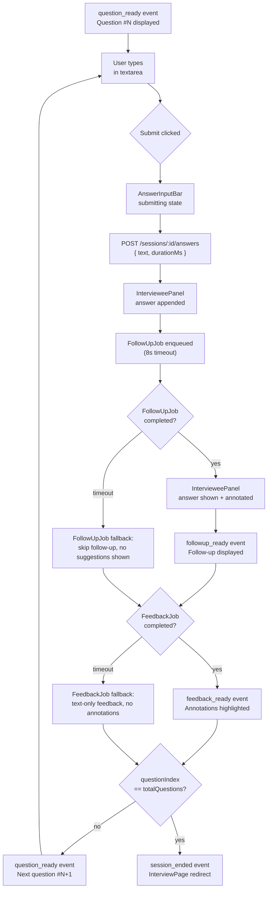
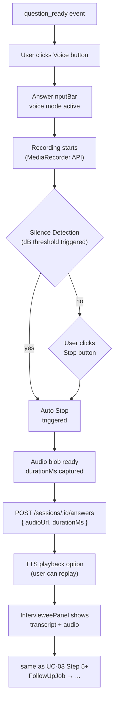
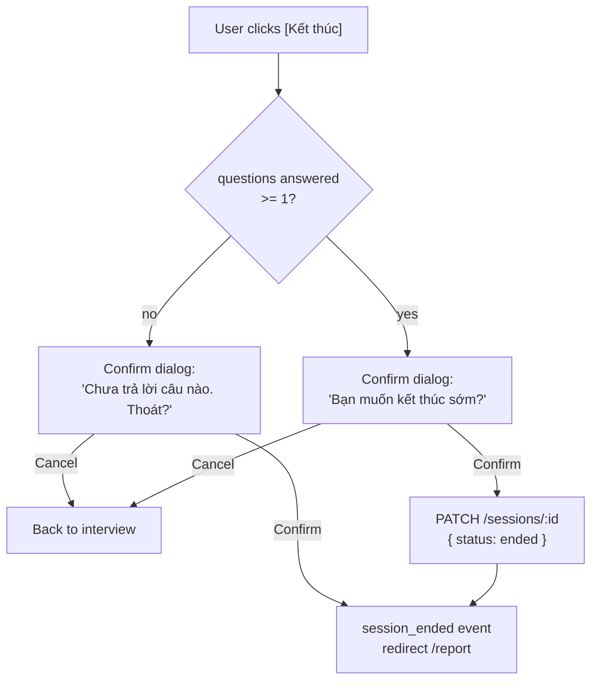

# UI/UX Design — Interview Flows

Chi tiết: [01_overview.md](01_overview.md), [02_flows_auth_setup.md](02_flows_auth_setup.md), 04_flows_features.md.

---

## 1. Interview Screen Layout

### 1.1 3-Panel Layout (Final Round AI Reference)

```
┌─────────────────────────────────────────────────────────────────┐
│ InterviewAI  [HR] [Question 3/10]      ⏱ 04:32     [Kết thúc] │
├─────────────────┬──────────────────────────┬───────────────────┤
│                 │                          │                   │
│  INTERVIEWER    │  AI SUGGESTIONS           │  INTERVIEWEE      │
│  ─────────────  │  ──────────────           │  ─────────────    │
│                 │                          │                   │
│  Câu hỏi:       │  [Skeleton] khi đang     │  [Your answer     │
│  "Bạn có thể    │  chờ follow-up            │   appears here    │
│   describe..."  │                           │   after submit]   │
│                 │  Điểm mạnh:              │                   │
│  [Follow-up     │  - STAR framework        │  [Annotations:    │
│   hiện ở đây    │  - Key points             │   highlight       │
│   sau khi trả    │  - Examples              │   spans with      │
│   lời]          │                           │   score tooltip]  │
│                 │                          │                   │
├─────────────────┴──────────────────────────┴───────────────────┤
│  [Type your answer...          ] [🎤 Voice] [Submit ▶]          │
│  ═══════════════════════════════════════════════════════ 3/10 │
└─────────────────────────────────────────────────────────────────┘
```

- Header: logo, session type badge, question counter (3/10), timer (aria-live every 30s), end session button
- 3 panels: 1:1:1 trên desktop; stacked trên mobile (Interviewer → AI → Interviewee)
- Bottom bar: text input + voice toggle + submit; progress bar (question / total)
- AI Suggestions panel: hidden (q1), shown after first submit; skeleton loader khi chờ follow-up

### 1.2 Component States

| Component | States | Trigger |
|-----------|--------|---------|
| `InterviewerPanel` | question / followup / ended | SSE event |
| `AISuggestionsPanel` | hidden / loading / visible / error | `turn.follow_up` |
| `IntervieweePanel` | empty / typing / submitted / annotated | answer submit, `turn.feedback_ready` |
| `AnswerInputBar` | text / voice / submitting / disabled | mode toggle, network |
| `TimerDisplay` | running / paused / warning (<60s) | auto, user pause |
| `ProgressBar` | N/M | question index change |

---

## 2. UC-03: Text Answer Flow

### 2.1 Flow



### 2.2 Screen States

| State | UI | Triggers |
|-------|-----|---------|
| `q_waiting` | Skeleton question card | Session started, before first question |
| `q_ready` | Question text displayed, input enabled | `question_ready` |
| `a_submitting` | Textarea disabled, submit spinner | After submit click |
| `a_submitted` | Answer in IntervieweePanel, AI panel loading | POST success |
| `f_loading` | AISuggestionsPanel skeleton | FollowUpJob fired |
| `f_ready` | Follow-up text in InterviewerPanel | `followup_ready` |
| `fb_ready` | Annotations in IntervieweePanel | `feedback_ready` |
| `s_ended` | All panels done, redirect to report | `session_ended` |

### 2.3 Wireframe Notes

**Text input mode**
```
┌───────────────────────────────────────────┐
│  "Bạn có describe a challenging project" │
│                                           │
│  ┌───────────────────────────────────┐    │
│  │ Type your answer...               │    │
│  │                                   │    │
│  └───────────────────────────────────┘    │
│  127 / 2000 ký tự                        │
│                            [Submit ▶]     │
└───────────────────────────────────────────┘
```
- Textarea: max 2000 chars, char count shown
- Submit: disabled khi empty hoặc submitting
- Keyboard: Enter = submit (Shift+Enter = newline)
- Voice toggle: icon button, tooltip "Chuyển sang giọng nói"

---

## 3. UC-04: Voice Answer Flow

### 3.1 Flow



Silence detection: `AudioContext` + `AnalyserNode` — threshold -45 dB, window 500ms, trigger khi `consecutiveSilentFrames >= 3`.

### 3.2 Screen States

| State | UI | Notes |
|-------|-----|-------|
| `voice_idle` | Voice button, tooltip "Bắt đầu ghi" | Idle, question ready |
| `voice_recording` | Button red + pulse, timer, waveform | MediaRecorder active |
| `voice_stopped` | Preview player, [Submit] enabled | Blob ready, no POST yet |
| `voice_uploading` | Progress bar, [Submit] disabled | Upload to Supabase Storage |
| `voice_error` | Error toast, retry button | Mic denied / network fail |

### 3.3 Wireframe Notes

**Voice recording mode**
```
┌───────────────────────────────────────────┐
│  "Bạn có describe a challenging project" │
│                                           │
│  ┌───────────────────────────────────┐    │
│  │  🎤 Đang ghi...  ⏱ 00:45          │    │
│  │  ▁▃▅▇▅▃▁▃▅▇▅▃▁▃  ← waveform      │    │
│  │                                   │    │
│  │  [⏹ Dừng lại]                    │    │
│  └───────────────────────────────────┘    │
│                            [Hủy]          │
└───────────────────────────────────────────┘
```
- Waveform: real-time via `AnalyserNode.getByteTimeDomainData()`
- Recording timer: `MM:SS`, updates every second
- Max duration: 120s (auto-stop)
- Permission denied → inline error + link to browser settings + auto-fallback to text mode

---

## 4. UC-06: Follow-up Question Flow

### 4.1 Trigger Conditions

FollowUpJob được trigger khi:
- `answerScores.overall >= 50` (có meaningful answer để follow-up)
- Session chưa đạt `totalQuestions`
- FollowUpJob timeout = 8s, retry = 0 (skip nếu fail)

### 4.2 Flow

```
Follow-up question displayed → User answers (text hoặc voice) → Submit → Next question hoặc End
```

- Follow-up xuất hiện trong InterviewerPanel, thay thế câu hỏi gốc
- IntervieweePanel được clear (answer mới)
- Progress bar: giữ nguyên index cho đến khi follow-up answer xong
- Fallback (timeout): skip follow-up → tiếp câu hỏi tiếp theo hoặc end

### 4.3 Screen States

| State | AI Suggestion | Notes |
|-------|--------------|-------|
| `fu_none` | Hidden | Chưa có follow-up |
| `fu_loading` | Skeleton | Đang chờ FollowUpJob |
| `fu_ready` | Follow-up text in InterviewerPanel | User trả lời câu này |
| `fu_skipped` | Message: "Tạm bỏ qua follow-up" | Timeout fallback |

---

## 5. UC-07: End Session Flow

### 5.1 Flow



### 5.2 Confirm Dialog (Wireframe)

```
┌───────────────────────────────────────┐
│  "Kết thúc buổi phỏng vấn?"           │
│                                       │
│  Bạn đã trả lời 3/10 câu hỏi.         │
│  Báo cáo sẽ được tạo dựa trên các     │
│  câu trả lời đã thu thập.             │
│                                       │
│  [Tiếp tục luyện tập]  [Kết thúc]     │
└───────────────────────────────────────┘
```
- Modal: `role="dialog"`, `aria-modal="true"`, focus trap
- Primary: "Tiếp tục luyện tập" (escape)
- Secondary: "Kết thúc" (destructive, red)

### 5.3 Redirect Rules

| Condition | Destination | Notes |
|-----------|-------------|-------|
| Report ready | `/sessions/[id]/report` | `reportReady: true` |
| Report not ready | stay + toast "Report đang tạo" | Polling |
| Network error | Stay + error banner | Retry button |

---

## 6. SSE Event Mapping

### 6.1 Event → UI State Transitions

ADR-006 defines 5 SSE event types. InterviewPage listens to 3 of them:

| Event (ADR-006) | Payload | UI Update | State Change |
|-----------------|---------|-----------|-------------|
| `session.status` | `{ sessionId, status, questions? }` | InterviewerPanel: show first question | `q_ready` |
| `turn.follow_up` | `{ followUpId, text, parentAnswerId }` | InterviewerPanel: follow-up; AISuggestionsPanel: key points | `fu_ready` |
| `turn.feedback_ready` | `{ answerId, annotations[], scores }` | IntervieweePanel: highlight spans; ScoreBadge updated | `fb_ready` |

`report.ready` and `rewrite.done` are not consumed on InterviewPage.  
Session end is client-initiated (user clicks "Kết thúc" → PATCH session status → client redirects immediately).

### 6.2 `useSseStream(sessionId)` Hook Lifecycle

```
useEffect → EventSource(url) → onmessage handler → dispatch to state
                                    ↓
                            onerror → reconnect (3 retries, 2s backoff)
                                    ↓
                            onopen → connection established
                                    ↓
                            cleanup → eventSource.close() (component unmount)
```

Reconnect: client gửi `Last-Event-ID` header. Server không replay missed events — client fetch lại từ REST API sau reconnect nếu cần.

### 6.3 Error Banner States

| SSE error type | Banner message | Action |
|---------------|----------------|--------|
| `NETWORK_ERROR` | "Mất kết nối. Đang thử lại..." | Auto-retry, no user action |
| `AI_TIMEOUT` | "AI đang chậm. Vui lòng chờ thêm." | Manual retry button |
| `AUTH_EXPIRED` | "Phiên hết hạn. Đăng nhập lại." | Redirect to login |
| `SESSION_ENDED` | "Buổi phỏng vấn đã kết thúc." | Redirect to report |

---

## 7. Error States

### 7.1 Network Drop

- EventSource disconnect → reconnect banner: "Mất kết nối. Đang kết nối lại..."
- Auto-retry: 3 lần, backoff 2s → 4s → 8s
- Sau 3 fail: "Không thể kết nối. Kiểm tra internet." + manual retry
- Interview state giữ nguyên (question + answers không mất)
- `Last-Event-ID` được gửi khi reconnect để tránh miss events

### 7.2 AI Timeout (Fallback per D-07)

| Job | Timeout | Retry | Fallback UI |
|-----|---------|-------|-------------|
| QuestionGenerationJob | 15s | 1 | Seed question — user không thấy thay đổi |
| FollowUpJob | 8s | 0 | "Tạm bỏ qua follow-up" message |
| FeedbackJob | 15s | 1 | Text-only feedback — no annotation spans |

Fallback messages:
- FollowUpJob skip: "Tạm bỏ qua câu hỏi phụ để tiết kiệm thời gian."
- FeedbackJob text-only: "Điểm chi tiết đang được xử lý. Phản hồi cơ bản: ..."

### 7.3 Mic Permission Denied

- Browser deny → inline error: "Không thể truy cập microphone. Kiểm tra cài đặt trình duyệt."
- Link: "Hướng dẫn bật microphone" → opens browser settings modal
- Auto-fallback: tự động chuyển sang text input mode
- Voice button vẫn hiển thị nhưng disabled

### 7.4 Upload Failure (Voice)

- Upload to Supabase Storage fail → toast "Tải file thất bại. Thử lại." + retry button
- Recording blob vẫn ở local — user có thể retry submit
- Sau 3 fail: option "Chuyển sang text mode" với audio được auto-transcribe

---

## 8. Key References

- SRS UC-03 (text answer): `### UC-03`
- SRS UC-04 (voice answer): `### UC-04`
- SRS UC-06 (follow-up): `### UC-06`
- SRS UC-07 (end session): `### UC-07`
- HLD §5 — BullMQ jobs: QuestionGenerationJob, FollowUpJob, FeedbackJob
- ADR-006 — SSE + Redis pub/sub
- D-07 — Job timeout/fallback specs (docs/CLAUDE.md)
- 01_overview.md §4.1 — 3-panel layout
- 01_overview.md §6 — Component inventory
- 01_overview.md §7 — useSseStream hook