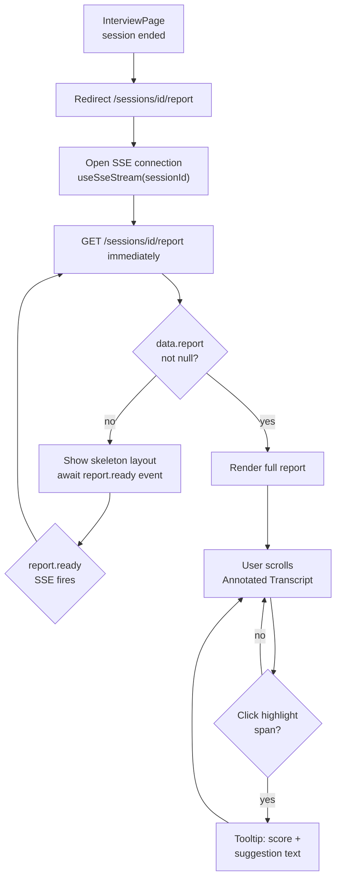

# UI/UX Design — Report + Features Flows

Reference: [UIUX_design.md](UIUX_design.md) · [03_flows_interview.md](03_flows_interview.md) · [api-design/05_report.md](../api-design/05_report.md) · ADR-006 · ADR-007

---

## 1. UC-06: Report Page Flow (MVP)

### 1.1 Flow



### 1.2 Screen States

| State | UI | Trigger |
|-------|-----|---------|
| `report_loading` | Skeleton: score bars + transcript lines | Redirect from InterviewPage before `report.ready` |
| `report_ready` | Full report rendered | `report.ready` SSE + fetch returns non-null |
| `report_error` | Error banner + "Thử lại" button | Fetch 500 or network failure |
| `report_partial` | Text-only feedback (no annotations) | `FeedbackJob` timeout fallback (ADR-007 D-07) |

### 1.3 Wireframe — ReportPage

```
┌─────────────────────────────────────────────────────────────────┐
│  InterviewAI    [Mixed | 2026-06-06]              [New session] │
├─────────────────────────────────────────────────────────────────┤
│  Overall Score: 74 / 100          [VN Context] badge            │
│                                                                 │
│  Competency Scores                                              │
│  Clarity       [████░░░] 72    Communication  [█████░░] 78     │
│  Structure     [████░░░] 68    Culture Fit    [████░░░] 75     │
│                                                                 │
│  Action Plan                                                    │
│  • Dùng framework STAR khi mô tả dự án                         │
│  • Cần ví dụ cụ thể hơn cho câu hỏi kỹ thuật                   │
│  • Giảm filler words (ừm, à)                                    │
├─────────────────────────────────────────────────────────────────┤
│  Annotated Transcript                                           │
│                                                                 │
│  Q1: "Bạn có thể mô tả một dự án bạn đã làm?"                  │
│                                                                 │
│  Answer: "Dạ, em có làm [highlight: "dự án" warning →          │
│  "Thiếu tên dự án cụ thể"] về e-commerce.                      │
│  Em đã [highlight: "STAR framework" good →                      │
│  "Tốt: đúng cấu trúc"] trình bày..."                           │
│                                                                 │
│  [Tooltip on hover/tap: Score 65 — "Nêu tên dự án cụ thể..."] │
└─────────────────────────────────────────────────────────────────┘
```

### 1.4 Annotated Transcript Interaction

`annotated_segments` rows map to highlight spans via `start_index`/`end_index` on answer text.

| `highlight_type` | Color class | Meaning |
|-----------------|-------------|---------|
| `good` | `bg-green-100 text-green-800` | Strong point |
| `warning` | `bg-yellow-100 text-yellow-800` | Can improve |
| `critical` | `bg-red-100 text-red-800` | Significant gap |

Interaction rules:
- Hover (desktop) / tap (mobile): tooltip appears with `score` + `comment` from `annotated_segments`
- Tooltip: `role="tooltip"`, `aria-describedby` on the span — WCAG 2.1 AA
- Click: tooltip stays pinned until click-outside or Escape
- Mobile: tap opens tooltip as bottom sheet

Fallback when `FeedbackJob` timed out (D-07): `annotated_segments` is empty. ReportPage shows `ai_feedbacks.feedback_text` only. Banner: "Phân tích chi tiết chưa khả dụng — hiển thị phản hồi cơ bản."

### 1.5 SSE Integration on ReportPage

`useSseStream(sessionId)` stays open on ReportPage. On load:

1. Open SSE connection
2. Immediately call `GET /sessions/:id/report`
3. If response has `data.report` → render, close SSE
4. If `data.report` is null → wait for `report.ready` → re-fetch

This handles both cases: user redirected from InterviewPage while job is still running, and user who navigates directly to the report URL after job completes.

---

## 2. UC-05: Feedback Generation (background — no dedicated screen)

UC-05 runs asynchronously via BullMQ after session completes. No separate screen. The user sees output through UC-06 (ReportPage). Key timing per ADR-007:

| Job | Timeout | Retry | SSE event | User-visible output |
|-----|---------|-------|-----------|---------------------|
| `FeedbackJob` (per answer) | 15s | 1 | — | `annotated_segments` rows |
| `ComprehensiveReportJob` | 30s | 1 | `report.ready` | Full ReportPage renders |

Fallback states: see §1.2 and §1.4.

---

## 3. UC-07: Rewrite Flow (v1.1 — deferred)

> **v1.1:** UC-07 is not in MVP. Route `/sessions/[id]/rewrite/[questionId]` is not implemented. `rewrite_answers` table does not exist in MVP schema.

Design placeholder for v1.1:

```
┌─────────────────────────────────────────────┐
│  Q3: "Describe a challenging project..."     │
│  Original score: 58 / 100                   │
├──────────────────────┬──────────────────────┤
│  Original answer     │  Your rewrite        │
│  [annotated text]    │  [textarea]          │
│                      │  [Submit ▶]          │
├──────────────────────┴──────────────────────┤
│  Previous attempts: +14  +8  +3             │
└─────────────────────────────────────────────┘
```

SSE event: `rewrite.done` (ADR-006). Payload: `{ rewrite_id, score, delta }`.  
API: see [api-design/06_rewrite.md](../api-design/06_rewrite.md).

---

## 4. Progress Dashboard (v1.1 — deferred)

> **v1.1:** UC-13 is deferred. Route `/progress` is not implemented. `progress_snapshots` table not created in MVP.

Design placeholder for v1.1:

```
┌─────────────────────────────────────────────┐
│  Tiến trình luyện tập                        │
│  5 sessions  |  Avg score: 71               │
├─────────────────────────────────────────────┤
│  [Competency heatmap — CompetencyHeatmap]   │
│  [Line chart: score over sessions]          │
│  [Badge grid: milestones]                   │
└─────────────────────────────────────────────┘
```

---

## 5. Key References

- SRS: UC-05 (feedback generation), UC-06 (report view), UC-07 (rewrite), UC-13 (progress)
- HLD §5: `FeedbackJob`, `ComprehensiveReportJob` specs
- ADR-006: SSE event `report.ready`, `rewrite.done`
- ADR-007: D-07 timeout/fallback — FeedbackJob 15s/retry 1, ComprehensiveReport 30s/retry 1
- [01_overview.md §6](01_overview.md): `SurgicalFeedback`, `ScoreBadge`, `CompetencyHeatmap` components
- [03_flows_interview.md §6](03_flows_interview.md): SSE event mapping table
- [api-design/05_report.md](../api-design/05_report.md): `GET /sessions/:id/report` response schema
