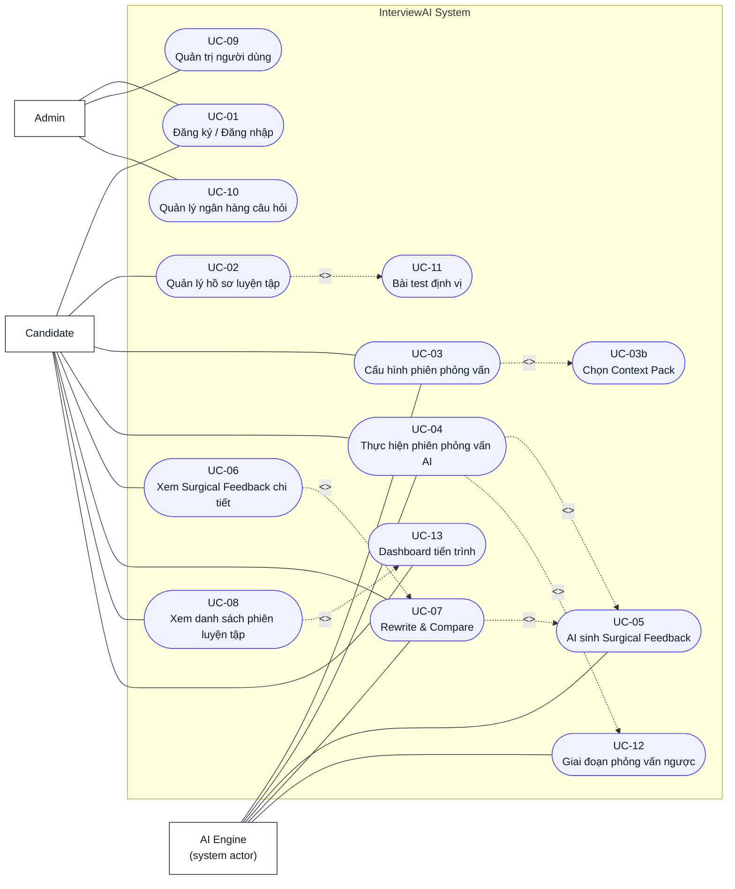
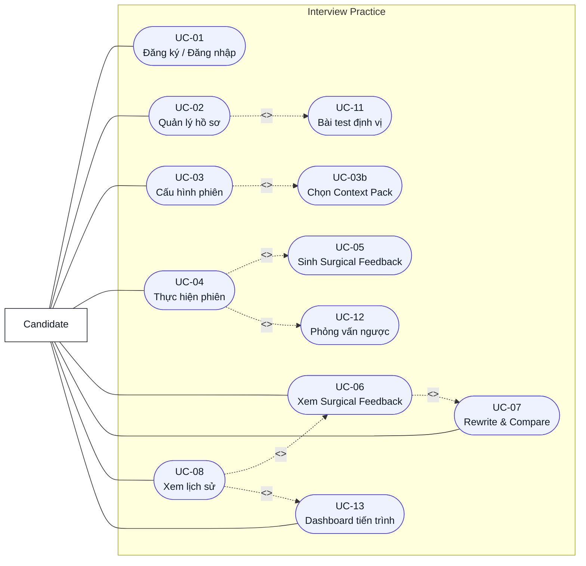
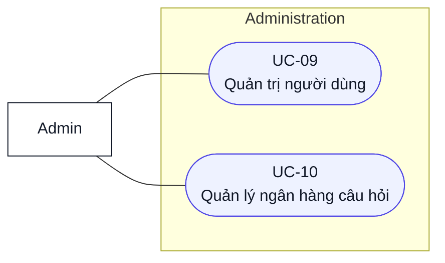
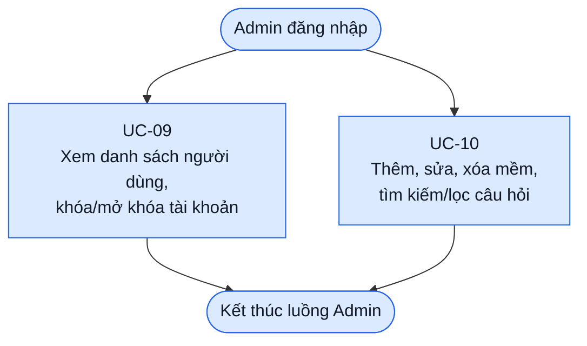

# Software Requirement Specification (SRS)
## AI Interview Coach System — InterviewAI

---

| Thuộc tính | Giá trị |
|---|---|
| **Ngày soạn** | 05/05/2026 |
| **Tác giả** | Lê Thành An — MSSV: 20235631 |
| **Đơn vị** | Trường Công nghệ Thông tin và Truyền thông (SOICT), ĐHBKHN |

---

## MỤC LỤC

- [1. Giới thiệu](#1-giới-thiệu)
  - [1.1 Mục đích](#11-mục-đích)
  - [1.2 Phạm vi](#12-phạm-vi)
    - [1.2.1 Tên sản phẩm](#121-tên-sản-phẩm)
    - [1.2.2 Mô tả tóm tắt](#122-mô-tả-tóm-tắt)
    - [1.2.3 Phạm vi phiên bản hiện tại (v1.0 — Prototype)](#123-phạm-vi-phiên-bản-hiện-tại-v10--prototype)
  - [1.3 Từ điển thuật ngữ](#13-từ-điển-thuật-ngữ)
  - [1.4 Tài liệu tham khảo](#14-tài-liệu-tham-khảo)
- [2. Mô tả tổng quan](#2-mô-tả-tổng-quan)
  - [2.1 Các tác nhân](#21-các-tác-nhân)
    - [2.1.1 Người dùng (Candidate)](#211-người-dùng-candidate)
    - [2.1.2 Quản trị viên (Admin)](#212-quản-trị-viên-admin)
    - [2.1.3 Hệ thống AI (AI Engine)](#213-hệ-thống-ai-ai-engine)
  - [2.2 Môi trường vận hành](#22-môi-trường-vận-hành)
  - [2.3 Biểu đồ Use Case tổng quan](#23-biểu-đồ-use-case-tổng-quan)
  - [2.4 Biểu đồ Use Case phân rã](#24-biểu-đồ-use-case-phân-rã)
    - [2.4.1 Nhóm Luyện phỏng vấn (Candidate)](#241-nhóm-luyện-phỏng-vấn-candidate)
    - [2.4.2 Nhóm Quản trị hệ thống (Admin)](#242-nhóm-quản-trị-hệ-thống-admin)
  - [2.5 Quy trình nghiệp vụ](#25-quy-trình-nghiệp-vụ)
    - [2.5.1 Quy trình Candidate](#251-quy-trình-candidate)
    - [2.5.2 Quy trình Admin](#252-quy-trình-admin)
    - [2.5.3 Đối chiếu quy trình nghiệp vụ với Use Case](#253-đối-chiếu-quy-trình-nghiệp-vụ-với-use-case)
    - [2.5.4 Mô tả chi tiết từng phase](#254-mô-tả-chi-tiết-từng-phase)
      - [Phase 1 — Onboarding & Profile Setup](#phase-1--onboarding--profile-setup)
      - [Phase 2 — Session Setup](#phase-2--session-setup)
      - [Phase 3 — Question Generation](#phase-3--question-generation)
      - [Phase 4 — Opening Phase](#phase-4--opening-phase)
      - [Phase 5 — Main Interview Loop](#phase-5--main-interview-loop)
      - [Phase 6 — Reverse Questions](#phase-6--reverse-questions)
      - [Phase 7 — Closing](#phase-7--closing)
      - [Phase 8 — Comprehensive Feedback](#phase-8--comprehensive-feedback)
      - [Phase 9 — Long-term Progression](#phase-9--long-term-progression)
- [3. Đặc tả Use Case](#3-đặc-tả-use-case)
  - [Template Use Case](#template-use-case)
  - [Nhóm A — Luyện phỏng vấn](#nhóm-a--luyện-phỏng-vấn)
    - [UC-01: Đăng ký / Đăng nhập hệ thống](#uc-01-đăng-ký--đăng-nhập-hệ-thống)
    - [UC-02: Quản lý hồ sơ luyện tập](#uc-02-quản-lý-hồ-sơ-luyện-tập)
    - [UC-03: Cấu hình phiên phỏng vấn](#uc-03-cấu-hình-phiên-phỏng-vấn)
    - [UC-03b: Chọn Context Pack](#uc-03b-chọn-context-pack)
    - [UC-04: Thực hiện phiên phỏng vấn AI](#uc-04-thực-hiện-phiên-phỏng-vấn-ai)
    - [UC-05: AI sinh Surgical Feedback](#uc-05-ai-sinh-surgical-feedback)
    - [UC-06: Xem Surgical Feedback chi tiết](#uc-06-xem-surgical-feedback-chi-tiết)
    - [UC-07: Rewrite & Compare](#uc-07-rewrite--compare)
    - [UC-08: Xem danh sách phiên luyện tập](#uc-08-xem-danh-sách-phiên-luyện-tập)
    - [UC-11: Bài test định vị](#uc-11-bài-test-định-vị)
    - [UC-12: Giai đoạn phỏng vấn ngược](#uc-12-giai-đoạn-phỏng-vấn-ngược)
    - [UC-13: Dashboard tiến trình cá nhân](#uc-13-dashboard-tiến-trình-cá-nhân)
  - [Nhóm B — Quản trị hệ thống](#nhóm-b--quản-trị-hệ-thống)
    - [UC-09: Quản trị người dùng](#uc-09-quản-trị-người-dùng)
    - [UC-10: Quản lý ngân hàng câu hỏi](#uc-10-quản-lý-ngân-hàng-câu-hỏi)
- [4. Yêu cầu phi chức năng](#4-yêu-cầu-phi-chức-năng)
  - [4.1 Tính dễ dùng (Usability)](#41-tính-dễ-dùng-usability)
  - [4.2 Hiệu năng và giới hạn sử dụng](#42-hiệu-năng-và-giới-hạn-sử-dụng)
  - [4.3 Bảo mật và quyền riêng tư](#43-bảo-mật-và-quyền-riêng-tư)
  - [4.4 Độ tin cậy và toàn vẹn dữ liệu](#44-độ-tin-cậy-và-toàn-vẹn-dữ-liệu)
  - [4.5 Khả năng mở rộng](#45-khả-năng-mở-rộng)
  - [4.6 Khả năng bảo trì](#46-khả-năng-bảo-trì)
  - [4.7 Chất lượng AI](#47-chất-lượng-ai)
  - [4.8 An toàn nội dung AI](#48-an-toàn-nội-dung-ai)
- [5. Ma trận truy vết yêu cầu (Traceability Matrix)](#5-ma-trận-truy-vết-yêu-cầu-traceability-matrix)

---

# 1. Giới thiệu

## 1.1 Mục đích

Mục đích của dự án **InterviewAI — AI Interview Coach System** là xây dựng một ứng dụng web hỗ trợ sinh viên năm cuối và fresher CNTT tại Việt Nam luyện tập phỏng vấn xin việc trong môi trường mô phỏng có phản hồi từ AI. Hệ thống giúp Candidate tạo phiên phỏng vấn theo Job Description, trả lời bằng giọng nói hoặc văn bản, nhận câu hỏi đào sâu theo ngữ cảnh, xem feedback cụ thể theo từng đoạn transcript và luyện lại câu trả lời để cải thiện.

InterviewAI tập trung vào ba giá trị chính:

1. **Luyện tập theo ngữ cảnh tuyển dụng thực tế:** câu hỏi được sinh dựa trên JD, hồ sơ/CV và Context Pack mà Candidate lựa chọn.
2. **Phản hồi cụ thể, có thể hành động:** feedback chỉ rõ đoạn nào trong câu trả lời tốt/chưa tốt, lý do và phiên bản cải thiện.
3. **Vòng lặp cải thiện:** Candidate có thể rewrite câu trả lời và so sánh trước/sau để thấy điểm đã tiến bộ.

Tài liệu này là **Đặc tả Yêu cầu Phần mềm (Software Requirement Specification — SRS)** cho InterviewAI. Vai trò của tài liệu là xác định phạm vi, tác nhân, quy trình nghiệp vụ, yêu cầu chức năng, yêu cầu phi chức năng và tiêu chí nghiệm thu ở mức yêu cầu. Các nội dung chiến lược sản phẩm như success metrics, pivot criteria và design principles được quản lý trong **[Discovery Document v0.1](../Discovery_Docs/Discovery_Document.md)**; các chi tiết kiến trúc, tech stack, prompt engineering, schema AI và vận hành kỹ thuật được quản lý trong **[SAD v1.0](../SAD/SAD_InterviewAI_v1.0.md)**.

---

## 1.2 Phạm vi

### 1.2.1 Tên sản phẩm

**InterviewAI** — Hệ thống luyện tập phỏng vấn xin việc thông minh ứng dụng Trí tuệ Nhân tạo đa phương thức trên nền Web.

### 1.2.2 Mô tả tóm tắt

InterviewAI là một ứng dụng web cho phép sinh viên năm cuối và fresher CNTT Việt Nam (0–12 tháng kinh nghiệm) luyện tập phỏng vấn xin việc thông qua ba tính năng cốt lõi. Bối cảnh người dùng, khoảng trống thị trường và lý do lựa chọn phạm vi được trình bày trong Discovery Document; SRS này chỉ đặc tả các yêu cầu cần triển khai trong hệ thống. Ba tính năng cốt lõi được tích hợp chặt chẽ:

- **Adaptive Follow-up**: AI không hỏi câu hỏi theo danh sách cố định mà đọc transcript câu trả lời của người dùng, xác định một claim hoặc điểm chưa rõ ràng, và sinh ra câu hỏi đào sâu tự nhiên dựa trên chính những gì người dùng vừa nói.
- **Surgical Feedback**: Thay vì đưa ra nhận xét chung chung, hệ thống highlight từng đoạn cụ thể trong transcript, giải thích tại sao đoạn đó có vấn đề và cung cấp phiên bản đã cải thiện.
- **Context Pack**: Rubric chấm điểm thay đổi tùy theo văn hóa công ty mà ứng viên đang ứng tuyển (Việt Nam hoặc Western/International).

### 1.2.3 Phạm vi phiên bản hiện tại (v1.0 — Prototype)

**Trong phạm vi (In Scope):**

| STT | Tính năng | Ghi chú |
|---|---|---|
| 1 | Đăng ký / Đăng nhập bằng Google OAuth | Supabase Auth |
| 2 | Quản lý hồ sơ người dùng, upload CV (PDF) | CV dùng để cá nhân hóa |
| 3 | Cấu hình phiên phỏng vấn từ Job Description | Paste JD thuần văn bản |
| 4 | Chọn Context Pack (VN / Western) | 2 pack cho prototype |
| 5 | Voice input (Whisper API) + Text input | Người dùng chọn một trong hai |
| 6 | Adaptive Follow-up Engine | 1 follow-up/câu hỏi gốc |
| 7 | Surgical Feedback với Annotated Transcript | Highlight 3 màu + popup |
| 8 | Rewrite & Compare | Nói/gõ lại → so sánh trước/sau |
| 9 | Lưu lịch sử phiên và xem lại | Danh sách đơn giản |
| 10 | Quản trị người dùng (Admin) | CRUD cơ bản |
| 11 | Quản lý Question Bank (Admin) | 60 câu seed data |

<!--
**Ngoài phạm vi (Out of Scope — không thực hiện trong v1.0):**

| STT | Tính năng | Lý do loại trừ |
|---|---|---|
| 1 | Biểu đồ tiến trình / Analytics dashboard | Không đủ thời gian; ít giá trị với prototype |
| 2 | Pressure Mode (timer, câu hỏi bất ngờ) | Tính năng Phase 2 |
| 3 | Daily Question / Streak / Gamification | Retention feature — không ưu tiên *(DD §9.5)* |
| 4 | Context Pack tiếng Nhật | Cần nhiều domain research |
| 5 | Real-time voice streaming | Record-then-process đủ tốt |
| 6 | Mobile App (iOS/Android native) | Responsive web đủ cho prototype; effort 3× web *(DD §9.2 Hướng D)* |
| 7 | Phỏng vấn kỹ thuật (coding, system design) | Domain khác; cần scope riêng; LeetCode đã giải quyết *(DD §5.5)* |
| 8 | Tích hợp nền tảng tuyển dụng bên ngoài | Không cần API bên ngoài |
| 9 | Phân nhóm và phân quyền người dùng phức tạp | Quá phức tạp cho solo developer |
| 10 | Video / webcam analysis | Ngoài khả năng kỹ thuật hiện tại |
| 11 | Live interview copilot (real-time assist) | Ethical concerns lớn; nhiều công ty coi là "cheating" *(DD §9.5, DD §3.2.2 — Final Round AI)* |
| 12 | Community features (forum, peer matching) | Cần critical mass user; phức tạp cho solo dev *(DD §9.5)* |
| 13 | Enterprise / B2B (cho HR departments) | Khác hoàn toàn GTM; ngoài scope đồ án *(DD §9.5)* |

> **Ghi chú phạm vi tài liệu:** Mục tiêu kinh doanh, success metrics và pivot criteria không nằm trong SRS chính. Các nội dung này được chuyển sang Discovery Document, cụ thể tại DD §11.1 và DD §11.2, để SRS tập trung vào yêu cầu hệ thống.
-->
---

## 1.3 Từ điển thuật ngữ

| Thuật ngữ | Định nghĩa |
|---|---|
| **Adaptive Follow-up** | Cơ chế AI đọc transcript câu trả lời của người dùng và sinh ra câu hỏi đào sâu dựa trên một claim cụ thể trong câu trả lời đó, thay vì hỏi câu hỏi tiếp theo theo danh sách cố định. |
| **Annotated Transcript** | Bản ghi lời của người dùng (transcript) được đánh dấu màu sắc theo từng đoạn (segment) tương ứng với mức độ chất lượng: xanh (tốt), vàng (cần cải thiện), đỏ (cần sửa ngay). |
| **Claim** | Một phát biểu, con số, hoặc khẳng định cụ thể mà người dùng đưa ra trong câu trả lời, ví dụ: "Tôi đã lead team 5 người" hoặc "Dự án hoàn thành đúng deadline". |
| **Context Pack** | Gói cấu hình bao gồm system prompt template và rubric chấm điểm được thiết kế riêng cho một văn hóa doanh nghiệp cụ thể (ví dụ: Việt Nam hoặc Western/International). |
| **Candidate** | Người dùng cuối của hệ thống — sinh viên, fresher hoặc người đang tìm việc — sử dụng hệ thống để luyện tập phỏng vấn. |
| **Delta Score** | Sự thay đổi về điểm số giữa câu trả lời gốc và câu trả lời sau khi Rewrite, thể hiện mức độ cải thiện hoặc sụt giảm. |
| **Filler Words** | Các từ đệm không có nghĩa xuất hiện trong khi nói, phổ biến trong tiếng Việt là "ừm", "à", "thì", "ý là", "kiểu như". |
| **Follow-up Type** | Phân loại câu hỏi đào sâu gồm 3 loại: `clarify` (làm rõ điểm mơ hồ), `challenge` (thách thức một khẳng định), `expand` (mở rộng sang tình huống khó hơn). |
| **JD (Job Description)** | Bản mô tả công việc do người dùng cung cấp bằng cách paste vào hệ thống. AI sử dụng JD để sinh câu hỏi phù hợp và đánh giá độ tương thích của câu trả lời. |
| **Interview Type** | Loại hình phỏng vấn được Candidate chọn khi cấu hình phiên, gồm 2 giá trị: `behavioral` (chỉ câu hỏi hành vi — STAR-based) và `mixed` (kết hợp behavioral, situational và motivational). Giá trị này được truyền vào Question Generator để định hướng loại câu hỏi sinh ra. |
| **Job Title** | Tên vị trí công việc ngắn gọn được AI trích xuất tự động từ JD khi tạo phiên (ví dụ: "Backend Engineer", "Product Manager"). Lưu vào `interview_sessions.job_title` để hiển thị trên card lịch sử phiên trong UC-08. |
| **Model Answer** | Câu trả lời mẫu được AI sinh ra dựa trên câu hỏi, JD, Context Pack và CV của người dùng (nếu có), thể hiện cách một ứng viên lý tưởng sẽ trả lời. |
| **Rewrite & Compare** | Tính năng cho phép người dùng nói hoặc gõ lại câu trả lời sau khi xem Surgical Feedback, sau đó so sánh hai phiên bản (trước và sau) với annotation và delta score tương ứng. |
| **Rubric** | Bộ tiêu chí chấm điểm được định nghĩa trong Context Pack, quy định trọng số và tiêu chuẩn đánh giá phù hợp với từng văn hóa doanh nghiệp. |
| **Segment** | Một đoạn văn bản liên tục trong transcript được xác định bởi chỉ số bắt đầu (start_index) và kết thúc (end_index), là đơn vị cơ bản của Surgical Feedback. |
| **Session / Phiên** | Một buổi luyện tập phỏng vấn hoàn chỉnh, bao gồm nhiều câu hỏi, follow-up và feedback tương ứng. |
| **STAR Framework** | Phương pháp trả lời câu hỏi phỏng vấn hành vi (behavioral) theo cấu trúc: Situation (Bối cảnh) → Task (Nhiệm vụ) → Action (Hành động) → Result (Kết quả). |
| **Surgical Feedback** | Phản hồi của AI được áp dụng ở cấp độ từng đoạn (segment) trong transcript, chỉ ra chính xác đoạn nào cần sửa, tại sao, và nên sửa thành gì — khác với feedback tổng quát theo tiêu chí. |
| **Transcript** | Bản ghi lời nói của người dùng được chuyển đổi từ audio (qua Whisper API) hoặc nhập trực tiếp bằng văn bản. |
| **WPM (Words Per Minute)** | Tốc độ nói tính bằng số từ trên phút, là một trong các voice metrics được phân tích từ transcript. |
| **AI Engine** | Tập hợp các module AI của hệ thống bao gồm Question Generator, Follow-up Engine và Feedback Analyzer. |
| **Fallback** | Hành vi dự phòng của hệ thống khi AI gặp lỗi (timeout, schema sai, rate limit), đảm bảo người dùng không nhận thông báo lỗi kỹ thuật thô. |
| **Token** | Đơn vị đo lường văn bản của mô hình ngôn ngữ (LLM). Một token tương đương khoảng 0.75 từ tiếng Anh hoặc 0.5 từ tiếng Việt. |
| **JSON Mode** | Chế độ của OpenAI API đảm bảo output luôn là JSON hợp lệ, được sử dụng cho các prompt có cấu trúc output phức tạp. |

---

## 1.4 Tài liệu tham khảo

| STT | Tài liệu | Nguồn |
|---|---|---|
| [1] | OpenAI API Reference — Chat Completions, Whisper, Embeddings | https://platform.openai.com/docs |
| [2] | Whisper API — Speech-to-Text Documentation | https://platform.openai.com/docs/guides/speech-to-text |
| [3] | OpenAI Structured Outputs Guide | https://platform.openai.com/docs/guides/structured-outputs |
| [4] | LangChain Python Documentation | https://python.langchain.com/docs |
| [5] | Supabase Documentation — Auth, PostgreSQL, Storage | https://supabase.com/docs |
| [6] | Next.js 14 App Router Documentation | https://nextjs.org/docs |
| [7] | FastAPI Documentation | https://fastapi.tiangolo.com |
| [8] | Web Audio API — MDN Web Docs | https://developer.mozilla.org/en-US/docs/Web/API/Web_Audio_API |
| [9] | Abootorabi et al. (2025). *Ask in Any Modality: A Comprehensive Survey on Multimodal Retrieval-Augmented Generation*. ACL 2025 Findings. arXiv:2502.08826 |
| [10] | STAR Interview Method — Amazon Leadership Principles | https://www.amazon.jobs/en/principles |
| [11] | IEEE 830-1998 — Recommended Practice for Software Requirements Specifications | IEEE Standards |
| [13] | SAD_InterviewAI_v1.0.md — Software Architecture Document (tài liệu đồng hành) | Tài liệu nội bộ dự án |
| [14] | **Discovery Document v0.1** — Product Discovery / User Research Report (tài liệu đầu vào chính cho SRS) | [docs/Discovery_Docs/Discovery_Document.md](../Discovery_Docs/Discovery_Document.md) |
| [15] | VINASA (2024). “Đánh giá chất lượng nhân lực CNTT tốt nghiệp” | Trích qua Tiền Phong; DD §1.1 |
| [16] | TopDev.vn (2025). “Vietnam IT Market Report” | DD §3.1, §6.3 |
| [17] | Market.us (2025). “AI Career Coach Market Size & Forecast” | DD §1.2 |
| [18] | OpenAI (2024). “API Pricing Updates — GPT-4o mini” | DD §1.2, Insight #4 |

---
<!--
## 1.5 Giả định & Phụ thuộc

### 1.5.1 Giả định

| STT | Giả định | Lý do |
|---|---|---|
| G1 | Người dùng có kết nối internet ổn định (tối thiểu **5 Mbps**, khuyến nghị ≥ 10 Mbps) | Cần để upload audio và gọi Whisper API, GPT-4o trong thời gian thực; đồng bộ với yêu cầu tối thiểu tại mục 2.2.2 |
| G2 | Người dùng sử dụng trình duyệt Chrome hoặc Firefox phiên bản mới nhất | Web Audio API và MediaRecorder API tương thích tốt nhất trên hai trình duyệt này |
| G3 | Người dùng có microphone hoạt động nếu muốn dùng voice input | Voice input là optional; text input là fallback |
| G4 | Job Description được cung cấp dưới dạng văn bản thuần (plain text), không phải file | Không cần xử lý file parsing cho JD |
| G5 | Người dùng có khả năng đọc và viết tiếng Việt hoặc tiếng Anh ở mức cơ bản | Hệ thống hỗ trợ hai ngôn ngữ, không có dịch thuật tự động |
| G6 | Dịch vụ AI bên ngoài đủ khả dụng để hệ thống có thể tạo câu hỏi, follow-up, feedback và transcript trong luồng chính | Nếu phụ thuộc AI không khả dụng, hệ thống phải có fallback được mô tả tại Chương 4 |
| G7 | Rubric chấm điểm cho Context Pack VN và Western được nghiên cứu và thiết kế dựa trên tài liệu và phỏng vấn chuyên gia nhân sự | Chất lượng rubric ảnh hưởng trực tiếp đến chất lượng feedback; văn hóa phỏng vấn VN khác biệt rõ với Western |
| G8 | Người dùng có thể lựa chọn voice input hoặc text input tùy bối cảnh sử dụng | Voice input là giá trị chính, nhưng text input là fallback bắt buộc khi người dùng không muốn hoặc không thể ghi âm |
| G9 | LLM feedback tiếng Việt đủ chất lượng ở mức cụ thể, actionable và không generic | Đây là giả định quan trọng ảnh hưởng trực tiếp đến core value của sản phẩm |

### 1.5.2 Phụ thuộc bên ngoài

| STT | Phụ thuộc | Tác động nếu thay đổi |
|---|---|---|
| D1 | Dịch vụ LLM — Question Generator, Follow-up Engine, Feedback Analyzer | Nếu dịch vụ không khả dụng, các luồng AI phải chuyển sang fallback hoặc thông báo phù hợp |
| D2 | Dịch vụ Speech-to-Text — chuyển đổi audio thành transcript | Nếu STT thất bại, Candidate phải có thể chuyển sang nhập câu trả lời bằng văn bản |
| D3 | Dịch vụ xác thực OAuth — đăng nhập bằng tài khoản Google | Nếu OAuth lỗi, Candidate phải nhận được thông báo lỗi rõ ràng và có thể thử lại |
| D4 | Cơ sở dữ liệu và lưu trữ file | Hệ thống phải lưu hồ sơ, phiên, transcript, feedback và file liên quan theo chính sách bảo mật dữ liệu |
-->

---

# 2. Mô tả tổng quan

## 2.1 Các tác nhân

Hệ thống InterviewAI có hai tác nhân người dùng và một tác nhân hệ thống phụ trợ. Phần này mô tả tác nhân ở mức yêu cầu nghiệp vụ; persona chi tiết, anti-persona và rationale sản phẩm nằm trong Discovery Document.

### 2.1.1 Người dùng (Candidate)

| Thành phần | Mô tả |
|---|---|
| Actor | Candidate |
| Mục tiêu | Luyện tập phỏng vấn xin việc theo JD, nhận feedback cụ thể và cải thiện câu trả lời qua các lần luyện lại. |
| Đối tượng chính | Sinh viên năm cuối CNTT và fresher CNTT tại Việt Nam có 0–12 tháng kinh nghiệm. |
| Quyền hạn | Quản lý hồ sơ luyện tập, tạo phiên phỏng vấn, trả lời câu hỏi, xem feedback, rewrite câu trả lời và xem lịch sử phiên. |
| Use Case liên quan | UC-01, UC-02, UC-03, UC-03b, UC-04, UC-06, UC-07, UC-08 |
| Dữ liệu thao tác | Thông tin hồ sơ, CV PDF, JD, cấu hình phiên, transcript câu trả lời, đánh giá feedback, xem lịch sử phiên. |

### 2.1.2 Quản trị viên (Admin)

| Thành phần | Mô tả |
|---|---|
| Actor | Admin |
| Mục tiêu | Duy trì dữ liệu hệ thống và hỗ trợ vận hành prototype. |
| Cách cấp quyền | Không có luồng đăng ký Admin qua giao diện. Quyền `admin` được gán thủ công bởi tác giả trong cơ sở dữ liệu. |
| Quyền hạn | Xem/quản lý người dùng, khóa/mở khóa tài khoản, thêm/sửa/xóa mềm câu hỏi trong Question Bank. |
| Use Case liên quan | UC-01, UC-09, UC-10 |
| Dữ liệu thao tác | Tài khoản người dùng, trạng thái tài khoản, câu hỏi seed, tag câu hỏi, Context Pack/category/difficulty của câu hỏi. |

### 2.1.3 Hệ thống AI (AI Engine)

| Thành phần | Mô tả |
|---|---|
| Actor | AI Engine |
| Loại tác nhân | Tác nhân hệ thống phụ trợ, không phải người dùng cuối. |
| Mục tiêu | Hỗ trợ hệ thống sinh câu hỏi, sinh follow-up, phân tích transcript và tạo Surgical Feedback. |
| Kích hoạt bởi | Hành động của Candidate trong UC-03, UC-04, UC-05 và UC-07. |
| Use Case liên quan | UC-03, UC-04, UC-05, UC-07 |
| Dữ liệu xử lý | JD, Context Pack, CV structured data, câu hỏi, transcript, voice metrics, feedback schema. |

AI Engine gồm ba năng lực ở mức yêu cầu: **Question Generator**, **Follow-up Engine** và **Feedback Analyzer**. Chi tiết prompt, schema, retry/fallback và triển khai kỹ thuật nằm trong SAD.

---

## 2.2 Môi trường vận hành

SRS chỉ giữ các điều kiện vận hành ảnh hưởng trực tiếp đến người dùng và yêu cầu hệ thống. Sơ đồ triển khai, hosting, cấu hình server, lựa chọn framework và phân tích vận hành được trình bày trong **[SAD v1.0](docs\Design\ArchitecturalDesign\SAD_InterviewAI_v1.0.md)**.

| Nhóm | Yêu cầu vận hành |
|---|---|
| Nền tảng sử dụng | Ứng dụng web chạy trên trình duyệt, không yêu cầu cài đặt app native. |
| Trình duyệt | Trình duyệt hiện đại có bật JavaScript. |
| Kết nối mạng | Cần kết nối internet ổn định để đăng nhập, tải phiên, upload audio và nhận phản hồi AI. |
| Microphone | Chỉ bắt buộc khi Candidate chọn trả lời bằng giọng nói; text input luôn là fallback. |
| Ngôn ngữ | Hệ thống hỗ trợ tiếng Việt và tiếng Anh trong luồng luyện phỏng vấn. |

---

## 2.3 Biểu đồ Use Case tổng quan

Biểu đồ dưới đây dùng Mermaid `flowchart` để mô phỏng UML Use Case Diagram: actor nằm ngoài system boundary, use case nằm trong boundary, đường nét đứt biểu diễn `include`/`extend`. Biểu đồ không mô tả thứ tự xử lý.

---

## 2.4 Biểu đồ Use Case phân rã

### 2.4.1 Nhóm Luyện phỏng vấn (Candidate)

### 2.4.2 Nhóm Quản trị hệ thống (Admin)

---

## 2.5 Quy trình nghiệp vụ

Quy trình dưới đây phản ánh đầy đủ 9 phases được định nghĩa trong Business Requirements Document. Mỗi phase ánh xạ sang một hoặc nhiều Use Case trong SRS.

### 2.5.1 Quy trình Candidate

```mermaid
flowchart TD
    classDef actorStep fill:#dbeafe,stroke:#2563eb,color:#111827
    classDef systemStep fill:#f8fafc,stroke:#64748b,color:#111827
    classDef optionalStep fill:#f0fdf4,stroke:#16a34a,color:#111827

    Start([Candidate bắt đầu sử dụng hệ thống]):::actorStep
    P1_Login["[Phase 1] UC-01\nĐăng ký / Đăng nhập"]:::actorStep
    P1_Profile["[Phase 1] UC-02\nHồ sơ + Mục tiêu nghề nghiệp\n+ Upload CV"]:::actorStep
    P1_Test{"Làm bài test định vị?\n(tùy chọn)"}:::systemStep
    P1_PlacementTest["[Phase 1] UC-11\nBài test định vị\n(hiệu chuẩn độ khó)"]:::optionalStep
    P2["[Phase 2] UC-03 + UC-03b\nSession Setup: JD, loại phiên,\npersona, độ khó, mode, thời lượng"]:::actorStep
    P3["[Phase 3] AI Backend\nSinh Interview Plan + rubric\n(chạy ngầm, không có UC riêng)"]:::systemStep
    P4_Opening["[Phase 4] UC-04 — Opening Phase\nAI giới thiệu theo persona\nCâu tự giới thiệu cố định"]:::actorStep
    P5_Loop["[Phase 5] UC-04 — Main Interview Loop\nCâu hỏi → Trả lời (voice/text)\n→ Follow-up → Surgical Feedback\n(lặp cho từng câu hỏi)"]:::actorStep
    P6_ReverseQ["[Phase 6] UC-12\nGiai đoạn phỏng vấn ngược\nCandidate đặt câu hỏi cho AI interviewer"]:::actorStep
    P7_Closing["[Phase 7] UC-04 — Closing\nAI kết thúc lịch sự theo persona\nSelf-evaluation tùy chọn (Practice mode)"]:::actorStep
    P8_Feedback["[Phase 8] UC-05 + UC-06\nComprehensive Feedback Report:\nExecutive Summary, per-question,\nComm Analysis, Competency Heatmap,\nAction Plan"]:::actorStep
    RewriteDecision{"Muốn luyện lại\ncâu trả lời?"}:::systemStep
    Rewrite["UC-07\nRewrite & Compare"]:::actorStep
    P9_History["UC-08\nXem lịch sử phiên"]:::actorStep
    P9_Dashboard["[Phase 9] UC-13\nDashboard tiến trình cá nhân\n(biểu đồ, replay, streak, gợi ý)"]:::actorStep
    End([Kết thúc luồng Candidate]):::actorStep

    Start --> P1_Login --> P1_Profile --> P1_Test
    P1_Test -->|Có| P1_PlacementTest --> P2
    P1_Test -->|Không| P2
    P2 --> P3 --> P4_Opening --> P5_Loop --> P6_ReverseQ --> P7_Closing --> P8_Feedback --> RewriteDecision
    RewriteDecision -->|Có| Rewrite --> P9_History
    RewriteDecision -->|Không| P9_History
    P9_History --> P9_Dashboard --> End
```

### 2.5.2 Quy trình Admin

### 2.5.3 Đối chiếu quy trình nghiệp vụ với Use Case

| BRD Phase | Tóm tắt | Use Case liên quan |
|---|---|---|
| Phase 1 — Onboarding & Profile Setup | Đăng ký, hồ sơ, mục tiêu nghề nghiệp, bài test định vị (tùy chọn) | UC-01, UC-02, UC-11 |
| Phase 2 — Session Setup | JD (text/PDF/URL), loại phiên, persona, độ khó, mode, thời lượng, ngôn ngữ | UC-03, UC-03b |
| Phase 3 — Question Generation | AI sinh Interview Plan + rubric theo JD/CV/level (chạy ngầm trong UC-03) | (backend, không có UC riêng) |
| Phase 4 — Opening Phase | AI interviewer giới thiệu theo persona; câu tự giới thiệu cố định | UC-04 (Opening sub-phase) |
| Phase 5 — Main Interview Loop | Câu hỏi → trả lời (timer per question) → follow-up có điều kiện (4 rules, tối đa 2/câu) → "Đã ghi nhận" (lặp) | UC-04 |
| Phase 6 — Reverse Questions | Candidate đặt 1–3 câu hỏi; AI trả lời trong vai; hệ thống chấm điểm ngầm | UC-12 |
| Phase 7 — Closing | AI kết thúc lịch sự; self-evaluation tùy chọn (Practice mode) | UC-04 (Closing sub-phase) |
| Phase 8 — Comprehensive Feedback | Batch Surgical Feedback (song song N FeedbackJob) → Executive Summary, per-question Annotated Transcript, Comm Analysis, Competency Heatmap, Action Plan | UC-05, UC-06 |
| Sau Phase 8 — Rewrite & Compare (tùy chọn) | Candidate luyện lại câu trả lời bất kỳ; AI re-evaluate và hiển thị so sánh delta score | UC-07 |
| Phase 9 — Long-term Progression | Dashboard, biểu đồ competency, replay, streak, benchmark, gợi ý session tiếp | UC-08, UC-13 |
| Admin — User Management | Xem, tìm kiếm, khóa/mở khóa tài khoản Candidate | UC-09 |
| Admin — Question Bank | CRUD câu hỏi seed với tags, context pack, difficulty | UC-10 |

### 2.5.4 Mô tả chi tiết từng phase

#### Phase 1 — Onboarding & Profile Setup

**Mục tiêu:** Xác thực danh tính Candidate và thu thập hồ sơ cá nhân + mục tiêu nghề nghiệp để cá nhân hóa toàn bộ trải nghiệm luyện tập.

**Actors:** Candidate, Google OAuth, AI (placement test scoring)

**Đầu vào:**
- Google account
- full_name, target_position, target_role_category (bắt buộc), target_level (bắt buộc), preferred_tech_stack, default_language
- cv_pdf (tùy chọn, tối đa 5 MB)

**Đầu ra / Artifacts:**
- `users` record (role = candidate)
- `user_profiles` record (profile_completed = true)
- JWT access token (7 ngày) + refresh token (30 ngày) lưu HttpOnly cookie
- `cv_structured` JSON (nếu upload CV)
- `placement_level` — intern / fresher / junior (nếu làm test định vị)

**Luồng xử lý:**
1. Candidate nhấn "Đăng nhập bằng Google" → redirect Google OAuth consent screen
2. Supabase xác thực token; email mới → tạo `users` (role = candidate, profile_completed = false); email cũ → cập nhật `last_login_at`
3. JWT cấp, lưu HttpOnly cookie; profile_completed = false → bắt buộc chuyển UC-02
4. Candidate điền hồ sơ (target_role_category + target_level bắt buộc) → `profile_completed = true`
5. (Tùy chọn) Upload CV PDF → FastAPI/pdfplumber parse → `cv_structured` JSON lưu DB + file gốc lưu Supabase Storage
6. (Tùy chọn) Làm bài test định vị 5–10 câu trắc nghiệm/điền ngắn → AI scoring → `placement_level` lưu `user_profiles`

**Quy tắc nghiệp vụ:**
- Chỉ đăng nhập Google OAuth; không có email/password
- `profile_completed = false` → không thể tạo session mới
- CV PDF tối đa 5 MB; parse hoàn thành trong ≤ 5s (AC-02-3)
- Placement test tùy chọn; bỏ qua → `placement_level = null`; khi tạo session không pre-fill difficulty
- `placement_level` được dùng ở Phase 2 để pre-fill `difficulty` mặc định nếu Candidate không chọn thủ công
- < 40% câu đúng → intern; 40–70% → fresher; > 70% → junior (AC-11-2)

**Use Case(s):** UC-01, UC-02, UC-11

---

#### Phase 2 — Session Setup

**Mục tiêu:** Capture đủ context (JD, loại phỏng vấn, persona, mode) để AI sinh câu hỏi phù hợp với đúng vai trò và văn hóa phỏng vấn. Candidate kiểm soát hoàn toàn các tham số phiên trước khi bắt đầu.

**Actors:** Candidate

**Đầu vào:**
- job_description (100–5000 ký tự), jd_source (paste / pdf / url)
- session_type (hr_behavioral / technical / mixed)
- num_questions (3, 5, hoặc 7), difficulty (easy / medium / hard)
- persona (friendly_hr / neutral_tech_lead / strict_senior / senior_manager)
- mode (practice / exam), duration_min (15 / 30 / 45 / 60)
- language (vi / en / mixed), context_pack_id

**Đầu ra / Artifacts:**
- `interview_sessions` record với status = generating
- Trigger Phase 3 (Question Generation)

**Luồng xử lý:**
1. Candidate nhấn "Tạo phiên mới" → wizard 6 bước
2. Bước 1: Nhập JD — paste text / upload PDF / dán URL (crawl timeout 10s; fail → fallback về paste)
3. Bước 2: Chọn session type (HR/Behavioral, Technical, Mixed enabled; Live Coding, System Design disabled)
4. Bước 3: Cấu hình num_questions, difficulty, persona, mode, duration_min, language
5. Bước 4: Chọn Context Pack (VN / Western)
6. Bước 5: Pre-interview Prep Card (toggle show_prep_card, tùy chọn)
7. Bước 6: Xác nhận → tạo `interview_sessions` (status = generating) → trigger Phase 3

**Quy tắc nghiệp vụ:**
- JD tối thiểu 100 ký tự (AC-03-2)
- Giới hạn 10 phiên/24h; phiên thứ 11 bị reject với error message rõ ràng (NFR S-12)
- Nếu `placement_level` tồn tại → pre-fill `difficulty` mặc định; Candidate vẫn có thể override
- Context Pack VN và Western tạo ra câu hỏi khác nhau rõ ràng (AC-03-3)
- `mode = exam` → UC-04 không hiển thị Pause và Gợi ý (AC-03-7)

**Use Case(s):** UC-03

---

#### Phase 3 — Question Generation

**Mục tiêu:** Sinh Interview Plan chất lượng cao — danh sách câu hỏi cá nhân hóa theo JD, CV, level, session_type, với phân bổ competency hợp lý, thứ tự độ khó tăng dần và thời gian trả lời được phân bổ thực tế cho từng câu. Chạy ngầm — Candidate không cần tương tác. Thời gian chờ có thể dài hơn để đảm bảo chất lượng plan.

**Actors:** AI Backend (GPT-4o), [SYSTEM] Database/Question Bank

**Đầu vào:**
- jd_text, cv_structured, target_role_category, target_level
- session_type, difficulty, num_questions, context_pack_id, duration_min

**Đầu ra / Artifacts:**
- `session_questions[]` sắp xếp theo order_index tăng dần, mỗi record có `estimated_time_min` và `competency_domain`
- `interview_sessions.plan_json` (cấu trúc xem schema bên dưới)
- `interview_sessions.status` cập nhật → in_progress

**Luồng xử lý:**

**Bước 1 — [AI-GPT-4o] Phân tích JD và xác định competency distribution:**
1. GPT-4o trích xuất `job_title`, `company_name` từ JD text
2. Xác định competency distribution theo session_type:
   - `hr_behavioral`: Communication 40% / Behavioral Maturity 40% / Culture Fit 20%
   - `technical`: Problem-solving 50% / Technical Depth 40% / Culture Fit 10%
   - `mixed`: phân bổ đều 5 competency (20% mỗi loại)

**Bước 2 — [SYSTEM] Tính ngân sách thời gian và phân bổ per question:**
3. Tính `time_budget = duration_min - 7` phút (trừ Opening ~2p, Closing ~2p, Reverse Q ~3p)
4. Tính `base_time = time_budget / num_questions`
5. Phân bổ `estimated_time_min` theo độ khó: easy = `round(base_time × 0.8)`, medium = `round(base_time × 1.0)`, hard = `round(base_time × 1.3)`; tối thiểu 1 phút/câu

**Bước 3 — [SYSTEM] Lấy câu hỏi từ question_bank (70%):**
6. Query `question_bank` lấy `ceil(num_questions × 0.7)` câu phù hợp:
   - WHERE `competency_domain` thuộc competency distribution đã xác định
   - AND `difficulty` match session difficulty
   - AND `session_type` compatible
   - AND id NOT IN (câu Candidate đã gặp trong 30 ngày — SQL JOIN với `session_questions`)
7. Nếu question_bank không đủ câu (thiếu < ceil(0.7 × num_questions)) → tăng phần LLM-generated bù đắp

**Bước 4 — [AI-GPT-4o] Generate phần còn lại (30%, tối thiểu 1 câu):**
8. Xây system prompt từ JD, cv_structured, context_pack.rubric, competency gaps chưa được cover bởi bank questions
9. GPT-4o generate `floor(num_questions × 0.3)` câu (tối thiểu 1 câu) được contextualize theo JD/CV cụ thể

**Bước 5 — [SYSTEM] Tổng hợp, validate và lưu:**
10. Merge bank questions + LLM-generated questions; sắp xếp theo độ khó tăng dần (easy → medium → hard)
11. Validate: `sum(estimated_time_min) ≤ time_budget + 2` (buffer 2 phút); nếu vượt → giảm `estimated_time_min` của câu easy trước
12. Validate schema (mỗi câu có text, competency_domain, difficulty, estimated_time_min); câu nào fail → drop và bổ sung từ question_bank
13. Lưu `session_questions[]` với đầy đủ `competency_domain` và `estimated_time_min`
14. Cập nhật `interview_sessions.plan_json` và `status = in_progress`
15. Redirect Candidate đến Phase 4

**Quy tắc nghiệp vụ:**
- Phase 2 + Phase 3 (UI confirm + question generation) hoàn thành trong ≤ 15s (AC-03-1, relaxed từ 10s để đảm bảo chất lượng)
- `session_type = technical` → tất cả câu hỏi là technical; không lẫn HR (AC-03-6)
- 70% câu lấy từ `question_bank`; 30% LLM-generated có context JD/CV
- Câu hỏi liên quan đến tuổi tác, giới tính, tôn giáo, sức khỏe không được xuất hiện — kiểm thử 20 JD, 0/20 vi phạm (AC-04-9)
- Fallback nếu Question Generator (LLM) timeout > 15s: lấy toàn bộ 100% từ question_bank nếu đủ câu; nếu không đủ → cancel session (E-03-2)
- Context Pack xác định rubric chấm điểm dùng trong Phase 8 (Feedback Analyzer batch)

**Use Case(s):** (backend; không có UC riêng — xử lý trong UC-03 Main Flow bước 8–10)

---

#### Phase 4 — Opening Phase

**Mục tiêu:** Tạo bối cảnh phỏng vấn chân thực, giúp Candidate "vào vai" trước khi bắt đầu các câu hỏi chính thức. Không chấm điểm câu trả lời Opening.

**Actors:** Candidate, AI (theo persona)

**Đầu vào:**
- session_id, persona, job_title, company_name (trích từ JD)
- answer (voice hoặc text)

**Đầu ra / Artifacts:**
- `opening_transcript` lưu vào session
- Không tạo `ai_feedbacks` hay `annotated_segments`

**Luồng xử lý:**
1. AI hiển thị avatar theo persona, tự giới thiệu (tên, vai trò, tên công ty trích từ JD)
2. AI đặt câu tự giới thiệu cố định: "Em hãy tự giới thiệu về bản thân và lý do em ứng tuyển vào vị trí này tại [Tên công ty]."
3. Candidate trả lời voice hoặc text
4. AI phản hồi tự nhiên ngắn, thân thiện — không chấm điểm, không sinh Surgical Feedback
5. Transcript lưu `opening_transcript`; chuyển Phase 5

**Quy tắc nghiệp vụ:**
- Câu tự giới thiệu là cố định — không thay đổi theo JD hay persona
- AI không chấm điểm câu trả lời Opening; không tạo record `ai_feedbacks`
- Tên công ty lấy từ JD; nếu không trích xuất được → dùng "công ty chúng tôi"
- Phong cách AI nhất quán với persona đã chọn ở Phase 2 (AC-04-10)

**Use Case(s):** UC-04 (Opening sub-phase)

---

#### Phase 5 — Main Interview Loop

**Mục tiêu:** Mô phỏng phiên phỏng vấn thực tế — mỗi câu hỏi trải qua chu trình hỏi → trả lời (có giới hạn thời gian) → đào sâu có điều kiện (follow-up). Không có Surgical Feedback trong quá trình phỏng vấn — feedback được tổng hợp batch sau khi kết thúc phiên (Phase 8). Lặp đến hết câu hỏi trong session.

**Actors:** Candidate, [AI-Whisper] STT, [AI-GPT-4o] Follow-up Engine (có điều kiện)

**Đầu vào:**
- session_questions[] (kèm estimated_time_min per question)
- answer — voice blob (tối đa 25 MB / 5 phút) hoặc text

**Đầu ra / Artifacts:**
- `user_answers[]` (transcript, voice metrics, feedback_generated = false)
- `follow_up_questions[]` (chỉ khi triggered)

**Luồng xử lý** (lặp cho mỗi câu hỏi):
1. [SYSTEM] Hiển thị câu hỏi + indicator "Câu X/Total" + countdown timer từ `estimated_time_min × 60s`; TTS đọc nếu cài đặt bật
2. [SYSTEM] Silence 15s → AI nhắc "Em cứ thoải mái suy nghĩ..." — chỉ 1 lần/câu, không tính vào timer (AC-04-11)
3. [SYSTEM] Quản lý timer per question:
   - Khi còn **30 giây**: hiển thị banner cảnh báo "Còn 30 giây, hãy tóm tắt ý chính" (AC-04-16)
   - Khi timer = 0:
     - `mode = practice`: hiển thị dialog "Hết giờ dự kiến. Cần thêm thời gian?" với nút "+15s" và "Nộp ngay"; extension chỉ được dùng 1 lần/câu (AC-04-17)
     - `mode = exam`: tự động submit transcript hiện có và chuyển sang câu tiếp theo (AC-04-17)
   - Nếu Candidate submit trước khi hết giờ: hủy timer ngay, chuyển sang follow-up trong ≤ 1s (AC-04-18)
4. [AI-Whisper] Voice path: Candidate ghi âm → Whisper transcribe (≤ 5s) + tính voice metrics (WPM, filler count, pause count) | [SYSTEM] Text path: Candidate gõ → gửi → lưu transcript; không tính voice metrics
5. [AI-GPT-4o] Follow-up Engine đánh giá transcript theo **4 trigger rules** (chỉ gọi AI khi ít nhất 1 rule triggered); sinh tối đa 2 follow-up/câu chính:
   - **Rule 1 — Thiếu STAR:** Câu trả lời behavioral thiếu ≥ 1 thành phần Situation/Task/Action/Result → "Bạn có thể nói thêm về [thành phần thiếu] không?"
   - **Rule 2 — Pronoun dilution:** "chúng tôi"/"nhóm" là chủ ngữ chính, không có "tôi"/"em" → "Cụ thể bạn đã làm gì trong việc này?"
   - **Rule 3 — Mơ hồ thiếu ví dụ:** Trả lời generic không có tình huống/ví dụ cụ thể → "Bạn có thể cho một ví dụ cụ thể không?"
   - **Rule 4 — Claim đáng nghi:** Có claim định lượng hoặc thành tích bất thường không có evidence → "Bạn đo lường kết quả đó như thế nào?"
   - Nếu không trigger rule nào: `skip_follow_up = true`, không gọi AI
6. Candidate trả lời follow-up (nếu có); transcript follow-up lưu với `parent_question_id`
7. [SYSTEM] Hiển thị indicator "Câu trả lời đã ghi nhận" → nút "Câu hỏi tiếp theo"
8. Lặp từ bước 1; hết câu → chuyển Phase 6

**Quy tắc nghiệp vụ:**
- Không có Surgical Feedback trong Phase 5; `ai_feedbacks` và `annotated_segments` được tạo trong Phase 8
- Tối đa 2 follow-up/câu chính; không gọi Follow-up Engine nếu không trigger rule nào (tiết kiệm token)
- mode = exam: không Pause, không Gợi ý; warning 30s còn lại của từng câu (AC-04-12, AC-04-16)
- mode = practice: Pause và Gợi ý khả dụng; có thể gia hạn 15s khi timer hết (AC-04-17)
- Transcript + follow-up lưu DB ngay cả khi Follow-up Engine timeout (AC-04-5)
- Phiên ngắt giữa chừng → status = interrupted; Candidate có thể Resume từ câu dở (AC-04-7)

**Use Case(s):** UC-04 (Main Loop)

---

#### Phase 6 — Reverse Questions

**Mục tiêu:** Cho phép Candidate luyện đặt câu hỏi ngược — kỹ năng được đánh giá cao trong phỏng vấn thực tế. AI đóng vai trả lời in-character; hệ thống chấm điểm ẩn để dùng trong Phase 8.

**Actors:** Candidate, AI (in-character response + silent scoring)

**Đầu vào:**
- question_text (voice hoặc text, tối đa 3 câu, mỗi câu ≤ 500 ký tự)

**Đầu ra / Artifacts:**
- `reverse_questions[]` (question_text, ai_response, label, comment, session_id)
- Nếu bỏ qua: reverse_questions = [] và reverse_q_eval_json = null

**Luồng xử lý:**
1. AI hỏi "Em có câu hỏi nào cho anh/chị không?" (phong cách theo persona)
2. Candidate đặt câu — voice (Whisper transcribe) hoặc text
3. Backend gọi AI song song: (a) sinh câu trả lời in-character; (b) chấm label Insightful / Generic / Red-flag + brief comment
4. Frontend hiển thị câu trả lời AI; label không hiển thị cho Candidate
5. Lưu record `reverse_questions` (question_text, ai_response, label, comment)
6. Lặp tối đa 3 câu; Candidate nhấn "Không, cảm ơn" hoặc đủ 3 câu → AI lời đóng ngắn → Phase 7

**Quy tắc nghiệp vụ:**
- Tối đa 3 câu; câu thứ 4 bị reject cả UI lẫn API (AC-12-3)
- Label không hiển thị trong Phase 6; chỉ xuất hiện trong Phase 8 Reverse Questions Evaluation (AC-12-2)
- Candidate có thể bỏ qua toàn bộ Phase 6 bằng 1 thao tác — không có tác động phụ
- Label phải xuất hiện đúng trong Phase 8 (AC-12-4)
- Phong cách AI trả lời nhất quán với persona đã chọn (AC-12-1)

**Use Case(s):** UC-12

---

#### Phase 7 — Closing

**Mục tiêu:** Kết thúc phiên một cách chân thực theo phong cách persona; ghi nhận trạng thái hoàn thành; kích hoạt tổng hợp báo cáo.

**Actors:** Candidate, AI

**Đầu vào:**
- session_id, mode
- ai_feedbacks[] (để tính overall_score)

**Đầu ra / Artifacts:**
- `session.status = completed`
- `session.overall_score` (trung bình điểm câu không skipped)
- Trigger Phase 8

**Luồng xử lý:**
1. AI lời đóng lịch sự theo persona (cảm ơn, nêu next steps, chào)
2. Nếu mode = practice → hiển thị self-evaluation prompt (tùy chọn; Candidate có thể bỏ qua)
3. Tính `session.overall_score` = trung bình `ai_feedbacks.overall_score` của các câu không skipped
4. Cập nhật `session.status = completed` (AC-04-15)
5. Kích hoạt UC-05 tổng hợp Comprehensive Feedback
6. Hiển thị "Đang tổng hợp báo cáo..." → redirect Phase 8 khi UC-05 hoàn thành

**Quy tắc nghiệp vụ:**
- mode = exam: không hiển thị self-evaluation prompt
- Self-evaluation tùy chọn ngay cả trong practice mode; không ảnh hưởng overall_score
- `overall_score` chỉ tính câu không skipped; câu skipped không tham gia vào trung bình

**Use Case(s):** UC-04 (Closing sub-phase)

---

#### Phase 8 — Comprehensive Feedback

**Mục tiêu:** Tổng hợp toàn bộ dữ liệu phiên thành báo cáo đa chiều để Candidate hiểu điểm mạnh/yếu và có hành động cụ thể để cải thiện.

**Actors:** AI (tổng hợp tự động), Candidate (xem và tương tác)

**Đầu vào:**
- ai_feedbacks[], annotated_segments[], voice_metrics[]
- reverse_questions[]
- jd, cv_structured, session config

**Đầu ra / Artifacts:**
- `interview_sessions.executive_summary_json` (overall_score, recommendation, strengths[], areas_to_improve[])
- `interview_sessions.comm_analysis_json` (WPM, filler_count, speak_ratio)
- `interview_sessions.competency_heatmap_json` (5 axes, scale 1–5)
- `interview_sessions.reverse_q_eval_json` (label + comment mỗi câu; null nếu Phase 6 bị bỏ qua)
- `interview_sessions.action_plan_json` (3–5 items + resource)

**Luồng xử lý — UC-05 tổng hợp (≤ 15s, AC-05-11):**
1. Executive Summary: overall_score, gán recommendation badge, top 2 strengths + top 2 areas to improve
2. Communication Analysis: WPM trung bình, tổng filler count, tỷ lệ nói/im lặng
3. Competency Heatmap: nhóm scores theo 5 axes (Problem-solving, Communication, Technical Depth, Behavioral Maturity, Culture Fit), scale 1–5
4. Reverse Questions Evaluation: gọi AI label `reverse_questions[]` → Insightful / Generic / Red-flag + comment
5. Action Plan: gọi AI sinh 3–5 việc cụ thể cần luyện + resource gợi ý

**Luồng xử lý — UC-06 Candidate xem:**
1. Executive Summary: overall score + recommendation badge + disclaimer "điểm mô phỏng"
2. Tab từng câu: Annotated Transcript (green/yellow/red highlight) → click → Annotation Popup (reason / suggestion / improved_version) + Model Answer
3. Nút "Luyện lại câu này" — chỉ hiển thị khi ≥ 1 segment warning/critical (AC-06-5)
4. Communication Analysis chart; Competency Heatmap radar/bar chart 5 axes
5. Reverse Questions Evaluation — ẩn nếu reverse_q_eval_json = null (AC-06-9)
6. Action Plan 3–5 items + resource + gợi ý session type tiếp theo

**Quy tắc nghiệp vụ:**
- Recommendation scale: ≥ 85 → Strong Hire / 70–84 → Hire / 55–69 → Borderline / < 55 → No Hire (AC-05-8)
- Feedback không được đề cập ngoại hình, giới tính, vùng miền — kiểm thử 20 transcript, 0/20 vi phạm (AC-05-7)
- Annotation Popup luôn hiển thị đủ 3 phần: reason + suggestion + improved_version (AC-06-3)
- Model Answer không bị truncate (AC-06-4)
- Transcript + annotation load ≤ 500ms (AC-06-1)

**Use Case(s):** UC-05 (tổng hợp tự động), UC-06 (hiển thị)

---

#### Phase 9 — Long-term Progression

**Mục tiêu:** Giúp Candidate theo dõi tiến độ theo thời gian, duy trì thói quen luyện tập, và nhận gợi ý session tiếp theo dựa trên điểm yếu hiện tại.

**Actors:** Candidate (read-only)

**Đầu vào:**
- completed sessions[], competency_heatmap_json[]
- time_range (7d / 30d / all), selected_session_id (replay)

**Đầu ra / Artifacts:**
- Read-only view (không thay đổi dữ liệu)
- Click gợi ý session → UC-03 với config pre-fill dựa competency thấp nhất

**Luồng xử lý — UC-13 Dashboard:**
1. Competency Progress Chart: line/radar 5 axes, mỗi data point = 1 session, lọc theo time_range
2. Streak: "Streak hiện tại: X ngày" — số ngày liên tiếp có ≥ 1 session completed
3. Recommendation Card: gợi ý 1–2 session type dựa competency thấp nhất → click → UC-03 pre-fill
4. Replay Section: danh sách session cũ → chọn → UC-06

**Luồng xử lý — UC-08 Session History:**
1. Danh sách phiên sorted `created_at DESC`, 10/trang, có pagination
2. Mỗi card: ngày giờ, job_title, Context Pack label, overall_score, số câu, badge "Đã Rewrite"
3. Phiên status = interrupted: badge "Chưa hoàn thành" + nút "Tiếp tục" (UC-04) hoặc "Xem những gì đã làm" (UC-06)
4. Click card completed → UC-06

**Quy tắc nghiệp vụ:**
- Dashboard là read-only; không thay đổi dữ liệu
- Streak reset về 0 nếu ngày hôm nay chưa có session completed (AC-13-4)
- Recommendation fallback về default nếu AI lỗi (AC-13-3)
- Phiên interrupted phân biệt rõ về mặt UI so với completed (AC-08-2)
- Danh sách phiên load ≤ 300ms (AC-08-1)

**Use Case(s):** UC-08, UC-13

---
# 3. Đặc tả Use Case

---

## Template Use Case

Mọi Use Case trong chương này đều tuân theo template sau:

| Trường | Nội dung |
|---|---|
| **Mã UC** | Định danh duy nhất |
| **Tên UC** | Tên ngắn gọn, bắt đầu bằng động từ |
| **Mô tả tóm tắt** | 1–2 câu mô tả mục tiêu |
| **Tác nhân chính** | Ai khởi tạo |
| **Tác nhân phụ** | Hệ thống / AI tham gia |
| **Tiền điều kiện** | Điều kiện phải thỏa trước khi UC bắt đầu |
| **Hậu điều kiện** | Trạng thái hệ thống sau khi UC kết thúc thành công |
| **Dữ liệu đầu vào** | Bảng mô tả các trường dữ liệu người dùng/hệ thống cần cung cấp |
| **Main Flow** | Luồng sự kiện chính |
| **Alternative Flow** | Luồng thay thế hợp lệ |
| **Exception Flow** | Các kịch bản lỗi và xử lý |
| **AI Spec** | *(Chỉ với UC liên quan AI)* Input/Output/Fallback |
| **Acceptance Criteria** | Tiêu chí kiểm thử nghiệm thu |

**Mẫu bảng dữ liệu đầu vào:**

| Trường dữ liệu | Mô tả | Bắt buộc | Kiểu dữ liệu | Validation | Giá trị mặc định | Nơi lưu/xử lý |
|---|---|---|---|---|---|---|
| `<field_name>` | Ý nghĩa nghiệp vụ của trường | Có/Không | Text/Number/File/Enum/Boolean | Quy tắc hợp lệ | Nếu có | Bảng dữ liệu, session config hoặc service xử lý |

Mỗi Use Case có dữ liệu nhập từ Candidate/Admin phải bổ sung bảng này trước Main Flow. Với Use Case chỉ đọc dữ liệu có sẵn, ghi rõ "Không có dữ liệu đầu vào trực tiếp từ người dùng".

---

## Nhóm A — Luyện phỏng vấn

---

### UC-01: Đăng ký / Đăng nhập hệ thống

| Trường | Nội dung |
|---|---|
| **Mã UC** | UC-01 |
| **Tên UC** | Đăng ký / Đăng nhập hệ thống |
| **Priority** | MUST |
| **Mô tả tóm tắt** | Candidate tạo tài khoản mới hoặc đăng nhập vào hệ thống thông qua Google OAuth 2.0. |
| **Tác nhân chính** | Candidate |
| **Tác nhân phụ** | Supabase Auth, Google Identity Platform |
| **Tiền điều kiện** | Candidate có trình duyệt hỗ trợ; có tài khoản Google hợp lệ. |
| **Hậu điều kiện** | Candidate được xác thực; JWT access token được lưu vào secure cookie; Candidate được chuyển đến Dashboard. |

**Dữ liệu đầu vào:**

| Trường dữ liệu | Mô tả | Bắt buộc | Kiểu dữ liệu | Validation | Giá trị mặc định | Nơi lưu/xử lý |
|---|---|---|---|---|---|---|
| `google_oauth_response` | Kết quả xác thực từ Google OAuth | Có | OAuth payload | Token hợp lệ, email xác thực được | Không có | Supabase Auth / bảng `users` |

**Main Flow:**

1. Candidate truy cập URL của hệ thống.
2. Hệ thống hiển thị trang Landing với nút **"Đăng nhập bằng Google"**.
3. Candidate nhấn nút đăng nhập.
4. Hệ thống redirect đến Google OAuth consent screen.
5. Candidate chọn tài khoản Google và cấp quyền.
6. Google trả token về Supabase Auth callback endpoint.
7. Supabase xác thực token và kiểm tra email trong database:
   - Nếu email **chưa tồn tại**: tạo bản ghi User mới với `role = candidate`, `profile_completed = false`.
   - Nếu email **đã tồn tại**: cập nhật `last_login_at`.
8. Hệ thống phát sinh JWT (access token 7 ngày, refresh token 30 ngày), lưu vào secure HttpOnly cookie.
9. Nếu `profile_completed = false`: redirect đến **UC-02** để hoàn thiện hồ sơ.
10. Nếu `profile_completed = true`: redirect đến **Dashboard** (danh sách phiên + nút tạo phiên mới).

**Alternative Flow:**

- **AF-01-A**: Candidate đã đăng nhập trước đó (token còn hạn) → truy cập URL → hệ thống tự động redirect đến Dashboard, bỏ qua bước 2–8.
- **AF-01-B**: Refresh token còn hạn nhưng access token hết hạn → hệ thống tự động làm mới access token trong nền mà không yêu cầu Candidate đăng nhập lại.
- **AF-01-C — Đăng xuất:** Candidate đang đăng nhập và muốn đăng xuất → Nhấn nút **"Đăng xuất"** trong menu Profile → Hệ thống xóa JWT khỏi HttpOnly cookie, thu hồi refresh token phía Supabase, redirect về trang Landing. Mọi request sau đó yêu cầu đăng nhập lại (AC-01-5 kiểm tra hành vi này).

**Exception Flow:**

| Mã lỗi | Tình huống | Xử lý |
|---|---|---|
| E-01-1 | Google OAuth trả về lỗi (user hủy, network timeout) | Hiển thị toast: "Đăng nhập thất bại. Vui lòng thử lại." Ở lại trang Landing. |
| E-01-2 | Supabase Auth không phản hồi trong 10 giây | Hiển thị: "Dịch vụ xác thực tạm thời không khả dụng. Vui lòng thử lại sau vài phút." |
| E-01-3 | Email bị Admin khóa (`status = banned`) | Hiển thị: "Tài khoản của bạn đã bị vô hiệu hóa. Vui lòng liên hệ hỗ trợ." |

**Acceptance Criteria:**

- [ ] AC-01-1: Candidate đăng nhập thành công trong ≤ 5 giây.
- [ ] AC-01-2: JWT được lưu trong HttpOnly cookie, không accessible qua JavaScript.
- [ ] AC-01-3: Người dùng mới được tạo bản ghi trong bảng `users` với `role = candidate`.
- [ ] AC-01-4: Truy cập URL khi đã có token hợp lệ → tự động vào Dashboard, không hiển thị lại trang login.
- [ ] AC-01-5: Sau khi logout, token bị xóa; truy cập URL được redirect về Landing.

---

### UC-02: Quản lý hồ sơ luyện tập

| Trường | Nội dung |
|---|---|
| **Mã UC** | UC-02 |
| **Tên UC** | Quản lý hồ sơ luyện tập |
| **Priority** | SHOULD |
| **Mô tả tóm tắt** | Candidate cập nhật thông tin cá nhân, khai báo mục tiêu nghề nghiệp (vị trí, level, tech stack) và upload CV để hệ thống cá nhân hóa câu hỏi và Model Answer. Sau khi lưu hồ sơ, hệ thống gợi ý làm bài test định vị (UC-11, tùy chọn). |
| **Tác nhân chính** | Candidate |
| **Tác nhân phụ** | FastAPI (CV parsing), Supabase Storage |
| **Tiền điều kiện** | Candidate đã đăng nhập (UC-01 hoàn thành). |
| **Hậu điều kiện** | Thông tin hồ sơ được lưu; `profile_completed = true`; CV data được parse và lưu dưới dạng structured JSON. |

**Dữ liệu đầu vào:**

| Trường dữ liệu | Mô tả | Bắt buộc | Kiểu dữ liệu | Validation | Giá trị mặc định | Nơi lưu/xử lý |
|---|---|---|---|---|---|---|
| `full_name` | Họ tên Candidate | Có | Text | Không rỗng | Không có | `user_profiles` |
| `target_position` | Vị trí ứng tuyển mục tiêu | Có | Text | Không rỗng | Không có | `user_profiles` |
| `target_role_category` | Nhóm vai trò mong muốn | Có | Enum | `backend`, `frontend`, `mobile`, `data`, `ai` | Không có | `user_profiles` |
| `target_level` | Level mục tiêu | Có | Enum | `intern`, `fresher`, `junior` | Không có | `user_profiles` |
| `preferred_tech_stack` | Tech stack chính (tự nhập) | Không | Text | Tối đa 200 ký tự | Không có | `user_profiles` |
| `years_experience` | Số năm kinh nghiệm | Không | Number | Không âm | 0 | `user_profiles` |
| `default_language` | Ngôn ngữ phỏng vấn mặc định | Có | Enum | `vi` hoặc `en` | `vi` | `user_profiles` |
| `tts_enabled` | Bật/tắt đọc câu hỏi bằng giọng nói | Không | Boolean | true/false | false | `user_profiles` |
| `cv_pdf` | File CV của Candidate | Không | File PDF | PDF, tối đa 5 MB | Không có | Storage + `cv_structured` |

**Main Flow:**

1. Candidate truy cập trang **Hồ sơ** (Profile).
2. Hệ thống hiển thị form gồm 2 nhóm trường:
   - **Thông tin cá nhân:** Họ tên, Số năm kinh nghiệm, Ngôn ngữ phỏng vấn mặc định (Tiếng Việt / Tiếng Anh), TTS (toggle bật/tắt, mặc định **tắt** — cài đặt được áp dụng tự động trong UC-04 Giai đoạn 0 và 1).
   - **Mục tiêu nghề nghiệp:** Vị trí ứng tuyển mục tiêu (text tự do); Nhóm vai trò (Backend / Frontend / Mobile / Data / AI — Enum, bắt buộc); Level mục tiêu (Intern / Fresher / Junior — Enum, bắt buộc); Tech stack chính (text tự do, ≤ 200 ký tự, không bắt buộc).
3. Candidate điền thông tin và nhấn **"Lưu thông tin"**.
4. Hệ thống validate dữ liệu và lưu vào bảng `user_profiles`.
5. Candidate nhấn **"Upload CV (PDF)"** — tùy chọn nhưng được khuyến nghị.
6. Candidate chọn file PDF (≤ 5 MB).
7. Frontend gửi file đến FastAPI endpoint `/api/cv/parse`.
8. FastAPI:
   - Dùng `pdfplumber` đọc nội dung text của PDF.
   - Cấu trúc hóa thành JSON: `{name, education[], experience[], skills[], languages[]}`.
   - Lưu JSON vào bảng `user_profiles.cv_structured`.
   - Upload file gốc lên Supabase Storage, lưu URL vào `user_profiles.cv_file_url`.
9. Hệ thống cập nhật `profile_completed = true`.
10. Hiển thị thông báo thành công.
11. Hệ thống hiển thị prompt: **"Làm bài test định vị để hiệu chuẩn độ khó phù hợp với bạn? (5–10 câu, khoảng 5 phút)"** với 2 lựa chọn: **"Bắt đầu test"** → chuyển đến UC-11; **"Bỏ qua, vào Dashboard"** → chuyển đến Dashboard.

**Alternative Flow:**

- **AF-02-A**: Candidate bỏ qua upload CV → `cv_structured = null`. Hệ thống vẫn hoạt động; Question Generator và Feedback Analyzer không dùng dữ liệu CV.
- **AF-02-B**: Candidate muốn cập nhật CV mới → upload file mới → file cũ trên Storage bị ghi đè, `cv_structured` được cập nhật.
- **AF-02-C — Xóa tài khoản:** Tính năng tự xóa tài khoản qua giao diện không được hỗ trợ trong v1.0. Candidate muốn xóa dữ liệu liên hệ Admin; Admin xử lý thủ công qua UC-09 (cập nhật `users.status = deleted`, soft-delete toàn bộ phiên và dữ liệu liên quan; xóa audio file trên R2 theo quy trình SAD v1.0 Mục 4.4).
- **AF-02-D**: Candidate bỏ qua bài test định vị (nhấn "Bỏ qua") → `user_profiles.placement_level = null`; UC-03 sẽ dùng difficulty do Candidate chọn thủ công, không có pre-fill từ placement test.

**Exception Flow:**

| Mã lỗi | Tình huống | Xử lý |
|---|---|---|
| E-02-1 | File upload không phải PDF | Hiển thị: "Chỉ chấp nhận file PDF. Vui lòng chọn lại." |
| E-02-2 | File PDF vượt quá 5 MB | Hiển thị: "File quá lớn (tối đa 5 MB). Vui lòng nén hoặc chọn file khác." |
| E-02-3 | `pdfplumber` không đọc được text (PDF scan, protected) | Lưu file lên Storage nhưng `cv_structured = null`; hiển thị: "Không thể đọc nội dung CV tự động. CV đã được lưu nhưng sẽ không được dùng để cá nhân hóa." |
| E-02-4 | Trường bắt buộc bỏ trống (Họ tên, Vị trí mục tiêu) | Highlight trường lỗi; hiển thị thông báo validation tương ứng. |

**Acceptance Criteria:**

- [ ] AC-02-1: CV PDF được parse thành công → `cv_structured` được tạo với cấu trúc `{name, education[], experience[], skills[], languages[]}`; ít nhất một trong `education[]` hoặc `skills[]` không rỗng (`experience[]` được phép rỗng với sinh viên hoặc fresher chưa có kinh nghiệm đi làm).
- [ ] AC-02-2: Trang Profile load trong ≤ 200 ms.
- [ ] AC-02-3: Upload CV ≤ 5 MB hoàn thành trong ≤ 5 giây.
- [ ] AC-02-4: Sau khi lưu hồ sơ, `profile_completed = true` được ghi vào DB.
- [ ] AC-02-5: Thiếu `target_role_category` hoặc `target_level` → hiển thị lỗi validation; không cho lưu hồ sơ.
- [ ] AC-02-6: Sau khi lưu hồ sơ thành công, prompt mời làm bài test định vị xuất hiện với 2 lựa chọn rõ ràng.

---

### UC-03: Cấu hình phiên phỏng vấn

| Trường | Nội dung |
|---|---|
| **Mã UC** | UC-03 |
| **Tên UC** | Cấu hình phiên phỏng vấn |
| **Priority** | MUST |
| **Mô tả tóm tắt** | Candidate tạo một phiên luyện tập mới bằng cách cung cấp Job Description (text/PDF/URL), chọn loại phiên, độ khó, persona interviewer, mode, thời lượng và ngôn ngữ. |
| **Tác nhân chính** | Candidate |
| **Tác nhân phụ** | AI Engine (Question Generator) |
| **Tiền điều kiện** | Candidate đã đăng nhập; `profile_completed = true`. |
| **Hậu điều kiện** | Phiên mới được tạo với trạng thái `in_progress`; danh sách câu hỏi được sinh và lưu vào DB; Candidate chuyển đến màn hình phỏng vấn. |

**Dữ liệu đầu vào:**

| Trường dữ liệu | Mô tả | Bắt buộc | Kiểu dữ liệu | Validation | Giá trị mặc định | Nơi lưu/xử lý |
|---|---|---|---|---|---|---|
| `job_description` | JD dùng để sinh câu hỏi và đánh giá câu trả lời | Có | Text | 100–5.000 ký tự | Không có | `interview_sessions` / AI Engine |
| `jd_source` | Cách cung cấp JD | Có | Enum | `paste`, `pdf`, `url` | `paste` | Frontend state |
| `jd_url` | URL của JD (chỉ khi `jd_source = url`) | Điều kiện | URL | URL hợp lệ, reachable | Không có | Frontend / crawler |
| `session_type` | Loại phỏng vấn | Có | Enum | `hr_behavioral`, `technical`, `mixed` (v1.0 enabled); `live_coding`, `system_design`, `mock_final` (future — disabled trong v1.0) | `hr_behavioral` | `interview_sessions` |
| `num_questions` | Số câu hỏi trong phiên | Có | Enum/Number | 3, 5 hoặc 7 | 5 | `interview_sessions` |
| `difficulty` | Độ khó câu hỏi | Có | Enum | `easy`, `medium`, `hard` | `medium` (hoặc từ `placement_level` nếu có) | `interview_sessions` |
| `persona` | Persona AI interviewer | Có | Enum | `friendly_hr`, `neutral_tech_lead`, `strict_senior`, `senior_manager` | `neutral_tech_lead` | `interview_sessions` |
| `mode` | Chế độ phỏng vấn | Có | Enum | `practice` (có pause, có hint), `exam` (không pause, không hint) | `practice` | `interview_sessions` |
| `duration_min` | Thời lượng phiên (phút) | Có | Enum | 15, 30, 45, 60 | 30 | `interview_sessions` |
| `language` | Ngôn ngữ phỏng vấn | Có | Enum | `vi`, `en`, `mixed` | `vi` | `interview_sessions` |
| `show_prep_card` | Hiển thị Pre-interview Prep Card trước khi bắt đầu | Không | Boolean | true/false | false | Frontend state |
| `context_pack_id` | Context Pack được chọn ở UC-03b | Có | Enum/ID | Pack tồn tại | Không có | `interview_sessions` |

**Main Flow:**

1. Candidate nhấn **"Tạo phiên mới"** từ Dashboard.
2. Hệ thống hiển thị form cấu hình phiên gồm 6 bước:
   - **Bước 1 — Thông tin công việc:** Candidate chọn nguồn JD: paste text (text area, min 100 ký tự) / upload PDF / nhập URL. Nếu URL: hệ thống crawl và parse JD (spinner, tối đa 10 giây); nội dung được điền vào text area để Candidate xem lại và chỉnh sửa trước khi confirm. Nếu crawl thất bại → hiển thị lỗi E-03-4, chuyển về paste thủ công.
   - **Bước 2 — Loại phỏng vấn:** Chọn session type (HR/Behavioral, Technical Knowledge, Mixed — enabled; Live Coding, System Design, Mock Final — hiển thị với badge "Sắp ra mắt", disabled trong v1.0).
   - **Bước 3 — Cấu hình chi tiết:** Số câu hỏi (3 / 5 / 7, mặc định 5); Độ khó (Easy / Medium / Hard, mặc định Medium — pre-fill từ `placement_level` nếu có); Persona interviewer (Friendly HR / Neutral Tech Lead / Strict Senior / Senior Manager, mặc định Neutral Tech Lead); Mode (Practice / Exam, mặc định Practice); Thời lượng (15 / 30 / 45 / 60 phút, mặc định 30); Ngôn ngữ (Vietnamese / English / Mixed, mặc định Vietnamese).
   - **Bước 4 — Chọn Context Pack:** Xem **UC-03b**.
   - **Bước 5 — Pre-interview Prep Card (tùy chọn):** Candidate toggle "Xem Prep Card trước khi bắt đầu" → nếu bật: hệ thống hiển thị tóm tắt JD, gợi ý điểm research công ty và gợi ý câu STAR cần chuẩn bị (2–3 phút đọc); Candidate nhấn "Sẵn sàng" để tiếp tục.
   - **Bước 6 — Xác nhận:** Hiển thị summary toàn bộ lựa chọn; Candidate nhấn **"Bắt đầu phỏng vấn"**.
3. Hệ thống tạo bản ghi `interview_sessions` với `status = generating`; song song đó trích xuất `job_title` ngắn gọn từ JD bằng GPT-4o (prompt nhỏ, max 10 tokens output, temperature = 0, chạy đồng thời với bước 4) và lưu vào `interview_sessions.job_title`. Nếu trích xuất thất bại → `job_title = null`; card UC-08 hiển thị "Phiên phỏng vấn" thay thế.
4. FastAPI gọi Question Generator với payload: `{jd, context_pack_id, num_questions, session_type, difficulty, persona, cv_structured}`.
5. Question Generator trả về Interview Plan gồm danh sách câu hỏi kèm rubric từng câu, sắp xếp theo độ khó tăng dần (warm-up → core → stretch).
6. Hệ thống lưu câu hỏi và rubric vào `session_questions`; lưu Interview Plan vào `interview_sessions.plan_json`; cập nhật `status = in_progress`.
7. Redirect Candidate đến UC-04 (màn hình phỏng vấn — Opening Phase).

**Alternative Flow:**

- **AF-03-A**: Candidate nhấn "Hủy" ở bất kỳ bước nào → quay về Dashboard; phiên không được tạo.
- **AF-03-B**: `placement_level` tồn tại trong profile → difficulty được pre-fill tương ứng (intern → easy, fresher → medium, junior → hard); Candidate vẫn có thể thay đổi thủ công.
- **AF-03-C**: Candidate bỏ qua Pre-interview Prep Card (toggle tắt) → bỏ qua Bước 5; chuyển thẳng đến Bước 6.

**Exception Flow:**

| Mã lỗi | Tình huống | Xử lý |
|---|---|---|
| E-03-1 | JD dưới 100 ký tự | Hiển thị: "Job Description quá ngắn. Vui lòng cung cấp mô tả đầy đủ hơn." |
| E-03-2 | Question Generator timeout (>10 giây) | Hủy bản ghi session; hiển thị: "Không thể tạo câu hỏi lúc này. Vui lòng thử lại." |
| E-03-3 | Question Generator trả về ít hơn số câu yêu cầu | Chấp nhận số câu trả về nếu ≥ 3; nếu < 3 → xử lý như E-03-2. |
| E-03-4 | URL JD không crawl được (timeout / 403 / 404 / không phải HTML) | Hiển thị: "Không tải được JD từ URL. Vui lòng paste nội dung thủ công."; chuyển về input paste. |
| E-03-5 | PDF JD vượt quá 5 MB hoặc không đọc được text | Hiển thị: "Không thể đọc file PDF. Vui lòng paste nội dung thủ công."; chuyển về input paste. |

> *Đặc tả kỹ thuật AI chi tiết (system prompt, input/output schema, cấu hình model, fallback strategy): xem **[SAD v1.0 — Mục 2.2.2](../SAD/SAD_InterviewAI_v1.0.md#222-prompt-1--question-generator)**.*

**Acceptance Criteria:**

- [ ] AC-03-1: Phiên được tạo và câu hỏi sinh ra trong ≤ 10 giây.
- [ ] AC-03-2: JD dưới 100 ký tự → hiển thị lỗi validation, không cho tiếp tục.
- [ ] AC-03-3: Câu hỏi của Context Pack VN và Western rõ ràng khác nhau về nội dung và phong cách.
- [ ] AC-03-4: Bản ghi `interview_sessions` được tạo với đầy đủ foreign key hợp lệ.
- [ ] AC-03-5: Card lịch sử trong UC-08 hiển thị `job_title` được trích xuất; hoặc hiển thị "Phiên phỏng vấn" nếu trích xuất thất bại — không hiển thị null/rỗng.
- [ ] AC-03-6: Chọn `session_type = technical` → Question Generator nhận đúng `session_type = technical` trong payload; câu hỏi sinh ra thuộc domain technical, không phải behavioral.
- [ ] AC-03-7: Chọn `mode = exam` → UC-04 không hiển thị nút Pause và không hiển thị nút Gợi ý trong toàn bộ phiên.
- [ ] AC-03-8: URL JD crawl thành công → nội dung JD được điền vào text area; Candidate có thể chỉnh sửa trước khi confirm.
- [ ] AC-03-9: `persona` được lưu vào `interview_sessions`; UC-04 Opening Phase sử dụng đúng tên và phong cách ngôn ngữ của persona đó.
- [ ] AC-03-10: `interview_sessions.plan_json` được lưu sau khi Question Generator hoàn thành; câu hỏi sắp xếp theo thứ tự `order_index` tăng dần từ warm-up đến stretch.

---

### UC-03b: Chọn Context Pack

| Trường | Nội dung |
|---|---|
| **Mã UC** | UC-03b |
| **Tên UC** | Chọn Context Pack |
| **Priority** | SHOULD |
| **Mô tả tóm tắt** | Candidate chọn văn hóa công ty phù hợp với vị trí đang ứng tuyển; hệ thống load rubric chấm điểm tương ứng cho toàn bộ phiên. |
| **Tác nhân chính** | Candidate |
| **Tác nhân phụ** | Hệ thống (load Context Pack config) |
| **Tiền điều kiện** | Đây là Bước 3 trong UC-03; JD đã được nhập; số câu đã được chọn. |
| **Hậu điều kiện** | `context_pack_id` được ghi vào bản ghi phiên; rubric JSON tương ứng được load vào bộ nhớ để sử dụng cho UC-04, UC-05, UC-07. |

**Dữ liệu đầu vào:**

| Trường dữ liệu | Mô tả | Bắt buộc | Kiểu dữ liệu | Validation | Giá trị mặc định | Nơi lưu/xử lý |
|---|---|---|---|---|---|---|
| `context_pack_id` | Văn hóa phỏng vấn Candidate muốn luyện | Có | Enum/ID | `vn` hoặc `western` | Không có | Session config / `interview_sessions` |

**Main Flow:**

1. Hệ thống hiển thị 2 lựa chọn Context Pack dưới dạng card:

   | | Việt Nam | Western / International |
   |---|---|---|
   | **Mô tả ngắn** | Phù hợp với công ty Việt Nam, doanh nghiệp nội địa, cơ quan nhà nước | Phù hợp với công ty nước ngoài, startup quốc tế, môi trường đa văn hóa |
   | **Câu hỏi trọng tâm** | Teamwork, tôn trọng, sự kiên nhẫn, gắn bó lâu dài | Impact cụ thể, ownership, số liệu, tư duy độc lập |
   | **Tiêu chuẩn câu trả lời** | Khiêm tốn, chú trọng tập thể, tránh nói quá về bản thân | Tự tin, "I did", STAR framework đầy đủ, nêu kết quả đo lường |

2. Candidate đọc mô tả và chọn một trong hai pack.
3. Hệ thống highlight card được chọn; hiển thị preview 1–2 tiêu chí chấm điểm của pack đó.
4. Candidate nhấn **"Xác nhận"** (hoặc nhấn "Tiếp tục" để sang Bước 4 của UC-03).
5. Hệ thống lưu `context_pack_id` vào session config; load `rubric_json` từ bảng `context_packs` vào phiên làm việc.

**Alternative Flow:**

- **AF-03b-A**: Candidate thay đổi lựa chọn trước khi nhấn Xác nhận → cập nhật highlight; không có side effect.

**Exception Flow:**

| Mã lỗi | Tình huống | Xử lý |
|---|---|---|
| E-03b-1 | Candidate không chọn pack và nhấn Tiếp tục | Highlight yêu cầu chọn; hiển thị: "Vui lòng chọn một Context Pack trước khi tiếp tục." |
| E-03b-2 | Bảng `context_packs` không truy xuất được từ DB | Load rubric mặc định (VN) từ file config tĩnh; ghi log lỗi. |

**Acceptance Criteria:**

- [ ] AC-03b-1: Hiển thị đủ 2 card với mô tả rõ ràng, không thể tiếp tục nếu chưa chọn.
- [ ] AC-03b-2: Rubric JSON tương ứng được load thành công vào session trong ≤ 200 ms.
- [ ] AC-03b-3: `context_pack_id` được ghi chính xác vào bảng `interview_sessions`.

---

### UC-04: Thực hiện phiên phỏng vấn AI

> **Đây là Use Case phức tạp nhất của hệ thống.** UC-04 tích hợp Opening Phase (AI giới thiệu theo persona), Main Interview Loop (voice/text input, Whisper transcription, Follow-up Engine), Reverse Questions (tham chiếu UC-12) và Closing Phase (kết thúc lịch sự, self-evaluation). Mỗi câu hỏi trong Main Loop có thể tạo ra tới 2 lượt tương tác (câu gốc + follow-up) trước khi sinh Surgical Feedback.

| Trường | Nội dung |
|---|---|
| **Mã UC** | UC-04 |
| **Tên UC** | Thực hiện phiên phỏng vấn AI |
| **Priority** | MUST |
| **Mô tả tóm tắt** | Candidate tương tác với AI interviewer qua 4 giai đoạn tuần tự: (0) Opening Phase — AI giới thiệu và hỏi câu tự giới thiệu cố định; (1–3) Main Loop — từng câu hỏi, trả lời voice/text, follow-up, Surgical Feedback; (4) Reverse Questions — tham chiếu UC-12; (5) Closing — AI kết thúc lịch sự, self-evaluation tùy chọn. |
| **Tác nhân chính** | Candidate |
| **Tác nhân phụ** | AI Engine (Whisper API, Follow-up Engine, Feedback Analyzer, UC-12) |
| **Tiền điều kiện** | UC-03 hoàn thành; phiên có `status = in_progress`; Interview Plan và danh sách câu hỏi kèm rubric đã được lưu vào DB (`interview_sessions.plan_json`). |
| **Hậu điều kiện** | Toàn bộ `user_answers`, `follow_up_questions`, `ai_feedbacks`, `annotated_segments` và `reverse_questions` được lưu vào DB; `session.status = completed`; Candidate được chuyển đến UC-06 (Xem Comprehensive Feedback). |

**Dữ liệu đầu vào:**

| Trường dữ liệu | Mô tả | Bắt buộc | Kiểu dữ liệu | Validation | Giá trị mặc định | Nơi lưu/xử lý |
|---|---|---|---|---|---|---|
| `session_id` | Phiên phỏng vấn đang thực hiện | Có | UUID/ID | Phiên thuộc Candidate và `status = in_progress` | Không có | `interview_sessions` |
| `answer_mode` | Cách Candidate trả lời | Có | Enum | `voice` hoặc `text` | Không có | Frontend/session state |
| `audio_blob` | Audio câu trả lời khi chọn voice | Có nếu voice | File audio | Định dạng hỗ trợ, tối đa 25 MB, tối đa 5 phút | Không có | STT service / storage tạm |
| `answer_text` | Nội dung câu trả lời khi chọn text hoặc sau STT | Có | Text | Không rỗng sau khi submit | Không có | `user_answers` |
| `skip_question` | Hành động bỏ qua câu hỏi | Không | Boolean | Chỉ từ câu thứ 2 trở đi | false | `user_answers.skipped` |

#### Main Flow

**Giai đoạn 0 — Opening Phase (1–2 phút)**

1. Hệ thống hiển thị avatar/text block của AI interviewer theo persona đã chọn (Friendly HR / Neutral Tech Lead / Strict Senior / Senior Manager).
2. AI giới thiệu: tên persona, vai trò giả định, tên công ty từ `interview_sessions.job_title`.
3. AI hỏi câu cố định: "Em hãy tự giới thiệu về bản thân và lý do em ứng tuyển vào vị trí này tại [Tên công ty]."
4. Candidate trả lời (voice hoặc text — lặp lại Giai đoạn 2A hoặc 2B với `is_opening = true`).
5. AI phản hồi tự nhiên ngắn (1–2 câu, không chấm điểm hiển thị); transcript được lưu vào `interview_sessions.opening_transcript` để tổng hợp trong UC-05.
6. Chuyển sang Giai đoạn 1.

---

**Giai đoạn 1 — Hiển thị câu hỏi** *(lặp lại cho mỗi câu hỏi trong phiên)*

1. Hệ thống lấy câu hỏi tiếp theo từ `session_questions` (theo thứ tự `order_index`).
2. Hiển thị câu hỏi dạng text trên màn hình; kèm indicator **"Câu [X] / [Total]"** và timer mềm đếm ngược theo `duration_min / num_questions` ước tính.
3. *(Optional)* Hệ thống đọc câu hỏi bằng Web Speech API (TTS) nếu Candidate đã bật cài đặt này.
4. Hiển thị 2 nút: **Trả lời bằng giọng nói** và **Trả lời bằng văn bản**. Practice mode: hiển thị thêm nút **Gợi ý**.
5. Nếu Candidate không có input sau **15 giây** → AI hiển thị/đọc prompt: "Em cứ thoải mái suy nghĩ, hoặc cần anh/chị làm rõ câu hỏi không?" Chỉ trigger 1 lần/câu hỏi; không tính vào timer.

---

**Giai đoạn 2A — Trả lời bằng giọng nói (Voice Path)**

5. Candidate nhấn nút **Bắt đầu ghi âm**.
6. Frontend kích hoạt `MediaRecorder` via Web Audio API; hiển thị waveform animation và timer đếm lên.
7. Candidate nói câu trả lời.
8. Candidate nhấn **■ Dừng ghi âm** (hoặc tự động dừng sau 5 phút).
9. Frontend gửi audio blob (WebM/WAV) đến FastAPI endpoint `POST /api/session/{id}/transcribe`.
10. FastAPI gọi **Whisper API** với audio file:
    - Model: `whisper-1`
    - Language: `vi` nếu ngôn ngữ phiên = Tiếng Việt; `en` nếu = Tiếng Anh
    - Response format: `verbose_json` (để lấy word-level timestamps)
11. FastAPI nhận transcript text và word timestamps; tính toán các voice metrics:
    - **WPM** = (số từ / thời lượng audio) × 60
    - **Filler word count** = đếm xuất hiện của: ["ừm", "à", "thì", "ý là", "kiểu như", "um", "uh", "like", "you know"]
    - **Pause count** = số khoảng lặng > 2 giây trong word timestamps
12. FastAPI trả về: `{transcript, wpm, filler_count, pause_count, duration_seconds}`.
13. Frontend hiển thị transcript dưới câu hỏi; hiển thị badge voice metrics nhỏ.

**Giai đoạn 2B — Trả lời bằng văn bản (Text Path)**

5. Candidate nhấn **Trả lời bằng văn bản**.
6. Hiển thị textarea với placeholder gợi ý; Candidate gõ câu trả lời.
7. Candidate nhấn **"Gửi câu trả lời"**.
8. Frontend gửi text đến backend; backend lưu transcript; không tính voice metrics (WPM = null, filler = null).

---

**Giai đoạn 3 — Follow-up Engine phân tích [AI-critical]**

14. Backend lưu `user_answer` vào DB với transcript và voice metrics.
15. Backend gọi Follow-up Engine với transcript và context (xem **AI Spec — Follow-up Engine** bên dưới). Follow-up Engine đánh giá transcript theo 5 trigger rules cụ thể:
    - **Rule 1 — Pronoun dilution:** Trả lời dùng "chúng tôi"/"nhóm" chiếm > 70% subject, không có "tôi"/"em" → follow-up: "Cụ thể em đã làm gì trong đó?"
    - **Rule 2 — Unquantified claim:** Có claim định lượng (tăng/giảm/cải thiện) nhưng không có số đo cụ thể → follow-up: "Em đo lường kết quả đó bằng cách nào?"
    - **Rule 3 — Missing STAR Result:** Behavioral answer thiếu component Result → follow-up: "Kết quả cuối cùng ra sao?"
    - **Rule 4 — Vague without example:** Trả lời chung chung không có ví dụ cụ thể → follow-up: "Cho anh/chị một ví dụ cụ thể được không?"
    - **Rule 5 — Shallow technical:** Technical answer đúng nhưng chỉ nêu tên concept, không giải thích cơ chế → follow-up đào sâu concept tiếp theo trong cùng domain.
    - Tối đa **2 follow-up/câu chính** để tránh sa lầy.
16. Backend nhận response từ AI và kiểm tra `skip_follow_up`:

    **Nếu `skip_follow_up = false`:**
    17a. Lưu `follow_up_questions` record vào DB.
    17b. Frontend hiển thị câu follow-up trong một bubble khác biệt với styling riêng (ví dụ: "AI hỏi thêm:...").
    17c. Bên dưới có badge nhỏ: **Đào sâu về: "[target_phrase]"** để Candidate hiểu tại sao AI hỏi.
    17d. Candidate trả lời follow-up (Voice hoặc Text — lặp lại Giai đoạn 2A hoặc 2B với `is_follow_up = true`).
    17e. Backend lưu answer follow-up vào `user_answers` với `parent_question_id = original_question_id`.

    **Nếu `skip_follow_up = true`:**
    17f. Bỏ qua bước 17a–17e; hiển thị indicator nhỏ: "Câu trả lời đã đầy đủ".

---

**Giai đoạn 4 — Feedback Analyzer sinh Surgical Feedback [AI-critical]**

18. Backend tổng hợp toàn bộ context cho Feedback Analyzer:
    - `original_question`: câu hỏi gốc
    - `combined_transcript`: transcript câu gốc + transcript follow-up (nếu có), được ghép lại
    - `jd`: Job Description của phiên
    - `rubric_json`: rubric tương ứng Context Pack đã chọn
    - `cv_structured`: dữ liệu CV của Candidate (null nếu không có)
19. Backend gọi Feedback Analyzer (xem **AI Spec — Feedback Analyzer** bên dưới).
20. Backend nhận Surgical Feedback JSON; validate schema (xem Exception Flow E-04-5).
21. Backend lưu dữ liệu vào DB:
    - `ai_feedbacks`: overall_score, model_answer, key_takeaway, context_pack_id
    - `annotated_segments`: 1 record cho mỗi phần tử trong mảng `segments[]`
22. Frontend hiển thị indicator nhỏ: **"Đã phân tích"** bên dưới câu trả lời.

---

**Giai đoạn 5 — Chuyển câu hỏi tiếp theo hoặc sang Giai đoạn 4**

23. Backend kiểm tra còn câu hỏi chưa trả lời trong phiên:

    **Nếu còn câu hỏi:**
    24a. Nếu `mode = exam` và còn ≤ 30 giây của time limit phiên → AI hiển thị/đọc: "Còn 30 giây, em chốt ý chính nhé."
    24b. Hiển thị nút **"Câu hỏi tiếp theo →"**.
    24c. Candidate nhấn → quay về Giai đoạn 1 với câu hỏi tiếp theo.

    **Nếu đã trả lời hết:**
    24d. Chuyển sang Giai đoạn 4 — Reverse Questions.

---

**Giai đoạn 4 — Reverse Questions** *(tham chiếu UC-12)*

1. AI hỏi: "Buổi phỏng vấn đến đây kết thúc. Em có câu hỏi nào dành cho anh/chị không?"
2. Hệ thống chuyển sang UC-12 (Giai đoạn phỏng vấn ngược) để Candidate đặt 1–3 câu hỏi.
3. Sau khi UC-12 hoàn thành → quay lại UC-04 Giai đoạn 5.

---

**Giai đoạn 5 — Closing**

1. AI mô phỏng kết thúc lịch sự theo đúng persona: cảm ơn, mô tả next step giả định ("Bên em sẽ phản hồi trong 5–7 ngày qua email"), chào tạm biệt.
2. *(Chỉ khi `mode = practice`)* Hệ thống hiển thị prompt self-evaluation: "Em cảm thấy buổi phỏng vấn này thế nào? Câu nào em làm tốt nhất / chưa hài lòng nhất?" — Candidate điền text ngắn (tùy chọn, có thể bỏ qua); lưu vào `interview_sessions.self_eval_json`. Nếu bỏ qua → `self_eval_json = null`.
3. Hệ thống kích hoạt UC-05 (sinh Comprehensive Feedback Report).
4. Backend tính `session.overall_score` = trung bình cộng `overall_score` của các câu hỏi **đã trả lời** (`skipped = false`). Câu hỏi bị skip hiển thị dấu `—` thay vì điểm số.
5. Backend cập nhật `session.status = completed`; hiển thị màn hình chờ xử lý ("Đang tổng hợp báo cáo...") → chuyển đến UC-06 khi UC-05 hoàn thành.

#### Alternative Flow

- **AF-04-A**: Candidate muốn bỏ qua một câu hỏi → Nhấn nút "Bỏ qua" (chỉ hiển thị từ câu thứ 2 trở đi) → Câu hỏi được đánh dấu `skipped = true`; không có feedback cho câu đó; chuyển sang câu tiếp.
- **AF-04-B**: Candidate muốn nghe lại câu hỏi → Nhấn nút đọc lại → Web Speech API đọc lại câu hỏi.
- **AF-04-C**: Candidate ghi âm nhưng nghe lại không hài lòng → Nhấn **"Ghi âm lại"** (trong 5 giây đầu sau khi dừng) → Audio cũ bị xóa, bắt đầu ghi mới.
- **AF-04-D**: Candidate đang ở giữa phiên và đóng tab → Phiên được lưu với status `interrupted`; lần sau truy cập Dashboard → hiển thị "Tiếp tục phiên chưa hoàn thành?". *(Cơ chế phát hiện: Frontend lắng nghe sự kiện `beforeunload` và gửi Beacon API request `POST /api/session/{id}/interrupt`; kết hợp với timeout phía backend — nếu không có activity request trong 30 phút với phiên có `status = in_progress` → backend tự động cập nhật `status = interrupted` qua scheduled job.)*
- **AF-04-E**: Candidate chọn `mode = practice` → nút **Pause** hiển thị; nhấn Pause → timer dừng, câu hỏi hiện vẫn trên màn hình; nhấn **Tiếp tục** để resume. Nút **Gợi ý** cũng hiển thị; nhấn → AI gợi ý hướng trả lời ngắn (1–2 câu, không phải model answer đầy đủ).
- **AF-04-F**: Candidate chọn `mode = exam` → nút Pause ẩn; nút Gợi ý ẩn; timer đếm ngược cứng theo `duration_min`; hết giờ phiên → tự động kết thúc câu hỏi hiện tại và chuyển sang Giai đoạn 4.

#### Exception Flow

| Mã lỗi | Tình huống | Xử lý |
|---|---|---|
| E-04-1 | `MediaRecorder` không khởi động được (microphone bị chặn) | Hiển thị popup hướng dẫn cấp quyền microphone; tự động chuyển sang Text Path. |
| E-04-2 | Audio upload thất bại (network) | Retry tối đa 2 lần; nếu vẫn lỗi → hiển thị: "Không thể gửi audio. Bạn có muốn chuyển sang nhập văn bản không?" |
| E-04-3 | Whisper API timeout (> 10 giây, đồng bộ ngưỡng lỗi P-04) | Hiển thị: "Chuyển đổi giọng nói gặp sự cố. Vui lòng nhập câu trả lời bằng văn bản." Tự động mở Text Path. |
| E-04-4 | Whisper API trả về transcript rỗng | Hiển thị: "Không nhận diện được giọng nói. Vui lòng kiểm tra microphone hoặc chọn nhập văn bản." |
| E-04-5 | Follow-up Engine timeout hoặc trả về JSON không hợp lệ | Set `skip_follow_up = true` cho câu hỏi đó; tiếp tục sang Giai đoạn 4. Ghi log để debug. |
| E-04-6 | Feedback Analyzer timeout (> 15 giây) | Lưu transcript nhưng không lưu feedback; hiển thị: "Phân tích AI tạm thời không khả dụng. Câu trả lời đã được lưu, bạn có thể xem phân tích sau." |
| E-04-7 | Feedback Analyzer trả về `segments = []` (mảng rỗng) | Kích hoạt Fallback: hiển thị feedback dạng text thuần từ field `key_takeaway` (vẫn được sinh); annotated transcript không có highlight. |

> *Đặc tả kỹ thuật AI chi tiết (system prompt, input/output schema, validation rules, fallback): xem **[SAD v1.0 — Mục 2.2.3](../SAD/SAD_InterviewAI_v1.0.md#223-prompt-2--follow-up-engine)** và **[Mục 2.2.4](../SAD/SAD_InterviewAI_v1.0.md#224-prompt-3--feedback-analyzer-surgical-feedback)**.*

**Acceptance Criteria:**

- [ ] AC-04-1: Voice recording bắt đầu trong ≤ 1 giây sau khi nhấn nút.
- [ ] AC-04-2: Transcript từ Whisper hiển thị trong ≤ 5 giây sau khi dừng ghi âm.
- [ ] AC-04-3: Follow-up question phải chứa ít nhất 1 phrase từ transcript người dùng (validated bởi unit test với string matching).
- [ ] AC-04-4: Toàn bộ Giai đoạn 3 + 4 (Follow-up + Feedback) hoàn thành trong ≤ 12 giây.
- [ ] AC-04-5: Khi Follow-up Engine timeout → phiên không bị crash; tự động bỏ qua follow-up.
- [ ] AC-04-6: Khi Feedback Analyzer timeout → transcript được lưu; hiển thị thông báo phù hợp.
- [ ] AC-04-7: Phiên bị ngắt giữa chừng (đóng tab) → lần sau vào Dashboard thấy option "Tiếp tục".
- [ ] AC-04-8: Voice metrics (WPM, filler count) được tính đúng (sai số ≤ 10% so với đếm thủ công).
- [ ] AC-04-9 *(verify AS-05)*: Trong bộ kiểm thử 20 JD đa dạng ngành nghề, 0/20 question set do AI sinh ra chứa câu hỏi về tuổi tác, giới tính, tình trạng hôn nhân, tôn giáo, nguồn gốc dân tộc, sức khỏe, hoặc đời tư không liên quan yêu cầu công việc trong JD.
- [ ] AC-04-10: Opening Phase hiển thị đúng tên công ty từ `job_title`; câu tự giới thiệu cố định xuất hiện đầy đủ theo persona.
- [ ] AC-04-11: Silence detection trigger sau đúng 15 giây không có input của Candidate; prompt AI xuất hiện; chỉ trigger 1 lần/câu hỏi.
- [ ] AC-04-12: Mode `exam` — nút Pause không xuất hiện ở bất kỳ điểm nào trong phiên; nút Gợi ý không xuất hiện.
- [ ] AC-04-13: Mode `exam` — khi còn 30 giây của time limit phiên, warning xuất hiện đúng lúc.
- [ ] AC-04-14: Follow-up trigger Rule 1 (pronoun dilution) kích hoạt với transcript có ≥ 5 xuất hiện "chúng tôi"/"nhóm" và 0 "tôi"/"em"; follow-up được sinh.
- [ ] AC-04-15: Closing Phase hoàn thành (AI nói lời kết thúc) → `session.status = completed` được cập nhật đúng trong DB.

---

### UC-05: AI sinh Surgical Feedback

> **Lưu ý:** UC-05 mô tả quy trình AI xử lý nội bộ (backend), được kích hoạt tự động bởi UC-04. Candidate không tương tác trực tiếp với UC-05 — họ chỉ thấy kết quả thông qua UC-06.

| Trường | Nội dung |
|---|---|
| **Mã UC** | UC-05 |
| **Tên UC** | AI sinh Surgical Feedback |
| **Priority** | MUST |
| **Mô tả tóm tắt** | Backend gọi Feedback Analyzer cho từng câu hỏi, validate và lưu annotation. Sau khi tất cả câu hỏi được xử lý, tổng hợp Comprehensive Feedback Report gồm Executive Summary, Communication Analysis, Competency Heatmap, Reverse Questions Evaluation và Action Plan. |
| **Tác nhân chính** | Hệ thống (kích hoạt tự động sau mỗi câu trả lời hoàn chỉnh) |
| **Tác nhân phụ** | AI Engine (Feedback Analyzer), Database |
| **Tiền điều kiện** | `user_answer` đã được lưu (bao gồm cả follow-up answer nếu có); `context_pack_id` đã xác định; `rubric_json` đã load. UC-05 được gọi thêm một lần sau khi UC-04 Giai đoạn 5 kết thúc (khi tất cả câu hỏi đã được trả lời) để tổng hợp toàn phiên. |
| **Hậu điều kiện** | Bản ghi `ai_feedbacks` và mảng `annotated_segments` được lưu vào DB per-question; `user_answer.feedback_generated = true`. `interview_sessions.executive_summary_json`, `comm_analysis_json`, `competency_heatmap_json`, `reverse_q_eval_json`, `action_plan_json` được lưu sau khi tổng hợp toàn phiên. |

**Dữ liệu đầu vào:**

| Trường dữ liệu | Mô tả | Bắt buộc | Kiểu dữ liệu | Validation | Giá trị mặc định | Nơi lưu/xử lý |
|---|---|---|---|---|---|---|
| `user_answer_id` | Câu trả lời cần sinh feedback | Có | UUID/ID | Tồn tại và thuộc session hợp lệ | Không có | `user_answers` |
| `combined_transcript` | Transcript câu gốc và follow-up nếu có | Có | Text | Không rỗng, đã qua moderation | Không có | Feedback Analyzer |
| `question_context` | Câu hỏi, JD, Context Pack và CV nếu có | Có | Object | Đủ dữ liệu tối thiểu để đánh giá | Không có | Feedback Analyzer |

**Main Flow:**

1. Backend nhận trigger từ UC-04 (sau khi lưu `user_answer`).
2. Backend tổng hợp `FeedbackPayload`:
   - Lấy `original_question.text` từ `session_questions`.
   - Ghép transcript: `combined_transcript = main_answer.transcript + "\n[FOLLOW-UP]: " + follow_up_answer.transcript` (nếu có follow-up).
   - Lấy `session.jd_text`, `session.context_pack_id`, `context_pack.rubric_json`.
   - Lấy `user_profiles.cv_structured` (null nếu không có).
3. Backend gửi `FeedbackPayload` đến FastAPI endpoint `POST /api/ai/feedback`.
4. FastAPI xây dựng system prompt theo Context Pack (xem AI Spec trong UC-04).
5. FastAPI gọi GPT-4o với JSON mode, `temperature = 0.3` (giảm randomness cho feedback nhất quán).
6. FastAPI nhận response raw JSON.

7. FastAPI validate JSON response theo Pydantic schema: kiểm tra sự hiện diện đầy đủ của `segments[]`, `overall_score`, `model_answer`, `key_takeaway`; đảm bảo mỗi segment có `level ∈ {good, warning, critical}` và `improved_version` không rỗng với mọi segment có `level = warning` hoặc `critical`.

> *Logic validate schema chi tiết (Pydantic model, validation rules): xem **[SAD v1.0 — Mục 2.3.3](../SAD/SAD_InterviewAI_v1.0.md#233-schema-3--surgical-feedback-output-feedback-analyzer)**.*

8. Nếu validation **pass**: lưu vào DB:
   - `INSERT INTO ai_feedbacks` (overall_score, model_answer, key_takeaway, context_pack_id, voice_summary_json, user_answer_id)
   - `INSERT INTO annotated_segments` (feedback_id, text, start_index, end_index, level, reason, suggestion, improved_version) — một record cho mỗi phần tử `segments[]`
   - Cập nhật `user_answers.feedback_generated = true`

9. Nếu validation **fail**: kích hoạt Fallback (xem bên dưới).

10. Trả về `{feedback_id, status: "success"}` cho UC-04.

**Tổng hợp Comprehensive Feedback Report** *(chạy sau khi tất cả câu hỏi đã có feedback — được kích hoạt bởi UC-04 Giai đoạn 5)*

1. **Executive Summary:** Tính `overall_score` = trung bình `ai_feedbacks.overall_score` của các câu không skipped; gán recommendation label theo ngưỡng (Strong Hire ≥ 85 / Hire 70–84 / Borderline 55–69 / No Hire < 55); xác định top 2 strengths và top 2 areas to improve từ rubric scores; lưu vào `interview_sessions.executive_summary_json`.

2. **Communication Analysis:** Tính WPM trung bình toàn phiên; tổng filler word count; tỷ lệ thời gian nói vs im lặng (từ `voice_metrics` của từng `user_answer`); lưu vào `interview_sessions.comm_analysis_json`.

3. **Competency Heatmap:** Nhóm `ai_feedbacks.overall_score` theo 5 competency (Problem-solving, Communication, Technical Depth, Behavioral Maturity, Culture Fit) dựa trên `session_questions.competency_tag`; scale về [1–5]; lưu vào `interview_sessions.competency_heatmap_json`.

4. **Reverse Questions Evaluation:** Lấy danh sách `reverse_questions` từ UC-12; gọi AI để label từng câu (Insightful / Generic / Red-flag) và sinh brief comment; lưu vào `interview_sessions.reverse_q_eval_json`. Nếu UC-12 không có dữ liệu → `reverse_q_eval_json = null`.

5. **Action Plan:** Gọi AI với context toàn phiên (competency scores, weakest areas, session_type) để sinh 3–5 việc cụ thể cần luyện, kèm tài liệu gợi ý và đề xuất session type kế tiếp; lưu vào `interview_sessions.action_plan_json`.

**Exception Flow:**

| Mã lỗi | Tình huống | Xử lý |
|---|---|---|
| E-05-1 | GPT-4o timeout (> 15 giây) | Ghi log error với payload; trả về `{status: "timeout", fallback: true}` cho UC-04. |
| E-05-2 | GPT-4o trả về không phải JSON hợp lệ | Parse lỗi → kích hoạt Fallback; ghi log raw response. |
| E-05-3 | Schema validation fail (segments rỗng, missing fields) | Kích hoạt Fallback; ghi log chi tiết validation error. |
| E-05-4 | Database insert thất bại | Retry 1 lần; nếu vẫn lỗi → ghi vào error queue để xử lý sau; trả về status timeout cho người dùng. |

> *Prompt và code của Text Fallback (generate_text_fallback): xem **[SAD v1.0 — Mục 2.4.2](../SAD/SAD_InterviewAI_v1.0.md#242-fallback-text-feedback--prompt-đơn-giản)**.*

**Alternative Flow:**

- **AF-05-A**: `combined_transcript` gồm cả transcript câu gốc lẫn câu follow-up → Feedback Analyzer nhận toàn bộ combined_transcript trong một lần gọi (không tách thành 2 lần gọi riêng); annotation có thể span cả hai phần.
- **AF-05-B**: Candidate không có CV (`cv_structured = null`) → Feedback Analyzer vẫn hoạt động bình thường với JD, câu hỏi và rubric; `model_answer` được sinh dựa trên JD và Context Pack mà không cá nhân hóa theo CV.

**Acceptance Criteria:**

- [ ] AC-05-1: Surgical Feedback được sinh và lưu vào DB trong ≤ 8 giây từ khi trigger.
- [ ] AC-05-2: Mọi segment `warning`/`critical` đều có `improved_version` không rỗng, không null.
- [ ] AC-05-3: `overall_score` là integer trong khoảng [0, 100].
- [ ] AC-05-4: Khi validation fail → Fallback được kích hoạt; Candidate thấy text feedback thay vì lỗi kỹ thuật.
- [ ] AC-05-5: Tất cả records `annotated_segments` có `feedback_id` FK hợp lệ, không có orphan record.
- [ ] AC-05-6: Với cùng transcript và JD, 2 lần gọi Feedback Analyzer phải cho `overall_score` chênh lệch ≤ 10 điểm (temperature = 0.3 đảm bảo tính nhất quán).
- [ ] AC-05-7 *(verify AS-06)*: Trong bộ kiểm thử 20 transcript đa dạng, 0/20 feedback output đề cập ngoại hình, giọng nói theo hướng phân biệt vùng miền/dân tộc, hoặc đặc điểm cá nhân không liên quan kỹ năng chuyên môn hay kỹ năng giao tiếp được đánh giá.
- [ ] AC-05-8: `executive_summary_json` được tạo với đủ 4 fields: `overall_score`, `recommendation`, `strengths[]` (≥ 1 item), `areas_to_improve[]` (≥ 1 item); recommendation value thuộc {"Strong Hire", "Hire", "Borderline", "No Hire"}.
- [ ] AC-05-9: `competency_heatmap_json` có đủ 5 keys (Problem-solving, Communication, Technical Depth, Behavioral Maturity, Culture Fit); mỗi key có giá trị trong [1, 5].
- [ ] AC-05-10: `action_plan_json` có ≥ 3 items; mỗi item có `action` (string, không rỗng) và `resource` (string, có thể null).
- [ ] AC-05-11: Toàn bộ bước tổng hợp Comprehensive Report (steps 11–15 của UC-05) hoàn thành trong ≤ 15 giây sau khi câu hỏi cuối cùng được chấm.

---

### UC-06: Xem Surgical Feedback chi tiết

| Trường | Nội dung |
|---|---|
| **Mã UC** | UC-06 |
| **Tên UC** | Xem Surgical Feedback chi tiết |
| **Priority** | MUST |
| **Mô tả tóm tắt** | Candidate xem Comprehensive Feedback Report toàn phiên gồm: Executive Summary, phân tích từng câu hỏi (annotated transcript + annotation popup + Model Answer), Communication Analysis, Competency Heatmap, Reverse Questions Evaluation và Action Plan. |
| **Tác nhân chính** | Candidate |
| **Tác nhân phụ** | Không có (chỉ đọc từ DB) |
| **Tiền điều kiện** | `ai_feedbacks` và `annotated_segments` đã được lưu đầy đủ (UC-05 hoàn thành). |
| **Hậu điều kiện** | `session.viewed = true` được cập nhật ngay khi trang Feedback load thành công (không phụ thuộc vào việc Candidate có click vào annotation hay không); Candidate có thể xem Model Answer và kích hoạt UC-07. |

**Dữ liệu đầu vào:**

| Trường dữ liệu | Mô tả | Bắt buộc | Kiểu dữ liệu | Validation | Giá trị mặc định | Nơi lưu/xử lý |
|---|---|---|---|---|---|---|
| `session_id` | Phiên cần xem feedback | Có | UUID/ID | Thuộc Candidate hiện tại | Không có | `interview_sessions` |
| `question_id` | Câu hỏi được chọn trong phiên | Không | UUID/ID | Thuộc session hiện tại | Câu hỏi đầu tiên | UI state / query param |
| `feedback_rating` | Đánh giá hữu ích/chưa hữu ích | Không | Enum | `useful` hoặc `not_useful` | Không có | `ai_quality_log` |

**Main Flow:**

1. Candidate nhấn **"Xem phân tích chi tiết"** từ màn hình kết thúc phiên, hoặc chọn câu hỏi từ UC-08.
2. Hệ thống hiển thị **Section Executive Summary** ở đầu trang:
   - Overall score và recommendation badge (Strong Hire / Hire / Borderline / No Hire) kèm ghi chú: "Đây là điểm mô phỏng, không phải đánh giá thực từ nhà tuyển dụng."
   - Top 2 điểm mạnh và top 2 điểm cần cải thiện.
3. Bên dưới Executive Summary: danh sách câu hỏi trong phiên dưới dạng tab.
4. Candidate chọn tab câu hỏi muốn xem (mặc định là câu hỏi đầu tiên).
5. Trang Feedback từng câu hỏi hiển thị các thành phần sau:
   - Header: câu hỏi gốc, điểm số (x/100), context pack, key takeaway ngắn.
   - Annotated Transcript: toàn bộ transcript được highlight theo mức độ (RED = critical, YELLOW = warning, GREEN = good); các đoạn follow-up được gắn nhãn riêng.
   - Model Answer: câu trả lời mẫu đầy đủ.
   - Nút hành động: "Luyện lại câu này".

6. Candidate click hoặc hover vào đoạn màu **VÀNG** hoặc **ĐỎ**:
7. Hệ thống hiển thị **Annotation Popup** bên cạnh đoạn được click, gồm các trường:
   - Severity label (ví dụ: "Cần sửa ngay" / "Có thể cải thiện") — map từ `severity` của segment.
   - Vấn đề: mô tả vấn đề cụ thể của đoạn đó (`reason`).
   - Gợi ý: hướng cải thiện ngắn gọn (`suggestion`).
   - Nên nói: ví dụ câu nói thay thế tốt hơn (`improved_version`).

8. Candidate đọc annotation; có thể đóng popup bằng cách click ra ngoài.
9. Candidate xem **Model Answer** ở cuối trang.
10. *(Tùy chọn)* Candidate nhấn **+1 Hữu ích** hoặc **-1 Chưa hữu ích** để đánh giá chất lượng feedback của câu hỏi này. Hệ thống lưu vào `ai_quality_log` (xem vòng lặp cải thiện tại 4.7.2). Mỗi câu hỏi được đánh giá 1 lần; có thể thay đổi trong vòng 5 phút sau khi nhấn.
11. Candidate nhấn **"Luyện lại câu này"** → kích hoạt UC-07.
12. Candidate nhấn tab câu hỏi khác → quay lại bước 4 với câu hỏi mới.
13. Sau khi xem xong tất cả câu hỏi, Candidate cuộn xuống **Section Communication Analysis**:
    - WPM trung bình toàn phiên và đánh giá (< 100 WPM: Chậm / 100–150 WPM: Bình thường / > 150 WPM: Nhanh).
    - Tổng filler word count kèm ví dụ từng loại.
    - Tỷ lệ thời gian nói vs im lặng (%).
14. **Section Competency Heatmap**: radar chart hoặc bar chart với 5 competency axes (Problem-solving, Communication, Technical Depth, Behavioral Maturity, Culture Fit); mỗi axis hiển thị điểm [1–5].
15. **Section Reverse Questions Evaluation**: danh sách câu hỏi Candidate đã đặt cho AI interviewer, mỗi câu kèm label (Insightful / Generic / Red-flag) và brief comment giải thích lý do. Section này ẩn nếu `reverse_q_eval_json = null`.
16. **Section Action Plan**: danh sách 3–5 việc cần làm trước session tiếp theo, kèm tài liệu gợi ý và đề xuất loại session kế tiếp (có thể nhấn vào để tạo session mới với config được pre-fill).

**Alternative Flow:**

- **AF-06-A**: Feedback được sinh theo Fallback (không có segment annotation) → Hiển thị tab "Nhận xét chung" thay vì Annotated Transcript; text comment hiện ở vị trí transcript; không có màu highlight.
- **AF-06-B**: Voice metrics khả dụng → Hiển thị badge nhỏ trong Communication Analysis: `95 WPM · 4 filler words`.
- **AF-06-C**: Candidate đã đánh giá +1/-1 và muốn thay đổi trong 5 phút → Nhấn lại nút → Hệ thống cập nhật `ai_quality_log` với giá trị mới; nút được highlight để cho thấy lựa chọn hiện tại.
- **AF-06-D**: `reverse_q_eval_json = null` (Candidate không làm UC-12 hoặc UC-12 bị bỏ qua) → Section Reverse Questions Evaluation ẩn hoàn toàn; không hiển thị placeholder hay lỗi.
- **AF-06-E**: Candidate nhấn vào đề xuất session type trong Action Plan → hệ thống chuyển đến UC-03 với `session_type` và `difficulty` được pre-fill theo gợi ý.

**Exception Flow:**

| Mã lỗi | Tình huống | Xử lý |
|---|---|---|
| E-06-1 | `annotated_segments` không load được từ DB | Hiển thị skeleton loader trong 3 giây; retry 1 lần; nếu vẫn lỗi → hiển thị: "Không thể tải phân tích. Vui lòng thử lại." |
| E-06-2 | `start_index`/`end_index` không khớp với transcript text (lỗi index) | Log lỗi; hiển thị transcript không có highlight cho segment đó; các segment khác vẫn hiển thị bình thường. |

**Acceptance Criteria:**

- [ ] AC-06-1: Transcript với annotation load trong ≤ 500 ms.
- [ ] AC-06-2: Màu highlight chính xác: green=good, yellow=warning, red=critical.
- [ ] AC-06-3: Click vào đoạn annotated → popup hiển thị đủ 3 phần (reason, suggestion, improved_version).
- [ ] AC-06-4: Model Answer luôn hiển thị đầy đủ, không bị truncate.
- [ ] AC-06-5: Nút "Luyện lại câu này" chỉ hiện khi có ít nhất 1 segment `warning` hoặc `critical`.
- [ ] AC-06-6: Executive Summary hiển thị đúng recommendation badge theo ngưỡng điểm (AC-05-8); ghi chú "điểm mô phỏng" hiển thị rõ ràng.
- [ ] AC-06-7: Competency Heatmap render đủ 5 axes với giá trị [1–5] khớp với `competency_heatmap_json`.
- [ ] AC-06-8: Section Action Plan hiển thị đủ ≥ 3 items từ `action_plan_json`; mỗi item có action text và resource (hoặc để trống nếu null).
- [ ] AC-06-9: Section Reverse Questions ẩn hoàn toàn khi `reverse_q_eval_json = null`; hiển thị đúng labels khi có dữ liệu.

---

### UC-07: Rewrite & Compare

> **Đây là Use Case kết thúc vòng lặp học tập của hệ thống.** UC-07 cho phép Candidate nói/gõ lại câu trả lời và thấy ngay sự cải thiện qua so sánh annotation trước và sau — đây là điểm khác biệt lớn nhất so với tất cả các sản phẩm cạnh tranh hiện tại.

| Trường | Nội dung |
|---|---|
| **Mã UC** | UC-07 |
| **Tên UC** | Rewrite & Compare |
| **Priority** | SHOULD |
| **Mô tả tóm tắt** | Sau khi xem Surgical Feedback, Candidate nói hoặc gõ lại câu trả lời. AI re-evaluate theo cùng rubric và hiển thị so sánh hai phiên bản với delta score. |
| **Tác nhân chính** | Candidate |
| **Tác nhân phụ** | AI Engine (Whisper, Feedback Analyzer) |
| **Tiền điều kiện** | UC-06 đã hiển thị Surgical Feedback cho câu hỏi; tồn tại ít nhất 1 segment `warning` hoặc `critical`. |
| **Hậu điều kiện** | `rewrite_answers` record được lưu với transcript mới, annotation mới và delta_score; Candidate thấy sự thay đổi rõ ràng giữa 2 phiên bản. |

**Dữ liệu đầu vào:**

| Trường dữ liệu | Mô tả | Bắt buộc | Kiểu dữ liệu | Validation | Giá trị mặc định | Nơi lưu/xử lý |
|---|---|---|---|---|---|---|
| `question_id` | Câu hỏi Candidate muốn luyện lại | Có | UUID/ID | Có feedback gốc hợp lệ | Không có | `rewrite_answers` |
| `attempt_number` | Số lần rewrite hiện tại | Có | Number | 1–5 | Tự tăng | `rewrite_answers` |
| `answer_mode` | Cách Candidate rewrite | Có | Enum | `voice` hoặc `text` | Theo lần gốc | UI state |
| `rewrite_audio` | Audio rewrite khi chọn voice | Có nếu voice | File audio | Định dạng hỗ trợ, tối đa 25 MB, tối đa 5 phút | Không có | STT service / storage tạm |
| `rewrite_text` | Transcript/câu trả lời rewrite | Có | Text | Không rỗng sau khi submit | Không có | `rewrite_answers` |

**Main Flow:**

**Giai đoạn 1 — Khởi tạo Rewrite session**

1. Candidate nhấn **"Luyện lại câu này"** từ UC-06.
2. Hệ thống hiển thị màn hình Rewrite với layout 2 cột:
   - **Cột TRÁI** (50%): "Lần trả lời gốc" — Annotated Transcript cũ với highlight đỏ/vàng/xanh và điểm gốc.
   - **Cột PHẢI** (50%): "Lần thử [N]" — Vùng nhập liệu trống (Voice hoặc Text); countdown badge "Lần 1 / tối đa 5".
3. Hệ thống hiển thị lại câu hỏi gốc ở trên cùng để Candidate tham khảo.
4. Hiển thị **Key Takeaway** của lần gốc như "nhắc nhở": "Nhớ: Thay 'cố gắng' bằng hành động cụ thể."

**Giai đoạn 2 — Candidate trả lời lại**

5. Candidate chọn Voice hoặc Text (mặc định giống lần gốc).

   **Voice Path:**
   6a. Candidate nhấn **[ghi âm]** → bắt đầu ghi âm → nhấn **■** dừng.
   6b. Audio gửi đến Whisper → nhận transcript mới.
   6c. Transcript mới hiển thị ở Cột PHẢI với animation typing.

   **Text Path:**
   6d. Candidate gõ vào textarea ở Cột PHẢI.
   6e. Candidate nhấn **"Gửi để phân tích"**.

**Giai đoạn 3 — Re-evaluation [AI-critical]**

7. Backend tổng hợp `RewritePayload` (xem AI Spec bên dưới).
8. Backend gọi Feedback Analyzer với flag `is_rewrite = true` và thêm `original_transcript` để AI có thể so sánh.
9. AI trả về `RewriteFeedback` schema (xem AI Spec).
10. Backend:
    - Lưu `rewrite_answers` record: (session_id, question_id, transcript, attempt_number, timestamp)
    - Lưu `annotated_segments` mới với `rewrite_answer_id`
    - Tính `delta_score = new_overall_score - original_overall_score`
    - Lưu `delta_score` vào `rewrite_answers`

**Giai đoạn 4 — Hiển thị Comparison**

11. Sau khi AI xử lý xong, màn hình cập nhật layout so sánh đầy đủ gồm các thành phần:
    - Cột TRÁI: Annotated Transcript lần gốc kèm điểm gốc và voice metric (số filler words).
    - Cột PHẢI: Annotated Transcript lần thử mới kèm điểm mới và voice metric.
    - Delta Score badge ở trung tâm giữa hai cột, hiển thị `delta_score` (xem bước 12).

12. Hiển thị **Delta Score badge** ở trung tâm:
    - `delta > 10`: màu xanh đậm, text "Cải thiện rõ rệt!"
    - `delta 1–10`: màu xanh nhạt, text "Có cải thiện"
    - `delta = 0`: màu vàng, text "Chưa thay đổi nhiều — xem gợi ý bên trái"
    - `delta < 0`: màu cam, icon ↩, text "Điểm giảm — xem lại annotation gốc"

13. Candidate có thể click vào annotation của **Lần 1** ở Cột PHẢI để xem popup giải thích mới.
14. Hệ thống hiển thị nút **"Thử lại lần [N+1]"** (nếu còn < 5 lần) hoặc **"Đã đạt tối đa lần thử"**.

**Giai đoạn 5 — Kết thúc Rewrite session**

15. Candidate nhấn **"Xong"** hoặc chọn sang câu hỏi khác → quay lại UC-06 với câu hỏi tiếp theo.

**Alternative Flow:**

- **AF-07-A**: Candidate muốn thử lại (lần 2, 3...) → nhấn "Thử lại" → quay về Giai đoạn 2. **Quy tắc Cột TRÁI:** lần thử 1 so sánh với lần gốc; lần thử 2 so sánh với lần thử 1 (liền trước). Xem AF-07-B từ lần 3 trở đi.
- **AF-07-B**: Từ lần thử 3 trở đi, Cột TRÁI tự động hiển thị **lần có điểm cao nhất** trong tất cả các lần trước để so sánh ý nghĩa hơn. Candidate vẫn có thể **click xem annotation** ở Cột TRÁI để đọc giải thích (chỉ đọc — không cho phép ghi âm, nhập liệu hoặc bất kỳ hành động ghi nào).
- **AF-07-C**: Candidate nhấn "So sánh tất cả" → hiển thị timeline tất cả các lần thử với điểm số trên trục thời gian.

**Exception Flow:**

| Mã lỗi | Tình huống | Xử lý |
|---|---|---|
| E-07-1 | Audio ghi âm lần Rewrite thất bại | Tương tự E-04-2; tự chuyển sang Text Path. |
| E-07-2 | Feedback Analyzer timeout cho lần Rewrite | Lưu transcript; hiển thị: "Phân tích đang xử lý, vui lòng đợi..." Retry 1 lần sau 5 giây. |
| E-07-3 | Candidate đã thử 5 lần | Ẩn nút "Thử lại"; hiển thị: "Bạn đã luyện lại câu này 5 lần. Hãy xem Model Answer để tham khảo cách tốt nhất." |
| E-07-4 | `delta_score` tính ra NaN hoặc null | Hiển thị điểm mới mà không hiển thị delta; ghi log. |

> *Đặc tả kỹ thuật AI chi tiết (system prompt, input/output schema, validation): xem **[SAD v1.0 — Mục 2.2.5](../SAD/SAD_InterviewAI_v1.0.md#225-prompt-4--rewrite-evaluator)**.*

**Acceptance Criteria:**

- [ ] AC-07-1: Side-by-side comparison hiển thị đồng thời 2 cột, không cần scroll ngang trên desktop.
- [ ] AC-07-2: Delta Score hiển thị đúng (new_score - original_score) với icon và màu sắc tương ứng.
- [ ] AC-07-3: Candidate có thể Rewrite tối đa 5 lần cho mỗi câu hỏi.
- [ ] AC-07-4: Annotation của lần Rewrite được lưu riêng biệt, không ghi đè annotation gốc.
- [ ] AC-07-5: Toàn bộ quá trình Rewrite (ghi âm → transcribe → re-evaluate → hiển thị) hoàn thành trong ≤ 12 giây.
- [ ] AC-07-6: Key Takeaway của lần gốc hiển thị như nhắc nhở trong suốt quá trình Rewrite.
- [ ] AC-07-7: `improvement_note` phải đề cập ít nhất 1 yếu tố cụ thể đã thay đổi giữa 2 phiên bản (ví dụ: số lượng filler words giảm, STAR structure đầy đủ hơn, kết quả định lượng xuất hiện, hoặc cải thiện về từ ngữ). Không chấp nhận nhận xét chung chung kiểu "câu trả lời tốt hơn" mà không nêu rõ yếu tố nào thay đổi.
- [ ] AC-07-8: Màn hình "So sánh tất cả" (AF-07-C) hiển thị đúng số lần thử theo thứ tự thời gian tăng dần, điểm số tương ứng của từng lần, và tô sáng rõ ràng lần có điểm cao nhất.

---

### UC-08: Xem danh sách phiên luyện tập

| Trường | Nội dung |
|---|---|
| **Mã UC** | UC-08 |
| **Tên UC** | Xem danh sách phiên luyện tập |
| **Priority** | SHOULD |
| **Mô tả tóm tắt** | Candidate xem lại toàn bộ phiên đã thực hiện, chọn một phiên để xem lại Surgical Feedback chi tiết. |
| **Tác nhân chính** | Candidate |
| **Tác nhân phụ** | Không có |
| **Tiền điều kiện** | Candidate đã đăng nhập; có ít nhất 1 phiên với `status = completed`. |
| **Hậu điều kiện** | Không có thay đổi dữ liệu; Candidate có thể navigate đến UC-06 từ đây. |

**Dữ liệu đầu vào:**

| Trường dữ liệu | Mô tả | Bắt buộc | Kiểu dữ liệu | Validation | Giá trị mặc định | Nơi lưu/xử lý |
|---|---|---|---|---|---|---|
| `page` | Trang danh sách phiên | Không | Number | Số nguyên dương | 1 | Query param / pagination |
| `selected_session_id` | Phiên Candidate chọn để xem lại | Không | UUID/ID | Thuộc Candidate hiện tại | Không có | Điều hướng đến UC-06 |

**Main Flow:**

1. Candidate truy cập **Dashboard** hoặc **Lịch sử**.
2. Hệ thống hiển thị danh sách phiên dưới dạng card theo thứ tự `created_at DESC`. Mặc định tải **10 phiên mỗi trang**; nếu tổng số phiên > 10 → hiển thị phân trang (pagination controls) ở cuối danh sách.
3. Mỗi card hiển thị:
   - Ngày và giờ thực hiện
   - Vị trí ứng tuyển (trích từ JD bằng AI, lưu khi tạo phiên)
   - Context Pack label (VN hoặc Western)
   - Điểm tổng (`session.overall_score`)
   - Số câu đã trả lời / tổng số câu
   - Badge `Đã Rewrite` nếu có ít nhất 1 câu được luyện lại
4. Candidate click vào một card → chuyển đến UC-06 với phiên được chọn, mặc định hiển thị câu hỏi đầu tiên.

**Alternative Flow:**

- **AF-08-A**: Phiên có `status = interrupted` → hiển thị badge "Chưa hoàn thành"; nhấn vào → tùy chọn "Tiếp tục phiên" (chuyển đến UC-04) hoặc "Xem những gì đã làm" (chuyển đến UC-06 với câu đã có feedback).
- **AF-08-B**: Không có phiên nào → hiển thị empty state: "Bạn chưa có phiên luyện tập nào. Hãy bắt đầu ngay!" + nút CTA.

**Exception Flow:**

| Mã lỗi | Tình huống | Xử lý |
| --- | --- | --- |
| E-08-1 | Danh sách không load được | Retry 1 lần; hiển thị skeleton; nếu vẫn lỗi → thông báo lỗi và nút Tải lại. |
| E-08-2 | Truy cập trang > 1 nhưng không có phiên nào ở trang đó | Tự động redirect về trang 1; hiển thị toast: "Không có phiên nào ở trang này." |

**Acceptance Criteria:**

- [ ] AC-08-1: Danh sách phiên load trong ≤ 300 ms.
- [ ] AC-08-2: Phiên interrupted được phân biệt rõ với phiên completed.
- [ ] AC-08-3: Click vào phiên → navigate đến UC-06 đúng phiên trong ≤ 200 ms.

---

### UC-11: Bài test định vị

| Trường | Nội dung |
|---|---|
| **Mã UC** | UC-11 |
| **Tên UC** | Bài test định vị |
| **Priority** | COULD |
| **Mô tả tóm tắt** | Candidate làm 5–10 câu hỏi ngắn để hệ thống calibrate level hiện tại. Kết quả được lưu vào `user_profiles.placement_level` và dùng để pre-fill difficulty mặc định khi tạo session mới (UC-03). |
| **Tác nhân chính** | Candidate |
| **Tác nhân phụ** | AI Engine (scoring) |
| **Tiền điều kiện** | UC-02 vừa hoàn thành; hệ thống hiển thị prompt mời làm test (bước 11 của UC-02 Main Flow). |
| **Hậu điều kiện** | `user_profiles.placement_level` được ghi (`intern`, `fresher`, hoặc `junior`); Candidate chuyển về Dashboard. |

**Dữ liệu đầu vào:**

| Trường dữ liệu | Mô tả | Bắt buộc | Kiểu dữ liệu | Validation | Giá trị mặc định | Nơi lưu/xử lý |
|---|---|---|---|---|---|---|
| `answer[]` | Danh sách câu trả lời của Candidate | Có | Array | 5–10 phần tử | Không có | AI Engine / scoring |

**Main Flow:**

1. Hệ thống hiển thị 5–10 câu hỏi trắc nghiệm hoặc điền ngắn, phân bố đều 3 levels (intern, fresher, junior), liên quan đến `target_role_category` của Candidate.
2. Candidate trả lời từng câu; không có time limit cứng.
3. Sau câu cuối, Candidate nhấn **"Nộp bài"**.
4. Backend gọi AI scoring: chấm số câu đúng và tính level theo ngưỡng (đúng < 40%: intern; 40–70%: fresher; > 70%: junior).
5. Hệ thống lưu `placement_level` vào `user_profiles`; hiển thị kết quả ngắn ("Level hiện tại của bạn: Fresher") và chuyển về Dashboard.

**Alternative Flow:**

- **AF-11-A**: Candidate nhấn **"Bỏ qua"** ở bất kỳ lúc nào → `placement_level` không được ghi; chuyển về Dashboard. Lần sau tạo session: difficulty không có pre-fill từ placement test.

**Exception Flow:**

| Mã lỗi | Tình huống | Xử lý |
|---|---|---|
| E-11-1 | AI scoring timeout (> 10 giây) | Lưu `placement_level = null`; hiển thị: "Không thể tính kết quả lúc này. Bạn có thể làm lại sau trong phần Hồ sơ."; chuyển về Dashboard. |

**Acceptance Criteria:**

- [ ] AC-11-1: Test hiển thị đúng 5–10 câu hỏi; không thể nộp bài khi còn câu chưa trả lời.
- [ ] AC-11-2: Kết quả mapping sang đúng 1 trong 3 levels theo ngưỡng đã định; `placement_level` được lưu vào DB.
- [ ] AC-11-3: Candidate có thể bỏ qua toàn bộ test bằng 1 thao tác; không có tác động phụ.
- [ ] AC-11-4: Khi tạo session mới sau khi có `placement_level`, trường difficulty được pre-fill đúng level tương ứng.

---

### UC-12: Giai đoạn phỏng vấn ngược

| Trường | Nội dung |
|---|---|
| **Mã UC** | UC-12 |
| **Tên UC** | Giai đoạn phỏng vấn ngược |
| **Priority** | SHOULD |
| **Mô tả tóm tắt** | Candidate đặt 1–3 câu hỏi cho AI interviewer (đóng vai công ty theo persona đã chọn). AI trả lời trong vai; đồng thời hệ thống chấm điểm từng câu hỏi (Insightful / Generic / Red-flag) nhưng không hiển thị ngay cho Candidate — kết quả được dùng trong UC-05 Reverse Questions Evaluation. |
| **Tác nhân chính** | Candidate |
| **Tác nhân phụ** | AI Engine (in-character response + scoring) |
| **Tiền điều kiện** | UC-04 Main Loop đã kết thúc (tất cả câu hỏi đã được trả lời hoặc skipped); UC-04 Giai đoạn 4 kích hoạt UC-12. |
| **Hậu điều kiện** | `reverse_questions[]` được lưu vào DB với câu trả lời AI, timestamp và label score; dữ liệu được dùng trong UC-05 bước 4 (Reverse Questions Evaluation). |

**Dữ liệu đầu vào:**

| Trường dữ liệu | Mô tả | Bắt buộc | Kiểu dữ liệu | Validation | Giá trị mặc định | Nơi lưu/xử lý |
|---|---|---|---|---|---|---|
| `question_text` | Câu hỏi Candidate đặt cho AI interviewer | Có | Text | Không rỗng, ≤ 500 ký tự | Không có | `reverse_questions` |
| `answer_mode` | Cách đặt câu hỏi | Có | Enum | `voice` hoặc `text` | `text` | Frontend state |

**Main Flow:**

1. AI hiển thị: "Em có câu hỏi nào dành cho anh/chị/công ty không?" (theo phong cách persona).
2. Candidate đặt câu hỏi (text hoặc voice; nếu voice → transcribe qua Whisper như UC-04 Giai đoạn 2A).
3. Backend gọi AI để sinh câu trả lời in-character: AI phản hồi với tư cách công ty/persona (không phá vỡ vai); đồng thời backend chấm điểm câu hỏi (Insightful / Generic / Red-flag) và sinh brief comment — hai hành động này chạy song song, không hiển thị label cho Candidate.
4. Frontend hiển thị chỉ câu trả lời của AI; không hiển thị label.
5. Hệ thống lưu record vào `reverse_questions` (question_text, ai_response, label, comment, session_id).
6. Nếu Candidate muốn đặt câu tiếp: quay lại bước 2 (tối đa 3 câu).
7. Sau 3 câu hoặc Candidate nhấn **"Không, cảm ơn"**: AI nói lời đóng ngắn; UC-12 kết thúc; quay lại UC-04 Giai đoạn 5.

**Alternative Flow:**

- **AF-12-A**: Candidate không muốn đặt câu hỏi → Nhấn "Không, cảm ơn" ngay → UC-12 kết thúc; `reverse_questions` không có record nào; `reverse_q_eval_json = null` trong UC-05.

**Exception Flow:**

| Mã lỗi | Tình huống | Xử lý |
|---|---|---|
| E-12-1 | AI in-character response timeout (> 10 giây) | Hiển thị placeholder: "Xin lỗi, anh/chị cần kiểm tra lại thông tin này. Bạn có câu hỏi nào khác không?"; lưu record với `ai_response = "[timeout]"`. |
| E-12-2 | Candidate đặt > 3 câu qua API bypass | Backend reject câu thứ 4 trở đi với HTTP 400; UI không cho phép nhập thêm sau câu thứ 3. |

**Acceptance Criteria:**

- [ ] AC-12-1: AI trả lời trong vai, phong cách ngôn ngữ nhất quán với persona đã chọn ở UC-03; không tiết lộ rằng đây là AI bot.
- [ ] AC-12-2: Mỗi câu hỏi được label (Insightful / Generic / Red-flag) và lưu vào DB; label không hiển thị cho Candidate trong UC-12.
- [ ] AC-12-3: Tối đa 3 câu hỏi được chấp nhận; câu thứ 4 bị reject ở cả UI và API.
- [ ] AC-12-4: Label từ UC-12 xuất hiện đúng trong Section Reverse Questions Evaluation của UC-06.

---

### UC-13: Dashboard tiến trình cá nhân

| Trường | Nội dung |
|---|---|
| **Mã UC** | UC-13 |
| **Tên UC** | Dashboard tiến trình cá nhân |
| **Priority** | SHOULD |
| **Mô tả tóm tắt** | Candidate xem biểu đồ tiến bộ theo competency qua thời gian, replay session cũ với feedback đầy đủ, theo dõi streak luyện tập và nhận gợi ý session kế tiếp từ recommendation engine. |
| **Tác nhân chính** | Candidate |
| **Tác nhân phụ** | Recommendation Engine (backend) |
| **Tiền điều kiện** | Candidate đã đăng nhập; có ít nhất 1 session với `status = completed`. |
| **Hậu điều kiện** | Không có side effect — UC-13 là read-only view. Ngoại trừ khi Candidate nhấn vào gợi ý session → kích hoạt UC-03 với config pre-fill. |

**Dữ liệu đầu vào:**

| Trường dữ liệu | Mô tả | Bắt buộc | Kiểu dữ liệu | Validation | Giá trị mặc định | Nơi lưu/xử lý |
|---|---|---|---|---|---|---|
| `time_range` | Khoảng thời gian hiển thị biểu đồ | Không | Enum | `7d`, `30d`, `all` | `30d` | Query param |
| `selected_session_id` | Session chọn để replay | Không | UUID/ID | Thuộc Candidate hiện tại | Không có | Navigate đến UC-06 |

**Main Flow:**

1. Candidate truy cập **Dashboard** hoặc **Tiến trình**.
2. Hệ thống hiển thị **Competency Progress Chart**: line chart hoặc radar chart với 5 axes, mỗi data point là 1 session completed, có thể lọc theo time range (7 ngày / 30 ngày / Tất cả).
3. Hệ thống hiển thị **Streak**: số ngày liên tiếp có ít nhất 1 session completed; hiển thị "Streak hiện tại: X ngày".
4. Hệ thống hiển thị **Recommendation Card**: gợi ý 1–2 loại session kế tiếp dựa trên competency thấp nhất từ session gần nhất; Candidate có thể nhấn vào để tạo session mới với config pre-fill.
5. Hệ thống hiển thị **Replay Section**: danh sách session cũ có thể xem lại; Candidate chọn 1 session → chuyển đến UC-06 với toàn bộ feedback của session đó.

**Alternative Flow:**

- **AF-13-A**: Chỉ có 1 session completed → Competency Chart hiển thị 1 data point duy nhất; streak = 1 ngày (nếu hôm nay).
- **AF-13-B**: Candidate nhấn vào Recommendation Card → chuyển đến UC-03 với `session_type` và `difficulty` được pre-fill theo gợi ý; Candidate vẫn có thể thay đổi trước khi confirm.

**Exception Flow:**

| Mã lỗi | Tình huống | Xử lý |
|---|---|---|
| E-13-1 | Competency data không load được | Hiển thị skeleton 3 giây; retry 1 lần; nếu vẫn lỗi → hiển thị: "Không thể tải dữ liệu tiến trình. Vui lòng thử lại." |
| E-13-2 | Recommendation Engine trả về rỗng | Hiển thị gợi ý mặc định: "Luyện thêm session Mixed Interview"; không crash. |

**Acceptance Criteria:**

- [ ] AC-13-1: Competency Chart hiển thị đúng dữ liệu từ `competency_heatmap_json` của từng session theo thứ tự thời gian.
- [ ] AC-13-2: Replay load đúng session cũ và chuyển đến UC-06 với feedback đầy đủ trong ≤ 300 ms.
- [ ] AC-13-3: Recommendation dựa trên competency thấp nhất của session gần nhất; nếu Recommendation Engine lỗi → fallback mặc định hiển thị.
- [ ] AC-13-4: Streak tính đúng số ngày liên tiếp; reset về 0 nếu hôm nay chưa có session.

---

## Nhóm B — Quản trị hệ thống

---

### UC-09: Quản trị người dùng

| Trường | Nội dung |
|---|---|
| **Mã UC** | UC-09 |
| **Tên UC** | Quản trị người dùng |
| **Priority** | COULD |
| **Mô tả tóm tắt** | Admin xem, tìm kiếm và quản lý danh sách Candidate đã đăng ký hệ thống. |
| **Tác nhân chính** | Admin |
| **Tác nhân phụ** | Không có |
| **Tiền điều kiện** | Admin đã đăng nhập với `role = admin`. |
| **Hậu điều kiện** | Thay đổi trạng thái user được lưu và có hiệu lực ngay. |

**Dữ liệu đầu vào:**

| Trường dữ liệu | Mô tả | Bắt buộc | Kiểu dữ liệu | Validation | Giá trị mặc định | Nơi lưu/xử lý |
|---|---|---|---|---|---|---|
| `search_query` | Từ khóa tìm user | Không | Text | Theo email hoặc tên | Rỗng | Admin Panel |
| `user_id` | Người dùng được xem/cập nhật | Có khi thao tác chi tiết | UUID/ID | User tồn tại, không phải Admin bị cấm thao tác | Không có | Bảng `users` |
| `status` | Trạng thái tài khoản mới | Có khi khóa/mở khóa | Enum | `active` hoặc `banned` | Không có | Bảng `users` |

**Main Flow:**

1. Admin truy cập trang **Admin Panel > Người dùng**.
2. Hệ thống hiển thị bảng người dùng: Email, Tên, Ngày đăng ký, Số phiên, Trạng thái (active/banned).
3. Admin có thể:
   - **Tìm kiếm** theo email hoặc tên.
   - **Xem chi tiết**: click vào một user → xem profile, lịch sử phiên (số phiên, điểm trung bình).
   - **Khóa/Mở khóa tài khoản**: toggle `status = banned/active`.
4. Thay đổi trạng thái được lưu ngay; nếu user đang đăng nhập → phiên bị terminate khi gọi API tiếp theo.

**Exception Flow:** E-09-1: Admin cố khóa tài khoản Admin khác → Hệ thống từ chối; hiển thị: "Không thể khóa tài khoản Admin."

**Acceptance Criteria:**

- [ ] AC-09-1: Bảng người dùng load trong ≤ 500 ms.
- [ ] AC-09-2: Khóa tài khoản → user bị redirect về trang login khi gọi API tiếp theo.
- [ ] AC-09-3: Admin không thể tự khóa tài khoản của chính mình.

---

### UC-10: Quản lý ngân hàng câu hỏi

| Trường | Nội dung |
|---|---|
| **Mã UC** | UC-10 |
| **Tên UC** | Quản lý ngân hàng câu hỏi |
| **Priority** | COULD |
| **Mô tả tóm tắt** | Admin thêm, sửa, xóa câu hỏi seed trong Question Bank và gắn tag phù hợp để Question Generator sử dụng làm fallback. |
| **Tác nhân chính** | Admin |
| **Tác nhân phụ** | Không có |
| **Tiền điều kiện** | Admin đã đăng nhập. |
| **Hậu điều kiện** | Question Bank cập nhật; fallback của Question Generator sử dụng câu hỏi mới. |

**Dữ liệu đầu vào:**

| Trường dữ liệu | Mô tả | Bắt buộc | Kiểu dữ liệu | Validation | Giá trị mặc định | Nơi lưu/xử lý |
|---|---|---|---|---|---|---|
| `question_text` | Nội dung câu hỏi seed | Có | Text | Không rỗng; cảnh báo nếu gần trùng | Không có | Bảng `questions` |
| `context_pack_id` | Pack áp dụng cho câu hỏi | Có | Enum/ID | `vn` hoặc `western` | Không có | Bảng `questions` |
| `category` | Nhóm câu hỏi | Có | Enum | `behavioral`, `situational`, `motivational` | `behavioral` | Bảng `questions` |
| `difficulty` | Mức độ câu hỏi | Có | Enum | `junior`, `mid`, `senior` | `junior` | Bảng `questions` |
| `tags` | Từ khóa mô tả câu hỏi | Không | Array/Text | Danh sách keyword | Rỗng | Bảng `questions` |

**Main Flow:**

1. Admin truy cập **Admin Panel > Ngân hàng câu hỏi**.
2. Hệ thống hiển thị bảng câu hỏi với filter: Context Pack, Category, Difficulty.
3. **Thêm câu hỏi mới:** Admin nhấn "Thêm" → điền form:
   - `question_text` (bắt buộc)
   - `context_pack_id`: `vn` hoặc `western`
   - `category`: `behavioral | situational | motivational`
   - `difficulty`: `junior | mid | senior`
   - `tags`: mảng keyword tự do (ví dụ: ["teamwork", "conflict", "leadership"])
4. Nhấn Lưu → hệ thống validate và insert vào bảng `questions`.
5. **Sửa / Xóa:** Click vào câu hỏi → Edit form / nút Xóa (xóa mềm: `deleted_at = now()`).

**Exception Flow:** E-10-1: `question_text` trùng lặp (> 90% similarity) → cảnh báo "Câu hỏi này có thể đã tồn tại" nhưng vẫn cho phép lưu.

**Acceptance Criteria:**

- [ ] AC-10-1: Question Bank hiển thị tối thiểu 60 câu seed data (30 VN + 30 Western) khi demo.
- [ ] AC-10-2: Câu hỏi bị xóa (soft delete) không xuất hiện trong fallback của Question Generator.
- [ ] AC-10-3: Filter theo Context Pack và Category hoạt động chính xác.

---
# 4. Yêu cầu phi chức năng

Các yêu cầu phi chức năng dưới đây được mô tả ở mức phù hợp với giai đoạn prototype. Các số liệu vận hành chi tiết, alert và giới hạn hạ tầng AI được chuyển sang **[SAD v1.0](../SAD/SAD_InterviewAI_v1.0.md)**.

---

## 4.1 Tính dễ dùng (Usability)

| Mã | Yêu cầu | Priority |
|---|---|---|
| U-01 | Candidate phải có thể hiểu luồng chính mà không cần đọc tài liệu hướng dẫn riêng. Tiêu chí: tỷ lệ task completion ≥ 80% trong usability test (≥ 5 participants); SUS score ≥ 70. | SHOULD |
| U-02 | Form cấu hình phiên phải có nhãn, placeholder và thông báo validation rõ ràng. | MUST |
| U-03 | Ý nghĩa các màu trong Annotated Transcript phải được hiển thị rõ trên màn hình feedback. | MUST |
| U-04 | Tính năng Rewrite & Compare phải dễ tìm sau khi Candidate xem feedback. | SHOULD |
| U-05 | Các thao tác chính phải có trạng thái phản hồi rõ ràng để người dùng biết hệ thống đang xử lý. | MUST |
| U-06 | Hệ thống phải hiển thị loading/progress message trong các bước xử lý bất đồng bộ như sinh câu hỏi, transcribe và phân tích feedback. | MUST |
| U-07 | Thông báo lỗi phải viết bằng ngôn ngữ người dùng, không hiển thị stack trace, mã lỗi kỹ thuật thô hoặc thông điệp khó hiểu. | MUST |
| U-08 | Giao diện Annotated Transcript phải có legend màu sắc luôn hiển thị. | SHOULD |
| U-09 | Popup feedback khi click segment phải đóng được bằng thao tác quen thuộc như click ra ngoài, phím Escape hoặc nút đóng. | SHOULD |
| U-10 | Khu vực ghi âm phải thể hiện rõ trạng thái đang ghi, đã dừng, đang upload hoặc gặp lỗi. | MUST |
| U-11 | Trên màn hình Rewrite & Compare, phần câu trả lời cũ chỉ cho phép đọc/xem annotation; mọi thao tác nhập mới nằm ở phần câu trả lời rewrite. | MUST |
| U-12 | Giao diện phải sử dụng được trên desktop/laptop và không vỡ layout ở màn hình trình duyệt phổ biến. Viewport width tối thiểu: 1024px; test trên Chrome/Firefox/Edge phiên bản stable mới nhất. | SHOULD |

---

## 4.2 Hiệu năng và giới hạn sử dụng

| Mã | Yêu cầu | Priority |
|---|---|---|
| P-01 | Các trang thông thường phải tải trong < 2s (p95) tính từ khi server trả response đến khi DOM interactive. | SHOULD |
| P-02 | Các thao tác CRUD thông thường phải phản hồi trong < 300ms (p95) tính từ khi client gửi request đến khi nhận response. | SHOULD |
| P-03 | Upload audio phải có trạng thái tiến trình hoặc thông báo lỗi rõ ràng nếu mất nhiều thời gian. | SHOULD |
| P-04 | Transcript từ voice input phải được trả về trong ≤ 5s (p95) kể từ khi dừng ghi âm — consistent với AC-04-2. Nếu Whisper API không phản hồi sau 10s (E-04-3), hệ thống tự động chuyển sang text input. | MUST |
| P-05 | [Removed — threshold sống trong AC-04-4: toàn bộ Phase 3 + 4 (Follow-up + Feedback) ≤ 12s. Nếu cần tách riêng follow-up latency, thêm AC-04-9. Error handling vẫn giữ nguyên: xem E-04-5.] | N/A |
| P-06 | Surgical Feedback phải có trạng thái đang phân tích; nếu chưa thể sinh feedback, transcript vẫn phải được lưu. | SHOULD |
| P-07 | Rewrite Evaluator phải xử lý tương tự Surgical Feedback và không làm mất câu trả lời rewrite nếu AI gặp lỗi. | SHOULD |
| P-08 | Toàn bộ pipeline cho một câu trả lời phải có fallback để Candidate không bị kẹt ở trạng thái chờ vô hạn. | MUST |
| P-09 | Tạo câu hỏi từ JD phải hiển thị trạng thái xử lý và có fallback Question Bank khi AI không khả dụng. | SHOULD |
| P-10 | Upload/parse CV phải kiểm tra định dạng, kích thước và thông báo lỗi rõ ràng. | MUST |
| P-11 | [Removed — intentionally skipped in SRS v1.6. Renumbering avoided to preserve external references.] | N/A |
| P-12 | [Removed — xem P-11.] | N/A |
| P-13 | [Removed — xem P-11.] | N/A |
| P-14 | [Removed — xem P-11.] | N/A |
| P-15 | [Removed — xem P-11.] | N/A |
| P-16 | File audio cho mỗi câu trả lời không được vượt quá 25 MB. | MUST |
| P-17 | Thời lượng audio cho mỗi câu trả lời không được vượt quá 5 phút. | MUST |
| P-18 | JD nhập vào không được vượt quá 5.000 ký tự. | MUST |
| P-19 | File CV PDF không được vượt quá 5 MB. | MUST |
| P-20 | Mỗi phiên phỏng vấn có tối đa 7 câu hỏi. | MUST |
| P-21 | Mỗi câu hỏi cho phép tối đa 5 lần Rewrite. | MUST |

---

## 4.3 Bảo mật và quyền riêng tư

| Mã | Yêu cầu | Priority |
|---|---|---|
| S-01 | Tất cả API yêu cầu đăng nhập phải kiểm tra token xác thực hợp lệ. | MUST |
| S-02 | Token đăng nhập phải có cơ chế hết hạn và làm mới an toàn. | MUST |
| S-03 | Hệ thống phải phân quyền tối thiểu hai role: `candidate` và `admin`; các chức năng quản trị chỉ cho phép Admin. | MUST |
| S-04 | Candidate chỉ được truy cập dữ liệu thuộc tài khoản của chính mình. | MUST |
| S-05 | Secret và API key không được expose ra client hoặc lưu trong localStorage. | MUST |
| S-06 | Giao tiếp giữa client và server phải dùng HTTPS trong môi trường triển khai. | MUST |
| S-07 | Audio recording chỉ được dùng cho mục đích transcribe/phân tích trong hệ thống và không public URL. | MUST |
| S-08 | Nội dung CV parse được không được ghi ra console hoặc log lỗi thô. | SHOULD |
| S-09 | Text input từ người dùng phải được kiểm tra độ dài và sanitize trước khi xử lý tiếp. | MUST |
| S-10 | System prompt/logic điều khiển AI phải được tách biệt với user input để giảm rủi ro prompt injection. | MUST |
| S-11 | Các endpoint AI phải có rate limiting ở mức người dùng để tránh lạm dụng. Ngưỡng: ≤ 60 requests/phút per user cho AI inference endpoints; request vượt ngưỡng nhận HTTP 429. | SHOULD |
| S-12 | Mỗi Candidate không được tạo quá 10 phiên phỏng vấn mới trong 24 giờ. Attempt thứ 11 trở đi bị reject với error message rõ ràng. | SHOULD |
| S-13 | Luồng đăng nhập phải có cơ chế chống thử lại bất thường. Ngưỡng: sau 5 OAuth redirect thất bại trong 10 phút từ cùng IP, block thêm OAuth redirect 15 phút. | SHOULD |
| S-14 | Upload file phải có kiểm tra kích thước và loại file. | MUST |

---

## 4.4 Độ tin cậy và toàn vẹn dữ liệu

| Mã | Yêu cầu | Priority |
|---|---|---|
| R-01 | Các luồng chính phải có thông báo lỗi và cách thử lại khi thao tác thất bại. | MUST |
| R-02 | Khi dịch vụ AI không khả dụng, hệ thống phải có degraded mode để Candidate không mất dữ liệu đã nhập. | MUST |
| R-03 | Hệ thống phải ghi nhận lỗi đủ để phục vụ debug trong giai đoạn prototype. | SHOULD |
| R-04 | Dữ liệu phiên, câu trả lời và feedback đã lưu không được mất khi AI thất bại ở bước sau. | MUST |
| R-05 | Transcript phải được kiểm tra nội dung không phù hợp trước khi lưu raw text; nếu flagged, chỉ lưu metadata tối thiểu. | MUST |
| R-06 | Tạo phiên và lưu câu trả lời phải đảm bảo nhất quán dữ liệu, tránh trạng thái nửa lưu nửa mất. | MUST |
| R-07 | Nếu hệ thống lưu audio URL, bản ghi trong DB và file thực tế phải nhất quán. | SHOULD |
| R-08 | Dữ liệu phiên, câu trả lời và feedback không bị xóa vật lý trong vận hành thường nhật; dùng soft delete khi cần. | SHOULD |

---

## 4.5 Khả năng mở rộng

| Mã | Yêu cầu | Priority |
|---|---|---|
| SC-01 | Thiết kế hệ thống không được phụ thuộc vào một máy local duy nhất khi triển khai prototype. | SHOULD |
| SC-02 | Các thao tác AI nên được tách khỏi UI để có thể thay đổi provider/queue trong tương lai. | COULD |
| SC-03 | Hệ thống phải cho phép thêm Context Pack mới mà không phải viết lại toàn bộ luồng phỏng vấn. | MUST |
| SC-04 | Hệ thống nên cho phép mở rộng thêm ngôn ngữ phỏng vấn trong các phiên bản sau. | COULD |
| SC-05 | Question Bank phải có cấu trúc dữ liệu đủ rõ để mở rộng số lượng câu hỏi. | SHOULD |

---

## 4.6 Khả năng bảo trì

| Mã | Yêu cầu | Priority |
|---|---|---|
| M-01 | Codebase phải được tổ chức rõ ràng theo các module/service chính. | SHOULD |
| M-02 | Cấu hình nhạy cảm phải được quản lý qua environment variables. | MUST |
| M-03 | Các request AI phải có log metadata phục vụ debug, không log dữ liệu nhạy cảm thô. | SHOULD |
| M-04 | Prompt hoặc cấu hình AI quan trọng phải có version để truy vết thay đổi. | SHOULD |
| M-05 | Thay đổi schema dữ liệu phải có cơ chế migration/versioning. | MUST |
| M-06 | Lỗi không xử lý phải được ghi nhận để phục vụ sửa lỗi. | SHOULD |
| M-07 | Hệ thống phải lưu thông tin chất lượng AI ở mức cần thiết để cải thiện prompt/rubric sau này. | COULD |

---

## 4.7 Chất lượng AI

| Mã | Yêu cầu | Priority |
|---|---|---|
| Q-01 | Follow-up question phải bám vào nội dung Candidate vừa trả lời, không sinh câu hỏi generic. | MUST |
| Q-02 | Segment feedback ở mức `warning` hoặc `critical` phải có gợi ý cải thiện cụ thể. | MUST |
| Q-03 | Feedback phải giúp Candidate hiểu vấn đề và biết nên sửa câu trả lời như thế nào. Tiêu chí: ≥ 80% Candidate trong usability test đánh giá feedback đủ rõ để sửa (scale 1–5, điểm ≥ 4). | MUST |
| Q-04 | Rewrite & Compare phải thể hiện được khác biệt giữa câu trả lời cũ và câu trả lời mới. | SHOULD |
| Q-05 | Output AI có cấu trúc phải được validate trước khi lưu hoặc hiển thị. | MUST |
| Q-06 | Voice metrics nếu hiển thị phải được trình bày như thông tin hỗ trợ, không thay thế đánh giá nội dung câu trả lời. | SHOULD |
| Q-07 | Delta Score phải được giải thích đủ rõ để Candidate không hiểu nhầm điểm số là đánh giá tuyệt đối. UI bắt buộc có tooltip giải thích Delta Score là điểm cải thiện tương đối; 0% nhầm lẫn điểm tuyệt đối trong usability test. | SHOULD |

---

## 4.8 An toàn nội dung AI

| Mã | Yêu cầu | Priority |
|---|---|---|
| AS-01 | JD chứa nội dung không phù hợp phải bị từ chối hoặc yêu cầu nhập lại trước khi tạo phiên. | MUST |
| AS-02 | Câu trả lời chứa nội dung không phù hợp không được gửi vào Feedback Analyzer như nội dung hợp lệ. | MUST |
| AS-03 | User input không được phép override system instruction của AI Engine. | MUST |
| AS-04 | JD quá ngắn hoặc vô nghĩa phải bị validation fail hoặc chuyển sang fallback phù hợp. JD < 100 ký tự được coi là "quá ngắn" và bị validation fail với error message rõ ràng. | MUST |
| AS-05 | AI không được sinh câu hỏi phỏng vấn có tính phân biệt đối xử hoặc hỏi đời tư không liên quan công việc. | MUST |
| AS-06 | Feedback không được nhận xét ngoại hình, đặc điểm cá nhân nhạy cảm hoặc giọng nói theo hướng phân biệt đối xử. | MUST |

# 5. Ma trận truy vết yêu cầu (Traceability Matrix)

Ma trận truy vết yêu cầu đã được tách thành tài liệu riêng để SRS chính gọn hơn và dễ bảo trì hơn:

- **[RTM_InterviewAI.md](RTM_InterviewAI.md)** — truy vết Use Case → NFR và Discovery Insight → SRS Requirement.

Khi thay đổi mã Use Case, mã NFR hoặc Acceptance Criteria trong tài liệu này, cần cập nhật tài liệu RTM tương ứng.

---

*Kết thúc tài liệu SRS v1.6 — AI Interview Coach System (InterviewAI)*
