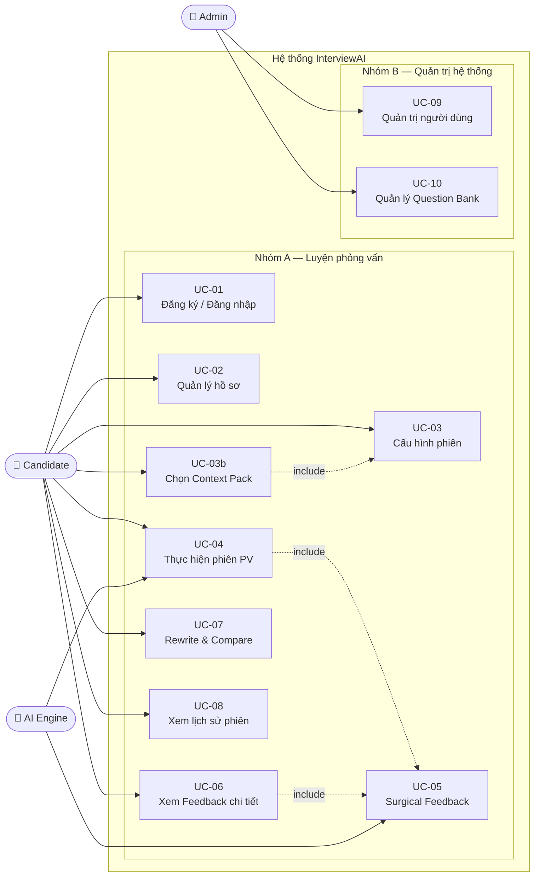
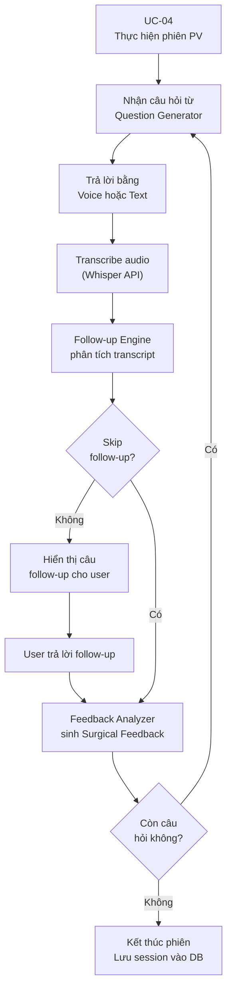
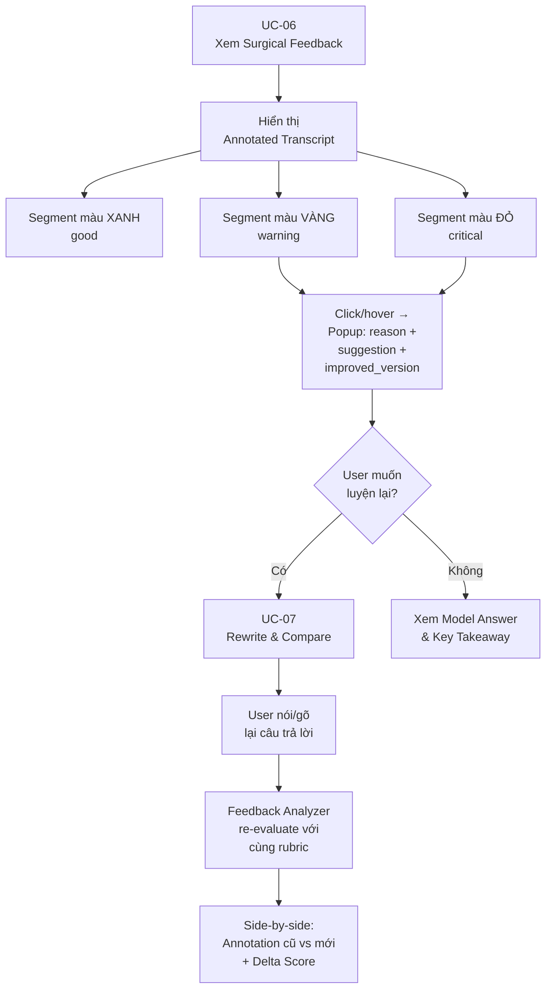
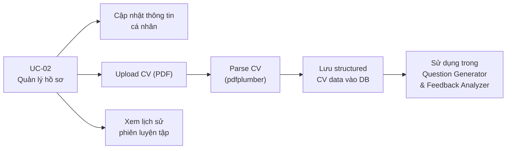
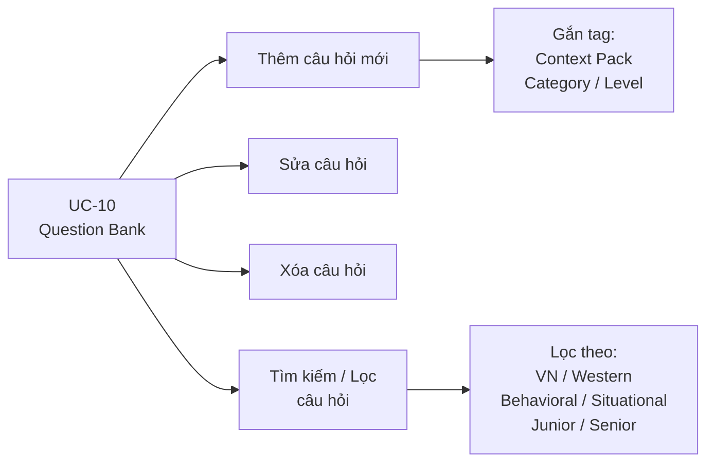

# Software Requirement Specification (SRS)
## AI Interview Coach System — InterviewAI

---

| Thuộc tính | Giá trị |
|---|---|
| **Phiên bản tài liệu** | 1.0 |
| **Ngày soạn** | 21/04/2026 |
| **Trạng thái** | Draft |
| **Tác giả** | \[Họ và tên\] — MSSV: \[MSSV\] |
| **Giảng viên hướng dẫn** | \[Học hàm/học vị + Tên GVHD\] |
| **Đơn vị** | Viện Công nghệ Thông tin và Truyền thông (SOICT), ĐHBKHN |

---

## MỤC LỤC

- [1. Giới thiệu](#1-giới-thiệu)
  - [1.1 Mục đích](#11-mục-đích)
  - [1.2 Phạm vi](#12-phạm-vi)
  - [1.3 Từ điển thuật ngữ](#13-từ-điển-thuật-ngữ)
  - [1.4 Tài liệu tham khảo](#14-tài-liệu-tham-khảo)
  - [1.5 Giả định & Phụ thuộc](#15-giả-định--phụ-thuộc)
- [2. Mô tả tổng quan](#2-mô-tả-tổng-quan)
  - [2.1 Các tác nhân](#21-các-tác-nhân)
  - [2.2 Môi trường vận hành](#22-môi-trường-vận-hành)
  - [2.3 Biểu đồ Use Case tổng quan](#23-biểu-đồ-use-case-tổng-quan)
  - [2.4 Biểu đồ Use Case phân rã](#24-biểu-đồ-use-case-phân-rã)
  - [2.5 Quy trình nghiệp vụ](#25-quy-trình-nghiệp-vụ)
  - [2.6 Công nghệ sử dụng (Tech Stack)](#26-công-nghệ-sử-dụng-tech-stack)
  - [2.7 Các ràng buộc thiết kế](#27-các-ràng-buộc-thiết-kế)

---

# 1. Giới thiệu

## 1.1 Mục đích

Tài liệu này là **Đặc tả Yêu cầu Phần mềm (Software Requirement Specification — SRS)** cho hệ thống **InterviewAI — AI Interview Coach System**, được phát triển trong khuôn khổ Đồ án Tốt nghiệp tại Viện Công nghệ Thông tin và Truyền thông, Đại học Bách khoa Hà Nội.

Mục đích của tài liệu này là:

1. **Định nghĩa rõ ràng** toàn bộ yêu cầu chức năng và phi chức năng của hệ thống, làm cơ sở thống nhất giữa các bên liên quan (sinh viên thực hiện, giảng viên hướng dẫn, hội đồng bảo vệ).
2. **Mô tả kiến trúc tích hợp AI** bao gồm chiến lược prompt, cấu trúc output, và cơ chế xử lý lỗi — những yếu tố đặc thù của một sản phẩm ứng dụng Trí tuệ Nhân tạo tạo sinh (Generative AI).
3. **Làm nền tảng** cho các giai đoạn thiết kế hệ thống (System Design), lập trình (Development), và kiểm thử (Testing & Validation).
4. **Giới hạn phạm vi** một cách tường minh để đảm bảo tính khả thi trong thời gian phát triển ba tháng với một lập trình viên.

Tài liệu được viết theo chuẩn **IEEE 830** có điều chỉnh, với phần bổ sung đặc thù cho hệ thống tích hợp AI (Chương 4.7–4.9 và Chương 5).

**Đối tượng đọc tài liệu:**

| Đối tượng | Mục đích sử dụng |
|---|---|
| Sinh viên thực hiện | Tài liệu hướng dẫn thiết kế và phát triển |
| Giảng viên hướng dẫn | Xem xét và phê duyệt định hướng kỹ thuật |
| Hội đồng bảo vệ | Đánh giá mức độ hoàn chỉnh và tính khả thi |
| Người dùng thử nghiệm | Hiểu phạm vi và kỳ vọng của sản phẩm |

---

## 1.2 Phạm vi

### 1.2.1 Tên sản phẩm

**InterviewAI** — Hệ thống luyện tập phỏng vấn xin việc thông minh ứng dụng Trí tuệ Nhân tạo đa phương thức trên nền Web.

### 1.2.2 Mô tả tóm tắt

InterviewAI là một ứng dụng web cho phép sinh viên và fresher Việt Nam luyện tập phỏng vấn xin việc thông qua ba tính năng cốt lõi được tích hợp chặt chẽ với nhau:

- **Adaptive Follow-up**: AI không hỏi câu hỏi theo danh sách cố định mà đọc transcript câu trả lời của người dùng, xác định một claim hoặc điểm chưa rõ ràng, và sinh ra câu hỏi đào sâu tự nhiên dựa trên chính những gì người dùng vừa nói.
- **Surgical Feedback**: Thay vì đưa ra nhận xét chung chung, hệ thống highlight từng đoạn cụ thể trong transcript, giải thích tại sao đoạn đó có vấn đề và cung cấp phiên bản đã cải thiện.
- **Context Pack**: Rubric chấm điểm thay đổi tùy theo văn hóa công ty mà ứng viên đang ứng tuyển (Việt Nam hoặc Western/International).

### 1.2.3 Phạm vi phiên bản hiện tại (v1.0 — Prototype)

**Trong phạm vi (In Scope):**

| STT | Tính năng | Ghi chú |
|---|---|---|
| 1 | Đăng ký / Đăng nhập bằng Google OAuth | Supabase Auth |
| 2 | Quản lý hồ sơ người dùng, upload CV (PDF) | CV dùng để cá nhân hóa |
| 3 | Cấu hình phiên phỏng vấn từ Job Description | Paste JD thuần văn bản |
| 4 | Chọn Context Pack (VN / Western) | 2 pack cho prototype |
| 5 | Voice input (Whisper API) + Text input | Người dùng chọn một trong hai |
| 6 | Adaptive Follow-up Engine | 1 follow-up/câu hỏi gốc |
| 7 | Surgical Feedback với Annotated Transcript | Highlight 3 màu + popup |
| 8 | Rewrite & Compare | Nói/gõ lại → so sánh trước/sau |
| 9 | Lưu lịch sử phiên và xem lại | Danh sách đơn giản |
| 10 | Quản trị người dùng (Admin) | CRUD cơ bản |
| 11 | Quản lý Question Bank (Admin) | 60 câu seed data |

**Ngoài phạm vi (Out of Scope — không thực hiện trong v1.0):**

| STT | Tính năng | Lý do loại trừ |
|---|---|---|
| 1 | Biểu đồ tiến trình / Analytics dashboard | Không đủ thời gian; ít giá trị với prototype |
| 2 | Pressure Mode (timer, câu hỏi bất ngờ) | Tính năng Phase 2 |
| 3 | Daily Question / Streak / Gamification | Retention feature — không ưu tiên |
| 4 | Context Pack tiếng Nhật | Cần nhiều domain research |
| 5 | Real-time voice streaming | Record-then-process đủ tốt |
| 6 | Mobile App (iOS/Android native) | Responsive web đủ cho prototype |
| 7 | Phỏng vấn kỹ thuật (coding, system design) | Domain khác; cần scope riêng |
| 8 | Tích hợp nền tảng tuyển dụng bên ngoài | Không cần API bên ngoài |
| 9 | Phân nhóm và phân quyền người dùng phức tạp | Quá phức tạp cho solo developer |
| 10 | Video / webcam analysis | Ngoài khả năng kỹ thuật hiện tại |

### 1.2.4 Mục tiêu kinh doanh và đo lường thành công

Prototype được coi là thành công khi đạt đồng thời các tiêu chí sau:

| Tiêu chí | Mục tiêu | Phương pháp đo |
|---|---|---|
| Adoption | ≥ 50 người dùng thử nghiệm thực tế | Đăng ký tài khoản |
| Engagement | ≥ 2 phiên/người dùng trung bình | Session analytics |
| Feedback quality | ≥ 80% người dùng đánh giá feedback là "cụ thể, hữu ích" | Post-session survey |
| Rewrite adoption | ≥ 70% người dùng dùng tính năng Rewrite sau khi xem feedback | Behavioral tracking |
| Latency | Phản hồi AI ≤ 8 giây sau khi người dùng kết thúc câu trả lời | Server-side logging |

---

## 1.3 Từ điển thuật ngữ

| Thuật ngữ | Định nghĩa |
|---|---|
| **Adaptive Follow-up** | Cơ chế AI đọc transcript câu trả lời của người dùng và sinh ra câu hỏi đào sâu dựa trên một claim cụ thể trong câu trả lời đó, thay vì hỏi câu hỏi tiếp theo theo danh sách cố định. |
| **Annotated Transcript** | Bản ghi lời của người dùng (transcript) được đánh dấu màu sắc theo từng đoạn (segment) tương ứng với mức độ chất lượng: xanh (tốt), vàng (cần cải thiện), đỏ (cần sửa ngay). |
| **Claim** | Một phát biểu, con số, hoặc khẳng định cụ thể mà người dùng đưa ra trong câu trả lời, ví dụ: "Tôi đã lead team 5 người" hoặc "Dự án hoàn thành đúng deadline". |
| **Context Pack** | Gói cấu hình bao gồm system prompt template và rubric chấm điểm được thiết kế riêng cho một văn hóa doanh nghiệp cụ thể (ví dụ: Việt Nam hoặc Western/International). |
| **Candidate** | Người dùng cuối của hệ thống — sinh viên, fresher hoặc người đang tìm việc — sử dụng hệ thống để luyện tập phỏng vấn. |
| **Delta Score** | Sự thay đổi về điểm số giữa câu trả lời gốc và câu trả lời sau khi Rewrite, thể hiện mức độ cải thiện hoặc sụt giảm. |
| **Filler Words** | Các từ đệm không có nghĩa xuất hiện trong khi nói, phổ biến trong tiếng Việt là "ừm", "à", "thì", "ý là", "kiểu như". |
| **Follow-up Type** | Phân loại câu hỏi đào sâu gồm 3 loại: `clarify` (làm rõ điểm mơ hồ), `challenge` (thách thức một khẳng định), `expand` (mở rộng sang tình huống khó hơn). |
| **JD (Job Description)** | Bản mô tả công việc do người dùng cung cấp bằng cách paste vào hệ thống. AI sử dụng JD để sinh câu hỏi phù hợp và đánh giá độ tương thích của câu trả lời. |
| **Model Answer** | Câu trả lời mẫu được AI sinh ra dựa trên câu hỏi, JD, Context Pack và CV của người dùng (nếu có), thể hiện cách một ứng viên lý tưởng sẽ trả lời. |
| **Rewrite & Compare** | Tính năng cho phép người dùng nói hoặc gõ lại câu trả lời sau khi xem Surgical Feedback, sau đó so sánh hai phiên bản (trước và sau) với annotation và delta score tương ứng. |
| **Rubric** | Bộ tiêu chí chấm điểm được định nghĩa trong Context Pack, quy định trọng số và tiêu chuẩn đánh giá phù hợp với từng văn hóa doanh nghiệp. |
| **Segment** | Một đoạn văn bản liên tục trong transcript được xác định bởi chỉ số bắt đầu (start_index) và kết thúc (end_index), là đơn vị cơ bản của Surgical Feedback. |
| **Session / Phiên** | Một buổi luyện tập phỏng vấn hoàn chỉnh, bao gồm nhiều câu hỏi, follow-up và feedback tương ứng. |
| **STAR Framework** | Phương pháp trả lời câu hỏi phỏng vấn hành vi (behavioral) theo cấu trúc: Situation (Bối cảnh) → Task (Nhiệm vụ) → Action (Hành động) → Result (Kết quả). |
| **Surgical Feedback** | Phản hồi của AI được áp dụng ở cấp độ từng đoạn (segment) trong transcript, chỉ ra chính xác đoạn nào cần sửa, tại sao, và nên sửa thành gì — khác với feedback tổng quát theo tiêu chí. |
| **Transcript** | Bản ghi lời nói của người dùng được chuyển đổi từ audio (qua Whisper API) hoặc nhập trực tiếp bằng văn bản. |
| **WPM (Words Per Minute)** | Tốc độ nói tính bằng số từ trên phút, là một trong các voice metrics được phân tích từ transcript. |
| **AI Engine** | Tập hợp các module AI của hệ thống bao gồm Question Generator, Follow-up Engine và Feedback Analyzer. |
| **Fallback** | Hành vi dự phòng của hệ thống khi AI gặp lỗi (timeout, schema sai, rate limit), đảm bảo người dùng không nhận thông báo lỗi kỹ thuật thô. |
| **Token** | Đơn vị đo lường văn bản của mô hình ngôn ngữ (LLM). Một token tương đương khoảng 0.75 từ tiếng Anh hoặc 0.5 từ tiếng Việt. |
| **JSON Mode** | Chế độ của OpenAI API đảm bảo output luôn là JSON hợp lệ, được sử dụng cho các prompt có cấu trúc output phức tạp. |

---

## 1.4 Tài liệu tham khảo

| STT | Tài liệu | Nguồn |
|---|---|---|
| [1] | OpenAI API Reference — Chat Completions, Whisper, Embeddings | https://platform.openai.com/docs |
| [2] | Whisper API — Speech-to-Text Documentation | https://platform.openai.com/docs/guides/speech-to-text |
| [3] | OpenAI Structured Outputs Guide | https://platform.openai.com/docs/guides/structured-outputs |
| [4] | LangChain Python Documentation | https://python.langchain.com/docs |
| [5] | Supabase Documentation — Auth, PostgreSQL, Storage | https://supabase.com/docs |
| [6] | Next.js 14 App Router Documentation | https://nextjs.org/docs |
| [7] | FastAPI Documentation | https://fastapi.tiangolo.com |
| [8] | Web Audio API — MDN Web Docs | https://developer.mozilla.org/en-US/docs/Web/API/Web_Audio_API |
| [9] | Abootorabi et al. (2025). *Ask in Any Modality: A Comprehensive Survey on Multimodal Retrieval-Augmented Generation*. ACL 2025 Findings. arXiv:2502.08826 |
| [10] | STAR Interview Method — Amazon Leadership Principles | https://www.amazon.jobs/en/principles |
| [11] | IEEE 830-1998 — Recommended Practice for Software Requirements Specifications | IEEE Standards |
| [12] | Khảo sát nhu cầu luyện tập phỏng vấn sinh viên BKHN (n=\[số người\], 2026) | Nghiên cứu sơ bộ của tác giả |

---

## 1.5 Giả định & Phụ thuộc

### 1.5.1 Giả định

| STT | Giả định | Lý do |
|---|---|---|
| G1 | Người dùng có kết nối internet ổn định (≥ 10 Mbps) | Cần để gọi Whisper API và GPT-4o trong thời gian thực |
| G2 | Người dùng sử dụng trình duyệt Chrome hoặc Firefox phiên bản mới nhất | Web Audio API và MediaRecorder API tương thích tốt nhất trên hai trình duyệt này |
| G3 | Người dùng có microphone hoạt động nếu muốn dùng voice input | Voice input là optional; text input là fallback |
| G4 | Job Description được cung cấp dưới dạng văn bản thuần (plain text), không phải file | Không cần xử lý file parsing cho JD |
| G5 | Người dùng có khả năng đọc và viết tiếng Việt hoặc tiếng Anh ở mức cơ bản | Hệ thống hỗ trợ hai ngôn ngữ, không có dịch thuật tự động |
| G6 | OpenAI API duy trì uptime ≥ 99.5% | Theo SLA của OpenAI Enterprise; là điều kiện cần cho latency target |
| G7 | Chi phí API OpenAI được tác giả chịu trực tiếp trong giai đoạn prototype | Không có cơ chế billing người dùng |
| G8 | Rubric chấm điểm cho Context Pack VN và Western được nghiên cứu và thiết kế dựa trên tài liệu và phỏng vấn chuyên gia nhân sự | Chất lượng rubric ảnh hưởng trực tiếp đến chất lượng feedback |

### 1.5.2 Phụ thuộc bên ngoài

| STT | Phụ thuộc | Tác động nếu thay đổi |
|---|---|---|
| D1 | **OpenAI GPT-4o API** — Question Generator, Follow-up Engine, Feedback Analyzer | Nếu API thay đổi cấu trúc hoặc tăng giá đột ngột, cần đánh giá lại |
| D2 | **OpenAI Whisper API** — Speech-to-Text | Có thể thay thế bằng Whisper self-hosted nếu cần kiểm soát chi phí |
| D3 | **Supabase** — Auth, PostgreSQL, pgvector, Storage | Nếu Supabase thay đổi chính sách, có thể migrate sang self-hosted PostgreSQL |
| D4 | **Cloudflare R2** — Lưu trữ audio recording | Có thể thay thế bằng AWS S3 hoặc Supabase Storage |
| D5 | **Vercel** — Deploy Next.js frontend | Có thể deploy trên bất kỳ Node.js hosting nào |
| D6 | **Railway / Render** — Deploy FastAPI backend | Có thể containerize và deploy trên VPS |

### 1.5.3 Ràng buộc về thời gian và nguồn lực

- **Thời gian phát triển:** 3 tháng (tháng 4 → tháng 6/2026), deadline bảo vệ trước tháng 7/2026.
- **Nguồn lực:** 01 lập trình viên duy nhất — toàn bộ frontend, backend, AI integration, testing và deployment.
- **Ngân sách API:** Chi phí ước tính ~$0.15–0.25/phiên (5 câu + follow-up với GPT-4o). Cần kiểm soát rate limit và token budget chặt chẽ.

---

# 2. Mô tả tổng quan

## 2.1 Các tác nhân

Hệ thống InterviewAI bao gồm ba tác nhân chính tham gia vào các luồng nghiệp vụ khác nhau.

### 2.1.1 Người dùng (Candidate)

**Mô tả:** Đối tượng người dùng chính của hệ thống. Đây là những cá nhân đang chuẩn bị cho quá trình tìm kiếm việc làm và muốn cải thiện kỹ năng phỏng vấn thông qua luyện tập có phản hồi từ AI.

**Đặc điểm:**
- Sinh viên năm 3–4 các trường đại học kỹ thuật và kinh tế tại Việt Nam.
- Fresher có 0–2 năm kinh nghiệm đi làm, đang tìm kiếm công việc mới.
- Người chuyển ngành muốn chuẩn bị cho phỏng vấn trong lĩnh vực mới.

**Quyền hạn trong hệ thống:**
- Tạo và quản lý hồ sơ luyện tập cá nhân.
- Khởi tạo và thực hiện phiên phỏng vấn AI.
- Xem, tương tác với Surgical Feedback và thực hiện Rewrite & Compare.
- Xem lịch sử toàn bộ các phiên đã thực hiện.

### 2.1.2 Quản trị viên (Admin)

**Mô tả:** Người quản lý hệ thống, chịu trách nhiệm duy trì chất lượng dữ liệu và giám sát hoạt động của người dùng. Trong giai đoạn prototype, vai trò Admin thường do tác giả đồng thời đảm nhiệm.

**Quyền hạn trong hệ thống:**
- Xem và quản lý danh sách người dùng đăng ký.
- CRUD (Tạo, Đọc, Cập nhật, Xóa) câu hỏi trong Question Bank.
- Gắn tag câu hỏi theo vị trí công việc, level và Context Pack.
- Xem số liệu sử dụng cơ bản của hệ thống.

### 2.1.3 Hệ thống AI (AI Engine)

**Mô tả:** AI Engine không phải là một người dùng mà là một tác nhân hệ thống tự động, được kích hoạt bởi các hành động của Candidate. AI Engine giao tiếp với OpenAI API và trả kết quả về cho hệ thống backend để hiển thị cho người dùng.

AI Engine bao gồm **ba module chức năng độc lập**, mỗi module có prompt riêng, input/output schema riêng và cơ chế fallback riêng:

---

#### Module 1: Question Generator

| Thuộc tính | Giá trị |
|---|---|
| **Kích hoạt bởi** | UC-03: Cấu hình phiên phỏng vấn |
| **Mô hình AI** | GPT-4o (JSON mode) |
| **Input** | Job Description (plain text) + Context Pack ID + số câu yêu cầu (3–7) + CV người dùng (optional) |
| **Output** | Danh sách câu hỏi phỏng vấn, mỗi câu có category (behavioral/situational/motivational) và difficulty level |
| **Đặc điểm** | Câu hỏi được điều chỉnh theo văn hóa của Context Pack. Với VN Pack: câu hỏi về teamwork, tính kiên nhẫn, tôn trọng cấp trên. Với Western Pack: câu hỏi nhấn vào impact, ownership, data-driven. |

#### Module 2: Follow-up Engine

| Thuộc tính | Giá trị |
|---|---|
| **Kích hoạt bởi** | UC-04: Sau mỗi câu trả lời của Candidate |
| **Mô hình AI** | GPT-4o (JSON mode) |
| **Input** | Transcript câu trả lời + Câu hỏi gốc + JD + Context Pack rubric |
| **Output** | JSON chứa follow_up_type, target_phrase, follow_up_question (hoặc skip_follow_up: true) |
| **Đặc điểm** | Phải tham chiếu ít nhất 1 phrase cụ thể từ transcript của người dùng. Không được sinh câu hỏi generic. Nếu câu trả lời đã đầy đủ và rõ ràng, trả về skip_follow_up: true. |

#### Module 3: Feedback Analyzer

| Thuộc tính | Giá trị |
|---|---|
| **Kích hoạt bởi** | UC-05: Sau khi Candidate hoàn thành câu trả lời (và follow-up nếu có) |
| **Mô hình AI** | GPT-4o (JSON mode) |
| **Input** | Transcript đầy đủ (câu gốc + follow-up) + Câu hỏi + JD + Context Pack rubric + CV (optional) |
| **Output** | Surgical Feedback JSON: mảng segments với annotation (level, reason, suggestion, improved_version), overall_score, model_answer, key_takeaway |
| **Đặc điểm** | Đây là module phức tạp nhất. Mỗi segment phải có improved_version cụ thể, không phải nhận xét chung chung. Rubric chấm điểm thay đổi hoàn toàn theo Context Pack. |

---

## 2.2 Môi trường vận hành

### 2.2.1 Môi trường triển khai

```
┌─────────────────────────────────────────────────────────────────┐
│                        INTERNET                                  │
└─────────────┬──────────────────────────────────┬────────────────┘
              │                                  │
   ┌──────────▼──────────┐           ┌───────────▼────────────┐
   │   Frontend (Vercel)  │           │  Backend AI (Railway)  │
   │   Next.js 14 PWA     │◄─────────►│  FastAPI (Python)      │
   │   Port: 443 (HTTPS)  │           │  Port: 8000 (internal) │
   └─────────────────────┘           └───────────┬────────────┘
                                                  │
              ┌───────────────────────────────────┼───────────────┐
              │                                   │               │
   ┌──────────▼──────────┐           ┌────────────▼────┐  ┌──────▼──────┐
   │   Supabase Cloud     │           │  OpenAI API      │  │ Cloudflare  │
   │   - PostgreSQL       │           │  - GPT-4o        │  │ R2 Storage  │
   │   - Auth (JWT)       │           │  - Whisper-1     │  │ (Audio)     │
   │   - pgvector         │           │  - Embeddings    │  └─────────────┘
   └─────────────────────┘           └─────────────────┘
```

### 2.2.2 Yêu cầu phía máy khách (Client-side)

| Yêu cầu | Tối thiểu | Khuyến nghị |
|---|---|---|
| Trình duyệt | Chrome 90+, Firefox 88+, Safari 14+ | Chrome 120+ |
| Kết nối internet | 5 Mbps | 10 Mbps trở lên |
| Microphone | Bắt buộc nếu dùng voice | Microphone tích hợp |
| RAM | 4 GB | 8 GB |
| JavaScript | Phải bật | — |

### 2.2.3 Yêu cầu phía máy chủ (Server-side)

| Thành phần | Cấu hình tối thiểu | Ghi chú |
|---|---|---|
| Next.js (Vercel) | Serverless Functions | Tự động scale |
| FastAPI (Railway) | 512 MB RAM, 0.5 vCPU | Scale khi cần |
| Supabase | Free tier (500 MB DB) | Đủ cho prototype |
| Cloudflare R2 | 10 GB storage | $0.015/GB/tháng sau 10 GB |

---

## 2.3 Biểu đồ Use Case tổng quan



---

## 2.4 Biểu đồ Use Case phân rã

### 2.4.1 Phân rã: Thực hiện phiên phỏng vấn AI (UC-04)



### 2.4.2 Phân rã: Xem Surgical Feedback & Rewrite (UC-06 + UC-07)



### 2.4.3 Phân rã: Quản lý hồ sơ luyện tập (UC-02)



### 2.4.4 Phân rã: Quản lý Question Bank (UC-10)



---

## 2.5 Quy trình nghiệp vụ

### 2.5.1 Quy trình sử dụng phần mềm tổng quan

```
Lần đầu sử dụng:
─────────────────────────────────────────────────────────────────
[1] Đăng ký / Đăng nhập bằng Google
    │
[2] Tạo hồ sơ: chọn vị trí ứng tuyển, ngôn ngữ phỏng vấn
    │ (optional) Upload CV PDF
    │
[3] Tạo phiên mới:
    ├── Paste Job Description
    ├── Chọn số câu (3–7)
    └── Chọn Context Pack: VN / Western
    │
[4] Thực hiện phiên phỏng vấn AI
    └── (Xem chi tiết tại 2.5.2)
    │
[5] Xem Surgical Feedback
    └── (Xem chi tiết tại 2.5.3)
    │
[6] (Optional) Rewrite & Compare
    │
[7] Kết thúc — Phiên được lưu vào lịch sử

Các lần sau: Bỏ qua bước [1], có thể bỏ qua [2] nếu hồ sơ đã hoàn chỉnh
```

### 2.5.2 Quy trình thực hiện một phiên phỏng vấn AI

```
Điều kiện vào: Candidate đã cấu hình phiên và chọn Context Pack

┌─────────────────────────────────────────────────────────────────┐
│ BƯỚC 1: AI hiển thị câu hỏi                                     │
│ Question Generator sinh câu hỏi phù hợp với JD + Context Pack  │
│ Hiển thị dưới dạng text; đọc to qua Web Speech API (optional)  │
└────────────────────────────┬────────────────────────────────────┘
                             │
┌────────────────────────────▼────────────────────────────────────┐
│ BƯỚC 2: Candidate trả lời                                        │
│ Option A: Nhấn nút 🎤 → Ghi âm → Nhấn ■ Dừng                   │
│           Audio → Whisper API → Transcript                       │
│ Option B: Gõ câu trả lời trực tiếp vào text box                │
│ Không có giới hạn thời gian                                      │
└────────────────────────────┬────────────────────────────────────┘
                             │
┌────────────────────────────▼────────────────────────────────────┐
│ BƯỚC 3: Follow-up Engine phân tích [AI-critical]                 │
│ Input: transcript + câu hỏi gốc + JD + rubric                   │
│ Kết quả A (skip_follow_up: false):                               │
│   → Hiển thị câu follow-up cho Candidate                        │
│   → Candidate trả lời follow-up (voice hoặc text)               │
│ Kết quả B (skip_follow_up: true):                                │
│   → Bỏ qua, chuyển thẳng sang Bước 4                           │
└────────────────────────────┬────────────────────────────────────┘
                             │
┌────────────────────────────▼────────────────────────────────────┐
│ BƯỚC 4: Feedback Analyzer sinh Surgical Feedback [AI-critical]  │
│ Input: toàn bộ transcript (câu gốc + follow-up) + JD + rubric   │
│ Output: segments[], overall_score, model_answer, key_takeaway   │
│ Hiển thị loading indicator trong lúc xử lý (~3–8 giây)         │
└────────────────────────────┬────────────────────────────────────┘
                             │
┌────────────────────────────▼────────────────────────────────────┐
│ BƯỚC 5: Kiểm tra còn câu hỏi không                              │
│ Nếu còn: Quay lại Bước 1 với câu hỏi tiếp theo                 │
│ Nếu hết:  Lưu toàn bộ session vào DB → Hiển thị màn hình kết   │
│           thúc với tổng điểm và nút "Xem Feedback chi tiết"    │
└─────────────────────────────────────────────────────────────────┘

Điều kiện ra: Session được lưu với đầy đủ transcript, annotation và metadata
```

### 2.5.3 Quy trình xem Surgical Feedback và Rewrite & Compare

```
Điều kiện vào: Session đã hoàn thành, Surgical Feedback đã được sinh

┌─────────────────────────────────────────────────────────────────┐
│ BƯỚC 1: Hiển thị Annotated Transcript                           │
│ • Transcript hiện ra với 3 màu:                                  │
│   🟢 XANH (good): Đoạn tốt, không cần sửa                      │
│   🟡 VÀNG (warning): Cần cải thiện                              │
│   🔴 ĐỎ (critical): Cần sửa ngay                               │
│ • Điểm tổng (overall_score) hiển thị ở đầu trang               │
│ • Key Takeaway nổi bật dưới điểm                                │
└────────────────────────────┬────────────────────────────────────┘
                             │
┌────────────────────────────▼────────────────────────────────────┐
│ BƯỚC 2: Candidate tương tác với đoạn annotated                  │
│ Click/hover vào segment màu VÀNG hoặc ĐỎ                        │
│ → Pop-up hiển thị 3 nội dung:                                   │
│   (1) Reason: Tại sao đoạn này có vấn đề                       │
│   (2) Suggestion: Hướng dẫn cải thiện                          │
│   (3) Improved Version: Phiên bản đã viết lại của đoạn đó      │
└────────────────────────────┬────────────────────────────────────┘
                             │
┌────────────────────────────▼────────────────────────────────────┐
│ BƯỚC 3: Xem Model Answer                                         │
│ Phần cuối trang hiển thị Model Answer — câu trả lời mẫu hoàn   │
│ chỉnh dựa trên JD, Context Pack và CV của người dùng           │
└────────────────────────────┬────────────────────────────────────┘
                             │
┌────────────────────────────▼────────────────────────────────────┐
│ BƯỚC 4 (Optional): Rewrite & Compare                            │
│ Candidate nhấn nút "Luyện lại câu này"                         │
│ → Giao diện chuyển sang màn hình Rewrite                        │
│ → Candidate nói hoặc gõ lại câu trả lời                        │
│ → Feedback Analyzer re-evaluate với cùng rubric                 │
│ → Hiển thị side-by-side:                                        │
│   LEFT: Transcript cũ với annotation cũ                         │
│   RIGHT: Transcript mới với annotation mới                      │
│   CENTER: Delta score (↑+X hoặc ↓-X điểm)                     │
│ Candidate có thể Rewrite nhiều lần                              │
└─────────────────────────────────────────────────────────────────┘

Điều kiện ra: Candidate đã hiểu điểm cần cải thiện; tùy chọn đã Rewrite ít nhất 1 lần
```

---

## 2.6 Công nghệ sử dụng (Tech Stack)

### 2.6.1 Tổng quan kiến trúc

Hệ thống được phân tách thành hai service backend độc lập để tối ưu hóa theo đặc thù công việc: **NestJS** xử lý business logic và auth (strengths của TypeScript ecosystem), **FastAPI** xử lý AI pipeline (strengths của Python AI/ML ecosystem).

```
Frontend                    Backend                      External Services
─────────                   ───────                      ─────────────────
Next.js 14          ◄──►   NestJS (Auth + CRUD)  ◄──►  Supabase
(React, Tailwind)   ◄──►   FastAPI (AI Pipeline) ◄──►  OpenAI API (GPT-4o, Whisper)
                                    │               ◄──►  Cloudflare R2 (Audio)
                             Bull + Redis
                           (Job Queue — async)
```

### 2.6.2 Bảng Tech Stack chi tiết

| Layer | Công nghệ | Phiên bản | Mục đích | Tính linh hoạt |
|---|---|---|---|---|
| **Frontend** | Next.js | 14.x | Web app chính, SSR, PWA | Cố định |
| | Tailwind CSS | 3.x | UI styling | Có thể thay bằng CSS Modules |
| | Recharts | 2.x | Biểu đồ nhỏ (nếu cần) | Thay được bằng Chart.js |
| | React Query | 5.x | Data fetching và caching | Cố định |
| | Web Audio API | Native | Ghi âm từ microphone | Browser API — không thay |
| | Web Speech API | Native | TTS đọc câu hỏi (optional) | Browser API — không thay |
| **Backend Auth** | NestJS | 10.x | REST API: Auth, User, Session | Có thể thay bằng Express |
| | TypeScript | 5.x | Type safety | Cố định |
| **Backend AI** | FastAPI | 0.110.x | AI Pipeline: Whisper, GPT-4o | Cố định (Python ecosystem) |
| | Python | 3.11+ | Runtime | Cố định |
| | LangChain | 0.2.x | LLM orchestration | Có thể thay bằng gọi API trực tiếp |
| | pdfplumber | 0.11.x | Parse CV PDF | Thay được bằng PyMuPDF |
| **Queue** | Bull | 4.x | Job queue cho async AI tasks | Có thể thay bằng Celery |
| | Redis | 7.x | Queue backend | Cố định khi dùng Bull |
| **Database** | PostgreSQL | 15.x | Relational database chính | Qua Supabase |
| | Supabase | Latest | Auth + DB + Storage + pgvector | Có thể self-host |
| | pgvector | 0.7.x | Vector search cho JD embedding | Extension của PostgreSQL |
| **Storage** | Cloudflare R2 | — | Lưu audio recording người dùng | Thay được bằng S3 |
| **AI Provider** | OpenAI GPT-4o | gpt-4o | Question Gen, Follow-up, Feedback | Thay được bằng Gemini Pro |
| | OpenAI Whisper | whisper-1 | Speech-to-Text | Thay được bằng Deepgram |
| | text-embedding-3-small | — | JD embedding (nếu dùng RAG) | Optional |
| **Deploy** | Vercel | — | Frontend hosting | Thay được bằng Netlify |
| | Railway | — | Backend hosting | Thay được bằng Render, VPS |
| | Docker | 24.x | Containerization | Cố định cho production |

> **Lưu ý về tính linh hoạt:** Các công nghệ đánh dấu "Cố định" là những lựa chọn kiến trúc nền tảng. Các công nghệ đánh dấu "Thay được" có thể được thay thế nếu gặp vấn đề về chi phí, tính sẵn có hoặc yêu cầu kỹ thuật thay đổi trong quá trình phát triển, **mà không ảnh hưởng đến kiến trúc tổng thể**.

### 2.6.3 Lý do lựa chọn các công nghệ chính

| Công nghệ | Lý do lựa chọn |
|---|---|
| **GPT-4o** | JSON mode đảm bảo output schema chuẩn; chất lượng feedback tiếng Việt vượt trội; stable API với uptime cao. |
| **Whisper API** | Độ chính xác cao nhất cho tiếng Việt trong các STT model hiện có; API đơn giản; latency ~1–2 giây. |
| **FastAPI (Python)** | Python ecosystem tích hợp tốt nhất với LangChain, pdfplumber, và các AI library. Tốc độ phát triển nhanh. |
| **Supabase** | Cung cấp đồng thời Auth, PostgreSQL, pgvector và Storage — giảm số service cần quản lý. Free tier đủ cho prototype. |
| **Next.js 14** | App Router hỗ trợ SSR tốt cho SEO; Web Audio API tích hợp tự nhiên trong browser; ecosystem React phong phú. |

---

## 2.7 Các ràng buộc thiết kế

### 2.7.1 Ràng buộc hiệu năng

| STT | Ràng buộc | Giá trị mục tiêu | Ghi chú |
|---|---|---|---|
| R1 | Latency AI response (Surgical Feedback) | ≤ 8 giây | Từ khi user kết thúc câu trả lời đến khi annotation hiển thị |
| R2 | Latency AI response (Follow-up Engine) | ≤ 5 giây | Cần nhanh hơn để duy trì flow |
| R3 | Latency Whisper transcription | ≤ 3 giây | Cho audio ≤ 2 phút |
| R4 | Latency non-AI actions | ≤ 200 ms | Load trang, navigation, CRUD |
| R5 | Concurrent users (prototype) | ≥ 50 đồng thời | Đủ cho giai đoạn user testing |

### 2.7.2 Ràng buộc token và chi phí AI

| STT | Ràng buộc | Giá trị | Lý do |
|---|---|---|---|
| R6 | Token input tối đa — Surgical Feedback | 2,000 tokens | Kiểm soát chi phí; transcript ~500 tokens + JD ~800 tokens + rubric ~500 tokens |
| R7 | Token output tối đa — Surgical Feedback | 1,500 tokens | Đủ cho ~5–8 segment annotations chi tiết |
| R8 | Token tổng — Follow-up Engine | 1,000 tokens (in+out) | Tác vụ đơn giản, không cần nhiều token |
| R9 | Chi phí ước tính mỗi phiên (5 câu) | $0.15–0.30 | Bao gồm cả follow-up và re-evaluation |
| R10 | Rate limit mỗi người dùng | 10 phiên/ngày | Ngăn lạm dụng trong giai đoạn prototype |

### 2.7.3 Ràng buộc audio và media

| STT | Ràng buộc | Giá trị | Ghi chú |
|---|---|---|---|
| R11 | Định dạng audio được chấp nhận | WebM, WAV, MP4 | WebM là output mặc định của MediaRecorder trên Chrome |
| R12 | Thời lượng tối đa mỗi câu trả lời (voice) | 5 phút | Whisper API giới hạn 25 MB/request |
| R13 | Kích thước file audio tối đa | 25 MB | Giới hạn của Whisper API |
| R14 | Thời gian lưu audio trên R2 | 30 ngày | Sau đó tự động xóa; transcript vẫn được giữ |

### 2.7.4 Ràng buộc bảo mật và quyền riêng tư

| STT | Ràng buộc | Mô tả |
|---|---|---|
| R15 | Authentication | Tất cả API endpoints yêu cầu JWT token hợp lệ; token hết hạn sau 7 ngày |
| R16 | Data isolation | Người dùng chỉ truy cập được dữ liệu của chính mình; Row-Level Security (RLS) trên Supabase |
| R17 | Audio privacy | Audio recording không được chia sẻ với bên thứ ba ngoài Whisper API và Cloudflare R2 |
| R18 | API key security | OpenAI API key không bao giờ được expose ra phía client; chỉ tồn tại trên server-side |
| R19 | HTTPS | Toàn bộ giao tiếp phải qua HTTPS; không cho phép HTTP |

### 2.7.5 Ràng buộc về chất lượng AI output

| STT | Ràng buộc | Mô tả |
|---|---|---|
| R20 | Follow-up phải contextual | Câu follow-up phải chứa ít nhất 1 từ/phrase cụ thể từ transcript của người dùng. Output không đáp ứng tiêu chí này được coi là lỗi chất lượng. |
| R21 | Surgical Feedback phải actionable | Mỗi segment có level "warning" hoặc "critical" bắt buộc phải có improved_version không rỗng. |
| R22 | Schema validation bắt buộc | Backend phải validate JSON output của AI trước khi trả về client. Output không đúng schema → kích hoạt fallback. |
| R23 | Ngôn ngữ nhất quán | AI phải trả lời bằng cùng ngôn ngữ với câu trả lời của người dùng (tiếng Việt → feedback tiếng Việt, tiếng Anh → feedback tiếng Anh). |

---

*Hết Chương 1 và Chương 2*

---

> **Ghi chú:** Chương 3 (Đặc tả Use Case), Chương 4 (Yêu cầu phi chức năng), Chương 5 (Đặc tả tích hợp AI) và Phụ lục sẽ được trình bày trong các phần tiếp theo của tài liệu SRS.
