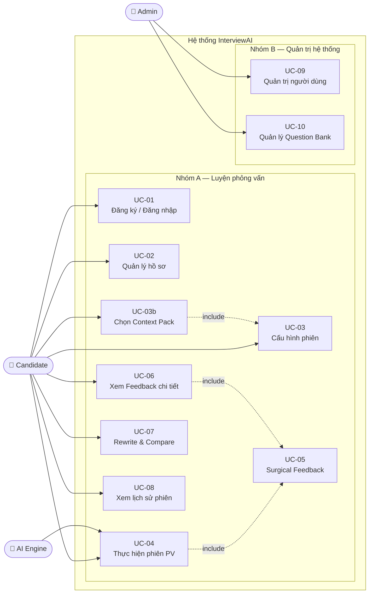
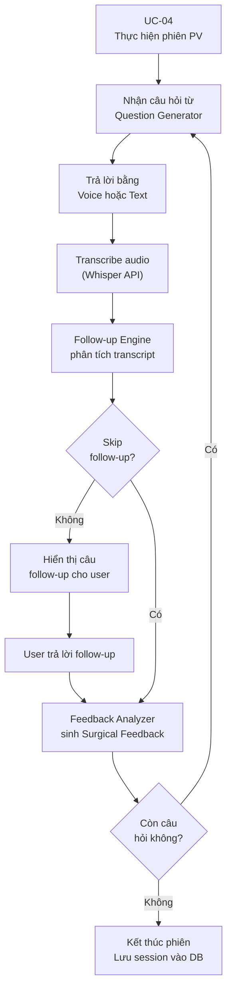
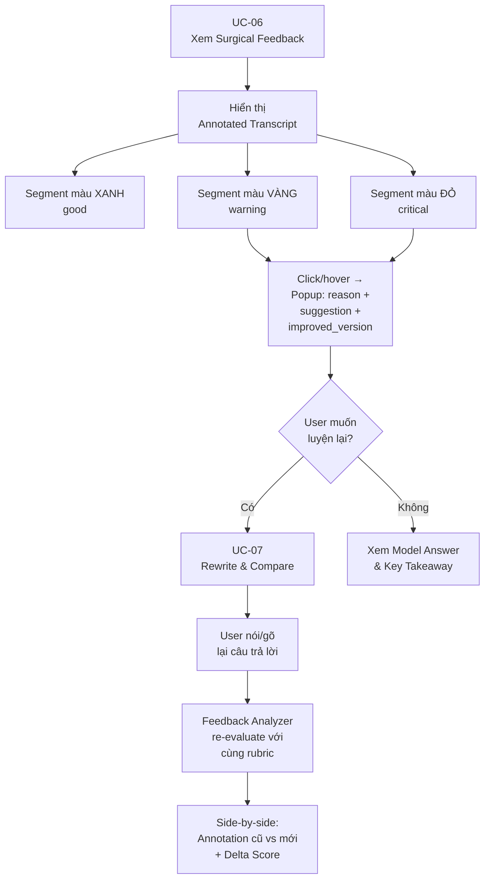
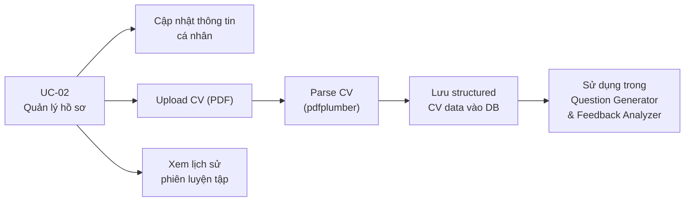
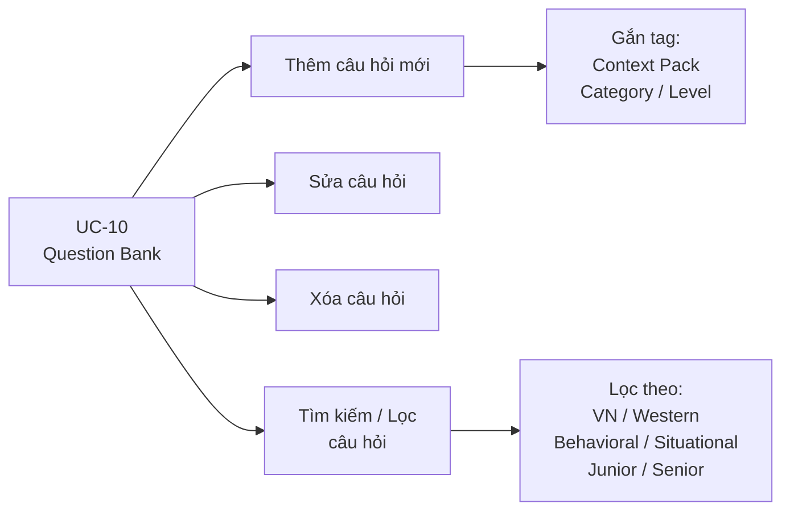
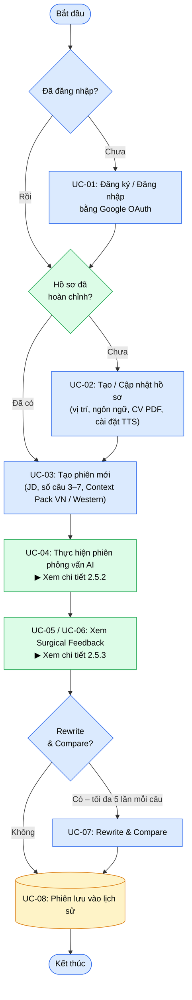
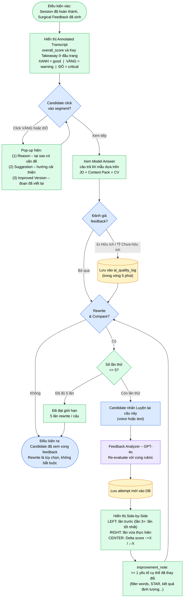

# Software Requirement Specification (SRS)
## AI Interview Coach System — InterviewAI

---

| Thuộc tính | Giá trị |
|---|---|
| **Phiên bản tài liệu** | 1.5 |
| **Ngày soạn** | 05/05/2026 |
| **Trạng thái** | Draft (Synchronized with Discovery Document v0.1) |
| **Tác giả** | Lê Thành An — MSSV: 20235631 |
| **Giảng viên hướng dẫn** | Tiến sĩ Cao Tuấn Dũng |
| **Đơn vị** | Viện Công nghệ Thông tin và Truyền thông (SOICT), ĐHBKHN |

---

## LỊCH SỬ PHIÊN BẢN

| Phiên bản | Ngày | Mô tả |
|---|---|---|
| 1.0 | 21/04/2026 | Tài liệu gốc tách theo từng chương. |
| 1.1 | 23/04/2026 | Bản hợp nhất đầy đủ, đồng bộ thuật ngữ và các ràng buộc liên chương. |
| 1.2 | 02/05/2026 | Tách nội dung thiết kế kỹ thuật (tech stack, prompt engineering, schema AI, phân tích chi phí) sang SAD v1.0. SRS tập trung thuần vào yêu cầu. |
| 1.3 | 03/05/2026 | Khắc phục 5 lỗi nghiêm trọng: (1) bổ sung bước 7 còn thiếu trong UC-05 Main Flow; (2) đồng bộ ngưỡng tối thiểu JD từ 50 lên 100 ký tự giữa UC-03 E-03-1 và AS-04; (3) làm rõ thứ tự bắt buộc moderation-trước-lưu-transcript trong R-05 để giải quyết mâu thuẫn với AS-02; (4) tách UC-09 thành row riêng trong Traceability Matrix; (5) bổ sung đầy đủ nhóm NFR AS, Q, OA vào Traceability Matrix. |
| 1.4 | 03/05/2026 | Khắc phục 16 lỗi trung bình: bổ sung thuật ngữ Interview Type và Job Title vào Glossary; đồng bộ G1 với 2.2.2 (5 Mbps); làm rõ cơ chế gán Admin role; xóa quan hệ thừa AIEngine→UC-05 trong diagram; làm rõ bước [5] quy trình 2.5.1; thêm cross-reference R6-R10 → Mục 4.9; bổ sung AF-01-C (Logout), AF-02-C (xóa tài khoản), AF-05-A/B (UC-05), AF-06-C (thumbs up/down), AF-07-A/B rõ logic cột so sánh; thêm TTS preference vào UC-02; đặc tả job_title extraction trong UC-03; sửa AC-02-1 cho fresher; sửa AC-07-7 đo lường được; thêm AC-03-5, AC-07-8; bổ sung pagination UC-08; làm rõ cơ chế detect interrupted session; đồng bộ Whisper timeout E-04-3 với P-04 (10s); xử lý câu skip trong overall_score; làm rõ postcondition UC-06; giải quyết mâu thuẫn U-11 vs AF-07-B. |
| 1.5 | 05/05/2026 | Đồng bộ với Discovery Document v0.1: bổ sung bối cảnh thị trường và motivation vào §1.1–1.2; cập nhật metrics thành công theo DD §11.1 (thêm activation rate, completion rate, return rate, thumbs up rate; đồng bộ Rewrite adoption ≥30%); thêm §1.2.5 Pivot Criteria từ DD §11.2; thêm §2.8 Design Principles từ DD §9.4; bổ sung giả định G9–G11 từ DD §10.1; đồng bộ target user 0–12 tháng; mở rộng Out of Scope từ DD §9.5; thêm tài liệu tham khảo DD; thêm bảng Insight Traceability vào §5. |

---

## MỤC LỤC

- [1. Giới thiệu](#1-giới-thiệu)
  - [1.1 Mục đích](#11-mục-đích)
  - [1.2 Phạm vi](#12-phạm-vi)
    - [1.2.5 Pivot Criteria](#125-pivot-criteria)
  - [1.3 Từ điển thuật ngữ](#13-từ-điển-thuật-ngữ)
  - [1.4 Tài liệu tham khảo](#14-tài-liệu-tham-khảo)
  - [1.5 Giả định & Phụ thuộc](#15-giả-định--phụ-thuộc)
- [2. Mô tả tổng quan](#2-mô-tả-tổng-quan)
  - [2.1 Các tác nhân](#21-các-tác-nhân)
  - [2.2 Môi trường vận hành](#22-môi-trường-vận-hành)
  - [2.3 Biểu đồ Use Case tổng quan](#23-biểu-đồ-use-case-tổng-quan)
  - [2.4 Biểu đồ Use Case phân rã](#24-biểu-đồ-use-case-phân-rã)
  - [2.5 Quy trình nghiệp vụ](#25-quy-trình-nghiệp-vụ)
  - [2.6 Ràng buộc công nghệ](#26-ràng-buộc-công-nghệ)
  - [2.7 Các ràng buộc thiết kế](#27-các-ràng-buộc-thiết-kế)
  - [2.8 Nguyên tắc thiết kế sản phẩm (Design Principles)](#28-nguyên-tắc-thiết-kế-sản-phẩm-design-principles)
- [3. Đặc tả Use Case](#3-đặc-tả-use-case)
- [4. Yêu cầu phi chức năng](#4-yêu-cầu-phi-chức-năng)
- [5. Ma trận truy vết yêu cầu (Traceability Matrix)](#5-ma-trận-truy-vết-yêu-cầu-traceability-matrix)
  - [5.2 Ma trận truy vết: Discovery Insight → SRS Requirement](#52-ma-trận-truy-vết-discovery-insight--srs-requirement)

---

# 1. Giới thiệu

## 1.1 Mục đích

Tài liệu này là **Đặc tả Yêu cầu Phần mềm (Software Requirement Specification — SRS)** cho hệ thống **InterviewAI — AI Interview Coach System**, được phát triển trong khuôn khổ Đồ án Tốt nghiệp tại Viện Công nghệ Thông tin và Truyền thông, Đại học Bách khoa Hà Nội.

Mục đích của tài liệu này là:

1. **Định nghĩa rõ ràng** toàn bộ yêu cầu chức năng và phi chức năng của hệ thống, làm cơ sở thống nhất giữa các bên liên quan (sinh viên thực hiện, giảng viên hướng dẫn, hội đồng bảo vệ).
2. **Xác định các ràng buộc hành vi của AI Engine** — những gì hệ thống AI phải đảm bảo (tính contextual của follow-up, actionability của feedback, nhất quán ngôn ngữ) mà không đi vào chi tiết cài đặt.
3. **Làm nền tảng** cho các giai đoạn thiết kế hệ thống (System Design), lập trình (Development), và kiểm thử (Testing & Validation).
4. **Giới hạn phạm vi** một cách tường minh để đảm bảo tính khả thi trong thời gian phát triển ba tháng với một lập trình viên.

Tài liệu được viết theo chuẩn **IEEE 830** có điều chỉnh. Các chi tiết kỹ thuật triển khai AI (prompt engineering, response schema, token budget, retry strategy) được tách sang **Software Architecture Document — SAD v1.0**.

Tài liệu SRS này được xây dựng dựa trên kết quả của **[Discovery Document v0.1](../Discovery_Docs/Discovery_Document.md)** (05/2026) — tài liệu tổng hợp nghiên cứu người dùng (secondary research), phân tích thị trường và 5 đối thủ quốc tế, cùng định nghĩa vấn đề. Bối cảnh chính: mỗi năm có ~50.000–57.000 sinh viên CNTT tốt nghiệp tại Việt Nam nhưng chỉ ~30% sẵn sàng làm việc ngay (VINASA); 100% tools luyện phỏng vấn quốc tế chỉ hỗ trợ tiếng Anh với pricing $25–$150/tháng; chi phí AI đã giảm 200× tạo timing window để xây sản phẩm miễn phí cho sinh viên VN. Các quyết định về scope, personas, metrics thành công và design principles trong SRS đều có nguồn gốc từ Discovery Document và được tham chiếu xuyên suốt.

**Đối tượng đọc tài liệu:**

| Đối tượng | Mục đích sử dụng |
|---|---|
| Sinh viên thực hiện | Tài liệu hướng dẫn thiết kế và phát triển |
| Giảng viên hướng dẫn | Xem xét và phê duyệt định hướng kỹ thuật |
| Hội đồng bảo vệ | Đánh giá mức độ hoàn chỉnh và tính khả thi |
| Người dùng thử nghiệm | Hiểu phạm vi và kỳ vọng của sản phẩm |

---

## 1.2 Phạm vi

### 1.2.1 Tên sản phẩm

**InterviewAI** — Hệ thống luyện tập phỏng vấn xin việc thông minh ứng dụng Trí tuệ Nhân tạo đa phương thức trên nền Web.

### 1.2.2 Mô tả tóm tắt

InterviewAI là một ứng dụng web cho phép sinh viên năm cuối và fresher CNTT Việt Nam (0–12 tháng kinh nghiệm) luyện tập phỏng vấn xin việc thông qua ba tính năng cốt lõi. Sản phẩm nhắm vào khoảng trống thị trường đã được xác định qua Discovery Document: 0/5 đối thủ quốc tế hỗ trợ tiếng Việt, 100% rubric đánh giá theo Western culture, pricing $25–$150/tháng vượt xa khả năng sinh viên VN *(xem DD §3.2.3 Gap Analysis)*. Ba tính năng cốt lõi được tích hợp chặt chẽ:

- **Adaptive Follow-up**: AI không hỏi câu hỏi theo danh sách cố định mà đọc transcript câu trả lời của người dùng, xác định một claim hoặc điểm chưa rõ ràng, và sinh ra câu hỏi đào sâu tự nhiên dựa trên chính những gì người dùng vừa nói.
- **Surgical Feedback**: Thay vì đưa ra nhận xét chung chung, hệ thống highlight từng đoạn cụ thể trong transcript, giải thích tại sao đoạn đó có vấn đề và cung cấp phiên bản đã cải thiện.
- **Context Pack**: Rubric chấm điểm thay đổi tùy theo văn hóa công ty mà ứng viên đang ứng tuyển (Việt Nam hoặc Western/International).

### 1.2.3 Phạm vi phiên bản hiện tại (v1.0 — Prototype)

**Trong phạm vi (In Scope):**

| STT | Tính năng | Ghi chú |
|---|---|---|
| 1 | Đăng ký / Đăng nhập bằng Google OAuth | Supabase Auth |
| 2 | Quản lý hồ sơ người dùng, upload CV (PDF) | CV dùng để cá nhân hóa |
| 3 | Cấu hình phiên phỏng vấn từ Job Description | Paste JD thuần văn bản |
| 4 | Chọn Context Pack (VN / Western) | 2 pack cho prototype |
| 5 | Voice input (Whisper API) + Text input | Người dùng chọn một trong hai |
| 6 | Adaptive Follow-up Engine | 1 follow-up/câu hỏi gốc |
| 7 | Surgical Feedback với Annotated Transcript | Highlight 3 màu + popup |
| 8 | Rewrite & Compare | Nói/gõ lại → so sánh trước/sau |
| 9 | Lưu lịch sử phiên và xem lại | Danh sách đơn giản |
| 10 | Quản trị người dùng (Admin) | CRUD cơ bản |
| 11 | Quản lý Question Bank (Admin) | 60 câu seed data |

**Ngoài phạm vi (Out of Scope — không thực hiện trong v1.0):**

| STT | Tính năng | Lý do loại trừ |
|---|---|---|
| 1 | Biểu đồ tiến trình / Analytics dashboard | Không đủ thời gian; ít giá trị với prototype |
| 2 | Pressure Mode (timer, câu hỏi bất ngờ) | Tính năng Phase 2 |
| 3 | Daily Question / Streak / Gamification | Retention feature — không ưu tiên *(DD §9.5)* |
| 4 | Context Pack tiếng Nhật | Cần nhiều domain research |
| 5 | Real-time voice streaming | Record-then-process đủ tốt |
| 6 | Mobile App (iOS/Android native) | Responsive web đủ cho prototype; effort 3× web *(DD §9.2 Hướng D)* |
| 7 | Phỏng vấn kỹ thuật (coding, system design) | Domain khác; cần scope riêng; LeetCode đã giải quyết *(DD §5.5)* |
| 8 | Tích hợp nền tảng tuyển dụng bên ngoài | Không cần API bên ngoài |
| 9 | Phân nhóm và phân quyền người dùng phức tạp | Quá phức tạp cho solo developer |
| 10 | Video / webcam analysis | Ngoài khả năng kỹ thuật hiện tại |
| 11 | Live interview copilot (real-time assist) | Ethical concerns lớn; nhiều công ty coi là "cheating" *(DD §9.5, DD §3.2.2 — Final Round AI)* |
| 12 | Community features (forum, peer matching) | Cần critical mass user; phức tạp cho solo dev *(DD §9.5)* |
| 13 | Enterprise / B2B (cho HR departments) | Khác hoàn toàn GTM; ngoài scope đồ án *(DD §9.5)* |

### 1.2.4 Mục tiêu kinh doanh và đo lường thành công

Prototype được coi là thành công khi đạt đồng thời các tiêu chí sau *(đồng bộ với DD §11.1 Success Metrics)*:

**Adoption metrics:**

| Tiêu chí | Mục tiêu | Phương pháp đo | Tần suất |
|---|---|---|---|
| Số user đăng ký | ≥ 50 người dùng thử nghiệm thực tế | Supabase Auth count | Daily |
| Activation rate (đăng ký → hoàn thành 1 phiên) | ≥ 60% | Funnel analysis | Weekly |
| Engagement — phiên trung bình/user | ≥ 2 phiên/người dùng | Session analytics | Weekly |

**Engagement metrics:**

| Tiêu chí | Mục tiêu | Phương pháp đo | Tần suất |
|---|---|---|---|
| Phiên hoàn thành (trả lời hết câu hỏi) | ≥ 70% | Session status tracking | Weekly |
| Rewrite usage rate | ≥ 30% | Event tracking: `rewrite_started` | Weekly |
| Return rate (quay lại trong 7 ngày) | ≥ 40% | Cohort analysis | Weekly |

**Quality metrics:**

| Tiêu chí | Mục tiêu | Phương pháp đo | Tần suất |
|---|---|---|---|
| Feedback quality | ≥ 80% đánh giá "cụ thể, hữu ích" | Post-session survey (5-point scale) | Per session |
| Thumbs up rate | ≥ 70% | UI thumbs up/down trong UC-06 | Real-time |
| Latency AI response | ≤ 8 giây (Surgical Feedback) | Server-side logging | Real-time |

### 1.2.5 Pivot Criteria

Các ngưỡng dưới đây xác định khi nào cần điều chỉnh chiến lược sản phẩm hoặc kỹ thuật *(nguồn: DD §11.2)*:

| # | Điều kiện | Hành động |
|---|---|---|
| PC-01 | "Feedback hữu ích" rating < 50% sau 2 tuần beta | Iterate prompt engineering urgently; mời expert HR review rubric |
| PC-02 | Activation rate < 30% | UX có vấn đề nghiêm trọng; simplify onboarding drastically |
| PC-03 | Chi phí/phiên > $0.50 | Optimize prompt (giảm token); giảm scope; hoặc switch sang model rẻ hơn |
| PC-04 | Whisper accuracy < 80% với tiếng Việt | Fallback text-only mode; evaluate PhoWhisper fine-tuned |
| PC-05 | < 20 users sau 1 tháng launch | Re-evaluate distribution channels; tăng cường recruit qua network BKHN/FB groups |

---

## 1.3 Từ điển thuật ngữ

| Thuật ngữ | Định nghĩa |
|---|---|
| **Adaptive Follow-up** | Cơ chế AI đọc transcript câu trả lời của người dùng và sinh ra câu hỏi đào sâu dựa trên một claim cụ thể trong câu trả lời đó, thay vì hỏi câu hỏi tiếp theo theo danh sách cố định. |
| **Annotated Transcript** | Bản ghi lời của người dùng (transcript) được đánh dấu màu sắc theo từng đoạn (segment) tương ứng với mức độ chất lượng: xanh (tốt), vàng (cần cải thiện), đỏ (cần sửa ngay). |
| **Claim** | Một phát biểu, con số, hoặc khẳng định cụ thể mà người dùng đưa ra trong câu trả lời, ví dụ: "Tôi đã lead team 5 người" hoặc "Dự án hoàn thành đúng deadline". |
| **Context Pack** | Gói cấu hình bao gồm system prompt template và rubric chấm điểm được thiết kế riêng cho một văn hóa doanh nghiệp cụ thể (ví dụ: Việt Nam hoặc Western/International). |
| **Candidate** | Người dùng cuối của hệ thống — sinh viên, fresher hoặc người đang tìm việc — sử dụng hệ thống để luyện tập phỏng vấn. |
| **Delta Score** | Sự thay đổi về điểm số giữa câu trả lời gốc và câu trả lời sau khi Rewrite, thể hiện mức độ cải thiện hoặc sụt giảm. |
| **Filler Words** | Các từ đệm không có nghĩa xuất hiện trong khi nói, phổ biến trong tiếng Việt là "ừm", "à", "thì", "ý là", "kiểu như". |
| **Follow-up Type** | Phân loại câu hỏi đào sâu gồm 3 loại: `clarify` (làm rõ điểm mơ hồ), `challenge` (thách thức một khẳng định), `expand` (mở rộng sang tình huống khó hơn). |
| **JD (Job Description)** | Bản mô tả công việc do người dùng cung cấp bằng cách paste vào hệ thống. AI sử dụng JD để sinh câu hỏi phù hợp và đánh giá độ tương thích của câu trả lời. |
| **Interview Type** | Loại hình phỏng vấn được Candidate chọn khi cấu hình phiên, gồm 2 giá trị: `behavioral` (chỉ câu hỏi hành vi — STAR-based) và `mixed` (kết hợp behavioral, situational và motivational). Giá trị này được truyền vào Question Generator để định hướng loại câu hỏi sinh ra. |
| **Job Title** | Tên vị trí công việc ngắn gọn được AI trích xuất tự động từ JD khi tạo phiên (ví dụ: "Backend Engineer", "Product Manager"). Lưu vào `interview_sessions.job_title` để hiển thị trên card lịch sử phiên trong UC-08. |
| **Model Answer** | Câu trả lời mẫu được AI sinh ra dựa trên câu hỏi, JD, Context Pack và CV của người dùng (nếu có), thể hiện cách một ứng viên lý tưởng sẽ trả lời. |
| **Rewrite & Compare** | Tính năng cho phép người dùng nói hoặc gõ lại câu trả lời sau khi xem Surgical Feedback, sau đó so sánh hai phiên bản (trước và sau) với annotation và delta score tương ứng. |
| **Rubric** | Bộ tiêu chí chấm điểm được định nghĩa trong Context Pack, quy định trọng số và tiêu chuẩn đánh giá phù hợp với từng văn hóa doanh nghiệp. |
| **Segment** | Một đoạn văn bản liên tục trong transcript được xác định bởi chỉ số bắt đầu (start_index) và kết thúc (end_index), là đơn vị cơ bản của Surgical Feedback. |
| **Session / Phiên** | Một buổi luyện tập phỏng vấn hoàn chỉnh, bao gồm nhiều câu hỏi, follow-up và feedback tương ứng. |
| **STAR Framework** | Phương pháp trả lời câu hỏi phỏng vấn hành vi (behavioral) theo cấu trúc: Situation (Bối cảnh) → Task (Nhiệm vụ) → Action (Hành động) → Result (Kết quả). |
| **Surgical Feedback** | Phản hồi của AI được áp dụng ở cấp độ từng đoạn (segment) trong transcript, chỉ ra chính xác đoạn nào cần sửa, tại sao, và nên sửa thành gì — khác với feedback tổng quát theo tiêu chí. |
| **Transcript** | Bản ghi lời nói của người dùng được chuyển đổi từ audio (qua Whisper API) hoặc nhập trực tiếp bằng văn bản. |
| **WPM (Words Per Minute)** | Tốc độ nói tính bằng số từ trên phút, là một trong các voice metrics được phân tích từ transcript. |
| **AI Engine** | Tập hợp các module AI của hệ thống bao gồm Question Generator, Follow-up Engine và Feedback Analyzer. |
| **Fallback** | Hành vi dự phòng của hệ thống khi AI gặp lỗi (timeout, schema sai, rate limit), đảm bảo người dùng không nhận thông báo lỗi kỹ thuật thô. |
| **Token** | Đơn vị đo lường văn bản của mô hình ngôn ngữ (LLM). Một token tương đương khoảng 0.75 từ tiếng Anh hoặc 0.5 từ tiếng Việt. |
| **JSON Mode** | Chế độ của OpenAI API đảm bảo output luôn là JSON hợp lệ, được sử dụng cho các prompt có cấu trúc output phức tạp. |

---

## 1.4 Tài liệu tham khảo

| STT | Tài liệu | Nguồn |
|---|---|---|
| [1] | OpenAI API Reference — Chat Completions, Whisper, Embeddings | https://platform.openai.com/docs |
| [2] | Whisper API — Speech-to-Text Documentation | https://platform.openai.com/docs/guides/speech-to-text |
| [3] | OpenAI Structured Outputs Guide | https://platform.openai.com/docs/guides/structured-outputs |
| [4] | LangChain Python Documentation | https://python.langchain.com/docs |
| [5] | Supabase Documentation — Auth, PostgreSQL, Storage | https://supabase.com/docs |
| [6] | Next.js 14 App Router Documentation | https://nextjs.org/docs |
| [7] | FastAPI Documentation | https://fastapi.tiangolo.com |
| [8] | Web Audio API — MDN Web Docs | https://developer.mozilla.org/en-US/docs/Web/API/Web_Audio_API |
| [9] | Abootorabi et al. (2025). *Ask in Any Modality: A Comprehensive Survey on Multimodal Retrieval-Augmented Generation*. ACL 2025 Findings. arXiv:2502.08826 |
| [10] | STAR Interview Method — Amazon Leadership Principles | https://www.amazon.jobs/en/principles |
| [11] | IEEE 830-1998 — Recommended Practice for Software Requirements Specifications | IEEE Standards |
| [12] | Khảo sát nhu cầu luyện tập phỏng vấn sinh viên BKHN (n=\[50\], 2026) | Nghiên cứu sơ bộ của tác giả |
| [13] | SAD_InterviewAI_v1.0.md — Software Architecture Document (tài liệu đồng hành) | Tài liệu nội bộ dự án |
| [14] | **Discovery Document v0.1** — Product Discovery / User Research Report (tài liệu đầu vào chính cho SRS) | [docs/Discovery_Docs/Discovery_Document.md](../Discovery_Docs/Discovery_Document.md) |
| [15] | VINASA (2024). “Đánh giá chất lượng nhân lực CNTT tốt nghiệp” | Trích qua Tiền Phong; DD §1.1 |
| [16] | TopDev.vn (2025). “Vietnam IT Market Report” | DD §3.1, §6.3 |
| [17] | Market.us (2025). “AI Career Coach Market Size & Forecast” | DD §1.2 |
| [18] | OpenAI (2024). “API Pricing Updates — GPT-4o mini” | DD §1.2, Insight #4 |

---

## 1.5 Giả định & Phụ thuộc

### 1.5.1 Giả định

| STT | Giả định | Lý do |
|---|---|---|
| G1 | Người dùng có kết nối internet ổn định (tối thiểu **5 Mbps**, khuyến nghị ≥ 10 Mbps) | Cần để upload audio và gọi Whisper API, GPT-4o trong thời gian thực; đồng bộ với yêu cầu tối thiểu tại mục 2.2.2 |
| G2 | Người dùng sử dụng trình duyệt Chrome hoặc Firefox phiên bản mới nhất | Web Audio API và MediaRecorder API tương thích tốt nhất trên hai trình duyệt này |
| G3 | Người dùng có microphone hoạt động nếu muốn dùng voice input | Voice input là optional; text input là fallback |
| G4 | Job Description được cung cấp dưới dạng văn bản thuần (plain text), không phải file | Không cần xử lý file parsing cho JD |
| G5 | Người dùng có khả năng đọc và viết tiếng Việt hoặc tiếng Anh ở mức cơ bản | Hệ thống hỗ trợ hai ngôn ngữ, không có dịch thuật tự động |
| G6 | OpenAI API duy trì uptime ≥ 99.5% | Theo SLA của OpenAI Enterprise; là điều kiện cần cho latency target |
| G7 | Chi phí API OpenAI được tác giả chịu trực tiếp trong giai đoạn prototype | Không có cơ chế billing người dùng |
| G8 | Rubric chấm điểm cho Context Pack VN và Western được nghiên cứu và thiết kế dựa trên tài liệu và phỏng vấn chuyên gia nhân sự | Chất lượng rubric ảnh hưởng trực tiếp đến chất lượng feedback; văn hóa PV VN khác biệt rõ với Western (DD §7 Insight #3, DD §6.4) |
| G9 | Người dùng chấp nhận nói tiếng Việt với AI (voice input) | Cần validate qua pilot test; nhiều user có thể ngại nói với AI lần đầu → text input là fallback bắt buộc *(DD §10.1 A2, DD §7.3 H2)* |
| G10 | LLM feedback tiếng Việt đủ chất lượng (cụ thể, actionable, không generic) | Đây là giả định **critical** — nếu sai sẽ ảnh hưởng trực tiếp đến core value prop; cần pilot test 5 user + HR đánh giá *(DD §10.1 A4)* |
| G11 | Người dùng sẽ quay lại dùng ≥2 phiên (retention) | Nếu không đạt → sản phẩm chỉ là novelty; cần beta test 50 user để validate *(DD §10.1 A5)* |

### 1.5.2 Phụ thuộc bên ngoài

| STT | Phụ thuộc | Tác động nếu thay đổi |
|---|---|---|
| D1 | **OpenAI GPT-4o API** — Question Generator, Follow-up Engine, Feedback Analyzer | Nếu API thay đổi cấu trúc hoặc tăng giá đột ngột, cần đánh giá lại |
| D2 | **OpenAI Whisper API** — Speech-to-Text | Có thể thay thế bằng Whisper self-hosted nếu cần kiểm soát chi phí |
| D3 | **Supabase** — Auth, PostgreSQL, pgvector, Storage | Nếu Supabase thay đổi chính sách, có thể migrate sang self-hosted PostgreSQL |
| D4 | **Cloudflare R2** — Lưu trữ audio recording | Có thể thay thế bằng AWS S3 hoặc Supabase Storage |
| D5 | **Vercel** — Deploy Next.js frontend | Có thể deploy trên bất kỳ Node.js hosting nào |
| D6 | **Railway / Render** — Deploy FastAPI backend | Có thể containerize và deploy trên VPS |

### 1.5.3 Ràng buộc về thời gian và nguồn lực

- **Thời gian phát triển:** 3 tháng (tháng 4 → tháng 6/2026), deadline bảo vệ trước tháng 7/2026.
- **Nguồn lực:** 01 lập trình viên duy nhất — toàn bộ frontend, backend, AI integration, testing và deployment.
- **Ngân sách API:** Chi phí ước tính ~$0.15–0.25/phiên (5 câu + follow-up với GPT-4o). Cần kiểm soát rate limit và token budget chặt chẽ.

---

# 2. Mô tả tổng quan

## 2.1 Các tác nhân

Hệ thống InterviewAI bao gồm ba tác nhân chính tham gia vào các luồng nghiệp vụ khác nhau.

### 2.1.1 Người dùng (Candidate)

**Mô tả:** Đối tượng người dùng chính của hệ thống. Đây là những cá nhân đang chuẩn bị cho quá trình tìm kiếm việc làm và muốn cải thiện kỹ năng phỏng vấn thông qua luyện tập có phản hồi từ AI.

**Đặc điểm** *(chi tiết personas và anti-personas: xem DD §4)*:
- **Core persona (Priority High):** Sinh viên năm cuối CNTT (22–23 tuổi) các trường đại học kỹ thuật tại Việt Nam, chưa có kinh nghiệm đi làm *(DD Persona A: Linh)*.
- **Core persona (Priority High):** Fresher CNTT có 0–12 tháng kinh nghiệm, đã từng phỏng vấn nhưng chưa có offer *(DD Persona B: Hùng)*.
- **Secondary persona (Priority Medium — V2):** Người chuyển ngành (non-tech pivot) muốn chuẩn bị cho phỏng vấn BA/PM trong lĩnh vực tech *(DD Persona C: Mai)*.

**Quyền hạn trong hệ thống:**
- Tạo và quản lý hồ sơ luyện tập cá nhân.
- Khởi tạo và thực hiện phiên phỏng vấn AI.
- Xem, tương tác với Surgical Feedback và thực hiện Rewrite & Compare.
- Xem lịch sử toàn bộ các phiên đã thực hiện.

### 2.1.2 Quản trị viên (Admin)

**Mô tả:** Người quản lý hệ thống, chịu trách nhiệm duy trì chất lượng dữ liệu và giám sát hoạt động của người dùng. Trong giai đoạn prototype, vai trò Admin thường do tác giả đồng thời đảm nhiệm.

> **Cách gán vai trò Admin (v1.0):** Không có luồng đăng ký Admin qua giao diện. Vai trò `admin` được gán thủ công trực tiếp trong Supabase Dashboard bởi tác giả (cập nhật field `role = admin` trong bảng `users`). Admin đăng nhập bằng cùng luồng Google OAuth với Candidate (UC-01); hệ thống phân biệt vai trò qua JWT claims sau khi xác thực. Chỉ tài khoản có `role = admin` mới truy cập được các endpoint `/admin/*` (xem S-03).

**Quyền hạn trong hệ thống:**
- Xem và quản lý danh sách người dùng đăng ký.
- CRUD (Tạo, Đọc, Cập nhật, Xóa) câu hỏi trong Question Bank.
- Gắn tag câu hỏi theo vị trí công việc, level và Context Pack.
- Xem số liệu sử dụng cơ bản của hệ thống.

### 2.1.3 Hệ thống AI (AI Engine)

**Mô tả:** AI Engine không phải là một người dùng mà là một tác nhân hệ thống tự động, được kích hoạt bởi các hành động của Candidate. AI Engine giao tiếp với OpenAI API và trả kết quả về cho hệ thống backend để hiển thị cho người dùng.

AI Engine bao gồm **ba module chức năng độc lập**, mỗi module có prompt riêng, input/output schema riêng và cơ chế fallback riêng:

---

#### Module 1: Question Generator

| Thuộc tính | Giá trị |
|---|---|
| **Kích hoạt bởi** | UC-03: Cấu hình phiên phỏng vấn |
| **Mô hình AI** | GPT-4o (JSON mode) |
| **Input** | Job Description (plain text) + Context Pack ID + số câu yêu cầu (3–7) + CV người dùng (optional) |
| **Output** | Danh sách câu hỏi phỏng vấn, mỗi câu có category (behavioral/situational/motivational) và difficulty level |
| **Đặc điểm** | Câu hỏi được điều chỉnh theo văn hóa của Context Pack. Với VN Pack: câu hỏi về teamwork, tính kiên nhẫn, tôn trọng cấp trên. Với Western Pack: câu hỏi nhấn vào impact, ownership, data-driven. |

#### Module 2: Follow-up Engine

| Thuộc tính | Giá trị |
|---|---|
| **Kích hoạt bởi** | UC-04: Sau mỗi câu trả lời của Candidate |
| **Mô hình AI** | GPT-4o (JSON mode) |
| **Input** | Transcript câu trả lời + Câu hỏi gốc + JD + Context Pack rubric |
| **Output** | JSON chứa follow_up_type, target_phrase, follow_up_question (hoặc skip_follow_up: true) |
| **Đặc điểm** | Phải tham chiếu ít nhất 1 phrase cụ thể từ transcript của người dùng. Không được sinh câu hỏi generic. Nếu câu trả lời đã đầy đủ và rõ ràng, trả về skip_follow_up: true. |

#### Module 3: Feedback Analyzer

| Thuộc tính | Giá trị |
|---|---|
| **Kích hoạt bởi** | UC-05: Sau khi Candidate hoàn thành câu trả lời (và follow-up nếu có) |
| **Mô hình AI** | GPT-4o (JSON mode) |
| **Input** | Transcript đầy đủ (câu gốc + follow-up) + Câu hỏi + JD + Context Pack rubric + CV (optional) |
| **Output** | Surgical Feedback JSON: mảng segments với annotation (level, reason, suggestion, improved_version), overall_score, model_answer, key_takeaway |
| **Đặc điểm** | Đây là module phức tạp nhất. Mỗi segment phải có improved_version cụ thể, không phải nhận xét chung chung. Rubric chấm điểm thay đổi hoàn toàn theo Context Pack. |

---

## 2.2 Môi trường vận hành

### 2.2.1 Môi trường triển khai

```
┌─────────────────────────────────────────────────────────────────┐
│                        INTERNET                                  │
└─────────────┬──────────────────────────────────┬────────────────┘
              │                                  │
   ┌──────────▼──────────┐           ┌───────────▼────────────┐
   │   Frontend (Vercel)  │           │  Backend AI (Railway)  │
   │   Next.js 14 PWA     │◄─────────►│  FastAPI (Python)      │
   │   Port: 443 (HTTPS)  │           │  Port: 8000 (internal) │
   └─────────────────────┘           └───────────┬────────────┘
                                                  │
              ┌───────────────────────────────────┼───────────────┐
              │                                   │               │
   ┌──────────▼──────────┐           ┌────────────▼────┐  ┌──────▼──────┐
   │   Supabase Cloud     │           │  OpenAI API      │  │ Cloudflare  │
   │   - PostgreSQL       │           │  - GPT-4o        │  │ R2 Storage  │
   │   - Auth (JWT)       │           │  - Whisper-1     │  │ (Audio)     │
   │   - pgvector         │           │  - Embeddings    │  └─────────────┘
   └─────────────────────┘           └─────────────────┘
```

### 2.2.2 Yêu cầu phía máy khách (Client-side)

| Yêu cầu | Tối thiểu | Khuyến nghị |
|---|---|---|
| Trình duyệt | Chrome 90+, Firefox 88+, Safari 14+ | Chrome 120+ |
| Kết nối internet | 5 Mbps | 10 Mbps trở lên |
| Microphone | Bắt buộc nếu dùng voice | Microphone tích hợp |
| RAM | 4 GB | 8 GB |
| JavaScript | Phải bật | — |

### 2.2.3 Yêu cầu phía máy chủ (Server-side)

| Thành phần | Cấu hình tối thiểu | Ghi chú |
|---|---|---|
| Next.js (Vercel) | Serverless Functions | Tự động scale |
| FastAPI (Railway) | 512 MB RAM, 0.5 vCPU | Scale khi cần |
| Supabase | Free tier (500 MB DB) | Đủ cho prototype |
| Cloudflare R2 | 10 GB storage | $0.015/GB/tháng sau 10 GB |

---

## 2.3 Biểu đồ Use Case tổng quan



---

## 2.4 Biểu đồ Use Case phân rã

### 2.4.1 Phân rã: Thực hiện phiên phỏng vấn AI (UC-04)



### 2.4.2 Phân rã: Xem Surgical Feedback & Rewrite (UC-06 + UC-07)



### 2.4.3 Phân rã: Quản lý hồ sơ luyện tập (UC-02)



### 2.4.4 Phân rã: Quản lý Question Bank (UC-10)



---

## 2.5 Quy trình nghiệp vụ

### 2.5.1 Quy trình sử dụng phần mềm tổng quan



> **Chú thích màu:** 🔵 Xanh dương = Candidate &nbsp;|&nbsp; 🟢 Xanh lá = Hệ thống &nbsp;|&nbsp; 🟡 Vàng = Database

### 2.5.2 Quy trình thực hiện một phiên phỏng vấn AI

```mermaid
flowchart TD
    classDef candidate fill:#dbeafe,stroke:#2563eb,color:#000000
    classDef systemNode fill:#dcfce7,stroke:#16a34a,color:#000000
    classDef aiNode fill:#ede9fe,stroke:#7c3aed,color:#000000
    classDef dbNode fill:#fef3c7,stroke:#d97706,color:#000000
    classDef extNode fill:#fee2e2,stroke:#dc2626,color:#000000

    StartCond([Điều kiện vào:\nPhiên đã cấu hình, Context Pack đã chọn]):::systemNode

    StartCond --> QGen["Question Generator – GPT-4o\nSinh câu hỏi từ JD + Context Pack + Interview Type"]:::aiNode
    QGen --> ShowQ["Hiển thị câu hỏi dạng text\n(số câu / tổng số)"]:::systemNode
    ShowQ --> TTSCheck{tts_enabled\ntrong hồ sơ?}:::systemNode
    TTSCheck -->|Bật| ReadTTS["Đọc to câu hỏi bằng TTS"]:::systemNode
    TTSCheck -->|Tắt| AnswerMode
    ReadTTS --> AnswerMode

    AnswerMode{Candidate chọn\ncách trả lời}:::candidate
    AnswerMode -->|Ghi âm| RecordAudio["Nhấn Ghi âm → Dừng\n(MediaRecorder API)"]:::candidate
    AnswerMode -->|Nhập text| TypeAnswer["Gõ câu trả lời\nvào text box"]:::candidate
    AnswerMode -->|Bỏ qua| SkipQ["Đánh dấu skipped = true\n(không tính điểm)"]:::systemNode

    RecordAudio --> UploadR2["Upload audio → Cloudflare R2"]:::systemNode
    UploadR2 --> WhisperAPI["Whisper API\nSTT: audio → transcript\n+ WPM, filler count, pause count"]:::extNode
    WhisperAPI --> TranscriptReady["Transcript sẵn sàng + voice metrics"]:::systemNode
    TypeAnswer --> TranscriptReady

    TranscriptReady --> ModAPI["OpenAI Moderation API\nKiểm tra nội dung transcript"]:::extNode
    ModAPI -->|Flagged| WarnUser["Cảnh báo nội dung không phù hợp\nKhông lưu – yêu cầu trả lời lại"]:::systemNode
    WarnUser --> AnswerMode
    ModAPI -->|Safe| SaveTransDB[("Lưu transcript vào DB\n(trước khi gọi AI)")]:::dbNode

    SaveTransDB --> FUEngine["Follow-up Engine – GPT-4o\nInput: transcript + câu gốc + JD + rubric\nphân tích target_phrase"]:::aiNode
    FUEngine --> FUDecision{skip_follow_up?}:::systemNode
    FUDecision -->|false| ShowFU["Hiển thị câu follow-up"]:::systemNode
    ShowFU --> FUAnswer["Candidate trả lời follow-up\n(voice hoặc text)"]:::candidate
    FUAnswer --> CombineTrans["Gộp transcript:\ncâu gốc + follow-up"]:::systemNode
    FUDecision -->|true| FBAInput
    CombineTrans --> FBAInput["Input: combined transcript\n+ JD + rubric + Context Pack + CV"]:::systemNode

    FBAInput --> FBAnalyzer["Feedback Analyzer – GPT-4o\nPydantic schema validation\nOutput: segments[], overall_score,\nmodel_answer, key_takeaway"]:::aiNode
    FBAnalyzer --> LoadingInd["Loading indicator ~3–8 giây"]:::systemNode
    LoadingInd --> SaveFeedDB[("Lưu feedback vào DB")]:::dbNode

    SaveFeedDB --> NextQCheck{Còn câu hỏi?}:::systemNode
    SkipQ --> NextQCheck
    NextQCheck -->|Còn| QGen
    NextQCheck -->|Hết| CalcScore["Tính session.overall_score\n= TB các câu đã trả lời\ncâu skip hiển thị —"]:::systemNode
    CalcScore --> UpdateSess[("session.status = completed")]:::dbNode
    UpdateSess --> EndScreen["Màn hình kết thúc\nTổng điểm + WPM\nNút Xem Feedback chi tiết"]:::systemNode
    EndScreen --> EndCond([Điều kiện ra:\nSession lưu đầy đủ transcript, annotation, metadata]):::systemNode
```



> **Chú thích màu:** 🔵 Xanh dương = Candidate &nbsp;|&nbsp; 🟢 Xanh lá = Hệ thống / Backend &nbsp;|&nbsp; 🟣 Tím = AI Engine (GPT-4o) &nbsp;|&nbsp; 🟡 Vàng = Database &nbsp;|&nbsp; 🔴 Đỏ = External API

### 2.5.3 Quy trình xem Surgical Feedback và Rewrite & Compare



> **Chú thích màu:** 🔵 Xanh dương = Candidate &nbsp;|&nbsp; 🟢 Xanh lá = Hệ thống / Backend &nbsp;|&nbsp; 🟣 Tím = AI Engine (GPT-4o) &nbsp;|&nbsp; 🟡 Vàng = Database

---

## 2.6 Ràng buộc công nghệ

Mục này liệt kê các ràng buộc công nghệ **có ảnh hưởng trực tiếp đến yêu cầu hệ thống** (phạm vi, giao diện ngoài, tính sẵn có). Lựa chọn tech stack đầy đủ, phiên bản, lý do chọn và kiến trúc triển khai chi tiết được trình bày trong **[SAD v1.0 — Mục 1](SAD_InterviewAI_v1.0.md#1-kiến-trúc-hệ-thống)**.

### 2.6.1 Giao diện ngoài bắt buộc

| Dịch vụ bên ngoài | Vai trò trong hệ thống | Ảnh hưởng đến yêu cầu |
|---|---|---|
| **OpenAI GPT-4o API** | Sinh câu hỏi, follow-up, Surgical Feedback | Uptime ≥ 99.5% (G6); giới hạn token/chi phí (2.7.2); latency target (2.7.1) |
| **OpenAI Whisper API** | Chuyển đổi audio → transcript | Giới hạn 25 MB/file (R13); latency ≤ 3s (R3) |
| **Supabase** | Auth (JWT), cơ sở dữ liệu, Row-Level Security | RLS bắt buộc (R16); JWT TTL (R15) |
| **Cloudflare R2** | Lưu trữ audio recording | TTL xóa tự động 30 ngày (R14); pre-signed URL (S-07) |
| **Web Audio API / MediaRecorder** | Ghi âm phía trình duyệt | Ràng buộc định dạng audio (R11); yêu cầu trình duyệt (2.2.2) |

### 2.6.2 Ràng buộc nền tảng

- **Nền tảng web:** Hệ thống phải vận hành hoàn toàn trên trình duyệt — không yêu cầu cài đặt ứng dụng phía client.
- **AI pipeline bằng Python:** Module xử lý AI phải chạy trên môi trường Python ≥ 3.11 để tương thích với hệ sinh thái AI/ML (yêu cầu từ phụ thuộc D1, D2).
- **API key server-side:** Mọi secret (OpenAI key, Supabase service key) chỉ tồn tại trên server — không được expose ra client (S-05).
- **HTTPS bắt buộc:** Toàn bộ giao tiếp phải qua TLS 1.2+ (R19, S-06).

---

## 2.7 Các ràng buộc thiết kế

### 2.7.1 Ràng buộc hiệu năng

| STT | Ràng buộc | Giá trị mục tiêu | Ghi chú |
|---|---|---|---|
| R1 | Latency AI response (Surgical Feedback) | ≤ 8 giây | Từ khi user kết thúc câu trả lời đến khi annotation hiển thị |
| R2 | Latency AI response (Follow-up Engine) | ≤ 5 giây | Cần nhanh hơn để duy trì flow |
| R3 | Latency Whisper transcription | ≤ 3 giây | Cho audio ≤ 2 phút |
| R4 | Latency non-AI actions | ≤ 200 ms | Load trang, navigation, CRUD |
| R5 | Concurrent users (prototype) | ≥ 50 đồng thời | Đủ cho giai đoạn user testing |

### 2.7.2 Ràng buộc token và chi phí AI

| STT | Ràng buộc | Giá trị | Lý do |
|---|---|---|---|
| R6 | Token input tối đa — Surgical Feedback | 2,000 tokens | Kiểm soát chi phí; transcript ~500 tokens + JD ~800 tokens + rubric ~500 tokens |
| R7 | Token output tối đa — Surgical Feedback | 1,500 tokens | Đủ cho ~5–8 segment annotations chi tiết |
| R8 | Token tổng — Follow-up Engine | 1,000 tokens (in+out) | Tác vụ đơn giản, không cần nhiều token |
| R9 | Chi phí ước tính mỗi phiên (5 câu) | $0.15–0.30 | Bao gồm cả follow-up và re-evaluation |
| R10 | Rate limit mỗi người dùng | 10 phiên/ngày | Ngăn lạm dụng trong giai đoạn prototype |

> **Lưu ý:** Các ràng buộc R6–R10 phản ánh yêu cầu mức thiết kế tổng quan. Giới hạn đầy đủ hơn — bao gồm giới hạn Rewrite (OA-06), alert chi phí (OA-07), alert tỷ lệ fallback (OA-08) và RPM hiệu dụng (OA-09) — được quy định tại **Mục 4.9 — Ràng buộc vận hành AI (OA-01..OA-09)**. Trong trường hợp giá trị mâu thuẫn, Mục 4.9 là nguồn uy quyền (authoritative source).

### 2.7.3 Ràng buộc audio và media

| STT | Ràng buộc | Giá trị | Ghi chú |
|---|---|---|---|
| R11 | Định dạng audio được chấp nhận | WebM, WAV, MP4 | WebM là output mặc định của MediaRecorder trên Chrome |
| R12 | Thời lượng tối đa mỗi câu trả lời (voice) | 5 phút | Whisper API giới hạn 25 MB/request |
| R13 | Kích thước file audio tối đa | 25 MB | Giới hạn của Whisper API |
| R14 | Thời gian lưu audio trên R2 | 30 ngày | Sau đó tự động xóa; transcript vẫn được giữ |

### 2.7.4 Ràng buộc bảo mật và quyền riêng tư

| STT | Ràng buộc | Mô tả |
|---|---|---|
| R15 | Authentication | Tất cả API endpoints yêu cầu JWT token hợp lệ; token hết hạn sau 7 ngày |
| R16 | Data isolation | Người dùng chỉ truy cập được dữ liệu của chính mình; Row-Level Security (RLS) trên Supabase |
| R17 | Audio privacy | Audio recording không được chia sẻ với bên thứ ba ngoài Whisper API và Cloudflare R2 |
| R18 | API key security | OpenAI API key không bao giờ được expose ra phía client; chỉ tồn tại trên server-side |
| R19 | HTTPS | Toàn bộ giao tiếp phải qua HTTPS; không cho phép HTTP |

### 2.7.5 Ràng buộc về chất lượng AI output

| STT | Ràng buộc | Mô tả |
|---|---|---|
| R20 | Follow-up phải contextual | Câu follow-up phải chứa ít nhất 1 từ/phrase cụ thể từ transcript của người dùng. Output không đáp ứng tiêu chí này được coi là lỗi chất lượng. |
| R21 | Surgical Feedback phải actionable | Mỗi segment có level "warning" hoặc "critical" bắt buộc phải có improved_version không rỗng. |
| R22 | Schema validation bắt buộc | Backend phải validate JSON output của AI trước khi trả về client. Output không đúng schema → kích hoạt fallback. |
| R23 | Ngôn ngữ nhất quán | AI phải trả lời bằng cùng ngôn ngữ với câu trả lời của người dùng (tiếng Việt → feedback tiếng Việt, tiếng Anh → feedback tiếng Anh). |

---

## 2.8 Nguyên tắc thiết kế sản phẩm (Design Principles)

Các nguyên tắc dưới đây được rút ra từ quá trình discovery và định hướng mọi quyết định thiết kế trong SRS *(nguồn: DD §9.4)*:

| # | Nguyên tắc | Mô tả | Ảnh hưởng đến SRS |
|---|---|---|---|
| DP-01 | **Vietnamese-first** | Mọi feature mặc định tiếng Việt; English là tùy chọn | R23 (ngôn ngữ nhất quán), UC-03b (Context Pack VN ưu tiên), UC-04 (Whisper language default `vi`) |
| DP-02 | **Specific over generic** | Feedback luôn quote transcript cụ thể, không nhận xét chung | R20 (follow-up contextual), R21 (improved_version bắt buộc), UC-05 (Surgical Feedback) |
| DP-03 | **Actionable always** | Mỗi nhận xét phải có improved_version để user tham khảo | R21, UC-06 (popup: reason + suggestion + improved_version) |
| DP-04 | **Free for students** | Không paywall, không freemium; chi phí tự lo trong scope đồ án | G7, OA-04 (≤$0.30/phiên), §1.2.5 PC-03 |
| DP-05 | **Cultural intelligence** | Rubric thay đổi theo target company culture (VN vs MNC) | UC-03b, Context Pack design, G8 |
| DP-06 | **Privacy by default** | Audio không lưu vĩnh viễn (TTL 30 ngày); transcript opt-in | R14, S-07, R17 |
| DP-07 | **Speed > perfection** | P95 latency <5s cho follow-up; thà feedback đơn giản nhanh hơn detailed chậm | P-05, P-06, Fallback mechanism (E-04-5, E-04-6) |

---
# 3. Đặc tả Use Case

---

## Template Use Case

Mọi Use Case trong chương này đều tuân theo template sau:

| Trường | Nội dung |
|---|---|
| **Mã UC** | Định danh duy nhất |
| **Tên UC** | Tên ngắn gọn, bắt đầu bằng động từ |
| **Mô tả tóm tắt** | 1–2 câu mô tả mục tiêu |
| **Tác nhân chính** | Ai khởi tạo |
| **Tác nhân phụ** | Hệ thống / AI tham gia |
| **Tiền điều kiện** | Điều kiện phải thỏa trước khi UC bắt đầu |
| **Hậu điều kiện** | Trạng thái hệ thống sau khi UC kết thúc thành công |
| **Main Flow** | Luồng sự kiện chính |
| **Alternative Flow** | Luồng thay thế hợp lệ |
| **Exception Flow** | Các kịch bản lỗi và xử lý |
| **AI Spec** | *(Chỉ với UC liên quan AI)* Input/Output/Fallback |
| **Acceptance Criteria** | Tiêu chí kiểm thử nghiệm thu |

---

## Nhóm A — Luyện phỏng vấn

---

### UC-01: Đăng ký / Đăng nhập hệ thống

| Trường | Nội dung |
|---|---|
| **Mã UC** | UC-01 |
| **Tên UC** | Đăng ký / Đăng nhập hệ thống |
| **Mô tả tóm tắt** | Candidate tạo tài khoản mới hoặc đăng nhập vào hệ thống thông qua Google OAuth 2.0. |
| **Tác nhân chính** | Candidate |
| **Tác nhân phụ** | Supabase Auth, Google Identity Platform |
| **Tiền điều kiện** | Candidate có trình duyệt hỗ trợ; có tài khoản Google hợp lệ. |
| **Hậu điều kiện** | Candidate được xác thực; JWT access token được lưu vào secure cookie; Candidate được chuyển đến Dashboard. |

**Main Flow:**

1. Candidate truy cập URL của hệ thống.
2. Hệ thống hiển thị trang Landing với nút **"Đăng nhập bằng Google"**.
3. Candidate nhấn nút đăng nhập.
4. Hệ thống redirect đến Google OAuth consent screen.
5. Candidate chọn tài khoản Google và cấp quyền.
6. Google trả token về Supabase Auth callback endpoint.
7. Supabase xác thực token và kiểm tra email trong database:
   - Nếu email **chưa tồn tại**: tạo bản ghi User mới với `role = candidate`, `profile_completed = false`.
   - Nếu email **đã tồn tại**: cập nhật `last_login_at`.
8. Hệ thống phát sinh JWT (access token 7 ngày, refresh token 30 ngày), lưu vào secure HttpOnly cookie.
9. Nếu `profile_completed = false`: redirect đến **UC-02** để hoàn thiện hồ sơ.
10. Nếu `profile_completed = true`: redirect đến **Dashboard** (danh sách phiên + nút tạo phiên mới).

**Alternative Flow:**

- **AF-01-A**: Candidate đã đăng nhập trước đó (token còn hạn) → truy cập URL → hệ thống tự động redirect đến Dashboard, bỏ qua bước 2–8.
- **AF-01-B**: Refresh token còn hạn nhưng access token hết hạn → hệ thống tự động làm mới access token trong nền mà không yêu cầu Candidate đăng nhập lại.
- **AF-01-C — Đăng xuất:** Candidate đang đăng nhập và muốn đăng xuất → Nhấn nút **"Đăng xuất"** trong menu Profile → Hệ thống xóa JWT khỏi HttpOnly cookie, thu hồi refresh token phía Supabase, redirect về trang Landing. Mọi request sau đó yêu cầu đăng nhập lại (AC-01-5 kiểm tra hành vi này).

**Exception Flow:**

| Mã lỗi | Tình huống | Xử lý |
|---|---|---|
| E-01-1 | Google OAuth trả về lỗi (user hủy, network timeout) | Hiển thị toast: "Đăng nhập thất bại. Vui lòng thử lại." Ở lại trang Landing. |
| E-01-2 | Supabase Auth không phản hồi trong 10 giây | Hiển thị: "Dịch vụ xác thực tạm thời không khả dụng. Vui lòng thử lại sau vài phút." |
| E-01-3 | Email bị Admin khóa (`status = banned`) | Hiển thị: "Tài khoản của bạn đã bị vô hiệu hóa. Vui lòng liên hệ hỗ trợ." |

**Acceptance Criteria:**

- [ ] AC-01-1: Candidate đăng nhập thành công trong ≤ 5 giây.
- [ ] AC-01-2: JWT được lưu trong HttpOnly cookie, không accessible qua JavaScript.
- [ ] AC-01-3: Người dùng mới được tạo bản ghi trong bảng `users` với `role = candidate`.
- [ ] AC-01-4: Truy cập URL khi đã có token hợp lệ → tự động vào Dashboard, không hiển thị lại trang login.
- [ ] AC-01-5: Sau khi logout, token bị xóa; truy cập URL được redirect về Landing.

---

### UC-02: Quản lý hồ sơ luyện tập

| Trường | Nội dung |
|---|---|
| **Mã UC** | UC-02 |
| **Tên UC** | Quản lý hồ sơ luyện tập |
| **Mô tả tóm tắt** | Candidate cập nhật thông tin cá nhân, mục tiêu nghề nghiệp và upload CV để hệ thống cá nhân hóa câu hỏi và Model Answer. |
| **Tác nhân chính** | Candidate |
| **Tác nhân phụ** | FastAPI (CV parsing), Supabase Storage |
| **Tiền điều kiện** | Candidate đã đăng nhập (UC-01 hoàn thành). |
| **Hậu điều kiện** | Thông tin hồ sơ được lưu; `profile_completed = true`; CV data được parse và lưu dưới dạng structured JSON. |

**Main Flow:**

1. Candidate truy cập trang **Hồ sơ** (Profile).
2. Hệ thống hiển thị form với các trường: Họ tên, Vị trí ứng tuyển mục tiêu, Số năm kinh nghiệm, Ngôn ngữ phỏng vấn mặc định (Tiếng Việt / Tiếng Anh), Đọc câu hỏi bằng giọng nói — TTS (toggle bật/tắt, mặc định **tắt**). Cài đặt TTS được lưu vào `user_profiles.tts_enabled` và áp dụng tự động trong UC-04 Giai đoạn 1 bước 3.
3. Candidate điền thông tin và nhấn **"Lưu thông tin"**.
4. Hệ thống validate dữ liệu và lưu vào bảng `user_profiles`.
5. Candidate nhấn **"Upload CV (PDF)"** — tùy chọn nhưng được khuyến nghị.
6. Candidate chọn file PDF (≤ 5 MB).
7. Frontend gửi file đến FastAPI endpoint `/api/cv/parse`.
8. FastAPI:
   - Dùng `pdfplumber` đọc nội dung text của PDF.
   - Cấu trúc hóa thành JSON: `{name, education[], experience[], skills[], languages[]}`.
   - Lưu JSON vào bảng `user_profiles.cv_structured`.
   - Upload file gốc lên Supabase Storage, lưu URL vào `user_profiles.cv_file_url`.
9. Hệ thống cập nhật `profile_completed = true`.
10. Hiển thị thông báo thành công; chuyển đến Dashboard.

**Alternative Flow:**

- **AF-02-A**: Candidate bỏ qua upload CV → `cv_structured = null`. Hệ thống vẫn hoạt động; Question Generator và Feedback Analyzer không dùng dữ liệu CV.
- **AF-02-B**: Candidate muốn cập nhật CV mới → upload file mới → file cũ trên Storage bị ghi đè, `cv_structured` được cập nhật.
- **AF-02-C — Xóa tài khoản:** Tính năng tự xóa tài khoản qua giao diện không được hỗ trợ trong v1.0. Candidate muốn xóa dữ liệu liên hệ Admin; Admin xử lý thủ công qua UC-09 (cập nhật `users.status = deleted`, soft-delete toàn bộ phiên và dữ liệu liên quan; xóa audio file trên R2 theo quy trình SAD v1.0 Mục 4.4).

**Exception Flow:**

| Mã lỗi | Tình huống | Xử lý |
|---|---|---|
| E-02-1 | File upload không phải PDF | Hiển thị: "Chỉ chấp nhận file PDF. Vui lòng chọn lại." |
| E-02-2 | File PDF vượt quá 5 MB | Hiển thị: "File quá lớn (tối đa 5 MB). Vui lòng nén hoặc chọn file khác." |
| E-02-3 | `pdfplumber` không đọc được text (PDF scan, protected) | Lưu file lên Storage nhưng `cv_structured = null`; hiển thị: "Không thể đọc nội dung CV tự động. CV đã được lưu nhưng sẽ không được dùng để cá nhân hóa." |
| E-02-4 | Trường bắt buộc bỏ trống (Họ tên, Vị trí mục tiêu) | Highlight trường lỗi; hiển thị thông báo validation tương ứng. |

**Acceptance Criteria:**

- [ ] AC-02-1: CV PDF được parse thành công → `cv_structured` được tạo với cấu trúc `{name, education[], experience[], skills[], languages[]}`; ít nhất một trong `education[]` hoặc `skills[]` không rỗng (`experience[]` được phép rỗng với sinh viên hoặc fresher chưa có kinh nghiệm đi làm).
- [ ] AC-02-2: Trang Profile load trong ≤ 200 ms.
- [ ] AC-02-3: Upload CV ≤ 5 MB hoàn thành trong ≤ 5 giây.
- [ ] AC-02-4: Sau khi lưu hồ sơ, `profile_completed = true` được ghi vào DB.

---

### UC-03: Cấu hình phiên phỏng vấn

| Trường | Nội dung |
|---|---|
| **Mã UC** | UC-03 |
| **Tên UC** | Cấu hình phiên phỏng vấn |
| **Mô tả tóm tắt** | Candidate tạo một phiên luyện tập mới bằng cách cung cấp Job Description và các tham số cấu hình cần thiết. |
| **Tác nhân chính** | Candidate |
| **Tác nhân phụ** | AI Engine (Question Generator) |
| **Tiền điều kiện** | Candidate đã đăng nhập; `profile_completed = true`. |
| **Hậu điều kiện** | Phiên mới được tạo với trạng thái `in_progress`; danh sách câu hỏi được sinh và lưu vào DB; Candidate chuyển đến màn hình phỏng vấn. |

**Main Flow:**

1. Candidate nhấn **"Tạo phiên mới"** từ Dashboard.
2. Hệ thống hiển thị form cấu hình phiên gồm 4 bước:
   - **Bước 1 — Thông tin công việc:** Paste Job Description (text area, bắt buộc, min 100 ký tự).
   - **Bước 2 — Cấu hình phỏng vấn:** Chọn số câu hỏi (3 / 5 / 7, mặc định 5); Loại phỏng vấn (Behavioral / Mixed, mặc định Behavioral).
   - **Bước 3 — Chọn Context Pack:** Xem **UC-03b**.
   - **Bước 4 — Xác nhận:** Hiển thị summary của tất cả lựa chọn.
3. Candidate nhấn **"Bắt đầu phỏng vấn"**.
4. Hệ thống tạo bản ghi `interview_sessions` với `status = generating`; song song đó trích xuất `job_title` ngắn gọn từ JD bằng GPT-4o (prompt nhỏ, max 10 tokens output, temperature = 0, chạy đồng thời với bước 5) và lưu vào `interview_sessions.job_title`. Nếu trích xuất thất bại → `job_title = null`; card UC-08 hiển thị "Phiên phỏng vấn" thay thế.
5. FastAPI gọi Question Generator với payload: `{jd, context_pack_id, num_questions, interview_type, cv_structured}`.
6. Question Generator trả về danh sách câu hỏi (xem AI Spec).
7. Hệ thống lưu câu hỏi vào bảng `session_questions`; cập nhật `status = in_progress`.
8. Redirect Candidate đến UC-04 (màn hình phỏng vấn).

**Alternative Flow:**

- **AF-03-A**: Candidate nhấn "Hủy" ở bất kỳ bước nào → quay về Dashboard; phiên không được tạo.

**Exception Flow:**

| Mã lỗi | Tình huống | Xử lý |
|---|---|---|
| E-03-1 | JD dưới 100 ký tự | Hiển thị: "Job Description quá ngắn. Vui lòng cung cấp mô tả đầy đủ hơn." |
| E-03-2 | Question Generator timeout (>10 giây) | Hủy bản ghi session; hiển thị: "Không thể tạo câu hỏi lúc này. Vui lòng thử lại." |
| E-03-3 | Question Generator trả về ít hơn số câu yêu cầu | Chấp nhận số câu trả về nếu ≥ 3; nếu < 3 → xử lý như E-03-2. |

> *Đặc tả kỹ thuật AI chi tiết (system prompt, input/output schema, cấu hình model, fallback strategy): xem **[SAD v1.0 — Mục 2.2.2](SAD_InterviewAI_v1.0.md#222-prompt-1--question-generator)**.*

**Acceptance Criteria:**

- [ ] AC-03-1: Phiên được tạo và câu hỏi sinh ra trong ≤ 10 giây.
- [ ] AC-03-2: JD dưới 100 ký tự → hiển thị lỗi validation, không cho tiếp tục.
- [ ] AC-03-3: Câu hỏi của Context Pack VN và Western rõ ràng khác nhau về nội dung và phong cách.
- [ ] AC-03-4: Bản ghi `interview_sessions` được tạo với đầy đủ foreign key hợp lệ.
- [ ] AC-03-5: Card lịch sử trong UC-08 hiển thị `job_title` được trích xuất; hoặc hiển thị "Phiên phỏng vấn" nếu trích xuất thất bại — không hiển thị null/rỗng.

---

### UC-03b: Chọn Context Pack

| Trường | Nội dung |
|---|---|
| **Mã UC** | UC-03b |
| **Tên UC** | Chọn Context Pack |
| **Mô tả tóm tắt** | Candidate chọn văn hóa công ty phù hợp với vị trí đang ứng tuyển; hệ thống load rubric chấm điểm tương ứng cho toàn bộ phiên. |
| **Tác nhân chính** | Candidate |
| **Tác nhân phụ** | Hệ thống (load Context Pack config) |
| **Tiền điều kiện** | Đây là Bước 3 trong UC-03; JD đã được nhập; số câu đã được chọn. |
| **Hậu điều kiện** | `context_pack_id` được ghi vào bản ghi phiên; rubric JSON tương ứng được load vào bộ nhớ để sử dụng cho UC-04, UC-05, UC-07. |

**Main Flow:**

1. Hệ thống hiển thị 2 lựa chọn Context Pack dưới dạng card:

   | | 🇻🇳 Việt Nam | 🌍 Western / International |
   |---|---|---|
   | **Mô tả ngắn** | Phù hợp với công ty Việt Nam, doanh nghiệp nội địa, cơ quan nhà nước | Phù hợp với công ty nước ngoài, startup quốc tế, môi trường đa văn hóa |
   | **Câu hỏi trọng tâm** | Teamwork, tôn trọng, sự kiên nhẫn, gắn bó lâu dài | Impact cụ thể, ownership, số liệu, tư duy độc lập |
   | **Tiêu chuẩn câu trả lời** | Khiêm tốn, chú trọng tập thể, tránh nói quá về bản thân | Tự tin, "I did", STAR framework đầy đủ, nêu kết quả đo lường |

2. Candidate đọc mô tả và chọn một trong hai pack.
3. Hệ thống highlight card được chọn; hiển thị preview 1–2 tiêu chí chấm điểm của pack đó.
4. Candidate nhấn **"Xác nhận"** (hoặc nhấn "Tiếp tục" để sang Bước 4 của UC-03).
5. Hệ thống lưu `context_pack_id` vào session config; load `rubric_json` từ bảng `context_packs` vào phiên làm việc.

**Alternative Flow:**

- **AF-03b-A**: Candidate thay đổi lựa chọn trước khi nhấn Xác nhận → cập nhật highlight; không có side effect.

**Exception Flow:**

| Mã lỗi | Tình huống | Xử lý |
|---|---|---|
| E-03b-1 | Candidate không chọn pack và nhấn Tiếp tục | Highlight yêu cầu chọn; hiển thị: "Vui lòng chọn một Context Pack trước khi tiếp tục." |
| E-03b-2 | Bảng `context_packs` không truy xuất được từ DB | Load rubric mặc định (VN) từ file config tĩnh; ghi log lỗi. |

**Acceptance Criteria:**

- [ ] AC-03b-1: Hiển thị đủ 2 card với mô tả rõ ràng, không thể tiếp tục nếu chưa chọn.
- [ ] AC-03b-2: Rubric JSON tương ứng được load thành công vào session trong ≤ 200 ms.
- [ ] AC-03b-3: `context_pack_id` được ghi chính xác vào bảng `interview_sessions`.

---

### UC-04: Thực hiện phiên phỏng vấn AI

> **Đây là Use Case phức tạp nhất của hệ thống.** UC-04 tích hợp đồng thời Voice/Text input, Whisper transcription và Follow-up Engine. Mỗi câu hỏi có thể tạo ra tới 2 lượt tương tác (câu gốc + follow-up) trước khi chuyển sang Feedback Analyzer.

| Trường | Nội dung |
|---|---|
| **Mã UC** | UC-04 |
| **Tên UC** | Thực hiện phiên phỏng vấn AI |
| **Mô tả tóm tắt** | Candidate tương tác với AI phỏng vấn theo từng câu hỏi. Với mỗi câu, Candidate trả lời (voice/text), AI phân tích và đặt 1 câu follow-up dựa trên nội dung vừa nói, sau đó sinh Surgical Feedback. |
| **Tác nhân chính** | Candidate |
| **Tác nhân phụ** | AI Engine (Whisper API, Follow-up Engine, Feedback Analyzer) |
| **Tiền điều kiện** | UC-03 hoàn thành; phiên có `status = in_progress`; danh sách câu hỏi đã được lưu vào DB. |
| **Hậu điều kiện** | Toàn bộ `user_answers`, `follow_up_questions`, `ai_feedbacks` và `annotated_segments` được lưu vào DB; `session.status = completed`; Candidate được chuyển đến UC-06 (Xem Feedback). |

#### Main Flow (lặp lại cho mỗi câu hỏi trong phiên)

**Giai đoạn 1 — Hiển thị câu hỏi**

1. Hệ thống lấy câu hỏi tiếp theo từ `session_questions` (theo thứ tự `order_index`).
2. Hiển thị câu hỏi dạng text trên màn hình; kèm indicator **"Câu [X] / [Total]"**.
3. *(Optional)* Hệ thống đọc câu hỏi bằng Web Speech API (TTS) nếu Candidate đã bật cài đặt này.
4. Hiển thị 2 nút: **🎤 Trả lời bằng giọng nói** và **✏️ Trả lời bằng văn bản**.

---

**Giai đoạn 2A — Trả lời bằng giọng nói (Voice Path)**

5. Candidate nhấn nút **🎤 Bắt đầu ghi âm**.
6. Frontend kích hoạt `MediaRecorder` via Web Audio API; hiển thị waveform animation và timer đếm lên.
7. Candidate nói câu trả lời.
8. Candidate nhấn **■ Dừng ghi âm** (hoặc tự động dừng sau 5 phút).
9. Frontend gửi audio blob (WebM/WAV) đến FastAPI endpoint `POST /api/session/{id}/transcribe`.
10. FastAPI gọi **Whisper API** với audio file:
    - Model: `whisper-1`
    - Language: `vi` nếu ngôn ngữ phiên = Tiếng Việt; `en` nếu = Tiếng Anh
    - Response format: `verbose_json` (để lấy word-level timestamps)
11. FastAPI nhận transcript text và word timestamps; tính toán các voice metrics:
    - **WPM** = (số từ / thời lượng audio) × 60
    - **Filler word count** = đếm xuất hiện của: ["ừm", "à", "thì", "ý là", "kiểu như", "um", "uh", "like", "you know"]
    - **Pause count** = số khoảng lặng > 2 giây trong word timestamps
12. FastAPI trả về: `{transcript, wpm, filler_count, pause_count, duration_seconds}`.
13. Frontend hiển thị transcript dưới câu hỏi; hiển thị badge voice metrics nhỏ.

**Giai đoạn 2B — Trả lời bằng văn bản (Text Path)**

5. Candidate nhấn **✏️ Trả lời bằng văn bản**.
6. Hiển thị textarea với placeholder gợi ý; Candidate gõ câu trả lời.
7. Candidate nhấn **"Gửi câu trả lời"**.
8. Frontend gửi text đến backend; backend lưu transcript; không tính voice metrics (WPM = null, filler = null).

---

**Giai đoạn 3 — Follow-up Engine phân tích [AI-critical]**

14. Backend lưu `user_answer` vào DB với transcript và voice metrics.
15. Backend gọi Follow-up Engine (xem **AI Spec — Follow-up Engine** bên dưới).
16. Backend nhận response từ AI và kiểm tra `skip_follow_up`:

    **Nếu `skip_follow_up = false`:**
    17a. Lưu `follow_up_questions` record vào DB.
    17b. Frontend hiển thị câu follow-up trong một bubble khác biệt với styling riêng (ví dụ: "AI hỏi thêm:...").
    17c. Bên dưới có badge nhỏ: **Đào sâu về: "[target_phrase]"** để Candidate hiểu tại sao AI hỏi.
    17d. Candidate trả lời follow-up (Voice hoặc Text — lặp lại Giai đoạn 2A hoặc 2B với `is_follow_up = true`).
    17e. Backend lưu answer follow-up vào `user_answers` với `parent_question_id = original_question_id`.

    **Nếu `skip_follow_up = true`:**
    17f. Bỏ qua bước 17a–17e; hiển thị indicator nhỏ: "Câu trả lời đã đầy đủ ✓".

---

**Giai đoạn 4 — Feedback Analyzer sinh Surgical Feedback [AI-critical]**

18. Backend tổng hợp toàn bộ context cho Feedback Analyzer:
    - `original_question`: câu hỏi gốc
    - `combined_transcript`: transcript câu gốc + transcript follow-up (nếu có), được ghép lại
    - `jd`: Job Description của phiên
    - `rubric_json`: rubric tương ứng Context Pack đã chọn
    - `cv_structured`: dữ liệu CV của Candidate (null nếu không có)
19. Backend gọi Feedback Analyzer (xem **AI Spec — Feedback Analyzer** bên dưới).
20. Backend nhận Surgical Feedback JSON; validate schema (xem Exception Flow E-04-5).
21. Backend lưu dữ liệu vào DB:
    - `ai_feedbacks`: overall_score, model_answer, key_takeaway, context_pack_id
    - `annotated_segments`: 1 record cho mỗi phần tử trong mảng `segments[]`
22. Frontend hiển thị indicator nhỏ: **"Đã phân tích ✓"** bên dưới câu trả lời.

---

**Giai đoạn 5 — Chuyển câu hỏi tiếp theo hoặc kết thúc**

23. Backend kiểm tra còn câu hỏi chưa trả lời trong phiên:

    **Nếu còn câu hỏi:**
    24a. Hiển thị nút **"Câu hỏi tiếp theo →"**.
    24b. Candidate nhấn → quay về Giai đoạn 1 với câu hỏi tiếp theo.

    **Nếu đã trả lời hết:**
    24c. Backend cập nhật `session.status = completed`; tính `session.overall_score` = trung bình cộng `overall_score` của các câu hỏi **đã trả lời** (`skipped = false`). Câu hỏi bị skip không được tính vào điểm tổng và hiển thị dấu `—` thay vì điểm số trên màn hình tổng kết.
    24d. Hiển thị màn hình kết thúc: tổng điểm + nút **"Xem phân tích chi tiết"** → chuyển đến UC-06.

#### Alternative Flow

- **AF-04-A**: Candidate muốn bỏ qua một câu hỏi → Nhấn nút "Bỏ qua" (chỉ hiển thị từ câu thứ 2 trở đi) → Câu hỏi được đánh dấu `skipped = true`; không có feedback cho câu đó; chuyển sang câu tiếp.
- **AF-04-B**: Candidate muốn nghe lại câu hỏi → Nhấn nút 🔊 → Web Speech API đọc lại.
- **AF-04-C**: Candidate ghi âm nhưng nghe lại không hài lòng → Nhấn **"Ghi âm lại"** (trong 5 giây đầu sau khi dừng) → Audio cũ bị xóa, bắt đầu ghi mới.
- **AF-04-D**: Candidate đang ở giữa phiên và đóng tab → Phiên được lưu với status `interrupted`; lần sau truy cập Dashboard → hiển thị "Tiếp tục phiên chưa hoàn thành?". *(Cơ chế phát hiện: Frontend lắng nghe sự kiện `beforeunload` và gửi Beacon API request `POST /api/session/{id}/interrupt`; kết hợp với timeout phía backend — nếu không có activity request trong 30 phút với phiên có `status = in_progress` → backend tự động cập nhật `status = interrupted` qua scheduled job.)*

#### Exception Flow

| Mã lỗi | Tình huống | Xử lý |
|---|---|---|
| E-04-1 | `MediaRecorder` không khởi động được (microphone bị chặn) | Hiển thị popup hướng dẫn cấp quyền microphone; tự động chuyển sang Text Path. |
| E-04-2 | Audio upload thất bại (network) | Retry tối đa 2 lần; nếu vẫn lỗi → hiển thị: "Không thể gửi audio. Bạn có muốn chuyển sang nhập văn bản không?" |
| E-04-3 | Whisper API timeout (> 10 giây, đồng bộ ngưỡng lỗi P-04) | Hiển thị: "Chuyển đổi giọng nói gặp sự cố. Vui lòng nhập câu trả lời bằng văn bản." Tự động mở Text Path. |
| E-04-4 | Whisper API trả về transcript rỗng | Hiển thị: "Không nhận diện được giọng nói. Vui lòng kiểm tra microphone hoặc chọn nhập văn bản." |
| E-04-5 | Follow-up Engine timeout hoặc trả về JSON không hợp lệ | Set `skip_follow_up = true` cho câu hỏi đó; tiếp tục sang Giai đoạn 4. Ghi log để debug. |
| E-04-6 | Feedback Analyzer timeout (> 15 giây) | Lưu transcript nhưng không lưu feedback; hiển thị: "Phân tích AI tạm thời không khả dụng. Câu trả lời đã được lưu, bạn có thể xem phân tích sau." |
| E-04-7 | Feedback Analyzer trả về `segments = []` (mảng rỗng) | Kích hoạt Fallback: hiển thị feedback dạng text thuần từ field `key_takeaway` (vẫn được sinh); annotated transcript không có highlight. |

> *Đặc tả kỹ thuật AI chi tiết (system prompt, input/output schema, validation rules, token budget, fallback): xem **[SAD v1.0 — Mục 2.2.3](SAD_InterviewAI_v1.0.md#223-prompt-2--follow-up-engine)** và **[Mục 2.2.4](SAD_InterviewAI_v1.0.md#224-prompt-3--feedback-analyzer-surgical-feedback)**.*

**Acceptance Criteria:**

- [ ] AC-04-1: Voice recording bắt đầu trong ≤ 1 giây sau khi nhấn nút.
- [ ] AC-04-2: Transcript từ Whisper hiển thị trong ≤ 5 giây sau khi dừng ghi âm.
- [ ] AC-04-3: Follow-up question phải chứa ít nhất 1 phrase từ transcript người dùng (validated bởi unit test với string matching).
- [ ] AC-04-4: Toàn bộ Giai đoạn 3 + 4 (Follow-up + Feedback) hoàn thành trong ≤ 12 giây.
- [ ] AC-04-5: Khi Follow-up Engine timeout → phiên không bị crash; tự động bỏ qua follow-up.
- [ ] AC-04-6: Khi Feedback Analyzer timeout → transcript được lưu; hiển thị thông báo phù hợp.
- [ ] AC-04-7: Phiên bị ngắt giữa chừng (đóng tab) → lần sau vào Dashboard thấy option "Tiếp tục".
- [ ] AC-04-8: Voice metrics (WPM, filler count) được tính đúng (sai số ≤ 10% so với đếm thủ công).

---

### UC-05: AI sinh Surgical Feedback

> **Lưu ý:** UC-05 mô tả quy trình AI xử lý nội bộ (backend), được kích hoạt tự động bởi UC-04. Candidate không tương tác trực tiếp với UC-05 — họ chỉ thấy kết quả thông qua UC-06.

| Trường | Nội dung |
|---|---|
| **Mã UC** | UC-05 |
| **Tên UC** | AI sinh Surgical Feedback |
| **Mô tả tóm tắt** | Backend gọi Feedback Analyzer, nhận Surgical Feedback JSON, validate schema và lưu dữ liệu annotation vào DB để UC-06 hiển thị. |
| **Tác nhân chính** | Hệ thống (kích hoạt tự động sau mỗi câu trả lời hoàn chỉnh) |
| **Tác nhân phụ** | AI Engine (Feedback Analyzer), Database |
| **Tiền điều kiện** | `user_answer` đã được lưu (bao gồm cả follow-up answer nếu có); `context_pack_id` đã xác định; `rubric_json` đã load. |
| **Hậu điều kiện** | Bản ghi `ai_feedbacks` và mảng `annotated_segments` được lưu vào DB; `user_answer.feedback_generated = true`. |

**Main Flow:**

1. Backend nhận trigger từ UC-04 (sau khi lưu `user_answer`).
2. Backend tổng hợp `FeedbackPayload`:
   - Lấy `original_question.text` từ `session_questions`.
   - Ghép transcript: `combined_transcript = main_answer.transcript + "\n[FOLLOW-UP]: " + follow_up_answer.transcript` (nếu có follow-up).
   - Lấy `session.jd_text`, `session.context_pack_id`, `context_pack.rubric_json`.
   - Lấy `user_profiles.cv_structured` (null nếu không có).
3. Backend gửi `FeedbackPayload` đến FastAPI endpoint `POST /api/ai/feedback`.
4. FastAPI xây dựng system prompt theo Context Pack (xem AI Spec trong UC-04).
5. FastAPI gọi GPT-4o với JSON mode, `temperature = 0.3` (giảm randomness cho feedback nhất quán).
6. FastAPI nhận response raw JSON.

7. FastAPI validate JSON response theo Pydantic schema: kiểm tra sự hiện diện đầy đủ của `segments[]`, `overall_score`, `model_answer`, `key_takeaway`; đảm bảo mỗi segment có `level ∈ {good, warning, critical}` và `improved_version` không rỗng với mọi segment có `level = warning` hoặc `critical`.

> *Logic validate schema chi tiết (Pydantic model, validation rules): xem **[SAD v1.0 — Mục 2.3.3](SAD_InterviewAI_v1.0.md#233-schema-3--surgical-feedback-output-feedback-analyzer)**.*

8. Nếu validation **pass**: lưu vào DB:
   - `INSERT INTO ai_feedbacks` (overall_score, model_answer, key_takeaway, context_pack_id, voice_summary_json, user_answer_id)
   - `INSERT INTO annotated_segments` (feedback_id, text, start_index, end_index, level, reason, suggestion, improved_version) — một record cho mỗi phần tử `segments[]`
   - Cập nhật `user_answers.feedback_generated = true`

9. Nếu validation **fail**: kích hoạt Fallback (xem bên dưới).

10. Trả về `{feedback_id, status: "success"}` cho UC-04.

**Exception Flow:**

| Mã lỗi | Tình huống | Xử lý |
|---|---|---|
| E-05-1 | GPT-4o timeout (> 15 giây) | Ghi log error với payload; trả về `{status: "timeout", fallback: true}` cho UC-04. |
| E-05-2 | GPT-4o trả về không phải JSON hợp lệ | Parse lỗi → kích hoạt Fallback; ghi log raw response. |
| E-05-3 | Schema validation fail (segments rỗng, missing fields) | Kích hoạt Fallback; ghi log chi tiết validation error. |
| E-05-4 | Database insert thất bại | Retry 1 lần; nếu vẫn lỗi → ghi vào error queue để xử lý sau; trả về status timeout cho người dùng. |

> *Prompt và code của Text Fallback (generate_text_fallback): xem **[SAD v1.0 — Mục 2.4.2](SAD_InterviewAI_v1.0.md#242-fallback-text-feedback--prompt-đơn-giản)**.*

**Alternative Flow:**

- **AF-05-A**: `combined_transcript` gồm cả transcript câu gốc lẫn câu follow-up → Feedback Analyzer nhận toàn bộ combined_transcript trong một lần gọi (không tách thành 2 lần gọi riêng); annotation có thể span cả hai phần.
- **AF-05-B**: Candidate không có CV (`cv_structured = null`) → Feedback Analyzer vẫn hoạt động bình thường với JD, câu hỏi và rubric; `model_answer` được sinh dựa trên JD và Context Pack mà không cá nhân hóa theo CV.

**Acceptance Criteria:**

- [ ] AC-05-1: Surgical Feedback được sinh và lưu vào DB trong ≤ 8 giây từ khi trigger.
- [ ] AC-05-2: Mọi segment `warning`/`critical` đều có `improved_version` không rỗng, không null.
- [ ] AC-05-3: `overall_score` là integer trong khoảng [0, 100].
- [ ] AC-05-4: Khi validation fail → Fallback được kích hoạt; Candidate thấy text feedback thay vì lỗi kỹ thuật.
- [ ] AC-05-5: Tất cả records `annotated_segments` có `feedback_id` FK hợp lệ, không có orphan record.
- [ ] AC-05-6: Với cùng transcript và JD, 2 lần gọi Feedback Analyzer phải cho `overall_score` chênh lệch ≤ 10 điểm (temperature = 0.3 đảm bảo tính nhất quán).

---

### UC-06: Xem Surgical Feedback chi tiết

| Trường | Nội dung |
|---|---|
| **Mã UC** | UC-06 |
| **Tên UC** | Xem Surgical Feedback chi tiết |
| **Mô tả tóm tắt** | Candidate xem transcript được highlight từng đoạn theo mức độ chất lượng, tương tác với từng annotation để hiểu chính xác cần sửa gì, và xem Model Answer. |
| **Tác nhân chính** | Candidate |
| **Tác nhân phụ** | Không có (chỉ đọc từ DB) |
| **Tiền điều kiện** | `ai_feedbacks` và `annotated_segments` đã được lưu đầy đủ (UC-05 hoàn thành). |
| **Hậu điều kiện** | `session.viewed = true` được cập nhật ngay khi trang Feedback load thành công (không phụ thuộc vào việc Candidate có click vào annotation hay không); Candidate có thể xem Model Answer và kích hoạt UC-07. |

**Main Flow:**

1. Candidate nhấn **"Xem phân tích chi tiết"** từ màn hình kết thúc phiên, hoặc chọn câu hỏi từ UC-08.
2. Hệ thống hiển thị danh sách câu hỏi trong phiên dưới dạng tab.
3. Candidate chọn tab câu hỏi muốn xem (mặc định là câu hỏi đầu tiên).
4. Trang Feedback chi tiết hiển thị cấu trúc sau:

   ```
   ┌─────────────────────────────────────────────────────────┐
   │  Câu hỏi: "Hãy kể về một lần bạn xử lý conflict..."   │
   │  Điểm: 68/100  Context: 🇻🇳 VN Pack                   │
   │  💡 Key Takeaway: "Thay 'cố gắng communicate'..."      │
   ├─────────────────────────────────────────────────────────┤
   │  📝 Transcript của bạn                                  │
   │                                                         │
   │  [🔴 Ừm, thì hồi đó] tôi làm việc với một bạn trong   │
   │  team và chúng tôi không đồng ý về cách thiết kế       │
   │  database. [🟡 Tôi đã cố gắng communicate với bạn đó  │
   │  nhưng mà không hiệu quả lắm.] [🔴 Cuối cùng team     │
   │  lead phải vào giải quyết và mọi thứ ổn hơn.]         │
   │                                                         │
   │  [FOLLOW-UP] ... [🟢 Tôi đã chuẩn bị một doc nhỏ...]  │
   ├─────────────────────────────────────────────────────────┤
   │  🎯 Câu trả lời mẫu (Model Answer)                     │
   │  Trong dự án thiết kế module thanh toán...              │
   ├─────────────────────────────────────────────────────────┤
   │  [🔁 Luyện lại câu này]                                │
   └─────────────────────────────────────────────────────────┘
   ```

5. Candidate click hoặc hover vào đoạn màu **VÀNG** hoặc **ĐỎ**:
6. Hệ thống hiển thị **Annotation Popup** bên cạnh đoạn được click:

   ```
   ┌──────────────────────────────────────────┐
   │ 🔴 Cần sửa ngay                          │
   │ ─────────────────────────────────────    │
   │ 📌 Vấn đề:                               │
   │ Mở đầu bằng 2 filler words liên tiếp    │
   │ ('Ừm', 'thì') tạo ấn tượng thiếu chuẩn  │
   │ bị và thiếu tự tin.                      │
   │ ─────────────────────────────────────    │
   │ 💡 Gợi ý:                                │
   │ Bắt đầu bằng ngữ cảnh cụ thể thay vì    │
   │ filler words.                            │
   │ ─────────────────────────────────────    │
   │ ✅ Nên nói:                              │
   │ "Trong dự án thiết kế hệ thống thanh    │
   │  toán năm ngoái,"                        │
   └──────────────────────────────────────────┘
   ```

7. Candidate đọc annotation; có thể đóng popup bằng cách click ra ngoài.
8. Candidate xem **Model Answer** ở cuối trang.
8b. *(Tùy chọn)* Candidate nhấn **👍 Hữu ích** hoặc **👎 Chưa hữu ích** để đánh giá chất lượng feedback của câu hỏi này. Hệ thống lưu vào `ai_quality_log` (xem vòng lặp cải thiện tại 4.7.2). Mỗi câu hỏi được đánh giá 1 lần; có thể thay đổi trong vòng 5 phút sau khi nhấn.
9. Candidate nhấn **"🔁 Luyện lại câu này"** → kích hoạt UC-07.
10. Candidate nhấn tab câu hỏi khác → quay lại bước 3 với câu hỏi mới.

**Alternative Flow:**

- **AF-06-A**: Feedback được sinh theo Fallback (không có segment annotation) → Hiển thị tab "Nhận xét chung" thay vì Annotated Transcript; text comment hiện ở vị trí transcript; không có màu highlight.
- **AF-06-B**: Voice metrics khả dụng → Hiển thị badge nhỏ: `🎤 95 WPM · 4 filler words`.
- **AF-06-C**: Candidate đã đánh giá 👍/👎 và muốn thay đổi trong 5 phút → Nhấn lại nút → Hệ thống cập nhật `ai_quality_log` với giá trị mới; nút được highlight để cho thấy lựa chọn hiện tại.

**Exception Flow:**

| Mã lỗi | Tình huống | Xử lý |
|---|---|---|
| E-06-1 | `annotated_segments` không load được từ DB | Hiển thị skeleton loader trong 3 giây; retry 1 lần; nếu vẫn lỗi → hiển thị: "Không thể tải phân tích. Vui lòng thử lại." |
| E-06-2 | `start_index`/`end_index` không khớp với transcript text (lỗi index) | Log lỗi; hiển thị transcript không có highlight cho segment đó; các segment khác vẫn hiển thị bình thường. |

**Acceptance Criteria:**

- [ ] AC-06-1: Transcript với annotation load trong ≤ 500 ms.
- [ ] AC-06-2: Màu highlight chính xác: 🟢 good, 🟡 warning, 🔴 critical.
- [ ] AC-06-3: Click vào đoạn annotated → popup hiển thị đủ 3 phần (reason, suggestion, improved_version).
- [ ] AC-06-4: Model Answer luôn hiển thị đầy đủ, không bị truncate.
- [ ] AC-06-5: Nút "Luyện lại câu này" chỉ hiện khi có ít nhất 1 segment `warning` hoặc `critical`.

---

### UC-07: Rewrite & Compare

> **Đây là Use Case kết thúc vòng lặp học tập của hệ thống.** UC-07 cho phép Candidate nói/gõ lại câu trả lời và thấy ngay sự cải thiện qua so sánh annotation trước và sau — đây là điểm khác biệt lớn nhất so với tất cả các sản phẩm cạnh tranh hiện tại.

| Trường | Nội dung |
|---|---|
| **Mã UC** | UC-07 |
| **Tên UC** | Rewrite & Compare |
| **Mô tả tóm tắt** | Sau khi xem Surgical Feedback, Candidate nói hoặc gõ lại câu trả lời. AI re-evaluate theo cùng rubric và hiển thị so sánh hai phiên bản với delta score. |
| **Tác nhân chính** | Candidate |
| **Tác nhân phụ** | AI Engine (Whisper, Feedback Analyzer) |
| **Tiền điều kiện** | UC-06 đã hiển thị Surgical Feedback cho câu hỏi; tồn tại ít nhất 1 segment `warning` hoặc `critical`. |
| **Hậu điều kiện** | `rewrite_answers` record được lưu với transcript mới, annotation mới và delta_score; Candidate thấy sự thay đổi rõ ràng giữa 2 phiên bản. |

**Main Flow:**

**Giai đoạn 1 — Khởi tạo Rewrite session**

1. Candidate nhấn **"🔁 Luyện lại câu này"** từ UC-06.
2. Hệ thống hiển thị màn hình Rewrite với layout 2 cột:
   - **Cột TRÁI** (50%): "Lần trả lời gốc" — Annotated Transcript cũ với highlight đỏ/vàng/xanh và điểm gốc.
   - **Cột PHẢI** (50%): "Lần thử [N]" — Vùng nhập liệu trống (Voice hoặc Text); countdown badge "Lần 1 / tối đa 5".
3. Hệ thống hiển thị lại câu hỏi gốc ở trên cùng để Candidate tham khảo.
4. Hiển thị **Key Takeaway** của lần gốc như "nhắc nhở": "💡 Nhớ: Thay 'cố gắng' bằng hành động cụ thể."

**Giai đoạn 2 — Candidate trả lời lại**

5. Candidate chọn Voice hoặc Text (mặc định giống lần gốc).

   **Voice Path:**
   6a. Candidate nhấn **🎤** → ghi âm → nhấn **■** dừng.
   6b. Audio gửi đến Whisper → nhận transcript mới.
   6c. Transcript mới hiển thị ở Cột PHẢI với animation typing.

   **Text Path:**
   6d. Candidate gõ vào textarea ở Cột PHẢI.
   6e. Candidate nhấn **"Gửi để phân tích"**.

**Giai đoạn 3 — Re-evaluation [AI-critical]**

7. Backend tổng hợp `RewritePayload` (xem AI Spec bên dưới).
8. Backend gọi Feedback Analyzer với flag `is_rewrite = true` và thêm `original_transcript` để AI có thể so sánh.
9. AI trả về `RewriteFeedback` schema (xem AI Spec).
10. Backend:
    - Lưu `rewrite_answers` record: (session_id, question_id, transcript, attempt_number, timestamp)
    - Lưu `annotated_segments` mới với `rewrite_answer_id`
    - Tính `delta_score = new_overall_score - original_overall_score`
    - Lưu `delta_score` vào `rewrite_answers`

**Giai đoạn 4 — Hiển thị Comparison**

11. Sau khi AI xử lý xong, màn hình cập nhật layout so sánh đầy đủ:

   ```
   ┌────────────────────────┬────────────────────────┐
   │  📝 Lần gốc — 68/100  │  📝 Lần 1 — 81/100    │
   │                        │                        │
   │  [🔴 Ừm, thì hồi đó] │  [🟢 Trong dự án       │
   │  tôi làm việc với...  │  thiết kế module...]   │
   │  [🟡 cố gắng          │  [🟢 Tôi đã chủ động  │
   │  communicate]         │  chuẩn bị document]    │
   │  [🔴 Cuối cùng team   │  [🟡 Kết quả: hai     │
   │  lead phải vào]       │  bên thống nhất]       │
   │                        │                        │
   │  Voice: 4 fillers      │  Voice: 1 filler       │
   ├────────────────────────┴────────────────────────┤
   │          ↑ +13 điểm    Cải thiện tốt! 🎉       │
   └─────────────────────────────────────────────────┘
   ```

12. Hiển thị **Delta Score badge** ở trung tâm:
    - `delta > 10`: màu xanh đậm, icon 🎉, text "Cải thiện rõ rệt!"
    - `delta 1–10`: màu xanh nhạt, icon ✓, text "Có cải thiện"
    - `delta = 0`: màu vàng, icon ⚡, text "Chưa thay đổi nhiều — xem gợi ý bên trái"
    - `delta < 0`: màu cam, icon ↩, text "Điểm giảm — xem lại annotation gốc"

13. Candidate có thể click vào annotation của **Lần 1** ở Cột PHẢI để xem popup giải thích mới.
14. Hệ thống hiển thị nút **"Thử lại lần [N+1]"** (nếu còn < 5 lần) hoặc **"Đã đạt tối đa lần thử"**.

**Giai đoạn 5 — Kết thúc Rewrite session**

15. Candidate nhấn **"Xong"** hoặc chọn sang câu hỏi khác → quay lại UC-06 với câu hỏi tiếp theo.

**Alternative Flow:**

- **AF-07-A**: Candidate muốn thử lại (lần 2, 3...) → nhấn "Thử lại" → quay về Giai đoạn 2. **Quy tắc Cột TRÁI:** lần thử 1 so sánh với lần gốc; lần thử 2 so sánh với lần thử 1 (liền trước). Xem AF-07-B từ lần 3 trở đi.
- **AF-07-B**: Từ lần thử 3 trở đi, Cột TRÁI tự động hiển thị **lần có điểm cao nhất** trong tất cả các lần trước để so sánh ý nghĩa hơn. Candidate vẫn có thể **click xem annotation** ở Cột TRÁI để đọc giải thích (chỉ đọc — không cho phép ghi âm, nhập liệu hoặc bất kỳ hành động ghi nào).
- **AF-07-C**: Candidate nhấn "So sánh tất cả" → hiển thị timeline tất cả các lần thử với điểm số trên trục thời gian.

**Exception Flow:**

| Mã lỗi | Tình huống | Xử lý |
|---|---|---|
| E-07-1 | Audio ghi âm lần Rewrite thất bại | Tương tự E-04-2; tự chuyển sang Text Path. |
| E-07-2 | Feedback Analyzer timeout cho lần Rewrite | Lưu transcript; hiển thị: "Phân tích đang xử lý, vui lòng đợi..." Retry 1 lần sau 5 giây. |
| E-07-3 | Candidate đã thử 5 lần | Ẩn nút "Thử lại"; hiển thị: "Bạn đã luyện lại câu này 5 lần. Hãy xem Model Answer để tham khảo cách tốt nhất." |
| E-07-4 | `delta_score` tính ra NaN hoặc null | Hiển thị điểm mới mà không hiển thị delta; ghi log. |

> *Đặc tả kỹ thuật AI chi tiết (system prompt, input/output schema, token budget, validation): xem **[SAD v1.0 — Mục 2.2.5](SAD_InterviewAI_v1.0.md#225-prompt-4--rewrite-evaluator)**.*

**Acceptance Criteria:**

- [ ] AC-07-1: Side-by-side comparison hiển thị đồng thời 2 cột, không cần scroll ngang trên desktop.
- [ ] AC-07-2: Delta Score hiển thị đúng (new_score - original_score) với icon và màu sắc tương ứng.
- [ ] AC-07-3: Candidate có thể Rewrite tối đa 5 lần cho mỗi câu hỏi.
- [ ] AC-07-4: Annotation của lần Rewrite được lưu riêng biệt, không ghi đè annotation gốc.
- [ ] AC-07-5: Toàn bộ quá trình Rewrite (ghi âm → transcribe → re-evaluate → hiển thị) hoàn thành trong ≤ 12 giây.
- [ ] AC-07-6: Key Takeaway của lần gốc hiển thị như nhắc nhở trong suốt quá trình Rewrite.
- [ ] AC-07-7: `improvement_note` phải đề cập ít nhất 1 yếu tố cụ thể đã thay đổi giữa 2 phiên bản (ví dụ: số lượng filler words giảm, STAR structure đầy đủ hơn, kết quả định lượng xuất hiện, hoặc cải thiện về từ ngữ). Không chấp nhận nhận xét chung chung kiểu "câu trả lời tốt hơn" mà không nêu rõ yếu tố nào thay đổi.
- [ ] AC-07-8: Màn hình "So sánh tất cả" (AF-07-C) hiển thị đúng số lần thử theo thứ tự thời gian tăng dần, điểm số tương ứng của từng lần, và tô sáng rõ ràng lần có điểm cao nhất.

---

### UC-08: Xem danh sách phiên luyện tập

| Trường | Nội dung |
|---|---|
| **Mã UC** | UC-08 |
| **Tên UC** | Xem danh sách phiên luyện tập |
| **Mô tả tóm tắt** | Candidate xem lại toàn bộ phiên đã thực hiện, chọn một phiên để xem lại Surgical Feedback chi tiết. |
| **Tác nhân chính** | Candidate |
| **Tác nhân phụ** | Không có |
| **Tiền điều kiện** | Candidate đã đăng nhập; có ít nhất 1 phiên với `status = completed`. |
| **Hậu điều kiện** | Không có thay đổi dữ liệu; Candidate có thể navigate đến UC-06 từ đây. |

**Main Flow:**

1. Candidate truy cập **Dashboard** hoặc **Lịch sử**.
2. Hệ thống hiển thị danh sách phiên dưới dạng card theo thứ tự `created_at DESC`. Mặc định tải **10 phiên mỗi trang**; nếu tổng số phiên > 10 → hiển thị phân trang (pagination controls) ở cuối danh sách.
3. Mỗi card hiển thị:
   - Ngày và giờ thực hiện
   - Vị trí ứng tuyển (trích từ JD bằng AI, lưu khi tạo phiên)
   - Context Pack icon (🇻🇳 hoặc 🌍)
   - Điểm tổng (`session.overall_score`)
   - Số câu đã trả lời / tổng số câu
   - Badge `Đã Rewrite` nếu có ít nhất 1 câu được luyện lại
4. Candidate click vào một card → chuyển đến UC-06 với phiên được chọn, mặc định hiển thị câu hỏi đầu tiên.

**Alternative Flow:**

- **AF-08-A**: Phiên có `status = interrupted` → hiển thị badge "Chưa hoàn thành"; nhấn vào → tùy chọn "Tiếp tục phiên" (chuyển đến UC-04) hoặc "Xem những gì đã làm" (chuyển đến UC-06 với câu đã có feedback).
- **AF-08-B**: Không có phiên nào → hiển thị empty state: "Bạn chưa có phiên luyện tập nào. Hãy bắt đầu ngay!" + nút CTA.

**Exception Flow:**

| Mã lỗi | Tình huống | Xử lý |
| --- | --- | --- |
| E-08-1 | Danh sách không load được | Retry 1 lần; hiển thị skeleton; nếu vẫn lỗi → thông báo lỗi và nút Tải lại. |
| E-08-2 | Truy cập trang > 1 nhưng không có phiên nào ở trang đó | Tự động redirect về trang 1; hiển thị toast: "Không có phiên nào ở trang này." |

**Acceptance Criteria:**

- [ ] AC-08-1: Danh sách phiên load trong ≤ 300 ms.
- [ ] AC-08-2: Phiên interrupted được phân biệt rõ với phiên completed.
- [ ] AC-08-3: Click vào phiên → navigate đến UC-06 đúng phiên trong ≤ 200 ms.

---

## Nhóm B — Quản trị hệ thống

---

### UC-09: Quản trị người dùng

| Trường | Nội dung |
|---|---|
| **Mã UC** | UC-09 |
| **Tên UC** | Quản trị người dùng |
| **Mô tả tóm tắt** | Admin xem, tìm kiếm và quản lý danh sách Candidate đã đăng ký hệ thống. |
| **Tác nhân chính** | Admin |
| **Tác nhân phụ** | Không có |
| **Tiền điều kiện** | Admin đã đăng nhập với `role = admin`. |
| **Hậu điều kiện** | Thay đổi trạng thái user được lưu và có hiệu lực ngay. |

**Main Flow:**

1. Admin truy cập trang **Admin Panel > Người dùng**.
2. Hệ thống hiển thị bảng người dùng: Email, Tên, Ngày đăng ký, Số phiên, Trạng thái (active/banned).
3. Admin có thể:
   - **Tìm kiếm** theo email hoặc tên.
   - **Xem chi tiết**: click vào một user → xem profile, lịch sử phiên (số phiên, điểm trung bình).
   - **Khóa/Mở khóa tài khoản**: toggle `status = banned/active`.
4. Thay đổi trạng thái được lưu ngay; nếu user đang đăng nhập → phiên bị terminate khi gọi API tiếp theo.

**Exception Flow:** E-09-1: Admin cố khóa tài khoản Admin khác → Hệ thống từ chối; hiển thị: "Không thể khóa tài khoản Admin."

**Acceptance Criteria:**

- [ ] AC-09-1: Bảng người dùng load trong ≤ 500 ms.
- [ ] AC-09-2: Khóa tài khoản → user bị redirect về trang login khi gọi API tiếp theo.
- [ ] AC-09-3: Admin không thể tự khóa tài khoản của chính mình.

---

### UC-10: Quản lý ngân hàng câu hỏi

| Trường | Nội dung |
|---|---|
| **Mã UC** | UC-10 |
| **Tên UC** | Quản lý ngân hàng câu hỏi |
| **Mô tả tóm tắt** | Admin thêm, sửa, xóa câu hỏi seed trong Question Bank và gắn tag phù hợp để Question Generator sử dụng làm fallback. |
| **Tác nhân chính** | Admin |
| **Tác nhân phụ** | Không có |
| **Tiền điều kiện** | Admin đã đăng nhập. |
| **Hậu điều kiện** | Question Bank cập nhật; fallback của Question Generator sử dụng câu hỏi mới. |

**Main Flow:**

1. Admin truy cập **Admin Panel > Ngân hàng câu hỏi**.
2. Hệ thống hiển thị bảng câu hỏi với filter: Context Pack, Category, Difficulty.
3. **Thêm câu hỏi mới:** Admin nhấn "Thêm" → điền form:
   - `question_text` (bắt buộc)
   - `context_pack_id`: `vn` hoặc `western`
   - `category`: `behavioral | situational | motivational`
   - `difficulty`: `junior | mid | senior`
   - `tags`: mảng keyword tự do (ví dụ: ["teamwork", "conflict", "leadership"])
4. Nhấn Lưu → hệ thống validate và insert vào bảng `questions`.
5. **Sửa / Xóa:** Click vào câu hỏi → Edit form / nút Xóa (xóa mềm: `deleted_at = now()`).

**Exception Flow:** E-10-1: `question_text` trùng lặp (> 90% similarity) → cảnh báo "Câu hỏi này có thể đã tồn tại" nhưng vẫn cho phép lưu.

**Acceptance Criteria:**

- [ ] AC-10-1: Question Bank hiển thị tối thiểu 60 câu seed data (30 VN + 30 Western) khi demo.
- [ ] AC-10-2: Câu hỏi bị xóa (soft delete) không xuất hiện trong fallback của Question Generator.
- [ ] AC-10-3: Filter theo Context Pack và Category hoạt động chính xác.

---
# 4. Yêu cầu phi chức năng

---

## 4.1 Tính dễ dùng (Usability)

### 4.1.1 Nguyên tắc thiết kế

Hệ thống được thiết kế để người dùng có thể hoàn thành phiên phỏng vấn đầu tiên **mà không cần đọc hướng dẫn**. Toàn bộ luồng chính (paste JD → chọn Context Pack → trả lời → xem feedback) phải hoàn thành được chỉ với các nút và placeholder text đủ rõ ràng.

### 4.1.2 Các tiêu chí đo lường Usability

| Mã | Tiêu chí | Mục tiêu | Phương pháp đo |
|---|---|---|---|
| U-01 | Thời gian hoàn thành phiên đầu tiên (first session) | ≤ 5 phút kể từ lúc đăng nhập | User testing với nhóm 10 người |
| U-02 | Tỷ lệ người dùng hoàn thành cấu hình phiên mà không cần hỗ trợ | ≥ 90% | Funnel analytics: Session Config → Session Start |
| U-03 | Tỷ lệ người dùng hiểu được ý nghĩa 3 màu annotation | ≥ 85% trả lời đúng | Survey sau khi xem Annotated Transcript lần đầu |
| U-04 | Tỷ lệ người dùng tìm và sử dụng tính năng Rewrite | ≥ 70% sau khi xem Feedback | Behavioral tracking: nút "Luyện lại" |
| U-05 | Điểm SUS (System Usability Scale) | ≥ 70 / 100 | Khảo sát SUS 10 câu sau khi dùng thử |

### 4.1.3 Yêu cầu cụ thể

| Mã | Yêu cầu |
|---|---|
| U-06 | Hệ thống phải hiển thị trạng thái rõ ràng trong tất cả các bước có xử lý bất đồng bộ: loading spinner với text mô tả ("AI đang phân tích câu trả lời của bạn..."). |
| U-07 | Tất cả thông báo lỗi phải được viết bằng ngôn ngữ người dùng (tiếng Việt / Anh), không hiển thị mã lỗi kỹ thuật thô (stack trace, HTTP status code). |
| U-08 | Giao diện Annotated Transcript phải có legend màu sắc luôn hiển thị để người dùng không cần nhớ ý nghĩa từng màu. |
| U-09 | Popup feedback khi click segment phải đóng được bằng cả ba cách: click ra ngoài, nhấn phím Escape, và nhấn nút X. |
| U-10 | Khu vực ghi âm phải có visual feedback rõ ràng: waveform animation khi đang ghi, countdown timer nếu gần đạt giới hạn 5 phút. |
| U-11 | Trên màn hình Rewrite & Compare, cột "Lần trước" phải được làm mờ (opacity 0.6) và **chỉ cho phép tương tác đọc** (click annotation popup để xem giải thích — xem AF-07-B); không cho phép ghi âm, nhập liệu hoặc bất kỳ hành động ghi nào trong cột này. Mục đích: Candidate tập trung nhập liệu ở cột mới nhưng vẫn có thể tham khảo annotation của lần trước. |
| U-12 | Hệ thống phải responsive trên màn hình ≥ 1024px (desktop/laptop). Không yêu cầu mobile trong v1.0 nhưng không được vỡ layout. |

---

## 4.2 Hiệu năng (Performance)

### 4.2.1 Latency — Toàn bộ hệ thống

Bảng dưới đây phân loại toàn bộ các operation theo thời gian phản hồi kỳ vọng, với ngưỡng cảnh báo và ngưỡng lỗi tương ứng.

| Mã | Operation | Mục tiêu (P95) | Ngưỡng cảnh báo | Ngưỡng lỗi | Ghi chú |
|---|---|---|---|---|---|
| **P-01** | Tải trang (non-AI pages) | ≤ 1,500 ms | > 2,000 ms | > 5,000 ms | First Contentful Paint |
| **P-02** | Tất cả API call non-AI (CRUD) | ≤ 200 ms | > 500 ms | > 2,000 ms | Đo từ client gửi đến nhận response |
| **P-03** | Upload audio lên Cloudflare R2 | ≤ 2,000 ms | > 3,000 ms | > 8,000 ms | File ≤ 25 MB |
| **P-04** | Whisper API — Transcription (audio ≤ 2 phút) | ≤ 3,000 ms | > 5,000 ms | > 10,000 ms | Đo từ khi gửi audio đến nhận transcript |
| **P-05** | Follow-up Engine (GPT-4o) | ≤ 4,000 ms | > 6,000 ms | > 8,000 ms | Timeout trigger fallback ở 8,000 ms |
| **P-06** | Feedback Analyzer — Surgical Feedback | ≤ 8,000 ms | > 10,000 ms | > 15,000 ms | Timeout trigger retry ở 15,000 ms |
| **P-07** | Rewrite Evaluator (GPT-4o) | ≤ 8,000 ms | > 10,000 ms | > 15,000 ms | Tương tự Feedback Analyzer |
| **P-08** | Toàn bộ pipeline một câu trả lời (Whisper + Follow-up + Feedback) | ≤ 15,000 ms | > 20,000 ms | > 30,000 ms | End-to-end từ user stop recording đến annotation hiển thị |
| **P-09** | Question Generator (cấu hình phiên) | ≤ 10,000 ms | > 12,000 ms | > 15,000 ms | Có thể chạy background; UI tiếp tục ngay |
| **P-10** | Parse CV PDF (pdfplumber) | ≤ 3,000 ms | > 5,000 ms | > 10,000 ms | File ≤ 5 MB |

> **Chú thích P95:** 95% requests phải đạt mục tiêu. 5% còn lại có thể vượt nhưng không được vượt ngưỡng lỗi.

### 4.2.2 Throughput và Concurrency

| Mã | Tiêu chí | Mục tiêu | Giai đoạn |
|---|---|---|---|
| P-11 | Concurrent active sessions | ≥ 50 phiên đồng thời | Prototype (v1.0) |
| P-12 | Concurrent active sessions | ≥ 500 phiên đồng thời | Sau prototype (v2.0) |
| P-13 | API requests per second (non-AI) | ≥ 200 RPS | Prototype |
| P-14 | OpenAI API calls per minute | Giới hạn bởi OpenAI tier | Theo tier đăng ký |
| P-15 | Thời gian khởi động cold start — FastAPI | ≤ 5,000 ms | Railway deployment |

### 4.2.3 Kích thước và giới hạn dữ liệu

| Mã | Giới hạn | Giá trị | Lý do kỹ thuật |
|---|---|---|---|
| P-16 | Kích thước file audio tối đa | 25 MB | Giới hạn Whisper API |
| P-17 | Thời lượng audio tối đa mỗi câu | 5 phút | Tránh transcript quá dài vượt token budget |
| P-18 | Độ dài JD tối đa | 5,000 ký tự | Khoảng 1,000–1,500 tokens; kiểm soát input budget |
| P-19 | Kích thước CV PDF tối đa | 5 MB | Đủ cho 3–5 trang CV; tránh timeout parse |
| P-20 | Số câu hỏi tối đa mỗi phiên | 7 câu | Cân bằng giữa độ sâu và chi phí AI |
| P-21 | Số lần Rewrite tối đa mỗi câu | 5 lần | Đồng bộ với UC-07 và kiểm soát chi phí AI của prototype |

---

## 4.3 Bảo mật (Security)

### 4.3.1 Xác thực và Phân quyền

| Mã | Yêu cầu | Chi tiết |
|---|---|---|
| S-01 | JWT Authentication | Tất cả API endpoints (trừ `/auth/*` và `/health`) yêu cầu Bearer token hợp lệ. |
| S-02 | Token expiry | JWT hết hạn sau **7 ngày**. Refresh token hết hạn sau **30 ngày**. |
| S-03 | Role-based access | Hai role: `candidate` và `admin`. Endpoint `/admin/*` chỉ cho phép `admin`. Middleware validate role tại backend. |
| S-04 | Row-Level Security (RLS) | Bật RLS trên tất cả bảng Supabase. Người dùng chỉ SELECT/UPDATE được row có `user_id = auth.uid()`. |
| S-05 | API Key bảo mật | OpenAI API key, Cloudflare R2 credentials và Supabase service key **chỉ tồn tại trên server-side**. Không bao giờ expose ra client hoặc lưu trong localStorage. |

### 4.3.2 Bảo vệ dữ liệu

| Mã | Yêu cầu | Chi tiết |
|---|---|---|
| S-06 | HTTPS bắt buộc | Toàn bộ traffic phải qua TLS 1.2+. HTTP request bị redirect tự động về HTTPS. |
| S-07 | Audio privacy | File audio chỉ được upload lên Cloudflare R2 và gửi đến Whisper API. Không chia sẻ với bất kỳ bên thứ ba nào khác. URL R2 phải là pre-signed URL với TTL 1 giờ — không phải public URL. |
| S-08 | CV data | Nội dung CV parse được lưu dạng encrypted-at-rest trong Supabase. Không được log `cv_parsed_text` ra console hoặc error log. |
| S-09 | Input sanitization | Tất cả text input từ người dùng (JD, câu trả lời) phải được strip HTML và kiểm tra độ dài trước khi đưa vào prompt AI. |
| S-10 | Prompt injection prevention | System prompt của AI Engine phải được tách biệt hoàn toàn với user input bằng delimiter rõ ràng. Không cho phép user input override system prompt. |

### 4.3.3 Giới hạn và Rate Limiting

| Mã | Endpoint / Operation | Giới hạn | Hành vi khi vượt |
|---|---|---|---|
| S-11 | POST `/ai/*` (tất cả AI calls) | 10 requests/phút/user | HTTP 429; message: "Bạn đang gửi quá nhiều yêu cầu. Vui lòng thử lại sau." |
| S-12 | POST `/sessions` (tạo phiên mới) | 10 phiên/ngày/user | HTTP 429; message: "Đã đạt giới hạn phiên hôm nay." |
| S-13 | POST `/auth/*` (đăng nhập) | 20 attempts/15 phút/IP | Block IP 15 phút; log sự kiện |
| S-14 | Upload file (CV, audio) | 50 MB/giờ/user | HTTP 429 |

---

## 4.4 Độ tin cậy (Reliability)

### 4.4.1 Uptime và Availability

| Mã | Tiêu chí | Mục tiêu | Ghi chú |
|---|---|---|---|
| R-01 | Uptime hệ thống (frontend + backend non-AI) | ≥ 99.0% / tháng | Cho phép tối đa ~7 giờ downtime/tháng |
| R-02 | Uptime khi phụ thuộc OpenAI có sự cố | Degraded mode hoạt động | Xem 4.4.2 |
| R-03 | Thời gian phục hồi sau sự cố (RTO) | ≤ 30 phút | Với Railway auto-restart |
| R-04 | Thời gian mất dữ liệu tối đa (RPO) | ≤ 5 phút | Supabase có WAL và point-in-time recovery |

### 4.4.2 Degraded Mode — Khi OpenAI API không khả dụng

| Tính năng | Hành vi khi OpenAI offline |
|---|---|
| Question Generator | Dùng câu hỏi từ Question Bank seed. Không tạo câu hỏi mới từ JD. |
| Follow-up Engine | `skip_follow_up = true` cho toàn bộ câu. Phiên vẫn tiếp tục. |
| Feedback Analyzer | Hiển thị fallback text: *"Phân tích AI tạm thời không khả dụng. Câu trả lời của bạn đã được lưu. Hãy quay lại sau để xem phân tích đầy đủ."* |
| Whisper (STT) | Yêu cầu người dùng chuyển sang Text input. |

### 4.4.3 Data Integrity

| Mã | Yêu cầu |
|---|---|
| R-05 | **Thứ tự xử lý transcript bắt buộc:** (1) Gọi OpenAI Moderation API kiểm tra transcript *trước tiên*; (2) Nếu kết quả **safe** → lưu transcript vào DB *trước khi* gọi Feedback Analyzer, đảm bảo dữ liệu không bị mất nếu AI fail sau đó; (3) Nếu kết quả **flagged** → không lưu raw transcript vào DB, chỉ lưu metadata moderation tối thiểu (user_id, question_id, flagged_at, flag_category). Xem AS-02 và luồng moderation tại 4.8.3 để biết chi tiết. |
| R-06 | `InterviewSession` và `UserAnswer` phải được lưu với transaction — hoặc cả hai thành công, hoặc cả hai rollback. |
| R-07 | Audio file trên R2 và `audio_url` trong DB phải nhất quán. Batch job hàng ngày kiểm tra orphaned files. |
| R-08 | Không cho phép `DELETE` vật lý trên `UserAnswer`, `AIFeedback`, `AnnotatedSegment` trong vận hành thường nhật. Chỉ dùng soft delete (`is_deleted = true`). Ngoại lệ: luồng xóa dữ liệu theo yêu cầu tại SAD v1.0 Mục 4.4. |

---

## 4.5 Khả năng mở rộng (Scalability)

| Mã | Tiêu chí | Thiết kế hiện tại | Thiết kế tương lai |
|---|---|---|---|
| SC-01 | Tăng concurrent users | Vercel auto-scale serverless; Railway scale theo container | Kubernetes + horizontal pod autoscaling |
| SC-02 | Tăng AI throughput | Tăng OpenAI tier; thêm request queue | Multi-provider (OpenAI + Gemini + local LLM) |
| SC-03 | Thêm Context Pack mới | Thêm record vào bảng `ContextPack` trong DB; không cần code thay đổi | — |
| SC-04 | Thêm ngôn ngữ phỏng vấn | Cập nhật system prompt; filler words dictionary theo ngôn ngữ | — |
| SC-05 | Vector search cho JD | pgvector đã được bật trên Supabase; schema sẵn sàng | Bật semantic search khi Question Bank > 1,000 câu |
| SC-06 | Database | Supabase free tier (500 MB) đủ cho prototype | Supabase Pro ($25/tháng) khi vượt 500 MB |

---

## 4.6 Khả năng bảo trì (Maintainability)

| Mã | Yêu cầu | Chi tiết |
|---|---|---|
| M-01 | Cấu trúc monorepo | Codebase phải được tổ chức theo monorepo, tách rõ các service (frontend, backend auth, backend AI) và thư mục tài liệu. Xem SAD v1.0 Mục 5.1 cho cấu trúc chi tiết. |
| M-02 | Environment variables | Tất cả config nhạy cảm phải qua `.env`. Không hardcode API key hoặc URL vào code. |
| M-03 | Logging | Tất cả AI request/response (không bao gồm nội dung nhạy cảm) phải được log với `session_id`, `question_id`, `latency_ms`, `token_usage`. |
| M-04 | Prompt versioning | Mỗi prompt type phải có version string (ví dụ: `followup-v1.2`). Khi cập nhật prompt, phải bump version và ghi chú thay đổi. |
| M-05 | Schema migration | Mọi thay đổi schema DB phải qua migration files có versioning. Không chỉnh DB trực tiếp trên production. Xem SAD v1.0 Mục 5.3 cho tooling. |
| M-06 | Error tracking | Tích hợp Sentry (hoặc tương đương) cho cả frontend và backend. Mọi unhandled exception phải tạo alert. |
| M-07 | AI quality log | Hệ thống phải lưu log chất lượng AI riêng biệt gồm: session_id, question_id, prompt_version, output_quality — phục vụ cải thiện prompt. Xem SAD v1.0 Mục 5.4 và 5.5 cho schema chi tiết. |

---

## 4.7 Chất lượng AI (AI Quality)

### 4.7.1 Tiêu chí chất lượng định lượng

| Mã | Tiêu chí | Mục tiêu | Phương pháp đo |
|---|---|---|---|
| Q-01 | Tỷ lệ Follow-up câu hỏi chứa phrase từ transcript người dùng | 100% | Automated test: kiểm tra `target_phrase` ∈ `user_transcript` |
| Q-02 | Tỷ lệ Surgical Feedback segments `warning`/`critical` có `improved_version` không rỗng | 100% | Backend validation; log violation |
| Q-03 | Tỷ lệ người dùng đánh giá feedback là "cụ thể và hữu ích" | ≥ 80% | Post-session survey (1 câu, 5-point scale) |
| Q-04 | Tỷ lệ người dùng dùng tính năng Rewrite sau khi xem feedback | ≥ 30% | Behavioral tracking: event `rewrite_started` *(DD §11.1 đặt ≥30% là target thực tế)* |
| Q-05 | Tỷ lệ AI output đúng schema (không cần fallback) | ≥ 95% | Log: `is_fallback` field trong `AIFeedback` |
| Q-06 | Filler words tiếng Việt được detect chính xác | ≥ 90% precision | Manual test với transcript mẫu có/không có filler words |
| Q-07 | Delta Score phản ánh đúng cải thiện thực tế | Correlation ≥ 0.7 với human rater | So sánh Delta Score AI với đánh giá của 3 HR chuyên gia |

### 4.7.2 Cơ chế đo lường và cải thiện liên tục

```
Vòng lặp cải thiện chất lượng AI:

[User session] → [AI output] → [User behavior]
                                       │
                    ┌──────────────────┤
                    │                  │
             [Survey rating]    [Rewrite rate]
             [Thumbs up/down]   [Session completion]
                    │
                    ▼
             [AIQualityLog]
                    │
                    ▼
          [Weekly prompt review]
                    │
                    ▼
          [Prompt update + version bump]
```

| Chu kỳ | Hoạt động |
|---|---|
| Hàng ngày | Review log các session có `is_fallback = true` |
| Hàng tuần | Phân tích survey ratings và Rewrite rate; identify outlier sessions |
| Khi cần | Cập nhật prompt nếu Q-03 < 70% trong 3 ngày liên tiếp |

---

## 4.8 An toàn nội dung AI (AI Safety)

### 4.8.1 Xử lý input không phù hợp

| Mã | Loại input | Xử lý |
|---|---|---|
| AS-01 | JD chứa nội dung nhạy cảm / offensive | OpenAI Moderation API kiểm tra JD trước khi đưa vào Question Generator. Nếu flagged → từ chối tạo phiên, hiển thị thông báo. |
| AS-02 | Câu trả lời chứa nội dung không phù hợp | OpenAI Moderation API kiểm tra transcript. Nếu flagged → không gọi Feedback Analyzer; hiển thị: *"Câu trả lời của bạn chứa nội dung không phù hợp và không thể phân tích."* Đồng thời không lưu raw transcript, chỉ lưu metadata moderation tối thiểu. |
| AS-03 | Prompt injection trong câu trả lời | System prompt và user input được tách biệt bằng XML-style delimiter. Input người dùng được wrap trong `<user_answer>...</user_answer>`. |
| AS-04 | JD quá ngắn hoặc vô nghĩa | Minimum **100 ký tự** (đồng bộ với điều kiện validation E-03-1 trong UC-03 và AC-03-2); nếu Question Generator trả về câu hỏi không liên quan đến phỏng vấn → fallback Question Bank. |

### 4.8.2 Giới hạn nội dung AI được phép sinh

| Loại nội dung | Cho phép | Không cho phép |
|---|---|---|
| Câu hỏi phỏng vấn | Tất cả loại phỏng vấn behavioral, situational, motivational | Câu hỏi phân biệt đối xử (tuổi, giới tính, tôn giáo, tình trạng hôn nhân) |
| Feedback | Nhận xét về kỹ năng giao tiếp, cấu trúc, nội dung | Nhận xét về ngoại hình, giọng nói theo nghĩa phân biệt đối xử |
| Model Answer | Câu trả lời mẫu phù hợp với JD | Bịa đặt thông tin không có trong CV hoặc JD |
| Follow-up | Câu hỏi đào sâu về kinh nghiệm và kỹ năng | Câu hỏi về đời tư không liên quan đến công việc |

### 4.8.3 Content Moderation Policy

```
Input flow với moderation:

[User Input (JD / Transcript)]
           │
           ▼
[OpenAI Moderation API]
     /            \
[Safe]          [Flagged]
  │                │
  ▼                ▼
[Tiếp tục]    [Block + Log + Notify user]
              [Không lưu raw flagged content vào DB ứng dụng]
              [Chỉ lưu metadata moderation tối thiểu]
```

---

## 4.9 Ràng buộc vận hành AI (AI Operational Constraints)

> *Phân tích token budget chi tiết, bảng chi phí ước tính theo quy mô và chiến lược tối ưu chi phí: xem **[SAD v1.0 — Chương 3](SAD_InterviewAI_v1.0.md#3-phân-tích-chi-phí-ai)**.*

Bảng dưới đây tóm tắt các ràng buộc vận hành AI có ảnh hưởng trực tiếp đến thiết kế hệ thống. Đây là yêu cầu, không phải hướng dẫn cài đặt.

| Mã | Ràng buộc | Giá trị | Lý do |
|---|---|---|---|
| OA-01 | Token input tối đa — Surgical Feedback | 2,000 tokens/call | Tương đương transcript ~500t + JD ~800t + rubric ~500t |
| OA-02 | Token output tối đa — Surgical Feedback | 1,500 tokens/call | Đủ cho ~5–8 segment annotations chi tiết |
| OA-03 | Token tổng — Follow-up Engine | 1,000 tokens/call (in+out) | Tác vụ đơn giản, latency cần thấp |
| OA-04 | Chi phí tối đa mỗi phiên (5 câu) | $0.30/phiên | Ngưỡng kinh tế cho giai đoạn prototype |
| OA-05 | Giới hạn phiên mỗi người dùng | 10 phiên/ngày | Ngăn lạm dụng trong prototype |
| OA-06 | Giới hạn Rewrite | 5 lần/câu hỏi | Kiểm soát chi phí; tương đồng với UC-07 |
| OA-07 | Alert chi phí AI | > $20/ngày | Kích hoạt email alert; review thủ công |
| OA-08 | Alert tỷ lệ fallback | > 10% sessions/giờ | Kích hoạt kiểm tra OpenAI status |
| OA-09 | RPM hiệu dụng tối đa | 400 RPM (buffer 20%) | Giới hạn OpenAI tier mặc định 500 RPM |

# 5. Ma trận truy vết yêu cầu (Traceability Matrix)

Ma trận dưới đây liên kết Use Case chức năng với toàn bộ yêu cầu phi chức năng — bao gồm các nhóm chức năng hệ thống (S, P, U, R, M), chất lượng AI (Q), an toàn AI (AS) và ràng buộc vận hành AI (OA) — cùng tiêu chí nghiệm thu tương ứng để đảm bảo kiểm thử coverage đầy đủ. Cột "Tài liệu thiết kế AI" tham chiếu đến SAD v1.0.

> **Ghi chú về nhóm NFR cross-cutting:** AS, Q, OA là các ràng buộc áp dụng xuyên nhiều Use Case. Các nhóm này được liệt kê tại các hàng UC chính liên quan và được tổng hợp riêng ở ba hàng cuối bảng.

| Nhóm chức năng | Use Case | NFR liên quan | Tài liệu thiết kế AI (SAD v1.0) | Acceptance Criteria chính |
|---|---|---|---|---|
| Xác thực và phân quyền | UC-01 | S-01, S-02, S-03, S-04, R-01 | Không áp dụng | AC-01-1..AC-01-5 |
| Hồ sơ và CV | UC-02 | P-10, S-08, S-09, R-05 | SAD 2.2.2 (CV context), SAD 4 (data retention) | AC-02-1..AC-02-4 |
| Tạo phiên và chọn context | UC-03, UC-03b | P-09, U-06, S-09, SC-03, AS-01, AS-04, OA-05 | SAD 2.2.2, SAD 2.3.1, SAD 2.4.1 (fallback) | AC-03-1..AC-03-4, AC-03b-1..AC-03b-3 |
| Phỏng vấn AI thời gian thực | UC-04 | P-04, P-05, P-06, P-08, U-10, R-05, AS-02, AS-03, Q-01, Q-06, OA-03, OA-04 | SAD 2.2.3, SAD 2.2.4, SAD 2.3.2, SAD 2.3.3, SAD 2.4.1 | AC-04-1..AC-04-8 |
| Sinh Surgical Feedback backend | UC-05 | P-06, R-06, R-08, M-03, AS-02, Q-02, Q-05, OA-01, OA-02 | SAD 2.2.4, SAD 2.3.3, SAD 2.4 (retry/fallback) | AC-05-1..AC-05-6 |
| Hiển thị feedback chi tiết | UC-06 | U-08, U-09, U-12, P-01, Q-03 | SAD 2.3.3 (segments/model_answer) | AC-06-1..AC-06-5 |
| Rewrite và so sánh tiến bộ | UC-07 | P-07, P-21, U-11, Q-04, Q-07, OA-06 | SAD 2.2.5, SAD 2.3.4, SAD 2.4.1 (fallback) | AC-07-1..AC-07-7 |
| Lịch sử phiên | UC-08 | P-01, P-02, R-01 | SAD 4 (retention policy) | AC-08-1..AC-08-3 |
| Quản trị người dùng | UC-09 | S-03, M-03, R-01 | Không áp dụng | AC-09-1..AC-09-3 |
| Quản trị Question Bank | UC-10 | M-05, SC-03, R-02 | SAD 2.3.1 (schema câu hỏi), SAD 2.4.1 (fallback source) | AC-10-1..AC-10-3 |
| **An toàn nội dung AI** *(cross-cutting)* | UC-03, UC-04, UC-05 | **AS-01, AS-02, AS-03, AS-04** | SAD 2.4 (moderation flow) | AC-03-2, AC-04-1..AC-04-4, AC-05-4 |
| **Chất lượng AI output** *(cross-cutting)* | UC-04, UC-05, UC-06, UC-07 | **Q-01, Q-02, Q-03, Q-04, Q-05, Q-06, Q-07** | SAD 2.3 (output schema), SAD 2.5 (quality metrics) | AC-04-3, AC-04-8, AC-05-2, AC-05-6, AC-07-2, AC-07-7 |
| **Ràng buộc vận hành AI** *(cross-cutting)* | UC-03, UC-04, UC-05, UC-07 | **OA-01, OA-02, OA-03, OA-04, OA-05, OA-06, OA-07, OA-08, OA-09** | SAD 3 (phân tích chi phí AI) | S-11, S-12 |

---

## 5.2 Ma trận truy vết: Discovery Insight → SRS Requirement

Bảng dưới đây liên kết các insight chính từ Discovery Document với yêu cầu SRS tương ứng, đảm bảo mọi phát hiện từ nghiên cứu đều được giải quyết trong đặc tả hệ thống.

| DD Insight | Mô tả ngắn | Nguồn DD | UC/NFR tương ứng trong SRS | Design Principle |
|---|---|---|---|---|
| **I1: Thiếu feedback chất lượng** | Fresher biết câu hỏi sẽ được hỏi, nhưng không biết câu trả lời có tốt không | DD §7.1 #1 | **UC-05** (Surgical Feedback), **UC-06** (Xem chi tiết), **R21** (actionable), **Q-03** (≥80% hữu ích) | DP-02, DP-03 |
| **I2: Tools chỉ feedback delivery, không content** | Yoodli focus filler words; không đánh giá nội dung câu trả lời | DD §7.1 #2 | **UC-05** (segment annotation trên content), **R20** (follow-up contextual) | DP-02 |
| **I3: Khoảng trống ngôn ngữ và văn hóa** | 0/5 đối thủ hỗ trợ tiếng Việt; rubric Western không phù hợp VN | DD §7.1 #3 | **UC-03b** (Context Pack VN/Western), **R23** (ngôn ngữ nhất quán), **G8** (rubric research) | DP-01, DP-05 |
| **I4: Chi phí AI đã hạ** | GPT-4o mini $0.15/1M tokens — giảm 200× | DD §7.1 #4 | **OA-04** (≤$0.30/phiên), **G7** (tác giả chịu chi phí), **§1.2.5 PC-03** | DP-04 |
| **I5: Whisper hỗ trợ tiếng Việt đủ tốt** | WER ~10% cho audio sạch; PhoWhisper cải thiện | DD §7.1 #5 | **UC-04** (Voice Path), **P-04** (Whisper latency ≤3s), **§1.2.5 PC-04** | DP-07 |
| **I6: Không có vòng lặp cải thiện** | User fail rồi không biết fix gì; HR không cho feedback | DD §7.1 #6 | **UC-07** (Rewrite & Compare), **UC-08** (Lịch sử phiên), **Q-04** (Rewrite rate ≥30%) | DP-03 |

---

*Kết thúc tài liệu SRS v1.5 — AI Interview Coach System (InterviewAI)*