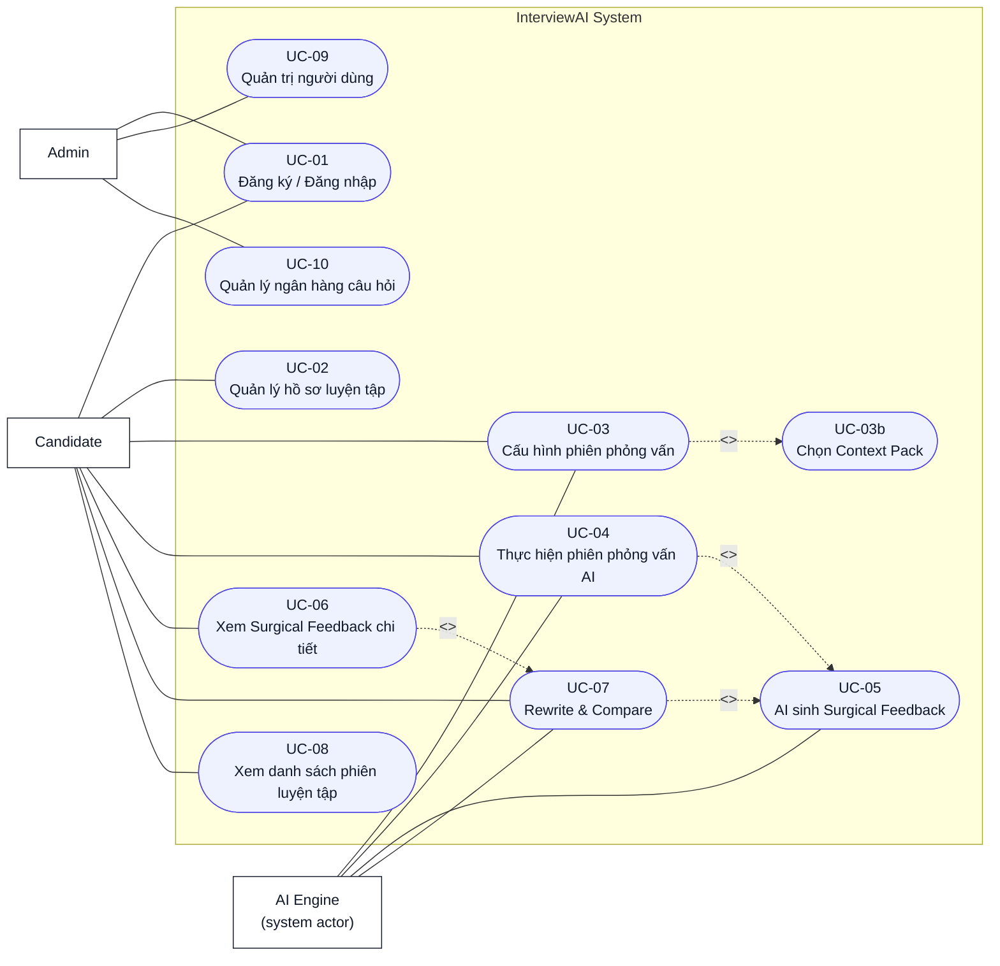
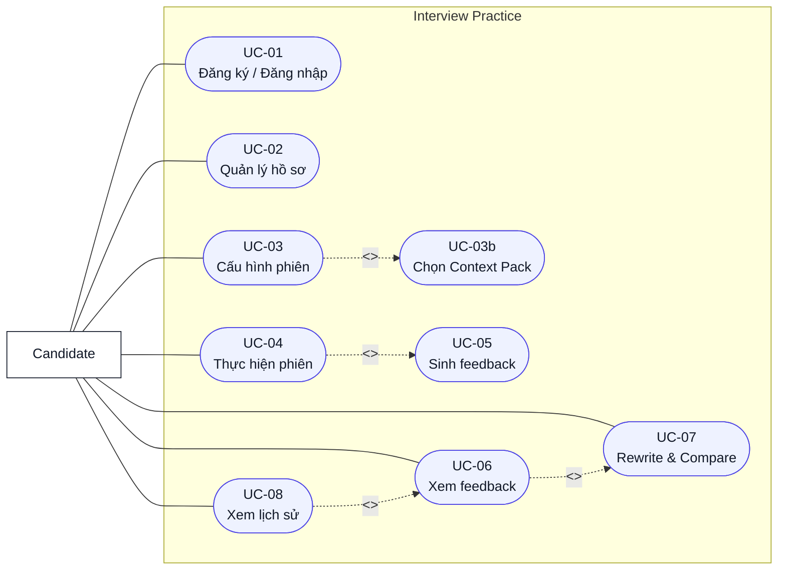
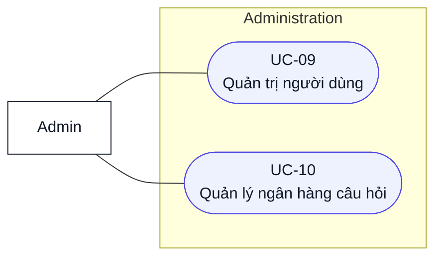
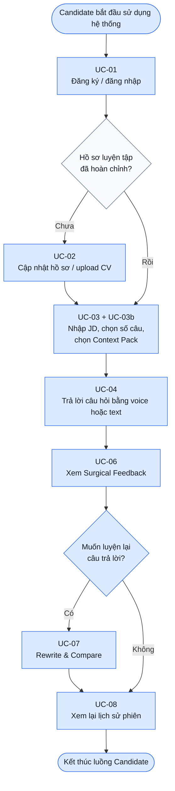
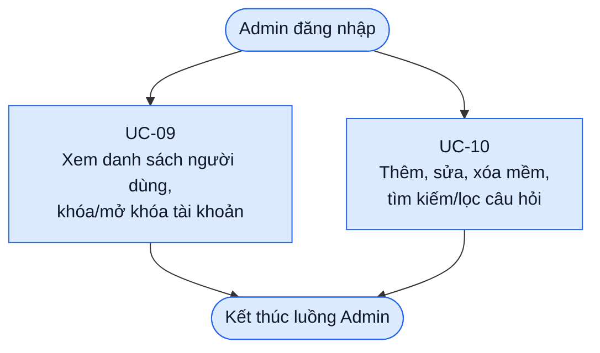

# Software Requirement Specification (SRS)
## AI Interview Coach System — InterviewAI

---

| Thuộc tính | Giá trị |
|---|---|
| **Phiên bản tài liệu** | 1.6 |
| **Ngày soạn** | 05/05/2026 |
| **Trạng thái** | Draft (SRS-focused revision) |
| **Tác giả** | Lê Thành An — MSSV: 20235631 |
| **Giảng viên hướng dẫn** | Tiến sĩ Cao Tuấn Dũng |
| **Đơn vị** | Viện Công nghệ Thông tin và Truyền thông (SOICT), ĐHBKHN |

---

## LỊCH SỬ PHIÊN BẢN

| Phiên bản | Ngày | Mô tả |
|---|---|---|
| 1.0 | 21/04/2026 | Tài liệu gốc tách theo từng chương. |
| 1.1 | 23/04/2026 | Bản hợp nhất đầy đủ, đồng bộ thuật ngữ và các ràng buộc liên chương. |
| 1.2 | 02/05/2026 | Tách nội dung thiết kế kỹ thuật (tech stack, prompt engineering, schema AI, phân tích chi phí) sang SAD v1.0. SRS tập trung thuần vào yêu cầu. |
| 1.3 | 03/05/2026 | Khắc phục 5 lỗi nghiêm trọng: (1) bổ sung bước 7 còn thiếu trong UC-05 Main Flow; (2) đồng bộ ngưỡng tối thiểu JD từ 50 lên 100 ký tự giữa UC-03 E-03-1 và AS-04; (3) làm rõ thứ tự bắt buộc moderation-trước-lưu-transcript trong R-05 để giải quyết mâu thuẫn với AS-02; (4) tách UC-09 thành row riêng trong Traceability Matrix; (5) bổ sung đầy đủ nhóm NFR AS, Q, OA vào Traceability Matrix. |
| 1.4 | 03/05/2026 | Khắc phục 16 lỗi trung bình: bổ sung thuật ngữ Interview Type và Job Title vào Glossary; đồng bộ G1 với 2.2.2 (5 Mbps); làm rõ cơ chế gán Admin role; xóa quan hệ thừa AIEngine→UC-05 trong diagram; làm rõ bước [5] quy trình 2.5.1; thêm cross-reference R6-R10 → Mục 4.9; bổ sung AF-01-C (Logout), AF-02-C (xóa tài khoản), AF-05-A/B (UC-05), AF-06-C (thumbs up/down), AF-07-A/B rõ logic cột so sánh; thêm TTS preference vào UC-02; đặc tả job_title extraction trong UC-03; sửa AC-02-1 cho fresher; sửa AC-07-7 đo lường được; thêm AC-03-5, AC-07-8; bổ sung pagination UC-08; làm rõ cơ chế detect interrupted session; đồng bộ Whisper timeout E-04-3 với P-04 (10s); xử lý câu skip trong overall_score; làm rõ postcondition UC-06; giải quyết mâu thuẫn U-11 vs AF-07-B. |
| 1.5 | 05/05/2026 | Đồng bộ với Discovery Document v0.1: bổ sung bối cảnh thị trường và motivation vào §1.1–1.2; cập nhật metrics thành công theo DD §11.1 (thêm activation rate, completion rate, return rate, thumbs up rate; đồng bộ Rewrite adoption ≥30%); thêm §1.2.5 Pivot Criteria từ DD §11.2; thêm §2.8 Design Principles từ DD §9.4; bổ sung giả định G9–G11 từ DD §10.1; đồng bộ target user 0–12 tháng; mở rộng Out of Scope từ DD §9.5; thêm tài liệu tham khảo DD; thêm bảng Insight Traceability vào §5. |
| 1.6 | 05/05/2026 | Rà soát theo feedback: viết lại mục đích dự án, chuyển success metrics/pivot criteria/design principles sang Discovery Document, rút gọn môi trường vận hành và ràng buộc kỹ thuật, chuẩn hóa actor/business flow/use case diagram, bổ sung bảng dữ liệu đầu vào cho template Use Case, rút gọn NFR và tách Traceability Matrix sang tài liệu riêng. |

---

## MỤC LỤC

- [1. Giới thiệu](#1-giới-thiệu)
  - [1.1 Mục đích](#11-mục-đích)
  - [1.2 Phạm vi](#12-phạm-vi)
  - [1.3 Từ điển thuật ngữ](#13-từ-điển-thuật-ngữ)
  - [1.4 Tài liệu tham khảo](#14-tài-liệu-tham-khảo)
  - [1.5 Giả định & Phụ thuộc](#15-giả-định--phụ-thuộc)
- [2. Mô tả tổng quan](#2-mô-tả-tổng-quan)
  - [2.1 Các tác nhân](#21-các-tác-nhân)
  - [2.2 Môi trường vận hành](#22-môi-trường-vận-hành)
  - [2.3 Biểu đồ Use Case tổng quan](#23-biểu-đồ-use-case-tổng-quan)
  - [2.4 Biểu đồ Use Case phân rã](#24-biểu-đồ-use-case-phân-rã)
  - [2.5 Quy trình nghiệp vụ](#25-quy-trình-nghiệp-vụ)
- [3. Đặc tả Use Case](#3-đặc-tả-use-case)
- [4. Yêu cầu phi chức năng](#4-yêu-cầu-phi-chức-năng)
- [5. Ma trận truy vết yêu cầu (Traceability Matrix)](#5-ma-trận-truy-vết-yêu-cầu-traceability-matrix)

---

# 1. Giới thiệu

## 1.1 Mục đích

Mục đích của dự án **InterviewAI — AI Interview Coach System** là xây dựng một ứng dụng web hỗ trợ sinh viên năm cuối và fresher CNTT tại Việt Nam luyện tập phỏng vấn xin việc trong môi trường mô phỏng có phản hồi từ AI. Hệ thống giúp Candidate tạo phiên phỏng vấn theo Job Description, trả lời bằng giọng nói hoặc văn bản, nhận câu hỏi đào sâu theo ngữ cảnh, xem feedback cụ thể theo từng đoạn transcript và luyện lại câu trả lời để cải thiện.

Ở phiên bản v1.0, InterviewAI tập trung vào ba giá trị chính:

1. **Luyện tập theo ngữ cảnh tuyển dụng thực tế:** câu hỏi được sinh dựa trên JD, hồ sơ/CV và Context Pack mà Candidate lựa chọn.
2. **Phản hồi cụ thể, có thể hành động:** feedback chỉ rõ đoạn nào trong câu trả lời tốt/chưa tốt, lý do và phiên bản cải thiện.
3. **Vòng lặp cải thiện:** Candidate có thể rewrite câu trả lời và so sánh trước/sau để thấy điểm đã tiến bộ.

Tài liệu này là **Đặc tả Yêu cầu Phần mềm (Software Requirement Specification — SRS)** cho InterviewAI. Vai trò của tài liệu là xác định phạm vi, tác nhân, quy trình nghiệp vụ, yêu cầu chức năng, yêu cầu phi chức năng và tiêu chí nghiệm thu ở mức yêu cầu. Các nội dung chiến lược sản phẩm như success metrics, pivot criteria và design principles được quản lý trong **[Discovery Document v0.1](../Discovery_Docs/Discovery_Document.md)**; các chi tiết kiến trúc, tech stack, prompt engineering, schema AI và vận hành kỹ thuật được quản lý trong **[SAD v1.0](../SAD/SAD_InterviewAI_v1.0.md)**.

**Đối tượng đọc tài liệu:**

| Đối tượng | Mục đích sử dụng |
|---|---|
| Sinh viên thực hiện | Tài liệu hướng dẫn thiết kế và phát triển |
| Giảng viên hướng dẫn | Xem xét và phê duyệt định hướng kỹ thuật |
| Hội đồng bảo vệ | Đánh giá mức độ hoàn chỉnh và tính khả thi |
| Người dùng thử nghiệm | Hiểu phạm vi và kỳ vọng của sản phẩm |

---

## 1.2 Phạm vi

### 1.2.1 Tên sản phẩm

**InterviewAI** — Hệ thống luyện tập phỏng vấn xin việc thông minh ứng dụng Trí tuệ Nhân tạo đa phương thức trên nền Web.

### 1.2.2 Mô tả tóm tắt

InterviewAI là một ứng dụng web cho phép sinh viên năm cuối và fresher CNTT Việt Nam (0–12 tháng kinh nghiệm) luyện tập phỏng vấn xin việc thông qua ba tính năng cốt lõi. Bối cảnh người dùng, khoảng trống thị trường và lý do lựa chọn phạm vi được trình bày trong Discovery Document; SRS này chỉ đặc tả các yêu cầu cần triển khai trong hệ thống. Ba tính năng cốt lõi được tích hợp chặt chẽ:

- **Adaptive Follow-up**: AI không hỏi câu hỏi theo danh sách cố định mà đọc transcript câu trả lời của người dùng, xác định một claim hoặc điểm chưa rõ ràng, và sinh ra câu hỏi đào sâu tự nhiên dựa trên chính những gì người dùng vừa nói.
- **Surgical Feedback**: Thay vì đưa ra nhận xét chung chung, hệ thống highlight từng đoạn cụ thể trong transcript, giải thích tại sao đoạn đó có vấn đề và cung cấp phiên bản đã cải thiện.
- **Context Pack**: Rubric chấm điểm thay đổi tùy theo văn hóa công ty mà ứng viên đang ứng tuyển (Việt Nam hoặc Western/International).

### 1.2.3 Phạm vi phiên bản hiện tại (v1.0 — Prototype)

**Trong phạm vi (In Scope):**

| STT | Tính năng | Ghi chú |
|---|---|---|
| 1 | Đăng ký / Đăng nhập bằng Google OAuth | Supabase Auth |
| 2 | Quản lý hồ sơ người dùng, upload CV (PDF) | CV dùng để cá nhân hóa |
| 3 | Cấu hình phiên phỏng vấn từ Job Description | Paste JD thuần văn bản |
| 4 | Chọn Context Pack (VN / Western) | 2 pack cho prototype |
| 5 | Voice input (Whisper API) + Text input | Người dùng chọn một trong hai |
| 6 | Adaptive Follow-up Engine | 1 follow-up/câu hỏi gốc |
| 7 | Surgical Feedback với Annotated Transcript | Highlight 3 màu + popup |
| 8 | Rewrite & Compare | Nói/gõ lại → so sánh trước/sau |
| 9 | Lưu lịch sử phiên và xem lại | Danh sách đơn giản |
| 10 | Quản trị người dùng (Admin) | CRUD cơ bản |
| 11 | Quản lý Question Bank (Admin) | 60 câu seed data |

**Ngoài phạm vi (Out of Scope — không thực hiện trong v1.0):**

| STT | Tính năng | Lý do loại trừ |
|---|---|---|
| 1 | Biểu đồ tiến trình / Analytics dashboard | Không đủ thời gian; ít giá trị với prototype |
| 2 | Pressure Mode (timer, câu hỏi bất ngờ) | Tính năng Phase 2 |
| 3 | Daily Question / Streak / Gamification | Retention feature — không ưu tiên *(DD §9.5)* |
| 4 | Context Pack tiếng Nhật | Cần nhiều domain research |
| 5 | Real-time voice streaming | Record-then-process đủ tốt |
| 6 | Mobile App (iOS/Android native) | Responsive web đủ cho prototype; effort 3× web *(DD §9.2 Hướng D)* |
| 7 | Phỏng vấn kỹ thuật (coding, system design) | Domain khác; cần scope riêng; LeetCode đã giải quyết *(DD §5.5)* |
| 8 | Tích hợp nền tảng tuyển dụng bên ngoài | Không cần API bên ngoài |
| 9 | Phân nhóm và phân quyền người dùng phức tạp | Quá phức tạp cho solo developer |
| 10 | Video / webcam analysis | Ngoài khả năng kỹ thuật hiện tại |
| 11 | Live interview copilot (real-time assist) | Ethical concerns lớn; nhiều công ty coi là "cheating" *(DD §9.5, DD §3.2.2 — Final Round AI)* |
| 12 | Community features (forum, peer matching) | Cần critical mass user; phức tạp cho solo dev *(DD §9.5)* |
| 13 | Enterprise / B2B (cho HR departments) | Khác hoàn toàn GTM; ngoài scope đồ án *(DD §9.5)* |

> **Ghi chú phạm vi tài liệu:** Mục tiêu kinh doanh, success metrics và pivot criteria không nằm trong SRS chính. Các nội dung này được chuyển sang Discovery Document, cụ thể tại DD §11.1 và DD §11.2, để SRS tập trung vào yêu cầu hệ thống.

---

## 1.3 Từ điển thuật ngữ

| Thuật ngữ | Định nghĩa |
|---|---|
| **Adaptive Follow-up** | Cơ chế AI đọc transcript câu trả lời của người dùng và sinh ra câu hỏi đào sâu dựa trên một claim cụ thể trong câu trả lời đó, thay vì hỏi câu hỏi tiếp theo theo danh sách cố định. |
| **Annotated Transcript** | Bản ghi lời của người dùng (transcript) được đánh dấu màu sắc theo từng đoạn (segment) tương ứng với mức độ chất lượng: xanh (tốt), vàng (cần cải thiện), đỏ (cần sửa ngay). |
| **Claim** | Một phát biểu, con số, hoặc khẳng định cụ thể mà người dùng đưa ra trong câu trả lời, ví dụ: "Tôi đã lead team 5 người" hoặc "Dự án hoàn thành đúng deadline". |
| **Context Pack** | Gói cấu hình bao gồm system prompt template và rubric chấm điểm được thiết kế riêng cho một văn hóa doanh nghiệp cụ thể (ví dụ: Việt Nam hoặc Western/International). |
| **Candidate** | Người dùng cuối của hệ thống — sinh viên, fresher hoặc người đang tìm việc — sử dụng hệ thống để luyện tập phỏng vấn. |
| **Delta Score** | Sự thay đổi về điểm số giữa câu trả lời gốc và câu trả lời sau khi Rewrite, thể hiện mức độ cải thiện hoặc sụt giảm. |
| **Filler Words** | Các từ đệm không có nghĩa xuất hiện trong khi nói, phổ biến trong tiếng Việt là "ừm", "à", "thì", "ý là", "kiểu như". |
| **Follow-up Type** | Phân loại câu hỏi đào sâu gồm 3 loại: `clarify` (làm rõ điểm mơ hồ), `challenge` (thách thức một khẳng định), `expand` (mở rộng sang tình huống khó hơn). |
| **JD (Job Description)** | Bản mô tả công việc do người dùng cung cấp bằng cách paste vào hệ thống. AI sử dụng JD để sinh câu hỏi phù hợp và đánh giá độ tương thích của câu trả lời. |
| **Interview Type** | Loại hình phỏng vấn được Candidate chọn khi cấu hình phiên, gồm 2 giá trị: `behavioral` (chỉ câu hỏi hành vi — STAR-based) và `mixed` (kết hợp behavioral, situational và motivational). Giá trị này được truyền vào Question Generator để định hướng loại câu hỏi sinh ra. |
| **Job Title** | Tên vị trí công việc ngắn gọn được AI trích xuất tự động từ JD khi tạo phiên (ví dụ: "Backend Engineer", "Product Manager"). Lưu vào `interview_sessions.job_title` để hiển thị trên card lịch sử phiên trong UC-08. |
| **Model Answer** | Câu trả lời mẫu được AI sinh ra dựa trên câu hỏi, JD, Context Pack và CV của người dùng (nếu có), thể hiện cách một ứng viên lý tưởng sẽ trả lời. |
| **Rewrite & Compare** | Tính năng cho phép người dùng nói hoặc gõ lại câu trả lời sau khi xem Surgical Feedback, sau đó so sánh hai phiên bản (trước và sau) với annotation và delta score tương ứng. |
| **Rubric** | Bộ tiêu chí chấm điểm được định nghĩa trong Context Pack, quy định trọng số và tiêu chuẩn đánh giá phù hợp với từng văn hóa doanh nghiệp. |
| **Segment** | Một đoạn văn bản liên tục trong transcript được xác định bởi chỉ số bắt đầu (start_index) và kết thúc (end_index), là đơn vị cơ bản của Surgical Feedback. |
| **Session / Phiên** | Một buổi luyện tập phỏng vấn hoàn chỉnh, bao gồm nhiều câu hỏi, follow-up và feedback tương ứng. |
| **STAR Framework** | Phương pháp trả lời câu hỏi phỏng vấn hành vi (behavioral) theo cấu trúc: Situation (Bối cảnh) → Task (Nhiệm vụ) → Action (Hành động) → Result (Kết quả). |
| **Surgical Feedback** | Phản hồi của AI được áp dụng ở cấp độ từng đoạn (segment) trong transcript, chỉ ra chính xác đoạn nào cần sửa, tại sao, và nên sửa thành gì — khác với feedback tổng quát theo tiêu chí. |
| **Transcript** | Bản ghi lời nói của người dùng được chuyển đổi từ audio (qua Whisper API) hoặc nhập trực tiếp bằng văn bản. |
| **WPM (Words Per Minute)** | Tốc độ nói tính bằng số từ trên phút, là một trong các voice metrics được phân tích từ transcript. |
| **AI Engine** | Tập hợp các module AI của hệ thống bao gồm Question Generator, Follow-up Engine và Feedback Analyzer. |
| **Fallback** | Hành vi dự phòng của hệ thống khi AI gặp lỗi (timeout, schema sai, rate limit), đảm bảo người dùng không nhận thông báo lỗi kỹ thuật thô. |
| **Token** | Đơn vị đo lường văn bản của mô hình ngôn ngữ (LLM). Một token tương đương khoảng 0.75 từ tiếng Anh hoặc 0.5 từ tiếng Việt. |
| **JSON Mode** | Chế độ của OpenAI API đảm bảo output luôn là JSON hợp lệ, được sử dụng cho các prompt có cấu trúc output phức tạp. |

---

## 1.4 Tài liệu tham khảo

| STT | Tài liệu | Nguồn |
|---|---|---|
| [1] | OpenAI API Reference — Chat Completions, Whisper, Embeddings | https://platform.openai.com/docs |
| [2] | Whisper API — Speech-to-Text Documentation | https://platform.openai.com/docs/guides/speech-to-text |
| [3] | OpenAI Structured Outputs Guide | https://platform.openai.com/docs/guides/structured-outputs |
| [4] | LangChain Python Documentation | https://python.langchain.com/docs |
| [5] | Supabase Documentation — Auth, PostgreSQL, Storage | https://supabase.com/docs |
| [6] | Next.js 14 App Router Documentation | https://nextjs.org/docs |
| [7] | FastAPI Documentation | https://fastapi.tiangolo.com |
| [8] | Web Audio API — MDN Web Docs | https://developer.mozilla.org/en-US/docs/Web/API/Web_Audio_API |
| [9] | Abootorabi et al. (2025). *Ask in Any Modality: A Comprehensive Survey on Multimodal Retrieval-Augmented Generation*. ACL 2025 Findings. arXiv:2502.08826 |
| [10] | STAR Interview Method — Amazon Leadership Principles | https://www.amazon.jobs/en/principles |
| [11] | IEEE 830-1998 — Recommended Practice for Software Requirements Specifications | IEEE Standards |
| [12] | Khảo sát nhu cầu luyện tập phỏng vấn sinh viên BKHN (n=\[50\], 2026) | Nghiên cứu sơ bộ của tác giả |
| [13] | SAD_InterviewAI_v1.0.md — Software Architecture Document (tài liệu đồng hành) | Tài liệu nội bộ dự án |
| [14] | **Discovery Document v0.1** — Product Discovery / User Research Report (tài liệu đầu vào chính cho SRS) | [docs/Discovery_Docs/Discovery_Document.md](../Discovery_Docs/Discovery_Document.md) |
| [15] | VINASA (2024). “Đánh giá chất lượng nhân lực CNTT tốt nghiệp” | Trích qua Tiền Phong; DD §1.1 |
| [16] | TopDev.vn (2025). “Vietnam IT Market Report” | DD §3.1, §6.3 |
| [17] | Market.us (2025). “AI Career Coach Market Size & Forecast” | DD §1.2 |
| [18] | OpenAI (2024). “API Pricing Updates — GPT-4o mini” | DD §1.2, Insight #4 |

---

## 1.5 Giả định & Phụ thuộc

### 1.5.1 Giả định

| STT | Giả định | Lý do |
|---|---|---|
| G1 | Người dùng có kết nối internet ổn định (tối thiểu **5 Mbps**, khuyến nghị ≥ 10 Mbps) | Cần để upload audio và gọi Whisper API, GPT-4o trong thời gian thực; đồng bộ với yêu cầu tối thiểu tại mục 2.2.2 |
| G2 | Người dùng sử dụng trình duyệt Chrome hoặc Firefox phiên bản mới nhất | Web Audio API và MediaRecorder API tương thích tốt nhất trên hai trình duyệt này |
| G3 | Người dùng có microphone hoạt động nếu muốn dùng voice input | Voice input là optional; text input là fallback |
| G4 | Job Description được cung cấp dưới dạng văn bản thuần (plain text), không phải file | Không cần xử lý file parsing cho JD |
| G5 | Người dùng có khả năng đọc và viết tiếng Việt hoặc tiếng Anh ở mức cơ bản | Hệ thống hỗ trợ hai ngôn ngữ, không có dịch thuật tự động |
| G6 | Dịch vụ AI bên ngoài đủ khả dụng để hệ thống có thể tạo câu hỏi, follow-up, feedback và transcript trong luồng chính | Nếu phụ thuộc AI không khả dụng, hệ thống phải có fallback được mô tả tại Chương 4 |
| G7 | Rubric chấm điểm cho Context Pack VN và Western được nghiên cứu và thiết kế dựa trên tài liệu và phỏng vấn chuyên gia nhân sự | Chất lượng rubric ảnh hưởng trực tiếp đến chất lượng feedback; văn hóa phỏng vấn VN khác biệt rõ với Western |
| G8 | Người dùng có thể lựa chọn voice input hoặc text input tùy bối cảnh sử dụng | Voice input là giá trị chính, nhưng text input là fallback bắt buộc khi người dùng không muốn hoặc không thể ghi âm |
| G9 | LLM feedback tiếng Việt đủ chất lượng ở mức cụ thể, actionable và không generic | Đây là giả định quan trọng ảnh hưởng trực tiếp đến core value của sản phẩm |

### 1.5.2 Phụ thuộc bên ngoài

| STT | Phụ thuộc | Tác động nếu thay đổi |
|---|---|---|
| D1 | Dịch vụ LLM — Question Generator, Follow-up Engine, Feedback Analyzer | Nếu dịch vụ không khả dụng, các luồng AI phải chuyển sang fallback hoặc thông báo phù hợp |
| D2 | Dịch vụ Speech-to-Text — chuyển đổi audio thành transcript | Nếu STT thất bại, Candidate phải có thể chuyển sang nhập câu trả lời bằng văn bản |
| D3 | Dịch vụ xác thực OAuth — đăng nhập bằng tài khoản Google | Nếu OAuth lỗi, Candidate phải nhận được thông báo lỗi rõ ràng và có thể thử lại |
| D4 | Cơ sở dữ liệu và lưu trữ file | Hệ thống phải lưu hồ sơ, phiên, transcript, feedback và file liên quan theo chính sách bảo mật dữ liệu |

### 1.5.3 Ràng buộc về thời gian và nguồn lực

- **Thời gian phát triển:** 3 tháng (tháng 4 → tháng 6/2026), deadline bảo vệ trước tháng 7/2026.
- **Nguồn lực:** 01 lập trình viên duy nhất — toàn bộ frontend, backend, AI integration, testing và deployment.

---

# 2. Mô tả tổng quan

## 2.1 Các tác nhân

Hệ thống InterviewAI có hai tác nhân người dùng và một tác nhân hệ thống phụ trợ. Phần này mô tả tác nhân ở mức yêu cầu nghiệp vụ; persona chi tiết, anti-persona và rationale sản phẩm nằm trong Discovery Document.

### 2.1.1 Người dùng (Candidate)

| Thành phần | Mô tả |
|---|---|
| Actor | Candidate |
| Mục tiêu | Luyện tập phỏng vấn xin việc theo JD, nhận feedback cụ thể và cải thiện câu trả lời qua các lần luyện lại. |
| Đối tượng chính | Sinh viên năm cuối CNTT và fresher CNTT tại Việt Nam có 0–12 tháng kinh nghiệm. |
| Quyền hạn | Quản lý hồ sơ luyện tập, tạo phiên phỏng vấn, trả lời câu hỏi, xem feedback, rewrite câu trả lời và xem lịch sử phiên. |
| Use Case liên quan | UC-01, UC-02, UC-03, UC-03b, UC-04, UC-06, UC-07, UC-08 |
| Dữ liệu thao tác | Thông tin hồ sơ, CV PDF, JD, cấu hình phiên, transcript câu trả lời, đánh giá feedback, lịch sử phiên. |

### 2.1.2 Quản trị viên (Admin)

| Thành phần | Mô tả |
|---|---|
| Actor | Admin |
| Mục tiêu | Duy trì dữ liệu hệ thống và hỗ trợ vận hành prototype. |
| Cách cấp quyền | Không có luồng đăng ký Admin qua giao diện. Quyền `admin` được gán thủ công bởi tác giả trong cơ sở dữ liệu. |
| Quyền hạn | Xem/quản lý người dùng, khóa/mở khóa tài khoản, thêm/sửa/xóa mềm câu hỏi trong Question Bank. |
| Use Case liên quan | UC-01, UC-09, UC-10 |
| Dữ liệu thao tác | Tài khoản người dùng, trạng thái tài khoản, câu hỏi seed, tag câu hỏi, Context Pack/category/difficulty của câu hỏi. |

### 2.1.3 Hệ thống AI (AI Engine)

| Thành phần | Mô tả |
|---|---|
| Actor | AI Engine |
| Loại tác nhân | Tác nhân hệ thống phụ trợ, không phải người dùng cuối. |
| Mục tiêu | Hỗ trợ hệ thống sinh câu hỏi, sinh follow-up, phân tích transcript và tạo Surgical Feedback. |
| Kích hoạt bởi | Hành động của Candidate trong UC-03, UC-04, UC-05 và UC-07. |
| Use Case liên quan | UC-03, UC-04, UC-05, UC-07 |
| Dữ liệu xử lý | JD, Context Pack, CV structured data, câu hỏi, transcript, voice metrics, feedback schema. |

AI Engine gồm ba năng lực ở mức yêu cầu: **Question Generator**, **Follow-up Engine** và **Feedback Analyzer**. Chi tiết prompt, schema, retry/fallback và triển khai kỹ thuật nằm trong SAD.

---

## 2.2 Môi trường vận hành

SRS chỉ giữ các điều kiện vận hành ảnh hưởng trực tiếp đến người dùng và yêu cầu hệ thống. Sơ đồ triển khai, hosting, cấu hình server, lựa chọn framework và phân tích vận hành được trình bày trong **[SAD v1.0](../SAD/SAD_InterviewAI_v1.0.md)**.

| Nhóm | Yêu cầu vận hành |
|---|---|
| Nền tảng sử dụng | Ứng dụng web chạy trên trình duyệt, không yêu cầu cài đặt app native. |
| Trình duyệt | Trình duyệt hiện đại có bật JavaScript. |
| Kết nối mạng | Cần kết nối internet ổn định để đăng nhập, tải phiên, upload audio và nhận phản hồi AI. |
| Microphone | Chỉ bắt buộc khi Candidate chọn trả lời bằng giọng nói; text input luôn là fallback. |
| Ngôn ngữ | Hệ thống hỗ trợ tiếng Việt và tiếng Anh trong luồng luyện phỏng vấn. |

---

## 2.3 Biểu đồ Use Case tổng quan

Biểu đồ dưới đây dùng Mermaid `flowchart` để mô phỏng UML Use Case Diagram: actor nằm ngoài system boundary, use case nằm trong boundary, đường nét đứt biểu diễn `include`/`extend`. Biểu đồ không mô tả thứ tự xử lý.



---

## 2.4 Biểu đồ Use Case phân rã

### 2.4.1 Nhóm Luyện phỏng vấn (Candidate)



### 2.4.2 Nhóm Quản trị hệ thống (Admin)



---

## 2.5 Quy trình nghiệp vụ

### 2.5.1 Quy trình Candidate



### 2.5.2 Quy trình Admin



### 2.5.3 Đối chiếu quy trình nghiệp vụ với Use Case

| Actor | Quy trình nghiệp vụ | Use Case liên quan |
|---|---|---|
| Candidate | Đăng nhập/onboarding | UC-01, UC-02 |
| Candidate | Tạo và cấu hình phiên phỏng vấn | UC-03, UC-03b |
| Candidate | Thực hiện phiên phỏng vấn | UC-04, UC-05 |
| Candidate | Xem feedback và luyện lại | UC-06, UC-07 |
| Candidate | Xem lịch sử phiên | UC-08 |
| Admin | Quản lý người dùng | UC-09 |
| Admin | Quản lý ngân hàng câu hỏi | UC-10 |

---
# 3. Đặc tả Use Case

---

## Template Use Case

Mọi Use Case trong chương này đều tuân theo template sau:

| Trường | Nội dung |
|---|---|
| **Mã UC** | Định danh duy nhất |
| **Tên UC** | Tên ngắn gọn, bắt đầu bằng động từ |
| **Mô tả tóm tắt** | 1–2 câu mô tả mục tiêu |
| **Tác nhân chính** | Ai khởi tạo |
| **Tác nhân phụ** | Hệ thống / AI tham gia |
| **Tiền điều kiện** | Điều kiện phải thỏa trước khi UC bắt đầu |
| **Hậu điều kiện** | Trạng thái hệ thống sau khi UC kết thúc thành công |
| **Dữ liệu đầu vào** | Bảng mô tả các trường dữ liệu người dùng/hệ thống cần cung cấp |
| **Main Flow** | Luồng sự kiện chính |
| **Alternative Flow** | Luồng thay thế hợp lệ |
| **Exception Flow** | Các kịch bản lỗi và xử lý |
| **AI Spec** | *(Chỉ với UC liên quan AI)* Input/Output/Fallback |
| **Acceptance Criteria** | Tiêu chí kiểm thử nghiệm thu |

**Mẫu bảng dữ liệu đầu vào:**

| Trường dữ liệu | Mô tả | Bắt buộc | Kiểu dữ liệu | Validation | Giá trị mặc định | Nơi lưu/xử lý |
|---|---|---|---|---|---|---|
| `<field_name>` | Ý nghĩa nghiệp vụ của trường | Có/Không | Text/Number/File/Enum/Boolean | Quy tắc hợp lệ | Nếu có | Bảng dữ liệu, session config hoặc service xử lý |

Mỗi Use Case có dữ liệu nhập từ Candidate/Admin phải bổ sung bảng này trước Main Flow. Với Use Case chỉ đọc dữ liệu có sẵn, ghi rõ "Không có dữ liệu đầu vào trực tiếp từ người dùng".

---

## Nhóm A — Luyện phỏng vấn

---

### UC-01: Đăng ký / Đăng nhập hệ thống

| Trường | Nội dung |
|---|---|
| **Mã UC** | UC-01 |
| **Tên UC** | Đăng ký / Đăng nhập hệ thống |
| **Mô tả tóm tắt** | Candidate tạo tài khoản mới hoặc đăng nhập vào hệ thống thông qua Google OAuth 2.0. |
| **Tác nhân chính** | Candidate |
| **Tác nhân phụ** | Supabase Auth, Google Identity Platform |
| **Tiền điều kiện** | Candidate có trình duyệt hỗ trợ; có tài khoản Google hợp lệ. |
| **Hậu điều kiện** | Candidate được xác thực; JWT access token được lưu vào secure cookie; Candidate được chuyển đến Dashboard. |

**Dữ liệu đầu vào:**

| Trường dữ liệu | Mô tả | Bắt buộc | Kiểu dữ liệu | Validation | Giá trị mặc định | Nơi lưu/xử lý |
|---|---|---|---|---|---|---|
| `google_oauth_response` | Kết quả xác thực từ Google OAuth | Có | OAuth payload | Token hợp lệ, email xác thực được | Không có | Supabase Auth / bảng `users` |

**Main Flow:**

1. Candidate truy cập URL của hệ thống.
2. Hệ thống hiển thị trang Landing với nút **"Đăng nhập bằng Google"**.
3. Candidate nhấn nút đăng nhập.
4. Hệ thống redirect đến Google OAuth consent screen.
5. Candidate chọn tài khoản Google và cấp quyền.
6. Google trả token về Supabase Auth callback endpoint.
7. Supabase xác thực token và kiểm tra email trong database:
   - Nếu email **chưa tồn tại**: tạo bản ghi User mới với `role = candidate`, `profile_completed = false`.
   - Nếu email **đã tồn tại**: cập nhật `last_login_at`.
8. Hệ thống phát sinh JWT (access token 7 ngày, refresh token 30 ngày), lưu vào secure HttpOnly cookie.
9. Nếu `profile_completed = false`: redirect đến **UC-02** để hoàn thiện hồ sơ.
10. Nếu `profile_completed = true`: redirect đến **Dashboard** (danh sách phiên + nút tạo phiên mới).

**Alternative Flow:**

- **AF-01-A**: Candidate đã đăng nhập trước đó (token còn hạn) → truy cập URL → hệ thống tự động redirect đến Dashboard, bỏ qua bước 2–8.
- **AF-01-B**: Refresh token còn hạn nhưng access token hết hạn → hệ thống tự động làm mới access token trong nền mà không yêu cầu Candidate đăng nhập lại.
- **AF-01-C — Đăng xuất:** Candidate đang đăng nhập và muốn đăng xuất → Nhấn nút **"Đăng xuất"** trong menu Profile → Hệ thống xóa JWT khỏi HttpOnly cookie, thu hồi refresh token phía Supabase, redirect về trang Landing. Mọi request sau đó yêu cầu đăng nhập lại (AC-01-5 kiểm tra hành vi này).

**Exception Flow:**

| Mã lỗi | Tình huống | Xử lý |
|---|---|---|
| E-01-1 | Google OAuth trả về lỗi (user hủy, network timeout) | Hiển thị toast: "Đăng nhập thất bại. Vui lòng thử lại." Ở lại trang Landing. |
| E-01-2 | Supabase Auth không phản hồi trong 10 giây | Hiển thị: "Dịch vụ xác thực tạm thời không khả dụng. Vui lòng thử lại sau vài phút." |
| E-01-3 | Email bị Admin khóa (`status = banned`) | Hiển thị: "Tài khoản của bạn đã bị vô hiệu hóa. Vui lòng liên hệ hỗ trợ." |

**Acceptance Criteria:**

- [ ] AC-01-1: Candidate đăng nhập thành công trong ≤ 5 giây.
- [ ] AC-01-2: JWT được lưu trong HttpOnly cookie, không accessible qua JavaScript.
- [ ] AC-01-3: Người dùng mới được tạo bản ghi trong bảng `users` với `role = candidate`.
- [ ] AC-01-4: Truy cập URL khi đã có token hợp lệ → tự động vào Dashboard, không hiển thị lại trang login.
- [ ] AC-01-5: Sau khi logout, token bị xóa; truy cập URL được redirect về Landing.

---

### UC-02: Quản lý hồ sơ luyện tập

| Trường | Nội dung |
|---|---|
| **Mã UC** | UC-02 |
| **Tên UC** | Quản lý hồ sơ luyện tập |
| **Mô tả tóm tắt** | Candidate cập nhật thông tin cá nhân, mục tiêu nghề nghiệp và upload CV để hệ thống cá nhân hóa câu hỏi và Model Answer. |
| **Tác nhân chính** | Candidate |
| **Tác nhân phụ** | FastAPI (CV parsing), Supabase Storage |
| **Tiền điều kiện** | Candidate đã đăng nhập (UC-01 hoàn thành). |
| **Hậu điều kiện** | Thông tin hồ sơ được lưu; `profile_completed = true`; CV data được parse và lưu dưới dạng structured JSON. |

**Dữ liệu đầu vào:**

| Trường dữ liệu | Mô tả | Bắt buộc | Kiểu dữ liệu | Validation | Giá trị mặc định | Nơi lưu/xử lý |
|---|---|---|---|---|---|---|
| `full_name` | Họ tên Candidate | Có | Text | Không rỗng | Không có | `user_profiles` |
| `target_position` | Vị trí ứng tuyển mục tiêu | Có | Text | Không rỗng | Không có | `user_profiles` |
| `years_experience` | Số năm kinh nghiệm | Không | Number | Không âm | 0 | `user_profiles` |
| `default_language` | Ngôn ngữ phỏng vấn mặc định | Có | Enum | `vi` hoặc `en` | `vi` | `user_profiles` |
| `tts_enabled` | Bật/tắt đọc câu hỏi bằng giọng nói | Không | Boolean | true/false | false | `user_profiles` |
| `cv_pdf` | File CV của Candidate | Không | File PDF | PDF, tối đa 5 MB | Không có | Storage + `cv_structured` |

**Main Flow:**

1. Candidate truy cập trang **Hồ sơ** (Profile).
2. Hệ thống hiển thị form với các trường: Họ tên, Vị trí ứng tuyển mục tiêu, Số năm kinh nghiệm, Ngôn ngữ phỏng vấn mặc định (Tiếng Việt / Tiếng Anh), Đọc câu hỏi bằng giọng nói — TTS (toggle bật/tắt, mặc định **tắt**). Cài đặt TTS được lưu vào `user_profiles.tts_enabled` và áp dụng tự động trong UC-04 Giai đoạn 1 bước 3.
3. Candidate điền thông tin và nhấn **"Lưu thông tin"**.
4. Hệ thống validate dữ liệu và lưu vào bảng `user_profiles`.
5. Candidate nhấn **"Upload CV (PDF)"** — tùy chọn nhưng được khuyến nghị.
6. Candidate chọn file PDF (≤ 5 MB).
7. Frontend gửi file đến FastAPI endpoint `/api/cv/parse`.
8. FastAPI:
   - Dùng `pdfplumber` đọc nội dung text của PDF.
   - Cấu trúc hóa thành JSON: `{name, education[], experience[], skills[], languages[]}`.
   - Lưu JSON vào bảng `user_profiles.cv_structured`.
   - Upload file gốc lên Supabase Storage, lưu URL vào `user_profiles.cv_file_url`.
9. Hệ thống cập nhật `profile_completed = true`.
10. Hiển thị thông báo thành công; chuyển đến Dashboard.

**Alternative Flow:**

- **AF-02-A**: Candidate bỏ qua upload CV → `cv_structured = null`. Hệ thống vẫn hoạt động; Question Generator và Feedback Analyzer không dùng dữ liệu CV.
- **AF-02-B**: Candidate muốn cập nhật CV mới → upload file mới → file cũ trên Storage bị ghi đè, `cv_structured` được cập nhật.
- **AF-02-C — Xóa tài khoản:** Tính năng tự xóa tài khoản qua giao diện không được hỗ trợ trong v1.0. Candidate muốn xóa dữ liệu liên hệ Admin; Admin xử lý thủ công qua UC-09 (cập nhật `users.status = deleted`, soft-delete toàn bộ phiên và dữ liệu liên quan; xóa audio file trên R2 theo quy trình SAD v1.0 Mục 4.4).

**Exception Flow:**

| Mã lỗi | Tình huống | Xử lý |
|---|---|---|
| E-02-1 | File upload không phải PDF | Hiển thị: "Chỉ chấp nhận file PDF. Vui lòng chọn lại." |
| E-02-2 | File PDF vượt quá 5 MB | Hiển thị: "File quá lớn (tối đa 5 MB). Vui lòng nén hoặc chọn file khác." |
| E-02-3 | `pdfplumber` không đọc được text (PDF scan, protected) | Lưu file lên Storage nhưng `cv_structured = null`; hiển thị: "Không thể đọc nội dung CV tự động. CV đã được lưu nhưng sẽ không được dùng để cá nhân hóa." |
| E-02-4 | Trường bắt buộc bỏ trống (Họ tên, Vị trí mục tiêu) | Highlight trường lỗi; hiển thị thông báo validation tương ứng. |

**Acceptance Criteria:**

- [ ] AC-02-1: CV PDF được parse thành công → `cv_structured` được tạo với cấu trúc `{name, education[], experience[], skills[], languages[]}`; ít nhất một trong `education[]` hoặc `skills[]` không rỗng (`experience[]` được phép rỗng với sinh viên hoặc fresher chưa có kinh nghiệm đi làm).
- [ ] AC-02-2: Trang Profile load trong ≤ 200 ms.
- [ ] AC-02-3: Upload CV ≤ 5 MB hoàn thành trong ≤ 5 giây.
- [ ] AC-02-4: Sau khi lưu hồ sơ, `profile_completed = true` được ghi vào DB.

---

### UC-03: Cấu hình phiên phỏng vấn

| Trường | Nội dung |
|---|---|
| **Mã UC** | UC-03 |
| **Tên UC** | Cấu hình phiên phỏng vấn |
| **Mô tả tóm tắt** | Candidate tạo một phiên luyện tập mới bằng cách cung cấp Job Description và các tham số cấu hình cần thiết. |
| **Tác nhân chính** | Candidate |
| **Tác nhân phụ** | AI Engine (Question Generator) |
| **Tiền điều kiện** | Candidate đã đăng nhập; `profile_completed = true`. |
| **Hậu điều kiện** | Phiên mới được tạo với trạng thái `in_progress`; danh sách câu hỏi được sinh và lưu vào DB; Candidate chuyển đến màn hình phỏng vấn. |

**Dữ liệu đầu vào:**

| Trường dữ liệu | Mô tả | Bắt buộc | Kiểu dữ liệu | Validation | Giá trị mặc định | Nơi lưu/xử lý |
|---|---|---|---|---|---|---|
| `job_description` | JD dùng để sinh câu hỏi và đánh giá câu trả lời | Có | Text | 100–5.000 ký tự | Không có | `interview_sessions` / AI Engine |
| `num_questions` | Số câu hỏi trong phiên | Có | Enum/Number | 3, 5 hoặc 7 | 5 | `interview_sessions` |
| `interview_type` | Loại phỏng vấn | Có | Enum | `behavioral` hoặc `mixed` | `behavioral` | `interview_sessions` |
| `context_pack_id` | Context Pack được chọn ở UC-03b | Có | Enum/ID | Pack tồn tại | Không có | `interview_sessions` |

**Main Flow:**

1. Candidate nhấn **"Tạo phiên mới"** từ Dashboard.
2. Hệ thống hiển thị form cấu hình phiên gồm 4 bước:
   - **Bước 1 — Thông tin công việc:** Paste Job Description (text area, bắt buộc, min 100 ký tự).
   - **Bước 2 — Cấu hình phỏng vấn:** Chọn số câu hỏi (3 / 5 / 7, mặc định 5); Loại phỏng vấn (Behavioral / Mixed, mặc định Behavioral).
   - **Bước 3 — Chọn Context Pack:** Xem **UC-03b**.
   - **Bước 4 — Xác nhận:** Hiển thị summary của tất cả lựa chọn.
3. Candidate nhấn **"Bắt đầu phỏng vấn"**.
4. Hệ thống tạo bản ghi `interview_sessions` với `status = generating`; song song đó trích xuất `job_title` ngắn gọn từ JD bằng GPT-4o (prompt nhỏ, max 10 tokens output, temperature = 0, chạy đồng thời với bước 5) và lưu vào `interview_sessions.job_title`. Nếu trích xuất thất bại → `job_title = null`; card UC-08 hiển thị "Phiên phỏng vấn" thay thế.
5. FastAPI gọi Question Generator với payload: `{jd, context_pack_id, num_questions, interview_type, cv_structured}`.
6. Question Generator trả về danh sách câu hỏi (xem AI Spec).
7. Hệ thống lưu câu hỏi vào bảng `session_questions`; cập nhật `status = in_progress`.
8. Redirect Candidate đến UC-04 (màn hình phỏng vấn).

**Alternative Flow:**

- **AF-03-A**: Candidate nhấn "Hủy" ở bất kỳ bước nào → quay về Dashboard; phiên không được tạo.

**Exception Flow:**

| Mã lỗi | Tình huống | Xử lý |
|---|---|---|
| E-03-1 | JD dưới 100 ký tự | Hiển thị: "Job Description quá ngắn. Vui lòng cung cấp mô tả đầy đủ hơn." |
| E-03-2 | Question Generator timeout (>10 giây) | Hủy bản ghi session; hiển thị: "Không thể tạo câu hỏi lúc này. Vui lòng thử lại." |
| E-03-3 | Question Generator trả về ít hơn số câu yêu cầu | Chấp nhận số câu trả về nếu ≥ 3; nếu < 3 → xử lý như E-03-2. |

> *Đặc tả kỹ thuật AI chi tiết (system prompt, input/output schema, cấu hình model, fallback strategy): xem **[SAD v1.0 — Mục 2.2.2](../SAD/SAD_InterviewAI_v1.0.md#222-prompt-1--question-generator)**.*

**Acceptance Criteria:**

- [ ] AC-03-1: Phiên được tạo và câu hỏi sinh ra trong ≤ 10 giây.
- [ ] AC-03-2: JD dưới 100 ký tự → hiển thị lỗi validation, không cho tiếp tục.
- [ ] AC-03-3: Câu hỏi của Context Pack VN và Western rõ ràng khác nhau về nội dung và phong cách.
- [ ] AC-03-4: Bản ghi `interview_sessions` được tạo với đầy đủ foreign key hợp lệ.
- [ ] AC-03-5: Card lịch sử trong UC-08 hiển thị `job_title` được trích xuất; hoặc hiển thị "Phiên phỏng vấn" nếu trích xuất thất bại — không hiển thị null/rỗng.

---

### UC-03b: Chọn Context Pack

| Trường | Nội dung |
|---|---|
| **Mã UC** | UC-03b |
| **Tên UC** | Chọn Context Pack |
| **Mô tả tóm tắt** | Candidate chọn văn hóa công ty phù hợp với vị trí đang ứng tuyển; hệ thống load rubric chấm điểm tương ứng cho toàn bộ phiên. |
| **Tác nhân chính** | Candidate |
| **Tác nhân phụ** | Hệ thống (load Context Pack config) |
| **Tiền điều kiện** | Đây là Bước 3 trong UC-03; JD đã được nhập; số câu đã được chọn. |
| **Hậu điều kiện** | `context_pack_id` được ghi vào bản ghi phiên; rubric JSON tương ứng được load vào bộ nhớ để sử dụng cho UC-04, UC-05, UC-07. |

**Dữ liệu đầu vào:**

| Trường dữ liệu | Mô tả | Bắt buộc | Kiểu dữ liệu | Validation | Giá trị mặc định | Nơi lưu/xử lý |
|---|---|---|---|---|---|---|
| `context_pack_id` | Văn hóa phỏng vấn Candidate muốn luyện | Có | Enum/ID | `vn` hoặc `western` | Không có | Session config / `interview_sessions` |

**Main Flow:**

1. Hệ thống hiển thị 2 lựa chọn Context Pack dưới dạng card:

   | | 🇻🇳 Việt Nam | 🌍 Western / International |
   |---|---|---|
   | **Mô tả ngắn** | Phù hợp với công ty Việt Nam, doanh nghiệp nội địa, cơ quan nhà nước | Phù hợp với công ty nước ngoài, startup quốc tế, môi trường đa văn hóa |
   | **Câu hỏi trọng tâm** | Teamwork, tôn trọng, sự kiên nhẫn, gắn bó lâu dài | Impact cụ thể, ownership, số liệu, tư duy độc lập |
   | **Tiêu chuẩn câu trả lời** | Khiêm tốn, chú trọng tập thể, tránh nói quá về bản thân | Tự tin, "I did", STAR framework đầy đủ, nêu kết quả đo lường |

2. Candidate đọc mô tả và chọn một trong hai pack.
3. Hệ thống highlight card được chọn; hiển thị preview 1–2 tiêu chí chấm điểm của pack đó.
4. Candidate nhấn **"Xác nhận"** (hoặc nhấn "Tiếp tục" để sang Bước 4 của UC-03).
5. Hệ thống lưu `context_pack_id` vào session config; load `rubric_json` từ bảng `context_packs` vào phiên làm việc.

**Alternative Flow:**

- **AF-03b-A**: Candidate thay đổi lựa chọn trước khi nhấn Xác nhận → cập nhật highlight; không có side effect.

**Exception Flow:**

| Mã lỗi | Tình huống | Xử lý |
|---|---|---|
| E-03b-1 | Candidate không chọn pack và nhấn Tiếp tục | Highlight yêu cầu chọn; hiển thị: "Vui lòng chọn một Context Pack trước khi tiếp tục." |
| E-03b-2 | Bảng `context_packs` không truy xuất được từ DB | Load rubric mặc định (VN) từ file config tĩnh; ghi log lỗi. |

**Acceptance Criteria:**

- [ ] AC-03b-1: Hiển thị đủ 2 card với mô tả rõ ràng, không thể tiếp tục nếu chưa chọn.
- [ ] AC-03b-2: Rubric JSON tương ứng được load thành công vào session trong ≤ 200 ms.
- [ ] AC-03b-3: `context_pack_id` được ghi chính xác vào bảng `interview_sessions`.

---

### UC-04: Thực hiện phiên phỏng vấn AI

> **Đây là Use Case phức tạp nhất của hệ thống.** UC-04 tích hợp đồng thời Voice/Text input, Whisper transcription và Follow-up Engine. Mỗi câu hỏi có thể tạo ra tới 2 lượt tương tác (câu gốc + follow-up) trước khi chuyển sang Feedback Analyzer.

| Trường | Nội dung |
|---|---|
| **Mã UC** | UC-04 |
| **Tên UC** | Thực hiện phiên phỏng vấn AI |
| **Mô tả tóm tắt** | Candidate tương tác với AI phỏng vấn theo từng câu hỏi. Với mỗi câu, Candidate trả lời (voice/text), AI phân tích và đặt 1 câu follow-up dựa trên nội dung vừa nói, sau đó sinh Surgical Feedback. |
| **Tác nhân chính** | Candidate |
| **Tác nhân phụ** | AI Engine (Whisper API, Follow-up Engine, Feedback Analyzer) |
| **Tiền điều kiện** | UC-03 hoàn thành; phiên có `status = in_progress`; danh sách câu hỏi đã được lưu vào DB. |
| **Hậu điều kiện** | Toàn bộ `user_answers`, `follow_up_questions`, `ai_feedbacks` và `annotated_segments` được lưu vào DB; `session.status = completed`; Candidate được chuyển đến UC-06 (Xem Feedback). |

**Dữ liệu đầu vào:**

| Trường dữ liệu | Mô tả | Bắt buộc | Kiểu dữ liệu | Validation | Giá trị mặc định | Nơi lưu/xử lý |
|---|---|---|---|---|---|---|
| `session_id` | Phiên phỏng vấn đang thực hiện | Có | UUID/ID | Phiên thuộc Candidate và `status = in_progress` | Không có | `interview_sessions` |
| `answer_mode` | Cách Candidate trả lời | Có | Enum | `voice` hoặc `text` | Không có | Frontend/session state |
| `audio_blob` | Audio câu trả lời khi chọn voice | Có nếu voice | File audio | Định dạng hỗ trợ, tối đa 25 MB, tối đa 5 phút | Không có | STT service / storage tạm |
| `answer_text` | Nội dung câu trả lời khi chọn text hoặc sau STT | Có | Text | Không rỗng sau khi submit | Không có | `user_answers` |
| `skip_question` | Hành động bỏ qua câu hỏi | Không | Boolean | Chỉ từ câu thứ 2 trở đi | false | `user_answers.skipped` |

#### Main Flow (lặp lại cho mỗi câu hỏi trong phiên)

**Giai đoạn 1 — Hiển thị câu hỏi**

1. Hệ thống lấy câu hỏi tiếp theo từ `session_questions` (theo thứ tự `order_index`).
2. Hiển thị câu hỏi dạng text trên màn hình; kèm indicator **"Câu [X] / [Total]"**.
3. *(Optional)* Hệ thống đọc câu hỏi bằng Web Speech API (TTS) nếu Candidate đã bật cài đặt này.
4. Hiển thị 2 nút: **🎤 Trả lời bằng giọng nói** và **✏️ Trả lời bằng văn bản**.

---

**Giai đoạn 2A — Trả lời bằng giọng nói (Voice Path)**

5. Candidate nhấn nút **🎤 Bắt đầu ghi âm**.
6. Frontend kích hoạt `MediaRecorder` via Web Audio API; hiển thị waveform animation và timer đếm lên.
7. Candidate nói câu trả lời.
8. Candidate nhấn **■ Dừng ghi âm** (hoặc tự động dừng sau 5 phút).
9. Frontend gửi audio blob (WebM/WAV) đến FastAPI endpoint `POST /api/session/{id}/transcribe`.
10. FastAPI gọi **Whisper API** với audio file:
    - Model: `whisper-1`
    - Language: `vi` nếu ngôn ngữ phiên = Tiếng Việt; `en` nếu = Tiếng Anh
    - Response format: `verbose_json` (để lấy word-level timestamps)
11. FastAPI nhận transcript text và word timestamps; tính toán các voice metrics:
    - **WPM** = (số từ / thời lượng audio) × 60
    - **Filler word count** = đếm xuất hiện của: ["ừm", "à", "thì", "ý là", "kiểu như", "um", "uh", "like", "you know"]
    - **Pause count** = số khoảng lặng > 2 giây trong word timestamps
12. FastAPI trả về: `{transcript, wpm, filler_count, pause_count, duration_seconds}`.
13. Frontend hiển thị transcript dưới câu hỏi; hiển thị badge voice metrics nhỏ.

**Giai đoạn 2B — Trả lời bằng văn bản (Text Path)**

5. Candidate nhấn **✏️ Trả lời bằng văn bản**.
6. Hiển thị textarea với placeholder gợi ý; Candidate gõ câu trả lời.
7. Candidate nhấn **"Gửi câu trả lời"**.
8. Frontend gửi text đến backend; backend lưu transcript; không tính voice metrics (WPM = null, filler = null).

---

**Giai đoạn 3 — Follow-up Engine phân tích [AI-critical]**

14. Backend lưu `user_answer` vào DB với transcript và voice metrics.
15. Backend gọi Follow-up Engine (xem **AI Spec — Follow-up Engine** bên dưới).
16. Backend nhận response từ AI và kiểm tra `skip_follow_up`:

    **Nếu `skip_follow_up = false`:**
    17a. Lưu `follow_up_questions` record vào DB.
    17b. Frontend hiển thị câu follow-up trong một bubble khác biệt với styling riêng (ví dụ: "AI hỏi thêm:...").
    17c. Bên dưới có badge nhỏ: **Đào sâu về: "[target_phrase]"** để Candidate hiểu tại sao AI hỏi.
    17d. Candidate trả lời follow-up (Voice hoặc Text — lặp lại Giai đoạn 2A hoặc 2B với `is_follow_up = true`).
    17e. Backend lưu answer follow-up vào `user_answers` với `parent_question_id = original_question_id`.

    **Nếu `skip_follow_up = true`:**
    17f. Bỏ qua bước 17a–17e; hiển thị indicator nhỏ: "Câu trả lời đã đầy đủ ✓".

---

**Giai đoạn 4 — Feedback Analyzer sinh Surgical Feedback [AI-critical]**

18. Backend tổng hợp toàn bộ context cho Feedback Analyzer:
    - `original_question`: câu hỏi gốc
    - `combined_transcript`: transcript câu gốc + transcript follow-up (nếu có), được ghép lại
    - `jd`: Job Description của phiên
    - `rubric_json`: rubric tương ứng Context Pack đã chọn
    - `cv_structured`: dữ liệu CV của Candidate (null nếu không có)
19. Backend gọi Feedback Analyzer (xem **AI Spec — Feedback Analyzer** bên dưới).
20. Backend nhận Surgical Feedback JSON; validate schema (xem Exception Flow E-04-5).
21. Backend lưu dữ liệu vào DB:
    - `ai_feedbacks`: overall_score, model_answer, key_takeaway, context_pack_id
    - `annotated_segments`: 1 record cho mỗi phần tử trong mảng `segments[]`
22. Frontend hiển thị indicator nhỏ: **"Đã phân tích ✓"** bên dưới câu trả lời.

---

**Giai đoạn 5 — Chuyển câu hỏi tiếp theo hoặc kết thúc**

23. Backend kiểm tra còn câu hỏi chưa trả lời trong phiên:

    **Nếu còn câu hỏi:**
    24a. Hiển thị nút **"Câu hỏi tiếp theo →"**.
    24b. Candidate nhấn → quay về Giai đoạn 1 với câu hỏi tiếp theo.

    **Nếu đã trả lời hết:**
    24c. Backend cập nhật `session.status = completed`; tính `session.overall_score` = trung bình cộng `overall_score` của các câu hỏi **đã trả lời** (`skipped = false`). Câu hỏi bị skip không được tính vào điểm tổng và hiển thị dấu `—` thay vì điểm số trên màn hình tổng kết.
    24d. Hiển thị màn hình kết thúc: tổng điểm + nút **"Xem phân tích chi tiết"** → chuyển đến UC-06.

#### Alternative Flow

- **AF-04-A**: Candidate muốn bỏ qua một câu hỏi → Nhấn nút "Bỏ qua" (chỉ hiển thị từ câu thứ 2 trở đi) → Câu hỏi được đánh dấu `skipped = true`; không có feedback cho câu đó; chuyển sang câu tiếp.
- **AF-04-B**: Candidate muốn nghe lại câu hỏi → Nhấn nút 🔊 → Web Speech API đọc lại.
- **AF-04-C**: Candidate ghi âm nhưng nghe lại không hài lòng → Nhấn **"Ghi âm lại"** (trong 5 giây đầu sau khi dừng) → Audio cũ bị xóa, bắt đầu ghi mới.
- **AF-04-D**: Candidate đang ở giữa phiên và đóng tab → Phiên được lưu với status `interrupted`; lần sau truy cập Dashboard → hiển thị "Tiếp tục phiên chưa hoàn thành?". *(Cơ chế phát hiện: Frontend lắng nghe sự kiện `beforeunload` và gửi Beacon API request `POST /api/session/{id}/interrupt`; kết hợp với timeout phía backend — nếu không có activity request trong 30 phút với phiên có `status = in_progress` → backend tự động cập nhật `status = interrupted` qua scheduled job.)*

#### Exception Flow

| Mã lỗi | Tình huống | Xử lý |
|---|---|---|
| E-04-1 | `MediaRecorder` không khởi động được (microphone bị chặn) | Hiển thị popup hướng dẫn cấp quyền microphone; tự động chuyển sang Text Path. |
| E-04-2 | Audio upload thất bại (network) | Retry tối đa 2 lần; nếu vẫn lỗi → hiển thị: "Không thể gửi audio. Bạn có muốn chuyển sang nhập văn bản không?" |
| E-04-3 | Whisper API timeout (> 10 giây, đồng bộ ngưỡng lỗi P-04) | Hiển thị: "Chuyển đổi giọng nói gặp sự cố. Vui lòng nhập câu trả lời bằng văn bản." Tự động mở Text Path. |
| E-04-4 | Whisper API trả về transcript rỗng | Hiển thị: "Không nhận diện được giọng nói. Vui lòng kiểm tra microphone hoặc chọn nhập văn bản." |
| E-04-5 | Follow-up Engine timeout hoặc trả về JSON không hợp lệ | Set `skip_follow_up = true` cho câu hỏi đó; tiếp tục sang Giai đoạn 4. Ghi log để debug. |
| E-04-6 | Feedback Analyzer timeout (> 15 giây) | Lưu transcript nhưng không lưu feedback; hiển thị: "Phân tích AI tạm thời không khả dụng. Câu trả lời đã được lưu, bạn có thể xem phân tích sau." |
| E-04-7 | Feedback Analyzer trả về `segments = []` (mảng rỗng) | Kích hoạt Fallback: hiển thị feedback dạng text thuần từ field `key_takeaway` (vẫn được sinh); annotated transcript không có highlight. |

> *Đặc tả kỹ thuật AI chi tiết (system prompt, input/output schema, validation rules, fallback): xem **[SAD v1.0 — Mục 2.2.3](../SAD/SAD_InterviewAI_v1.0.md#223-prompt-2--follow-up-engine)** và **[Mục 2.2.4](../SAD/SAD_InterviewAI_v1.0.md#224-prompt-3--feedback-analyzer-surgical-feedback)**.*

**Acceptance Criteria:**

- [ ] AC-04-1: Voice recording bắt đầu trong ≤ 1 giây sau khi nhấn nút.
- [ ] AC-04-2: Transcript từ Whisper hiển thị trong ≤ 5 giây sau khi dừng ghi âm.
- [ ] AC-04-3: Follow-up question phải chứa ít nhất 1 phrase từ transcript người dùng (validated bởi unit test với string matching).
- [ ] AC-04-4: Toàn bộ Giai đoạn 3 + 4 (Follow-up + Feedback) hoàn thành trong ≤ 12 giây.
- [ ] AC-04-5: Khi Follow-up Engine timeout → phiên không bị crash; tự động bỏ qua follow-up.
- [ ] AC-04-6: Khi Feedback Analyzer timeout → transcript được lưu; hiển thị thông báo phù hợp.
- [ ] AC-04-7: Phiên bị ngắt giữa chừng (đóng tab) → lần sau vào Dashboard thấy option "Tiếp tục".
- [ ] AC-04-8: Voice metrics (WPM, filler count) được tính đúng (sai số ≤ 10% so với đếm thủ công).

---

### UC-05: AI sinh Surgical Feedback

> **Lưu ý:** UC-05 mô tả quy trình AI xử lý nội bộ (backend), được kích hoạt tự động bởi UC-04. Candidate không tương tác trực tiếp với UC-05 — họ chỉ thấy kết quả thông qua UC-06.

| Trường | Nội dung |
|---|---|
| **Mã UC** | UC-05 |
| **Tên UC** | AI sinh Surgical Feedback |
| **Mô tả tóm tắt** | Backend gọi Feedback Analyzer, nhận Surgical Feedback JSON, validate schema và lưu dữ liệu annotation vào DB để UC-06 hiển thị. |
| **Tác nhân chính** | Hệ thống (kích hoạt tự động sau mỗi câu trả lời hoàn chỉnh) |
| **Tác nhân phụ** | AI Engine (Feedback Analyzer), Database |
| **Tiền điều kiện** | `user_answer` đã được lưu (bao gồm cả follow-up answer nếu có); `context_pack_id` đã xác định; `rubric_json` đã load. |
| **Hậu điều kiện** | Bản ghi `ai_feedbacks` và mảng `annotated_segments` được lưu vào DB; `user_answer.feedback_generated = true`. |

**Dữ liệu đầu vào:**

| Trường dữ liệu | Mô tả | Bắt buộc | Kiểu dữ liệu | Validation | Giá trị mặc định | Nơi lưu/xử lý |
|---|---|---|---|---|---|---|
| `user_answer_id` | Câu trả lời cần sinh feedback | Có | UUID/ID | Tồn tại và thuộc session hợp lệ | Không có | `user_answers` |
| `combined_transcript` | Transcript câu gốc và follow-up nếu có | Có | Text | Không rỗng, đã qua moderation | Không có | Feedback Analyzer |
| `question_context` | Câu hỏi, JD, Context Pack và CV nếu có | Có | Object | Đủ dữ liệu tối thiểu để đánh giá | Không có | Feedback Analyzer |

**Main Flow:**

1. Backend nhận trigger từ UC-04 (sau khi lưu `user_answer`).
2. Backend tổng hợp `FeedbackPayload`:
   - Lấy `original_question.text` từ `session_questions`.
   - Ghép transcript: `combined_transcript = main_answer.transcript + "\n[FOLLOW-UP]: " + follow_up_answer.transcript` (nếu có follow-up).
   - Lấy `session.jd_text`, `session.context_pack_id`, `context_pack.rubric_json`.
   - Lấy `user_profiles.cv_structured` (null nếu không có).
3. Backend gửi `FeedbackPayload` đến FastAPI endpoint `POST /api/ai/feedback`.
4. FastAPI xây dựng system prompt theo Context Pack (xem AI Spec trong UC-04).
5. FastAPI gọi GPT-4o với JSON mode, `temperature = 0.3` (giảm randomness cho feedback nhất quán).
6. FastAPI nhận response raw JSON.

7. FastAPI validate JSON response theo Pydantic schema: kiểm tra sự hiện diện đầy đủ của `segments[]`, `overall_score`, `model_answer`, `key_takeaway`; đảm bảo mỗi segment có `level ∈ {good, warning, critical}` và `improved_version` không rỗng với mọi segment có `level = warning` hoặc `critical`.

> *Logic validate schema chi tiết (Pydantic model, validation rules): xem **[SAD v1.0 — Mục 2.3.3](../SAD/SAD_InterviewAI_v1.0.md#233-schema-3--surgical-feedback-output-feedback-analyzer)**.*

8. Nếu validation **pass**: lưu vào DB:
   - `INSERT INTO ai_feedbacks` (overall_score, model_answer, key_takeaway, context_pack_id, voice_summary_json, user_answer_id)
   - `INSERT INTO annotated_segments` (feedback_id, text, start_index, end_index, level, reason, suggestion, improved_version) — một record cho mỗi phần tử `segments[]`
   - Cập nhật `user_answers.feedback_generated = true`

9. Nếu validation **fail**: kích hoạt Fallback (xem bên dưới).

10. Trả về `{feedback_id, status: "success"}` cho UC-04.

**Exception Flow:**

| Mã lỗi | Tình huống | Xử lý |
|---|---|---|
| E-05-1 | GPT-4o timeout (> 15 giây) | Ghi log error với payload; trả về `{status: "timeout", fallback: true}` cho UC-04. |
| E-05-2 | GPT-4o trả về không phải JSON hợp lệ | Parse lỗi → kích hoạt Fallback; ghi log raw response. |
| E-05-3 | Schema validation fail (segments rỗng, missing fields) | Kích hoạt Fallback; ghi log chi tiết validation error. |
| E-05-4 | Database insert thất bại | Retry 1 lần; nếu vẫn lỗi → ghi vào error queue để xử lý sau; trả về status timeout cho người dùng. |

> *Prompt và code của Text Fallback (generate_text_fallback): xem **[SAD v1.0 — Mục 2.4.2](../SAD/SAD_InterviewAI_v1.0.md#242-fallback-text-feedback--prompt-đơn-giản)**.*

**Alternative Flow:**

- **AF-05-A**: `combined_transcript` gồm cả transcript câu gốc lẫn câu follow-up → Feedback Analyzer nhận toàn bộ combined_transcript trong một lần gọi (không tách thành 2 lần gọi riêng); annotation có thể span cả hai phần.
- **AF-05-B**: Candidate không có CV (`cv_structured = null`) → Feedback Analyzer vẫn hoạt động bình thường với JD, câu hỏi và rubric; `model_answer` được sinh dựa trên JD và Context Pack mà không cá nhân hóa theo CV.

**Acceptance Criteria:**

- [ ] AC-05-1: Surgical Feedback được sinh và lưu vào DB trong ≤ 8 giây từ khi trigger.
- [ ] AC-05-2: Mọi segment `warning`/`critical` đều có `improved_version` không rỗng, không null.
- [ ] AC-05-3: `overall_score` là integer trong khoảng [0, 100].
- [ ] AC-05-4: Khi validation fail → Fallback được kích hoạt; Candidate thấy text feedback thay vì lỗi kỹ thuật.
- [ ] AC-05-5: Tất cả records `annotated_segments` có `feedback_id` FK hợp lệ, không có orphan record.
- [ ] AC-05-6: Với cùng transcript và JD, 2 lần gọi Feedback Analyzer phải cho `overall_score` chênh lệch ≤ 10 điểm (temperature = 0.3 đảm bảo tính nhất quán).

---

### UC-06: Xem Surgical Feedback chi tiết

| Trường | Nội dung |
|---|---|
| **Mã UC** | UC-06 |
| **Tên UC** | Xem Surgical Feedback chi tiết |
| **Mô tả tóm tắt** | Candidate xem transcript được highlight từng đoạn theo mức độ chất lượng, tương tác với từng annotation để hiểu chính xác cần sửa gì, và xem Model Answer. |
| **Tác nhân chính** | Candidate |
| **Tác nhân phụ** | Không có (chỉ đọc từ DB) |
| **Tiền điều kiện** | `ai_feedbacks` và `annotated_segments` đã được lưu đầy đủ (UC-05 hoàn thành). |
| **Hậu điều kiện** | `session.viewed = true` được cập nhật ngay khi trang Feedback load thành công (không phụ thuộc vào việc Candidate có click vào annotation hay không); Candidate có thể xem Model Answer và kích hoạt UC-07. |

**Dữ liệu đầu vào:**

| Trường dữ liệu | Mô tả | Bắt buộc | Kiểu dữ liệu | Validation | Giá trị mặc định | Nơi lưu/xử lý |
|---|---|---|---|---|---|---|
| `session_id` | Phiên cần xem feedback | Có | UUID/ID | Thuộc Candidate hiện tại | Không có | `interview_sessions` |
| `question_id` | Câu hỏi được chọn trong phiên | Không | UUID/ID | Thuộc session hiện tại | Câu hỏi đầu tiên | UI state / query param |
| `feedback_rating` | Đánh giá hữu ích/chưa hữu ích | Không | Enum | `useful` hoặc `not_useful` | Không có | `ai_quality_log` |

**Main Flow:**

1. Candidate nhấn **"Xem phân tích chi tiết"** từ màn hình kết thúc phiên, hoặc chọn câu hỏi từ UC-08.
2. Hệ thống hiển thị danh sách câu hỏi trong phiên dưới dạng tab.
3. Candidate chọn tab câu hỏi muốn xem (mặc định là câu hỏi đầu tiên).
4. Trang Feedback chi tiết hiển thị cấu trúc sau:

   ```
   ┌─────────────────────────────────────────────────────────┐
   │  Câu hỏi: "Hãy kể về một lần bạn xử lý conflict..."   │
   │  Điểm: 68/100  Context: 🇻🇳 VN Pack                   │
   │  💡 Key Takeaway: "Thay 'cố gắng communicate'..."      │
   ├─────────────────────────────────────────────────────────┤
   │  📝 Transcript của bạn                                  │
   │                                                         │
   │  [🔴 Ừm, thì hồi đó] tôi làm việc với một bạn trong   │
   │  team và chúng tôi không đồng ý về cách thiết kế       │
   │  database. [🟡 Tôi đã cố gắng communicate với bạn đó  │
   │  nhưng mà không hiệu quả lắm.] [🔴 Cuối cùng team     │
   │  lead phải vào giải quyết và mọi thứ ổn hơn.]         │
   │                                                         │
   │  [FOLLOW-UP] ... [🟢 Tôi đã chuẩn bị một doc nhỏ...]  │
   ├─────────────────────────────────────────────────────────┤
   │  🎯 Câu trả lời mẫu (Model Answer)                     │
   │  Trong dự án thiết kế module thanh toán...              │
   ├─────────────────────────────────────────────────────────┤
   │  [🔁 Luyện lại câu này]                                │
   └─────────────────────────────────────────────────────────┘
   ```

5. Candidate click hoặc hover vào đoạn màu **VÀNG** hoặc **ĐỎ**:
6. Hệ thống hiển thị **Annotation Popup** bên cạnh đoạn được click:

   ```
   ┌──────────────────────────────────────────┐
   │ 🔴 Cần sửa ngay                          │
   │ ─────────────────────────────────────    │
   │ 📌 Vấn đề:                               │
   │ Mở đầu bằng 2 filler words liên tiếp    │
   │ ('Ừm', 'thì') tạo ấn tượng thiếu chuẩn  │
   │ bị và thiếu tự tin.                      │
   │ ─────────────────────────────────────    │
   │ 💡 Gợi ý:                                │
   │ Bắt đầu bằng ngữ cảnh cụ thể thay vì    │
   │ filler words.                            │
   │ ─────────────────────────────────────    │
   │ ✅ Nên nói:                              │
   │ "Trong dự án thiết kế hệ thống thanh    │
   │  toán năm ngoái,"                        │
   └──────────────────────────────────────────┘
   ```

7. Candidate đọc annotation; có thể đóng popup bằng cách click ra ngoài.
8. Candidate xem **Model Answer** ở cuối trang.
8b. *(Tùy chọn)* Candidate nhấn **👍 Hữu ích** hoặc **👎 Chưa hữu ích** để đánh giá chất lượng feedback của câu hỏi này. Hệ thống lưu vào `ai_quality_log` (xem vòng lặp cải thiện tại 4.7.2). Mỗi câu hỏi được đánh giá 1 lần; có thể thay đổi trong vòng 5 phút sau khi nhấn.
9. Candidate nhấn **"🔁 Luyện lại câu này"** → kích hoạt UC-07.
10. Candidate nhấn tab câu hỏi khác → quay lại bước 3 với câu hỏi mới.

**Alternative Flow:**

- **AF-06-A**: Feedback được sinh theo Fallback (không có segment annotation) → Hiển thị tab "Nhận xét chung" thay vì Annotated Transcript; text comment hiện ở vị trí transcript; không có màu highlight.
- **AF-06-B**: Voice metrics khả dụng → Hiển thị badge nhỏ: `🎤 95 WPM · 4 filler words`.
- **AF-06-C**: Candidate đã đánh giá 👍/👎 và muốn thay đổi trong 5 phút → Nhấn lại nút → Hệ thống cập nhật `ai_quality_log` với giá trị mới; nút được highlight để cho thấy lựa chọn hiện tại.

**Exception Flow:**

| Mã lỗi | Tình huống | Xử lý |
|---|---|---|
| E-06-1 | `annotated_segments` không load được từ DB | Hiển thị skeleton loader trong 3 giây; retry 1 lần; nếu vẫn lỗi → hiển thị: "Không thể tải phân tích. Vui lòng thử lại." |
| E-06-2 | `start_index`/`end_index` không khớp với transcript text (lỗi index) | Log lỗi; hiển thị transcript không có highlight cho segment đó; các segment khác vẫn hiển thị bình thường. |

**Acceptance Criteria:**

- [ ] AC-06-1: Transcript với annotation load trong ≤ 500 ms.
- [ ] AC-06-2: Màu highlight chính xác: 🟢 good, 🟡 warning, 🔴 critical.
- [ ] AC-06-3: Click vào đoạn annotated → popup hiển thị đủ 3 phần (reason, suggestion, improved_version).
- [ ] AC-06-4: Model Answer luôn hiển thị đầy đủ, không bị truncate.
- [ ] AC-06-5: Nút "Luyện lại câu này" chỉ hiện khi có ít nhất 1 segment `warning` hoặc `critical`.

---

### UC-07: Rewrite & Compare

> **Đây là Use Case kết thúc vòng lặp học tập của hệ thống.** UC-07 cho phép Candidate nói/gõ lại câu trả lời và thấy ngay sự cải thiện qua so sánh annotation trước và sau — đây là điểm khác biệt lớn nhất so với tất cả các sản phẩm cạnh tranh hiện tại.

| Trường | Nội dung |
|---|---|
| **Mã UC** | UC-07 |
| **Tên UC** | Rewrite & Compare |
| **Mô tả tóm tắt** | Sau khi xem Surgical Feedback, Candidate nói hoặc gõ lại câu trả lời. AI re-evaluate theo cùng rubric và hiển thị so sánh hai phiên bản với delta score. |
| **Tác nhân chính** | Candidate |
| **Tác nhân phụ** | AI Engine (Whisper, Feedback Analyzer) |
| **Tiền điều kiện** | UC-06 đã hiển thị Surgical Feedback cho câu hỏi; tồn tại ít nhất 1 segment `warning` hoặc `critical`. |
| **Hậu điều kiện** | `rewrite_answers` record được lưu với transcript mới, annotation mới và delta_score; Candidate thấy sự thay đổi rõ ràng giữa 2 phiên bản. |

**Dữ liệu đầu vào:**

| Trường dữ liệu | Mô tả | Bắt buộc | Kiểu dữ liệu | Validation | Giá trị mặc định | Nơi lưu/xử lý |
|---|---|---|---|---|---|---|
| `question_id` | Câu hỏi Candidate muốn luyện lại | Có | UUID/ID | Có feedback gốc hợp lệ | Không có | `rewrite_answers` |
| `attempt_number` | Số lần rewrite hiện tại | Có | Number | 1–5 | Tự tăng | `rewrite_answers` |
| `answer_mode` | Cách Candidate rewrite | Có | Enum | `voice` hoặc `text` | Theo lần gốc | UI state |
| `rewrite_audio` | Audio rewrite khi chọn voice | Có nếu voice | File audio | Định dạng hỗ trợ, tối đa 25 MB, tối đa 5 phút | Không có | STT service / storage tạm |
| `rewrite_text` | Transcript/câu trả lời rewrite | Có | Text | Không rỗng sau khi submit | Không có | `rewrite_answers` |

**Main Flow:**

**Giai đoạn 1 — Khởi tạo Rewrite session**

1. Candidate nhấn **"🔁 Luyện lại câu này"** từ UC-06.
2. Hệ thống hiển thị màn hình Rewrite với layout 2 cột:
   - **Cột TRÁI** (50%): "Lần trả lời gốc" — Annotated Transcript cũ với highlight đỏ/vàng/xanh và điểm gốc.
   - **Cột PHẢI** (50%): "Lần thử [N]" — Vùng nhập liệu trống (Voice hoặc Text); countdown badge "Lần 1 / tối đa 5".
3. Hệ thống hiển thị lại câu hỏi gốc ở trên cùng để Candidate tham khảo.
4. Hiển thị **Key Takeaway** của lần gốc như "nhắc nhở": "💡 Nhớ: Thay 'cố gắng' bằng hành động cụ thể."

**Giai đoạn 2 — Candidate trả lời lại**

5. Candidate chọn Voice hoặc Text (mặc định giống lần gốc).

   **Voice Path:**
   6a. Candidate nhấn **🎤** → ghi âm → nhấn **■** dừng.
   6b. Audio gửi đến Whisper → nhận transcript mới.
   6c. Transcript mới hiển thị ở Cột PHẢI với animation typing.

   **Text Path:**
   6d. Candidate gõ vào textarea ở Cột PHẢI.
   6e. Candidate nhấn **"Gửi để phân tích"**.

**Giai đoạn 3 — Re-evaluation [AI-critical]**

7. Backend tổng hợp `RewritePayload` (xem AI Spec bên dưới).
8. Backend gọi Feedback Analyzer với flag `is_rewrite = true` và thêm `original_transcript` để AI có thể so sánh.
9. AI trả về `RewriteFeedback` schema (xem AI Spec).
10. Backend:
    - Lưu `rewrite_answers` record: (session_id, question_id, transcript, attempt_number, timestamp)
    - Lưu `annotated_segments` mới với `rewrite_answer_id`
    - Tính `delta_score = new_overall_score - original_overall_score`
    - Lưu `delta_score` vào `rewrite_answers`

**Giai đoạn 4 — Hiển thị Comparison**

11. Sau khi AI xử lý xong, màn hình cập nhật layout so sánh đầy đủ:

   ```
   ┌────────────────────────┬────────────────────────┐
   │  📝 Lần gốc — 68/100  │  📝 Lần 1 — 81/100    │
   │                        │                        │
   │  [🔴 Ừm, thì hồi đó] │  [🟢 Trong dự án       │
   │  tôi làm việc với...  │  thiết kế module...]   │
   │  [🟡 cố gắng          │  [🟢 Tôi đã chủ động  │
   │  communicate]         │  chuẩn bị document]    │
   │  [🔴 Cuối cùng team   │  [🟡 Kết quả: hai     │
   │  lead phải vào]       │  bên thống nhất]       │
   │                        │                        │
   │  Voice: 4 fillers      │  Voice: 1 filler       │
   ├────────────────────────┴────────────────────────┤
   │          ↑ +13 điểm    Cải thiện tốt! 🎉       │
   └─────────────────────────────────────────────────┘
   ```

12. Hiển thị **Delta Score badge** ở trung tâm:
    - `delta > 10`: màu xanh đậm, icon 🎉, text "Cải thiện rõ rệt!"
    - `delta 1–10`: màu xanh nhạt, icon ✓, text "Có cải thiện"
    - `delta = 0`: màu vàng, icon ⚡, text "Chưa thay đổi nhiều — xem gợi ý bên trái"
    - `delta < 0`: màu cam, icon ↩, text "Điểm giảm — xem lại annotation gốc"

13. Candidate có thể click vào annotation của **Lần 1** ở Cột PHẢI để xem popup giải thích mới.
14. Hệ thống hiển thị nút **"Thử lại lần [N+1]"** (nếu còn < 5 lần) hoặc **"Đã đạt tối đa lần thử"**.

**Giai đoạn 5 — Kết thúc Rewrite session**

15. Candidate nhấn **"Xong"** hoặc chọn sang câu hỏi khác → quay lại UC-06 với câu hỏi tiếp theo.

**Alternative Flow:**

- **AF-07-A**: Candidate muốn thử lại (lần 2, 3...) → nhấn "Thử lại" → quay về Giai đoạn 2. **Quy tắc Cột TRÁI:** lần thử 1 so sánh với lần gốc; lần thử 2 so sánh với lần thử 1 (liền trước). Xem AF-07-B từ lần 3 trở đi.
- **AF-07-B**: Từ lần thử 3 trở đi, Cột TRÁI tự động hiển thị **lần có điểm cao nhất** trong tất cả các lần trước để so sánh ý nghĩa hơn. Candidate vẫn có thể **click xem annotation** ở Cột TRÁI để đọc giải thích (chỉ đọc — không cho phép ghi âm, nhập liệu hoặc bất kỳ hành động ghi nào).
- **AF-07-C**: Candidate nhấn "So sánh tất cả" → hiển thị timeline tất cả các lần thử với điểm số trên trục thời gian.

**Exception Flow:**

| Mã lỗi | Tình huống | Xử lý |
|---|---|---|
| E-07-1 | Audio ghi âm lần Rewrite thất bại | Tương tự E-04-2; tự chuyển sang Text Path. |
| E-07-2 | Feedback Analyzer timeout cho lần Rewrite | Lưu transcript; hiển thị: "Phân tích đang xử lý, vui lòng đợi..." Retry 1 lần sau 5 giây. |
| E-07-3 | Candidate đã thử 5 lần | Ẩn nút "Thử lại"; hiển thị: "Bạn đã luyện lại câu này 5 lần. Hãy xem Model Answer để tham khảo cách tốt nhất." |
| E-07-4 | `delta_score` tính ra NaN hoặc null | Hiển thị điểm mới mà không hiển thị delta; ghi log. |

> *Đặc tả kỹ thuật AI chi tiết (system prompt, input/output schema, validation): xem **[SAD v1.0 — Mục 2.2.5](../SAD/SAD_InterviewAI_v1.0.md#225-prompt-4--rewrite-evaluator)**.*

**Acceptance Criteria:**

- [ ] AC-07-1: Side-by-side comparison hiển thị đồng thời 2 cột, không cần scroll ngang trên desktop.
- [ ] AC-07-2: Delta Score hiển thị đúng (new_score - original_score) với icon và màu sắc tương ứng.
- [ ] AC-07-3: Candidate có thể Rewrite tối đa 5 lần cho mỗi câu hỏi.
- [ ] AC-07-4: Annotation của lần Rewrite được lưu riêng biệt, không ghi đè annotation gốc.
- [ ] AC-07-5: Toàn bộ quá trình Rewrite (ghi âm → transcribe → re-evaluate → hiển thị) hoàn thành trong ≤ 12 giây.
- [ ] AC-07-6: Key Takeaway của lần gốc hiển thị như nhắc nhở trong suốt quá trình Rewrite.
- [ ] AC-07-7: `improvement_note` phải đề cập ít nhất 1 yếu tố cụ thể đã thay đổi giữa 2 phiên bản (ví dụ: số lượng filler words giảm, STAR structure đầy đủ hơn, kết quả định lượng xuất hiện, hoặc cải thiện về từ ngữ). Không chấp nhận nhận xét chung chung kiểu "câu trả lời tốt hơn" mà không nêu rõ yếu tố nào thay đổi.
- [ ] AC-07-8: Màn hình "So sánh tất cả" (AF-07-C) hiển thị đúng số lần thử theo thứ tự thời gian tăng dần, điểm số tương ứng của từng lần, và tô sáng rõ ràng lần có điểm cao nhất.

---

### UC-08: Xem danh sách phiên luyện tập

| Trường | Nội dung |
|---|---|
| **Mã UC** | UC-08 |
| **Tên UC** | Xem danh sách phiên luyện tập |
| **Mô tả tóm tắt** | Candidate xem lại toàn bộ phiên đã thực hiện, chọn một phiên để xem lại Surgical Feedback chi tiết. |
| **Tác nhân chính** | Candidate |
| **Tác nhân phụ** | Không có |
| **Tiền điều kiện** | Candidate đã đăng nhập; có ít nhất 1 phiên với `status = completed`. |
| **Hậu điều kiện** | Không có thay đổi dữ liệu; Candidate có thể navigate đến UC-06 từ đây. |

**Dữ liệu đầu vào:**

| Trường dữ liệu | Mô tả | Bắt buộc | Kiểu dữ liệu | Validation | Giá trị mặc định | Nơi lưu/xử lý |
|---|---|---|---|---|---|---|
| `page` | Trang danh sách phiên | Không | Number | Số nguyên dương | 1 | Query param / pagination |
| `selected_session_id` | Phiên Candidate chọn để xem lại | Không | UUID/ID | Thuộc Candidate hiện tại | Không có | Điều hướng đến UC-06 |

**Main Flow:**

1. Candidate truy cập **Dashboard** hoặc **Lịch sử**.
2. Hệ thống hiển thị danh sách phiên dưới dạng card theo thứ tự `created_at DESC`. Mặc định tải **10 phiên mỗi trang**; nếu tổng số phiên > 10 → hiển thị phân trang (pagination controls) ở cuối danh sách.
3. Mỗi card hiển thị:
   - Ngày và giờ thực hiện
   - Vị trí ứng tuyển (trích từ JD bằng AI, lưu khi tạo phiên)
   - Context Pack icon (🇻🇳 hoặc 🌍)
   - Điểm tổng (`session.overall_score`)
   - Số câu đã trả lời / tổng số câu
   - Badge `Đã Rewrite` nếu có ít nhất 1 câu được luyện lại
4. Candidate click vào một card → chuyển đến UC-06 với phiên được chọn, mặc định hiển thị câu hỏi đầu tiên.

**Alternative Flow:**

- **AF-08-A**: Phiên có `status = interrupted` → hiển thị badge "Chưa hoàn thành"; nhấn vào → tùy chọn "Tiếp tục phiên" (chuyển đến UC-04) hoặc "Xem những gì đã làm" (chuyển đến UC-06 với câu đã có feedback).
- **AF-08-B**: Không có phiên nào → hiển thị empty state: "Bạn chưa có phiên luyện tập nào. Hãy bắt đầu ngay!" + nút CTA.

**Exception Flow:**

| Mã lỗi | Tình huống | Xử lý |
| --- | --- | --- |
| E-08-1 | Danh sách không load được | Retry 1 lần; hiển thị skeleton; nếu vẫn lỗi → thông báo lỗi và nút Tải lại. |
| E-08-2 | Truy cập trang > 1 nhưng không có phiên nào ở trang đó | Tự động redirect về trang 1; hiển thị toast: "Không có phiên nào ở trang này." |

**Acceptance Criteria:**

- [ ] AC-08-1: Danh sách phiên load trong ≤ 300 ms.
- [ ] AC-08-2: Phiên interrupted được phân biệt rõ với phiên completed.
- [ ] AC-08-3: Click vào phiên → navigate đến UC-06 đúng phiên trong ≤ 200 ms.

---

## Nhóm B — Quản trị hệ thống

---

### UC-09: Quản trị người dùng

| Trường | Nội dung |
|---|---|
| **Mã UC** | UC-09 |
| **Tên UC** | Quản trị người dùng |
| **Mô tả tóm tắt** | Admin xem, tìm kiếm và quản lý danh sách Candidate đã đăng ký hệ thống. |
| **Tác nhân chính** | Admin |
| **Tác nhân phụ** | Không có |
| **Tiền điều kiện** | Admin đã đăng nhập với `role = admin`. |
| **Hậu điều kiện** | Thay đổi trạng thái user được lưu và có hiệu lực ngay. |

**Dữ liệu đầu vào:**

| Trường dữ liệu | Mô tả | Bắt buộc | Kiểu dữ liệu | Validation | Giá trị mặc định | Nơi lưu/xử lý |
|---|---|---|---|---|---|---|
| `search_query` | Từ khóa tìm user | Không | Text | Theo email hoặc tên | Rỗng | Admin Panel |
| `user_id` | Người dùng được xem/cập nhật | Có khi thao tác chi tiết | UUID/ID | User tồn tại, không phải Admin bị cấm thao tác | Không có | Bảng `users` |
| `status` | Trạng thái tài khoản mới | Có khi khóa/mở khóa | Enum | `active` hoặc `banned` | Không có | Bảng `users` |

**Main Flow:**

1. Admin truy cập trang **Admin Panel > Người dùng**.
2. Hệ thống hiển thị bảng người dùng: Email, Tên, Ngày đăng ký, Số phiên, Trạng thái (active/banned).
3. Admin có thể:
   - **Tìm kiếm** theo email hoặc tên.
   - **Xem chi tiết**: click vào một user → xem profile, lịch sử phiên (số phiên, điểm trung bình).
   - **Khóa/Mở khóa tài khoản**: toggle `status = banned/active`.
4. Thay đổi trạng thái được lưu ngay; nếu user đang đăng nhập → phiên bị terminate khi gọi API tiếp theo.

**Exception Flow:** E-09-1: Admin cố khóa tài khoản Admin khác → Hệ thống từ chối; hiển thị: "Không thể khóa tài khoản Admin."

**Acceptance Criteria:**

- [ ] AC-09-1: Bảng người dùng load trong ≤ 500 ms.
- [ ] AC-09-2: Khóa tài khoản → user bị redirect về trang login khi gọi API tiếp theo.
- [ ] AC-09-3: Admin không thể tự khóa tài khoản của chính mình.

---

### UC-10: Quản lý ngân hàng câu hỏi

| Trường | Nội dung |
|---|---|
| **Mã UC** | UC-10 |
| **Tên UC** | Quản lý ngân hàng câu hỏi |
| **Mô tả tóm tắt** | Admin thêm, sửa, xóa câu hỏi seed trong Question Bank và gắn tag phù hợp để Question Generator sử dụng làm fallback. |
| **Tác nhân chính** | Admin |
| **Tác nhân phụ** | Không có |
| **Tiền điều kiện** | Admin đã đăng nhập. |
| **Hậu điều kiện** | Question Bank cập nhật; fallback của Question Generator sử dụng câu hỏi mới. |

**Dữ liệu đầu vào:**

| Trường dữ liệu | Mô tả | Bắt buộc | Kiểu dữ liệu | Validation | Giá trị mặc định | Nơi lưu/xử lý |
|---|---|---|---|---|---|---|
| `question_text` | Nội dung câu hỏi seed | Có | Text | Không rỗng; cảnh báo nếu gần trùng | Không có | Bảng `questions` |
| `context_pack_id` | Pack áp dụng cho câu hỏi | Có | Enum/ID | `vn` hoặc `western` | Không có | Bảng `questions` |
| `category` | Nhóm câu hỏi | Có | Enum | `behavioral`, `situational`, `motivational` | `behavioral` | Bảng `questions` |
| `difficulty` | Mức độ câu hỏi | Có | Enum | `junior`, `mid`, `senior` | `junior` | Bảng `questions` |
| `tags` | Từ khóa mô tả câu hỏi | Không | Array/Text | Danh sách keyword | Rỗng | Bảng `questions` |

**Main Flow:**

1. Admin truy cập **Admin Panel > Ngân hàng câu hỏi**.
2. Hệ thống hiển thị bảng câu hỏi với filter: Context Pack, Category, Difficulty.
3. **Thêm câu hỏi mới:** Admin nhấn "Thêm" → điền form:
   - `question_text` (bắt buộc)
   - `context_pack_id`: `vn` hoặc `western`
   - `category`: `behavioral | situational | motivational`
   - `difficulty`: `junior | mid | senior`
   - `tags`: mảng keyword tự do (ví dụ: ["teamwork", "conflict", "leadership"])
4. Nhấn Lưu → hệ thống validate và insert vào bảng `questions`.
5. **Sửa / Xóa:** Click vào câu hỏi → Edit form / nút Xóa (xóa mềm: `deleted_at = now()`).

**Exception Flow:** E-10-1: `question_text` trùng lặp (> 90% similarity) → cảnh báo "Câu hỏi này có thể đã tồn tại" nhưng vẫn cho phép lưu.

**Acceptance Criteria:**

- [ ] AC-10-1: Question Bank hiển thị tối thiểu 60 câu seed data (30 VN + 30 Western) khi demo.
- [ ] AC-10-2: Câu hỏi bị xóa (soft delete) không xuất hiện trong fallback của Question Generator.
- [ ] AC-10-3: Filter theo Context Pack và Category hoạt động chính xác.

---
# 4. Yêu cầu phi chức năng

Các yêu cầu phi chức năng dưới đây được mô tả ở mức phù hợp với giai đoạn prototype. Các số liệu vận hành chi tiết, alert và giới hạn hạ tầng AI được chuyển sang **[SAD v1.0](../SAD/SAD_InterviewAI_v1.0.md)**.

---

## 4.1 Tính dễ dùng (Usability)

| Mã | Yêu cầu |
|---|---|
| U-01 | Candidate phải có thể hiểu luồng chính mà không cần đọc tài liệu hướng dẫn riêng. |
| U-02 | Form cấu hình phiên phải có nhãn, placeholder và thông báo validation rõ ràng. |
| U-03 | Ý nghĩa các màu trong Annotated Transcript phải được hiển thị rõ trên màn hình feedback. |
| U-04 | Tính năng Rewrite & Compare phải dễ tìm sau khi Candidate xem feedback. |
| U-05 | Các thao tác chính phải có trạng thái phản hồi rõ ràng để người dùng biết hệ thống đang xử lý. |
| U-06 | Hệ thống phải hiển thị loading/progress message trong các bước xử lý bất đồng bộ như sinh câu hỏi, transcribe và phân tích feedback. |
| U-07 | Thông báo lỗi phải viết bằng ngôn ngữ người dùng, không hiển thị stack trace, mã lỗi kỹ thuật thô hoặc thông điệp khó hiểu. |
| U-08 | Giao diện Annotated Transcript phải có legend màu sắc luôn hiển thị. |
| U-09 | Popup feedback khi click segment phải đóng được bằng thao tác quen thuộc như click ra ngoài, phím Escape hoặc nút đóng. |
| U-10 | Khu vực ghi âm phải thể hiện rõ trạng thái đang ghi, đã dừng, đang upload hoặc gặp lỗi. |
| U-11 | Trên màn hình Rewrite & Compare, phần câu trả lời cũ chỉ cho phép đọc/xem annotation; mọi thao tác nhập mới nằm ở phần câu trả lời rewrite. |
| U-12 | Giao diện phải sử dụng được trên desktop/laptop và không vỡ layout ở màn hình trình duyệt phổ biến. |

---

## 4.2 Hiệu năng và giới hạn sử dụng

| Mã | Yêu cầu |
|---|---|
| P-01 | Các trang thông thường phải tải đủ nhanh để không làm gián đoạn luồng luyện tập. |
| P-02 | Các thao tác CRUD thông thường phải phản hồi trong thời gian người dùng cảm nhận là tức thời hoặc gần tức thời. |
| P-03 | Upload audio phải có trạng thái tiến trình hoặc thông báo lỗi rõ ràng nếu mất nhiều thời gian. |
| P-04 | Transcript từ voice input phải được trả về trong khoảng thời gian hợp lý; nếu STT lỗi hoặc quá lâu, hệ thống chuyển sang text input. |
| P-05 | Follow-up question phải được sinh đủ nhanh để không làm đứt mạch phỏng vấn; nếu lỗi, hệ thống được phép bỏ qua follow-up. |
| P-06 | Surgical Feedback phải có trạng thái đang phân tích; nếu chưa thể sinh feedback, transcript vẫn phải được lưu. |
| P-07 | Rewrite Evaluator phải xử lý tương tự Surgical Feedback và không làm mất câu trả lời rewrite nếu AI gặp lỗi. |
| P-08 | Toàn bộ pipeline cho một câu trả lời phải có fallback để Candidate không bị kẹt ở trạng thái chờ vô hạn. |
| P-09 | Tạo câu hỏi từ JD phải hiển thị trạng thái xử lý và có fallback Question Bank khi AI không khả dụng. |
| P-10 | Upload/parse CV phải kiểm tra định dạng, kích thước và thông báo lỗi rõ ràng. |
| P-16 | File audio cho mỗi câu trả lời không được vượt quá 25 MB. |
| P-17 | Thời lượng audio cho mỗi câu trả lời không được vượt quá 5 phút. |
| P-18 | JD nhập vào không được vượt quá 5.000 ký tự. |
| P-19 | File CV PDF không được vượt quá 5 MB. |
| P-20 | Mỗi phiên phỏng vấn có tối đa 7 câu hỏi. |
| P-21 | Mỗi câu hỏi cho phép tối đa 5 lần Rewrite. |

---

## 4.3 Bảo mật và quyền riêng tư

| Mã | Yêu cầu |
|---|---|
| S-01 | Tất cả API yêu cầu đăng nhập phải kiểm tra token xác thực hợp lệ. |
| S-02 | Token đăng nhập phải có cơ chế hết hạn và làm mới an toàn. |
| S-03 | Hệ thống phải phân quyền tối thiểu hai role: `candidate` và `admin`; các chức năng quản trị chỉ cho phép Admin. |
| S-04 | Candidate chỉ được truy cập dữ liệu thuộc tài khoản của chính mình. |
| S-05 | Secret và API key không được expose ra client hoặc lưu trong localStorage. |
| S-06 | Giao tiếp giữa client và server phải dùng HTTPS trong môi trường triển khai. |
| S-07 | Audio recording chỉ được dùng cho mục đích transcribe/phân tích trong hệ thống và không public URL. |
| S-08 | Nội dung CV parse được không được ghi ra console hoặc log lỗi thô. |
| S-09 | Text input từ người dùng phải được kiểm tra độ dài và sanitize trước khi xử lý tiếp. |
| S-10 | System prompt/logic điều khiển AI phải được tách biệt với user input để giảm rủi ro prompt injection. |
| S-11 | Các endpoint AI phải có rate limiting ở mức người dùng để tránh lạm dụng. |
| S-12 | Tạo phiên mới phải có giới hạn sử dụng phù hợp cho prototype. |
| S-13 | Luồng đăng nhập phải có cơ chế chống thử lại bất thường. |
| S-14 | Upload file phải có kiểm tra kích thước và loại file. |

---

## 4.4 Độ tin cậy và toàn vẹn dữ liệu

| Mã | Yêu cầu |
|---|---|
| R-01 | Các luồng chính phải có thông báo lỗi và cách thử lại khi thao tác thất bại. |
| R-02 | Khi dịch vụ AI không khả dụng, hệ thống phải có degraded mode để Candidate không mất dữ liệu đã nhập. |
| R-03 | Hệ thống phải ghi nhận lỗi đủ để phục vụ debug trong giai đoạn prototype. |
| R-04 | Dữ liệu phiên, câu trả lời và feedback đã lưu không được mất khi AI thất bại ở bước sau. |
| R-05 | Transcript phải được kiểm tra nội dung không phù hợp trước khi lưu raw text; nếu flagged, chỉ lưu metadata tối thiểu. |
| R-06 | Tạo phiên và lưu câu trả lời phải đảm bảo nhất quán dữ liệu, tránh trạng thái nửa lưu nửa mất. |
| R-07 | Nếu hệ thống lưu audio URL, bản ghi trong DB và file thực tế phải nhất quán. |
| R-08 | Dữ liệu phiên, câu trả lời và feedback không bị xóa vật lý trong vận hành thường nhật; dùng soft delete khi cần. |

---

## 4.5 Khả năng mở rộng

| Mã | Yêu cầu |
|---|---|
| SC-01 | Thiết kế hệ thống không được phụ thuộc vào một máy local duy nhất khi triển khai prototype. |
| SC-02 | Các thao tác AI nên được tách khỏi UI để có thể thay đổi provider/queue trong tương lai. |
| SC-03 | Hệ thống phải cho phép thêm Context Pack mới mà không phải viết lại toàn bộ luồng phỏng vấn. |
| SC-04 | Hệ thống nên cho phép mở rộng thêm ngôn ngữ phỏng vấn trong các phiên bản sau. |
| SC-05 | Question Bank phải có cấu trúc dữ liệu đủ rõ để mở rộng số lượng câu hỏi. |

---

## 4.6 Khả năng bảo trì

| Mã | Yêu cầu |
|---|---|
| M-01 | Codebase phải được tổ chức rõ ràng theo các module/service chính. |
| M-02 | Cấu hình nhạy cảm phải được quản lý qua environment variables. |
| M-03 | Các request AI phải có log metadata phục vụ debug, không log dữ liệu nhạy cảm thô. |
| M-04 | Prompt hoặc cấu hình AI quan trọng phải có version để truy vết thay đổi. |
| M-05 | Thay đổi schema dữ liệu phải có cơ chế migration/versioning. |
| M-06 | Lỗi không xử lý phải được ghi nhận để phục vụ sửa lỗi. |
| M-07 | Hệ thống phải lưu thông tin chất lượng AI ở mức cần thiết để cải thiện prompt/rubric sau này. |

---

## 4.7 Chất lượng AI

| Mã | Yêu cầu |
|---|---|
| Q-01 | Follow-up question phải bám vào nội dung Candidate vừa trả lời, không sinh câu hỏi generic. |
| Q-02 | Segment feedback ở mức `warning` hoặc `critical` phải có gợi ý cải thiện cụ thể. |
| Q-03 | Feedback phải giúp Candidate hiểu vấn đề và biết nên sửa câu trả lời như thế nào. |
| Q-04 | Rewrite & Compare phải thể hiện được khác biệt giữa câu trả lời cũ và câu trả lời mới. |
| Q-05 | Output AI có cấu trúc phải được validate trước khi lưu hoặc hiển thị. |
| Q-06 | Voice metrics nếu hiển thị phải được trình bày như thông tin hỗ trợ, không thay thế đánh giá nội dung câu trả lời. |
| Q-07 | Delta Score phải được giải thích đủ rõ để Candidate không hiểu nhầm điểm số là đánh giá tuyệt đối. |

---

## 4.8 An toàn nội dung AI

| Mã | Yêu cầu |
|---|---|
| AS-01 | JD chứa nội dung không phù hợp phải bị từ chối hoặc yêu cầu nhập lại trước khi tạo phiên. |
| AS-02 | Câu trả lời chứa nội dung không phù hợp không được gửi vào Feedback Analyzer như nội dung hợp lệ. |
| AS-03 | User input không được phép override system instruction của AI Engine. |
| AS-04 | JD quá ngắn hoặc vô nghĩa phải bị validation fail hoặc chuyển sang fallback phù hợp. |
| AS-05 | AI không được sinh câu hỏi phỏng vấn có tính phân biệt đối xử hoặc hỏi đời tư không liên quan công việc. |
| AS-06 | Feedback không được nhận xét ngoại hình, đặc điểm cá nhân nhạy cảm hoặc giọng nói theo hướng phân biệt đối xử. |

# 5. Ma trận truy vết yêu cầu (Traceability Matrix)

Ma trận truy vết yêu cầu đã được tách thành tài liệu riêng để SRS chính gọn hơn và dễ bảo trì hơn:

- **[RTM_InterviewAI.md](RTM_InterviewAI.md)** — truy vết Use Case → NFR và Discovery Insight → SRS Requirement.

Khi thay đổi mã Use Case, mã NFR hoặc Acceptance Criteria trong tài liệu này, cần cập nhật tài liệu RTM tương ứng.

---

*Kết thúc tài liệu SRS v1.6 — AI Interview Coach System (InterviewAI)*
