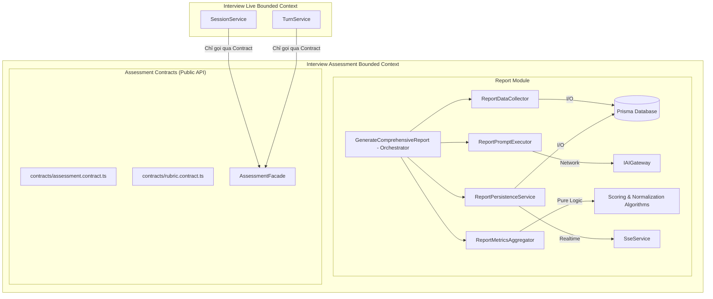

# KẾ HOẠCH CHI TIẾT: PHÂN RÃ BIG SERVICES & DECOUPLING BOUNDED CONTEXTS

> **Tài liệu**: Kế hoạch Tối ưu hóa, Phân rã Service & Chuẩn hóa Giao tiếp Kiến trúc Backend (`server/src`)  
> **Hệ thống**: Nền tảng AI Mock Interview Coach  
> **Phiên bản**: v1.0 - Thiết kế Kiến trúc & Lộ trình Kỹ thuật Chi tiết  
> **Mục tiêu**: Nâng cao tính module hóa, loại bỏ hoàn toàn code lặp, phân tách trách nhiệm đơn lẻ (SRP), tăng độ phủ kiểm thử đơn vị (Unit Testability) lên 100% cho logic tính toán lõi, và chuẩn hóa ranh giới giữa các Bounded Contexts mà không làm gián đoạn hệ thống.

---

## 1. TỔNG QUAN HIỆN TRẠNG & ĐỘNG LỰC TÁI CẤU TRÚC

### 1.1. Hiện trạng Kiến trúc Backend hiện tại
* Backend đang chạy trên NestJS với kiến trúc **Modular Monolith** gồm 3 tầng: `core/`, `infrastructure/`, `modules/` và 8 Bounded Contexts: `admin`, `auth`, `health`, `interview-assessment`, `interview-live`, `interview-prep`, `media`, `user`.
* Đã có tầng bảo vệ ranh giới tự động tại [architecture.spec.ts](file:///c:/Users/An/Documents/GR1/InterviewCoach/server/src/core/architecture.spec.ts).
* Các Controller giao tiếp trực tiếp với Service thông qua **Class Tokens** (Idiomatic NestJS pattern).
* Các dịch vụ ngoại vi (AI, Media Storage) đã được trừu tượng hóa qua Ports & Adapters (`IAIGateway`, `IMediaStorage`).

### 1.2. Các điểm nghẽn kỹ thuật cần khắc phục

| Vấn đề | Chi tiết kỹ thuật | Rủi ro / Tác động |
| :--- | :--- | :--- |
| **1. "God Service" trong khâu chấm điểm & báo cáo** | `GenerateComprehensiveReport` (617 dòng) đang gánh quá nhiều trách nhiệm: Query Prisma, chuẩn bị dữ liệu skipped answer, build AI Prompt, gọi AI Gateway, phân loại mã lỗi AI, fallback recovery, tính toán điểm số (dim scores, overall score), parse action plan, lưu DB và phát sự kiện realtime SSE. | Khó viết Unit Test độc lập; mỗi khi sửa đổi prompt hay công thức điểm phải mock toàn bộ DB + Network; nguy cơ hồi quy cao. |
| **2. Logic tính toán bị gắn chặt với I/O** | Các thuật toán tính điểm trung bình (dimension scores), trích xuất key takeaways, normalize action plan nằm lẫn bên trong hàm `execute()` chứa nhiều lệnh `await prisma...`. | Không thể test thuật toán scoring/parsing với các bộ test cases phức tạp nếu không khởi tạo container hoặc mock sâu. |
| **3. Import xuyên thấu (Deep Cross-Module Imports)** | Các Bounded Context import trực tiếp file nội bộ của nhau (ví dụ: `@modules/interview-live` import `@modules/interview-assessment/evaluation/rubric/rubric-catalog.service.ts`). | Gây phụ thuộc ẩn (tight coupling) vào cấu trúc file bên trong của module khác, cản trở việc tách microservice hoặc thay đổi cấu trúc nội bộ module. |

---

## 2. NGUYÊN TẮC THIẾT KẾ & MÔ HÌNH MỤC TIÊU

### 2.1. Nguyên tắc cốt lõi (Core Principles)
1. **Single Responsibility Principle (SRP)**: Mỗi service chỉ làm đúng một nhiệm vụ duy nhất (chỉ I/O, chỉ tính toán Pure Logic, hoặc chỉ giao tiếp AI).
2. **Pure Domain Logic Separation**: Tách 100% logic tính toán, parsing, sanitizing ra khỏi các tác vụ I/O (Database, Network, Queue) để viết Unit Tests nhanh và ổn định.
3. **Public Contract Encapsulation**: Mỗi Bounded Context xuất bản một thư mục `contracts/` chứa Public Interfaces / Facades / DTOs. Các context khác chỉ được phép import từ `contracts/`.
4. **Zero Downtime & Zero Regression**: Giữ nguyên vẹn toàn bộ API contracts hiện hành, schema cơ sở dữ liệu và bảo đảm mọi test suite (E2E, Integration) tiếp tục pass 100%.

---

### 2.2. Kiến trúc Mục tiêu sau Refactor



---

## 3. KẾ HOẠCH TRIỂN KHAI CHI TIẾT THEO 2 PHASE

### Phase 1: Phân rã các Big Services (Decomposition & Pure Testing) - [HOÀN THÀNH 100%]

Mục tiêu: Phân rã `GenerateComprehensiveReport` và tối ưu `EvaluateAnswer` thành các Sub-services độc lập, bổ sung Unit Tests cho từng thành phần. (Đã hoàn thành 5/5 tasks, 70/70 unit tests pass, TypeScript build pass).

#### Task 1.1: Tách `ReportMetricsAggregator` (`report-metrics-aggregator.service.ts`)
* **Trách nhiệm**: Pure domain logic xử lý dữ liệu và tính toán điểm số.
* **Chức năng**:
  * `calculateDimensionAverages(feedbackInputs: ReportFeedbackInput[])`: Tính điểm trung bình theo từng tiêu chí (behavioral/technical).
  * `calculateOverallScore(dimensionScores: Record<string, number>)`: Tính điểm tổng thể của phiên.
  * `normalizeActionPlan(raw: unknown, fallback: { items: string[] })`: Parse và chuẩn hóa danh sách hành động cải thiện.
  * `formatSkippedQuestionsFeedback(skippedTurns: TurnData[])`: Tạo feedback mặc định cho câu hỏi bị bỏ qua.
* **Kiểm thử**: Viết `report-metrics-aggregator.spec.ts` với 100% coverage cho mọi edge cases (điểm rỗng, format AI trả về sai, điểm vượt biên 0-100,...).

#### Task 1.2: Tách `ReportDataCollector` (`report-data-collector.service.ts`)
* **Trách nhiệm**: Đóng gói toàn bộ truy vấn Prisma để thu thập dữ liệu đầu vào cho báo cáo.
* **Chức năng**:
  * `collectReportData(sessionId: string, turnIds: string[])`: Truy vấn Session, User, Job Description, Turns, Answers, Feedback, và Criteria.
  * Validate tính toàn vẹn của dữ liệu trước khi sinh báo cáo.
* **Kiểm thử**: Viết Unit Test mock PrismaService để kiểm tra các trường hợp session hợp lệ và thiếu dữ liệu.

#### Task 1.3: Tách `ReportPromptExecutor` (`report-prompt-executor.service.ts`)
* **Trách nhiệm**: Xây dựng AI prompt và xử lý tương tác với `IAIGateway`.
* **Chức năng**:
  * `executeReportPrompt(params: PromptExecutionParams)`: Build system prompt, user prompt theo cấu hình đa ngôn ngữ (`vi` / `en`).
  * Bọc xử lý lỗi AI ngoại lệ: `isAIQuotaExceeded`, `isAIFallbackEligible`, tự động sinh fallback content khi AI gặp sự cố.
* **Kiểm thử**: Viết Unit Test mock IAIGateway (test cả nhánh thành công và nhánh kích hoạt fallback).

#### Task 1.4: Tách `ReportPersistenceService` (`report-persistence.service.ts`)
* **Trách nhiệm**: Lưu trữ kết quả và phát thông báo realtime.
* **Chức năng**:
  * `saveReportTransaction(...)`: Thực thi Prisma transaction lưu bản ghi Report và cập nhật trạng thái Turn/Session.
  * `notifyReportProgress(...)`: Phát SSE event cho frontend client qua `SseService`.

#### Task 1.5: Tinh gọn `GenerateComprehensiveReport` (Orchestrator)
* `GenerateComprehensiveReport` trở thành Orchestrator tinh gọn (< 80 dòng code), chỉ thực hiện điều phối tuần tự:
  ```typescript
  // Luồng thực thi rõ ràng, dễ đọc:
  const data = await this.dataCollector.collect(job.sessionId, job.turnIds);
  const aiResult = await this.promptExecutor.execute(data);
  const metrics = this.metricsAggregator.aggregate(data, aiResult);
  return await this.persistence.saveAndNotify(job.sessionId, metrics);
  ```

---

### Phase 2: Decoupling & Chuẩn hóa Giao tiếp Bounded Contexts - [HOÀN THÀNH 100%]

Mục tiêu: Xóa bỏ hoàn toàn việc import trực tiếp vào file nội bộ giữa các Bounded Contexts, thay thế bằng **Public Module Contracts & Facades** (Đã hoàn thành 3/3 tasks, 66/66 test suites, 507 unit tests pass 100%, architecture guard test pass).

#### Task 2.1: Thiết lập thư mục `contracts/` cho từng Bounded Context
Tạo các file contract công khai đóng vai trò là API Interface của module:
1. `@modules/interview-assessment/contracts/`:
   * `assessment-facade.interface.ts`: Định nghĩa các phương thức mà context khác được phép gọi (ví dụ `getRubricCatalog()`, `getContextPack()`, `getReportProgress()`).
   * `assessment-facade.service.ts`: Implement Facade và delegate vào các service nội bộ.
   * `index.ts`: Export các DTOs và Interfaces công khai.
2. `@modules/interview-prep/contracts/`:
   * `prep-facade.interface.ts`: Cung cấp `getQuestionCriteria()`.
   * `index.ts`: Export Public Contracts.
3. `@modules/media/contracts/`:
   * `media-facade.interface.ts`: Cung cấp `uploadAudio()`, `getAudioUrl()`.
   * `index.ts`: Export Public Contracts.

#### Task 2.2: Refactor các điểm gọi xuyên module sang dùng Facade
* Thay thế toàn bộ direct imports trong `@modules/interview-live` và `@modules/media` sang import từ `@modules/<context>/contracts`.
* Không còn bất kỳ file nào trỏ tới đường dẫn con sâu dạng `@modules/interview-assessment/evaluation/rubric/rubric-catalog.service`.

#### Task 2.3: Nâng cấp `architecture.spec.ts` để bảo vệ ranh giới mới
* Cập nhật quy tắc kiểm tra trong `architecture.spec.ts`:
  * Xóa bỏ danh sách whitelist import file con `APPROVED_CROSS_MODULE_IMPORTS`.
  * Thêm rule: **Mọi import xuyên Bounded Context chỉ được phép trỏ tới `@modules/<target-context>/contracts` hoặc `@modules/<target-context>/<context>.module`**.
  * Bất kỳ import nào trỏ vào thư mục con khác của module ngoại lai sẽ bị fail test ngay lập tức.

---

## 4. KẾ HOẠCH KIỂM THỬ VÀ NGHIỆM THU (VERIFICATION PLAN)

```text
┌─────────────────────────────────────────────────────────────┐
│                    TIÊU CHÍ NGHIỆM THU                      │
├─────────────────────────────────────────────────────────────┤
│ 1. [Unit Tests]: 100% test case mới cho Aggregator,         │
│    Collector, PromptExecutor và Facades pass.               │
│ 2. [Integration Tests]: npm run test:int pass 100%.         │
│    (Bảo đảm session-completion-flow & report-dispatch ok).  │
│ 3. [E2E Tests]: npm run test:e2e pass 100%.                 │
│ 4. [Architecture Tests]: npx jest architecture.spec.ts      │
│    pass 100% mà không có bất kỳ import vi phạm nào.         │
│ 5. [Runtime Check]: Dev server khởi động không lỗi.         │
└─────────────────────────────────────────────────────────────┘
```

### Các lệnh kiểm tra tự động:
1. Chạy unit tests:
   ```bash
   npm run test -- src/modules/interview-assessment/report/
   ```
2. Chạy architecture tests:
   ```bash
   npx jest src/core/architecture.spec.ts
   ```
3. Chạy integration tests:
   ```bash
   npm run test:int
   ```
4. Kiểm tra TypeScript build:
   ```bash
   npm run build
   ```
