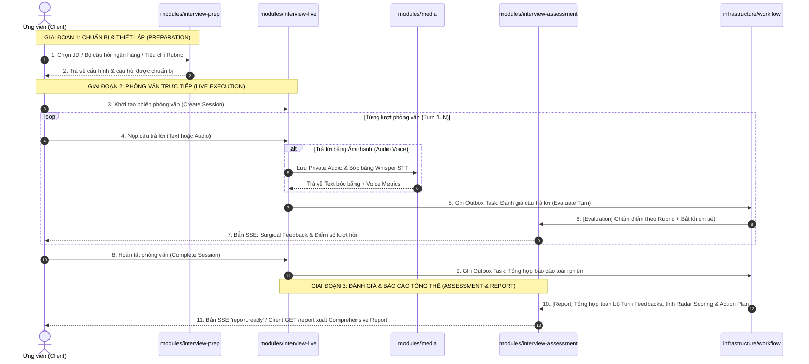

# KẾ HOẠCH CHI TIẾT TÁI CẤU TRÚC BACKEND THEO 3 TẦNG CLEAN ARCHITECTURE & BOUNDED CONTEXTS

> **Tài liệu**: Kế hoạch triển khai tái cấu trúc thư mục và kiến trúc Backend (`server/src`)  
> **Hệ thống**: Nền tảng AI Mock Interview Coach  
> **Trạng thái**: Bản kế hoạch phân đoạn chi tiết (Sẵn sàng triển khai theo từng phần nhỏ)  
> **Mục tiêu**: Tái tổ chức toàn bộ `server/src` từ cấu trúc 22 thư mục phẳng hiện tại thành **3 tầng rõ ràng (Core - Infrastructure - Modules)**, gom nhóm nghiệp vụ phỏng vấn thành **3 Bounded Contexts theo vòng đời chuẩn (Prep - Live - Assessment)**, tách riêng hạ tầng Media STT (`media`), và cung cấp bản đồ kiến trúc trực quan giúp developer mới nắm bắt hệ thống trong vòng 15 phút.

---

## 1. ĐÁNH GIÁ THỰC TRẠNG & PHÂN TÍCH ĐIỂM NGHẼN (CURRENT STATE ANALYSIS)

### 1.1. Thực trạng 22 thư mục phẳng (Flat Root Structure)
```text
server/src/
├── admin/                  ├── infrastructure/        ├── session/
├── ai/                     ├── interview/             ├── test-utils/
├── architecture/           ├── question/              ├── turn/
├── assessment/             ├── question-bank/         ├── types/
├── auth/                   ├── question-criteria/     ├── user/
├── common/                 ├── report/                ├── workflow/
├── config/                 ├── runtime/
├── health/                 ├── saved-job-description/
├── app.module.ts           └── main.ts
```

### 1.2. Các điểm nghẽn nhận thức đối với Developer mới

| Vấn đề | Chi tiết thực tế | Tác động tới Dev mới |
| :--- | :--- | :--- |
| **1. Đặt tên sai lệch ngữ nghĩa (Misleading Domain Naming)** | Thư mục `src/interview/` thực chất **chỉ chứa logic xử lý file âm thanh và bóc băng Whisper STT** (`speech-to-text.service.ts`, `supabase-media-storage.adapter.ts`, `transcription.processor.ts`). Toàn bộ nghiệp vụ phỏng vấn cốt lõi lại nằm rải rác ở `session/`, `turn/`, `assessment/`, `report/`. | Dev mới bấm ngay vào `interview/` và bối rối vì không thấy luồng phỏng vấn đâu, chỉ thấy code upload audio. |
| **2. Phân mảnh miền dữ liệu (Domain Fragmentation)** | Miền chuẩn bị câu hỏi bị phân thành 4 thư mục riêng biệt ở root: `question/`, `question-bank/`, `question-criteria/`, `saved-job-description/`. | Khó hình dung bức tranh tổng thể về khâu chuẩn bị phỏng vấn (Preparation phase) vs khâu làm bài (Execution phase). |
| **3. Trộn lẫn các tầng trách nhiệm (Mixed Architectural Layers)** | 22 thư mục phẳng đặt ngang hàng nhau, không phân biệt đâu là **Hạ tầng (Infrastructure)**, đâu là **Lõi kỹ thuật (Core/Shared)**, và đâu là **Nghiệp vụ ứng dụng (Business Modules)**. | Không biết bắt đầu đọc từ đâu; không phân biệt được đâu là code framework tái sử dụng và đâu là domain logic. |
| **4. Thiếu tách bạch vòng đời phỏng vấn 3 giai đoạn** | Nghiệp vụ phỏng vấn chia cắt giữa `session/`, `turn/`, `assessment/`, `report/` mà không phân định ranh giới giữa: (1) Chuẩn bị, (2) Tiến trình trực tiếp, và (3) Đánh giá - Phản hồi - Báo cáo sau phiên. | Khó theo dõi và mở rộng từng giai đoạn độc lập (ví dụ nâng cấp thuật toán Rubric / Radar Report mà không ảnh hưởng luồng WebSocket/Turn). |

---

## 2. BẢN ĐỒ KIẾN TRÚC MỤC TIÊU (PROPOSED 3-LAYER ARCHITECTURE)

```text
server/src/
│
├── core/                                      ──► [TẦNG 1: NỀN TẢNG CHUNG - ZERO BUSINESS LOGIC]
│   ├── common/                                (Filters, Interceptors, Guards, Middleware, Constants, Swagger)
│   ├── config/                                (Environment Validation, Global Config)
│   ├── runtime/                               (HTTP Server vs Background Worker Roles)
│   ├── types/                                 (Global Domain Types & Enums)
│   └── test-utils/                            (Shared Test Fixtures & Mocks)
│
├── infrastructure/                            ──► [TẦNG 2: HẠ TẦNG KỸ THUẬT - PORTS & ADAPTERS]
│   ├── database/prisma/                       (Prisma ORM, Connection Resilience, Base Repositories)
│   ├── ai/                                    (OpenAI Gateway, Prompt Builders, Zod Schema Validators)
│   ├── storage/                               (IPrivateMediaStorageAdapter, SupabaseMediaAdapter)
│   ├── workflow/                              (Transactional Outbox Engine, BullMQ Dispatcher)
│   └── realtime/                              (WebSocket / SSE Gateway)
│
├── modules/                                   ──► [TẦNG 3: NGHIỆP VỤ ỨNG DỤNG - BOUNDED CONTEXTS]
│   ├── auth/                                  (Authentication, JWT, Password Hashing, Guards)
│   ├── user/                                  (User Profiles, Account Management)
│   ├── admin/                                 (System Ops, Metrics, Operational Dashboards)
│   ├── health/                                (Liveness & Readiness Probes)
│   │
│   ├── media/                                 ──► [Context: Xử lý Âm thanh & Bóc băng STT]
│   │   ├── speech-to-text.service.ts
│   │   ├── voice-metrics.service.ts
│   │   ├── transcribe-answer.service.ts
│   │   ├── transcription.processor.ts
│   │   └── media.module.ts
│   │
│   ├── interview-prep/                        ──► [Context 1: Chuẩn bị & Tài nguyên Phỏng vấn (Trước)]
│   │   ├── interview-prep.module.ts           (Aggregator Module)
│   │   ├── question-generation/               (AI Dynamic Question Generator & BullMQ Processor)
│   │   ├── question-bank/                     (Curated Question Bank & Catalog)
│   │   ├── question-criteria/                 (Assessment Rubric Criteria & Evaluation Benchmarks)
│   │   └── job-description/                   (Saved JD CRUD & Resume Context Parsing)
│   │
│   ├── interview-live/                        ──► [Context 2: Tiến trình Phỏng vấn Trực tiếp (Trong)]
│   │   ├── interview-live.module.ts           (Aggregator Module)
│   │   ├── session/                           (Session Lifecycle, Mode Strategies: HR / Technical, Timers)
│   │   └── turn/                              (Turn Management, Intake Handlers: Text / Voice, Audio Linkage)
│   │
│   └── interview-assessment/                  ──► [Context 3: Đánh giá, Phản hồi & Báo cáo (Sau)]
│       ├── interview-assessment.module.ts     (Aggregator Module)
│       ├── evaluation/                        (Turn Evaluation, Rubric Scoring, Feedback Sanitizer, Worker)
│       └── report/                            (Comprehensive Session Report, Radar Scoring Matrix, Action Plan)
│
├── architecture/                              ──► [KIỂM SOÁT RANH GIỚI TỰ ĐỘNG]
│   └── feature-boundaries.spec.ts             (Automated Boundary Enforcer)
│
├── app.module.ts                              ──► [ROOT MODULE KẾT NỐI RÚT GỌN]
└── main.ts
```

---

## 3. SƠ ĐỒ LUỒNG DỮ LIỆU VÒNG ĐỜI 3 GIAI ĐOẠN (DATA FLOW & SEQUENCE DIAGRAM)



---

## 4. BẢNG ÁNH XẠ TOÀN BỘ FILE & THƯ MỤC (EXACT FILE MAPPING)

### 4.1. Tầng Core (`src/core/`)
| Đường dẫn hiện tại | Đường dẫn mục tiêu | Chức năng / Trách nhiệm |
| :--- | :--- | :--- |
| `src/common/*` | `src/core/common/*` | Exceptions, Filters, Guards, Middleware, Constants, Swagger |
| `src/config/*` | `src/core/config/*` | `env.validation.ts`, `env.validation.spec.ts` |
| `src/runtime/*` | `src/core/runtime/*` | `runtime-role.ts`, `runtime-role.spec.ts` |
| `src/types/*` | `src/core/types/*` | Shared global types |
| `src/test-utils/*` | `src/core/test-utils/*` | Shared testing mocks & helpers |

### 4.2. Tầng Infrastructure (`src/infrastructure/`)
| Đường dẫn hiện tại | Đường dẫn mục tiêu | Chức năng / Trách nhiệm |
| :--- | :--- | :--- |
| `src/infrastructure/database/prisma/*` | `src/infrastructure/database/prisma/*` | Prisma client, Database connection error handler |
| `src/infrastructure/realtime/*` | `src/infrastructure/realtime/*` | SSE / Redis PubSub services |
| `src/ai/*` | `src/infrastructure/ai/*` | `OpenAIGateway`, `IAIGateway`, Prompts, Pipelines, Zod Validator |
| `src/workflow/*` | `src/infrastructure/workflow/*` | `WorkflowDispatcherService`, Outbox resilience, Outbox job |
| `src/interview/media-storage.interface.ts` <br> `src/interview/supabase-media-storage.adapter.ts` | `src/infrastructure/storage/media-storage.interface.ts` <br> `src/infrastructure/storage/supabase-media-storage.adapter.ts` | Adapter lưu trữ file âm thanh an toàn, cấp presigned URLs |

### 4.3. Tầng Modules - Bounded Contexts (`src/modules/`)
| Thư mục hiện tại | Thư mục mục tiêu | File chính / Mô tả |
| :--- | :--- | :--- |
| `src/auth/*` | `src/modules/auth/*` | `AuthModule`, `AuthController`, `AuthService`, Guards, Decorators |
| `src/user/*` | `src/modules/user/*` | `UserModule`, `UserController`, `UserService` |
| `src/admin/*` | `src/modules/admin/*` | `AdminModule`, `AdminController`, `AdminService` |
| `src/health/*` | `src/modules/health/*` | `HealthModule`, `HealthController` |
| `src/interview/*` *(Phần còn lại)* | `src/modules/media/*` | `MediaModule`, `SpeechToTextService`, `VoiceMetricsService`, `TranscribeAnswerService`, `TranscriptionProcessor` |
| `src/question/*` | `src/modules/interview-prep/question-generation/*` | `QuestionGenerationModule`, `GenerateSessionQuestionsService`, `QuestionGenerationProcessor` |
| `src/question-bank/*` | `src/modules/interview-prep/question-bank/*` | `QuestionBankModule`, `QuestionBankService` |
| `src/question-criteria/*` | `src/modules/interview-prep/question-criteria/*` | `QuestionCriteriaModule`, `QuestionCriteriaService` |
| `src/saved-job-description/*` | `src/modules/interview-prep/job-description/*` | `JobDescriptionModule`, `SavedJobDescriptionController`, `SavedJobDescriptionService` |
| *(Mới)* | `src/modules/interview-prep/interview-prep.module.ts` | **Aggregator Module** kết nối 4 module con chuẩn bị phỏng vấn |
| `src/session/*` | `src/modules/interview-live/session/*` | `SessionModule`, `SessionController`, `SessionService`, Strategies (`hr`, `technical`) |
| `src/turn/*` | `src/modules/interview-live/turn/*` | `TurnModule`, `TurnController`, `TurnService`, Intake Handlers (`text`, `voice`) |
| *(Mới)* | `src/modules/interview-live/interview-live.module.ts` | **Aggregator Module** kết nối Session và Turn |
| `src/assessment/*` | `src/modules/interview-assessment/evaluation/*` | `EvaluationModule`, `EvaluateAnswerService`, `ContextPackService`, `RubricCatalogService`, `FeedbackProcessor` |
| `src/report/*` | `src/modules/interview-assessment/report/*` | `ReportModule`, `ReportController`, `ReportService`, `GenerateComprehensiveReportService`, `ReportProcessor` |
| *(Mới)* | `src/modules/interview-assessment/interview-assessment.module.ts` | **Aggregator Module** kết nối Evaluation và Report |

---

## 5. KẾ HOẠCH TRIỂN KHAI THEO PHÂN ĐOẠN (PHASED EXECUTION CHECKLIST)

Bản kế hoạch được chia thành **12 phần nhỏ độc lập** để triển khai an toàn và tuần tự:

### [ ] Phần 1: Cấu hình TypeScript Path Aliases (`server/tsconfig.json`)
- [ ] Bổ sung các alias `@core/*`, `@infra/*`, `@modules/*` vào `server/tsconfig.json`.
- [ ] Giữ nguyên `@/*` trỏ về `./src/*` để đảm bảo tương thích ngược trong quá trình migrate.

```json
{
  "compilerOptions": {
    "paths": {
      "@/*": ["./src/*"],
      "@core/*": ["./src/core/*"],
      "@infra/*": ["./src/infrastructure/*"],
      "@modules/*": ["./src/modules/*"]
    }
  }
}
```

---

### [ ] Phần 2: Di chuyển & Tổ chức Tầng Core (`src/core/`)
- [ ] Tạo thư mục `server/src/core/`.
- [ ] Di chuyển `common/` $\rightarrow$ `src/core/common/`.
- [ ] Di chuyển `config/` $\rightarrow$ `src/core/config/`.
- [ ] Di chuyển `runtime/` $\rightarrow$ `src/core/runtime/`.
- [ ] Di chuyển `types/` $\rightarrow$ `src/core/types/`.
- [ ] Di chuyển `test-utils/` $\rightarrow$ `src/core/test-utils/`.
- [ ] Cập nhật các import nội bộ trong `src/core/` và chạy unit tests của core (`npm test src/core`).

---

### [ ] Phần 3: Di chuyển & Tổ chức Tầng Infrastructure (`src/infrastructure/`)
- [ ] Di chuyển `ai/` $\rightarrow$ `src/infrastructure/ai/`.
- [ ] Di chuyển `workflow/` $\rightarrow$ `src/infrastructure/workflow/`.
- [ ] Tạo `src/infrastructure/storage/`, di chuyển `media-storage.interface.ts` và `supabase-media-storage.adapter.ts` từ `src/interview/` sang.
- [ ] Tạo `storage.module.ts` để export Storage Providers.
- [ ] Giữ nguyên `database/prisma/` và `realtime/` trong `src/infrastructure/`.
- [ ] Cập nhật các import và chạy tests của infrastructure (`npm test src/infrastructure`).

---

### [ ] Phần 4: Xây dựng Bounded Context Media (`src/modules/media/`)
- [ ] Tạo thư mục `src/modules/media/`.
- [ ] Di chuyển các file xử lý âm thanh từ `src/interview/` sang `src/modules/media/`:
  - `speech-to-text.service.ts` & `.spec.ts`
  - `voice-metrics.service.ts` & `.spec.ts`
  - `transcribe-answer.service.ts` & `.spec.ts`
  - `transcription.processor.ts`
  - `transcription-job.dto.ts`
  - `audio-object-storage.service.ts`
  - `upload-and-transcribe-answer-audio.service.ts`
- [ ] Đổi tên `InterviewModule` $\rightarrow$ `MediaModule` trong `src/modules/media/media.module.ts`.
- [ ] Xóa thư mục cũ `src/interview/`.
- [ ] Chạy tests của media (`npm test src/modules/media`).

---

### [ ] Phần 5: Xây dựng Bounded Context Interview Prep (`src/modules/interview-prep/`)
- [ ] Tạo thư mục `src/modules/interview-prep/`.
- [ ] Di chuyển `src/question/` $\rightarrow$ `src/modules/interview-prep/question-generation/`.
- [ ] Di chuyển `src/question-bank/` $\rightarrow$ `src/modules/interview-prep/question-bank/`.
- [ ] Di chuyển `src/question-criteria/` $\rightarrow$ `src/modules/interview-prep/question-criteria/`.
- [ ] Di chuyển `src/saved-job-description/` $\rightarrow$ `src/modules/interview-prep/job-description/`.
- [ ] Tạo Aggregator Module `interview-prep.module.ts` kết nối 4 module trên.
- [ ] Chạy tests của interview-prep (`npm test src/modules/interview-prep`).

---

### [ ] Phần 6: Xây dựng Bounded Context Interview Live (`src/modules/interview-live/`)
- [ ] Tạo thư mục `src/modules/interview-live/`.
- [ ] Di chuyển `src/session/` $\rightarrow$ `src/modules/interview-live/session/`.
- [ ] Di chuyển `src/turn/` $\rightarrow$ `src/modules/interview-live/turn/`.
- [ ] Tạo Aggregator Module `interview-live.module.ts` kết nối Session và Turn modules.
- [ ] Chạy tests của interview-live (`npm test src/modules/interview-live`).

---

### [ ] Phần 7: Xây dựng Bounded Context Interview Assessment (`src/modules/interview-assessment/`)
- [ ] Tạo thư mục `src/modules/interview-assessment/`.
- [ ] Di chuyển `src/assessment/` $\rightarrow$ `src/modules/interview-assessment/evaluation/`.
- [ ] Di chuyển `src/report/` $\rightarrow$ `src/modules/interview-assessment/report/`.
- [ ] Tạo Aggregator Module `interview-assessment.module.ts` kết nối Evaluation và Report modules.
- [ ] Chạy tests của interview-assessment (`npm test src/modules/interview-assessment`).

---

### [ ] Phần 8: Di chuyển Identity & Admin Modules
- [ ] Di chuyển `src/auth/` $\rightarrow$ `src/modules/auth/`.
- [ ] Di chuyển `src/user/` $\rightarrow$ `src/modules/user/`.
- [ ] Di chuyển `src/admin/` $\rightarrow$ `src/modules/admin/`.
- [ ] Di chuyển `src/health/` $\rightarrow$ `src/modules/health/`.
- [ ] Chạy tests của các modules này (`npm test src/modules/auth src/modules/user src/modules/admin src/modules/health`).

---

### [ ] Phần 9: Cập nhật Root `AppModule` (`src/app.module.ts`)
- [ ] Cập nhật lại các import trong `src/app.module.ts` theo cấu trúc gọn gàng:

```typescript
import { Module, NestModule, MiddlewareConsumer } from '@nestjs/common';
import { ConfigModule, ConfigService } from '@nestjs/config';
import { BullModule } from '@nestjs/bullmq';
import { APP_FILTER, APP_GUARD } from '@nestjs/core';

// Core & Infra
import { CommonModule } from '@core/common/common.module';
import { validateEnv } from '@core/config/env.validation';
import { InterviewAIExceptionFilter } from '@core/common/exceptions/interview-ai-exception.filter';
import { MaintenanceModeGuard } from '@core/common/guards/maintenance-mode.guard';
import { RequestIdMiddleware } from '@core/common/middleware/request-id.middleware';
import { PrismaModule } from '@infra/database/prisma/prisma.module';
import { AiModule } from '@infra/ai/ai.module';
import { WorkflowModule } from '@infra/workflow/workflow.module';

// Business Modules
import { HealthModule } from '@modules/health/health.module';
import { AuthModule } from '@modules/auth/auth.module';
import { UserModule } from '@modules/user/user.module';
import { AdminModule } from '@modules/admin/admin.module';
import { MediaModule } from '@modules/media/media.module';
import { InterviewPrepModule } from '@modules/interview-prep/interview-prep.module';
import { InterviewLiveModule } from '@modules/interview-live/interview-live.module';
import { InterviewAssessmentModule } from '@modules/interview-assessment/interview-assessment.module';

@Module({
  imports: [
    ConfigModule.forRoot({ isGlobal: true, validate: validateEnv }),
    BullModule.forRootAsync({
      useFactory: (config: ConfigService) => ({
        connection: {
          host: config.get<string>('REDIS_HOST'),
          port: config.get<number>('REDIS_PORT'),
        },
      }),
      inject: [ConfigService],
    }),
    CommonModule,
    HealthModule,
    PrismaModule,
    AuthModule,
    UserModule,
    AdminModule,
    AiModule,
    WorkflowModule,
    MediaModule,
    InterviewPrepModule,
    InterviewLiveModule,
    InterviewAssessmentModule,
  ],
  providers: [
    { provide: APP_FILTER, useClass: InterviewAIExceptionFilter },
    { provide: APP_GUARD, useClass: MaintenanceModeGuard },
  ],
})
export class AppModule implements NestModule {
  configure(consumer: MiddlewareConsumer) {
    consumer.apply(RequestIdMiddleware).forRoutes('*');
  }
}
```

---

### [ ] Phần 10: Cập nhật Automated Boundary Tests (`feature-boundaries.spec.ts`)
- [ ] Cập nhật lại danh sách FEATURES và các quy tắc kiểm tra ranh giới kiến trúc trong `src/architecture/feature-boundaries.spec.ts`:
  1. `core/` không phụ thuộc vào `infrastructure/` hoặc `modules/`.
  2. `controllers` trong `modules/` không được import trực tiếp persistence (`@prisma/client`), queue (`bullmq`), hay external SDK (`openai`, `supabase`).
  3. Cross-module imports giữa các Bounded Contexts chỉ thông qua public interfaces / aggregator exports.
- [ ] Chạy `npm test src/architecture/feature-boundaries.spec.ts` đảm bảo `PASS`.

---

### [ ] Phần 11: Kiểm thử toàn diện & Build Check
- [ ] Chạy toàn bộ test suites của backend:
  ```bash
  npm test
  ```
  *(Yêu cầu: 59/59 test suites passed, 459/459 tests passed)*
- [ ] Chạy build TypeScript kiểm tra không còn broken imports:
  ```bash
  npm run build
  ```

---

### [ ] Phần 12: Cập nhật Tài liệu Onboarding & Visual Architecture Guide
- [ ] Cập nhật `server/README.md` với sơ đồ 3 tầng và hướng dẫn cho dev mới.
- [ ] Cập nhật `server/CLAUDE.md` với quy chuẩn vị trí đặt file mới (Core, Infra, Bounded Contexts).
