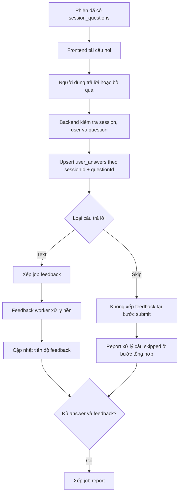
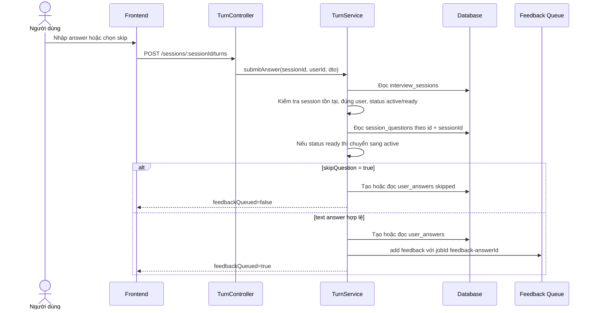
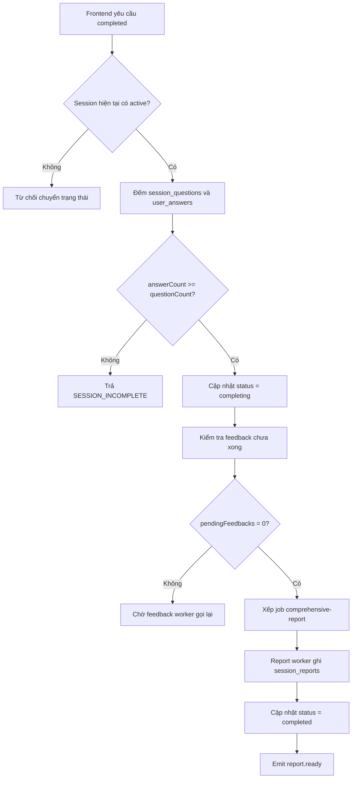

### 4.5.4 Thực hiện phiên và lưu câu trả lời

**a. Mục đích của tính năng**

Tính năng thực hiện phiên cho phép người dùng làm việc với danh sách câu hỏi đã được tạo ở bước trước. Người dùng mở phiên, xem từng câu hỏi, gửi câu trả lời, có thể bỏ qua câu hỏi và cuối cùng chuyển phiên sang giai đoạn tổng hợp báo cáo.

Trọng tâm của tính năng này không phải là chấm điểm ngay trong request gửi câu trả lời. Backend chỉ cần ghi nhận dữ liệu trả lời đúng phiên, đúng câu hỏi, đúng người dùng và đưa các tác vụ nặng như feedback và report sang hàng đợi xử lý nền. Cách thiết kế này giúp request trả lời nhanh hơn, đồng thời hạn chế lỗi mất dữ liệu khi AI hoặc queue xử lý chậm.

Ba yêu cầu quan trọng của chức năng là:

| Yêu cầu | Ý nghĩa |
| --- | --- |
| Đúng chủ sở hữu | Người dùng chỉ được gửi câu trả lời cho phiên của chính mình. |
| Đúng câu hỏi | Câu trả lời chỉ được ghi nếu `questionId` thuộc về `sessionId` đang xử lý. |
| Không ghi trùng | Mỗi cặp phiên - câu hỏi chỉ có một bản ghi trong `user_answers`. |

Sơ đồ tổng quát:

**b. Dữ liệu đầu vào và đầu ra**

Frontend gọi các endpoint chính sau trong quá trình thực hiện phiên:

| Endpoint | Mục đích |
| --- | --- |
| `GET /sessions/:id/status` | Kiểm tra trạng thái phiên và số câu hỏi. |
| `GET /sessions/:id/questions` | Lấy danh sách câu hỏi, trạng thái đã trả lời và vị trí câu hiện tại. |
| `POST /sessions/:sessionId/turns` | Gửi câu trả lời dạng văn bản hoặc ghi nhận bỏ qua câu hỏi. |
| `PATCH /sessions/:id/status` | Chuyển trạng thái phiên, ví dụ pause, active, canceled hoặc completed. |
| `GET /sessions/:id/feedback-progress` | Theo dõi số feedback đã hoàn tất trong lúc chờ báo cáo. |
| `GET /sessions/:id/events` | Nhận sự kiện SSE như `turn.feedback_ready`, `session.feedback_progress`, `report.ready`. |

Payload gửi câu trả lời gồm các trường chính:

| Trường | Vai trò |
| --- | --- |
| `questionId` | Xác định câu hỏi trong `session_questions`. |
| `answerMode` | Ở phạm vi hiện tại, luồng được mô tả sử dụng chế độ `text`. |
| `answerText` | Nội dung câu trả lời văn bản. Nếu không phải skip, trường này phải đủ tối thiểu 10 ký tự. |
| `skipQuestion` | Đánh dấu người dùng bỏ qua câu hỏi. Khi có cờ này, backend cho phép không có `answerText`. |

Kết quả trả về từ `POST /sessions/:sessionId/turns` gồm:

| Trường trả về | Ý nghĩa |
| --- | --- |
| `answerId` | Mã bản ghi trong `user_answers`. |
| `feedbackQueued` | Cho biết feedback đã được xếp hàng hay chưa. |

Các bảng dữ liệu liên quan:

| Bảng | Vai trò trong bước này |
| --- | --- |
| `interview_sessions` | Lưu chủ sở hữu, loại phiên, ngôn ngữ, context pack và trạng thái phiên. |
| `session_questions` | Lưu danh sách câu hỏi đã khóa cho phiên. |
| `session_question_criteria` | Lưu các tiêu chí rubric gắn với từng câu hỏi để feedback dùng lại. |
| `user_answers` | Lưu câu trả lời văn bản, trạng thái skip và cờ `feedback_generated`. |
| `ai_feedbacks` | Được worker feedback tạo sau, không được tạo trực tiếp trong request submit. |

**c. Luồng xử lý nghiệp vụ**

Khi người dùng mở màn hình phỏng vấn, frontend đọc trạng thái phiên và danh sách câu hỏi. Backend trả danh sách câu hỏi theo `orderIndex`, kèm thông tin câu nào đã có answer. Nếu phiên đã có câu hỏi nhưng vẫn còn trạng thái `generating` hoặc `ready`, backend tự chuyển phiên sang `active`. Cách này giúp phiên cũ hoặc phiên vừa sinh xong không bị kẹt ở trạng thái chờ.

Backend cũng tính `currentIndex` bằng cách tìm câu đầu tiên chưa có answer. Nếu tất cả câu hỏi đều đã có answer, `currentIndex` trỏ về câu cuối. Nhờ đó khi người dùng reload trang hoặc quay lại phiên, frontend có thể mở đúng vị trí tiếp tục thay vì luôn quay về câu đầu.

Luồng gửi một câu trả lời:

Sau khi tất cả câu hỏi đã có answer, frontend gửi yêu cầu chuyển trạng thái phiên sang `completed`. Trong backend, request này không đặt thẳng phiên thành `completed`. `SessionService` kiểm tra số câu hỏi và số answer; nếu đủ, phiên được chuyển sang `completing`. Sau đó `ReportService` chỉ xếp job report khi mọi feedback bắt buộc đã xong. Worker tổng hợp báo cáo mới là nơi chuyển phiên sang `completed`.

Luồng hoàn tất phiên:

**d. Thiết kế giao diện frontend**

Giao diện phiên cần hiển thị một câu hỏi tại một thời điểm, vị trí hiện tại, tổng số câu, thời gian còn lại và vùng nhập câu trả lời. Khi người dùng gửi câu trả lời thành công, frontend chuyển sang câu tiếp theo dựa trên danh sách đã tải từ backend.

Frontend không tự quyết định câu hỏi nào đã hoàn thành chỉ bằng trạng thái local. Khi tải lại phiên, frontend dựa vào `GET /sessions/:id/questions`, vì backend trả sẵn `answered`, `answerId`, `skipped` và `currentIndex`. Đây là điểm quan trọng để tránh mất tiến độ khi reload trang hoặc khi người dùng tạm dừng rồi quay lại.

Với câu trả lời văn bản, giao diện gửi trực tiếp `answerText`. Nếu người dùng chọn bỏ qua, giao diện gửi `skipQuestion = true` để backend ghi nhận câu hỏi đã được xử lý nhưng không xếp feedback cho câu đó.

Khi phiên được chuyển sang `completing`, giao diện không nên coi báo cáo đã sẵn sàng ngay. Người dùng cần được đưa sang trạng thái chờ báo cáo, theo dõi `feedback-progress` hoặc SSE. Khi nhận `report.ready`, frontend mới mở báo cáo hoàn chỉnh.

**e. Thiết kế xử lý backend**

Backend xử lý câu trả lời qua ba lớp chính:

| Lớp | Thành phần | Trách nhiệm |
| --- | --- | --- |
| HTTP | `TurnController` | Nhận request đã qua JWT, lấy `sessionId`, `userId` và DTO. |
| Nghiệp vụ | `TurnService.submitAnswer()` | Kiểm tra phiên, câu hỏi, trạng thái, lưu `user_answers`, xếp queue phù hợp. |
| Xử lý nền | `FeedbackProcessor`, `ComprehensiveReportProcessor` | Tạo feedback cho câu trả lời và tổng hợp report. |

Các bước kiểm tra đầu vào trong backend:

| Bước | Cách xử lý |
| --- | --- |
| Kiểm tra phiên | Tìm `interview_sessions` theo `sessionId`. Không có thì trả `SESSION_NOT_FOUND`. |
| Kiểm tra quyền | So sánh `session.userId` với người dùng trong JWT. Sai thì trả `FORBIDDEN`. |
| Kiểm tra trạng thái | Chỉ nhận submit khi session đang `active` hoặc `ready`. Trạng thái khác bị từ chối bằng `SESSION_NOT_ACTIVE`. |
| Kiểm tra loại phiên | `sessionType` phải thuộc `hr`, `technical`, `mixed`. Dữ liệu ngoài contract bị coi là lỗi server. |
| Kiểm tra câu hỏi | Tìm `session_questions` bằng cả `questionId` và `sessionId`. Không tìm thấy thì từ chối. |
| Kích hoạt phiên | Nếu phiên đang `ready`, backend cập nhật sang `active` trước khi lưu answer. |

Sau bước kiểm tra, backend xử lý theo ba nhánh:

| Nhánh | Điều kiện | Dữ liệu ghi vào `user_answers` | Queue sau đó |
| --- | --- | --- | --- |
| Skip | `skipQuestion = true` | `answerMode = text`, `answerText = ""`, `skipped = true`, `feedbackGenerated = false` | Không xếp feedback tại request submit. |
| Text answer | Có `answerText` hợp lệ | Nội dung đã trim, `skipped = false`, `feedbackGenerated = false` | Xếp `feedback` với `jobId = feedback-{answerId}`. |

Ràng buộc quan trọng nằm ở bảng `user_answers`: cặp `(session_id, question_id)` là duy nhất. Vì vậy cùng một câu hỏi trong cùng một phiên không thể sinh nhiều answer. Trong service, backend dùng `findUnique` và `upsert` theo cặp này. Nếu request bị retry, backend dùng lại `answerId` hiện có thay vì tạo bản ghi mới. Với nhánh text answer, nếu answer đã tồn tại, backend không ghi đè nội dung cũ mà chỉ dùng lại bản ghi đó để xếp lại feedback khi cần.

Payload feedback không lấy metadata đánh giá từ frontend. Backend đọc câu hỏi thật từ `session_questions`, đọc tiêu chí từ `session_question_criteria`, sau đó tạo job gồm `sessionId`, `answerId`, `questionId`, `questionText`, `questionCategory`, `competencyDomains`, `answerText`, `contextPack`, `sessionType` và `language`. Nhờ vậy frontend chỉ gửi câu trả lời, còn dữ liệu chấm điểm vẫn do backend kiểm soát.

`FeedbackProcessor` nhận job feedback, gọi pipeline AI theo loại phiên để chấm câu trả lời, ghi `ai_feedbacks`, ghi các `annotated_segments`, rồi cập nhật `user_answers.feedback_generated = true` trong transaction. Sau đó worker phát `turn.feedback_ready`, phát `session.feedback_progress` và gọi `ReportService.enqueueIfAllFeedbacksReady()` để kiểm tra xem đã có thể tạo report chưa.

Điều kiện xếp report:

| Điều kiện | Lý do |
| --- | --- |
| Session phải ở trạng thái `completing` | Tránh tạo report khi người dùng chưa bấm hoàn tất phiên. |
| `totalAnswers > 0` | Không tạo báo cáo rỗng. |
| Không còn answer chưa có feedback, trừ câu skipped | Câu skipped không cần feedback AI ở bước submit. |
| Chưa có job report cùng `jobId = report-{sessionId}` | Tránh tạo nhiều job tổng hợp cho cùng một phiên. |

Khi report worker chạy, các câu skipped vẫn được đưa vào dữ liệu báo cáo bằng feedback tổng hợp riêng cho skipped answer. Điều này giúp báo cáo biết câu nào người dùng bỏ qua, thay vì làm mất câu hỏi khỏi phần tổng hợp kết quả.

**f. Xử lý lỗi và fallback**

Các lỗi nghiệp vụ được chặn trước khi ghi dữ liệu. Nếu phiên không tồn tại, không thuộc người dùng hiện tại, chưa ở trạng thái cho phép hoặc câu hỏi không thuộc phiên, backend trả lỗi và không tạo `user_answers`. Đây là lớp bảo vệ tính toàn vẹn dữ liệu quan trọng nhất.

Nếu người dùng gửi lặp cùng một câu hỏi do double click hoặc retry mạng, unique constraint `(session_id, question_id)` bảo vệ ở tầng database. Backend cũng dùng `jobId` ổn định cho queue: `feedback-{answerId}` và `report-{sessionId}`. Nhờ đó retry không dễ tạo nhiều job trùng nghĩa.

Nếu queue feedback lỗi ngay sau khi answer đã được lưu, request có thể thất bại. Khi frontend gửi lại, backend đọc lại answer cũ và có thể xếp lại job theo cùng `answerId`. Cách này ưu tiên không mất dữ liệu người dùng trước, sau đó khôi phục xử lý nền bằng retry.

Nếu feedback AI lỗi, worker có cơ chế retry. Ở lần xử lý cuối hoặc khi lỗi đủ điều kiện fallback, backend ghi feedback fallback và vẫn đánh dấu `feedbackGenerated = true`. Nhờ đó phiên có thể tiếp tục đi tới report thay vì bị kẹt vì một câu trả lời không chấm được bằng AI.

Nếu người dùng yêu cầu hoàn tất khi chưa trả lời đủ số câu hỏi, backend trả `SESSION_INCOMPLETE` và giữ session ở `active`. Nếu session đã ở `completing`, request hoàn tất lặp lại không tạo trạng thái mới mà chỉ kiểm tra lại điều kiện xếp report. Nếu session đã `completed`, backend trả lại session hiện tại.

Tóm lại, thiết kế hiện tại tách rõ ba việc: request submit chỉ lưu answer và xếp queue feedback khi cần; worker feedback xử lý tác vụ AI; report worker chỉ chạy khi phiên đã hoàn tất và feedback đã đủ. Cách tách này làm luồng xử lý dễ kiểm soát hơn, đồng thời giúp hệ thống phục hồi tốt hơn khi có retry hoặc lỗi tạm thời.
