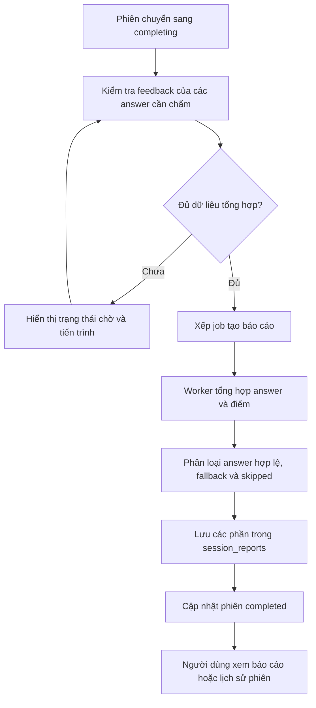
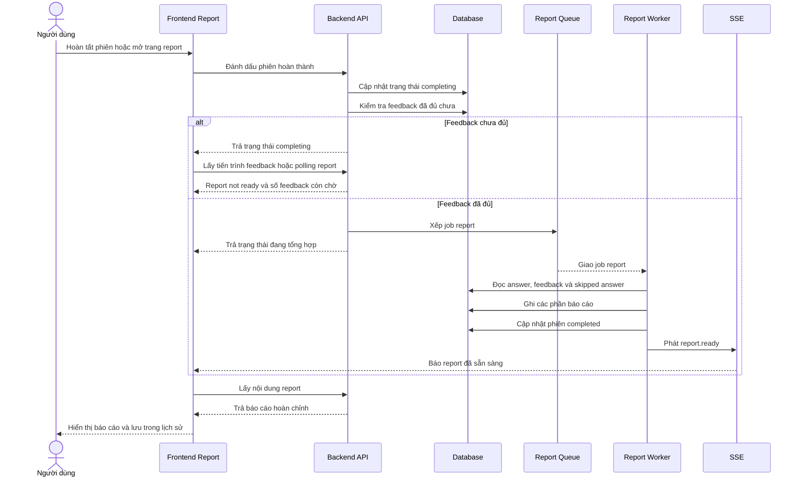

### 4.5.6 Báo cáo tổng hợp và xem lại lịch sử phiên

**a. Mục đích của tính năng**

Nhóm tính năng báo cáo tổng hợp giúp người dùng xem lại kết quả của cả phiên phỏng vấn. Báo cáo không chỉ hiển thị điểm tổng mà còn trình bày transcript, nhận xét theo từng câu, phân tích năng lực, thông tin câu bị bỏ qua và kế hoạch cải thiện.

Lịch sử phiên cho phép người dùng quay lại các phiên đã tạo, tiếp tục phiên chưa hoàn tất hoặc mở lại báo cáo của phiên đã hoàn thành. Đây là phần giúp kết quả luyện tập không bị mất sau khi người dùng rời khỏi màn hình phỏng vấn.

Trong AI Mock Interview, báo cáo là điểm kết thúc của một phiên luyện tập. Nó tổng hợp các feedback rời rạc thành một cái nhìn chung để người dùng biết phiên vừa rồi có bao nhiêu câu được đánh giá, câu nào bị bỏ qua, phần nào cần cải thiện và dữ liệu chấm điểm có đáng tin cậy hay không.

Sơ đồ sau thể hiện mục đích của tính năng báo cáo: gom dữ liệu của cả phiên thành kết quả tổng hợp có thể xem lại sau này, đồng thời phân biệt rõ câu được chấm, câu fallback và câu bị bỏ qua.

**b. Dữ liệu đầu vào**

Dữ liệu đầu vào của báo cáo gồm phiên phỏng vấn, danh sách câu hỏi trong `session_questions`, câu trả lời trong `user_answers`, feedback trong `ai_feedbacks`, các đoạn nhận xét đã lưu và trạng thái bỏ qua của từng câu. Bộ xử lý báo cáo chỉ dùng feedback đã sẵn sàng để tổng hợp.

Báo cáo được lưu thành nhiều phần trong `session_reports`, gồm tóm tắt tổng quan, phân tích giao tiếp, heatmap năng lực, kế hoạch hành động và câu trả lời đề xuất cho các câu bị bỏ qua. Cách lưu theo từng phần giúp backend đọc lại báo cáo linh hoạt hơn và tránh nhồi toàn bộ kết quả vào một trường duy nhất.

Đầu ra của tính năng gồm trạng thái phiên hoàn thành, điểm tổng nếu có dữ liệu chấm hợp lệ, transcript đã ghép câu hỏi - câu trả lời - feedback, chất lượng báo cáo và các phần báo cáo đã lưu. Với báo cáo mới, câu bị bỏ qua vẫn được ghi nhận trong kết quả tổng hợp và được tính là 0 điểm để phản ánh đúng việc người dùng không trả lời câu hỏi đó. Ngược lại, feedback fallback do AI lỗi chỉ được dùng để giữ luồng hệ thống tiếp tục chạy, không được xem như điểm chấm đáng tin cậy. Chất lượng báo cáo có thể là đầy đủ, một phần, không khả dụng về điểm hoặc không thể chấm nếu phiên cũ không có đủ dữ liệu điểm.

**c. Luồng xử lý nghiệp vụ**

Khi người dùng đi hết danh sách câu hỏi và yêu cầu hoàn thành phiên, backend chuyển phiên sang trạng thái `completing`. Backend kiểm tra các câu trả lời không bị bỏ qua đã có feedback hay chưa. Nếu còn feedback chưa sẵn sàng, hệ thống chưa xếp job report và frontend tiếp tục hiển thị trạng thái chờ.

Trước khi xử lý, backend luôn kiểm tra phiên có tồn tại và có thuộc về người dùng đang đăng nhập hay không. Bước này áp dụng cho cả lịch sử phiên, trang chi tiết phiên, tiến trình feedback và trang báo cáo. Nếu phiên không tồn tại, hệ thống trả lỗi không tìm thấy. Nếu phiên thuộc về người dùng khác, hệ thống từ chối truy cập. Nhờ đó, lịch sử và báo cáo không bị lộ giữa các tài khoản.

Khi đủ dữ liệu, backend xếp job tạo báo cáo. Tiến trình tạo báo cáo đọc câu hỏi, câu trả lời và feedback, tách câu bị bỏ qua, feedback thật và feedback fallback. Câu bị bỏ qua được tạo một bản ghi feedback tổng hợp với điểm 0 và các tiêu chí tương ứng để điểm tổng phản ánh đúng số câu người dùng đã bỏ qua. Feedback fallback do lỗi AI được giữ lại trong transcript nhưng không được xem là điểm thật. Khi report được ghi thành công, trạng thái phiên chuyển sang hoàn thành và backend phát sự kiện `report.ready`.

Luồng chính có hai cổng kiểm tra. Cổng thứ nhất nằm trước khi xếp report: phiên phải ở trạng thái `completing`, phải có câu trả lời và không còn feedback chưa xử lý đối với các câu không bị bỏ qua. Cổng thứ hai nằm trong tiến trình tạo báo cáo: số feedback đọc được phải khớp với số câu trả lời cần chấm. Nếu hai điều kiện này chưa đạt, hệ thống không tạo báo cáo sớm.

Quá trình đọc lại báo cáo cũng có một cổng kiểm tra riêng. Backend chỉ trả báo cáo khi phần tóm tắt tổng quan đã được lưu. Nếu phần này chưa có, API trả trạng thái "báo cáo chưa sẵn sàng" thay vì trả một báo cáo rỗng. Frontend dựa vào trạng thái này để tiếp tục polling tiến trình hoặc chờ sự kiện thời gian thực.

Sơ đồ dưới đây thể hiện quá trình hoàn tất phiên, chờ feedback nếu cần và tải báo cáo sau khi worker ghi dữ liệu.

**d. Thiết kế giao diện frontend**

Giao diện báo cáo hiển thị trạng thái chờ khi report chưa sẵn sàng. Trong thời gian này, người dùng cần thấy tiến trình feedback hoặc thông báo rằng hệ thống đang tổng hợp kết quả, thay vì nhìn thấy trang lỗi hoặc báo cáo rỗng.

Khi báo cáo sẵn sàng, frontend hiển thị điểm tổng nếu có dữ liệu chấm đáng tin cậy, thông tin phiên, phương pháp chấm, biểu đồ năng lực và phân tích từng câu trả lời. Với câu bị bỏ qua, báo cáo hiển thị trạng thái đã bỏ qua, điểm 0 nếu backend đã tạo dữ liệu điểm cho báo cáo mới và câu trả lời đề xuất nếu có. Giao diện không hiển thị các đoạn nhận xét chi tiết như ưu điểm hoặc điểm cần cải thiện, vì người dùng không có nội dung trả lời để phân tích.

Trang lịch sử phiên hiển thị danh sách phiên đã tạo của riêng người dùng hiện tại, sắp xếp từ mới đến cũ. Mỗi phiên có trạng thái, thời gian tạo, loại phỏng vấn, context pack, thời lượng và điểm tổng nếu phiên đã hoàn thành. Từ trạng thái phiên, giao diện chọn lối vào phù hợp: tiếp tục phiên đang chạy, theo dõi phiên đang tạo báo cáo hoặc mở báo cáo đã hoàn thành.

Khi API trả trạng thái report chưa sẵn sàng, frontend không coi đây là lỗi cuối cùng. Trang báo cáo gọi API tiến trình feedback, hiển thị số câu đã chấm trên tổng số câu cần chấm, số câu còn đang xử lý và thanh tiến trình. Trang cũng lắng nghe sự kiện `session.feedback_progress` và `report.ready`; nếu sự kiện không đến, polling vẫn tiếp tục cập nhật tiến trình.

Khi report có `reportQuality` là một phần hoặc không khả dụng, giao diện cần thể hiện rằng điểm tổng có thể bị ẩn hoặc chỉ phản ánh các câu được chấm hợp lệ. Với câu bị bỏ qua, transcript vẫn giữ câu hỏi và answer trống, nhưng dùng câu trả lời đề xuất nếu backend đã tạo hoặc fallback được lưu. Với báo cáo cũ chưa có dữ liệu điểm cho câu bỏ qua, giao diện hiển thị thông báo để người dùng hiểu vì sao điểm có thể khác các báo cáo mới.

**e. Thiết kế xử lý backend**

Backend chỉ tạo report khi đủ dữ liệu cần thiết. Điều kiện quan trọng là các câu trả lời không bị bỏ qua phải có feedback hoặc đã được xử lý theo fallback. Các câu bị bỏ qua không làm report bị kẹt vì chúng không cần feedback chấm điểm.

Ở bước lấy lịch sử, backend nhận yêu cầu từ người dùng đã đăng nhập, lấy mã người dùng từ phiên xác thực, sau đó chỉ truy vấn các phiên thuộc đúng người dùng đó. Kết quả được sắp xếp theo thời gian tạo giảm dần để phiên mới nhất xuất hiện trước. Backend không cần tính lại báo cáo ở bước này; nó chỉ trả metadata đã lưu của phiên, ví dụ trạng thái hiện tại, điểm tổng nếu đã có và thông tin cấu hình phiên.

Ở bước hoàn tất phiên, backend xử lý theo trạng thái hiện tại. Nếu phiên đang hoạt động và đã có đủ câu trả lời, hệ thống chuyển phiên sang `completing`. Nếu người dùng hết giờ hoặc chọn tự động bỏ qua câu chưa trả lời, backend tạo thêm các câu trả lời rỗng có đánh dấu bỏ qua, đặt thời gian còn lại về 0 rồi mới chuyển sang `completing`. Nếu phiên đã ở trạng thái `completing`, backend không tạo lại phiên mới mà chỉ kiểm tra lại điều kiện để bảo đảm job report đã được xếp khi dữ liệu đã sẵn sàng.

Ở bước kiểm tra điều kiện tạo report, backend đếm tổng số câu trả lời, số câu bị bỏ qua và số feedback đã hoàn tất. Câu bị bỏ qua được loại khỏi yêu cầu phải có feedback thật, vì không có nội dung trả lời để AI chấm. Nếu vẫn còn câu trả lời chưa sinh feedback, backend dừng tại trạng thái chờ. Nếu tất cả điều kiện đã đủ, backend xếp job tạo báo cáo vào hàng đợi và gắn mã job theo mã phiên để tránh tạo nhiều job trùng cho cùng một phiên. Nếu job cũ bị lỗi, hệ thống ưu tiên retry job đó thay vì tạo bản sao mới.

Bộ xử lý báo cáo tổng hợp transcript, điểm phiên, thống kê câu trả lời, danh sách câu fallback và các phần báo cáo. Với phiên có dữ liệu chấm hợp lệ, điểm tổng được tính từ các feedback không phải fallback; trong đó câu bị bỏ qua của báo cáo mới được tính là 0 điểm. Với phiên chỉ có fallback do AI lỗi, backend trả chất lượng báo cáo phù hợp và không tạo điểm số giả.

Backend có API đọc tiến trình, trong đó hệ thống đếm tổng số câu hỏi, tổng số câu trả lời, số câu bị bỏ qua, số feedback cần có, số feedback đã hoàn tất và số feedback còn chờ. Khi đọc report chính, nếu chưa có phần `executive_summary`, backend trả `REPORT_NOT_READY` với trạng thái chấp nhận để frontend tiếp tục chờ.

Khi xếp job report, backend dùng mã job theo mã phiên để tránh tạo nhiều job report cho cùng một phiên. Nếu job cũ đã lỗi, hệ thống có thể chạy lại job đó. Dữ liệu gửi vào hàng đợi gồm mã phiên, loại phiên, context pack, ngôn ngữ và danh sách câu trả lời cần tổng hợp.

Sau khi nhận job, tiến trình tạo báo cáo đọc danh sách câu trả lời theo thứ tự đã lưu, xác định câu nào bị bỏ qua và câu nào cần feedback thật. Tiến trình này kiểm tra số feedback tìm được có khớp với số câu cần chấm hay không. Nếu chưa khớp, hệ thống báo lỗi để hàng đợi chạy lại sau, tránh ghi báo cáo khi dữ liệu còn thiếu.

Tiếp theo, tiến trình tạo báo cáo tạo dữ liệu tổng hợp cho câu bị bỏ qua. Mỗi câu bỏ qua được gán điểm 0, nhận xét ngắn gọn và điểm theo các tiêu chí áp dụng cho câu hỏi đó. Nhờ vậy, báo cáo mới phản ánh rõ tác động của việc bỏ qua câu hỏi thay vì bỏ qua hoàn toàn khỏi điểm trung bình. Đồng thời, hệ thống tạo câu trả lời đề xuất cho các câu này; nếu AI không trả được kết quả, hệ thống dùng câu trả lời mẫu fallback dựa trên nội dung câu hỏi.

Bộ xử lý báo cáo tạo `executive_summary` từ số câu, số câu được đánh giá, số câu fallback, số câu bị bỏ qua và điểm tổng. `comm_analysis` lưu thống kê feedback. `competency_heatmap` lưu điểm theo câu trả lời, trong đó feedback fallback có score null. `action_plan` được tạo từ các tóm tắt feedback hợp lệ; hệ thống yêu cầu AI trả JSON dạng danh sách 3-5 việc cần cải thiện. `skipped_answers` lưu câu trả lời đề xuất cho các câu người dùng bỏ qua.

Các phần báo cáo được ghi bằng upsert trong cùng transaction với việc cập nhật phiên sang `completed`, ghi `overallScore` và `completedAt`. Sau khi transaction thành công, backend phát `report.ready`. Thứ tự này giúp frontend chỉ tải report sau khi dữ liệu đã có trong database.

Khi người dùng mở báo cáo, backend đọc lại phiên, kiểm tra quyền sở hữu, kiểm tra phần tóm tắt đã tồn tại, sau đó dựng transcript từ danh sách câu hỏi theo thứ tự. Với mỗi câu, backend ghép câu hỏi, câu trả lời đầu tiên, feedback, điểm, các đoạn nhận xét đã được làm sạch và tiêu chí đã áp dụng. Với câu bị bỏ qua, backend thay phần câu trả lời bằng trạng thái bỏ qua, bỏ các đoạn nhận xét chi tiết và lấy câu trả lời đề xuất từ phần báo cáo đã lưu. Cuối cùng, backend xác định chất lượng báo cáo: đầy đủ, một phần, không khả dụng do toàn bộ feedback là fallback, hoặc không thể chấm với dữ liệu cũ không có điểm.

**f. Xử lý lỗi và fallback**

Nếu frontend yêu cầu report khi worker chưa tạo xong, backend trả trạng thái chưa sẵn sàng để frontend tiếp tục chờ hoặc polling. Đây không phải lỗi nghiệp vụ mà là trạng thái bình thường của luồng bất đồng bộ.

Nếu toàn bộ feedback là fallback do AI không chấm được câu trả lời, báo cáo hiển thị trạng thái chưa thể chấm điểm thay vì `0/100`. Nếu phiên chỉ có dữ liệu cũ chưa tạo được điểm cho câu bỏ qua, báo cáo được đánh dấu là không thể chấm. Với báo cáo mới, câu bị bỏ qua được tính 0 điểm, nhưng phần phân tích chi tiết vẫn không hiển thị như một câu trả lời bình thường.

Nếu AI không tạo được action plan, backend dùng action plan fallback theo ngôn ngữ phiên. Nếu AI không tạo được câu trả lời đề xuất cho câu skipped, backend dùng câu trả lời mẫu fallback dựa trên nội dung câu hỏi. Nếu số feedback chưa đủ, tiến trình tạo báo cáo báo lỗi để job chạy lại thay vì lưu báo cáo thiếu dữ liệu.
