# Chương 4. Phân Tích, Thiết Kế Và Xây Dựng Sản Phẩm GR1

## 4.1 Giới Thiệu Sản Phẩm GR1

Trong giai đoạn GR1, sản phẩm AI Mock Interview được xây dựng dưới dạng prototype web app phục vụ sinh viên năm cuối và ứng viên fresher ngành Công nghệ thông tin tại Việt Nam. Sản phẩm không hướng đến việc đưa gợi ý để người dùng trả lời thay trong buổi phỏng vấn thật, mà tập trung vào hoạt động luyện tập trước phỏng vấn: người dùng cung cấp Job Description, chọn loại phỏng vấn, trả lời từng câu hỏi, sau đó nhận phản hồi và báo cáo tổng hợp.

Prototype hiện tại không chỉ dừng ở mức nhập câu hỏi và nhận câu trả lời từ chatbot. Hệ thống tổ chức quá trình luyện tập thành một phiên có cấu trúc, có dữ liệu đầu vào, có danh sách câu hỏi, có câu trả lời của người dùng, có feedback theo từng câu và có báo cáo sau phiên. Cách tiếp cận này thống nhất với định vị ở Chương 1 và khoảng trống rút ra ở Chương 2: hệ thống cần giúp người học luyện lặp lại theo nhu cầu, có phản hồi cụ thể, chi phí thấp trong phạm vi đề tài và phù hợp với ngữ cảnh sinh viên CNTT Việt Nam.

### 4.1.1 Mục tiêu và yêu cầu chức năng trong GR1

Mục tiêu tổng quát của đề tài là xây dựng một ứng dụng web hỗ trợ sinh viên năm cuối và ứng viên fresher ngành Công nghệ thông tin luyện phỏng vấn bằng trí tuệ nhân tạo theo một quy trình có cấu trúc, có phản hồi và có báo cáo sau phiên. Trong phạm vi GR1, đề tài tập trung vào việc xây dựng một prototype có thể demo được luồng luyện phỏng vấn chính từ lúc người dùng chuẩn bị hồ sơ đến lúc nhận báo cáo sau phiên.

Về phạm vi loại phỏng vấn, sản phẩm tập trung vào phỏng vấn kỹ thuật, phỏng vấn hành vi và phiên phỏng vấn tổng hợp. Về phạm vi chức năng, nhiệm vụ chính của hệ thống là cho phép người dùng quản lý hồ sơ luyện tập, cấu hình phiên từ mô tả công việc, nhận danh sách câu hỏi phù hợp, trả lời bằng văn bản, nhận phản hồi tự động cho từng câu trả lời và xem báo cáo tổng hợp sau phiên.

Mục tiêu chất lượng của đề tài là tạo ra một prototype có giao diện dễ sử dụng, dữ liệu phiên được lưu lại có cấu trúc, phản hồi đủ cụ thể để người dùng có thể hành động và các tác vụ AI được xử lý bất đồng bộ để tránh chặn trải nghiệm người dùng. Hệ thống không đặt mục tiêu thay thế nhà tuyển dụng hoặc mentor, mà đóng vai trò công cụ luyện tập trước phỏng vấn thật.

| Nhóm tính năng | Phạm vi đã phát triển trong GR1 | Mục đích trong hệ thống |
| --- | --- | --- |
| Tài khoản và hồ sơ luyện tập | Người dùng đăng ký, đăng nhập và quản lý thông tin hồ sơ phục vụ luyện phỏng vấn, bao gồm kỹ năng, kinh nghiệm, học vấn, dự án và CV. | Làm dữ liệu nền để cá nhân hóa câu hỏi và phản hồi theo năng lực thực tế của người dùng. |
| Job Description và cấu hình phiên | Người dùng nhập hoặc chọn lại JD đã lưu, sau đó chọn loại phỏng vấn, context pack, thời lượng và số lượng câu hỏi. | Xác định phạm vi buổi luyện tập để hệ thống sinh câu hỏi và đánh giá theo đúng mục tiêu ứng tuyển. |
| Sinh câu hỏi phỏng vấn | Hệ thống tạo danh sách câu hỏi dựa trên thông tin phiên, kết hợp khả năng sinh nội dung của AI với ngân hàng câu hỏi có sẵn. | Tạo bộ câu hỏi phù hợp với vị trí ứng tuyển, giảm phụ thuộc vào danh sách câu hỏi mẫu chung chung. |
| Thực hiện phiên phỏng vấn | Người dùng trả lời câu hỏi bằng văn bản trong giao diện phỏng vấn, có thể bỏ qua câu hỏi hoặc hoàn tất phiên khi đã đi hết danh sách. | Mô phỏng luồng luyện phỏng vấn có cấu trúc và tạo dữ liệu ổn định cho bước phản hồi. |
| Phản hồi cho từng câu trả lời | Hệ thống phân tích từng câu trả lời và đưa ra nhận xét về điểm mạnh, điểm còn thiếu, gợi ý cải thiện và ví dụ trả lời tốt hơn khi phù hợp. | Giúp người dùng biết cụ thể mình cần sửa nội dung nào thay vì chỉ nhận đánh giá chung chung. |
| Báo cáo tổng hợp và lịch sử phiên | Sau khi phiên kết thúc, hệ thống tạo báo cáo tổng hợp; người dùng có thể xem lại phiên, câu hỏi, câu trả lời, feedback và báo cáo tương ứng. | Giúp người dùng nhìn lại toàn bộ phiên luyện tập và có cơ sở tiếp tục rèn luyện. |
| Theo dõi tiến trình và xử lý lỗi | Các tác vụ tốn thời gian như sinh câu hỏi, tạo feedback và tạo báo cáo được xử lý nền; giao diện nhận cập nhật trạng thái khi kết quả sẵn sàng. | Giảm tình trạng chờ lâu trên một yêu cầu duy nhất và giúp hệ thống ổn định hơn khi tác vụ AI mất nhiều thời gian. |

Về giới hạn, hệ thống không được thiết kế để hỗ trợ ứng viên gian lận trong buổi phỏng vấn thật. Hệ thống không đưa gợi ý theo thời gian thực trong lúc người dùng đang phỏng vấn với nhà tuyển dụng, mà chỉ phục vụ luyện tập trước phỏng vấn. Kết quả đánh giá của AI chỉ được xem là phản hồi tham khảo phục vụ học tập, không phải kết luận tuyển dụng chính thức.

### 4.1.2 Luồng sử dụng tổng quát

Luồng chính của sản phẩm được xây dựng như sau:

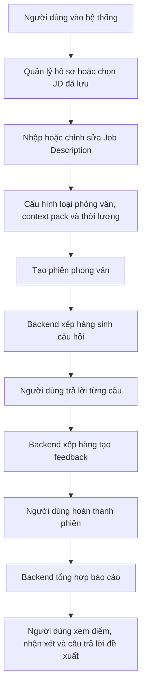

Luồng này phản ánh đúng hướng xây dựng hiện tại của mã nguồn. Trang `/setup` phụ trách nhập JD và cấu hình phiên. Trang `/sessions/[id]` hiển thị câu hỏi và nhận câu trả lời. Trang `/sessions/[id]/report` hiển thị tiến trình tạo báo cáo và nội dung báo cáo khi sẵn sàng.

## 4.2 Yêu Cầu Phi Chức Năng Trong GR1

Bên cạnh yêu cầu chức năng, prototype cần đáp ứng một số yêu cầu phi chức năng ở mức phù hợp với giai đoạn GR1. Các yêu cầu này xuất phát từ đặc thù của hệ thống AI: tác vụ có thể mất thời gian, output AI có thể sai định dạng, dữ liệu phiên cần nhất quán và người dùng cần hiểu hệ thống đang ở trạng thái nào.

| Nhóm yêu cầu | Mục tiêu trong GR1 | Cách thể hiện trong thiết kế |
| --- | --- | --- |
| Tính dễ dùng | Người dùng có thể đi theo luồng rõ ràng từ chọn/nhập JD đến xem báo cáo. | Tách màn hình hồ sơ, JD library, setup, interview và report; dùng trạng thái loading/progress khi cần chờ. |
| Hiệu năng trải nghiệm | Các request từ trình duyệt không bị chặn quá lâu bởi tác vụ AI. | Sinh câu hỏi, feedback và report được xử lý qua queue; frontend nhận trạng thái qua API, polling và SSE. |
| Độ tin cậy | Phiên không bị kẹt khi AI lỗi hoặc trả dữ liệu không hợp lệ. | Có retry/fallback cho các bước phụ thuộc AI; có trạng thái phiên và trạng thái feedback rõ ràng. |
| Toàn vẹn dữ liệu | Câu hỏi, câu trả lời, feedback và report phải liên kết đúng phiên. | Database dùng quan hệ, unique constraint, khóa ngoại và transaction ở các thao tác quan trọng. |
| Bảo mật ở mức prototype | Dữ liệu phiên của người dùng không được truy cập tùy tiện qua API. | Backend giữ guard, kiểm tra quyền sở hữu phiên/JD và không để frontend truy cập trực tiếp database nghiệp vụ. |
| Khả năng bảo trì | Mã nguồn có thể tiếp tục mở rộng sang GR2 mà không trộn lẫn mọi logic vào một nơi. | Backend tách module theo miền nghiệp vụ; frontend tách route, component và thư viện gọi API. |

Các yêu cầu phi chức năng này không có nghĩa prototype đã đạt chuẩn production đầy đủ. Chúng mô tả mức kiểm soát cần có để demo GR1 ổn định và làm nền cho các bước hoàn thiện sau.

## 4.3 Luồng Nghiệp Vụ Chính

Luồng nghiệp vụ GR1 đặt phiên phỏng vấn ở trung tâm. Người dùng chuẩn bị hồ sơ và JD, hệ thống tạo câu hỏi theo loại phiên, người dùng trả lời từng câu, backend xử lý feedback ở nền và cuối cùng tổng hợp báo cáo. Các loại phiên Technical, Behavioral và Mixed không chỉ là nhãn hiển thị, mà quyết định nhóm câu hỏi, tiêu chí đánh giá và cách AI pipeline xây dựng prompt.

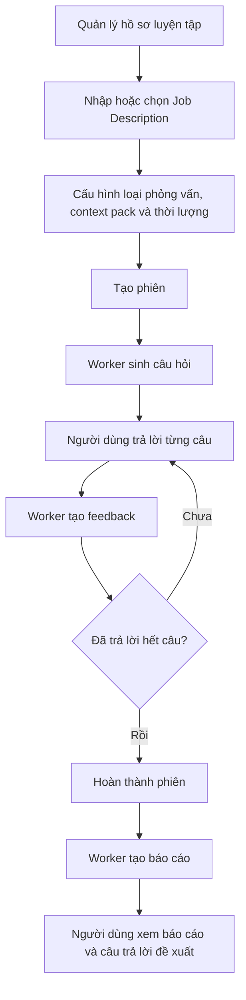

### 4.3.1 Luồng cấu hình và tạo phiên phỏng vấn

Luồng cấu hình bắt đầu từ trang `/setup`. Nếu người dùng đã có JD đã lưu, hệ thống hiển thị danh sách để chọn lại. Nếu chưa có hoặc muốn tạo mới, người dùng nhập thông tin JD gồm công ty, vị trí, level, yêu cầu, nội dung công việc, tech stack và một số trường bổ sung.

Sau khi JD hợp lệ, người dùng chọn loại phỏng vấn, context pack và thời lượng. Thời lượng hiện tại được ánh xạ sang số lượng câu hỏi: 30 phút tương ứng 15 câu, 60 phút tương ứng 30 câu, 90 phút tương ứng 45 câu. Khi xác nhận, frontend gửi dữ liệu lưu JD trước, sau đó tạo session gắn với JD vừa lưu.

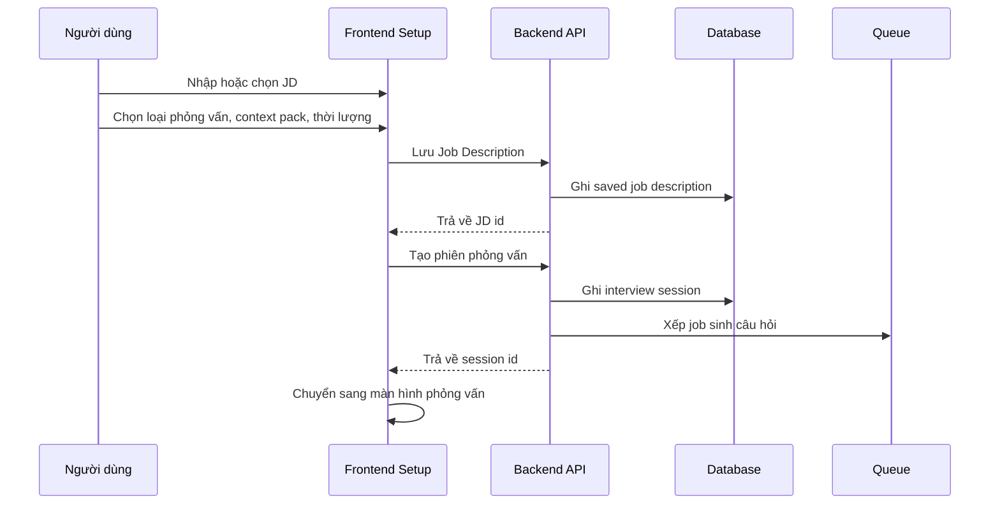

Backend kiểm tra các điều kiện như JD đủ dài, loại phiên hợp lệ, context pack hợp lệ, số lượng câu hỏi nằm trong giới hạn và JD đã lưu thuộc về đúng người dùng. Ngoài ra, hệ thống có giới hạn số phiên được tạo trong 24 giờ để tránh lạm dụng tài nguyên AI.

### 4.3.2 Luồng thực hiện phiên phỏng vấn

Khi vào trang phỏng vấn, frontend lấy thông tin phiên. Nếu phiên đang tổng hợp hoặc đã hoàn thành, người dùng được chuyển sang trang báo cáo. Nếu phiên còn đang sinh câu hỏi, frontend chờ câu hỏi qua polling ngắn và SSE. Khi câu hỏi đã có, backend chuyển phiên sang trạng thái active.

Trong lúc phỏng vấn, người dùng trả lời từng câu theo thứ tự bằng văn bản. Người dùng cũng có thể bỏ qua câu hỏi; câu bị bỏ qua vẫn được ghi nhận để phiên hoàn thành đúng số câu, nhưng không sinh feedback chấm điểm.

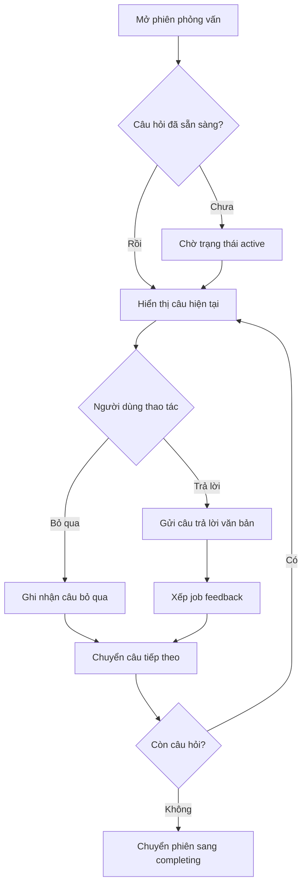

Backend chỉ cho nộp câu trả lời khi phiên đang ở trạng thái có thể phỏng vấn. Nếu phiên đã hủy, đã hoàn thành hoặc chưa sẵn sàng, request sẽ bị từ chối bằng lỗi có cấu trúc.

### 4.3.3 Luồng sinh và xem báo cáo

Khi người dùng trả lời hoặc bỏ qua hết câu hỏi, frontend yêu cầu hoàn thành phiên. Backend kiểm tra số câu trả lời đã đủ với số câu hỏi chưa. Nếu đủ, trạng thái phiên chuyển sang `completing`. Sau đó backend chỉ xếp job report khi tất cả câu trả lời không bị bỏ qua đã có feedback.

Trang report có hai cơ chế chờ. Thứ nhất, trang gọi API lấy report; nếu report chưa sẵn sàng, backend trả trạng thái `REPORT_NOT_READY` và frontend thử lại sau một khoảng thời gian. Thứ hai, trang subscribe SSE để nhận tiến trình feedback và sự kiện report sẵn sàng. Cách kết hợp này giúp trải nghiệm ổn định hơn khi một trong hai cơ chế bị trễ.

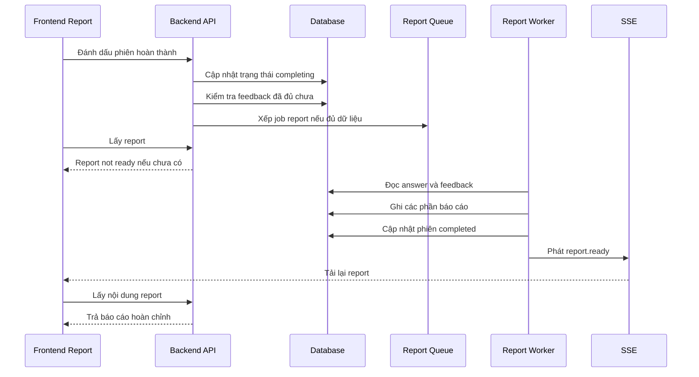

Nội dung báo cáo hiển thị theo thứ tự: điểm tổng hoặc trạng thái chưa thể chấm, thông tin phiên, phương pháp chấm, tóm tắt tổng quan, biểu đồ năng lực và phân tích từng câu trả lời. Với câu bị bỏ qua, báo cáo không hiển thị nhận xét điểm mạnh/điểm yếu mà chỉ hiển thị câu trả lời đề xuất.

### 4.3.4 Luồng xử lý lỗi

Hệ thống xử lý lỗi ở nhiều lớp:

- Ở frontend, lỗi kết nối server được hiển thị bằng thông báo dễ hiểu và có nút thử lại ở danh sách phiên.
- Ở backend, input được validate bằng DTO trước khi vào nghiệp vụ.
- Các API được bảo vệ bằng guard để tránh truy cập dữ liệu phiên của người khác.
- Nếu chuyển trạng thái phiên không hợp lệ, backend trả lỗi xung đột thay vì tự sửa im lặng.
- Nếu Redis hoặc database không sẵn sàng, health check trả trạng thái degraded.
- Nếu AI provider lỗi, timeout, hết quota hoặc trả output không hợp lệ, pipeline dùng fallback khi có thể.
- Nếu job report chưa sẵn sàng, frontend hiển thị tiến trình thay vì báo lỗi ngay.

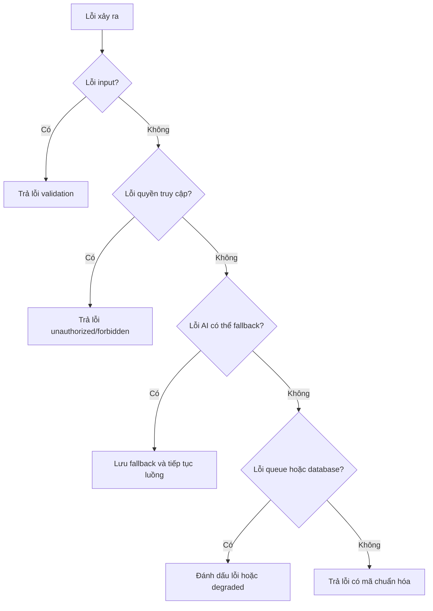

Nguyên tắc chung là không để người dùng bị kẹt ở trạng thái không có thông tin. Nếu lỗi khiến phiên không thể tiếp tục, hệ thống chuyển trạng thái lỗi hoặc hiển thị thông báo. Nếu lỗi có thể giảm cấp chất lượng nhưng vẫn tiếp tục được, hệ thống dùng fallback và thể hiện rõ trong báo cáo.

## 4.4 Kiến Trúc Tổng Thể Hệ Thống

Kiến trúc hiện tại của AI Mock Interview gồm frontend Next.js, backend NestJS, cơ sở dữ liệu PostgreSQL/Supabase, Redis cho hàng đợi và SSE, cùng AI provider tương thích OpenAI. Frontend không truy cập trực tiếp database. Mọi dữ liệu nghiệp vụ đi qua backend API.

### 4.4.1 Kiến trúc mức cao

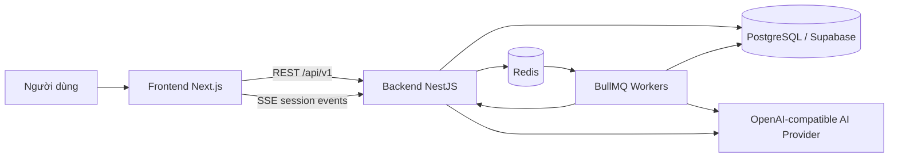

Frontend chịu trách nhiệm hiển thị màn hình, quản lý trạng thái tương tác và gọi API. Backend chịu trách nhiệm kiểm tra quyền truy cập, validate dữ liệu, quản lý phiên, lưu dữ liệu, điều phối job nền và chuẩn hóa lỗi trả về cho client. Redis được dùng cho BullMQ và kênh phát sự kiện. PostgreSQL lưu dữ liệu bền vững của người dùng, phiên phỏng vấn, câu hỏi, câu trả lời, feedback và báo cáo.

### 4.4.2 Cách giao tiếp giữa các thành phần

Các thao tác ngắn như lấy danh sách phiên, lưu JD, cập nhật hồ sơ và gửi câu trả lời được thực hiện qua REST API. Các tác vụ dài hơn như sinh câu hỏi, tạo feedback và tổng hợp báo cáo được chuyển sang hàng đợi nền.

Khi trạng thái thay đổi, backend phát sự kiện về kênh SSE của phiên. Frontend dùng sự kiện này để tải lại câu hỏi khi câu hỏi đã sẵn sàng, hiển thị tiến trình chấm câu trả lời hoặc mở báo cáo khi report đã hoàn thành. Nếu SSE không nhận được sự kiện, frontend vẫn có cơ chế polling để kiểm tra report, giúp luồng không phụ thuộc hoàn toàn vào một kênh cập nhật.

Trong môi trường phát triển local, hệ thống có thể bỏ qua xác thực thật bằng cấu hình dev để giảm thời gian demo. Tuy nhiên, backend vẫn giữ lớp guard ở các API cần bảo vệ. Điều này giúp luồng nghiệp vụ không phụ thuộc vào việc frontend gọi trực tiếp database hay tin tưởng dữ liệu từ trình duyệt.

## 4.5 Thiết Kế Theo Nhóm Tính Năng

Phần này trình bày thiết kế theo từng nhóm tính năng thay vì tách riêng backend và frontend. Cách trình bày này phù hợp hơn với bản chất của prototype: mỗi tính năng đều gồm màn hình người dùng, API/backend, dữ liệu lưu trữ và một số cơ chế xử lý nền đi kèm.

```mermaid
flowchart TD#### a. Đầu vào của thuật toán
    A[Tài khoản và hồ sơ] --> B[JD và cấu hình phiên]
    B --> C[Sinh câu hỏi]
    C --> D[Thực hiện phiên]
    D --> E[Feedback từng câu]
    E --> F[Báo cáo và lịch sử]
    C --> G[Theo dõi tiến trình và fallback]
    E --> G
    F --> G
```

### 4.5.1 Tài khoản và hồ sơ luyện tập

Nhóm tính năng tài khoản và hồ sơ cung cấp dữ liệu nền cho toàn bộ quá trình luyện phỏng vấn. Ở frontend, người dùng thao tác chủ yếu trên trang `/profile`, nơi hiển thị và cập nhật các thông tin như định hướng nghề nghiệp, kỹ năng, học vấn, kinh nghiệm, dự án, chứng chỉ và CV nếu có.

Ở backend, các API profile chịu trách nhiệm đọc và cập nhật hồ sơ của đúng người dùng hiện tại. Lớp guard kiểm tra danh tính ở các API cần bảo vệ, còn DTO validation đảm bảo dữ liệu gửi lên có cấu trúc hợp lệ trước khi lưu. Dữ liệu hồ sơ được lưu trong các bảng người dùng, hồ sơ mở rộng và resume, tạo thành ngữ cảnh có thể được dùng khi hệ thống cá nhân hóa câu hỏi hoặc phản hồi.

Trong phạm vi GR1, hồ sơ không được thiết kế như một hệ thống tuyển dụng đầy đủ. Vai trò chính của nó là giúp phiên luyện tập có thêm ngữ cảnh về người dùng, đồng thời cho phép người dùng quản lý thông tin nền mà không phải nhập lại trong mỗi phiên.

### 4.5.2 Job Description và cấu hình phiên

Nhóm tính năng này bắt đầu từ trang `/setup` hoặc từ thư viện JD. Người dùng có thể nhập JD mới, chỉnh sửa thông tin công ty, vị trí, cấp độ, yêu cầu, nội dung công việc, tech stack, hoặc chọn lại một JD đã lưu từ `/jd-library`. Sau đó người dùng chọn loại phỏng vấn, context pack và thời lượng phiên.

Frontend chia màn hình tạo phiên thành nhiều bước để giảm tải nhận thức: chọn hoặc nhập JD, cấu hình phiên, xác nhận thông tin rồi bắt đầu. Trước khi gửi request, frontend kiểm tra một số điều kiện cơ bản như công ty, vị trí, yêu cầu và nội dung công việc không được quá ngắn. Tuy nhiên, kiểm tra quyết định vẫn nằm ở backend.

Backend lưu JD vào bảng `saved_job_descriptions`, sau đó tạo bản ghi `interview_sessions` gắn với JD, loại phiên, context pack, ngôn ngữ, thời lượng và số lượng câu hỏi. Backend kiểm tra JD đủ dài, loại phiên hợp lệ, context pack tồn tại, số lượng câu hỏi nằm trong giới hạn và JD thuộc về đúng người dùng. Sau khi tạo phiên, backend không sinh câu hỏi ngay trong request mà đưa job vào hàng đợi sinh câu hỏi để tránh request bị timeout.

### 4.5.3 Sinh câu hỏi phỏng vấn

Sinh câu hỏi là điểm giao giữa dữ liệu người dùng, cấu hình phiên, question bank và AI provider. Khi job sinh câu hỏi chạy, backend đọc thông tin phiên, JD, loại phỏng vấn, context pack, ngôn ngữ đầu ra, tổng số câu hỏi và thời lượng phiên.

Chiến lược hiện tại là hybrid. Hệ thống không bắt AI sinh toàn bộ câu hỏi; cứ khoảng 5 câu thì có 1 câu do AI sinh, phần còn lại lấy từ question bank. Ví dụ, phiên 15 câu sẽ có khoảng 3 câu AI và 12 câu từ question bank; phiên 30 câu có khoảng 6 câu AI và 24 câu từ question bank. Cách này giúp giữ được tính cá nhân hóa theo JD nhưng vẫn ổn định hơn khi AI chậm, hết quota hoặc trả JSON sai định dạng.

Prompt sinh câu hỏi được tạo theo hai lớp. System message chứa luật sinh câu hỏi, ràng buộc format JSON, category, competency domain và độ khó. User message chứa dữ liệu động của phiên như JD, loại phiên, vai trò mục tiêu và số câu AI cần sinh. Sau khi AI trả về, backend parse JSON, validate schema, chuẩn hóa category, competency domain, difficulty và estimated time. Câu hỏi có metadata không hợp lệ bị loại bỏ.

Question bank được dùng để bổ sung phần lớn danh sách câu hỏi hoặc thay thế toàn bộ danh sách nếu AI lỗi. Khi lấy câu hỏi từ question bank, backend lọc theo loại phiên, context pack, ngôn ngữ và phân bố độ khó. Với phiên Mixed, hệ thống chia tương đối giữa câu hỏi hành vi và câu hỏi kỹ thuật. Danh sách cuối cùng được lưu vào `session_questions`, phiên chuyển sang `active` và backend phát sự kiện SSE để frontend tải câu hỏi.

Thuật toán sinh câu hỏi được đặt ở backend vì đây là bước cần kiểm soát chặt dữ liệu đầu vào, trạng thái phiên, context pack, question bank và khả năng fallback khi AI không ổn định. Frontend chỉ gửi cấu hình phiên; backend mới là nơi quyết định câu hỏi nào được tạo, câu hỏi nào được lấy từ ngân hàng câu hỏi và khi nào phiên được chuyển sang trạng thái sẵn sàng.

#### a. Đầu vào của thuật toán

Khi người dùng tạo phiên phỏng vấn, backend nhận các thông tin chính sau:

- Job Description đã được chuẩn hóa thành văn bản.
- Loại phiên phỏng vấn: HR/Behavioral, Technical hoặc Mixed.
- Context pack: Việt Nam hoặc Western.
- Ngôn ngữ đầu ra: tiếng Việt hoặc tiếng Anh.
- Danh sách vị trí mục tiêu lấy từ JD.
- Số lượng câu hỏi cần tạo.
- Thời lượng phiên.
- Mã người dùng và JD đã lưu nếu có.

Backend không tạo câu hỏi ngay trong request tạo phiên. Thay vào đó, hệ thống lưu phiên vào database với trạng thái đang sinh câu hỏi, sau đó đưa một job vào hàng đợi sinh câu hỏi. Cách này giúp request tạo phiên trả về nhanh, đồng thời tránh timeout nếu AI phản hồi chậm.

#### b. Chiến lược hybrid giữa AI và question bank

Thuật toán hiện tại không để AI sinh toàn bộ câu hỏi. Trong mã nguồn, backend đặt tỉ lệ cố định: cứ khoảng 5 câu thì có 1 câu do AI sinh, phần còn lại lấy từ question bank. Số câu AI được tính bằng cách làm tròn `tổng số câu / 5`. Ví dụ:

| Tổng số câu trong phiên | Số câu AI sinh | Số câu lấy từ question bank |
| --- | --- | --- |
| 15 câu | 3 câu | 12 câu |
| 30 câu | 6 câu | 24 câu |
| 45 câu | 9 câu | 36 câu |

Chiến lược này được chọn vì câu hỏi AI có ưu điểm cá nhân hóa theo JD, nhưng nếu phụ thuộc hoàn toàn vào AI thì phiên phỏng vấn dễ bị ảnh hưởng bởi timeout, quota hoặc JSON sai định dạng. Question bank đóng vai trò lớp ổn định: câu hỏi đã có sẵn loại câu hỏi, competency domain, độ khó, thời lượng ước tính và bản dịch nếu có.

Quy trình hybrid được xử lý theo hai nhánh:

1. **Nhánh bình thường**: AI sinh một phần câu hỏi, backend kiểm tra metadata của các câu đó, sau đó lấy thêm số câu còn thiếu từ question bank. Hai nguồn câu hỏi được trộn lại thành một danh sách duy nhất.
2. **Nhánh fallback**: nếu AI không khả dụng hoặc trả kết quả không dùng được, backend bỏ qua nhánh AI và lấy toàn bộ câu hỏi từ question bank. Phiên vẫn có thể bắt đầu nếu question bank đủ dữ liệu.

Cách trộn câu hỏi cũng có chủ đích. Câu hỏi AI không bị dồn vào đầu phiên mà được đặt cách quãng, ví dụ ở các vị trí khoảng 5, 10, 15 nếu phiên đủ dài. Các vị trí còn lại được lấp bằng question bank. Với phiên ngắn hoặc số câu AI ít, hệ thống vẫn đảm bảo câu hỏi AI nằm trong phạm vi tổng số câu, không tạo thứ tự vượt quá số câu của phiên.

Khi lấy câu hỏi từ question bank, backend không lấy đúng bằng số lượng cần ngay từ đầu. Hệ thống lấy một tập ứng viên lớn hơn, khoảng gấp 3 lần số câu cần lấy, rồi chọn theo phân bố độ khó. Logic chọn độ khó hiện tại ưu tiên khoảng 30% câu dễ, 50% câu trung bình và 20% câu khó; nếu nhóm nào không đủ, hệ thống lấy thêm từ các câu còn lại để đạt đủ số lượng. Với phiên Mixed, backend tách số lượng thành hai phần: một nửa nghiêng về HR/Behavioral và một nửa nghiêng về Technical.

Nhờ vậy, danh sách câu hỏi cuối cùng vừa có tính cá nhân hóa từ JD, vừa có độ ổn định từ question bank, vừa giữ được độ phủ rubric để các bước đánh giá sau đó có căn cứ rõ ràng.

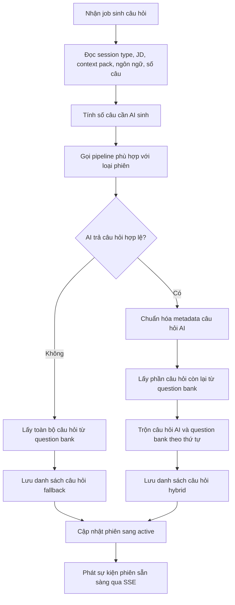

#### c. Chọn pipeline theo loại phiên

Backend có ba chiến lược sinh câu hỏi tương ứng với ba loại phiên:

| Loại phiên | Trọng tâm sinh câu hỏi |
| --- | --- |
| HR/Behavioral | Tập trung vào động lực, giao tiếp, làm việc nhóm, tự nhận thức, văn hóa và ví dụ theo STAR. |
| Technical | Tập trung vào kiến thức kỹ thuật, cách áp dụng thực tế, trade-off, debug, thiết kế hệ thống và chất lượng code. |
| Mixed | Kết hợp câu hỏi hành vi và kỹ thuật, giúp phiên gần với buổi phỏng vấn tổng hợp hơn. |

Việc chọn pipeline theo loại phiên giúp prompt không bị chung chung. Một phiên technical không nên sinh quá nhiều câu hỏi hành vi, còn phiên HR không nên hỏi sâu vào trivia kỹ thuật. Với mixed, hệ thống cho phép cả hai nhóm tiêu chí nhưng vẫn yêu cầu mỗi câu hỏi phải gắn với một competency domain cụ thể.

#### d. Cách tạo prompt sinh câu hỏi

Prompt sinh câu hỏi được tạo theo dạng hai lớp: **system message** chứa luật sinh câu hỏi và **user message** chứa dữ liệu cụ thể của phiên. Cách tách này giúp phần luật ổn định, còn dữ liệu phiên thay đổi theo từng JD.

System message của luồng sinh câu hỏi gồm các nội dung chính:

| Thành phần trong prompt | Vai trò |
| --- | --- |
| Vai trò AI | Yêu cầu AI đóng vai người phỏng vấn có kinh nghiệm. |
| Nhiệm vụ | Sinh câu hỏi phù hợp với JD và chiến lược phỏng vấn. |
| Ràng buộc số lượng | Phải sinh đúng số câu trong thẻ `<num_questions>`. |
| Ràng buộc format | Chỉ trả về một JSON object gọn, không markdown, không giải thích thêm. |
| Cấu trúc JSON | Mỗi câu hỏi có `text`, `category`, `competency_domain`, `difficulty`. |
| Ràng buộc metadata | `category` chỉ được là `behavioral` hoặc `technical`; `competency_domain` phải là mã rubric hợp lệ như `D1` hoặc `TD3`. |

Sau phần luật nền, backend gắn thêm chiến lược theo loại phiên:

- Phiên HR/Behavioral: ưu tiên bằng chứng hành vi, động lực, giao tiếp, cộng tác, tự nhận thức, culture fit và ví dụ cụ thể theo STAR.
- Phiên Technical: ưu tiên độ sâu kỹ thuật, cách áp dụng thực tế, trade-off, debug, system design và chất lượng kỹ thuật.
- Phiên Mixed: cân bằng giữa hành vi và kỹ thuật, vừa có giao tiếp/cộng tác vừa có giải quyết vấn đề kỹ thuật.

Tiếp theo, backend gắn context pack. Context pack bổ sung hai loại thông tin. Thứ nhất là ghi chú văn hóa, ví dụ với bối cảnh Việt Nam thì nhấn mạnh teamwork, tôn trọng thứ bậc và giải quyết vấn đề thực tế; với bối cảnh Western thì nhấn mạnh initiative, impact có thể đo lường và leadership potential. Thứ hai là danh sách mã rubric được phép dùng. Ví dụ nhóm hành vi có `D1`, `D2`, `D3`, `D4`, `D5`, `D6`; nhóm kỹ thuật có `TD1`, `TD2`, `TD3`, `TD4`, `TD5`.

User message chứa dữ liệu động dưới dạng các thẻ rõ ràng:

```text
<job_description>
...nội dung JD người dùng nhập...
</job_description>

<session_type>technical</session_type>

<target_roles>
Backend Developer
</target_roles>

<num_questions>3</num_questions>
```

Trong thực tế, nếu người dùng tạo phiên 15 câu, backend chỉ yêu cầu AI sinh 3 câu vì phần còn lại đến từ question bank. Vì vậy `<num_questions>` trong prompt AI là số câu AI cần sinh, không phải tổng số câu của phiên.

Prompt sinh câu hỏi cũng có cấu hình riêng: nhiệt độ thấp vừa phải để giảm độ ngẫu nhiên và giới hạn token đủ lớn để tránh phản hồi bị cắt. Backend yêu cầu response ở dạng JSON object, sau đó vẫn parse và validate lại. Điều này nghĩa là prompt chỉ là lớp hướng dẫn; lớp quyết định cuối cùng vẫn là kiểm tra dữ liệu ở backend.

#### e. Kiểm tra và chuẩn hóa câu hỏi AI

Sau khi AI trả kết quả, backend không lưu ngay. Kết quả phải đi qua các bước kiểm tra:

1. Parse JSON từ phản hồi AI.
2. Validate schema để chắc chắn có danh sách câu hỏi, nội dung câu hỏi, category, competency domain và difficulty.
3. Chuẩn hóa competency domain theo context pack và loại phiên.
4. Loại bỏ câu hỏi có domain không thuộc phiên hiện tại.
5. Chuẩn hóa độ khó về mức 1, 2 hoặc 3.
6. Tính thời lượng ước tính cho từng câu dựa trên thời lượng phiên, số câu và độ khó.

Ví dụ, với phiên HR, domain hợp lệ là nhóm `D*`. Với phiên Technical, domain hợp lệ là nhóm `TD*`. Với phiên Mixed, cả hai nhóm đều có thể được dùng. Nếu AI trả về tên tiêu chí thay vì mã tiêu chí, backend có cơ chế khớp theo ID, ID đã chuẩn hóa, mã được trích ra từ chuỗi hoặc tên tiêu chí đã chuẩn hóa. Nếu vẫn không khớp, câu hỏi đó bị loại bỏ.

#### f. Lấy câu hỏi từ question bank

Question bank được dùng trong hai trường hợp:

- Bổ sung phần lớn câu hỏi trong luồng hybrid.
- Thay thế toàn bộ danh sách nếu AI lỗi.

Khi lấy câu hỏi từ question bank, backend lọc theo loại phiên và context pack. Với phiên Mixed, hệ thống chia tương đối giữa câu hỏi HR và Technical. Sau đó, hệ thống chọn câu hỏi theo phân bố độ khó: một phần câu dễ, phần chính ở mức trung bình và một phần câu khó. Nếu không đủ theo phân bố mong muốn, hệ thống lấy thêm các câu còn lại trong danh sách ứng viên cho đến khi đủ số lượng.

Mỗi câu hỏi lấy từ question bank đã có sẵn nội dung, loại câu hỏi, competency domain và thời lượng ước tính. Nếu người dùng chọn ngôn ngữ khác, hệ thống ưu tiên bản dịch trong dữ liệu câu hỏi; nếu không có bản dịch phù hợp thì dùng nội dung gốc.

#### g. Trộn câu hỏi và lưu vào phiên

Sau khi có câu hỏi AI và câu hỏi từ question bank, backend trộn chúng thành danh sách cuối cùng. Câu hỏi AI được đặt vào các vị trí cách quãng, ví dụ khoảng mỗi 5 câu một câu AI nếu đủ điều kiện. Các vị trí còn lại lấy từ question bank. Cách sắp xếp này giúp phiên không bị dồn toàn bộ câu hỏi AI vào đầu hoặc cuối.

Mỗi câu hỏi cuối cùng được lưu vào bảng `session_questions` với các thông tin:

- Mã phiên.
- Mã câu hỏi trong question bank nếu câu đó lấy từ bank.
- Nội dung câu hỏi.
- Thứ tự trong phiên.
- Loại câu hỏi.
- Competency domain.
- Rubric JSON nếu có.
- Thời lượng ước tính.

Sau khi lưu đủ câu hỏi, backend chuyển phiên sang trạng thái active và phát sự kiện SSE để frontend tải danh sách câu hỏi. Nếu lưu thất bại hoặc không đủ câu hỏi sau khi đã fallback, phiên được chuyển sang trạng thái lỗi.

#### h. Pseudocode thuật toán sinh câu hỏi

```text
Input: sessionId, sessionType, jobDescription, targetRoles, contextPack, language, totalQuestions, durationMin
1. Tính số câu AI cần sinh = làm tròn(totalQuestions / 5).
2. Lấy cấu hình context pack và chiến lược theo sessionType.
3. Gọi AI để sinh số câu đã tính.
4. Nếu AI lỗi:
   4.1. Lấy totalQuestions câu từ question bank.
   4.2. Lưu câu hỏi vào session_questions.
   4.3. Chuyển session sang active và phát SSE.
   4.4. Kết thúc.
5. Nếu AI thành công:
   5.1. Parse JSON và validate schema.
   5.2. Chuẩn hóa category, competency domain, difficulty và estimated time.
   5.3. Loại bỏ câu hỏi có metadata không hợp lệ.
6. Tính số câu còn lại cần lấy từ question bank.
7. Lấy câu hỏi question bank theo sessionType, contextPack, language và độ khó.
8. Trộn câu hỏi AI và question bank theo thứ tự.
9. Nếu tổng số câu không đủ, đánh dấu session lỗi.
10. Nếu đủ, lưu vào session_questions.
11. Chuyển session sang active.
12. Phát sự kiện session.status để frontend bắt đầu phỏng vấn.
```

### 4.5.4 Thực hiện phiên và lưu câu trả lời

Màn hình `/sessions/[id]` hiển thị từng câu hỏi theo thứ tự. Người dùng nhập câu trả lời bằng văn bản, gửi câu trả lời, bỏ qua câu hỏi khi cần, tạm dừng, tiếp tục, hủy hoặc hoàn tất phiên. Nếu câu hỏi chưa sẵn sàng, frontend hiển thị trạng thái chờ và lắng nghe cập nhật từ backend.

Backend chỉ nhận câu trả lời khi phiên ở trạng thái có thể phỏng vấn. Khi người dùng gửi câu trả lời, backend kiểm tra câu hỏi thuộc đúng phiên, lưu dữ liệu vào `user_answers` và xếp job feedback. Ràng buộc dữ liệu quan trọng là trong cùng một phiên, một câu hỏi chỉ có một câu trả lời hiện hành; điều này hạn chế lỗi double click hoặc retry làm tạo dữ liệu trùng.

Nếu người dùng bỏ qua câu hỏi, backend lưu câu trả lời với cờ skipped và không xếp job feedback. Câu bị bỏ qua vẫn được tính là đã đi qua trong phiên để người dùng có thể hoàn thành phiên, nhưng không được chấm điểm như câu trả lời thật.

### 4.5.5 Đánh già và Phản hồi từng câu trả lời

Feedback được xử lý theo từng turn. Sau khi answer được lưu, worker feedback đọc câu hỏi, câu trả lời, loại phiên, context pack, competency domain và ngôn ngữ đầu ra. Backend không chỉ gửi câu hỏi và câu trả lời cho AI mà còn gửi metadata của câu hỏi để AI biết câu trả lời cần được chấm theo tiêu chí nào.

Prompt đánh giá yêu cầu AI trả về JSON có cấu trúc gồm câu trả lời đề xuất, nhận xét chính, điểm theo từng tiêu chí áp dụng và các đoạn trích cụ thể trong câu trả lời. Output AI sau đó được validate bằng schema. Nếu JSON sai, thiếu trường hoặc không có tiêu chí hợp lệ, hệ thống không lưu như feedback thật mà chuyển sang fallback.

Điểm tổng của một câu trả lời không lấy trực tiếp từ AI. Backend lọc tiêu chí AI trả về theo rubric và competency domain của câu hỏi, chuẩn hóa trọng số của các tiêu chí hợp lệ rồi tự tính điểm tổng theo thang 100. Nhờ vậy, một câu hỏi technical không bị chấm lan sang tiêu chí hành vi chỉ vì câu trả lời có nhắc tới làm việc nhóm, và điểm của câu trả lời không bị lệch bởi các tiêu chí không liên quan.

Khi feedback hợp lệ, backend lưu điểm tổng, câu trả lời mẫu, nhận xét chính, điểm theo tiêu chí và các annotated segment trong transaction. Sau đó backend đánh dấu answer đã có feedback, phát sự kiện `turn.feedback_ready` và cập nhật tiến trình feedback của phiên. Nếu phiên đang ở trạng thái tạo báo cáo và mọi feedback cần thiết đã sẵn sàng, backend xếp job tạo báo cáo tổng hợp.

### 4.5.6 Báo cáo tổng hợp và xem lại lịch sử phiên

Nhóm tính năng báo cáo bắt đầu khi người dùng đã đi hết danh sách câu hỏi và yêu cầu hoàn thành phiên. Backend chuyển phiên sang `completing`, kiểm tra các câu trả lời không bị bỏ qua đã có feedback hay chưa, rồi chỉ xếp job report khi dữ liệu đã đủ. Điều kiện này giúp báo cáo không được tạo quá sớm khi điểm và nhận xét từng câu chưa sẵn sàng.

Report processor đọc danh sách câu hỏi, câu trả lời và feedback, tách câu bị bỏ qua khỏi câu có dữ liệu chấm thật. Điểm tổng của phiên được tính từ các feedback hợp lệ; feedback fallback không được tính như điểm thật. Báo cáo được lưu thành nhiều phần trong `session_reports`, gồm tóm tắt tổng quan, phân tích giao tiếp, heatmap năng lực, kế hoạch hành động và câu trả lời đề xuất cho các câu bị bỏ qua.

Frontend hiển thị báo cáo tại `/sessions/[id]/report`. Khi report chưa sẵn sàng, màn hình hiển thị tiến trình feedback và trạng thái chờ. Khi report sẵn sàng, màn hình hiển thị điểm tổng hoặc trạng thái chưa thể chấm, thông tin phiên, phương pháp chấm, biểu đồ năng lực và phân tích từng câu trả lời. Với câu bị bỏ qua, báo cáo chỉ hiển thị câu trả lời đề xuất, không hiển thị điểm mạnh hoặc điểm cần cải thiện như một câu đã được chấm.

Lịch sử phiên được thể hiện qua trang `/sessions`. Người dùng có thể xem các phiên đã tạo, tiếp tục phiên đang chạy hoặc mở lại báo cáo của phiên đã hoàn thành. Cách thiết kế này giúp kết quả luyện tập không bị mất sau một lần sử dụng và tạo nền cho các chức năng theo dõi tiến bộ dài hạn ở giai đoạn sau.

Đánh giá câu trả lời được xử lý theo từng turn, tức là mỗi câu trả lời của ứng viên được lưu và chấm riêng. Sau đó, các feedback riêng lẻ mới được dùng để tạo báo cáo tổng hợp. Cách tách này giúp hệ thống không phải chờ đến cuối phiên mới bắt đầu chấm; ngay sau khi người dùng trả lời một câu, backend có thể xếp job feedback cho câu đó.

#### a. Đầu vào của quá trình đánh giá

Một lần đánh giá câu trả lời nhận các dữ liệu chính:

- Mã phiên và mã câu hỏi.
- Nội dung câu hỏi.
- Loại câu hỏi: behavioral hoặc technical.
- Competency domain của câu hỏi.
- Câu trả lời của ứng viên.
- Loại phiên: HR, Technical hoặc Mixed.
- Context pack và ngôn ngữ đầu ra.

Backend không chỉ gửi câu hỏi và câu trả lời cho AI. Hệ thống còn gửi kèm metadata của câu hỏi và context pack để AI biết chính xác câu trả lời cần được chấm theo tiêu chí nào.

#### b. Tiếp nhận câu trả lời

Khi người dùng gửi câu trả lời, backend xử lý theo hai nhánh:

| Trường hợp | Cách xử lý |
| --- | --- |
| Trả lời bằng văn bản | Lưu câu trả lời, xếp job feedback ngay. |
| Bỏ qua câu hỏi | Lưu trạng thái bỏ qua, không xếp job feedback chấm điểm. |

Mỗi câu hỏi trong một phiên chỉ được phép có một câu trả lời. Ràng buộc này giúp tránh việc người dùng gửi trùng câu trả lời khi click nhiều lần hoặc khi request bị retry.

#### c. Luồng xử lý feedback từng câu

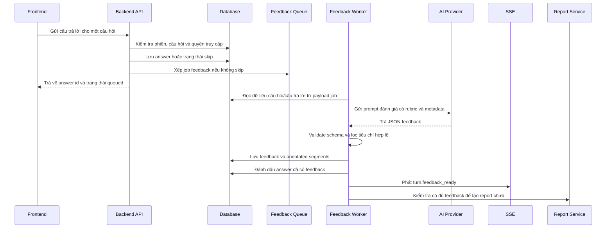

#### d. Cách tạo prompt đánh giá

Prompt đánh giá cũng được tạo theo dạng system message và user message, nhưng chặt hơn prompt sinh câu hỏi vì kết quả đánh giá sẽ ảnh hưởng trực tiếp đến điểm số và báo cáo của người dùng.

System message của luồng đánh giá có các lớp sau:

| Lớp hướng dẫn | Nội dung cụ thể |
| --- | --- |
| Vai trò | AI là interview coach, đánh giá câu trả lời và đưa feedback có thể hành động. |
| Câu trả lời mẫu | `model_answer` phải là một câu trả lời hoàn chỉnh 3-4 câu, viết như một ứng viên mạnh đang trả lời thật. Không được biến thành danh sách mẹo hoặc lời khuyên chung. |
| Format output | Chỉ trả về JSON gọn, không markdown, không giải thích ngoài JSON. |
| Tiêu chí chấm | Trả `applied_dimensions` gồm mã tiêu chí và điểm 1-100; không trả weight và không tự tính overall score. |
| Nhận xét trọng tâm | Trả một `key_takeaway` ngắn gọn để người dùng biết điểm chính cần nhớ. |
| Annotated segments | Tối đa 2 đoạn trích từ câu trả lời gốc, mỗi đoạn có nội dung trích dẫn, vị trí ký tự, loại strength/improvement, nhận xét và gợi ý nếu có. |

Sau hướng dẫn nền, backend thêm luật theo loại phiên và context pack. Với phiên HR, prompt chỉ liệt kê các tiêu chí hành vi và ghi rõ không áp dụng tiêu chí kỹ thuật. Với phiên Technical, prompt chỉ liệt kê tiêu chí kỹ thuật và ghi rõ không áp dụng tiêu chí hành vi. Với phiên Mixed, prompt có cả hai nhóm nhưng nếu câu hỏi có competency domain cụ thể thì backend yêu cầu AI trả đúng domain đó trong `applied_dimensions`.

Ví dụ, nếu câu hỏi có metadata `category=technical` và `competency_domain=TD2`, system message sẽ có thêm yêu cầu: tiêu chí áp dụng phải chứa đúng domain này nếu domain đó nằm trong danh sách được phép, không chấm lan sang tiêu chí ngoài câu hỏi. Mục tiêu là tránh tình trạng một câu hỏi về áp dụng kỹ thuật lại bị chấm cả tiêu chí giao tiếp hoặc teamwork chỉ vì câu trả lời có nhắc đến nhóm.

User message của prompt đánh giá chứa dữ liệu cụ thể của turn:

```text
<session_type>technical</session_type>

<question>
Bạn đã thiết kế database cho dự án như thế nào?
</question>

<question_metadata>
category=technical
competency_domain=TD2
</question_metadata>

<answer>
...câu trả lời của ứng viên...
</answer>
```

Ở bước này, backend cố tình để `<job_description>` rỗng trong prompt feedback hiện tại. Lý do là feedback từng câu đang chấm trực tiếp trên câu hỏi, metadata câu hỏi, context pack và câu trả lời. JD đã được dùng mạnh ở bước tạo câu hỏi; đến bước chấm từng câu, hệ thống ưu tiên không đưa quá nhiều ngữ cảnh thừa để giảm khả năng AI đánh giá lan man.

Điểm quan trọng nhất là backend không cho AI tự quyết định điểm tổng cuối cùng. AI chỉ chấm từng tiêu chí được áp dụng. Backend mới là nơi lọc tiêu chí hợp lệ, chuẩn hóa trọng số và tính điểm tổng. Nhờ đó, công thức chấm ổn định hơn giữa các lần gọi AI.

#### e. Schema feedback mong đợi

Kết quả AI phải có các nhóm dữ liệu sau:

| Thành phần | Ý nghĩa |
| --- | --- |
| Tiêu chí được áp dụng | Danh sách mã tiêu chí và điểm từ 1 đến 100 cho từng tiêu chí. |
| Câu trả lời mẫu | Một câu trả lời hoàn chỉnh để người dùng tham khảo cách trả lời tốt hơn. |
| Nhận xét chính | Một câu tóm tắt điểm đáng chú ý nhất về câu trả lời. |
| Đoạn nhận xét cụ thể | Tối đa 2 đoạn trích từ câu trả lời gốc, gồm vị trí, loại điểm mạnh/cần cải thiện, nhận xét và gợi ý sửa nếu có. |

Các đoạn trích phải sao chép nguyên văn từ câu trả lời của ứng viên. Backend lưu cả nội dung đoạn trích và vị trí ký tự. Khi hiển thị báo cáo, giao diện ưu tiên dùng đoạn trích đã lưu để tránh phụ thuộc quá nhiều vào offset nếu nội dung câu trả lời hoặc ngôn ngữ hiển thị có sai lệch.

#### f. Validate schema và lọc tiêu chí chấm

Sau khi AI trả phản hồi, backend không lưu ngay mà đi qua hai lớp kiểm tra: kiểm tra **schema** và kiểm tra **ý nghĩa rubric**. Hai lớp này khác nhau.

**Lớp 1: validate schema.** Backend parse JSON, sau đó kiểm tra cấu trúc bằng schema. Một feedback hợp lệ về mặt schema phải có:

- `applied_dimensions`: danh sách ít nhất một tiêu chí, mỗi tiêu chí có `id` dạng chuỗi và `score` là số nguyên từ 1 đến 100.
- `model_answer`: câu trả lời mẫu dạng chuỗi.
- `key_takeaway`: nhận xét chính dạng chuỗi.
- `annotated_segments`: danh sách đoạn nhận xét; mỗi đoạn có `segment_text`, `start_index`, `end_index`, `highlight_level`, `annotation` và có thể có `suggestion`, `improved_version`.
- `highlight_level` chỉ được là `strength` hoặc `improvement`.

Nếu JSON không parse được, thiếu trường bắt buộc, điểm nằm ngoài khoảng 1-100 hoặc `highlight_level` không đúng giá trị cho phép, kết quả bị từ chối. Đây là lỗi hình thức dữ liệu.

**Lớp 2: lọc semantic theo rubric.** Qua được schema vẫn chưa đủ. AI có thể trả JSON đúng cấu trúc nhưng mã tiêu chí không thuộc rubric của phiên. Ví dụ, phiên HR chỉ được dùng nhóm `D*`, nhưng AI lại trả `TD2`; hoặc câu hỏi đang có domain `TD3`, nhưng AI trả `TD1` vì hiểu nhầm. Những trường hợp này nhìn qua là JSON hợp lệ nhưng không hợp lệ về mặt nghiệp vụ.

Backend xác định danh sách tiêu chí được phép theo ba bước:

1. Dựa vào loại phiên để lấy tập tiêu chí tối đa:
   - HR: chỉ lấy behavioral dimensions.
   - Technical: chỉ lấy technical dimensions.
   - Mixed: lấy cả behavioral và technical dimensions.
2. Nếu câu hỏi có competency domain cụ thể và domain đó nằm trong tập tiêu chí của phiên, backend rút tập được phép xuống chỉ còn domain đó.
3. Backend so khớp các tiêu chí AI trả về với tập được phép.

Cơ chế so khớp có nhiều nhánh để giảm lỗi do model viết hơi khác format:

| Nhánh khớp | Ví dụ AI trả về | Cách hệ thống hiểu |
| --- | --- | --- |
| Khớp chính xác | `TD2` | Dùng đúng tiêu chí `TD2`. |
| Khớp sau chuẩn hóa | `td-2`, `td 2` | Loại bỏ khoảng trắng/ký tự phụ và hiểu là `TD2`. |
| Trích mã trong chuỗi | `TD2 - Practical Application` | Trích token `TD2`. |
| Khớp theo tên tiêu chí | `Khả năng áp dụng thực tế` | Chuẩn hóa tên và ánh xạ về mã rubric tương ứng. |

Nếu một tiêu chí đã được khớp, backend chỉ lấy một lần để tránh AI trả trùng tiêu chí. Nếu sau toàn bộ quá trình không còn tiêu chí hợp lệ nào, backend xem feedback đó không dùng được và chuyển sang fallback. Điều này giải thích vì sao một phản hồi AI có thể parse JSON thành công nhưng vẫn không được dùng để chấm điểm: lỗi nằm ở việc tiêu chí không khớp rubric, không phải ở cú pháp JSON.

#### g. Cách tính điểm tổng cho một câu trả lời
Điểm tổng của một câu trả lời không lấy trực tiếp từ AI. Backend tự tính từ các tiêu chí đã qua bước lọc rubric. Công thức tổng quát là:

```text
Điểm tổng = round(Σ điểm_tiêu_chí * trọng_số_đã_chuẩn_hóa)
```

Trong đó:

```text
trọng_số_đã_chuẩn_hóa = trọng_số_gốc_của_tiêu_chí / tổng_trọng_số_gốc_của_các_tiêu_chí_được_chọn
```

Quy trình cụ thể:

1. Lấy danh sách tiêu chí hợp lệ sau khi lọc rubric.
2. Lấy trọng số gốc của từng tiêu chí từ context pack.
3. Tính tổng trọng số gốc của các tiêu chí được áp dụng trong câu hỏi này.
4. Chia trọng số từng tiêu chí cho tổng đó để tổng trọng số mới bằng 1.
5. Nhân điểm từng tiêu chí với trọng số đã chuẩn hóa.
6. Cộng lại, làm tròn thành số nguyên.
7. Giới hạn kết quả trong khoảng 1-100.

Ví dụ, với context pack Việt Nam, nhóm kỹ thuật có trọng số gốc như sau: `TD1 = 0.25`, `TD2 = 0.25`, `TD3 = 0.2`, `TD4 = 0.2`, `TD5 = 0.1`. Nếu một câu hỏi chỉ đánh giá `TD1` và `TD2`, hệ thống không lấy cả 5 tiêu chí vào công thức. Hệ thống chỉ chuẩn hóa trên hai tiêu chí được chọn:

| Tiêu chí | Trọng số gốc | Điểm AI trả | Trọng số sau chuẩn hóa | Đóng góp vào điểm |
| --- | --- | --- | --- | --- |
| `TD1` | 0.25 | 80 | 0.5 | 40 |
| `TD2` | 0.25 | 70 | 0.5 | 35 |
| Tổng | 0.5 |  | 1.0 | 75 |

Điểm tổng của câu trả lời trong ví dụ này là `75/100`.

Ví dụ khác, nếu câu hỏi đánh giá `TD3` và `TD5`, trọng số gốc là `0.2` và `0.1`, tổng là `0.3`. Khi chuẩn hóa, `TD3` chiếm khoảng `0.67`, `TD5` chiếm khoảng `0.33`. Nếu AI chấm `TD3 = 60` và `TD5 = 90`, điểm tổng xấp xỉ:

```text
round(60 * 0.67 + 90 * 0.33) = round(70) = 70
```

Cách tính này có ý nghĩa vì mỗi câu hỏi chỉ kiểm tra một phần năng lực, không phải toàn bộ rubric. Backend chỉ tính điểm trên các tiêu chí thật sự được câu hỏi đó đánh giá, nhờ vậy điểm của một câu hỏi không bị kéo lệch bởi những tiêu chí không liên quan.

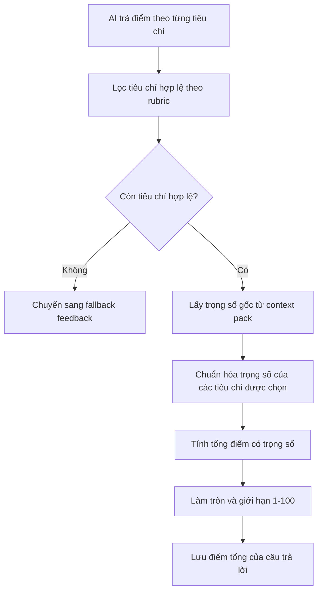

#### h. Lưu feedback vào database

Khi feedback hợp lệ, backend lưu trong một transaction để tránh trạng thái nửa vời:

1. Ghi hoặc cập nhật feedback của câu trả lời.
2. Xóa các đoạn nhận xét cũ nếu feedback được tạo lại.
3. Ghi danh sách đoạn nhận xét mới.
4. Đánh dấu câu trả lời đã có feedback.

Thông tin feedback được lưu gồm điểm tổng, câu trả lời mẫu, nhận xét chính, phiên bản prompt, cờ fallback, điểm theo tiêu chí và các annotated segment. Sau khi lưu xong, backend phát sự kiện `turn.feedback_ready` và cập nhật tiến trình feedback của phiên. Nếu phiên đang ở trạng thái tạo báo cáo và tất cả feedback đã sẵn sàng, backend sẽ xếp job tạo báo cáo tổng hợp.


### 4.5.7 Theo dõi tiến trình, fallback và xử lý lỗi

Các tác vụ AI có thể mất thời gian, vì vậy hệ thống không xử lý trực tiếp toàn bộ trong request từ trình duyệt. Sinh câu hỏi, feedback và report đều được đưa vào hàng đợi nền. Frontend theo dõi trạng thái qua REST API, polling nhẹ và SSE. Cách kết hợp này giúp giao diện vẫn cập nhật được nếu một kênh bị trễ hoặc kết nối SSE không ổn định.

Fallback được thiết kế cho các điểm phụ thuộc AI. Nếu AI sinh câu hỏi lỗi, hệ thống dùng question bank để tạo câu hỏi. Nếu AI feedback lỗi, hết quota, trả JSON rỗng hoặc JSON sai schema, backend lưu feedback fallback và đánh dấu answer đã xử lý để phiên không bị treo. Nếu report không đủ dữ liệu chấm, hệ thống trả về chất lượng báo cáo phù hợp thay vì tạo điểm sai.

Điểm quan trọng là hệ thống không hiển thị `0/100` như một điểm thật khi không có dữ liệu chấm đáng tin cậy. Với những phiên chỉ có fallback hoặc không có câu trả lời có thể chấm, frontend hiển thị trạng thái "chưa thể chấm điểm". Cách xử lý này phù hợp hơn với mục tiêu luyện tập vì người dùng không bị hiểu nhầm rằng câu trả lời của mình bị đánh giá rất thấp.

#### i. Fallback khi không đánh giá được

Không phải lúc nào AI cũng trả về kết quả dùng được. Hệ thống chuyển sang fallback trong các trường hợp như:

- AI provider hết quota hoặc đang cooldown.
- AI timeout hoặc trả response rỗng.
- JSON không parse được.
- JSON đúng cú pháp nhưng sai schema.
- Không có tiêu chí chấm nào khớp với rubric đang áp dụng.
- Lỗi provider sau các lần thử lại.

Khi fallback xảy ra, backend vẫn ghi một bản feedback fallback và đánh dấu câu trả lời đã xử lý. Tuy nhiên, feedback fallback không được xem là điểm chấm thật. Trong báo cáo, các câu fallback không được tính vào điểm tổng; nếu toàn bộ phiên chỉ có fallback, frontend hiển thị trạng thái chưa thể chấm điểm thay vì hiển thị điểm 0.

#### j. Xử lý câu hỏi bị bỏ qua

Nếu người dùng bỏ qua câu hỏi, backend lưu câu trả lời rỗng kèm cờ bỏ qua và không xếp job feedback. Câu bị bỏ qua vẫn được tính là đã đi qua trong phiên, giúp người dùng có thể hoàn thành phiên mà không bị kẹt. Khi tạo báo cáo, hệ thống có thể sinh câu trả lời đề xuất cho các câu bị bỏ qua, nhưng không hiển thị điểm, điểm mạnh hoặc điểm cần cải thiện cho câu đó.

#### k. Pseudocode thuật toán đánh giá câu trả lời

```text
Input: sessionId, questionId, answerText, skip flag

1. Kiểm tra session tồn tại và thuộc về người dùng.
2. Kiểm tra session đang ở trạng thái có thể trả lời.
3. Kiểm tra câu hỏi thuộc session.
4. Nếu người dùng bỏ qua:
   4.1. Lưu answer với skipped = true.
   4.2. Không xếp job feedback.
   4.3. Trả kết quả cho frontend.
5. Nếu là câu trả lời văn bản:
   5.1. Lưu answer và metadata cần thiết.
   5.2. Xếp job feedback.
6. Feedback worker lấy context pack và pipeline theo session type.
7. Tạo prompt gồm câu hỏi, câu trả lời, metadata câu hỏi, rubric và ngôn ngữ.
8. Gọi AI để lấy feedback JSON.
9. Parse JSON và validate schema.
10. Lọc tiêu chí chấm theo rubric và competency domain của câu hỏi.
11. Nếu không còn tiêu chí hợp lệ, ghi fallback feedback.
12. Nếu hợp lệ:
    12.1. Chuẩn hóa trọng số tiêu chí.
    12.2. Tính điểm tổng theo trọng số.
    12.3. Lưu feedback và annotated segments.
13. Đánh dấu answer đã có feedback.
14. Phát sự kiện feedback ready và feedback progress.
15. Nếu phiên đang completing và mọi feedback đã sẵn sàng, xếp job tạo report.
```

## 4.6 Thiết Kế Cơ Sở Dữ Liệu

Cơ sở dữ liệu hiện tại dùng PostgreSQL qua Prisma. Các bảng được thiết kế xoay quanh một quan hệ trung tâm: một phiên phỏng vấn có nhiều câu hỏi, mỗi câu hỏi có tối đa một câu trả lời của người dùng trong phiên, mỗi câu trả lời có thể có một feedback, và toàn phiên có nhiều bản ghi báo cáo tổng hợp.

| Nhóm bảng | Bảng | Vai trò |
| --- | --- | --- |
| Lookup/question | `context_packs`, `question_bank` | Lưu cấu hình rubric/context và ngân hàng câu hỏi dùng cho sinh câu hỏi hoặc fallback. |
| User/profile | `users`, `user_profiles`, `resumes` | Lưu người dùng, hồ sơ mở rộng và resume đã parse nếu có. |
| Session | `interview_sessions`, `saved_job_descriptions`, `session_questions` | Lưu phiên phỏng vấn, JD đã lưu và danh sách câu hỏi thuộc từng phiên. |
| Answer | `user_answers` | Lưu câu trả lời của người dùng, trạng thái skip và trạng thái feedback. |
| Feedback/report | `ai_feedbacks`, `annotated_segments`, `session_reports` | Lưu feedback từng câu, các đoạn nhận xét cụ thể và báo cáo tổng hợp theo từng loại nội dung. |

### 4.6.1 ERD rút gọn

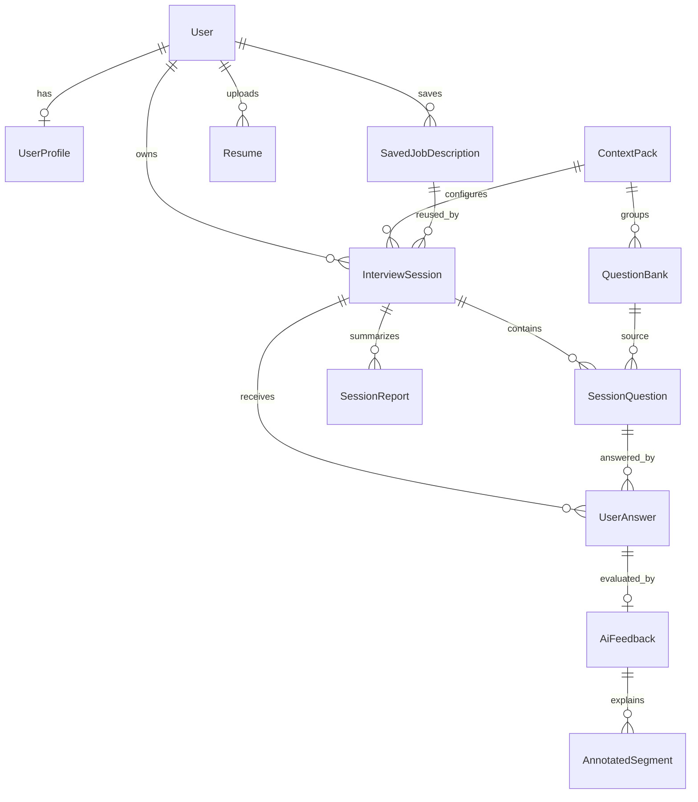

### 4.6.2 Quan hệ giữa session, câu hỏi, câu trả lời và feedback

Mỗi phiên phỏng vấn lưu thông tin JD, loại phiên, số lượng câu hỏi, thời lượng, ngôn ngữ, context pack và trạng thái. Sau khi tạo phiên, worker sinh câu hỏi sẽ ghi các câu hỏi vào bảng `session_questions`. Mỗi câu hỏi có thứ tự, nội dung, loại câu hỏi, competency domain và thời lượng ước tính.

Khi người dùng trả lời, hệ thống ghi vào `user_answers`. Ràng buộc quan trọng là trong cùng một phiên, một câu hỏi chỉ có một câu trả lời. Điều này giúp tránh việc gửi trùng do double click hoặc retry từ frontend. Sau đó, feedback cho câu trả lời được lưu vào `ai_feedbacks`, còn các đoạn nhận xét cụ thể được lưu ở `annotated_segments`.

Báo cáo tổng hợp không được nhét vào một cột duy nhất của session. Thay vào đó, hệ thống dùng bảng `session_reports`, trong đó mỗi loại báo cáo như tóm tắt tổng quan, phân tích giao tiếp, heatmap năng lực, kế hoạch hành động hoặc câu trả lời đề xuất cho câu bị bỏ qua được lưu thành một bản ghi riêng. Cách này giúp đọc lại từng phần báo cáo linh hoạt hơn và cho phép version hóa.

### 4.6.3 Các ràng buộc và lựa chọn dữ liệu quan trọng

Một số ràng buộc đáng chú ý trong schema hiện tại:

- `users.email` là duy nhất.
- `user_profiles.user_id` là duy nhất, mỗi người dùng có một hồ sơ mở rộng.
- `session_questions` có ràng buộc duy nhất theo phiên và thứ tự câu hỏi.
- `user_answers` có ràng buộc duy nhất theo phiên và câu hỏi.
- `ai_feedbacks.user_answer_id` là duy nhất, mỗi câu trả lời chỉ có một feedback hiện hành.
- `session_reports` có ràng buộc duy nhất theo phiên, loại báo cáo và version.
- Nhiều quan hệ dùng cascade delete để dữ liệu con của phiên hoặc người dùng không bị mồ côi.
- Một số bảng có `deleted_at` để hỗ trợ soft delete, ví dụ question bank và saved job description.

Schema thực tế cũng có các trường phục vụ trạng thái vận hành như trạng thái phiên, cờ feedback đã tạo, cờ fallback và chất lượng báo cáo. Đây là các trường cần thiết vì hệ thống có nhiều job bất đồng bộ; không thể chỉ dựa vào dữ liệu cuối cùng mà cần biết từng bước đã xử lý đến đâu.

## 4.7 Thiết Kế AI Pipeline

AI pipeline là phần trọng tâm kỹ thuật của sản phẩm. Pipeline hiện tại gồm ba luồng chính: sinh câu hỏi, sinh feedback từng câu và tổng hợp báo cáo. Các tác vụ này được đưa vào hàng đợi để tránh chặn request từ frontend.

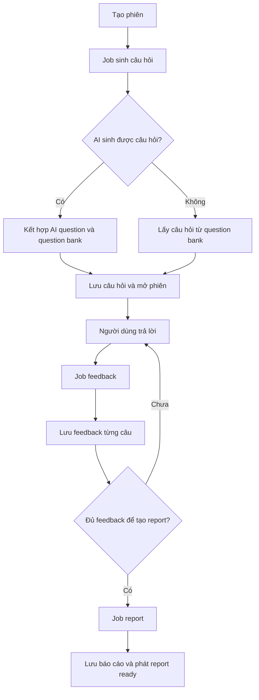

### 4.7.1 Question Generation

Khi người dùng tạo phiên, backend lưu phiên ở trạng thái đang sinh câu hỏi và đưa một job vào queue sinh câu hỏi. Job này nhận các thông tin chính gồm loại phiên, JD, vai trò mục tiêu, context pack, ngôn ngữ đầu ra, tổng số câu hỏi và thời lượng phiên.

Cách sinh câu hỏi trong mã nguồn hiện tại là hybrid. Hệ thống không bắt AI sinh toàn bộ câu hỏi. Với mỗi 5 câu, AI sinh khoảng 1 câu; các câu còn lại lấy từ question bank. Cách làm này giúp giữ được tính cá nhân hóa từ AI nhưng vẫn ổn định hơn khi AI chậm hoặc lỗi.

Sau khi AI trả về câu hỏi, hệ thống chuẩn hóa metadata như loại câu hỏi, competency domain, độ khó và thời lượng ước tính. Nếu câu hỏi có metadata không hợp lệ, hệ thống loại bỏ câu đó thay vì lưu dữ liệu sai. Các câu hỏi từ question bank được chọn theo loại phiên, context pack, ngôn ngữ và phân bố độ khó.

Nếu AI không khả dụng, pipeline chuyển sang dùng question bank cho toàn bộ danh sách câu hỏi. Nếu cả question bank cũng không đủ dữ liệu, phiên được đánh dấu lỗi và frontend hiển thị thông báo để người dùng tạo phiên mới.

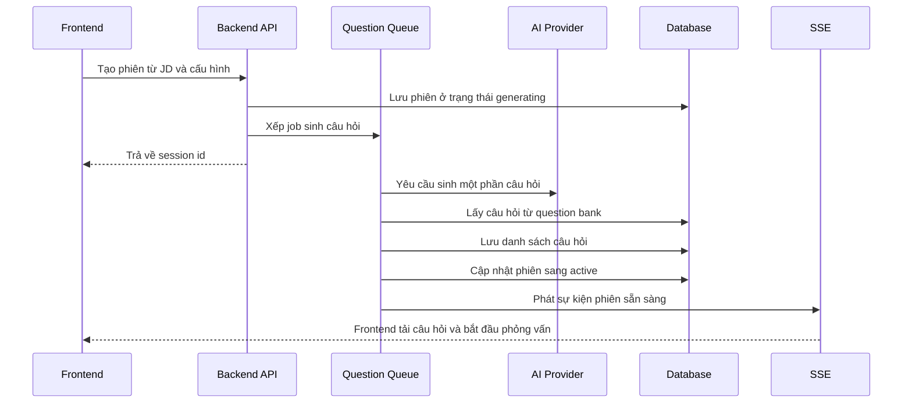

### 4.7.2 Feedback Generation

Sau khi người dùng gửi câu trả lời văn bản, backend lưu answer và đưa job feedback vào queue.

Feedback từng câu gồm các phần chính:

- Điểm tổng theo thang 100 nếu AI đánh giá thành công.
- Câu trả lời đề xuất để người dùng tham khảo.
- Nhận xét trọng tâm nhất của câu trả lời.
- Điểm theo từng tiêu chí nếu rubric áp dụng được.
- Các đoạn trích cụ thể trong câu trả lời, phân loại thành điểm mạnh hoặc điểm cần cải thiện.

Output AI được validate bằng schema trước khi lưu. Nếu AI trả về JSON sai, thiếu trường hoặc dữ liệu không phù hợp, pipeline coi đó là lỗi có thể fallback. Khi fallback xảy ra, hệ thống vẫn đánh dấu feedback đã xử lý để phiên không bị treo, nhưng báo cáo sẽ không dùng feedback fallback như một điểm chấm thật.

### 4.7.3 Comprehensive Report

Báo cáo tổng hợp chỉ được xếp hàng khi phiên ở trạng thái đang tổng hợp và tất cả các câu trả lời không bị bỏ qua đã có feedback. Điều kiện này giúp báo cáo không được tạo quá sớm khi dữ liệu chấm điểm chưa đủ.

Report processor đọc danh sách câu trả lời, tách câu bị bỏ qua và câu có feedback thật. Sau đó hệ thống tính điểm tổng bằng trung bình các feedback hợp lệ. Các feedback fallback không được tính vào điểm để tránh tạo điểm sai lệch. Báo cáo được lưu thành nhiều phần trong `session_reports`, gồm:

- Tóm tắt tổng quan.
- Phân tích giao tiếp ở mức tổng hợp.
- Heatmap năng lực.
- Kế hoạch hành động.
- Câu trả lời đề xuất cho các câu bị bỏ qua.

Khi report được ghi thành công, trạng thái phiên chuyển sang hoàn thành và backend phát sự kiện `report.ready`. Frontend nhận sự kiện này hoặc phát hiện qua polling để tải báo cáo.

### 4.7.4 Fallback Và Degraded Mode

Vì hệ thống phụ thuộc vào AI provider, degraded mode là phần bắt buộc. Mã nguồn hiện tại xử lý một số tình huống lỗi quan trọng:

- Nếu AI sinh câu hỏi lỗi, hệ thống dùng question bank để tạo câu hỏi.
- Nếu AI feedback lỗi hoặc hết quota, hệ thống lưu feedback fallback và không tính điểm đó như điểm thật.
- Nếu report không đủ dữ liệu chấm, hệ thống trả về chất lượng báo cáo phù hợp như không thể chấm hoặc chỉ một phần.
- Nếu provider trả JSON rỗng, JSON sai hoặc response bị cắt, hệ thống phân loại thành lỗi AI output thay vì lưu dữ liệu không hợp lệ.
- Nếu quota AI hết, gateway đặt thời gian cooldown ngắn để tránh retry liên tục.

Điểm quan trọng là hệ thống không hiển thị `0/100` như một điểm thật khi không có dữ liệu chấm điểm đáng tin cậy. Với những phiên chỉ có fallback hoặc không có câu trả lời có thể chấm, frontend hiển thị trạng thái "chưa thể chấm điểm". Đây là cách xử lý phù hợp hơn cho sản phẩm luyện tập vì người dùng không bị hiểu nhầm rằng câu trả lời của mình bị đánh giá rất thấp.

## 4.8 Cách Thức Xây Dựng Và Triển Khai Local

Trong GR1, hệ thống được triển khai và chạy local theo mô hình frontend/backend tách riêng. Redis chạy bằng Docker Compose, backend chạy bằng NestJS watch mode, frontend chạy bằng Next.js dev server. Database dùng PostgreSQL/Supabase.

### 4.8.1 Điều kiện môi trường

Các điều kiện môi trường chính:

- Node.js từ phiên bản 20 trở lên.
- npm từ phiên bản 10 trở lên.
- Docker Desktop để chạy Redis.
- PostgreSQL/Supabase đã cấu hình.
- OpenAI API key hoặc endpoint tương thích OpenAI cho chat model.
- Các biến môi trường cho Supabase, database, Redis, OpenAI và frontend API base URL.

### 4.8.2 Quy trình chạy local

Quy trình chạy local ở mức báo cáo như sau:

1. Cài dependency cho backend và frontend.
2. Tạo file môi trường cho backend từ mẫu `.env.example`.
3. Điền các biến môi trường bắt buộc như Supabase, database, Redis và OpenAI.
4. Bật Redis bằng Docker Compose trong thư mục backend.
5. Chạy backend ở cổng 3000.
6. Tạo file môi trường frontend và trỏ `NEXT_PUBLIC_API_BASE_URL` về backend.
7. Chạy frontend ở cổng 5173.
8. Kiểm tra `/api/v1` và `/health` để xác nhận backend, database và Redis hoạt động.

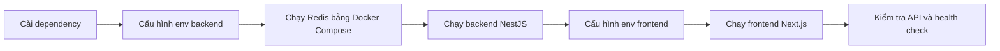

### 4.8.3 Các cổng và endpoint chính

| Thành phần | Địa chỉ local mặc định | Mục đích |
| --- | --- | --- |
| Backend API | `http://localhost:3000/api/v1` | REST API cho frontend. |
| Health check | `http://localhost:3000/health` | Kiểm tra database và Redis. |
| Frontend | `http://localhost:5173` | Giao diện người dùng. |
| Redis | `localhost:6379` | Hàng đợi và kênh sự kiện. |

Trong môi trường dev, hệ thống hỗ trợ cấu hình bỏ qua đăng nhập thật. Khi bật chế độ này, frontend gửi token giả lập và backend gắn request với một user mẫu trong database. Cách này chỉ dùng để demo và phát triển local, không dùng cho production.

## 4.9 Kiểm Soát Chất Lượng Trong Quá Trình Xây Dựng

Chất lượng của prototype được kiểm soát ở nhiều lớp: kiểu dữ liệu TypeScript, validation đầu vào, validation output AI, test backend, E2E frontend, build/lint và smoke check runtime.

| Biện pháp | Áp dụng ở đâu | Mục đích |
| --- | --- | --- |
| TypeScript | Client/server | Phát hiện lỗi kiểu dữ liệu khi phát triển, đồng bộ kiểu dữ liệu API và component. |
| DTO validation | Backend API | Từ chối request thiếu trường, sai loại phiên, JD quá ngắn hoặc câu trả lời quá ngắn. |
| Zod validation | AI output | Kiểm tra JSON từ AI trước khi lưu, tránh lưu output thiếu trường hoặc sai schema. |
| Unit test | Services/processors | Kiểm tra logic tạo phiên, nộp câu trả lời, fallback, report readiness, profile, question bank và các processor AI. |
| E2E test | Client luồng chính | Kiểm tra các luồng người dùng quan trọng ở mức trình duyệt khi cần. |
| Runtime smoke check | Backend/local | Gọi API gốc và health check để xác nhận backend, database và Redis sẵn sàng. |
| Lint/build | Client/server | Kiểm tra lỗi compile, lỗi coding style và khả năng build production. |

### 4.9.1 Kiểm soát dữ liệu đầu vào

Backend dùng DTO validation cho các request quan trọng. Ví dụ, tạo phiên yêu cầu JD có độ dài tối thiểu, loại phiên thuộc nhóm hợp lệ, context pack hợp lệ và số lượng câu hỏi nằm trong giới hạn. Gửi câu trả lời yêu cầu có question id, answer mode hợp lệ và nội dung đủ dài nếu không phải câu bị bỏ qua. Lưu JD cũng kiểm tra các trường như tên công ty, vị trí, level, yêu cầu và nội dung công việc.

Nhờ validation ở backend, frontend không phải là lớp bảo vệ duy nhất. Dù người dùng gọi API trực tiếp, dữ liệu sai vẫn bị chặn trước khi ghi vào database.

### 4.9.2 Kiểm soát output AI

Các output quan trọng từ AI được yêu cầu ở dạng JSON và validate bằng schema. Feedback phải có danh sách tiêu chí áp dụng, câu trả lời mẫu, nhận xét chính và danh sách đoạn được annotate. Câu hỏi sinh ra cũng được kiểm tra text, category, competency domain và độ khó.

Nếu output không hợp lệ, hệ thống không cố lưu dữ liệu sai. Pipeline chuyển sang lỗi có thể fallback hoặc retry tùy trường hợp. Cách này giúp dữ liệu trong báo cáo ổn định hơn, đặc biệt với các model có thể trả lời lệch format.

### 4.9.3 Kiểm soát qua test và smoke check

Backend có nhiều file test ở cấp service, controller, guard, processor và integration flow. Các nhóm test đáng chú ý gồm tạo phiên, nộp câu trả lời, xử lý skip, feedback processor, report processor, SSE, OpenAI gateway, validation DTO, question bank và runtime health.

Frontend có lint, build và Playwright E2E. Trong GR1, các kiểm thử này giúp phát hiện lỗi hợp đồng giữa frontend và backend như sai field trong report, sai trạng thái phiên hoặc xử lý loading chưa đúng.

Smoke check runtime dùng để xác nhận backend đã chạy được và các phụ thuộc quan trọng như database, Redis phản hồi đúng. Đây là bước cần thiết vì hệ thống không chỉ là web tĩnh mà còn phụ thuộc queue, database và AI provider.

## 4.10 Tổng Kết Chương

Chương 4 đã trình bày cách sản phẩm AI Mock Interview được phân tích, thiết kế và xây dựng trong phạm vi GR1 dựa trên mã nguồn hiện tại. Prototype đã hình thành được luồng chính từ quản lý JD, cấu hình phiên, sinh câu hỏi, trả lời phỏng vấn, tạo feedback đến xem báo cáo tổng hợp.

Về kiến trúc, hệ thống được tách thành frontend Next.js, backend NestJS, PostgreSQL/Supabase, Redis/BullMQ và AI provider. Các tác vụ AI dài được xử lý bất đồng bộ bằng queue, còn frontend theo dõi trạng thái bằng API, polling và SSE. Về dữ liệu, schema xoay quanh quan hệ phiên phỏng vấn, câu hỏi, câu trả lời, feedback và report. Về chất lượng, hệ thống có validation đầu vào, validation output AI, fallback, test và runtime health check.

Những nội dung này là cơ sở để Chương 5 đánh giá kết quả đạt được trong GR1, bao gồm mức độ hoàn thành chức năng, chất lượng giao diện, khả năng vận hành local, chất lượng AI feedback và các hạn chế còn tồn tại của prototype.

---
