# Chương 4. Phân Tích, Thiết Kế Và Xây Dựng Sản Phẩm GR1

## 4.1 Giới Thiệu Sản Phẩm GR1

Trong giai đoạn GR1, sản phẩm AI Mock Interview được xây dựng dưới dạng prototype web app phục vụ sinh viên năm cuối và ứng viên fresher ngành Công nghệ thông tin tại Việt Nam. Sản phẩm không hướng đến việc đưa gợi ý để người dùng trả lời thay trong buổi phỏng vấn thật, mà tập trung vào hoạt động luyện tập trước phỏng vấn: người dùng cung cấp Job Description, chọn loại phỏng vấn, trả lời từng câu hỏi, sau đó nhận phản hồi và báo cáo tổng hợp.

Prototype hiện tại không chỉ dừng ở mức nhập câu hỏi và nhận câu trả lời từ chatbot. Hệ thống tổ chức quá trình luyện tập thành một phiên có cấu trúc, có dữ liệu đầu vào, có danh sách câu hỏi, có câu trả lời của người dùng, có feedback theo từng câu và có báo cáo sau phiên. Cách tiếp cận này thống nhất với định vị ở Chương 1 và khoảng trống rút ra ở Chương 2: hệ thống cần giúp người học luyện lặp lại theo nhu cầu, có phản hồi cụ thể, chi phí thấp trong phạm vi đề tài và phù hợp với ngữ cảnh sinh viên CNTT Việt Nam.

### 4.1.1 Mục tiêu của sản phẩm trong phạm vi GR1

Mục tiêu tổng quát của đề tài là xây dựng một ứng dụng web hỗ trợ sinh viên năm cuối và ứng viên fresher ngành Công nghệ thông tin luyện phỏng vấn bằng trí tuệ nhân tạo theo một quy trình có cấu trúc, có phản hồi và có báo cáo sau phiên. Trong phạm vi GR1, đề tài tập trung vào việc xây dựng một prototype có thể demo được luồng luyện phỏng vấn chính từ lúc người dùng chuẩn bị hồ sơ đến lúc nhận báo cáo sau phiên.

Mục tiêu chất lượng của đề tài là tạo ra một prototype có giao diện dễ sử dụng, dữ liệu phiên được lưu lại có cấu trúc, phản hồi đủ cụ thể để người dùng có thể hành động và các tác vụ AI được xử lý bất đồng bộ để tránh chặn trải nghiệm người dùng. Hệ thống không đặt mục tiêu thay thế nhà tuyển dụng hoặc mentor, mà đóng vai trò công cụ luyện tập trước phỏng vấn thật.

### 4.1.2 Luồng sử dụng tổng quát

Luồng chính của sản phẩm được xây dựng như sau:

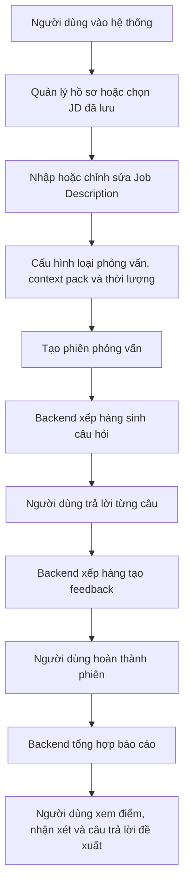

Luồng này phản ánh đúng hướng xây dựng hiện tại của mã nguồn. Trang `/setup` phụ trách nhập JD và cấu hình phiên. Trang `/sessions/[id]` hiển thị câu hỏi và nhận câu trả lời. Trang `/sessions/[id]/report` hiển thị tiến trình tạo báo cáo và nội dung báo cáo khi sẵn sàng.

## 4.2 Phân Tích Yêu Cầu Sản Phẩm

Phần phân tích yêu cầu xác định rõ người dùng, phạm vi chức năng và các ràng buộc chất lượng của prototype GR1 trước khi trình bày chi tiết luồng nghiệp vụ và thiết kế hệ thống.

### 4.2.1 Tác nhân và phạm vi sử dụng

Tác nhân chính của hệ thống là sinh viên năm cuối và ứng viên fresher ngành Công nghệ thông tin có nhu cầu luyện tập trước phỏng vấn. Người dùng thao tác trực tiếp với hệ thống để quản lý hồ sơ luyện tập, nhập hoặc chọn Job Description, cấu hình phiên phỏng vấn, trả lời câu hỏi và xem phản hồi sau phiên.

Về phạm vi loại phỏng vấn, sản phẩm tập trung vào phỏng vấn kỹ thuật, phỏng vấn hành vi và phiên phỏng vấn tổng hợp. Hệ thống không được thiết kế để hỗ trợ ứng viên gian lận trong buổi phỏng vấn thật. Hệ thống không đưa gợi ý theo thời gian thực trong lúc người dùng đang phỏng vấn với nhà tuyển dụng, mà chỉ phục vụ luyện tập trước phỏng vấn.

### 4.2.2 Yêu cầu chức năng chính

Về phạm vi chức năng, nhiệm vụ chính của hệ thống là cho phép người dùng quản lý hồ sơ luyện tập, cấu hình phiên từ mô tả công việc, nhận danh sách câu hỏi phù hợp, trả lời bằng văn bản, nhận phản hồi tự động cho từng câu trả lời và xem báo cáo tổng hợp sau phiên.

| Nhóm tính năng | Phạm vi đã phát triển trong GR1 | Mục đích trong hệ thống |
| --- | --- | --- |
| Tài khoản và hồ sơ luyện tập | Người dùng đăng ký, đăng nhập và quản lý thông tin hồ sơ phục vụ luyện phỏng vấn, bao gồm kỹ năng, kinh nghiệm, học vấn, dự án và CV. | Làm dữ liệu nền để cá nhân hóa câu hỏi và phản hồi theo năng lực thực tế của người dùng. |
| Job Description và cấu hình phiên | Người dùng nhập hoặc chọn lại JD đã lưu, sau đó chọn loại phỏng vấn, context pack, thời lượng và số lượng câu hỏi. | Xác định phạm vi buổi luyện tập để hệ thống sinh câu hỏi và đánh giá theo đúng mục tiêu ứng tuyển. |
| Sinh câu hỏi phỏng vấn | Hệ thống tạo danh sách câu hỏi dựa trên thông tin phiên, kết hợp khả năng sinh nội dung của AI với ngân hàng câu hỏi có sẵn. | Tạo bộ câu hỏi phù hợp với vị trí ứng tuyển, giảm phụ thuộc vào danh sách câu hỏi mẫu chung chung. |
| Thực hiện phiên phỏng vấn | Người dùng trả lời câu hỏi bằng văn bản trong giao diện phỏng vấn, có thể bỏ qua câu hỏi hoặc hoàn tất phiên khi đã đi hết danh sách. | Mô phỏng luồng luyện phỏng vấn có cấu trúc và tạo dữ liệu ổn định cho bước phản hồi. |
| Phản hồi cho từng câu trả lời | Hệ thống phân tích từng câu trả lời và đưa ra nhận xét về điểm mạnh, điểm còn thiếu, gợi ý cải thiện và ví dụ trả lời tốt hơn khi phù hợp. | Giúp người dùng biết cụ thể mình cần sửa nội dung nào thay vì chỉ nhận đánh giá chung chung. |
| Báo cáo tổng hợp và lịch sử phiên | Sau khi phiên kết thúc, hệ thống tạo báo cáo tổng hợp; người dùng có thể xem lại phiên, câu hỏi, câu trả lời, feedback và báo cáo tương ứng. | Giúp người dùng nhìn lại toàn bộ phiên luyện tập và có cơ sở tiếp tục rèn luyện. |
| Theo dõi tiến trình và xử lý lỗi | Các tác vụ tốn thời gian như sinh câu hỏi, tạo feedback và tạo báo cáo được xử lý nền; giao diện nhận cập nhật trạng thái khi kết quả sẵn sàng. | Giảm tình trạng chờ lâu trên một yêu cầu duy nhất và giúp hệ thống ổn định hơn khi tác vụ AI mất nhiều thời gian. |

### 4.2.3 Yêu cầu phi chức năng và ràng buộc triển khai

Prototype cần có giao diện dễ sử dụng, lưu dữ liệu phiên có cấu trúc, phản hồi đủ cụ thể để người dùng có thể hành động và xử lý các tác vụ AI dài bằng cơ chế bất đồng bộ. Hệ thống cũng cần validate dữ liệu đầu vào, kiểm soát output AI, có fallback khi AI không ổn định và giữ trạng thái phiên rõ ràng để người dùng không bị kẹt trong quá trình luyện tập.

Kết quả đánh giá của AI chỉ được xem là phản hồi tham khảo phục vụ học tập, không phải kết luận tuyển dụng chính thức. Trong phạm vi GR1, hệ thống ưu tiên khả năng demo luồng chính, vận hành local ổn định và minh bạch trạng thái hơn là triển khai production đầy đủ.

## 4.3 Luồng Nghiệp Vụ Chính

Luồng nghiệp vụ GR1 đặt phiên phỏng vấn ở trung tâm. Người dùng chuẩn bị hồ sơ và JD, hệ thống tạo câu hỏi theo loại phiên, người dùng trả lời từng câu, backend xử lý feedback ở nền và cuối cùng tổng hợp báo cáo. Các loại phiên Technical, Behavioral và Mixed không chỉ là nhãn hiển thị, mà quyết định nhóm câu hỏi, tiêu chí đánh giá và cách AI pipeline xây dựng prompt. Các đồ thị chi tiết của từng luồng được trình bày trong các nhóm tính năng tương ứng ở mục 4.5.

### 4.3.1 Luồng cấu hình và tạo phiên phỏng vấn

Luồng cấu hình bắt đầu từ trang `/setup`. Nếu người dùng đã có JD đã lưu, hệ thống hiển thị danh sách để chọn lại. Nếu chưa có hoặc muốn tạo mới, người dùng nhập thông tin JD gồm công ty, vị trí, level, yêu cầu, nội dung công việc, tech stack và một số trường bổ sung.

Sau khi JD hợp lệ, người dùng chọn loại phỏng vấn, context pack và thời lượng. Thời lượng hiện tại được ánh xạ sang số lượng câu hỏi: 30 phút tương ứng 15 câu, 60 phút tương ứng 30 câu, 90 phút tương ứng 45 câu. Khi xác nhận, frontend gửi dữ liệu lưu JD trước, sau đó tạo session gắn với JD vừa lưu.

Backend kiểm tra các điều kiện như JD đủ dài, loại phiên hợp lệ, context pack hợp lệ, số lượng câu hỏi nằm trong giới hạn và JD đã lưu thuộc về đúng người dùng. Ngoài ra, hệ thống có giới hạn số phiên được tạo trong 24 giờ để tránh lạm dụng tài nguyên AI.

### 4.3.2 Luồng thực hiện phiên phỏng vấn

Khi vào trang phỏng vấn, frontend lấy thông tin phiên. Nếu phiên đang tổng hợp hoặc đã hoàn thành, người dùng được chuyển sang trang báo cáo. Nếu phiên còn đang sinh câu hỏi, frontend chờ câu hỏi qua polling ngắn và SSE. Khi câu hỏi đã có, backend chuyển phiên sang trạng thái active.

Trong lúc phỏng vấn, người dùng trả lời từng câu theo thứ tự bằng văn bản. Người dùng cũng có thể bỏ qua câu hỏi; câu bị bỏ qua vẫn được ghi nhận để phiên hoàn thành đúng số câu, nhưng không sinh feedback chấm điểm.

Backend chỉ cho nộp câu trả lời khi phiên đang ở trạng thái có thể phỏng vấn. Nếu phiên đã hủy, đã hoàn thành hoặc chưa sẵn sàng, request sẽ bị từ chối bằng lỗi có cấu trúc.

### 4.3.3 Luồng sinh và xem báo cáo

Khi người dùng trả lời hoặc bỏ qua hết câu hỏi, frontend yêu cầu hoàn thành phiên. Backend kiểm tra số câu trả lời đã đủ với số câu hỏi chưa. Nếu đủ, trạng thái phiên chuyển sang `completing`. Sau đó backend chỉ xếp job report khi tất cả câu trả lời không bị bỏ qua đã có feedback.

Trang report có hai cơ chế chờ. Thứ nhất, trang gọi API lấy report; nếu report chưa sẵn sàng, backend trả trạng thái `REPORT_NOT_READY` và frontend thử lại sau một khoảng thời gian. Thứ hai, trang subscribe SSE để nhận tiến trình feedback và sự kiện report sẵn sàng. Cách kết hợp này giúp trải nghiệm ổn định hơn khi một trong hai cơ chế bị trễ.

Nội dung báo cáo hiển thị theo thứ tự: điểm tổng hoặc trạng thái chưa thể chấm, thông tin phiên, phương pháp chấm, tóm tắt tổng quan, biểu đồ năng lực và phân tích từng câu trả lời. Với câu bị bỏ qua, báo cáo không hiển thị nhận xét điểm mạnh/điểm yếu mà chỉ hiển thị câu trả lời đề xuất.

### 4.3.4 Luồng xử lý lỗi và trạng thái ngoại lệ

Hệ thống xử lý lỗi ở nhiều lớp:

- Ở frontend, lỗi kết nối server được hiển thị bằng thông báo dễ hiểu và có nút thử lại ở danh sách phiên.
- Ở backend, input được validate bằng DTO trước khi vào nghiệp vụ.
- Các API được bảo vệ bằng guard để tránh truy cập dữ liệu phiên của người khác.
- Nếu chuyển trạng thái phiên không hợp lệ, backend trả lỗi xung đột thay vì tự sửa im lặng.
- Nếu Redis hoặc database không sẵn sàng, health check trả trạng thái degraded.
- Nếu AI provider lỗi, timeout, hết quota hoặc trả output không hợp lệ, pipeline dùng fallback khi có thể.
- Nếu job report chưa sẵn sàng, frontend hiển thị tiến trình thay vì báo lỗi ngay.

Nguyên tắc chung là không để người dùng bị kẹt ở trạng thái không có thông tin. Nếu lỗi khiến phiên không thể tiếp tục, hệ thống chuyển trạng thái lỗi hoặc hiển thị thông báo. Nếu lỗi có thể giảm cấp chất lượng nhưng vẫn tiếp tục được, hệ thống dùng fallback và thể hiện rõ trong báo cáo.

## 4.4 Kiến Trúc Tổng Thể Hệ Thống

Kiến trúc hiện tại của AI Mock Interview gồm frontend Next.js, backend NestJS, cơ sở dữ liệu PostgreSQL/Supabase, Redis cho hàng đợi và SSE, cùng AI provider tương thích OpenAI. Frontend không truy cập trực tiếp database. Mọi dữ liệu nghiệp vụ đi qua backend API.

### 4.4.1 Kiến trúc mức cao

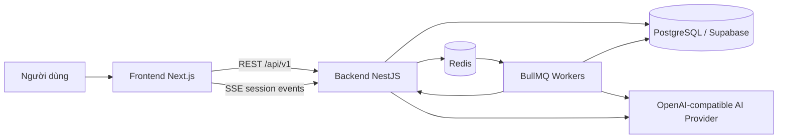

### 4.4.2 Các thành phần chính trong hệ thống

Frontend chịu trách nhiệm hiển thị màn hình, quản lý trạng thái tương tác và gọi API. Backend chịu trách nhiệm kiểm tra quyền truy cập, validate dữ liệu, quản lý phiên, lưu dữ liệu, điều phối job nền và chuẩn hóa lỗi trả về cho client. Redis được dùng cho BullMQ và kênh phát sự kiện. PostgreSQL lưu dữ liệu bền vững của người dùng, phiên phỏng vấn, câu hỏi, câu trả lời, feedback và báo cáo.

### 4.4.3 Cách giao tiếp giữa các thành phần

Các thao tác ngắn như lấy danh sách phiên, lưu JD, cập nhật hồ sơ và gửi câu trả lời được thực hiện qua REST API. Các tác vụ dài hơn như sinh câu hỏi, tạo feedback và tổng hợp báo cáo được chuyển sang hàng đợi nền.

Khi trạng thái thay đổi, backend phát sự kiện về kênh SSE của phiên. Frontend dùng sự kiện này để tải lại câu hỏi khi câu hỏi đã sẵn sàng, hiển thị tiến trình chấm câu trả lời hoặc mở báo cáo khi report đã hoàn thành. Nếu SSE không nhận được sự kiện, frontend vẫn có cơ chế polling để kiểm tra report, giúp luồng không phụ thuộc hoàn toàn vào một kênh cập nhật.

Trong môi trường phát triển local, hệ thống có thể bỏ qua xác thực thật bằng cấu hình dev để giảm thời gian demo. Tuy nhiên, backend vẫn giữ lớp guard ở các API cần bảo vệ. Điều này giúp luồng nghiệp vụ không phụ thuộc vào việc frontend gọi trực tiếp database hay tin tưởng dữ liệu từ trình duyệt.

## 4.5 Thiết Kế Theo Nhóm Tính Năng

Phần này trình bày thiết kế theo từng nhóm tính năng thay vì tách riêng backend, frontend và AI pipeline. Cách trình bày này phù hợp hơn với bản chất của prototype: mỗi tính năng đều gồm màn hình người dùng, API/backend, dữ liệu lưu trữ và một số cơ chế xử lý nền đi kèm. Các thuật toán sinh câu hỏi, đánh giá câu trả lời, tổng hợp báo cáo và fallback AI được đặt ngay trong nhóm tính năng tương ứng để thể hiện rõ chúng phục vụ luồng sản phẩm nào.

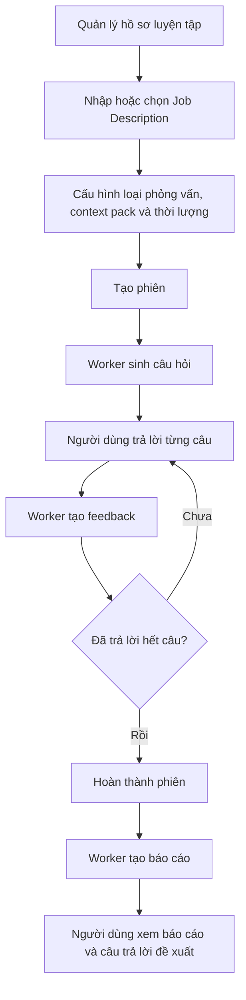

### 4.5.1 Tài khoản và hồ sơ luyện tập

Nhóm tính năng tài khoản và hồ sơ cung cấp dữ liệu nền cho toàn bộ quá trình luyện phỏng vấn. Ở frontend, người dùng thao tác chủ yếu trên trang `/profile`, nơi hiển thị và cập nhật các thông tin như định hướng nghề nghiệp, kỹ năng, học vấn, kinh nghiệm, dự án, chứng chỉ và CV nếu có.

Ở backend, các API profile chịu trách nhiệm đọc và cập nhật hồ sơ của đúng người dùng hiện tại. Lớp guard kiểm tra danh tính ở các API cần bảo vệ, còn DTO validation đảm bảo dữ liệu gửi lên có cấu trúc hợp lệ trước khi lưu. Dữ liệu hồ sơ được lưu trong các bảng người dùng, hồ sơ mở rộng và resume, tạo thành ngữ cảnh có thể được dùng khi hệ thống cá nhân hóa câu hỏi hoặc phản hồi.

Trong phạm vi GR1, hồ sơ không được thiết kế như một hệ thống tuyển dụng đầy đủ. Vai trò chính của nó là giúp phiên luyện tập có thêm ngữ cảnh về người dùng, đồng thời cho phép người dùng quản lý thông tin nền mà không phải nhập lại trong mỗi phiên.

### 4.5.2 Job Description và cấu hình phiên

Nhóm tính năng này bắt đầu từ trang `/setup` hoặc từ thư viện JD. Người dùng có thể nhập JD mới, chỉnh sửa thông tin công ty, vị trí, cấp độ, yêu cầu, nội dung công việc, tech stack, hoặc chọn lại một JD đã lưu từ `/jd-library`. Sau đó người dùng chọn loại phỏng vấn, context pack và thời lượng phiên.

Frontend chia màn hình tạo phiên thành nhiều bước để giảm tải nhận thức: chọn hoặc nhập JD, cấu hình phiên, xác nhận thông tin rồi bắt đầu. Trước khi gửi request, frontend kiểm tra một số điều kiện cơ bản như công ty, vị trí, yêu cầu và nội dung công việc không được quá ngắn. Tuy nhiên, kiểm tra quyết định vẫn nằm ở backend.

Backend lưu JD vào bảng `saved_job_descriptions`, sau đó tạo bản ghi `interview_sessions` gắn với JD, loại phiên, context pack, ngôn ngữ, thời lượng và số lượng câu hỏi. Backend kiểm tra JD đủ dài, loại phiên hợp lệ, context pack tồn tại, số lượng câu hỏi nằm trong giới hạn và JD thuộc về đúng người dùng. Sau khi tạo phiên, backend không sinh câu hỏi ngay trong request mà đưa job vào hàng đợi sinh câu hỏi để tránh request bị timeout.

Đầu vào của job sinh câu hỏi gồm các thông tin chính: Job Description đã chuẩn hóa thành văn bản, loại phiên HR/Behavioral, Technical hoặc Mixed, context pack Việt Nam hoặc Western, ngôn ngữ đầu ra, danh sách vị trí mục tiêu lấy từ JD, số lượng câu hỏi, thời lượng phiên, mã người dùng và mã JD đã lưu nếu có. Đây là các dữ liệu quyết định cách chọn pipeline, cách tạo prompt, cách lọc question bank và cách lưu lại danh sách câu hỏi cho phiên.

Việc đưa job sinh câu hỏi vào queue là lựa chọn quan trọng của thiết kế. Tác vụ này có thể phải gọi AI provider, parse JSON, validate schema, lấy thêm câu hỏi từ question bank và ghi nhiều bản ghi vào database. Nếu thực hiện đồng bộ trong request tạo phiên, frontend dễ gặp timeout khi AI phản hồi chậm. Vì vậy backend chỉ tạo session và trả `session id`, còn worker nền chịu trách nhiệm biến session từ trạng thái đang sinh câu hỏi sang trạng thái sẵn sàng phỏng vấn.

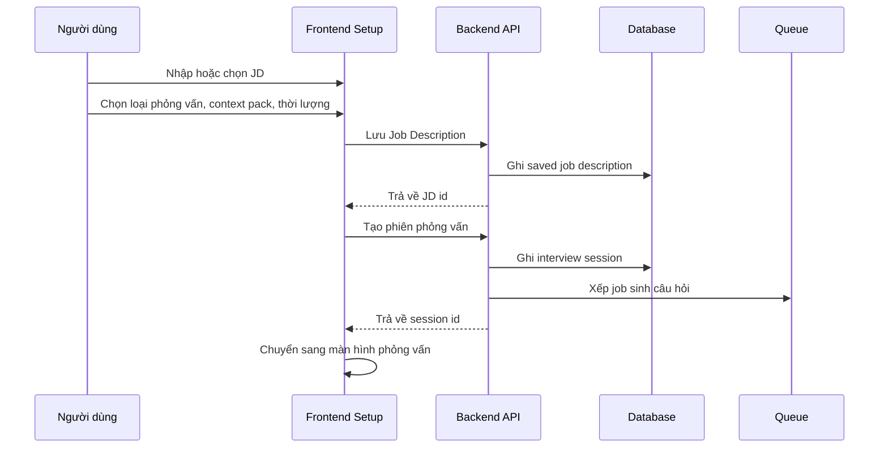

### 4.5.3 Sinh câu hỏi phỏng vấn

**a. Mục đích của tính năng**

Tính năng sinh câu hỏi phỏng vấn tạo danh sách câu hỏi cho từng phiên luyện tập dựa trên Job Description, loại phỏng vấn và cấu hình do người dùng chọn. Đây là bước chuẩn bị nội dung trước khi người dùng bắt đầu trả lời phỏng vấn. Nếu bước này không hoàn tất, phiên chưa thể chuyển sang trạng thái sẵn sàng.

Trong AI Mock Interview, câu hỏi không được tạo như một danh sách cố định cho mọi người dùng. Hệ thống kết hợp hai nguồn: AI sinh một phần câu hỏi theo ngữ cảnh của JD, còn phần còn lại lấy từ question bank đã được chuẩn bị sẵn. Cách thiết kế này giúp câu hỏi vẫn bám vào vị trí ứng tuyển nhưng không phụ thuộc hoàn toàn vào AI provider.

Flow Diagram dưới đây minh họa mục đích vận hành của tính năng ở mức tổng quan: từ cấu hình phiên của người dùng, hệ thống tạo danh sách câu hỏi hợp lệ và đưa phiên sang trạng thái có thể bắt đầu phỏng vấn.

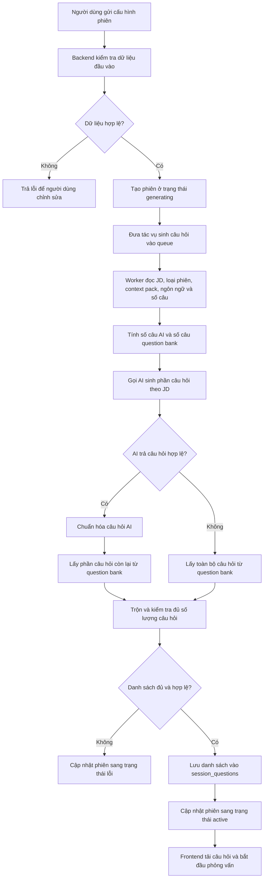

**b. Dữ liệu đầu vào**

Dữ liệu đầu vào chính là nội dung Job Description do người dùng nhập hoặc chọn từ JD đã lưu. Nội dung này cung cấp vị trí ứng tuyển, yêu cầu công việc, kỹ năng liên quan và bối cảnh để hệ thống tạo câu hỏi phù hợp hơn với mục tiêu luyện tập.

Người dùng cũng chọn loại phỏng vấn, gồm HR/Behavioral, Technical hoặc Mixed. Loại phỏng vấn quyết định trọng tâm câu hỏi: hành vi, kỹ thuật hoặc kết hợp cả hai. Ngoài ra, cấu hình phiên còn có số lượng câu hỏi, thời lượng phiên, ngôn ngữ hiển thị, context pack Việt Nam hoặc Western và cấp độ/phân bố độ khó được hệ thống áp dụng khi chọn câu hỏi.

Nếu người dùng đã có hồ sơ cá nhân hoặc hồ sơ nghề nghiệp trong hệ thống, dữ liệu này có thể được dùng làm ngữ cảnh bổ sung. Phần có căn cứ rõ trong luồng hiện tại vẫn là JD, loại phiên, ngôn ngữ, context pack, số lượng câu hỏi, thời lượng phiên, mã người dùng và mã JD đã lưu nếu có.

**c. Luồng xử lý nghiệp vụ**

Luồng bắt đầu khi người dùng hoàn tất cấu hình phiên và gửi yêu cầu tạo phiên phỏng vấn. Frontend gửi dữ liệu cấu hình lên backend. Backend tạo bản ghi phiên ở trạng thái đang sinh câu hỏi, sau đó đưa tác vụ sinh câu hỏi vào hàng đợi nền. Việc đưa vào hàng đợi giúp request tạo phiên trả về nhanh hơn, vì quá trình sinh câu hỏi có thể phải gọi AI, đọc question bank và ghi nhiều bản ghi vào database.

Khi worker xử lý tác vụ, hệ thống đọc thông tin phiên, JD, loại phỏng vấn, context pack, ngôn ngữ và số câu cần tạo. Với chiến lược hiện tại, hệ thống dùng mô hình hybrid: cứ khoảng 5 câu hỏi trong phiên thì có 1 câu do AI sinh, phần còn lại được lấy từ question bank. Ví dụ, phiên 15 câu sẽ có khoảng 3 câu AI và 12 câu từ question bank.

Sau khi có câu hỏi AI và câu hỏi từ question bank, backend chuẩn hóa metadata, kiểm tra số lượng, trộn câu hỏi theo thứ tự và lưu danh sách cuối cùng. Nếu danh sách hợp lệ và đủ số câu, phiên được chuyển sang trạng thái sẵn sàng. Frontend nhận trạng thái mới qua cơ chế cập nhật trạng thái và tải danh sách câu hỏi để bắt đầu phỏng vấn.

Sequence Diagram dưới đây thể hiện tương tác giữa frontend, backend, database, queue và AI service trong luồng nghiệp vụ. Sơ đồ nhấn mạnh rằng request tạo phiên không chờ toàn bộ quá trình AI hoàn tất; phần sinh câu hỏi được xử lý bất đồng bộ.

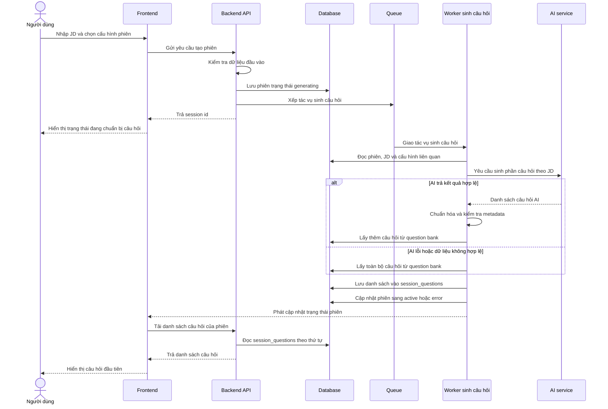

**d. Thiết kế giao diện frontend**

Ở phía frontend, tính năng này xuất hiện trong màn hình cấu hình phiên phỏng vấn. Người dùng nhập hoặc chọn Job Description, chọn loại phỏng vấn, chọn số lượng câu hỏi, thời lượng, ngôn ngữ và context pack. Giao diện cần hiển thị rõ các trường bắt buộc để người dùng biết dữ liệu nào ảnh hưởng trực tiếp đến danh sách câu hỏi.

Khi người dùng gửi yêu cầu tạo phiên, giao diện chuyển sang trạng thái đang xử lý. Trạng thái này thể hiện rằng hệ thống đã nhận cấu hình và đang chuẩn bị câu hỏi. Trong thời gian chờ, frontend không cần hiển thị từng bước xử lý nội bộ, nhưng cần cho người dùng biết phiên chưa sẵn sàng để trả lời.

Nếu backend trả lỗi do dữ liệu đầu vào không hợp lệ, giao diện hiển thị thông báo lỗi gần khu vực cấu hình để người dùng sửa lại. Nếu phiên đã được tạo nhưng câu hỏi chưa sẵn sàng, màn hình phỏng vấn hiển thị trạng thái chờ và tiếp tục theo dõi trạng thái phiên. Khi phiên chuyển sang trạng thái sẵn sàng, frontend tải danh sách câu hỏi và hiển thị câu hỏi đầu tiên theo thứ tự.

**e. Thiết kế xử lý backend**

Backend chịu trách nhiệm kiểm tra dữ liệu đầu vào trước khi tạo phiên. Các thông tin như loại phỏng vấn, số lượng câu hỏi, JD, ngôn ngữ và context pack phải hợp lệ. Nếu dữ liệu không đạt yêu cầu, backend trả lỗi để frontend yêu cầu người dùng điều chỉnh.

Khi dữ liệu hợp lệ, backend tạo phiên trong database và đưa tác vụ sinh câu hỏi vào queue. Tác vụ nền đọc lại thông tin phiên, JD, loại phỏng vấn, context pack, ngôn ngữ đầu ra, tổng số câu hỏi và thời lượng phiên. Đây là các dữ liệu quyết định cách chọn chiến lược sinh câu hỏi, cách tạo prompt, cách lọc question bank và cách lưu danh sách câu hỏi cuối cùng.

Chiến lược hiện tại là hybrid. Backend không yêu cầu AI sinh toàn bộ câu hỏi; cứ khoảng 5 câu trong phiên thì có 1 câu do AI sinh, phần còn lại lấy từ question bank. Số câu AI được tính bằng cách làm tròn tổng số câu chia cho 5. Cách này giữ được phần cá nhân hóa theo JD nhưng vẫn giảm rủi ro khi AI chậm, hết quota hoặc trả dữ liệu không đúng định dạng.

| Tổng số câu trong phiên | Số câu AI sinh | Số câu lấy từ question bank |
| --- | --- | --- |
| 15 câu | 3 câu | 12 câu |
| 30 câu | 6 câu | 24 câu |
| 45 câu | 9 câu | 36 câu |

Backend có ba chiến lược sinh câu hỏi tương ứng với ba loại phiên. Việc tách chiến lược giúp prompt không bị chung chung và giúp câu hỏi đi đúng mục tiêu luyện tập của phiên.

| Loại phiên | Trọng tâm sinh câu hỏi |
| --- | --- |
| HR/Behavioral | Tập trung vào động lực, giao tiếp, làm việc nhóm, tự nhận thức, văn hóa và ví dụ theo STAR. |
| Technical | Tập trung vào kiến thức kỹ thuật, cách áp dụng thực tế, trade-off, debug, thiết kế hệ thống và chất lượng code. |
| Mixed | Kết hợp câu hỏi hành vi và kỹ thuật, giúp phiên gần với buổi phỏng vấn tổng hợp hơn. |

Với phiên Technical, backend tránh sinh quá nhiều câu hỏi hành vi vì mục tiêu chính là kiểm tra năng lực chuyên môn. Với phiên HR/Behavioral, backend không đẩy câu hỏi theo hướng trivia kỹ thuật. Với phiên Mixed, hệ thống cho phép cả hai nhóm câu hỏi nhưng mỗi câu vẫn phải gắn với một competency domain cụ thể để các bước đánh giá phía sau có tiêu chí rõ ràng.

Prompt sinh câu hỏi được tạo theo hai lớp. Lớp thứ nhất là phần hướng dẫn nền, trong đó quy định vai trò của AI, nhiệm vụ sinh câu hỏi, ràng buộc số lượng, format JSON, loại câu hỏi, competency domain và độ khó. Lớp thứ hai là dữ liệu động của phiên, gồm JD, loại phiên, vai trò mục tiêu và số câu AI cần sinh. Trong thực tế, nếu người dùng tạo phiên 15 câu, backend chỉ yêu cầu AI sinh 3 câu vì phần còn lại đến từ question bank. Vì vậy số câu trong prompt AI là số câu AI cần sinh, không phải tổng số câu của phiên.

| Thành phần trong prompt | Vai trò |
| --- | --- |
| Vai trò AI | Yêu cầu AI đóng vai người phỏng vấn có kinh nghiệm. |
| Nhiệm vụ | Sinh câu hỏi phù hợp với JD và chiến lược phỏng vấn. |
| Ràng buộc số lượng | Phải sinh đúng số câu được backend yêu cầu cho phần AI. |
| Ràng buộc format | Chỉ trả về một JSON object gọn, không markdown, không giải thích thêm. |
| Cấu trúc JSON | Mỗi câu hỏi có nội dung câu hỏi, loại câu hỏi, competency domain và độ khó. |
| Ràng buộc metadata | Loại câu hỏi chỉ thuộc nhóm hành vi hoặc kỹ thuật; competency domain phải thuộc bộ rubric hợp lệ của phiên. |

Sau phần luật nền, backend gắn thêm chiến lược theo loại phiên, context pack và danh sách mã rubric được phép dùng. Dữ liệu động được đưa vào prompt theo các khối rõ ràng như nội dung JD, loại phiên, vai trò mục tiêu và số câu cần AI sinh. Cách tổ chức này giúp AI tập trung vào đúng dữ liệu của phiên hiện tại, đồng thời giúp backend dễ kiểm tra kết quả trả về.

```text
<job_description>
...nội dung JD người dùng nhập...
</job_description>

<session_type>technical</session_type>

<target_roles>
Backend Developer
</target_roles>

<num_questions>3</num_questions>
```

Sau khi AI trả kết quả, backend không lưu ngay. Kết quả phải đi qua các bước parse JSON, kiểm tra schema, chuẩn hóa loại câu hỏi, chuẩn hóa competency domain theo context pack và loại phiên, loại bỏ câu hỏi có domain không thuộc phiên hiện tại, chuẩn hóa độ khó về mức 1, 2 hoặc 3 và tính thời lượng ước tính cho từng câu. Nếu AI trả về tên tiêu chí thay vì mã tiêu chí, backend có cơ chế khớp theo mã gốc, mã đã chuẩn hóa, mã được trích ra từ chuỗi hoặc tên tiêu chí đã chuẩn hóa. Nếu vẫn không khớp, câu hỏi đó bị loại bỏ.

Đối với phần question bank, backend lọc câu hỏi theo loại phiên, context pack và ngôn ngữ. Với phiên Mixed, hệ thống chia tương đối giữa câu hỏi HR và Technical. Backend không lấy đúng bằng số lượng cần ngay từ đầu mà lấy một tập ứng viên lớn hơn, khoảng gấp 3 lần số câu cần lấy, rồi chọn theo phân bố độ khó. Logic hiện tại ưu tiên khoảng 30% câu dễ, 50% câu trung bình và 20% câu khó; nếu nhóm nào không đủ, hệ thống lấy thêm từ các câu còn lại để đạt đủ số lượng.

Sau khi có câu hỏi AI và câu hỏi từ question bank, backend trộn chúng thành danh sách cuối cùng. Câu hỏi AI không bị dồn vào đầu phiên mà được đặt cách quãng, ví dụ ở các vị trí khoảng 5, 10, 15 nếu phiên đủ dài. Các vị trí còn lại lấy từ question bank. Mỗi câu hỏi cuối cùng được lưu với mã phiên, mã câu hỏi gốc nếu có, nội dung câu hỏi, thứ tự, loại câu hỏi, competency domain, rubric JSON và thời lượng ước tính.

Thuật toán sinh câu hỏi được đặt ở backend vì đây là bước cần kiểm soát chặt dữ liệu đầu vào, trạng thái phiên, context pack, question bank và khả năng fallback khi AI không ổn định. Frontend chỉ gửi cấu hình phiên; backend mới là nơi quyết định câu hỏi nào được tạo, câu hỏi nào được lấy từ ngân hàng câu hỏi và khi nào phiên được chuyển sang trạng thái sẵn sàng.

```text
Input: sessionId, sessionType, jobDescription, targetRoles, contextPack, language, totalQuestions, durationMin
1. Tính số câu AI cần sinh = làm tròn(totalQuestions / 5).
2. Lấy cấu hình context pack và chiến lược theo sessionType.
3. Gọi AI để sinh số câu đã tính.
4. Nếu AI lỗi:
   4.1. Lấy totalQuestions câu từ question bank.
   4.2. Lưu câu hỏi vào session_questions.
   4.3. Chuyển session sang active và phát cập nhật trạng thái.
   4.4. Kết thúc.
5. Nếu AI thành công:
   5.1. Parse JSON và validate schema.
   5.2. Chuẩn hóa category, competency domain, difficulty và estimated time.
   5.3. Loại bỏ câu hỏi có metadata không hợp lệ.
6. Tính số câu còn lại cần lấy từ question bank.
7. Lấy câu hỏi question bank theo sessionType, contextPack, language và độ khó.
8. Trộn câu hỏi AI và question bank theo thứ tự.
9. Nếu tổng số câu không đủ, đánh dấu session lỗi.
10. Nếu đủ, lưu vào session_questions.
11. Chuyển session sang active.
12. Phát sự kiện trạng thái để frontend bắt đầu phỏng vấn.
```

**f. Xử lý lỗi và fallback**

Các lỗi đầu vào được xử lý ngay ở bước tạo phiên. Nếu JD trống, loại phiên không hợp lệ, số lượng câu hỏi vượt phạm vi cho phép hoặc thiếu dữ liệu bắt buộc, backend không tạo phiên hợp lệ và trả lỗi cho frontend.

Khi AI provider lỗi, hết quota, timeout hoặc trả dữ liệu không đúng cấu trúc, backend không lưu kết quả AI chưa hợp lệ. Hệ thống chuyển sang lấy toàn bộ số câu cần thiết từ question bank nếu nguồn dữ liệu này đáp ứng đủ. Đây là fallback quan trọng để người dùng vẫn có thể bắt đầu phiên ngay cả khi AI không khả dụng.

Nếu question bank không đủ câu hỏi phù hợp với loại phiên, context pack hoặc ngôn ngữ, hệ thống cố gắng bù từ các câu còn lại trong phạm vi hợp lệ. Nếu sau bước bù vẫn không đủ số câu tối thiểu để tạo phiên, backend chuyển phiên sang trạng thái lỗi để frontend thông báo cho người dùng thay vì bắt đầu một phiên thiếu dữ liệu.

### 4.5.4 Thực hiện phiên và lưu câu trả lời

Màn hình `/sessions/[id]` hiển thị từng câu hỏi theo thứ tự. Người dùng nhập câu trả lời bằng văn bản, gửi câu trả lời, bỏ qua câu hỏi khi cần, tạm dừng, tiếp tục, hủy hoặc hoàn tất phiên. Nếu câu hỏi chưa sẵn sàng, frontend hiển thị trạng thái chờ và lắng nghe cập nhật từ backend.

Backend chỉ nhận câu trả lời khi phiên ở trạng thái có thể phỏng vấn. Một lần gửi câu trả lời nhận các dữ liệu chính gồm mã phiên, mã câu hỏi, nội dung câu hỏi, loại câu hỏi, competency domain, câu trả lời của ứng viên, loại phiên, context pack và ngôn ngữ đầu ra. Backend kiểm tra phiên tồn tại, thuộc đúng người dùng, câu hỏi thuộc đúng phiên và trạng thái phiên cho phép trả lời.

Khi người dùng gửi câu trả lời bằng văn bản, backend lưu dữ liệu vào `user_answers` và xếp job feedback. Nếu người dùng bỏ qua câu hỏi, backend lưu câu trả lời với cờ skipped và không xếp job feedback. Câu bị bỏ qua vẫn được tính là đã đi qua trong phiên để người dùng có thể hoàn thành phiên, nhưng không được chấm điểm như câu trả lời thật.

Mỗi câu hỏi trong một phiên chỉ được phép có một câu trả lời hiện hành. Ràng buộc này giúp tránh việc người dùng gửi trùng câu trả lời khi click nhiều lần hoặc khi request bị retry. Nhờ đó các bước feedback và report phía sau luôn có quan hệ rõ ràng giữa một câu hỏi, một câu trả lời và một feedback tương ứng.

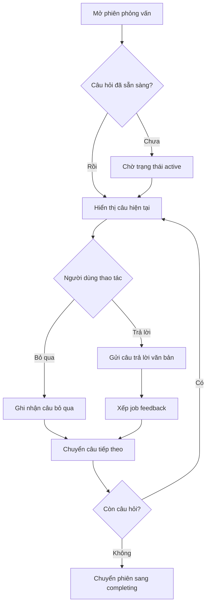

### 4.5.5 Đánh giá và phản hồi từng câu trả lời

Feedback được xử lý theo từng turn. Sau khi answer được lưu, worker feedback đọc câu hỏi, câu trả lời, loại phiên, context pack, competency domain và ngôn ngữ đầu ra. Backend không chỉ gửi câu hỏi và câu trả lời cho AI mà còn gửi metadata của câu hỏi để AI biết câu trả lời cần được chấm theo tiêu chí nào.

Prompt đánh giá được tạo theo dạng system message và user message, nhưng chặt hơn prompt sinh câu hỏi vì kết quả đánh giá sẽ ảnh hưởng trực tiếp đến điểm số và báo cáo của người dùng. System message yêu cầu AI đóng vai interview coach, trả về câu trả lời mẫu hoàn chỉnh 3-4 câu, nhận xét trọng tâm, điểm theo từng tiêu chí trong `applied_dimensions` và tối đa 2 annotated segments từ câu trả lời gốc. AI không được tự trả weight hoặc tự tính overall score.

User message của prompt đánh giá chứa dữ liệu cụ thể của turn:

```text
<session_type>technical</session_type>

<question>
Bạn đã thiết kế database cho dự án như thế nào?
</question>

<question_metadata>
category=technical
competency_domain=TD2
</question_metadata>

<answer>
...câu trả lời của ứng viên...
</answer>
```

Ở bước này, backend cố tình để `<job_description>` rỗng trong prompt feedback hiện tại. Lý do là feedback từng câu đang chấm trực tiếp trên câu hỏi, metadata câu hỏi, context pack và câu trả lời. JD đã được dùng mạnh ở bước tạo câu hỏi; đến bước chấm từng câu, hệ thống ưu tiên không đưa quá nhiều ngữ cảnh thừa để giảm khả năng AI đánh giá lan man.

Kết quả AI phải có các nhóm dữ liệu gồm tiêu chí được áp dụng, câu trả lời mẫu, nhận xét chính và đoạn nhận xét cụ thể. Các đoạn trích phải sao chép nguyên văn từ câu trả lời của ứng viên. Backend lưu cả nội dung đoạn trích và vị trí ký tự. Khi hiển thị báo cáo, giao diện ưu tiên dùng đoạn trích đã lưu để tránh phụ thuộc quá nhiều vào offset nếu nội dung câu trả lời hoặc ngôn ngữ hiển thị có sai lệch.

Output AI được validate bằng hai lớp: kiểm tra schema và kiểm tra ý nghĩa rubric. Một feedback hợp lệ về mặt schema phải có `applied_dimensions`, `model_answer`, `key_takeaway` và `annotated_segments`; mỗi điểm phải nằm trong khoảng 1-100 và `highlight_level` chỉ được là `strength` hoặc `improvement`. Qua được schema vẫn chưa đủ vì AI có thể trả JSON đúng cấu trúc nhưng mã tiêu chí không thuộc rubric của phiên.

Backend xác định danh sách tiêu chí được phép theo ba bước. Thứ nhất, dựa vào loại phiên để lấy tập tiêu chí tối đa: HR chỉ lấy behavioral dimensions, Technical chỉ lấy technical dimensions, Mixed lấy cả hai nhóm. Thứ hai, nếu câu hỏi có competency domain cụ thể và domain đó nằm trong tập tiêu chí của phiên, backend rút tập được phép xuống chỉ còn domain đó. Thứ ba, backend so khớp các tiêu chí AI trả về với tập được phép.

| Nhánh khớp | Ví dụ AI trả về | Cách hệ thống hiểu |
| --- | --- | --- |
| Khớp chính xác | `TD2` | Dùng đúng tiêu chí `TD2`. |
| Khớp sau chuẩn hóa | `td-2`, `td 2` | Loại bỏ khoảng trắng/ký tự phụ và hiểu là `TD2`. |
| Trích mã trong chuỗi | `TD2 - Practical Application` | Trích token `TD2`. |
| Khớp theo tên tiêu chí | `Khả năng áp dụng thực tế` | Chuẩn hóa tên và ánh xạ về mã rubric tương ứng. |

Nếu một tiêu chí đã được khớp, backend chỉ lấy một lần để tránh AI trả trùng tiêu chí. Nếu sau toàn bộ quá trình không còn tiêu chí hợp lệ nào, backend xem feedback đó không dùng được và chuyển sang fallback.

Điểm tổng của một câu trả lời không lấy trực tiếp từ AI. Backend lọc tiêu chí AI trả về theo rubric và competency domain của câu hỏi, chuẩn hóa trọng số của các tiêu chí hợp lệ rồi tự tính điểm tổng theo thang 100:

```text
Điểm tổng = round(Σ điểm_tiêu_chí * trọng_số_đã_chuẩn_hóa)
```

Trong đó:

```text
trọng_số_đã_chuẩn_hóa = trọng_số_gốc_của_tiêu_chí / tổng_trọng_số_gốc_của_các_tiêu_chí_được_chọn
```

Ví dụ, với context pack Việt Nam, nhóm kỹ thuật có trọng số gốc như sau: `TD1 = 0.25`, `TD2 = 0.25`, `TD3 = 0.2`, `TD4 = 0.2`, `TD5 = 0.1`. Nếu một câu hỏi chỉ đánh giá `TD1` và `TD2`, hệ thống không lấy cả 5 tiêu chí vào công thức. Hệ thống chỉ chuẩn hóa trên hai tiêu chí được chọn:

| Tiêu chí | Trọng số gốc | Điểm AI trả | Trọng số sau chuẩn hóa | Đóng góp vào điểm |
| --- | --- | --- | --- | --- |
| `TD1` | 0.25 | 80 | 0.5 | 40 |
| `TD2` | 0.25 | 70 | 0.5 | 35 |
| Tổng | 0.5 |  | 1.0 | 75 |

Điểm tổng của câu trả lời trong ví dụ này là `75/100`. Cách tính này có ý nghĩa vì mỗi câu hỏi chỉ kiểm tra một phần năng lực, không phải toàn bộ rubric. Backend chỉ tính điểm trên các tiêu chí thật sự được câu hỏi đó đánh giá, nhờ vậy điểm của một câu hỏi không bị kéo lệch bởi những tiêu chí không liên quan.

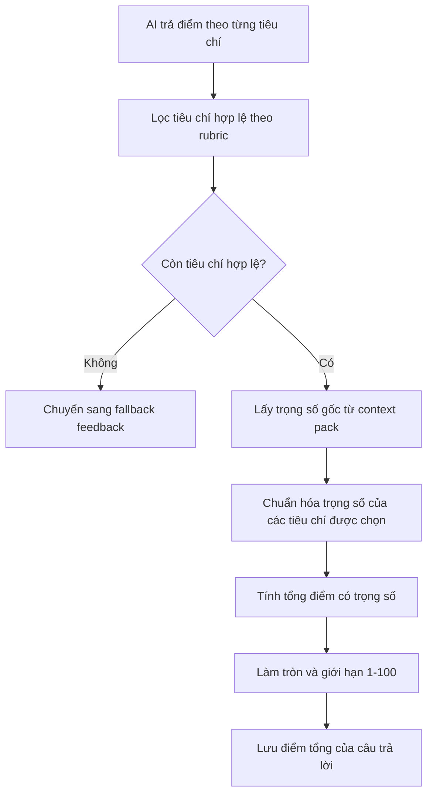

Khi feedback hợp lệ, backend lưu trong một transaction để tránh trạng thái nửa vời: ghi hoặc cập nhật feedback của câu trả lời, xóa các đoạn nhận xét cũ nếu feedback được tạo lại, ghi danh sách đoạn nhận xét mới và đánh dấu câu trả lời đã có feedback. Thông tin feedback được lưu gồm điểm tổng, câu trả lời mẫu, nhận xét chính, phiên bản prompt, cờ fallback, điểm theo tiêu chí và các annotated segment.

Sau khi lưu xong, backend phát sự kiện `turn.feedback_ready` và cập nhật tiến trình feedback của phiên. Nếu phiên đang ở trạng thái tạo báo cáo và tất cả feedback cần thiết đã sẵn sàng, backend xếp job tạo báo cáo tổng hợp.

```text
Input: sessionId, questionId, answerText, skip flag

1. Kiểm tra session tồn tại và thuộc về người dùng.
2. Kiểm tra session đang ở trạng thái có thể trả lời.
3. Kiểm tra câu hỏi thuộc session.
4. Nếu người dùng bỏ qua:
   4.1. Lưu answer với skipped = true.
   4.2. Không xếp job feedback.
   4.3. Trả kết quả cho frontend.
5. Nếu là câu trả lời văn bản:
   5.1. Lưu answer và metadata cần thiết.
   5.2. Xếp job feedback.
6. Feedback worker lấy context pack và pipeline theo session type.
7. Tạo prompt gồm câu hỏi, câu trả lời, metadata câu hỏi, rubric và ngôn ngữ.
8. Gọi AI để lấy feedback JSON.
9. Parse JSON và validate schema.
10. Lọc tiêu chí chấm theo rubric và competency domain của câu hỏi.
11. Nếu không còn tiêu chí hợp lệ, ghi fallback feedback.
12. Nếu hợp lệ:
    12.1. Chuẩn hóa trọng số tiêu chí.
    12.2. Tính điểm tổng theo trọng số.
    12.3. Lưu feedback và annotated segments.
13. Đánh dấu answer đã có feedback.
14. Phát sự kiện feedback ready và feedback progress.
15. Nếu phiên đang completing và mọi feedback đã sẵn sàng, xếp job tạo report.
```

### 4.5.6 Báo cáo tổng hợp và xem lại lịch sử phiên

Nhóm tính năng báo cáo bắt đầu khi người dùng đã đi hết danh sách câu hỏi và yêu cầu hoàn thành phiên. Backend chuyển phiên sang `completing`, kiểm tra các câu trả lời không bị bỏ qua đã có feedback hay chưa, rồi chỉ xếp job report khi dữ liệu đã đủ. Điều kiện này giúp báo cáo không được tạo quá sớm khi điểm và nhận xét từng câu chưa sẵn sàng.

Report processor đọc danh sách câu hỏi, câu trả lời và feedback, tách câu bị bỏ qua khỏi câu có dữ liệu chấm thật. Điểm tổng của phiên được tính bằng trung bình các feedback hợp lệ; feedback fallback không được tính như điểm thật để tránh tạo điểm sai lệch. Nếu toàn bộ phiên chỉ có fallback hoặc không có câu trả lời có thể chấm, báo cáo thể hiện trạng thái chưa thể chấm điểm thay vì hiển thị một điểm số gây hiểu nhầm.

Báo cáo được lưu thành nhiều phần trong `session_reports`, gồm tóm tắt tổng quan, phân tích giao tiếp, heatmap năng lực, kế hoạch hành động và câu trả lời đề xuất cho các câu bị bỏ qua. Khi report được ghi thành công, trạng thái phiên chuyển sang hoàn thành và backend phát sự kiện `report.ready`. Frontend nhận sự kiện này hoặc phát hiện qua polling để tải báo cáo.

Frontend hiển thị báo cáo tại `/sessions/[id]/report`. Khi report chưa sẵn sàng, màn hình hiển thị tiến trình feedback và trạng thái chờ. Khi report sẵn sàng, màn hình hiển thị điểm tổng hoặc trạng thái chưa thể chấm, thông tin phiên, phương pháp chấm, biểu đồ năng lực và phân tích từng câu trả lời. Với câu bị bỏ qua, báo cáo chỉ hiển thị câu trả lời đề xuất, không hiển thị điểm mạnh hoặc điểm cần cải thiện như một câu đã được chấm.

Lịch sử phiên được thể hiện qua trang `/sessions`. Người dùng có thể xem các phiên đã tạo, tiếp tục phiên đang chạy hoặc mở lại báo cáo của phiên đã hoàn thành. Cách thiết kế này giúp kết quả luyện tập không bị mất sau một lần sử dụng và tạo nền cho các chức năng theo dõi tiến bộ dài hạn ở giai đoạn sau.

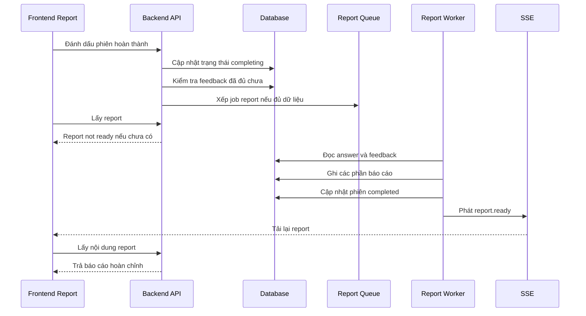

### 4.5.7 Theo dõi tiến trình phiên và xử lý trạng thái đặc biệt

Các tác vụ AI có thể mất thời gian, vì vậy hệ thống không xử lý trực tiếp toàn bộ trong request từ trình duyệt. Sinh câu hỏi, feedback và report đều được đưa vào hàng đợi nền. Frontend theo dõi trạng thái qua REST API, polling nhẹ và SSE. Cách kết hợp này giúp giao diện vẫn cập nhật được nếu một kênh bị trễ hoặc kết nối SSE không ổn định.

Ở mức tính năng, phần theo dõi tiến trình tập trung vào việc giữ phiên ở trạng thái rõ ràng: đang sinh câu hỏi, đang phỏng vấn, đang tạo feedback, đang tổng hợp báo cáo, hoàn thành hoặc lỗi. Với câu hỏi bị bỏ qua, backend vẫn ghi nhận trạng thái để phiên có thể tiếp tục, nhưng không xếp job feedback chấm điểm cho câu đó.

Vì hệ thống phụ thuộc vào AI provider, degraded mode là phần bắt buộc. Nếu AI sinh câu hỏi lỗi, hệ thống dùng question bank để tạo câu hỏi. Nếu AI feedback lỗi hoặc hết quota, hệ thống lưu feedback fallback và không tính điểm đó như điểm thật. Nếu report không đủ dữ liệu chấm, hệ thống trả về chất lượng báo cáo phù hợp như không thể chấm hoặc chỉ một phần. Nếu provider trả JSON rỗng, JSON sai hoặc response bị cắt, hệ thống phân loại thành lỗi AI output thay vì lưu dữ liệu không hợp lệ. Nếu quota AI hết, gateway đặt thời gian cooldown ngắn để tránh retry liên tục.

Không phải lúc nào AI cũng trả về kết quả dùng được. Hệ thống chuyển sang fallback trong các trường hợp như provider hết quota, timeout, trả response rỗng, JSON không parse được, JSON đúng cú pháp nhưng sai schema, không có tiêu chí chấm nào khớp với rubric đang áp dụng hoặc provider lỗi sau các lần thử lại.

Khi fallback xảy ra, backend vẫn ghi một bản feedback fallback và đánh dấu câu trả lời đã xử lý. Tuy nhiên, feedback fallback không được xem là điểm chấm thật. Trong báo cáo, các câu fallback không được tính vào điểm tổng; nếu toàn bộ phiên chỉ có fallback, frontend hiển thị trạng thái chưa thể chấm điểm thay vì hiển thị điểm 0.

Nếu người dùng bỏ qua câu hỏi, backend lưu câu trả lời rỗng kèm cờ bỏ qua và không xếp job feedback. Câu bị bỏ qua vẫn được tính là đã đi qua trong phiên, giúp người dùng có thể hoàn thành phiên mà không bị kẹt. Khi tạo báo cáo, hệ thống có thể sinh câu trả lời đề xuất cho các câu bị bỏ qua, nhưng không hiển thị điểm, điểm mạnh hoặc điểm cần cải thiện cho câu đó.

Điểm quan trọng là hệ thống không hiển thị `0/100` như một điểm thật khi không có dữ liệu chấm điểm đáng tin cậy. Với những phiên chỉ có fallback hoặc không có câu trả lời có thể chấm, frontend hiển thị trạng thái "chưa thể chấm điểm". Đây là cách xử lý phù hợp hơn cho sản phẩm luyện tập vì người dùng không bị hiểu nhầm rằng câu trả lời của mình bị đánh giá rất thấp.

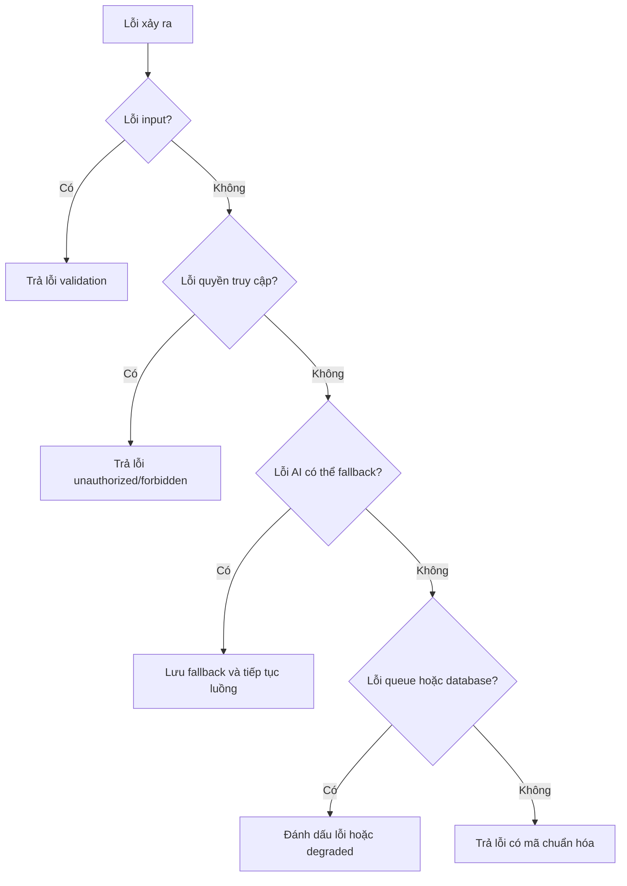

## 4.6 Thiết Kế Cơ Sở Dữ Liệu

Cơ sở dữ liệu hiện tại dùng PostgreSQL qua Prisma. Các bảng được thiết kế xoay quanh một quan hệ trung tâm: một phiên phỏng vấn có nhiều câu hỏi, mỗi câu hỏi có tối đa một câu trả lời của người dùng trong phiên, mỗi câu trả lời có thể có một feedback, và toàn phiên có nhiều bản ghi báo cáo tổng hợp.

| Nhóm bảng | Bảng | Vai trò |
| --- | --- | --- |
| Lookup/question | `context_packs`, `question_bank` | Lưu cấu hình rubric/context và ngân hàng câu hỏi dùng cho sinh câu hỏi hoặc fallback. |
| User/profile | `users`, `user_profiles`, `resumes` | Lưu người dùng, hồ sơ mở rộng và resume đã parse nếu có. |
| Session | `interview_sessions`, `saved_job_descriptions`, `session_questions` | Lưu phiên phỏng vấn, JD đã lưu và danh sách câu hỏi thuộc từng phiên. |
| Answer | `user_answers` | Lưu câu trả lời của người dùng, trạng thái skip và trạng thái feedback. |
| Feedback/report | `ai_feedbacks`, `annotated_segments`, `session_reports` | Lưu feedback từng câu, các đoạn nhận xét cụ thể và báo cáo tổng hợp theo từng loại nội dung. |

### 4.6.1 ERD rút gọn

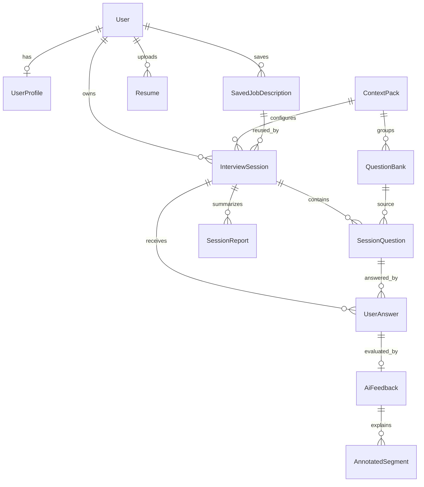

### 4.6.2 Quan hệ giữa session, câu hỏi, câu trả lời và feedback

Mỗi phiên phỏng vấn lưu thông tin JD, loại phiên, số lượng câu hỏi, thời lượng, ngôn ngữ, context pack và trạng thái. Sau khi tạo phiên, worker sinh câu hỏi sẽ ghi các câu hỏi vào bảng `session_questions`. Mỗi câu hỏi có thứ tự, nội dung, loại câu hỏi, competency domain và thời lượng ước tính.

Khi người dùng trả lời, hệ thống ghi vào `user_answers`. Ràng buộc quan trọng là trong cùng một phiên, một câu hỏi chỉ có một câu trả lời. Điều này giúp tránh việc gửi trùng do double click hoặc retry từ frontend. Sau đó, feedback cho câu trả lời được lưu vào `ai_feedbacks`, còn các đoạn nhận xét cụ thể được lưu ở `annotated_segments`.

Báo cáo tổng hợp không được nhét vào một cột duy nhất của session. Thay vào đó, hệ thống dùng bảng `session_reports`, trong đó mỗi loại báo cáo như tóm tắt tổng quan, phân tích giao tiếp, heatmap năng lực, kế hoạch hành động hoặc câu trả lời đề xuất cho câu bị bỏ qua được lưu thành một bản ghi riêng. Cách này giúp đọc lại từng phần báo cáo linh hoạt hơn và cho phép version hóa.

### 4.6.3 Các ràng buộc và lựa chọn dữ liệu quan trọng

Một số ràng buộc đáng chú ý trong schema hiện tại:

- `users.email` là duy nhất.
- `user_profiles.user_id` là duy nhất, mỗi người dùng có một hồ sơ mở rộng.
- `session_questions` có ràng buộc duy nhất theo phiên và thứ tự câu hỏi.
- `user_answers` có ràng buộc duy nhất theo phiên và câu hỏi.
- `ai_feedbacks.user_answer_id` là duy nhất, mỗi câu trả lời chỉ có một feedback hiện hành.
- `session_reports` có ràng buộc duy nhất theo phiên, loại báo cáo và version.
- Nhiều quan hệ dùng cascade delete để dữ liệu con của phiên hoặc người dùng không bị mồ côi.
- Một số bảng có `deleted_at` để hỗ trợ soft delete, ví dụ question bank và saved job description.

Schema thực tế cũng có các trường phục vụ trạng thái vận hành như trạng thái phiên, cờ feedback đã tạo, cờ fallback và chất lượng báo cáo. Đây là các trường cần thiết vì hệ thống có nhiều job bất đồng bộ; không thể chỉ dựa vào dữ liệu cuối cùng mà cần biết từng bước đã xử lý đến đâu.

## 4.7 Môi Trường Xây Dựng Và Triển Khai Local

Trong GR1, hệ thống được triển khai và chạy local theo mô hình frontend/backend tách riêng. Redis chạy bằng Docker Compose, backend chạy bằng NestJS watch mode, frontend chạy bằng Next.js dev server. Database dùng PostgreSQL/Supabase.

### 4.7.1 Điều kiện môi trường

Các điều kiện môi trường chính:

- Node.js từ phiên bản 20 trở lên.
- npm từ phiên bản 10 trở lên.
- Docker Desktop để chạy Redis.
- PostgreSQL/Supabase đã cấu hình.
- OpenAI API key hoặc endpoint tương thích OpenAI cho chat model.
- Các biến môi trường cho Supabase, database, Redis, OpenAI và frontend API base URL.

### 4.7.2 Quy trình chạy local

Quy trình chạy local ở mức báo cáo như sau:

1. Cài dependency cho backend và frontend.
2. Tạo file môi trường cho backend từ mẫu `.env.example`.
3. Điền các biến môi trường bắt buộc như Supabase, database, Redis và OpenAI.
4. Bật Redis bằng Docker Compose trong thư mục backend.
5. Chạy backend ở cổng 3000.
6. Tạo file môi trường frontend và trỏ `NEXT_PUBLIC_API_BASE_URL` về backend.
7. Chạy frontend ở cổng 5173.
8. Kiểm tra `/api/v1` và `/health` để xác nhận backend, database và Redis hoạt động.

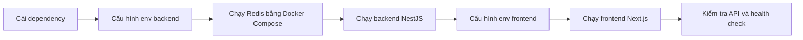

### 4.7.3 Cấu hình phụ thuộc và dữ liệu cần thiết

Ngoài dependency và biến môi trường, quá trình chạy local cần xác định rõ các cổng, endpoint và dịch vụ phụ thuộc để frontend, backend, database, Redis và AI provider có thể kết nối đúng.

| Thành phần | Địa chỉ local mặc định | Mục đích |
| --- | --- | --- |
| Backend API | `http://localhost:3000/api/v1` | REST API cho frontend. |
| Health check | `http://localhost:3000/health` | Kiểm tra database và Redis. |
| Frontend | `http://localhost:5173` | Giao diện người dùng. |
| Redis | `localhost:6379` | Hàng đợi và kênh sự kiện. |

Trong môi trường dev, hệ thống hỗ trợ cấu hình bỏ qua đăng nhập thật. Khi bật chế độ này, frontend gửi token giả lập và backend gắn request với một user mẫu trong database. Cách này chỉ dùng để demo và phát triển local, không dùng cho production.

## 4.8 Kiểm Soát Chất Lượng Trong Quá Trình Xây Dựng

Chất lượng của prototype được kiểm soát ở nhiều lớp: kiểu dữ liệu TypeScript, validation đầu vào, validation output AI, test backend, E2E frontend, build/lint và smoke check runtime.

| Biện pháp | Áp dụng ở đâu | Mục đích |
| --- | --- | --- |
| TypeScript | Client/server | Phát hiện lỗi kiểu dữ liệu khi phát triển, đồng bộ kiểu dữ liệu API và component. |
| DTO validation | Backend API | Từ chối request thiếu trường, sai loại phiên, JD quá ngắn hoặc câu trả lời quá ngắn. |
| Zod validation | AI output | Kiểm tra JSON từ AI trước khi lưu, tránh lưu output thiếu trường hoặc sai schema. |
| Unit test | Services/processors | Kiểm tra logic tạo phiên, nộp câu trả lời, fallback, report readiness, profile, question bank và các processor AI. |
| E2E test | Client luồng chính | Kiểm tra các luồng người dùng quan trọng ở mức trình duyệt khi cần. |
| Runtime smoke check | Backend/local | Gọi API gốc và health check để xác nhận backend, database và Redis sẵn sàng. |
| Lint/build | Client/server | Kiểm tra lỗi compile, lỗi coding style và khả năng build production. |

### 4.8.1 Kiểm soát dữ liệu đầu vào

Backend dùng DTO validation cho các request quan trọng. Ví dụ, tạo phiên yêu cầu JD có độ dài tối thiểu, loại phiên thuộc nhóm hợp lệ, context pack hợp lệ và số lượng câu hỏi nằm trong giới hạn. Gửi câu trả lời yêu cầu có question id, answer mode hợp lệ và nội dung đủ dài nếu không phải câu bị bỏ qua. Lưu JD cũng kiểm tra các trường như tên công ty, vị trí, level, yêu cầu và nội dung công việc.

Nhờ validation ở backend, frontend không phải là lớp bảo vệ duy nhất. Dù người dùng gọi API trực tiếp, dữ liệu sai vẫn bị chặn trước khi ghi vào database.

### 4.8.2 Kiểm soát output AI

Các output quan trọng từ AI được yêu cầu ở dạng JSON và validate bằng schema. Feedback phải có danh sách tiêu chí áp dụng, câu trả lời mẫu, nhận xét chính và danh sách đoạn được annotate. Câu hỏi sinh ra cũng được kiểm tra text, category, competency domain và độ khó.

Nếu output không hợp lệ, hệ thống không cố lưu dữ liệu sai. Pipeline chuyển sang lỗi có thể fallback hoặc retry tùy trường hợp. Cách này giúp dữ liệu trong báo cáo ổn định hơn, đặc biệt với các model có thể trả lời lệch format.

### 4.8.3 Kiểm soát qua test và smoke check

Backend có nhiều file test ở cấp service, controller, guard, processor và integration flow. Các nhóm test đáng chú ý gồm tạo phiên, nộp câu trả lời, xử lý skip, feedback processor, report processor, SSE, OpenAI gateway, validation DTO, question bank và runtime health.

Frontend có lint, build và Playwright E2E. Trong GR1, các kiểm thử này giúp phát hiện lỗi hợp đồng giữa frontend và backend như sai field trong report, sai trạng thái phiên hoặc xử lý loading chưa đúng.

Smoke check runtime dùng để xác nhận backend đã chạy được và các phụ thuộc quan trọng như database, Redis phản hồi đúng. Đây là bước cần thiết vì hệ thống không chỉ là web tĩnh mà còn phụ thuộc queue, database và AI provider.

## 4.9 Tổng Kết Chương

Chương 4 đã trình bày cách sản phẩm AI Mock Interview được phân tích, thiết kế và xây dựng trong phạm vi GR1 dựa trên mã nguồn hiện tại. Prototype đã hình thành được luồng chính từ quản lý JD, cấu hình phiên, sinh câu hỏi, trả lời phỏng vấn, tạo feedback đến xem báo cáo tổng hợp.

Về kiến trúc, hệ thống được tách thành frontend Next.js, backend NestJS, PostgreSQL/Supabase, Redis/BullMQ và AI provider. Các tác vụ AI dài được xử lý bất đồng bộ bằng queue, còn frontend theo dõi trạng thái bằng API, polling và SSE. Về dữ liệu, schema xoay quanh quan hệ phiên phỏng vấn, câu hỏi, câu trả lời, feedback và report. Về chất lượng, hệ thống có validation đầu vào, validation output AI, fallback, test và runtime health check.

Những nội dung này là cơ sở để Chương 5 đánh giá kết quả đạt được trong GR1, bao gồm mức độ hoàn thành chức năng, chất lượng giao diện, khả năng vận hành local, chất lượng AI feedback và các hạn chế còn tồn tại của prototype.

---
