# Chương 4. Phân Tích, Thiết Kế Và Xây Dựng Sản Phẩm GR1

## 4.1 Giới Thiệu Sản Phẩm GR1

Trong giai đoạn GR1, sản phẩm AI Mock Interview được xây dựng dưới dạng prototype web app phục vụ sinh viên năm cuối và ứng viên fresher ngành Công nghệ thông tin tại Việt Nam. Sản phẩm không hướng đến việc đưa gợi ý để người dùng trả lời thay trong buổi phỏng vấn thật, mà tập trung vào hoạt động luyện tập trước phỏng vấn: người dùng cung cấp Job Description, chọn loại phỏng vấn, trả lời từng câu hỏi, sau đó nhận phản hồi và báo cáo tổng hợp.

Prototype hiện tại không chỉ dừng ở mức nhập câu hỏi và nhận câu trả lời từ chatbot. Hệ thống tổ chức quá trình luyện tập thành một phiên có cấu trúc, có dữ liệu đầu vào, có danh sách câu hỏi, có câu trả lời của người dùng, có feedback theo từng câu và có báo cáo sau phiên. Cách tiếp cận này thống nhất với định vị ở Chương 1 và khoảng trống rút ra ở Chương 2: hệ thống cần giúp người học luyện lặp lại theo nhu cầu, có phản hồi cụ thể, chi phí thấp trong phạm vi đề tài và phù hợp với ngữ cảnh sinh viên CNTT Việt Nam.

### 4.1.1 Mục tiêu của sản phẩm trong phạm vi GR1

Mục tiêu tổng quát của đề tài là xây dựng một ứng dụng web hỗ trợ sinh viên năm cuối và ứng viên fresher ngành Công nghệ thông tin luyện phỏng vấn bằng trí tuệ nhân tạo theo một quy trình có cấu trúc, có phản hồi và có báo cáo sau phiên. Trong phạm vi GR1, đề tài tập trung vào việc xây dựng một prototype có thể demo được luồng luyện phỏng vấn chính từ lúc người dùng chuẩn bị hồ sơ đến lúc nhận báo cáo sau phiên.

Mục tiêu chất lượng của đề tài là tạo ra một prototype có giao diện dễ sử dụng, dữ liệu phiên được lưu lại có cấu trúc, phản hồi đủ cụ thể để người dùng có thể hành động và các tác vụ AI được xử lý bất đồng bộ để tránh chặn trải nghiệm người dùng. Hệ thống không đặt mục tiêu thay thế nhà tuyển dụng hoặc mentor, mà đóng vai trò công cụ luyện tập trước phỏng vấn thật.

### 4.1.2 Luồng sử dụng tổng quát

Luồng chính của sản phẩm được xây dựng như sau:

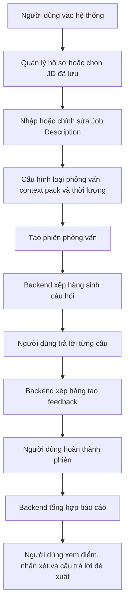

Luồng này phản ánh đúng hướng xây dựng hiện tại của mã nguồn. Trang `/setup` phụ trách nhập JD và cấu hình phiên. Trang `/sessions/[id]` hiển thị câu hỏi và nhận câu trả lời. Trang `/sessions/[id]/report` hiển thị tiến trình tạo báo cáo và nội dung báo cáo khi sẵn sàng.

## 4.2 Phân Tích Yêu Cầu Sản Phẩm

Phần phân tích yêu cầu xác định rõ người dùng, phạm vi chức năng và các ràng buộc chất lượng của prototype GR1 trước khi trình bày chi tiết luồng nghiệp vụ và thiết kế hệ thống.

### 4.2.1 Tác nhân và phạm vi sử dụng

Tác nhân chính của hệ thống là sinh viên năm cuối và ứng viên fresher ngành Công nghệ thông tin có nhu cầu luyện tập trước phỏng vấn. Người dùng thao tác trực tiếp với hệ thống để quản lý hồ sơ luyện tập, nhập hoặc chọn Job Description, cấu hình phiên phỏng vấn, trả lời câu hỏi và xem phản hồi sau phiên.

Về phạm vi loại phỏng vấn, sản phẩm tập trung vào phỏng vấn kỹ thuật, phỏng vấn hành vi và phiên phỏng vấn tổng hợp. Hệ thống không được thiết kế để hỗ trợ ứng viên gian lận trong buổi phỏng vấn thật. Hệ thống không đưa gợi ý theo thời gian thực trong lúc người dùng đang phỏng vấn với nhà tuyển dụng, mà chỉ phục vụ luyện tập trước phỏng vấn.

### 4.2.2 Yêu cầu chức năng chính

Về phạm vi chức năng, nhiệm vụ chính của hệ thống là cho phép người dùng quản lý hồ sơ luyện tập, cấu hình phiên từ mô tả công việc, nhận danh sách câu hỏi phù hợp, trả lời bằng văn bản, nhận phản hồi tự động cho từng câu trả lời và xem báo cáo tổng hợp sau phiên.

| Nhóm tính năng | Phạm vi đã phát triển trong GR1 | Mục đích trong hệ thống |
| --- | --- | --- |
| Tài khoản và hồ sơ luyện tập | Người dùng đăng ký, đăng nhập và quản lý thông tin hồ sơ phục vụ luyện phỏng vấn, bao gồm kỹ năng, kinh nghiệm, học vấn, dự án và CV. | Làm dữ liệu nền để cá nhân hóa câu hỏi và phản hồi theo năng lực thực tế của người dùng. |
| Job Description và cấu hình phiên | Người dùng nhập hoặc chọn lại JD đã lưu, sau đó chọn loại phỏng vấn, context pack, thời lượng và số lượng câu hỏi. | Xác định phạm vi buổi luyện tập để hệ thống sinh câu hỏi và đánh giá theo đúng mục tiêu ứng tuyển. |
| Sinh câu hỏi phỏng vấn | Hệ thống tạo danh sách câu hỏi dựa trên thông tin phiên, kết hợp khả năng sinh nội dung của AI với ngân hàng câu hỏi có sẵn. | Tạo bộ câu hỏi phù hợp với vị trí ứng tuyển, giảm phụ thuộc vào danh sách câu hỏi mẫu chung chung. |
| Thực hiện phiên phỏng vấn | Người dùng trả lời câu hỏi bằng văn bản trong giao diện phỏng vấn, có thể bỏ qua câu hỏi hoặc hoàn tất phiên khi đã đi hết danh sách. | Mô phỏng luồng luyện phỏng vấn có cấu trúc và tạo dữ liệu ổn định cho bước phản hồi. |
| Phản hồi cho từng câu trả lời | Hệ thống phân tích từng câu trả lời và đưa ra nhận xét về điểm mạnh, điểm còn thiếu, gợi ý cải thiện và ví dụ trả lời tốt hơn khi phù hợp. | Giúp người dùng biết cụ thể mình cần sửa nội dung nào thay vì chỉ nhận đánh giá chung chung. |
| Báo cáo tổng hợp và lịch sử phiên | Sau khi phiên kết thúc, hệ thống tạo báo cáo tổng hợp; người dùng có thể xem lại phiên, câu hỏi, câu trả lời, feedback và báo cáo tương ứng. | Giúp người dùng nhìn lại toàn bộ phiên luyện tập và có cơ sở tiếp tục rèn luyện. |
| Theo dõi tiến trình và xử lý lỗi | Các tác vụ tốn thời gian như sinh câu hỏi, tạo feedback và tạo báo cáo được xử lý nền; giao diện nhận cập nhật trạng thái khi kết quả sẵn sàng. | Giảm tình trạng chờ lâu trên một yêu cầu duy nhất và giúp hệ thống ổn định hơn khi tác vụ AI mất nhiều thời gian. |

### 4.2.3 Yêu cầu phi chức năng và ràng buộc triển khai

Prototype cần có giao diện dễ sử dụng, lưu dữ liệu phiên có cấu trúc, phản hồi đủ cụ thể để người dùng có thể hành động và xử lý các tác vụ AI dài bằng cơ chế bất đồng bộ. Hệ thống cũng cần validate dữ liệu đầu vào, kiểm soát output AI, có fallback khi AI không ổn định và giữ trạng thái phiên rõ ràng để người dùng không bị kẹt trong quá trình luyện tập.

Kết quả đánh giá của AI chỉ được xem là phản hồi tham khảo phục vụ học tập, không phải kết luận tuyển dụng chính thức. Trong phạm vi GR1, hệ thống ưu tiên khả năng demo luồng chính, vận hành local ổn định và minh bạch trạng thái hơn là triển khai production đầy đủ.

## 4.3 Luồng Nghiệp Vụ Chính

Luồng nghiệp vụ GR1 đặt phiên phỏng vấn ở trung tâm. Người dùng chuẩn bị hồ sơ và JD, hệ thống tạo câu hỏi theo loại phiên, người dùng trả lời từng câu, backend xử lý feedback ở nền và cuối cùng tổng hợp báo cáo. Các loại phiên Technical, Behavioral và Mixed không chỉ là nhãn hiển thị, mà quyết định nhóm câu hỏi, tiêu chí đánh giá và cách AI pipeline xây dựng prompt. Các đồ thị chi tiết của từng luồng được trình bày trong các nhóm tính năng tương ứng ở mục 4.5.

### 4.3.1 Luồng cấu hình và tạo phiên phỏng vấn

Luồng cấu hình bắt đầu từ trang `/setup`. Nếu người dùng đã có JD đã lưu, hệ thống hiển thị danh sách để chọn lại. Nếu chưa có hoặc muốn tạo mới, người dùng nhập thông tin JD gồm công ty, vị trí, level, yêu cầu, nội dung công việc, tech stack và một số trường bổ sung.

Sau khi JD hợp lệ, người dùng chọn loại phỏng vấn, context pack và thời lượng. Thời lượng hiện tại được ánh xạ sang số lượng câu hỏi: 30 phút tương ứng 15 câu, 60 phút tương ứng 30 câu, 90 phút tương ứng 45 câu. Khi xác nhận, frontend gửi dữ liệu lưu JD trước, sau đó tạo session gắn với JD vừa lưu.

Backend kiểm tra các điều kiện như JD đủ dài, loại phiên hợp lệ, context pack hợp lệ, số lượng câu hỏi nằm trong giới hạn và JD đã lưu thuộc về đúng người dùng. Ngoài ra, hệ thống có giới hạn số phiên được tạo trong 24 giờ để tránh lạm dụng tài nguyên AI.

### 4.3.2 Luồng thực hiện phiên phỏng vấn

Khi vào trang phỏng vấn, frontend lấy thông tin phiên. Nếu phiên đang tổng hợp hoặc đã hoàn thành, người dùng được chuyển sang trang báo cáo. Nếu phiên còn đang sinh câu hỏi, frontend chờ câu hỏi qua polling ngắn và SSE. Khi câu hỏi đã có, backend chuyển phiên sang trạng thái active.

Trong lúc phỏng vấn, người dùng trả lời từng câu theo thứ tự bằng văn bản. Người dùng cũng có thể bỏ qua câu hỏi; câu bị bỏ qua vẫn được ghi nhận để phiên hoàn thành đúng số câu, nhưng không sinh feedback chấm điểm.

Backend chỉ cho nộp câu trả lời khi phiên đang ở trạng thái có thể phỏng vấn. Nếu phiên đã hủy, đã hoàn thành hoặc chưa sẵn sàng, request sẽ bị từ chối bằng lỗi có cấu trúc.

### 4.3.3 Luồng sinh và xem báo cáo

Khi người dùng trả lời hoặc bỏ qua hết câu hỏi, frontend yêu cầu hoàn thành phiên. Backend kiểm tra số câu trả lời đã đủ với số câu hỏi chưa. Nếu đủ, trạng thái phiên chuyển sang `completing`. Sau đó backend chỉ xếp job report khi tất cả câu trả lời không bị bỏ qua đã có feedback.

Trang report có hai cơ chế chờ. Thứ nhất, trang gọi API lấy report; nếu report chưa sẵn sàng, backend trả trạng thái `REPORT_NOT_READY` và frontend thử lại sau một khoảng thời gian. Thứ hai, trang subscribe SSE để nhận tiến trình feedback và sự kiện report sẵn sàng. Cách kết hợp này giúp trải nghiệm ổn định hơn khi một trong hai cơ chế bị trễ.

Nội dung báo cáo hiển thị theo thứ tự: điểm tổng hoặc trạng thái chưa thể chấm, thông tin phiên, phương pháp chấm, tóm tắt tổng quan, biểu đồ năng lực và phân tích từng câu trả lời. Với câu bị bỏ qua, báo cáo không hiển thị nhận xét điểm mạnh/điểm yếu mà chỉ hiển thị câu trả lời đề xuất.

### 4.3.4 Luồng xử lý lỗi và trạng thái ngoại lệ

Hệ thống xử lý lỗi ở nhiều lớp:

- Ở frontend, lỗi kết nối server được hiển thị bằng thông báo dễ hiểu và có nút thử lại ở danh sách phiên.
- Ở backend, input được validate bằng DTO trước khi vào nghiệp vụ.
- Các API được bảo vệ bằng guard để tránh truy cập dữ liệu phiên của người khác.
- Nếu chuyển trạng thái phiên không hợp lệ, backend trả lỗi xung đột thay vì tự sửa im lặng.
- Nếu Redis hoặc database không sẵn sàng, health check trả trạng thái degraded.
- Nếu AI provider lỗi, timeout, hết quota hoặc trả output không hợp lệ, pipeline dùng fallback khi có thể.
- Nếu job report chưa sẵn sàng, frontend hiển thị tiến trình thay vì báo lỗi ngay.

Nguyên tắc chung là không để người dùng bị kẹt ở trạng thái không có thông tin. Nếu lỗi khiến phiên không thể tiếp tục, hệ thống chuyển trạng thái lỗi hoặc hiển thị thông báo. Nếu lỗi có thể giảm cấp chất lượng nhưng vẫn tiếp tục được, hệ thống dùng fallback và thể hiện rõ trong báo cáo.

## 4.4 Kiến Trúc Tổng Thể Hệ Thống

Kiến trúc hiện tại của AI Mock Interview gồm frontend Next.js, backend NestJS, cơ sở dữ liệu PostgreSQL/Supabase, Redis cho hàng đợi và SSE, cùng AI provider tương thích OpenAI. Frontend không truy cập trực tiếp database. Mọi dữ liệu nghiệp vụ đi qua backend API.

### 4.4.1 Kiến trúc mức cao

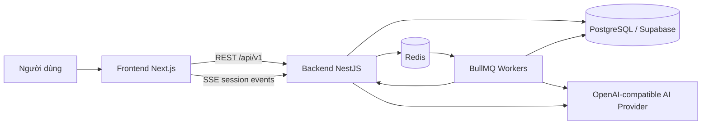

### 4.4.2 Các thành phần chính trong hệ thống

Frontend chịu trách nhiệm hiển thị màn hình, quản lý trạng thái tương tác và gọi API. Backend chịu trách nhiệm kiểm tra quyền truy cập, validate dữ liệu, quản lý phiên, lưu dữ liệu, điều phối job nền và chuẩn hóa lỗi trả về cho client. Redis được dùng cho BullMQ và kênh phát sự kiện. PostgreSQL lưu dữ liệu bền vững của người dùng, phiên phỏng vấn, câu hỏi, câu trả lời, feedback và báo cáo.

### 4.4.3 Cách giao tiếp giữa các thành phần

Các thao tác ngắn như lấy danh sách phiên, lưu JD, cập nhật hồ sơ và gửi câu trả lời được thực hiện qua REST API. Các tác vụ dài hơn như sinh câu hỏi, tạo feedback và tổng hợp báo cáo được chuyển sang hàng đợi nền.

Khi trạng thái thay đổi, backend phát sự kiện về kênh SSE của phiên. Frontend dùng sự kiện này để tải lại câu hỏi khi câu hỏi đã sẵn sàng, hiển thị tiến trình chấm câu trả lời hoặc mở báo cáo khi report đã hoàn thành. Nếu SSE không nhận được sự kiện, frontend vẫn có cơ chế polling để kiểm tra report, giúp luồng không phụ thuộc hoàn toàn vào một kênh cập nhật.

Trong môi trường phát triển local, hệ thống có thể bỏ qua xác thực thật bằng cấu hình dev để giảm thời gian demo. Tuy nhiên, backend vẫn giữ lớp guard ở các API cần bảo vệ. Điều này giúp luồng nghiệp vụ không phụ thuộc vào việc frontend gọi trực tiếp database hay tin tưởng dữ liệu từ trình duyệt.

## 4.5 Thiết Kế Theo Nhóm Tính Năng


### 4.5.1 Tài khoản và hồ sơ luyện tập

**a. Mục đích của tính năng**

Nhóm tính năng tài khoản và hồ sơ cung cấp dữ liệu nền cho quá trình luyện phỏng vấn. Người dùng có thể quản lý thông tin cá nhân, định hướng nghề nghiệp, kỹ năng, học vấn, kinh nghiệm, dự án, chứng chỉ và CV. Các thông tin này giúp hệ thống có ngữ cảnh ổn định hơn khi người dùng chuẩn bị phiên phỏng vấn.

Trong phạm vi GR1, hồ sơ không được thiết kế như một hệ thống tuyển dụng hoàn chỉnh. Vai trò chính của tính năng là giúp người dùng không phải nhập lại thông tin nền nhiều lần và tạo cơ sở dữ liệu cá nhân cho các bước cấu hình phiên sau đó.

**b. Dữ liệu đầu vào**

Dữ liệu đầu vào gồm thông tin tài khoản, thông tin hồ sơ nghề nghiệp, kỹ năng, học vấn, kinh nghiệm làm việc, dự án, chứng chỉ và CV nếu người dùng tải lên. Một số trường có thể được nhập thủ công, một số trường được lấy từ hồ sơ đã lưu trước đó.

Các dữ liệu này được lưu theo đúng người dùng hiện tại. Hệ thống không dùng hồ sơ của người dùng này cho phiên của người dùng khác. Đây là yêu cầu quan trọng vì hồ sơ có thể chứa thông tin cá nhân và định hướng nghề nghiệp riêng.

**c. Luồng xử lý nghiệp vụ**

Người dùng đăng nhập hoặc sử dụng phiên làm việc hợp lệ, sau đó mở khu vực hồ sơ. Frontend tải hồ sơ hiện có từ backend và hiển thị cho người dùng kiểm tra. Khi người dùng chỉnh sửa, frontend gửi dữ liệu cập nhật lên backend.

Backend kiểm tra quyền truy cập và cấu trúc dữ liệu trước khi ghi vào database. Nếu dữ liệu hợp lệ, hệ thống cập nhật hồ sơ và trả lại phiên bản mới cho frontend. Nếu người dùng chưa có hồ sơ mở rộng, backend tạo bản ghi mới thay vì yêu cầu người dùng thao tác thủ công.

Luồng nghiệp vụ có thể tóm tắt như sau:

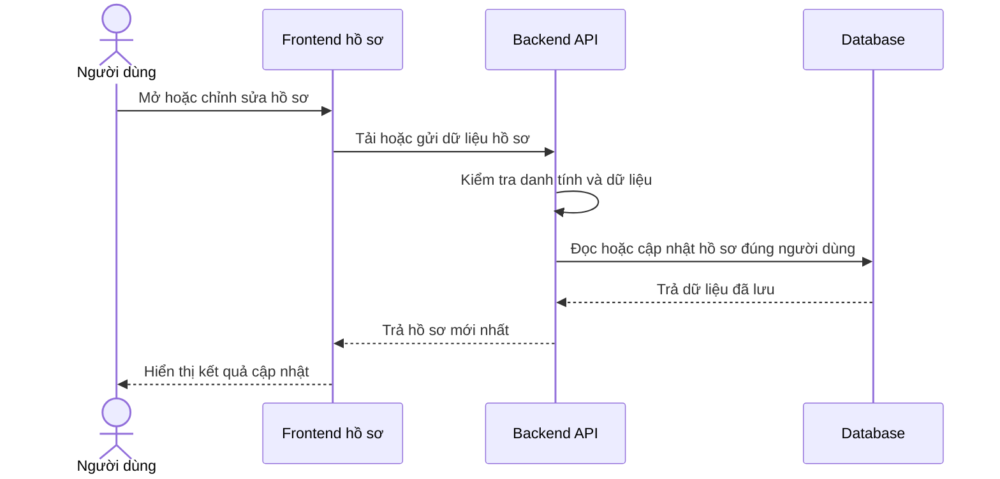

**d. Thiết kế giao diện frontend**

Giao diện hồ sơ cần thể hiện các nhóm thông tin theo thứ tự dễ kiểm tra: thông tin cá nhân, mục tiêu nghề nghiệp, kỹ năng, kinh nghiệm, học vấn, dự án, chứng chỉ và CV. Mỗi nhóm nên có trạng thái chỉnh sửa rõ ràng để người dùng biết phần nào đã được lưu.

Khi tải dữ liệu, frontend hiển thị trạng thái đang tải thay vì để màn hình trống. Khi cập nhật thành công, giao diện phản hồi bằng trạng thái đã lưu. Nếu backend trả lỗi validation, thông báo lỗi cần nằm gần nhóm dữ liệu liên quan để người dùng sửa đúng vị trí.

**e. Thiết kế xử lý backend**

Backend chịu trách nhiệm xác định người dùng hiện tại, đọc hồ sơ theo mã người dùng và kiểm tra dữ liệu gửi lên. Các API hồ sơ không được tin hoàn toàn vào dữ liệu từ frontend. Những trường dạng danh sách hoặc cấu trúc lồng nhau cần được kiểm tra trước khi lưu để tránh làm hỏng dữ liệu hồ sơ.

Dữ liệu được lưu trong các bảng người dùng, hồ sơ mở rộng và resume. Khi cập nhật, backend chỉ thay đổi dữ liệu thuộc về người dùng hiện tại. Kết quả trả về cho frontend là dữ liệu đã được chuẩn hóa sau khi lưu, không chỉ là bản sao của request.

**f. Xử lý lỗi và fallback**

Nếu người dùng chưa đăng nhập hoặc phiên làm việc không hợp lệ, backend trả lỗi quyền truy cập và frontend yêu cầu người dùng đăng nhập lại. Nếu dữ liệu không hợp lệ, backend trả lỗi validation để frontend hiển thị cho đúng nhóm trường cần sửa.

Nếu hồ sơ chưa tồn tại, hệ thống có thể tạo hồ sơ rỗng hoặc hiển thị trạng thái chưa hoàn thiện để người dùng bổ sung. Nếu CV hoặc dữ liệu phụ trợ không đọc được, phần hồ sơ còn lại vẫn được giữ nguyên; hệ thống không xóa dữ liệu đã có chỉ vì một phần cập nhật thất bại.

### 4.5.2 Job Description và cấu hình phiên

**a. Mục đích của tính năng**

Nhóm tính năng Job Description và cấu hình phiên chuyển mục tiêu luyện tập của người dùng thành một phiên phỏng vấn cụ thể. Người dùng có thể nhập JD mới, chỉnh sửa JD hoặc chọn lại JD đã lưu. Sau đó người dùng chọn loại phỏng vấn, context pack, ngôn ngữ và thời lượng hiển thị; frontend dùng thời lượng này để suy ra số lượng câu hỏi gửi lên backend.

Tính năng này là điểm nối giữa dữ liệu người dùng và pipeline sinh câu hỏi. Nếu JD hoặc cấu hình phiên không rõ ràng, câu hỏi sinh ra sẽ thiếu trọng tâm. Vì vậy hệ thống cần kiểm tra dữ liệu ở bước này trước khi tạo phiên.

Về vai trò trong AI Mock Interview, đây là bước biến một nhu cầu luyện tập còn rộng thành một cấu hình có thể xử lý được. Người dùng không chỉ nói rằng mình muốn luyện phỏng vấn, mà còn cung cấp vị trí ứng tuyển, bối cảnh văn hóa phỏng vấn, loại câu hỏi mong muốn và độ dài phiên. Các thông tin này quyết định cách hệ thống chọn rubric, chọn question bank, tạo prompt và trả kết quả bằng ngôn ngữ phù hợp.

**b. Dữ liệu đầu vào**

Dữ liệu đầu vào gồm tên công ty, vị trí ứng tuyển, cấp độ, yêu cầu công việc, mô tả công việc, kỹ năng hoặc tech stack, loại phỏng vấn, context pack, ngôn ngữ đầu ra và số lượng câu hỏi. Nếu người dùng chọn JD đã lưu, request có thêm mã JD để backend kiểm tra quyền sở hữu. Ở frontend, lựa chọn thời lượng được ánh xạ thành số lượng câu hỏi trước khi gửi request tạo phiên.

Các dữ liệu này được lưu vào `saved_job_descriptions` và `interview_sessions`. JD lưu trữ nội dung tuyển dụng, còn phiên phỏng vấn lưu cấu hình vận hành như loại phiên, context pack, số câu hỏi, ngôn ngữ và trạng thái phiên. Trường thời lượng trong session được backend dùng khi tính thời gian ước tính cho câu hỏi; ở luồng tạo phiên hiện tại, frontend gửi số câu hỏi đã suy ra từ lựa chọn thời lượng.

Đầu ra trực tiếp của tính năng không phải là danh sách câu hỏi. Kết quả trả về là một phiên phỏng vấn mới có mã phiên, trạng thái ban đầu là đang sinh câu hỏi và các thông tin cấu hình đã được lưu. Danh sách câu hỏi chỉ xuất hiện sau khi worker sinh câu hỏi xử lý xong job nền ở mục 4.5.3.

**c. Luồng xử lý nghiệp vụ**

Người dùng bắt đầu bằng việc nhập JD mới hoặc chọn JD đã lưu. Frontend cho phép người dùng xem lại nội dung quan trọng trước khi tạo phiên. Sau đó người dùng chọn loại phỏng vấn HR/Behavioral, Technical hoặc Mixed, chọn context pack Việt Nam hoặc Western và xác nhận cấu hình phiên.

Backend lưu hoặc cập nhật JD, sau đó tạo bản ghi phiên ở trạng thái chuẩn bị sinh câu hỏi. Request tạo phiên không chờ AI sinh xong toàn bộ câu hỏi. Backend chỉ trả mã phiên cho frontend, còn quá trình sinh câu hỏi được chuyển sang hàng đợi nền và được trình bày chi tiết ở mục 4.5.3.

Luồng nghiệp vụ chính gồm bốn bước. Thứ nhất, người dùng chuẩn bị JD và cấu hình phiên. Thứ hai, frontend chuẩn hóa JD thành văn bản đầy đủ để backend có thể kiểm tra độ dài và lưu snapshot. Thứ ba, backend tạo phiên và xếp job sinh câu hỏi. Thứ tư, frontend chuyển người dùng sang màn hình phỏng vấn, nơi phiên có thể đang ở trạng thái chờ cho đến khi câu hỏi sẵn sàng.

Sơ đồ dưới đây thể hiện ranh giới của tính năng cấu hình phiên: phần này dừng ở việc tạo phiên và xếp tác vụ sinh câu hỏi.

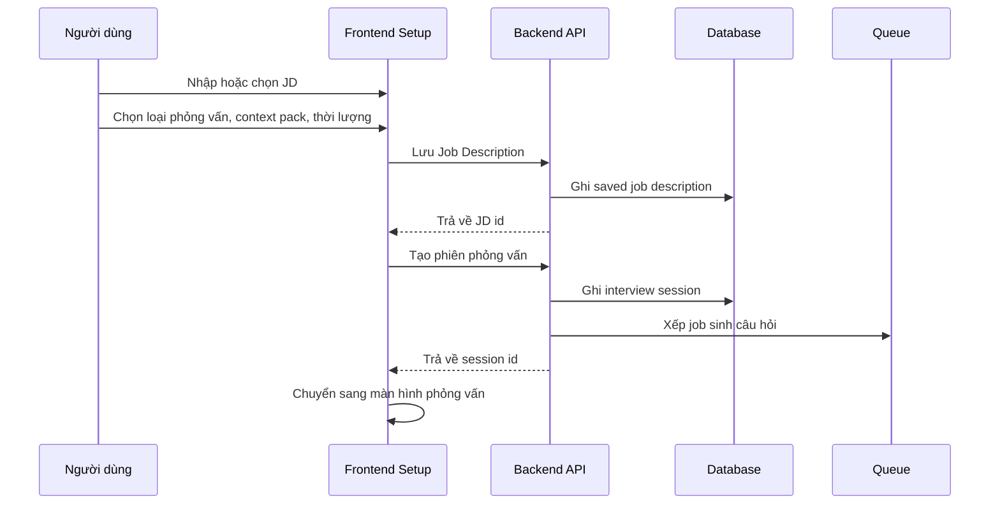

**d. Thiết kế giao diện frontend**

Frontend chia quá trình tạo phiên thành các bước rõ ràng: nhập hoặc chọn JD, cấu hình phiên, xác nhận và bắt đầu. Cách chia này giúp người dùng kiểm tra từng nhóm thông tin trước khi gửi request tạo phiên.

Giao diện cần thể hiện các trường bắt buộc, trạng thái đang lưu JD, trạng thái đang tạo phiên và lỗi validation nếu có. Nếu người dùng chọn JD đã lưu, giao diện cần hiển thị lại các thông tin chính như vị trí, công ty, cấp độ và yêu cầu để tránh tạo nhầm phiên.

Ở bước nhập JD, giao diện cho phép người dùng nhập vị trí, level, yêu cầu, nội dung công việc, tech stack và các thông tin tuyển dụng liên quan. Nếu người dùng đi từ thư viện JD, form được điền lại bằng JD đã chọn. Ở bước cấu hình, thời lượng phiên được ánh xạ thành số câu hỏi dự kiến: 30 phút tương ứng 15 câu, 60 phút tương ứng 30 câu và 90 phút tương ứng 45 câu. Ở bước xác nhận, giao diện hiển thị lại công ty, vị trí, level, tech stack, yêu cầu, nội dung công việc, context pack, thời lượng và số câu hỏi trước khi người dùng bắt đầu.

Khi gửi cấu hình, nút bắt đầu chuyển sang trạng thái loading để tránh gửi lặp. Nếu backend trả lỗi, thông báo được giữ trên màn hình xác nhận để người dùng quay lại sửa JD hoặc cấu hình. Nếu tạo phiên thành công, frontend điều hướng sang màn hình phiên phỏng vấn bằng mã phiên vừa nhận.

**e. Thiết kế xử lý backend**

Backend kiểm tra JD đủ dài, loại phiên hợp lệ, context pack tồn tại, số lượng câu hỏi nằm trong giới hạn và JD thuộc về đúng người dùng. Với JD mới, backend lưu nội dung vào bảng JD đã lưu. Với JD cũ, backend chỉ cho phép dùng nếu bản ghi đó thuộc người dùng hiện tại.

Sau khi dữ liệu hợp lệ, backend tạo bản ghi phiên phỏng vấn, gắn phiên với JD và cấu hình đã chọn. Backend đưa job sinh câu hỏi vào queue, kèm các thông tin cần thiết như mã phiên, loại phiên, context pack, ngôn ngữ, số lượng câu hỏi và dữ liệu JD. Kết quả trả về cho frontend là mã phiên và trạng thái ban đầu, không phải danh sách câu hỏi.

Ở lớp DTO, backend yêu cầu JD tối thiểu 100 ký tự, loại phiên chỉ thuộc `hr`, `technical` hoặc `mixed`, context pack chỉ thuộc `VN` hoặc `Western`, ngôn ngữ chỉ thuộc `vi` hoặc `en`, số câu hỏi nằm trong khoảng 3 đến 45 và mã JD đã lưu phải có dạng UUID nếu được gửi lên. Sau validation DTO, service còn kiểm tra giới hạn số phiên được tạo trong 24 giờ, bảo đảm context pack tồn tại và chuẩn hóa ngôn ngữ đầu ra.

Nếu request dùng JD đã lưu, backend tìm JD theo đồng thời mã JD, mã người dùng và điều kiện chưa bị xóa mềm. Nếu không tìm thấy, backend trả lỗi thay vì dùng dữ liệu không thuộc người dùng hiện tại. Khi JD hợp lệ, backend cập nhật thời điểm sử dụng gần nhất để thư viện JD phản ánh đúng lịch sử sử dụng.

Khi tạo phiên, backend ghi `jobDescription`, `jobTitle`, `sessionType`, `numQuestions`, `language`, `contextPackId`, `savedJobDescriptionId` nếu có và trạng thái `generating`. Sau đó backend xếp job `question-generation` với payload gồm mã phiên, loại phiên, JD dạng văn bản, danh sách vị trí mục tiêu, context pack, ngôn ngữ, tổng số câu hỏi và thời lượng đang lưu trên session. Job có cơ chế retry với backoff cố định để giảm rủi ro lỗi tạm thời ở hàng đợi hoặc worker.

**f. Xử lý lỗi và fallback**

Nếu JD thiếu nội dung quan trọng, số lượng câu hỏi không hợp lệ, context pack không tồn tại hoặc người dùng cố dùng JD không thuộc quyền sở hữu của mình, backend từ chối tạo phiên và trả lỗi rõ ràng. Frontend giữ người dùng ở màn hình cấu hình để chỉnh sửa.

Nếu phiên đã tạo nhưng job sinh câu hỏi chưa hoàn tất, frontend chuyển sang trạng thái chờ thay vì coi đây là lỗi. Nếu queue hoặc backend không thể nhận job, hệ thống không nên hiển thị phiên như đã sẵn sàng; phiên cần được đánh dấu trạng thái phù hợp để người dùng biết phải thử lại hoặc quay về cấu hình.

Trường hợp queue không nhận được job sau khi session đã được ghi, backend cập nhật phiên sang trạng thái lỗi và trả thông báo dịch vụ tạo câu hỏi tạm thời không khả dụng. Cách xử lý này tránh việc người dùng nhìn thấy một phiên đang chờ nhưng thực tế không có worker nào sẽ sinh câu hỏi cho phiên đó.

### 4.5.3 Sinh câu hỏi phỏng vấn

**a. Mục đích của tính năng**

Tính năng sinh câu hỏi phỏng vấn tạo danh sách câu hỏi cho từng phiên luyện tập dựa trên Job Description, loại phỏng vấn và cấu hình do người dùng chọn. Đây là bước chuẩn bị nội dung trước khi người dùng bắt đầu trả lời phỏng vấn. Nếu bước này không hoàn tất, phiên chưa thể chuyển sang trạng thái sẵn sàng.

Trong AI Mock Interview, câu hỏi không được tạo như một danh sách cố định cho mọi người dùng. Hệ thống kết hợp hai nguồn: AI sinh một phần câu hỏi theo ngữ cảnh của JD, còn phần còn lại lấy từ question bank đã được chuẩn bị sẵn. Cách thiết kế này giúp câu hỏi vẫn bám vào vị trí ứng tuyển nhưng không phụ thuộc hoàn toàn vào AI provider.

Sơ đồ dưới đây minh họa mục đích vận hành của tính năng ở mức tổng quan: từ cấu hình phiên của người dùng, hệ thống tạo danh sách câu hỏi hợp lệ và đưa phiên sang trạng thái có thể bắt đầu phỏng vấn.

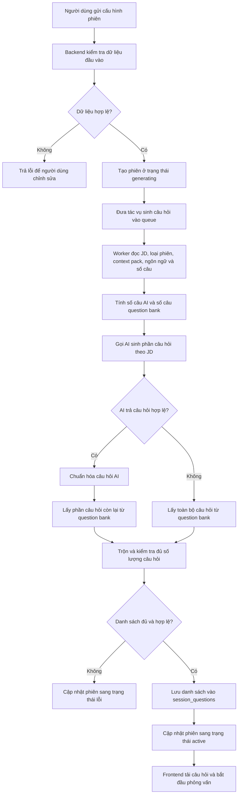

**b. Dữ liệu đầu vào**

Dữ liệu đầu vào chính là nội dung Job Description do người dùng nhập hoặc chọn từ JD đã lưu. Nội dung này cung cấp vị trí ứng tuyển, yêu cầu công việc, kỹ năng liên quan và bối cảnh để hệ thống tạo câu hỏi phù hợp hơn với mục tiêu luyện tập.

Người dùng cũng chọn loại phỏng vấn, gồm HR/Behavioral, Technical hoặc Mixed. Loại phỏng vấn quyết định trọng tâm câu hỏi: hành vi, kỹ thuật hoặc kết hợp cả hai. Ngoài ra, cấu hình phiên còn có số lượng câu hỏi, ngôn ngữ hiển thị, context pack Việt Nam hoặc Western và thời lượng đang lưu trên session để hệ thống ước tính thời gian cho từng câu.

Nếu người dùng đã có hồ sơ cá nhân hoặc hồ sơ nghề nghiệp trong hệ thống, dữ liệu này có thể được dùng làm ngữ cảnh bổ sung. Phần có căn cứ rõ trong luồng hiện tại vẫn là JD, loại phiên, ngôn ngữ, context pack, số lượng câu hỏi, thời lượng phiên, mã người dùng và mã JD đã lưu nếu có.

Đầu ra của tính năng là danh sách câu hỏi đã được lưu trong `session_questions`. Mỗi câu có nội dung câu hỏi, thứ tự trong phiên, loại câu hỏi, competency domain, thời lượng ước tính và liên kết đến question bank nếu câu đó lấy từ ngân hàng câu hỏi. Sau khi danh sách đủ số lượng, trạng thái phiên được chuyển sang sẵn sàng để frontend tải câu hỏi.

**c. Luồng xử lý nghiệp vụ**

Luồng bắt đầu khi người dùng hoàn tất cấu hình phiên và gửi yêu cầu tạo phiên phỏng vấn. Frontend gửi dữ liệu cấu hình lên backend. Backend tạo bản ghi phiên ở trạng thái đang sinh câu hỏi, sau đó đưa tác vụ sinh câu hỏi vào hàng đợi nền. Việc đưa vào hàng đợi giúp request tạo phiên trả về nhanh hơn, vì quá trình sinh câu hỏi có thể phải gọi AI, đọc question bank và ghi nhiều bản ghi vào database.

Khi worker xử lý tác vụ, hệ thống đọc thông tin phiên, JD, loại phỏng vấn, context pack, ngôn ngữ, thời lượng đang lưu trên session và số câu cần tạo. Với chiến lược hiện tại, hệ thống dùng mô hình hybrid: cứ khoảng 5 câu hỏi trong phiên thì có 1 câu do AI sinh, phần còn lại được lấy từ question bank. Ví dụ, phiên 15 câu sẽ có khoảng 3 câu AI và 12 câu từ question bank.

Sau khi có câu hỏi AI và câu hỏi từ question bank, backend chuẩn hóa metadata, kiểm tra số lượng, trộn câu hỏi theo thứ tự và lưu danh sách cuối cùng. Nếu danh sách hợp lệ và đủ số câu, phiên được chuyển sang trạng thái sẵn sàng. Frontend nhận trạng thái mới qua cơ chế cập nhật trạng thái và tải danh sách câu hỏi để bắt đầu phỏng vấn.

Sơ đồ tuần tự dưới đây thể hiện tương tác giữa frontend, backend, database, queue và AI service trong luồng nghiệp vụ. Sơ đồ nhấn mạnh rằng request tạo phiên không chờ toàn bộ quá trình AI hoàn tất; phần sinh câu hỏi được xử lý bất đồng bộ.

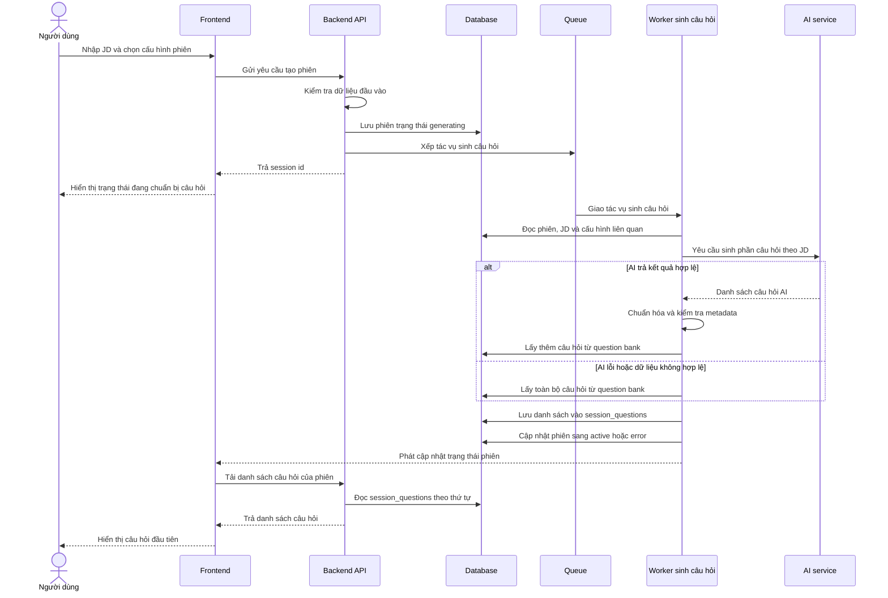

**d. Thiết kế giao diện frontend**

Ở phía frontend, tính năng này xuất hiện trong màn hình cấu hình phiên phỏng vấn. Người dùng nhập hoặc chọn Job Description, chọn loại phỏng vấn, chọn số lượng câu hỏi, thời lượng, ngôn ngữ và context pack. Giao diện cần hiển thị rõ các trường bắt buộc để người dùng biết dữ liệu nào ảnh hưởng trực tiếp đến danh sách câu hỏi.

Khi người dùng gửi yêu cầu tạo phiên, giao diện chuyển sang trạng thái đang xử lý. Trạng thái này thể hiện rằng hệ thống đã nhận cấu hình và đang chuẩn bị câu hỏi. Trong thời gian chờ, frontend không cần hiển thị từng bước xử lý nội bộ, nhưng cần cho người dùng biết phiên chưa sẵn sàng để trả lời.

Nếu backend trả lỗi do dữ liệu đầu vào không hợp lệ, giao diện hiển thị thông báo lỗi gần khu vực cấu hình để người dùng sửa lại. Nếu phiên đã được tạo nhưng câu hỏi chưa sẵn sàng, màn hình phỏng vấn hiển thị trạng thái chờ và tiếp tục theo dõi trạng thái phiên. Khi phiên chuyển sang trạng thái sẵn sàng, frontend tải danh sách câu hỏi và hiển thị câu hỏi đầu tiên theo thứ tự.

Frontend theo dõi trạng thái sinh câu hỏi qua API trạng thái phiên và sự kiện trạng thái phiên. Khi nhận trạng thái `active`, frontend đọc danh sách câu hỏi theo thứ tự. Khi nhận trạng thái lỗi, giao diện dừng chờ và thông báo rằng phiên không thể bắt đầu ở trạng thái hiện tại.

**e. Thiết kế xử lý backend**

Backend chịu trách nhiệm kiểm tra dữ liệu đầu vào trước khi tạo phiên. Các thông tin như loại phỏng vấn, số lượng câu hỏi, JD, ngôn ngữ và context pack phải hợp lệ. Nếu dữ liệu không đạt yêu cầu, backend trả lỗi để frontend yêu cầu người dùng điều chỉnh.

Khi dữ liệu hợp lệ, backend tạo phiên trong database và đưa tác vụ sinh câu hỏi vào queue. Tác vụ nền đọc lại thông tin phiên, JD, loại phỏng vấn, context pack, ngôn ngữ đầu ra, tổng số câu hỏi và thời lượng phiên. Đây là các dữ liệu quyết định cách chọn chiến lược sinh câu hỏi, cách tạo prompt, cách lọc question bank và cách lưu danh sách câu hỏi cuối cùng.

Chiến lược hiện tại là hybrid. Backend không yêu cầu AI sinh toàn bộ câu hỏi; cứ khoảng 5 câu trong phiên thì có 1 câu do AI sinh, phần còn lại lấy từ question bank. Số câu AI được tính bằng cách làm tròn tổng số câu chia cho 5. Cách này giữ được phần cá nhân hóa theo JD nhưng vẫn giảm rủi ro khi AI chậm, hết quota hoặc trả dữ liệu không đúng định dạng.

| Tổng số câu trong phiên | Số câu AI sinh | Số câu lấy từ question bank |
| --- | --- | --- |
| 15 câu | 3 câu | 12 câu |
| 30 câu | 6 câu | 24 câu |
| 45 câu | 9 câu | 36 câu |

Backend có ba chiến lược sinh câu hỏi tương ứng với ba loại phiên. Việc tách chiến lược giúp prompt không bị chung chung và giúp câu hỏi đi đúng mục tiêu luyện tập của phiên.

| Loại phiên | Trọng tâm sinh câu hỏi |
| --- | --- |
| HR/Behavioral | Tập trung vào động lực, giao tiếp, làm việc nhóm, tự nhận thức, văn hóa và ví dụ theo STAR. |
| Technical | Tập trung vào kiến thức kỹ thuật, cách áp dụng thực tế, trade-off, debug, thiết kế hệ thống và chất lượng code. |
| Mixed | Kết hợp câu hỏi hành vi và kỹ thuật, giúp phiên gần với buổi phỏng vấn tổng hợp hơn. |

Với phiên Technical, backend tránh sinh quá nhiều câu hỏi hành vi vì mục tiêu chính là kiểm tra năng lực chuyên môn. Với phiên HR/Behavioral, backend không đẩy câu hỏi theo hướng trivia kỹ thuật. Với phiên Mixed, hệ thống cho phép cả hai nhóm câu hỏi nhưng mỗi câu vẫn phải gắn với một competency domain cụ thể để các bước đánh giá phía sau có tiêu chí rõ ràng.

Prompt sinh câu hỏi được tạo theo hai lớp. Lớp thứ nhất là phần hướng dẫn nền, trong đó quy định vai trò của AI, nhiệm vụ sinh câu hỏi, ràng buộc số lượng, format JSON, loại câu hỏi, competency domain và độ khó. Lớp thứ hai là dữ liệu động của phiên, gồm JD, loại phiên, vai trò mục tiêu và số câu AI cần sinh. Trong thực tế, nếu người dùng tạo phiên 15 câu, backend chỉ yêu cầu AI sinh 3 câu vì phần còn lại đến từ question bank. Vì vậy số câu trong prompt AI là số câu AI cần sinh, không phải tổng số câu của phiên.

| Thành phần trong prompt | Vai trò |
| --- | --- |
| Vai trò AI | Yêu cầu AI đóng vai người phỏng vấn có kinh nghiệm. |
| Nhiệm vụ | Sinh câu hỏi phù hợp với JD và chiến lược phỏng vấn. |
| Ràng buộc số lượng | Phải sinh đúng số câu được backend yêu cầu cho phần AI. |
| Ràng buộc format | Chỉ trả về một JSON object gọn, không markdown, không giải thích thêm. |
| Cấu trúc JSON | Mỗi câu hỏi có nội dung câu hỏi, loại câu hỏi, competency domain và độ khó. |
| Ràng buộc metadata | Loại câu hỏi chỉ thuộc nhóm hành vi hoặc kỹ thuật; competency domain phải thuộc bộ rubric hợp lệ của phiên. |

Sau phần luật nền, backend gắn thêm chiến lược theo loại phiên, context pack và danh sách mã rubric được phép dùng. Dữ liệu động được đưa vào prompt theo các khối rõ ràng như nội dung JD, loại phiên, vai trò mục tiêu và số câu cần AI sinh. Cách tổ chức này giúp AI tập trung vào đúng dữ liệu của phiên hiện tại, đồng thời giúp backend dễ kiểm tra kết quả trả về.

```text
<job_description>
...nội dung JD người dùng nhập...
</job_description>

<session_type>technical</session_type>

<target_roles>
Backend Developer
</target_roles>

<num_questions>3</num_questions>
```

Sau khi AI trả kết quả, backend không lưu ngay. Kết quả phải đi qua các bước parse JSON, kiểm tra schema, chuẩn hóa loại câu hỏi, chuẩn hóa competency domain theo context pack và loại phiên, loại bỏ câu hỏi có domain không thuộc phiên hiện tại, chuẩn hóa độ khó về mức 1, 2 hoặc 3 và tính thời lượng ước tính cho từng câu. Nếu AI trả về tên tiêu chí thay vì mã tiêu chí, backend có cơ chế khớp theo mã gốc, mã đã chuẩn hóa, mã được trích ra từ chuỗi hoặc tên tiêu chí đã chuẩn hóa. Nếu vẫn không khớp, câu hỏi đó bị loại bỏ.

AI service được gọi với yêu cầu trả về JSON object. Backend parse JSON, validate bằng schema câu hỏi và chỉ lấy tối đa đúng số câu AI cần sinh. Các trường AI trả về được xem là dữ liệu chưa tin cậy. Vì vậy hệ thống không lưu trực tiếp `category`, `competency_domain` hoặc `difficulty` nếu chúng không khớp với context pack và loại phiên hiện tại.

Đối với phần question bank, backend lọc câu hỏi theo loại phiên, context pack và ngôn ngữ. Với phiên Mixed, hệ thống chia tương đối giữa câu hỏi HR và Technical. Backend không lấy đúng bằng số lượng cần ngay từ đầu mà lấy một tập ứng viên lớn hơn, khoảng gấp 3 lần số câu cần lấy, rồi chọn theo phân bố độ khó. Logic hiện tại ưu tiên khoảng 30% câu dễ, 50% câu trung bình và 20% câu khó; nếu nhóm nào không đủ, hệ thống lấy thêm từ các câu còn lại để đạt đủ số lượng.

Question bank chỉ lấy các câu chưa bị xóa mềm và thuộc context pack của phiên. Với ngôn ngữ đầu ra, backend ưu tiên bản dịch theo ngôn ngữ của phiên nếu có; nếu không có bản dịch phù hợp, hệ thống dùng nội dung gốc của câu hỏi. Mỗi câu question bank trả về đã có mã câu hỏi gốc, nội dung, nhóm câu hỏi, competency domain và thời lượng ước tính.

Sau khi có câu hỏi AI và câu hỏi từ question bank, backend trộn chúng thành danh sách cuối cùng. Câu hỏi AI không bị dồn vào đầu phiên mà được đặt cách quãng, ví dụ ở các vị trí khoảng 5, 10, 15 nếu phiên đủ dài. Các vị trí còn lại lấy từ question bank. Mỗi câu hỏi cuối cùng được lưu với mã phiên, mã câu hỏi gốc nếu có, nội dung câu hỏi, thứ tự, loại câu hỏi, competency domain, rubric JSON và thời lượng ước tính.

Thuật toán sinh câu hỏi được đặt ở backend vì đây là bước cần kiểm soát chặt dữ liệu đầu vào, trạng thái phiên, context pack, question bank và khả năng fallback khi AI không ổn định. Frontend chỉ gửi cấu hình phiên; backend mới là nơi quyết định câu hỏi nào được tạo, câu hỏi nào được lấy từ ngân hàng câu hỏi và khi nào phiên được chuyển sang trạng thái sẵn sàng.

Khi lưu danh sách cuối cùng, backend dùng thao tác ghi nhiều bản ghi vào `session_questions` và bỏ qua bản ghi trùng nếu job bị retry. Sau khi ghi đủ số câu, backend chuyển phiên sang `active` và phát sự kiện trạng thái. Nếu ghi không đủ số câu hoặc cả AI và question bank đều không cung cấp được dữ liệu hợp lệ, phiên được chuyển sang `error`.

```text
Input: sessionId, sessionType, jobDescription, targetRoles, contextPack, language, totalQuestions, durationMin
1. Tính số câu AI cần sinh = làm tròn(totalQuestions / 5).
2. Lấy cấu hình context pack và chiến lược theo sessionType.
3. Gọi AI để sinh số câu đã tính.
4. Nếu AI lỗi:
   4.1. Lấy totalQuestions câu từ question bank.
   4.2. Lưu câu hỏi vào session_questions.
   4.3. Chuyển session sang active và phát cập nhật trạng thái.
   4.4. Kết thúc.
5. Nếu AI thành công:
   5.1. Parse JSON và validate schema.
   5.2. Chuẩn hóa category, competency domain, difficulty và estimated time.
   5.3. Loại bỏ câu hỏi có metadata không hợp lệ.
6. Tính số câu còn lại cần lấy từ question bank.
7. Lấy câu hỏi question bank theo sessionType, contextPack, language và độ khó.
8. Trộn câu hỏi AI và question bank theo thứ tự.
9. Nếu tổng số câu không đủ, đánh dấu session lỗi.
10. Nếu đủ, lưu vào session_questions.
11. Chuyển session sang active.
12. Phát sự kiện trạng thái để frontend bắt đầu phỏng vấn.
```

**f. Xử lý lỗi và fallback**

Các lỗi đầu vào được xử lý ngay ở bước tạo phiên. Nếu JD trống, loại phiên không hợp lệ, số lượng câu hỏi vượt phạm vi cho phép hoặc thiếu dữ liệu bắt buộc, backend không tạo phiên hợp lệ và trả lỗi cho frontend.

Khi AI provider lỗi, hết quota, timeout hoặc trả dữ liệu không đúng cấu trúc, backend không lưu kết quả AI chưa hợp lệ. Hệ thống chuyển sang lấy toàn bộ số câu cần thiết từ question bank nếu nguồn dữ liệu này đáp ứng đủ. Đây là fallback quan trọng để người dùng vẫn có thể bắt đầu phiên ngay cả khi AI không khả dụng.

Nếu question bank không đủ câu hỏi phù hợp với loại phiên, context pack hoặc ngôn ngữ, hệ thống cố gắng bù từ các câu còn lại trong phạm vi hợp lệ. Nếu sau bước bù vẫn không đủ số câu tối thiểu để tạo phiên, backend chuyển phiên sang trạng thái lỗi để frontend thông báo cho người dùng thay vì bắt đầu một phiên thiếu dữ liệu.

Nếu AI sinh được một phần câu hỏi nhưng question bank không đủ phần còn lại, backend không bắt đầu phiên với danh sách thiếu. Nếu phát sự kiện SSE thất bại sau khi database đã lưu đủ câu hỏi và phiên đã active, lỗi phát sự kiện chỉ được ghi log; dữ liệu phiên vẫn được giữ vì frontend còn có thể đọc lại trạng thái qua API hoặc polling.

### 4.5.4 Thực hiện phiên và lưu câu trả lời

**a. Mục đích của tính năng**

Nhóm tính năng thực hiện phiên cho phép người dùng đi qua danh sách câu hỏi đã được tạo, gửi câu trả lời, bỏ qua câu hỏi khi cần và hoàn tất phiên. Đây là phần tương tác chính của AI Mock Interview vì người dùng luyện tập trực tiếp với từng câu hỏi.

Tính năng này không quyết định cách chấm điểm. Vai trò của nó là hiển thị câu hỏi đúng thứ tự, ghi nhận câu trả lời một cách nhất quán và chuyển dữ liệu sang bước đánh giá ở mục 4.5.5.

Tính năng này quan trọng vì chất lượng báo cáo phụ thuộc trực tiếp vào dữ liệu câu trả lời. Nếu câu trả lời bị ghi trùng, ghi sai câu hỏi hoặc mất trạng thái bỏ qua, các bước feedback và report phía sau sẽ không còn phản ánh đúng phiên phỏng vấn của người dùng.

Sơ đồ sau mô tả mục đích của tính năng ở mức tổng quan: biến danh sách câu hỏi đã sẵn sàng thành dữ liệu câu trả lời có thể dùng cho feedback và báo cáo.

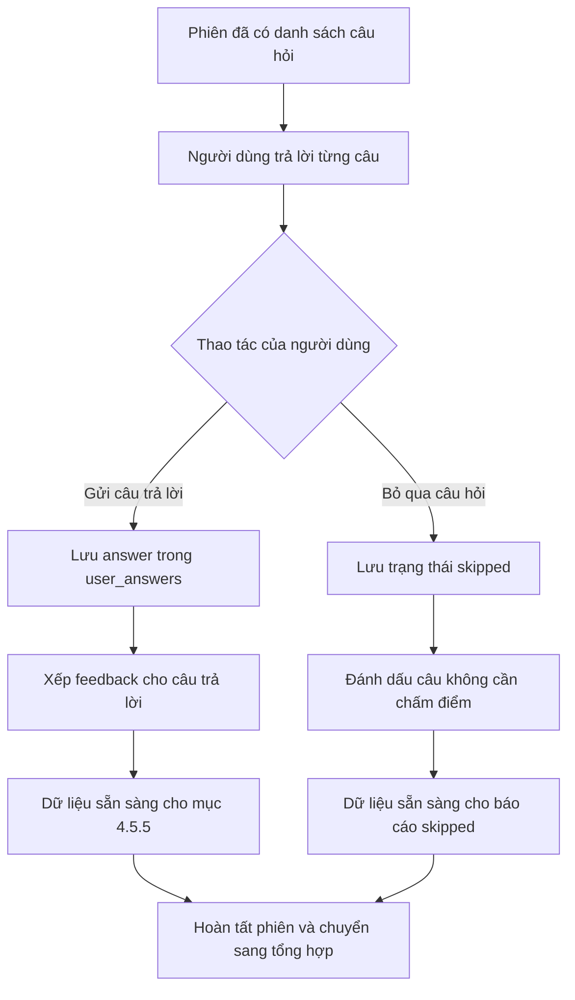

**b. Dữ liệu đầu vào**

Dữ liệu đầu vào gồm mã phiên, mã câu hỏi, nội dung câu trả lời của người dùng, trạng thái bỏ qua nếu có và các thông tin ngữ cảnh đã gắn với câu hỏi như loại câu hỏi, competency domain, context pack và ngôn ngữ đầu ra.

Danh sách câu hỏi được đọc từ `session_questions`. Câu trả lời được lưu vào `user_answers`. Nếu người dùng bỏ qua câu hỏi, bản ghi câu trả lời vẫn được tạo với cờ bỏ qua để phiên có thể tiếp tục và báo cáo sau này biết câu nào không có dữ liệu chấm điểm.

Đầu ra của thao tác gửi câu trả lời gồm mã answer đã lưu, cờ cho biết feedback đã được xếp hàng hay chưa và cờ cho biết transcription có đang chờ hay không. Với câu trả lời văn bản bình thường, feedback được xếp hàng. Với câu bỏ qua, feedback không được xếp hàng. Với luồng audio-only còn được hỗ trợ như fallback, hệ thống có thể xếp job transcription trước rồi mới có feedback sau.

**c. Luồng xử lý nghiệp vụ**

Khi người dùng mở phiên, frontend kiểm tra trạng thái phiên. Nếu câu hỏi chưa sẵn sàng, màn hình hiển thị trạng thái chờ và tiếp tục theo dõi cập nhật. Khi phiên đã sẵn sàng, frontend tải danh sách câu hỏi theo thứ tự và hiển thị câu đầu tiên.

Người dùng có thể nhập câu trả lời rồi gửi, hoặc bỏ qua câu hỏi. Với câu trả lời văn bản, backend lưu dữ liệu vào `user_answers` và xếp job feedback. Với câu bị bỏ qua, backend lưu trạng thái bỏ qua nhưng không xếp job feedback. Khi hết danh sách câu hỏi, frontend yêu cầu hoàn tất phiên để hệ thống chuyển sang giai đoạn tổng hợp báo cáo.

Luồng nghiệp vụ cần bảo đảm mỗi câu hỏi chỉ có một kết quả xử lý trong phiên. Nếu người dùng gửi câu trả lời văn bản, câu đó trở thành câu đã trả lời và được đưa vào luồng feedback. Nếu người dùng chọn bỏ qua, câu đó được ghi nhận là skipped và được đưa vào báo cáo như câu không chấm điểm. Nếu người dùng gửi lại cùng một câu do retry mạng hoặc nhấn nút nhiều lần, backend không tạo thêm answer mới.

Sơ đồ sequence dưới đây làm rõ tương tác giữa người dùng, frontend, backend, database và queue khi một câu trả lời được gửi hoặc một câu hỏi bị bỏ qua.

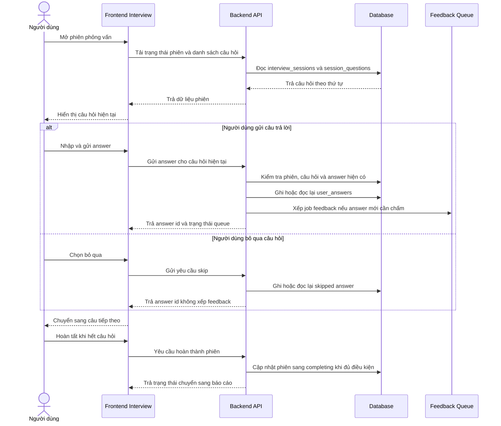

Sơ đồ dưới đây mô tả luồng trạng thái của một phiên phỏng vấn từ lúc câu hỏi sẵn sàng đến khi phiên chuyển sang trạng thái tổng hợp.

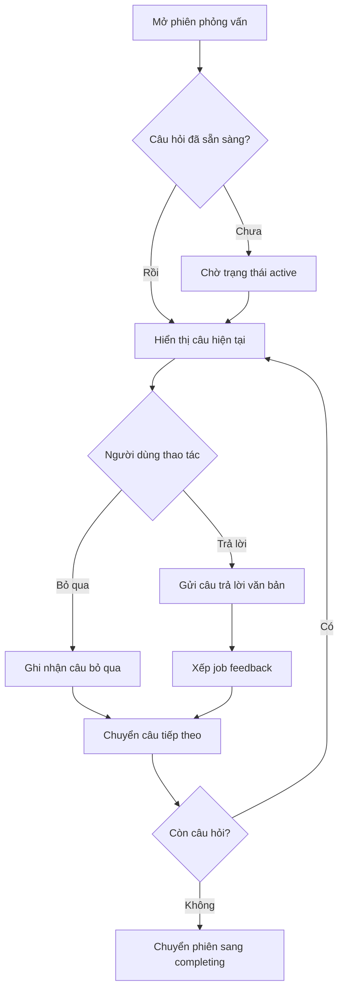

**d. Thiết kế giao diện frontend**

Giao diện phiên phỏng vấn hiển thị một câu hỏi tại một thời điểm, vị trí hiện tại trong phiên và khu vực nhập câu trả lời. Người dùng cần biết mình đang ở câu thứ mấy, còn bao nhiêu câu và câu hiện tại có thể trả lời hay bỏ qua.

Khi gửi câu trả lời, frontend cần khóa thao tác gửi lặp trong lúc request đang xử lý. Nếu câu hỏi chưa sẵn sàng hoặc phiên đang chuyển trạng thái, giao diện hiển thị trạng thái chờ. Nếu gửi thất bại, câu trả lời đang nhập cần được giữ lại để người dùng không mất nội dung.

Màn hình phiên cũng có các thao tác điều khiển trạng thái như tạm dừng, tiếp tục, hủy và hoàn tất phiên. Khi người dùng trả lời thành công, giao diện chuyển sang câu tiếp theo. Khi người dùng bỏ qua, giao diện cũng chuyển câu nhưng không hiển thị trạng thái đang chờ chấm điểm cho câu đó. Khi phiên hoàn tất, frontend điều hướng hoặc mở màn hình báo cáo và chờ backend tổng hợp kết quả nếu report chưa sẵn sàng.

**e. Thiết kế xử lý backend**

Backend chỉ nhận câu trả lời khi phiên tồn tại, thuộc đúng người dùng và đang ở trạng thái cho phép phỏng vấn. Backend cũng kiểm tra câu hỏi thuộc đúng phiên để tránh ghi câu trả lời vào sai phiên.

Mỗi câu hỏi trong một phiên chỉ được phép có một câu trả lời hiện hành. Ràng buộc này giúp tránh việc người dùng gửi trùng do nhấn nhiều lần hoặc do request bị retry. Với câu trả lời hợp lệ, backend lưu vào `user_answers`, đánh dấu chưa có feedback và xếp job feedback. Với câu bỏ qua, backend lưu cờ bỏ qua và không xếp job feedback.

DTO gửi câu trả lời yêu cầu mã câu hỏi, chế độ trả lời và nội dung câu trả lời nếu không phải skip. Với câu trả lời văn bản, nội dung phải đủ độ dài tối thiểu để tránh gửi câu quá ngắn không có giá trị đánh giá. Với câu bỏ qua, hệ thống cho phép nội dung rỗng vì bản chất thao tác này là ghi nhận người dùng không trả lời câu hỏi.

Backend đọc phiên, kiểm tra quyền sở hữu, kiểm tra trạng thái phiên chỉ cho phép `active` hoặc `ready`, sau đó đọc câu hỏi theo đồng thời mã câu hỏi và mã phiên. Nếu phiên đang ở trạng thái `ready`, backend có thể chuyển sang `active` khi người dùng bắt đầu trả lời. Khi lưu answer, backend dùng khóa duy nhất theo session và question để bảo đảm idempotency.

Payload feedback được xếp vào queue gồm mã phiên, mã answer, mã câu hỏi, nội dung câu hỏi, loại câu hỏi, competency domain, câu trả lời, context pack, loại phiên và ngôn ngữ. Đây là dữ liệu tối thiểu để feedback worker đánh giá câu trả lời mà không cần tin vào metadata do frontend gửi lại.

**f. Xử lý lỗi và fallback**

Nếu phiên không tồn tại, không thuộc người dùng hiện tại hoặc chưa ở trạng thái có thể phỏng vấn, backend trả lỗi và không ghi câu trả lời. Nếu câu hỏi không thuộc phiên, backend từ chối request để bảo vệ tính toàn vẹn dữ liệu.

Nếu người dùng gửi trùng một câu trả lời, hệ thống dựa vào ràng buộc một câu hỏi một câu trả lời trong phiên để tránh tạo nhiều bản ghi. Nếu người dùng bỏ qua câu hỏi, đây không phải là lỗi. Hệ thống lưu trạng thái bỏ qua, cho phép đi tiếp và để phần báo cáo xử lý câu này theo hướng không chấm điểm.

Nếu người dùng bỏ qua lại một câu đã bỏ qua, backend trả lại answer hiện có và không xếp thêm job. Nếu người dùng cố bỏ qua một câu đã có câu trả lời thật, backend không ghi đè câu trả lời đó bằng skipped answer. Nếu queue feedback gặp vấn đề sau khi answer văn bản đã được lưu, request có thể thất bại; khi người dùng gửi lại, backend có thể dùng answer hiện có và xếp lại job feedback theo cùng mã answer.

### 4.5.5 Đánh giá và phản hồi từng câu trả lời

**a. Mục đích của tính năng**

Nhóm tính năng đánh giá và phản hồi từng câu trả lời biến dữ liệu trả lời của người dùng thành nhận xét có thể hành động. Mỗi câu trả lời được chấm theo rubric phù hợp với loại phiên và competency domain của câu hỏi. Kết quả gồm điểm, nhận xét chính, câu trả lời mẫu và các đoạn trích được đánh dấu trong câu trả lời gốc.

Tính năng này phục vụ hai mục tiêu. Thứ nhất, người dùng nhận được phản hồi sau từng turn hoặc trong báo cáo. Thứ hai, hệ thống có dữ liệu chuẩn để tổng hợp báo cáo phiên ở mục 4.5.6.

Đây là nhóm tính năng quan trọng vì AI Mock Interview không chỉ hỏi câu hỏi mà còn phải giúp người dùng hiểu câu trả lời của mình tốt ở đâu và thiếu ở đâu. Nếu feedback không được kiểm soát bằng rubric, hệ thống dễ đưa ra nhận xét chung chung hoặc điểm số không nhất quán giữa các phiên.

Sơ đồ sau thể hiện mục đích của tính năng: chuyển answer đã lưu thành feedback có kiểm soát bằng rubric, đồng thời tạo tín hiệu để frontend và report biết câu trả lời đã được xử lý.

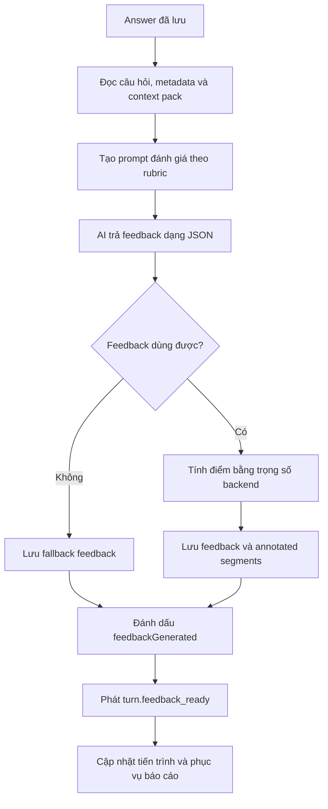

**b. Dữ liệu đầu vào**

Dữ liệu đầu vào gồm mã phiên, mã câu hỏi, câu trả lời đã lưu trong `user_answers`, loại phiên, context pack, competency domain, ngôn ngữ đầu ra và rubric tương ứng. Backend không chỉ gửi câu hỏi và câu trả lời cho AI mà còn gửi metadata của câu hỏi để AI biết câu trả lời cần được đánh giá theo tiêu chí nào.

Output mong đợi từ AI gồm danh sách tiêu chí được áp dụng, điểm theo từng tiêu chí, câu trả lời mẫu, nhận xét chính và tối đa hai đoạn nhận xét cụ thể từ câu trả lời gốc. Backend lưu kết quả hợp lệ vào `ai_feedbacks` và lưu các đoạn nhận xét chi tiết để phục vụ màn hình báo cáo.

Đầu ra cuối cùng của backend gồm feedback đã lưu, trạng thái `feedbackGenerated` trên answer, sự kiện `turn.feedback_ready` và tiến trình feedback của phiên. Nếu phiên đang chờ tạo báo cáo, việc một feedback hoàn tất có thể kích hoạt bước kiểm tra để xếp job report.

**c. Luồng xử lý nghiệp vụ**

Sau khi một câu trả lời văn bản được lưu, backend xếp job feedback. Worker feedback đọc lại câu hỏi, câu trả lời và cấu hình phiên. Sau đó worker tạo prompt đánh giá, gọi AI service, parse JSON trả về, kiểm tra schema và kiểm tra ý nghĩa rubric.

Nếu dữ liệu hợp lệ, backend tự tính điểm tổng từ các tiêu chí hợp lệ thay vì lấy trực tiếp điểm tổng từ AI. Sau khi lưu feedback, backend đánh dấu câu trả lời đã có feedback, phát sự kiện `turn.feedback_ready` và cập nhật tiến trình feedback. Nếu phiên đang ở trạng thái tổng hợp và mọi feedback cần thiết đã sẵn sàng, backend xếp job tạo report.

Sơ đồ sequence dưới đây làm rõ luồng bất đồng bộ: request gửi câu trả lời không chờ AI chấm xong; feedback được worker xử lý sau đó và thông báo lại qua SSE.

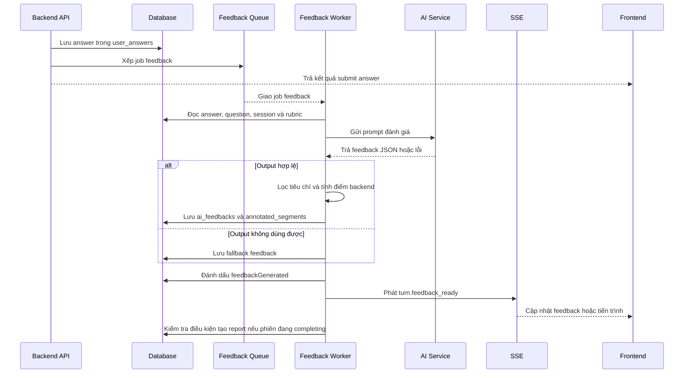

Sơ đồ dưới đây mô tả các bước xử lý chính từ lúc answer được lưu đến khi feedback sẵn sàng cho frontend và report.

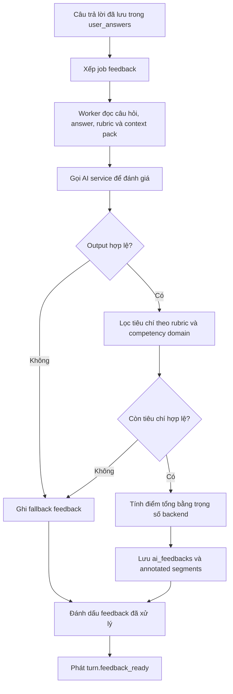

**d. Thiết kế giao diện frontend**

Frontend không cần tự tính điểm hoặc tự diễn giải rubric. Giao diện đọc kết quả feedback đã được backend lưu và hiển thị theo từng câu trả lời. Các thông tin quan trọng gồm điểm nếu có, nhận xét chính, câu trả lời mẫu và đoạn trích được đánh dấu.

Khi feedback chưa sẵn sàng, giao diện thể hiện trạng thái đang xử lý. Nếu feedback là fallback hoặc không thể chấm điểm đáng tin cậy, frontend không hiển thị điểm như một đánh giá thật. Cách hiển thị này giúp người dùng phân biệt giữa câu trả lời được chấm và câu trả lời chưa đủ dữ liệu đánh giá.

Trong màn hình báo cáo, feedback được dùng để dựng transcript có chú thích. Những đoạn được AI đánh dấu có thể hiển thị kèm mức độ như điểm mạnh hoặc điểm cần cải thiện. Nếu feedback chưa có, trang báo cáo tiếp tục hiển thị tiến trình thay vì dựng một báo cáo thiếu dữ liệu.

**e. Thiết kế xử lý backend**

Prompt đánh giá được tạo chặt hơn prompt sinh câu hỏi vì kết quả ảnh hưởng trực tiếp đến điểm số và báo cáo. System message yêu cầu AI đóng vai interview coach, trả về câu trả lời mẫu hoàn chỉnh, nhận xét trọng tâm, điểm theo từng tiêu chí trong `applied_dimensions` và các đoạn nhận xét từ câu trả lời gốc. AI không được tự trả weight hoặc tự tính overall score.

User message của prompt đánh giá chứa dữ liệu cụ thể của turn. Ví dụ sau minh họa cách backend truyền loại phiên, câu hỏi, metadata và câu trả lời vào prompt.

```text
<session_type>technical</session_type>

<question>
Bạn đã thiết kế database cho dự án như thế nào?
</question>

<question_metadata>
category=technical
competency_domain=TD2
</question_metadata>

<answer>
...câu trả lời của ứng viên...
</answer>
```

Ở bước này, backend để phần Job Description rỗng trong prompt feedback hiện tại. Lý do là feedback từng câu đang chấm trực tiếp trên câu hỏi, metadata câu hỏi, context pack và câu trả lời. JD đã được dùng mạnh ở bước tạo câu hỏi; đến bước chấm từng câu, hệ thống ưu tiên không đưa thêm ngữ cảnh thừa làm AI đánh giá lan man.

Kết quả AI phải có các nhóm dữ liệu gồm tiêu chí được áp dụng, câu trả lời mẫu, nhận xét chính và đoạn nhận xét cụ thể. Các đoạn trích phải sao chép nguyên văn từ câu trả lời của ứng viên. Backend lưu cả nội dung đoạn trích và vị trí ký tự. Khi hiển thị báo cáo, giao diện ưu tiên dùng đoạn trích đã lưu để tránh phụ thuộc quá nhiều vào offset nếu nội dung câu trả lời hoặc ngôn ngữ hiển thị có sai lệch.

Output AI được validate bằng hai lớp: kiểm tra schema và kiểm tra ý nghĩa rubric. Một feedback hợp lệ về mặt schema phải có `applied_dimensions`, `model_answer`, `key_takeaway` và `annotated_segments`; mỗi điểm phải nằm trong khoảng 1-100 và `highlight_level` chỉ được là `strength` hoặc `improvement`. Qua được schema vẫn chưa đủ vì AI có thể trả JSON đúng cấu trúc nhưng mã tiêu chí không thuộc rubric của phiên.

Backend xác định danh sách tiêu chí được phép theo ba bước. Thứ nhất, dựa vào loại phiên để lấy tập tiêu chí tối đa: HR chỉ lấy behavioral dimensions, Technical chỉ lấy technical dimensions, Mixed lấy cả hai nhóm. Thứ hai, nếu câu hỏi có competency domain cụ thể và domain đó nằm trong tập tiêu chí của phiên, backend rút tập được phép xuống chỉ còn domain đó. Thứ ba, backend so khớp các tiêu chí AI trả về với tập được phép.

| Nhánh khớp | Ví dụ AI trả về | Cách hệ thống hiểu |
| --- | --- | --- |
| Khớp chính xác | `TD2` | Dùng đúng tiêu chí `TD2`. |
| Khớp sau chuẩn hóa | `td-2`, `td 2` | Loại bỏ khoảng trắng/ký tự phụ và hiểu là `TD2`. |
| Trích mã trong chuỗi | `TD2 - Practical Application` | Trích token `TD2`. |
| Khớp theo tên tiêu chí | `Khả năng áp dụng thực tế` | Chuẩn hóa tên và ánh xạ về mã rubric tương ứng. |

Nếu một tiêu chí đã được khớp, backend chỉ lấy một lần để tránh AI trả trùng tiêu chí. Nếu sau toàn bộ quá trình không còn tiêu chí hợp lệ nào, backend xem feedback đó không dùng được và chuyển sang fallback.

Điểm tổng của một câu trả lời không lấy trực tiếp từ AI. Backend lọc tiêu chí AI trả về theo rubric và competency domain của câu hỏi, chuẩn hóa trọng số của các tiêu chí hợp lệ rồi tự tính điểm tổng theo thang 100:

```text
Điểm tổng = round(Σ điểm_tiêu_chí * trọng_số_đã_chuẩn_hóa)
```

Trong đó:

```text
trọng_số_đã_chuẩn_hóa = trọng_số_gốc_của_tiêu_chí / tổng_trọng_số_gốc_của_các_tiêu_chí_được_chọn
```

Ví dụ, với context pack Việt Nam, nhóm kỹ thuật có trọng số gốc như sau: `TD1 = 0.25`, `TD2 = 0.25`, `TD3 = 0.2`, `TD4 = 0.2`, `TD5 = 0.1`. Nếu một câu hỏi chỉ đánh giá `TD1` và `TD2`, hệ thống không lấy cả 5 tiêu chí vào công thức. Hệ thống chỉ chuẩn hóa trên hai tiêu chí được chọn:

| Tiêu chí | Trọng số gốc | Điểm AI trả | Trọng số sau chuẩn hóa | Đóng góp vào điểm |
| --- | --- | --- | --- | --- |
| `TD1` | 0.25 | 80 | 0.5 | 40 |
| `TD2` | 0.25 | 70 | 0.5 | 35 |
| Tổng | 0.5 |  | 1.0 | 75 |

Điểm tổng của câu trả lời trong ví dụ này là `75/100`. Cách tính này có ý nghĩa vì mỗi câu hỏi chỉ kiểm tra một phần năng lực, không phải toàn bộ rubric. Backend chỉ tính điểm trên các tiêu chí thật sự được câu hỏi đó đánh giá, nhờ vậy điểm của một câu hỏi không bị kéo lệch bởi những tiêu chí không liên quan.

Sau khi tính tổng có trọng số, backend làm tròn điểm và giới hạn kết quả trong thang 1-100. Điều này bảo vệ hệ thống trước các giá trị AI trả về nằm ngoài phạm vi mong đợi sau khi parse và validate.

Sơ đồ dưới đây thể hiện riêng phần tính điểm để làm rõ rằng điểm tổng do backend tính từ tiêu chí hợp lệ, không lấy nguyên văn từ AI.

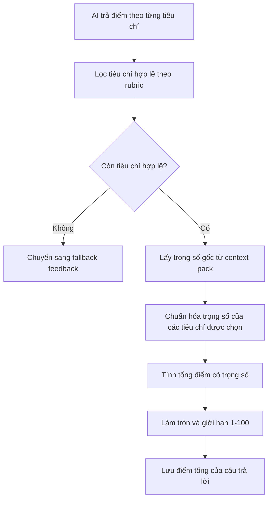

Khi feedback hợp lệ, backend lưu trong một transaction để tránh trạng thái nửa vời: ghi hoặc cập nhật feedback của câu trả lời, xóa các đoạn nhận xét cũ nếu feedback được tạo lại, ghi danh sách đoạn nhận xét mới và đánh dấu câu trả lời đã có feedback. Thông tin feedback được lưu gồm điểm tổng, câu trả lời mẫu, nhận xét chính, phiên bản prompt, cờ fallback, điểm theo tiêu chí và các annotated segment.

Sau khi lưu xong, backend phát sự kiện `turn.feedback_ready` và cập nhật tiến trình feedback của phiên. Nếu phiên đang ở trạng thái tạo báo cáo và tất cả feedback cần thiết đã sẵn sàng, backend xếp job tạo báo cáo tổng hợp.

Nếu feedback được tạo lại do retry job, transaction xóa các annotated segment cũ trước khi ghi segment mới. Cách này giúp một answer chỉ có một feedback hiện hành và danh sách đoạn nhận xét không bị nhân đôi sau các lần retry.

**f. Xử lý lỗi và fallback**

Nếu AI provider lỗi, hết quota, timeout, trả response rỗng, trả JSON không parse được hoặc trả JSON sai schema, backend không lưu output đó như feedback thật. Hệ thống ghi feedback fallback, đánh dấu câu trả lời đã được xử lý và cho phép luồng report tiếp tục.

Nếu output qua được schema nhưng không còn tiêu chí hợp lệ sau khi so khớp với rubric của phiên, backend cũng chuyển sang fallback. Feedback fallback có cờ riêng và không được tính như điểm thật trong báo cáo. Điều này tránh trường hợp người dùng thấy điểm thấp chỉ vì AI trả dữ liệu không đáng tin cậy.

Feedback fallback lưu thông điệp giải thích phù hợp với ngôn ngữ phiên, không tạo annotated segment và đặt cờ `isFallback`. Backend vẫn phát `turn.feedback_ready` để frontend và report không chờ vô hạn, nhưng các bước đọc report sẽ ẩn điểm của feedback fallback.

```text
Input: sessionId, userAnswerId, question metadata, contextPack, language

1. Worker đọc câu trả lời, câu hỏi và cấu hình phiên.
2. Tạo prompt feedback từ câu hỏi, answer, metadata, rubric và ngôn ngữ.
3. Gọi AI để lấy feedback JSON.
4. Parse JSON và validate schema.
5. Lọc tiêu chí chấm theo rubric và competency domain của câu hỏi.
6. Nếu không còn tiêu chí hợp lệ, ghi fallback feedback.
7. Nếu hợp lệ:
   7.1. Chuẩn hóa trọng số tiêu chí.
   7.2. Tính điểm tổng theo trọng số.
   7.3. Lưu feedback và annotated segments.
8. Đánh dấu answer đã có feedback.
9. Phát sự kiện turn.feedback_ready và cập nhật tiến trình.
10. Nếu phiên đang completing và mọi feedback đã sẵn sàng, xếp job tạo report.
```

### 4.5.6 Báo cáo tổng hợp và xem lại lịch sử phiên

**a. Mục đích của tính năng**

Nhóm tính năng báo cáo tổng hợp giúp người dùng xem lại kết quả của cả phiên phỏng vấn. Báo cáo không chỉ hiển thị điểm tổng mà còn trình bày transcript, nhận xét theo từng câu, phân tích năng lực, thông tin câu bị bỏ qua và kế hoạch cải thiện.

Lịch sử phiên cho phép người dùng quay lại các phiên đã tạo, tiếp tục phiên chưa hoàn tất hoặc mở lại báo cáo của phiên đã hoàn thành. Đây là phần giúp kết quả luyện tập không bị mất sau khi người dùng rời khỏi màn hình phỏng vấn.

Trong AI Mock Interview, báo cáo là điểm kết thúc của một phiên luyện tập. Nó tổng hợp các feedback rời rạc thành một cái nhìn chung để người dùng biết phiên vừa rồi có bao nhiêu câu được đánh giá, câu nào bị bỏ qua, phần nào cần cải thiện và dữ liệu chấm điểm có đáng tin cậy hay không.

Sơ đồ sau thể hiện mục đích của tính năng báo cáo: gom dữ liệu của cả phiên thành kết quả tổng hợp có thể xem lại sau này, đồng thời phân biệt rõ câu được chấm, câu fallback và câu bị bỏ qua.

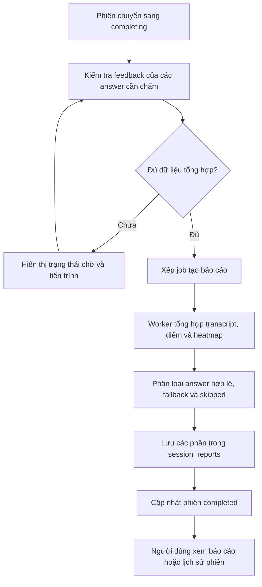

**b. Dữ liệu đầu vào**

Dữ liệu đầu vào của báo cáo gồm phiên phỏng vấn, danh sách câu hỏi trong `session_questions`, câu trả lời trong `user_answers`, feedback trong `ai_feedbacks`, các đoạn nhận xét đã lưu và trạng thái bỏ qua của từng câu. Report processor chỉ dùng feedback đã sẵn sàng để tổng hợp.

Báo cáo được lưu thành nhiều phần trong `session_reports`, gồm tóm tắt tổng quan, phân tích giao tiếp, heatmap năng lực, kế hoạch hành động và câu trả lời đề xuất cho các câu bị bỏ qua. Cách lưu theo từng phần giúp backend đọc lại báo cáo linh hoạt hơn và tránh nhồi toàn bộ kết quả vào một trường duy nhất.

Đầu ra của tính năng gồm trạng thái phiên hoàn thành, điểm tổng nếu có dữ liệu chấm hợp lệ, transcript đã ghép câu hỏi - câu trả lời - feedback, chất lượng báo cáo và các phần báo cáo đã lưu. Chất lượng báo cáo có thể là đầy đủ, một phần, không khả dụng về điểm hoặc không thể chấm nếu toàn bộ phiên chỉ có câu bỏ qua.

**c. Luồng xử lý nghiệp vụ**

Khi người dùng đi hết danh sách câu hỏi và yêu cầu hoàn thành phiên, backend chuyển phiên sang trạng thái `completing`. Backend kiểm tra các câu trả lời không bị bỏ qua đã có feedback hay chưa. Nếu còn feedback chưa sẵn sàng, hệ thống chưa xếp job report và frontend tiếp tục hiển thị trạng thái chờ.

Khi đủ dữ liệu, backend xếp job report. Worker đọc câu hỏi, câu trả lời và feedback, tách câu bị bỏ qua khỏi câu có dữ liệu chấm thật. Điểm tổng của phiên được tính từ các feedback hợp lệ; feedback fallback không được tính như điểm thật. Khi report được ghi thành công, trạng thái phiên chuyển sang hoàn thành và backend phát sự kiện `report.ready`.

Luồng chính có hai cổng kiểm tra. Cổng thứ nhất nằm trước khi xếp report: phiên phải ở trạng thái `completing`, phải có answer và không còn feedback chưa xử lý đối với các câu không bị bỏ qua. Cổng thứ hai nằm trong report worker: số feedback đọc được phải khớp với số answer cần chấm. Nếu hai điều kiện này chưa đạt, hệ thống không tạo báo cáo sớm.

Sơ đồ dưới đây thể hiện quá trình hoàn tất phiên, chờ feedback nếu cần và tải báo cáo sau khi worker ghi dữ liệu.

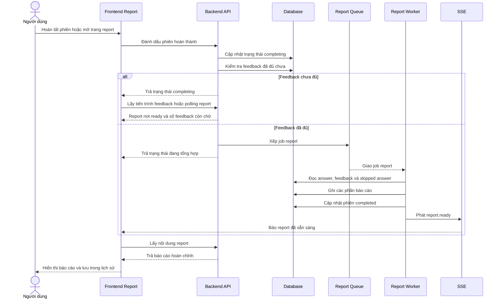

**d. Thiết kế giao diện frontend**

Giao diện báo cáo hiển thị trạng thái chờ khi report chưa sẵn sàng. Trong thời gian này, người dùng cần thấy tiến trình feedback hoặc thông báo rằng hệ thống đang tổng hợp kết quả, thay vì nhìn thấy trang lỗi hoặc báo cáo rỗng.

Khi báo cáo sẵn sàng, frontend hiển thị điểm tổng nếu có dữ liệu chấm đáng tin cậy, thông tin phiên, phương pháp chấm, biểu đồ năng lực và phân tích từng câu trả lời. Với câu bị bỏ qua, báo cáo chỉ hiển thị câu trả lời đề xuất nếu có; không hiển thị điểm mạnh, điểm cần cải thiện hoặc điểm số như một câu đã được chấm.

Trang lịch sử phiên hiển thị danh sách phiên đã tạo, trạng thái của từng phiên và lối vào phù hợp: tiếp tục phiên đang chạy, chờ phiên đang xử lý hoặc mở báo cáo đã hoàn thành.

Khi API trả trạng thái report chưa sẵn sàng, frontend không coi đây là lỗi cuối cùng. Trang báo cáo gọi API tiến trình feedback, hiển thị số câu đã chấm trên tổng số câu cần chấm, số câu còn đang xử lý và thanh tiến trình. Trang cũng lắng nghe sự kiện `session.feedback_progress` và `report.ready`; nếu sự kiện không đến, polling vẫn tiếp tục cập nhật tiến trình.

Khi report có `reportQuality` là một phần hoặc không khả dụng, giao diện cần thể hiện rằng điểm tổng có thể bị ẩn hoặc chỉ phản ánh các câu được chấm hợp lệ. Với câu bị bỏ qua, transcript vẫn giữ câu hỏi và answer trống, nhưng dùng câu trả lời đề xuất nếu backend đã tạo hoặc fallback được lưu.

**e. Thiết kế xử lý backend**

Backend chỉ tạo report khi đủ dữ liệu cần thiết. Điều kiện quan trọng là các câu trả lời không bị bỏ qua phải có feedback hoặc đã được xử lý theo fallback. Các câu bị bỏ qua không làm report bị kẹt vì chúng không cần feedback chấm điểm.

Report processor tổng hợp transcript, điểm phiên, thống kê câu trả lời, danh sách câu fallback và các phần báo cáo. Với phiên có dữ liệu chấm hợp lệ, điểm tổng được tính từ các feedback không phải fallback. Với phiên chỉ có fallback hoặc chỉ có câu bị bỏ qua, backend trả chất lượng báo cáo phù hợp và không tạo điểm số giả.

Report service có API đọc tiến trình, trong đó backend đếm tổng số câu hỏi, tổng số answer, số câu skipped, số feedback cần có, số feedback đã hoàn tất và số feedback còn chờ. Khi đọc report chính, nếu chưa có phần `executive_summary`, backend trả `REPORT_NOT_READY` với trạng thái chấp nhận để frontend tiếp tục chờ.

Khi xếp job report, backend dùng `jobId` theo mã phiên để tránh tạo nhiều job report cho cùng một phiên. Nếu job cũ đã failed, hệ thống có thể retry job đó. Payload report gồm mã phiên, loại phiên, context pack, ngôn ngữ và danh sách turn cần tổng hợp.

Report worker tạo `executive_summary` từ số câu, số câu được đánh giá, số câu fallback, số câu skipped và điểm tổng. `comm_analysis` lưu thống kê feedback. `competency_heatmap` lưu điểm theo answer, trong đó feedback fallback có score null. `action_plan` được tạo từ các tóm tắt feedback hợp lệ; worker yêu cầu AI trả JSON dạng danh sách 3-5 việc cần cải thiện. `skipped_answers` lưu câu trả lời đề xuất cho các câu người dùng bỏ qua.

Các phần báo cáo được ghi bằng upsert trong cùng transaction với việc cập nhật phiên sang `completed`, ghi `overallScore` và `completedAt`. Sau khi transaction thành công, backend phát `report.ready`. Thứ tự này giúp frontend chỉ tải report sau khi dữ liệu đã có trong database.

**f. Xử lý lỗi và fallback**

Nếu frontend yêu cầu report khi worker chưa tạo xong, backend trả trạng thái chưa sẵn sàng để frontend tiếp tục chờ hoặc polling. Đây không phải lỗi nghiệp vụ mà là trạng thái bình thường của luồng bất đồng bộ.

Nếu toàn bộ feedback là fallback hoặc không có câu trả lời có thể chấm, báo cáo hiển thị trạng thái chưa thể chấm điểm thay vì `0/100`. Nếu quá trình tạo câu trả lời đề xuất cho câu bỏ qua gặp lỗi AI, hệ thống vẫn có thể lưu phần báo cáo còn lại và dùng nội dung thay thế phù hợp cho phần câu bị bỏ qua.

Nếu AI không tạo được action plan, backend dùng action plan fallback theo ngôn ngữ phiên. Nếu AI không tạo được câu trả lời đề xuất cho câu skipped, backend dùng câu trả lời mẫu fallback dựa trên nội dung câu hỏi. Nếu số feedback chưa đủ, report worker ném lỗi để job retry thay vì lưu báo cáo thiếu dữ liệu.

### 4.5.7 Theo dõi tiến trình phiên và xử lý trạng thái đặc biệt

**a. Mục đích của tính năng**

Nhóm tính năng theo dõi tiến trình giữ cho người dùng biết phiên đang ở giai đoạn nào. Vì sinh câu hỏi, feedback và report đều có thể mất thời gian, hệ thống cần trạng thái rõ ràng để người dùng không bị kẹt trong màn hình chờ.

Mục này cũng mô tả các trạng thái đặc biệt như phiên đang sinh câu hỏi, đang phỏng vấn, đang tổng hợp báo cáo, hoàn thành, lỗi, fallback AI và câu hỏi bị bỏ qua. Các chi tiết riêng của từng pipeline đã được trình bày ở các mục trước; phần này tập trung vào cách hệ thống duy trì trạng thái chung.

**b. Dữ liệu đầu vào**

Dữ liệu đầu vào gồm trạng thái phiên, số lượng câu hỏi đã sẵn sàng, số câu đã trả lời, số câu bị bỏ qua, số feedback đã hoàn tất, số feedback còn chờ và trạng thái report. Các sự kiện như `turn.feedback_ready` và `report.ready` giúp frontend cập nhật khi backend xử lý xong một bước quan trọng.

Các trạng thái lỗi cũng là dữ liệu đầu vào của giao diện. Frontend cần biết lỗi đến từ validation, quyền truy cập, trạng thái phiên, queue, database hay AI provider để hiển thị thông báo phù hợp.

**c. Luồng xử lý nghiệp vụ**

Khi tạo phiên, backend đặt trạng thái ban đầu để cho biết câu hỏi đang được chuẩn bị. Khi worker sinh câu hỏi lưu đủ `session_questions`, phiên chuyển sang trạng thái có thể phỏng vấn. Trong quá trình phỏng vấn, mỗi lần người dùng trả lời hoặc bỏ qua câu hỏi, backend cập nhật dữ liệu tiến trình.

Khi người dùng hoàn tất phiên, backend chuyển phiên sang trạng thái tổng hợp. Nếu feedback chưa đủ, hệ thống tiếp tục chờ và cập nhật tiến trình. Khi report được ghi thành công, backend phát `report.ready` và chuyển phiên sang hoàn thành. Nếu một lỗi không thể phục hồi xảy ra, phiên được chuyển sang trạng thái lỗi để frontend không tiếp tục chờ vô hạn.

Sơ đồ dưới đây mô tả cách hệ thống phân loại lỗi ở mức tổng quát để quyết định trả lỗi, fallback hoặc đánh dấu trạng thái đặc biệt.

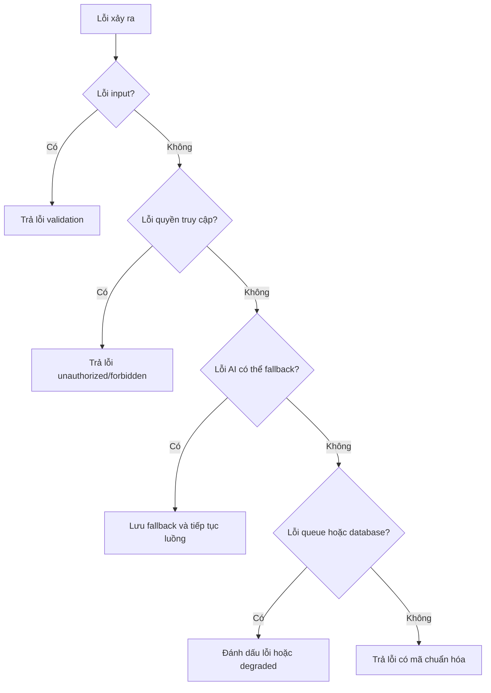

**d. Thiết kế giao diện frontend**

Frontend theo dõi trạng thái qua API, polling và SSE. Nếu SSE bị trễ hoặc mất kết nối, polling vẫn giúp giao diện lấy được trạng thái mới nhất. Giao diện cần phân biệt các trạng thái chờ khác nhau: đang chuẩn bị câu hỏi, đang lưu câu trả lời, đang chờ feedback và đang tổng hợp report.

Khi có lỗi có thể sửa từ phía người dùng, frontend hiển thị thông báo gắn với thao tác tương ứng. Khi backend đang xử lý nền, giao diện không nên hiển thị lỗi ngay chỉ vì report hoặc feedback chưa có. Với phiên đã lỗi, frontend cần cho người dùng biết phiên không thể tiếp tục ở trạng thái hiện tại.

**e. Thiết kế xử lý backend**

Backend giữ trạng thái phiên trong database và cập nhật sau các bước quan trọng. Các job nền không được chỉ xử lý trong bộ nhớ vì frontend cần đọc lại trạng thái qua API. Khi worker hoàn tất một bước, backend ghi database trước rồi mới phát sự kiện để tránh frontend tải dữ liệu khi dữ liệu chưa được lưu.

Degraded mode được xử lý theo từng loại tác vụ. Nếu AI sinh câu hỏi lỗi, hệ thống dùng question bank để tạo câu hỏi. Nếu AI feedback lỗi hoặc hết quota, hệ thống ghi feedback fallback và đánh dấu answer đã xử lý. Nếu report không đủ dữ liệu chấm, backend trả chất lượng báo cáo phù hợp thay vì tạo điểm số không có căn cứ.

**f. Xử lý lỗi và fallback**

Hệ thống chuyển sang fallback trong các trường hợp AI provider hết quota, timeout, trả response rỗng, JSON không parse được, JSON đúng cú pháp nhưng sai schema, không có tiêu chí chấm nào khớp với rubric đang áp dụng hoặc provider lỗi sau các lần thử lại. Các lỗi này được xử lý theo hướng bảo toàn dữ liệu đã có và tiếp tục luồng nếu có thể.

Fallback không có nghĩa là mọi kết quả đều được xem như bình thường. Feedback fallback không được tính vào điểm thật. Phiên chỉ có fallback hoặc không có câu trả lời có thể chấm sẽ hiển thị trạng thái chưa thể chấm điểm. Nếu lỗi xảy ra ở queue hoặc database và hệ thống không thể tiếp tục an toàn, backend đánh dấu trạng thái lỗi để frontend dừng chờ và thông báo cho người dùng.

## 4.6 Thiết Kế Cơ Sở Dữ Liệu

Cơ sở dữ liệu của hệ thống AI Mock Interview được triển khai trên PostgreSQL. Thiết kế dữ liệu xoay quanh phiên phỏng vấn: người dùng tạo phiên từ hồ sơ và Job Description, hệ thống sinh danh sách câu hỏi cho phiên, người dùng trả lời từng câu, AI tạo feedback cho từng câu trả lời và cuối cùng hệ thống tổng hợp báo cáo theo phiên. Các bảng không chỉ lưu dữ liệu đầu ra, mà còn lưu trạng thái xử lý bất đồng bộ để frontend có thể theo dõi tiến trình sinh câu hỏi, chấm câu trả lời và tạo báo cáo.

### 4.6.1 Sơ đồ ERD tổng thể

```mermaid
erDiagram
    users ||--o| user_profiles : has
    users ||--o{ resumes : owns
    users ||--o{ saved_job_descriptions : saves
    users ||--o{ interview_sessions : creates
    context_packs ||--o{ question_bank : groups
    context_packs ||--o{ interview_sessions : configures
    saved_job_descriptions ||--o{ interview_sessions : reused_by
    interview_sessions ||--o{ session_questions : contains
    question_bank ||--o{ session_questions : source_for
    interview_sessions ||--o{ user_answers : receives
    session_questions ||--o| user_answers : answered_by
    user_answers ||--o| ai_feedbacks : evaluated_by
    ai_feedbacks ||--o{ annotated_segments : contains
    interview_sessions ||--o{ session_reports : summarized_by

    users {
        UUID id PK
        TEXT email UK
        TEXT role
        TEXT status
        TIMESTAMPTZ created_at
        TIMESTAMPTZ updated_at
    }

    user_profiles {
        UUID id PK
        UUID user_id FK
        TEXT full_name
        TEXT target_position
        TEXT target_role_category
        TEXT target_level
        TEXT preferred_tech_stack
        TEXT personality
        TIMESTAMPTZ created_at
        TIMESTAMPTZ updated_at
    }

    resumes {
        UUID id PK
        UUID user_id FK
        JSONB parsed_json
        BOOLEAN active
        TIMESTAMPTZ created_at
    }

    saved_job_descriptions {
        UUID id PK
        UUID user_id FK
        TEXT company_name
        TEXT company_website
        TEXT job_title
        TEXT level
        TEXT headcount
        TEXT location
        TEXT requirements
        TEXT job_content
        TEXT_ARRAY tech_stack
        TEXT benefits
        TEXT salary
        TEXT bonus
        TIMESTAMPTZ last_used_at
        TIMESTAMPTZ deleted_at
        TIMESTAMPTZ created_at
        TIMESTAMPTZ updated_at
    }

    context_packs {
        TEXT id PK
        TEXT name
        JSONB rubric_json
        JSONB scoring_weights
        TIMESTAMPTZ created_at
    }

    question_bank {
        UUID id PK
        TEXT content
        QuestionSessionType session_type
        INT difficulty
        TEXT context_pack_id FK
        TEXT competency_domain
        INT estimated_time_min
        JSONB translations
        JSONB content_json
        TIMESTAMPTZ deleted_at
        TIMESTAMPTZ created_at
        TIMESTAMPTZ updated_at
    }

    interview_sessions {
        UUID id PK
        UUID user_id FK
        UUID saved_job_description_id FK
        TEXT job_description
        TEXT job_title
        TEXT session_type
        INT num_questions
        INT duration_min
        TEXT language
        TEXT context_pack_id FK
        TEXT status
        INT overall_score
        TIMESTAMPTZ completed_at
        TIMESTAMPTZ created_at
        TIMESTAMPTZ updated_at
    }

    session_questions {
        UUID id PK
        UUID session_id FK
        UUID question_bank_id FK
        TEXT question_text
        INT order_index
        TEXT question_category
        TEXT competency_domain
        JSONB rubric_json
        INT estimated_time_min
        TIMESTAMPTZ created_at
    }

    user_answers {
        UUID id PK
        UUID session_id FK
        UUID question_id FK
        TEXT answer_mode
        TEXT answer_text
        TEXT audio_file_url
        INT audio_duration_seconds
        INT audio_size_bytes
        BOOLEAN skipped
        JSONB voice_metrics_json
        TEXT transcription_status
        BOOLEAN feedback_generated
        TIMESTAMPTZ created_at
        TIMESTAMPTZ updated_at
    }

    ai_feedbacks {
        UUID id PK
        UUID user_answer_id FK
        INT overall_score
        TEXT model_answer
        TEXT key_takeaway
        TEXT prompt_version
        BOOLEAN is_fallback
        JSONB dimension_scores
        TIMESTAMPTZ created_at
    }

    annotated_segments {
        UUID id PK
        UUID ai_feedback_id FK
        TEXT segment_text
        INT start_index
        INT end_index
        TEXT highlight_level
        TEXT annotation
        TEXT suggestion
        TEXT improved_version
        TIMESTAMPTZ created_at
    }

    session_reports {
        UUID id PK
        UUID session_id FK
        TEXT report_type
        INT version
        JSONB content_json
        TEXT generated_by_model
        TEXT prompt_version
        TIMESTAMPTZ created_at
    }
```

Các bảng có thể chia thành sáu nhóm chính. Nhóm người dùng gồm `users`, `user_profiles` và `resumes`, dùng để lưu tài khoản, hồ sơ ứng viên và dữ liệu CV đã phân tích. Nhóm Job Description và cấu hình gồm `saved_job_descriptions` và `context_packs`, dùng để lưu bối cảnh ứng tuyển, rubric và trọng số chấm điểm. Nhóm phiên phỏng vấn gồm `interview_sessions` và `session_questions`, ghi cấu hình phiên, trạng thái vòng đời và danh sách câu hỏi đã sinh cho từng phiên. Nhóm câu trả lời gồm `user_answers`, lưu câu trả lời văn bản hoặc transcript giọng nói, trạng thái bỏ qua và trạng thái feedback. Nhóm feedback gồm `ai_feedbacks` và `annotated_segments`, lưu điểm, nhận xét, câu trả lời mẫu và các đoạn được chú thích trong câu trả lời. Nhóm báo cáo gồm `session_reports`, lưu từng phần của báo cáo tổng hợp theo loại và phiên bản.

### 4.6.2 Danh sách bảng dữ liệu

**Bảng `context_packs`**

Bảng `context_packs` lưu các bộ ngữ cảnh phỏng vấn, rubric và trọng số chấm điểm. Trong hệ thống hiện tại, bảng này là dữ liệu tham chiếu cho cả question bank và phiên phỏng vấn.

| Field | Kiểu dữ liệu | Ràng buộc | Bắt buộc | Mặc định | Ý nghĩa |
| ----- | ------------ | --------- | -------- | -------- | ------- |
| `id` | `TEXT` | Khóa chính | Có | - | Mã context pack, ví dụ `VN` hoặc `Western`. |
| `name` | `TEXT` | - | Có | - | Tên hiển thị của context pack. |
| `rubric_json` | `JSONB` | - | Có | - | Rubric đánh giá năng lực theo context pack. |
| `scoring_weights` | `JSONB` | - | Có | - | Trọng số dùng khi tính điểm theo rubric. |
| `created_at` | `TIMESTAMPTZ(6)` | - | Có | `now()` | Thời điểm tạo bản ghi. |

**Bảng `question_bank`**

Bảng `question_bank` lưu ngân hàng câu hỏi nền để hệ thống chọn câu hỏi cho phiên phỏng vấn hoặc dùng fallback khi AI không sinh được câu hỏi hợp lệ. Câu hỏi có thể được xóa mềm bằng `deleted_at` để không mất lịch sử tham chiếu.

| Field | Kiểu dữ liệu | Ràng buộc | Bắt buộc | Mặc định | Ý nghĩa |
| ----- | ------------ | --------- | -------- | -------- | ------- |
| `id` | `UUID` | Khóa chính | Có | `gen_random_uuid()` | Mã câu hỏi trong ngân hàng câu hỏi. |
| `content` | `TEXT` | - | Có | - | Nội dung câu hỏi gốc. |
| `session_type` | `QuestionSessionType` | Enum `hr`, `technical` | Có | - | Loại câu hỏi trong ngân hàng câu hỏi. |
| `difficulty` | `INT` | CHECK `difficulty BETWEEN 1 AND 5` | Có | - | Mức độ khó của câu hỏi. |
| `context_pack_id` | `TEXT` | Khóa ngoại tới `context_packs.id` | Có | - | Context pack mà câu hỏi thuộc về. |
| `competency_domain` | `TEXT` | - | Có | - | Nhóm năng lực hoặc tiêu chí mà câu hỏi đánh giá. |
| `estimated_time_min` | `INT` | CHECK `NULL` hoặc `> 0` | Không | - | Thời lượng ước tính cho câu hỏi. |
| `translations` | `JSONB` | - | Không | - | Bản dịch câu hỏi theo ngôn ngữ nếu có. |
| `content_json` | `JSONB` | - | Không | - | Metadata hoặc nguồn dữ liệu của câu hỏi. |
| `deleted_at` | `TIMESTAMPTZ(6)` | Soft delete | Không | - | Thời điểm xóa mềm câu hỏi. |
| `created_at` | `TIMESTAMPTZ(6)` | - | Có | `now()` | Thời điểm tạo câu hỏi. |
| `updated_at` | `TIMESTAMPTZ(6)` | Tự cập nhật khi ghi | Có | `now()` | Thời điểm cập nhật gần nhất. |

**Bảng `users`**

Bảng `users` lưu thông tin người dùng ở mức ứng dụng. Trường `id` tương ứng với UUID từ hệ thống xác thực, còn các trường trong bảng này phục vụ phân quyền và trạng thái tài khoản trong ứng dụng.

| Field | Kiểu dữ liệu | Ràng buộc | Bắt buộc | Mặc định | Ý nghĩa |
| ----- | ------------ | --------- | -------- | -------- | ------- |
| `id` | `UUID` | Khóa chính | Có | - | Mã người dùng, đồng bộ với hệ thống xác thực. |
| `email` | `TEXT` | UNIQUE | Có | - | Email đăng nhập, không được trùng. |
| `role` | `TEXT` | CHECK `role IN ('candidate', 'admin')` | Có | `candidate` | Vai trò của người dùng trong hệ thống. |
| `status` | `TEXT` | - | Có | `active` | Trạng thái tài khoản. |
| `created_at` | `TIMESTAMPTZ(6)` | - | Có | `now()` | Thời điểm tạo người dùng. |
| `updated_at` | `TIMESTAMPTZ(6)` | Tự cập nhật khi ghi | Có | `now()` | Thời điểm cập nhật gần nhất. |

**Bảng `user_profiles`**

Bảng `user_profiles` lưu hồ sơ mở rộng của ứng viên. Bảng này có quan hệ một-một với `users`, dùng để cá nhân hóa bối cảnh luyện phỏng vấn nhưng không thay thế dữ liệu phiên cụ thể.

| Field | Kiểu dữ liệu | Ràng buộc | Bắt buộc | Mặc định | Ý nghĩa |
| ----- | ------------ | --------- | -------- | -------- | ------- |
| `id` | `UUID` | Khóa chính | Có | `gen_random_uuid()` | Mã hồ sơ người dùng. |
| `user_id` | `UUID` | Khóa ngoại tới `users.id`, UNIQUE, ON DELETE CASCADE | Có | - | Người dùng sở hữu hồ sơ; UNIQUE đảm bảo mỗi người dùng chỉ có một hồ sơ. |
| `full_name` | `TEXT` | - | Không | - | Họ tên đầy đủ của ứng viên. |
| `target_position` | `TEXT` | - | Không | - | Vị trí mục tiêu. |
| `target_role_category` | `TEXT` | - | Không | - | Nhóm vai trò nghề nghiệp mục tiêu. |
| `target_level` | `TEXT` | - | Không | - | Cấp độ mục tiêu, ví dụ intern, fresher hoặc junior. |
| `preferred_tech_stack` | `TEXT` | - | Không | - | Công nghệ hoặc kỹ năng kỹ thuật ưu tiên. |
| `personality` | `TEXT` | - | Không | - | Thông tin tính cách hoặc phong cách làm việc nếu có. |
| `created_at` | `TIMESTAMPTZ(6)` | - | Có | `now()` | Thời điểm tạo hồ sơ. |
| `updated_at` | `TIMESTAMPTZ(6)` | Tự cập nhật khi ghi | Có | `now()` | Thời điểm cập nhật hồ sơ gần nhất. |

**Bảng `resumes`**

Bảng `resumes` lưu dữ liệu CV hoặc hồ sơ nghề nghiệp đã được phân tích thành JSON. Thiết kế này tách dữ liệu CV có cấu trúc khỏi bảng hồ sơ người dùng để hồ sơ chính không bị phình to.

| Field | Kiểu dữ liệu | Ràng buộc | Bắt buộc | Mặc định | Ý nghĩa |
| ----- | ------------ | --------- | -------- | -------- | ------- |
| `id` | `UUID` | Khóa chính | Có | `gen_random_uuid()` | Mã resume. |
| `user_id` | `UUID` | Khóa ngoại tới `users.id`, ON DELETE CASCADE | Có | - | Người dùng sở hữu resume. |
| `parsed_json` | `JSONB` | - | Không | - | Dữ liệu CV đã phân tích, ví dụ học vấn, kinh nghiệm, dự án và kỹ năng. |
| `active` | `BOOLEAN` | Partial unique index `idx_resumes_one_active_per_user` khi `active = true` | Có | `true` | Đánh dấu resume đang được dùng. |
| `created_at` | `TIMESTAMPTZ(6)` | - | Có | `now()` | Thời điểm tạo resume. |

**Bảng `saved_job_descriptions`**

Bảng `saved_job_descriptions` lưu các Job Description mà người dùng nhập hoặc muốn dùng lại. Khi tạo phiên, hệ thống có thể tham chiếu đến một JD đã lưu hoặc lưu snapshot nội dung JD vào phiên để bảo toàn bối cảnh phỏng vấn tại thời điểm tạo.

| Field | Kiểu dữ liệu | Ràng buộc | Bắt buộc | Mặc định | Ý nghĩa |
| ----- | ------------ | --------- | -------- | -------- | ------- |
| `id` | `UUID` | Khóa chính | Có | `gen_random_uuid()` | Mã JD đã lưu. |
| `user_id` | `UUID` | Khóa ngoại tới `users.id`, ON DELETE CASCADE | Có | - | Người dùng sở hữu JD. |
| `company_name` | `TEXT` | - | Có | - | Tên công ty. |
| `company_website` | `TEXT` | - | Không | - | Website công ty nếu có. |
| `job_title` | `TEXT` | - | Có | - | Tên vị trí ứng tuyển. |
| `level` | `TEXT` | - | Không | - | Cấp độ tuyển dụng. |
| `headcount` | `TEXT` | - | Không | - | Số lượng tuyển nếu người dùng nhập. |
| `location` | `TEXT` | - | Không | - | Địa điểm làm việc. |
| `requirements` | `TEXT` | - | Có | - | Yêu cầu công việc. |
| `job_content` | `TEXT` | - | Có | - | Nội dung mô tả công việc. |
| `tech_stack` | `TEXT[]` | - | Có | `[]` | Danh sách công nghệ hoặc kỹ năng liên quan. |
| `benefits` | `TEXT` | - | Không | - | Phúc lợi nếu có. |
| `salary` | `TEXT` | - | Không | - | Thông tin lương nếu có. |
| `bonus` | `TEXT` | - | Không | - | Thông tin thưởng nếu có. |
| `last_used_at` | `TIMESTAMPTZ(6)` | - | Không | - | Thời điểm JD được dùng gần nhất để tạo phiên. |
| `deleted_at` | `TIMESTAMPTZ(6)` | Soft delete | Không | - | Thời điểm xóa mềm JD. |
| `created_at` | `TIMESTAMPTZ(6)` | - | Có | `now()` | Thời điểm lưu JD. |
| `updated_at` | `TIMESTAMPTZ(6)` | Tự cập nhật khi ghi | Có | `now()` | Thời điểm cập nhật JD gần nhất. |

**Bảng `interview_sessions`**

Bảng `interview_sessions` là bảng trung tâm của luồng AI Mock Interview. Mỗi bản ghi biểu diễn một phiên phỏng vấn cụ thể, gồm snapshot JD, loại phiên, số câu hỏi, ngôn ngữ, context pack, điểm tổng và trạng thái xử lý.

| Field | Kiểu dữ liệu | Ràng buộc | Bắt buộc | Mặc định | Ý nghĩa |
| ----- | ------------ | --------- | -------- | -------- | ------- |
| `id` | `UUID` | Khóa chính | Có | `gen_random_uuid()` | Mã phiên phỏng vấn. |
| `user_id` | `UUID` | Khóa ngoại tới `users.id`, ON DELETE CASCADE | Có | - | Người dùng tạo phiên. |
| `saved_job_description_id` | `UUID` | Khóa ngoại tới `saved_job_descriptions.id`, ON DELETE SET NULL; trigger kiểm tra cùng `user_id` | Không | - | JD đã lưu được dùng để tạo phiên nếu có. |
| `job_description` | `TEXT` | - | Có | - | Snapshot nội dung JD tại thời điểm tạo phiên. |
| `job_title` | `TEXT` | - | Không | - | Vị trí ứng tuyển của phiên. |
| `session_type` | `TEXT` | CHECK `session_type IN ('hr', 'technical', 'mixed')` | Có | - | Loại phiên phỏng vấn. |
| `num_questions` | `INT` | CHECK `num_questions BETWEEN 3 AND 45` | Có | `5` | Số câu hỏi của phiên. |
| `duration_min` | `INT` | CHECK `duration_min > 0` | Có | `30` | Thời lượng phiên theo phút. |
| `language` | `TEXT` | - | Có | `vi` | Ngôn ngữ hiển thị hoặc ngôn ngữ trả kết quả. |
| `context_pack_id` | `TEXT` | Khóa ngoại tới `context_packs.id` | Có | - | Context pack áp dụng cho phiên. |
| `status` | `TEXT` | CHECK trong tập `generating`, `active`, `paused`, `canceled`, `completing`, `completed`, `error` | Có | `generating` | Trạng thái vòng đời của phiên. |
| `overall_score` | `INT` | CHECK `NULL` hoặc từ `0` đến `100` | Không | - | Điểm tổng của phiên sau khi có báo cáo hợp lệ. |
| `completed_at` | `TIMESTAMPTZ(6)` | - | Không | - | Thời điểm phiên hoàn thành. |
| `created_at` | `TIMESTAMPTZ(6)` | - | Có | `now()` | Thời điểm tạo phiên. |
| `updated_at` | `TIMESTAMPTZ(6)` | Tự cập nhật khi ghi | Có | `now()` | Thời điểm cập nhật phiên gần nhất. |

**Bảng `session_questions`**

Bảng `session_questions` lưu danh sách câu hỏi thực tế của từng phiên. Dữ liệu câu hỏi được lưu dạng snapshot để nếu question bank thay đổi sau này, phiên cũ vẫn giữ đúng nội dung đã hỏi.

| Field | Kiểu dữ liệu | Ràng buộc | Bắt buộc | Mặc định | Ý nghĩa |
| ----- | ------------ | --------- | -------- | -------- | ------- |
| `id` | `UUID` | Khóa chính | Có | `gen_random_uuid()` | Mã câu hỏi trong phiên. |
| `session_id` | `UUID` | Khóa ngoại tới `interview_sessions.id`, ON DELETE CASCADE | Có | - | Phiên chứa câu hỏi. |
| `question_bank_id` | `UUID` | Khóa ngoại tới `question_bank.id`, ON DELETE SET NULL | Không | - | Câu hỏi nguồn trong question bank nếu câu hỏi được lấy từ ngân hàng. |
| `question_text` | `TEXT` | - | Có | - | Nội dung câu hỏi đã hiển thị cho người dùng. |
| `order_index` | `INT` | UNIQUE cùng `session_id` | Có | - | Thứ tự câu hỏi trong phiên. |
| `question_category` | `TEXT` | - | Có | - | Nhóm câu hỏi, ví dụ HR hoặc technical. |
| `competency_domain` | `TEXT` | - | Có | - | Nhóm năng lực được câu hỏi đánh giá. |
| `rubric_json` | `JSONB` | - | Có | - | Rubric áp dụng cho câu hỏi tại thời điểm sinh. |
| `estimated_time_min` | `INT` | - | Không | - | Thời gian ước tính cho câu hỏi. |
| `created_at` | `TIMESTAMPTZ(6)` | - | Có | `now()` | Thời điểm lưu câu hỏi vào phiên. |

**Bảng `user_answers`**

Bảng `user_answers` lưu câu trả lời của người dùng cho từng câu hỏi trong phiên. Bảng này hỗ trợ cả trả lời văn bản, trả lời giọng nói sau khi có transcript và thao tác bỏ qua câu hỏi.

| Field | Kiểu dữ liệu | Ràng buộc | Bắt buộc | Mặc định | Ý nghĩa |
| ----- | ------------ | --------- | -------- | -------- | ------- |
| `id` | `UUID` | Khóa chính | Có | `gen_random_uuid()` | Mã câu trả lời. |
| `session_id` | `UUID` | Khóa ngoại tới `interview_sessions.id`, ON DELETE CASCADE | Có | - | Phiên chứa câu trả lời. |
| `question_id` | `UUID` | Khóa ngoại tới `session_questions.id`, ON DELETE CASCADE; composite FK `(question_id, session_id)` | Có | - | Câu hỏi được trả lời; composite FK đảm bảo câu hỏi thuộc cùng phiên. |
| `answer_mode` | `TEXT` | CHECK `answer_mode IN ('text', 'voice')` | Có | - | Hình thức trả lời. |
| `answer_text` | `TEXT` | - | Có | - | Nội dung trả lời hoặc transcript. |
| `audio_file_url` | `TEXT` | - | Không | - | Đường dẫn file âm thanh nếu trả lời bằng giọng nói. |
| `audio_duration_seconds` | `INT` | CHECK `NULL` hoặc `>= 0` | Không | - | Thời lượng audio theo giây. |
| `audio_size_bytes` | `INT` | CHECK `NULL` hoặc `>= 0` | Không | - | Kích thước file audio. |
| `skipped` | `BOOLEAN` | - | Có | `false` | Đánh dấu người dùng bỏ qua câu hỏi. |
| `voice_metrics_json` | `JSONB` | - | Không | - | Chỉ số giọng nói nếu có. |
| `transcription_status` | `TEXT` | CHECK `NULL` hoặc thuộc `pending`, `done`, `failed` | Không | - | Trạng thái chuyển giọng nói thành văn bản. |
| `feedback_generated` | `BOOLEAN` | - | Có | `false` | Cho biết feedback cho câu trả lời đã được xử lý hay chưa. |
| `created_at` | `TIMESTAMPTZ(6)` | - | Có | `now()` | Thời điểm lưu câu trả lời. |
| `updated_at` | `TIMESTAMPTZ(6)` | Tự cập nhật khi ghi | Có | `now()` | Thời điểm cập nhật câu trả lời gần nhất. |

**Bảng `ai_feedbacks`**

Bảng `ai_feedbacks` lưu feedback cho từng câu trả lời. Mỗi câu trả lời chỉ có một feedback hiện hành, gồm điểm, câu trả lời mẫu, nhận xét chính, trạng thái fallback và điểm theo từng chiều đánh giá nếu có.

| Field | Kiểu dữ liệu | Ràng buộc | Bắt buộc | Mặc định | Ý nghĩa |
| ----- | ------------ | --------- | -------- | -------- | ------- |
| `id` | `UUID` | Khóa chính | Có | `gen_random_uuid()` | Mã feedback. |
| `user_answer_id` | `UUID` | Khóa ngoại tới `user_answers.id`, UNIQUE, ON DELETE CASCADE | Có | - | Câu trả lời được đánh giá. |
| `overall_score` | `INT` | CHECK `overall_score BETWEEN 0 AND 100` | Có | - | Điểm tổng của câu trả lời. |
| `model_answer` | `TEXT` | - | Có | - | Câu trả lời mẫu hoặc câu trả lời gợi ý. |
| `key_takeaway` | `TEXT` | - | Có | - | Nhận xét chính cần người dùng ghi nhớ. |
| `prompt_version` | `TEXT` | - | Có | - | Phiên bản prompt dùng để tạo feedback. |
| `is_fallback` | `BOOLEAN` | - | Có | `false` | Đánh dấu feedback fallback khi AI không trả kết quả đáng tin cậy. |
| `dimension_scores` | `JSONB` | - | Không | - | Điểm chi tiết theo từng tiêu chí hoặc chiều đánh giá. |
| `created_at` | `TIMESTAMPTZ(6)` | - | Có | `now()` | Thời điểm tạo feedback. |

**Bảng `annotated_segments`**

Bảng `annotated_segments` lưu các đoạn được chú thích trong câu trả lời. Dữ liệu này giúp báo cáo hiển thị trực tiếp đoạn nào là điểm mạnh, đoạn nào cần cải thiện và gợi ý sửa như thế nào.

| Field | Kiểu dữ liệu | Ràng buộc | Bắt buộc | Mặc định | Ý nghĩa |
| ----- | ------------ | --------- | -------- | -------- | ------- |
| `id` | `UUID` | Khóa chính | Có | `gen_random_uuid()` | Mã đoạn chú thích. |
| `ai_feedback_id` | `UUID` | Khóa ngoại tới `ai_feedbacks.id`, ON DELETE CASCADE | Có | - | Feedback chứa đoạn chú thích. |
| `segment_text` | `TEXT` | - | Có | - | Nội dung đoạn được trích từ câu trả lời. |
| `start_index` | `INT` | CHECK `start_index >= 0` | Có | - | Vị trí bắt đầu của đoạn trong câu trả lời. |
| `end_index` | `INT` | CHECK `end_index >= start_index` | Có | - | Vị trí kết thúc của đoạn trong câu trả lời. |
| `highlight_level` | `TEXT` | - | Có | - | Mức hoặc loại highlight, ví dụ điểm mạnh hoặc điểm cần cải thiện. |
| `annotation` | `TEXT` | - | Có | - | Nhận xét cho đoạn được highlight. |
| `suggestion` | `TEXT` | - | Không | - | Gợi ý cải thiện nếu có. |
| `improved_version` | `TEXT` | - | Không | - | Phiên bản diễn đạt tốt hơn nếu có. |
| `created_at` | `TIMESTAMPTZ(6)` | - | Có | `now()` | Thời điểm tạo đoạn chú thích. |

**Bảng `session_reports`**

Bảng `session_reports` lưu báo cáo tổng hợp theo từng phần thay vì nhồi toàn bộ báo cáo vào bảng phiên. Thiết kế này giúp hệ thống đọc, cập nhật và version hóa từng phần báo cáo linh hoạt hơn.

| Field | Kiểu dữ liệu | Ràng buộc | Bắt buộc | Mặc định | Ý nghĩa |
| ----- | ------------ | --------- | -------- | -------- | ------- |
| `id` | `UUID` | Khóa chính | Có | `gen_random_uuid()` | Mã phần báo cáo. |
| `session_id` | `UUID` | Khóa ngoại tới `interview_sessions.id`, ON DELETE CASCADE | Có | - | Phiên phỏng vấn được tổng hợp. |
| `report_type` | `TEXT` | CHECK thuộc `executive_summary`, `comm_analysis`, `competency_heatmap`, `action_plan`, `skipped_answers` | Có | - | Loại phần báo cáo. |
| `version` | `INT` | UNIQUE cùng `session_id` và `report_type` | Có | `1` | Phiên bản của phần báo cáo. |
| `content_json` | `JSONB` | - | Có | - | Nội dung JSON của phần báo cáo. |
| `generated_by_model` | `TEXT` | - | Không | - | Model tạo báo cáo nếu có lưu. |
| `prompt_version` | `TEXT` | - | Không | - | Phiên bản prompt tạo báo cáo nếu có lưu. |
| `created_at` | `TIMESTAMPTZ(6)` | - | Có | `now()` | Thời điểm tạo phần báo cáo. |

### 4.6.3 Quan hệ và ràng buộc dữ liệu quan trọng

Quan hệ giữa `users` và `user_profiles` là quan hệ 1-1. Trường `user_profiles.user_id` vừa là khóa ngoại tới `users.id`, vừa có ràng buộc UNIQUE. Thiết kế này phù hợp vì mỗi tài khoản chỉ cần một hồ sơ ứng viên hiện hành để phục vụ cá nhân hóa phiên phỏng vấn.

Quan hệ giữa `users` và `resumes` là quan hệ 1-n. Một người dùng có thể có nhiều bản ghi resume theo thời gian, nhưng partial unique index `idx_resumes_one_active_per_user` đảm bảo tại một thời điểm chỉ có một resume đang active cho mỗi người dùng. Khi người dùng bị xóa, resume bị xóa theo nhờ ON DELETE CASCADE.

Quan hệ giữa `users` và `saved_job_descriptions` là quan hệ 1-n. Một người dùng có thể lưu nhiều JD để tái sử dụng. Bảng này dùng `deleted_at` để xóa mềm, giúp ẩn JD khỏi luồng sử dụng hiện tại nhưng vẫn giữ dữ liệu lịch sử nếu phiên cũ đã từng tham chiếu.

Quan hệ giữa `users` và `interview_sessions` là quan hệ 1-n. Mỗi phiên phỏng vấn thuộc một người dùng. Các dữ liệu con của phiên như câu hỏi, câu trả lời và báo cáo được xóa cascade khi phiên bị xóa, tránh để lại dữ liệu mồ côi.

Quan hệ giữa `saved_job_descriptions` và `interview_sessions` là quan hệ 1-n nhưng khóa ngoại trong `interview_sessions` có thể để trống. Ràng buộc ON DELETE SET NULL giúp phiên cũ vẫn tồn tại nếu JD đã lưu bị xóa. Ngoài khóa ngoại thông thường, trigger `trg_interview_sessions_saved_jd_owner` kiểm tra `saved_job_description_id` phải trỏ tới JD thuộc cùng `user_id` với phiên, tránh trường hợp một phiên tham chiếu nhầm JD của người dùng khác.

Quan hệ giữa `context_packs` và `question_bank` là quan hệ 1-n. Mỗi câu hỏi trong ngân hàng thuộc một context pack cụ thể để hệ thống chọn câu hỏi và rubric đúng bối cảnh. Quan hệ giữa `context_packs` và `interview_sessions` cũng là 1-n, vì mỗi phiên chỉ dùng một context pack nhưng một context pack có thể được dùng cho nhiều phiên.

Quan hệ giữa `interview_sessions` và `session_questions` là quan hệ 1-n. Ràng buộc UNIQUE `(session_id, order_index)` đảm bảo trong một phiên không có hai câu hỏi cùng thứ tự. Bảng `session_questions` lưu snapshot `question_text` và `rubric_json` để phiên cũ không bị thay đổi khi ngân hàng câu hỏi hoặc rubric gốc được cập nhật.

Quan hệ giữa `question_bank` và `session_questions` là quan hệ 1-n tùy chọn. Trường `session_questions.question_bank_id` có thể `NULL` vì câu hỏi có thể do AI sinh ra và không có nguồn trong question bank. Khi câu hỏi gốc trong question bank không còn tồn tại, khóa ngoại có thể được set null, trong khi snapshot câu hỏi trong phiên vẫn được giữ.

Quan hệ giữa `session_questions` và `user_answers` là quan hệ 1-1 tùy chọn ở góc nhìn nghiệp vụ: một câu hỏi trong phiên có thể chưa có câu trả lời, nhưng khi đã trả lời thì chỉ có tối đa một bản ghi answer. Ràng buộc UNIQUE `(session_id, question_id)` bảo vệ quy tắc này ở mức database. Ngoài ra, composite FK `user_answers(question_id, session_id)` tới `session_questions(id, session_id)` đảm bảo câu trả lời không thể trỏ tới câu hỏi thuộc phiên khác.

Quan hệ giữa `user_answers` và `ai_feedbacks` là quan hệ 1-1. Trường `ai_feedbacks.user_answer_id` có ràng buộc UNIQUE và ON DELETE CASCADE, vì mỗi câu trả lời chỉ có một feedback hiện hành. Nếu feedback được tạo lại do retry, hệ thống cập nhật dữ liệu feedback thay vì tạo nhiều feedback song song cho cùng một câu trả lời.

Quan hệ giữa `ai_feedbacks` và `annotated_segments` là quan hệ 1-n. Một feedback có thể có nhiều đoạn chú thích để chỉ ra các phần cụ thể trong câu trả lời. Ràng buộc CHECK trên `start_index` và `end_index` bảo đảm offset của đoạn chú thích hợp lệ.

Quan hệ giữa `interview_sessions` và `session_reports` là quan hệ 1-n. Bảng `session_reports` dùng UNIQUE `(session_id, report_type, version)` để mỗi phiên chỉ có một bản ghi cho từng loại báo cáo và phiên bản. Cách tách báo cáo theo `report_type` giúp lưu riêng các phần như `executive_summary`, `comm_analysis`, `competency_heatmap`, `action_plan` và `skipped_answers`.

Các ràng buộc quan trọng của thiết kế gồm ba nhóm. Thứ nhất là ràng buộc định danh và chống trùng: `users.email` là duy nhất, `user_profiles.user_id` là duy nhất, `session_questions(session_id, order_index)` là duy nhất, `user_answers(session_id, question_id)` là duy nhất, `ai_feedbacks.user_answer_id` là duy nhất và `session_reports(session_id, report_type, version)` là duy nhất. Các ràng buộc này trực tiếp bảo vệ các quy tắc nghiệp vụ như một email một tài khoản, một hồ sơ cho mỗi người dùng, một câu hỏi chỉ có một vị trí trong phiên và một câu hỏi trong phiên chỉ có một câu trả lời.

Thứ hai là các ràng buộc miền giá trị. `interview_sessions.session_type` chỉ nhận `hr`, `technical` hoặc `mixed`; `interview_sessions.status` chỉ nhận các trạng thái vòng đời hợp lệ; `interview_sessions.num_questions` nằm trong khoảng 3 đến 45; `interview_sessions.overall_score` và `ai_feedbacks.overall_score` nằm trong thang 0-100; `question_bank.difficulty` nằm trong thang 1-5; `user_answers.answer_mode` chỉ nhận `text` hoặc `voice`; `user_answers.transcription_status` chỉ nhận `pending`, `done`, `failed` hoặc `NULL`; các thông số audio không được âm. Các CHECK constraint này giúp dữ liệu xấu không đi sâu vào pipeline bất đồng bộ.

Thứ ba là các ràng buộc xóa và bảo toàn lịch sử. Những dữ liệu phụ thuộc trực tiếp vào người dùng hoặc phiên dùng ON DELETE CASCADE để tránh dữ liệu mồ côi. Ngược lại, một số dữ liệu có giá trị lịch sử được lưu dạng snapshot, chẳng hạn `interview_sessions.job_description`, `session_questions.question_text` và `session_questions.rubric_json`. Đây là lựa chọn thiết kế có chủ ý: phiên phỏng vấn cần phản ánh đúng bối cảnh và câu hỏi tại thời điểm người dùng thực hiện, không bị thay đổi khi JD, question bank hoặc rubric được cập nhật sau này.

Hệ thống cũng dùng soft delete cho `question_bank` và `saved_job_descriptions` thông qua trường `deleted_at`. Với question bank, các index chọn câu hỏi chỉ áp dụng cho bản ghi chưa bị xóa mềm, giúp câu hỏi cũ không được chọn cho phiên mới nhưng vẫn không phá vỡ dữ liệu phiên đã tạo. Với JD đã lưu, xóa mềm giúp người dùng ẩn JD khỏi thư viện mà không ảnh hưởng tới các phiên đã tạo trước đó.

Ngoài các ràng buộc trong bảng, database còn có Row Level Security cho nhiều bảng nghiệp vụ như `question_bank`, `users`, `user_profiles`, `resumes`, `interview_sessions`, `session_questions`, `user_answers`, `saved_job_descriptions`, `ai_feedbacks`, `annotated_segments` và `session_reports`. Các policy này chủ yếu giới hạn người dùng chỉ đọc hoặc ghi dữ liệu thuộc về mình; riêng dữ liệu quản trị như question bank có quyền thao tác dành cho admin. Đây là lớp bảo vệ bổ sung bên cạnh kiểm tra quyền ở backend.

## 4.7 Môi Trường Xây Dựng Và Triển Khai Local

Trong GR1, hệ thống được triển khai và chạy local theo mô hình frontend/backend tách riêng. Redis chạy bằng Docker Compose, backend chạy bằng NestJS watch mode, frontend chạy bằng Next.js dev server. Database dùng PostgreSQL/Supabase.

### 4.7.1 Điều kiện môi trường

Các điều kiện môi trường chính:

- Node.js từ phiên bản 20 trở lên.
- npm từ phiên bản 10 trở lên.
- Docker Desktop để chạy Redis.
- PostgreSQL/Supabase đã cấu hình.
- OpenAI API key hoặc endpoint tương thích OpenAI cho chat model.
- Các biến môi trường cho Supabase, database, Redis, OpenAI và frontend API base URL.

### 4.7.2 Quy trình chạy local

Quy trình chạy local ở mức báo cáo như sau:

1. Cài dependency cho backend và frontend.
2. Tạo file môi trường cho backend từ mẫu `.env.example`.
3. Điền các biến môi trường bắt buộc như Supabase, database, Redis và OpenAI.
4. Bật Redis bằng Docker Compose trong thư mục backend.
5. Chạy backend ở cổng 3000.
6. Tạo file môi trường frontend và trỏ `NEXT_PUBLIC_API_BASE_URL` về backend.
7. Chạy frontend ở cổng 5173.
8. Kiểm tra `/api/v1` và `/health` để xác nhận backend, database và Redis hoạt động.

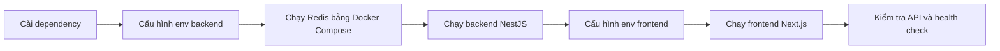

### 4.7.3 Cấu hình phụ thuộc và dữ liệu cần thiết

Ngoài dependency và biến môi trường, quá trình chạy local cần xác định rõ các cổng, endpoint và dịch vụ phụ thuộc để frontend, backend, database, Redis và AI provider có thể kết nối đúng.

| Thành phần | Địa chỉ local mặc định | Mục đích |
| --- | --- | --- |
| Backend API | `http://localhost:3000/api/v1` | REST API cho frontend. |
| Health check | `http://localhost:3000/health` | Kiểm tra database và Redis. |
| Frontend | `http://localhost:5173` | Giao diện người dùng. |
| Redis | `localhost:6379` | Hàng đợi và kênh sự kiện. |

Trong môi trường dev, hệ thống hỗ trợ cấu hình bỏ qua đăng nhập thật. Khi bật chế độ này, frontend gửi token giả lập và backend gắn request với một user mẫu trong database. Cách này chỉ dùng để demo và phát triển local, không dùng cho production.

## 4.8 Kiểm Soát Chất Lượng Trong Quá Trình Xây Dựng

Chất lượng của prototype được kiểm soát ở nhiều lớp: kiểu dữ liệu TypeScript, validation đầu vào, validation output AI, test backend, E2E frontend, build/lint và smoke check runtime.

| Biện pháp | Áp dụng ở đâu | Mục đích |
| --- | --- | --- |
| TypeScript | Client/server | Phát hiện lỗi kiểu dữ liệu khi phát triển, đồng bộ kiểu dữ liệu API và component. |
| DTO validation | Backend API | Từ chối request thiếu trường, sai loại phiên, JD quá ngắn hoặc câu trả lời quá ngắn. |
| Zod validation | AI output | Kiểm tra JSON từ AI trước khi lưu, tránh lưu output thiếu trường hoặc sai schema. |
| Unit test | Services/processors | Kiểm tra logic tạo phiên, nộp câu trả lời, fallback, report readiness, profile, question bank và các processor AI. |
| E2E test | Client luồng chính | Kiểm tra các luồng người dùng quan trọng ở mức trình duyệt khi cần. |
| Runtime smoke check | Backend/local | Gọi API gốc và health check để xác nhận backend, database và Redis sẵn sàng. |
| Lint/build | Client/server | Kiểm tra lỗi compile, lỗi coding style và khả năng build production. |

### 4.8.1 Kiểm soát dữ liệu đầu vào

Backend dùng DTO validation cho các request quan trọng. Ví dụ, tạo phiên yêu cầu JD có độ dài tối thiểu, loại phiên thuộc nhóm hợp lệ, context pack hợp lệ và số lượng câu hỏi nằm trong giới hạn. Gửi câu trả lời yêu cầu có question id, answer mode hợp lệ và nội dung đủ dài nếu không phải câu bị bỏ qua. Lưu JD cũng kiểm tra các trường như tên công ty, vị trí, level, yêu cầu và nội dung công việc.

Nhờ validation ở backend, frontend không phải là lớp bảo vệ duy nhất. Dù người dùng gọi API trực tiếp, dữ liệu sai vẫn bị chặn trước khi ghi vào database.

### 4.8.2 Kiểm soát output AI

Các output quan trọng từ AI được yêu cầu ở dạng JSON và validate bằng schema. Feedback phải có danh sách tiêu chí áp dụng, câu trả lời mẫu, nhận xét chính và danh sách đoạn được annotate. Câu hỏi sinh ra cũng được kiểm tra text, category, competency domain và độ khó.

Nếu output không hợp lệ, hệ thống không cố lưu dữ liệu sai. Pipeline chuyển sang lỗi có thể fallback hoặc retry tùy trường hợp. Cách này giúp dữ liệu trong báo cáo ổn định hơn, đặc biệt với các model có thể trả lời lệch format.

### 4.8.3 Kiểm soát qua test và smoke check

Backend có nhiều file test ở cấp service, controller, guard, processor và integration flow. Các nhóm test đáng chú ý gồm tạo phiên, nộp câu trả lời, xử lý skip, feedback processor, report processor, SSE, OpenAI gateway, validation DTO, question bank và runtime health.

Frontend có lint, build và Playwright E2E. Trong GR1, các kiểm thử này giúp phát hiện lỗi hợp đồng giữa frontend và backend như sai field trong report, sai trạng thái phiên hoặc xử lý loading chưa đúng.

Smoke check runtime dùng để xác nhận backend đã chạy được và các phụ thuộc quan trọng như database, Redis phản hồi đúng. Đây là bước cần thiết vì hệ thống không chỉ là web tĩnh mà còn phụ thuộc queue, database và AI provider.

## 4.9 Tổng Kết Chương

Chương 4 đã trình bày cách sản phẩm AI Mock Interview được phân tích, thiết kế và xây dựng trong phạm vi GR1 dựa trên mã nguồn hiện tại. Prototype đã hình thành được luồng chính từ quản lý JD, cấu hình phiên, sinh câu hỏi, trả lời phỏng vấn, tạo feedback đến xem báo cáo tổng hợp.

Về kiến trúc, hệ thống được tách thành frontend Next.js, backend NestJS, PostgreSQL/Supabase, Redis/BullMQ và AI provider. Các tác vụ AI dài được xử lý bất đồng bộ bằng queue, còn frontend theo dõi trạng thái bằng API, polling và SSE. Về dữ liệu, schema xoay quanh quan hệ phiên phỏng vấn, câu hỏi, câu trả lời, feedback và report. Về chất lượng, hệ thống có validation đầu vào, validation output AI, fallback, test và runtime health check.

Những nội dung này là cơ sở để Chương 5 đánh giá kết quả đạt được trong GR1, bao gồm mức độ hoàn thành chức năng, chất lượng giao diện, khả năng vận hành local, chất lượng AI feedback và các hạn chế còn tồn tại của prototype.

---
