# Chương 4. Phân Tích, Thiết Kế Và Xây Dựng Sản Phẩm GR1

## 4.1 Giới Thiệu Sản Phẩm GR1

Trong giai đoạn GR1, sản phẩm AI Mock Interview được xây dựng dưới dạng prototype web app phục vụ sinh viên năm cuối và ứng viên fresher ngành Công nghệ thông tin tại Việt Nam. Sản phẩm không hướng đến việc đưa gợi ý để người dùng trả lời thay trong buổi phỏng vấn thật, mà tập trung vào hoạt động luyện tập trước phỏng vấn: người dùng cung cấp Job Description, chọn loại phỏng vấn, trả lời từng câu hỏi, sau đó nhận phản hồi và báo cáo tổng hợp.

Prototype hiện tại không chỉ dừng ở mức nhập câu hỏi và nhận câu trả lời từ chatbot. Hệ thống tổ chức quá trình luyện tập thành một phiên có cấu trúc, có dữ liệu đầu vào, có danh sách câu hỏi, có câu trả lời của người dùng, có feedback theo từng câu và có báo cáo sau phiên. Cách tiếp cận này thống nhất với định vị ở Chương 1 và khoảng trống rút ra ở Chương 2: hệ thống cần giúp người học luyện lặp lại theo nhu cầu, có phản hồi cụ thể, chi phí thấp trong phạm vi đề tài và phù hợp với ngữ cảnh sinh viên CNTT Việt Nam.

### 4.1.1 Mục tiêu của sản phẩm trong phạm vi GR1

Mục tiêu tổng quát của đề tài là xây dựng một ứng dụng web hỗ trợ sinh viên năm cuối và ứng viên fresher ngành Công nghệ thông tin luyện phỏng vấn bằng trí tuệ nhân tạo theo một quy trình có cấu trúc, có phản hồi và có báo cáo sau phiên. Trong phạm vi GR1, đề tài tập trung vào việc xây dựng một prototype có thể demo được luồng luyện phỏng vấn chính từ lúc người dùng chuẩn bị hồ sơ đến lúc nhận báo cáo sau phiên.

Mục tiêu chất lượng của đề tài là tạo ra một prototype có giao diện dễ sử dụng, dữ liệu phiên được lưu lại có cấu trúc, phản hồi đủ cụ thể để người dùng có thể hành động và các tác vụ AI được xử lý bất đồng bộ để tránh chặn trải nghiệm người dùng. Hệ thống không đặt mục tiêu thay thế nhà tuyển dụng hoặc mentor, mà đóng vai trò công cụ luyện tập trước phỏng vấn thật.

### 4.1.2 Luồng sử dụng tổng quát

Luồng chính của sản phẩm được xây dựng như sau:

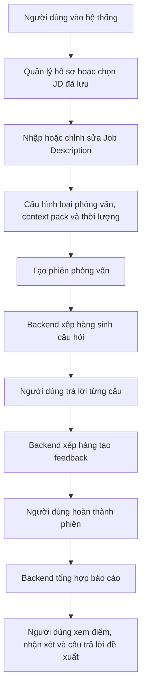

Luồng này phản ánh đúng hướng xây dựng hiện tại của mã nguồn. Trang `/setup` phụ trách nhập JD và cấu hình phiên. Trang `/sessions/[id]` hiển thị câu hỏi và nhận câu trả lời. Trang `/sessions/[id]/report` hiển thị tiến trình tạo báo cáo và nội dung báo cáo khi sẵn sàng.

## 4.2 Phân Tích Yêu Cầu Sản Phẩm

Phần phân tích yêu cầu xác định rõ người dùng, phạm vi chức năng và các ràng buộc chất lượng của prototype GR1 trước khi trình bày chi tiết luồng nghiệp vụ và thiết kế hệ thống.

### 4.2.1 Tác nhân và phạm vi sử dụng

Tác nhân chính của hệ thống là sinh viên năm cuối và ứng viên fresher ngành Công nghệ thông tin có nhu cầu luyện tập trước phỏng vấn. Người dùng thao tác trực tiếp với hệ thống để quản lý hồ sơ luyện tập, nhập hoặc chọn Job Description, cấu hình phiên phỏng vấn, trả lời câu hỏi và xem phản hồi sau phiên.

Về phạm vi loại phỏng vấn, sản phẩm tập trung vào phỏng vấn kỹ thuật, phỏng vấn hành vi và phiên phỏng vấn tổng hợp. Hệ thống không được thiết kế để hỗ trợ ứng viên gian lận trong buổi phỏng vấn thật. Hệ thống không đưa gợi ý theo thời gian thực trong lúc người dùng đang phỏng vấn với nhà tuyển dụng, mà chỉ phục vụ luyện tập trước phỏng vấn.

### 4.2.2 Yêu cầu chức năng chính

Về phạm vi chức năng, nhiệm vụ chính của hệ thống là cho phép người dùng quản lý hồ sơ luyện tập, cấu hình phiên từ mô tả công việc, nhận danh sách câu hỏi phù hợp, trả lời bằng văn bản, nhận phản hồi tự động cho từng câu trả lời và xem báo cáo tổng hợp sau phiên.

| Nhóm tính năng | Phạm vi đã phát triển trong GR1 | Mục đích trong hệ thống |
| --- | --- | --- |
| Tài khoản và hồ sơ luyện tập | Người dùng đăng ký, đăng nhập và quản lý thông tin hồ sơ phục vụ luyện phỏng vấn, bao gồm kỹ năng, kinh nghiệm, học vấn, dự án và CV. | Làm dữ liệu nền để cá nhân hóa câu hỏi và phản hồi theo năng lực thực tế của người dùng. |
| Job Description và cấu hình phiên | Người dùng nhập hoặc chọn lại JD đã lưu, sau đó chọn loại phỏng vấn, context pack, thời lượng và số lượng câu hỏi. | Xác định phạm vi buổi luyện tập để hệ thống sinh câu hỏi và đánh giá theo đúng mục tiêu ứng tuyển. |
| Sinh câu hỏi phỏng vấn | Hệ thống tạo danh sách câu hỏi dựa trên thông tin phiên, kết hợp khả năng sinh nội dung của AI với ngân hàng câu hỏi có sẵn. | Tạo bộ câu hỏi phù hợp với vị trí ứng tuyển, giảm phụ thuộc vào danh sách câu hỏi mẫu chung chung. |
| Thực hiện phiên phỏng vấn | Người dùng trả lời câu hỏi bằng văn bản trong giao diện phỏng vấn, có thể bỏ qua câu hỏi hoặc hoàn tất phiên khi đã đi hết danh sách. | Mô phỏng luồng luyện phỏng vấn có cấu trúc và tạo dữ liệu ổn định cho bước phản hồi. |
| Phản hồi cho từng câu trả lời | Hệ thống phân tích từng câu trả lời và đưa ra nhận xét về điểm mạnh, điểm còn thiếu, gợi ý cải thiện và ví dụ trả lời tốt hơn khi phù hợp. | Giúp người dùng biết cụ thể mình cần sửa nội dung nào thay vì chỉ nhận đánh giá chung chung. |
| Báo cáo tổng hợp và lịch sử phiên | Sau khi phiên kết thúc, hệ thống tạo báo cáo tổng hợp; người dùng có thể xem lại phiên, câu hỏi, câu trả lời, feedback và báo cáo tương ứng. | Giúp người dùng nhìn lại toàn bộ phiên luyện tập và có cơ sở tiếp tục rèn luyện. |
| Theo dõi tiến trình và xử lý lỗi | Các tác vụ tốn thời gian như sinh câu hỏi, tạo feedback và tạo báo cáo được xử lý nền; giao diện nhận cập nhật trạng thái khi kết quả sẵn sàng. | Giảm tình trạng chờ lâu trên một yêu cầu duy nhất và giúp hệ thống ổn định hơn khi tác vụ AI mất nhiều thời gian. |

### 4.2.3 Yêu cầu phi chức năng và ràng buộc triển khai

Prototype cần có giao diện dễ sử dụng, lưu dữ liệu phiên có cấu trúc, phản hồi đủ cụ thể để người dùng có thể hành động và xử lý các tác vụ AI dài bằng cơ chế bất đồng bộ. Hệ thống cũng cần validate dữ liệu đầu vào, kiểm soát output AI, có fallback khi AI không ổn định và giữ trạng thái phiên rõ ràng để người dùng không bị kẹt trong quá trình luyện tập.

Kết quả đánh giá của AI chỉ được xem là phản hồi tham khảo phục vụ học tập, không phải kết luận tuyển dụng chính thức. Trong phạm vi GR1, hệ thống ưu tiên khả năng demo luồng chính, vận hành local ổn định và minh bạch trạng thái hơn là triển khai production đầy đủ.

## 4.3 Luồng Nghiệp Vụ Chính

Luồng nghiệp vụ GR1 đặt phiên phỏng vấn ở trung tâm. Người dùng chuẩn bị hồ sơ và JD, hệ thống tạo câu hỏi theo loại phiên, người dùng trả lời từng câu, backend xử lý feedback ở nền và cuối cùng tổng hợp báo cáo. Các loại phiên Technical, Behavioral và Mixed không chỉ là nhãn hiển thị, mà quyết định nhóm câu hỏi, tiêu chí đánh giá và cách AI pipeline xây dựng prompt. Các đồ thị chi tiết của từng luồng được trình bày trong các nhóm tính năng tương ứng ở mục 4.5.

### 4.3.1 Luồng cấu hình và tạo phiên phỏng vấn

Luồng cấu hình bắt đầu từ trang `/setup`. Nếu người dùng đã có JD đã lưu, hệ thống hiển thị danh sách để chọn lại. Nếu chưa có hoặc muốn tạo mới, người dùng nhập thông tin JD gồm công ty, vị trí, level, yêu cầu, nội dung công việc, tech stack và một số trường bổ sung.

Sau khi JD hợp lệ, người dùng chọn loại phỏng vấn, context pack và thời lượng. Thời lượng hiện tại được ánh xạ sang số lượng câu hỏi: 30 phút tương ứng 15 câu, 60 phút tương ứng 30 câu, 90 phút tương ứng 45 câu. Khi xác nhận, frontend gửi dữ liệu lưu JD trước, sau đó tạo session gắn với JD vừa lưu.

Backend kiểm tra các điều kiện như JD đủ dài, loại phiên hợp lệ, context pack hợp lệ, số lượng câu hỏi nằm trong giới hạn và JD đã lưu thuộc về đúng người dùng. Ngoài ra, hệ thống có giới hạn số phiên được tạo trong 24 giờ để tránh lạm dụng tài nguyên AI.

### 4.3.2 Luồng thực hiện phiên phỏng vấn

Khi vào trang phỏng vấn, frontend lấy thông tin phiên. Nếu phiên đang tổng hợp hoặc đã hoàn thành, người dùng được chuyển sang trang báo cáo. Nếu phiên còn đang sinh câu hỏi, frontend chờ câu hỏi qua polling ngắn và SSE. Khi câu hỏi đã có, backend chuyển phiên sang trạng thái active.

Trong lúc phỏng vấn, người dùng trả lời từng câu theo thứ tự bằng văn bản. Người dùng cũng có thể bỏ qua câu hỏi; câu bị bỏ qua vẫn được ghi nhận để phiên hoàn thành đúng số câu, nhưng không sinh feedback chấm điểm.

Backend chỉ cho nộp câu trả lời khi phiên đang ở trạng thái có thể phỏng vấn. Nếu phiên đã hủy, đã hoàn thành hoặc chưa sẵn sàng, request sẽ bị từ chối bằng lỗi có cấu trúc.

### 4.3.3 Luồng sinh và xem báo cáo

Khi người dùng trả lời hoặc bỏ qua hết câu hỏi, frontend yêu cầu hoàn thành phiên. Backend kiểm tra số câu trả lời đã đủ với số câu hỏi chưa. Nếu đủ, trạng thái phiên chuyển sang `completing`. Sau đó backend chỉ xếp job report khi tất cả câu trả lời không bị bỏ qua đã có feedback.

Trang report có hai cơ chế chờ. Thứ nhất, trang gọi API lấy report; nếu report chưa sẵn sàng, backend trả trạng thái `REPORT_NOT_READY` và frontend thử lại sau một khoảng thời gian. Thứ hai, trang subscribe SSE để nhận tiến trình feedback và sự kiện report sẵn sàng. Cách kết hợp này giúp trải nghiệm ổn định hơn khi một trong hai cơ chế bị trễ.

Nội dung báo cáo hiển thị theo thứ tự: điểm tổng hoặc trạng thái chưa thể chấm, thông tin phiên, phương pháp chấm, tóm tắt tổng quan, biểu đồ năng lực và phân tích từng câu trả lời. Với câu bị bỏ qua, báo cáo không hiển thị nhận xét điểm mạnh/điểm yếu mà chỉ hiển thị câu trả lời đề xuất.

### 4.3.4 Luồng xử lý lỗi và trạng thái ngoại lệ

Hệ thống xử lý lỗi ở nhiều lớp:

- Ở frontend, lỗi kết nối server được hiển thị bằng thông báo dễ hiểu và có nút thử lại ở danh sách phiên.
- Ở backend, input được validate bằng DTO trước khi vào nghiệp vụ.
- Các API được bảo vệ bằng guard để tránh truy cập dữ liệu phiên của người khác.
- Nếu chuyển trạng thái phiên không hợp lệ, backend trả lỗi xung đột thay vì tự sửa im lặng.
- Nếu Redis hoặc database không sẵn sàng, health check trả trạng thái degraded.
- Nếu AI provider lỗi, timeout, hết quota hoặc trả output không hợp lệ, pipeline dùng fallback khi có thể.
- Nếu job report chưa sẵn sàng, frontend hiển thị tiến trình thay vì báo lỗi ngay.

Nguyên tắc chung là không để người dùng bị kẹt ở trạng thái không có thông tin. Nếu lỗi khiến phiên không thể tiếp tục, hệ thống chuyển trạng thái lỗi hoặc hiển thị thông báo. Nếu lỗi có thể giảm cấp chất lượng nhưng vẫn tiếp tục được, hệ thống dùng fallback và thể hiện rõ trong báo cáo.

## 4.4 Kiến Trúc Tổng Thể Hệ Thống

Kiến trúc hiện tại của AI Mock Interview gồm frontend Next.js, backend NestJS, cơ sở dữ liệu PostgreSQL/Supabase, Redis cho hàng đợi và SSE, cùng AI provider tương thích OpenAI. Frontend không truy cập trực tiếp database. Mọi dữ liệu nghiệp vụ đi qua backend API.

### 4.4.1 Kiến trúc mức cao

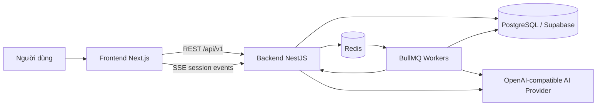

### 4.4.2 Các thành phần chính trong hệ thống

Frontend chịu trách nhiệm hiển thị màn hình, quản lý trạng thái tương tác và gọi API. Backend chịu trách nhiệm kiểm tra quyền truy cập, validate dữ liệu, quản lý phiên, lưu dữ liệu, điều phối job nền và chuẩn hóa lỗi trả về cho client. Redis được dùng cho BullMQ và kênh phát sự kiện. PostgreSQL lưu dữ liệu bền vững của người dùng, phiên phỏng vấn, câu hỏi, câu trả lời, feedback và báo cáo.

### 4.4.3 Cách giao tiếp giữa các thành phần

Các thao tác ngắn như lấy danh sách phiên, lưu JD, cập nhật hồ sơ và gửi câu trả lời được thực hiện qua REST API. Các tác vụ dài hơn như sinh câu hỏi, tạo feedback và tổng hợp báo cáo được chuyển sang hàng đợi nền.

Khi trạng thái thay đổi, backend phát sự kiện về kênh SSE của phiên. Frontend dùng sự kiện này để tải lại câu hỏi khi câu hỏi đã sẵn sàng, hiển thị tiến trình chấm câu trả lời hoặc mở báo cáo khi report đã hoàn thành. Nếu SSE không nhận được sự kiện, frontend vẫn có cơ chế polling để kiểm tra report, giúp luồng không phụ thuộc hoàn toàn vào một kênh cập nhật.

Trong môi trường phát triển local, hệ thống có thể bỏ qua xác thực thật bằng cấu hình dev để giảm thời gian demo. Tuy nhiên, backend vẫn giữ lớp guard ở các API cần bảo vệ. Điều này giúp luồng nghiệp vụ không phụ thuộc vào việc frontend gọi trực tiếp database hay tin tưởng dữ liệu từ trình duyệt.

## 4.5 Thiết Kế Theo Nhóm Tính Năng


### 4.5.1 Tài khoản và hồ sơ luyện tập

**a. Mục đích của tính năng**

Nhóm tính năng tài khoản và hồ sơ cung cấp dữ liệu nền cho quá trình luyện phỏng vấn. Người dùng có thể quản lý thông tin cá nhân, định hướng nghề nghiệp, kỹ năng, học vấn, kinh nghiệm, dự án, chứng chỉ và CV. Các thông tin này giúp hệ thống có ngữ cảnh ổn định hơn khi người dùng chuẩn bị phiên phỏng vấn.

Trong phạm vi GR1, hồ sơ không được thiết kế như một hệ thống tuyển dụng hoàn chỉnh. Vai trò chính của tính năng là giúp người dùng không phải nhập lại thông tin nền nhiều lần và tạo cơ sở dữ liệu cá nhân cho các bước cấu hình phiên sau đó.

**b. Dữ liệu đầu vào**

Dữ liệu đầu vào gồm thông tin tài khoản, thông tin hồ sơ nghề nghiệp, kỹ năng, học vấn, kinh nghiệm làm việc, dự án, chứng chỉ và CV nếu người dùng tải lên. Một số trường có thể được nhập thủ công, một số trường được lấy từ hồ sơ đã lưu trước đó.

Các dữ liệu này được lưu theo đúng người dùng hiện tại. Hệ thống không dùng hồ sơ của người dùng này cho phiên của người dùng khác. Đây là yêu cầu quan trọng vì hồ sơ có thể chứa thông tin cá nhân và định hướng nghề nghiệp riêng.

**c. Luồng xử lý nghiệp vụ**

Người dùng đăng nhập hoặc sử dụng phiên làm việc hợp lệ, sau đó mở khu vực hồ sơ. Frontend tải hồ sơ hiện có từ backend và hiển thị cho người dùng kiểm tra. Khi người dùng chỉnh sửa, frontend gửi dữ liệu cập nhật lên backend.

Backend kiểm tra quyền truy cập và cấu trúc dữ liệu trước khi ghi vào database. Nếu dữ liệu hợp lệ, hệ thống cập nhật hồ sơ và trả lại phiên bản mới cho frontend. Nếu người dùng chưa có hồ sơ mở rộng, backend tạo bản ghi mới thay vì yêu cầu người dùng thao tác thủ công.

Luồng nghiệp vụ có thể tóm tắt như sau:

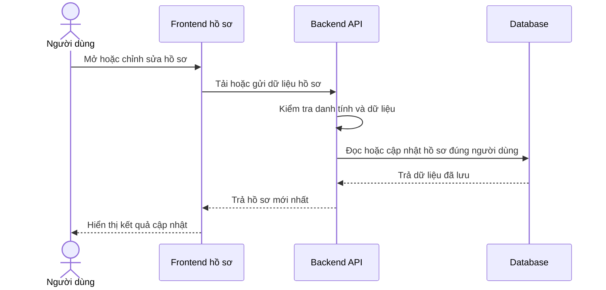

**d. Thiết kế giao diện frontend**

Giao diện hồ sơ cần thể hiện các nhóm thông tin theo thứ tự dễ kiểm tra: thông tin cá nhân, học vấn, chứng chỉ, kỹ năng, dự án, kinh nghiệm và tính cách. Mỗi nhóm nên có trạng thái chỉnh sửa rõ ràng để người dùng biết phần nào đã được lưu.

Khi tải dữ liệu, frontend hiển thị trạng thái đang tải thay vì để màn hình trống. Khi cập nhật thành công, giao diện phản hồi bằng trạng thái đã lưu. Nếu backend trả lỗi validation, thông báo lỗi cần nằm gần nhóm dữ liệu liên quan để người dùng sửa đúng vị trí.

**e. Thiết kế xử lý backend**

Backend chịu trách nhiệm xác định người dùng hiện tại, đọc hồ sơ theo mã người dùng và kiểm tra dữ liệu gửi lên. Các API hồ sơ không được tin hoàn toàn vào dữ liệu từ frontend. Những trường dạng danh sách hoặc cấu trúc lồng nhau cần được kiểm tra trước khi lưu để tránh làm hỏng dữ liệu hồ sơ.

Dữ liệu được lưu trong bảng người dùng và hồ sơ mở rộng, trong đó các nhóm CV có cấu trúc nằm trực tiếp trên `user_profiles`. Khi cập nhật, backend chỉ thay đổi dữ liệu thuộc về người dùng hiện tại. Kết quả trả về cho frontend là dữ liệu đã được chuẩn hóa sau khi lưu, không chỉ là bản sao của request.

**f. Xử lý lỗi và fallback**

Nếu người dùng chưa đăng nhập hoặc phiên làm việc không hợp lệ, backend trả lỗi quyền truy cập và frontend yêu cầu người dùng đăng nhập lại. Nếu dữ liệu không hợp lệ, backend trả lỗi validation để frontend hiển thị cho đúng nhóm trường cần sửa.

Nếu hồ sơ chưa tồn tại, hệ thống có thể tạo hồ sơ rỗng hoặc hiển thị trạng thái chưa hoàn thiện để người dùng bổ sung. Nếu CV hoặc dữ liệu phụ trợ không đọc được, phần hồ sơ còn lại vẫn được giữ nguyên; hệ thống không xóa dữ liệu đã có chỉ vì một phần cập nhật thất bại.

### 4.5.2 Job Description và cấu hình phiên

**a. Mục đích của tính năng**

Nhóm tính năng Job Description và cấu hình phiên chuyển mục tiêu luyện tập của người dùng thành một phiên phỏng vấn cụ thể. Người dùng có thể nhập JD mới, chỉnh sửa JD hoặc chọn lại JD đã lưu. Sau đó người dùng chọn loại phỏng vấn, context pack, ngôn ngữ và thời lượng hiển thị; frontend dùng thời lượng này để suy ra số lượng câu hỏi gửi lên backend.

Tính năng này là điểm nối giữa dữ liệu người dùng và pipeline sinh câu hỏi. Nếu JD hoặc cấu hình phiên không rõ ràng, câu hỏi sinh ra sẽ thiếu trọng tâm. Vì vậy hệ thống cần kiểm tra dữ liệu ở bước này trước khi tạo phiên.

Về vai trò trong AI Mock Interview, đây là bước biến một nhu cầu luyện tập còn rộng thành một cấu hình có thể xử lý được. Người dùng không chỉ nói rằng mình muốn luyện phỏng vấn, mà còn cung cấp vị trí ứng tuyển, bối cảnh văn hóa phỏng vấn, loại câu hỏi mong muốn và độ dài phiên. Các thông tin này quyết định cách hệ thống chọn rubric, chọn question bank, tạo prompt và trả kết quả bằng ngôn ngữ phù hợp.

**b. Dữ liệu đầu vào**

Dữ liệu đầu vào gồm tên công ty, vị trí ứng tuyển, cấp độ, yêu cầu công việc, mô tả công việc, kỹ năng hoặc tech stack, loại phỏng vấn, context pack, ngôn ngữ đầu ra và số lượng câu hỏi. Nếu người dùng chọn JD đã lưu, request có thêm mã JD để backend kiểm tra quyền sở hữu. Ở frontend, lựa chọn thời lượng được ánh xạ thành số lượng câu hỏi trước khi gửi request tạo phiên.

Các dữ liệu này được lưu vào `saved_job_descriptions` và `interview_sessions`. JD lưu trữ nội dung tuyển dụng, còn phiên phỏng vấn lưu cấu hình vận hành như loại phiên, context pack, số câu hỏi, ngôn ngữ và trạng thái phiên. Trường thời lượng trong session được backend dùng khi tính thời gian ước tính cho câu hỏi; ở luồng tạo phiên hiện tại, frontend gửi số câu hỏi đã suy ra từ lựa chọn thời lượng.

Đầu ra trực tiếp của tính năng không phải là danh sách câu hỏi. Kết quả trả về là một phiên phỏng vấn mới có mã phiên, trạng thái ban đầu là đang sinh câu hỏi và các thông tin cấu hình đã được lưu. Danh sách câu hỏi chỉ xuất hiện sau khi worker sinh câu hỏi xử lý xong job nền ở mục 4.5.3.

**c. Luồng xử lý nghiệp vụ**

Người dùng bắt đầu bằng việc nhập JD mới hoặc chọn JD đã lưu. Frontend cho phép người dùng xem lại nội dung quan trọng trước khi tạo phiên. Sau đó người dùng chọn loại phỏng vấn HR/Behavioral, Technical hoặc Mixed, chọn context pack Việt Nam hoặc Western và xác nhận cấu hình phiên.

Backend lưu hoặc cập nhật JD, sau đó tạo bản ghi phiên ở trạng thái chuẩn bị sinh câu hỏi. Request tạo phiên không chờ AI sinh xong toàn bộ câu hỏi. Backend chỉ trả mã phiên cho frontend, còn quá trình sinh câu hỏi được chuyển sang hàng đợi nền và được trình bày chi tiết ở mục 4.5.3.

Luồng nghiệp vụ chính gồm bốn bước. Thứ nhất, người dùng chuẩn bị JD và cấu hình phiên. Thứ hai, frontend chuẩn hóa JD thành văn bản đầy đủ để backend có thể kiểm tra độ dài và lưu snapshot. Thứ ba, backend tạo phiên và xếp job sinh câu hỏi. Thứ tư, frontend chuyển người dùng sang màn hình phỏng vấn, nơi phiên có thể đang ở trạng thái chờ cho đến khi câu hỏi sẵn sàng.

Sơ đồ dưới đây thể hiện ranh giới của tính năng cấu hình phiên: phần này dừng ở việc tạo phiên và xếp tác vụ sinh câu hỏi.

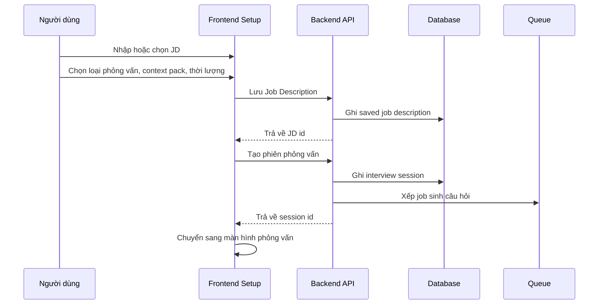

**d. Thiết kế giao diện frontend**

Frontend chia quá trình tạo phiên thành các bước rõ ràng: nhập hoặc chọn JD, cấu hình phiên, xác nhận và bắt đầu. Cách chia này giúp người dùng kiểm tra từng nhóm thông tin trước khi gửi request tạo phiên.

Giao diện cần thể hiện các trường bắt buộc, trạng thái đang lưu JD, trạng thái đang tạo phiên và lỗi validation nếu có. Nếu người dùng chọn JD đã lưu, giao diện cần hiển thị lại các thông tin chính như vị trí, công ty, cấp độ và yêu cầu để tránh tạo nhầm phiên.

Ở bước nhập JD, giao diện cho phép người dùng nhập vị trí, level, yêu cầu, nội dung công việc, tech stack và các thông tin tuyển dụng liên quan. Nếu người dùng đi từ thư viện JD, form được điền lại bằng JD đã chọn. Ở bước cấu hình, thời lượng phiên được ánh xạ thành số câu hỏi dự kiến: 30 phút tương ứng 15 câu, 60 phút tương ứng 30 câu và 90 phút tương ứng 45 câu. Ở bước xác nhận, giao diện hiển thị lại công ty, vị trí, level, tech stack, yêu cầu, nội dung công việc, context pack, thời lượng và số câu hỏi trước khi người dùng bắt đầu.

Khi gửi cấu hình, nút bắt đầu chuyển sang trạng thái loading để tránh gửi lặp. Nếu backend trả lỗi, thông báo được giữ trên màn hình xác nhận để người dùng quay lại sửa JD hoặc cấu hình. Nếu tạo phiên thành công, frontend điều hướng sang màn hình phiên phỏng vấn bằng mã phiên vừa nhận.

**e. Thiết kế xử lý backend**

Backend kiểm tra JD đủ dài, loại phiên hợp lệ, context pack tồn tại, số lượng câu hỏi nằm trong giới hạn và JD thuộc về đúng người dùng. Với JD mới, backend lưu nội dung vào bảng JD đã lưu. Với JD cũ, backend chỉ cho phép dùng nếu bản ghi đó thuộc người dùng hiện tại.

Sau khi dữ liệu hợp lệ, backend tạo bản ghi phiên phỏng vấn, gắn phiên với JD và cấu hình đã chọn. Backend đưa job sinh câu hỏi vào queue, kèm các thông tin cần thiết như mã phiên, loại phiên, context pack, ngôn ngữ, số lượng câu hỏi và dữ liệu JD. Kết quả trả về cho frontend là mã phiên và trạng thái ban đầu, không phải danh sách câu hỏi.

Ở lớp DTO, backend yêu cầu JD tối thiểu 100 ký tự, loại phiên chỉ thuộc `hr`, `technical` hoặc `mixed`, context pack chỉ thuộc `VN` hoặc `Western`, ngôn ngữ chỉ thuộc `vi` hoặc `en`, số câu hỏi nằm trong khoảng 3 đến 45 và mã JD đã lưu phải có dạng UUID nếu được gửi lên. Sau validation DTO, service còn kiểm tra giới hạn số phiên được tạo trong 24 giờ, bảo đảm context pack tồn tại và chuẩn hóa ngôn ngữ đầu ra.

Nếu request dùng JD đã lưu, backend tìm JD theo đồng thời mã JD, mã người dùng và điều kiện chưa bị xóa mềm. Nếu không tìm thấy, backend trả lỗi thay vì dùng dữ liệu không thuộc người dùng hiện tại. Khi JD hợp lệ, backend cập nhật thời điểm sử dụng gần nhất để thư viện JD phản ánh đúng lịch sử sử dụng.

Khi tạo phiên, backend ghi `jobDescription`, `jobTitle`, `sessionType`, `numQuestions`, `language`, `contextPackId`, `savedJobDescriptionId` nếu có và trạng thái `generating`. Sau đó backend xếp job `question-generation` với payload gồm mã phiên, loại phiên, JD dạng văn bản, danh sách vị trí mục tiêu, context pack, ngôn ngữ, tổng số câu hỏi và thời lượng đang lưu trên session. Job có cơ chế retry với backoff cố định để giảm rủi ro lỗi tạm thời ở hàng đợi hoặc worker.

**f. Xử lý lỗi và fallback**

Nếu JD thiếu nội dung quan trọng, số lượng câu hỏi không hợp lệ, context pack không tồn tại hoặc người dùng cố dùng JD không thuộc quyền sở hữu của mình, backend từ chối tạo phiên và trả lỗi rõ ràng. Frontend giữ người dùng ở màn hình cấu hình để chỉnh sửa.

Nếu phiên đã tạo nhưng job sinh câu hỏi chưa hoàn tất, frontend chuyển sang trạng thái chờ thay vì coi đây là lỗi. Nếu queue hoặc backend không thể nhận job, hệ thống không nên hiển thị phiên như đã sẵn sàng; phiên cần được đánh dấu trạng thái phù hợp để người dùng biết phải thử lại hoặc quay về cấu hình.

Trường hợp queue không nhận được job sau khi session đã được ghi, backend cập nhật phiên sang trạng thái lỗi và trả thông báo dịch vụ tạo câu hỏi tạm thời không khả dụng. Cách xử lý này tránh việc người dùng nhìn thấy một phiên đang chờ nhưng thực tế không có worker nào sẽ sinh câu hỏi cho phiên đó.

### 4.5.3 Sinh câu hỏi phỏng vấn

**a. Mục đích của tính năng**

Tính năng sinh câu hỏi phỏng vấn tạo danh sách câu hỏi cho từng phiên luyện tập dựa trên Job Description, loại phỏng vấn và cấu hình do người dùng chọn. Đây là bước chuẩn bị nội dung trước khi người dùng bắt đầu trả lời phỏng vấn. Nếu bước này không hoàn tất, phiên chưa thể chuyển sang trạng thái sẵn sàng.

Trong AI Mock Interview, câu hỏi không được tạo như một danh sách cố định cho mọi người dùng. Hệ thống kết hợp hai nguồn: AI sinh một phần câu hỏi theo ngữ cảnh của JD, còn phần còn lại lấy từ question bank đã được chuẩn bị sẵn. Cách thiết kế này giúp câu hỏi vẫn bám vào vị trí ứng tuyển nhưng không phụ thuộc hoàn toàn vào AI provider.

Sơ đồ dưới đây minh họa mục đích vận hành của tính năng ở mức tổng quan: từ cấu hình phiên của người dùng, hệ thống tạo danh sách câu hỏi hợp lệ và đưa phiên sang trạng thái có thể bắt đầu phỏng vấn.

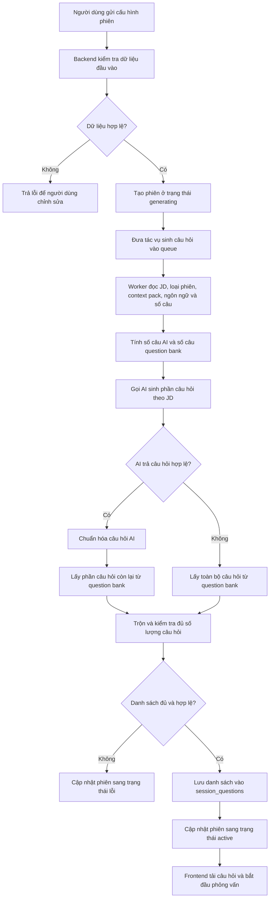

**b. Dữ liệu đầu vào**

Dữ liệu đầu vào chính là nội dung Job Description do người dùng nhập hoặc chọn từ JD đã lưu. Nội dung này cung cấp vị trí ứng tuyển, yêu cầu công việc, kỹ năng liên quan và bối cảnh để hệ thống tạo câu hỏi phù hợp hơn với mục tiêu luyện tập.

Người dùng cũng chọn loại phỏng vấn, gồm HR/Behavioral, Technical hoặc Mixed. Loại phỏng vấn quyết định trọng tâm câu hỏi: hành vi, kỹ thuật hoặc kết hợp cả hai. Ngoài ra, cấu hình phiên còn có số lượng câu hỏi, ngôn ngữ hiển thị, context pack Việt Nam hoặc Western và thời lượng đang lưu trên session để hệ thống ước tính thời gian cho từng câu.

Nếu người dùng đã có hồ sơ cá nhân hoặc hồ sơ nghề nghiệp trong hệ thống, dữ liệu này có thể được dùng làm ngữ cảnh bổ sung. Phần có căn cứ rõ trong luồng hiện tại vẫn là JD, loại phiên, ngôn ngữ, context pack, số lượng câu hỏi, thời lượng phiên, mã người dùng và mã JD đã lưu nếu có.

Đầu ra của tính năng là danh sách câu hỏi đã được lưu trong `session_questions`. Mỗi câu có nội dung câu hỏi, thứ tự trong phiên, loại câu hỏi, competency domain, thời lượng ước tính và liên kết đến question bank nếu câu đó lấy từ ngân hàng câu hỏi. Sau khi danh sách đủ số lượng, trạng thái phiên được chuyển sang sẵn sàng để frontend tải câu hỏi.

**c. Luồng xử lý nghiệp vụ**

Luồng bắt đầu khi người dùng hoàn tất cấu hình phiên và gửi yêu cầu tạo phiên phỏng vấn. Frontend gửi dữ liệu cấu hình lên backend. Backend tạo bản ghi phiên ở trạng thái đang sinh câu hỏi, sau đó đưa tác vụ sinh câu hỏi vào hàng đợi nền. Việc đưa vào hàng đợi giúp request tạo phiên trả về nhanh hơn, vì quá trình sinh câu hỏi có thể phải gọi AI, đọc question bank và ghi nhiều bản ghi vào database.

Khi worker xử lý tác vụ, hệ thống đọc thông tin phiên, JD, loại phỏng vấn, context pack, ngôn ngữ, thời lượng đang lưu trên session và số câu cần tạo. Với chiến lược hiện tại, hệ thống dùng mô hình hybrid: cứ khoảng 5 câu hỏi trong phiên thì có 1 câu do AI sinh, phần còn lại được lấy từ question bank. Ví dụ, phiên 15 câu sẽ có khoảng 3 câu AI và 12 câu từ question bank.

Sau khi có câu hỏi AI và câu hỏi từ question bank, backend chuẩn hóa metadata, kiểm tra số lượng, trộn câu hỏi theo thứ tự và lưu danh sách cuối cùng. Nếu danh sách hợp lệ và đủ số câu, phiên được chuyển sang trạng thái sẵn sàng. Frontend nhận trạng thái mới qua cơ chế cập nhật trạng thái và tải danh sách câu hỏi để bắt đầu phỏng vấn.

Sơ đồ tuần tự dưới đây thể hiện tương tác giữa frontend, backend, database, queue và AI service trong luồng nghiệp vụ. Sơ đồ nhấn mạnh rằng request tạo phiên không chờ toàn bộ quá trình AI hoàn tất; phần sinh câu hỏi được xử lý bất đồng bộ.

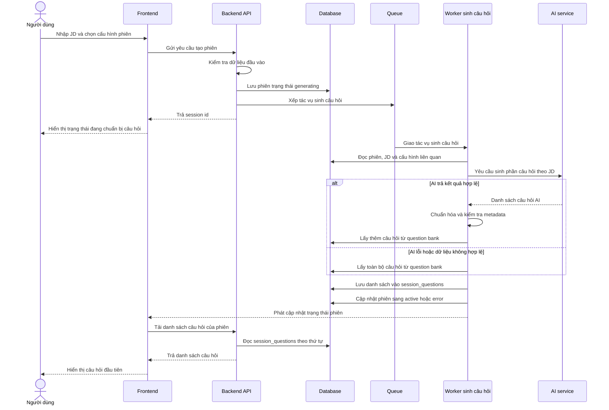

**d. Thiết kế giao diện frontend**

Ở phía frontend, tính năng này xuất hiện trong màn hình cấu hình phiên phỏng vấn. Người dùng nhập hoặc chọn Job Description, chọn loại phỏng vấn, chọn số lượng câu hỏi, thời lượng, ngôn ngữ và context pack. Giao diện cần hiển thị rõ các trường bắt buộc để người dùng biết dữ liệu nào ảnh hưởng trực tiếp đến danh sách câu hỏi.

Khi người dùng gửi yêu cầu tạo phiên, giao diện chuyển sang trạng thái đang xử lý. Trạng thái này thể hiện rằng hệ thống đã nhận cấu hình và đang chuẩn bị câu hỏi. Trong thời gian chờ, frontend không cần hiển thị từng bước xử lý nội bộ, nhưng cần cho người dùng biết phiên chưa sẵn sàng để trả lời.

Nếu backend trả lỗi do dữ liệu đầu vào không hợp lệ, giao diện hiển thị thông báo lỗi gần khu vực cấu hình để người dùng sửa lại. Nếu phiên đã được tạo nhưng câu hỏi chưa sẵn sàng, màn hình phỏng vấn hiển thị trạng thái chờ và tiếp tục theo dõi trạng thái phiên. Khi phiên chuyển sang trạng thái sẵn sàng, frontend tải danh sách câu hỏi và hiển thị câu hỏi đầu tiên theo thứ tự.

Frontend theo dõi trạng thái sinh câu hỏi qua API trạng thái phiên và sự kiện trạng thái phiên. Khi nhận trạng thái `active`, frontend đọc danh sách câu hỏi theo thứ tự. Khi nhận trạng thái lỗi, giao diện dừng chờ và thông báo rằng phiên không thể bắt đầu ở trạng thái hiện tại.

**e. Thiết kế xử lý backend**

Backend chịu trách nhiệm kiểm tra dữ liệu đầu vào trước khi tạo phiên. Các thông tin như loại phỏng vấn, số lượng câu hỏi, JD, ngôn ngữ và context pack phải hợp lệ. Nếu dữ liệu không đạt yêu cầu, backend trả lỗi để frontend yêu cầu người dùng điều chỉnh.

Khi dữ liệu hợp lệ, backend tạo phiên trong database và đưa tác vụ sinh câu hỏi vào queue. Tác vụ nền đọc lại thông tin phiên, JD, loại phỏng vấn, context pack, ngôn ngữ đầu ra, tổng số câu hỏi và thời lượng phiên. Đây là các dữ liệu quyết định cách chọn chiến lược sinh câu hỏi, cách tạo prompt, cách lọc question bank và cách lưu danh sách câu hỏi cuối cùng.

Chiến lược hiện tại là hybrid. Backend không yêu cầu AI sinh toàn bộ câu hỏi; cứ khoảng 5 câu trong phiên thì có 1 câu do AI sinh, phần còn lại lấy từ question bank. Số câu AI được tính bằng cách làm tròn tổng số câu chia cho 5. Cách này giữ được phần cá nhân hóa theo JD nhưng vẫn giảm rủi ro khi AI chậm, hết quota hoặc trả dữ liệu không đúng định dạng.

| Tổng số câu trong phiên | Số câu AI sinh | Số câu lấy từ question bank |
| --- | --- | --- |
| 15 câu | 3 câu | 12 câu |
| 30 câu | 6 câu | 24 câu |
| 45 câu | 9 câu | 36 câu |

Backend có ba chiến lược sinh câu hỏi tương ứng với ba loại phiên. Việc tách chiến lược giúp prompt không bị chung chung và giúp câu hỏi đi đúng mục tiêu luyện tập của phiên.

| Loại phiên | Trọng tâm sinh câu hỏi |
| --- | --- |
| HR/Behavioral | Tập trung vào động lực, giao tiếp, làm việc nhóm, tự nhận thức, văn hóa và ví dụ theo STAR. |
| Technical | Tập trung vào kiến thức kỹ thuật, cách áp dụng thực tế, trade-off, debug, thiết kế hệ thống và chất lượng code. |
| Mixed | Kết hợp câu hỏi hành vi và kỹ thuật, giúp phiên gần với buổi phỏng vấn tổng hợp hơn. |

Với phiên Technical, backend tránh sinh quá nhiều câu hỏi hành vi vì mục tiêu chính là kiểm tra năng lực chuyên môn. Với phiên HR/Behavioral, backend không đẩy câu hỏi theo hướng trivia kỹ thuật. Với phiên Mixed, hệ thống cho phép cả hai nhóm câu hỏi nhưng mỗi câu vẫn phải gắn với một competency domain cụ thể để các bước đánh giá phía sau có tiêu chí rõ ràng.

Prompt sinh câu hỏi được tạo theo hai lớp. Lớp thứ nhất là phần hướng dẫn nền, trong đó quy định vai trò của AI, nhiệm vụ sinh câu hỏi, ràng buộc số lượng, format JSON, loại câu hỏi, competency domain và độ khó. Lớp thứ hai là dữ liệu động của phiên, gồm JD, loại phiên, vai trò mục tiêu và số câu AI cần sinh. Trong thực tế, nếu người dùng tạo phiên 15 câu, backend chỉ yêu cầu AI sinh 3 câu vì phần còn lại đến từ question bank. Vì vậy số câu trong prompt AI là số câu AI cần sinh, không phải tổng số câu của phiên.

| Thành phần trong prompt | Vai trò |
| --- | --- |
| Vai trò AI | Yêu cầu AI đóng vai người phỏng vấn có kinh nghiệm. |
| Nhiệm vụ | Sinh câu hỏi phù hợp với JD và chiến lược phỏng vấn. |
| Ràng buộc số lượng | Phải sinh đúng số câu được backend yêu cầu cho phần AI. |
| Ràng buộc format | Chỉ trả về một JSON object gọn, không markdown, không giải thích thêm. |
| Cấu trúc JSON | Mỗi câu hỏi có nội dung câu hỏi, loại câu hỏi, competency domain và độ khó. |
| Ràng buộc metadata | Loại câu hỏi chỉ thuộc nhóm hành vi hoặc kỹ thuật; competency domain phải thuộc bộ rubric hợp lệ của phiên. |

Sau phần luật nền, backend gắn thêm chiến lược theo loại phiên, context pack và danh sách mã rubric được phép dùng. Dữ liệu động được đưa vào prompt theo các khối rõ ràng như nội dung JD, loại phiên, vai trò mục tiêu và số câu cần AI sinh. Cách tổ chức này giúp AI tập trung vào đúng dữ liệu của phiên hiện tại, đồng thời giúp backend dễ kiểm tra kết quả trả về.

```text
<job_description>
...nội dung JD người dùng nhập...
</job_description>

<session_type>technical</session_type>

<target_roles>
Backend Developer
</target_roles>

<num_questions>3</num_questions>
```

Sau khi AI trả kết quả, backend không lưu ngay. Kết quả phải đi qua các bước parse JSON, kiểm tra schema, chuẩn hóa loại câu hỏi, chuẩn hóa competency domain theo context pack và loại phiên, loại bỏ câu hỏi có domain không thuộc phiên hiện tại, chuẩn hóa độ khó về mức 1, 2 hoặc 3 và tính thời lượng ước tính cho từng câu. Nếu AI trả về tên tiêu chí thay vì mã tiêu chí, backend có cơ chế khớp theo mã gốc, mã đã chuẩn hóa, mã được trích ra từ chuỗi hoặc tên tiêu chí đã chuẩn hóa. Nếu vẫn không khớp, câu hỏi đó bị loại bỏ.

AI service được gọi với yêu cầu trả về JSON object. Backend parse JSON, validate bằng schema câu hỏi và chỉ lấy tối đa đúng số câu AI cần sinh. Các trường AI trả về được xem là dữ liệu chưa tin cậy. Vì vậy hệ thống không lưu trực tiếp `category`, danh sách mã tiêu chí hoặc `difficulty` nếu chúng không khớp với context pack và loại phiên hiện tại.

Đối với phần question bank, backend lọc câu hỏi theo loại phiên, context pack và ngôn ngữ. Với phiên Mixed, hệ thống chia tương đối giữa câu hỏi HR và Technical. Backend không lấy đúng bằng số lượng cần ngay từ đầu mà lấy một tập ứng viên lớn hơn, khoảng gấp 3 lần số câu cần lấy, rồi chọn theo phân bố độ khó. Logic hiện tại ưu tiên khoảng 30% câu dễ, 50% câu trung bình và 20% câu khó; nếu nhóm nào không đủ, hệ thống lấy thêm từ các câu còn lại để đạt đủ số lượng.

Question bank chỉ lấy các câu chưa bị xóa mềm và thuộc context pack của phiên. Với ngôn ngữ đầu ra, backend ưu tiên bản dịch theo ngôn ngữ của phiên nếu có; nếu không có bản dịch phù hợp, hệ thống dùng nội dung gốc của câu hỏi. Mỗi câu question bank trả về đã có mã câu hỏi gốc, nội dung, nhóm câu hỏi, danh sách mã tiêu chí lấy từ `question_bank_criteria` và thời lượng ước tính.

Sau khi có câu hỏi AI và câu hỏi từ question bank, backend trộn chúng thành danh sách cuối cùng. Câu hỏi AI không bị dồn vào đầu phiên mà được đặt cách quãng, ví dụ ở các vị trí khoảng 5, 10, 15 nếu phiên đủ dài. Các vị trí còn lại lấy từ question bank. Mỗi câu hỏi cuối cùng được lưu với mã phiên, mã câu hỏi gốc nếu có, nội dung câu hỏi, thứ tự, loại câu hỏi và thời lượng ước tính; các tiêu chí đánh giá được lưu riêng trong `session_question_criteria` bằng mã tiêu chí thuộc `rubric_version_id` đã khóa của phiên.

Thuật toán sinh câu hỏi được đặt ở backend vì đây là bước cần kiểm soát chặt dữ liệu đầu vào, trạng thái phiên, context pack, question bank và khả năng fallback khi AI không ổn định. Frontend chỉ gửi cấu hình phiên; backend mới là nơi quyết định câu hỏi nào được tạo, câu hỏi nào được lấy từ ngân hàng câu hỏi và khi nào phiên được chuyển sang trạng thái sẵn sàng.

Khi lưu danh sách cuối cùng, backend dùng thao tác ghi nhiều bản ghi vào `session_questions` và bỏ qua bản ghi trùng nếu job bị retry. Sau khi ghi đủ số câu, backend chuyển phiên sang `active` và phát sự kiện trạng thái. Nếu ghi không đủ số câu hoặc cả AI và question bank đều không cung cấp được dữ liệu hợp lệ, phiên được chuyển sang `error`.

```text
Input: sessionId, sessionType, jobDescription, targetRoles, contextPack, language, totalQuestions, durationMin
1. Tính số câu AI cần sinh = làm tròn(totalQuestions / 5).
2. Lấy cấu hình context pack và chiến lược theo sessionType.
3. Gọi AI để sinh số câu đã tính.
4. Nếu AI lỗi:
   4.1. Lấy totalQuestions câu từ question bank.
   4.2. Lưu câu hỏi vào session_questions.
   4.3. Chuyển session sang active và phát cập nhật trạng thái.
   4.4. Kết thúc.
5. Nếu AI thành công:
   5.1. Parse JSON và validate schema.
   5.2. Chuẩn hóa category, competency domain, difficulty và estimated time.
   5.3. Loại bỏ câu hỏi có metadata không hợp lệ.
6. Tính số câu còn lại cần lấy từ question bank.
7. Lấy câu hỏi question bank theo sessionType, contextPack, language và độ khó.
8. Trộn câu hỏi AI và question bank theo thứ tự.
9. Nếu tổng số câu không đủ, đánh dấu session lỗi.
10. Nếu đủ, lưu vào session_questions.
11. Chuyển session sang active.
12. Phát sự kiện trạng thái để frontend bắt đầu phỏng vấn.
```

**f. Xử lý lỗi và fallback**

Các lỗi đầu vào được xử lý ngay ở bước tạo phiên. Nếu JD trống, loại phiên không hợp lệ, số lượng câu hỏi vượt phạm vi cho phép hoặc thiếu dữ liệu bắt buộc, backend không tạo phiên hợp lệ và trả lỗi cho frontend.

Khi AI provider lỗi, hết quota, timeout hoặc trả dữ liệu không đúng cấu trúc, backend không lưu kết quả AI chưa hợp lệ. Hệ thống chuyển sang lấy toàn bộ số câu cần thiết từ question bank nếu nguồn dữ liệu này đáp ứng đủ. Đây là fallback quan trọng để người dùng vẫn có thể bắt đầu phiên ngay cả khi AI không khả dụng.

Nếu question bank không đủ câu hỏi phù hợp với loại phiên, context pack hoặc ngôn ngữ, hệ thống cố gắng bù từ các câu còn lại trong phạm vi hợp lệ. Nếu sau bước bù vẫn không đủ số câu tối thiểu để tạo phiên, backend chuyển phiên sang trạng thái lỗi để frontend thông báo cho người dùng thay vì bắt đầu một phiên thiếu dữ liệu.

Nếu AI sinh được một phần câu hỏi nhưng question bank không đủ phần còn lại, backend không bắt đầu phiên với danh sách thiếu. Nếu phát sự kiện SSE thất bại sau khi database đã lưu đủ câu hỏi và phiên đã active, lỗi phát sự kiện chỉ được ghi log; dữ liệu phiên vẫn được giữ vì frontend còn có thể đọc lại trạng thái qua API hoặc polling.
 
### 4.5.4 Thực hiện phiên và lưu câu trả lời

**a. Mục đích của tính năng**

Tính năng thực hiện phiên cho phép người dùng làm việc với danh sách câu hỏi đã được tạo ở bước trước. Người dùng mở phiên, xem từng câu hỏi, gửi câu trả lời, có thể bỏ qua câu hỏi và cuối cùng chuyển phiên sang giai đoạn tổng hợp báo cáo. Trường hợp hết thời gian phiên cũng được xử lý như một nhánh hoàn tất đặc biệt: các câu chưa được submit sẽ tự động được ghi nhận là bỏ qua trước khi tạo báo cáo.

Trọng tâm của tính năng này không phải là chấm điểm ngay trong request gửi câu trả lời. Backend chỉ cần ghi nhận dữ liệu trả lời đúng phiên, đúng câu hỏi, đúng người dùng và đưa các tác vụ nặng như feedback và report sang hàng đợi xử lý nền. Cách thiết kế này giúp request trả lời nhanh hơn, đồng thời hạn chế lỗi mất dữ liệu khi AI hoặc queue xử lý chậm.

Ba yêu cầu quan trọng của chức năng là:

| Yêu cầu | Ý nghĩa |
| --- | --- |
| Đúng chủ sở hữu | Người dùng chỉ được gửi câu trả lời cho phiên của chính mình. |
| Đúng câu hỏi | Câu trả lời chỉ được ghi nếu `questionId` thuộc về `sessionId` đang xử lý. |
| Không ghi trùng | Mỗi cặp phiên - câu hỏi chỉ có một bản ghi trong `user_answers`. |

Sơ đồ tổng quát:

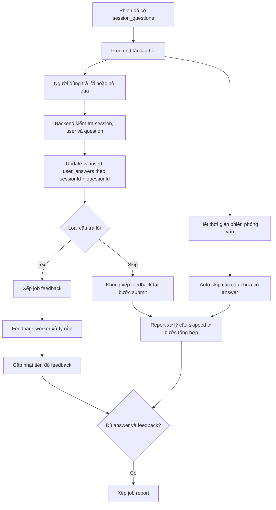

**b. Dữ liệu đầu vào và đầu ra**

Frontend gọi các endpoint chính sau trong quá trình thực hiện phiên:

| Endpoint | Mục đích |
| --- | --- |
| `GET /sessions/:id/status` | Kiểm tra trạng thái phiên và số câu hỏi. |
| `GET /sessions/:id/questions` | Lấy danh sách câu hỏi, trạng thái đã trả lời và vị trí câu hiện tại. |
| `POST /sessions/:sessionId/turns` | Gửi câu trả lời dạng văn bản hoặc ghi nhận bỏ qua câu hỏi. |
| `PATCH /sessions/:id/status` | Chuyển trạng thái phiên, ví dụ pause, active, canceled hoặc completed. |
| `GET /sessions/:id/feedback-progress` | Theo dõi số feedback đã hoàn tất trong lúc chờ báo cáo. |
| `GET /sessions/:id/events` | Nhận sự kiện SSE như `turn.feedback_ready`, `session.feedback_progress`, `report.ready`. |

Payload gửi câu trả lời gồm các trường chính:

| Trường | Vai trò |
| --- | --- |
| `questionId` | Xác định câu hỏi trong `session_questions`. |
| `answerMode` | Ở phạm vi hiện tại, luồng được mô tả sử dụng chế độ `text`. |
| `answerText` | Nội dung câu trả lời văn bản. Nếu không phải skip, trường này phải đủ tối thiểu 10 ký tự. |
| `skipQuestion` | Đánh dấu người dùng bỏ qua câu hỏi. Khi có cờ này, backend cho phép không có `answerText`. |

Payload chuyển trạng thái phiên dùng trong bước hoàn tất:

| Trường | Vai trò |
| --- | --- |
| `status` | Trạng thái đích. Khi hoàn tất phiên, frontend gửi `completed`. |
| `remainingSeconds` | Số giây còn lại tại thời điểm chuyển trạng thái. Khi hết giờ, giá trị này là `0`. |
| `autoSkipUnanswered` | Cờ chỉ dùng cho nhánh hết giờ. Khi bằng `true`, backend tự tạo skipped answer cho các câu chưa có answer. |

Kết quả trả về từ `POST /sessions/:sessionId/turns` gồm:

| Trường trả về | Ý nghĩa |
| --- | --- |
| `answerId` | Mã bản ghi trong `user_answers`. |
| `feedbackQueued` | Cho biết feedback đã được xếp hàng hay chưa. |

Các bảng dữ liệu liên quan:

| Bảng | Vai trò trong bước này |
| --- | --- |
| `interview_sessions` | Lưu chủ sở hữu, loại phiên, ngôn ngữ, context pack và trạng thái phiên. |
| `session_questions` | Lưu danh sách câu hỏi đã khóa cho phiên. |
| `session_question_criteria` | Lưu các tiêu chí rubric gắn với từng câu hỏi để feedback dùng lại. |
| `user_answers` | Lưu câu trả lời văn bản, trạng thái skip và cờ `feedback_generated`. |
| `ai_feedbacks` | Được worker feedback tạo sau, không được tạo trực tiếp trong request submit. |

**c. Luồng xử lý nghiệp vụ**

Khi người dùng mở màn hình phỏng vấn, frontend đọc trạng thái phiên và danh sách câu hỏi. Backend trả danh sách câu hỏi theo `orderIndex`, kèm thông tin câu nào đã có answer. Nếu phiên đã có câu hỏi nhưng vẫn còn trạng thái `generating` hoặc `ready`, backend tự chuyển phiên sang `active`. Cách này giúp phiên cũ hoặc phiên vừa sinh xong không bị kẹt ở trạng thái chờ.

Backend cũng tính `currentIndex` bằng cách tìm câu đầu tiên chưa có answer. Nếu tất cả câu hỏi đều đã có answer, `currentIndex` trỏ về câu cuối. Nhờ đó khi người dùng reload trang hoặc quay lại phiên, frontend có thể mở đúng vị trí tiếp tục thay vì luôn quay về câu đầu.

Luồng gửi một câu trả lời:

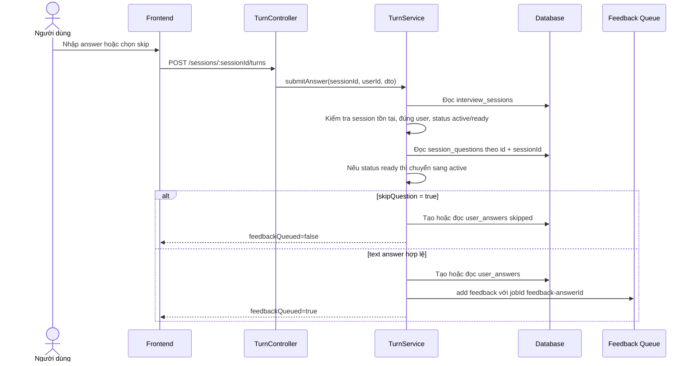

Sau khi tất cả câu hỏi đã có answer, frontend gửi yêu cầu chuyển trạng thái phiên sang `completed`. Trong backend, request này không đặt thẳng phiên thành `completed`. `SessionService` kiểm tra số câu hỏi và số answer; nếu đủ, phiên được chuyển sang `completing`. Sau đó `ReportService` chỉ xếp job report khi mọi feedback bắt buộc đã xong. Worker tổng hợp báo cáo mới là nơi chuyển phiên sang `completed`.

Riêng trường hợp timer của phiên về `00:00`, frontend gửi cùng endpoint chuyển trạng thái nhưng kèm `autoSkipUnanswered = true` và `remainingSeconds = 0`. Backend khi đó không trả `SESSION_INCOMPLETE` cho các câu chưa submit. Thay vào đó, service chạy transaction để đọc danh sách `session_questions`, đối chiếu với `user_answers`, tạo các answer rỗng có `skipped = true` cho câu còn thiếu, đặt phiên sang `completing`, rồi kiểm tra điều kiện xếp job report. Các câu đã submit trước đó được giữ nguyên và không bị ghi đè.

Luồng hoàn tất phiên:

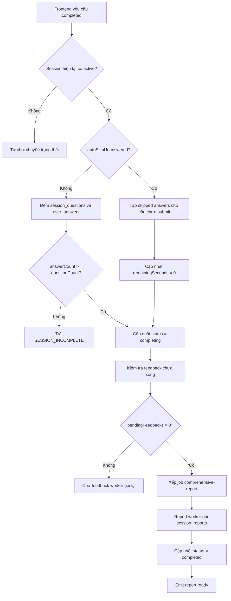

**d. Thiết kế giao diện frontend**

Giao diện phiên cần hiển thị một câu hỏi tại một thời điểm, vị trí hiện tại, tổng số câu, thời gian còn lại và vùng nhập câu trả lời. Khi người dùng gửi câu trả lời thành công, frontend chuyển sang câu tiếp theo dựa trên danh sách đã tải từ backend.

Frontend không tự quyết định câu hỏi nào đã hoàn thành chỉ bằng trạng thái local. Khi tải lại phiên, frontend dựa vào `GET /sessions/:id/questions`, vì backend trả sẵn `answered`, `answerId`, `skipped` và `currentIndex`. Đây là điểm quan trọng để tránh mất tiến độ khi reload trang hoặc khi người dùng tạm dừng rồi quay lại.

Với câu trả lời văn bản, giao diện gửi trực tiếp `answerText`. Nếu người dùng chọn bỏ qua, giao diện gửi `skipQuestion = true` để backend ghi nhận câu hỏi đã được xử lý nhưng không xếp feedback cho câu đó. Nếu countdown hết thời gian, giao diện khóa thao tác nhập, gửi yêu cầu hoàn tất với `autoSkipUnanswered = true`, hiển thị trạng thái đang hoàn tất phiên và chuyển người dùng sang màn hình chờ báo cáo.

Khi phiên được chuyển sang `completing`, giao diện không nên coi báo cáo đã sẵn sàng ngay. Người dùng cần được đưa sang trạng thái chờ báo cáo, theo dõi `feedback-progress` hoặc SSE. Khi nhận `report.ready`, frontend mới mở báo cáo hoàn chỉnh.

**e. Thiết kế xử lý backend**

Backend được thiết kế theo hướng kiểm tra trước, ghi nhận dữ liệu sau và xử lý các tác vụ nặng ở nền. Khi nhận một câu trả lời, hệ thống không tin hoàn toàn vào dữ liệu từ giao diện. Backend luôn kiểm tra phiên có tồn tại không, người gửi có đúng là chủ phiên không, phiên có đang ở trạng thái cho phép trả lời không và câu hỏi có thật sự thuộc phiên đó không. Nếu một trong các điều kiện này không hợp lệ, hệ thống từ chối yêu cầu và không ghi câu trả lời vào cơ sở dữ liệu.

Khi dữ liệu hợp lệ, backend ghi nhận kết quả xử lý của câu hỏi theo ba trường hợp chính:

| Trường hợp | Cách xử lý |
| --- | --- |
| Người dùng gửi câu trả lời | Hệ thống lưu nội dung câu trả lời, đánh dấu câu này cần được chấm và đưa việc chấm điểm vào hàng đợi nền. |
| Người dùng chọn bỏ qua | Hệ thống vẫn tạo một bản ghi cho câu hỏi, nhưng đánh dấu là câu bị bỏ qua và không đưa câu đó vào hàng đợi chấm điểm riêng lẻ. |
| Phiên hết thời gian | Hệ thống tự tìm các câu chưa có câu trả lời, ghi nhận chúng là câu bị bỏ qua, đặt thời gian còn lại bằng 0 và chuyển phiên sang bước tổng hợp báo cáo. |

Một nguyên tắc quan trọng là mỗi câu hỏi trong một phiên chỉ có một kết quả cuối cùng. Vì vậy, nếu người dùng bấm gửi nhiều lần, trình duyệt gửi lại yêu cầu do lỗi mạng, hoặc phiên hết giờ gần lúc người dùng đang gửi câu trả lời, backend vẫn không tạo nhiều câu trả lời cho cùng một câu hỏi. Câu nào đã được lưu bằng câu trả lời thật sẽ được giữ nguyên. Chỉ những câu chưa có dữ liệu tại thời điểm hết giờ mới được tự động đánh dấu bỏ qua.

Sau khi lưu câu trả lời thật, backend không chấm điểm ngay trong yêu cầu của người dùng. Thay vào đó, hệ thống đưa tác vụ chấm điểm vào hàng đợi để bộ xử lý nền thực hiện sau. Bộ xử lý này đọc lại câu hỏi, tiêu chí chấm điểm và nội dung câu trả lời từ cơ sở dữ liệu, sau đó gọi AI để tạo nhận xét, điểm số và các đoạn phân tích. Cách làm này giúp dữ liệu dùng để chấm luôn đến từ backend, không phụ thuộc vào thông tin do giao diện tự gửi lên.

Khi một câu trả lời đã được chấm xong, backend cập nhật trạng thái xử lý của câu đó và phát sự kiện tiến trình cho giao diện. Nếu phiên đã chuyển sang giai đoạn tổng hợp báo cáo, backend kiểm tra xem còn câu trả lời nào đang chờ chấm hay không. Báo cáo chỉ được xếp hàng tạo khi phiên đã ở trạng thái tổng hợp, có dữ liệu câu trả lời và mọi câu cần chấm đã được xử lý xong. Các câu bị bỏ qua không làm báo cáo bị kẹt vì chúng không cần chấm riêng ở bước này.

Trong bước tạo báo cáo, các câu bị bỏ qua vẫn được giữ lại trong nội dung xem lại và phần tổng hợp kết quả. Hệ thống tạo dữ liệu đánh giá tổng hợp cho những câu này với điểm `0/100` theo tiêu chí của câu hỏi. Nhờ đó báo cáo thể hiện đầy đủ toàn bộ phiên phỏng vấn, bao gồm cả câu người dùng tự bỏ qua và câu bị tự động bỏ qua khi hết thời gian.

**f. Xử lý lỗi và fallback**

Các lỗi nghiệp vụ được chặn trước khi ghi dữ liệu. Nếu phiên không tồn tại, không thuộc người dùng hiện tại, chưa ở trạng thái cho phép hoặc câu hỏi không thuộc phiên, backend trả lỗi và không tạo `user_answers`. Đây là lớp bảo vệ tính toàn vẹn dữ liệu quan trọng nhất.

Nếu người dùng gửi lặp cùng một câu hỏi do double click hoặc retry mạng, unique constraint `(session_id, question_id)` bảo vệ ở tầng database. Backend cũng dùng `jobId` ổn định cho queue: `feedback-{answerId}` và `report-{sessionId}`. Nhờ đó retry không dễ tạo nhiều job trùng nghĩa.

Nếu queue feedback lỗi ngay sau khi answer đã được lưu, request có thể thất bại. Khi frontend gửi lại, backend đọc lại answer cũ và có thể xếp lại job theo cùng `answerId`. Cách này ưu tiên không mất dữ liệu người dùng trước, sau đó khôi phục xử lý nền bằng retry.

Nếu feedback AI lỗi, worker có cơ chế retry. Ở lần xử lý cuối hoặc khi lỗi đủ điều kiện fallback, backend ghi feedback fallback và vẫn đánh dấu `feedbackGenerated = true`. Nhờ đó phiên có thể tiếp tục đi tới report thay vì bị kẹt vì một câu trả lời không chấm được bằng AI.

Nếu người dùng yêu cầu hoàn tất thủ công khi chưa trả lời đủ số câu hỏi, backend trả `SESSION_INCOMPLETE` và giữ session ở `active`. Đây là nhánh bảo vệ để người dùng không vô tình tạo báo cáo thiếu dữ liệu. Ngược lại, nếu phiên hết thời gian và request có `autoSkipUnanswered = true`, backend xem đây là ngoại lệ hợp lệ của nghiệp vụ: các câu chưa submit được tự động ghi thành skipped answer, `remainingSeconds` được đặt về `0`, phiên chuyển sang `completing` và report pipeline tiếp tục chạy.

Nếu submit câu trả lời và timeout xảy ra gần như đồng thời, unique constraint trên `(session_id, question_id)` quyết định tính nhất quán dữ liệu. Câu trả lời nào đã được ghi trước sẽ được giữ làm answer thật; câu nào chưa có answer tại thời điểm xử lý timeout sẽ được tạo skipped answer. Nếu request submit đến sau khi câu đã bị auto-skip, backend trả lại answer skipped hiện có và không xếp feedback cho câu rỗng.

Nếu session đã ở `completing`, request hoàn tất lặp lại không tạo trạng thái mới mà chỉ kiểm tra lại điều kiện xếp report. Nếu session đã `completed`, backend trả lại session hiện tại.

Tóm lại, thiết kế hiện tại tách rõ ba việc: request submit chỉ lưu answer và xếp queue feedback khi cần; worker feedback xử lý tác vụ AI; report worker chỉ chạy khi phiên đã hoàn tất và feedback đã đủ. Cách tách này làm luồng xử lý dễ kiểm soát hơn, đồng thời giúp hệ thống phục hồi tốt hơn khi có retry hoặc lỗi tạm thời.

## 4.5.5 Đánh giá và phản hồi từng câu trả lời

**a. Mục đích của tính năng**

Nhóm tính năng đánh giá và phản hồi từng câu trả lời biến dữ liệu trả lời của người dùng thành nhận xét có thể hành động. Mỗi câu trả lời được chấm theo rubric phù hợp với loại phiên và một hoặc nhiều tiêu chí đã gắn với câu hỏi. Kết quả gồm điểm, nhận xét chính, câu trả lời mẫu và các đoạn trích được đánh dấu trong câu trả lời gốc.

Tính năng này phục vụ hai mục tiêu. Thứ nhất, người dùng nhận được phản hồi sau từng turn hoặc trong báo cáo. Thứ hai, hệ thống có dữ liệu chuẩn để tổng hợp báo cáo phiên ở mục 4.5.6.

Đây là nhóm tính năng quan trọng vì AI Mock Interview không chỉ hỏi câu hỏi mà còn phải giúp người dùng hiểu câu trả lời của mình tốt ở đâu và thiếu ở đâu. Nếu feedback không được kiểm soát bằng rubric, hệ thống dễ đưa ra nhận xét chung chung hoặc điểm số không nhất quán giữa các phiên.

Sơ đồ sau thể hiện mục đích của tính năng: chuyển answer đã lưu thành feedback có kiểm soát bằng rubric, đồng thời tạo tín hiệu để frontend và report biết câu trả lời đã được xử lý.

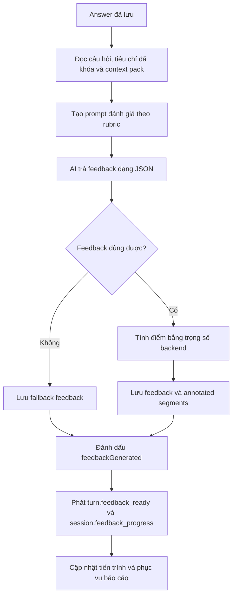

**b. Dữ liệu đầu vào**

Dữ liệu đầu vào gồm mã phiên, mã câu hỏi, câu trả lời đã lưu trong `user_answers`, loại phiên, context pack, ngôn ngữ đầu ra và danh sách tiêu chí đã được khóa theo từng câu hỏi trong `session_question_criteria`. Backend không lấy tiêu chí chấm điểm từ frontend. Frontend chỉ gửi câu trả lời; backend tự đọc lại câu hỏi, câu trả lời, loại phiên và các tiêu chí của câu hỏi để bảo đảm feedback được chấm theo dữ liệu đã kiểm soát.

Output mong đợi từ AI gồm danh sách tiêu chí được áp dụng, điểm theo từng tiêu chí, câu trả lời mẫu, nhận xét chính và tối đa hai đoạn nhận xét cụ thể từ câu trả lời gốc. Các đoạn nhận xét phải trích đúng nội dung trong câu trả lời của ứng viên; nếu vị trí ký tự AI trả về chưa chính xác, backend cố gắng xác định lại vị trí dựa trên đoạn trích, còn đoạn nào không khớp thì bị loại bỏ. Backend lưu kết quả hợp lệ vào `ai_feedbacks` và lưu các đoạn nhận xét chi tiết để phục vụ màn hình báo cáo.

Đầu ra cuối cùng của backend gồm feedback đã lưu, trạng thái `feedbackGenerated` trên answer, sự kiện `turn.feedback_ready`, sự kiện cập nhật tiến trình feedback và dữ liệu để báo cáo tổng hợp sử dụng. Nếu phiên đang chờ tạo báo cáo, việc một feedback hoàn tất sẽ kích hoạt bước kiểm tra xem đã đủ điều kiện xếp job report hay chưa.

**c. Luồng xử lý nghiệp vụ**

Trước khi một câu trả lời được đưa vào luồng feedback, backend kiểm tra phiên có tồn tại, thuộc đúng người dùng, đang ở trạng thái cho phép trả lời và câu hỏi thật sự thuộc phiên đó. Nếu phiên mới ở trạng thái sẵn sàng, backend chuyển phiên sang trạng thái đang thực hiện trước khi lưu câu trả lời. Bước này giúp dữ liệu feedback luôn gắn với một phiên hợp lệ, đúng chủ sở hữu và đúng câu hỏi.

Với câu trả lời bị bỏ qua, backend chỉ ghi nhận trạng thái bỏ qua và không xếp job feedback ở bước submit. Với câu trả lời văn bản, backend lưu nội dung đã chuẩn hóa rồi xếp job feedback. Vì phạm vi hiện tại của tài liệu chỉ mô tả luồng trả lời văn bản đã ổn định, các luồng thử nghiệm hoặc chưa hoàn thiện khác chưa được đưa vào phần này.

Sau khi một câu trả lời cần chấm được lưu, backend xếp job feedback với mã job ổn định theo answer. Worker feedback đọc lại câu hỏi, câu trả lời, tiêu chí đã khóa và cấu hình phiên. Sau đó worker tạo prompt đánh giá, gọi AI service, parse JSON trả về, kiểm tra schema và kiểm tra ý nghĩa rubric.

Nếu dữ liệu hợp lệ, backend tự tính điểm tổng từ các tiêu chí hợp lệ thay vì lấy trực tiếp điểm tổng từ AI. Sau khi lưu feedback, backend đánh dấu câu trả lời đã có feedback, phát sự kiện `turn.feedback_ready`, phát sự kiện cập nhật tiến trình feedback và kiểm tra điều kiện tạo báo cáo. Nếu phiên đang ở trạng thái tổng hợp và mọi feedback cần thiết đã sẵn sàng, backend xếp job tạo report. Nếu bước kiểm tra điều kiện tạo báo cáo lỗi tạm thời, worker thử lại cục bộ; nếu vẫn lỗi, job feedback được để cho hàng đợi retry nhằm giảm nguy cơ phiên bị kẹt ở trạng thái chờ báo cáo.

Sơ đồ sequence dưới đây làm rõ luồng bất đồng bộ: request gửi câu trả lời không chờ AI chấm xong; feedback được worker xử lý sau đó và thông báo lại qua SSE.

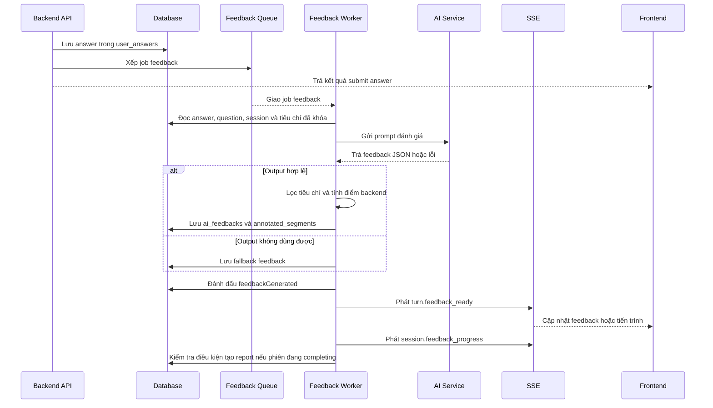

Sơ đồ dưới đây mô tả các bước xử lý chính từ lúc answer được lưu đến khi feedback sẵn sàng cho frontend và report.

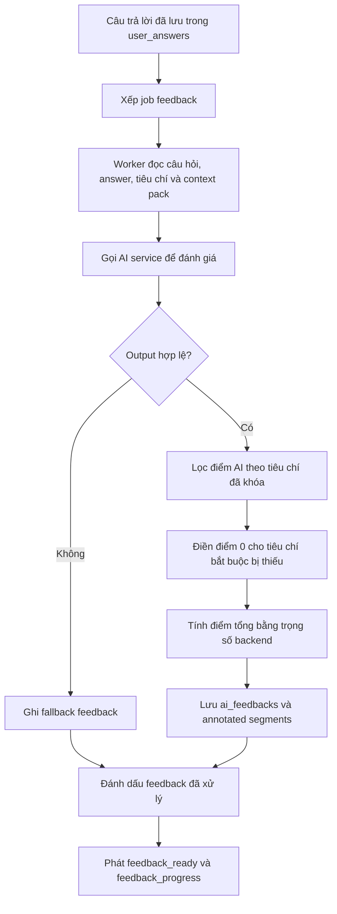

**d. Thiết kế giao diện frontend**

Frontend không cần tự tính điểm hoặc tự diễn giải rubric. Giao diện đọc kết quả feedback đã được backend lưu và hiển thị theo từng câu trả lời. Các thông tin quan trọng gồm điểm nếu có, nhận xét chính, câu trả lời mẫu và đoạn trích được đánh dấu.

Khi feedback chưa sẵn sàng, giao diện thể hiện trạng thái đang xử lý. Nếu feedback là fallback hoặc không thể chấm điểm đáng tin cậy, frontend không hiển thị điểm như một đánh giá thật. Cách hiển thị này giúp người dùng phân biệt giữa câu trả lời được chấm và câu trả lời chưa đủ dữ liệu đánh giá.

Trong màn hình báo cáo, feedback được dùng để dựng transcript có chú thích. Những đoạn được AI đánh dấu có thể hiển thị kèm mức độ như điểm mạnh hoặc điểm cần cải thiện. Nếu feedback chưa có, trang báo cáo tiếp tục hiển thị tiến trình thay vì dựng một báo cáo thiếu dữ liệu.

**e. Thiết kế xử lý backend**

Prompt đánh giá được tạo chặt hơn prompt sinh câu hỏi vì kết quả ảnh hưởng trực tiếp đến điểm số và báo cáo. System message yêu cầu AI đóng vai interview coach, trả về câu trả lời mẫu hoàn chỉnh, nhận xét trọng tâm, điểm theo từng tiêu chí trong `applied_dimensions` và các đoạn nhận xét từ câu trả lời gốc. AI không được tự trả weight hoặc tự tính overall score.

User message của prompt đánh giá chứa dữ liệu cụ thể của turn. Ví dụ sau minh họa cách backend truyền loại phiên, câu hỏi, metadata và câu trả lời vào prompt.

```text
<session_type>technical</session_type>

<question>
Bạn đã thiết kế database cho dự án như thế nào?
</question>

<question_metadata>
category=technical
competency_domains=TD2
</question_metadata>

<answer>
...câu trả lời của ứng viên...
</answer>
```

Ở bước này, backend để phần Job Description rỗng trong prompt feedback hiện tại. Lý do là feedback từng câu đang chấm trực tiếp trên câu hỏi, tiêu chí đã khóa của câu hỏi, context pack và câu trả lời. JD đã được dùng mạnh ở bước tạo câu hỏi; đến bước chấm từng câu, hệ thống ưu tiên không đưa thêm ngữ cảnh thừa làm AI đánh giá lan man.

Prompt feedback không được tạo từ một đoạn hướng dẫn duy nhất, mà được ghép từ nhiều lớp nhỏ. Cách chia lớp này giúp backend kiểm soát rõ phần nào là quy tắc chung, phần nào phụ thuộc loại phiên, phần nào phụ thuộc bộ tiêu chí và phần nào là dữ liệu cụ thể của câu trả lời đang chấm.

| Lớp prompt | Nội dung được bổ sung | Vai trò trong đánh giá |
| --- | --- | --- |
| Lớp nhiệm vụ chung | Yêu cầu AI đóng vai huấn luyện viên phỏng vấn, trả JSON đúng cấu trúc, tạo câu trả lời mẫu, nhận xét chính và đoạn chú thích. | Đặt khuôn dạng đầu ra thống nhất để backend có thể parse, validate và lưu vào cơ sở dữ liệu. |
| Lớp ngôn ngữ | Chọn ngôn ngữ phản hồi là tiếng Việt hoặc tiếng Anh, đồng thời giữ nguyên văn các đoạn trích từ câu trả lời gốc. | Giúp nhận xét phù hợp với ngôn ngữ phiên nhưng không làm sai lệch phần trích dẫn của ứng viên. |
| Lớp chiến lược theo loại phiên | HR tập trung vào hành vi, giao tiếp, động lực và văn hóa; Technical tập trung vào chiều sâu kỹ thuật, cách giải quyết vấn đề và đánh đổi; Mixed kết hợp cả hai hướng. | Giúp cùng một cơ chế feedback có thể chấm theo mục tiêu khác nhau của từng loại phiên. |
| Lớp context pack và rubric | Bổ sung ghi chú ngữ cảnh, danh sách tiêu chí hành vi hoặc kỹ thuật, quy tắc chỉ chấm các tiêu chí được phép và không tự tạo mã tiêu chí mới. | Giới hạn phạm vi chấm điểm theo rubric đã cấu hình, tránh việc AI tự mở rộng tiêu chí ngoài hệ thống. |
| Lớp metadata của câu hỏi | Chỉ rõ loại câu hỏi và danh sách tiêu chí đã khóa cho câu hỏi hiện tại; yêu cầu AI chỉ trả đúng các mã tiêu chí đó. | Ràng buộc feedback theo đúng nội dung mà câu hỏi muốn đánh giá, đặc biệt khi một phiên có nhiều tiêu chí khác nhau. |
| Lớp dữ liệu động của turn | Đưa vào câu hỏi và câu trả lời của người dùng trong các thẻ riêng. | Tách dữ liệu cần chấm khỏi phần hướng dẫn, giúp AI hiểu đâu là nội dung phải đánh giá và đâu là quy tắc phải tuân theo. |

Thứ tự ghép prompt cũng có ý nghĩa. Backend tạo quy tắc nền trước, sau đó thêm ngôn ngữ đầu ra, thêm chiến lược theo loại phiên, thêm rubric theo context pack, rồi cuối cùng mới đưa metadata câu hỏi và câu trả lời cụ thể vào user message. Nhờ vậy, dữ liệu của từng turn không làm thay đổi các quy tắc chấm điểm cốt lõi, còn các quy tắc rubric vẫn bao quanh toàn bộ quá trình đánh giá.

Trong lớp rubric, backend cố ý yêu cầu AI không trả trọng số và không tự tính điểm tổng. AI chỉ được trả điểm từng tiêu chí trong khoảng 0-100. Trọng số và điểm tổng được tính lại ở backend sau khi output đã qua kiểm tra. Cách này làm giảm rủi ro AI tự diễn giải sai trọng số hoặc tạo ra một điểm tổng không khớp với rubric của hệ thống.

Ngoài ra, lớp metadata của câu hỏi yêu cầu danh sách tiêu chí trong output phải khớp với danh sách tiêu chí đã được backend xác định cho câu hỏi đó. Nếu câu hỏi chỉ đánh giá `TD2`, AI không được chấm thêm các tiêu chí kỹ thuật khác chỉ vì câu trả lời có nhắc đến nội dung liên quan. Đây là điểm quan trọng để mỗi câu trả lời được đánh giá đúng phạm vi, không bị kéo điểm bởi những tiêu chí mà câu hỏi không đặt ra.

Kết quả AI phải có các nhóm dữ liệu gồm tiêu chí được áp dụng, câu trả lời mẫu, nhận xét chính và đoạn nhận xét cụ thể. Các đoạn trích phải sao chép nguyên văn từ câu trả lời của ứng viên. Backend lưu nội dung đoạn trích và vị trí ký tự sau khi đã kiểm tra lại. Nếu đoạn trích xuất hiện đúng một lần trong câu trả lời nhưng vị trí AI đưa ra bị lệch, backend tự sửa lại vị trí. Nếu đoạn trích rỗng, không tồn tại trong câu trả lời hoặc xuất hiện nhiều lần nên không xác định được vị trí an toàn, backend loại đoạn đó khỏi feedback.

Output AI được validate bằng hai lớp: kiểm tra schema và kiểm tra ý nghĩa rubric. Một feedback hợp lệ về mặt schema phải có `applied_dimensions`, `model_answer`, `key_takeaway` và `annotated_segments`; mỗi điểm tiêu chí phải nằm trong khoảng 0-100 và `highlight_level` chỉ được là `strength` hoặc `improvement`. Qua được schema vẫn chưa đủ vì AI có thể trả JSON đúng cấu trúc nhưng mã tiêu chí không thuộc rubric của phiên.

Backend xác định danh sách tiêu chí được phép theo ba bước. Thứ nhất, dựa vào loại phiên để lấy tập tiêu chí tối đa: HR chỉ lấy behavioral dimensions, Technical chỉ lấy technical dimensions, Mixed lấy cả hai nhóm. Thứ hai, backend đọc các mã tiêu chí đã gắn với câu hỏi. Nếu câu hỏi không có tiêu chí hoặc các tiêu chí đó không thuộc tập tiêu chí của phiên, feedback được xem là không đủ cơ sở để chấm và chuyển sang fallback. Thứ ba, backend so khớp các tiêu chí AI trả về với tập tiêu chí đã được phép cho câu hỏi.

| Nhánh khớp | Ví dụ AI trả về | Cách hệ thống hiểu |
| --- | --- | --- |
| Khớp chính xác | `TD2` | Dùng đúng tiêu chí `TD2`. |
| Khớp sau chuẩn hóa | `td-2`, `td 2` | Loại bỏ khoảng trắng/ký tự phụ và hiểu là `TD2`. |
| Trích mã trong chuỗi | `TD2 - Practical Application` | Trích token `TD2`. |
| Khớp theo tên tiêu chí | `Khả năng áp dụng thực tế` | Chuẩn hóa tên và ánh xạ về mã rubric tương ứng. |

Nếu một tiêu chí đã được khớp, backend chỉ lấy một lần để tránh AI trả trùng tiêu chí. Nếu AI bỏ sót tiêu chí hợp lệ của câu hỏi hoặc trả mã tiêu chí không khớp với danh sách được phép, backend không lấy mã sai đó để chấm. Thay vào đó, hệ thống vẫn lưu các tiêu chí bắt buộc của câu hỏi, nhưng tiêu chí không có điểm hợp lệ sẽ nhận `score=0`. Chỉ trường hợp câu hỏi không có tiêu chí hợp lệ ngay từ metadata đã khóa mới khiến backend xem feedback không đủ cơ sở và chuyển sang fallback.

Điểm tổng của một câu trả lời không lấy trực tiếp từ AI. Backend lọc điểm AI trả về theo rubric và các tiêu chí đã gắn với câu hỏi, điền `0` cho tiêu chí hợp lệ bị thiếu, chuẩn hóa trọng số trên toàn bộ tiêu chí hợp lệ của câu hỏi rồi tự tính điểm tổng theo thang 100:

```text
Điểm tổng = round(Σ điểm_tiêu_chí * trọng_số_đã_chuẩn_hóa)
```

Trong đó:

```text
trọng_số_đã_chuẩn_hóa = trọng_số_gốc_của_tiêu_chí / tổng_trọng_số_gốc_của_các_tiêu_chí_được_chọn
```

Ví dụ, với context pack Việt Nam, nhóm kỹ thuật có trọng số gốc như sau: `TD1 = 0.25`, `TD2 = 0.25`, `TD3 = 0.2`, `TD4 = 0.2`, `TD5 = 0.1`. Nếu một câu hỏi chỉ đánh giá `TD1` và `TD2`, hệ thống không lấy cả 5 tiêu chí vào công thức. Hệ thống chỉ chuẩn hóa trên hai tiêu chí được chọn:

| Tiêu chí | Trọng số gốc | Điểm AI trả | Trọng số sau chuẩn hóa | Đóng góp vào điểm |
| --- | --- | --- | --- | --- |
| `TD1` | 0.25 | 80 | 0.5 | 40 |
| `TD2` | 0.25 | 70 | 0.5 | 35 |
| Tổng | 0.5 |  | 1.0 | 75 |

Điểm tổng của câu trả lời trong ví dụ này là `75/100`. Cách tính này có ý nghĩa vì mỗi câu hỏi chỉ kiểm tra một phần năng lực, không phải toàn bộ rubric. Backend chỉ tính điểm trên các tiêu chí thật sự được câu hỏi đó đánh giá, nhờ vậy điểm của một câu hỏi không bị kéo lệch bởi những tiêu chí không liên quan.

Sau khi tính tổng có trọng số, backend làm tròn điểm và giới hạn kết quả trong thang 0-100. Điều này bảo vệ hệ thống trước các giá trị AI trả về nằm ngoài phạm vi mong đợi sau khi parse và validate.

Sơ đồ dưới đây thể hiện riêng phần tính điểm để làm rõ rằng điểm tổng do backend tính từ tiêu chí hợp lệ, không lấy nguyên văn từ AI.


Khi feedback hợp lệ, backend lưu trong một transaction để tránh trạng thái nửa vời: ghi hoặc cập nhật feedback của câu trả lời, xóa các đoạn nhận xét cũ nếu feedback được tạo lại, ghi danh sách đoạn nhận xét mới và đánh dấu câu trả lời đã có feedback. Thông tin feedback được lưu gồm điểm tổng, câu trả lời mẫu, nhận xét chính, phiên bản prompt, cờ fallback, điểm theo tiêu chí và các annotated segment. Việc ghi theo transaction giúp tránh tình huống feedback đã có nhưng answer chưa được đánh dấu hoàn tất, hoặc answer đã hoàn tất nhưng thiếu các đoạn nhận xét cần hiển thị.

Sau khi lưu xong, backend phát sự kiện `turn.feedback_ready` để frontend biết câu trả lời đã có feedback. Payload của sự kiện cho biết answer nào đã sẵn sàng và feedback đó có đoạn chú thích hay không. Ngay sau đó, backend tính lại tiến trình feedback của phiên và phát sự kiện tiến trình để màn hình chờ báo cáo biết còn bao nhiêu câu trả lời chưa xử lý. Nếu phiên đang ở trạng thái tạo báo cáo và tất cả feedback cần thiết đã sẵn sàng, backend xếp job tạo báo cáo tổng hợp.

Nếu feedback được tạo lại do retry job, transaction xóa các annotated segment cũ trước khi ghi segment mới. Cách này giúp một answer chỉ có một feedback hiện hành và danh sách đoạn nhận xét không bị nhân đôi sau các lần retry. Nếu job retry nhưng feedback đã tồn tại từ lần chạy trước, backend ưu tiên giữ feedback hiện có và chỉ bảo đảm answer được đánh dấu đã xử lý.

**f. Xử lý lỗi và fallback**

Nếu AI provider lỗi, hết quota, timeout, trả response rỗng, trả JSON không parse được hoặc trả JSON sai schema, backend không lưu output đó như feedback thật. Hệ thống ghi feedback fallback, đánh dấu câu trả lời đã được xử lý và cho phép luồng report tiếp tục.

Nếu output qua được schema nhưng AI trả sai hoặc thiếu tiêu chí so với danh sách đã khóa cho câu hỏi, backend không tự mở rộng phạm vi chấm. Hệ thống bỏ qua tiêu chí sai và gán `0` cho tiêu chí bắt buộc không có điểm hợp lệ. Cách xử lý này khác với fallback: điểm thấp trong trường hợp này là một kết quả chấm thật theo rubric của câu hỏi, còn fallback chỉ dùng khi dữ liệu nền hoặc kết quả AI không đủ tin cậy để tạo feedback thật.

Feedback fallback lưu thông điệp giải thích phù hợp với ngôn ngữ phiên, không tạo annotated segment và đặt cờ `isFallback`. Backend vẫn phát `turn.feedback_ready` và cập nhật tiến trình feedback để frontend và report không chờ vô hạn, nhưng các bước đọc report sẽ ẩn điểm của feedback fallback.

```text
Input: sessionId, userAnswerId, question metadata, contextPack, language

1. Worker đọc câu trả lời, câu hỏi và cấu hình phiên.
2. Tạo prompt feedback từ câu hỏi, answer, metadata, rubric và ngôn ngữ.
3. Gọi AI để lấy feedback JSON.
4. Parse JSON và validate schema.
5. Lọc tiêu chí chấm theo rubric và danh sách tiêu chí đã khóa của câu hỏi.
6. Nếu câu hỏi không có tiêu chí hợp lệ để chấm, ghi fallback feedback.
7. Nếu hợp lệ:
   7.1. Chuẩn hóa trọng số tiêu chí.
   7.2. Gán 0 cho tiêu chí bắt buộc bị AI bỏ sót hoặc trả sai.
   7.3. Tính điểm tổng theo trọng số.
   7.4. Lọc lại các đoạn trích không khớp câu trả lời.
   7.5. Lưu feedback và annotated segments.
8. Đánh dấu answer đã có feedback.
9. Phát sự kiện turn.feedback_ready và cập nhật tiến trình.
10. Nếu phiên đang completing và mọi feedback đã sẵn sàng, xếp job tạo report.
```

### 4.5.6 Báo cáo tổng hợp và xem lại lịch sử phiên

**a. Mục đích của tính năng**

Nhóm tính năng báo cáo tổng hợp giúp người dùng xem lại kết quả của cả phiên phỏng vấn. Báo cáo không chỉ hiển thị điểm tổng mà còn trình bày transcript, nhận xét theo từng câu, phân tích năng lực, thông tin câu bị bỏ qua và kế hoạch cải thiện.

Lịch sử phiên cho phép người dùng quay lại các phiên đã tạo, tiếp tục phiên chưa hoàn tất hoặc mở lại báo cáo của phiên đã hoàn thành. Đây là phần giúp kết quả luyện tập không bị mất sau khi người dùng rời khỏi màn hình phỏng vấn.

Trong AI Mock Interview, báo cáo là điểm kết thúc của một phiên luyện tập. Nó tổng hợp các feedback rời rạc thành một cái nhìn chung để người dùng biết phiên vừa rồi có bao nhiêu câu được đánh giá, câu nào bị bỏ qua, phần nào cần cải thiện và dữ liệu chấm điểm có đáng tin cậy hay không.

Sơ đồ sau thể hiện mục đích của tính năng báo cáo: gom dữ liệu của cả phiên thành kết quả tổng hợp có thể xem lại sau này, đồng thời phân biệt rõ câu được chấm, câu fallback và câu bị bỏ qua.


**b. Dữ liệu đầu vào**

Dữ liệu đầu vào của báo cáo gồm phiên phỏng vấn, danh sách câu hỏi trong `session_questions`, câu trả lời trong `user_answers`, feedback trong `ai_feedbacks`, các đoạn nhận xét đã lưu và trạng thái bỏ qua của từng câu. Bộ xử lý báo cáo chỉ dùng feedback đã sẵn sàng để tổng hợp.

Báo cáo được lưu thành nhiều phần trong `session_reports`, gồm tóm tắt tổng quan, phân tích giao tiếp, heatmap năng lực, kế hoạch hành động và câu trả lời đề xuất cho các câu bị bỏ qua. Cách lưu theo từng phần giúp backend đọc lại báo cáo linh hoạt hơn và tránh nhồi toàn bộ kết quả vào một trường duy nhất.

Đầu ra của tính năng gồm trạng thái phiên hoàn thành, điểm tổng nếu có dữ liệu chấm hợp lệ, transcript đã ghép câu hỏi - câu trả lời - feedback, chất lượng báo cáo và các phần báo cáo đã lưu. Với báo cáo mới, câu bị bỏ qua vẫn được ghi nhận trong kết quả tổng hợp và được tính là 0 điểm để phản ánh đúng việc người dùng không trả lời câu hỏi đó. Ngược lại, feedback fallback do AI lỗi chỉ được dùng để giữ luồng hệ thống tiếp tục chạy, không được xem như điểm chấm đáng tin cậy. Chất lượng báo cáo có thể là đầy đủ, một phần, không khả dụng về điểm hoặc không thể chấm nếu phiên cũ không có đủ dữ liệu điểm.

**c. Luồng xử lý nghiệp vụ**

Khi người dùng đi hết danh sách câu hỏi và yêu cầu hoàn thành phiên, backend chuyển phiên sang trạng thái `completing`. Backend kiểm tra các câu trả lời không bị bỏ qua đã có feedback hay chưa. Nếu còn feedback chưa sẵn sàng, hệ thống chưa xếp job report và frontend tiếp tục hiển thị trạng thái chờ.

Trước khi xử lý, backend luôn kiểm tra phiên có tồn tại và có thuộc về người dùng đang đăng nhập hay không. Bước này áp dụng cho cả lịch sử phiên, trang chi tiết phiên, tiến trình feedback và trang báo cáo. Nếu phiên không tồn tại, hệ thống trả lỗi không tìm thấy. Nếu phiên thuộc về người dùng khác, hệ thống từ chối truy cập. Nhờ đó, lịch sử và báo cáo không bị lộ giữa các tài khoản.

Khi đủ dữ liệu, backend xếp job tạo báo cáo. Tiến trình tạo báo cáo đọc câu hỏi, câu trả lời và feedback, tách câu bị bỏ qua, feedback thật và feedback fallback. Câu bị bỏ qua được tạo một bản ghi feedback tổng hợp với điểm 0 và các tiêu chí tương ứng để điểm tổng phản ánh đúng số câu người dùng đã bỏ qua. Feedback fallback do lỗi AI được giữ lại trong transcript nhưng không được xem là điểm thật. Khi report được ghi thành công, trạng thái phiên chuyển sang hoàn thành và backend phát sự kiện `report.ready`.

Luồng chính có hai cổng kiểm tra. Cổng thứ nhất nằm trước khi xếp report: phiên phải ở trạng thái `completing`, phải có câu trả lời và không còn feedback chưa xử lý đối với các câu không bị bỏ qua. Cổng thứ hai nằm trong tiến trình tạo báo cáo: số feedback đọc được phải khớp với số câu trả lời cần chấm. Nếu hai điều kiện này chưa đạt, hệ thống không tạo báo cáo sớm.

Quá trình đọc lại báo cáo cũng có một cổng kiểm tra riêng. Backend chỉ trả báo cáo khi phần tóm tắt tổng quan đã được lưu. Nếu phần này chưa có, API trả trạng thái "báo cáo chưa sẵn sàng" thay vì trả một báo cáo rỗng. Frontend dựa vào trạng thái này để tiếp tục polling tiến trình hoặc chờ sự kiện thời gian thực.

Sơ đồ dưới đây thể hiện quá trình hoàn tất phiên, chờ feedback nếu cần và tải báo cáo sau khi worker ghi dữ liệu.

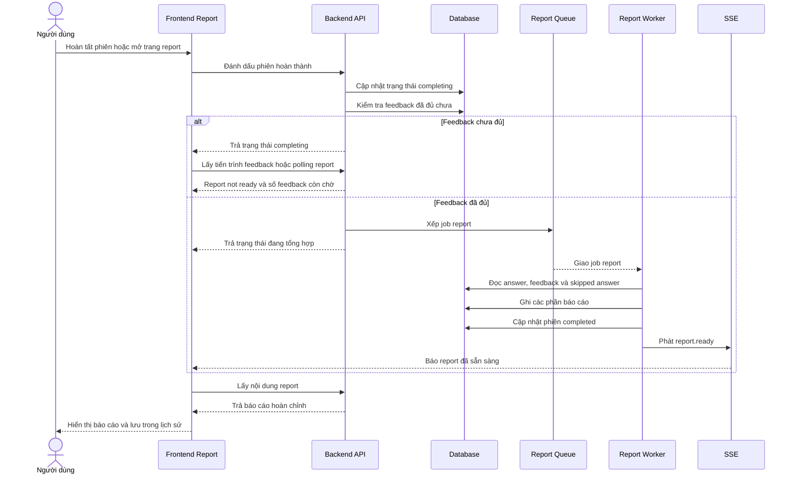

**d. Thiết kế giao diện frontend**

Giao diện báo cáo hiển thị trạng thái chờ khi report chưa sẵn sàng. Trong thời gian này, người dùng cần thấy tiến trình feedback hoặc thông báo rằng hệ thống đang tổng hợp kết quả, thay vì nhìn thấy trang lỗi hoặc báo cáo rỗng.

Khi báo cáo sẵn sàng, frontend hiển thị điểm tổng nếu có dữ liệu chấm đáng tin cậy, thông tin phiên, phương pháp chấm, biểu đồ năng lực và phân tích từng câu trả lời. Với câu bị bỏ qua, báo cáo hiển thị trạng thái đã bỏ qua, điểm 0 nếu backend đã tạo dữ liệu điểm cho báo cáo mới và câu trả lời đề xuất nếu có. Giao diện không hiển thị các đoạn nhận xét chi tiết như ưu điểm hoặc điểm cần cải thiện, vì người dùng không có nội dung trả lời để phân tích.

Trang lịch sử phiên hiển thị danh sách phiên đã tạo của riêng người dùng hiện tại, sắp xếp từ mới đến cũ. Mỗi phiên có trạng thái, thời gian tạo, loại phỏng vấn, context pack, thời lượng và điểm tổng nếu phiên đã hoàn thành. Từ trạng thái phiên, giao diện chọn lối vào phù hợp: tiếp tục phiên đang chạy, theo dõi phiên đang tạo báo cáo hoặc mở báo cáo đã hoàn thành.

Khi API trả trạng thái report chưa sẵn sàng, frontend không coi đây là lỗi cuối cùng. Trang báo cáo gọi API tiến trình feedback, hiển thị số câu đã chấm trên tổng số câu cần chấm, số câu còn đang xử lý và thanh tiến trình. Trang cũng lắng nghe sự kiện `session.feedback_progress` và `report.ready`; nếu sự kiện không đến, polling vẫn tiếp tục cập nhật tiến trình.

Khi report có `reportQuality` là một phần hoặc không khả dụng, giao diện cần thể hiện rằng điểm tổng có thể bị ẩn hoặc chỉ phản ánh các câu được chấm hợp lệ. Với câu bị bỏ qua, transcript vẫn giữ câu hỏi và answer trống, nhưng dùng câu trả lời đề xuất nếu backend đã tạo hoặc fallback được lưu. Với báo cáo cũ chưa có dữ liệu điểm cho câu bỏ qua, giao diện hiển thị thông báo để người dùng hiểu vì sao điểm có thể khác các báo cáo mới.

**e. Thiết kế xử lý backend**

Backend chỉ tạo report khi đủ dữ liệu cần thiết. Điều kiện quan trọng là các câu trả lời không bị bỏ qua phải có feedback hoặc đã được xử lý theo fallback. Các câu bị bỏ qua không làm report bị kẹt vì chúng không cần feedback chấm điểm.

Ở bước lấy lịch sử, backend nhận yêu cầu từ người dùng đã đăng nhập, lấy mã người dùng từ phiên xác thực, sau đó chỉ truy vấn các phiên thuộc đúng người dùng đó. Kết quả được sắp xếp theo thời gian tạo giảm dần để phiên mới nhất xuất hiện trước. Backend không cần tính lại báo cáo ở bước này; nó chỉ trả metadata đã lưu của phiên, ví dụ trạng thái hiện tại, điểm tổng nếu đã có và thông tin cấu hình phiên.

Ở bước hoàn tất phiên, backend xử lý theo trạng thái hiện tại. Nếu phiên đang hoạt động và đã có đủ câu trả lời, hệ thống chuyển phiên sang `completing`. Nếu người dùng hết giờ hoặc chọn tự động bỏ qua câu chưa trả lời, backend tạo thêm các câu trả lời rỗng có đánh dấu bỏ qua, đặt thời gian còn lại về 0 rồi mới chuyển sang `completing`. Nếu phiên đã ở trạng thái `completing`, backend không tạo lại phiên mới mà chỉ kiểm tra lại điều kiện để bảo đảm job report đã được xếp khi dữ liệu đã sẵn sàng.

Ở bước kiểm tra điều kiện tạo report, backend đếm tổng số câu trả lời, số câu bị bỏ qua và số feedback đã hoàn tất. Câu bị bỏ qua được loại khỏi yêu cầu phải có feedback thật, vì không có nội dung trả lời để AI chấm. Nếu vẫn còn câu trả lời chưa sinh feedback, backend dừng tại trạng thái chờ. Nếu tất cả điều kiện đã đủ, backend xếp job tạo báo cáo vào hàng đợi và gắn mã job theo mã phiên để tránh tạo nhiều job trùng cho cùng một phiên. Nếu job cũ bị lỗi, hệ thống ưu tiên retry job đó thay vì tạo bản sao mới.

Bộ xử lý báo cáo tổng hợp transcript, điểm phiên, thống kê câu trả lời, danh sách câu fallback và các phần báo cáo. Với phiên có dữ liệu chấm hợp lệ, điểm tổng được tính từ các feedback không phải fallback; trong đó câu bị bỏ qua của báo cáo mới được tính là 0 điểm. Với phiên chỉ có fallback do AI lỗi, backend trả chất lượng báo cáo phù hợp và không tạo điểm số giả.

Backend có API đọc tiến trình, trong đó hệ thống đếm tổng số câu hỏi, tổng số câu trả lời, số câu bị bỏ qua, số feedback cần có, số feedback đã hoàn tất và số feedback còn chờ. Khi đọc report chính, nếu chưa có phần `executive_summary`, backend trả `REPORT_NOT_READY` với trạng thái chấp nhận để frontend tiếp tục chờ.

Khi xếp job report, backend dùng mã job theo mã phiên để tránh tạo nhiều job report cho cùng một phiên. Nếu job cũ đã lỗi, hệ thống có thể chạy lại job đó. Dữ liệu gửi vào hàng đợi gồm mã phiên, loại phiên, context pack, ngôn ngữ và danh sách câu trả lời cần tổng hợp.

Sau khi nhận job, tiến trình tạo báo cáo đọc danh sách câu trả lời theo thứ tự đã lưu, xác định câu nào bị bỏ qua và câu nào cần feedback thật. Tiến trình này kiểm tra số feedback tìm được có khớp với số câu cần chấm hay không. Nếu chưa khớp, hệ thống báo lỗi để hàng đợi chạy lại sau, tránh ghi báo cáo khi dữ liệu còn thiếu.

Tiếp theo, tiến trình tạo báo cáo tạo dữ liệu tổng hợp cho câu bị bỏ qua. Mỗi câu bỏ qua được gán điểm 0, nhận xét ngắn gọn và điểm theo các tiêu chí áp dụng cho câu hỏi đó. Nhờ vậy, báo cáo mới phản ánh rõ tác động của việc bỏ qua câu hỏi thay vì bỏ qua hoàn toàn khỏi điểm trung bình. Đồng thời, hệ thống tạo câu trả lời đề xuất cho các câu này; nếu AI không trả được kết quả, hệ thống dùng câu trả lời mẫu fallback dựa trên nội dung câu hỏi.

Bộ xử lý báo cáo tạo `executive_summary` từ số câu, số câu được đánh giá, số câu fallback, số câu bị bỏ qua và điểm tổng. `comm_analysis` lưu thống kê feedback. `competency_heatmap` lưu điểm theo câu trả lời, trong đó feedback fallback có score null. `action_plan` được tạo từ các tóm tắt feedback hợp lệ; hệ thống yêu cầu AI trả JSON dạng danh sách 3-5 việc cần cải thiện. `skipped_answers` lưu câu trả lời đề xuất cho các câu người dùng bỏ qua.

Các phần báo cáo được ghi bằng upsert trong cùng transaction với việc cập nhật phiên sang `completed`, ghi `overallScore` và `completedAt`. Sau khi transaction thành công, backend phát `report.ready`. Thứ tự này giúp frontend chỉ tải report sau khi dữ liệu đã có trong database.

Khi người dùng mở báo cáo, backend đọc lại phiên, kiểm tra quyền sở hữu, kiểm tra phần tóm tắt đã tồn tại, sau đó dựng transcript từ danh sách câu hỏi theo thứ tự. Với mỗi câu, backend ghép câu hỏi, câu trả lời đầu tiên, feedback, điểm, các đoạn nhận xét đã được làm sạch và tiêu chí đã áp dụng. Với câu bị bỏ qua, backend thay phần câu trả lời bằng trạng thái bỏ qua, bỏ các đoạn nhận xét chi tiết và lấy câu trả lời đề xuất từ phần báo cáo đã lưu. Cuối cùng, backend xác định chất lượng báo cáo: đầy đủ, một phần, không khả dụng do toàn bộ feedback là fallback, hoặc không thể chấm với dữ liệu cũ không có điểm.

**f. Xử lý lỗi và fallback**

Nếu frontend yêu cầu report khi worker chưa tạo xong, backend trả trạng thái chưa sẵn sàng để frontend tiếp tục chờ hoặc polling. Đây không phải lỗi nghiệp vụ mà là trạng thái bình thường của luồng bất đồng bộ.

Nếu toàn bộ feedback là fallback do AI không chấm được câu trả lời, báo cáo hiển thị trạng thái chưa thể chấm điểm thay vì `0/100`. Nếu phiên chỉ có dữ liệu cũ chưa tạo được điểm cho câu bỏ qua, báo cáo được đánh dấu là không thể chấm. Với báo cáo mới, câu bị bỏ qua được tính 0 điểm, nhưng phần phân tích chi tiết vẫn không hiển thị như một câu trả lời bình thường.

Nếu AI không tạo được action plan, backend dùng action plan fallback theo ngôn ngữ phiên. Nếu AI không tạo được câu trả lời đề xuất cho câu skipped, backend dùng câu trả lời mẫu fallback dựa trên nội dung câu hỏi. Nếu số feedback chưa đủ, tiến trình tạo báo cáo báo lỗi để job chạy lại thay vì lưu báo cáo thiếu dữ liệu.

### 4.5.7 Theo dõi tiến trình phiên và xử lý trạng thái đặc biệt

**a. Mục đích của tính năng**

Nhóm tính năng theo dõi tiến trình giữ cho người dùng biết phiên đang ở giai đoạn nào. Vì sinh câu hỏi, feedback và report đều có thể mất thời gian, hệ thống cần trạng thái rõ ràng để người dùng không bị kẹt trong màn hình chờ.

Mục này cũng mô tả các trạng thái đặc biệt như phiên đang sinh câu hỏi, đang phỏng vấn, đang tổng hợp báo cáo, hoàn thành, lỗi, fallback AI và câu hỏi bị bỏ qua. Các chi tiết riêng của từng pipeline đã được trình bày ở các mục trước; phần này tập trung vào cách hệ thống duy trì trạng thái chung.

**b. Dữ liệu đầu vào**

Dữ liệu đầu vào gồm trạng thái phiên, số lượng câu hỏi đã sẵn sàng, số câu đã trả lời, số câu bị bỏ qua, số feedback đã hoàn tất, số feedback còn chờ và trạng thái report. Các sự kiện như `turn.feedback_ready` và `report.ready` giúp frontend cập nhật khi backend xử lý xong một bước quan trọng.

Các trạng thái lỗi cũng là dữ liệu đầu vào của giao diện. Frontend cần biết lỗi đến từ validation, quyền truy cập, trạng thái phiên, queue, database hay AI provider để hiển thị thông báo phù hợp.

**c. Luồng xử lý nghiệp vụ**

Khi tạo phiên, backend đặt trạng thái ban đầu để cho biết câu hỏi đang được chuẩn bị. Khi worker sinh câu hỏi lưu đủ `session_questions`, phiên chuyển sang trạng thái có thể phỏng vấn. Trong quá trình phỏng vấn, mỗi lần người dùng trả lời hoặc bỏ qua câu hỏi, backend cập nhật dữ liệu tiến trình.

Khi người dùng hoàn tất phiên, backend chuyển phiên sang trạng thái tổng hợp. Nếu feedback chưa đủ, hệ thống tiếp tục chờ và cập nhật tiến trình. Khi report được ghi thành công, backend phát `report.ready` và chuyển phiên sang hoàn thành. Nếu một lỗi không thể phục hồi xảy ra, phiên được chuyển sang trạng thái lỗi để frontend không tiếp tục chờ vô hạn.

Sơ đồ dưới đây mô tả cách hệ thống phân loại lỗi ở mức tổng quát để quyết định trả lỗi, fallback hoặc đánh dấu trạng thái đặc biệt.

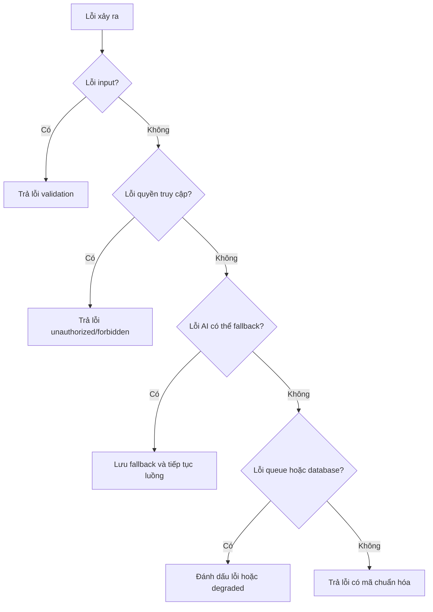

**d. Thiết kế giao diện frontend**

Frontend theo dõi trạng thái qua API, polling và SSE. Nếu SSE bị trễ hoặc mất kết nối, polling vẫn giúp giao diện lấy được trạng thái mới nhất. Giao diện cần phân biệt các trạng thái chờ khác nhau: đang chuẩn bị câu hỏi, đang lưu câu trả lời, đang chờ feedback và đang tổng hợp report.

Khi có lỗi có thể sửa từ phía người dùng, frontend hiển thị thông báo gắn với thao tác tương ứng. Khi backend đang xử lý nền, giao diện không nên hiển thị lỗi ngay chỉ vì report hoặc feedback chưa có. Với phiên đã lỗi, frontend cần cho người dùng biết phiên không thể tiếp tục ở trạng thái hiện tại.

**e. Thiết kế xử lý backend**

Backend giữ trạng thái phiên trong database và cập nhật sau các bước quan trọng. Các job nền không được chỉ xử lý trong bộ nhớ vì frontend cần đọc lại trạng thái qua API. Khi worker hoàn tất một bước, backend ghi database trước rồi mới phát sự kiện để tránh frontend tải dữ liệu khi dữ liệu chưa được lưu.

Degraded mode được xử lý theo từng loại tác vụ. Nếu AI sinh câu hỏi lỗi, hệ thống dùng question bank để tạo câu hỏi. Nếu AI feedback lỗi hoặc hết quota, hệ thống ghi feedback fallback và đánh dấu answer đã xử lý. Nếu report không đủ dữ liệu chấm, backend trả chất lượng báo cáo phù hợp thay vì tạo điểm số không có căn cứ.

**f. Xử lý lỗi và fallback**

Hệ thống chuyển sang fallback trong các trường hợp AI provider hết quota, timeout, trả response rỗng, JSON không parse được, JSON đúng cú pháp nhưng sai schema, không có tiêu chí chấm nào khớp với rubric đang áp dụng hoặc provider lỗi sau các lần thử lại. Các lỗi này được xử lý theo hướng bảo toàn dữ liệu đã có và tiếp tục luồng nếu có thể.

Fallback không có nghĩa là mọi kết quả đều được xem như bình thường. Feedback fallback không được tính vào điểm thật. Phiên chỉ có fallback hoặc không có câu trả lời có thể chấm sẽ hiển thị trạng thái chưa thể chấm điểm. Nếu lỗi xảy ra ở queue hoặc database và hệ thống không thể tiếp tục an toàn, backend đánh dấu trạng thái lỗi để frontend dừng chờ và thông báo cho người dùng.
 

## 4.6 Thiết Kế Cơ Sở Dữ Liệu

Cơ sở dữ liệu của hệ thống AI Mock Interview được triển khai trên PostgreSQL. Thiết kế dữ liệu xoay quanh phiên phỏng vấn: người dùng tạo phiên từ hồ sơ và Job Description, hệ thống sinh danh sách câu hỏi cho phiên, người dùng trả lời từng câu, AI tạo feedback cho từng câu trả lời và cuối cùng hệ thống tổng hợp báo cáo theo phiên. Các bảng không chỉ lưu dữ liệu đầu ra, mà còn lưu trạng thái xử lý bất đồng bộ để frontend có thể theo dõi tiến trình sinh câu hỏi, chấm câu trả lời và tạo báo cáo.
### 4.6.1 Sơ đồ ERD tổng thể

```mermaid
erDiagram
    users ||--o| user_profiles : has
    users ||--o{ saved_job_descriptions : saves
    users ||--o{ interview_sessions : creates
    rubric_versions ||--o{ rubric_categories : contains
    rubric_versions ||--o{ interview_sessions : locked_by
    rubric_categories ||--o{ rubric_criteria : contains
    rubric_criteria ||--o{ question_bank_criteria : linked_by
    rubric_criteria ||--o{ session_question_criteria : applied_by
    saved_job_descriptions ||--o{ interview_sessions : reused_by
    interview_sessions ||--o{ session_questions : contains
    question_bank ||--o{ question_bank_criteria : evaluates
    question_bank ||--o{ session_questions : source_for
    session_questions ||--o{ session_question_criteria : has_criteria
    interview_sessions ||--o{ user_answers : receives
    session_questions ||--o| user_answers : answered_by
    user_answers ||--o| ai_feedbacks : evaluated_by
    ai_feedbacks ||--o{ annotated_segments : contains
    interview_sessions ||--o{ session_reports : summarized_by

    users {
        UUID id PK
        TEXT email UK
        TEXT role
        TEXT status
        TIMESTAMPTZ created_at
        TIMESTAMPTZ updated_at
    }

    user_profiles {
        UUID id PK
        UUID user_id FK
        TEXT full_name
        TEXT personality
        JSONB education
        JSONB work_experience
        JSONB projects
        JSONB technical_skills
        JSONB certifications
        JSONB awards
        TIMESTAMPTZ created_at
        TIMESTAMPTZ updated_at
    }

    saved_job_descriptions {
        UUID id PK
        UUID user_id FK
        TEXT company_name
        TEXT company_website
        TEXT job_title
        TEXT level
        TEXT headcount
        TEXT location
        TEXT requirements
        TEXT job_content
        TEXT_ARRAY tech_stack
        TEXT benefits
        TEXT salary
        TEXT bonus
        TIMESTAMPTZ last_used_at
        TIMESTAMPTZ deleted_at
        TIMESTAMPTZ created_at
        TIMESTAMPTZ updated_at
    }

    rubric_versions {
        UUID id PK
        TEXT context_pack_id
        TEXT version_key
        TEXT status
        TEXT checksum
        TIMESTAMPTZ published_at
        TIMESTAMPTZ created_at
    }

    rubric_categories {
        UUID id PK
        UUID rubric_version_id FK
        TEXT category_key
        TEXT label
        FLOAT weight
        INT display_order
    }

    rubric_criteria {
        UUID id PK
        UUID rubric_category_id FK
        TEXT code
        TEXT name
        FLOAT weight
        INT display_order
    }

    question_bank {
        UUID id PK
        TEXT content
        QuestionSessionType session_type
        INT difficulty
        TEXT context_pack_id
        INT estimated_time_min
        JSONB translations
        JSONB content_json
        TIMESTAMPTZ deleted_at
        TIMESTAMPTZ created_at
        TIMESTAMPTZ updated_at
    }

    question_bank_criteria {
        UUID question_bank_id PK, FK
        UUID rubric_criterion_id PK, FK
        TIMESTAMPTZ created_at
    }

    interview_sessions {
        UUID id PK
        UUID user_id FK
        UUID saved_job_description_id FK
        TEXT job_description
        TEXT job_title
        TEXT session_type
        INT num_questions
        INT duration_min
        INT remaining_seconds
        TEXT language
        TEXT context_pack_id
        UUID rubric_version_id FK
        TEXT status
        INT overall_score
        TIMESTAMPTZ completed_at
        TIMESTAMPTZ created_at
        TIMESTAMPTZ updated_at
    }

    session_questions {
        UUID id PK
        UUID session_id FK
        UUID question_bank_id FK
        TEXT question_text
        INT order_index
        TEXT question_category
        INT estimated_time_min
        TIMESTAMPTZ created_at
    }

    session_question_criteria {
        UUID session_question_id PK, FK
        UUID rubric_criterion_id PK, FK
        TIMESTAMPTZ created_at
    }

    user_answers {
        UUID id PK
        UUID session_id FK
        UUID question_id FK
        TEXT answer_mode
        TEXT answer_text
        TEXT audio_file_url
        INT audio_duration_seconds
        INT audio_size_bytes
        BOOLEAN skipped
        JSONB voice_metrics_json
        TEXT transcription_status
        BOOLEAN feedback_generated
        TIMESTAMPTZ created_at
        TIMESTAMPTZ updated_at
    }

    ai_feedbacks {
        UUID id PK
        UUID user_answer_id FK
        INT overall_score
        TEXT model_answer
        TEXT key_takeaway
        TEXT prompt_version
        BOOLEAN is_fallback
        JSONB dimension_scores
        TIMESTAMPTZ created_at
    }

    annotated_segments {
        UUID id PK
        UUID ai_feedback_id FK
        TEXT segment_text
        INT start_index
        INT end_index
        TEXT highlight_level
        TEXT annotation
        TEXT suggestion
        TEXT improved_version
        TIMESTAMPTZ created_at
    }

    session_reports {
        UUID id PK
        UUID session_id FK
        TEXT report_type
        INT version
        JSONB content_json
        TEXT generated_by_model
        TEXT prompt_version
        TIMESTAMPTZ created_at
    }
```

### 4.6.2 Danh sách bảng dữ liệu

Các bảng dữ liệu hiện tại có thể chia thành sáu nhóm chính. Nhóm người dùng gồm `users` và `user_profiles`, dùng để lưu tài khoản, hồ sơ ứng viên và dữ liệu CV có cấu trúc. Nhóm Job Description và cấu hình gồm `saved_job_descriptions` cùng các trường cấu hình phiên như `context_pack_id`. Nhóm rubric gồm `rubric_versions`, `rubric_categories`, `rubric_criteria`, `question_bank_criteria` và `session_question_criteria`, là nguồn dữ liệu gốc cho tiêu chí hiện hành và tiêu chí áp dụng cho từng câu hỏi theo version đã khóa. Nhóm phiên phỏng vấn gồm `interview_sessions` và `session_questions`, ghi cấu hình phiên, trạng thái vòng đời và danh sách câu hỏi đã sinh cho từng phiên. Nhóm câu trả lời gồm `user_answers`, lưu câu trả lời văn bản hoặc transcript giọng nói, trạng thái bỏ qua và trạng thái feedback. Nhóm feedback gồm `ai_feedbacks` và `annotated_segments`, lưu điểm, nhận xét, câu trả lời mẫu và các đoạn được chú thích trong câu trả lời. Nhóm báo cáo gồm `session_reports`, lưu từng phần của báo cáo tổng hợp theo loại và phiên bản.

**Bảng `rubric_versions`**

Bảng `rubric_versions` lưu các phiên bản rubric bất biến theo context pack. Mỗi phiên phỏng vấn khóa vào một `rubric_version_id`, nhờ đó dữ liệu chấm điểm lịch sử không bị đổi nghĩa khi rubric mới được publish.

| Field | data type | constraint | NOT NULL | Description |
| ----- | --------- | ---------- | -------- | ----------- |
| `id` | `UUID` | Primary key; default `gen_random_uuid()` | YES | Mã định danh phiên bản rubric. |
| `context_pack_id` | `TEXT` | CHECK `context_pack_id IN ('VN', 'Western')`; UNIQUE cùng `version_key`; indexed bởi `idx_rubric_versions_context_pack` | YES | Context pack nghiệp vụ mà version rubric áp dụng. |
| `version_key` | `TEXT` | UNIQUE cùng `context_pack_id` qua `rubric_versions_context_version_key` | YES | Khóa phiên bản trong từng context pack. |
| `status` | `TEXT` | CHECK `status IN ('active', 'archived')`; default `'active'` | YES | Trạng thái sử dụng của version rubric. |
| `checksum` | `TEXT` | Không có ràng buộc riêng | NO | Dấu vết nội dung dùng để kiểm tra toàn vẹn hoặc tránh trùng phiên bản. |
| `published_at` | `TIMESTAMPTZ(6)` | Default `now()` | YES | Thời điểm publish version rubric. |
| `created_at` | `TIMESTAMPTZ(6)` | Default `now()` | YES | Thời điểm tạo bản ghi. |

**Bảng `rubric_categories`**

Bảng `rubric_categories` lưu hai nhóm tiêu chí chính của một rubric version, gồm hành vi và kỹ thuật, kèm trọng số tổng của từng nhóm.

| Field | data type | constraint | NOT NULL | Description |
| ----- | --------- | ---------- | -------- | ----------- |
| `id` | `UUID` | Primary key; default `gen_random_uuid()` | YES | Mã định danh nhóm rubric. |
| `rubric_version_id` | `UUID` | Foreign key tới `rubric_versions.id` ON DELETE CASCADE; UNIQUE cùng `category_key`; indexed bởi `idx_rubric_categories_version` | YES | Version rubric chứa nhóm tiêu chí. |
| `category_key` | `TEXT` | CHECK `category_key IN ('behavioral', 'technical')` | YES | Mã nhóm tiêu chí. |
| `label` | `TEXT` | Không có ràng buộc riêng | YES | Tên hiển thị của nhóm tiêu chí. |
| `weight` | `DOUBLE PRECISION` | CHECK `weight >= 0` | YES | Trọng số của nhóm trong rubric. |
| `display_order` | `INTEGER` | CHECK `display_order >= 0`; default `0` | YES | Thứ tự hiển thị của nhóm. |

**Bảng `rubric_criteria`**

Bảng `rubric_criteria` lưu từng tiêu chí chấm điểm trong một nhóm rubric. Version của tiêu chí được suy ra qua `rubric_category_id` tới `rubric_categories.rubric_version_id`, tránh lưu song song hai nguồn version trên cùng một tiêu chí. Các mã tiêu chí này được liên kết với câu hỏi qua `question_bank_criteria` và `session_question_criteria`, sau đó dùng để chuẩn hóa điểm feedback.

| Field | data type | constraint | NOT NULL | Description |
| ----- | --------- | ---------- | -------- | ----------- |
| `id` | `UUID` | Primary key; default `gen_random_uuid()` | YES | Mã định danh tiêu chí rubric. |
| `rubric_category_id` | `UUID` | Foreign key tới `rubric_categories.id` ON DELETE CASCADE; UNIQUE cùng `code`; indexed bởi `idx_rubric_criteria_category` | YES | Nhóm rubric chứa tiêu chí. |
| `code` | `TEXT` | UNIQUE cùng `rubric_category_id`; trigger `trg_rubric_criteria_version_code` chặn trùng code trong cùng rubric version | YES | Mã tiêu chí, ví dụ `D1` hoặc `TD1`. |
| `name` | `TEXT` | Không có ràng buộc riêng | YES | Tên tiêu chí. |
| `weight` | `DOUBLE PRECISION` | CHECK `weight >= 0` | YES | Trọng số của tiêu chí trong nhóm. |
| `display_order` | `INTEGER` | CHECK `display_order >= 0`; default `0` | YES | Thứ tự hiển thị của tiêu chí. |

**Bảng `question_bank`**

Bảng `question_bank` lưu ngân hàng câu hỏi nền để hệ thống chọn câu hỏi cho phiên phỏng vấn hoặc dùng fallback khi AI không sinh được câu hỏi hợp lệ. Câu hỏi có thể được xóa mềm bằng `deleted_at` để không mất lịch sử tham chiếu.

| Field | data type | constraint | NOT NULL | Description |
| ----- | --------- | ---------- | -------- | ----------- |
| `id` | `UUID` | Primary key; default `gen_random_uuid()` | YES | Mã định danh câu hỏi trong ngân hàng câu hỏi. |
| `content` | `TEXT` | Không có ràng buộc riêng | YES | Nội dung câu hỏi gốc. |
| `session_type` | `"QuestionSessionType"` | Enum `hr`, `technical`; indexed cùng `difficulty` khi `deleted_at IS NULL` | YES | Loại câu hỏi trong ngân hàng. |
| `difficulty` | `INTEGER` | CHECK `difficulty BETWEEN 1 AND 5`; indexed cùng `session_type` khi `deleted_at IS NULL` | YES | Mức độ khó của câu hỏi. |
| `context_pack_id` | `TEXT` | CHECK `context_pack_id IN ('VN', 'Western')`; indexed khi `deleted_at IS NULL` | YES | Context pack mà câu hỏi thuộc về. |
| `estimated_time_min` | `INTEGER` | CHECK `estimated_time_min IS NULL OR estimated_time_min > 0` | NO | Thời lượng ước tính cho câu hỏi. |
| `translations` | `JSONB` | Không có ràng buộc riêng | NO | Bản dịch hoặc nội dung theo ngôn ngữ nếu có. |
| `content_json` | `JSONB` | Không có ràng buộc riêng | NO | Metadata hoặc nguồn dữ liệu của câu hỏi. |
| `deleted_at` | `TIMESTAMPTZ(6)` | Soft delete | NO | Thời điểm xóa mềm câu hỏi. |
| `created_at` | `TIMESTAMPTZ(6)` | Default `now()` | YES | Thời điểm tạo câu hỏi. |
| `updated_at` | `TIMESTAMPTZ(6)` | Default `now()`; tự cập nhật qua Prisma `@updatedAt` | YES | Thời điểm cập nhật gần nhất. |

**Bảng `question_bank_criteria`**

Bảng `question_bank_criteria` là bảng nối giữa câu hỏi trong ngân hàng và tiêu chí rubric. Đây là nguồn dữ liệu chính để xác định câu hỏi bank đánh giá những tiêu chí nào.

| Field | data type | constraint | NOT NULL | Description |
| ----- | --------- | ---------- | -------- | ----------- |
| `question_bank_id` | `UUID` | Composite primary key với `rubric_criterion_id`; foreign key tới `question_bank.id` ON DELETE CASCADE | YES | Câu hỏi trong ngân hàng. |
| `rubric_criterion_id` | `UUID` | Composite primary key với `question_bank_id`; foreign key tới `rubric_criteria.id` ON DELETE RESTRICT; indexed bởi `idx_question_bank_criteria_rubric_criterion`; trigger `trg_question_bank_criteria_active_version` kiểm tra tiêu chí thuộc active rubric version cùng context pack | YES | Tiêu chí rubric mà câu hỏi đánh giá. |
| `created_at` | `TIMESTAMPTZ(6)` | Default `now()` | YES | Thời điểm tạo liên kết. |

**Bảng `users`**

Bảng `users` lưu thông tin người dùng ở mức ứng dụng. Trường `id` tương ứng với UUID từ hệ thống xác thực, còn các trường trong bảng này phục vụ phân quyền và trạng thái tài khoản trong ứng dụng.

| Field | data type | constraint | NOT NULL | Description |
| ----- | --------- | ---------- | -------- | ----------- |
| `id` | `UUID` | Primary key; đồng bộ từ Supabase Auth, không tự generate trong bảng ứng dụng | YES | Mã định danh người dùng. |
| `email` | `TEXT` | UNIQUE | YES | Email đăng nhập, không được trùng. |
| `role` | `TEXT` | CHECK `role IN ('candidate', 'admin')`; default `'candidate'` | YES | Vai trò của người dùng trong hệ thống. |
| `status` | `TEXT` | Default `'active'` | YES | Trạng thái tài khoản. |
| `created_at` | `TIMESTAMPTZ(6)` | Default `now()` | YES | Thời điểm tạo người dùng. |
| `updated_at` | `TIMESTAMPTZ(6)` | Default `now()`; tự cập nhật qua Prisma `@updatedAt` | YES | Thời điểm cập nhật gần nhất. |

**Bảng `user_profiles`**

Bảng `user_profiles` lưu hồ sơ mở rộng của ứng viên, bao gồm thông tin cá nhân, tính cách và các nhóm dữ liệu CV có cấu trúc. Bảng này có quan hệ một-một với `users`, dùng để cá nhân hóa bối cảnh luyện phỏng vấn nhưng không thay thế dữ liệu phiên cụ thể.

| Field | data type | constraint | NOT NULL | Description |
| ----- | --------- | ---------- | -------- | ----------- |
| `id` | `UUID` | Primary key; default `gen_random_uuid()` | YES | Mã định danh hồ sơ người dùng. |
| `user_id` | `UUID` | UNIQUE; foreign key tới `users.id` ON DELETE CASCADE | YES | Người dùng sở hữu hồ sơ; UNIQUE đảm bảo mỗi người dùng chỉ có một hồ sơ. |
| `full_name` | `TEXT` | Không có ràng buộc riêng | NO | Họ tên đầy đủ của ứng viên. |
| `personality` | `TEXT` | Không có ràng buộc riêng | NO | Thông tin tính cách hoặc phong cách làm việc nếu có. |
| `education` | `JSONB` | Không có ràng buộc riêng | NO | Dữ liệu học vấn có cấu trúc. |
| `work_experience` | `JSONB` | Không có ràng buộc riêng | NO | Danh sách kinh nghiệm làm việc. |
| `projects` | `JSONB` | Không có ràng buộc riêng | NO | Danh sách dự án. |
| `technical_skills` | `JSONB` | Không có ràng buộc riêng | NO | Danh sách kỹ năng kỹ thuật. |
| `certifications` | `JSONB` | Không có ràng buộc riêng | NO | Danh sách chứng chỉ. |
| `awards` | `JSONB` | Không có ràng buộc riêng | NO | Danh sách giải thưởng. |
| `created_at` | `TIMESTAMPTZ(6)` | Default `now()` | YES | Thời điểm tạo hồ sơ. |
| `updated_at` | `TIMESTAMPTZ(6)` | Default `now()`; tự cập nhật qua Prisma `@updatedAt` | YES | Thời điểm cập nhật hồ sơ gần nhất. |

**Bảng `saved_job_descriptions`**

Bảng `saved_job_descriptions` lưu các Job Description mà người dùng nhập hoặc muốn dùng lại. Khi tạo phiên, hệ thống có thể tham chiếu đến một JD đã lưu hoặc lưu snapshot nội dung JD vào phiên để bảo toàn bối cảnh phỏng vấn tại thời điểm tạo.

| Field | data type | constraint | NOT NULL | Description |
| ----- | --------- | ---------- | -------- | ----------- |
| `id` | `UUID` | Primary key; default `gen_random_uuid()` | YES | Mã định danh JD đã lưu. |
| `user_id` | `UUID` | Foreign key tới `users.id` ON DELETE CASCADE; indexed cùng `updated_at`; indexed cùng `company_name`, `job_title` | YES | Người dùng sở hữu JD. |
| `company_name` | `TEXT` | Indexed cùng `user_id`, `job_title` | YES | Tên công ty. |
| `company_website` | `TEXT` | Không có ràng buộc riêng | NO | Website công ty nếu có. |
| `job_title` | `TEXT` | Indexed cùng `user_id`, `company_name` | YES | Tên vị trí ứng tuyển. |
| `level` | `TEXT` | Không có ràng buộc riêng | NO | Cấp độ tuyển dụng. |
| `headcount` | `TEXT` | Không có ràng buộc riêng | NO | Số lượng tuyển nếu người dùng nhập. |
| `location` | `TEXT` | Không có ràng buộc riêng | NO | Địa điểm làm việc. |
| `requirements` | `TEXT` | Không có ràng buộc riêng | YES | Yêu cầu công việc. |
| `job_content` | `TEXT` | Không có ràng buộc riêng | YES | Nội dung mô tả công việc. |
| `tech_stack` | `TEXT[]` | Default `ARRAY[]::TEXT[]` | YES | Danh sách công nghệ hoặc kỹ năng liên quan. |
| `benefits` | `TEXT` | Không có ràng buộc riêng | NO | Phúc lợi nếu có. |
| `salary` | `TEXT` | Không có ràng buộc riêng | NO | Thông tin lương nếu có. |
| `bonus` | `TEXT` | Không có ràng buộc riêng | NO | Thông tin thưởng nếu có. |
| `last_used_at` | `TIMESTAMPTZ(6)` | Không có ràng buộc riêng | NO | Thời điểm JD được dùng gần nhất để tạo phiên. |
| `deleted_at` | `TIMESTAMPTZ(6)` | Soft delete | NO | Thời điểm xóa mềm JD. |
| `created_at` | `TIMESTAMPTZ(6)` | Default `now()` | YES | Thời điểm lưu JD. |
| `updated_at` | `TIMESTAMPTZ(6)` | Default `now()`; tự cập nhật qua Prisma `@updatedAt` | YES | Thời điểm cập nhật JD gần nhất. |

**Bảng `interview_sessions`**

Bảng `interview_sessions` là bảng trung tâm của luồng AI Mock Interview. Mỗi bản ghi biểu diễn một phiên phỏng vấn cụ thể, gồm snapshot JD, loại phiên, số câu hỏi, ngôn ngữ, context pack, rubric version đã khóa, điểm tổng và trạng thái xử lý.

| Field | data type | constraint | NOT NULL | Description |
| ----- | --------- | ---------- | -------- | ----------- |
| `id` | `UUID` | Primary key; default `gen_random_uuid()` | YES | Mã định danh phiên phỏng vấn. |
| `user_id` | `UUID` | Foreign key tới `users.id` ON DELETE CASCADE; indexed bởi `idx_interview_sessions_user_id` và `idx_interview_sessions_user_created` | YES | Người dùng tạo phiên. |
| `saved_job_description_id` | `UUID` | Foreign key tới `saved_job_descriptions.id` ON DELETE SET NULL; indexed bởi `idx_interview_sessions_saved_jd`; trigger `trg_interview_sessions_saved_jd_owner` kiểm tra cùng `user_id` | NO | JD đã lưu được dùng để tạo phiên nếu có. |
| `job_description` | `TEXT` | Không có ràng buộc riêng | YES | Snapshot nội dung JD tại thời điểm tạo phiên. |
| `job_title` | `TEXT` | Không có ràng buộc riêng | NO | Vị trí ứng tuyển của phiên. |
| `session_type` | `TEXT` | CHECK `session_type IN ('hr', 'technical', 'mixed')` | YES | Loại phiên phỏng vấn. |
| `num_questions` | `INTEGER` | CHECK `num_questions BETWEEN 3 AND 45`; default `5` | YES | Số câu hỏi của phiên. |
| `duration_min` | `INTEGER` | CHECK `duration_min > 0`; default `30` | YES | Thời lượng phiên theo phút. |
| `remaining_seconds` | `INTEGER` | CHECK `remaining_seconds IS NULL OR remaining_seconds >= 0` | NO | Số giây còn lại khi phiên được tạm dừng hoặc khôi phục. |
| `language` | `TEXT` | Default `'vi'` | YES | Ngôn ngữ hiển thị hoặc ngôn ngữ trả kết quả. |
| `context_pack_id` | `TEXT` | CHECK `context_pack_id IN ('VN', 'Western')` | YES | Context pack áp dụng cho phiên. |
| `rubric_version_id` | `UUID` | Foreign key tới `rubric_versions.id` ON DELETE RESTRICT; indexed bởi `idx_interview_sessions_rubric_version` | YES | Rubric version bất biến dùng cho phiên. |
| `status` | `TEXT` | CHECK `status IN ('generating', 'active', 'paused', 'canceled', 'completing', 'completed', 'error')`; default `'generating'` | YES | Trạng thái vòng đời của phiên. |
| `overall_score` | `INTEGER` | CHECK `overall_score IS NULL OR overall_score BETWEEN 0 AND 100` | NO | Điểm tổng của phiên sau khi có báo cáo hợp lệ. |
| `completed_at` | `TIMESTAMPTZ(6)` | Không có ràng buộc riêng | NO | Thời điểm phiên hoàn thành. |
| `created_at` | `TIMESTAMPTZ(6)` | Default `now()`; indexed bởi `idx_interview_sessions_created_at` và `idx_interview_sessions_user_created` | YES | Thời điểm tạo phiên. |
| `updated_at` | `TIMESTAMPTZ(6)` | Default `now()`; tự cập nhật qua Prisma `@updatedAt` | YES | Thời điểm cập nhật phiên gần nhất. |

**Bảng `session_questions`**

Bảng `session_questions` lưu danh sách câu hỏi thực tế của từng phiên. Dữ liệu câu hỏi được lưu dạng snapshot để nếu question bank thay đổi sau này, phiên cũ vẫn giữ đúng nội dung đã hỏi.

| Field | data type | constraint | NOT NULL | Description |
| ----- | --------- | ---------- | -------- | ----------- |
| `id` | `UUID` | Primary key; default `gen_random_uuid()`; UNIQUE cùng `session_id` để hỗ trợ composite FK từ `user_answers` | YES | Mã định danh câu hỏi trong phiên. |
| `session_id` | `UUID` | Foreign key tới `interview_sessions.id` ON DELETE CASCADE; UNIQUE cùng `order_index`; indexed bởi `idx_session_questions_session_id` và `idx_session_questions_session_id_text` | YES | Phiên chứa câu hỏi. |
| `question_bank_id` | `UUID` | Foreign key tới `question_bank.id` | NO | Câu hỏi nguồn trong question bank nếu câu hỏi được lấy từ ngân hàng. |
| `question_text` | `TEXT` | Indexed cùng `session_id` bởi `idx_session_questions_session_id_text` | YES | Nội dung câu hỏi đã hiển thị cho người dùng. |
| `order_index` | `INTEGER` | UNIQUE cùng `session_id` | YES | Thứ tự câu hỏi trong phiên. |
| `question_category` | `TEXT` | Không có ràng buộc riêng | YES | Nhóm câu hỏi, ví dụ HR hoặc technical. |
| `estimated_time_min` | `INTEGER` | Không có ràng buộc riêng | NO | Thời gian ước tính cho câu hỏi. |
| `created_at` | `TIMESTAMPTZ(6)` | Default `now()` | YES | Thời điểm lưu câu hỏi vào phiên. |

**Bảng `session_question_criteria`**

Bảng `session_question_criteria` lưu liên kết tiêu chí cho từng câu hỏi trong phiên. Lịch sử chấm điểm ổn định vì mỗi tiêu chí trỏ tới `rubric_criteria` có category thuộc `rubric_version_id` đã khóa trên phiên.

| Field | data type | constraint | NOT NULL | Description |
| ----- | --------- | ---------- | -------- | ----------- |
| `session_question_id` | `UUID` | Composite primary key với `rubric_criterion_id`; foreign key tới `session_questions.id` ON DELETE CASCADE | YES | Câu hỏi trong phiên. |
| `rubric_criterion_id` | `UUID` | Composite primary key với `session_question_id`; foreign key tới `rubric_criteria.id` ON DELETE RESTRICT; indexed bởi `idx_session_question_criteria_rubric_criterion`; trigger `trg_session_question_criteria_session_version` kiểm tra tiêu chí thuộc rubric version của phiên | YES | Tiêu chí rubric áp dụng cho câu hỏi. |
| `created_at` | `TIMESTAMPTZ(6)` | Default `now()` | YES | Thời điểm tạo liên kết. |

**Bảng `user_answers`**

Bảng `user_answers` lưu câu trả lời của người dùng cho từng câu hỏi trong phiên. Bảng này hỗ trợ cả trả lời văn bản, trả lời giọng nói sau khi có transcript và thao tác bỏ qua câu hỏi.

| Field | data type | constraint | NOT NULL | Description |
| ----- | --------- | ---------- | -------- | ----------- |
| `id` | `UUID` | Primary key; default `gen_random_uuid()` | YES | Mã định danh câu trả lời. |
| `session_id` | `UUID` | Foreign key tới `interview_sessions.id` ON DELETE CASCADE; UNIQUE cùng `question_id`; composite FK cùng `question_id` tới `session_questions(id, session_id)`; indexed bởi `idx_user_answers_session_id` | YES | Phiên chứa câu trả lời. |
| `question_id` | `UUID` | Foreign key tới `session_questions.id` ON DELETE CASCADE; UNIQUE cùng `session_id`; composite FK cùng `session_id`; indexed bởi `idx_user_answers_question_id` | YES | Câu hỏi được trả lời. |
| `answer_mode` | `TEXT` | CHECK `answer_mode IN ('text', 'voice')` | YES | Hình thức trả lời. |
| `answer_text` | `TEXT` | Không có ràng buộc riêng | YES | Nội dung trả lời hoặc transcript. |
| `audio_file_url` | `TEXT` | Không có ràng buộc riêng | NO | Đường dẫn file âm thanh nếu trả lời bằng giọng nói. |
| `audio_duration_seconds` | `INTEGER` | CHECK `audio_duration_seconds IS NULL OR audio_duration_seconds >= 0` | NO | Thời lượng audio theo giây. |
| `audio_size_bytes` | `INTEGER` | CHECK `audio_size_bytes IS NULL OR audio_size_bytes >= 0` | NO | Kích thước file audio. |
| `skipped` | `BOOLEAN` | Default `false` | YES | Đánh dấu người dùng bỏ qua câu hỏi. |
| `voice_metrics_json` | `JSONB` | Không có ràng buộc riêng | NO | Chỉ số giọng nói nếu có. |
| `transcription_status` | `TEXT` | CHECK `transcription_status IS NULL OR transcription_status IN ('pending', 'done', 'failed')` | NO | Trạng thái chuyển giọng nói thành văn bản. |
| `feedback_generated` | `BOOLEAN` | Default `false` | YES | Cho biết feedback cho câu trả lời đã được xử lý hay chưa. |
| `created_at` | `TIMESTAMPTZ(6)` | Default `now()` | YES | Thời điểm lưu câu trả lời. |
| `updated_at` | `TIMESTAMPTZ(6)` | Default `now()`; tự cập nhật qua Prisma `@updatedAt` | YES | Thời điểm cập nhật câu trả lời gần nhất. |

**Bảng `ai_feedbacks`**

Bảng `ai_feedbacks` lưu feedback cho từng câu trả lời. Mỗi câu trả lời chỉ có một feedback hiện hành, gồm điểm, câu trả lời mẫu, nhận xét chính, trạng thái fallback và điểm theo từng chiều đánh giá nếu có.

| Field | data type | constraint | NOT NULL | Description |
| ----- | --------- | ---------- | -------- | ----------- |
| `id` | `UUID` | Primary key; default `gen_random_uuid()` | YES | Mã định danh feedback. |
| `user_answer_id` | `UUID` | UNIQUE; foreign key tới `user_answers.id` ON DELETE CASCADE; partial index `idx_ai_feedbacks_user_answer_id` | YES | Câu trả lời được đánh giá. |
| `overall_score` | `INTEGER` | CHECK `overall_score BETWEEN 0 AND 100` | YES | Điểm tổng của câu trả lời. |
| `model_answer` | `TEXT` | Không có ràng buộc riêng | YES | Câu trả lời mẫu hoặc câu trả lời gợi ý. |
| `key_takeaway` | `TEXT` | Không có ràng buộc riêng | YES | Nhận xét chính cần người dùng ghi nhớ. |
| `prompt_version` | `TEXT` | Không có ràng buộc riêng | YES | Phiên bản prompt dùng để tạo feedback. |
| `is_fallback` | `BOOLEAN` | Default `false` | YES | Đánh dấu feedback fallback khi AI không trả kết quả đáng tin cậy. |
| `dimension_scores` | `JSONB` | Không có ràng buộc riêng | NO | Điểm chi tiết theo từng tiêu chí hoặc chiều đánh giá. |
| `created_at` | `TIMESTAMPTZ(6)` | Default `now()` | YES | Thời điểm tạo feedback. |

**Bảng `annotated_segments`**

Bảng `annotated_segments` lưu các đoạn được chú thích trong câu trả lời. Dữ liệu này giúp báo cáo hiển thị trực tiếp đoạn nào là điểm mạnh, đoạn nào cần cải thiện và gợi ý sửa như thế nào.

| Field | data type | constraint | NOT NULL | Description |
| ----- | --------- | ---------- | -------- | ----------- |
| `id` | `UUID` | Primary key; default `gen_random_uuid()` | YES | Mã định danh đoạn chú thích. |
| `ai_feedback_id` | `UUID` | Foreign key tới `ai_feedbacks.id` ON DELETE CASCADE; indexed bởi `idx_annotated_segments_feedback_id` | YES | Feedback chứa đoạn chú thích. |
| `segment_text` | `TEXT` | Không có ràng buộc riêng | YES | Nội dung đoạn được trích từ câu trả lời. |
| `start_index` | `INTEGER` | CHECK `start_index >= 0 AND end_index >= start_index` | YES | Vị trí bắt đầu của đoạn trong câu trả lời. |
| `end_index` | `INTEGER` | CHECK `start_index >= 0 AND end_index >= start_index` | YES | Vị trí kết thúc của đoạn trong câu trả lời. |
| `highlight_level` | `TEXT` | Không có ràng buộc riêng | YES | Mức hoặc loại highlight, ví dụ điểm mạnh hoặc điểm cần cải thiện. |
| `annotation` | `TEXT` | Không có ràng buộc riêng | YES | Nhận xét cho đoạn được highlight. |
| `suggestion` | `TEXT` | Không có ràng buộc riêng | NO | Gợi ý cải thiện nếu có. |
| `improved_version` | `TEXT` | Không có ràng buộc riêng | NO | Phiên bản diễn đạt tốt hơn nếu có. |
| `created_at` | `TIMESTAMPTZ(6)` | Default `now()` | YES | Thời điểm tạo đoạn chú thích. |

**Bảng `session_reports`**

Bảng `session_reports` lưu báo cáo tổng hợp theo từng phần thay vì nhồi toàn bộ báo cáo vào bảng phiên. Thiết kế này giúp hệ thống đọc, cập nhật và version hóa từng phần báo cáo linh hoạt hơn.

| Field | data type | constraint | NOT NULL | Description |
| ----- | --------- | ---------- | -------- | ----------- |
| `id` | `UUID` | Primary key; default `gen_random_uuid()` | YES | Mã định danh phần báo cáo. |
| `session_id` | `UUID` | Foreign key tới `interview_sessions.id` ON DELETE CASCADE; UNIQUE cùng `report_type`, `version`; indexed bởi `session_reports_session_id_idx` | YES | Phiên phỏng vấn được tổng hợp. |
| `report_type` | `TEXT` | CHECK `report_type IN ('executive_summary', 'comm_analysis', 'competency_heatmap', 'action_plan', 'skipped_answers')`; UNIQUE cùng `session_id`, `version` | YES | Loại phần báo cáo. |
| `version` | `INTEGER` | UNIQUE cùng `session_id`, `report_type`; default `1` | YES | Phiên bản của phần báo cáo. |
| `content_json` | `JSONB` | Không có ràng buộc riêng | YES | Nội dung JSON của phần báo cáo. |
| `generated_by_model` | `TEXT` | Không có ràng buộc riêng | NO | Model tạo báo cáo nếu có lưu. |
| `prompt_version` | `TEXT` | Không có ràng buộc riêng | NO | Phiên bản prompt tạo báo cáo nếu có lưu. |
| `created_at` | `TIMESTAMPTZ(6)` | Default `now()` | YES | Thời điểm tạo phần báo cáo. |

### 4.6.3 Quan hệ và ràng buộc dữ liệu quan trọng

Các quan hệ chính của database được tóm tắt như sau:

| Quan hệ | Kiểu quan hệ | Khóa và hành vi xóa | Ý nghĩa thiết kế |
| ------- | ------------ | ------------------- | ---------------- |
| `users` - `user_profiles` | 1-1 | `user_profiles.user_id` là FK tới `users.id`, có UNIQUE, ON DELETE CASCADE | Mỗi tài khoản có tối đa một hồ sơ ứng viên hiện hành để cá nhân hóa phiên phỏng vấn. |
| `users` - `saved_job_descriptions` | 1-n | `saved_job_descriptions.user_id` là FK tới `users.id`, ON DELETE CASCADE | Một người dùng có thể lưu nhiều JD để tái sử dụng; JD dùng `deleted_at` để xóa mềm. |
| `users` - `interview_sessions` | 1-n | `interview_sessions.user_id` là FK tới `users.id`, ON DELETE CASCADE | Mỗi phiên phỏng vấn thuộc một người dùng; dữ liệu con của phiên được xóa theo phiên để tránh mồ côi. |
| `saved_job_descriptions` - `interview_sessions` | 1-n tùy chọn | `interview_sessions.saved_job_description_id` là FK nullable, ON DELETE SET NULL; trigger `trg_interview_sessions_saved_jd_owner` kiểm tra JD cùng chủ sở hữu | Phiên cũ vẫn tồn tại nếu JD đã lưu bị xóa hoặc bỏ liên kết; trigger ngăn tham chiếu nhầm JD của người dùng khác. |
| `rubric_versions` - `rubric_categories` | 1-n | `rubric_categories.rubric_version_id` là FK, ON DELETE CASCADE; UNIQUE `(rubric_version_id, category_key)` | Mỗi version rubric gom các nhóm tiêu chí như behavioral và technical. |
| `rubric_categories` - `rubric_criteria` | 1-n | `rubric_criteria.rubric_category_id` là FK, ON DELETE CASCADE; UNIQUE `(rubric_category_id, code)`; trigger `trg_rubric_criteria_version_code` chặn trùng code trong cùng version | Tiêu chí chấm điểm thuộc một nhóm rubric và kế thừa version qua category. |
| `question_bank` - `question_bank_criteria` - `rubric_criteria` | n-n | `question_bank_criteria` dùng PK kép `(question_bank_id, rubric_criterion_id)`, FK tới `question_bank` CASCADE và `rubric_criteria` RESTRICT; trigger `trg_question_bank_criteria_active_version` kiểm tra active version cùng context pack | Xác định câu hỏi trong ngân hàng đánh giá những tiêu chí nào. |
| `rubric_versions` - `interview_sessions` | 1-n | `interview_sessions.rubric_version_id` là FK tới `rubric_versions.id`, ON DELETE RESTRICT | Mỗi phiên khóa vào một version rubric bất biến để bảo toàn lịch sử chấm điểm. |
| `interview_sessions` - `session_questions` | 1-n | `session_questions.session_id` là FK, ON DELETE CASCADE; UNIQUE `(session_id, order_index)` | Mỗi phiên có danh sách câu hỏi theo thứ tự; `question_text` là snapshot câu hỏi đã hiển thị. |
| `question_bank` - `session_questions` | 1-n tùy chọn | `session_questions.question_bank_id` là FK nullable | Câu hỏi trong phiên có thể lấy từ question bank hoặc do AI sinh ra, nên liên kết nguồn có thể để trống. |
| `session_questions` - `session_question_criteria` - `rubric_criteria` | n-n | `session_question_criteria` dùng PK kép `(session_question_id, rubric_criterion_id)`, FK tới `session_questions` CASCADE và `rubric_criteria` RESTRICT; trigger `trg_session_question_criteria_session_version` kiểm tra tiêu chí thuộc rubric version của phiên | Lưu tiêu chí áp dụng cho từng câu hỏi trong phiên, phục vụ chấm điểm và báo cáo theo đúng rubric đã khóa. |
| `session_questions` - `user_answers` | 1-1 tùy chọn | `user_answers.question_id` là FK tới `session_questions.id`, ON DELETE CASCADE; UNIQUE `(session_id, question_id)`; composite FK `(question_id, session_id)` tới `session_questions(id, session_id)` | Một câu hỏi trong phiên có thể chưa có câu trả lời, nhưng khi đã trả lời thì chỉ có tối đa một bản ghi answer và không thể trỏ sang câu hỏi của phiên khác. |
| `user_answers` - `ai_feedbacks` | 1-1 | `ai_feedbacks.user_answer_id` là FK, UNIQUE, ON DELETE CASCADE | Mỗi câu trả lời có một feedback hiện hành; retry cập nhật feedback thay vì tạo nhiều bản ghi song song. |
| `ai_feedbacks` - `annotated_segments` | 1-n | `annotated_segments.ai_feedback_id` là FK, ON DELETE CASCADE | Một feedback có thể có nhiều đoạn chú thích để chỉ rõ điểm mạnh, điểm yếu và gợi ý cải thiện trong câu trả lời. |
| `interview_sessions` - `session_reports` | 1-n | `session_reports.session_id` là FK, ON DELETE CASCADE; UNIQUE `(session_id, report_type, version)` | Báo cáo tổng hợp được tách theo từng loại phần báo cáo và có version riêng. |

Các nhóm ràng buộc quan trọng được trình bày trong bảng sau:

| Nhóm ràng buộc | Bảng/cột áp dụng | Quy tắc chính | Mục đích |
| -------------- | ---------------- | ------------- | -------- |
| Định danh và chống trùng | `users.email`, `user_profiles.user_id`, `rubric_versions(context_pack_id, version_key)`, `rubric_categories(rubric_version_id, category_key)`, `rubric_criteria(rubric_category_id, code)`, `session_questions(session_id, order_index)`, `user_answers(session_id, question_id)`, `ai_feedbacks.user_answer_id`, `session_reports(session_id, report_type, version)` | UNIQUE hoặc primary key kép | Bảo vệ các quy tắc như một email một tài khoản, một hồ sơ cho mỗi người dùng, một câu hỏi chỉ có một thứ tự trong phiên và một câu trả lời chỉ có một feedback hiện hành. |
| Miền giá trị phiên phỏng vấn | `interview_sessions.session_type`, `status`, `num_questions`, `duration_min`, `remaining_seconds`, `overall_score`, `context_pack_id` | CHECK loại phiên `hr`, `technical`, `mixed`; trạng thái hợp lệ; số câu hỏi 3-45; thời lượng dương; thời gian còn lại không âm; điểm 0-100; context pack `VN` hoặc `Western` | Ngăn dữ liệu phiên sai trạng thái hoặc sai miền giá trị đi vào pipeline sinh câu hỏi, chấm điểm và báo cáo. |
| Miền giá trị câu hỏi và rubric | `question_bank.session_type`, `difficulty`, `estimated_time_min`, `context_pack_id`; `rubric_versions.status`; `rubric_categories.category_key`, `weight`, `display_order`; `rubric_criteria.weight`, `display_order` | Enum/CHECK cho loại câu hỏi, độ khó 1-5, thời lượng dương, context pack hợp lệ, version active/archived, category behavioral/technical, trọng số và thứ tự không âm | Giữ dữ liệu cấu hình chấm điểm và ngân hàng câu hỏi nhất quán với logic chọn câu hỏi. |
| Miền giá trị câu trả lời và feedback | `user_answers.answer_mode`, `transcription_status`, `audio_duration_seconds`, `audio_size_bytes`; `ai_feedbacks.overall_score`; `annotated_segments.start_index`, `end_index`; `session_reports.report_type` | CHECK `text`/`voice`; transcription `pending`, `done`, `failed` hoặc `NULL`; thông số audio không âm; điểm 0-100; offset hợp lệ; report type thuộc tập cho phép | Bảo vệ dữ liệu đầu vào/đầu ra của pipeline transcription, feedback và báo cáo. |
| Bảo toàn lịch sử | `interview_sessions.job_description`, `session_questions.question_text`, `interview_sessions.rubric_version_id`, `session_question_criteria` | Lưu snapshot JD/câu hỏi và khóa rubric version tại thời điểm tạo phiên | Phiên cũ phản ánh đúng bối cảnh, câu hỏi và rubric khi người dùng thực hiện, không bị thay đổi bởi JD, question bank hoặc rubric mới. |
| Soft delete | `question_bank.deleted_at`, `saved_job_descriptions.deleted_at` | Bản ghi bị ẩn khỏi luồng sử dụng hiện tại nhưng không xóa vật lý; index chọn question bank chỉ áp dụng cho bản ghi chưa xóa mềm | Không chọn lại câu hỏi/JD đã ẩn cho phiên mới nhưng vẫn giữ an toàn cho dữ liệu lịch sử. |
| Row Level Security | `question_bank`, `users`, `user_profiles`, `interview_sessions`, `session_questions`, `question_bank_criteria`, `session_question_criteria`, `user_answers`, `saved_job_descriptions`, `ai_feedbacks`, `annotated_segments`, `session_reports` | Bật RLS và policy theo quyền sở hữu dữ liệu; question bank có policy thao tác dành cho admin | Bổ sung lớp kiểm soát truy cập ở database bên cạnh kiểm tra quyền ở backend. |

## 4.7 Môi Trường Xây Dựng Và Triển Khai Local

Trong GR1, hệ thống được triển khai và chạy local theo mô hình frontend/backend tách riêng. Redis chạy bằng Docker Compose, backend chạy bằng NestJS watch mode, frontend chạy bằng Next.js dev server. Database dùng PostgreSQL/Supabase.

### 4.7.1 Điều kiện môi trường

Các điều kiện môi trường chính:

- Node.js từ phiên bản 20 trở lên.
- npm từ phiên bản 10 trở lên.
- Docker Desktop để chạy Redis.
- PostgreSQL/Supabase đã cấu hình.
- OpenAI API key hoặc endpoint tương thích OpenAI cho chat model.
- Các biến môi trường cho Supabase, database, Redis, OpenAI và frontend API base URL.

### 4.7.2 Quy trình chạy local

Quy trình chạy local ở mức báo cáo như sau:

1. Cài dependency cho backend và frontend.
2. Tạo file môi trường cho backend từ mẫu `.env.example`.
3. Điền các biến môi trường bắt buộc như Supabase, database, Redis và OpenAI.
4. Bật Redis bằng Docker Compose trong thư mục backend.
5. Chạy backend ở cổng 3000.
6. Tạo file môi trường frontend và trỏ `NEXT_PUBLIC_API_BASE_URL` về backend.
7. Chạy frontend ở cổng 5173.
8. Kiểm tra `/api/v1` và `/health` để xác nhận backend, database và Redis hoạt động.

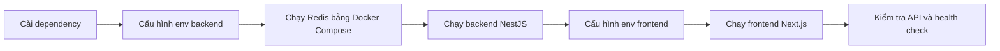

### 4.7.3 Cấu hình phụ thuộc và dữ liệu cần thiết

Ngoài dependency và biến môi trường, quá trình chạy local cần xác định rõ các cổng, endpoint và dịch vụ phụ thuộc để frontend, backend, database, Redis và AI provider có thể kết nối đúng.

| Thành phần | Địa chỉ local mặc định | Mục đích |
| --- | --- | --- |
| Backend API | `http://localhost:3000/api/v1` | REST API cho frontend. |
| Health check | `http://localhost:3000/health` | Kiểm tra database và Redis. |
| Frontend | `http://localhost:5173` | Giao diện người dùng. |
| Redis | `localhost:6379` | Hàng đợi và kênh sự kiện. |

Trong môi trường dev, hệ thống hỗ trợ cấu hình bỏ qua đăng nhập thật. Khi bật chế độ này, frontend gửi token giả lập và backend gắn request với một user mẫu trong database. Cách này chỉ dùng để demo và phát triển local, không dùng cho production.

## 4.8 Kiểm Soát Chất Lượng Trong Quá Trình Xây Dựng

Chất lượng của prototype được kiểm soát ở nhiều lớp: kiểu dữ liệu TypeScript, validation đầu vào, validation output AI, test backend, E2E frontend, build/lint và smoke check runtime.

| Biện pháp | Áp dụng ở đâu | Mục đích |
| --- | --- | --- |
| TypeScript | Client/server | Phát hiện lỗi kiểu dữ liệu khi phát triển, đồng bộ kiểu dữ liệu API và component. |
| DTO validation | Backend API | Từ chối request thiếu trường, sai loại phiên, JD quá ngắn hoặc câu trả lời quá ngắn. |
| Zod validation | AI output | Kiểm tra JSON từ AI trước khi lưu, tránh lưu output thiếu trường hoặc sai schema. |
| Unit test | Services/processors | Kiểm tra logic tạo phiên, nộp câu trả lời, fallback, report readiness, profile, question bank và các processor AI. |
| E2E test | Client luồng chính | Kiểm tra các luồng người dùng quan trọng ở mức trình duyệt khi cần. |
| Runtime smoke check | Backend/local | Gọi API gốc và health check để xác nhận backend, database và Redis sẵn sàng. |
| Lint/build | Client/server | Kiểm tra lỗi compile, lỗi coding style và khả năng build production. |

### 4.8.1 Kiểm soát dữ liệu đầu vào

Backend dùng DTO validation cho các request quan trọng. Ví dụ, tạo phiên yêu cầu JD có độ dài tối thiểu, loại phiên thuộc nhóm hợp lệ, context pack hợp lệ và số lượng câu hỏi nằm trong giới hạn. Gửi câu trả lời yêu cầu có question id, answer mode hợp lệ và nội dung đủ dài nếu không phải câu bị bỏ qua. Lưu JD cũng kiểm tra các trường như tên công ty, vị trí, level, yêu cầu và nội dung công việc.

Nhờ validation ở backend, frontend không phải là lớp bảo vệ duy nhất. Dù người dùng gọi API trực tiếp, dữ liệu sai vẫn bị chặn trước khi ghi vào database.

### 4.8.2 Kiểm soát output AI

Các output quan trọng từ AI được yêu cầu ở dạng JSON và validate bằng schema. Feedback phải có danh sách tiêu chí áp dụng, câu trả lời mẫu, nhận xét chính và danh sách đoạn được annotate. Câu hỏi sinh ra cũng được kiểm tra text, category, competency domain và độ khó.

Nếu output không hợp lệ, hệ thống không cố lưu dữ liệu sai. Pipeline chuyển sang lỗi có thể fallback hoặc retry tùy trường hợp. Cách này giúp dữ liệu trong báo cáo ổn định hơn, đặc biệt với các model có thể trả lời lệch format.

### 4.8.3 Kiểm soát qua test và smoke check

Backend có nhiều file test ở cấp service, controller, guard, processor và integration flow. Các nhóm test đáng chú ý gồm tạo phiên, nộp câu trả lời, xử lý skip, feedback processor, report processor, SSE, OpenAI gateway, validation DTO, question bank và runtime health.

Frontend có lint, build và Playwright E2E. Trong GR1, các kiểm thử này giúp phát hiện lỗi hợp đồng giữa frontend và backend như sai field trong report, sai trạng thái phiên hoặc xử lý loading chưa đúng.

Smoke check runtime dùng để xác nhận backend đã chạy được và các phụ thuộc quan trọng như database, Redis phản hồi đúng. Đây là bước cần thiết vì hệ thống không chỉ là web tĩnh mà còn phụ thuộc queue, database và AI provider.

## 4.9 Tổng Kết Chương

Chương 4 đã trình bày cách sản phẩm AI Mock Interview được phân tích, thiết kế và xây dựng trong phạm vi GR1 dựa trên mã nguồn hiện tại. Prototype đã hình thành được luồng chính từ quản lý JD, cấu hình phiên, sinh câu hỏi, trả lời phỏng vấn, tạo feedback đến xem báo cáo tổng hợp.

Về kiến trúc, hệ thống được tách thành frontend Next.js, backend NestJS, PostgreSQL/Supabase, Redis/BullMQ và AI provider. Các tác vụ AI dài được xử lý bất đồng bộ bằng queue, còn frontend theo dõi trạng thái bằng API, polling và SSE. Về dữ liệu, schema xoay quanh quan hệ phiên phỏng vấn, câu hỏi, câu trả lời, feedback và report. Về chất lượng, hệ thống có validation đầu vào, validation output AI, fallback, test và runtime health check.

Những nội dung này là cơ sở để Chương 5 đánh giá kết quả đạt được trong GR1, bao gồm mức độ hoàn thành chức năng, chất lượng giao diện, khả năng vận hành local, chất lượng AI feedback và các hạn chế còn tồn tại của prototype.

---
