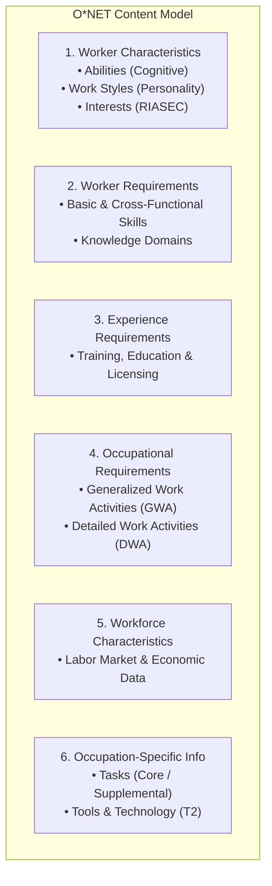
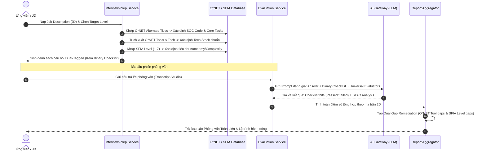

# Kiến Trúc Đánh Giá Phỏng Vấn Lai: Tích Hợp O*NET và SFIA 9 (Hybrid Assessment Architecture)

> **Trạng thái:** Đã phê duyệt kiến trúc (Arch-Approved)  
> **Phiên bản tài liệu:** 1.0.0  
> **Phạm vi áp dụng:** Server Module (`interview-prep`, `interview-assessment`), Database Schema (`Prisma`), AI Gateway & Prompting Pipeline.

---

## MỤC LỤC
1. [Bối Cảnh & Vấn Đề Cốt Lõi](#1-bối-cảnh--vấn-đề-cốt-lõi)
2. [Phân Tích Cấu Trúc Tài Liệu O*NET (Content Model)](#2-phân-tích-cấu-trúc-tài-liệu-onet-content-model)
3. [Khoảng Trống Của SFIA 9 & Sự Bổ Trợ Từ O*NET](#3-khoảng-trống-của-sfia-9--sự-bổ-trợ-từ-onet)
4. [Mô Hình Kiến Trúc Lai 2 Chiều (2D Hybrid Rubric)](#4-mô-hình-kiến-trúc-lai-2-chiều-2d-hybrid-rubric)
5. [Tính Sẵn Sàng & 4 Tầng Cấu Hình Bắt Buộc](#5-tính-sẵn-sàng--4-tầng-cấu-hình-bắt-buộc)
   - [5.1. Tầng Thang đo Thực thi: Binary Criteria Checklist](#51-tầng-thang-đo-thực-thi-binary-criteria-checklist)
   - [5.2. Tầng Phương pháp luận: Core Universal Dimensions](#52-tầng-phương-pháp-luận-core-universal-dimensions)
   - [5.3. Tầng Ngữ cảnh Doanh nghiệp: Evaluation Context Profile](#53-tầng-ngữ-cảnh-doanh-nghiệp-evaluation-context-profile)
   - [5.4. Tầng Hậu đánh giá: Dual Gap Remediation Engine](#54-tầng-hậu-đánh-giá-dual-gap-remediation-engine)
6. [Thiết Kế Cơ Sở Dữ Liệu (Prisma Schema Specification)](#6-thiết-kế-cơ-sở-dữ-liệu-prisma-schema-specification)
7. [Quy Trình Vận Hành Hoàn Chỉnh (End-to-End Pipeline)](#7-quy-trình-vận-hành-hoàn-chỉnh-end-to-end-pipeline)
8. [Lộ Trình Kỹ Thuật (Implementation Roadmap)](#8-lộ-trình-kỹ-thuật-implementation-roadmap)

---

## 1. Bối Cảnh & Vấn Đề Cốt Lõi

Hệ thống **InterviewCoach** hiện tại sử dụng **SFIA Version 9 (Skills Framework for the Information Age)** làm bộ khung nền tảng cho việc định danh năng lực, phân cấp kỹ năng (`Skill`), cấp bậc trách nhiệm (`Level` từ 1 đến 7), và tiêu chí câu hỏi (`SkillLevel`).

### Vấn đề thực tiễn:
1. **SFIA là khung năng lực trung lập công nghệ (Technology-Agnostic):** SFIA tập trung vào mức độ tự chủ, tầm ảnh hưởng và độ phức tạp trong công việc, nhưng **hoàn toàn không chứa danh mục công nghệ cụ thể** (như Docker, Kubernetes, PostgreSQL, Redis, React, AWS). Điều này buộc hệ thống phải duy trì một bảng ánh xạ thủ công cứng nhắc `tech-stack-sfia.map.ts`.
2. **Khó khăn khi ánh xạ Job Description (JD) thực tế:** Tiêu đề công việc trong JD từ nhà tuyển dụng rất đa dạng (*"Senior Golang Platform Engineer"*, *"Fullstack React/Node Developer"*), trong khi danh mục `Role` của SFIA quá hạn chế và khái quát.
3. **Phỏng vấn Hành vi / HR thiếu thang đo tâm lý nghề nghiệp:** Thuộc tính chung (*Generic Attributes*) của SFIA không đủ chi tiết để đánh giá các phẩm chất như khả năng chịu áp lực (*Stress Tolerance*), tính cẩn trọng (*Attention to Detail*), hay năng lực thích ứng (*Adaptability*).
4. **Khoảng cách giữa "Khung năng lực" và "Hệ thống chấm điểm thực thi":** Việc chỉ ghép O*NET và SFIA mới tạo ra **từ điển năng lực**. LLM vẫn không thể chấm điểm công bằng và nhất quán nếu thiếu thang đo hành vi định lượng (Checklist), phương pháp luận phỏng vấn (STAR), và ngữ cảnh doanh nghiệp (Fintech vs Startup).

Tài liệu này định hình kiến trúc kết hợp **O*NET + SFIA 9**, lấp đầy các khoảng trống trên và thiết lập quy chuẩn đánh giá 5 tầng cho AI.

---

## 2. Phân Tích Cấu Trúc Tài Liệu O*NET (Content Model)

Hệ thống **O*NET (Occupational Information Network)** do Bộ Lao động Hoa Kỳ phát triển, chuẩn hóa thông tin nghề nghiệp thông qua **Content Model 6 miền (Domains)**:



### Các tập dữ liệu cốt lõi ứng dụng vào InterviewCoach:

| Tập dữ liệu O*NET | Cấu trúc dữ liệu chính | Giá trị áp dụng cho Hệ thống |
| :--- | :--- | :--- |
| **Occupations & Alternate Titles** | `O*NET-SOC Code`, `Title`, `Alternate Title`, `Description` | Giải quyết triệt để khâu **JD Parsing**: Ánh xạ hàng trăm biến thể tên vị trí thực tế vào mã nghề nghiệp chuẩn hóa quốc tế (ví dụ: `15-1252.00` - Software Developers). |
| **Tasks & DWAs** (Detailed Work Activities) | `Task ID`, `Task Statement`, `Task Type (Core/Supp)`, `DWA ID`, `DWA Title` | **Ngữ cảnh câu hỏi thực tế**: Cung cấp các tình huống công việc thực thụ làm đề bài cho câu hỏi phỏng vấn kỹ thuật thay vì hỏi lý thuyết suông. |
| **Tools & Technology (T2)** | `Commodity Code`, `Tool Name`, `In Demand / Hot Technology Flag` | **Chuẩn hóa danh mục công nghệ**: Hơn 10,000 công nghệ được chuẩn hóa, gắn cờ xu hướng (Hot Tech), thay thế hoàn toàn bảng map thủ công. |
| **Knowledge** | `Element ID`, `Element Name`, `Importance Score (1-5)`, `Level Scale (0-100)` | **Định danh khối kiến thức nền tảng**: *Computers and Electronics*, *Engineering and Technology*, *Mathematics*, *Telecommunications*. |
| **Work Styles** | 16 phẩm chất: *Stress Tolerance, Adaptability, Cooperation, Attention to Detail, Analytical Thinking...* | **Tiêu chuẩn vàng cho Phỏng vấn HR/Behavioral**: Làm thang đo chấm điểm các câu hỏi tình huống theo mô hình STAR. |

---

## 3. Khoảng Trống Của SFIA 9 & Sự Bổ Trợ Từ O*NET

| Khoảng trống của SFIA 9 | Thực trạng hệ thống hiện tại | O*NET lấp đầy như thế nào |
| :--- | :--- | :--- |
| **1. Tools & Technology Gap** | SFIA trung lập công nghệ. Kỹ năng `PROG` không nói rõ dùng React hay Spring Boot. Code phải dùng `tech-stack-sfia.map.ts` tự viết. | **O\*NET T2 Database**: Cung cấp hàng nghìn công cụ chuẩn hóa theo phân nhóm phần mềm và gán cờ `isHotTech`. |
| **2. Task-level Context Gap** | Kỹ năng SFIA mô tả năng lực vĩ mô (*"Maintain data models"*), không có chi tiết nghiệp vụ cụ thể để tạo đề bài phỏng vấn sát thực tế. | **O\*NET Tasks & DWAs**: Cung cấp mô tả công việc vi mô (*"Write database queries to optimize transaction throughput"*). |
| **3. Behavioral & Work Styles Gap** | SFIA chỉ có 5 thuộc tính chung (*Autonomy, Influence, Complexity, Business Skills, Knowledge*), thiếu chiều sâu tâm lý học hành vi. | **16 O\*NET Work Styles**: Cung cấp chuẩn hành vi rõ ràng để đo lường độ chịu áp lực, tính chủ động, khả năng hợp tác. |
| **4. JD Matching & Alternate Titles Gap** | Số lượng Role của SFIA rất ít. Parse JD đang dùng chuỗi `if (jobTitle.includes('backend'))` rất mong manh. | **O\*NET Alternate Titles**: Cung cấp từ điển phong phú các biến thể chức danh công việc, hỗ trợ nhận diện JD tức thì. |
| **5. Fundamental Knowledge Gap** | SFIA định nghĩa năng lực thực hành, thiếu danh mục kiến thức nền tảng (Computer Science, Operating Systems). | **O\*NET Knowledge Elements**: Chuẩn hóa các miền kiến thức lý thuyết để đánh giá sinh viên mới tốt nghiệp hoặc vị trí R&D. |

---

## 4. Mô Hình Kiến Trúc Lai 2 Chiều (2D Hybrid Rubric)

Mô hình kết hợp tối ưu giữa O*NET và SFIA 9 là mô hình **Ma Trận Đánh Giá 2 Chiều**:

```
                         ▲ SFIA 9 (TRỤC TUNG: ĐỘ SÂU THÂM NIÊN & TRÁCH NHIỆM)
                         │
         Level 6-7 (Lead)│  • Tầm ảnh hưởng chiến lược, Thiết kế hệ thống chịu lỗi cao, Dẫn dắt tổ chức
                         │
         Level 4-5 (Sr)  │  • Giải quyết vấn đề phức tạp, Làm chủ kỹ thuật, Hướng dẫn thành viên khác
                         │
         Level 2-3 (Mid) │  • Thực thi độc lập các task kỹ thuật chuẩn mực, Tự chủ trong phạm vi dự án
                         │
         Level 1 (Entry) │  • Thực hiện theo hướng dẫn, Nắm cú pháp cơ bản
                         └────────────────────────────────────────────────────────►
                           O*NET (TRỤC HOÀNH: BỀ RỘNG NGHIỆP VỤ & CÔNG NGHỆ)
                           - Tasks & DWAs (e.g. REST API, Microservices, Data Pipeline)
                           - Tools & Tech Stack (e.g. Node.js, PostgreSQL, Docker, Kafka)
                           - Work Styles & Soft Skills (e.g. Stress Tolerance, Cooperation)
```

* **Trục Hoành (O\*NET - Bề rộng):** Định nghĩa **Ứng viên làm cái gì? Dùng công cụ gì? Thể hiện phong cách làm việc nào?**
* **Trục Tung (SFIA - Chiều sâu):** Định nghĩa **Ứng viên thực hiện công việc đó ở mức độ tự chủ (Autonomy), tầm ảnh hưởng (Influence) và độ phức tạp (Complexity) đến đâu?**

---

## 5. Tính Sẵn Sàng & 4 Tầng Cấu Hình Bắt Buộc

Việc có O*NET và SFIA chỉ tương đương với việc chuẩn bị dữ liệu thô. Để AI có thể đánh giá tự động một cách chính xác, hệ thống bắt buộc phải bổ sung **4 tầng cấu hình thực thi**:

### 5.1. Tầng Thang đo Thực thi: Binary Criteria Checklist
Loại bỏ hoàn toàn cơ chế chấm điểm cảm tính (dễ bị biến thiên giữa các lần chạy LLM) bằng cơ chế **Checklist nhị phân (Đạt / Không đạt)** gồm 5–7 điểm kiểm tra cho mỗi câu hỏi.

* **Cơ chế tính điểm:** $\text{Điểm chuyên môn} = \sum (\text{Trọng số của các tiêu chí đạt})$.
* **Ví dụ mẫu (Câu hỏi về Tối ưu hóa Database):**
  ```json
  [
    { "id": "chk_1", "criterion": "Chỉ ra chính xác nút thắt cổ chai (Full table scan, thiếu Index, N+1 query)", "weight": 20 },
    { "id": "chk_2", "criterion": "Nêu tên công cụ phân tích cụ thể (EXPLAIN ANALYZE, Slow Query Log, pg_stat_statements)", "weight": 20 },
    { "id": "chk_3", "criterion": "Đề xuất giải pháp Indexing chính xác (B-Tree, Composite Index, Partial Index)", "weight": 20 },
    { "id": "chk_4", "criterion": "Phân tích trade-off kỹ thuật (Tăng tốc độ Read nhưng làm chậm Write, tốn dung lượng Disk)", "weight": 20 },
    { "id": "chk_5", "criterion": "Đề xuất giải pháp kiến trúc bổ trợ (Redis Caching, Read-Replica, Partitioning)", "weight": 20 }
  ]
  ```

### 5.2. Tầng Phương pháp luận: Core Universal Dimensions
Được chấm điểm song song trong tất cả các câu hỏi (bên cạnh điểm chuyên môn):
1. **STAR / CAR Framework Compliance:** Đánh giá việc ứng viên nêu bối cảnh (Situation/Task), hành động cá nhân (Action - dùng "tôi" thay vì "chúng tôi"), và kết quả định lượng (Result).
2. **Communication Clarity & Conciseness:** Đi thẳng vào câu trả lời trong 15 giây đầu, không lan man, sử dụng thuật ngữ chính xác.
3. **Problem Decomposition & Trade-off Awareness:** Khả năng bẻ nhỏ bài toán lớn và nhận thức rõ không có giải pháp kỹ thuật nào là hoàn hảo.

### 5.3. Tầng Ngữ cảnh Doanh nghiệp: Evaluation Context Profile
Cấu hình khẩu vị đánh giá theo đặc thù ngành và vòng phỏng vấn:
```typescript
export interface EvaluationContextProfile {
  domain: 'fintech' | 'ecommerce' | 'startup_mvp' | 'enterprise_saas';
  interviewRound: 'screening' | 'technical_deepdive' | 'system_design' | 'hr_behavioral';
  rigorPolicy: {
    strictnessLevel: 'lenient' | 'standard' | 'high_bar';
    securityEmphasisWeight: number;    // Fintech = 1.5, Startup = 0.8
    scalabilityEmphasisWeight: number; // Enterprise = 1.4, Startup = 0.9
    speedToDeliverWeight: number;      // Startup = 1.5, Enterprise = 0.7
  };
}
```

### 5.4. Tầng Hậu đánh giá: Dual Gap Remediation Engine
Báo cáo sau phỏng vấn không chỉ chấm điểm mà phân tách rõ 2 nhóm lỗ hổng kèm giải pháp khắc phục cụ thể:
* **O\*NET Gap (Lỗ hổng Công nghệ & Nghiệp vụ):** Ứng viên thiếu kiến thức về một công cụ cụ thể -> Hệ thống đề xuất tài liệu kỹ thuật, bài lab thực hành, khóa học tương ứng.
* **SFIA Gap (Lỗ hổng Tư duy Thâm niên & Cấp bậc):** Ứng viên trả lời theo kiểu Level 2 (thụ động làm theo lệnh) trong khi vị trí đòi hỏi Level 4 (chủ động làm chủ và cố vấn) -> Hệ thống hướng dẫn cách nâng cấp cấu trúc câu trả lời thể hiện tư duy kiến trúc và tầm ảnh hưởng.

---

## 6. Thiết Kế Cơ Sở Dữ Liệu (Prisma Schema Specification)

Bổ sung các bảng O*NET tinh chọn (nhóm nghề `15-xxxx: Computer & Mathematical`) và bảng liên kết vào `schema.prisma`:

```prisma
// ==========================================
// O*NET TAXONOMY INTEGRATION
// ==========================================

model OnetOccupation {
  id              String               @id @default(dbgenerated("gen_random_uuid()")) @db.Uuid
  socCode         String               @unique @map("soc_code") // e.g. "15-1252.00"
  title           String
  description     String?              @db.Text
  createdAt       DateTime             @default(now()) @map("created_at") @db.Timestamptz(6)

  alternateTitles OnetAlternateTitle[]
  tasks           OnetTask[]
  tools           OnetToolTech[]
  roleMappings    RoleOnetMapping[]

  @@map("onet_occupations")
}

model OnetAlternateTitle {
  id              String         @id @default(dbgenerated("gen_random_uuid()")) @db.Uuid
  occupationId    String         @map("occupation_id") @db.Uuid
  alternateTitle  String         @map("alternate_title")
  
  occupation      OnetOccupation @relation(fields: [occupationId], references: [id], onDelete: Cascade)

  @@index([alternateTitle], map: "idx_onet_alternate_titles_title")
  @@map("onet_alternate_titles")
}

model OnetTask {
  id                String                 @id @default(dbgenerated("gen_random_uuid()")) @db.Uuid
  occupationId      String                 @map("occupation_id") @db.Uuid
  taskStatement     String                 @map("task_statement") @db.Text
  taskType          String?                @map("task_type") // "Core" | "Supplemental"
  importanceScore   Decimal?               @map("importance_score") @db.Decimal(5, 2)
  
  occupation        OnetOccupation         @relation(fields: [occupationId], references: [id], onDelete: Cascade)
  questionBankTasks QuestionBankOnetTask[]

  @@map("onet_tasks")
}

model OnetToolTech {
  id           String         @id @default(dbgenerated("gen_random_uuid()")) @db.Uuid
  occupationId String         @map("occupation_id") @db.Uuid
  toolName     String         @map("tool_name") // e.g. "PostgreSQL", "Docker"
  commodity    String?        @map("commodity") // Phân nhóm phần mềm
  isHotTech    Boolean        @default(false) @map("is_hot_tech")
  
  occupation   OnetOccupation @relation(fields: [occupationId], references: [id], onDelete: Cascade)

  @@index([toolName], map: "idx_onet_tools_tech_name")
  @@map("onet_tools_tech")
}

model OnetWorkStyle {
  id          String   @id @default(dbgenerated("gen_random_uuid()")) @db.Uuid
  code        String   @unique // e.g. "STRESS_TOLERANCE", "ANALYTICAL_THINKING"
  name        String
  description String   @db.Text

  @@map("onet_work_styles")
}

// ==========================================
// BRIDGING TABLES (O*NET, SFIA & QUESTION BANK)
// ==========================================

model RoleOnetMapping {
  id           String         @id @default(dbgenerated("gen_random_uuid()")) @db.Uuid
  roleId       String         @map("role_id") @db.Uuid
  occupationId String         @map("occupation_id") @db.Uuid

  role         Role           @relation(fields: [roleId], references: [id], onDelete: Cascade)
  occupation   OnetOccupation @relation(fields: [occupationId], references: [id], onDelete: Cascade)

  @@unique([roleId, occupationId], map: "role_onet_mappings_unique")
  @@map("role_onet_mappings")
}

model QuestionBankOnetTask {
  id             String       @id @default(dbgenerated("gen_random_uuid()")) @db.Uuid
  questionBankId String       @map("question_bank_id") @db.Uuid
  onetTaskId     String       @map("onet_task_id") @db.Uuid

  questionBank   QuestionBank @relation(fields: [questionBankId], references: [id], onDelete: Cascade)
  onetTask       OnetTask     @relation(fields: [onetTaskId], references: [id], onDelete: Cascade)

  @@unique([questionBankId, onetTaskId], map: "question_bank_onet_tasks_unique")
  @@map("question_bank_onet_tasks")
}
```

---

## 7. Quy Trình Vận Hành Hoàn Chỉnh (End-to-End Pipeline)



---

## 8. Lộ Trình Kỹ Thuật (Implementation Roadmap)

### Giai đoạn 1: Schema Migration & Data Seeding
* Cập nhật `schema.prisma` với các model O*NET và bảng liên kết.
* Viết script seed dữ liệu O*NET nhóm `15-xxxx` (Software Developers, QA, DevOps, Data Engineers, Architects) cùng từ điển Tools & Technology và 16 Work Styles.

### Giai đoạn 2: Refactor Taxonomy & Mapping Services
* Nâng cấp `SfiaMappingService` thành `HybridMappingService`:
  - Thay thế logic tìm kiếm chuỗi thô sơ bằng cơ chế so khớp O*NET Alternate Titles.
  - Tự động nhận diện công nghệ dựa trên `OnetToolTech` thay cho file map tĩnh.

### Giai đoạn 3: Cấu hình Question Bank & Binary Checklists
* Chuẩn hóa `QuestionBank`: Gắn nhãn kép (`QuestionBankSkillLevel` và `QuestionBankOnetTask`).
* Bổ sung trường `evaluationChecklist` vào cấu trúc `contentJson` của từng câu hỏi.

### Giai đoạn 4: Tích hợp Prompting Pipeline & Dual Gap Report
* Cập nhật `PromptBuilderService` để đưa `evaluationChecklist` và `EvaluationContextProfile` vào prompt đánh giá phỏng vấn.
* Nâng cấp `ReportMetricsAggregator` để tổng hợp điểm số 2 chiều và xuất báo cáo khắc phục lỗ hổng kép (Dual Gap Action Plan).
