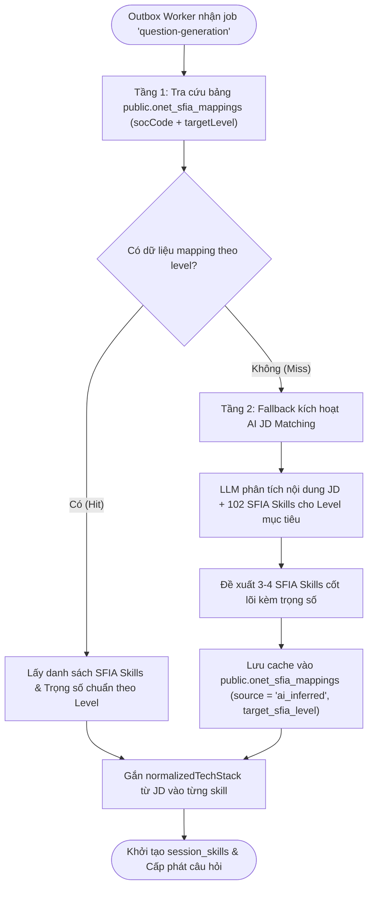

# Kế Hoạch Kỹ Thuật Chi Tiết: Tinh Chỉnh Schema `public` & Tích Hợp Đánh Giá Phỏng Vấn Tinh Gọn O*NET + SFIA 9 (Unified Interview Engine)

> **Mục tiêu:** Tinh chỉnh toàn diện Schema `public` thành Cỗ Máy Đánh Giá Phỏng Vấn Tinh Gọn (Unified Interview Engine), liên kết lỏng (Loose Coupling) với 2 kho dữ liệu tham chiếu tĩnh `sfia` và `onet`. Loại bỏ hoàn toàn sự phân mảnh, chồng chéo dữ liệu; quy tụ toàn bộ quy trình tạo đề, phỏng vấn và xuất báo cáo vào một bản hợp đồng đánh giá duy nhất: **`session_skills`**.  
> **Source of Truth:** 
> - `docs/Design/DetailedDesign/database-design/Database.md` (Public Schema)
> - `docs/Design/DetailedDesign/database-design/Sfia-Database.md` (SFIA 9 Reference Schema)
> - `docs/Design/DetailedDesign/database-design/Onet-Database.md` (O*NET 31.0 Reference Schema)
> - `docs/onet-sfia-hybrid-assessment-framework.md` (Khung đánh giá lai)
> - `server/CONVENTIONS.md` (Quy chuẩn kiến trúc NestJS & DDD)  
> **Vị trí tài liệu:** `docs/public-schema-refinement-and-hybrid-integration-plan.md`  
> **Trạng thái:** Đã qua rà soát kiến trúc chuyên sâu (/grill-me aligned v4) - Tinh gọn, Thống nhất, Không kẽ hở & Sẵn sàng triển khai (Ready for Execution)

---

## MỤC LỤC

1. [Tổng Quan Bối Cảnh & Kết Quả Thẩm Định Kiến Trúc (/grill-me v4)](#1-tổng-quan-bối-cảnh--kết-quả-thẩm-định-kiến-trúc-grill-me-v4)
   - [1.1 Hiện trạng CSDL 3 Schemas](#11-hiện-trạng-csdl-3-schemas)
   - [1.2 Nhận diện điểm nghẽn: Sự chồng chéo & phân mảnh dữ liệu](#12-nhận-diện-điểm-nghẽn-sự-chồng-chéo--phân-mảnh-dữ-liệu)
   - [1.3 Tư duy Interviewer thực tế & Nguyên tắc Quy tụ dữ liệu](#13-tư-duy-interviewer-thực-tế--nguyên-tắc-quy-tụ-dữ-liệu)
   - [1.4 Các quyết định kỹ thuật đã chốt qua /grill-me](#14-các-quyết-định-kỹ-thuật-đã-chốt-qua-grill-me)
2. [Nguyên Tắc Kiến Trúc & Thiết Kế Khóa Mềm (Loose Coupling)](#2-nguyên-tắc-kiến-trúc--thiết-kế-khóa-mềm-loose-coupling)
   - [2.1 Sơ đồ kiến trúc liên kết lỏng](#21-sơ-đồ-kiến-trúc-liên-kết-lỏng)
   - [2.2 Cơ chế cầu nối 2 tầng của HybridMappingService](#22-cơ-chế-cầu-nối-2-tầng-của-hybridmappingservice)
3. [Đặc Tả Chi Tiết Schema `public` Mới (Prisma Schema & DDL)](#3-đặc-tả-chi-tiết-schema-public-mới-prisma-schema--ddl)
   - [3.1 Bảng cầu nối mới: `onet_sfia_mappings`](#31-bảng-cầu-nối-mới-onet_sfia_mappings)
   - [3.2 Bảng tiêu chí nhị phân mới: `question_criteria`](#32-bảng-tiêu-chí-nhị-phân-mới-question_criteria)
   - [3.3 Danh mục 7 bảng SFIA & Trung gian cũ cần loại bỏ sau khi chuyển đổi](#33-danh-mục-7-bảng-sfia--trung-gian-cũ-cần-loại-bỏ-sau-khi-chuyển-đổi)
   - [3.4 Đặc tả các bảng sửa đổi trong `schema.prisma`](#34-đặc-tả-các-bảng-sửa-đổi-trong-schemaprisma)
   - [3.5 Cấu trúc dữ liệu bán cấu trúc chuẩn hóa (JSONB Schemas)](#35-cấu-trúc-dữ-liệu-bán-cấu-trúc-chuẩn-hóa-jsonb-schemas)
4. [Thiết Kế Tầng Facade & Reference Modules (`SfiaModule` & `OnetModule`)](#4-thiết-kế-tầng-facade--reference-modules-sfiamodule--onetmodule)
   - [4.1 Bounded Context `SfiaModule` & Hợp đồng `ISfiaFacade`](#41-bounded-context-sfiamodule--hợp-đồng-isfiafacade)
   - [4.2 Bounded Context `OnetModule` & Hợp đồng `IOnetFacade`](#42-bounded-context-onetmodule--hợp-đồng-ionetfacade)
5. [Tích Hợp Tầng Nghiệp Vụ - Quy Trình 5 Pha Tinh Gọn](#5-tích-hợp-tầng-nghiệp-vụ---quy-trình-5-pha-tinh-gọn)
   - [5.1 Pha 1: Phân tích JD & Khởi tạo Phiên (Xác định `session_skills`)](#51-pha-1-phân-tích-jd--khởi-tạo-phiên-xác-định-session_skills)
   - [5.2 Pha 2: Cấp phát Câu hỏi Phỏng vấn & Bộ Tiêu chí Nhị phân](#52-pha-2-cấp-phát-câu-hỏi-phỏng-vấn--bộ-tiêu-chí-nhị-phân)
   - [5.3 Pha 3: Ứng viên Trả lời & AI Đánh giá Nhị phân theo Criteria](#53-pha-3-ứng-viên-trả-lời--ai-đánh-giá-nhị-phân-theo-criteria)
   - [5.4 Pha 4: Cỗ máy Chấm điểm Tất định Backend (0-100 & Demonstrated Level)](#54-pha-4-cỗ-máy-chấm-điểm-tất-định-backend-0-100--demonstrated-level)
   - [5.5 Pha 5: Báo cáo Đánh giá Năng lực Toàn Phiên (Session Competency Report)](#55-pha-5-báo-cáo-đánh-giá-năng-lực-toàn-phiên-session-competency-report)
   - [5.6 Xử lý Bất đồng bộ qua Transactional Outbox Worker](#56-xử-lý-bất-đồng-bộ-qua-transactional-outbox-worker)
6. [Lộ Trình Thực Thi 5 Giai Đoạn Chi Tiết (Execution Plan)](#6-lộ-trình-thực-thi-5-giai-đoạn-chi-tiết-execution-plan)
   - [Ma trận tệp tin tác động theo giai đoạn](#ma-trận-tệp-tin-tác-động-theo-giai-đoạn)
   - [Giai đoạn 1: Database Migration & Làm giàu dữ liệu QuestionBank](#giai-đoạn-1-database-migration--làm-giàu-dữ-liệu-questionbank)
   - [Giai đoạn 2: Xây dựng 2 Bounded Contexts `SfiaModule` & `OnetModule`](#giai-đoạn-2-xây-dựng-2-bounded-contexts-sfiamodule--onetmodule)
   - [Giai đoạn 3: Cầu nối Hybrid & Tích hợp JD / Session Lifecycle](#giai-đoạn-3-cầu-nối-hybrid--tích-hợp-jd--session-lifecycle)
   - [Giai đoạn 4: Cấp phát câu hỏi theo `session_skills` & Tiêu chí nhị phân](#giai-đoạn-4-cấp-phát-câu-hỏi-theo-session_skills--tiêu-chí-nhị-phân)
   - [Giai đoạn 5: Chấm điểm tất định & Báo cáo năng lực phiên](#giai-đoạn-5-chấm-điểm-tất-định--báo-cáo-năng-lực-phiên)
7. [Kế Hoạch Kiểm Thử & Tiêu Chí Nghiệm Thu (QA & Verification Plan)](#7-kế-hoạch-kiểm-thử--tiêu-chí-nghiệm-thu-qa--verification-plan)
8. [Ma Trận Quản Trị Rủi Ro (Risk Mitigation Matrix)](#8-ma-trận-quản-trị-rủi-ro-risk-mitigation-matrix)

---

## 1. Tổng Quan Bối Cảnh & Kết Quả Thẩm Định Kiến Trúc (/grill-me v3)

### 1.1 Hiện trạng CSDL 3 Schemas
Hệ thống PostgreSQL của InterviewCoach được phân chia thành 3 schemas:
1. **Schema `sfia` (Tĩnh, Read-Only):** 7 bảng chuẩn hóa chứa toàn bộ tri thức SFIA Version 9 (102 kỹ năng, 7 cấp độ trách nhiệm, 5 thuộc tính chung).
2. **Schema `onet` (Tĩnh, Read-Only):** 45 bảng chuẩn hóa O*NET Database 31.0 (>1.12 triệu bản ghi, 58,000 tiêu đề công việc, công cụ/công nghệ).
3. **Schema `public` (Động, Giao dịch):** Quản trị người dùng, hồ sơ, tin tuyển dụng, phiên phỏng vấn, câu hỏi, câu trả lời, phản hồi AI và báo cáo.

### 1.2 Nhận diện điểm nghẽn: Sự chồng chéo & phân mảnh dữ liệu
Qua thẩm định kiến trúc chuyên sâu (/grill-me), hệ thống trước đây mắc phải các vấn đề nghiêm trọng:
1. **Bội thực dữ liệu và thiếu liên kết:** Cố gắng đưa toàn bộ O\*NET Tasks, SFIA Generic Attributes, STAR Methodology vào cùng một lúc khiến dữ liệu bị rời rạc, không ánh xạ thống nhất được với nhau.
2. **Kéo dữ liệu thừa thãi:** Việc trích xuất 3–5 Core Tasks từ O\*NET và nén vào snapshot lịch sử tạo gánh nặng lưu trữ nhưng không giải quyết câu hỏi cốt lõi của phỏng vấn.
3. **Chấm điểm phân mảnh & mâu thuẫn:** Tách thành 3 thang điểm riêng lẻ (`onet_technical`, `sfia_responsibility`, `star_methodology`) khiến điểm số rối rắm, AI dễ ảo giác.
4. **Báo cáo xa rời thực tế tuyển dụng:** Phân loại 3 trạng thái O\*NET Tasks (`proficient`, `gap`, `not_assessed`) cùng Radar chart 5 chiều quá phức tạp, không trả lời trực diện: *Ứng viên có đạt các yêu cầu của JD hay không?*

### 1.3 Tư duy Interviewer thực tế & Nguyên tắc Quy tụ dữ liệu
Mô hình mới tái cấu trúc theo đúng **Tư duy của một Người Phỏng Vấn (Interviewer Mindset)**:

```
┌─────────────────────────────────────────────────────────────────────────────────────────────┐
│                            QUY TRÌNH INTERVIEWER THỰC CHIẾN                                 │
├─────────────────────────────────────────────────────────────────────────────────────────────┤
│ 1. ĐỌC JD  ──► Xác định BẢNG KỸ NĂNG CẦN ĐÁNH GIÁ (session_skills)                         │
│                • Kỹ năng gì? (SFIA Skill: PROG, DBDS...)                                    │
│                • Công nghệ/Nghiệp vụ nào? (O*NET Tech: Node.js, PostgreSQL...)              │
│                • Cấp bậc kỳ vọng nào? (Target Level: 4 - Senior)                            │
│                • Trọng số từng kỹ năng (Weight: 40%, 30%...)                                │
├─────────────────────────────────────────────────────────────────────────────────────────────┤
│ 2. RA ĐỀ   ──► Phân bổ các câu hỏi phủ qua danh sách session_skills                         │
│                • Mỗi câu hỏi tập trung vào ĐÚNG 1 session_skill                             │
│                • Kèm 2-3 Tiêu chí (Criteria) cụ thể để kiểm tra Đạt/Không                   │
├─────────────────────────────────────────────────────────────────────────────────────────────┤
│ 3. CHẤM    ──► Ứng viên trả lời ──► AI chấm Pass/Fail từng Criterion (kèm Evidence)         │
│                • BỎ STAR. Chuẩn hóa về 1 thang đo duy nhất (0 - 100)                        │
│                • Điểm và Level câu hỏi cộng dồn trực tiếp vào session_skill tương ứng       │
├─────────────────────────────────────────────────────────────────────────────────────────────┤
│ 4. BÁO CÁO ──► Tổng kết theo từng session_skill:                                            │
│                • Bảng đối chiếu: Target Level vs Demonstrated Level & Điểm số               │
│                • Kết luận phiên: Đạt (Recommended) / Cân nhắc (Borderline) / Chưa đạt       │
│                • Action Plan: Lộ trình khắc phục các kỹ năng bị hụt level                   │
└─────────────────────────────────────────────────────────────────────────────────────────────┘
```

### 1.4 Các quyết định kỹ thuật đã chốt qua /grill-me

| Thành phần | Thiết kế cũ (Bị loại bỏ) | Thiết kế mới tinh gọn (Đã thống nhất v4) |
| :--- | :--- | :--- |
| **Vai trò O\*NET** | Kéo Core Tasks, DWAs, Work Styles, T2 | **Chỉ dùng chuẩn hóa Tên nghề (`onet_soc_code`) và Tech Stack thực tế (`normalizedTechStack`).** Bỏ Core Tasks rời rạc. |
| **Vai trò SFIA** | Kéo Level Statements, Generic Attributes | **Cung cấp Danh mục Kỹ năng chuẩn (`sfia_skill_code`) và Thang cấp bậc (Level 1–7).** |
| **Điểm quy tụ dữ liệu** | Bị phân mảnh giữa `context_snapshot`, `session_skills`, O\*NET Tasks | **Quy tụ duy nhất vào `session_skills`** (đầy đủ Kỹ năng, Tech Stack ngữ cảnh, Target Level, Trọng số). |
| **Liên kết Câu hỏi** | Câu hỏi gắn nhãn kép chung chung, ôm đồm nhiều tiêu chí | **100% câu hỏi đánh giá kỹ năng gắn vào 1 `session_skill`.** Cho phép `sessionSkillId` nullable cho câu hỏi khởi động/icebreaker không tính điểm. |
| **Tiêu chí chấm (Rubric)** | 3–5 tiêu chí gồm cả STAR, SFIA, O\*NET | **2–3 tiêu chí nhị phân chuẩn hóa 2 chiều:** Chiều cốt lõi (`core`: kỹ thuật cho Tech, hành vi/văn hóa cho HR) + Chiều thâm niên (`seniority`: tư duy làm chủ, trade-off, mức độ tự chủ). **Bỏ hẳn STAR.** |
| **Thang đo & Tính điểm** | 3 thang điểm riêng rẽ (Technical, SFIA, STAR) | **Một thang đo duy nhất (0–100).** Backend tính điểm tất định từ tỷ lệ pass criteria (`CorePassRate` & `SeniorityPassRate`). Câu bỏ qua/hết giờ nhận 0 điểm, Level 1, tính vào mẫu số $N_{\text{questions}}$. Câu icebreaker (`sessionSkillId = null`) không tính vào kỹ năng. |
| **Phiên phỏng vấn HR** | Tách biệt với rubric và luồng riêng | **Quy tụ vào Unified Engine:** Vẫn tạo `session_skills` dựa trên SFIA Behavioral Skills (People & Skills, Relationships & Engagement, Generic Attributes) với tiêu chí chuẩn hóa 2 chiều `core` và `seniority`. |
| **Báo cáo cuối phiên** | Dual Gap Analysis, 5 bản ghi report nhỏ lẻ | **Hợp nhất thành 1 bản ghi `session_reports` duy nhất (`report_type = 'session_competency_evaluation'`):** Gồm Bảng phân tích từng `session_skill` + Overall Recommendation + Action Plan. Tập trung hoàn thiện Backend Engine trước, Frontend UI sẽ refactor sau. |
| **Hạ tầng Outbox** | Tên lệnh tự do không đồng nhất | **Chuẩn hóa WorkflowCommandType:** `feedback`, `report-generation`, `question-generation`. `HybridMappingService` thực thi bất đồng bộ trong worker `question-generation` giúp API `POST /sessions` phản hồi ngay (<100ms). |
| **Thứ tự Migration** | Drop bảng cũ ngay ở Phase 1 gây lỗi compile | **Add-only Migration ở Phase 1:** Giữ 7 bảng cũ và `dimensionScores` trong Phase 1–4 để hệ thống luôn build/test xanh qua từng phase. Chỉ drop triệt để ở cuối Phase 5 sau khi đã refactor toàn diện. |

---

## 2. Nguyên Tắc Kiến Trúc & Thiết Kế Khóa Mềm (Loose Coupling)

### 2.1 Sơ đồ kiến trúc liên kết lỏng

```
┌─────────────────────────────────────────────────────────────────────────────┐
│                    CROSS-SCHEMA LOOSE COUPLING ARCHITECTURE                 │
├───────────────────────────────────┬─────────────────────────────────────────┤
│    REFERENCE SCHEMAS (READ-ONLY)  │     TRANSACTIONAL SCHEMA (PUBLIC)       │
│  - schema sfia (7 tables)         │  - schema public (Users, Sessions...)   │
│  - schema onet (45 tables)        │  - Bridge: onet_sfia_mappings           │
│  - ZERO runtime mutations         │  - Anchor: session_skills               │
├───────────────────────────────────┴─────────────────────────────────────────┤
│                                 CẦU NỐI                                     │
│  1. KHÔNG tạo PostgreSQL Foreign Key cứng xuyên schema.                     │
│  2. Liên kết qua KHÓA TỰ NHIÊN (Logical Business Codes):                    │
│     • onet_soc_code (VARCHAR(10))        -> onet.occupation_data            │
│     • sfia_skill_code (VARCHAR(10))      -> sfia.skills                     │
│     • target_level / actual_level        -> sfia.levels (1-7)               │
│  3. Giao tiếp mã nguồn 100% qua Facades (ISfiaFacade, IOnetFacade).         │
│  4. session_skills là trung tâm điều phối toàn bộ vòng đời phỏng vấn.       │
└─────────────────────────────────────────────────────────────────────────────┘
```

### 2.2 Cơ chế cầu nối 2 tầng của `HybridMappingService` (Thực thi trong Outbox Worker)

`HybridMappingService` được kích hoạt bất đồng bộ bên trong Transactional Outbox Worker (`commandType = 'question-generation'`). Điều này đảm bảo API khởi tạo phiên (`POST /sessions`) luôn phản hồi cực nhanh (< 100ms) mà không bị nghẽn bởi các cuộc gọi LLM:



---

## 3. Đặc Tả Chi Tiết Schema `public` Mới (Prisma Schema & DDL)

### 3.1 Bảng Cầu Nối Mới: `onet_sfia_mappings`
Lưu trữ ma trận ánh xạ chuẩn giữa mã nghề O\*NET và các kỹ năng SFIA tương ứng theo từng cấp bậc (Junior/Mid/Senior), quản lý tại schema `public`:

```prisma
model OnetSfiaMapping {
  id              String   @id @default(dbgenerated("gen_random_uuid()")) @db.Uuid
  onetSocCode     String   @map("onet_soc_code") @db.VarChar(10) // e.g. '15-1252.00'
  sfiaSkillCode   String   @map("sfia_skill_code") @db.VarChar(10) // e.g. 'PROG', 'DBDS'
  targetSfiaLevel Int      @default(3) @map("target_sfia_level") @db.SmallInt // Level cụ thể (2: Junior, 3: Middle, 4: Senior...)
  defaultWeight   Decimal  @default(1.00) @map("default_weight") @db.Decimal(5, 2)
  isCore          Boolean  @default(true) @map("is_core")
  source          String   @default("curated") @map("source") // 'curated', 'ai_inferred'
  createdAt       DateTime @default(now()) @map("created_at") @db.Timestamptz(6)

  @@unique([onetSocCode, sfiaSkillCode, targetSfiaLevel], map: "onet_sfia_mappings_unique")
  @@index([onetSocCode], map: "idx_onet_sfia_mappings_soc")
  @@index([sfiaSkillCode], map: "idx_onet_sfia_mappings_sfia")
  @@map("onet_sfia_mappings")
}
```

### 3.2 Bảng Tiêu Chí Nhị Phân Mới: `question_criteria`
Lưu trữ bộ 2–3 tiêu chí chấm điểm nhị phân (Pass/Fail) gắn trực tiếp với từng câu hỏi trong ngân hàng câu hỏi, chuẩn hóa trên 2 chiều `core` và `seniority`:

```prisma
model QuestionCriteria {
  id             String       @id @default(dbgenerated("gen_random_uuid()")) @db.Uuid
  questionBankId String       @map("question_bank_id") @db.Uuid
  criteriaText   String       @map("criteria_text") @db.Text
  dimension      String       @db.VarChar(30) // 'core' (kỹ thuật/hành vi), 'seniority' (tư duy thâm niên/trách nhiệm)
  weight         Decimal      @default(1.00) @map("weight") @db.Decimal(5, 2)
  orderIndex     Int          @default(0) @map("order_index")
  createdAt      DateTime     @default(now()) @map("created_at") @db.Timestamptz(6)

  questionBank   QuestionBank @relation(fields: [questionBankId], references: [id], onDelete: Cascade)

  @@index([questionBankId], map: "idx_question_criteria_bank_id")
  @@map("question_criteria")
}
```

### 3.3 Danh Mục 7 Bảng SFIA & Trung Gian Cũ (Chiến Lược Add-Only Migration)
Để đảm bảo mã nguồn backend luôn biên dịch thành công (`npm run build`) và toàn bộ test suites luôn vượt qua trong suốt quá trình triển khai từ Phase 1 đến Phase 4, **7 bảng cũ sau được giữ lại tạm thời trong Phase 1 (Add-only Migration)**:
1. `public.levels`
2. `public.roles`
3. `public.skills`
4. `public.skill_levels`
5. `public.role_skills`
6. `public.question_bank_skill_levels`
7. `public.session_question_skill_levels`

> [!IMPORTANT]
> **Thời điểm dọn dẹp triệt để:** 7 bảng cũ này và cột `dimensionScores` trên `ai_feedbacks` chỉ được xóa bỏ khỏi `schema.prisma` và CSDL ở **cuối Giai đoạn 5 (Bước 5.5)**, sau khi `SfiaModule` mới đã thay thế hoàn toàn `sfia-taxonomy.service.ts` và `ScoringEngineService` mới đã thay thế hoàn toàn luồng chấm cũ.

### 3.4 Đặc Tả Các Bảng Sửa Đổi Trong `schema.prisma`

#### 1. Model `SavedJobDescription` (Sửa đổi)
```prisma
model SavedJobDescription {
  id                  String             @id @default(dbgenerated("gen_random_uuid()")) @db.Uuid
  userId              String             @map("user_id") @db.Uuid
  companyProfileId    String?            @map("company_profile_id") @db.Uuid
  companyName         String             @map("company_name")
  companyWebsite      String?            @map("company_website")
  jobTitle            String             @map("job_title")
  level               String?            // Senior, Middle, Junior (từ khóa thô từ JD)
  headcount           String?
  location            String?
  requirements        String
  jobContent          String             @map("job_content")
  techStack           String[]           @default([]) @map("tech_stack")
  benefits            String?
  salary              String?
  bonus               String?
  
  // === TRƯỜNG MỚI TÍCH HỢP O*NET & SFIA ===
  onetSocCode         String?            @map("onet_soc_code") @db.VarChar(10)
  onetOccupationTitle String?            @map("onet_occupation_title") @db.VarChar(150)
  targetSfiaLevel     Int?               @map("target_sfia_level") @db.SmallInt
  normalizedTechStack Json?              @map("normalized_tech_stack") // Danh sách công nghệ chuẩn hóa từ O*NET

  lastUsedAt          DateTime?          @map("last_used_at") @db.Timestamptz(6)
  deletedAt           DateTime?          @map("deleted_at") @db.Timestamptz(6)
  createdAt           DateTime           @default(now()) @map("created_at") @db.Timestamptz(6)
  updatedAt           DateTime           @default(now()) @updatedAt @map("updated_at") @db.Timestamptz(6)

  user                User               @relation(fields: [userId], references: [id], onDelete: Cascade)
  companyProfile      CompanyProfile?    @relation(fields: [companyProfileId], references: [id])
  sessions            InterviewSession[]

  @@index([userId, updatedAt(sort: Desc)], map: "idx_saved_job_descriptions_user_updated")
  @@index([userId, companyName, jobTitle], map: "idx_saved_job_descriptions_user_company_title")
  @@index([onetSocCode], map: "idx_saved_jds_onet_soc")
  @@map("saved_job_descriptions")
}
```

#### 2. Model `InterviewSession` (Sửa đổi)
```prisma
model InterviewSession {
  id                    String              @id @default(dbgenerated("gen_random_uuid()")) @db.Uuid
  savedJobDescriptionId String              @map("saved_job_description_id") @db.Uuid
  jobDescription        String              @map("job_description")
  sessionType           String              @map("session_type") // 'hr', 'technical'
  numQuestions          Int                 @default(5) @map("num_questions")
  durationMin           Int                 @default(30) @map("duration_min")
  remainingSeconds      Int?                @map("remaining_seconds")
  language              String              @default("vi")
  contextPackId         String              @map("context_pack_id")
  sfiaVersion           String              @default("9.0.0") @map("sfia_version")
  status                String              @default("generating") // 'generating', 'ready', 'active', 'completed', 'error'
  
  // === TRƯỜNG MỚI TÍCH HỢP O*NET & SFIA ===
  onetSocCode           String?             @map("onet_soc_code") @db.VarChar(10)
  targetSfiaLevel       Int?                @map("target_sfia_level") @db.SmallInt
  competencyMatchRate   Decimal?            @map("competency_match_rate") @db.Decimal(5, 2)
  recommendationStatus  String?             @map("recommendation_status") @db.VarChar(30) // 'strongly_recommended', 'recommended', 'borderline', 'not_recommended'

  overallScore          Int?                @map("overall_score") // 0 - 100
  completedAt           DateTime?           @map("completed_at") @db.Timestamptz(6)
  createdAt             DateTime            @default(now()) @map("created_at") @db.Timestamptz(6)
  updatedAt             DateTime            @default(now()) @updatedAt @map("updated_at") @db.Timestamptz(6)

  savedJobDescription   SavedJobDescription @relation(fields: [savedJobDescriptionId], references: [id], onDelete: Restrict)
  sessionQuestions      SessionQuestion[]
  sessionReports        SessionReport[]
  sessionSkills         SessionSkill[]

  @@index([createdAt(sort: Desc)], map: "idx_interview_sessions_created_at")
  @@index([savedJobDescriptionId], map: "idx_interview_sessions_saved_jd")
  @@index([onetSocCode], map: "idx_interview_sessions_onet_soc")
  @@map("interview_sessions")
}
```

#### 3. Model `SessionSkill` (Bản hợp đồng đánh giá của phiên phỏng vấn)
```prisma
model SessionSkill {
  id           String           @id @default(dbgenerated("gen_random_uuid()")) @db.Uuid
  sessionId    String           @map("session_id") @db.Uuid
  skillCode    String           @map("skill_code") @db.VarChar(10) // SFIA Skill Code (e.g. 'PROG', 'DBDS')
  techContext  String[]         @default([]) @map("tech_context") // Công nghệ O*NET áp dụng (e.g. ['Node.js', 'TypeScript'])
  targetLevel  Int              @default(3) @map("target_level") @db.SmallInt // 1 to 7
  actualLevel  Int?             @map("actual_level") @db.SmallInt // Cấp độ thực tế thể hiện sau phiên
  score        Int?             @map("score") // Điểm số 0 - 100 của kỹ năng này
  weight       Decimal          @default(1.00) @map("weight") @db.Decimal(5, 2)
  priority     Int?             @default(1)
  source       String           @map("source") // 'curated_mapping', 'ai_inferred'
  reasoning    Json?            @map("reasoning")
  createdAt    DateTime         @default(now()) @map("created_at") @db.Timestamptz(6)

  session          InterviewSession  @relation(fields: [sessionId], references: [id], onDelete: Cascade)
  sessionQuestions SessionQuestion[]

  @@unique([sessionId, skillCode], map: "session_skills_session_skill_code_key")
  @@index([sessionId], map: "idx_session_skills_session")
  @@index([skillCode], map: "idx_session_skills_skill_code")
  @@map("session_skills")
}
```

#### 4. Model `QuestionBank` (Sửa đổi)
```prisma
model QuestionBank {
  id                   String                 @id @default(dbgenerated("gen_random_uuid()")) @db.Uuid
  content              String
  sessionType          QuestionSessionType    @map("session_type")
  difficulty           Int
  contextPackId        String                 @map("context_pack_id")
  estimatedTimeMin     Int?                   @map("estimated_time_min")
  translations         Json?
  contentJson          Json?                  @map("content_json")

  // === TRƯỜNG MỚI GẮN NHÃN KÉP O*NET + SFIA ===
  onetSocCode          String?                @map("onet_soc_code") @db.VarChar(10)
  sfiaSkillCode        String?                @map("sfia_skill_code") @db.VarChar(10)
  targetSfiaLevel      Int?                   @map("target_sfia_level") @db.SmallInt

  deletedAt            DateTime?              @map("deleted_at") @db.Timestamptz(6)
  createdAt            DateTime               @default(now()) @map("created_at") @db.Timestamptz(6)
  updatedAt            DateTime               @default(now()) @updatedAt @map("updated_at") @db.Timestamptz(6)

  questionCriteria     QuestionCriteria[]
  sessionQuestions     SessionQuestion[]

  @@index([contextPackId], map: "idx_question_bank_context_pack", where: raw("(deleted_at IS NULL)"))
  @@index([sessionType, difficulty], map: "idx_question_bank_session_type_difficulty", where: raw("(deleted_at IS NULL)"))
  @@index([onetSocCode, targetSfiaLevel], map: "idx_question_bank_soc_level", where: raw("(deleted_at IS NULL)"))
  @@index([sfiaSkillCode, targetSfiaLevel], map: "idx_question_bank_sfia_skill_level", where: raw("(deleted_at IS NULL)"))
  @@map("question_bank")
}
```

#### 5. Model `SessionQuestion` (Sửa đổi: Liên kết trực tiếp với 1 `SessionSkill`)
```prisma
model SessionQuestion {
  id                 String           @id @default(dbgenerated("gen_random_uuid()")) @db.Uuid
  sessionId          String           @map("session_id") @db.Uuid
  sessionSkillId     String?          @map("session_skill_id") @db.Uuid // Gắn vào 1 session_skill để tính điểm. Nullable cho câu hỏi warm-up/icebreaker không tính điểm SFIA
  questionBankId     String?          @map("question_bank_id") @db.Uuid
  questionText       String           @map("question_text")
  orderIndex         Int              @map("order_index")
  questionCategory   String           @map("question_category")
  source             String           @default("bank") // 'bank', 'ai_generated'
  questionType       String?          @map("question_type")
  estimatedTimeMin   Int?             @map("estimated_time_min")
  generationModel    String?          @map("generation_model")
  generationMetadata Json?            @map("generation_metadata")

  // === THUỘC TÍNH ĐÁNH GIÁ & TIÊU CHÍ ===
  sfiaSkillCode      String?          @map("sfia_skill_code") @db.VarChar(10)
  targetLevel        Int?             @map("target_level") @db.SmallInt
  rubricCriteria     Json?            @map("rubric_criteria") // Mảng 2-3 tiêu chí nhị phân

  createdAt          DateTime         @default(now()) @map("created_at") @db.Timestamptz(6)

  questionBank       QuestionBank?    @relation(fields: [questionBankId], references: [id])
  session            InterviewSession @relation(fields: [sessionId], references: [id], onDelete: Cascade)
  sessionSkill       SessionSkill?    @relation(fields: [sessionSkillId], references: [id], onDelete: SetNull)
  userAnswers        UserAnswer[]

  @@unique([sessionId, orderIndex])
  @@index([sessionId], map: "idx_session_questions_session_id")
  @@index([sessionSkillId], map: "idx_session_questions_session_skill")
  @@map("session_questions")
}
```

#### 6. Model `AiFeedback` (Sửa đổi: Chấm điểm thống nhất)
```prisma
model AiFeedback {
  id                  String              @id @default(dbgenerated("gen_random_uuid()")) @db.Uuid
  userAnswerId        String              @unique @map("user_answer_id") @db.Uuid
  overallScore        Int                 @map("overall_score") // 0 to 100 (tính tất định từ criteriaPassRate)
  modelAnswer         String              @map("model_answer") @db.Text
  keyTakeaway         String              @map("key_takeaway") @db.Text
  promptVersion       String              @map("prompt_version")
  isFallback          Boolean             @default(false) @map("is_fallback")
  
  // === TRƯỜNG MỚI ĐÁNH GIÁ NHỊ PHÂN & CẤP ĐỘ ===
  demonstratedLevel   Int?                @map("demonstrated_level") @db.SmallInt // 1 to 7 (suy luận tất định từ criteria)
  criteriaPassRate    Decimal?            @map("criteria_pass_rate") @db.Decimal(5, 2) // 0.00 to 100.00%
  criteriaEvaluations Json?               @map("criteria_evaluations") // Danh sách criteria: passed (bool), evidence, deduction
  strengths           String[]            @default([]) @map("strengths")
  improvements        String[]            @default([]) @map("improvements")

  // === TƯƠNG THÍCH TẠM THỜI (GIỮ TRONG PHASE 1-4, DROP Ở BƯỚC 5.5) ===
  dimensionScores     Json?               @map("dimension_scores")

  createdAt           DateTime            @default(now()) @map("created_at") @db.Timestamptz(6)

  userAnswer          UserAnswer          @relation(fields: [userAnswerId], references: [id], onDelete: Cascade)
  annotatedSegments   AnnotatedSegment[]

  @@index([userAnswerId], map: "idx_ai_feedbacks_user_answer_id", where: raw("(user_answer_id IS NOT NULL)"))
  @@map("ai_feedbacks")
}
```

---

### 3.5 Cấu Trúc Dữ Liệu Bán Cấu Trúc Chuẩn Hóa (JSONB Schemas)

#### Schema 1: `session_questions.rubric_criteria`
Bộ tiêu chí checklist nhị phân 2–3 tiêu chí được gắn vào từng câu hỏi, chuẩn hóa 2 chiều `core` và `seniority`:
```json
[
  {
    "id": "crit_1",
    "text": "Nêu đúng nguyên lý B-Tree Index và phân tích được lý do truy vấn bị Full Table Scan (kèm lệnh EXPLAIN ANALYZE)",
    "dimension": "core",
    "weight": 1.0
  },
  {
    "id": "crit_2",
    "text": "Thể hiện tư duy làm chủ kiến trúc CSDL: Phân tích được trade-off giữa tốc độ Read và chi phí Write khi tạo Partial Composite Index (chuẩn SFIA Level 4)",
    "dimension": "seniority",
    "weight": 1.0
  }
]
```

#### Schema 2: `ai_feedbacks.criteria_evaluations`
Kết quả chấm chi tiết từng tiêu chí:
```json
[
  {
    "criteria_id": "crit_1",
    "passed": true,
    "evidence": "Ứng viên giải thích chính xác cách sử dụng EXPLAIN ANALYZE và việc đánh Partial Index trên cột (status, created_at).",
    "deduction_reason": null
  },
  {
    "criteria_id": "crit_2",
    "passed": false,
    "evidence": "Ứng viên chỉ nói 'tạo index là nhanh hơn' mà không đề cập đến trade-off suy giảm hiệu năng ghi (Write overhead) và dung lượng RAM/Disk.",
    "deduction_reason": "Chưa thể hiện tư duy làm chủ và đánh giá trade-off theo chuẩn Senior (Level 4)."
  }
]
```

#### Schema 3: `session_reports.content_json` (`report_type = 'session_competency_evaluation'`)
Báo cáo đánh giá năng lực tinh gọn dựa trên danh mục `session_skills`:
```json
{
  "summary": {
    "overall_score": 76,
    "target_sfia_level": 4,
    "demonstrated_sfia_level": 3,
    "recommendation_status": "borderline",
    "executive_summary": "Ứng viên thể hiện nền tảng lập trình tốt (PROG đạt Level 4), trả lời tự chủ và xử lý bất đồng bộ thành thạo. Tuy nhiên ở mảng CSDL (DBDS), ứng viên chưa đạt yêu cầu Senior do thiếu tư duy đánh giá trade-off và tối ưu hóa hệ thống tải cao."
  },
  "skills_breakdown": [
    {
      "skill_code": "PROG",
      "skill_name": "Software Development",
      "tech_context": ["Node.js", "TypeScript"],
      "target_level": 4,
      "demonstrated_level": 4,
      "score": 90,
      "status": "passed",
      "strengths": "Nắm rất chắc cơ chế Event Loop, Worker Threads và kiến trúc module sạch.",
      "areas_for_improvement": "Cần hoàn thiện thêm kinh nghiệm viết Benchmark Test tải lớn."
    },
    {
      "skill_code": "DBDS",
      "skill_name": "Database Design & Optimization",
      "tech_context": ["PostgreSQL"],
      "target_level": 4,
      "demonstrated_level": 3,
      "score": 55,
      "status": "gap",
      "strengths": "Biết viết câu lệnh truy vấn phức tạp và cú pháp Index cơ bản.",
      "areas_for_improvement": "Hổng kiến thức về Lock contention, Connection Pooling và Trade-off khi đánh Index."
    }
  ],
  "action_plan": [
    {
      "priority": "high",
      "skill_code": "DBDS",
      "title": "Bổ sung kiến thức Tối ưu hóa CSDL Chuyên sâu (SFIA Level 4)",
      "topics": [
        "PostgreSQL Internals: B-Tree vs GIN Index, Write-Ahead Logging (WAL)",
        "Database Partitioning & Connection Pooling với PgBouncer"
      ],
      "estimated_weeks": 2
    }
  ]
}
```

---

## 4. Thiết Kế Tầng Facade & Reference Modules (`SfiaModule` & `OnetModule`)

Theo quy chuẩn `server/CONVENTIONS.md`, hai module tham chiếu được tổ chức thành 2 Bounded Contexts độc lập cấp cao trong `server/src/modules/`. Mọi tương tác xuyên module bắt buộc đi qua interface hợp đồng tại thư mục `contracts/`.

### 4.1 Bounded Context `SfiaModule` & Hợp Đồng `ISfiaFacade`

*Thư mục:* `server/src/modules/sfia/`
```text
server/src/modules/sfia/
├── contracts/
│   ├── index.ts
│   ├── sfia.facade.interface.ts
│   └── sfia.dto.ts
├── sfia.service.ts
├── sfia.facade.ts
├── sfia.module.ts
└── sfia.facade.spec.ts
```

#### Interface Hợp Đồng (`contracts/sfia.facade.interface.ts`):
```typescript
export const SFIA_FACADE_TOKEN = Symbol('ISfiaFacade');

export interface SfiaSkillDto {
  code: string;
  name: string;
  categoryCode: string;
  subcategoryCode: string;
  overallDescription: string;
  minLevel: number;
  maxLevel: number;
}

export interface SfiaLevelDto {
  levelId: number;
  name: string;
  essence: string;
  description: string;
}

export interface ISfiaFacade {
  getSkillByCode(code: string): Promise<SfiaSkillDto | null>;
  getLevel(levelId: number): Promise<SfiaLevelDto | null>;
  getAllSkills(): Promise<SfiaSkillDto[]>;
}
```

*Cơ chế hiệu năng:* `SfiaService` tải toàn bộ 102 kỹ năng và 7 levels vào bộ nhớ (In-Memory Map) khi khởi động ứng dụng (`onModuleInit`). Tất cả các cuộc gọi đều đạt độ trễ xấp xỉ **0ms**, hoàn toàn không truy vấn database runtime.

---

### 4.2 Bounded Context `OnetModule` & Hợp Đồng `IOnetFacade`

*Thư mục:* `server/src/modules/onet/`
```text
server/src/modules/onet/
├── contracts/
│   ├── index.ts
│   ├── onet.facade.interface.ts
│   └── onet.dto.ts
├── onet.service.ts
├── onet.facade.ts
├── onet.module.ts
└── onet.facade.spec.ts
```

#### Interface Hợp Đồng (`contracts/onet.facade.interface.ts`):
```typescript
export const ONET_FACADE_TOKEN = Symbol('IOnetFacade');

export interface OnetOccupationDto {
  socCode: string;
  title: string;
  description: string;
  matchedTitle?: string;
  similarityScore?: number;
}

export interface OnetTechDto {
  commodityCode: number;
  commodityTitle: string;
  example: string;
  isHotTechnology: boolean;
}

export interface IOnetFacade {
  findOccupationByTitle(title: string): Promise<OnetOccupationDto | null>;
  getToolsAndTechnology(socCode: string): Promise<OnetTechDto[]>;
}
```

*Cơ chế truy vấn an toàn:* Sử dụng chỉ mục Trigram GIN trên `onet.alternate_titles` để tìm kiếm chức danh công việc mờ (Fuzzy matching) với thời gian < 10ms.

---

## 5. Tích Hợp Tầng Nghiệp Vụ - Quy Trình 5 Pha Tinh Gọn

### 5.1 Pha 1: Phân Tích JD & Khởi Tạo Phiên (Xác định `session_skills`)
1. **Khi nộp Job Description (JD):**
   - `SaveJobDescriptionService` gọi `IOnetFacade.findOccupationByTitle(dto.jobTitle)` -> Lấy mã `onetSocCode` chuẩn.
   - Gọi `IOnetFacade.getToolsAndTechnology(socCode)` -> Chuẩn hóa danh sách công nghệ sang `normalizedTechStack`.
   - Suy luận cấp độ mục tiêu `targetSfiaLevel` (1-7) dựa trên từ khóa cấp bậc trong JD (`senior` -> Level 4, `middle` -> Level 3, `junior` -> Level 2).
   - Lưu vào `saved_job_descriptions`.
2. **Khi tạo phiên phỏng vấn Kỹ thuật (`CreateInterviewSession` - `sessionType = 'technical'`):**
   - API `POST /sessions` tạo bản ghi `interview_sessions` với `status = 'generating'` và ghi lệnh `commandType = 'question-generation'` vào `workflow_outbox` trong cùng transaction. Phản hồi HTTP ngay lập tức (< 100ms).
   - Transactional Outbox Worker (`question-generation`) tiếp nhận và gọi `HybridMappingService.resolveSkillsForSoc(socCode, targetSfiaLevel, jdText, normalizedTechStack)`:
     - Tầng 1: Tra cứu bảng `onet_sfia_mappings` theo `(onetSocCode, targetSfiaLevel)` lấy 2–4 kỹ năng SFIA cốt lõi chuẩn cho level đó.
     - Tầng 2: Nếu chưa có mapping theo level này, gọi LLM phân tích JD để chọn 2–4 kỹ năng SFIA phù hợp và lưu cache vào `onet_sfia_mappings` (`source = 'ai_inferred'`).
     - Gắn `techContext` (từ `normalizedTechStack`) vào từng kỹ năng tương ứng.
   - Insert danh sách kỹ năng vào bảng `session_skills`. Đây là **Bản hợp đồng đánh giá duy nhất** của phiên.
3. **Khi tạo phiên phỏng vấn Nhân sự / Văn hóa (`sessionType = 'hr'`):**
   - Vẫn quy tụ vào Unified Engine thông qua `session_skills`, nhưng chọn các kỹ năng hành vi SFIA (nhóm `People and skills`, `Relationships and engagement` hoặc SFIA Generic Attributes: `autonomy`, `influence`, `complexity`, `business_skills`).
   - Không ánh xạ Tech Stack công nghệ, mà thiết lập bộ tiêu chí 2 chiều: `core` (văn hóa/hành vi) và `seniority` (độ chín chắn, tự chủ).

### 5.2 Pha 2: Cấp Phát Câu Hỏi Phỏng Vấn & Bộ Tiêu Chí Nhị Phân
1. **Thuật toán phân bổ câu hỏi theo `session_skills`:**
   - **Độ phủ tối thiểu:** Mỗi `session_skill` được phân bổ tối thiểu 1 câu hỏi đánh giá chuyên môn (bắt buộc gắn `session_skill_id`).
   - **Câu hỏi khởi động (Icebreaker/Warm-up):** Nếu cấu hình phiên có câu hỏi icebreaker/chào hỏi, trường `sessionSkillId` được để `null`. Các câu hỏi này không tham gia tính điểm năng lực SFIA.
   - **Phân bổ thặng dư:** Số câu hỏi còn dư (`numQuestions - numSkills`) được phân bổ theo thứ tự ưu tiên trọng số (`weight` cao hơn được ưu tiên cấp thêm câu hỏi).
   - **Ràng buộc cận dưới:** Nếu `numQuestions < session_skills.length`, hệ thống tự động lọc danh sách `session_skills` chỉ lấy top `numQuestions` kỹ năng có trọng số cao nhất.
2. **Cấp phát câu hỏi cho từng skill:**
   - **Bước 1: Tra cứu Question Bank:**
     - Truy vấn `question_bank` khớp `(sfia_skill_code = skill.code AND target_sfia_level = skill.targetLevel)`.
     - Nếu trúng: Sao chép bộ tiêu chí nhị phân từ bảng `question_criteria` vào trường `session_questions.rubric_criteria` (JSONB). Gán `session_skill_id`.
   - **Bước 2: Fallback AI Dynamic Generation:**
     - Nếu ngân hàng câu hỏi chưa có:
     - Truyền Skill Code, Target Level và Tech Context vào LLM Generator.
     - LLM sinh ra:
       * Câu hỏi tình huống thực tế (`question_text`).
       * Bộ 2–3 tiêu chí nhị phân (`rubric_criteria` JSONB) theo 2 chiều chuẩn:
         - Tiêu chí 1 (`core`): Nắm vững giải pháp kỹ thuật, cơ chế công nghệ (Tech) hoặc hành vi ứng xử, giải quyết xung đột (HR).
         - Tiêu chí 2 (`seniority`): Thể hiện tư duy làm chủ, phân tích trade-off hoặc độ tự chủ/trách nhiệm theo đúng Target Level.
       * Lưu trực tiếp vào `session_questions` với `session_skill_id` tương ứng và `source = 'ai_generated'`.
       * **Quy tắc bảo vệ dữ liệu:** KHÔNG tự động insert câu hỏi AI sinh vào `question_bank` để tránh ô nhiễm ngân hàng câu hỏi chuẩn bằng dữ liệu chưa kiểm duyệt.
   - **Hoàn tất chuẩn bị:** Sau khi cấp phát đủ câu hỏi, Outbox Worker cập nhật `interview_sessions.status = 'ready'`.

### 5.3 Pha 3: Ứng Viên Trả Lời & AI Đánh Giá Nhị Phân Theo Criteria
Khi ứng viên nộp câu trả lời (`SubmitAnswer`):
1. **LLM Evaluator (Đánh Giá Nhị Phân & Phân Tích Câu Trả Lời):**
   - LLM nhận: Câu hỏi + Câu trả lời + bộ tiêu chí trong `rubric_criteria`.
   - Đóng vai Giám khảo Độc lập, chỉ trả về JSON có cấu trúc chặt chẽ (Zod Schema):
     - `criteria_evaluations`: Mảng các tiêu chí với `criteria_id`, `passed: boolean`, `evidence: string`, `deduction_reason: string | null`.
     - `strengths`: Danh sách điểm mạnh cụ thể.
     - `improvements`: Danh sách điểm cần cải thiện.
     - `model_answer`: Câu trả lời mẫu chuẩn mực phục vụ học tập.
     - `key_takeaway`: Thông điệp then chốt rút ra sau câu hỏi.
     - `annotated_segments`: Mảng phân đoạn trích dẫn trực tiếp từ câu trả lời của ứng viên kèm mức độ (`positive`, `warning`, `critical_gap`), nhận xét và gợi ý sửa đổi (phục vụ tính năng Highlight tương tác trên giao diện Web).

### 5.4 Pha 4: Cỗ Máy Chấm Điểm Tất Định Backend (0-100 & Demonstrated Level)
Backend tiếp nhận kết quả từ AI và tự tính toán điểm số và cấp độ thể hiện bằng logic toán học tất định tuyệt đối:
1. **Tính toán điểm câu hỏi (`QuestionScore`):**
   $$\text{CriteriaPassRate} = \frac{\sum (\text{weight of passed criteria})}{\sum (\text{total weight})} \times 100$$
   $$\text{QuestionScore} = \text{Round}(\text{CriteriaPassRate})$$
2. **Suy luận tất định Cấp độ thực tế thể hiện (`demonstrated_level`):**
   Tính toán tỷ lệ đạt theo 2 chiều chuẩn hóa:
   $$\text{CorePassRate} = \frac{\sum (\text{weight of passed 'core' criteria})}{\sum (\text{total 'core' weight})}$$
   $$\text{SeniorityPassRate} = \frac{\sum (\text{weight of passed 'seniority' criteria})}{\sum (\text{total 'seniority' weight})}$$
   - **Trường hợp 1 (Trượt Chiều Cốt Lõi):** $\text{CorePassRate} < 0.5$ (hổng kiến thức chuyên môn hoặc hành vi cốt lõi):
     $$\text{demonstrated\_level} = \max(1, \text{target\_level} - 2)$$
   - **Trường hợp 2 (Đạt Cốt Lõi nhưng Trượt Cấp Bậc):** $\text{CorePassRate} \ge 0.5$ và $\text{SeniorityPassRate} < 0.5$ (làm được việc cơ bản nhưng thiếu tư duy làm chủ/trade-off thâm niên):
     $$\text{demonstrated\_level} = \max(1, \text{target\_level} - 1)$$
   - **Trường hợp 3 (Đạt Toàn Diện Cả 2 Chiều):** $\text{CorePassRate} \ge 0.5$ và $\text{SeniorityPassRate} \ge 0.5$:
     $$\text{demonstrated\_level} = \text{target\_level}$$
   *(Quy tắc chặn: `demonstrated_level` của một câu hỏi không bao giờ vượt quá `target_level` của câu hỏi đó).*
3. **Quy tắc xử lý câu hỏi Bỏ qua (Skip) & Hết thời gian phỏng vấn:**
   - Nếu ứng viên bấm "Bỏ qua" hoặc hết giờ phỏng vấn mà câu hỏi chưa trả lời:
     * $\text{QuestionScore} = 0$.
     * 100% criteria trong `criteria_evaluations` có `passed = false`, `evidence = "Ứng viên bỏ qua câu hỏi hoặc hết thời gian trả lời."`.
     * `demonstrated_level = 1`.
     * Điểm số 0 và Level 1 này **bắt buộc tính vào mẫu số $N_{\text{questions}}$** của `session_skill` tương ứng để phản ánh trung thực năng lực thiếu hụt.
4. **Tổng hợp cấp độ và điểm số cho `session_skills`:**
   Chỉ tổng hợp các câu hỏi có `sessionSkillId != null` (bỏ qua câu icebreaker):
   - `score` = Trung bình cộng điểm các câu hỏi của skill đó (làm tròn số học 0–100):
     $$\text{SkillScore} = \text{Round}\left(\frac{\sum \text{QuestionScore}}{N_{\text{questions}}}\right)$$
   - `actualLevel` = Trung bình cộng `demonstrated_level` của các câu hỏi thuộc skill đó (làm tròn số học `Math.round`, chặn tối đa = `targetLevel` và tối thiểu = 1):
     $$\text{ActualLevel} = \min\left(\text{targetLevel}, \max\left(1, \text{Round}\left(\frac{\sum \text{demonstrated\_level}}{N_{\text{questions}}}\right)\right)\right)$$
5. **Cập nhật dữ liệu:**
   - Ghi bản ghi vào `ai_feedbacks` (lưu `overall_score`, `demonstrated_level`, `criteria_pass_rate`, `criteria_evaluations`).
   - Cập nhật bản ghi `session_skills` tương ứng (`score`, `actual_level`).

### 5.5 Pha 5: Báo Cáo Đánh Giá Năng Lực Toàn Phiên (Session Competency Report)
Khi toàn bộ câu hỏi trong phiên hoàn tất:
1. **Tính toán chỉ số phiên:**
   - `overall_score` = Điểm trung bình có trọng số của các `session_skills`:
     $$\text{OverallScore} = \text{Round}\left(\frac{\sum (\text{skill.score} \times \text{skill.weight})}{\sum \text{skill.weight}}\right)$$
   - `recommendation_status`:
     - $\ge 80\%$: `strongly_recommended`
     - $65\% - 79\%$: `recommended`
     - $50\% - 64\%$: `borderline`
     - $< 50\%$: `not_recommended`
2. **Xuất 1 bản ghi duy nhất trong `session_reports` (`report_type = 'session_competency_evaluation'`):**
   - Hợp nhất toàn bộ thông tin đánh giá phiên vào một payload JSONB duy nhất (theo Schema 3 tại Section 3.5), bao gồm:
     - `summary`: Điểm tổng quan, Target vs Actual SFIA Level, Recommendation, Nhận xét điều hành.
     - `skills_breakdown`: Bảng phân tích chi tiết từng `session_skill` (Target vs Actual Level, Điểm số, Trạng thái, Điểm mạnh & Điểm cần cải thiện).
     - `action_plan`: Lộ trình hành động khắc phục cụ thể cho các kỹ năng bị hụt level so với JD.

### 5.6 Xử Lý Bất Đồng Bộ Qua Transactional Outbox Worker
- **Khởi tạo phiên:** `POST /sessions` -> Ghi lệnh `question-generation` -> Worker thực thi `HybridMappingService` -> Tạo `session_skills` -> Cấp phát câu hỏi & criteria -> Đổi trạng thái session sang `ready`.
- **Chấm câu trả lời:** Khi ứng viên nộp bài: Ghi `user_answers` và ghi lệnh `commandType = 'feedback'` vào `workflow_outbox` trong cùng một `prisma.$transaction`.
- Outbox Worker (`start:worker`) tiếp nhận lệnh, gọi AI Evaluator, tính điểm tất định, ghi `ai_feedbacks` và cập nhật `session_skills`.
- Nếu câu trả lời là câu hỏi cuối cùng của phiên: Outbox Worker tự động đẩy lệnh `commandType = 'report-generation'` vào `workflow_outbox` để tổng hợp toàn phiên và ghi `session_reports`.

---

## 6. Lộ Trình Thực Thi 5 Giai Đoạn Chi Tiết (Execution Plan)

### Ma Trận Tệp Tin Tác Động Theo Giai Đoạn

```
┌─────────────────────────────────────────────────────────────────────────────┐
│                       IMPACTED FILES MATRIX BY PHASE                        │
├─────────┬──────────────────────────────────────────────────────────┬────────┤
│ PHASE   │ FILE PATH                                                │ ACTION │
├─────────┼──────────────────────────────────────────────────────────┼────────┤
│ Phase 1 │ server/prisma/schema.prisma                              │ MODIFY │
│         │ server/scripts/enrich-existing-question-bank.ts          │ NEW    │
│         │ server/scripts/seed-onet-sfia-mappings.ts                │ NEW    │
│         │ docs/Design/DetailedDesign/database-design/Database.md   │ MODIFY │
├─────────┼──────────────────────────────────────────────────────────┼────────┤
│ Phase 2 │ server/src/modules/sfia/contracts/sfia.facade.interface.ts│ NEW   │
│         │ server/src/modules/sfia/contracts/sfia.dto.ts            │ NEW    │
│         │ server/src/modules/sfia/sfia.service.ts                  │ NEW    │
│         │ server/src/modules/sfia/sfia.facade.ts                   │ NEW    │
│         │ server/src/modules/sfia/sfia.module.ts                   │ NEW    │
│         │ server/src/modules/sfia/sfia.facade.spec.ts              │ NEW    │
│         │ server/src/modules/onet/contracts/onet.facade.interface.ts│ NEW   │
│         │ server/src/modules/onet/contracts/onet.dto.ts            │ NEW    │
│         │ server/src/modules/onet/onet.service.ts                  │ NEW    │
│         │ server/src/modules/onet/onet.facade.ts                   │ NEW    │
│         │ server/src/modules/onet/onet.module.ts                   │ NEW    │
│         │ server/src/modules/onet/onet.facade.spec.ts              │ NEW    │
│         │ server/src/app.module.ts                                 │ MODIFY │
├─────────┼──────────────────────────────────────────────────────────┼────────┤
│ Phase 3 │ server/src/modules/interview-prep/taxonomy/hybrid-mapping.ts│ NEW  │
│         │ server/src/modules/interview-prep/job-description/...     │ MODIFY │
│         │ server/src/modules/interview-live/session/...             │ MODIFY │
├─────────┼──────────────────────────────────────────────────────────┼────────┤
│ Phase 4 │ server/src/modules/interview-prep/question-bank/...       │ MODIFY │
│         │ server/src/modules/interview-prep/question-generation/... │ MODIFY │
├─────────┼──────────────────────────────────────────────────────────┼────────┤
│ Phase 5 │ server/src/modules/interview-assessment/evaluation/...    │ MODIFY │
│         │ server/src/modules/interview-assessment/report/...        │ MODIFY │
│         │ server/test/e2e/hybrid-assessment-lifecycle.e2e-spec.ts  │ NEW    │
└─────────┴──────────────────────────────────────────────────────────┴────────┘
```

---

### Giai Đoạn 1: Database Add-only Migration & Làm Giàu Dữ Liệu QuestionBank

> [!IMPORTANT]
> **Chiến Lược Add-Only Migration:** Để mã nguồn backend luôn biên dịch thành công (`npm run build`) và test suites luôn pass trong suốt các phase, Phase 1 TUYỆT ĐỐI KHÔNG xóa 7 bảng cũ và trường `dimensionScores`. Việc dọn dẹp sẽ thực hiện ở cuối Phase 5.

- [ ] **Bước 1.1: Mở rộng Schema (Add-only) & Làm sạch dữ liệu phiên thử nghiệm:**
  - Truncate các bản ghi thử nghiệm cũ trong `interview_sessions`, `session_questions`, `session_skills`, `session_question_skill_levels`, `user_answers`, `ai_feedbacks` trên môi trường dev.
  - Cập nhật `server/prisma/schema.prisma` thêm các trường mới vào `SavedJobDescription`, `InterviewSession`, `SessionSkill`, `QuestionBank`, `SessionQuestion`, `AiFeedback`.
  - Tạo 2 model mới: `OnetSfiaMapping` và `QuestionCriteria` (`dimension: 'core'`, `'seniority'`).
  - Giữ nguyên các bảng SFIA cũ và trường `dimensionScores` trong schema tại bước này để đảm bảo mã nguồn hiện tại biên dịch bình thường.
  - Chạy `npm run prisma:generate` và cập nhật CSDL dev.
- [ ] **Bước 1.2: Viết & Chạy Script Làm Giàu QuestionBank Hiện Có:**
  - Viết script `server/scripts/enrich-existing-question-bank.ts`:
    - Đọc toàn bộ câu hỏi trong `question_bank` kèm quan hệ `questionBankSkillLevels`.
    - Trích xuất `sfia_skill_code` và `target_sfia_level` tương ứng từ `skill_levels`.
    - Dựa vào nội dung câu hỏi để gán `onet_soc_code` (VD `15-1252.00`).
    - Gọi LLM offline sinh bộ 2–3 tiêu chí nhị phân chuẩn hóa theo 2 chiều (`core`, `seniority`) cho từng câu hỏi hiện có.
    - Insert dữ liệu vào bảng `question_criteria` và update `question_bank`.
- [ ] **Bước 1.3: Viết & Chạy Script Seed Cầu Nối `onet_sfia_mappings` Theo Cấp Bậc:**
  - Viết script `server/scripts/seed-onet-sfia-mappings.ts`:
    - Seed ma trận quan hệ cho các vị trí IT phổ biến theo từng cấp độ cụ thể (Junior = 2, Middle = 3, Senior = 4):
      - `15-1252.00 (Software Developers)`:
        * Level 2 (Junior): `PROG` (wt 1.5), `TEST` (wt 1.0)
        * Level 3 (Middle): `PROG` (wt 1.5), `DBDS` (wt 1.2), `TEST` (wt 1.0)
        * Level 4 (Senior): `PROG` (wt 1.5), `DBDS` (wt 1.2), `DESN` (wt 1.2), `ARCH` (wt 1.0)
      - `15-1244.00 (DevOps / Systems Administrators)`:
        * Level 3: `ITOP` (wt 1.5), `HSIN` (wt 1.2)
        * Level 4: `ITOP` (wt 1.5), `HSIN` (wt 1.2), `SCAD` (wt 1.0)
      - `15-1243.00 (Database Engineers)`:
        * Level 3: `DBDS` (wt 1.5), `DBAD` (wt 1.2)
        * Level 4: `DBDS` (wt 1.5), `DBAD` (wt 1.5), `DATA` (wt 1.2)
- [ ] **Bước 1.4: Kiểm Tra Toàn Vẹn Dữ Liệu Add-only:**
  - Chạy script kiểm tra: 100% câu hỏi trong `question_bank` đã có criteria nhị phân (`core`, `seniority`).
  - Kiểm tra các bản ghi seed trong `onet_sfia_mappings` đã phủ đủ các cấp độ 2, 3, 4 cho các mã nghề IT cốt lõi.
  - Chạy `npm run build` để xác nhận việc thêm schema không làm gián đoạn mã nguồn hiện tại.

---

### Giai Đoạn 2: Xây Dựng 2 Bounded Contexts `SfiaModule` & `OnetModule`

- [ ] **Bước 2.1: Bounded Context `SfiaModule`:**
  - Tạo `server/src/modules/sfia/contracts/sfia.facade.interface.ts` và `sfia.dto.ts`.
  - Viết `sfia.service.ts`: Khởi tạo In-Memory Map cho 102 kỹ năng và 7 levels khi `onModuleInit`.
  - Viết `sfia.facade.ts` implement `ISfiaFacade`.
  - Viết `sfia.module.ts` export `SFIA_FACADE_TOKEN`.
  - Viết unit test `sfia.facade.spec.ts` kiểm tra cache hit và thời gian phản hồi ~0ms.
- [ ] **Bước 2.2: Bounded Context `OnetModule`:**
  - Tạo `server/src/modules/onet/contracts/onet.facade.interface.ts` và `onet.dto.ts`.
  - Viết `onet.service.ts`: Hỗ trợ fuzzy title matching sử dụng pg_trgm GIN trên `onet.alternate_titles` và trích xuất Hot Tech.
  - Viết `onet.facade.ts` implement `IOnetFacade`.
  - Viết `onet.module.ts` export `ONET_FACADE_TOKEN`.
  - Viết unit test `onet.facade.spec.ts`.
- [ ] **Bước 2.3: Đăng Ký Modules & Dọn Dẹp Thư Mục Cũ:**
  - Đăng ký `SfiaModule` và `OnetModule` vào `server/src/app.module.ts`.
  - Xóa bỏ hoàn toàn thư mục cũ `server/src/modules/interview-prep/sfia/`.
  - Chuyển logic mapping JD sang `server/src/modules/interview-prep/taxonomy/hybrid-mapping.service.ts` và gọi qua `ISfiaFacade`.

---

### Giai Đoạn 3: Cầu Nối Hybrid & Tích Hợp JD / Session Lifecycle

- [ ] **Bước 3.1: Xây Dựng `HybridMappingService`:**
  - Tạo `server/src/modules/interview-prep/taxonomy/hybrid-mapping.service.ts`:
    - Hàm `resolveSkillsForSoc(socCode, targetLevel, jdText, normalizedTechStack)`:
      1. Truy vấn `onet_sfia_mappings` theo `socCode` và `targetLevel`.
      2. Nếu không có kết quả cho level này, gọi LLM phân tích `jdText` để chọn ra 2-4 SFIA Skills từ `ISfiaFacade.getAllSkills()`.
      3. Lưu kết quả AI vào `onet_sfia_mappings` với `source = 'ai_inferred'` và `targetSfiaLevel = targetLevel`.
      4. Gắn `techContext` vào từng skill tương ứng.
- [ ] **Bước 3.2: Cập Nhật `SaveJobDescriptionService`:**
  - Inject `IOnetFacade`.
  - Khi lưu JD, tự động chuẩn hóa vị trí sang `onetSocCode`, lấy danh sách Tech Stack và suy luận `targetSfiaLevel`.
- [ ] **Bước 3.3: Tích Hợp Vào Asynchronous Outbox Worker (`question-generation`):**
  - Giữ API `POST /sessions` khởi tạo session `generating` và đẩy job outbox (<100ms).
  - Outbox Worker gọi `HybridMappingService` để tạo `session_skills` trước khi tiến hành cấp phát câu hỏi.

---

### Giai Đoạn 4: Cấp Phát Câu Hỏi Theo `session_skills` & Tiêu Chí Nhị Phân

- [ ] **Bước 4.1: Cập Nhật `QuestionBankService`:**
  - Phân bổ câu hỏi theo danh sách `session_skills`.
  - Khi chọn câu hỏi từ ngân hàng: Sao chép các bản ghi `question_criteria` vào `session_questions.rubric_criteria` và gắn `session_skill_id`.
  - Hỗ trợ câu hỏi icebreaker nếu có (`sessionSkillId = null`).
- [ ] **Bước 4.2: Cập Nhật `GenerateSessionQuestions` (Fallback AI):**
  - Khi ngân hàng câu hỏi không có câu phù hợp:
  - LLM sinh câu hỏi tình huống thực tế kèm bộ 2–3 tiêu chí nhị phân theo 2 chiều (`core`, `seniority`).
  - Lưu vào `session_questions` với `session_skill_id` tương ứng.

---

### Giai Đoạn 5: Chấm Điểm Tất Định, Báo Cáo Năng Lực & Dọn Dẹp Schema Cũ

- [ ] **Bước 5.1: Cập Nhật `AnswerEvaluatorService` & Prompting:**
  - LLM chỉ chấm Pass/Fail từng tiêu chí checklist kèm trích xuất bằng chứng (`evidence`) và nhận xét `strengths`, `improvements`.
- [ ] **Bước 5.2: Xây Dựng `ScoringEngineService`:**
  - Tính điểm câu hỏi tất định theo tỷ lệ Pass tiêu chí (0-100).
  - Suy luận `demonstrated_level` tất định từ 2 chiều `CorePassRate` & `SeniorityPassRate`.
  - Xử lý câu skip/hết giờ: 0 điểm, Level 1, tính vào mẫu số $N_{\text{questions}}$.
  - Bỏ qua các câu icebreaker (`sessionSkillId = null`) khi cộng dồn vào `session_skills`.
  - Cập nhật điểm và level vào bản ghi `session_skills` tương ứng.
- [ ] **Bước 5.3: Nâng Cấp `SessionReportService`:**
  - Tổng hợp `overall_score` (điểm trung bình có trọng số của các `session_skills`).
  - Xác định `recommendation_status`.
  - Tạo bản ghi duy nhất trong `session_reports` (`report_type = 'session_competency_evaluation'`) gồm Bảng kỹ năng và Lộ trình hành động (Action Plan).
- [ ] **Bước 5.4: Xây Dựng Kịch Bản Kiểm Thử Tích Hợp (E2E Test):**
  - Viết `server/test/e2e/hybrid-assessment-lifecycle.e2e-spec.ts` kiểm thử toàn bộ luồng từ JD Parsing -> Session Skills -> Question Allocation -> Answer Evaluation -> Session Competency Report.
- [ ] **Bước 5.5: Dọn Dẹp Triệt Để 7 Bảng Cũ & Cột Legacy:**
  - Sau khi toàn bộ code mới đã thay thế hoàn toàn code cũ và E2E test pass 100%:
  - Xóa bỏ 7 bảng cũ (`skills`, `levels`, `skill_levels`, `roles`, `role_skills`, `question_bank_skill_levels`, `session_question_skill_levels`) và trường `dimensionScores` khỏi `schema.prisma`.
  - Chạy `npm run prisma:generate` và migration database.
  - Cập nhật tài liệu `Database.md`.

---

## 7. Kế Hoạch Kiểm Thử & Tiêu Chí Nghiệm Thu (QA & Verification Plan)

### 7.1 Automated Tests
```bash
# 1. Type & Build Check
npm run prisma:generate
npm run build

# 2. Unit Tests Facades & Scoring
npm run test -- sfia.facade.spec.ts
npm run test -- onet.facade.spec.ts
npm run test -- hybrid-mapping.service.spec.ts
npm run test -- scoring-engine.service.spec.ts

# 3. Architecture Boundary Check
npm run test:arch

# 4. E2E Assessment Flow
npm run test:e2e -- hybrid-assessment-lifecycle.e2e-spec.ts
```

### 7.2 Manual Acceptance Verification
1. **Xác minh Question Bank:** Mọi câu hỏi đều có bộ tiêu chí nhị phân rõ ràng trong `question_criteria`.
2. **Xác minh Khởi tạo Phiên:** Bảng `session_skills` được tạo đầy đủ với Kỹ năng, Tech Stack, Target Level và Trọng số.
3. **Xác minh Chấm điểm:** `overall_score` và `demonstrated_level` khớp chính xác với công thức toán học tất định, không có độ trôi lệch.
4. **Xác minh Báo cáo:** Bảng báo cáo hiển thị trực diện từng `session_skill` đối chiếu Target Level vs Actual Level.

---

## 8. Ma Trận Quản Trị Rủi Ro (Risk Mitigation Matrix)

| STT | Rủi Ro Kỹ Thuật | Mức Độ | Biện Pháp Phòng Ngừa & Xử Lý |
| :--- | :--- | :--- | :--- |
| **1** | **Mất dữ liệu câu hỏi và liên kết SFIA khi migration** | Rất Cao | Bắt buộc chạy script `enrich-existing-question-bank.ts` trước. Chỉ drop 5 bảng cũ sau khi verify 100% dữ liệu đã có criteria. |
| **2** | **Xóa 5 bảng SFIA cũ gây lỗi compile ở code backend hiện tại** | Cao | Triển khai Phase 2 (`SfiaModule`) song song, refactor dứt điểm `sfia-taxonomy.service.ts` trước khi drop bảng. |
| **3** | **Fuzzy search title O\*NET chạy chậm (58K titles)** | Trung bình | Tạo chỉ mục `pg_trgm` GIN trên `onet.alternate_titles(alternate_title)`. |
| **4** | **LLM không tuân thủ định dạng JSON Checklist nhị phân** | Cao | Sử dụng OpenAI / Gemini Structured Outputs với Zod Schema trong `AI Gateway`. |
| **5** | **Điểm số AI bị biến thiên giữa các lần chạy** | Cao | Đã triệt tiêu hoàn toàn bằng Cỗ máy tính điểm tất định phía Backend (`ScoringEngineService`). |
