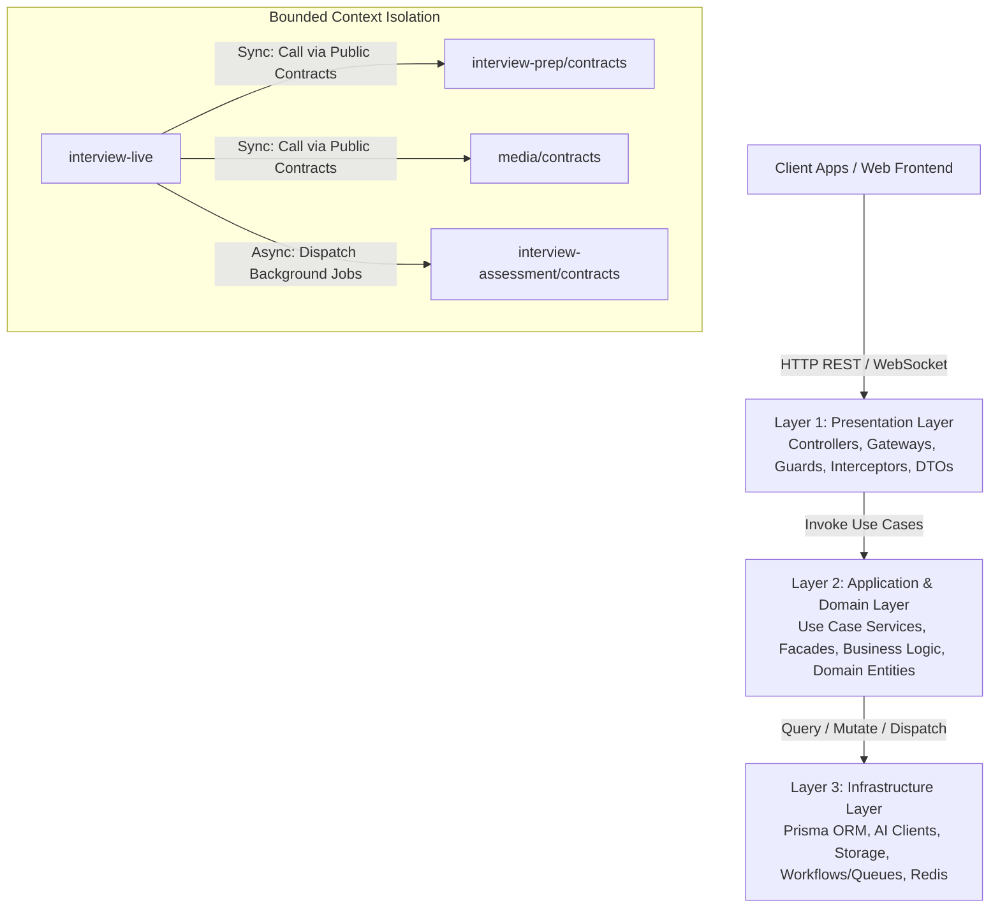
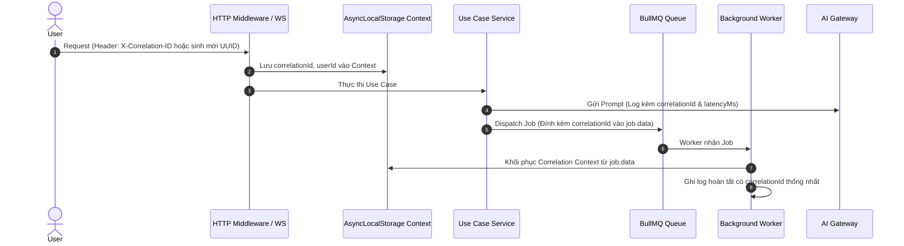
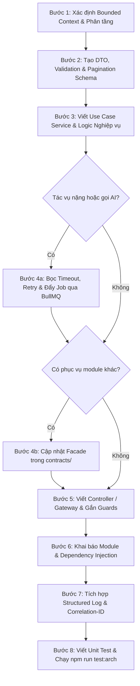

# Backend Engineering Conventions & Architecture Guidelines
> **InterviewCoach Backend (`@server`)** — Bộ quy chuẩn kỹ thuật, kiến trúc phân lớp, thiết kế API, nghiệp vụ, dữ liệu, AI Resiliency, Observability và kiểm thử chuẩn Enterprise cho NestJS.

---

## Mục lục (Table of Contents)
1. [Tổng quan Kiến trúc & Triết lý Thiết kế](#1-tổng-quan-kiến-trúc--triết-lý-thiết-kế)
   - [1.1. Ba Tầng Kiến trúc (3-Layer Clean Architecture)](#11-ba-tầng-kiến-trúc-3-layer-architecture)
   - [1.2. Các Nguyên lý Thiết kế Cốt lõi (SOLID & DDD)](#12-các-nguyên-lý-thiết-kế-cốt-lõi-solid--architectural-principles)
   - [1.3. Mô hình Tiến trình & Khả năng Mở rộng (Process Roles & Scalability)](#13-mô-hình-tiến-trình--khả-năng-mở-rộng-quy-mô-process-roles--scalability)
2. [Cấu trúc Thư mục & Quy ước Đặt tên](#2-cấu-trúc-thư-mục--quy-ước-đặt-tên)
   - [2.1. Cấu trúc Module Bounded Context chuẩn](#21-cấu-trúc-module-bounded-context-chuẩn)
   - [2.2. Vai trò của Thư mục `contracts/` và Facade Pattern](#22-vai-trò-của-thư-mục-contracts-và-facade-pattern)
   - [2.3. Quy ước Đặt tên (Naming Conventions)](#23-quy-ước-đặt-tên-naming-conventions)
3. [Quy chuẩn Tầng Presentation (API, WebSocket & Idempotency)](#3-quy-chuẩn-tầng-presentation-api-websocket--idempotency)
   - [3.1. Thiết kế RESTful API Chuẩn mực](#31-thiết-kế-restful-api-chuẩn-mực)
   - [3.2. DTO & Validation với `class-validator`](#32-dto--validation-với-class-validator)
   - [3.3. Ràng buộc Cô lập Controller (Strict Presentation Isolation)](#33-ràng-buộc-cô-lập-controller-strict-presentation-isolation)
   - [3.4. Chuẩn hóa Response Serialization & Data Masking](#34-chuẩn-hóa-response-serialization--data-masking)
   - [3.5. Chuẩn hóa Phân trang & Lọc Dữ liệu (Pagination & Filtering Standards)](#35-chuẩn-hóa-phân-trang--lọc-dữ-liệu-pagination--filtering-standards)
   - [3.6. Chuẩn hóa Khóa Chống Trùng lặp (Idempotency & Double-Submit Prevention)](#36-chuẩn-hóa-khóa-chống-trùng-lặp-idempotency--double-submit-prevention)
   - [3.7. Quy chuẩn WebSocket / Real-Time Gateway (Real-Time Communication)](#37-quy-chuẩn-websocket--real-time-gateway-real-time-communication)
4. [Quy chuẩn Tầng Nghiệp vụ (Business Logic & Concurrency Control)](#4-quy-chuẩn-tầng-nghiệp-vụ-business-logic--concurrency-control)
   - [4.1. Thiết kế Service theo Use Case (Single Responsibility)](#41-thiết-kế-service-theo-use-case-single-responsibility)
   - [4.2. Giao tiếp Xuyên Module (Cross-Module Communication via Facade)](#42-giao-tiếp-xuyên-module-cross-module-communication-via-facade)
   - [4.3. Phân tách Giao tiếp Đồng bộ (Facade) vs Bất đồng bộ (Workflows / Events)](#43-phân-tách-giao-tiếp-đồng-bộ-facade-vs-bất-đồng-bộ-workflows--events)
   - [4.4. Ranh giới Giao dịch Dữ liệu (Transaction Boundaries across Modules)](#44-ranh-giới-giao-dịch-dữ-liệu-transaction-boundaries-across-modules)
   - [4.5. Chuẩn hóa Quản lý Ngoại lệ (Standardized Exception Handling)](#45-chuẩn-hóa-quản-lý-ngoại-lệ-exception-handling)
   - [4.6. Quản trị Đồng thời & Tránh Race Condition (Concurrency & Distributed Locking)](#46-quản-trị-đồng-thời--tránh-race-condition-concurrency--distributed-locking)
5. [Quy chuẩn Tầng Dữ liệu & Persistence (Prisma & Migrations)](#5-quy-chuẩn-tầng-dữ-liệu--persistence-prisma--migrations)
   - [5.1. Quản lý Giao dịch (Interactive Transactions: `prisma.$transaction`)](#51-quản-lý-giao-dịch-interactive-transactions-prismatransaction)
   - [5.2. Bảo mật Dữ liệu & Tối ưu Hiệu năng Truy vấn](#52-bảo-mật-dữ-liệu--tối-ưu-hiệu-năng-truy-vấn)
   - [5.3. Quy chuẩn Quản trị Schema & Migration An toàn (Zero-Downtime Database Migration)](#53-quy-chuẩn-quản-trị-schema--migration-an-toàn-zero-downtime-database-migration)
6. [Quy chuẩn Tích hợp AI / LLM & Background Workflows](#6-quy-chuẩn-tích-hợp-ai--llm--background-workflows)
   - [6.1. Đóng gói Dịch vụ AI (AI Gateway Isolation)](#61-đóng-gói-dịch-vụ-ai-ai-gateway-isolation)
   - [6.2. Structured Output & Validation Schema (Zod / JSON Schema)](#62-structured-output--validation-schema)
   - [6.3. Xử lý Tác vụ Nặng qua Background Jobs (`WorkflowService` / BullMQ)](#63-xử-lý-tác-vụ-nặng-qua-background-jobs-workflowservice--queues)
   - [6.4. Khả năng Chống chịu & Đo lường AI (AI Resilience, Telemetry & Fallback)](#64-khả-năng-chống-chịu--đo-lường-ai-ai-resilience-telemetry--fallback)
7. [Quy chuẩn Bảo mật, Quản trị Cấu hình & Quan sát (Observability)](#7-quy-chuẩn-bảo-mật-quản-trị-cấu-hình--quan-sát-observability)
   - [7.1. Quản trị Biến Môi trường qua `ConfigService`](#71-quản-trị-biến-môi-trường-qua-configservice)
   - [7.2. Xác thực và Phân quyền Sở hữu Dữ liệu (Authorization & Ownership)](#72-xác-thực-và-phân-quyền-sở-hữu-dữ-liệu-authorization--ownership)
   - [7.3. Quy chuẩn Structured Logging & Distributed Tracing (Correlation-ID Propagation)](#73-quy-chuẩn-structured-logging--distributed-tracing-correlation-id-propagation)
8. [Quy chuẩn Kiểm thử & Đảm bảo Chất lượng (Testing & QA)](#8-quy-chuẩn-kiểm-thử--đảm-bảo-chất-lượng-testing--qa)
   - [8.1. Quy chuẩn Unit Test (`*.spec.ts`)](#81-quy-chuẩn-unit-test-spects)
   - [8.2. Kiểm thử Ranh giới Kiến trúc Tự động (`architecture.spec.ts`)](#82-kiểm-thử-ranh-giới-kiến-trúc-tự-động-architecturespects)
   - [8.3. Bộ lệnh Kiểm tra Bắt buộc trước khi Commit](#83-bộ-lệnh-kiểm-tra-bắt-buộc-trước-khi-commit)
   - [8.4. Phân tầng Kiểm thử (Testing Taxonomy: Unit vs Integration vs E2E)](#84-phân-tầng-kiểm-thử-testing-taxonomy-unit-vs-integration-vs-e2e)
9. [Checklist & Quy trình Chuẩn 8 Bước Thêm Tính năng Mới](#9-checklist--quy-trình-chuẩn-8-bước-thêm-tính-năng-mới)

---

## 1. Tổng quan Kiến trúc & Triết lý Thiết kế

Backend của InterviewCoach được xây dựng theo mô hình **Modular Monolith** kết hợp nguyên lý **Bounded Contexts (Domain-Driven Design - DDD)** và kiến trúc phân lớp sạch **3-Layer Clean Architecture**:



### 1.1. Ba Tầng Kiến trúc (3-Layer Architecture)
- **Tầng 1 - Presentation Layer (`controllers`, `gateways`, `dto`, `guards`, `interceptors`):** Tiếp nhận HTTP Request / WebSocket, validate schema dữ liệu đầu vào qua DTO, kiểm tra quyền truy cập (Auth Guards), quản lý WebSocket handshake/events, và serialize response trả về. **Tuyệt đối không chứa logic nghiệp vụ hay truy vấn database.**
- **Tầng 2 - Application & Domain Layer (`services`, `use-cases`, `contracts`):** Trung tâm xử lý logic nghiệp vụ, điều phối dữ liệu (orchestration), tính toán, quản lý concurrency và đảm bảo tính toàn vẹn của domain.
- **Tầng 3 - Infrastructure Layer (`@infra/*`, `prisma`, `ai`, `storage`, `workflow`, `redis`):** Giao tiếp với các tài nguyên bên ngoài: Cơ sở dữ liệu PostgreSQL (qua Prisma), Object Storage (S3/Supabase), AI Services (OpenAI/Gemini/Whisper), Message Queue (BullMQ/Redis).

### 1.2. Các Nguyên lý Thiết kế Cốt lõi (SOLID & Architectural Principles)
- **Single Responsibility Principle (SRP):** Mỗi class, service chỉ chịu trách nhiệm cho đúng một use-case (ví dụ: `CreateInterviewSession`, `TranscribeAnswerAudio`) thay vì các "God Services" dồn toàn bộ CRUD.
- **Dependency Inversion & Explicit Boundaries (DIP):** Presentation phụ thuộc vào Application; Application giao tiếp với Vendor SDKs/AI thông qua các Interface/Gateway tại `@infra/ai`. Mã nguồn tầng Core không bao giờ phụ thuộc ngược vào Business Modules.
- **High Cohesion & Loose Coupling:**
  - **High Cohesion (Độ gắn kết cao):** Toàn bộ logic, DTO, use cases thuộc cùng một bài toán nghiệp vụ nằm trọn trong 1 Bounded Context (ví dụ: `interview-prep`, `media`).
  - **Loose Coupling (Độ phụ thuộc lỏng):** Các context chỉ giao tiếp với nhau qua **Public Contracts (Facade)** hoặc **Background Workflows/Events**. Không can thiệp cấu trúc nội bộ của nhau.
- **Single Source of Truth (SSOT):** Định nghĩa hằng số, enum lỗi, kiểu dữ liệu chung tại `@core/` hoặc `@infra/` và tái sử dụng, không khai báo lặp lại ở nhiều nơi.
- **YAGNI & KISS (Pragmatic Clean Architecture):** Tối giản các tầng wrapper trung gian không cần thiết (cho phép Use Case gọi Prisma trực tiếp, không bắt buộc viết generic repository boilerplate trừ khi có nhu cầu đa nguồn dữ liệu).

### 1.3. Mô hình Tiến trình & Khả năng Mở rộng Quy mô (Process Roles & Scalability)
Hệ thống hỗ trợ chạy ở cả dạng nguyên khối duy nhất hoặc tách biệt thành các tiến trình độc lập phục vụ scale theo tải (tuân thủ **Twelve-Factor App**):
- `start:api` (`--role=api`): Chuyên phục vụ HTTP REST / WebSocket, không khởi chạy queue workers ngốn CPU.
- `start:worker` (`--role=worker`): Chuyên tiêu thụ các hàng đợi BullMQ (STT, LLM Assessment, Report Generation), có thể scale horizontal nhiều node worker độc lập.
- `start:all` (`--role=all`): Chạy cả API và Worker trong cùng 1 process (tối ưu cho môi trường Dev hoặc Server tài nguyên nhỏ).

---

## 2. Cấu trúc Thư mục & Quy ước Đặt tên

### 2.1. Cấu trúc Module Bounded Context chuẩn
Mỗi module lớn trong `server/src/modules/` được tổ chức theo Feature/Sub-domain:

```text
src/modules/<bounded-context>/
├── <sub-feature>/
│   ├── <sub-feature>.controller.ts       # Controller của feature
│   ├── <sub-feature>.controller.spec.ts  # Test của controller
│   ├── <use-case-name>.service.ts        # Use Case Service xử lý nghiệp vụ
│   ├── <use-case-name>.service.spec.ts   # Unit test cho service
│   ├── dto/
│   │   ├── create-<feature>.dto.ts       # DTO validate request đầu vào
│   │   ├── pagination-query.dto.ts       # DTO query phân trang / lọc
│   │   └── <feature>-response.dto.ts     # DTO định dạng kết quả trả về
│   └── <sub-feature>.module.ts           # NestJS Module con (nếu có)
│
├── gateways/                             # (Bắt buộc nếu module có Realtime WebSocket)
│   ├── <feature>.gateway.ts              # WebSocket Gateway
│   └── <feature>.gateway.spec.ts         # Unit test cho Gateway
│
├── contracts/                            # (Bắt buộc nếu module cung cấp API cho module khác)
│   ├── <context>-facade.service.ts       # Facade tập trung export public methods
│   ├── <context>-facade.service.spec.ts  # Unit test cho Facade
│   └── index.ts                          # Re-export Facade và Public Types
│
└── <bounded-context>.module.ts           # Root module khai báo DI cho context
```

### 2.2. Vai trò của Thư mục `contracts/` và Facade Pattern
- **Provider Modules** (`media`, `interview-prep`, `interview-assessment`): Bắt buộc có thư mục `contracts/` xuất khẩu một `XxxFacade` duy nhất.
- **Consumer Modules** (`interview-live`): Import trực tiếp facade thông qua alias `@modules/<context>/contracts` (ví dụ: `import { AssessmentFacade } from '@modules/interview-assessment/contracts';`).
- **Nghiêm cấm:** Không import trực tiếp file nội bộ của module khác (ví dụ: cấm `import ... from '../interview-prep/question-bank/question-bank.service'`).

### 2.3. Quy ước Đặt tên (Naming Conventions)

| Đối tượng | Quy ước | Ví dụ |
| :--- | :--- | :--- |
| **File / Directory** | `kebab-case.suffix.ts` | `create-interview-session.service.ts`, `session-response.dto.ts` |
| **Class** | `PascalCase` | `CreateInterviewSession`, `SessionResponseDto`, `AssessmentFacade` |
| **Method / Function** | `camelCase` (động từ đứng trước) | `uploadInterviewAudio()`, `calculateVoiceMetrics()`, `getReport()` |
| **Variable / Property**| `camelCase` | `sessionId`, `questionList`, `canAccessHistory` |
| **Interface / Type** | `PascalCase` (không prefix `I`) | `VoiceMetrics`, `AudioUploadResult`, `StoredAudioFile` |
| **Enum / Error Code** | `UPPER_SNAKE_CASE` | `ErrorCode.SESSION_NOT_FOUND`, `SessionStatus.COMPLETED` |
| **DTO Class** | `PascalCase` + Suffix `Dto` | `CreateSessionDto`, `AnswerIntakeDto`, `PaginationQueryDto` |
| **Gateway Class** | `PascalCase` + Suffix `Gateway`| `InterviewLiveGateway`, `TranscriptionGateway` |

---

## 3. Quy chuẩn Tầng Presentation (API, WebSocket & Idempotency)

### 3.1. Thiết kế RESTful API Chuẩn mực
- **Resource Nouns & Kebab-Case URLs:** Sử dụng danh từ số nhiều ở dạng `kebab-case`.
  - ✅ `/api/interview-sessions`
  - ✅ `/api/interview-sessions/:id/turns`
  - ❌ `/api/createSession`, `/api/interview_session/get-all`
- **HTTP Methods đúng mục đích:**
  - `GET`: Lấy dữ liệu (Idempotent, không làm thay đổi trạng thái).
  - `POST`: Tạo mới tài nguyên hoặc trigger một hành động xử lý (Action).
  - `PATCH`: Cập nhật một phần tài nguyên.
  - `DELETE`: Xóa tài nguyên (Soft delete hoặc Hard delete).
- **HTTP Status Codes:**
  - `200 OK`: Trả về dữ liệu thành công cho GET, PATCH, hoặc POST xử lý tức thời.
  - `201 Created`: Tạo mới tài nguyên thành công.
  - `204 No Content`: Xử lý thành công không cần nội dung trả về (thường dùng cho DELETE).
  - `400 Bad Request`: Lỗi validation DTO hoặc input không hợp lệ.
  - `401 Unauthorized`: Chưa đăng nhập / token hết hạn.
  - `403 Forbidden`: Không có quyền truy cập vào tài nguyên của user khác.
  - `404 Not Found`: Không tìm thấy tài nguyên.
  - `409 Conflict`: Xung đột tài nguyên / Race Condition / Vi phạm version lock.
  - `429 Too Many Requests`: Vượt ngưỡng Rate Limit.

### 3.2. DTO & Validation với `class-validator`
Mọi request body và query params đều phải được đóng gói trong DTO và kiểm tra chặt chẽ:

```typescript
// ✅ GOOD: DTO validation rõ ràng, có message và kiểu dữ liệu
import { IsNotEmpty, IsString, IsUUID, IsEnum, IsOptional } from 'class-validator';
import { SessionType } from '@prisma/client';

export class CreateSessionDto {
  @IsNotEmpty({ message: 'Target role is required' })
  @IsString()
  targetRole: string;

  @IsEnum(SessionType, { message: 'Invalid session type' })
  sessionType: SessionType;

  @IsOptional()
  @IsUUID('4', { message: 'Invalid question bank ID' })
  questionBankId?: string;
}
```

### 3.3. Ràng buộc Cô lập Controller (Strict Presentation Isolation)
> [!CAUTION]
> **Controller CẤM TUYỆT ĐỐI:**
> 1. Không inject `PrismaService` hoặc gọi trực tiếp Database.
> 2. Không inject BullMQ Queue, `WorkflowService`, hay trực tiếp nạp background jobs.
> 3. Không import SDK bên thứ ba (`openai`, `@supabase/supabase-js`, `axios`).

```typescript
// ❌ BAD: Controller chứa nghiệp vụ, gọi Prisma và throw lỗi tự do
@Controller('interview-sessions')
export class BadSessionController {
  constructor(private readonly prisma: PrismaService) {}

  @Post()
  async create(@Body() body: any) {
    if (!body.targetRole) throw new BadRequestException('Missing role');
    return this.prisma.interviewSession.create({ data: body });
  }
}

// ✅ GOOD: Controller mỏng, inject Use Case Service, kiểm tra Auth Guard
@Controller('interview-sessions')
@UseGuards(JwtAuthGuard)
export class SessionController {
  constructor(private readonly createSessionService: CreateInterviewSession) {}

  @Post()
  @HttpCode(HttpStatus.CREATED)
  async create(
    @CurrentUser() user: AuthenticatedUser,
    @Body() dto: CreateSessionDto,
  ): Promise<SessionResponseDto> {
    return this.createSessionService.execute(user.id, dto);
  }
}
```

### 3.4. Chuẩn hóa Response Serialization & Data Masking
Không trả trực tiếp raw Prisma Entity về client để tránh rò rỉ metadata nội bộ (`passwordHash`, `rawAiMetadata`). Luôn map sang Response DTO:

```typescript
// ✅ GOOD: Sử dụng mapper tĩnh hoặc plainToInstance rõ ràng
export class SessionResponseDto {
  id: string;
  targetRole: string;
  status: string;
  createdAt: Date;

  static fromEntity(entity: any): SessionResponseDto {
    const dto = new SessionResponseDto();
    dto.id = entity.id;
    dto.targetRole = entity.targetRole;
    dto.status = entity.status;
    dto.createdAt = entity.createdAt;
    return dto;
  }
}
```

### 3.5. Chuẩn hóa Phân trang & Lọc Dữ liệu (Pagination & Filtering Standards)
Tuân theo chuẩn **Microsoft REST API Guidelines**:

#### a. Offset-based Pagination (Dành cho bảng kích thước trung bình/nhỏ)
```typescript
import { Type } from 'class-transformer';
import { IsInt, IsOptional, Max, Min, IsIn } from 'class-validator';

export class PaginationQueryDto {
  @IsOptional()
  @Type(() => Number)
  @IsInt()
  @Min(1)
  page: number = 1;

  @IsOptional()
  @Type(() => Number)
  @IsInt()
  @Min(1)
  @Max(100) // Bảo vệ server chống tràn bộ nhớ
  limit: number = 20;

  @IsOptional()
  @IsIn(['createdAt', 'updatedAt', 'title'])
  sortBy?: string = 'createdAt';

  @IsOptional()
  @IsIn(['ASC', 'DESC', 'asc', 'desc'])
  sortOrder?: 'ASC' | 'DESC' = 'DESC';
}

export class PaginatedResponseDto<T> {
  data: T[];
  meta: {
    page: number;
    limit: number;
    totalItems: number;
    totalPages: number;
    hasNextPage: boolean;
    hasPrevPage: boolean;
  };
}
```

#### b. Cursor-based Pagination (Bắt buộc cho danh sách lớn / Real-time Turns)
Khi số lượng bản ghi lớn (> 100,000 dòng như Chat Turns, Event Logs), cấm dùng `skip/offset`. Bắt buộc dùng `cursor` (ID hoặc timestamp) kết hợp `take`.

### 3.6. Chuẩn hóa Khóa Chống Trùng lặp (Idempotency & Double-Submit Prevention)
Các mutation quan trọng hoặc tốn chi phí (Tạo Session phỏng vấn, Nộp bài thi, Trừ credit) phải hỗ trợ header `Idempotency-Key`:
1. Client gửi UUIDv4 qua header `Idempotency-Key`.
2. Interceptor kiểm tra key trong Redis:
   - Nếu key đã hoàn thành: Trả về trực tiếp response cache có mã `200 OK` / `201 Created`.
   - Nếu key đang được xử lý: Ném `InterviewAIException(ErrorCode.REQUEST_IN_PROGRESS, HttpStatus.CONFLICT)`.
   - Nếu key chưa tồn tại: Khóa key với TTL 60s, cho request thực thi và lưu cache kết quả với TTL 24h.

### 3.7. Quy chuẩn WebSocket / Real-Time Gateway (Real-Time Communication)
Áp dụng cho các tính năng phỏng vấn tương tác trực tiếp (Live STT, Voice Streaming):
- **Vị trí file:** `src/modules/<context>/gateways/<feature>.gateway.ts`.
- **Handshake Authentication:** Bắt buộc xác thực token JWT trong `handleConnection(client: Socket)`:
  ```typescript
  @WebSocketGateway({ namespace: '/interview-live', cors: { origin: '*' } })
  export class InterviewLiveGateway implements OnGatewayConnection, OnGatewayDisconnect {
    async handleConnection(client: Socket) {
      try {
        const token = client.handshake.auth?.token || client.handshake.headers?.authorization;
        const user = await this.authService.verifyWsToken(token);
        client.data.user = user;
      } catch (err) {
        client.emit('error', { code: 'UNAUTHORIZED', message: 'Invalid token' });
        client.disconnect(true);
      }
    }
  }
  ```
- **Envelope định dạng Event chuẩn:**
  ```typescript
  export interface WsEventEnvelope<T = any> {
    event: string;
    data: T;
    timestamp: number;
    correlationId?: string;
  }
  ```
- **Lifecycle & Dọn dẹp kết nối:** Khi client disconnect bất ngờ (`handleDisconnect`), gateway phải tự động giải phóng Redis audio buffer và cập nhật trạng thái session sau 30 giây timeout nếu không reconnect.

---

## 4. Quy chuẩn Tầng Nghiệp vụ (Business Logic & Concurrency Control)

### 4.1. Thiết kế Service theo Use Case (Single Responsibility)
Thay vì tạo các file `service` khổng lồ hàng nghìn dòng chứa tất cả phương thức CRUD, hãy tách thành các Use Case Service chuyên biệt (ví dụ: `CreateInterviewSession`, `GenerateSessionQuestions`, `TranscribeAnswerAudio`).

### 4.2. Giao tiếp Xuyên Module (Cross-Module Communication via Facade)
Khi module A cần dữ liệu hoặc kích hoạt tính năng đồng bộ của module B, chỉ inject và gọi thông qua Facade của module B:

```typescript
// ✅ GOOD: Gọi xuyên module qua Facade chuẩn hóa
@Injectable()
export class CreateInterviewSession {
  constructor(
    private readonly prisma: PrismaService,
    private readonly assessmentFacade: AssessmentFacade, // Gọi qua Facade
    private readonly prepFacade: PrepFacade,             // Gọi qua Facade
  ) {}

  async execute(userId: string, dto: CreateSessionDto) {
    const rubricVersionId = await this.assessmentFacade.ensureActiveRubricVersion(dto.contextPack);
    // Xử lý tiếp nghiệp vụ...
  }
}
```

### 4.3. Phân tách Giao tiếp Đồng bộ (Facade) vs Bất đồng bộ (Workflows / Events)
- **Synchronous (Facade):** Dùng khi cần đọc dữ liệu tức thì (Query) hoặc thực hiện các validation/khởi tạo bắt buộc phải có kết quả ngay trước khi tiến hành bước tiếp theo.
- **Asynchronous (Background Jobs / WorkflowService):** Dùng khi kích hoạt các side-effects hoặc quy trình tốn thời gian (ví dụ: sau khi session hoàn thành ➔ dispatch job sinh báo cáo đánh giá AI). Module gọi chỉ gửi lệnh dispatch và không bị block.

### 4.4. Ranh giới Giao dịch Dữ liệu (Transaction Boundaries across Modules)
> [!IMPORTANT]
> **Không leak Prisma Transaction Client (`tx`) xuyên ranh giới Facade / Bounded Context.**
> Mỗi Bounded Context sở hữu và quản lý tính toàn vẹn dữ liệu của riêng mình. Không truyền đối tượng `tx` từ module này sang module khác để ép transaction phân tán (2PC). Khi cần phối hợp giữa các context, áp dụng mô hình **Eventual Consistency** hoặc **Saga Workflow**.

### 4.5. Chuẩn hóa Quản lý Ngoại lệ (Exception Handling)
Không throw `new HttpException()`, `new BadRequestException('...')` tùy tiện với chuỗi ký tự tự do. Sử dụng lớp ngoại lệ chuẩn của hệ thống [`InterviewAIException`](file:///c:/Users/An/Documents/GR1/InterviewCoach/server/src/core/common/exceptions/interview-ai.exception.ts) kết hợp cùng [`ErrorCode`](file:///c:/Users/An/Documents/GR1/InterviewCoach/server/src/core/common/exceptions/error-code.enum.ts):

```typescript
// ❌ BAD: Throw error với string tự do, không kiểm soát mã lỗi
throw new NotFoundException('Cannot find this interview session in db');

// ✅ GOOD: Sử dụng ErrorCode enum và domain exception chuẩn
throw new InterviewAIException(
  ErrorCode.SESSION_NOT_FOUND,
  HttpStatus.NOT_FOUND,
  `Interview session ${sessionId} does not exist or has been deleted`,
);
```

### 4.6. Quản trị Đồng thời & Tránh Race Condition (Concurrency & Distributed Locking)

#### a. Optimistic Concurrency Control (OCC)
Với các entity dễ bị tranh chấp trạng thái (như `InterviewSession`, `UserWallet`), sử dụng trường `version: Int @default(0)` trong Prisma:
```typescript
const updated = await this.prisma.interviewSession.updateMany({
  where: {
    id: sessionId,
    version: currentVersion,
    status: SessionStatus.IN_PROGRESS,
  },
  data: {
    status: SessionStatus.COMPLETED,
    version: { increment: 1 },
  },
});

if (updated.count === 0) {
  throw new InterviewAIException(
    ErrorCode.CONCURRENT_MODIFICATION,
    HttpStatus.CONFLICT,
    'Session was modified by another process. Please retry.',
  );
}
```

#### b. Distributed Locking (Redis Lock)
Đối với các worker đa tiến trình cùng tranh chấp một tác vụ tiêu tốn tài nguyên (ví dụ: Ngăn 2 worker cùng lúc đánh giá 1 session):
```typescript
const lockKey = `lock:session-eval:${sessionId}`;
const acquired = await this.redisService.acquireLock(lockKey, 60); // 60s TTL
if (!acquired) {
  this.logger.warn(`Evaluation already in progress for session ${sessionId}`);
  return;
}
try {
  await this.runHeavyEvaluation(sessionId);
} finally {
  await this.redisService.releaseLock(lockKey);
}
```

---

## 5. Quy chuẩn Tầng Dữ liệu & Persistence (Prisma & Migrations)

### 5.1. Quản lý Giao dịch (Interactive Transactions: `prisma.$transaction`)
Khi một nghiệp vụ ghi dữ liệu vào từ 2 bảng trở lên trong cùng 1 Bounded Context, bắt buộc phải bọc trong transaction:

```typescript
// ✅ GOOD: Sử dụng $transaction đảm bảo tính toàn vẹn khi tạo session và nạp câu hỏi
await this.prisma.$transaction(async (tx) => {
  const session = await tx.interviewSession.create({
    data: {
      userId,
      targetRole: dto.targetRole,
      status: SessionStatus.IN_PROGRESS,
    },
  });

  await tx.sessionQuestion.createMany({
    data: questions.map((q, idx) => ({
      sessionId: session.id,
      questionText: q.text,
      orderIndex: idx + 1,
    })),
  });

  return session;
});
```

### 5.2. Bảo mật Dữ liệu & Tối ưu Hiệu năng Truy vấn
- **Lọc trường nhạy cảm:** Không bao giờ query dạng `select *` rồi trả về client. Luôn chỉ định `select` hoặc `omit` các trường như `passwordHash`, `refreshToken`, `rawAiMetadata`.
- **Phân trang bắt buộc:** Các endpoint lấy danh sách lịch sử (`sessions`, `reports`, `questions`) bắt buộc nhận query `limit`/`take` và `page`/`skip` để tránh tràn bộ nhớ.
- **Index cơ sở dữ liệu:** Mọi trường dùng trong mệnh đề `where`, `orderBy`, hoặc Foreign Key quan hệ giữa các bảng bắt buộc phải có `@index` trong file `schema.prisma`.

### 5.3. Quy chuẩn Quản trị Schema & Migration An toàn (Zero-Downtime Database Migration)
> [!CAUTION]
> **Quy tắc an toàn dữ liệu trên Production:**
> - Môi trường Dev/Local: Cho phép dùng `prisma db push` để dựng nhanh prototype.
> - Môi trường Staging & Production: **CẤM TUYỆT ĐỐI** dùng `prisma db push --accept-data-loss`. Bắt buộc chạy `prisma migrate deploy` qua pipeline CI/CD.

#### Áp dụng Chiến lược Expand & Contract (Non-destructive migrations):
1. **Bước 1 (Expand):** Thêm trường mới ở dạng `Optional` (`Nullable`) hoặc có `Default Value`. Không xóa/đổi tên trường cũ ngay lập tức.
2. **Bước 2 (Deploy Code):** Deploy code backend mới đọc dữ liệu từ cả 2 cột (fallback) và ghi đồng thời vào cột mới.
3. **Bước 3 (Backfill Data):** Chạy background migration script chuyển đổi dữ liệu từ cột cũ sang cột mới.
4. **Bước 4 (Contract):** Khi hệ thống ổn định, tạo migration mới để xóa cột cũ.

---

## 6. Quy chuẩn Tích hợp AI / LLM & Background Workflows

### 6.1. Đóng gói Dịch vụ AI (AI Gateway Isolation)
- Toàn bộ lời gọi tới LLM (OpenAI, Gemini, Whisper) phải được đóng gói thông qua các client trong `@infra/ai/` (ví dụ: `OpenAiChatClient`, `GeminiChatClient`, `WhisperClient`).
- **Cấm:** Không khởi tạo `new OpenAI({ apiKey: ... })` rải rác bên trong các service nghiệp vụ.

### 6.2. Structured Output & Validation Schema
Mọi câu trả lời từ AI (nhận xét câu trả lời, chấm điểm, sinh câu hỏi) phải được định nghĩa bằng Zod Schema / JSON Schema và validate trước khi lưu vào database:

```typescript
// ✅ GOOD: Định nghĩa schema Zod và parse kết quả AI có try/catch fallback
const FeedbackSchema = z.object({
  score: z.number().min(0).max(100),
  strengths: z.array(z.string()),
  improvements: z.array(z.string()),
});

export type TurnFeedback = z.infer<typeof FeedbackSchema>;
```

### 6.3. Xử lý Tác vụ Nặng qua Background Jobs (`WorkflowService` / Queues)
Các tác vụ tiêu tốn tài nguyên và thời gian thực thi dài (> 3 giây) như:
- Chuyển đổi giọng nói thành văn bản (Speech-to-Text).
- Sinh báo cáo đánh giá tổng thể buổi phỏng vấn (Multi-turn Evaluation).
- Sinh bộ câu hỏi phỏng vấn theo JD.

**Bắt buộc** phải được chuyển giao cho `@infra/workflow/` hoặc BullMQ Queue xử lý bất đồng bộ, cập nhật trạng thái theo dạng `PENDING` ➔ `PROCESSING` ➔ `READY` / `FAILED`.

### 6.4. Khả năng Chống chịu & Đo lường AI (AI Resilience, Telemetry & Fallback)

#### a. Hard Timeout & AbortController
Không để lời gọi AI treo vô tận. Bắt buộc gắn timeout cứng:
- LLM Single-turn Chat: Tối đa `30,000ms` (30 giây).
- Whisper Audio Transcription: Tối đa `60,000ms` (60 giây).
- Deep Assessment Workflow: Tối đa `90,000ms` (90 giây).

#### b. Exponential Backoff & Jitter Retry
Tự động retry tối đa 3 lần cho các lỗi mạng tạm thời hoặc Rate Limit (`429`, `503`):
```typescript
// Khoảng cách retry: 1s -> 2s -> 4s + random jitter
const delay = Math.pow(2, attempt) * 1000 + Math.random() * 500;
```

#### c. Telemetry & Cost/Token Tracking
Mọi lần gọi AI bắt buộc thu thập thông số đo lường:
```typescript
export interface AiExecutionMetrics {
  promptTokens: number;
  completionTokens: number;
  totalTokens: number;
  latencyMs: number;
  model: string;
  costEstimateUsd?: number;
}
```

#### d. Model Fallback
Khi model chính (Primary: `gpt-4o`) liên tục quá tải hoặc lỗi quota, AI Gateway phải có cơ chế chuyển giao tự động sang model thứ cấp (Secondary: `gemini-1.5-flash` hoặc `gpt-4o-mini`) để duy trì độ sẵn sàng 99.9%.

---

## 7. Quy chuẩn Bảo mật, Quản trị Cấu hình & Quan sát (Observability)

### 7.1. Quản trị Biến Môi trường qua `ConfigService`
- Cấm truy cập `process.env.VARIABLE_NAME` trực tiếp trong code business logic.
- Bắt buộc inject `ConfigService` đã được cấu hình validation schema tại `@core/config`.

### 7.2. Xác thực và Phân quyền Sở hữu Dữ liệu (Authorization & Ownership)
Mọi thao tác đọc/sửa/xóa tài nguyên cá nhân của người dùng phải xác thực quyền sở hữu:

```typescript
// ✅ GOOD: Luôn xác minh quyền sở hữu tài nguyên
const session = await this.prisma.interviewSession.findUnique({
  where: { id: sessionId },
});

if (!session) {
  throw new InterviewAIException(ErrorCode.SESSION_NOT_FOUND, HttpStatus.NOT_FOUND);
}

if (session.userId !== userId && userRole !== UserRole.ADMIN) {
  throw new InterviewAIException(
    ErrorCode.FORBIDDEN_RESOURCE,
    HttpStatus.FORBIDDEN,
    'You do not have permission to access this interview session',
  );
}
```

### 7.3. Quy chuẩn Structured Logging & Distributed Tracing (Correlation-ID Propagation)
- **Cấm hoàn toàn:** `console.log`, `console.error` trong toàn bộ mã nguồn `server/src/`.
- **Cơ chế Lan truyền `Correlation-ID`:**



- **Format Structured JSON Log chuẩn:**
```json
{
  "timestamp": "2026-08-31T01:15:00.000Z",
  "level": "INFO",
  "context": "CreateInterviewSession",
  "correlationId": "c8b4f8d2-5a21-4c12-9c12-ef389d41bc29",
  "userId": "usr_991823",
  "message": "Interview session created successfully",
  "durationMs": 142
}
```

---

## 8. Quy chuẩn Kiểm thử & Đảm bảo Chất lượng (Testing & QA)

### 8.1. Quy chuẩn Unit Test (`*.spec.ts`)
- Mọi Use Case Service và Facade đều phải có file `*.spec.ts` tương ứng.
- **Chiến lược Mocking:**
  - Mock `PrismaService` bằng `DeepMocked<PrismaService>` hoặc mock các method `findUnique`, `create`, `$transaction`.
  - Mock các `Facade` khi test service phụ thuộc.
  - Bao phủ cả kịch bản thành công (**Happy Path**) và kịch bản lỗi biên (**Edge Cases / Error Codes**).

### 8.2. Kiểm thử Ranh giới Kiến trúc Tự động (`architecture.spec.ts`)
Dự án duy trì bộ test kiểm tra cấu trúc tự động tại [`src/core/architecture.spec.ts`](file:///c:/Users/An/Documents/GR1/InterviewCoach/server/src/core/architecture.spec.ts). Bộ test này tự động phát hiện và chặn:
1. Controller import trực tiếp Prisma, Queues hoặc Vendor SDKs.
2. Core Layer import ngược vào Business Modules.
3. Import xuyên Bounded Context không thông qua `contracts/` đã được cấp phép.

### 8.3. Bộ lệnh Kiểm tra Bắt buộc trước khi Commit
```bash
# 1. Chạy kiểm tra ranh giới kiến trúc
npm run test:arch

# 2. Chạy toàn bộ Unit Tests
npm test

# 3. Kiểm tra tính toàn vẹn TypeScript Build
npm run build
```

### 8.4. Phân tầng Kiểm thử (Testing Taxonomy: Unit vs Integration vs E2E)
- **Unit Tests (`src/**/*.spec.ts`):** Kiểm thử logic nghiệp vụ cô lập trong bộ nhớ, mock toàn bộ Database và Network IO. Thời gian thực thi < 5ms mỗi test case.
- **Integration Tests (`test/integration/**/*.spec.ts`):** Kiểm thử luồng tích hợp thật giữa Service với PostgreSQL Test Database (sử dụng transaction rollback sau mỗi test) và Redis.
- **E2E Tests (`test/e2e/**/*.spec.ts`):** Khởi chạy NestJS application đầy đủ qua `supertest`, kiểm tra toàn bộ luồng HTTP Request ➔ Guard ➔ Controller ➔ Use Case ➔ DB.

---

## 9. Checklist & Quy trình Chuẩn 8 Bước Thêm Tính năng Mới

Khi bắt đầu triển khai một tính năng mới trong backend, lập trình viên tuân thủ quy trình 8 bước sau:



- [ ] **Bước 1 (Context):** Xác định tính năng thuộc Bounded Context nào (`interview-live`, `interview-prep`, `interview-assessment`, `media`, v.v.).
- [ ] **Bước 2 (DTO):** Tạo file `create-<feature>.dto.ts`, `pagination-query.dto.ts` và `<feature>-response.dto.ts` với đầy đủ validator decorator và giới hạn `limit`.
- [ ] **Bước 3 (Service):** Tạo `<use-case>.service.ts`, inject `PrismaService` / `Facade` cần thiết, xử lý nghiệp vụ và ném `InterviewAIException` với `ErrorCode` chuẩn.
- [ ] **Bước 4 (Resilience / Facade):** 
  - Nếu có gọi AI/STT: Bắt buộc gắn `timeout`, parse qua `Zod schema`, thu thập `AiExecutionMetrics`.
  - Nếu tính năng này cần cung cấp cho module khác: Khai báo method tương ứng trong `contracts/<context>-facade.service.ts` và export qua `contracts/index.ts`.
- [ ] **Bước 5 (Controller / Gateway):** Tạo `<feature>.controller.ts` hoặc `<feature>.gateway.ts`, gắn `@UseGuards(JwtAuthGuard)`, `@CurrentUser()`, gọi Use Case Service và trả về response DTO (sử dụng Mapper/Serializer).
- [ ] **Bước 6 (Module):** Đăng ký Controller, Gateway và Service vào `*.module.ts` tương ứng.
- [ ] **Bước 7 (Observability):** Sử dụng `AppLogger`, đảm bảo log theo định dạng JSON và có `correlationId`.
- [ ] **Bước 8 (QA):** Viết unit test `<use-case>.service.spec.ts` và chạy `npm run test:arch` + `npm test` để kiểm chứng.
